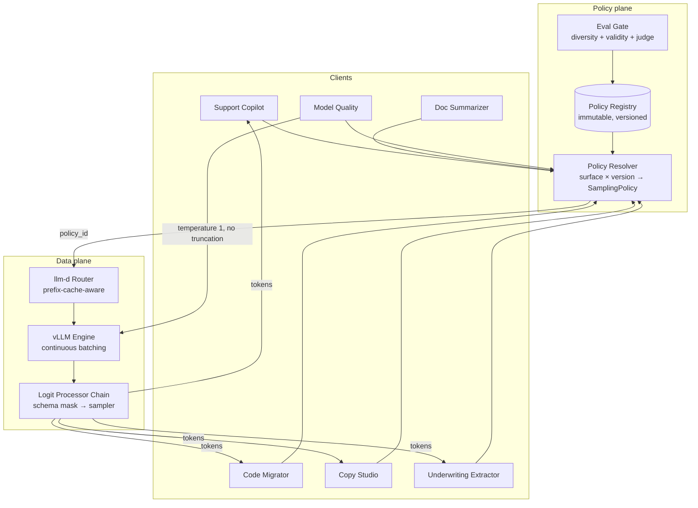

# Case Study: Sampling Policy for a Multi-Tenant Inference Platform

> **Topic:** `T01` · **Transcript coverage:** primary · **Difficulty:** L4
> **One line:** Whether to ship one decoding configuration for every product surface or to expose sampling as a per-request contract — and what to tell compliance when they ask you to guarantee that temperature 0 is reproducible.

## Table of Contents

- [1. The Scenario](#1-the-scenario)
- [2. Requirements](#2-requirements)
- [3. Architecture](#3-architecture)
- [4. Component Deep Dive](#4-component-deep-dive)
- [5. Decision Table](#5-decision-table)
- [6. Edge Cases & Exceptions](#6-edge-cases--exceptions)
- [7. Failure Modes & Mitigations](#7-failure-modes--mitigations)
- [8. Capacity & Cost Model](#8-capacity--cost-model)
- [9. Benchmarks & Measured Numbers](#9-benchmarks--measured-numbers)
- [10. Operational Runbook](#10-operational-runbook)
- [11. What Changes at 10x](#11-what-changes-at-10x)
- [12. Interview Walkthrough](#12-interview-walkthrough)

---

## 1. The Scenario

Halcyon AI runs a single shared inference estate — vLLM behind an llm-d router on a fixed GPU pool — for six internal product surfaces. Every surface calls the same base model. None of them wants the same decoding behaviour.

| Surface | Traffic shape | What it needs from decoding |
|---|---|---|
| Support Copilot | Interactive chat, tool calls as JSON | Fast, repeatable, rarely surprising |
| Code Migrator | Agentic, 20–60 min sessions, 40+ model calls per session | Deterministic enough to diff between runs; long outputs |
| Doc Summarizer | Batch, long inputs | Faithful compression, low invention |
| Copy Studio | Human-in-the-loop, 6 candidates per brief | Maximum diversity at acceptable fluency |
| Underwriting Extractor | Audited JSON, PII | Bit-stable under replay; schema-valid |
| Model Quality Dashboard | Offline, research | Must measure *the model*, not a truncated version of it |

Two organisational constraints dominate the design, and neither is technical.

**Research owns the model-quality number and insists on temperature 1.** Their position is the one the CMU course states directly: temperature 1 is "the only temperature that can see the true probability distribution… the only temperature where you can accurately sample from the joint distribution," and "unless we're sampling with a temperature of one we're not getting like the actual language model['s] model of language… We're getting something that's like a biased distribution that the model isn't actually generating" `[T]` — CMU lecture 2. Open-weight reasoning models follow the same convention: the lecturer notes "the OpenAI reasoning models enforce temperature of one, and you're not allowed to do other temperatures" `[T]`.

**Compliance owns the audit trail and believes temperature 0 is deterministic.** It is not. The same lecture: "You will not always get the same result" `[T]`, and the mechanism is floating-point addition order inside the GPU's reduction trees — "the very small floating point numbers depending on the order you add them will round differently," and because generation is autoregressive, "if the maximum vocabulary item changes just once in your like 1,000 token generated sequence, then it will change everything that happened after that" `[T]`.

The real design question is therefore not "which sampler." It is *where the sampling policy lives* — in the application code, in the model's `generation_config`, or in a platform-level policy service — and *what reproducibility guarantee the platform is allowed to make in writing*.

## 2. Requirements

### Functional

| Requirement | Priority | Notes |
|---|---|---|
| Per-request sampling parameters (`temperature`, `top_k`, `top_p`, `min_p`/`epsilon`, seed) | P0 | Product surfaces differ irreconcilably |
| Versioned, auditable policy per surface | P0 | Compliance replay |
| Sampling-aware eval gate before a policy change ships | P0 | The 98%→71% JSON regression class of failure |
| Structured-output masking composable with any sampler | P0 | See [T03](../01-case-studies/T03-constrained-generation.md) |
| Diversity metrics computed on every release candidate | P1 | Copy Studio's only quality proxy |
| Per-request policy switching at the serving layer | P2 | Flagged as "a really reasonable thing to do" in the lectures, but no published system does it `[T]` |

### Non-functional

| Requirement | Target | Rationale |
|---|---|---|
| Time to first token, interactive surfaces | P95 < 400 ms | Chat UX |
| Inter-token latency, interactive | P95 < 60 ms | Chat UX |
| Sampler overhead per step | < 2% of decode step | It runs on every token on every request |
| Reproducibility, `temperature=0` + fixed seed, single GPU, batch size 1 | ≥ 99% identical completions over 24 h | The strongest claim we can actually defend |
| Reproducibility, `temperature=0`, production batching, multi-GPU | **not offered** | See §6 |
| JSON validity, Extractor | ≥ 99.9% of responses | Downstream parser |
| Distinct-n (unique-token ratio) on Copy Studio first drafts | ≥ 0.55 | Diversity floor |
| Sampling-induced latency regression on Copy Studio (6 candidates) | ≤ 6x single-candidate cost | Budget cap |

### Constraints and non-goals

- **We are not training or fine-tuning.** Constraints that must hold for *every* output (schema validity, PII redaction) are enforced at inference time, not learned — the lecture's rule of thumb is that training the constraint in pays off only for broadly applicable constraints `[T]`.
- **We are not solving determinism across hardware or across versions.** Two different GPU models, two CUDA versions, or a quantized vs unquantized checkpoint will not agree. We document this rather than promise otherwise.
- **We do not expose raw logits to product teams.** Only a closed parameter set — otherwise the policy service cannot reason about cost.
- **We do not use beam search on any production surface** (justification in §5.2).
- **We do not attempt to make the model calibrated.** Post-training breaks calibration: "this is the model before RLHF. This is the model after RLHF" — post-training "mess[es] with this property of the distribution. So if you're looking at a model that is post-trained… you don't have really a lot of guarantee of calibration" `[T]`. Our surfaces consume ranked candidates, not calibrated confidence scores.

## 3. Architecture

Prose walkthrough:

1. **Policy Resolver** is a pure function from `(surface, model_id, policy_version)` to a `SamplingPolicy` record. It never reads request bodies. It is the only place sampling parameters are chosen; product code may pass a *policy name*, never raw `temperature`.
2. **Policy Registry** holds immutable policy versions. Every response records `policy_id`, so a replay is a request plus a policy version, not a request plus six floats that may have been changed.
3. **Logit Processor Chain** runs inside the engine, ordered: schema mask (T03) → repetition/penalty processors → truncation sampler → noise draw. Order matters and is discussed in §5.5.
4. **llm-d Router** places the request on a pod with the right prefix cache. The policy is orthogonal to placement, but a policy change alters average output length, which alters KV pressure, which changes router behaviour — the coupling noted in §8.
5. **Eval Gate** is the only writer to the registry. A policy change is a release.

## 4. Component Deep Dive

### 4.1 The sampler itself

The model is "just a conditional probability distribution" over the vocabulary at each step `[T]` (lecture 3, Amanda). Every sampling method in the course is a reshape of that distribution:

- **Ancestral sampling** draws from the model distribution directly and "is the property that we're recovering the model distribution exactly" `[T]`.
- **Temperature** is `p_i^(1/T) / Σ_j p_j^(1/T)`. At `T = 1` it is "a no-op because you get one over one, this is one, and then E and log cancel out"; as `T → ∞` all values go to 1 and you get a uniform distribution; as `T → 0` you get "a one-hot vector," with the stated caveat that exactly tied tokens yield a uniform distribution over the tied set `[T]` (lecture 2).
- **Top-k** keeps the `k` most probable tokens. The failure mode is distribution drift over time: in the lecture's worked example, after "the" the top six tokens hold only **68%** of the mass, while after "the car" the top six hold **99%** `[T]`.
- **Top-p / nucleus** specifies the mass instead: seed with the most probable token and "add on more and more tokens into your sample until you've hit that much probability mass," then renormalize `[T]`.
- **Epsilon sampling** cuts the tail at a probability floor. **Locally typical sampling** sorts the distribution *by closeness to the per-step entropy* and then truncates — "you're going to like resort your logs by closeness to H instead of by absolute value" `[T]`. Its consequence is worth internalising: it can "cut off things that are relatively high probability," and it produces *higher* perplexity output than ancestral sampling, which is the point.
- **ADA sampling** combines an epsilon threshold with a distance-from-entropy threshold and is "in practice not often terribly different from… either locally typical or epsilon sampling but it's a little bit faster to compute" `[T]`.
- **Mirostat** inverts the control: specify a target perplexity and use "a continuously updating update to try to generate tokens that you think will result in that final perplexity being close to that value" `[T]`.

**Why any truncation is needed at all** is the long tail. The lecture's argument: modern vocabularies are large — the slide was updated from "Llama has 32,000 vocabulary tokens" to "**Llama 3 has 128k vocabulary tokens**" — and "if every individual token that is sort of not in the reasonable 100 or 500 tokens to predict next has a tiny amount of probability, these small probabilities add up really really quickly." The visualization marks the point holding 50% of the mass, so "the tail from that point onwards is half of the probability mass" `[T]`.

### 4.2 The defaults problem

HuggingFace's fallbacks are `top_p = 0.95` and `top_k = 50`; the model's own `generation_config` usually overrides them — the lecturer read Llama's as `temperature = 0.6, top_p = 0.9` (the transcript renders it "6"; treat the digit as an ASR artifact) and Qwen 3 as setting both a top-p and a top-k with `do_sample: true` `[T]`. Her operational advice is the core of our policy service:

> "if you're specifying some generation parameters, it's a good idea to check what the defaults are, check what the model config says they are, and then override everything that you care about." `[T]`

and the reason those numbers exist at all: "those numbers in those generation configs did not come from [thin air]" — vendors "done some kind of exhaustive hyperparameter sweep" `[T]`. We therefore seed every new policy from the model card and then perturb, rather than starting from our own intuition.

### 4.3 Diversity measurement

Copy Studio cannot be evaluated by a single score. The lecture's toolkit: deterministic metrics are **diversity = ratio of unique words within one generation** (distinct-n) and **cross-generation diversity = bigram/word overlap between outputs**, plus length; and **LLM-as-judge** for fluency, with the exact prompt "rate the fluency and coherence of this text on a scale of zero to 10. Uh 10 equals perfect. Only respond with a number" `[T]`.

The measured result that shapes our policy: greedy decoded text "got a score of 5.3, which I think is not that bad," while diversity was low for greedy and rose with temperature — but "the fluency went down." The lecturer's summary: "this is a very common issue… as you sample more diverse things, the the quality goes down. And temperature sampling is particularly well known for this" `[T]` (lecture 2). We reproduce that trade-off explicitly as a Pareto curve per policy version rather than collapsing it to one number, because the forward pointer in the same lecture is that some methods are "Pareto optimal with respect to diversity and quality" — better on both axes than temperature.

Judge caveats are load-bearing in our eval design: "don't trust them blindly… Language models are very bad judges for a lot of things and they're particularly bad at things judging things where they themselves are not good at them," plus self-preference — "Claude will like really like Claude, GPT will really like GPT" `[T]`.

### 4.4 Determinism

Three compounding sources of nondeterminism, per lecture 2 `[T]`:

1. **Reduction order within the GPU.** Threads "all running at the same time," so a sum is done in completion order — "in reality none of the people serving things on GPUs does this [use ordered reduction]." Symptom: "you'll get it the same like five times, but then you'll get a different one."
2. **Mixture-of-experts routing.** "instead of having an argmax over just the token, you also have an argmax over the experts. So you have like many many more argmaxes."
3. **Quantization.** Asked "Does quantization make the problem worse?" the lecturer's answer: "Yeah, it will because you'll have more rounding errors." Multi-GPU makes it worse again: "one GPU is more likely to have a larger difference than the threads within the GPU."

The agentic case is the one Halcyon actually feels: "when we were trying to reproduce our coding agent results with Claude, we would never be able to get the same results… even on the same instance with like greedy sampling" `[T]`.

## 5. Decision Table

### 5.1 Where the sampling policy lives

| Option | Pros | Cons | Exceptions — when it breaks | When to use |
|---|---|---|---|---|
| A. Application code sets parameters per call | Product teams move fast; no platform work | No audit trail; parameters drift per PR; six surfaces disagree on what "temperature 0.2" means; impossible to correlate a quality incident with a config change | Breaks the moment a second consumer shares the model; breaks on the first audit | Single-surface prototype, one owner |
| B. Model `generation_config` only | Vendor-tuned defaults; zero effort | One config for all six surfaces; a model upgrade silently changes behaviour; nobody owns it | Vendor sweep is for the vendor's eval, not yours | Baseline during bring-up, never a final answer |
| C. Platform policy service (chosen) | Immutable versions; replay by `policy_id`; eval gate is a release gate; cost model possible because the parameter space is closed | Central team becomes a bottleneck; needs a fast exception path or teams route around it | Breaks if the resolver can't express a legitimate need (e.g. a one-off research run) — hence the explicit `research` escape hatch | Multiple surfaces on a shared pool |
| D. Per-request switching driven by a difficulty router | Matches decoding to difficulty; the lecture calls it "a really reasonable thing to do" `[T]` | No published system does it `[T]`; doubles the number of (policy, request) pairs to evaluate; hard to attribute a regression | Breaks when the router itself is uncertain — you get a policy decision with no signal behind it | After C is stable and the eval surface is mature |

**Chosen:** C — a versioned policy service — with D explicitly deferred.
**Revisit if:** the eval surface grows to cover the (policy × difficulty) matrix cheaply, or a second model family makes a single global default indefensible.

### 5.2 Whether to use beam search anywhere

| Option | Pros | Cons | Exceptions — when it breaks | When to use |
|---|---|---|---|---|
| Greedy | Cheapest; deterministic-ish; fast | Repetition trap: "once you've repeated it twice, you're going to repeat it a third time," and argmax "reinforces this repetition" `[T]`; entity names pushed late — "the dog was seen by Jane" instead of "Jane saw the dog" `[T]` | Base MLE models repeat far more than RL-trained ones, which carry "explicit bias against repeating yourself" `[T]` | Structured extraction; short answers; audited replay |
| Beam search | Higher-likelihood output; exact-decode limit at beam = vocab size `[T]` | **Curse of beam search**: on 2018–2020-era models "as you increase the beam size… the performance downstream actually goes down" `[T]`; likelihood trap — the highest-probability completions are "less preferred… by humans" than things "still… in the top quarter of a percentile of probability scores" `[T]`; the true mode can be degenerate — "the true mode is the empty string" `[T]` | Breaks worst exactly where we care: open-ended generation, and any model where the human-preferred region is not the mode | Machine translation into a well-defined target; tasks with an exact objective (the *Blessing* result: beam search enforces uniform information density) `[T]` |
| Sampling + reranking (best-of-n) | Diversity and quality on the same axis; the only lever that improved the one case where a strong model preferred a weak model's output `[T]` | `n`× generation cost; needs a scorer (see [T05](../01-case-studies/T05-verifiers-best-of-n.md)) | Breaks when the scorer is weaker than the generator — the KL bound in T05 quantifies the ceiling | Copy Studio; anything with a cheap verifier |
| Diverse beam search | Explicit de-duplication: "encourage each new output we decode to be different from everything else that we've decoded up to that point" `[T]` | Four penalty terms to tune (Hamming, cumulative, n-gram, embedding similarity); embedding similarity "not actually worth the extra computational cost" `[T]`; `t + g − 1` steps for `g` groups `[T]` | Penalising a token by prior count is unfair when the token is legitimate at different positions `[T]` | When you need `k` *distinct* candidates and sampling's diversity is unreliable |

**Chosen:** greedy or low-temperature sampling for Extractor/Support; sampling + reranking for Copy Studio; **no beam search in production**.
**Revisit if:** a future model's human-preference curve flattens at the top (the likelihood trap is a *model* error, and model error shrinks with better models — the lecture's own explanation for why "people don't really use beam search for sort of frontier models anymore" `[T]`).

### 5.3 Truncation method per surface

| Option | Pros | Cons | Exceptions — when it breaks | When to use |
|---|---|---|---|---|
| Top-k | Simple; predictable cost | Fixed count ignores the distribution's shape; the 68%-vs-99% drift means the same `k` means different things at different steps `[T]` | Breaks on flat distributions (too few tokens) and peaky ones (too many) | Legacy compatibility; when you need a hard token budget |
| Top-p | Adapts to mass; the de facto standard | Can include tail junk when the distribution is flat; renormalization hides how much mass was dropped | Breaks in the long tail: sampling 100–200 tokens per paragraph makes a tail draw "pretty nasty" `[T]` | Default for most chat surfaces |
| Epsilon | Explicit floor on individual token probability | No guarantee stated in the lecture; one more threshold | Needs a per-model floor; a fixed epsilon is wrong across tokenizers | Second-stage cut after top-p |
| Locally typical | Targets the typical set; "higher complexity" output | Can cut high-probability tokens; slower; two-stage sort | Breaks when you *want* the obvious token (structured fields) | Surfaces where blandness is the failure mode |
| Mirostat | Controls output perplexity directly | Needs a target perplexity per model and per task; no v2 discussion in the corpus | Breaks on short outputs where the running estimate never converges | Experimental only |
| No truncation except temperature | Measures the model; required for the quality dashboard | Long-tail draws; degenerate output at T > 1 | Must never face a user | Offline evaluation exclusively |

**Chosen:** top-p with a low-temperature epsilon floor for chat; locally typical for Copy Studio; temperature-only for the quality dashboard.
**Revisit if:** a surface's eval shows the truncation, not the model, is the binding constraint.

### 5.4 Temperature 0 as a contract

| Option | Pros | Cons | Exceptions — when it breaks | When to use |
|---|---|---|---|---|
| Promise bit-exact reproducibility at `temperature=0` | Satisfies compliance on paper | **False.** GPU reduction order, MoE routing and quantization all perturb the argmax `[T]` | Fails on multi-GPU, on MoE models, on quantized checkpoints, and on any batched serving config | Never — do not write this in a contract |
| Promise nothing | Honest | Compliance will not sign | — | Not viable |
| Promise reproducibility *conditional on a pinned stack*: same model revision, same engine version, same GPU model, same batch-invariant kernels, fixed seed, no continuous batching `[D]` | Achievable and testable; the condition set is auditable | Costs throughput — batch-invariant kernels are slower and disabling continuous batching is expensive | Breaks on any stack change, including a driver update | Audited surfaces (Extractor) |
| Reproducibility by *replay of the recorded completion* rather than by regeneration `[D]` | Bit-exact by construction; zero inference cost | Does not re-derive the answer; the model may have moved on | Useless when the audit requires a fresh generation | The default audit mechanism |

**Chosen:** the last option as the default, the third for cases where a fresh generation is legally required.
**Revisit if:** the engine ships a batch-invariant decode path at acceptable cost — worth re-testing every release, because it converts a process guarantee into a technical one.

### 5.5 Ordering of processors

| Order | Effect | When it breaks |
|---|---|---|
| Temperature → top-p → mask `[D]` | Temperature reshapes then truncates; the mask then removes schema-invalid tokens | Truncation can consume the entire probability budget on tokens the schema forbids, leaving few survivors; at low temperature the mask may leave exactly one token, which is fine, but at high temperature you can end up sampling from a set much smaller than intended |
| Mask → temperature → top-p (chosen) | The mask removes structurally impossible tokens first, so truncation spends its budget only on valid continuations | Requires the mask to be cheap enough to run before truncation; a slow FSM would delay every step |
| Mask after truncation | Fastest path when the mask is sparse | Can leave an empty candidate set — the classic "the grammar forbids every token the sampler kept" deadlock |

**Chosen:** mask first. It also fixes the lecture's JSON-as-FSA observation that "this is a really narrow constraint at any individual decoding step. We have over 100,000 choices but only like maybe 10 of them that will give us valid JSON at the end" `[T]` — with 10 valid tokens out of 100k, truncating before masking is almost always wrong.

## 6. Edge Cases & Exceptions

| Situation | Symptom | Handling |
|---|---|---|
| **Tied top-1 at temperature 0** | Output flips between two tokens with exactly equal logits | Documented: `T → 0` yields a one-hot vector, but "if two tokens have exactly equal probability you get a uniform distribution over the tied most-probable tokens" `[T]`. The policy service logs a tie counter; a rising tie rate on a surface means quantization is distorting the logits. |
| **The empirical temperature of `T=0`** | Nobody can say what `T=0` actually is | The lecture admits: asked what the effective temperature is at 0, "I don't know the answer to that," with a student suggesting ≈0.01 `[T]`. We treat `T=0` as "argmax with unspecified tie-breaking," never as "no sampling." |
| **Temperature above 1** | Output "just kind of goes off the rails": at T=1.5 the sample degenerated into "the future of artificial intelligence clashing across the league allies and designer gangs" `[T]` | We cap the exposed range at 1.2, and Copy Studio's 1.0–1.2 band is eval-gated. The lecture's own ceiling: "I have almost never seen this… usually one is kind of the upper limit" `[T]`. |
| **Long-tail draw into repetition** | Degenerate loops | Diagnostic rule from the lecture: repetitive output means "maybe you're sampling from the long tail"; outright nonsense means "you're definitely sampling from the long tail" `[T]`. Response: tighten top-p, add a repetition penalty, and check the tokenizer for a recent change. |
| **A policy that fits the eval and the user** | The user reruns with different settings | The lecture's warning: "if you overfit to the best decoding strategy for each evaluation um the users who then pick up your model are unlikely to do you the same favor" `[T]`. We publish the Pareto curve and pick a defensible point on it rather than the argmax of the eval. |
| **Small-model pathologies leak into a surface** | A surface that was fine on the 70B misbehaves on a distilled variant | "larger models behave very differently" `[T]`; and model vs search error: "your search errors will be the same for the same decoding method, but your model errors will change radically" `[T]`. Policy versions are keyed to model revision, so a model swap forces an eval. |
| **Sampling inside a constrained decoder** | JSON validity drops while fluency looks fine | Mask ordering (§5.5) plus the token-healing concern in [T03](../01-case-studies/T03-constrained-generation.md): template-driven generation creates "token boundaries that are quote unquote unnatural" `[T]`. |
| **Multi-tenant interference** | One surface's long outputs evict another's KV | A decoding policy changes output length, which changes KV pressure, which changes router placement. Copy Studio's 6 candidates are 6 concurrent long sequences — see [T07](../01-case-studies/T07-kv-cache.md) and [T08](../01-case-studies/T08-batching-scheduling.md). |
| **Cold start / first request after a model swap** | Different output for the same prompt | Prefix-cache state, compiled kernels and quantization calibration all differ before warm-up. Replay audits are re-run only after the warm-up window. |
| **Distillation or quantized checkpoint** | Logits shift enough to move the top-1 | "Does quantization make the problem worse? Yeah, it will" `[T]`. Every quantization change is a policy-affecting change ([T10](../01-case-studies/T10-quantization.md)). |

## 7. Failure Modes & Mitigations

| Failure | Symptom | Detection | Blast radius | Mitigation | Recovery |
|---|---|---|---|---|---|
| Policy version drift | Two services report different quality on the same prompt | Response logs carry `policy_id`; a mismatch is a queryable condition | One surface | Response includes `policy_id`; resolver is the only writer | Pin the surface to the previous version; re-run the eval gate |
| Sampling parameter typo (`temperature=1.0` where 0.1 was meant) | Output goes "off the rails" `[T]` | Eval gate on every release; a validator that rejects out-of-range values at the resolver | One surface, immediate | Closed parameter set in the registry; product code cannot pass raw floats | Roll back the policy version |
| Truncation eats the valid set | Empty candidate set; engine error or forced EOS | Sampler emits a "survivors after truncation" histogram; zero-survivor events alert | One request, or a class of requests if systematic | Mask before truncate (§5.5); never let top-p reach 0 | Fall back to temperature-only sampling for that step, log the event |
| Greedy repetition lock-in | 10–15 token loop `[T]` | Distinct-n below a floor on a sliding window | One session | Prefer low-temperature sampling over pure argmax on natural-language surfaces; add repetition penalty | Terminate and regenerate with a higher temperature |
| Judge score used as ground truth | A change that lowers real quality raises the judged score | Judge and human-rated spot checks diverge; the lecture's self-preference bias — "Claude will really like Claude" `[T]` | Whole eval programme | Never judge with the same family that generated; sample 5th-percentile outputs for human review | Re-baseline the eval |
| Reproducibility promise violated | Audit replay differs from the recorded answer | Replay comparison job | Compliance exposure | Only make the conditional promise (§5.4); default to completion replay | Switch that surface to completion-replay audit |
| Unbounded generation | Request runs forever, exhausts the pool | Max-token counter; the lecture's warning that generation "may go on forever if you're not careful" `[T]` | Shared pool | Hard `max_tokens` per surface, enforced at the router not the client | Kill and return a truncated result |
| Diversity collapse after a model upgrade | Copy Studio's six candidates are near-duplicates | Cross-generation bigram overlap rises | One surface | Diversity metrics are a release gate, not a dashboard | Re-tune the policy; if the model's distribution changed shape, change the sampler family (locally typical) |

## 8. Capacity & Cost Model

All arithmetic in this section is mine; assumptions are shown so the numbers can be re-derived.

**Assumptions**

| Input | Value | Basis |
|---|---|---|
| Interactive decode throughput, shared pool | 1,800 tokens/s aggregate | `[D]` planning figure for the estate |
| Average interactive output | 250 tokens | `[D]` from the surfaces' prompt templates |
| Copy Studio candidates per brief | 6 | `[D]` product requirement |
| Average Copy Studio output | 600 tokens | `[D]` |
| Sampler cost per step | 1 softmax + one sort over 128k logits | `[T]` Llama 3's vocabulary is 128k |

**Step 1 — sampler overhead is not the problem.** The truncation sampler sorts a 128k vector every step. That is microseconds against a decode step dominated by memory bandwidth for 8–70B of weights — which is why the requirement is "< 2% of a decode step" and why per-request parameter switching is feasible at all. The lecture's remark that these methods are "super super simple manipulations. They're literally like eight characters of code" `[T]` is about the API, not the runtime; the runtime cost is the sort.

**Step 2 — Copy Studio is a 6x multiplier with a reranking saving.** Six candidates at 600 tokens is 3,600 output tokens per brief against 250 for chat. At 1,800 tokens/s aggregate that is 2 seconds of dedicated pool time per brief. If we add reranking, generation is `n`× and the ranking pass is a cheap scorer; the lecture's re-ranking demo used a **medium model to rerank small-model outputs**, scored by sequence log-probability "normalized by length… that makes it easier to compare longer and shorter things on the same footing" `[T]`. Our saving versus a bigger generator: one 6-candidate small-model batch plus a small scorer, instead of one large-model generation.

**Step 3 — adaptive sampling is the lever with a stated threshold.** Self-consistency costs "100 times the inference cost" for 100 samples `[T]`. Adaptive self-consistency stops early against a 0.95 confidence threshold on the Beta posterior over the top-1 and top-2 outputs `[T]`. The corpus does **not** give the number of samples saved `[T]`, so we do not claim one; we instrument it. Worked expectation with an assumed mean of 5 samples to reach 0.95 versus a fixed 20: `(20 − 5)/20 = 75%` reduction on that surface. The 5 is an assumption, labelled as such.

**Step 4 — temperature 0 with batch invariance costs throughput.** Turning off continuous batching on the Extractor to satisfy the conditional reproducibility promise removes the batching win entirely. The corpus's cost ladder puts continuous batching as the rung that takes cost from 100 to 42 units `[T]` (LLMOps cost talk) — so the price of the strictest reproducibility promise is roughly **2.4x** on that surface's cost. This is why §5.4 defaults to completion replay.

**Sensitivity**

| Scenario | Effect |
|---|---|
| 10x traffic | The sampler sort is still negligible; the binding constraint becomes KV pressure from long outputs, not decoding parameters |
| 0.1x traffic | Everything fits; the policy service's cost is pure overhead and teams will ask to bypass it — hold the line, the audit trail is the point |
| Vocabulary doubles to 256k | Sort cost doubles; still negligible. Truncation *behaviour* changes: the absolute-mass tail is longer, so a fixed top-p keeps more tokens `[D]` |
| A surface moves to a reasoning model | Temperature is pinned to 1 by convention `[T]`; truncation must be disabled or the thinking trace is corrupted. This removes the surface from the policy matrix entirely |

## 9. Benchmarks & Measured Numbers

| Metric | Value | Source | Conditions |
|---|---|---|---|
| HF default `top_p` | 0.95 | CMU lecture 3 `[T]` | Library fallback when the model config does not specify |
| HF default `top_k` | 50 | CMU lecture 3 `[T]` | Same |
| Llama recommended sampling | `temperature = 0.6`, `top_p = 0.9` | CMU lecture 3 `[T]` | Read from the model's `generation_config`; the transcript renders the temperature digit as "6" (ASR artifact) |
| Mass in top-6 tokens after "the" | 68% | CMU lecture 3 `[T]` | Worked decoding example on the lecture's toy distribution |
| Mass in top-6 tokens after "the car" | 99% | CMU lecture 3 `[T]` | Same example — demonstrates that a fixed `k` is not a fixed constraint |
| Llama 3 vocabulary | 128k tokens | CMU lecture 3 `[T]` | Slide updated from Llama 1/2's 32k; called "a relatively reasonable median" |
| Probability mass in the tail beyond the 50% point | 50% | CMU lecture 3 `[T]` | The lecturer's long-tail argument |
| Greedy output judged fluency | 5.3 / 10 | CMU lecture 2 `[T]` | LLM-as-judge on GPT-2-class output; judge prompt quoted in §4.3 |
| Temperature that degenerated in a live demo | 1.5 | CMU lecture 2 `[T]` | Single qualitative sample; the lecturer's conclusion, not a benchmark |
| Repetition loop length under greedy | ~10–15 tokens | CMU lecture 4 `[T]` | GPT-3 short-story example (*Ghost*), quoted from the literature |
| Self-consistency cost at 100 samples | 100x inference | CMU lecture 7 `[T]` | Stated as the cost of the method, not a measurement |
| Adaptive self-consistency confidence threshold | 0.95 | CMU lecture 7 `[T]` | Dirichlet/Beta posterior over top-1/top-2; samples-saved figure not given |
| Beam-search degradation with width | Performance falls as beam width rises | CMU lecture 4 `[T]` | "roughly 2018 to 2020" models, per the lecturer — not reproducible on current models |

No vendor benchmarks are quoted in this case study because the topic's sources are lectures, not product claims.

## 10. Operational Runbook

**Deploy**
1. New policy version is a new immutable registry row, never an edit.
2. Eval gate runs: JSON-validity rate, distinct-n and cross-generation bigram overlap, judge fluency on a fixed 200-prompt set (200 curated beats 10,000 random — LLMOps evals talk `[T]`).
3. Canary at 5% of one surface for 24 h, watching TTFT, ITL, output-length distribution and error rate.
4. Promote by flipping the resolver's surface→version pointer. Rollback is flipping it back.

**Tune — in this order**
1. `max_tokens` first. It is the only parameter that bounds worst-case cost and pool occupancy; everything else is second-order.
2. `temperature`, in the direction the surface needs. Note the lecture's guidance scale: 0 is "greedy sampling… it's deterministic. It should always give you the same result"; 0.5 is "a more conservative variety of sampling"; 1.0 is "the only true sampling number"; 1.5 is "creative sampling" `[T]`.
3. Then truncation: top-p before top-k, and only add epsilon or locally-typical if the eval shows the tail is the problem.
4. Then penalties, last, because they interact with everything above them.
5. Never tune two of these in the same experiment.

**Monitor**
- `policy_id` on every response; a dashboard of surfaces × policy version × quality metric.
- Sampler diagnostics per step: entropy of the pre-truncation distribution, survivors after truncation, tie count. Rising entropy with flat quality is a model change, not a policy change.
- Distinct-n (sliding window) and cross-generation overlap for Copy Studio.
- Reproducibility job: nightly replay of 500 recorded requests against the pinned stack.
- The lecture's diagnostic ladder: repetition → long tail → tighten top-p; nonsense → long tail → tighten harder; identical output 100/100 → expand the tail `[T]`.

**Incident — top 5**
1. **Quality cliff after a model swap.** Symptom: judge score drops, entropy histogram shifts. Diagnosis: model revision changed the distribution shape. Action: roll the model revision back, re-run the eval gate, re-tune the policy from the model card's defaults.
2. **JSON validity below 99.9%.** Symptom: parser errors. Diagnosis: check processor order first (§5.5); check whether a token-healing heuristic was disabled ([T03](../01-case-studies/T03-constrained-generation.md)). Action: mask-before-truncate; verify with the schema's own validator.
3. **Repetition lock-in on Support.** Symptom: user complaints about loops. Diagnosis: confirm the policy is not pure argmax; check whether a repetition penalty was accidentally removed. Action: restore low-temperature sampling, then re-eval.
4. **Latency spike on Copy Studio.** Symptom: ITL P95 rises across surfaces. Diagnosis: six long candidates per brief are occupying KV. Action: cap `max_tokens` per candidate, stagger the candidates, or route Copy Studio to a separate pool ([T08](../01-case-studies/T08-batching-scheduling.md)).
5. **Audit replay mismatch.** Symptom: compliance flags a divergence. Diagnosis: determine whether the stack is pinned (driver, engine, GPU) and whether the request was batched. Action: switch that surface to completion-replay audit; if a fresh generation is required, enable batch-invariant settings and accept the throughput cost.

## 11. What Changes at 10x

- **The policy service survives.** Its cost is O(number of policies), not O(tokens). The eval gate becomes the bottleneck — at 10x surfaces you cannot hand-run 200-prompt evals per release, so the gate must be automated and the human review sampled (5th-percentile inspection, per the LLMOps evals talk `[T]`).
- **The first thing that breaks is the shared pool, not the sampler.** Copy Studio's `n`-candidate generation competes with interactive surfaces for KV. The decision that inverts is "one pool for everything": you split by output-length class, which is a decoding-policy consequence, not a capacity decision.
- **Per-request difficulty routing (option D in §5.1) stops being optional.** At 10x, a single default per surface wastes compute on easy requests. This is the LLMOps cost talk's "single highest-leverage pattern" `[T]` and the vLLM semantic-router pattern ([T14](../01-case-studies/T14-routing-gateways.md)).
- **Temperature-1 evaluation stops being affordable.** The Model Quality Dashboard's untruncated sampling is the most expensive per request in the estate; at 10x it moves to a scheduled overnight job on a separate pool.
- **Determinism gets harder, not easier.** More GPUs, more MoE, more quantization variants `[T]`. The conditional promise narrows further; completion replay becomes the only audit mechanism.

## 12. Interview Walkthrough

**Whiteboard order (35 min)**
1. The six surfaces and the two political constraints — 3 minutes. Name them: research wants temperature 1, compliance wants reproducibility.
2. Draw the policy plane / data plane split. The key claim: product code passes a *policy name*, never a float.
3. The sampler maths: temperature as `p^(1/T)` renormalized, and the specific numbers — T=1 is the only unbiased setting, T→0 is one-hot, T→∞ is uniform.
4. The long tail argument. One number: the tail beyond the 50%-mass point holds 50% of the mass, against a 128k vocabulary.
5. The decision table, walked as a story: why no beam search (curse + likelihood trap), why sampling+reranking for Copy Studio, why the mask runs before truncation.
6. Close on determinism: state plainly that `temperature=0` is not reproducible in production and give the fix.

**The two numbers to say out loud**
- **68% vs 99%** — the top-6 token mass after "the" versus after "the car." It kills the idea that a fixed `k` is a fixed constraint.
- **T=1 is the only unbiased temperature** — the single most decision-relevant fact in the topic, because it splits the estate into measurement surfaces and product surfaces.

**The tradeoff to volunteer before you are asked:** truncation is a *bias you inject deliberately*. Locally typical sampling produces higher-perplexity output than ancestral sampling by design `[T]`, and that is the point — the output should be neither always-obvious nor always-surprising. Say that you are choosing a point on a diversity/quality curve and can show the curve, rather than claiming a correct setting.

**Follow-ups**

1. *Why is top-p usually preferred over top-k?* — Because the mass distribution moves: 68% in the top 6 at one step, 99% at the next. A fixed `k` is a different constraint at every step; a fixed mass is the same constraint. The counter-case is when you need a hard bound on candidate count for a downstream scorer.
2. *What breaks if you set temperature above 1?* — The lecture's live demo at 1.5 degenerated into incoherence, and the speaker's rule is that one is "usually the upper limit." The deeper reason is that T > 1 is not sampling the model's distribution; it is sampling a flatter one that the model never represented.
3. *Is `temperature=0` greedy?* — Effectively argmax, with two caveats: tied logits give a uniform draw over the tied set, and the empirical temperature is not exactly zero (the lecturer's own open question). In production, GPU reduction order, MoE routing and quantization can move the argmax.
4. *How do you evaluate a decoding change?* — Deterministic metrics first (distinct-n, cross-generation bigram overlap, length) because they are cheap and stable; LLM-as-judge only for fluency, never with the same model family that generated, and never as the sole gate. Curate 200 prompts rather than sampling 10,000.
5. *When does temperature sampling lose to a smarter method?* — Whenever you are paying in fluency for diversity and a reranker could give you both. The lecture points at methods that are Pareto-optimal in diversity and quality versus temperature; best-of-n with a good scorer is the practical version ([T05](../01-case-studies/T05-verifiers-best-of-n.md)).
6. *Where does constrained decoding sit relative to sampling?* — It comes first. With ~10 valid tokens out of 100k at a JSON step, truncating before masking spends the budget on tokens the schema will reject.
7. *You are asked to guarantee auditability. What do you promise?* — Replay of the recorded completion plus the `policy_id`, with generation reproducibility promised only under a pinned stack. Never promise bit-exact regeneration from a live serving config.
8. *Why not just use the model's shipped defaults?* — Because they were swept against the vendor's eval, not yours, and they are one config for all your surfaces. The right move is to read the `generation_config`, note that "those numbers… did not come from [thin air]," and override everything you care about.

## Sources

- `refs/CMU_Inference_Algorithms_for_Language_Modeling_Fall_2025_transcripts_2/CMU_LLM_Inference_2_Probability_Review_and_Code_Examples.txt` — temperature formula and limits, the sampling loop, estimation-by-sampling and convergence, GPU non-determinism (reduction order, MoE routing, quantization, multi-GPU), the inference-fingerprinting question, LLM-as-judge with the greedy 5.3 score, re-ranking with length-normalized log-probability, speculative-decoding framing.
- `refs/CMU_Inference_Algorithms_for_Language_Modeling_Fall_2025_transcripts_2/CMU_LLM_Inference_3_Common_Sampling_Methods.txt` — entropy, cross-entropy, perplexity, calibration, typicality and the EOS absorbing state; ancestral/temperature/top-k/top-p/epsilon/locally-typical/Mirostat/ADA; the 128k vocabulary and the long tail; HuggingFace and Llama defaults; practical guidance and model-vs-search error.
- `refs/CMU_Inference_Algorithms_for_Language_Modeling_Fall_2025_transcripts_2/CMU_LLM_Inference_4_Beam_Search_and_Variants.txt` — the repetition trap, diverse beam search, the curse of beam search and the likelihood trap, the blessing of beam search, "people don't really use beam search for frontier models anymore."
- `refs/CMU_Inference_Algorithms_for_Language_Modeling_Fall_2025_transcripts/CMU_LLM_Inference_7_Chain_of_Thought_and_Intermediate_Steps.txt` — self-consistency cost and adaptive self-consistency's Dirichlet/Beta threshold.
- `refs/CMU_Inference_Algorithms_for_Language_Modeling_Fall_2025_transcripts/CMU_LLM_Inference_6_Other_Controlled_Generation_Methods.txt` — the logit-mask mechanism and token healing, needed for the processor-ordering decision.
- `refs/LLMOps_Agentic_AIOps_The_Hands-On_Playlist_2026_transcripts/Cut_LLM_Cost_Latency_KV_Cache_Batching_Quantization_vLLM.txt` — continuous batching as a rung of the cost ladder, used in the §8 sensitivity arithmetic.
- `refs/ai-system-design-guide-main/ai-system-design-guide-main/16-case-studies/01-enterprise-rag.md` — house style reference.
