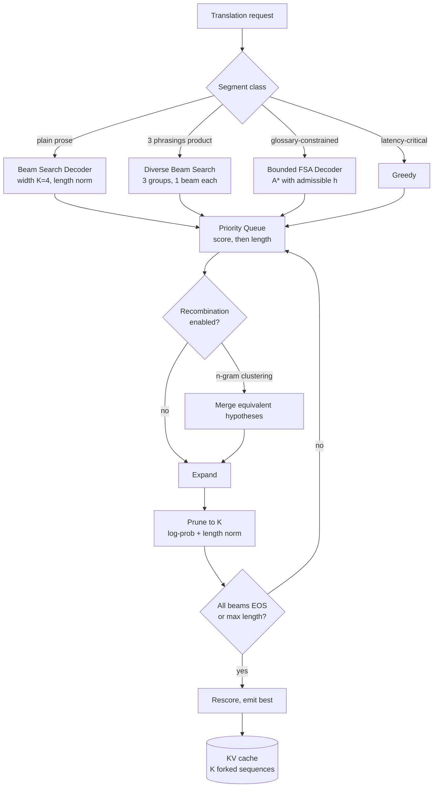

# Case Study: Beam Search and the Search-Decoding Budget

> **Topic:** `T02` · **Transcript coverage:** primary · **Difficulty:** L4
> **One line:** When to spend `K`x decode compute on search — and the precise conditions under which searching harder makes the output *worse*, not better.

## Table of Contents

- [1. The Scenario](#1-the-scenario)
- [2. Requirements](#2-requirements)
- [3. Architecture](#3-architecture)
- [4. Component Deep Dive](#4-component-deep-dive)
- [5. Decision Table](#5-decision-table)
- [6. Edge Cases & Exceptions](#6-edge-cases--exceptions)
- [7. Failure Modes & Mitigations](#7-failure-modes--mitigations)
- [8. Capacity & Cost Model](#8-capacity--cost-model)
- [9. Benchmarks & Measured Numbers](#9-benchmarks--measured-numbers)
- [10. Operational Runbook](#10-operational-runbook)
- [11. What Changes at 10x](#11-what-changes-at-10x)
- [12. Interview Walkthrough](#12-interview-walkthrough)

---

## 1. The Scenario

Vantage Localization runs machine translation for 340 enterprise customers — 40M source words a month, 31 target languages, on a fleet of open-weight models it serves itself. Translation is one of the last production homes of beam search: the task has a well-defined target, an automatic metric, and a customer who will notice a fluency regression on a 300-page manual.

Three pressures collide.

**The quality team wants mode-seeking decoding.** Their framing is the lecture's: "we want not just a good output from our model but um the single most likely output" `[T]` — CMU lecture 4. They cite the *Blessing of Beam Search* result: beam search with a small width enforces **uniform local information density**, defined as "the standard deviation of the negative log likelihood of each individual token" `[T]`, and lowering beam size up to a point lowers that standard deviation. In their reading, beam search is not an approximation to a bad objective — it accidentally optimises a good one.

**The latency SLO and the GPU budget are set by a contract.** Per-request P95 of 3.5 s on documents up to 2,000 tokens, at a fixed monthly GPU spend. Beam width multiplies decode compute, and decode is where the money goes ([T06](../01-case-studies/T06-inference-fundamentals.md)).

**The evaluation is a proxy.** BLEU — the lecture's "n-gram quality metric" `[T]` — is what the customer contract is written against. Nobody re-reads 40M words.

The design question is not "beam or not." It is: **which search budget, applied to which workload, with which objective — and what happens to the estimator when the metric and the objective disagree?**

## 2. Requirements

### Functional

| Requirement | Priority | Notes |
|---|---|---|
| Beam search with configurable width, length normalization, early stopping | P0 | The core decoder |
| Diverse beam search with grouped penalty terms | P1 | For the "give me 3 phrasings" product |
| A bounded search mode for finite-state-constrained segments | P1 | Glossary-constrained translation — see [T03](../01-case-studies/T03-constrained-generation.md) |
| Per-request search policy (greedy / beam / diverse / sampled) | P0 | Different customers, different budgets |
| Deterministic replay of any beam output | P1 | Contract disputes |

### Non-functional

| Requirement | Target | Rationale |
|---|---|---|
| P95 end-to-end latency, 2,000-token document | < 3.5 s | Contract |
| Default beam width | 4 | Quality team's floor, cost team's ceiling |
| Beam-width search overhead at batch 32 | ≤ 25% wall-clock vs greedy | Measured, §8 |
| KV footprint per concurrent request, beam 4 | ≤ 4x greedy | Beams fork the cache; see [T07](../01-case-studies/T07-kv-cache.md) |
| BLEU regression tolerance per release | ≤ 0.3 | Below the noise floor of the eval set |
| Diverse-beam duplicates in a 3-output set | 0 exact duplicates | Product promise |

### Constraints and non-goals

- **We will not use A\* over an unbounded decoder.** "It's very very difficult to come up with an admissible heristic… it is quite possible that you could suddenly hit a sweet spot and pay like zero cost for the rest of the time" `[T]` — the memorization problem, §4.5. A\*-style search is confined to finite-state-bounded segments where the remaining length is known.
- **We do not promise that higher beam width means higher quality.** The curse of beam search is documented `[T]`.
- **We do not optimise BLEU past the point where the human review disagrees.** The metric is a proxy; the likelihood trap explains why optimising the model's probability can move quality the wrong way.
- **We do not use beam search for the open-ended "marketing tone" product.** See [T01](../01-case-studies/T01-sampling-decoding.md).
- **We do not attempt exact decoding.** "exact decoding would require setting your beam size to the size of the vocabulary" `[T]`.

## 3. Architecture

Walkthrough: a request is classified, and the class selects a decoder from a small set. All decoders except greedy are the *same* priority-queue algorithm parameterised by three things — comparator, beam constraint `K`, and heuristic `h` — which is the unifying result the lecture draws from the best-first beam search paper: beam search "always prioritizes things that are shorter… and then… if the output is the same length it prioritizes based on score," best-first "always prioritizes based on score. Uh but if the score is the same then it prioritizes based on length," `K` is the beam size for one and infinite for the other, and "beam search doesn't have one [a heuristic]. Best search doesn't have one but a star search does have one" `[T]`. One queue implementation, four configurations.

The recombination box is optional and sits between expansion and pruning; it is where the KV-sharing opportunity lives ([T07](../01-case-studies/T07-kv-cache.md)).

## 4. Component Deep Dive

### 4.1 Beam search mechanics

The lecture walks it concretely. Prefix "when my cat gets hungry," beam width 3. Step 1's top 3 are **she, he, it**. Each expands into its own top 3 — **9 options** — each scored by multiplying path probabilities, equivalently summing log-probs. Prune 9 back to 3. Composition is unrestricted: "this happens to be two things from sort of our first original beam and one thing from our second beam… this could just as equally be three things from three different beams" `[T]`. Expanding again yields only **6** children instead of 9, because one selected item was EOS, giving **7 candidates total**: one complete sentence and six partials.

**Log-probs, not probs**, for numerical stability: probabilities "become really, really small numbers close to zero. Our hardware doesn't like really, really small numbers close to zero" `[T]`.

**Algorithm:** pick width K; initialise with the top-K tokens; at each step expand the top K, each into its K best completions (up to K² options, fewer when a beam hit EOS — EOS beams are not expanded); prune back to K by log-prob plus length normalization; terminate at max length or when every beam ends in EOS; rescore and return the best.

**Why greedy is the wrong baseline.** The lecture's example: at a split, the higher-probability token at time `t` has a continuation whose best next token has probability **0.1**, while a slightly less probable token at `t` has a much higher-probability completion — multiplying out gives greedy "substantially lower probability" `[T]`. Greedy also exhibits the **repetition trap**: the GPT-3 story generation collapsed into "repeating the same um 10 or 15 tokens over and over again," and "once you've repeated it twice, you're going to repeat it a third time" because argmax "reinforces this repetition" `[T]`. Pre-training contains exactly this degenerate text — CSV files, malformed XML, and a Dolma-paper example of Reddit posts that are "just the letter M repeated over and over from a subreddit that is about simulating the sound of a microwave going off" `[T]`. Instruction tuning reduces it; RL training reduces it further because a low score for repetition is "explicit bias against repeating yourself" `[T]`.

### 4.2 Length normalization, and why EOS is unfair

A completed sequence at length 3 competes against partials at length 4, so EOS "is getting an unfairly good chance" — because "our probabilities are monotonically non-increasing and generally monotonically decreasing" `[T]`. The fix: divide the log-prob by the length so far — "we divide log props of EOS by three and we divide the log prop of everything else by four." EOS still "winds up being capped as one of our potential completions… but as these other things get longer and longer, there's a chance that they'll sort of work out to be higher probability" `[T]`.

HuggingFace's variant divides by `|Y|^alpha` — "the version that's implemented in HuggingFace is divided by Y raised to some hyperparameter alpha which I think Hugging Face calls the length penalty" `[T]`. What the lecture actually says about alpha: "you can set this to be zero if you want no normalization at all. You can set this to be one" `[T]`. It does **not** state a canonical alpha and does not claim alpha must be below 1; the closest is a student's argument, endorsed non-committally, that "if I keep a very aggressive alpha to be really really high. So it's exploding then clearly I put the shorter sequences on a much better footing than the longer sequences" `[T]`.

The honest position, which is what we implement: there is no alpha that puts all lengths on equal footing. "my sense is that this is sort of the price we pay by making our models locally normalized. I don't I can't think of anything that would guarantee" `[T]`. The only principled fix offered is a source-length prior — the MT observation that "most sentences that are six tokens in English are usually like seven or eight tokens in French" — applied as an additive reward or a multiplied length distribution, with the caveat that "this is not very commonly done anymore" and "that does require you as the user to kind of define your own prior" `[T]`.

### 4.3 Diverse beam search

Six beams on an image-captioning example collapsed to near-duplicates — "a steam engine train traveling um through blank down" — whereas "if you asked six people to give a caption… they would probably give you six outputs that are all reasonable and look quite different" `[T]`. The fix is *relative* diversity: "we're going to encourage each new output we decode to be different from everything else that we've decoded up to that point" `[T]`.

Mechanics: partition beams into groups. Group size 1 decodes everything at once (ordinary beam search); group size = number of beams is greedy within each group; in between is beam search within groups. In practice "they set the number of groups to be the same as the number of beams" and group size to 1. Pruning happens **within a group only** — each group is beam search with probabilities modified by earlier groups. The efficiency trick: groups need not be serialised, they are staggered, so "if normal beam search would have finished in t steps um diverse beam search will finish in **t plus g minus one** steps" `[T]`.

Four penalty terms were examined; our product uses two:

| Penalty | What it penalises | Our verdict |
|---|---|---|
| Hamming diversity | "a token proportionally to the number of times it's occurred before in active beams from the groups that we're considering" `[T]` | Used. Objection noted: unfair when the token is legitimate at different positions. |
| Cumulative diversity | "penalizing only if you're using the same token at the same time step" `[T]` | Used — the better-behaved of the two count-based terms |
| n-gram diversity | "penalizes matches of exact engrams," with a longer prefix match penalised more than a shorter one `[T]` | Used for the glossary product, where phrase-level repetition is the complaint |
| Embedding similarity | Penalising tokens whose embeddings are close — "the 2017 equivalent of penalizing things that are semantically close" `[T]` | Rejected: found "not actually worth the extra computational cost" `[T]` |

### 4.4 Stochastic beam search and the Gumbel-max trick

Sampling K unique candidates per expansion is harder than it looks. Sampling-then-removing K times over a V-token distribution is "a little bit slow"; rejection sampling is worse — "if our distribution over next tokens is extremely peaky, we could sample a 100red or 200 things and only get one or two unique outputs," with unbounded runtime `[T]`.

The Gumbel-max trick resolves it. Draw `X_i` from a Gumbel with location `mu_i`; then the probability that `X_i` is the maximum is `e^{mu_i} / Σ_j e^{mu_j}` — "Does anyone know what this is? This is softmax" `[T]`. So "choosing the argmax of this collection is functionally equivalent to taking the soft max over all of these mui values and sampling one from it" `[T]`. Practically: add independent Gumbel noise with **location zero, scale one** to each logit and take the argmax; or take the top-k of the noised logits to get "k things drawn from our distribution **without replacement**" `[T]`. A student's reaction — "I've done the math and I still think it's magic" — is a fair summary.

The subtlety that decides correctness: scoring those K by plain log-prob "undo all of our good work here because then we're just going to choose whichever one of them was the highest probability to begin with" `[T]`. So the Gumbel-modified log-prob is carried forward but capped, because added noise can make a child score *higher* than its parent, which breaks monotonicity and length normalization. The algorithm adds "a little correction factor such that the modified log props are never going to be higher than the log props of the node we sampled from" `[T]`. The cap is applied **only in pruning, not in expansion** — "when you take the top K out of your gumball noise logits you wind up with something that is exactly a sample from the distribution. And then when you're pruning and you're scoring, you need to adjust it back down" `[T]`. Expansion is a proper Gumbel-max sample; pruning is a deliberate compromise.

### 4.5 The A\* material, and why it is quarantined to finite-state segments

Lecture 5 (identified in lecture 6 as Graham's session) builds the whole topic on **weighted finite-state automata**: a finite state set, an alphabet (vocabulary), transitions from state × symbol to state, an initial state, final states, and a weight on each transition. Exactly two weight systems are worked: **probability** (range 0–1, combine by multiplication, select by argmax — worked path `0.5 × 0.3 × 0.2`) and **log/negative-log probability** (range `−∞` to 0, combine by addition, used thereafter because "typically when we're doing search we usually do… shortest path searches" `[T]`). The sum-over-all-paths objective is mentioned and set aside: "I'll skip over that because we don't use it very much for language models" `[T]`.

The priority queue holds hypotheses scored `f = g + h`, with `h` initialised to zero. This parameterisation reproduces the whole family:

| Algorithm | Queue discipline | `K` (beam constraint) | `h` | Steps on the toy graph |
|---|---|---|---|---|
| Greedy | "our Q size is limited to one" `[T]` | 1 | 0 | **4** |
| Beam search | shorter first, then score | 2 in the example | 0 | **6** |
| Uniform-cost / Dijkstra-style | best score first, exhaustive | ∞ | 0 | **9** |
| A\* | best `f` first | ∞ | admissible | **8** |

Beam search is "not guaranteed to get the best answer" `[T]`. The exhaustive search "does an exhaustive search of the entire space and there's no pruning of potentially optimal paths" and provably finds the optimal path before any other terminal — but the scaling caveat is decisive: with a larger vocabulary or a longer graph "we would spend our entire time sitting right at the very beginning and searching around the various things at the very beginning unless we had a very very peaky probability distribution" `[T]`.

**A\*** adds `h`: "an admissible heristic is basically it never overestimates the true cost of the goal. It can underestimate the true cost of the goal but it can't overestimate" `[T]`, so it "provides a lower bound on the remaining cost," and A\* "is optimal when a heristic is admissible." The lecture constructs one by hand: take the minimum arc weight in each row of the graph — one row's floor gives `h = 0.5`, another `h = 1.0`. The trace: `S0→S2` scores `0.69 + 1 = 1.69`, and because "when I boost their score by one that makes the score worse because like lower scores are better," expansion order changes; the optimal output is found at step 8 instead of 9, and "I never expanded the S0 to S1 thing because the heristic function plus the actual score never got like low enough" `[T]`.

Admissibility is **sufficient but not necessary**: "being an admissible heristic is not a necessary condition to do good search but it is… a sufficient condition to do good search" `[T]`. With an inadmissible heuristic "you might deviate from the optimal solution. You're not guaranteed to deviate… but you might" `[T]`. And a constant offset is harmless — adding 10 everywhere is "equivalent [to] underestimating by corresponding amount. So these two scenarios become functionally the same" `[T]` — though the lecturer concedes to a sceptical student that the sufficiency proof needs `h` to be "a well behaved function." Note that consistency/monotonicity is never named in the lecture; that gap matters, because a merely-admissible-but-inconsistent heuristic with node re-expansion is what breaks naive implementations `[D]`.

**Why A\* is unusable for open-ended LLM decoding.** Two blockers, both stated `[T]`:

1. **Exponential growth.** "if you have a vocabulary size of ABC, basically every token you generate um you exponentially grow your graph"; with a large vocabulary "you will be stuck at the beginning of the graph."
2. **No admissible heuristic exists.** "it's very very difficult to come up with an admissible heristic. Um and the reason why is because a transformer-based language model is you know huge uh very hard to comprehend and it is quite possible that you could suddenly hit a sweet spot and pay like zero cost for the rest of the time." The example: asked to recite the US Constitution, the model "would generate like thousands of tokens with like probability of one because it's exactly memorized" `[T]`. Any nonzero `h` overestimates during that run; any `h` that is zero everywhere degenerates to uniform-cost. The mirror case — a prefix like "the solution to the first… homework" where the model will "spend a lot more probability" — must be predicted from the prefix alone. Hence, in Q&A: "an A star with a asterisk you know it's not actually a star" `[T]`.

This is why Vantage uses A\* only where the search space is genuinely finite: glossary-constrained segments compiled to an FSA, where the remaining path length is bounded and a row-minimum heuristic is computable (§5.3).

### 4.6 Hypothesis recombination

"maybe necessary, maybe not necessary," but required for any A\*-style algorithm `[T]`. Mechanics: "we want to group uh similar states together um to reduce the number of hypotheses that we're dealing with" — cluster hypotheses "with similar um representations of some variety and keep the best of each for each cluster," which "reduces exponential growth while maintaining quality" `[T]`.

Two criteria families:

- **n-gram clustering** on "shared recent word contexts" — "very easy to implement in cache," composes with beam search, and "the truncation length controls precision": `n = ∞` is no recombination, `n = 2 or 3` recombines everything sharing the most recent two or three words. Downside: "you could get something that was very different previously but similar for the most recent uh words" `[T]`.
- **Distribution distance** on the state representation — Euclidean or cosine similarity, or "KL divergence between the distributions induced over the next token" `[T]`. The worked mechanics: for each live hypothesis compute `P(y_t | y_<t)`, a full distribution over the vocabulary, concatenate into a matrix, and take pairwise KL — with beam size 16 you get a **16×16 matrix of KL divergences** (the lecturer first says "16x5," likely a slip), then prune "the ones where the kale divergence is like relatively low" `[T]`. The compared object is explicitly the logit, not the hidden state: the lecturer corrects his slide — "similarity in neural representations is not the correct term here… this would be more like similarity between the probability distribution" `[T]`.

This is also the mechanism behind KV sharing for beams: two hypotheses that recombine share a prefix, so they can share cache blocks ([T07](../01-case-studies/T07-kv-cache.md)).

### 4.7 Future-cost heuristics and best-first beam search

**Future cost** is "an inadmissible but useful heristic. So this is exactly uh the case when we don't have a heristic that satisfies you know admissibility but still could be useful" `[T]` — a learned predictor of "the cost of completing a partial sequence… given all of the information that you have now predict the cost of the completion" `[T]`. It is integrated with a discount: "you use the log probability of what you've done up until this point and then you multiply uh multiply this in," and "if we set this to zero, it is admissible… because it's zero and zero is uh never going to underestimate" `[T]` — the discount is a dial between admissible-but-useless and useful-but-unsafe. Training options: an auxiliary loss on the main model so it fits "not the current cost but the current cost plus the cost that we're going to pay in the future," or a separate predictor trained on completed sequences with a head that "regresses to the full sequence probability," ground truth being the sum of all token log-probs. The RL analogy is explicit: "this is very similar to like a value function you learn in reinforcement learning" `[T]`. The separate-predictor motivation is practical: you may not want to fine-tune the generator — the transcript's example is wanting a future-cost model for DeepSeek V3 while only having "your small quen [Qwen] model," which "doesn't have as good an idea of like what deepseek is going to predict next" `[T]`. The 2020-era MT results showed good gains "so take it with a grain of salt" `[T]`.

**Best-first beam search** gets the lecturer's strongest endorsement. The problem it fixes: standard beam search "always expands all of the inputs um within your beam," and with "a beam size of 16 or 32," "most of those 16 are just not good like kind of obviously really low probability solutions and it's not worth initially exploring" `[T]`. The fix is "score-based prioritization like a star while maintaining beam constraints," and the headline result is a **10x speedup over standard beam search with identical results** `[T]` — the lecturer calls this "the most important part of the paper." Costs: "memory overhead and implementation complexity, but it's actually not that bad" `[T]`. Preconditions: "scores can only decrease uh when extended," plus early pruning of hypotheses guaranteed to fall off the beam and early termination once a complete hypothesis is found. "A\* beam search" is defined in that paper as beam search with a future cost that is an admissible heuristic; the lecturer's amendment is that admissibility is not required if you are willing to lose the accuracy guarantee.

This is what Vantage deploys: best-first beam search at width 8, which the source claims recovers standard beam search's scores at widths for which plain beam search is unaffordable.

## 5. Decision Table

### 5.1 The search budget per segment class

| Option | Pros | Cons | Exceptions — when it breaks | When to use |
|---|---|---|---|---|
| Greedy | Cheapest; 4 steps on the toy graph; deterministic | Myopic — "no no backtracking of any variety is possible" `[T]`; repetition trap `[T]`; worse sequences than beam | Breaks on any task where the locally-best token forecloses the globally-best sequence (the 0.1-probability continuation example) | Latency-critical short segments; already-tuned high-resource pairs |
| Beam search, width 4 | Better sequences; the industry default for MT | 4x decode compute and 4x KV; suffers the curse at higher widths | Breaks when the model is strong and the objective is open-ended (§5.4) | The default for prose |
| Diverse beam search, 3 groups × 1 | Genuinely distinct outputs; `t+g−1` steps rather than `g×t` | Penalty tuning; can force unnatural variation | Breaks when the outputs must be a ranked list, not a set — "generally if you're doing diverse beam search you're doing it because you want to see all of the outputs" `[T]` | The multi-phrasing product |
| Stochastic beam search | A proper sample of K diverse candidates | The pruning correction is easy to get wrong; needs the noised score carried forward | Breaks if the correction factor is dropped — you silently revert to top-K selection `[T]` | Where diversity is a hard requirement and sampling alone is too noisy |
| Best-first beam search, width 8 | Claimed 10x speedup at identical results `[T]`; makes larger effective widths affordable | Priority-queue memory; comparators must respect the "scores only decrease" precondition | Breaks if the precondition is violated — e.g. a reward-augmented score that can increase | Our default replacement for plain beam at widths ≥ 4 |
| A\* over the open decoder | Optimal | **Not constructible**: no admissible heuristic exists for a memorizing model `[T]` | Breaks on any input the model has memorised — where remaining cost is genuinely ~0 | Never |
| A\* over a compiled FSA (glossary segments) | Optimal within the segment; a real row-minimum heuristic exists | Requires the constraint to compile to a finite automaton; needs recombination to control breadth | Breaks when the constraint needs a stack (arbitrary nesting) — that is a pushdown automaton, not an FSA `[T]` | Glossary-constrained segments |

**Chosen:** a four-way class router — greedy, beam 4, diverse 3×1, bounded A\* — with best-first beam search as the beam implementation.
**Revisit if:** a customer's eval shows BLEU and human review diverging, which means the objective, not the search, is wrong.

### 5.2 Length normalization

| Option | Pros | Cons | Exceptions — when it breaks | When to use |
|---|---|---|---|---|
| No normalization | Unbiased estimator of sequence probability | EOS wins early — "getting an unfairly good chance" `[T]`; outputs get shorter as width rises | Never breaks, but systematically prefers short outputs | When you genuinely want the MAP sequence and can accept short outputs |
| Divide by length | Simple; the fair comparison between a completed and a partial beam | Ignores that some languages are longer | Over-corrects toward verbosity at high width | Default |
| Divide by `len^alpha` (HF's length penalty) | A continuous dial | No alpha makes all lengths comparable — "I can't think of anything that would guarantee" `[T]` | Extreme alpha "exploding" inverts the preference to short sequences `[T]` | When you can tune against a fixed eval |
| Source-length prior (MT-style) | Principled: multiply in a distribution over expected output lengths | "does require you as the user to kind of define your own prior," and "not very commonly done anymore" `[T]` | Fails when source and target lengths are uncorrelated (e.g. into/out of languages with very different tokenization) | High-value language pairs where you can estimate the ratio |

**Chosen:** divide by length, with a per-language `alpha` tuned on a held-out set and capped in range.
**Revisit if:** the length distribution of outputs drifts after a model upgrade — re-tune alpha before touching width.

### 5.3 Recombination

| Option | Pros | Cons | Exceptions — when it breaks | When to use |
|---|---|---|---|---|
| None (`n = ∞`) | No risk of merging genuinely different hypotheses | Exponential breadth; A\*-style algorithms become infeasible `[T]` | Fine at beam width ≤ 8 in practice | Small widths |
| n-gram clustering, `n = 2–3` | "very easy to implement in cache" `[T]`; cheap; composes with beam | "you could get something that was very different previously but similar for the most recent… words" `[T]` | Breaks on languages where the last two tokens are highly ambiguous (short-token languages, agglutinative) | Default |
| Distribution distance (KL over next-token distributions) | Semantically grounded; catches paraphrase equivalence | O(K²) pairwise KL per step — a 16×16 matrix at beam 16 `[T]`; sensitive to a miscalibrated distribution | Breaks when the distribution is very flat and everything looks similar | When quality justifies the cost |

**Chosen:** n-gram `n = 3` for prose, KL for the bounded A\* path where the candidate set is small.
**Revisit if:** recombination starts merging distinct glossary terms — measure glossary-term retention as a metric in its own right.

### 5.4 Whether to keep beam search at all

| Option | Pros | Cons | Exceptions — when it breaks | When to use |
|---|---|---|---|---|
| Keep beam search | Better sequences on well-defined targets; uniform information density `[T]` | Curse of search; likelihood trap; cost | Breaks when the model is strong and the task is open-ended — the lecturer's own theory for why "people don't really use beam search for sort of frontier models anymore" `[T]` | MT, summarisation with a reference, any task with an exact objective |
| Drop it for sampling | Cheaper; avoids the likelihood trap | Loses the information-density benefit; needs a reranker to match quality | Fails when there is no reference and no verifier | Open-ended generation |

**Chosen:** keep it for translation, refuse it for the tone-rewriting product.
**Revisit if:** the model family changes to one whose human-preference curve peaks away from the mode — re-run the likelihood-trap plot on 500 outputs before deciding.

### 5.5 Heuristic for the bounded path

| Option | Pros | Cons | Exceptions — when it breaks | When to use |
|---|---|---|---|---|
| `h = 0` (uniform-cost) | Guaranteed optimal; trivially safe | 9 steps on the toy graph vs A\*'s 8 `[T]`; hopeless at scale | Never wrong, just slow | Baseline / fallback |
| Row-minimum `h` | Admissible by construction; cheap; 8 steps vs 9 `[T]` | Weak — it is a lower bound, often loose | Useless when one long high-probability arc exists | Default for bounded segments |
| Learned future cost, undiscounted | Strongest ordering signal | Inadmissible: "you might deviate from the optimal solution" `[T]` | Breaks on anything where remaining cost is near zero (memorised spans) | Only with a discount dial |
| Learned future cost, discounted to zero | Degrades gracefully to admissible | Pointless at discount 0 — same as `h = 0` | — | The safety setting |

**Chosen:** row-minimum for bounded A\*; learned future cost retained as an offline research path with the discount under evaluation.
**Revisit if:** a future-cost model trained on our own corpus beats the row-minimum heuristic on the bounded task — the lecture's own caveat is that the 2020 MT evidence, while positive, deserves "a grain of salt" `[T]`.

## 6. Edge Cases & Exceptions

| Situation | Symptom | Handling |
|---|---|---|
| **All beams hit EOS at different lengths** | Rescoring compares sequences of wildly different lengths | Rescore with the same length normalization used during search — the lecture's own termination rule: "until each of our top three highest probability beams ends in an EOS token. And then we'll rescore those three… usually still using this length normalization method" `[T]` |
| **A beam hits EOS but others continue** | Fewer than K² children in the next expansion (9 → 6 in the lecture's example) | EOS beams are not expanded `[T]`; keep them in the candidate set for final rescoring |
| **K² expansion with K = 32** | 1,024 candidates per step, most obviously bad | This is exactly the best-first beam search case: "most of those 16 are just not good… and it's not worth initially exploring" `[T]` |
| **Beam width increased and BLEU fell** | The curse of beam search | Two diagnoses, per the lecture: imperfect length normalization, or the true mode is degenerate. Test by tuning length normalization first — the paper shown is reported to remove the degradation on some tasks that way — and if it persists, the objective is the problem `[T]` |
| **Model prefers an output that humans dislike** | The likelihood trap | Model error, not search error: "if our model was a perfect representation of what we actually wanted to decode from it, the things that humans liked the most would be the things that were at the true mode" `[T]`. Response: do not fix it with more search; fix it with a reranker ([T05](../01-case-studies/T05-verifiers-best-of-n.md)) or better post-training |
| **Memorised span inside a bounded A\* segment** | The heuristic overestimates and optimality is lost | Detect with a heuristic-overestimate counter; fall back to `h = 0` for that segment |
| **Gumbel correction omitted in a refactor** | Stochastic beam silently becomes top-K selection; diversity collapses to the plain-beam case | Assert in tests that the noised score is used at prune time and that a child's pruned score never exceeds its parent's `[T]` |
| **Diverse-beam penalties applied across positions** | Legitimate repeated words are suppressed — the lecture's objection to Hamming diversity, where "the" is penalised regardless of position `[T]` | Use cumulative diversity (same time step only) or n-gram diversity rather than raw Hamming |
| **Recombination merges two different glossary readings** | A term is translated incorrectly and consistently | Track glossary-term retention; lower `n` or switch to KL-based clustering |
| **Very long documents** | Beam search's KV footprint grows with K and length, and the pool evicts other tenants | Cap per-request width by document length; route long documents to a pool with more KV headroom ([T07](../01-case-studies/T07-kv-cache.md), [T08](../01-case-studies/T08-batching-scheduling.md)) |
| **A customer asks for "the most likely translation"** | You cannot deliver the true mode | Say so: exact decoding "would require setting your beam size to the size of the vocabulary" `[T]`; beam 4 is an approximation, and the blessing argues the approximation is benign |

## 7. Failure Modes & Mitigations

| Failure | Symptom | Detection | Blast radius | Mitigation | Recovery |
|---|---|---|---|---|---|
| Beam width raised for quality, BLEU falls | Classic curse of beam search | Per-width BLEU curve maintained as a release artifact | One language pair | Tune length normalization first, then revert width | Roll back width; investigate whether the model is strong enough to make the mode unhelpful |
| Repetition loop in a greedy-class request | 10–15 token loop `[T]` | Distinct-n on a sliding window | One request | Never route natural-language output to pure greedy ([T01](../01-case-studies/T01-sampling-decoding.md)) | Regenerate at low temperature |
| Priority queue memory blow-up under best-first | OOM on the engine host, not the GPU | Queue depth metric; alert at a threshold | Whole replica | Bound the frontier; the precondition is "scores can only decrease," so the frontier can be pruned aggressively `[T]` | Fall back to plain beam search |
| Diverse-beam outputs are near-duplicates | Product complaint on the 3-phrasing endpoint | Exact-duplicate and bigram-overlap check on the returned set | One product | Verify groups = beams and group size = 1 `[T]`; verify penalties are actually applied | Re-tune penalty weights |
| Length normalization alpha mis-set after a model upgrade | Outputs systematically short or long | Output-length distribution per language, tracked per release | One language | Re-tune alpha against the held-out set before touching anything else | Roll back alpha |
| A\* path returns a suboptimal segmentation | Glossary violation in a customer deliverable | Glossary-retention eval | One document | Verify `h` is admissible on that grammar; check recombination is not merging distinct readings | Disable recombination for that grammar |
| KV exhaustion from wide beams | Other tenants see TTFT spikes | Pool-level KV utilisation (`[T]` the llm-d talk's saturation thresholds) | Shared pool | Cap width × length product; split pools by width class | Evict or reroute |
| Eval overfits beam width | Width 4 wins the eval, loses with customers | Divergence between eval-BLEU and human review | Eval programme | Hold out a customer-sampled set; the lecture's warning is exactly this — "the users who then pick up your model are unlikely to do you the same favor" `[T]` | Re-baseline on the customer set |

## 8. Capacity & Cost Model

All arithmetic here is mine; assumptions are shown.

**Assumptions**

| Input | Value | Basis |
|---|---|---|
| Segments per month | 2.0M | `[D]` scaled from 40M words at ~20 words/segment |
| Average output tokens per segment | 30 | `[D]` |
| Greedy decode cost per token | 1 unit | `[D]` normalisation |
| Default beam width | 4 | §2 |
| Decode is memory-bandwidth-bound | Assumed | `[T]` LLMOps cost talk: decode is memory-bound, prefill is compute-bound |
| KV per token per sequence | 1 unit | `[D]` |

**Step 1 — beam width multiplies FLOPs and KV, not necessarily latency.** At batch size 1, a decode step at width 4 moves the same weights and processes four positions; the weight read dominates, so the step costs only marginally more than width 1. At high batch, the GEMM is saturated and the four positions cost four times as much arithmetic. So the honest cost statement is: **beam width is nearly free at low occupancy and roughly linear at high occupancy** `[D]`. This is why §2's target is expressed as "≤ 25% wall-clock at batch 32" rather than "4x".

**Step 2 — monthly compute.** `2.0M segments × 30 tokens = 60M output tokens/month`. At width 4 that is `240M` decode-unit-token equivalents. If the fleet does 1,800 aggregate tokens/s of greedy-equivalent decode, width 4 reduces effective throughput to roughly `1,800 / 4 = 450` segments-equivalent tokens/s at saturation — i.e. **the same fleet does one quarter the work at full occupancy** `[D]`. The scheduling implication is that beam requests should not be co-scheduled with latency-critical traffic ([T08](../01-case-studies/T08-batching-scheduling.md)).

**Step 3 — best-first beam search is the lever that pays for itself.** The source claims "a 10x speed up over standard beam search with identical results" `[T]`. Taken at face value that is a paper result on the paper's models, not our workload, so discount it. At the full 10x, effective width-4 throughput rises from 450 to `4,500` greedy-equivalent tokens/s — far above the 1,800 greedy baseline, i.e. width-4 search would be *cheaper in wall-clock than greedy without search*. Assume we realise only one third of it, 3.3x: throughput becomes `450 × 3.3 = 1,485` tokens/s, or `1,485 / 1,800 = 0.82x` the greedy baseline. So the honest claim is the weaker one: **width-4 search costs 0.82x greedy rather than 4x** — near-free in wall-clock even though it remains 4x in arithmetic `[D]`. That range (0.82x at a third of the claimed speedup, 0.25x if the claim holds fully) is what justifies the deployment; the decision does not depend on which end of it is true.

**Step 4 — the KV consequence.** Four beams per request means four forked sequences. With n-gram recombination at `n = 3`, beams that share their last three tokens can share blocks, so the steady-state multiplier is well below 4 — but worst case it is 4, and the pool must be sized for the worst case. Concretely, if a replica's KV budget supports 64 concurrent greedy sequences, it supports 16 concurrent width-4 beam requests `[D]`. That is the real constraint on the translation SLO, not arithmetic.

**Sensitivity**

| Scenario | Effect |
|---|---|
| 10x segments | Arithmetic scales linearly; the binding constraint becomes KV, then the best-first priority queue's memory. The decision that inverts is "one pool for all widths" — split by width class |
| 0.1x segments | Best-first beam search's complexity is no longer worth it; plain beam at width 4 fits easily |
| Width raised to 8 | KV multiplier doubles; best-first's advantage grows because the fraction of obviously-bad beams rises with K |
| Model upgraded to a much stronger one | The curse of beam search may worsen — the likelihood trap is model error, and a stronger model's mode may be *more* confidently wrong about human preference. Re-run the trap plot |
| Length prior adopted | Adds an estimated output length to the model; helps exactly where alpha tuning failed, at the cost of per-language prior estimation |

## 9. Benchmarks & Measured Numbers

| Metric | Value | Source | Conditions |
|---|---|---|---|
| Beam width in the worked decoding example | 3 | CMU lecture 4 `[T]` | Toy vocabulary; prefix "when my cat gets hungry" |
| Candidates after one expansion | 9 (K²), then 7 total after EOS | CMU lecture 4 `[T]` | One beam ended in EOS and was not expanded |
| Greedy's continuation probability at the split | 0.1 | CMU lecture 4 `[T]` | Worked example showing greedy's myopia |
| Repetition loop length | ~10–15 tokens | CMU lecture 4 `[T]` | GPT-3 short-story generation, quoted from the literature |
| Diverse beam search step count | `t + g − 1` for `g` groups | CMU lecture 4 `[T]` | Versus `g × t` serialised |
| Diverse beam search beam size / groups | 6 beams, 3 groups | CMU lecture 4 `[T]` | Image-captioning example |
| Stochastic beam search graph settings | Beam size 10, mean over 10 examples | CMU lecture 4 `[T]` | Quality = BLEU, diversity = n-gram similarity; a read-off at diversity ≈ 22 is where stochastic beam becomes necessary |
| Likelihood trap position | Human-preferred outputs sit in the top ~quarter of a percentile of probability | CMU lecture 4 `[T]` | "particularly… older models and… models that were not RLHF'd / instruction tuned" — the lecturer's characterisation of the paper |
| Curse of beam search | Performance falls as beam width rises | CMU lecture 4 `[T]` | "roughly 2018 to 2020" models, per the lecturer — not a current-model result |
| Best-first beam search speedup | 10x over standard beam search, identical results | CMU lecture 5 `[T]` | Paper result; the lecturer calls it "the most important part of the paper" |
| Toy-graph step counts | greedy 4, beam 6, uniform-cost 9, A\* 8 | CMU lecture 5 `[T]` | Vocabulary size 3 — explicitly a toy, not a benchmark |
| KL recombination matrix size | 16×16 at beam 16 | CMU lecture 5 `[T]` | Pairwise KL between next-token distributions |

Every figure in this table is a lecture illustration or a cited paper result. None is a measurement of Vantage's fleet, and the case study does not pretend otherwise.

## 10. Operational Runbook

**Deploy**
1. Every decoder configuration is a versioned object: `(algorithm, K, alpha, recombination, penalties)`.
2. Release artifact includes a per-width BLEU curve for every language pair, not one BLEU number — the curve is what detects the curse.
3. Canary by language pair; translation quality regressions are pair-specific well before they are fleet-wide.
4. Rollback is a configuration flip; the decoders are stateless between requests.

**Tune — in this order**
1. **Length normalization first.** It is the single largest source of the curse-of-beam-search effect, and it is cheap to sweep. Only then touch width.
2. **Width second.** Sweep 1, 2, 4, 8, 16 and plot BLEU against width per pair. Stop where the curve turns.
3. **Recombination third.** Turn it on only when width ≥ 8 or an A\*-style decoder is in play, and watch glossary retention.
4. **Penalties last** for diverse beam search, and only cumulative or n-gram — the embedding-similarity term is not worth its cost.
5. **Never tune two knobs in one experiment.** The interactions are strong: width changes the optimal alpha, and recombination changes the effective width.

**Monitor**
- Per-width, per-language BLEU on a frozen set, tracked per release.
- The likelihood-trap plot: model log-probability against human rating, sampled quarterly. A change in its shape is a model or post-training event.
- Output-length distribution per language (the fastest early signal that alpha has drifted).
- Priority-queue depth and memory for best-first decoding — the failure is a host OOM, not a GPU event.
- KV utilisation per pool, split by width class (`[T]` the llm-d talk's saturation thresholds and KV hit rate per session).
- Glossary-term retention on constrained segments.

**Incident — top 5**
1. **BLEU drops after a width increase.** Diagnosis: the curse. Action: revert width, sweep alpha, re-check. If both fail, the model's mode is the problem — stop searching harder.
2. **Repetition loops in production output.** Diagnosis: greedy class or a broken repetition penalty. Action: move the request class to low-temperature sampling, per the lecture's note that greedy "reinforces this repetition."
3. **Best-first decoder host OOM.** Diagnosis: frontier growth from a comparator that violates "scores can only decrease." Action: verify the comparator, then bound the frontier explicitly.
4. **Near-duplicate outputs from the 3-phrasing endpoint.** Diagnosis: groups not set to beams, or penalties not applied. Action: verify the grouping invariant, then re-tune penalties.
5. **Glossary violations in a constrained segment.** Diagnosis: recombination merged two readings, or an inadmissible heuristic. Action: set `n = ∞` for that grammar and re-run with `h = 0` for a reference answer.

## 11. What Changes at 10x

- **The router, not the decoder, becomes the system.** At 10x segments, per-segment class selection has to be automatic and cheap; a misrouted segment costs 4x compute on a 4x-larger fleet. This is the routing layer of [T14](../01-case-studies/T14-routing-gateways.md).
- **Best-first beam search stops being optional.** At small scale plain beam at width 4 is affordable; at 10x the wasted expansion of obviously-bad beams dominates the arithmetic. The 10x claim is what makes width 8 viable.
- **Recombination becomes a correctness concern, not an optimisation.** At beam 16 across a wide fleet, uncapped frontier growth is an outage, and the merge rule determines whether glossary terms survive.
- **The likelihood trap gets worse before it gets better.** Stronger models make the trap's shape change; the decision "search harder for quality" inverts as the model improves — which is the lecturer's own explanation for why "people don't really use beam search for sort of frontier models anymore" `[T]`. Note the industry friction: the lecture points to a vLLM thread where maintainers propose removing beam search and users object, with **Spotify** named as a real dependent `[T]`. At 10x, plan for beam search to be a legacy path with a shrinking share, and staff it accordingly.
- **Exact decoding stays impossible.** The memorization argument does not weaken with scale; if anything, more capable models memorise more.

## 12. Interview Walkthrough

**Whiteboard order (35 min)**
1. The workload: translation, 2M segments, a contract in BLEU. Say that MT is the honest remaining home of beam search.
2. Draw the priority queue and the `(comparator, K, h)` parameterisation, then fill in the table: greedy is `K = 1, h = 0`; beam is a length-first comparator; uniform-cost is score-first with `K = ∞`; A\* adds an admissible `h`. Step counts 4 / 6 / 9 / 8.
3. Length normalization and the unfairness of EOS. This is where most candidates have a gap.
4. The two results that invert the naive story: the **curse** and the **likelihood trap**, and the search-error/model-error split that explains both.
5. Why A\* is quarantined: exponential growth plus no admissible heuristic, with the US-Constitution memorization example.
6. Close on best-first beam search: the `(comparator, K, h)` unification and the 10x-at-identical-results claim.

**The two numbers to say out loud**
- **10x** — best-first beam search's claimed speedup at identical results. It is the single number that changes the deployment economics.
- **0.1** — the probability of greedy's best continuation in the lecture's counterexample. It converts "greedy is fine" into "greedy is provably not the mode."

**The tradeoff to volunteer before you are asked:** searching harder is not the same as generating better. Beam search optimises the model's probability, and the likelihood trap says the human-preferred region is *not* the mode for older or non-RLHF'd models. Volunteer the search-error/model-error distinction, then say that more search is the wrong fix for a model-error problem — you need a verifier or better post-training.

**Follow-ups**

1. *Is beam search guaranteed optimal?* — No. "It's an approximate search algorithm… it can be better than greedy search, but it will not be guaranteed to get the best answer." Exact decoding requires beam size equal to the vocabulary size.
2. *Why divide by length?* — Because probabilities are monotonically non-increasing with length, so a completed 3-token hypothesis unfairly outranks 4-token partials. Dividing by length puts them on the same footing, at the cost of a free parameter with no principled setting.
3. *What is the blessing of beam search?* — Beam search with a small width approximately enforces uniform local information density — low standard deviation of per-token negative log-likelihood. It optimises something desirable by accident, which is a better argument for the method than "it finds the mode."
4. *Why can't you use A\* for open-ended decoding?* — Because you cannot write an admissible heuristic for a model that memorises. A memorised span has remaining cost near zero, so any nonzero `h` overestimates and optimality is lost. The only safe `h` is zero, which degenerates to uniform-cost and blows up exponentially.
5. *When is hypothesis recombination worth it?* — When breadth, not depth, is the problem — i.e. wide beams or an A\*-style decoder. Use recent-context n-gram clustering at `n = 3`; reserve KL-over-distributions for small candidate sets because it is O(K²) per step.
6. *Why does diverse beam search need groups?* — To make diversity relative and iterative: each group is penalised against everything decoded before it, so the third output is distinct from the first two rather than merely different from the highest-scoring one. Staggering them keeps the cost at `t + g − 1` rather than `g × t`.
7. *Stochastic beam search — what breaks if you skip the correction?* — You revert to top-K selection and lose the sampling property. The fix caps the Gumbel-noised score at the parent's score, and only at prune time, never at expansion time.
8. *What would make you drop beam search entirely?* — A model strong enough that more search no longer buys quality, plus a task with no reference and no reliable verifier. That is already the case for the open-ended product; the question is whether it becomes true for translation.

## Sources

- `refs/CMU_Inference_Algorithms_for_Language_Modeling_Fall_2025_transcripts_2/CMU_LLM_Inference_4_Beam_Search_and_Variants.txt` — mode-seeking framing, greedy's failure modes and the repetition trap, beam mechanics and EOS unfairness, length normalization and alpha, diverse beam search and its four penalty terms, stochastic beam search and the Gumbel-max trick, the curse and blessing of beam search, the likelihood trap, search vs model error, and the "people don't use beam search anymore" coda with the vLLM/Spotify thread.
- `refs/CMU_Inference_Algorithms_for_Language_Modeling_Fall_2025_transcripts/CMU_LLM_Inference_5_A_and_Best_First_Search.txt` — weighted FSAs, weight systems and the argmax/sum-over-paths distinction, priority-queue search with greedy/beam/uniform-cost/A\* step counts, admissibility and the row-minimum heuristic construction, the memorization argument against A\* for LLM decoding, hypothesis recombination with n-gram and KL criteria, future-cost heuristics and their discount, and best-first beam search with the comparator/beam-constraint/heuristic unification and the 10x claim.
- `refs/CMU_Inference_Algorithms_for_Language_Modeling_Fall_2025_transcripts/CMU_LLM_Inference_6_Other_Controlled_Generation_Methods.txt` — the finite-automaton construction and the regular/context-free/Turing-machine boundary, which bounds where an A\*-style decoder is even definable.
- `refs/LLMOps_Agentic_AIOps_The_Hands-On_Playlist_2026_transcripts/Cut_LLM_Cost_Latency_KV_Cache_Batching_Quantization_vLLM.txt` — the prefill/decode asymmetry used in §8.
- `refs/ai-system-design-guide-main/ai-system-design-guide-main/16-case-studies/01-enterprise-rag.md` — house style reference.
