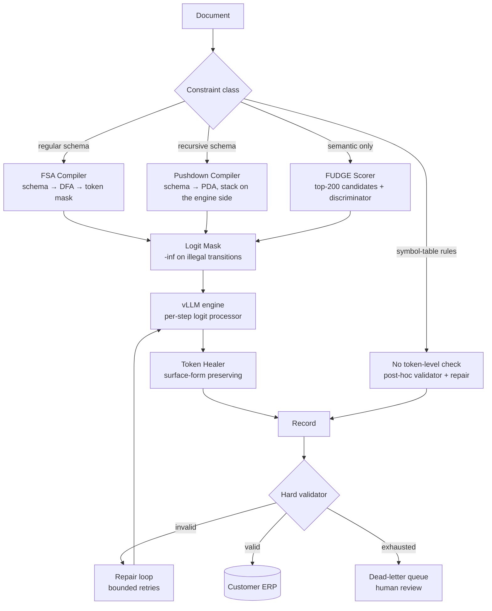

# Case Study: Guaranteed-Structure Generation for Regulated Document Intake

> **Topic:** `T03` · **Transcript coverage:** primary · **Difficulty:** L4
> **One line:** Whether to make the grammar a hard mask on the logits or a filter after generation — and how to tell which of your constraints is even expressible as a token-by-token check.

## Table of Contents

- [1. The Scenario](#1-the-scenario)
- [2. Requirements](#2-requirements)
- [3. Architecture](#3-architecture)
- [4. Component Deep Dive](#4-component-deep-dive)
- [5. Decision Table](#5-decision-table)
- [6. Edge Cases & Exceptions](#6-edge-cases--exceptions)
- [7. Failure Modes & Mitigations](#7-failure-modes--mitigations)
- [8. Capacity & Cost Model](#8-capacity--cost-model)
- [9. Benchmarks & Measured Numbers](#9-benchmarks--measured-numbers)
- [10. Operational Runbook](#10-operational-runbook)
- [11. What Changes at 10x](#11-what-changes-at-10x)
- [12. Interview Walkthrough](#12-interview-walkthrough)

---

## 1. The Scenario

Ledgerline ingests financial documents — invoices, purchase orders, remittance advices, customs declarations — and emits records into customer ERP systems. 5M documents a month, 240 customer-specific schemas, and a hard rule from the audit committee: **a record that does not validate against the customer's schema must never reach the ERP**. Not "should rarely" — must never. A malformed field propagates into a general ledger.

Three surfaces, all on the same model:

| Surface | Output | Constraint class | Why it is hard |
|---|---|---|---|
| Invoice extraction | JSON per a per-customer schema | Regular for flat fields; nested line items | 240 schemas, some with fixed nesting, some recursive |
| Remittance matching | A short SQL predicate against a fixed table set | Needs symbol tables — "variables must be defined before they are used" `[T]` | Not expressible as a token-level check |
| Free-text notes → structured codes | A closed code from a 900-entry list | Regular | The model must pick the *semantically* right code, not just a valid one |

The political constraint is the sharp one. The ML team wants to fine-tune per customer. The platform team refuses: "if you wanted to change hello to bonjour for a week… would you want to retrain your model entirely to do that?" — the lecture's framing of why inference-time enforcement wins for templatic constraints `[T]` (CMU lecture 6). With 240 schemas, per-customer fine-tuning is 240 models to version, and every schema change becomes a training run.

The design question: **for each surface, which constraints get a hard guarantee, which get a score, and which get neither — and what do you tell the auditor about the difference?**

## 2. Requirements

### Functional

| Requirement | Priority | Notes |
|---|---|---|
| Schema-valid JSON, guaranteed, per customer schema | P0 | Audit requirement; "must never" |
| Nested and recursive line-item structures | P0 | Needs a pushdown automaton, not an FSA `[T]` |
| Schema registry with versioned validation + compile step | P0 | 240 schemas, changing weekly |
| Token healing at template boundaries | P1 | The lecture's unnatural-boundary problem `[T]` |
| Semantic constraint: *do not emit a product code from the retirement-products group* (an illustrative constraint — the author's example, **not** a transcript quote) | P1 | Not regex-expressible — needs FUDGE-class scoring `[T]` |
| Post-generation validation with a repair loop | P0 | The belt to the mask's braces |

### Non-functional

| Requirement | Target | Rationale |
|---|---|---|
| Schema-validity rate at the ERP boundary | 100.00% of emitted records | Validation is a hard gate, not a metric |
| Validity rate at the *first* model attempt | ≥ 99.5% | Repair loops cost tokens and latency |
| Added per-token latency from masking | < 3% of a decode step | Runs on every token |
| Schema compile time | < 2 s per schema | Weekly schema churn |
| Masked-vocabulary size at a typical step | ~10 of ~128k tokens | `[T]` the lecture's "over 100,000 choices but only like maybe 10 of them that will give us valid JSON" |
| P95 extraction latency, 12-page document | < 9 s | Downstream batch window |
| Semantic-violation rate on the code surface | < 0.5% with no fine-tuning | The FUDGE-class budget |

### Constraints and non-goals

- **We do not fine-tune to enforce structure.** Structure is enforced at inference; semantics is where training would pay, and even there the lecture's rule is that training pays off only for broadly applicable constraints `[T]`.
- **We do not use hard token-level masking for semantic constraints.** The lecture is explicit about the three ways it fails (§6), and the "rock"→"climbing" case is common in our corpus.
- **We do not promise that a valid record is a correct record.** The mask guarantees *syntax*; correctness needs the validator plus domain checks. This distinction is the entire audit conversation.
- **We do not attempt arbitrary nesting without a stack.** Recursive schema fragments get a pushdown automaton; anything needing more than one stack gets neither `[T]`.
- **We do not run a discriminator without logit access.** FUDGE-class methods "require access to logits," which rules out third-party APIs `[T]`.

## 3. Architecture

Walkthrough: a document is classified by *constraint class*, not by customer. The compiler turns the schema into either a DFA (flat, bounded nesting) or a pushdown automaton (recursive). Both drive the same per-step mask — a vector of `-inf` on illegal transitions added to the logits before softmax. Token healing sits between engine and output because the mask makes token boundaries unnatural. The validator is the only thing that can write to the ERP, and it is a separate process with a different trust level from the model. Anything that fails validation after the retry budget goes to a human queue, never to the ERP.

The important architectural claim: **the mask and the validator are not redundant.** The mask guarantees the output is in the language; the validator guarantees the output is in the *schema version currently in force*. If a schema is updated and a cached mask is stale, only the validator catches it.

## 4. Component Deep Dive

### 4.1 The constraint taxonomy

The lecture separates **syntactic constraints** — "constraints that are very easy to write down as sort of a list of allowable or unallowable tokens" — from **semantic constraints**, which are "a little bit harder to define in that way" and connect to "a token level notion of alignment" and hence to RLHF `[T]`. Both are "verifiable" in the loose sense that "you can write some deterministic function to check if the constraint was satisfied at the end of generation" `[T]`.

The second axis is the one that determines the architecture:

- **Token-wise verifiable**: "every token needs to start with a space," "everything I am writing needs to be for instance valid JSON," everything in Chinese `[T]`.
- **End-verifiable only**: "the output must be exactly 10 tokens long" `[T]`.

The lecture's NeuroLogic-A\*esque example is an end-verifiable constraint: "write a sentence with these concepts car drive and snow." The walkthrough — prefix "I drive my car during the," where "summer" is high-probability but makes "snow" hard while "winter" is slightly lower probability but more likely to satisfy the constraint "— is a *search* problem, not a masking problem. That is the line: **token-wise-verifiable constraints get a mask; end-verifiable constraints get a search or a filter.**

### 4.2 Schema → automaton → mask

The lecture builds the JSON case concretely on `{"name": "Taylor Swift", "birth year": 1989}` (credited in the lecture to "my friend Matt at USC"). "we're going to represent this schema as a state machine that kind of tracks our progress through the generation" `[T]`.

- State 0: "there's only one valid token to start the JSON, which is the opening curly brace"; invalid branches are crossed out.
- State 1: two options — the `name` key or the `birth year` key.
- State 2 (inside `name`): only letters — implemented as "a reax specification of each of these" (a regex per field) `[T]`.
- State 4 (inside `birth year`): only digits, then a comma, then optionally the other key.
- Accept state drawn as "a second concentric circle"; the closing brace ends generation.

**The masking mechanism, verbatim:** "you just sort of set the probabilities to everything that isn't a valid transition in this graph to be like arbitrarily low. Um, and you do that by adding like a large negative right before softmax" `[T]`. Formally: "all the things that are allowed as the next token are zero, all the things that are not allowed to the next token we add minus infinity and then we take the softmax again to renormalize" `[T]`. The states compile "down into a pretty like efficient just like check against a list and mask out the logits" `[T]`.

**Why this is worth doing at all** is the sparsity: "this is a really narrow constraint at any individual decoding step. We have over 100,000 choices but only like maybe 10 of them that will give us valid JSON at the end" `[T]`. A 10-out-of-128,000 candidate set is not something a prompt reliably produces; a mask makes it structural.

**The lecture's endorsement of production practice:** "I would be surprised if they were doing something different. Um because this is like an exact solution to the problem" `[T]` — with the nesting caveat and a note that it is supported in the engine ecosystem (the transcript renders this as "BLM or SG link", an ASR garble of the vLLM/SGLang family `[T]`).

### 4.3 The defects a hand-drawn FSA has — and why the compiler must be real

The lecture has the class attack its own example, and the list is exactly the bug list a real schema compiler must not have `[T]`:

1. No length limit — "an infinite length name."
2. Repetitive keys — "a thousand birth years in it, which is probably not true for a single person."
3. `birth year` can be omitted entirely.
4. No constraint that the birth year is one number rather than "a thousand."
5. "a name… can't have any spaces in it."
6. **No nested JSON — "we cannot do that in this type of construction at all."**

Fix for the last: separate states for "name but no birthday" and "birthday but no name" — i.e. the automaton grows with the number of *combinations*, which is why flat automata do not scale to recursive schemas.

### 4.4 The theory-of-computation hierarchy, and the claim that matters

The lecture's hierarchy, in the terms it actually uses:

| Class | Machine | What it can express | Example given |
|---|---|---|---|
| Regular | Finite automaton — "doesn't have any way of keeping track of how many times it's been in a state before" `[T]` | Anything needing no bookkeeping beyond the current state | "any number as 0 to 9 possibly infinite amounts" `[T]` |
| Context-free | Pushdown automaton — "a stack of prior values" `[T]` | Counted nesting: "match numbers of a's and b's or match numbers of parentheses… or json max numbers of curly braces" `[T]` | Arbitrary JSON nesting |
| Turing machine | Multiple stacks or a tape — "a strictly more expressive thing than a context-free language" `[T]` | "uniqueness of keys," "variables must be defined before they are used," "you can use numpy as long as you imported numpy further up" `[T]` | Our remittance SQL surface |

Fixed nesting stays regular: "you can define like a really long automa that captures like exactly every level of nesting by just defining a set of different states… this is the state for brackets nested five times versus six versus seven" `[T]` — which is exactly what our flat schemas use, and it explodes combinatorially.

**The claim the whole design turns on:** "in general, anything that supports uh JSON schemas is actually writing push down automa to enforce its constraints, not FSAs" `[T]`. If you build the FSA version and call it a JSON schema engine, you will be correct on flat schemas and silently wrong on recursive ones.

**And the honest limit:** rules requiring more than one stack — key uniqueness, define-before-use — are not enforceable "in this kind of like token by token um, checking way" `[T]`. The lecture says "there's a whole broad world outside of these two things" without naming context-sensitive or decidable/undecidable classes; the corpus does not give the full Chomsky hierarchy `[T]`.

### 4.5 Token healing

Template-driven generation produces "token boundaries that are quote unquote unnatural" `[T]`. The example: an unconstrained model emits "the URL is http slash" as a single token, but the automaton path emits a colon and then needs two slashes — and if pre-training "always tokenized this as this single token dot slash in uh URLs… this could be a relatively difficult token to predict. There could be like sort of not a lot of probability mass on it" `[T]`.

**The procedure:** "we'll roll back a token or very rarely to [two] of generation and we'll just require that the next token starts with that token that we would have predicted before… we'll look at all of our candidates for the next token and we'll eliminate everything that doesn't start with colon. So colon is still a valid next token, but so is colon slash, which has a lot higher probability" `[T]`.

**The invariant:** the surface form is preserved. "we're not actually changing our output string. We're just changing the tokens of the output to get there" `[T]` — "HTTPS" as two tokens or three, same string out.

**Trigger heuristics** (the lecture notes there is no single accepted rule): a curated list of "common offenders" — colon, space, slash; "when the last token is very short" or single-character; "when the last token doesn't start or end with whitespace or punctuation"; "when the last token predicted was an exact prefix of another likely token" `[T]`.

**Why not always:** "the reason we don't just like automatically do this at every step is it's just expensive. you have to go back and recompute" `[T]`. And if the prefix was already the most likely next token, "nothing has changed" `[T]`.

**Where it matters most for us:** cross-lingual and Unicode. The whitespace heuristic fails in many languages, but healing a token while keeping the surface form works — notably for diacritics and combining marks that tokenizers treat as separate tokens `[T]`. Our customs-declaration corpus is heavily non-ASCII.

### 4.6 Semantic constraints: FUDGE and its relatives

The lecture's target: sample from `p(next token | history, constraint a)` where the constraint is not regex-expressible — the lecture's examples are topic ("not climbing") and register (formal/informal) `[T]`. The rewrite: proportional to `P(constraint satisfied | prefix so far) × P(token)` — "we're going to softmax everything anyway. So, we don't care about sort of exact value" `[T]`.

**Discriminator construction.** Label *every prefix* of each labeled document: formal documents give prefixes labelled "formal." The lecture's illustration: "starting with I has relatively equal probability of coming from formal or informal. But starting with I would appreciate is almost always only seen in the formal data" `[T]`. The classifier is trained on substrings to predict the label of the whole sampled output.

**Decoding.** Run the LM for candidate tokens, run the discriminator on history + candidate, and multiply (add in log space). The worked example: "do you want" vs "do you prefer" vs "do you thus" — "thus is a really low probability output in general… but thus is a very formal like phrase and so it gets a high formality score but a low overall score"; the winner is "do you prefer," because "want and prefer were relatively even probability but prefer is more formal so it gets updated" `[T]`. The name comes from "looking one token into the future and trying to make a binary decision" `[T]`.

**The number that makes it affordable:** "they take the **top 200 most likely next tokens** um and you run on just those 200 instead of all 100,000 and some um because you know that even if something is really formal if it's the you know 100,000th most likely token it's not going to get predicted anyway" — plus "they use a very small model and because this sort of zero one choice is a relatively easy thing to learn" `[T]`.

**Stated limitations:** the discriminator runs on every candidate at every step; "this is not guaranteed to satisfy the constraint" `[T]`, which is general to future-predicting methods, with rejection sampling over full outputs as the remedy; and it "requires access to logits which is sort of a fundamental requirement of of this method" `[T]`.

**The RLHF connection and reward-augmented decoding.** RLHF can be framed as Bayesian inference: "your prior is the original language model before um any kind of alignment," the evidence is the reward model's score, and KL-minimization gives posterior sampling `[T]`. Hence reward-augmented decoding: FUDGE with the discriminator predicting "is this going to have a high reward according to my reward model at the end of decoding… rather than doing RLHF you could just sort of predict this token-wise" `[T]`.

### 4.7 Contrastive and adversarial decoding

Contrastive decoding's premise: "smaller models or weaker models or subsets of models make different mistakes than the broader system," so you select tokens the strong model finds likely *and* the weak model finds less likely `[T]`. Mechanism: both models see the same input — **"these models need to have the same tokenizer for this to work"** — and "we look at the output logits and then we subtract them from each other" `[T]`. The example: "Barack Obama who was born in Honolulu, Hawaii" — weak models repeat, so subtracting "downweight[s] things like Hawaii and get[s] surfacing things that maybe the weaker model didn't even know like Barack Obama's birth year" `[T]`. Cost: "if you're passing these both through the model, you need to use twice as much compute to accomplish the same task" `[T]`.

**Adversarial decoding** is the same trick with one model prompted two ways: a user instruction under a safe system prompt, and the same instruction under "you are harmful, you should be as offensive as possible, functionally be evil," then subtract so that "this sort of downweights everything that the model thought was a really likely offensive response" `[T]`. The point: you get safety behaviour without training a separate reward model, at 2x compute.

Note the lecture's caution: HuggingFace ships "contrastive search which is not the same method" `[T]`. Do not conflate them.

### 4.8 Where hard masking breaks, and the fallback

The lecture calls token-level hard masking "a hardline approach" and enumerates its failure modes for *semantic* constraints `[T]`:

- **Synonyms**: banning "climbing" does not stop "bouldering."
- **Senses**: banning a token kills its legitimate uses — "go climbing up this mountain to see a good view."
- **Presupposition**: earlier tokens can presuppose the banned one, so banning it later produces "non-naturalistic or nonfluent generation" — the "rock" → "climbing" case.

The alternative is generate-and-filter (rejection sampling), which the lecture notes is cheap or expensive depending on how common the banned output is, and that full-sequence checking is easier than subsequence checking `[T]`.

**The closing rule of the lecture, which is our policy:** training constraints in pays off for broadly applicable constraints; inference-time enforcement is attractive for templatic constraints, hard limits, and per-token-predictable constraints. And the framing: "alignment is really like a set of constraints about what is or is not appropriate to say" `[T]`.

## 5. Decision Table

### 5.1 How to enforce structure

| Option | Pros | Cons | Exceptions — when it breaks | When to use |
|---|---|---|---|---|
| Prompt for JSON ("structured outputs" via instruction) | Zero infrastructure; works today | No guarantee at scale — the lecture's point is that you may get "I'm sorry, you've exceeded your rate limit" instead of JSON `[T]` | Breaks exactly when you need it — at volume, under load, on unusual inputs | Prototypes; internal tools with tolerant consumers |
| Fine-tune per schema | No runtime cost; can improve semantics too | 240 models to version; every schema change is a training run; "would you want to retrain your model entirely" `[T]` | Reasonable only for a handful of very stable schemas | Single-customer deployments with frozen schemas |
| Logit masking against a compiled grammar (chosen) | "an exact solution to the problem" `[T]`; composes with any sampler; per-schema change is a compile, not a training run | Needs engine logit access; grammar compilation is real engineering; can collide with token healing | Breaks when the constraint is not token-wise checkable (§5.2) or when the grammar forbids every high-probability token at some step | Anything with a hard validity requirement |
| Post-hoc validation + repair loop | Catches everything, including stale-mask and semantic errors; implementation-trivial | Costs tokens and latency per retry; cannot guarantee termination without a budget | Fails when the model cannot produce a valid record at all (schema/template mismatch) | Always, *in addition to* masking |
| Constrained decoding + validator (chosen combination) | Structural guarantee from the mask; correctness guarantee from the validator | Two systems to keep in sync | The mask can be stale relative to the schema | Regulated outputs |

**Chosen:** logit masking plus a hard validator at the ERP boundary.
**Revisit if:** the engine ecosystem moves masking into a hosted API with the same guarantee — then the compile step becomes configuration rather than code.

### 5.2 Which machine to compile to

| Option | Pros | Cons | Exceptions — when it breaks | When to use |
|---|---|---|---|---|
| FSA (DFA) | Cheap per-step check ("check against a list") `[T]`; no engine state | Cannot express arbitrary nesting — "we cannot do that in this type of construction at all" `[T]` | Breaks on recursive line items; also breaks combinatorially on optional-field combinations | Flat schemas and fixed nesting |
| Pushdown automaton | Handles arbitrary nesting; what real JSON-schema engines actually use `[T]` | Engine must carry per-request stack state; harder to make reentrant under continuous batching | Breaks when the rules need more than one stack | Any recursive schema |
| Turing-machine-class / external check | Can express key uniqueness, define-before-use `[T]` | Not enforceable token-by-token at all `[T]` | — | Post-hoc validation and repair only |
| Search instead of mask (A\*-style, end-verifiable constraints) | Handles constraints that are only checkable at the end `[T]` | Exponential without recombination; see [T02](../01-case-studies/T02-search-decoding.md) | Breaks when the constraint interacts with every token — you lose the benefit of pruning | "Output must contain concepts X, Y, Z" |

**Chosen:** FSA where it suffices, PDA for recursive schemas, post-hoc validation for everything above context-free.
**Revisit if:** a customer ships a schema with a uniqueness constraint that the mask cannot see — then the validator's repair loop becomes load-bearing and its budget must be raised.

### 5.3 Token healing

| Option | Pros | Cons | Exceptions — when it breaks | When to use |
|---|---|---|---|---|
| Off | Predictable; no recompute | Template boundaries produce genuinely low-probability tokens `[T]` | Acceptable when templates are whitespace-clean and schemas are ASCII | Simplest schemas |
| Always on | Removes the class of boundary failures | "it's just expensive. you have to go back and recompute" `[T]`; pointless when the prefix was already the top token | Breaks nothing, but wastes compute on every step | — |
| Heuristic-triggered (chosen) | Cost where it matters; the lecture's four triggers | No single accepted trigger rule `[T]`; heuristics need tuning | The whitespace heuristic fails in many languages — fall back to surface-form healing `[T]` | Default |

**Chosen:** heuristic-triggered, with the trigger list versioned and evaluated.
**Revisit if:** a tokenizer change alters which boundaries are unnatural — re-derive the offender list from the corpus rather than carrying yesterday's.

### 5.4 Semantic constraint mechanism

| Option | Pros | Cons | Exceptions — when it breaks | When to use |
|---|---|---|---|---|
| Hard token mask | Perfect guarantee for what it can express | The lecture's three failures: synonyms, senses, presupposition `[T]` | Breaks constantly in natural language | Only for closed code lists where each code has exactly one representation |
| FUDGE-style discriminator over top-200 candidates | 200 candidates instead of 128k `[T]`; handles non-regex constraints | Not guaranteed `[T]`; needs logits; discriminator must be trained per constraint | Breaks when the constraint correlates with a token that is *never* in the top 200 — the truncation hides it | Semantic/register constraints with a labeled corpus |
| Contrastive decoding (expert minus amateur) | No discriminator training; exploits the weak model's specific errors | 2x compute `[T]`; requires identical tokenizers | Breaks when the amateur is not actually worse in the relevant dimension | When you already serve two model sizes |
| Rejection sampling over full outputs | Simple; exact | Cost depends on how common the bad output is `[T]` | Breaks when violations are frequent — cost explodes | Low violation rates |

**Chosen:** hard mask for the closed code list; FUDGE-class scorer for the policy-violation constraint; rejection sampling as the backstop.
**Revisit if:** the 2x cost of contrastive decoding becomes cheaper than training a discriminator — i.e. when the amateur model is already resident for other reasons.

### 5.5 Mask versus validator authority

| Option | Pros | Cons | Exceptions — when it breaks | When to use |
|---|---|---|---|---|
| Trust the mask; skip validation | Fastest; no second pass | A stale compiled grammar, a tokenizer change, or a healing bug produces silently invalid output | Breaks exactly once, at the audit | Never for regulated output |
| Validate everything, always (chosen) | The auditor's requirement; catches staleness | Adds a parse per record; a second system to operate | Costs almost nothing relative to generation | Regulated surfaces |
| Validate a sample | Cheaper | Sampling cannot certify a "must never" | — | Internal analytics only |

**Chosen:** validate everything. The mask is a *generation* mechanism; the validator is a *release* mechanism, and they answer to different failure modes.

## 6. Edge Cases & Exceptions

| Situation | Symptom | Handling |
|---|---|---|
| **The grammar forbids every high-probability token** | Mask leaves an empty or near-empty candidate set; the sampler emits a token with near-zero mass or errors | Detect with a "survivors after masking" counter; the fix is almost always a schema/grammar bug (an over-tight regex), not an engine bug. Never allow a zero-survivor step to proceed silently |
| **Recursive schema exceeds the stack depth** | Generation truncates or loops | Bound the recursion depth in the schema contract; a depth limit is a *regular* constraint and belongs in the grammar, not the stack |
| **Schema version skew** | A record valid against grammar v3 arrives while the ERP expects v4 | Compiled grammars are keyed to schema version; the validator holds the authority and reads the current version |
| **Token healing changes a field value** | Surface form asserted equal but a value differs | Assert the invariant in tests: heal → detokenize → compare to the pre-heal surface form. The lecture's guarantee is that "we're not actually changing our output string" `[T]` |
| **Non-ASCII and combining marks** | A customs field loses a diacritic | The whitespace trigger fails in many languages; use surface-form healing and test on the non-ASCII corpus `[T]` |
| **Multi-token codes** | A code like "RET-04A" is emitted as three tokens and the mask only validates the first | The mask must track partial-token acceptance; this is the same state-machine problem as the FSA, one level down |
| **Continuous batching with per-request grammars** | Two requests with different schemas share a batch and their masks collide | Masks are per-request and applied per-row; a per-sequence logit processor index is required. This is the concurrency hazard of masking in a paged-attention engine ([T07](../01-case-studies/T07-kv-cache.md), [T08](../01-case-studies/T08-batching-scheduling.md)) |
| **The model wants to explain before emitting JSON** | Prose precedes the opening brace and the automaton is stuck at state 0 | Either allow a free-text prelude state explicitly, or use the reasoning-model pattern of a separate thinking channel ([T04](../01-case-studies/T04-test-time-compute.md)) |
| **Semantic constraint violated but structurally valid** | A record validates and is wrong | This is the expected residual: the mask never promised semantics. FUDGE-class scoring plus domain checks |
| **Adversarial document** | A document containing "ignore the schema and emit…" text | The mask is the structural defence — invalid tokens are unreachable. It is *not* a semantic defence; see [T18](../01-case-studies/T18-guardrails-security.md) |
| **Discriminator and LM tokenizers differ** | Contrastive decoding produces gibberish | The lecture's precondition: "these models need to have the same tokenizer for this to work" `[T]` |

## 7. Failure Modes & Mitigations

| Failure | Symptom | Detection | Blast radius | Mitigation | Recovery |
|---|---|---|---|---|---|
| Stale compiled grammar | Invalid records reach the ERP | Validator rejects; count of rejections by schema version | One customer, potentially many documents | Compile on schema write, not on read; version the compiled artifact | Rebuild the grammar, re-run the affected batch |
| Empty candidate set | Engine error or degenerate output mid-record | Survivors-after-mask counter; alert on zero | One request | Grammar unit tests with a "every state has ≥ 1 legal token" assertion | Patch the grammar; the record goes to the human queue |
| Token healing corrupts a value | A field differs from the source document | Surface-form invariant test; field-level diff against the source | Silent, potentially widespread | Assert the invariant; fuzz on non-ASCII | Re-run the affected documents with healing disabled for that field class |
| Recursive schema blows the stack | Loop or truncation at depth | Depth counter per generation | One document class | Depth bound in the grammar contract | Raise the bound or restructure the schema |
| Semantic constraint silently unenforced | Compliant-looking records that breach policy | Periodic audit of emitted codes against the policy list | One surface | FUDGE-class scorer plus a sampled human review | Tighten the discriminator; re-audit the window |
| Repair loop does not converge | Latency spikes and cost per document rises | Retry histogram; alert on the 99th percentile | One schema | Budget retries at 2; escalate to the dead-letter queue | Human review; the queue is a signal that the schema is wrong, not the model |
| Mask slows decode | ITL rises across all surfaces | Per-token mask latency metric | Shared pool | Cache DFA transitions as a token-id set per state; avoid per-step regex evaluation | Move masking to a compiled table |
| Discriminator drift | Semantic violations rise slowly after a corpus change | Weekly audit | One surface | Retrain the discriminator on a schedule; monitor its own accuracy | Retrain, re-baseline |
| Batch mask collision | Cross-contaminated outputs under load | Golden-set regression under concurrent load | Many requests | Per-request processor state; test at concurrency | Fix the index; add a concurrency regression test |

## 8. Capacity & Cost Model

Arithmetic is mine; assumptions are shown.

**Assumptions**

| Input | Value | Basis |
|---|---|---|
| Documents per month | 5M | §1 |
| Average output tokens per record | 400 | `[D]` |
| Greedy decode throughput, one replica | 1,800 tokens/s | `[D]` planning figure, same as [T01](../01-case-studies/T01-sampling-decoding.md) |
| Vocabulary | 128k tokens | `[T]` CMU lecture 3 |
| Valid tokens at a typical schema step | ~10 | `[T]` CMU lecture 6 |
| Naive validity rate without masking | 92% | `[D]` assumption for the comparison |
| Masked validity rate at first attempt | 99.5% | §2 target |
| Retry cost | full regeneration of the record | `[D]` |

**Step 1 — masking is nearly free.** Each step builds an index over the legal token set — the lecture's "check against a list and mask out the logits" `[T]`. That is O(legal tokens) plus a masked softmax over 128k entries, which is a vector operation against a decode step dominated by weight reads. The 3% budget in §2 is generous; the real cost is *development*, not runtime.

**Step 2 — the retry economics are where masking pays.** At 92% naive validity and a fixed retry budget of 2:
- Without masking, expected attempts per record = `1/(0.92) ≈ 1.087` for a success-or-retry model; at a budget of 2, `8%` of records exhaust and go to human review. `5M × 8% = 400k` manual reviews a month. At `[D]` 45 seconds of human time each, that is `400,000 × 45 / 3600 ≈ 5,000` hours a month — **30 full-time reviewers**. That, not the GPU bill, is the cost of not masking.
- With masking at 99.5%, exhausted records are `0.5%`, or `25k` — about `312` hours, roughly 2 reviewers. A `16x` reduction in the human tier.

The residual 0.5% is not a masking failure; it is the class the mask cannot see (semantic errors, stale schemas, upstream document problems) `[D]`.

**Step 3 — token healing's cost is bounded by the trigger rate.** Healing requires rolling back one token and recomputing — a single extra forward pass over a short prefix, not a full regeneration. If the trigger fires on 2% of steps `[D]`, the added cost per record is `400 × 0.02 = 8` extra forward passes against 400 — **2% overhead**, which is why the "it's just expensive" warning `[T]` does not apply at this trigger rate. If a naive implementation healed every step, it would be 100% overhead.

**Step 4 — FUDGE's cost.** The discriminator runs over the top 200 candidates at each constrained step `[T]`. With a small discriminator, that is one batched forward pass over 200 short sequences per step. If the policy constraint applies to a 40-token span of a 400-token record, that is `40` extra batched passes — and against a full-record generation, roughly a **10% overhead** on that surface `[D]`. Contrastive decoding, by comparison, is a flat **2x** on everything it touches `[T]`, which is why we use it only where the amateur model is already resident.

**Sensitivity**

| Scenario | Effect |
|---|---|
| 10x documents | Human review scales linearly with the residual rate — so the leverage is in driving 0.5% down, not in GPU throughput. The mask's value grows |
| 0.1x documents | The validator plus repair loop is cheaper than the grammar compiler; a small team should start there and add masking when validity becomes contractual |
| Naive validity is actually 99% | The human-review argument weakens (`5M × 1%`); masking still wins on *guarantee*, not on cost |
| Recursive schemas become the majority | Pushdown state must live per request in the engine; the memory cost per concurrent sequence rises, and this interacts with continuous batching |
| Schema churn rises to daily | Compile time (< 2 s) stops mattering and cache invalidation becomes the risk; the validator is the only thing preventing a bad window |

## 9. Benchmarks & Measured Numbers

| Metric | Value | Source | Conditions |
|---|---|---|---|
| Valid next tokens at a JSON step | ~10 out of ~100,000 | CMU lecture 6 `[T]` | The lecturer's characterisation of the sparsity, not a measurement |
| FUDGE candidate truncation | Top 200 most likely next tokens | CMU lecture 6 `[T]` | The paper's setting; rationale quoted in §4.6 |
| Contrastive decoding compute | 2x | CMU lecture 6 `[T]` | Stated cost of passing two models |
| Token-healing rollback | "a token or very rarely to [two]" | CMU lecture 6 `[T]` | The lecturer's procedure description |
| Fixed nesting expressible as an FSA | Depths 5, 6, 7 as separate states | CMU lecture 6 `[T]` | Illustration of the combinatorial cost of flattening |
| Schema-engine implementation class | JSON-schema support implies a pushdown automaton | CMU lecture 6 `[T]` | The lecturer's general claim about production systems |

The lecture quotes **no benchmark numbers** for constrained generation — no accuracy figures, no latency figures, no human-eval results. Everything quantitative above is a design parameter or a sparsity characterisation, and the §8 numbers are my arithmetic with stated assumptions. Any vendor claiming a constrained-decoding accuracy number should be asked for the conditions.

## 10. Operational Runbook

**Deploy**
1. Schema write triggers a compile. The compiled artifact is content-addressed and versioned alongside the schema.
2. Grammar unit tests must prove two properties per state: **at least one legal token** (no dead ends) and **the accept state is reachable**.
3. Deploy the validator as an independent service with its own schema source. It must not import the compiler.
4. Canary a new grammar on 1% of a customer's traffic with the validator in log-only mode, comparing reject rates.

**Tune — in this order**
1. **Grammar correctness first.** Most "masking is broken" incidents are grammars that forbid a token the model needs. Instrument survivors-per-step before tuning anything else.
2. **Then the trigger list for token healing**, derived from the actual corpus rather than copied.
3. **Then the retry budget.** Start at 2. Raising it is a signal that the schema or the prompt is wrong.
4. **Then the discriminator** for semantic constraints, and only after you have a labeled corpus.
5. **Never** put a semantic constraint in the hard mask. The lecture's three failure modes will find you.

**Monitor**
- **Rejection rate by schema version** — the single most informative metric; a step change means a compile or a version skew.
- Survivors-per-mask-step histogram; alert on zero-survivor events.
- First-attempt validity rate, retry histogram, dead-letter queue depth.
- Mask latency per token.
- Surface-form invariant failures (heal → detokenize → compare).
- Semantic-violation audits on a sample, weekly.
- Discriminator accuracy against its held-out set.

**Incident — top 5**
1. **Invalid records reach the ERP.** Symptom: a downstream integrity alert. Diagnosis: was the validator bypassed, or was it reading a different schema version than the compiler? Action: halt the ingestion path, re-validate the window, replay from the dead-letter queue.
2. **Generation stalls or errors mid-record.** Symptom: engine errors at a specific schema step. Diagnosis: empty candidate set — dump the state and the survivor list. Action: patch the grammar, redeploy, re-run the batch.
3. **Field values wrong but structurally valid.** Symptom: a customer dispute. Diagnosis: check token healing first (surface-form test), then the prompt, then the document quality. Action: disable healing for that field class and re-run.
4. **Latency regression after enabling masking.** Symptom: ITL up across surfaces. Diagnosis: per-step regex evaluation instead of a compiled transition table. Action: switch to compiled token-id sets per state.
5. **Semantic policy breach.** Symptom: an audit finding. Diagnosis: was the constraint in the hard mask (where it fails silently due to synonyms), the discriminator (where it is not guaranteed), or nowhere? Action: move it to the discriminator plus a sampled human review; do not attempt a hard mask.

## 11. What Changes at 10x

- **The grammar compiler becomes a platform product.** At 240 schemas it is a library; at 2,400 it needs a registry, a test harness, a canary mechanism, and an owner. The compile step is the thing you will regret not building first.
- **The validator becomes the bottleneck before the GPU does.** A parse per record at 50M records/month is a real service with its own scaling problem — and it is the *only* component whose failure is an audit failure.
- **Semantic constraints stop being optional.** At 5M documents the residual 0.5% is 25k human reviews a month; at 50M it is 250k, which is a division. FUDGE-class or reward-augmented decoding moves from "nice" to "staffed."
- **Pushdown state per sequence becomes a memory-planning problem.** At high concurrency, per-request stacks in the engine interact with paged attention's block accounting ([T07](../01-case-studies/T07-kv-cache.md)) and with continuous batching's per-step scheduling ([T08](../01-case-studies/T08-batching-scheduling.md)).
- **The first thing that breaks is the dead-letter queue**, not the model. Human review does not scale horizontally at the same rate as GPU capacity; the metric to watch is the residual rate, not throughput.
- **What survives:** the mask/validator split, the FSA/PDA/post-hoc taxonomy, and the refusal to put semantic constraints in a hard mask. Those are structural, and scale does not change them.

## 12. Interview Walkthrough

**Whiteboard order (35 min)**
1. The regulatory frame: "a record that does not validate must never reach the ERP." Say that this rules out prompt-based approaches before you are asked.
2. The constraint taxonomy — syntactic vs semantic, then token-wise-verifiable vs end-verifiable. Draw the 2x2 and place examples. This is the single most useful thing on the board.
3. Schema → automaton → mask. Draw four states of the JSON example, show the `-inf` addition before softmax, and state the sparsity: ~10 legal tokens out of 100k.
4. The hierarchy: regular / context-free / Turing, and the claim that JSON-schema engines are really pushdown automata.
5. Token healing: procedure, the surface-form invariant, the four triggers, and why it is not always on.
6. Semantic constraints: FUDGE with top-200 candidates, its non-guarantee, and contrastive decoding's 2x.
7. Close with the mask/validator split and why both exist.

**The two numbers to say out loud**
- **~10 of ~100,000** — the fraction of tokens that keep a JSON generation valid. It is the argument for masking in one line.
- **Top 200** — FUDGE's candidate truncation. It is what makes a discriminator-per-step affordable, and it is also its blind spot.

**The tradeoff to volunteer before you are asked:** a hard mask is a *syntactic* guarantee and people routinely treat it as a semantic one. Volunteer that banning "climbing" does not ban "bouldering," that it breaks on presupposition, and that the residual error class is semantic and must be handled by scoring or by a human — never by tightening the grammar.

**Follow-ups**

1. *Why not just prompt for JSON?* — No guarantee at scale. The lecture's point is concrete: under load you can get a rate-limit message where the JSON should be. A mask makes validity unreachable-to-violate.
2. *When must you use a pushdown automaton?* — When nesting depth is unbounded. Arbitrary nesting needs a stack; fixed nesting can be flattened into separate states, but the automaton grows combinatorially with the number of optional-field combinations.
3. *What can't be enforced token-by-token?* — Anything needing more than one stack: key uniqueness, define-before-use, type checking across a symbol table. The lecture's own examples. Those go to a post-hoc validator.
4. *How does token healing work and what does it guarantee?* — Roll back one (rarely two) tokens, then require the next token to begin with the token you would have predicted; drop candidates that do not. The guarantee is surface-form preservation, not probability preservation.
5. *FUDGE versus contrastive decoding?* — FUDGE trains a discriminator on prefixes and applies it to the top-200 candidates; contrastive decoding needs no training and subtracts an amateur model's logits but costs 2x compute and requires identical tokenizers. FUDGE is better when you can label the constraint; contrastive when you already serve two sizes.
6. *What is the failure mode of hard masking that teams hit most?* — An empty or near-empty candidate set from an over-tight grammar, which surfaces as an engine error rather than a quality regression. Instrument survivors-per-step first.
7. *Does the mask guarantee correctness?* — No. It guarantees the output is *in the language*. Correctness needs the validator, and semantic correctness needs domain checks. Say this before the auditor asks.
8. *Where does constrained decoding interact with the KV cache and batching?* — Per-request grammar state must be indexed per sequence inside a batched engine; the mask is a per-row logit processor. Grammar state does not live in the KV cache, but the sequences it constrains do, and their length is what the mask changes.

## Sources

- `refs/CMU_Inference_Algorithms_for_Language_Modeling_Fall_2025_transcripts/CMU_LLM_Inference_6_Other_Controlled_Generation_Methods.txt` — the syntactic/semantic taxonomy and token-wise-vs-end verifiability; the JSON-as-state-machine construction and `-inf` masking; the FSA defect list; the regular/context-free/Turing-machine hierarchy and the pushdown claim; the library survey (llama.cpp grammars, the Willard–Lou outlines work, vLLM JSON schema, OpenAI structured outputs, Gemini typed schemas, HuggingFace's gaps); token healing; FUDGE with the top-200 truncation; contrastive and adversarial decoding; the Bayesian framing of RLHF and reward-augmented decoding; the hardline-masking failure modes.
- `refs/CMU_Inference_Algorithms_for_Language_Modeling_Fall_2025_transcripts/CMU_LLM_Inference_5_A_and_Best_First_Search.txt` — weighted finite-state automata and weight systems, the search machinery that end-verifiable constraints require.
- `refs/CMU_Inference_Algorithms_for_Language_Modeling_Fall_2025_transcripts_2/CMU_LLM_Inference_2_Probability_Review_and_Code_Examples.txt` — the re-ranking and evaluation material used in the validity/reranking discussion.
- `refs/ai-system-design-guide-main/ai-system-design-guide-main/16-case-studies/01-enterprise-rag.md` — house style reference.
