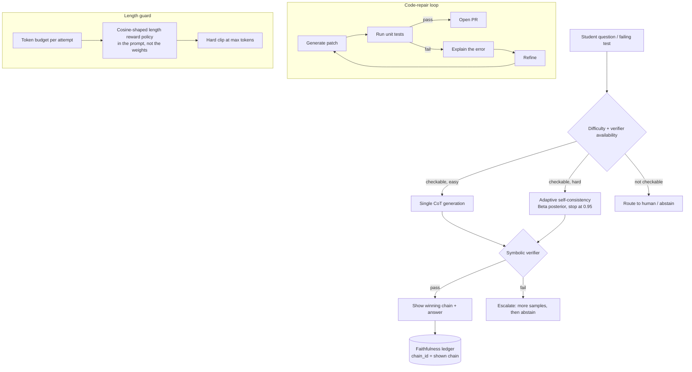

# Case Study: Test-Time Compute Policy for an Assessment and Code-Repair Product

> **Topic:** `T04` · **Transcript coverage:** primary · **Difficulty:** L4
> **One line:** How to allocate a per-request test-time compute budget across chain-of-thought, self-consistency and self-correction — and why the self-correction half of that budget is usually wasted unless something outside the model can check the answer.

## Table of Contents

- [1. The Scenario](#1-the-scenario)
- [2. Requirements](#2-requirements)
- [3. Architecture](#3-architecture)
- [4. Component Deep Dive](#4-component-deep-dive)
- [5. Decision Table](#5-decision-table)
- [6. Edge Cases & Exceptions](#6-edge-cases--exceptions)
- [7. Failure Modes & Mitigations](#7-failure-modes--mitigations)
- [8. Capacity & Cost Model](#8-capacity--cost-model)
- [9. Benchmarks & Measured Numbers](#9-benchmarks--measured-numbers)
- [10. Operational Runbook](#10-operational-runbook)
- [11. What Changes at 10x](#11-what-changes-at-10x)
- [12. Interview Walkthrough](#12-interview-walkthrough)

---

## 1. The Scenario

Northwind Learning ships two products on one inference estate.

**The tutor** answers a student's math question *and shows the working*. The explanation is the product — a correct answer with no visible reasoning fails review with the school districts that buy it. 900k questions a month, K-12 through early undergraduate, and a content team that reviews a sample of transcripts every week.

**The code-repair bot** is internal: it fixes failing unit tests in Northwind's own repositories. It has something the tutor does not — a test suite that will tell it, mechanically, whether it succeeded.

Both products sit on one GPU pool with a fixed monthly budget, and both are under pressure to adopt a reasoning model. Three forces shape the design.

**The cost pressure is real and quantified.** Self-consistency's price is stated plainly in the course: "if you want to sample a hundred of these then it's **100 times the inference cost**" `[T]` (CMU lecture 7). Any policy that multiplies inference by 100 has to justify itself per surface.

**The faithfulness problem is a product liability.** The tutor's explanations must correspond to the computation that produced the answer. The lecture's result is directly adverse: with biased few-shot examples, "they found accuracy drops uh and also **models generate confident explanations for both correct and incorrect answers**" `[T]` (CMU lecture 7). For a product whose deliverable *is* the explanation, an unfaithful chain is not a bug in a nice-to-have — it is a wrong answer delivered with a plausible justification, in front of children.

**The self-correction instinct is wrong here, and the course says so.** "intrinsic self-correction often fails without external feedback. And um performance can even **degrade** uh quite frequently if you're just asking it to self-correct itself" `[T]` (CMU lecture 8). The design question is therefore: **where do we get external feedback, and where do we admit we have none?**

## 2. Requirements

### Functional

| Requirement | Priority | Notes |
|---|---|---|
| Step-by-step solution, not just a final answer | P0 | Product deliverable |
| Verified final answer before it reaches a student | P0 | Schools contract on accuracy |
| Adaptive compute: easy questions must not cost the same as hard ones | P0 | Budget |
| Code-repair loop with test-execution feedback | P0 | The internal product |
| Faithfulness audit trail: the shown chain must be the sampled chain | P0 | Content review |
| Length control so no request exceeds the output cap | P1 | The exceed-rate failure mode `[T]` |
| Confidence signal for routing and for "I'm not sure" messaging | P1 | Uses the Beta posterior from adaptive self-consistency |

### Non-functional

| Requirement | Target | Rationale |
|---|---|---|
| P95 tutor latency | < 12 s | Classroom use; a student will not wait longer |
| P95 code-repair session | < 6 min | Agentic, multi-attempt ([T16](../01-case-studies/T16-agentic-inference.md)) |
| Cost per solved tutor question | ≤ 1.6x a single greedy CoT call | The adaptive-sampling budget |
| Cost per solved repair | ≤ 4x a single attempt | Loop budget |
| Self-consistency samples, hard cap | 16 | The lecture's own reference point — self-debugging was compared against self-consistency with **16 samples** `[T]` |
| Truncation-induced wrong answers | 0 | The exceed-rate crash `[T]` |
| Faithfulness-audited sample | 500 transcripts/week, human-reviewed | Product promise |

### Constraints and non-goals

- **We do not train a reasoning model in this phase.** No RL infrastructure exists yet, and the lecture is explicit that this is not a training course. The policy is inference-time only; the trained-model option is scoped in §5.1 and revisited in §11.
- **We do not use model-based verifiers where a rule-based verifier is possible.** The lecturer's own recommendation from his length-control work: "**rule-based verifiers basically work better than modelbased verifiers**" — and "if you want a shortcut to making things work, I recommend this. We've tried it several times since we did this paper and it works quite well" `[T]`.
- **We do not show a chain that was not the chain that produced the answer.** If we sample five chains and vote, we show the winning chain, not a post-hoc rationalization.
- **We do not promise that the tutor is right.** We promise it is verified against a symbolic checker where one exists, and honestly flagged where one does not.
- **We do not use self-correction on reasoning without external feedback.** The negative result is a design input, not a caution.

## 3. Architecture

Walkthrough: the first branch is **verifier availability**, not difficulty. That ordering is the design's core claim — difficulty determines *how much* compute to spend, but verifier availability determines *whether spending it helps at all*.

- **Checkable and easy:** one greedy CoT pass, symbolic check, ship.
- **Checkable and hard:** adaptive self-consistency — sample in small batches, maintain a Beta posterior over the top-1 vs top-2 answers, stop when the probability that more sampling changes the answer exceeds 0.95 `[T]`.
- **Not checkable:** route to a human queue or abstain explicitly. This is where the negative result bites; see §4.4.
- **Repair loop:** a genuinely different regime, because unit tests are real external feedback. The lecture's account: "they introduced code execution where you can do code generation. You actually execute the code to see if it passes unit tests," and on failure "you ask the language model to explain the error and then based on that you refine the critique" `[T]`.
- **Length guard:** a hard per-attempt token budget, because the failure mode is a crash, not a slowdown — §4.5.

## 4. Component Deep Dive

### 4.1 The formulation: reasoning as a latent variable

Lecture 7's framing: input `X` is the problem, the chain of thought `Z` is a **latent variable**, and `Y` is the answer. The goal is the best `p(y|x)` by "marginalizing over z. So summing over all Z so that we can get a better prediction of Y" `[T]`. Two claimed advantages: extra tokens give **adaptive computation time**, and if the chain is faithful, a human can walk through it.

The hard direction is mode-seeking: argmax over `y` of the sum over all `z` leading to `y`, and the count of `z` values is "essentially… close to **v to the power of 100**" `[T]` for a 100-token chain. The lecture's counterexample for the naive fix — jointly argmaxing over `z` and `y` — is worth internalising, because it is exactly what a beam-search-based reasoning pipeline would do. Question: "how many inches are there in 3 ft." A model that talks about centimetres with high probability gives the best joint `z`-`y` score but not the best `p(y)`: "y equals 36 you would get 0.6 where this is 0.4" `[T]`. The recommended direction is sampling: "ancestral sampling with a temperature of one is going to always be good enough uh in an auto regressive model" `[T]` — sample `z`, then sample `y`.

### 4.2 Why CoT exists at all, and where it helps

CoT was not engineered — it was **emergent**. The 2022 chain-of-thought paper "discovered that even without teaching the model or training the model in any way to do chain of thought it was able to do that" `[T]`. The explanation given is that training data already contains deduction sequences: "code," "stories," "proofs," and "a ton of grade school math online that has these deductions like explicitly written in it" `[T]`.

The scale claim is the one that aged fastest, and the lecturer gives both ends of it: these are "sufficiently strong models… like **GPT3 175b uh in 2022**. Now they're like **Qwen 2.5 1B** in uh in 2025" `[T]`.

Three routes to getting the behaviour `[T]`: **emergent** (elicited by prompting), **supervised fine-tuning** on data with explicit reasoning steps, and **reinforcement learning** with a reward for task success. To these the lecturer adds **mid-training**: "pre-train the model and then you throw in a lot of data that's like very high quality… right at the end of pre-training" `[T]`. His conclusion matters for how we buy models: "our base models are now half like supervised trained… things that might seem like they're they've just emerged in the base models actually already were there because… the people who pre-trained the models very carefully selected the data they showed at the end of training" `[T]`.

**Where it helps is narrower than the marketing.** A meta-analysis of "**100 plus papers**" plus a fresh evaluation on "**20 data sets across 14 models**" found "there's a **huge gain on things like uh math and deductive reasoning** and much less impressive gains on a lot of the others" `[T]`. The sharper version: taking MMLU and splitting questions by whether they contain an equal sign, "people were saying, Oh, chain of thought reasoning helps on MMLU. But basically it only helps with the math in MLU" `[T]`. The practical takeaways the lecturer gives: "if you want to use reasoning models, you should probably try them on math first," and "there's a big opportunity for coming up with more generalizable uh reasoning strategies" `[T]`.

For Northwind this is good news — the tutor is a math product, which is where the gains concentrate. It is also a warning for the code-repair bot, whose failure mode is not arithmetic.

### 4.3 Self-consistency, and the adaptive version that makes it affordable

**Self-consistency**: sample many reasoning paths, count answers, take the most frequent. Its scope limit is explicit: "Self-consistency only works in uh relatively simple cases like mathematical reasoning where it's like we have a single answer uh that's an integer. Um it will not work when we're generating essays" `[T]`. Cost: 100 samples means 100x.

**Adaptive self-consistency** — "a paper by **Pranjal Agarwal** who's a PhD student in LTI" — samples a small number first and keeps sampling until "the probability of the final sample you get after sampling an infinite number of samples" exceeds a threshold, checked "after each batch of generations" `[T]`.

The statistics, as taught:

- A **Dirichlet prior** is "a prior probability that you can put on discrete distributions." The motivation is the MLE embarrassment: seeing one `a` and no `b` or `c` gives MLE probabilities "One, right? Yeah. 1.0 and 0" — and the analogy, "you go to a new country and… it's sunny the first day. Do you think it's going to be sunny for eternity?" `[T]`
- The posterior is proportional to observed count plus `α · P_prior`. **α semantics:** "If alpha is higher you rely on the prior probability more… If alpha is zero this is maximum likelihood estimation" `[T]`.
- **The worked numbers:** observed counts 1, 0, 0 with **α = 3** gives pseudo-counts "2, 1, 1" and therefore a posterior of **0.5 for A, 0.25 for B, 0.25 for C** — "much more reasonable… You're not saying the probability of B or C is zero because you've never seen it before" `[T]`.
- Dirichlet is the **conjugate prior** for the multinomial ("as you add more evidence it's still a Dirichlet distribution"), but it is expensive over a full vocabulary, so "they simplify it to use something called the **beta distribution**" over only the **top-1 and top-2** outputs, with variables `P1`/`V1` and `P2`/`V2` — "you can look at the paper for the full derivation" `[T]`.
- **The threshold:** "they set this threshold to **0.95**, which basically says I have 95% confidence that if I sample more, I'm not going to get a different result" `[T]`.

The lecture does **not** report how many samples this saves; the lecturer calls it "a cool trick that you can do to save uh compute" without a figure `[T]`. We instrument it rather than assume it (§8).

### 4.4 Self-correction: the negative result and the narrow place it works

Lecture 8 surveys six self-refinement methods and one negative result. The template is uniform: generate → critique → stopping criterion → refine, always with "a certain number of maximum iterations and a stopping criterion" and "usually a hard stop here so that you don't… do this forever" `[T]`. The design axes that separate the methods: explicit vs implicit critique, whether the model is trained for it, what the refinement is conditioned on, and whether external tools are involved `[T]`.

The mechanisms that matter for Northwind:

| Method | Feedback source | Lecture's account |
|---|---|---|
| **Self-Refine** | The model itself | All prompting, no training. Feedback prompt asks "why is this output not correct or not fluent"; refine combines input + output + feedback. Stopping is "a simple heristic checking for positive feedback or a fixed number of iterations" `[T]`. Helped on readability, dialogue sentiment; "**notably did not help… as much on mathematical reasoning**" `[T]`. Bigger/stronger models benefited more. |
| **Self-Debugging** | **Unit-test execution** | Execute, get test feedback, and on failure "explain the error and then based on that you refine the critique" `[T]`. Compared against self-consistency: self-consistency needed **16 samples**, self-debugging **one** `[T]`. |
| **Reflexion** | External feedback + memory | Self-reflection generates "experience which turns into memory" that persists across iterations — "all the memory of the past critiques as opposed to just… the current step" `[T]`. |
| **Tool-using critic** | Tools the critic chooses | "the critic itself is allowed to use tools" — knowledge base, code interpreter, a sentiment API, a search engine — chosen per task `[T]`. Significant reported improvements. |
| **Edit vectors** | n/a (representation) | An edit encoder maps (before, after) to a single vector, limited to **512 dimensions** precisely so it learns *what kind of edit* this is "as opposed to… just like memorizing everything" `[T]`. |

**The negative result.** "large language models cannot self-correct reasoning yet" — the lecture's summary: "intrinsic self-correction often fails without external feedback. And um performance can even degrade uh quite frequently if you're just asking it to self-correct itself" `[T]`. Two mechanisms are named: models "struggle to identify their own errors," and "there's also a **confirmation bias**… a tendency to reinforce initial reasoning" `[T]`.

**The asymmetry that explains it:** "things that are difficult for the models to do are things that are also difficult for them to check" `[T]`.

Note what the lecture does **not** provide: no author attribution, no benchmark names, and no accuracy figures. The degradation claim is qualitative in the transcript `[T]`. Do not cite a number for it.

**Where it works, in the lecturer's own taxonomy** `[T]`: grammar, style and formatting; anything with external feedback — "things like code execution and factchecking you can get significant improvements"; and it works "significantly better with stronger base models." **Where it does not:** "deep reasoning errors like mathematical proofs in logic"; **knowledge gaps** — "if the model doesn't know… a particular fact, you can't really have it self-correct"; and "complex uh multi-step reasoning."

That taxonomy is the whole assignment for Northwind's two surfaces. The tutor is in the bad column (multi-step reasoning, no external checker). The repair bot is in the good column (code execution). One architecture, two answers.

### 4.5 Length, and the failure that kills a training run — and a request

Reasoning models use more tokens over training. R1's thinking time "naturally increases from **hundreds to thousands of tokens**… **maybe 800 tokens** or something at the very beginning… it starts using more and more and more tokens" `[T]`.

The failure mode, from the lecturer's own length-control work: models "would improve for a while and then they would suddenly **crash**… they were **exceeding the maximum output length** and some of these models had you know a fixed maximum output length and that's what we measured by the **exceed rate** and once they started exceeding the maximum output length they would be getting all of the the problems wrong basically because the **final answer was getting clipped**… basically just our training uh **died**" `[T]`.

The fix proposed there is a length-aware reward: correctness multiplied by a cosine that "**converge[s] to zero at the maximum output length**," so "if the answer is wrong we basically give a **larger negative reward when the answer is short**… And then if you're getting it right, make it shorter" `[T]`. Our inference-time analogue is not a reward but a policy: **budget the attempt so that the answer always has room to be emitted**, and never let a clipped generation be returned as an answer. The lecture's other length findings: "**7B models** really struggled to develop complex abilities"; "overexposure to short data hindered the long cot development"; and rule-based verifiers beat model-based ones `[T]`.

A second length pathology is diagnostic: response length "will stagnate for a while and then after it's stagnated for a while, it will increase um when the model has learned to like use more extensive… backtracking strategies" — and in R1's curve "the **first 200 steps**, the length doesn't increase at all" `[T]`. The warning: "could be completely misleading… if you think that the model has converged to a particular length." This matters for us when reading a vendor's length claims.

### 4.6 What a trained reasoning model would buy us

Even though Phase 1 is inference-only, the decision in §5.1 depends on what training would change, and the corpus is precise about it.

**STaR** ("the first paper uh that did this kind of from the point of view of LLMs") `[T]`: generate rationale + answer, check with a verifiable reward (typically math or code), keep correct chains, and — the distinctive step — for incorrect answers give a **hint** (the correct answer) and regenerate a rationale that matches, then fine-tune on the filtered data. "generate answers and rationales, filter correct chains based on reward, if correct keep the full chain, if incorrect generate a rationale given an answer, and then you fine-tune on the filtered data" `[T]`. Tested on a small model (transcript: "GPJ… 6B", i.e. GPT-J 6B) on arithmetic, common-sense QA and GSM8K.

The result that matters for budget-setting: "you could train the model quite well on **one digit addition**… without rationalization. Um but without rationalization things like **three-digit and four-digit** just… didn't work as well because you had very sparse rewards" — the model "wasn't able to get enough of the **five-digit**… addition ones correct in order to add them to the training data" `[T]`. With rationalization, "a much faster… uptake." **Four iterations** `[T]`. And the caution: "if you kind of like oversupervise reasoning models they bootstrap a lot faster but then they end up **plateauing at a worse place** than if you train them purely with reinforcement learning" `[T]`.

**DeepSeek R1**, as the lecture presents it: "**470 billion** parameters"; trained "with large-scale reinforcement learning directly on the base model"; "they did **no** supervised fine-tuning at all first… using an objective that they call **GRPO**" `[T]`. The only priming was a prompt template — the assistant "first thinks about the reasoning process in the mind and then provides the user with the answer," with the reasoning enclosed in **think/answer tags** `[T]`. The lecturer's surprise: "this actually was sufficient to get the model to do a good enough job at this," explained by a 470B internet-trained model being "able to pick up the fact that it should be following this template some of the time not all of the time but enough that it's able to learn from the results" `[T]`.

**The headline number:** AIME pass@1 starts "very low… like **15% top one accuracy**" and after training with a very large batch size reaches "**over 70% accuracy on AIME**" `[T]`; the lecture notes this is the R1-Zero self-consistency@16 curve. Training scale: "**8,000 steps**" for the R1 graph.

**Distillation, and the claim that reshapes the economics:** "you can distill the reasoning traces from these very large 470 billion parameter models down to models of more manageable sizes" — specifically a **32B** distilled model, and "**this 32B model is beating this 470B model**" (the base). The lecturer's framing: "you can spend like more tokens at inference with a smaller model and get uh better results. So this paradigm is really the one that made inference really really popular at the beginning of uh this year" `[T]`. Compare: training the small model from scratch with RL was "much less effective" than distilling from the big one, "basically just the larger model is more able to get like a decent non-zero accuracy" `[T]`.

**GRPO mechanics** `[T]`: generate a group of outputs for the *same* query, score each, and compute the advantage as "the **reward minus the mean of all of the rewards in the group divided by the standard deviation**." No critic: the group mean replaces the value-function baseline, and normalising by the group standard deviation keeps gradients "normalized to be in a reasonable range." The loss is the probability ratio (new policy over old) times the advantage, clipped to a band set by epsilon — "let's say **epsilon was 0.1** this would be clipped between **0.9 and 1.1**" — with the **minimum** of clipped and unclipped taken, which is what makes the clip asymmetric and prevents extreme updates. **Temperature is 1** for on-policy correctness: sampling at another temperature "you'd be off policy because you wouldn't be sampling from the policy that you're optimizing. And… **the only thing that gives you samples directly from the policy is temperature one**" `[T]`.

**Four cognitive behaviours** `[T]`: **verification** ("let me check my answer"), **sub-goal setting** ("let's try to get to a multiple of 10"), **backtracking** ("let's try a different approach"), **backward chaining** ("working backwards, 24 is 8 times 3"). Measured across models, "the qwen base model displayed more of all of these behaviors than the **llama 3B** model and the **llama 70B** model" — so "it's not just… **size**, it's also just kind of the underlying propensity of the model" `[T]`, attributed to mid-training and synthetic data differences.

**Why RL generalises better than SFT** — the lecturer's own paper, on **Qwen 3 14B** with math-only training data, SFT implemented as "rejection sampling with a Qwen 3 32B teacher," RL with answer correctness as reward. On other reasoning tasks both improved, "but they improved **more when they were trained using RL**." On non-reasoning tasks, RL-trained models "still improve somewhat, but the models trained uh with SFT actually **decreased**" `[T]`. The mechanism, in the lecturer's crisp phrasing: "**in GRPO you're downweing the negative sequences that were sampled that got a bad reward. And in SFT, you're upweing the one sequence that you sampled that got a good reward and downweing everything else.** So basically, you're modifying **every sequence** in SFT, whereas in RL you're only upweing and downweing like particular sequences" `[T]`. Token-probability analysis agreed: SFT led to "lots of change," RL to "relatively little change," concentrated in reasoning-related words.

## 5. Decision Table

### 5.1 How to obtain reasoning capability

| Option | Pros | Cons | Exceptions — when it breaks | When to use |
|---|---|---|---|---|
| Prompt-only CoT ("let's think step by step") | Zero training; works on strong models; the zero-shot variant was found by trying one prompt, and "they evaluated a whole bunch of other prompts and none of them were as good" `[T]` | Gains concentrate in math/symbolic tasks; "much less impressive gains on a lot of the others" `[T]` | Breaks on models below the emergence threshold — which the lecture notes has fallen from GPT-3 175B in 2022 to Qwen 2.5 1B in 2025 `[T]` | Phase 1, all surfaces — but only for the surfaces the meta-analysis supports |
| SFT on reasoning traces (including STaR-style) | Cheap relative to RL; works with a teacher; direct control of format | **Oversupervision plateau**: bootstraps faster, "ending up plateauing at a worse place than… purely with reinforcement learning" `[T]`; SFT degrades non-reasoning tasks in the lecturer's transfer experiments `[T]` | Breaks when the reward is sparse and the corpus is small — STaR without rationalization failed above two digits `[T]` | When you must control output format and have a strong teacher |
| RL from a base model (GRPO) | The mechanism behind the 15% → >70% AIME curve `[T]`; generalises to untrained reasoning tasks without damaging others `[T]` | Full RL infrastructure — rollout engine, group sampling, reward server; temperature must be 1 and rollouts must stay on-policy `[T]`; needs verifiable rewards | Breaks without a verifiable reward; and 7B-class models "really struggled to develop complex abilities" `[T]` | Phase 2, when a verifiable reward exists at volume |
| Distil from a frontier reasoning model | "this 32B model is beating this 470B model" `[T]`; no RL infrastructure; fastest path to a small reasoning model | Loses the ability to push beyond the teacher; licence and data-provenance questions | Breaks when the teacher's traces are wrong in ways your filter cannot detect | Phase 2 alternative, and the best cost/benefit for an inference-focused team |
| Buy a reasoning model as a service | Zero infrastructure | Per-token cost; reasoning models "are all using more tokens to think which means inference is becoming more expensive" `[T]`; no logit access, which rules out [T03](../01-case-studies/T03-constrained-generation.md) techniques | Breaks on data-residency requirements | Surfaces with no volume and no verifier |

**Chosen:** Phase 1 is prompt-only CoT with adaptive sampling; Phase 2 is distillation from a frontier reasoning model, not RL from scratch.
**Revisit if:** a verifiable reward appears at volume for the tutor (e.g. a symbolic math checker covering most of the curriculum), which would make GRPO viable on our own data.

### 5.2 Allocating test-time compute

| Option | Pros | Cons | Exceptions — when it breaks | When to use |
|---|---|---|---|---|
| Single greedy CoT | Cheapest; deterministic-ish | No error signal; a wrong chain ships | Breaks on any question where the model is confidently wrong | Easy quartile with a symbolic check |
| Fixed self-consistency, n = 16 | Simple; the lecture's own comparison point `[T]` | 16x cost on *every* question including trivial ones | Breaks on non-single-answer tasks — "it will not work when we're generating essays" `[T]` | When you cannot afford the bookkeeping of a stopping rule |
| Adaptive self-consistency (Beta, 0.95) | Spends compute where the answer is contested; the 0.5/0.25/0.25 posterior is a usable confidence signal | Requires a correct Beta update and careful batching; the lecture reports **no** samples-saved figure `[T]` | Breaks when the top-2 are equally likely and the model is confidently wrong — the posterior measures *agreement*, not correctness | Default for checkable hard questions |
| Beam/best-first search over chains | Enumerates structure | The joint-argmax trap: the "3 ft in inches" example gives a high joint `z`-`y` score with the wrong `y` `[T]`; see [T02](../01-case-studies/T02-search-decoding.md) | Breaks precisely on the reasoning tasks it is reached for | Never for this product |
| Sampling + reranking (best-of-n) | Any scorer works, including a symbolic checker | Needs a scorer; `n`× cost | Breaks when the scorer is a reward model with its own biases ([T05](../01-case-studies/T05-verifiers-best-of-n.md)) | When a cheap verifier exists |

**Chosen:** adaptive self-consistency, capped at 16, gated on verifier availability.
**Revisit if:** measurement shows the Beta posterior stops early on confidently-wrong answers — then raise the floor sample count rather than the threshold.

### 5.3 Self-correction by surface

| Option | Pros | Cons | Exceptions — when it breaks | When to use |
|---|---|---|---|---|
| No correction | Free; avoids the degradation risk entirely | Leaves easy wins on the table where feedback exists | — | The tutor's reasoning path |
| Self-Refine loop (no external feedback) | No infrastructure; helped on readability, style, sentiment `[T]` | "intrinsic self-correction often fails without external feedback. And… performance can even **degrade**" `[T]`; confirmation bias reinforces the original answer `[T]`; "notably did not help… as much on mathematical reasoning" `[T]` | Works on grammar/style/formatting; fails on multi-step reasoning and knowledge gaps `[T]` | Presentation-layer fixes only — formatting a solution, not computing it |
| Self-Debugging with execution (chosen for repair) | External ground truth; **16 samples vs 1** against self-consistency `[T]`; execution feedback "was really critical" `[T]` | Needs a sandbox; needs a test suite that actually covers the bug | Breaks when the tests are wrong or incomplete — the loop converges on passing tests, not correctness | Code, SQL, anything executable |
| Reflexion with persistent memory | Accumulates experience across attempts | Memory management; needs external feedback to be useful at all | Breaks if the memory is polluted by a bad critique | Multi-attempt sessions |
| Tool-using critic | The critic chooses its own verification; significant reported gains `[T]` | Most operational complexity — "spinning up a code sandbox is much much more operationally complex than just hitting a language model API" `[T]`; and cost | Breaks when the tool is slow or flaky — the critic's failure becomes the pipeline's failure | High-value, low-volume surfaces |

**Chosen:** Self-Debugging for the repair bot; **no** intrinsic self-correction on the tutor; a tool-using critic deferred to the human-review workflow.
**Revisit if:** the tutor gains a symbolic checker over most of the curriculum, at which point a checker-feedback loop becomes a legitimate correction mechanism — the lecture's "code execution and factchecking" category `[T]`.

### 5.4 Faithfulness handling

| Option | Pros | Cons | Exceptions — when it breaks | When to use |
|---|---|---|---|---|
| Show whatever the model produced | Zero cost; it is the product | Directly contradicts the finding that models "generate confident explanations for both correct and incorrect answers" `[T]`; for a school product this is the liability | Breaks whenever the answer is wrong *and* the chain looks plausible — the worst case | Never for an educational deliverable |
| Show the sampled chain that produced the verified answer, with the verification attached | The chain is causally the one that produced the answer; the verification is independently checkable | Does not prove the chain is *why* the model got it right | The chain can still be post-hoc relative to the model's internal computation | Default |
| Verify the chain step-by-step with a symbolic checker | Genuine step-level verification | Only possible where steps are formally checkable; expensive | Fails on word problems where the modelling step is informal | Where the curriculum is formalisable |
| Abstain when no verifier applies | Honest; preserves trust | Loses coverage | — | The not-checkable branch |

**Chosen:** show the sampled chain, attach the verification, and abstain where neither step-level nor answer-level verification applies.
**Revisit if:** content review shows the winning chain is consistently *not* the chain a human would use — that is the signal that the model is right for the wrong reasons, and it is a model-selection problem, not a policy one.

### 5.5 Output length

| Option | Pros | Cons | Exceptions — when it breaks | When to use |
|---|---|---|---|---|
| No cap | Never clips | Unbounded cost and latency; KV pressure ([T07](../01-case-studies/T07-kv-cache.md)) | — | Never |
| Hard cap with clipping | Cost-bound | **The crash**: answers "getting all of the problems wrong basically because the final answer was getting clipped" `[T]` | Catastrophic — a clipped reasoning trace is worse than a short one | Never as the only control |
| Cap with an instruction to conclude before the budget | Answers always emitted; cost-bound | Model must learn to obey the instruction — the S1 approach: "when it started… reaching the end of its token limit they cut it off and they said… **now answer** and it answered" `[T]` | Reliable only with models that follow budget instructions | Default at inference |
| Length-aware policy shaped like the cosine reward `[T]` | Rewards short-correct and long-wrong; avoids the crash | Requires training to be effective; at inference it is only a prompt-level heuristic | Inference-time version has no gradient — it is an instruction, not a reward | Phase 2, when training exists |

**Chosen:** a per-attempt token budget with an explicit conclude instruction, plus a hard clip that *discards* rather than truncates.
**Revisit if:** the clipped-attempt rate exceeds the abstention budget — that means the budget is too small, not that the model is bad.

## 6. Edge Cases & Exceptions

| Situation | Symptom | Handling |
|---|---|---|
| **The model is confidently wrong and self-consistent** | Adaptive sampling terminates at 0.95 with the wrong answer | The Beta posterior measures agreement, not correctness. Only a verifier catches this; where no verifier exists, we abstain. Do not raise the threshold — that just adds cost without adding information |
| **Top-2 are equally likely** | Posterior sits near 0.5 and never crosses 0.95 | Expected. The sample cap (16) bounds the cost; the question routes to the human queue |
| **Zero-shot CoT does nothing** | No chain appears | Model below the emergence threshold for the prompt format. The lecture's threshold has moved a long way (GPT-3 175B → Qwen 2.5 1B `[T]`), so a small model may need an explicit fine-tune instead |
| **Non-math question** | CoT does not help; the equal-sign analysis says MMLU gains are "basically… the math in MMLU" `[T]` | Route non-symbolic questions to a non-reasoning path with a different budget |
| **Repair loop converges on passing tests that do not cover the bug** | PR opens, bug persists | Generate a coverage signal as part of the feedback; treat "tests pass" as necessary, not sufficient. This is the classic verifier-gaming risk |
| **The critic itself fails** | Reflexion memory accumulates a bad critique and degrades subsequent attempts | Bound memory to the current session; validate critiques against the external signal before storing |
| **Knowledge gap presented as a reasoning error** | The model reasons fluently and wrongly | "if the model doesn't know… a particular fact, you can't really have it self-correct" `[T]`. Detect via retrieval availability; if the fact is not in the context, no amount of test-time compute fixes it |
| **Length stagnation misread as convergence** | Model appears to have settled at a length | R1's length "doesn't increase at all" for the **first 200 steps** `[T]`; length curves are "completely misleading" early. Do not tune budgets from a short evaluation window |
| **Truncation clips a correct answer** | Wrong answer from a right chain | Never return a clipped generation; discard and retry with a larger budget, or abstain. This is the exceed-rate crash in miniature `[T]` |
| **A stronger model is worse at self-correction** | A model swap changes the value of the correction loop | Self-correction "works significantly better with stronger base models" `[T]` — but the *need* for it also shrinks. Re-evaluate the loop, do not carry the configuration across |
| **Distilled student inherits the teacher's confident-error habit** | Faithfulness audit failures rise on the distilled model | Audit the distilled model separately; the lecture's distillation procedure filters for *correct* traces, which does not filter for *faithful* ones `[T]` |
| **Off-policy sampling in a training run** | Rewards stop tracking the policy | Temperature must be 1 for on-policy correctness `[T]` — flagged here because it is the first thing that goes wrong when a training phase starts |

## 7. Failure Modes & Mitigations

| Failure | Symptom | Detection | Blast radius | Mitigation | Recovery |
|---|---|---|---|---|---|
| Confident wrong answer ships | Student sees a wrong, plausible solution | Content-review sample; symbolic verifier where available | One student, reputational | Verifier gate before display; abstain when no verifier | Re-run the review sample; expand the verifier coverage |
| Adaptive sampling never terminates | Cost per question above budget | Distribution of samples-per-question; alert at the cap | Budget | Hard cap at 16; the cap *is* the termination guarantee | Raise the cap only with evidence, never by default |
| Self-correction degrades a correct answer | Accuracy falls after the refine step | A/B on a frozen set with correction on and off | Whole tutor surface | Do not run intrinsic self-correction on reasoning `[T]`; keep it for presentation only | Disable the loop; re-baseline |
| Clipped generation returned | Wrong answer or truncated text | Truncation counter; assert final answer present | One request | Discard clipped attempts; conclude instruction | Retry with a larger budget |
| Repair loop never converges | Session exceeds its time budget | Attempts-per-session histogram | One session | Bound attempts; on exhaustion, hand the failing test to a human with the last critique attached | Escalate |
| Distillation inherits unfaithful chains | Faithfulness audit fails after a model swap | Audit on the new model, separately | Whole surface | Audit gates the rollout, not just the accuracy gate | Roll back the student model |
| Verifier passes a wrong answer | A symbolic checker with a bug in it | Independent spot-check of verified answers | Whole surface | Verifiers are code and get code review; test the verifier against known-wrong answers | Fix the verifier, re-run the affected window |
| Compute spend concentrates on a few hard questions | Cost distribution has a long tail | Cost-per-question p99 dashboard | Budget | Difficulty-based routing and a per-question ceiling ([T14](../01-case-studies/T14-routing-gateways.md)) | Tier the service |

## 8. Capacity & Cost Model

Arithmetic is mine; assumptions are shown.

**Assumptions**

| Input | Value | Basis |
|---|---|---|
| Tutor questions per month | 900k | §1 |
| Average CoT output, single sample | 600 tokens | `[D]` |
| Hard questions requiring sampling | 30% | `[D]` |
| Sample cap | 16 | `[T]` the lecture's comparison point |
| Mean samples under adaptive stopping | 5 | `[D]` assumption — the lecture gives no figure `[T]` |
| Code-repair sessions per month | 6k | `[D]` |
| Attempts per repair session | 3 | `[D]` |
| Relative cost of a 32B reasoning model vs a 470B model per token | 1 : 8 | `[D]` rough scaling by parameter count |

**Step 1 — test-time compute multiplies the cheapest unit, and that is the whole budget story.** Tutor baseline: `900k × 600 = 540M` output tokens/month. With adaptive sampling on 30% of questions at a mean of 5 samples: `270k × 600 × 5 = 810M`, plus `630k × 600 = 378M` for the rest, giving `1,188M` — a **2.2x** multiplier on tokens for a policy that is capped at 16. Compare a fixed n = 16 on all questions: `900k × 600 × 16 = 8,640M`, a **16x** multiplier. The adaptive policy is `1,188 / 8,640 = 13.8%` of the naive policy's compute. Even at the assumed mean of 5, if the true mean turns out to be 10, the multiplier rises to `(270k × 600 × 10 + 378M) / 540M = 3.7x` — which is why §2's target of ≤ 1.6x is stated as a target and instrumented rather than asserted.

**Step 2 — the repair loop is cheaper than it looks, because of the 16-vs-1 result.** Self-consistency needed 16 samples; self-debugging needed one, plus execution `[T]`. Repair at 3 sequential attempts with 600-token outputs is `6k × 3 × 600 = 10.8M` tokens — negligible against the tutor. The cost is **latency and sandbox compute**, not tokens: three test-suite runs per session, each potentially minutes on a large repository. That is why the repair SLO in §2 is expressed in minutes, not tokens.

**Step 3 — small-model-plus-more-tokens versus big-model-fewer-tokens.** The lecture's claim is that a distilled 32B can beat the 470B base `[T]`. Worked against our assumed 8:1 per-token cost ratio: if the 32B needs 4x the tokens to match the 470B on a task, cost goes `1 × 4 = 4` units versus `8 × 1 = 8` — **half the cost at parity**, which justifies distillation on cost alone even before quality. Break-even is at a token multiplier of **8x**: beyond that, the big model wins per request. That 8x is the number to measure, not assume.

**Step 4 — the faithfulness audit is a fixed cost, not a per-token one.** 500 transcripts/week of human review at `[D]` 6 minutes each is `500 × 6 / 60 = 50` reviewer-hours per week — roughly 1.25 FTE. This does not scale with volume, which is the point: it is a *sampling* control, and at 10x volume the sample must grow or the confidence interval widens (§11).

**Sensitivity**

| Scenario | Effect |
|---|---|
| 10x questions | Token cost scales linearly; the audit's statistical power collapses unless the sample grows. The binding constraint becomes the verifier's throughput, not the GPU |
| 0.1x questions | Fixed self-consistency at n = 16 becomes affordable; the adaptive machinery is not worth building |
| Adaptive mean is 10 not 5 | Tutor multiplier rises from 2.2x to 3.7x — still far below 16x, so the decision does not invert, but the §2 target needs revising |
| Verifier coverage reaches 80% of the curriculum | The abstention branch shrinks and the confidence signal becomes the product's main output; the case for a trained reasoning model strengthens |
| A trained reasoning model is adopted | Length grows (the R1 pattern: hundreds → thousands of tokens `[T]`), so the cost model must be re-run; the KV implications land in [T07](../01-case-studies/T07-kv-cache.md) |

## 9. Benchmarks & Measured Numbers

| Metric | Value | Source | Conditions |
|---|---|---|---|
| Self-consistency cost at 100 samples | 100x inference | CMU lecture 7 `[T]` | Stated as the method's cost |
| Adaptive self-consistency threshold | 0.95 | CMU lecture 7 `[T]` | Beta posterior over top-1/top-2; samples saved **not** reported |
| Dirichlet α in the worked example | 3 | CMU lecture 7 `[T]` | Counts 1,0,0 → pseudo-counts 2,1,1 → posterior 0.5 / 0.25 / 0.25 |
| Latent-space size for a 100-token chain | "close to v to the power of 100" | CMU lecture 7 `[T]` | The marginalization intractability argument |
| Zero-shot CoT vs biased-context accuracy | Accuracy drops with biased examples | CMU lecture 7 `[T]` | Direction only — no figure given; tested on **Claude 1.0, 2023** |
| Emergence threshold for CoT | GPT-3 175B (2022) → Qwen 2.5 1B (2025) | CMU lecture 7 `[T]` | The lecturer's own comparison across time |
| CoT meta-analysis scope | 100+ papers; 20 datasets; 14 models | CMU lecture 7 `[T]` | Gains concentrated in math and deductive reasoning |
| Self-Debugging vs self-consistency | 1 sample vs 16 samples | CMU lecture 8 `[T]` | The concrete comparison the lecture highlights |
| Intrinsic self-correction | "performance can even degrade… quite frequently" | CMU lecture 8 `[T]` | **Qualitative only** — no benchmark, no accuracy figure, no author attribution in the transcript |
| Edit-vector dimensionality | 512 | CMU lecture 8 `[T]` | Deliberately small to force a general representation rather than memorization |
| STaR model and tasks | ~6B model; arithmetic, common-sense QA, GSM8K | CMU lecture 9 `[T]` | Transcript renders the model name as "GPJ"; four iterations |
| STaR sparse-reward limit | 1-digit works; 3-, 4-, 5-digit need rationalization | CMU lecture 9 `[T]` | "very sparse rewards"; no percentages given |
| R1 parameter count | 470B | CMU lecture 9 `[T]` | Base model for R1 |
| R1 AIME progression | ~15% pass@1 → over 70% | CMU lecture 9 `[T]` | Reported on the R1-Zero self-consistency@16 curve, trained 8,000 steps with a very large batch |
| R1 thinking length growth | ~800 tokens → thousands | CMU lecture 9 `[T]` | "hundreds to thousands"; first 200 steps show **no** length growth |
| Distillation | 32B distilled model beats the 470B base on reasoning | CMU lecture 9 `[T]` | The lecturer's framing of the R1-Distill result |
| GRPO clip ε | ≈ 0.1 → ratio clipped to [0.9, 1.1] | CMU lecture 9 `[T]` | Worked example value |
| GRPO sampling temperature | 1 | CMU lecture 9 `[T]` | Required for on-policy correctness |
| 7B-scale limitation | "7B models really struggled to develop complex abilities" | CMU lecture 9 `[T]` | From the lecturer's length-control work |
| Stream-of-search data | 500k search trajectories on Countdown | CMU lecture 9 `[T]` | Best-first-search variant traced into CoT |
| S1 data budget | ~1,000 curated reasoning examples | CMU lecture 9 `[T]` | Qwen 2.5 32B, SFT only, budget forcing |

Vendor claims: none are quoted here; the topic's sources are lectures. Note the lecture's own caveat on the R1 length curve and the STaR plots — it explicitly warns that early length behaviour is misleading.

## 10. Operational Runbook

**Deploy**
1. Reasoning budget is a versioned policy object per surface, resolved like [T01](../01-case-studies/T01-sampling-decoding.md)'s sampling policy — not a per-call parameter.
2. The verifier ships with the policy. A policy with no verifier may only run on surfaces where abstention is acceptable.
3. Faithfulness audit runs before rollout, on the new model *and* the new policy, separately.
4. Canary by difficulty tier; hard questions change behaviour first.

**Tune — in this order**
1. **Fix the verifier first.** Everything downstream depends on whether one exists. Coverage is the highest-leverage number in the system.
2. **Then the sample cap.** Start at 16 (the lecture's reference point), measure the samples-per-question distribution, and lower the cap only if p99 cost demands it.
3. **Then the stopping threshold.** 0.95 is the paper's value; treat it as a starting point and check the confidently-wrong rate against it — not the sample count.
4. **Then the length budget**, using the observed distribution of chain lengths plus headroom for the answer.
5. **Never tune the correction loop and the sampling budget in the same experiment.** They interact: a correction loop that changes answers defeats the purpose of a majority vote.

**Monitor**
- Samples per question (histogram, p50/p99); alert on cap saturation.
- Verifier coverage: fraction of questions with an available check.
- Abstention rate — a rising abstention rate is a *good* signal if coverage is falling and a bad one if coverage is stable.
- Confidence-signal calibration on the audited sample (does 0.95 posterior mean ~95% correct?).
- Clipped-generation count, which must be zero by construction.
- Faithfulness audit results, weekly, with the sample size recorded.
- Cost per solved question, by difficulty tier.

**Incident — top 5**
1. **Wrong verified answer reaches a student.** Symptom: a content-review catch. Diagnosis: is the verifier wrong, or is the model wrong in a way the verifier cannot see? Action: suspend that verifier, re-run the affected window, and treat it as a verifier bug until proven otherwise.
2. **Cost spike on the tutor.** Symptom: budget burn rate. Diagnosis: samples-per-question distribution has moved; usually a difficulty-routing regression or a prompt change. Action: tighten routing, then the cap.
3. **Repair loop runs forever.** Symptom: sessions hitting the time limit. Diagnosis: check whether the test suite is passing on a different bug, or whether the model cannot reproduce the failure. Action: bound attempts, escalate with the last critique attached.
4. **Faithfulness audit failure after a model swap.** Symptom: audit catches confident wrong chains. Diagnosis: the new model's chain distribution differs. Action: roll back the model, re-baseline the audit on the candidate.
5. **Clipped answers.** Symptom: answers that end mid-thought. Diagnosis: the length budget was set below the observed chain distribution's p99. Action: raise the budget; the fix is never to return the clipped text.

## 11. What Changes at 10x

- **The verifier becomes the platform.** At 10x questions, verifier coverage determines what fraction of traffic gets a guarantee; everything else is abstention or human review. Investing in verifiers has a better return than any sampling change.
- **Human review stops scaling and must be redesigned.** 1.25 FTE at 900k questions becomes 12.5 FTE at 10x, which is a department. The alternative is stratified sampling with a fixed budget — audit each difficulty tier at a fixed rate, and accept the wider interval on rare tiers.
- **Distillation moves from optional to necessary.** The cost model says a distilled student at up to 8x tokens is still half the cost of the teacher (§8). At 10x volume, that gap is a headcount.
- **Training becomes justified.** At 10x, the fixed cost of RL infrastructure amortises; the corpus's evidence is that RL generalises to untrained reasoning tasks while SFT degrades them `[T]`, which matters when the tutor's surface expands beyond math into subjects the meta-analysis says CoT does not help with.
- **What inverts:** *use the largest model with the fewest tokens* becomes *use the smallest model that can reason at all, with a large token budget* (the author's formulation of the inversion, not a transcript quote) — the 32B-beats-470B claim `[T]` is the mechanism. Note the caveat: 7B-class models "really struggled to develop complex abilities" `[T]`, so that strategy has a floor.
- **What survives:** verifier-first routing, no intrinsic self-correction on reasoning, and adaptive sampling with a hard cap. Those are structural.

## 12. Interview Walkthrough

**Whiteboard order (35 min)**
1. The two surfaces and their asymmetry: the tutor has no external checker; the repair bot has unit tests. Say that this, not difficulty, is the primary routing variable.
2. The latent-variable framing: `X` problem, `Z` chain, `Y` answer; marginalise over `Z`; `v^100` makes exact marginalisation impossible, so we sample.
3. The joint-argmax trap — "how many inches in 3 ft" — and why beam search over chains is the wrong tool.
4. Self-consistency and its 100x cost, then adaptive self-consistency with the Dirichlet intuition and the actual numbers: α = 3, counts 1,0,0 → 2,1,1 → 0.5/0.25/0.25, threshold 0.95.
5. The negative result and the asymmetry: "things that are difficult for the models to do are things that are also difficult for them to check." Place both surfaces on the taxonomy.
6. Self-Debugging's 16-vs-1 result as the payoff for external feedback.
7. Close on length: the exceed-rate crash, the cosine reward, and the rule that a clipped generation is never returned.

**The two numbers to say out loud**
- **16 vs 1** — self-consistency's samples against self-debugging's, for comparable or better results. It is the whole argument for external feedback in one line.
- **~15% → >70% on AIME** — the R1 progression. It is the reason test-time compute became a budget line rather than a research curiosity.

**The tradeoff to volunteer before you are asked:** more test-time compute only helps when something can check the result. Say that the tutor's hard questions get *less* benefit per token than the repair bot's, because the tutor has no external verifier — and that this is why the design abstains rather than loops.

**Follow-ups**

1. *Why not self-correct the reasoning?* — Because intrinsic self-correction degrades reasoning performance without external feedback, models struggle to identify their own errors, and confirmation bias reinforces the initial answer. There is no fix at the prompt level.
2. *Where is self-consistency invalid?* — Any task without a single discrete answer. The lecture is explicit that it works for "mathematical reasoning where… we have a single answer… an integer" and not for essays.
3. *What does α do in the Dirichlet prior?* — It sets how much to lean on the prior. α = 0 is maximum likelihood, which is the 1.0/0/0 embarrassment; higher α leans on the prior. Concretely, α = 3 with counts 1,0,0 gives a 0.5/0.25/0.25 posterior.
4. *Why does RL generalise better than SFT?* — Because GRPO downweights the negative sampled sequences, whereas SFT upweights the one good sequence and downweights everything else — so SFT modifies every sequence and damages unrelated capabilities, while RL only moves the sampled ones.
5. *What is the failure mode of a reasoning model at inference?* — Length explosion into clipping, which turns a correct chain into a wrong answer when the final answer is cut off. Budget the attempt so the answer always has room.
6. *Why rule-based verifiers over model-based ones?* — The lecturer's own recommendation: rule-based verifiers work better, and it is the shortcut he recommends to others. A model-based verifier reintroduces every bias of the generator ([T05](../01-case-studies/T05-verifiers-best-of-n.md)).
7. *Does CoT help everything?* — No. The meta-analysis finds large gains on math and deductive reasoning and much weaker gains elsewhere, and on MMLU the benefit is essentially confined to the questions containing an equal sign.
8. *What would make you train instead of prompt?* — A verifiable reward at volume. That is the precondition for RL, and with it the corpus's evidence is that RL from a base model with no SFT can reach the AIME range quoted here. Without it, distil from a model that had one.

## Sources

- `refs/CMU_Inference_Algorithms_for_Language_Modeling_Fall_2025_transcripts/CMU_LLM_Inference_7_Chain_of_Thought_and_Intermediate_Steps.txt` — adaptive computation time (Graves 2016, halting unit, ponder cost), the latent-variable formulation and the `v^100` intractability, the joint-argmax counterexample, emergent CoT and the moving scale threshold, the three learning routes and mid-training, zero-shot CoT, self-consistency and its 100x cost, adaptive self-consistency with the Dirichlet/Beta mechanics and α = 3 worked example, CoT faithfulness and the biased-example experiment on Claude 1.0, the 100+-paper meta-analysis and the MMLU equal-sign finding, complexity-based prompting.
- `refs/CMU_Inference_Algorithms_for_Language_Modeling_Fall_2025_transcripts/CMU_LLM_Inference_8_Self-Refine_and_Self-Correction_Methods.txt` — the four design axes, the seven papers (2017 two-pass, edit-process modelling, edit vectors at 512 dimensions, Self-Refine, Self-Debugging with the 16-vs-1 comparison, Reflexion, the tool-using critic), the negative result and the hard-to-do/hard-to-check asymmetry, and the taxonomy of when self-correction works.
- `refs/CMU_Inference_Algorithms_for_Language_Modeling_Fall_2025_transcripts/CMU_LLM_Inference_9_Reasoning_Models.txt` — STaR and rationalization with the sparse-reward digit results and the oversupervision warning, R1's 470B parameters and 15%→70% AIME progression, the think-tag prompt template, thinking-length growth and the 200-step plateau, the aha-moment passage, distillation to 32B and the 32B-beats-470B claim, GRPO in full (group-normalised advantage, no critic, the clip at ε ≈ 0.1 and the min, temperature 1), the four cognitive behaviours, length control and the exceed-rate crash with the cosine reward, S1 and budget forcing, LCPO, the RL-vs-SFT transfer results on Qwen 3 14B, stream of search and adaptive parallel search.
- `refs/CMU_Inference_Algorithms_for_Language_Modeling_Fall_2025_transcripts_2/CMU_LLM_Inference_2_Probability_Review_and_Code_Examples.txt` — the latent-variable/self-consistency framing of marginalisation over reasoning traces.
- `refs/ai-system-design-guide-main/ai-system-design-guide-main/16-case-studies/01-enterprise-rag.md` — house style reference.
