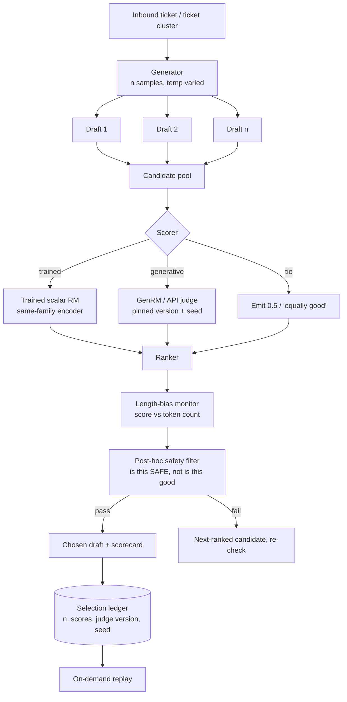

# Case Study: Verifiers and Best-of-N for a Support Drafting Pipeline

> **Topic:** `T05` · **Transcript coverage:** primary · **Difficulty:** L4
> **One line:** Whether to rerank sampled outputs with a trained scalar reward model, a generative judge behind an API, or nothing at all — and what a "best-of-32" claim actually guarantees when the thing doing the ranking is itself a model.

## Table of Contents

- [1. The Scenario](#1-the-scenario)
- [2. Requirements](#2-requirements)
- [3. Architecture](#3-architecture)
- [4. Component Deep Dive](#4-component-deep-dive)
- [5. Decision Table](#5-decision-table)
- [6. Edge Cases & Exceptions](#6-edge-cases--exceptions)
- [7. Failure Modes & Mitigations](#7-failure-modes--mitigations)
- [8. Capacity & Cost Model](#8-capacity--cost-model)
- [9. Benchmarks & Measured Numbers](#9-benchmarks--measured-numbers)
- [10. Operational Runbook](#10-operational-runbook)
- [11. What Changes at 10x](#11-what-changes-at-10x)
- [12. Interview Walkthrough](#12-interview-walkthrough)

---

## 1. The Scenario

Meridian is a B2B SaaS company with a 300-person support organisation. Two systems generate text that reaches customers or the public knowledge base:

**Draft Assist** proposes a reply to every inbound ticket — 1.2M drafts a month across 14 languages. Agents accept roughly 40% unedited, edit another 45%, and discard the rest. Every draft that a customer reads carries Meridian's name.

**KB Writer** drafts help-centre articles from resolved ticket clusters. Lower volume (about 9k articles a month), higher stakes: an article is published once and read for years.

Both currently return the *first* sample from a temperature-0.7 decode. The obvious upgrade — sample several and pick the best — runs straight into three constraints that decide the design.

**The ranking signal is the whole problem, and everything else is arithmetic.** The course states the requirement precisely: "We're going to **sample n things**. We're going to **rank them according to something other than the log probability from our original model** because if we were doing that, we would just be doing some kind of variant of **mode seeking search**" `[T]` (CMU lecture 12). We cannot use the model's own likelihood. Something else has to judge.

**The judge is a model, and that is a known-weak foundation.** The lecture's own guardrail: "**best of N plus a reward model can be better but it's not guaranteed** like reward modeling is **very very hard**… I don't want to minimize the difficulty of this. It's it's definitely hard" `[T]`.

**Legal wants a defensible record, and the cheap option is the least defensible.** The obvious move is an off-the-shelf LLM-as-judge behind an API — no training, no data, adapts when the brand voice changes. But the lecture documents exactly why that is fragile: generative reward models "are **inconsistent across calls**," and "**most API models are non-deterministic even at temperature zero**" `[T]`. A pipeline that ranks 32 drafts with a judge that can flip its verdict between calls has no audit trail at all. Meanwhile the support org's annotators themselves disagree — a show-of-hands in the lecture on two similar outputs landed "**maybe 50/50, maybe slightly towards two**" `[T]` — so "defensible" cannot mean "objectively right."

## 2. Requirements

### Functional

| Requirement | Priority | Notes |
|---|---|---|
| Sample `n` drafts and select one by a score other than model log-probability | P0 | The core mechanism `[T]` |
| Selection decision recorded per draft: chosen, runner-up, score, judge version | P0 | Legal/audit |
| Judge must be reproducible for a fixed input on demand | P0 | Replay requirement |
| Two judge options: trained scalar and generative, switchable per surface | P0 | §5.1 |
| Verbosity control: length must not be the reason a draft wins | P0 | The reward-model-specific bias `[T]` |
| Tie handling: "these are equally good" must be representable | P1 | RewardBench v2's tie notion `[T]` |
| Content-safety filter as a distinct post-hoc stage | P0 | Not a reward model `[T]` |
| Per-surface `n` and decoding diversity settings | P1 | §5.2, §5.4 |

### Non-functional

| Requirement | Target | Rationale |
|---|---|---|
| Rerank cost multiplier, Draft Assist | ≤ 8x the single-sample path | The budget |
| Rerank cost multiplier, KB Writer | ≤ 32x | Low volume, high stakes |
| Judge-side latency added to P95 | ≤ 400 ms | Must not dominate the draft |
| Judge determinism, same input twice | Byte-identical score | Audit requirement |
| Judge determinism, input order swapped | Score difference < 0.02 | The order-sensitivity failure `[T]` |
| Length correlation of judge score | \|ρ\| < 0.15 on the audit set | Verbosity bias control `[T]` |
| Annotator agreement on the audit set | Reported, not targeted | The 50/50 result `[T]` means disagreement is expected data, not a defect |

### Constraints and non-goals

- **We are not doing RLHF.** The lecture is explicit that the course covers reward models but "RLHF is not covered much in this class" `[T]`; we train a preference model and use it to rank, not to update the generator. Whether the generator should be trained against this signal is a separate decision.
- **We do not use the generator's own log-probability as the ranker.** That is mode-seeking search with extra steps `[T]`.
- **We do not apply the reward model to partial outputs.** "if you have a reward model that was **not trained for this** um you **shouldn't try to apply it over subsequences** at least without doing some kind of **heavy pre-processing**" `[T]`.
- **We do not treat the safety filter as a reward model.** It answers "is this safe," not "is this good" `[T]`, and it is applied post hoc.
- **We do not assume the judge is objective.** Preference data encodes "whoever annotated the data or more upstream whoever wrote the annotation instructions" `[T]`; our job is to know whose values are encoded and disclose it.

## 3. Architecture

Walkthrough. The generator produces the pool; the scorer ranks it; the *ranker* is deliberately a separate component from the scorer, because length normalisation and tie handling belong to the selection policy, not to the model. The safety filter is downstream of ranking and is a different kind of thing entirely: "these types of filters are **not actually trained into the model**. Generally these are applied **post hawk** [post hoc]. Um which is why you can **see sort of outputs that partially cut off**" `[T]`. Filtering after selection, and then falling through to the next-ranked candidate, is what prevents the visible mid-response cutoff. The ledger exists because a reranker without a replay path is unauditable.

## 4. Component Deep Dive

### 4.1 Rejection sampling: what best-of-N is a special case of

The lecture frames best-of-N inside rejection sampling. We have a target `D` we want samples from but cannot sample directly — "a distribution that is kind of **hard in practice to write down** and hard to directly draw samples from" `[T]`, namely the distribution of human preference. We define a proposal `P` whose support is "**at least as large as D**["s] support," so that "**everywhere that D has nonzero probability, we need to have non-zero probability**" `[T]`. We accept a sample with probability `D(x) / (C · P(x))`, where `C` is "the **tightest upper bound**" large enough that target probability never exceeds `C` times proposal probability — chosen so the acceptance ratio is a **well-defined probability distribution** bounded in `[0, 1]` `[T]`.

The lecture is careful to distinguish this from the earlier constrained-decoding discussion, where rejection sampling was the wrong tool: "when we talked about this for constrained decoding a couple of weeks ago, we were pretty much… **strongly against this idea of rejection sampling**… you could wind up kind of **stuck in this space where you're generating forever**. Um the difference here is that we're only kind of interested in **relative behavior**" `[T]`. That distinction is the license for the whole design: **best-of-N does not require an accurate probability, only a correct relative ordering.** It is a ranking problem, not a calibration problem.

And it explains the fallback. Because only relative behaviour matters, "we're **not going to keep sampling** if those are all low probability… so we're just going to return the sort of **least bad of our samples**" `[T]`. A bounded budget with a possibly-bad answer is the accepted contract — which is exactly why the audit trail matters and why abstention has to be a policy decision, not an accident.

### 4.2 The KL bound, and the way it is usually misquoted

The result the lecture spends most time on: "there's this pretty frequently cited number in the literature which is that you can draw this sort of **loose upper bound** on the divergence between the **KL divergence between your best of end outputs distribution and your target distribution** as **log n minus n minus one over n**" — `log n − (n−1)/n` `[T]`.

The worked usage given: "if you had say a **thousand** um inputs and for each of them you did best of n with **n equals 50**, you could **bound the uh the kl divergence** between the distribution of your best output from each of those and the distribution of your target which is sort of the preference distribution" `[T]`.

My arithmetic on the bound itself — this is a bound, not a measurement, and the values are mine `[D]`:

| `n` | `log n` | `(n−1)/n` | bound |
|---|---|---|---|
| 2 | 0.693 | 0.500 | 0.193 |
| 4 | 1.386 | 0.750 | 0.636 |
| 8 | 2.079 | 0.875 | 1.204 |
| 16 | 2.773 | 0.938 | 1.835 |
| 32 | 3.466 | 0.969 | 2.497 |
| 50 | 3.912 | 0.980 | 2.932 |
| 100 | 4.605 | 0.990 | 3.615 |

Read that table carefully, because it contains the trap. **The bound increases with `n`, while the quantity it bounds decreases with `n`.** The lecture's interpretation of the figure is unambiguous about the direction of the real quantity: "the higher the end, the closer you're getting to sort of the target distribution that you've defined" `[T]`. In the source figure, the dotted blue line is this bound, the red line is "a **much tighter sort of more complex bound**," and the black dots are the "**empirical kal[e] divergence** between a best of end policy and the uh target distribution as n grows" `[T]`. The bound is loose enough that it is monotone in the wrong direction. **Do not use it to choose `n`; use it only to know that a bound exists.**

The lecture says this itself, in stronger terms: this "is often quoted as an **exact value** like this is this will be the KL divergence um or at least as a **very tight bound**. There's actually some very interesting work um in the theory direction which argues that this is **not an in[t]ight upper bound for a number of sort of edge cases some of which do occur in practice**" `[T]`. The paper is attributed as "a really excellent paper by **Barami at all** [Beirami et al.]" `[T]`; the tighter bound is "like **equation 25** in this paper," and the derivation is "a **long derivation**… which I think is quite interesting to read, but we're **not going to go through in depth today**" `[T]`.

Two things are **not** in the transcript and must not be attributed to it `[T]`: it does not state that `n = 1` gives zero, and it does not use the phrase "diminishing returns." Both are true of the formula and both are reasonable, but say them as your own derivation `[D]` if you say them at all: at `n = 1` the expression is `log 1 − 0/1 = 0`, which is consistent with best-of-1 being the generator itself.

### 4.3 Choosing `n`: the hardware argument

The lecture's rationale for the specific value 32 is refreshingly physical, and it is the one most engineers get wrong by treating `n` as a quality dial:

> "you could choose to set the value of n um to be **something related to your hardware**. Like maybe if you can **generate 32 things in a single batch**, but you would have to use um a **second batch or a second pass or a second GPU to generate the 33rd thing**, you could **set n to be 32**." `[T]`

`n` is a **batch-fit parameter**. Going from 32 to 33 costs a whole extra batch — a step function in cost, not a smooth increment. And the second half of the argument is that `n` should be problem-specific: for "what's 2 plus two, you probably **don't need to do like n equals 100** and choose from your 100 examples that probably all say something like four" `[T]`.

### 4.4 Generation is more expensive than scoring

This asymmetry is stated twice in the lecture and it shapes the architecture more than anything else:

> "because when you generate you have to **wait for each um uh new token to be generated** um whereas when you're scoring you can **pass everything through as one block**. Um and also when you generate you're generating **many things**. When you're scoring you're scoring sort of only a few things." `[T]`

The consequence the lecturer draws is that you can play a smaller generator against a larger reward model, or vice versa `[T]`. For Meridian this is the central cost lever: the generator is one model producing `n` sequences *autoregressively*, while the scorer sees all `n` complete drafts *in parallel, in one forward pass*. So a large scorer is cheap relative to a large generator, and the natural configuration is a small fast generator with a disproportionately strong judge. Note what this does to the §4.2 bound: it means the *quality* of the judge, not the size of `n`, is where the marginal dollar should go.

### 4.5 Diversity in the pool

A reranker cannot select what the sampler never produced. The lecture's concrete warning:

> "if you know you're generating a 100 things and you know **temperature sampling with temperature point 2 gives you only maybe 20 unique things on average**, you could try varying temperature." `[T]`

Two consequences. First, `n` is not the size of the candidate set — it is the size of the *sample*, and the effective set is smaller. Second, the obvious fix has a cost the lecture flags: sampling at several temperatures or from several models "**are sort of not well defined if you are changing what your proposal distribution is** across the process of sampling that set." The example is exact: "**best of 50 but you got 20 of those outputs from Quen and 10 of those outputs from GPD5 and 20 of those outputs from Quen but with like a completely different set of decoding settings**. Now you **no longer have sort of one proposal distribution**" `[T]`. The rejection-sampling framing formally breaks. The practical verdict: "this is **still quite effective in practice** though" `[T]`.

The engineering resolution: vary temperature only where the *purpose* is diversity, keep the proposal distribution fixed where auditability is required, and record the mixture in the ledger so the assumption break is visible rather than silent.

### 4.6 The trained scalar reward model

The Bradley-Terry construction, as taught: "if you have two things and you're trying to make a **pair-wise comparison** between them, you say that **the probability that thing I is better than thing J is related to this ratio of probabilities between them**" `[T]`, with the sanity check that equal probabilities give "a **50-50 shot**." Restated in log space — "the probability that **y1 is better than y2 is the exponentiation over the sum of exponents** which is **exactly the same equation if your rewards are log probabilities**" `[T]` — which is where the phrase "reward = log-probability" comes from and is why reward models are often just classification heads.

Training recipe: "take an existing model um generally a **relatively strong language model**. Um if you want to get a **scalar prediction you'll strip off the language modeling head and replace it with some kind of sequence classifier**. Um and then you will train on **pair-wise preference data**… one input and two outputs, one that is **chosen** and one that is **rejected**" `[T]`.

Two failure modes are named, and both apply to us `[T]`:
- **Not well defined over subsequences.** "reward models are **not always well defined over subsequences**." This is why §2 forbids scoring partial drafts.
- **Not always a meaningful pairwise distinction.** "if you ask a model to name the color of the rainbow, um, is **green or blue a better answer**… by and large these are re about the same quality output." The stated expectation for a scalar reward is "somewhere around **0.5**" `[T]`. **Build the tie band into the ranker from day one** — do not ship a `>` comparison and discover ties later.

The scope caveat matters for how we talk about it: "this is like **one variety of reward model**, right?… a reward model can be **any model that predicts a reward**" `[T]`. The lecturer's own framing: this scalar variety is "**a little less common than it was a year or two ago**" but "still a really powerful way" and still a form of reward modeling used widely in RLHF `[T]`.

### 4.7 The generative judge

"another approach that is **gaining prominence** is the idea of using a **generative model as your reward model**… can we just **ask the model which of these outputs is better**?" `[T]` Training options: "you can **SFT them**. You can do **RL on whether they've identified the preferred example** or not. Um you can **provide examples in context**." And: "asking reward models to **justify** which one is better… much like other types of chain of thought **improves performance**" `[T]`.

**Pros** `[T]`: more evaluation types than pairwise (single-output quality, ranking a list); "you **don't need to train a specialized model**. You could even use an **API model**"; and it adapts when "task specifications or your preferred outputs change."

**Cons** `[T]` — and these are the ones that decide §5.1 for us:

- **Non-determinism.** "they are **inconsistent across calls**. So um **most API models are non-deterministic even at temperature zero**. If you call the reward model twice and the first time it tells you **A is better than B** and the second time it tells you **B is better than A**, that's not really helpful." `[T]`
- **Where it actually shows up.** This is the most useful sentence in the lecture for an operations team, because it corrects the naive test: "you're **not likely to see problems from non-determinism at temperature of zero**. What you're more likely to see is if you **change your instruction template slightly** or the **model updates behind the scenes** and you don't know this because you're calling an API provider or you **swap the order of the two inputs**." `[T]` — **Testing determinism at temperature 0 proves nothing.** The tests that matter are template perturbation, input-order swap, and a pinned model version.
- **Intransitivity.** "**rewards are generally not transitive**. So if you ask your reward model is A or B better and it says A is better and then you ask is B or C better and it says B is better… if you ask it is A or C better, you're **not always going to get the answer that A is better**." Mechanism: "the model doesn't have like a **mental model of what came before**… the model may be sort of **not using the same "heavy quotes" criteria to grade across calls**." `[T]`
- A student's counter-argument is recorded and the lecturer partially concedes: some rewards may be intrinsically non-transitive (rock-paper-scissors, Pokémon type matchups). "**I think that's a solid point**… I think that this phenomenon is maybe a **little broader than the cases where the reward itself is not transitive**, but there's certainly cases where maybe this isn't a property we need to enforce." `[T]`
- **No magnitude is given** in the transcript for order or template sensitivity `[T]`. We measure our own (§10).

### 4.8 Verbosity bias — the direction that reverses

> "while pretty much everything we've done so far has had to compensate for **shorter things being lower probability**, **reward models have the opposite problem that longer things tend to be higher reward**." `[T]`

That is the single most important line in the topic for anyone who has internalised length normalisation from [T02](../01-case-studies/T02-search-decoding.md). In search, the bias favours short outputs; in reward modelling it favours long ones. The mechanism: "in practice, especially if **annotation instructions are not 100% comprehensive**, people tend to **prefer longer outputs**," because "longer outputs annotators tend to describe as **more detailed or more comprehensive**" and "if you are annotating for **helpfulness**, detailed and comprehensive sound like pretty reasonable things to be" `[T]`.

The evidence figure is cited from an RLHF paper, showing "the **correlation between the length of the output in tokens and the reward** defined by a **reasonably strong reward model**." The finding: "even if your outputs are not by any surface attribute better, **even if your outputs are wrong, if they are longer they are like more likely to receive high reward**" `[T]`.

The correction used in RLHF is "things like applying **length penalties**"; without them, "you will see the **output space get longer um and therefore the reward go up even if the content doesn't necessarily improve**" `[T]`.

Other biases demonstrated live in the lecture `[T]`: a **style/brand prior** ("if you have strong opinions about **anthropic**, good or bad, maybe that influence which one you voted for"; "**Claude likes headings**"); annotators voting "**really without reading the whole thing**"; and honest disagreement — a class vote on two similar outputs at "**maybe 50/50, maybe slightly towards two**."

### 4.9 Whose preferences are being encoded

The provenance of preference data is a design input, not a footnote `[T]`. Historical shift: "maybe in **2022 or so maybe 2021** this would have been **large-scale crowdsourcing efforts** — **Amazon Mechanical Turk, Prolific**"; then "for a couple of years this was predominantly **contractors hired by a data annotation company like Scale AI**"; then "in the **last couple of years to months**, this has often been **experts hired by a large company** annotating really specific preference data."

Implicit signals: "over really the last like **20 some years that the internet is around this has also been you**" — **LMArena**, "**ChatGPD asking you for a pair-wise preference explicitly**," "signals like a **thumbs up or thumbs down button or a retry button**," "whether you **click through** um after you see the Gemini summary," "how long do you spend on a section of the page? **How quickly do you tab away?** Do you continue in a conversation?" `[T]` The lecturer frames this as ordinary: "this is **not a malicious thing**. This is a very normal sort of **user study**."

The consequence: "as more people interact with language models in more different ways, the **sort of distribution of whose preference is represented is continually shifting**" `[T]`.

And the values are upstream: "these are all preferences that are defined broadly by **whoever annotated the data or more upstream whoever wrote the annotation instructions**" `[T]` — how old the model says it is, whether it names its vendor, and the helpfulness-versus-harmfulness trade-offs on "contentious political topics" and "content involving a minor," which the lecturer characterises as "**risk-management style decisions** that uh language modeling companies are making and they are by and large **imposing these through the training of preference models**" `[T]`.

**For Meridian this is the audit requirement.** The ledger must record which judge version, whose preference data, and which annotation instructions — because "defensible" means "we can say who decided," not "it is objectively correct."

### 4.10 Same-family versus cross-family judges

A finding from the RewardBench paper that the lecture highlights as counter-intuitive `[T]`: "**even if a model is better on this sort of absolute ranking of preference**, a model that is **from the same model family that you are using to generate the input the outputs is more likely to be a good preference model for that data**… more likely to be a better model to do RLHF with and… for best of N." The intuition offered: "these models… have **similar distributions**… your reward model is also likely to place high probability" where the generator does.

The pushback is recorded and the lecturer concedes it substantially: asked whether this is a bias risk from shared blind spots, "I think this is like **certainly possible**… at least partially that like you have a **better warm start**," and "it's definitely possible that like **whatever pathologies you have in your reward model, you're also kind of injecting into the base model**" `[T]`.

This is a genuine fork for Meridian: same-family is empirically better at ranking *and* structurally worse at catching the generator's characteristic errors. §5.3 resolves it by using a same-family ranker with a different-family safety filter, and by auditing the ranker's blind spots directly.

### 4.11 Post-hoc filters are a different component

Asked whether anyone has seen a model "**cut off mid response because of a content filter**," the lecture draws a hard line: "these types of filters are **not actually trained into the model**. Generally these are applied **post hawk** [post hoc]. Um which is why you can **see sort of outputs that partially cut off**" `[T]`. The definition by contrast: "this is another type of reward model which given an output or a partial output says **not is this a good output or not but is this a safe output**" `[T]`. Placement: "that's **not best of N** that's sort of like a **post hawk filtering step**."

Real examples given `[T]`: a Chinese model describing tourism in Beijing that cut off, characterised as "overdone content filtering"; and a story-generation run where models "**write themselves into content moderation holes**" — a fancy tattoo on a wrist led through "cut into the wrist" to a self-harm filter.

The design consequence: because the filter is post hoc and independent, the pipeline can **fall through to the next-ranked candidate** rather than truncate. That is the difference between a visible cutoff and a working system.

### 4.12 The measured version of this whole idea

Lecture 11 supplies the one place in the corpus where reranking is quantified in production terms, and it is the number to lead with.

The paper (in collaboration with UC Berkeley, transcript renders the name as "**Sweden**") had two parts: training software-engineering agents with RL, and "training a **critic model to rerank multiple candidate uh trajectories**" `[T]`.

The result `[T]`: "if you started out with a model that had uh **20 uh about 20% accuracy** at the time, um **every time you double the number of rollouts you do, you see an approximately constant gain** in the amount that the score increases on Sweetbench. And we were able to get uh from, you know, **around 20 to uh up to 32** here."

The cost `[T]`: "at the cost of having to run inference like **16 times** uh which is very expensive because running agents is expensive already."

The shape of that claim matters more than the number: **log-linear gains per doubling** over the tested range, not flattening. The lecture's own framing of when it is economically viable: "let's say you were working on a agent to run like a machine learning experiment… and you could spend um, **$10,000** on making sure that it succeeded, then this could be a viable option" `[T]`.

Corroboration offered: the **Claude Sonnet 4.5** launch, where "the **dark bar is single instance inference** and the **light bar is where they did lots of rollouts and then they reranked them**" — characterised as the standard leaderboard play between vendors `[T]`. **Flag this as the lecturer's characterisation of a vendor's published evaluation, not an independent measurement.**

The training recipe `[T]`: "you do a roll out uh of the trajectory, you evaluate the roll out using the like **unit tests**… you train a model to **predict whether the output was correct or not**. So this is the simplest way to do this… this is an **outcome reward model**." The alternative — "a **process reward model** predicting how successful each step is" — comes with "coming up with a supervision for this is much more **complex**."

Asked why not train a model to *generate* the unit tests instead `[T]`: "I think we should do that honestly… but unfortunately **models are not all that great at generating unit tests**," some fail without failing, and some tasks "are not necessarily easily unit testable like a research task." Benchmarks named: "**SWTB which is software testing bench**" and "**test Genov**" [TestGen].

### 4.13 Reward models can beat the generator — and why

Three reasons the lecture gives for a reward model outperforming the generator at judging `[T]`:

1. **Specialisation.** "you can also like specifically **train a model where like the only job is to give you a high score if it's a good output and a low score if it's bad output** instead of using the model capacity to both generating and evaluating."
2. **Whole-output access.** "you can… **feed in to the model the entire output** or prompt the model beforehand that it should be looking for particular things" — bidirectional access the generator never had.
3. **It is the easier problem.** "**It's easier to check at the end than at the beginning.**"

That third line is the same insight as [T04](../01-case-studies/T04-test-time-compute.md)'s "things that are difficult for the models to do are things that are also difficult for them to check" — approached from the other side. The lecture gives the concrete failure that a checker fixes and a generator cannot: with a **100-token max** length, "two outputs that look like perfectly reasonable for the first **90 some tokens**, but one of them finishes within 100 tokens and the other one doesn't" `[T]`.

Hence the combined recommendation `[T]`: "doing RLHF and then **also doing best event on some small set of outputs** can get you kind of the **best of both worlds**."

## 5. Decision Table

### 5.1 What ranks the candidates

| Option | Pros | Cons | Exceptions — when it breaks | When to use |
|---|---|---|---|---|
| Generator log-probability | Free; already available | **This is mode-seeking search with extra steps** `[T]` — it selects the most likely sample, not the best one | — | Never as a reranker; it is what we are replacing |
| Trained scalar reward model (chosen) | Deterministic and replayable; one forward pass over all `n` candidates in parallel `[T]`; no API dependency; the log-space identity makes it cheap to train from a classifier head `[T]` | Requires preference data and a training loop; inherits every bias of its annotation instructions `[T]`; "not well defined over subsequences" `[T]` | Breaks when there is no meaningful pairwise distinction (rainbow colours → expect ~0.5 `[T]`); breaks on brand-new quality dimensions with no annotated examples | Default for both surfaces; mandatory wherever the audit trail is a requirement |
| Generative reward model / LLM-as-judge | No specialised model; can be an API call; adapts when the spec changes; supports single-output scoring and list ranking `[T]` | **Non-deterministic even at temperature 0** `[T]`; breaks under template edits, silent model updates and input-order swaps `[T]`; **intransitive** `[T]` | Works well for exploration and for low-stakes triage; fails wherever the same input must produce the same verdict twice | Shadow-mode comparison and offline eval, never the production ranker |
| Human review of every candidate | The ground truth | Cost; the annotators disagree about 50/50 on near-ties `[T]` | — | Never at volume; audit samples only |
| Ensemble of judges | Averages out single-judge pathologies | Cost multiplies; **intransitivity makes aggregation incoherent** unless each judge is individually consistent | Breaks when judges are cross-family and disagree systematically | Only when you can afford per-judge calibration first |

**Chosen:** trained scalar reward model as the production ranker; a generative judge runs in shadow mode on a sample and its agreement with the scalar model is a monitored metric.
**Revisit if:** the scalar model cannot be retrained fast enough to track a shifting brand voice — then the generative judge's adaptivity starts to outweigh its determinism problem.

### 5.2 Choosing `n`

| Option | Pros | Cons | Exceptions — when it breaks | When to use |
|---|---|---|---|---|
| `n = 1` | Cheapest | No reranking possible; you ship the first sample | — | Not a reranking design at all |
| Hardware-fit `n` (chosen) | The lecture's own rationale: if 32 fit in one batch and the 33rd needs a second pass or a second GPU, set `n = 32` `[T]`; cost is a step function, so extra samples below the step are free | Ties `n` to the deployment shape, so changing batch size or GPU count re-opens the decision | Breaks when the batch-fit number lands where the marginal quality gain is negligible — check the curve, do not assume | Default |
| Budget-fit `n` | Direct cost control | Ignores the batch step; you may pay for a second pass to get one more sample | Breaks when the budget allows `n = 33` but not `n = 64` — always snap to the step boundary | When cost dominates |
| KL-bound-fit `n` | Principled-sounding | **The bound is loose, not a dial** `[T]`: the lecture warns it is "often quoted as an exact value" while later work argues it is **not tight for edge cases that occur in practice** `[T]`. Both the bound and the divergence it bounds *rise* with `n` — more samples buy more aggressive alignment — so the bound cannot be inverted to solve for `n` | Breaks immediately when used as a dial | Never for choosing `n`; cite it only to show a bound exists |
| Adaptive `n` by difficulty | Cheap on easy questions | Complexity; the lecture's own observation that "what's 2 plus two" does not need `n = 100` `[T]` | Breaks if the difficulty estimate is itself a model with its own biases | Where a cheap difficulty signal exists (see [T14](../01-case-studies/T14-routing-gateways.md)) |
| Multi-temperature mixture | More unique candidates | **Breaks the single-proposal-distribution assumption** `[T]` | "**still quite effective in practice**" `[T]` — but it must be recorded, not hidden | When diversity, not auditability, is the binding constraint |

**Chosen:** hardware-fit `n`, at 8 for Draft Assist and 32 for KB Writer, with the batch step measured per deployment.
**Revisit if:** the empirical quality-vs-`n` curve flattens before the batch boundary — then drop to the next step boundary down.

### 5.3 Judge provenance and family

| Option | Pros | Cons | Exceptions — when it breaks | When to use |
|---|---|---|---|---|
| Same-family as the generator | "more likely to be a good preference model for that data" `[T]`; better warm start | Shared blind spots — "whatever pathologies you have in your reward model, you're also kind of **injecting into the base model**" `[T]` | Breaks when the generator has a systematic error the family shares — the ranker will not see it | The ranker, paired with an independent safety filter |
| Cross-family | Independent failure modes; catches family-specific errors | Weaker ranking in the benchmark result quoted `[T]` | Breaks when the cross-family judge does not understand the domain's conventions | The safety filter and the audit |
| Human-annotated gold set | Ground truth | 50/50 disagreement on near-ties is real `[T]`; cost | Breaks as a *live* ranker at any volume | Calibration and audit, at a fixed sample rate |
| Ensemble | Robustness | Intransitivity makes aggregation ill-defined unless members are consistent individually | — | Only after per-judge calibration |

**Chosen:** same-family scalar ranker + cross-family safety filter + a human gold set for calibration.
**Revisit if:** the audit shows the ranker's blind spots overlap the generator's — that is the shared-pathology failure, and the fix is to move the ranker cross-family even at a quality cost.

### 5.4 Handling length

| Option | Pros | Cons | Exceptions — when it breaks | When to use |
|---|---|---|---|---|
| No length control | Simple | **Reward models favour longer outputs**, and "**even if your outputs are wrong, if they are longer they are like more likely to receive high reward**" `[T]` | Catastrophic: the ranker will select the wrong answer for being long | Never |
| Length penalty in training | The RLHF standard `[T]` | Requires retraining to adjust; a blunt instrument | Breaks if the penalty is too strong — penalises genuinely detailed answers | Training time |
| Length-normalised score at ranking time | Adjustable without retraining; testable | Needs the relationship measured to be removed, not assumed | Breaks if the score-length relationship is non-linear | Default at inference |
| Length band filtering (reject candidates outside a band before ranking) | Hard guarantee | Throws away good candidates | Breaks when the correct answer legitimately needs more tokens | Where output length is contractually bounded |
| Monitor only | Zero cost | Does nothing | — | Never alone |

**Chosen:** length-normalised ranking plus a monitored correlation, with a band filter for KB Writer.
**Revisit if:** the monitor's |ρ| exceeds the §2 threshold on two consecutive weeks — that indicates the ranker has learned the bias in a way normalisation is no longer cancelling.

### 5.5 Audit posture for the selection decision

| Option | Pros | Cons | Exceptions — when it breaks | When to use |
|---|---|---|---|---|
| No record | Free | Undefensible; cannot answer "why this draft" | — | Never |
| Log the chosen output only | Cheap | Cannot reconstruct the choice | — | Never for a customer-facing surface |
| Log `n`, all scores, judge version, seed, and the runner-up | Full replay; supports calibration; detects judge drift | Storage; must define the redaction policy for rejected candidates | Breaks if the judge version is not pinned — a silent API update voids replay | Default |
| Log plus periodic human re-scoring of the archive | Detects drift over time | Cost | — | Monthly, on a sample |

**Chosen:** full selection ledger with a pinned judge version, plus monthly re-scoring.
**Revisit if:** the judge is an API model whose version cannot be pinned — then it may not be the production ranker at all (§5.1).

## 6. Edge Cases & Exceptions

| Situation | Symptom | Handling |
|---|---|---|
| **All `n` candidates are bad** | Every score below the accept threshold | The lecture's contract is explicit: with a fixed `n` we return "the sort of **least bad of our samples**" `[T]`. Do not silently ship it. Route to a human, and record that the pool was exhausted — that signal is how you learn the generator, not the ranker, is the bottleneck |
| **Tie between near-identical drafts** | Scores within noise | Emit the tie. The lecture's rainbow example expects "somewhere around **0.5**" `[T]`, and RewardBench v2 is noted as "the first benchmark to include a notion of ties" `[T]`. A ranker that forces a strict order on a tie is manufacturing information |
| **Judge is intransitive on a three-way comparison** | A > B, B > C, but C > A | The lecture names this as expected, not anomalous `[T]`. Resolve by scoring all candidates against a **fixed reference** rather than pairwise, so the comparison is anchored |
| **Same input, different verdict twice** | Non-reproducible ranking | For a generative judge this is documented behaviour even at temperature 0 `[T]`. For the scalar ranker it means a batching or precision difference; investigate. The audit replay path is what makes this detectable at all |
| **Input-order swap flips the preference** | A/B vs B/A disagree | The lecture names this as one of the three places instability actually appears `[T]`. Test it explicitly; it is not caught by a temperature-0 determinism test |
| **Template edit silently changes scores** | Ranking shifts after a prompt change | The second named source of instability `[T]`. Prompt templates are versioned artifacts and the version goes in the ledger |
| **Candidate pool is not diverse** | `n = 100`, ~20 unique outputs `[T]` | Vary temperature or the seed set, and record the mixture — the proposal-distribution assumption breaks formally `[T]` but the practice is "still quite effective" `[T]` |
| **Ranker scores a partial draft** | Bouncy, meaningless scores | Documented: reward models "are **not always well defined over subsequences**," with the reward curve over increasing prefixes "**really really bouncy. It goes negative at several points**" `[T]`. Never score a prefix; wait for the full candidate |
| **Safety filter blocks the top candidate** | Cut-off text if mishandled | The filter is post hoc and not trained in `[T]`. Fall through to the next-ranked candidate rather than truncating |
| **Annotators disagree with the ranker** | Audit disagreement on near-ties | Expected — a live vote gave "**maybe 50/50**" `[T]`. Disagreement on near-ties is data about the task; disagreement on clear cases is a ranker defect. Separate the two before acting |
| **Generator and ranker share a blind spot** | Both prefer the same wrong answer | The specific risk of same-family rankers `[T]`. The cross-family safety filter and the human audit are the detectors |
| **The ranker prefers longer wrong answers** | Length correlation positive | The named bias `[T]`. Normalise, and re-measure the correlation rather than assuming the fix worked |
| **The best `n` candidates are all the same answer** | Effective `n = 1` | Common on easy tickets. This is why adaptive `n` and difficulty routing matter ([T14](../01-case-studies/T14-routing-gateways.md)) |
| **A vendor reports a big best-of-N gain** | Marketing number | Vendors publish single-instance and reranked bars side by side `[T]`. Ask for `n`, the verifier, and whether the verifier is the same model that generated the candidates |

## 7. Failure Modes & Mitigations

| Failure | Symptom | Detection | Blast radius | Mitigation | Recovery |
|---|---|---|---|---|---|
| Silent judge model update | Ranking shifts with no deploy | Monthly archive re-scoring; score-distribution drift | Whole surface | Pin the judge version; own the weights | Re-pin; recalibrate thresholds |
| Reward-model drift from brand voice | Agents edit more drafts than before | Edit-rate trend; acceptance rate | Whole surface | Retrain on recent preference data; monitor edit distance as an implicit preference signal `[T]` | Retrain; re-baseline |
| Verbosity inflation | Output length creeps up; no quality change | Score-length correlation `[T]` | Whole surface, slowly | Length normalisation; penalty in training | Renormalise; retrain with a penalty |
| Ranker prefers the wrong answer confidently | Wrong drafts accepted | Human audit on a sample | One ticket, reputational | Audit; escalate clear-case disagreements | Retrain; if systemic, disable reranking |
| Tie-breaking fabricates a preference | Arbitrary winners on near-identical candidates | Distribution of score gaps | Low, but erodes trust | Explicit tie band `[T]` | Ship the tie |
| Non-deterministic ranking | Same ticket, different output on replay | Replay test in the incident path | Audit posture collapses | Scalar ranker only in production `[T]` | Restore the deterministic ranker |
| Safety filter truncates output | Visible cut-off | Output-completeness check | Customer-visible | Post-hoc filter with fall-through, never truncation `[T]` | Re-rank; investigate the filter's threshold |
| Preference data encodes the wrong values | Systematic skew in selected drafts | Content review; demographic/region breakdown | Brand and legal | Know and document the annotation instructions `[T]`; stratify the audit | Retrain with corrected instructions |
| Cost overrun from `n` | Spend above the §2 multiplier | Cost per draft | Budget | Hardware-fit `n`; per-surface caps | Drop `n` one step boundary |
| Pool exhaustion hidden | Bad drafts shipped with a score | Exhaustion-rate metric | Customer-visible | Exhaustion routes to human; the rate is a first-class metric | Fix the generator, not the ranker |
| Intransitive ranking causes an unstable selection | Winner changes with comparison order | Order-swap test | Low | Anchor all scores to a fixed reference | Re-rank anchored |

## 8. Capacity & Cost Model

Arithmetic is mine; assumptions are shown.

**Assumptions**

| Input | Value | Basis |
|---|---|---|
| Draft Assist tickets | 1.2M/month | §1 |
| KB articles | 9k/month | §1 |
| Baseline draft length | 180 tokens | `[D]` |
| `n`, Draft Assist | 8 | Hardware-fit assumption |
| `n`, KB Writer | 32 | Hardware-fit assumption `[T]` reference point |
| Rerank gain (critic rerank paper) | 20% → 32% at 16 rollouts `[T]` | The one quantified reranking result in the corpus |
| Scorer cost relative to one generated token | 1/8 | `[D]` — scoring is one parallel forward pass over `n` complete sequences versus `n` sequential autoregressive decodes `[T]` |

**Step 1 — the token cost of reranking is `n`x on generation, and far less than `n`x overall.** Draft Assist at `n = 8`: generation is `1.2M × 8 × 180 = 1,728M` tokens versus `216M` for a single sample — 8x on generation. Scoring adds `1.2M × 8 × 180 / 8 = 216M` token-equivalents, because the scorer sees all `n` complete drafts in one block `[T]`. Total `1,944M` against a `216M` baseline is **9x**, not 8x. That is above the §2 target of ≤ 8x, which is why the chosen `n` is 8 and not 16 — the arithmetic, not the quality curve, sets it.

**Step 2 — the interesting question is whether 9x is worth it, and the corpus gives one data point.** The critic-rerank result is 20% → 32% at 16 rollouts `[T]`, a 1.6x relative improvement in accuracy for 16x inference. Linear-interpolating the "constant gain per doubling" claim `[T]` from `n = 16` to `n = 8` — **this is my interpolation, not a cited result** `[D]` — gives roughly half the gain in log space: about 20% → 25.5%, a 1.28x relative improvement for 9x cost.

**Step 3 — put that next to what an agent edit costs.** Assume an agent spends `[D]` 90 seconds editing a draft and 20 seconds reviewing an unedited one, at a fully-loaded `[D]` $45/hour. Sending a draft straight through costs `20/3600 × 45 = $0.25`. An edited draft costs `90/3600 × 45 = $1.13`. The delta is **$0.88 per edit**. If reranking moves the acceptance rate by 1.28x in relative terms on a 40% baseline — that is 40% → 51.2%, i.e. 11.2 percentage points of 1.2M tickets = 134k fewer edits a month — the saving is `134,000 × 0.88 = $118,000/month`. Set against the GPU cost of an extra 8x generation, the reranker pays for itself unless 8x generation on this volume costs more than that, which at any plausible price per million tokens it does not. **This is my model, with my assumptions; the gain figure is an interpolation from a different task (SWE-bench) and should not be read as a prediction for support drafts.**

**Step 4 — KB Writer is a different calculation, and it is the one where `n = 32` is easy to justify.** At 9k articles a month, `n = 32` is `9k × 32 × 900 = 259M` tokens versus `8.1M` at `n = 1` — negligible in absolute terms against Draft Assist's 1.9B. The asymmetry is the whole point: **the surface with the highest cost per output has the lowest volume**, so it should carry the largest `n`.

**Sensitivity**

| Scenario | Effect |
|---|---|
| `n` goes 8 → 16 on Draft Assist | Cost goes 9x → 17x; the gain follows the doubling rule `[T]`, so it is linear in log-space gain but linear in cost — the ratio worsens |
| Acceptance baseline is 60%, not 40% | The addressable pool halves; the §8 saving roughly halves |
| Rerank gain is only half the interpolated value | Saving falls to ~$59k/month — still well above the inference delta |
| Scorer is an API judge | Per-call cost multiplies by `n` with no batching discount, and determinism is lost — this is the configuration §5.1 rejects |
| Pool diversity is poor (20 unique of 100) `[T]` | Effective `n` is much lower than nominal; the gain curve flattens earlier than the batch boundary suggests |

## 9. Benchmarks & Measured Numbers

| Metric | Value | Source | Conditions |
|---|---|---|---|
| Critic reranking gain | ~20% → up to 32% | CMU lecture 11 `[T]` | SWE-bench-class agent task; rollouts reranked by a trained critic |
| Gain shape per doubling of rollouts | "approximately constant gain" | CMU lecture 11 `[T]` | Log-linear over the tested range; the lecture does **not** report where it flattens |
| Rerank cost in that result | 16x inference | CMU lecture 11 `[T]` | "run inference like 16 times" |
| Viability threshold given | ~$10,000 budget per task | CMU lecture 11 `[T]` | The lecturer's own framing of when reranking is worth it |
| KL bound on best-of-N | `log n − (n−1)/n` | CMU lecture 12 `[T]` | Upper bound on the divergence between the best-of-n policy and the target; attributed to "Beirami et al."; the lecture warns it is often misquoted as exact and is **not tight for some edge cases that occur in practice** |
| Worked bound usage | 1,000 inputs at `n = 50` | CMU lecture 12 `[T]` | Illustrative, no numeric result computed |
| Recommended `n` rationale | Fit `n` to the batch: 32 if 32 fit and the 33rd needs a second pass | CMU lecture 12 `[T]` | A hardware argument, not a quality argument |
| Diversity decay | Temperature 0.2 on 100 samples → ~20 unique on average | CMU lecture 12 `[T]` | The lecture's illustrative figure |
| Length-reward correlation | Positive; "even if your outputs are wrong, if they are longer they are like more likely to receive high reward" | CMU lecture 12 `[T]` | Cited from an RLHF paper's figure; **no correlation coefficient given** |
| Annotator agreement on a near-tie | "maybe 50/50, maybe slightly towards two" | CMU lecture 12 `[T]` | A live show-of-hands in the lecture, not a benchmark |
| RewardBench v2 scores | Not stated | CMU lecture 12 `[T]` | The lecturer describes the benchmark's structure and its ties innovation but quotes **no numeric scores** |
| Same-family preference-model advantage | Same-family ranker more likely to be a good preference model for that data | CMU lecture 12 `[T]` | Attributed to the RewardBench paper; **no magnitude given** |

Vendor claim: the **Claude Sonnet 4.5** single-instance-versus-reranked comparison is a **vendor's published evaluation**, described by the lecturer as the standard leaderboard practice `[T]`. Treat it as a vendor claim, not an independent measurement.

## 10. Operational Runbook

**Deploy**
1. Ship the **scalar ranker before the reranker**. If the pipeline cannot rank once, it cannot rank `n` times.
2. `n` is a config value per surface, snap-aligned to the batch boundary `[T]`.
3. The judge version is pinned and recorded. No unpinnable judge in production `[T]`.
4. The selection ledger ships in the same release as the ranker. A reranker without replay is unauditable.
5. The safety filter is a separate stage with fall-through, never truncation `[T]`.

**Tune — in this order**
1. **Measure the empirical quality-vs-`n` curve** on your own task. Do not import the KL bound as a dial `[T]`.
2. **Then set `n` to the largest batch-step boundary on the flat part of the curve.**
3. **Then fix the length relationship** — measure the score-length correlation and normalise it out.
4. **Then calibration**: build the tie band from the score-gap distribution, not from a guess.
5. **Last, diversity**: vary temperature only after the ranker is stable, and record the mixture.

**Monitor**
- Score distribution per surface, weekly — drift here precedes quality drift.
- Score-length correlation `[T]`, against the §2 threshold.
- Acceptance and edit-rate trends (implicit preference signal `[T]`).
- Clear-case disagreement rate with human audit, separated from near-tie disagreement.
- Order-swap and template-perturbation stability tests, nightly.
- Pool exhaustion rate.
- Cost per draft against the §2 multiplier.

**Incident — top 5**
1. **Selection quality drop.** Symptom: edit rate up. Diagnosis: check judge version drift first, then the generator's pool diversity. Action: re-pin or retrain; do not raise `n` as a first response — it multiplies cost without fixing a drifted judge.
2. **Ranking is not reproducible.** Symptom: replay disagrees. Diagnosis: if the judge is generative, this is expected `[T]` and the fix is architectural. Action: restore the scalar ranker.
3. **Verbosity inflation.** Symptom: outputs growing. Diagnosis: score-length correlation. Action: renormalise, then retrain with a length penalty `[T]`.
4. **Safety filter cut-offs.** Symptom: customer-visible truncation. Diagnosis: the filter is post hoc `[T]`; the bug is truncation rather than fall-through. Action: fix the fall-through path.
5. **Cost spike.** Symptom: spend above budget. Diagnosis: `n` changed, or the batch step moved after a deployment change. Action: re-snap `n` to the new boundary.

## 11. What Changes at 10x

- **Generation, not scoring, becomes the bottleneck.** The lecture's asymmetry — generation waits per token, scoring is one parallel block `[T]` — means the way to buy quality at 10x is a better judge, not a larger `n`. This is the clearest architectural consequence in the topic.
- **`n` stops being free.** At 1.2M tickets a month the batch step is generous. At 12M, the pool's marginal cost is real and difficulty-based adaptive `n` becomes mandatory rather than nice.
- **The judge becomes a service with its own SLO.** Pinned versions, calibration windows, canary deploys, and a rollback path — the same discipline as any other model in the stack.
- **The annotation pipeline becomes the constraint.** Preference data's provenance shifts from crowdsourcing to experts over time `[T]`; at 10x the volume of preference data needed to keep the ranker current is a supply problem, not an ML problem.
- **What inverts:** "the biggest model that fits" stops being the right generator. With a strong judge, a smaller generator with a larger candidate pool wins `[T]` — the same small-model-plus-more-inference economics as [T04](../01-case-studies/T04-test-time-compute.md), applied to selection rather than to reasoning.
- **What survives:** sample-then-rank with a non-likelihood scorer; the tie band; length normalisation; and the ledger. Those are structural and do not change with scale.

## 12. Interview Walkthrough

**Whiteboard order (35 min)**
1. Why the generator's own log-probability cannot be the ranker — it is mode-seeking search with extra steps `[T]`.
2. Best-of-N as rejection sampling, including the *relief* that only relative behaviour matters, which is what makes the whole approach tractable.
3. The KL bound `log n − (n−1)/n`, and the trap: it is a **loose** bound that the literature often misquotes as exact, and it bounds `KL(P_bon || P_target)` — the divergence from the **target preference** distribution, not the base policy. Both the bound and the divergence rise with `n`, so it cannot be inverted to solve for `n`. Say plainly that it is loose and cannot be used as a dial.
4. The hardware argument for `n` — batch fit, not a quality dial.
5. Trained scalar versus generative judge, using the lecture's own three failure points for the generative option: non-determinism at temperature 0, order sensitivity, intransitivity.
6. Verbosity bias and the direction reversal against search.
7. Close on the measured result: 20% → 32% at 16 rollouts, log-linear per doubling, and the $10k viability framing.

**The two numbers to say out loud**
- **`log n − (n−1)/n`** — and immediately that it is a loose upper bound, not a dial. Volunteering the caveat is more valuable than the formula.
- **20% → 32% at 16x** — the only quantified reranking result in the corpus, and it comes with its cost attached.

**The tradeoff to volunteer before you are asked:** reranking cannot create information that is not in the candidate pool. If all `n` candidates are bad, the lecture's contract returns "the least bad of our samples" `[T]` — so pool exhaustion is a generator signal, not a ranker signal, and the design must surface it rather than hide it.

**Follow-ups**

1. *Why can a reward model beat the generator at judging?* — Specialisation (its only job is to score), whole-output access (it sees the complete output bidirectionally), and that checking is easier than generating.
2. *What is wrong with an API LLM-as-judge?* — Non-determinism across calls even at temperature 0, instability under template edits and silent model updates, and intransitivity — plus the practical point that a temperature-0 determinism test will not catch any of it.
3. *How would you choose `n`?* — Fit it to the batch, then check the empirical quality curve; never derive it from the KL bound.
4. *What is the reward-model bias that reverses the search lesson?* — Length. Search compensates for short outputs being low-probability; reward models have the opposite problem, since annotators rate longer outputs as more detailed and comprehensive, and longer wrong answers score higher.
5. *Same-family or cross-family ranker?* — Same-family ranks better; cross-family is less likely to share the generator's blind spots. Use same-family for ranking and a different family for safety and audit.
6. *Is the safety filter a reward model?* — It is a model that predicts a property of an output, but it answers "is this safe," not "is this good," and it is applied post hoc. That is why filters produce visible mid-response cut-offs.
7. *What does the KL bound actually guarantee?* — That a bound exists. It is an upper bound on the divergence between the best-of-n policy and the target, it grows with `n` even as the real divergence shrinks, and later theoretical work argues it is not tight for edge cases that occur in practice.
8. *Why does reranking pair well with RLHF?* — "It's easier to check at the end than at the beginning" `[T]`. Training improves the distribution; reranking fixes the specific sample — the lecture's concrete case being a 100-token cap where one candidate finishes and another is plausible right up to the cut.

## Sources

- `refs/CMU_Inference_Algorithms_for_Language_Modeling_Fall_2025_transcripts/CMU_LLM_Inference_12_Reward_Models_and_Best-of-N.txt` — rejection sampling and the proposal/acceptance formalism, the contrast with constrained decoding, best-of-N's formalisation, the `log n − (n−1)/n` KL bound and the Beirami et al. caveat, the hardware rationale for `n = 32`, generation-versus-scoring cost asymmetry, decoding diversity and the broken proposal-distribution assumption, Bradley-Terry preference modelling and its two failure modes, generative reward models with non-determinism, order sensitivity and intransitivity, verbosity bias and the direction reversal, preference-data provenance and implicit user signals, RewardBench v2 and ties, the same-family preference-model finding, post-hoc content filters, and the RLHF-plus-best-of-N combination.
- `refs/CMU_Inference_Algorithms_for_Language_Modeling_Fall_2025_transcripts/CMU_LLM_Inference_11_Agents_and_Multi-Agent_Communication.txt` — the critic-reranking result (20% → 32%, 16x inference, the $10,000 viability framing), the Claude Sonnet 4.5 single-instance-versus-reranked comparison as described by the lecturer, the outcome-versus-process reward model distinction, and the unit-test-generation discussion with SWTB and TestGen.
- `refs/CMU_Inference_Algorithms_for_Language_Modeling_Fall_2025_transcripts_2/CMU_LLM_Inference_1_Introduction_to_Language_Models_and_Inference.txt` — the metageneration framing (generate-and-rerank with a reranker as a subroutine), search error versus model error, and the diversity-versus-quality tradeoff that motivates sampling a pool.
- `refs/CMU_Inference_Algorithms_for_Language_Modeling_Fall_2025_transcripts_2/CMU_LLM_Inference_3_Common_Sampling_Methods.txt` — sampling mechanics and the long-tail behaviour that makes a diverse candidate pool necessary.
- `refs/ai-system-design-guide-main/ai-system-design-guide-main/16-case-studies/01-enterprise-rag.md` — house style reference.
