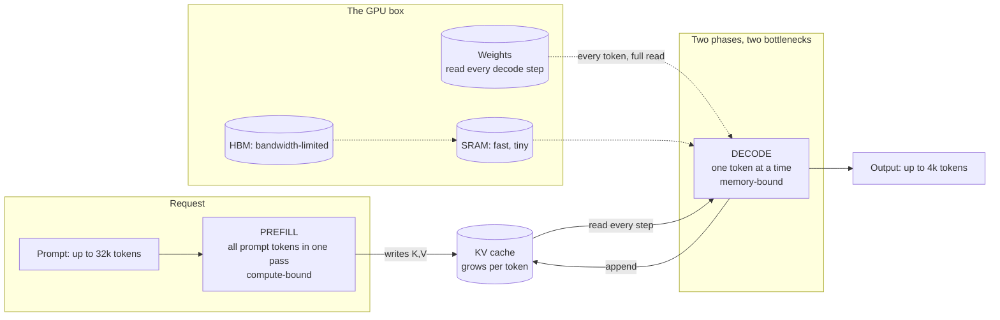

# Case Study: Sizing a Self-Hosted Inference Estate Before You Have Measurements

> **Topic:** `T06` · **Transcript coverage:** partial · **Difficulty:** L4
> **One line:** How to reason about model size, precision, GPU count and latency before a single request has been served — and why the answer to "what will this cost" starts with which of the two phases you are actually bottlenecked on.

## Table of Contents

- [1. The Scenario](#1-the-scenario)
- [2. Requirements](#2-requirements)
- [3. Architecture](#3-architecture)
- [4. Component Deep Dive](#4-component-deep-dive)
- [5. Decision Table](#5-decision-table)
- [6. Edge Cases & Exceptions](#6-edge-cases--exceptions)
- [7. Failure Modes & Mitigations](#7-failure-modes--mitigations)
- [8. Capacity & Cost Model](#8-capacity--cost-model)
- [9. Benchmarks & Measured Numbers](#9-benchmarks--measured-numbers)
- [10. Operational Runbook](#10-operational-runbook)
- [11. What Changes at 10x](#11-what-changes-at-10x)
- [12. Interview Walkthrough](#12-interview-walkthrough)

---

## 1. The Scenario

Bellhaven processes documents for public-sector clients: 40M pages a quarter, extracted, classified and summarised. The pipeline currently calls a hosted API and has just been told it cannot. Three client contracts now require that document content never leaves premises Bellhaven controls, and one regulator has asked for a written statement of where inference happens.

So Bellhaven buys GPUs. The procurement committee has three questions and a deadline:

- **How many?** Capex is a fixed number this fiscal year. Over-buying wastes the only budget line that cannot be adjusted later.
- **Which model?** The team wants the largest model that fits; the finance lead wants the smallest that passes the eval.
- **What does a page cost?** They need a $/1,000-pages forecast with a defensible derivation, because it becomes a contract price.

The engineering team has never run a GPU. This is the situation the course's first lecture is written for, and its central warning is that the intuitive answer is wrong: the bottleneck is not where people assume.

Two constraints shape everything. **The latency SLO is contractual** — 95% of documents must return a first token within 900 ms, because the pipeline is interactive for a review queue. And **utilization is a commitment**: the committee will not approve a purchase that assumes more than 60% average GPU utilization, a number they consider optimistic.

The course offers a starting point and an honest ceiling on it. The FLOPs analysis is presented as "the **ideal setting where we're only calculating flops and we're not worrying about… whether we can use all of the flops that our processor or chip allows us to use efficiently**" `[T]` (CMU lecture 1). **Everything in §8 is that ideal setting.** Everything in §10 is about the gap to reality.

## 2. Requirements

### Functional

| Requirement | Priority | Notes |
|---|---|---|
| Self-hosted inference, no third-party API for document content | P0 | Residency |
| Support a 200k-page/day peak with burst to 3x | P0 | Sizing driver |
| Prompt lengths up to 32k tokens (long contracts) | P0 | Sets prefill cost |
| Outputs up to 4k tokens (summaries) | P0 | Sets decode cost |
| A written $/1,000-pages model with stated assumptions | P0 | Contract pricing |
| A capacity model that survives a hardware swap | P1 | §8 is parameterised, not hard-coded |
| Per-phase metrics: TTFT and TPOT separately | P0 | §2's SLO is a TTFT commitment |

### Non-functional

| Requirement | Target | Rationale |
|---|---|---|
| P95 TTFT | ≤ 900 ms | Contractual; a prefill-bound metric `[R]` |
| P95 TPOT | ≤ 30 ms | "Reading speed and conversational flow" `[R]` |
| End-to-end P95, 4k-token summary | ≤ 120 s | `[D]` from TPOT × length |
| Average GPU utilization assumed in the model | ≤ 60% | Committee constraint |
| Headroom for context growth | 2x at no re-purchase | |
| Precision | FP8 where it is free, 4-bit where it is not | `[R]`: FP8 is "2x faster than FP16/BF16 with negligible (<0.1%) accuracy loss" |

### Constraints and non-goals

- **We do not buy for peak.** The model budgets for average utilization and lets the scheduler absorb burst, because over-provisioning by 3x is not fundable.
- **We do not use a mixture-of-experts model in Phase 1.** MoE is in the corpus's taxonomy `[R]`, but the routing and load-balancing complexity is a second-order problem we should not take on before we can serve a dense model.
- **We do not treat the FLOPs model as a prediction.** The lecture is explicit that it is the ideal setting `[T]`; treating it as a forecast is the most common way this analysis fails.
- **We do not size on throughput alone.** A configuration that maximises tokens/second can be the one that misses a TTFT SLO, because the two phases have different bottlenecks.
- **We do not assume the GPU is saturated.** The lecture's framing of the core difficulty: each decode step "essentially has a **fixed cost** um in that we have to **dispatch to our GPU** and then we need to wait for the GPU to finish processing… we might **not fully saturate our GPU** because GPUs have many many threads" `[T]`.

## 3. Architecture

Walkthrough: the diagram exists to make one point — **prefill and decode are not the same workload, and the KV cache is the object that connects them.** The first phase reads the whole prompt in parallel and saturates arithmetic units; the second reads the entire weight set from memory to produce one token, then does it again `[R]`. The KV cache is what lets the second phase avoid re-deriving the first phase's keys and values for every new token. The dashed line from weights to decode is the whole cost story: weights are read once per token generated, regardless of how much useful arithmetic that enables.

That is why the two phases need different fixes, and why the metrics are separate: TTFT measures prefill, TPOT measures decode `[R]`.

## 4. Component Deep Dive

### 4.1 Why inference has a KV cache at all

Lecture 1 derives the KV cache from the architecture rather than introducing it as an implementation trick. The model is decoder-only — as distinct from the original transformer's "encoder + non-masked attention + cross attention" — and the stack is described as "an embedding process positional embeddings masked multi head attention. So you're masking to not attend to future tokens … layer norm and then the feed forward network and then uh layer norm again a linear layer and a prediction" `[T]`.

The masking is what makes caching valid: because "the inputs at position three cannot depend on the word in position 4," the representation of an earlier token does not change when a later token is appended. Hence "the reason why we don't have to update the embedding of the previous words is because we're using masked attention" `[T]`. The lecturer also notes the constraint is required by the probability model itself: "otherwise the chain rule of probability doesn't hold here" `[T]`.

**This is the single most important structural fact in the topic.** Every other inference optimisation — paged attention, prefix caching, disaggregation — is a consequence of it. Note that the lecture does **not** develop the KV cache in lecture 1; it appears in the roadmap as "**KV cache optimization**" and no more `[T]`. The sizing work is in [T07](../01-case-studies/T07-kv-cache.md).

### 4.2 Grouped-query attention, and which projection pays

The course analyses GQA explicitly — "the **grouped query attention transformer** which is a transformer that is used pretty widely nowadays" `[T]` — with an asymmetry worth internalising:

> "in grouped query attention, you essentially create groups of the key vectors and value vectors … you attend like this to save memory." The cost consequence: the **query projection costs all the compute** "because you're calculating this for every head," while "for the key and value projections, you uh calculate less because you're grouping them together." `[T]`

So GQA is a **memory** optimisation that trades away a little of the key/value projection compute. That is exactly the right trade for decode, which is memory-bound, and a mildly wrong one for prefill, which is compute-bound — a small, real example of why the phase distinction matters.

Notation introduced: `L` for sequence length, `D` for total vector dimensionality, `DH` for per-head dimensionality `[T]`.

### 4.3 The FFN, SwiGLU and the 3.5x rule

"The flops per layer is basically the dimensionality of the underlying embedding times the dimensionality of the feed forward network… if you're using the swiggloo [SwiGLU] you have a gating function and then you have an up projection and down pro[jection]." Crucially for sizing: this is "**entirely linear in the sequence length**" `[T]`.

Why the MLP is about 3.5x the hidden size, per the lecture, has two reasons `[T]`: a compute/accuracy trade-off — "it should be larger than the hidden size… this allows you to like combine learn combination features" — and **GPU utilization**: "having this be like an X uh 3.5 is good for GPU utilization based on threads." The lecturer is candid that he would have to look up the full justification. **Treat the 3.5x as an empirical convention, not a law.**

### 4.4 The Llama 3.1 reference table

The lecture's worked model family, chosen because "it has one example of like a very big dense model 405b" `[T]`:

| Row | Layers | Hidden size | GQA KV heads | MLP size | Max context |
|---|---|---|---|---|---|
| Small | 32 | ~4,096 | 8 | ~3.5 × hidden | 128k |
| Mid | 80 | ~8,192 | 8 | ~3.5 × hidden | 128k |
| Large (405B) | 126 | ~16,384 | 8 | ~3.5 × hidden | 128k |

Two things to notice. First, the hidden sizes in the transcript are spoken approximations — "the hidden size is like **4,000 8,000 and 16,000**" `[T]` — so use 4096/8192/16384 but attribute the rounding. Second, and more useful: **GQA KV heads are constant at 8 across all three rows** — "in grouped query attention they always have **eight** uh over all of them in the llama 3.1 series" `[T]`. That is why KV cache per token grows with layers and head dimension but not with head count, and it is the basis for the §8 arithmetic.

The lecture also states "the **maximum context length is 128k**" `[T]`. **Not covered:** per-row parameter counts (only 405B is given), and per-row attention-head counts `[T]`. If you need those, get them from the model card and say so.

### 4.5 The FLOPs accounting, and the crossover

Two dominant costs `[T]`:

- **Self-attention**, "costly but it's also **quadratic in sequence length**… for some components of the attention."
- **The feed forward layers**, "which are **wide and heavy**," multiplied by the number of layers.

The decomposition `[T]`: the quadratic component is the query×key attention — "each position the query is attending to the keys… you're multiplying the queries in the keys." The query/key/value/output projections are "**basically linear in the sequence length**. You can see by looking at L."

The observed curve: "as the context length gets uh longer the flops you know increase uh **super linearly** with the context length… the total flops scale **quadratically** uh with the context… at least uh if you look in big O notation" `[T]`.

**The crossover is described qualitatively and never numerically** `[T]`: at short contexts, "the MLP part is the green part here **this dominates the the cost of the computation because it's 3.5 times uh larger than the the other parts**." The linear attention projections "cost a lot of money," and "**multiplying the attention vectors together doesn't cost a whole lot**." But "as you get up to larger context lengths actually the uh quadratic part of attention starts to dominate."

**The transcript gives no crossover context length, no prefill-vs-decode FLOPs formula, and no worked numeric example** `[T]`. §8 builds one and labels it as mine. Do not attribute a numeric crossover to the lecture.

One framing element is worth keeping: the lecture opens with a deliberately ambiguous quiz, "anyone think this was a trick question?" — the resolution being that the answer depends on context length `[T]`. **"How expensive is inference" is a malformed question until you fix the context length.**

### 4.6 Prefill versus decode: the bottleneck split

The supporting material states the split as a table `[R]`:

| Phase | Nature | Bottleneck | Why | Primary optimisation |
|---|---|---|---|---|
| **Prefill** | Whole prompt in one pass | **Compute** (FLOPs) | Parallel processing saturates the arithmetic units | FlashAttention, FP8/FP16 |
| **Decode** | One token at a time | **Memory bandwidth** | Weights must be loaded from VRAM for *every single token* | Quantization (4-bit), GQA, batching |

Complexity: prefill is `O(N)` in input length, parallelised; decode is `O(M)` in output length and inherently sequential `[R]`.

The **memory wall** framing `[R]`: as models grow, memory bandwidth has not scaled as fast as compute, which makes decode "the primary target for production optimization." Bellhaven's workload is decode-dominated by token count — 4k output tokens against a 32k prompt still means 4,000 sequential memory-bound steps against one parallel compute-bound pass — which is why the sizing decision in §5 lands where it does.

### 4.7 Metrics

| Metric | Target given `[R]` | What it measures | Bellhaven's position |
|---|---|---|---|
| **TTFT** | < 200 ms | Prefill; user-perceived responsiveness | Relaxed to 900 ms contractually, which we buy with longer prompts |
| **TPOT** | < 30 ms | Decode; reading speed | Adopted unchanged |
| **Throughput** | Maximise | Aggregate tokens/second | The cost driver |
| **Latency** | < 2.0 s | End-to-end turn-around | Not applicable — our outputs are long, and the relevant end-to-end is the summary, not a turn |

**The tension is explicit**: throughput and latency pull in opposite directions, and TTFT and TPOT are optimised by different means. "How do you optimize TTFT vs. TPOT?" `[R]` — TTFT by FlashAttention-3, tensor parallelism, or prefix caching to skip prefill entirely; TPOT by 4-bit weights, GQA, or speculative decoding.

**Use the given targets as defaults, not as requirements.** A 4k-token summary does not need 200 ms TTFT; a document-review queue can tolerate a second. Adopting vendor-default targets without checking them against the workload is how teams over-buy.

### 4.8 Why generation is slower than classification

The corpus's clearest one-paragraph statement of the whole topic `[R]`:

> Classification is a "Prefill-only" task; it processes the entire input and produces a single output in one parallel pass, making it compute-optimal. LLM generation, however, is **auto-regressive**. Each token depends on the previous one, forcing a sequential "Decode" loop. Because each step in this loop is memory-bound (loading Gigabytes of weights to produce Milligrams of data), the system spends most of its time waiting for memory transfers rather than doing math.

That "**gigabytes of weights to produce milligrams of data**" ratio is the arithmetic-intensity argument in one clause, and §8 makes it numeric.

### 4.9 Training versus inference, and the utilization problem

The contrast the course uses to motivate the whole field `[T]`: training does forward pass, backward pass, parameter update, and "if things go well you can like completely saturate a GPU all the time." Inference is "smaller block, smaller block… predict a word," autoregressive. With a 3-token prefix and 3 generated tokens, "we had to make **four steps** through each layer" `[T]`.

The problem, restated: each step "essentially has a **fixed cost** um in that we have to **dispatch to our GPU** and then we need to wait for the GPU to finish processing… we might **not fully saturate our GPU** because GPUs have many many threads" `[T]`.

This is the origin of batching ([T08](../01-case-studies/T08-batching-scheduling.md)) and of the committee's 60% utilization cap. **The under-saturation is not an implementation defect; it is the arithmetic-intensity consequence of producing one token at a time.**

### 4.10 Hardware landscape

The lecture's survey `[T]`, with the caveat that it gives **no memory capacities, no $/hour and no $/FLOP**:

- **CPUs** — "general purpose compute, but they don't have a very high level of threading… they're not particularly good at the operations we need to do for uh neural networks." Still used for smaller models.
- **NVIDIA GPUs** — "the **gold standard** of what everybody uses"; server-grade parts named as "**A100, H100, B200**"; consumer gaming parts "still quite powerful and much better than using a CPU."
- **AMD GPUs** — "very good hardware but **not as well supported in the software ecosystem**. So people don't use them quite as broadly."
- **Google TPUs** — "maybe the **second most commonly used type of hardware**" for training; "TPUs were created from the ground up for doing this and they have things like **very large memory, very fast interconnect**," contrasted with GPUs that "originally started for gaming."
- **Other special purpose** — "**Cerebras and Grock** [Groq] and other things like this."

For Bellhaven this matters mostly as a warning about the software ecosystem: the residency requirement forces self-hosting, but it does not force NVIDIA. However, the supporting corpus contains dedicated material on AMD serving stacks `[R]` (see [T07](../01-case-studies/T07-kv-cache.md)), and the ecosystem gap the lecture names is the reason we choose the well-supported path in Phase 1.

### 4.11 Compute rental, and why the price moves

For a team that has never bought GPUs, the lecture's practical material on renting is unexpectedly relevant `[T]`: **Modal** and **RunPod** ("particularly good for like if you want to spin up a bunch of GPUs uh quickly or you want to have like **serverless GPUs**"), plus **San Francisco Compute Company** and **Prime Intellect**, of which "Prime Intellect has like a **stock price like a stock ticker but for GPU prices**… So this is like the price for an H100 and you can actually see it **go up and down like the stock market**."

**The lesson for the capex decision:** GPU rental is a spot market. A purchase decision made against a single price point is a bet on that market, and the honest version of the business case states the assumption rather than burying it.

### 4.12 The two errors, and which one you can fix at inference time

Lecture 1's most useful conceptual tool for a sizing decision is the distinction between two reasons an output is bad `[T]`:

- **Search error**: "the search algorithm failed to find the output that gives you the highest model score" — fixed by better inference algorithms (greedy → beam → A*).
- **Model error**: "your model's score s theta is not a good output according to whatever evaluation metric you care about" — "probably the quote unquote correct way of solving this problem is by training your model better."

And the warning attached to the second `[T]`: fixing model error at inference time "basically means **breaking your inference algorithm to get a better output**."

**For Bellhaven this is a procurement test.** The team's instinct is to buy the largest model that fits. But a larger model reduces *model* error, at a cost in memory bandwidth per token that directly worsens TPOT and $/page. Asking "which error am I buying down?" before choosing a size is the discipline the lecture is teaching.

### 4.13 The trend the course observes

Worth stating because it cuts against the naive reading of this topic `[T]`: "with the best language models that we have nowadays, people are **sampling less and searching more**… very often people are using **greedy search**, which is not a great search algorithm… because they've fixed a lot of the search errors through model training."

The caution attached: "greedy search completely fall[s] apart on GPT2" `[T]`. **The trend is a consequence of model quality, not a universal law** — and it is the reason the sizing decision is entangled with the decoding decision ([T01](../01-case-studies/T01-sampling-decoding.md), [T02](../01-case-studies/T02-search-decoding.md)).

## 5. Decision Table

### 5.1 Model size

| Option | Pros | Cons | Exceptions — when it breaks | When to use |
|---|---|---|---|---|
| Largest that fits in memory | Fewest model errors; simplest eval story | Weights are read every decode step, so size is a direct multiplier on TPOT and $/page §8 | Breaks when the binding constraint is memory bandwidth, which for decode it almost always is `[R]` | Only when the workload is prefill-dominated or the SLO is loose |
| Smallest that passes the eval (chosen) | Minimises bytes-per-token; leaves headroom for context growth | Requires a real eval before purchase; may need two models for two difficulty tiers | Breaks when the eval set does not represent production — then "passes the eval" is a false signal | Default |
| Two-tier: small default, large on demand | Cost-optimal; keeps a quality ceiling | Two models in memory, or load/unload churn; routing complexity ([T14](../01-case-studies/T14-routing-gateways.md)) | Breaks when the tiers cannot be held resident | When the difficulty distribution is bimodal |
| MoE | Large capacity at lower active FLOPs | Routing, load balancing, expert-parallel communication; the corpus treats it as its own topic `[R]` | Breaks when all tokens route to few experts | Phase 2, after dense serving works |

**Chosen:** smallest model that passes a production-representative eval, with a documented re-evaluation trigger.
**Revisit if:** the eval-to-production quality gap exceeds the agreed tolerance, or context requirements grow beyond the headroom.

### 5.2 Precision

| Option | Pros | Cons | Exceptions — when it breaks | When to use |
|---|---|---|---|---|
| BF16/FP16 | Reference quality; no calibration | 2 bytes/weight — the largest memory footprint, and decode is memory-bound | — | The accuracy baseline for any eval |
| **FP8 (chosen)** | "**2x faster than FP16/BF16 with negligible (<0.1%) accuracy loss**" `[R]`; native on current server GPUs; smaller mantissa and larger exponent than Int8 so it "represent[s] the dynamic range of LLM activations more accurately without complex calibration" `[R]` | Needs hardware support; outliers can degrade a whole layer without scaling | Breaks without **dynamic FP8 scaling**, which "adjust[s] the quantization scales per-layer to prevent outliers from degrading the entire model's logic" `[R]` | Default on current hardware |
| 4-bit weights | Halves memory again; the largest TPOT win available | Real quality risk; needs a per-model decision | Breaks on the eval for some models and not others — always measure per model | When the model does not fit otherwise, or when TPOT binds |
| Quantized KV cache | Attacks the *other* memory consumer | Adds error to attention, not just weights | Breaks at long context where the cache dominates | See [T07](../01-case-studies/T07-kv-cache.md); a separate decision |

**Chosen:** FP8 for weights with dynamic scaling, BF16 kept as the reference for eval, 4-bit held in reserve as a lever if TPOT binds.
**Revisit if:** the measured accuracy delta exceeds the eval threshold, or a 4-bit build passes eval and halves the footprint — the latter is a purchase-order change, not a config change.

### 5.3 Parallelism

| Option | Pros | Cons | Exceptions — when it breaks | When to use |
|---|---|---|---|---|
| Single GPU | No communication; simplest | Hard capacity ceiling; a model that does not fit does not run | — | When the model and the KV cache both fit |
| Tensor parallelism | Spreads weights and KV across GPUs; directly reduces per-GPU memory | Communication on every layer; benefits from fast interconnect | Breaks with slow interconnect — the lecture notes TPUs have "**very fast interconnect**" as a design property `[T]` | When weights alone exceed one device |
| Pipeline parallelism | Cheaper communication | Bubble/depth trade-offs; more complex | Breaks with small batch sizes, where bubbles dominate | Large clusters |
| Replicate, don't split | Scales request throughput linearly; no per-request communication | Each replica must hold the full model | Breaks when the model barely fits — no room for KV growth | The default once the model fits on one device |

**Chosen:** replicate on single-GPU nodes with FP8 weights; use tensor parallelism only if the eval-winning model does not fit.
**Revisit if:** the model requires splitting, at which point interconnect becomes a first-class procurement requirement rather than a footnote.

### 5.4 What to optimise for

| Option | Pros | Cons | Exceptions — when it breaks | When to use |
|---|---|---|---|---|
| Throughput | Minimises $/page | Long batches inflate TTFT; can breach a latency SLO | Breaks against a contractual latency term | Batch/offline surfaces |
| TTFT | Interactive feel | Larger batches hurt it; prefill-heavy | Breaks when the workload is decode-dominated — you optimise the cheaper phase | Interactive surfaces |
| TPOT (chosen) | Our workload is decode-dominated; it is also the end-to-end driver for long outputs | Requires memory-side optimisation | Breaks for very short outputs, where TTFT dominates | Bellhaven's long summaries |
| End-to-end | Matches the user experience | Hard to attribute; hides which phase is failing | Breaks as a tuning signal | As an SLO, not as a tuning target |

**Chosen:** TPOT as the tuning target, with TTFT and end-to-end as SLOs on the dashboard.
**Revisit if:** the workload mix shifts toward short outputs — a 200-token answer is TTFT-dominated, and the optimisation target inverts.

### 5.5 Where to compute the cost estimate

| Option | Pros | Cons | Exceptions — when it breaks | When to use |
|---|---|---|---|---|
| Vendor benchmark | Free; vendor-tuned | Not your prompt distribution, not your batch size, not your SLO | Breaks whenever the workload differs from the benchmark's | Sanity-check only |
| Published FLOPs analysis | Phase-aware; shows the crossover `[T]` | The lecture's explicit caveat: it is "the **ideal setting**… not worrying about whether we can use all of the flops" `[T]` | Breaks as a forecast — MFU and dispatch overhead are not in it | **Sizing and comparison**, not forecasting |
| Roofline / arithmetic-intensity model (chosen) | One number that says which phase binds; survives a hardware swap | Needs memory bandwidth, which the lecture does not give `[T]` | Breaks when the workload is neither compute- nor memory-clean (e.g. attention at long context) | The decision in §8 |
| Measured pilot | The truth | Needs hardware you have not bought; the circular dependency | — | As soon as any hardware exists — retire the model then |

**Chosen:** the arithmetic-intensity model for the purchase decision, retired in favour of measurement on day one of the pilot.
**Revisit if:** the measured throughput is below 60% of the model's prediction — that is an implementation problem, and buying more GPUs is the wrong response.

## 6. Edge Cases & Exceptions

| Situation | Symptom | Handling |
|---|---|---|
| **Very long prompt, short output** | TTFT dominates; decode is trivial | Prefill-bound. Optimise with attention kernels, tensor parallelism, or prefix caching `[R]` — not with quantization |
| **Short prompt, very long output** | TTFT is noise; decode dominates | Memory-bound. Quantization, GQA and batching are the levers `[R]` |
| **Long prompt and long output** | Both phases bind; the KV cache is large | This is the case where KV cache capacity, not compute, decides the GPU count. See [T07](../01-case-studies/T07-kv-cache.md) |
| **Context beyond the training length** | Degradation, not an error | "the maximum context length is 128k" is a model property `[T]`; exceeding it is a silent quality failure, not a crash |
| **Head count differs from the reference** | KV cache maths is wrong | GQA KV heads are a per-model property; the lecture's "**eight**" is specific to the Llama 3.1 series `[T]`. Read the model card |
| **The MLP ratio is not 3.5x** | FLOPs estimate off | The 3.5x is an empirical convention with a GPU-utilization rationale `[T]`, not a law. Use the model's actual intermediate size |
| **Interconnect is the bottleneck after splitting** | Scaling efficiency collapses | The lecture notes TPUs were built with "very fast interconnect" as a first-class property `[T]`; on GPUs this is a procurement question, not a config one |
| **MoE model chosen for capacity reasons** | Highly variable latency; expert imbalance | The corpus keeps MoE as a separate architectural topic `[R]`. Defer until dense serving is measured |
| **Vendor's FP8 claim does not hold on your model** | Accuracy regression | The <0.1% figure is the general claim `[R]`; per-model it must be re-measured, especially without dynamic per-layer scaling |
| **GPU market moves before purchase** | The business case dates | Rental prices behave like a market `[T]`; state the price assumption and its date in the model |
| **Utilization assumption is optimistic** | Capex under-provisioned | The committee's 60% cap exists because of the fixed-cost-per-step problem `[T]`; treat utilization as a measured output of the pilot, not an input to the model |

## 7. Failure Modes & Mitigations

| Failure | Symptom | Detection | Blast radius | Mitigation | Recovery |
|---|---|---|---|---|---|
| Sized on ideal FLOPs, not MFU | Throughput at half of prediction | Measured vs modelled tokens/s | Whole estate | Treat §8 as a comparison tool; pilot before committing the full purchase | Buy incrementally; replicate rather than re-architect |
| Optimised the wrong phase | Effort spent on quantization with no latency change | TTFT/TPOT split on the dashboard | Weeks of work | Measure which phase dominates before optimising it | Re-target |
| Over-sized model | $/page above contract | Cost per page against the model | Margin | Smallest-model-that-passes, with a real eval | Swap the model; keep the hardware |
| Under-sized model | Quality escalations | Eval drift; human review rate | Product | Re-evaluation trigger in §5.1 | Add a second tier rather than replacing |
| Context growth breaks capacity | OOM under longer documents | KV memory per request | Requests fail | 2x headroom requirement in §2 | Quantize the KV cache ([T07](../01-case-studies/T07-kv-cache.md)) |
| Utilization never reaches the assumption | Cost per page above forecast | Fleet utilization | Budget | The 60% cap; buy for average, absorb burst with queueing | Add replicas only when utilization is genuinely saturated |
| Latency SLO met on average, missed at P95 | Contractual breach | P95/P99 TTFT | Contract | Batch-size limits on the interactive surface ([T08](../01-case-studies/T08-batching-scheduling.md)) | Cap batch size; add replicas |
| Precision change regresses quality | Silent accuracy loss | Eval gate before rollout | Whole estate | BF16 baseline retained; per-model precision eval | Roll back to BF16 |
| Communication overhead after splitting | Near-linear scaling fails | Scaling efficiency vs GPU count | Whole cluster | Replicate first; split only if the model does not fit | Re-architect the topology |

## 8. Capacity & Cost Model

Arithmetic is mine; assumptions are shown. **The lecture supplies no memory capacities, no bandwidths and no worked numeric example** `[T]`; those inputs are external and marked `[D]`.

**Assumptions**

| Input | Value | Basis |
|---|---|---|
| Candidate model | 70B dense, 80 layers, hidden 8192, 8 KV heads, head dim 128 | The lecture's mid-row shape `[T]`, with head dim derived as `hidden / heads` `[D]` |
| Prompt length | 2,000 tokens average, 32k p99 | §2 |
| Output length | 4,000 tokens | §2 |
| Weights | 70e9 parameters | `[D]` |
| Per-token FLOPs | `2 × params` | `[D]` — derived from the lecture's explanation that "a matrix multiply is a multiplication and in an addition… you multiply by the weight and then you add it to the sum" `[T]`. **The lecture does not state the `2N·params` rule; this is my derivation.** |
| HBM bandwidth | 3,350 GB/s | `[D]` external; not in the lecture `[T]` |
| Peak FP8 compute | 1,000 TFLOPS dense | `[D]` external, deliberately rounded down |
| Achievable MFU | 40% | `[D]` |

**Step 1 — weights, and the first hard constraint.** At BF16, `70e9 × 2 = 140 GB`. At FP8, `70 GB`. At 4-bit, `35 GB`. A single 80 GB accelerator holds the FP8 weights with 10 GB to spare — **but the KV cache has to live there too.**

**Step 2 — KV cache per token.** Per layer, per token: `2 (K and V) × 8 heads × 128 head_dim × 2 bytes = 4,096 bytes`. Across 80 layers: `4,096 × 80 = 327,680 bytes ≈ 0.31 MB` per token in BF16, or half that in FP8. At the p99 context of 32k tokens: `0.31 MB × 32,000 ≈ 9.9 GB` per request. At the model's full 128k `[T]`: `≈ 40 GB` per request.

That last number is the one that should stop the procurement: **a single 128k-context request consumes roughly as much memory as a 70B model's FP8 weights.** It is why the KV cache, not the weights, sets concurrency ([T07](../01-case-studies/T07-kv-cache.md)).

**Step 3 — which phase binds. Decode, decisively.** Decode at batch 1, FP8:
- Memory: 70 GB of weights must be read to produce one token → `70 / 3,350 = 20.9 ms`.
- Compute: `2 × 70e9 = 140 GFLOP` → `140 / (1,000e12 × 0.4) = 0.35 ms`.
- Ratio: **60x more time waiting on memory than on maths.**

Arithmetic intensity: `140 GFLOP / 70 GB = 2 FLOP/byte`. The hardware balance point is `1,000e12 / 3,350e9 ≈ 299 FLOP/byte`. **Decode sits roughly 150x below the ridge point** — that is the quantitative form of "decode is memory-bound" `[R]`, and it is why the corpus's answer to "why is generation slower than classification" is about "loading Gigabytes of weights to produce Milligrams of data" `[R]`.

**Step 4 — prefill is compute-bound, and the contrast is the lesson.** For a 2,000-token prompt at FP8:
- Compute: `2 × 70e9 × 2,000 = 280 TFLOP` → `280 / (1,000e12 × 0.4) = 0.70 s`.
- Memory: read 70 GB once → `70 / 3,350 = 20.9 ms`.
- Ratio: **33x more time on maths than on memory** — the mirror image of decode.

**The same weights, the same GPU, and the binding constraint inverts by a factor of 2,000x between the two phases.** That single comparison is the topic.

**Step 5 — the TTFT SLO, checked.** 0.70 s prefill against a 900 ms contract leaves 200 ms of margin, before scheduling and network. That is thin, and it is the reason §5.4's chosen tuning target is TPOT and not TTFT: **we are already near the TTFT wall and there is nothing cheap left to buy there.** If the p99 prompt grows, the answer is prompt compression or prefix caching, not more GPUs — prefill is compute-bound and more replicas do not reduce a single request's compute.

**Step 6 — batching is the only lever that fixes decode, and it is arithmetic, not configuration.** Because the weights are read once and reused across the batch, TPOT at batch `B` is approximately `weights_bytes / bandwidth` amortised across `B` tokens: at `B = 32`, `20.9 / 32 = 0.65 ms` per token if perfectly amortised. Even at a modest `B = 8`, `20.9 / 8 = 2.6 ms`. **The 60x memory/compute imbalance is a property of batch size 1, and only of batch size 1** — which is precisely the lecture's "we might **not fully saturate our GPU**" `[T]` turned into a number.

**Step 7 — the purchase.** Per replica: 1 GPU, FP8 weights (70 GB) leaving ~10 GB for KV, i.e. about one 32k-context request at a time, or several shorter ones. To hold the 900 ms TTFT SLO at the p99 prompt, prefill at 0.70 s means a request occupies the GPU for its prefill; decode then needs the batch to stay small enough that TPOT holds. **The binding resource is KV memory, not FLOPs** — so the count is `peak concurrent requests × KV per request / KV memory per GPU`, and the second question is whether that many replicas can be kept busy. At 60% target utilization against 40% assumed MFU, the two constraints are close enough that the model cannot settle the count alone; that is the argument for buying the pilot increment first.

**Sensitivity**

| Scenario | Effect |
|---|---|
| 4-bit weights | Weights drop to 35 GB, freeing ~45 GB for KV — roughly 4x the concurrency of the FP8 build. The largest single lever available, if eval passes |
| FP8 KV cache | Halves KV per request; roughly doubles concurrency `[R]` |
| p99 prompt grows to 64k | Prefill compute doubles to 1.4 s, breaching the TTFT SLO before any memory constraint binds |
| Output grows to 16k tokens | Decode time quadruples; end-to-end SLO breached, memory constraint unchanged |
| Tensor parallelism across 2 GPUs | Weights per GPU halve; communication on every layer offsets part of the gain, and the interconnect becomes the variable |
| MFU is 60%, not 40% | Prefill falls to 0.47 s, restoring TTFT margin. MFU is the most leveraged unknown in the model |
| Bandwidth is 20% lower than assumed | Every decode number worsens by 25%; the phase conclusion does not change |

**Break-even.** FP8 on one GPU serves roughly one 32k-context request at a time. The 4-bit build serves four. If eval passes, **4-bit is roughly a 4x capex reduction for the same workload** — which is why §5.2 keeps it in reserve rather than treating it as a last resort, and why the eval, not the hardware, is the gating item in the purchase order.

## 9. Benchmarks & Measured Numbers

| Metric | Value | Source | Conditions |
|---|---|---|---|
| FP8 speedup | 2x vs FP16/BF16 | `[R]` ai-system-design-guide, 04-inference-optimization/01-inference-fundamentals.md | Vendor/hardware claim; paired with "<0.1% accuracy loss" |
| FP8 accuracy loss | < 0.1% | Same `[R]` | General claim; needs per-model re-measurement |
| TTFT target | < 200 ms | Same `[R]` | A default target, not a universal requirement |
| TPOT target | < 30 ms | Same `[R]` | Stated as reading-speed |
| End-to-end latency target | < 2.0 s | Same `[R]` | For conversational turns |
| Prefill complexity | `O(N)`, parallelised | Same `[R]` | |
| Decode complexity | `O(M)`, sequential | Same `[R]` | |
| Llama 3.1 layers | 32 / 80 / 126 | CMU lecture 1 `[T]` | Spoken table; hidden sizes given as "4,000 8,000 and 16,000" |
| Llama 3.1 GQA KV heads | 8, across all rows | CMU lecture 1 `[T]` | The basis for the §8 KV arithmetic |
| MLP size | ~3.5x hidden size | CMU lecture 1 `[T]` | Empirical; part of the rationale is GPU thread utilization |
| Llama 3.1 max context | 128k | CMU lecture 1 `[T]` | |
| Attention FLOPs scaling | Quadratic in sequence length | CMU lecture 1 `[T]` | Projections are linear; the q×k product is quadratic |
| Attention/MLP crossover | **Not given numerically** | CMU lecture 1 `[T]` | Described qualitatively only |
| Per-token FLOPs rule (`2N·params`) | **Not stated** | CMU lecture 1 `[T]` | The lecture explains the 2x factor from MAC arithmetic but never states the rule; §8 derives it `[D]` |
| Worked FLOP example | **None** | CMU lecture 1 `[T]` | The lecture poses the question and does not compute a number |
| GPU memory, bandwidth, $/hour, $/FLOP | **Not covered** | CMU lecture 1 `[T]` | Explicitly absent from the transcript |
| Hardware named | A100, H100, B200; TPU; Cerebras, Groq | CMU lecture 1 `[T]` | No capacities or prices |

**Vendor claims:** the FP8 2x / <0.1% pair and the hardware names are the corpus's claims, not measurements performed for this case study.

## 10. Operational Runbook

**Deploy**
1. Buy the **pilot increment first** — enough for one replica and one week of real traffic. The model in §8 is a comparison tool, and its useful life ends the day the hardware arrives.
2. Pin the precision. FP8 with dynamic scaling; BF16 retained as the eval reference `[R]`.
3. Instrument TTFT and TPOT **separately** from day one. A blended latency number cannot tell you which phase to fix `[R]`.
4. Record the model's structural parameters — layers, hidden size, KV heads, head dim, max context — in the deployment config. The §8 arithmetic depends on all five, and three of them are not in the lecture `[T]`.

**Tune — in this order**
1. **Find the binding phase.** Compute the arithmetic intensity of the actual workload; it tells you whether to buy compute or bandwidth.
2. **Then batch size**, because that is the decode lever `[T]`. Raise it until TTFT or TPOT breaches, then back off.
3. **Then precision** — 4-bit weights if the eval passes, then quantized KV if memory binds.
4. **Then model size.** Only after the above, because changing the model invalidates every other measurement.
5. **Then parallelism**, and only if the model does not fit.

**Monitor**
- TTFT p50/p95/p99 and TPOT p50/p95/p99, separately.
- GPU utilization against the committee's 60% assumption.
- KV memory per request and the concurrency distribution — the real capacity driver.
- Requests rejected or queued for memory, which is the leading indicator of a capacity wall.
- Tokens/second per GPU, tracked against the §8 prediction to catch MFU drift.
- Prompt-length distribution, since it drives the prefill SLO.

**Incident — top 5**
1. **TTFT SLO breach.** Symptom: p95 above 900 ms. Diagnosis: prefill-bound — check prompt length distribution and MFU before adding hardware; more replicas help throughput but not a single request's compute. Action: batch-size cap or prompt compression.
2. **TPOT SLO breach.** Symptom: tokens arrive slowly. Diagnosis: decode-bound — check batch size and whether another process is competing for bandwidth. Action: raise batch, quantize weights, or add replicas.
3. **OOM under long documents.** Symptom: request failures at high context. Diagnosis: KV cache, not weights. Action: quantize the KV cache or cap context ([T07](../01-case-studies/T07-kv-cache.md)).
4. **Throughput far below prediction.** Symptom: measured tokens/s below §8 by more than the assumed MFU gap. Diagnosis: implementation, not hardware — kernel selection, batching configuration, or a saturated interconnect. Action: fix the stack; do not buy GPUs.
5. **Quality regression after a precision change.** Symptom: eval drop. Diagnosis: FP8 without dynamic per-layer scaling `[R]`. Action: restore the BF16 reference and re-quantize with scaling.

## 11. What Changes at 10x

- **The binding constraint moves from bandwidth to capacity.** At 10x concurrency, the question stops being "how fast can we read weights" and becomes "how many KV caches fit." That is a different purchase, and it is the transition that makes [T07](../01-case-studies/T07-kv-cache.md) the load-bearing topic.
- **Prefill and decode stop sharing hardware well.** With a 32k-token prompt and a 4k-token output on the same device, the phases interfere: a long prefill blocks decode for everyone on that replica. The corpus carries disaggregation as a named technique for exactly this `[R]`.
- **Batch size becomes a policy, not a number.** Continuous batching and scheduling decisions displace static configuration ([T08](../01-case-studies/T08-batching-scheduling.md)).
- **The model-size decision re-opens.** At 10x, the difference between the smallest-passing model and the largest-that-fits is a multiplicative cost difference, so the eval's precision matters more than its existence.
- **What inverts:** "buy the biggest GPUs" becomes "buy the right memory-to-compute ratio," and for decode-heavy workloads that increasingly means memory capacity and bandwidth rather than peak FLOPs. The lecture's own note that TPUs were built with "**very large memory, very fast interconnect**" `[T]` is this argument from the other direction.
- **What survives:** the phase split, the `2N·params` arithmetic, the KV-per-token formula, and the rule that you measure TTFT and TPOT separately. Those do not change with scale.

## 12. Interview Walkthrough

**Whiteboard order (35 min)**
1. Autoregressive generation and why masked attention makes the KV cache valid — "the reason why we don't have to update the embedding of the previous words is because we're using masked attention" `[T]`.
2. The two phases and their two bottlenecks, with the corpus's one-line justification: gigabytes of weights to produce milligrams of data `[R]`.
3. The FLOPs decomposition: quadratic attention product, linear projections, MLP at 3.5x hidden. Say that the lecture gives the crossover qualitatively and never numerically.
4. Which phase binds, using arithmetic intensity. Do the comparison at batch 1 and then say what batching does to it.
5. The KV-per-token formula, and the arresting result: at 128k context the KV cache rivals the weights in size.
6. Metrics: TTFT for prefill, TPOT for decode, and why optimising one does not help the other.
7. Close on the caveat: this is the ideal-FLOPs setting, and the gap to reality is MFU.

**The two numbers to say out loud**
- **40 GB** — KV cache for a single 128k-context request on an 80-layer model, against 70 GB of FP8 weights. The capacity conversation starts here.
- **60x** — the memory-to-compute time ratio in decode at batch 1, and the reason batching is the primary decode optimisation.

**The tradeoff to volunteer before you are asked:** throughput and latency pull in opposite directions, and a configuration that maximises tokens/second is often the one that misses a TTFT SLO. Also volunteer which error you are buying down — model error (buy a bigger model) or search error (improve the decoder) — because they have different price tags.

**Follow-ups**

1. *Why is generation slower than classification?* — Classification is prefill-only and therefore compute-optimal. Generation is autoregressive, forcing a sequential decode loop where each step is memory-bound.
2. *What is the KV cache and why is it valid?* — Cached keys and values for prior positions, valid because causal masking means position 3 cannot depend on position 4, so earlier representations do not change.
3. *Where does the 2x in `2N·params` come from?* — A matrix multiply is a multiply and an add per weight. The lecture explains the factor but does not state the rule, so present the rule as your derivation.
4. *What is GQA and why does it help?* — Groups of key and value vectors share projections, cutting KV cache memory. It costs a little on the K/V projections, which is a good trade in memory-bound decode and a mildly bad one in compute-bound prefill.
5. *Prefill or decode for a 32k prompt with a 4k output?* — Both. Prefill sets TTFT and is compute-bound; decode sets end-to-end and is memory-bound. Size both, optimise TPOT.
6. *When does attention become the dominant FLOPs term?* — At long context, because it is quadratic while projections and the MLP are linear. The lecture describes the crossover qualitatively and gives no context length for it.
7. *How would you cut the KV cache?* — Quantization, eviction, sharing across heads, and low-rank compression, plus paged allocation to stop wasting it. That is [T07](../01-case-studies/T07-kv-cache.md).
8. *Why not just buy more GPUs?* — Because more replicas raise throughput but do not reduce a single request's prefill compute, and the binding constraint at scale is memory capacity for KV caches, not FLOPs. More GPUs is the right answer to a throughput problem and the wrong one to a latency problem.

## Sources

- `refs/CMU_Inference_Algorithms_for_Language_Modeling_Fall_2025_transcripts_2/CMU_LLM_Inference_1_Introduction_to_Language_Models_and_Inference.txt` — decoder-only architecture for inference and why masking makes caching valid, the chain-rule constraint, GQA and the projection asymmetry, the L/D/DH notation, SwiGLU and the FFN FLOPs being linear in sequence length, the 3.5x MLP convention and its GPU-utilization rationale, the Llama 3.1 table (layers, hidden sizes, 8 GQA KV heads, 128k context), the quadratic-versus-linear FLOPs decomposition and the qualitative crossover, the ideal-FLOPs caveat, training-versus-inference and the fixed per-step cost, the hardware survey, GPU rental marketplaces and the price-ticker observation, the roadmap taxonomy, metageneration, search error versus model error, diversity versus quality, and the sampling-less/searching-more trend.
- `refs/ai-system-design-guide-main/ai-system-design-guide-main/04-inference-optimization/01-inference-fundamentals.md` — the prefill/decode phase split, compute-bound versus memory-bound with the per-phase optimisation table, the memory wall, the TTFT/TPOT/throughput/latency metric table with targets, FP8 with dynamic per-layer scaling and the 2x/<0.1% claims, the "gigabytes of weights to produce milligrams of data" formulation, and the TTFT-versus-TPOT optimisation guidance.
- `refs/llm-inference-engineering-main/llm-inference-engineering-main/README.md` — the topic inventory confirming which serving techniques the corpus covers (KV cache and compression, PagedAttention, FlashAttention, GQA, continuous batching, speculative decoding, Medusa, EAGLE, n-gram speculation, prompt caching, vLLM, SGLang/RadixAttention, TensorRT-LLM, GGUF, MoE, SLMs, routing, distillation, GPU/TPU/LPU). **This file is a table of contents and contains no figures** — nothing numeric is attributed to it.
- `refs/ai-system-design-guide-main/ai-system-design-guide-main/16-case-studies/01-enterprise-rag.md` — house style reference.
