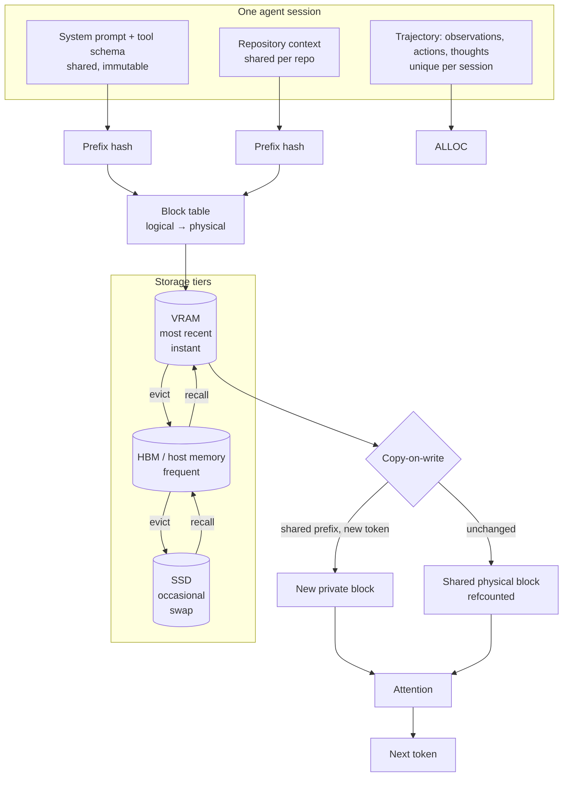

# Case Study: KV Cache Architecture for a Long-Horizon Agent Platform

> **Topic:** `T07` · **Transcript coverage:** partial · **Difficulty:** L4
> **One line:** How to decide what the KV cache is allowed to share, where it lives, and when it is evicted — the three questions that determine whether a long-context agent product is affordable, and the one that legal has to answer before engineering can.

## Table of Contents

- [1. The Scenario](#1-the-scenario)
- [2. Requirements](#2-requirements)
- [3. Architecture](#3-architecture)
- [4. Component Deep Dive](#4-component-deep-dive)
- [5. Decision Table](#5-decision-table)
- [6. Edge Cases & Exceptions](#6-edge-cases--exceptions)
- [7. Failure Modes & Mitigations](#7-failure-modes--mitigations)
- [8. Capacity & Cost Model](#8-capacity--cost-model)
- [9. Benchmarks & Measured Numbers](#9-benchmarks--measured-numbers)
- [10. Operational Runbook](#10-operational-runbook)
- [11. What Changes at 10x](#11-what-changes-at-10x)
- [12. Interview Walkthrough](#12-interview-walkthrough)

---

## 1. The Scenario

Quarry runs an agentic code-review service. A customer connects a repository; Quarry's agent reads the codebase, runs tools, and produces review comments across hundreds of steps. The product's entire value proposition is that the agent *remembers* — it holds the repository context, the diff, the prior tool outputs and its own plan across a long trajectory.

The numbers are the problem. Agent trajectories in this class run "up to as much as like **a hundred steps**… maybe **50 tool calls, 100 actions** and observations," which is "**over uh hundreds of thousands of tokens**" `[T]` (CMU lecture 11). And that is the modest case: the same lecture reports "**I have used agents for up to 2,000 steps**. And so that's like **tens of millions of tokens**" `[T]`.

Three forces collide.

**The KV cache, not the model, is the memory constraint.** For a 70B-class model in BF16 at 128k context, the cache is **~42 GB per user** `[R]` (ai-system-design-guide, 04-inference-optimization/02-kv-cache-and-context-caching.md). The FP8 weights are 70 GB. **A single long-context session costs more memory than the model.** In a normal serving deployment the weights are shared by everyone and the cache is per-request; here the cache *is* the product and it is per-session.

**Legal must rule before engineering can optimise.** Quarry's customers are competitors of each other. The single largest available saving is sharing cache blocks across requests with a common prefix — PagedAttention's copy-on-write makes it nearly free `[R]`. But a shared prefix is shared *tensor memory*, and whether two tenants may share a KV block is a data-isolation question, not a performance question. It is the highest-leverage decision in this document and it is not an engineering decision.

**Finance believes context is free.** The CFO has read that cached input tokens are discounted by 90% `[R]` and has concluded that long context is now cheap. The read discount is real. It is also conditional on a cache *hit*, and hit rate is the metric that decides whether the product's unit economics work.

## 2. Requirements

### Functional

| Requirement | Priority | Notes |
|---|---|---|
| Hold 200k-token repository context per active session | P0 | The product |
| Support trajectories of 500+ steps without context exhaustion | P0 | `[T]` reports 100-step and 2,000-step regimes |
| Reuse a common system prompt and tool schema across all sessions | P0 | The cheapest possible win |
| Reuse repository context across sessions on the same repo | P1 | The largest available win; gated on §5.3 |
| Never expose one tenant's context in another's attention | P0 | Legal gate |
| Preserve a session across a pause and resume | P1 | Drives §5.4 |
| Bounded memory per session with a defined failure behaviour | P0 | §5.5 |

### Non-functional

| Requirement | Target | Rationale |
|---|---|---|
| KV memory per 8k-token session | ≤ 2.6 GB | `[D]` derived in §8 |
| Session TTFT after a warm prefix | ≤ 300 ms | The cache-hit path `[R]` |
| Cache hit rate on the shared prefix | ≥ 95% | `[D]` target; it is the whole saving |
| Cache hit rate on repository context | ≥ 60% | `[D]` target for the §5.3 option |
| GPU memory waste from allocation | < 4% | PagedAttention's claim: from "~60-80%" to "**less than 4%**" `[R]` |
| Cross-tenant block sharing | **Forbidden unless legal clears it** | §5.3 |
| Sessions resumable after 24h | Yes | Drives tiering |

### Constraints and non-goals

- **We do not serve at 128k context by default.** The 42 GB per user figure is the reason. Context is admitted by policy, not by model capability.
- **We do not treat the cache as a correct-by-default optimisation.** Cache correctness is a property of the prefix matching rule, and a wrong hit is a wrong answer, not a slow one.
- **We do not put cache blocks in shared memory across tenants in Phase 1.** Pending the legal ruling in §5.3.
- **We do not use the model's maximum context as a target.** 128k is a property of the model `[T]`; it is not a requirement of the product.
- **We do not conflate prompt caching with context condensation.** They pull in opposite directions (§4.7).

## 3. Architecture



The diagram's purpose is to separate **three lifetimes** that are usually conflated: the immutable prefix (system prompt and tool schema), the semi-stable context (repository), and the volatile trajectory. Each has a different sharing scope, a different eviction priority, and a different legal status. The block table is what makes them independently addressable; without it there is one contiguous buffer per session and none of these distinctions can be expressed.

## 4. Component Deep Dive

### 4.1 Why the cache exists, and why it is valid

The KV cache is a direct consequence of causal masking. Because "the inputs at position three cannot depend on the word in position 4," the representation of an earlier token does not change when a later token is appended — "the reason why we don't have to update the embedding of the previous words is because we're using masked attention" `[T]` (CMU lecture 1). The chain rule of probability requires the same thing: "otherwise the chain rule of probability doesn't hold here" `[T]`.

**That invariance is what makes every technique in this document sound.** Prefix sharing, copy-on-write, disk offload and eviction are all consequences of the fact that a cached key-value pair is a pure function of its prefix.

### 4.2 The size, and why it dominates

The corpus gives the calculation explicitly for a 70B-class model `[R]`:

> `2 (KV) * layers (80) * context (128k) * heads (8) * head_dim (128) * 2 bytes` = **~42 GB per user** in 128k context.

My own arithmetic, per token, which is the form the capacity model needs `[D]`:

```
2 (K and V) × 8 heads × 128 head_dim × 2 bytes (BF16) = 4,096 bytes per layer per token
4,096 × 80 layers                                      = 327,680 bytes ≈ 0.3125 MB per token
0.3125 MB × 128,000 tokens                             = 40 GB     ≈ the quoted 42 GB
```

Note what 0.3125 MB per token means operationally: **every 1,000 tokens of context costs about 305 MB.** A 32k-token repository context is 10 GB. A 200k-token one is 62.5 GB — more than the model's FP8 weights.

The framing that should stick: "The KV Cache is the most significant memory consumer in long-context AI systems. Managing this cache effectively is the difference between a system that scales to 2M tokens and one that crashes at 10k" `[R]`.

### 4.3 GQA is why this is feasible at all

The reduction available from the attention architecture itself `[R]`:

| Method | Ratio | KV cache reduction | Quality loss |
|---|---|---|---|
| Multi-Head (MHA) | 1:1 | 1x (baseline) | 0% |
| **Grouped Query (GQA)** | 8:1 | **8x** | **< 0.2%** |
| Multi-Query (MQA) | All:1 | 64x–128x | 2–3% |

The nuance the corpus adds `[R]`: "GQA allows the model to attend to the same KV 'memory' from multiple 'reasoning' heads, drastically reducing the memory bandwidth needed during the Decode phase."

**Two things follow.** First, the 8x is already baked into the 42 GB figure — a 70B MHA model at 128k would need roughly 336 GB per user, which is not serveable on any single node. GQA is not an optimisation we chose; it is the precondition for the product existing. Second, the MQA row is a reminder that the reduction lever has a quality cost curve, and it is not linear: 8x is nearly free, 64x costs 2–3%. Choosing between them is §5.1.

The CMU lecture supplies the structural parameter that makes this concrete: "in grouped query attention they always have **eight** uh over all of them in the llama 3.1 series" `[T]` — GQA KV head count is a per-model constant, and the cache formula depends on it.

### 4.4 Contiguous allocation is the original sin

The problem PagedAttention solves, stated as two distinct failures `[R]`:

1. **Internal fragmentation** — a request pre-allocates for `max_sequence_length` of 8,192 tokens, so if the user generates 10 tokens, "99.9% of that reserved block is wasted."
2. **External fragmentation** — "Memory is broken into gaps too small for a new 'large block,' even if total free memory is high."

The mechanism of the fix, in three steps `[R]`:
1. **Tokens to blocks** — the cache is broken into fixed-size blocks, "e.g., 16 tokens per block."
2. **Logical versus physical** — "The model thinks it's attending to a contiguous sequence (Logical memory), but the blocks are scattered throughout VRAM (Physical memory)."
3. **The lookup table** — "A **Block Table** maps logic indices to physical addresses."

The result `[R]`: "Memory waste drops from **~60-80%** down to **less than 4%**," and memory efficiency "increases from 60% to 96%+."

**Why this matters more for Quarry than for a chatbot.** The waste is proportional to the *reservation*, not the usage. A chat request that reserves 8k and uses 200 tokens wastes 97%. An agent session that reserves 200k and uses 150k wastes 25% — and worse, the reservation is what forces a concurrency limit of one session per GPU. Paged allocation is what turns the reservation into a per-block cost, which is what makes many concurrent sessions possible on one device: "In traditional serving, we might only fit 4 requests because we have to 'reserve' max-length blocks; with PagedAttention, we can fit **20-30 requests**" `[R]`.

### 4.5 Copy-on-write: the single largest saving available

> "**The Scenario**: 100 users are chatting with the same 5,000-token system prompt.
> - **Traditional**: Store that 5,000-token KV cache 100 times (**500k tokens** in VRAM).
> - **PagedAttention**: Store it **once** via the Block Table and have all 100 users point to the same physical blocks.
> - **Copy-on-Write**: If a user generates a unique token, a new block is created just for them, while the shared blocks remain unchanged." `[R]`

Run the arithmetic `[D]`, using §4.2's 0.3125 MB per token:

| Approach | Tokens held | Memory |
|---|---|---|
| Unshared, 100 sessions × 5,000-token prefix | 500,000 | **156 GB** |
| Shared once, copy-on-write for divergence | 5,000 shared + per-session tail | **1.56 GB** + tails |

**A 100x reduction, and the difference between "does not fit on a node" and "fits trivially."** This is the mechanism behind the §1 claim that the largest saving is a legal question: sharing is nearly free technically, and it is the thing Quarry's competitors-cannot-share constraint forbids by default.

The copy-on-write detail matters for correctness: "If a user generates a unique token, a new block is created just for them, while the shared blocks remain unchanged" `[R]`. The shared blocks are immutable and refcounted; divergence costs one block, not a copy of the prefix.

### 4.6 Where the cache lives: the tiered model

"Frameworks like **SGLang** use a tiered system: `Most Recent (VRAM) -> Frequent (HBM) -> Occasional (SSD)`" `[R]`. And the eviction mechanism is explicit: "If VRAM is full, the manager can 'swap' inactive KV blocks to CPU RAM and bring them back when needed (**Paged Swap**)" `[R]`.

The tradeoff is not subtle: VRAM is "instant access, strictly limited size"; disk is "slower access, nearly unlimited" `[R]`. Quarry's session profile makes this a first-class design element: a session that pauses for an hour and resumes is the common case, and the choice is between holding 10 GB of VRAM for an idle session, dropping it and paying a recompute, or spilling it to a slower tier and paying a recall.

**This is where the agent product's latency profile is decided.** A recalled session pays a restore cost before its first token, and that cost lands in TTFT — the metric §2 puts a 300 ms target on.

### 4.7 The tension nobody plans for: condensation versus caching

Lecture 11 documents both halves of this, and they conflict.

**Prompt caching is the mechanism.** Flagged as "**number one, which is really, really important**… it is **prompt caching or KV caching**" `[T]`. The mechanism as taught: on the first call you "calculate the representations for **all of them**. But the next time… **you've already calculated the auto regressive representations for these**. And so then you just need to **feed in the next observation and action**." Benefit: "you can basically **save all the compute** that you use to calculate these and that saves you a lot of money um and time" `[T]`.

**Context condensation is the opposing force.** After a number of steps, "we take a previous like a portion of the previous steps and we **feed it into an LLM and we summarize** what happened," which lets the system "remove um you know **half of the context** while still keeping most of the relevant information. It's not perfect. uh sometimes you lose information that would be useful later" `[T]`. Measured benefit: "we were able to see like **2x or even more cost reductions** uh while **maintaining performance on swbench**" `[T]`.

**But the lecture states the conflict explicitly.** The slide reads "**prompt caching is less effective**," and the reason given is structural: "**You lose one of your inputs** when you're doing prompt caching" `[T]`. Summarising earlier steps rewrites the prefix, and a rewritten prefix is a cache miss for every subsequent step.

**The resolution is architectural, not a tuning problem:** condense at a *cache boundary*. Choose a summarisation point, summarise once, and treat the summary as a new immutable prefix that is cached from then on. Do not summarise continuously, and never rewrite the prefix on every step — that is the configuration that pays the summarisation cost *and* loses the caching benefit.

Related: two further caching details from the same lecture. **What gets cached is service-dependent** — "a lot of services will **only cache the things that you had in your prompt**. So some of them will only cache the **system message and the observation**. But in reality you can also **cache the action** as well if you're clever about it" `[T]`. And the representation layer is reprocessed every step: asked whether the accessibility tree is re-generated each turn, "As far as I know, the answer is yes. You reprocess it every time" `[T]` — with caching page representations flagged as "an interesting like thing to try" `[T]`.

### 4.8 The economics of caching, and the break-even

Prompt caching is the one inference optimisation with a published price list `[R]`:

| Provider | Feature | Cached-input pricing | Best for |
|---|---|---|---|
| Anthropic | Context Caching | 90% discount (Sonnet 4.6 cached: $0.30/1M) | Long system prompts, tool schemas |
| OpenAI | Prompt Caching | ~50% discount (GPT-5.5 cached: ~$2.50/1M) | Multi-turn chat |
| Google | Context Caching | Cache reads $0.20/1M (Gemini 3.1 Pro under 200K); hourly storage fee separate | Long shared corpora |
| DeepSeek | Context Caching | **$0.003625/M (V4 Pro) / $0.0028/M (V4 Flash)** | Massive codebase RAG; cheapest cache tier on the market |

These are **vendor list prices**, not measured results, and they move — the corpus notes DeepSeek "cut the cache-hit price to 1/10 of launch on April 26, 2026," and that "for cache-heavy workloads, V4 Flash now lands roughly 30-50x cheaper per cached token than GPT-5.5" `[R]`.

The break-even, as given `[R]`: "If your cached prefix is reused more than **1.1x to 1.5x**, it is cheaper to use caching than raw tokens. Anthropic charges a **25% premium on cache writes**, so for short prefixes the break-even is higher (**3-5x reuse**)."

My arithmetic on the long-prefix case `[D]`. Let base input price = 1, prefix reused `N` times:

```
Without caching:  N × 1.00
With caching:     1.25 (write premium) + N × 0.10 (90% discount)
Break-even:       1.25 + 0.10N < N   →   1.25 < 0.90N   →   N > 1.39
```

So **~1.4 reuses**, consistent with the quoted 1.1–1.5x range. The short-prefix case is worse because the 25% write premium applies to a prefix that is a small fraction of the request, while the uncached suffix is paid at full price every time — the quoted 3–5x is that effect.

**Implication for Quarry's CFO conversation:** the discount is a *hit-rate multiplier*, not a flat price cut. At a 95% hit rate a 90% discount is transformative; at a 20% hit rate it is noise. §10 makes the hit rate the primary monitored metric for exactly this reason.

### 4.9 The extreme end: compressing the cache itself

**RAD-O (Retrieval Augmented Decoding)** is the technique the corpus names for going beyond block management `[R]`: it "**compresses** the KV cache of long documents into 'Latent tokens.'" Mechanism: "Instead of storing the full KV vectors for 1M tokens, it stores a compressed representation that is **10x smaller**." Impact: "Enables **2M+ token contexts on hardware that previously only supported 200k**."

**Treat this as a vendor-class claim** — the corpus states it as a capability description with no benchmark attached. It is in the table for completeness, not as a Phase 1 option.

### 4.10 Why not just retrieve instead?

The corpus poses the natural objection — why hold 50k tokens in cache when RAG exists? — and answers it on three axes `[R]`:

1. **Recall**: "Context caching gives 100% recall (the whole doc is in the window), whereas RAG depends on retrieval accuracy."
2. **Coherence**: "The model can see cross-references across the whole document."
3. **Economics**: "At 50k tokens, the cost of a cached input is often lower than the complexity of maintaining a vector database and retrieval pipeline."

**For Quarry the third point is the one to check, not assume.** A code-review agent needs cross-file reasoning, which favours axis 2 — but a 200k-token cached context at 0.3125 MB per token is 62.5 GB of VRAM for one session, which is a hard constraint that RAG does not have. **The honest position is that caching and retrieval are complements here: retrieval decides what enters the context, caching decides what stays cheap.** The corpus's own framing of the trade is for "medium-sized documents," not for arbitrary repository sizes.

## 5. Decision Table

### 5.1 How to reduce the per-token cache cost

| Option | Pros | Cons | Exceptions — when it breaks | When to use |
|---|---|---|---|---|
| **GQA (chosen, already in the model)** | **8x** reduction at **< 0.2%** quality loss `[R]`; the precondition for serveable long context | Must be chosen at model-selection time, not deployment | Breaks if the chosen model is MHA — then 8x is unavailable and long context is likely off the table | Always; verify the model has it |
| Quantize the KV cache | Halves or quarters the largest memory consumer; independent of the model architecture | Adds error to attention, not just weights; the error compounds with context length | Breaks at long context, where the cache dominates and attention error accumulates | When memory binds after [T06](../01-case-studies/T06-inference-fundamentals.md)'s weight decision |
| MQA | 64x–128x reduction `[R]` | **2–3% quality loss** `[R]` — an order of magnitude worse than GQA for 8–16x more reduction | Breaks on quality-sensitive tasks | Only when memory is the hard binding constraint and the task tolerates it |
| Token eviction | Drops the least-attended tokens; a direct memory saving | Loses information irrecoverably; hard to predict what mattered | Breaks on tasks requiring exact recall of an early detail — a real risk for code review | Research and cache-pressure relief only |
| Low-rank compression | Shrinks the stored representation | Approximation quality varies; needs per-model validation | — | Deferred |
| RAD-O / latent tokens | **10x smaller**, enabling 2M+ contexts `[R]` | **Vendor-class claim with no attached benchmark** `[R]` | Unverified at our scale | Watch, do not adopt |
| Nothing — admit less context | Zero risk | The product does not work | — | Never |

**Chosen:** GQA-bearing model, with KV quantization as the first lever if memory binds.
**Revisit if:** the eval shows KV quantization costs more than the memory it saves — then reduce admitted context instead, which is a product decision and should be escalated as one.

### 5.2 How cache memory is allocated

| Option | Pros | Cons | Exceptions — when it breaks | When to use |
|---|---|---|---|---|
| Contiguous, max-length reservation | Simple; no indirection | The original sin: "99.9% of that reserved block is wasted" for a short generation `[R]`; external fragmentation too | Breaks immediately at long context, where the reservation is enormous | Never at long context |
| **Paged blocks + block table (chosen)** | Waste "**less than 4%**" `[R]`; enables 20–30 requests where 4 fit `[R]`; prerequisite for sharing and tiering | Indirection on every attention read; block-size tuning | Breaks if the block size is badly chosen — too small wastes table space, too large reintroduces internal fragmentation | Default |
| Paged + swap to CPU | Adds a relief valve when VRAM is full `[R]` | Restore latency lands directly in TTFT | Breaks when sessions are latency-critical and the swap is frequent | With tiering (§5.4) |
| Recompute on demand | No storage at all | Recomputation is the most expensive option per token — it is a full prefill | Breaks under any load | Never as a primary strategy |

**Chosen:** paged allocation with a block size tuned to the observed context distribution.
**Revisit if:** the block table's own overhead becomes visible, or if measured waste exceeds 4% — both indicate the block size is wrong.

### 5.3 What sharing scope is permitted — the legal gate

| Option | Pros | Cons | Exceptions — when it breaks | When to use |
|---|---|---|---|---|
| **Per-session only (Phase 1 chosen)** | Zero isolation risk; unambiguous | Forfeits the 100x saving in §4.5; each session pays full price for the same system prompt | Nothing — it is safe by construction | Phase 1, pending the ruling |
| Share immutable infrastructure prefix within a tenant | Recovers most of the saving for the system prompt and tool schema, which contain no customer data | Requires a classification that says so; requires the prefix to be byte-identical | Breaks if the "immutable" prefix ever embeds tenant data — the classification must be enforced, not asserted | Phase 1 alongside per-session, for the non-customer prefix |
| Share repository context within a tenant, across sessions | The largest practical saving — a repo's context is stable across many sessions | Requires cross-session identity and a sharing key; a cache-hit bug becomes a cross-session data leak | Breaks if two branches of the same repo have the same hash prefix and diverge — the prefix rule must be exact | Phase 2, within a tenant only |
| Share across tenants | Maximum efficiency | A cross-tenant leak, and the KV tensors are not human-readable but *are* invertible in principle | Never acceptable without an explicit contractual and legal basis | Only if legal clears it in writing, and even then with an isolation proof |
| Share across tenants with cryptographic isolation | Efficiency with a provable boundary | Requires encrypting blocks and decrypting on read — cost and complexity | Unproven at this scale | Research |

**Chosen:** per-session caching plus a shared immutable infrastructure prefix, explicitly classified as containing no customer data.
**Revisit if:** legal returns an opinion on cross-tenant sharing. If it does, the engineering change is small — the block table already supports it — which is precisely why the decision must be made deliberately rather than by default.

### 5.4 Where the cache lives

| Option | Pros | Cons | Exceptions — when it breaks | When to use |
|---|---|---|---|---|
| VRAM only | Instant; simplest | "strictly limited size" `[R]`; idle sessions hold the most valuable resource | Breaks when many sessions are parked | Short, dense sessions |
| **VRAM → host memory → SSD tiering (chosen)** | Matches the corpus's named design `[R]`; keeps recent sessions instant and parked ones cheap | Recall latency; storage cost; a stale-tier bug returns wrong state | Breaks if recall latency exceeds the TTFT budget for interactive resumes | Session-based products with pauses |
| Host memory only | Larger than VRAM | Slower on every access, not just recall | — | Rarely useful alone |
| Discard and recompute | No storage cost | The most expensive option per resume | Breaks for long contexts, where recompute is a full prefill | Very short sessions |
| Persistent disk cache with a shared corpus | Serves a large static corpus cheaply | Invalidation and consistency; the corpus must genuinely be static | Breaks when the "static" corpus changes — stale cache is a wrong answer | Shared knowledge bases, not per-customer repos |

**Chosen:** three-tier with the tier boundary set by the resume SLO, not by capacity.
**Revisit if:** measured resume TTFT exceeds the §2 target — the fix is a larger recent tier, not a faster disk.

### 5.5 Eviction policy

| Option | Pros | Cons | Exceptions — when it breaks | When to use |
|---|---|---|---|---|
| LRU | Simple; matches recency intuition | Evicts a large shared prefix to free a small unique tail — a catastrophic trade | Breaks when entry sizes are wildly unequal, which is exactly our case | Small entries only |
| **Cost-aware: evict by recompute cost × reuse probability (chosen)** | Preserves the expensive-to-recompute shared prefixes; evicts cheap unique tails first | Needs a cost estimate; more state | Breaks if the reuse estimate is wrong — but the failure is graceful (a recompute), not incorrect | Default |
| Frequency-based (LFU) | Keeps hot prefixes | Slow to adapt; new hot entries disadvantaged | Breaks when popularity shifts | With a decay |
| Never evict until forced | Simplest correct behaviour | Memory exhaustion | — | Only for the immutable shared prefix |
| Pin forever | Guarantees hits | Unbounded growth | — | The system prompt and tool schema only |

**Chosen:** cost-aware eviction with the immutable prefix pinned.
**Revisit if:** the hit rate on repository context falls below the §2 target — that is a signal the reuse model is wrong, not that the tier is too small.

### 5.6 What gets cached in an agent loop

| Option | Pros | Cons | Exceptions — when it breaks | When to use |
|---|---|---|---|---|
| Nothing | Zero complexity | Pays full prefill every step; for a 500-step trajectory this is the dominant cost | — | Never |
| System prompt + tool schema only | Largest hit rate, smallest risk; matches what many services cache `[T]` | Leaves the trajectory uncached, and the trajectory is the bulk | Breaks when the prefix is small relative to the trajectory | Always, as a floor |
| + accumulated observations | Caches the bulk of the growth | Cache grows with the trajectory; needs eviction | Breaks if the representation layer is regenerated each step — then the prefix changes and the hit is lost `[T]` | Default |
| + actions and thoughts | Maximises the cached prefix `[T]` | Same growth; more surface for a prefix mismatch | Breaks whenever the client re-renders history differently between turns | Only with strict prefix discipline |
| Continuous summarisation | Keeps context bounded | **Destroys the cache**: "prompt caching is less effective… You lose one of your inputs" `[T]` | Breaks every step it is applied | Only at an explicit cache boundary (§4.7) |

**Chosen:** system prompt + tool schema + observations, with condensation performed only at explicit cache boundaries.
**Revisit if:** the trajectory outgrows the context budget — then introduce a summarisation boundary, and re-measure the hit rate before and after.

## 6. Edge Cases & Exceptions

| Situation | Symptom | Handling |
|---|---|---|
| **Prefix diverges by one token** | Hit rate collapses | Prefix matching is exact and positional. A timestamp, a request ID or a re-ordered tool schema at the front of the prompt invalidates everything after it. Keep the prefix byte-identical and put variable data last |
| **A shared prefix is mutated** | Wrong output for another session | Copy-on-write protects this *if* the shared blocks are treated as immutable `[R]`. The failure mode is a write to a shared block, which is a correctness bug, not a performance one |
| **Two tenants hash to the same prefix** | Potential cross-tenant leak | Hashing is not authorisation. Sharing scope must be enforced by tenant identity (§5.3), never by hash equality |
| **Session resumes after the tier evicted it** | TTFT spike on the resume | Recall from the slower tier, or recompute. Set the tier boundary from the resume SLO (§5.4) |
| **Idle sessions hold VRAM** | Concurrency collapse | Evict parked sessions to the lower tier on a timer, not only under pressure |
| **Context exceeds the admitted budget** | Request rejection or silent truncation | Reject explicitly. Silent truncation produces a plausible, wrong answer |
| **Model max context is reached** | 128k is a model property, not a capacity plan `[T]` | Enforce a lower admitted context; the 42 GB figure is why |
| **Block size mismatched to the workload** | Waste above 4% | Measure waste directly `[R]`; retune the block size |
| **KV quantization compounds with context** | Quality degrades with length | Validate at the p99 context, not at the mean |
| **Summarisation boundary lands mid-tool-call** | The summary omits the call's result | Place boundaries at step boundaries where the observation is complete |
| **Cache is warm but the model changed** | Stale KV against new weights | Cache keys must include the model version and precision. A weight update invalidates everything |
| **The same repo is read by two different customers** | A shared-context question, not a technical one | Per-tenant scope by default; the "same repo" case is a business question |
| **Agent runs 2,000 steps** | "tens of millions of tokens" `[T]` | Bounded only by condensation at cache boundaries; this is the design case, not the exception |
| **Prompt caching assumed to cover the whole prompt** | Costs higher than modelled | Services "will **only cache the things that you had in your prompt**" `[T]`; verify the boundary rather than assuming it |

## 7. Failure Modes & Mitigations

| Failure | Symptom | Detection | Blast radius | Mitigation | Recovery |
|---|---|---|---|---|---|
| Cross-tenant cache hit | One customer sees another's context | Invariant test on every release; canary with synthetic tenants | Catastrophic — contract-ending | Sharing scope by tenant identity, never by hash `[R]`; isolation test in CI | Disable sharing globally; incident review |
| Prefix invalidation | Hit rate collapses | Hit-rate dashboard, per prefix class | Cost, not correctness | Immutable prefix discipline; variable data last | Restore the prefix; add a prefix-change canary |
| Fragmentation returns | Concurrency drops; OOM at low utilisation | Waste metric against the <4% target `[R]` | Capacity | Paged allocation with tuned block size | Retune; restart the allocator |
| Eviction of a hot shared prefix | Repeated recompute cost | Recomputation rate; hit rate by prefix | Cost and latency | Cost-aware eviction; pin the immutable prefix | Pin the affected prefixes |
| Tier recall too slow | Resume TTFT breaches | Resume-latency histogram | Interactive product | Boundary set by SLO | Enlarge the recent tier |
| Context overflow | Rejection or truncation | Rejection rate; context-length p99 | Requests fail | Admitted-context policy; explicit rejection | Raise the budget or condense at a boundary |
| KV quantization quality loss | Quality falls with context length | Eval at p99 context | Whole surface | Validate at p99; prefer admitted-context reduction | Revert to BF16 KV |
| Stale cache after a model update | Wrong outputs from old KV | Model-version in the cache key; a post-deploy eval | Whole surface | Version the cache key | Purge the cache on deploy |
| Continuous summarisation | Cost rises despite summarising `[T]` | Hit rate falls as step count rises | Cost | Condense only at cache boundaries | Restructure the loop |
| Unbounded per-session memory | A few long sessions exhaust VRAM | Memory per session p99 | Whole node | Per-session cap with explicit rejection | Cap and condense |

## 8. Capacity & Cost Model

Arithmetic is mine; assumptions are shown.

**Assumptions**

| Input | Value | Basis |
|---|---|---|
| Model shape | 80 layers, 8 KV heads, head dim 128, BF16 KV | `[R]` the corpus's 70B calculation |
| KV per token | 0.3125 MB | `[D]` derived in §4.2 |
| Concurrent sessions per node | 40 | `[D]` |
| Repository context per session | 32k tokens | `[D]` |
| Trajectory per session | 100k tokens | `[T]` "hundreds of thousands" `[T]` |
| Shared system prompt + tool schema | 5,000 tokens | `[R]` the corpus's worked example |
| Block size | 16 tokens | `[R]` |
| Cache write premium | 25% | `[R]` Anthropic |
| Cache read discount | 90% | `[R]` Anthropic |
| Host offload recall TTFT cost | `[D]` placeholder pending measurement | Not in the sources |

**Step 1 — per-session memory, and the wall.** A 32k repository context plus a 100k trajectory is 132k tokens: `132,000 × 0.3125 MB = 41.25 GB` per session. Forty concurrent sessions would need **1,650 GB** of KV alone. **The node has one GPU's worth.** The conclusion is forced and it is the central design fact of this topic:

> **Concurrency is set by the KV cache, not by compute. At 128k-class contexts, a single node serves a handful of sessions, not dozens.**

Everything else in this document is a consequence of that number.

**Step 2 — what GQA already bought us.** Without GQA the same session would need `41.25 × 8 = 330 GB` — more than four times the largest single accelerator, before weights. **The 8x reduction at <0.2% quality loss `[R]` is what makes any of this possible**, and it is why §5.1 treats the presence of GQA as a model-selection gate rather than an optimisation.

**Step 3 — the shared prefix, and the legal question in dollars.** Forty sessions sharing a 5,000-token prefix:

| Approach | Memory | Note |
|---|---|---|
| Unshared | `40 × 5,000 × 0.3125 MB = 62.5 GB` | Larger than the model's FP8 weights, for a *system prompt* |
| Shared with copy-on-write | `5,000 × 0.3125 MB = 1.56 GB` | **40x saving** |

At 100 sessions the unshared figure is 156 GB — unservable — against 1.56 GB shared (§4.5). **The saving is 40x at our concurrency and grows linearly with it.** This is why §5.3 is escalated as a legal question rather than settled as an engineering one: the technique is free, and the constraint is not technical.

**Step 4 — the prompt-caching break-even, applied.** Using the §4.8 derivation with a 25% write premium and a 90% read discount:

```
Break-even reuse count = 1.25 / 0.90 = 1.39 uses
```

Our 5,000-token prefix is reused **once per session**, i.e. hundreds of times a day. The break-even of 1.39 is passed within the hour. **Caching the prefix is not a marginal decision — it is correct by an enormous margin**, and the only reason not to is that the hit rate might be lower than assumed. Which is why §10 monitors the hit rate and not the discount.

**Step 5 — what a cache miss actually costs.** Recomputing a 5,000-token prefix is a prefill: `2 × 70e9 × 5,000 = 700 TFLOP`, which at an assumed `[D]` 400 effective TFLOPS (40% MFU, from [T06](../01-case-studies/T06-inference-fundamentals.md)) is **1.75 s of GPU time** per miss. At 40 sessions each missing once an hour, that is 70 s of GPU time per hour spent re-deriving the same 5,000 tokens — roughly 2% of a GPU permanently, from a single avoidable miss pattern. **A 10% drop in hit rate is a visible line item, which is why the hit rate is a P0 metric.**

**Step 6 — paged versus contiguous, in sessions per node.** Contiguous allocation at the corpus's "~60-80%" waste `[R]` means only 20–40% of VRAM holds live KV. Paged allocation at "less than 4%" `[R]` means ~96%. Applying that to a 40 GB KV budget `[D]`:

| Allocation | Usable KV | Sessions at 41.25 GB | Sessions at 8k context (2.56 GB) |
|---|---|---|---|
| Contiguous (70% waste) | 12 GB | **0** | 4 |
| Contiguous (60% waste) | 16 GB | **0** | 6 |
| Paged (<4% waste) | 38.4 GB | **0** | 15 |

Two results. First, **at 132k tokens per session, paging does not save you** — one session exceeds the budget either way, and admitted context is the only lever. Second, **at 8k context paging is a 2.5–3.75x concurrency win**, matching the corpus's "4 requests" versus "20-30 requests" `[R]`. The lesson is that these are different regimes with different fixes, and conflating them is the most common planning error in this topic.

**Sensitivity**

| Scenario | Effect |
|---|---|
| Admitted context cut 132k → 64k | Session memory 41.25 GB → 20 GB; concurrency roughly doubles. The cheapest lever available and it is a product decision |
| KV cache quantized to 8-bit | Session memory halves; validate quality at p99 context first |
| Repository context shared within a tenant | Removes up to 32k tokens per session from the marginal cost — a 24% reduction at our shape |
| Trajectory condensed at boundaries | Bounds growth but costs hit rate at every boundary `[T]` |
| Concurrency target rises to 100 | Shared-prefix saving becomes 100x; per-session context becomes the dominant term and admitted context must fall |
| Block size halved | Table overhead rises; waste falls. Measure, do not guess |

**Break-even.** The shared-prefix decision breaks even at 1.39 reuses and we clear it by three orders of magnitude. The KV quantization decision breaks even wherever the eval's quality threshold sits — that is a measurement, not an arithmetic, and it is the one open question in this model.

## 9. Benchmarks & Measured Numbers

| Metric | Value | Source | Conditions |
|---|---|---|---|
| KV cache, 70B at 128k | **~42 GB per user** | `[R]` 04-inference-optimization/02-kv-cache-and-context-caching.md | BF16 KV; `2 × 80 layers × 128k × 8 heads × 128 head_dim × 2 bytes` |
| GQA reduction / quality cost | 8x / < 0.2% | Same `[R]` | 8:1 grouping |
| MQA reduction / quality cost | 64x–128x / 2–3% | Same `[R]` | All heads share one KV |
| Memory efficiency gain | 60% → 96%+ | Same `[R]` | PagedAttention versus contiguous |
| Paged waste | ~60–80% → **< 4%** | `[R]` 04-inference-optimization/05-paged-attention.md | Block-based allocation |
| Block size | e.g. 16 tokens | Same `[R]` | Illustrative |
| Concurrency, contiguous vs paged | 4 requests → 20–30 requests | Same `[R]` | Same VRAM; short contexts |
| Copy-on-write prefix sharing | 500k tokens stored → stored once (100 users × 5k) | Same `[R]` | Shared immutable prefix |
| Cache reuse break-even | 1.1x–1.5x reuse | `[R]` 02-kv-cache-and-context-caching.md | General; 3–5x for short prefixes due to the 25% write premium |
| Anthropic cache pricing | 90% discount; 25% write premium; Sonnet 4.6 cached $0.30/1M | Same `[R]` | **Vendor list price** |
| OpenAI cache pricing | ~50% discount; GPT-5.5 cached ~$2.50/1M | Same `[R]` | **Vendor list price** |
| Google cache pricing | $0.20/1M cache reads (Gemini 3.1 Pro under 200K); storage fee separate | Same `[R]` | **Vendor list price** |
| DeepSeek cache pricing | $0.003625/M (V4 Pro); $0.0028/M (V4 Flash) | Same `[R]` | **Vendor list price**; cut to 1/10 of launch on April 26, 2026 |
| RAD-O compression | 10x smaller; 2M+ contexts on 200k-class hardware | Same `[R]` | **Claim with no attached benchmark** — treat as unverified |
| Agent trajectory length | ~100 steps; "hundreds of thousands of tokens" | CMU lecture 11 `[T]` | SWE-bench/WebArena-class tasks |
| Extreme trajectory length | 2,000 steps; "tens of millions of tokens" | CMU lecture 11 `[T]` | The lecturer's own experience |
| Condensation cost reduction | **2x or more**, maintaining SWE-bench performance | CMU lecture 11 `[T]` | With summarisation prompts after prompt engineering |
| Condensation versus caching | "prompt caching is less effective… You lose one of your inputs" | CMU lecture 11 `[T]` | Structural, stated on the slide |
| GQA KV heads (Llama 3.1) | 8 across all rows | CMU lecture 1 `[T]` | |
| Model max context (Llama 3.1) | 128k | CMU lecture 1 `[T]` | A model property, not a capacity plan |
| CPU KV offload TTFT cost | See [T08](../01-case-studies/T08-batching-scheduling.md) | Infra transcripts `[T]` | Quantified in the batching case study |

**Vendor claims** in this table: all four provider pricing rows, and RAD-O. The GQA/MQA quality figures and the PagedAttention waste figures are the supporting repo's claims, not measurements performed here.

## 10. Operational Runbook

**Deploy**
1. **Cache keys include the model version, the precision, and the tenant.** Omitting any of the three produces a wrong answer rather than a slow one.
2. **Sharing scope is enforced by tenant identity, not by hash equality.** Hashing is a lookup mechanism, not an authorisation decision.
3. The immutable prefix is versioned and treated as read-only; variable content goes last.
4. Block size is a config value, tuned against the observed context distribution.
5. The tier boundary is set from the resume SLO.

**Tune — in this order**
1. **Admitted context first.** It is the dominant term in §8 and it is a product decision, so it needs the earliest conversation.
2. **Then the prefix.** Get the immutable prefix byte-stable; this is the cheapest win and the most fragile.
3. **Then sharing scope**, once legal rules.
4. **Then eviction policy.**
5. **Then KV quantization** — last, because it is the only step that can change output quality.

**Monitor**
- **Cache hit rate**, split by prefix class (system prompt, repository, trajectory). The single most important metric in this document.
- Cache waste against the <4% target `[R]`.
- Recomputation rate and the GPU time it consumes.
- Sessions per node, and memory per session p50/p99.
- Resume TTFT, which is where tiering failures appear.
- Eviction and recall counts by tier.
- Prefix-mutation events — any change to a prefix class invalidates a population and should be alerted on, because it silently converts a cheap deployment into an expensive one.

**Incident — top 5**
1. **Hit rate collapse.** Symptom: cost spike with no traffic change. Diagnosis: a prefix changed — a tool schema reordered, a timestamp added, a separator altered. Action: diff the prefix against the last known-good; this is almost always the cause.
2. **Cross-tenant leak suspected.** Symptom: an invariant test failure or a customer report. Diagnosis: sharing scope enforcement. Action: disable all sharing immediately, then investigate. Recovery is not the goal; containment is.
3. **OOM under long sessions.** Symptom: request failures at high context. Diagnosis: memory per session, not aggregate. Action: enforce the per-session cap and condense at a boundary.
4. **Resume latency spike.** Symptom: TTFT high on session resume only. Diagnosis: tier recall. Action: enlarge the recent tier or shorten the eviction timer.
5. **Cost above forecast with normal hit rate.** Symptom: spend rises while hit rate holds. Diagnosis: cache **writes** — too many prefixes being written, each paying the write premium for too few reads `[R]`. Action: raise the minimum prefix length worth caching.

## 11. What Changes at 10x

- **The cache stops being an optimisation and becomes the architecture.** At 10x sessions, per-session memory is the binding constraint on every node, and the tier design becomes the thing that decides the product's cost curve.
- **Shared-prefix scope is the whole ballgame.** The saving is linear in concurrency (§8 Step 3). At 40 sessions it is 40x; at 400 it is 400x. Whatever legal decides in Phase 1 is worth re-asking at 10x, because the value of a yes grows with scale while the cost of a no grows faster.
- **Condensation becomes mandatory, and it fights caching.** The corpus's 2x-or-more reduction `[T]` only materialises if summaries land at cache boundaries; continuous summarisation pays twice (§4.7).
- **Tiering becomes a storage system.** With 10x sessions and 24-hour resumability, the SSD tier is measured in terabytes and needs the discipline of any other storage tier: durability, eviction, consistency, and a recall-time SLO.
- **What inverts:** "does the model fit on the GPU" stops being the sizing question. At 10x it is "how many sessions fit," and the answer is set by `context × 0.3125 MB` — a number that has nothing to do with the model's parameter count.
- **What survives:** the block table, copy-on-write, the exact-prefix rule, and the break-even arithmetic. Those are structural.

## 12. Interview Walkthrough

**Whiteboard order (35 min)**
1. Why the cache exists: causal masking means an earlier token's representation never changes, so its K and V are a pure function of its prefix.
2. The size calculation, per token then per session. Land on **~42 GB per user at 128k**, and that a single session costs more memory than the model's FP8 weights.
3. GQA as the precondition, not the optimisation — 8x at <0.2%, and MQA's 64–128x at 2–3% as the wrong trade.
4. Contiguous versus paged allocation: internal and external fragmentation, blocks, block table, waste from 60–80% to under 4%.
5. Copy-on-write and the 100x shared-prefix saving — then immediately the legal gate, because that is where the value is and it is not an engineering decision.
6. Tiering and eviction, with the tier boundary set by the resume SLO.
7. The condensation-versus-caching conflict, and the resolution: condense at cache boundaries only.
8. Close on the break-even: 1.39 reuses with a 25% write premium and a 90% read discount.

**The three numbers to say out loud**
- **0.3125 MB per token** — the unit that makes every other calculation possible, and the reason context is a budget line rather than a feature.
- **40x to 100x** — what prefix sharing saves, and therefore what the legal constraint costs.
- **1.39** — the cache reuse break-even, derived from the write premium and the read discount.

**The tradeoff to volunteer before you are asked:** context condensation and prompt caching work against each other. Summarising history saves tokens and destroys the prefix, so the loop must condense at explicit cache boundaries rather than continuously — otherwise you pay for both.

**Follow-ups**

1. *Why is the KV cache valid at all?* — Causal masking: position 3 cannot depend on position 4, so the K and V for earlier positions never change as generation proceeds.
2. *How big is it?* — Per token, `2 × layers × KV heads × head_dim × bytes`. For an 80-layer, 8-KV-head, 128-head-dim model in BF16 that is 0.3125 MB per token, or ~42 GB for a 128k context.
3. *What does PagedAttention actually fix?* — Internal fragmentation from max-length reservation and external fragmentation from contiguous allocation. Blocks plus a block table drop waste from 60–80% to under 4%.
4. *What is copy-on-write in this context?* — Shared prefix blocks are immutable and refcounted; when a session diverges, only the new block is private. A 5,000-token prefix shared by 100 sessions goes from 500k tokens to 5,000.
5. *Why is sharing a legal question?* — Because a shared prefix is shared tensor memory. Whether two tenants may share is a data-isolation decision, not a performance one, and the technique is free either way.
6. *When does caching pay?* — Break-even at ~1.4 reuses for a long prefix with a 25% write premium and a 90% read discount; 3–5x for short prefixes, where the write premium is spread over a smaller fraction of the request.
7. *Where does context condensation go wrong?* — When it is continuous. It rewrites the prefix every step, so you pay the summarisation cost and lose the cache hit. Condense once, at a boundary.
8. *Why not just use RAG instead of a long cache?* — Recall and coherence: the cached window has 100% recall and preserves cross-references. But at our token sizes the cache is also a hard VRAM constraint, so the real answer is that retrieval decides what enters the context and caching decides what stays cheap.

## Sources

- `refs/ai-system-design-guide-main/ai-system-design-guide-main/04-inference-optimization/02-kv-cache-and-context-caching.md` — the 42 GB per-user calculation with its full expression, the GQA/MQA reduction-versus-quality table, the VRAM/HBM/SSD tiered model attributed to SGLang, the four providers' prompt-caching prices and the 25% write premium with the 1.1–1.5x and 3–5x break-even guidance, RAD-O and its 10x latent-token compression claim, and the caching-versus-RAG recall/coherence/economics argument.
- `refs/ai-system-design-guide-main/ai-system-design-guide-main/04-inference-optimization/05-paged-attention.md` — internal and external fragmentation, the three-step blocks/logical-physical/block-table mechanism with the 16-token block example, the 60–80% to under 4% waste reduction, the block manager with allocation and Paged Swap eviction, the 100-users-by-5,000-token copy-on-write example, and the 4-requests-to-20-30-requests concurrency comparison.
- `refs/CMU_Inference_Algorithms_for_Language_Modeling_Fall_2025_transcripts/CMU_LLM_Inference_11_Agents_and_Multi-Agent_Communication.txt` — prompt caching named as the highest-priority technique and its mechanism, the cache-scope caveat about which parts of the prompt services actually cache, agent trajectory lengths from ~100 steps to 2,000 steps and their token counts, context condensation with the 2x-or-more cost reduction on SWE-bench, and the explicit statement that condensation makes prompt caching less effective.
- `refs/CMU_Inference_Algorithms_for_Language_Modeling_Fall_2025_transcripts_2/CMU_LLM_Inference_1_Introduction_to_Language_Models_and_Inference.txt` — masked attention as the reason prior embeddings need not be recomputed, the chain-rule constraint, the 8 GQA KV heads across the Llama 3.1 series, the 128k maximum context, and KV cache optimization as a roadmap item.
- `refs/ai-system-design-guide-main/ai-system-design-guide-main/04-inference-optimization/01-inference-fundamentals.md` — the prefill/decode bottleneck split and the TTFT/TPOT metric definitions that frame the memory argument.
- `refs/llm-inference-engineering-main/llm-inference-engineering-main/README.md` — topic inventory confirming the corpus's coverage of KV cache compression (quantization, eviction, cross-head sharing, low-rank), PagedAttention, prompt caching, RadixAttention and prefill-decode disaggregation. **This file is a table of contents and contains no figures.**
- `refs/ai-system-design-guide-main/ai-system-design-guide-main/16-case-studies/01-enterprise-rag.md` — house style reference.
