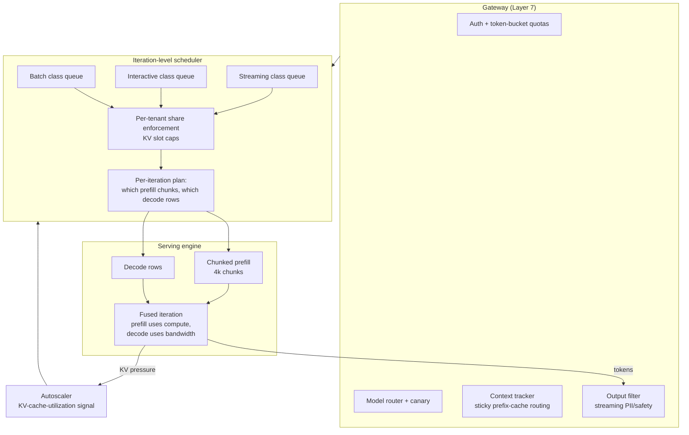

# Case Study: Scheduling a Shared GPU Fleet Across Fourteen Product Teams

> **Topic:** `T08` · **Transcript coverage:** partial · **Difficulty:** L4
> **One line:** How to schedule a shared inference fleet so that one tenant's long prompt cannot destroy everyone else's token latency — and why the batching strategy, the autoscaling signal and the fairness policy are one decision, not three.

## Table of Contents

- [1. The Scenario](#1-the-scenario)
- [2. Requirements](#2-requirements)
- [3. Architecture](#3-architecture)
- [4. Component Deep Dive](#4-component-deep-dive)
- [5. Decision Table](#5-decision-table)
- [6. Edge Cases & Exceptions](#6-edge-cases--exceptions)
- [7. Failure Modes & Mitigations](#7-failure-modes--mitigations)
- [8. Capacity & Cost Model](#8-capacity--cost-model)
- [9. Benchmarks & Measured Numbers](#9-benchmarks--measured-numbers)
- [10. Operational Runbook](#10-operational-runbook)
- [11. What Changes at 10x](#11-what-changes-at-10x)
- [12. Interview Walkthrough](#12-interview-walkthrough)

---

## 1. The Scenario

Sable is the internal AI platform team at a large retailer. It runs one GPU fleet for fourteen product teams: search ranking summaries, catalogue enrichment, customer-support drafts, a merchandising copilot, three batch classification jobs, and a handful of experiments.

The fleet is shared because the alternative was fourteen separate purchases, and the finance committee would not fund those. Sharing is the decision. Everything difficult follows from it.

**Three forces define the problem.**

**The workloads are wildly heterogeneous, and that is the point.** The catalogue enrichment job submits 5,000 short requests in a burst and wants throughput. The merchandising copilot holds a 60k-token product history and wants its next token in under 50 ms. The batch classification jobs are effectively prefill-only — "Classification is a **Prefill-only** task; it processes the entire input and produces a single output in one parallel pass, making it compute-optimal" `[R]` (ai-system-design-guide, 04-inference-optimization/01-inference-fundamentals.md) — while the copilot is entirely decode-bound. **One fleet, two physical regimes.**

**The organisational constraint is that the SLA is per-tenant and the hardware is not.** Search has a contractual 400 ms TTFT. Catalogue has no latency requirement at all. When the catalogue burst lands, search's p99 collapses, and the platform team is blamed for a breach caused by a different team's job.

**Sable cannot fix this by buying.** The fleet is fixed for the fiscal year, and utilization is already the number finance watches. Every decision below is a scheduling decision, not a capacity decision.

The corpus offers the diagnosis: "Batching is the primary lever for increasing LLM throughput and reducing cost. Serving frameworks have moved beyond simple request-level batching to **sub-token, iteration-level orchestration**" `[R]`.

## 2. Requirements

### Functional

| Requirement | Priority | Notes |
|---|---|---|
| Fourteen tenants on one fleet with per-tenant SLAs | P0 | The constraint |
| Batch class: throughput-optimised, latency-tolerant | P0 | Prefill-heavy `[R]` |
| Interactive class: TTFT-sensitive | P0 | The copilot and search |
| Streaming class: TPOT-sensitive across long outputs | P0 | SSE/WebSocket `[R]` |
| Per-tenant isolation of KV cache slots | P0 | Noisy-neighbour control `[R]` |
| Prefix-cache stickiness (a request's cache must find its node) | P0 | "Sticky sessions" `[R]` |
| Continuous admission: new requests join, finished requests leave | P0 | Iteration-level `[R]` |

### Non-functional

| Requirement | Target | Rationale |
|---|---|---|
| Fleet throughput | ≥ 4x static batching | The continuous batching claim `[R]` |
| Interactive P95 TPOT | ≤ 50 ms | The copilot |
| Interactive P95 TPOT during a batch burst | ≤ 80 ms | The stall budget |
| Batch-class goodput | Maximise; no latency SLO | Its own SLO is the fleet's |
| Per-tenant share of KV slots | Enforced; no tenant above its share | `[R]` |
| Autoscaling signal | **KV cache utilization** | `[R]` — not CPU, not QPS |
| Cold boot to ready | ≤ 20 s | "minutes to **15-20 seconds**" `[R]` |

### Constraints and non-goals

- **We do not give any tenant a dedicated replica in Phase 1.** It is the simplest fix and it destroys the pooling that justified the purchase.
- **We do not autoscale on CPU or memory.** The corpus is explicit that the signal is KV cache utilization `[R]`.
- **We do not run prefill and decode unfused without chunking.** §4.4.
- **We do not use a single engine for every workload.** "the right answer is **engine-per-workload** rather than a single house engine" `[R]`.
- **We do not treat the engine as a detail.** "A model is not 'Llama 4 Maverick'; it is '**Llama 4 Maverick on vLLM v0.18.3 with this batch config on this hardware**.' Pin all four" `[R]`.
- **We do not assume every added request improves throughput.** For expert-routed models it can do the opposite (§4.7).

## 3. Architecture

The diagram's point is that **the scheduler is not a queue in front of the engine; it is inside the generation loop.** Every architectural element here exists because admission decisions are made per token, not per request: the gateway supplies fairness inputs, the scheduler composes one iteration from many requests, and the autoscaler reads the memory pressure that composition produces.

## 4. Component Deep Dive

### 4.1 Static batching and the longest tail

Static batching is the traditional ML pattern — "all requests must be the same size and start/end together" — and the corpus names why it fails for LLMs: "inefficient for LLMs due to variable response lengths" `[R]`.

The failure has a precise shape, and the corpus's own worked example is the clearest statement of it: **"If one user asks for 500 tokens and another for 5 tokens, the GPU remains idle for the 5-token user for 495 cycles"** `[R]`.

Generalise that to a real fleet. A batch of 32 requests with a p50 of 200 tokens and a p95 of 2,000 tokens runs for 2,000 iterations. The median request finishes at iteration 200 and its slot is dead for the remaining 1,800 — **90% of the batch's lifetime spent holding slots that cannot be reused** `[D]`. That is the arithmetic behind the corpus's throughput table: static batching 1x, continuous batching **4x–10x** `[R]`.

### 4.2 Continuous batching

"Continuous batching (pioneered by **Orca** and **vLLM**) allows new requests to join the batch and finished requests to leave at the end of every individual token generation step" `[R]`.

| Aspect | Static batching | Continuous batching |
|---|---|---|
| Join/leave | Only at start/end | **Any iteration** |
| GPU utilization | Low (waiting for the longest) | High (always saturated) |
| Throughput | 1x | **4x–10x** |
| Latency | Highest for shortest | Balanced |

The mechanism that makes it affordable is the KV cache: "Continuous batching allows the 5-token user's request to exit the GPU immediately after its last token, **freeing up VRAM and compute slots** for a new request from the queue" `[R]`. Without paged allocation ([T07](../01-case-studies/T07-kv-cache.md)), the freed slot is a fragmented hole rather than reusable space, which is why these two techniques ship together.

**For Sable this is the floor, not the achievement.** Continuous batching is table stakes in every engine in the corpus's landscape `[R]`; the value is in what it makes possible — the fairness machinery in §5.3, which only exists because admission happens per iteration.

### 4.3 In-flight batching: mixing the two phases

The corpus describes the older model and its fix `[R]`:

> "Previously, serving engines processed a batch of 'Prefill' (heavy compute) OR a batch of 'Decode' (heavy memory). **In-Flight Batching** (TensorRT-LLM) allows mixing them: 1 request is in the Prefill phase. 15 requests are in the Decode phase. **Benefit**: The Prefill request utilizes the GPU's idle compute cores while the Decode requests utilize the memory bandwidth."

**This is the single most important scheduling idea in the topic**, because it is the only one that improves both metrics at once. From [T06](../01-case-studies/T06-inference-fundamentals.md): decode at batch 1 runs at an arithmetic intensity roughly 150x below the hardware's ridge point — it is entirely memory-bound and leaves the compute units idle. Prefill is the mirror image. Fusing them fills both.

Note the ratio in the corpus's example — one prefill to fifteen decodes. **The mix is a tuning parameter, and getting it wrong is how you get a stall (§4.4).**

### 4.4 The stall, and chunked prefill

The failure introduced by fusing the phases `[R]`:

> "Massive context prompts (1M+ tokens) can hang a batch for seconds during the Prefill phase, causing '**stalls**.'"
>
> "A 'stall' occurs when a massive new request arrives and its Prefill phase (which is compute-hungry) takes **2-3 seconds** to complete. During this time, the GPU is so busy with the prefill that it **cannot generate tokens for existing users in the 'Decode' phase**, causing their **TPOT to spike**."

**The fix** `[R]`: "Instead of prefilling 128k tokens at once, the engine breaks the prefill into smaller chunks (**e.g., 4k tokens each**) and interleaves them with the ongoing Decode steps of other users. This maintains a steady **TPOT** even when heavy requests arrive." The corpus's own numbers: "breaks that 3-second prefill into small **200ms chunks**, processing one chunk and then doing one round of decoding for everyone else, before returning to the next prefill chunk."

**The trade is explicit and worth stating as arithmetic** `[D]`. A 128k-token prompt in 4k-token chunks is `128,000 / 4,000 = 32` chunks. At ~200 ms per chunk that is **6.4 s** of prefill — against the 2–3 s the corpus quotes for the unchunked version. So chunked prefill:

| | Unchunked | Chunked (4k) |
|---|---|---|
| Prefill wall time (128k prompt) | 2–3 s `[R]` | ~6.4 s `[D]` from 32 chunks × 200 ms `[R]` |
| Max TPOT disruption to other tenants | **2–3 s** `[R]` | **~200 ms** `[R]` |
| Predictability | None — depends on arrival | Bounded by the chunk size |

**Chunked prefill deliberately makes the large request slower in order to bound everyone else's tail.** That is the correct trade for a shared fleet and the wrong one for a single-tenant deployment, where there is nobody to protect. Sable takes it; a dedicated-replica tenant would not.

### 4.5 The scheduler as a fairness mechanism

The corpus frames noisy neighbours as a scheduling problem with a name `[R]`:

> "We handle noisy neighbors through **Tiered Iteration-Level Scheduling**. Each tenant is assigned a 'share' of the total GPU cycles. In the continuous batching loop, the scheduler ensures that a single tenant doesn't occupy 100% of the KV cache slots. If Tenant A is overwhelming the system, the scheduler will prioritize 'Prefill' steps for Tenant B and C, or only process a subset of Tenant A's decode iterations per cycle. This is enforced at the Gateway via **token-bucket rate limiting** and at the serving engine via **specific scheduling policies**."

Three things are worth extracting:

1. **The enforcement point is the KV slot, not the request.** A tenant that cannot acquire KV blocks cannot grow its batch, regardless of how many requests it has queued. This is the mechanism that makes the fairness policy real rather than advisory.
2. **Fairness is enforced at two layers.** The gateway does coarse rate limiting; the engine does per-iteration admission. A gateway-only policy cannot see the GPU's instantaneous state; an engine-only policy cannot see tenant identity at the edge. Both are needed.
3. **The scheduler can prefer prefill for a starved tenant.** This is only possible because the scheduler composes each iteration — a queue would have to serve whole requests.

### 4.6 Autoscaling on the right signal

The corpus is unusually specific here, and it is the detail most teams get wrong `[R]`:

> "**Autoscaling**: Scaling based on **KV Cache utilization** rather than CPU or standard memory usage."

Why this is correct follows from [T06](../01-case-studies/T06-inference-fundamentals.md) and [T07](../01-case-studies/T07-kv-cache.md): in a paged engine, **the binding resource is KV blocks.** GPU compute sits idle while requests queue for blocks, so compute utilization is a lagging and misleading signal. Standard memory utilization is meaningless because the allocator's behaviour is not host-OS-like. QPS is worse still — it is a proxy for load, not for capacity.

**The corollary is a scaling trap:** a replica at 100% KV utilization and 30% compute utilization will not be flagged by any conventional autoscaler, and it will be the one adding latency. Watch KV occupancy.

Cold-boot time matters for the same reason: "using **Un-quantized Base Images** and loading weights from a high-speed Lustre/mount to reduce startup time from **minutes to 15-20 seconds**" `[R]`. An autoscaler that reacts to KV pressure is only useful if a new replica is ready in seconds, not minutes. **Autoscaling signal and cold-boot time are one design.**

### 4.7 MoE breaks the monotonicity assumption

The most important recent change in scheduling, and the one that invalidates the intuitive model `[R]`:

- **Expert weight residency**: "a **400B-parameter MoE with 17B active per token** wastes most of its VRAM keeping unused experts hot. The engine has to be aware of expert-to-token routing and either pin hot experts or stream cold ones."
- **Expert routing latency**: "the router decision happens **per token** and adds a measurable cost."
- **Non-monotonic batching profile**: "adding requests to the batch can **decrease** throughput if it forces a **colder set of experts** to be active. Optimal batch size depends on the **distribution of routing patterns** in the batch, not just batch count."
- **Pipeline-aware scheduling**: "best engines schedule new requests into batches that **share expert activations** with the in-flight batch."

**The consequence for Sable is a rule change.** Everywhere else in this document, bigger batches are better. For an expert-routed model, batch composition matters as much as batch size, and a scheduler that ignores routing patterns will report that adding capacity made things worse. The corpus's summary line is the one to remember: "**MoE serving is no longer 'vLLM with bigger weights.'** It is a different scheduling problem" `[R]`.

### 4.8 Parallelism, and why it is a latency decision

| | Tensor Parallelism | Pipeline Parallelism |
|---|---|---|
| Splits | Individual layers/tensors across GPUs | Different layers across GPUs |
| Latency | **Low (fastest)** | High (micro-batching overhead) |
| Communication | High — **requires NVLink** | Lower |
| Efficiency | High | Lower utilization (bubble time) |
| Corpus guidance | "Used for **90% of production serving** within a single node (8x GPUs)" | "Used only for massive models spanning multiple nodes" |

Source `[R]`. The mechanism, from the corpus's own interview answer: "TP performs the matrix multiplications of a single layer across multiple GPUs simultaneously. This means the latency of that layer is reduced by the number of GPUs. PP, conversely, processes different layers sequentially… For a single user's request, PP adds the latency of all GPUs, whereas TP divides the latency across all GPUs" `[R]`.

Scale reference: "**Llama 4 405B requires ~800GB VRAM**" `[R]` — which is what forces multi-node in the first place.

**For a shared fleet the ordering is: replicate first, then TP, then PP.** Replication adds throughput with no per-request penalty; TP reduces per-request latency at a communication cost; PP adds per-request latency, so it should never be chosen for a latency-sensitive tenant unless the model does not fit any other way.

### 4.9 Streaming, and the load-balancer trap

"LLMs are almost always served via **Server-Sent Events (SSE)** or **WebSockets**" `[R]`. The infrastructure consequence is counter-intuitive `[R]`:

> "Standard load balancers (**Layer 4**) struggle with long-lived AI connections. **The Fix**: Use **Layer 7 Load Balancers** (Envoy/Istio) that understand the '**End of Sequence**' token and can **re-balance traffic between user turns** rather than just at the connection level."

Two distinct problems are named. A long-lived SSE connection pins a client to a replica for its whole session, so a Layer 4 balancer cannot spread load. And the fix requires understanding where a turn ends, which is an application-layer concept.

**This interacts with prefix caching in a way that constrains the whole design.** The gateway's "**Context Tracker**" exists to ensure "a user's prompt cache is sent to the **same GPU node** (**Sticky sessions**)" `[R]` — which is the opposite of load balancing. **Sable cannot have both perfect stickiness and perfect balance; it has to choose per class** (§5.6).

## 5. Decision Table

### 5.1 Batching strategy

| Option | Pros | Cons | Exceptions — when it breaks | When to use |
|---|---|---|---|---|
| Static batching | Simple; predictable | The longest tail: "the GPU remains idle for the 5-token user for 495 cycles" `[R]`; 1x throughput | Breaks on any variable-length workload, which is all of them | Never for LLM serving |
| **Continuous batching (chosen)** | **4x–10x** throughput `[R]`; join/leave any iteration; the precondition for fairness scheduling | Needs paged KV to reclaim slots `[R]`; more engine state | Breaks if the KV allocator is contiguous — freed slots become holes | Default, always |
| In-flight (prefill + decode fused) | Fills idle compute with prefill while decode uses bandwidth `[R]`; improves both | Creates the stall risk (§4.4) | Breaks without chunked prefill | With chunking, always |
| Chunked prefill (chosen, with in-flight) | Bounds TPOT disruption to the chunk size `[R]` | Slows the large request's own TTFT `[D]` | Breaks if the chunk is so small that per-iteration overhead dominates | Whenever a long prompt shares a fleet |
| Disaggregated prefill/decode | Isolates the phases onto separate hardware | A second hop for the KV transfer; operational complexity; the corpus treats it as a config flag "primarily for **very long context workloads**" `[R]` | Breaks when context is short — no benefit, all the cost | Very long context, at scale |
| Micro-batching the prefill | Smoother than monolithic | Does not bound the tail as cleanly as chunking | — | Legacy |

**Chosen:** continuous batching with in-flight fusion and 4k chunked prefill.
**Revisit if:** measured per-chunk overhead exceeds the TPOT benefit, or if long-context traffic grows enough to justify disaggregation.

### 5.2 Scheduling fairness

| Option | Pros | Cons | Exceptions — when it breaks | When to use |
|---|---|---|---|---|
| FCFS | Simple; no starvation among equals | One tenant's burst starves everyone; no notion of an SLA | Breaks the moment any tenant submits a batch job | Never on a shared fleet |
| Priority by class | Protects interactive tenants simply | Starves batch class indefinitely | Breaks when batch work has a deadline | When batch work is genuinely elastic |
| **Tiered iteration-level shares (chosen)** | Each tenant gets "a 'share' of the total GPU cycles"; KV slot caps make it real `[R]` | Needs per-tenant accounting in the hot loop; more config | Breaks if shares are set without measuring each tenant's real demand | Default |
| Token-bucket at the gateway only | Cheap; tenant-visible | Cannot see GPU state; a tenant under quota can still consume all KV slots `[R]` | Breaks under bursty short requests | As a complement, never alone |
| Dedicated replicas per tenant | Perfect isolation; simple SLAs | Destroys pooling; 14 × the idle capacity | Breaks the business case | Only for a tenant with a contractual isolation requirement |
| Time-sliced windows | Simple to reason about | Terrible latency for the idle tenants | — | Never for interactive |

**Chosen:** tiered iteration-level shares with per-tenant KV slot caps, plus gateway token buckets.
**Revisit if:** a tenant's measured demand consistently exceeds its share at off-peak times — that is a signal the shares are static where they should be adaptive.

### 5.3 Autoscaling signal

| Option | Pros | Cons | Exceptions — when it breaks | When to use |
|---|---|---|---|---|
| CPU utilization | Universally available | Meaningless for GPU inference; will never trigger | Never | Never |
| QPS | Simple; business-meaningful | A proxy for load, not capacity; a long-prompt request and a short one count the same | Breaks under variable prompt length | As a secondary signal |
| Standard memory | Host memory is not the constraint | Misleading | — | Never |
| **KV cache utilization (chosen)** | The actual binding resource `[R]`; leads latency, not lags it | Needs engine-level metrics exposure | Breaks if the metric is not exported per replica | Default |
| Queue depth | Simple; leads latency | Cannot distinguish "busy" from "blocked on KV" | Breaks when the queue is short but the batch is memory-saturated | As a cross-check on KV signal |
| Goodput (SLO-meeting throughput) | Aligns scaling with the actual goal | Needs an SLO definition per class; noisier | Breaks when the SLO is not measurable per request | Mature deployments |

**Chosen:** KV cache utilization as the primary signal, with goodput as a secondary once the SLO instrumentation exists.
**Revisit if:** the fleet scales up while latency is fine — that is a signal the threshold was set for throughput, not for the latency SLO.

### 5.4 Parallelism

| Option | Pros | Cons | Exceptions — when it breaks | When to use |
|---|---|---|---|---|
| **Replicate (chosen)** | Linear throughput; no per-request penalty | Each replica holds a full model copy | Breaks when the model does not fit on one device | Default |
| Tensor parallelism | "reduces the latency of that layer by the number of GPUs" `[R]`; used for "**90% of production serving**" within a node | High communication; "requires NVLink" `[R]` | Breaks without fast interconnect — latency gain evaporates | When the model does not fit, or latency is the binding SLO |
| Pipeline parallelism | Cheaper communication; spans nodes | "adds the latency of all GPUs" for a single request `[R]`; bubble time | Breaks for latency-sensitive tenants | Only for models spanning nodes |
| Heterogeneous fleet mixing | Right-sizes hardware per model | Operational variety | — | When the corpus's "**H100s for frontier models and L4s for small models**" `[R]` split is real |

**Chosen:** replicate; tensor parallelism only if a model does not fit.
**Revisit if:** a latency-critical tenant needs TP within a node — then NVLink becomes a procurement requirement, not an implementation detail.

### 5.5 Prefix caching versus load balancing

| Option | Pros | Cons | Exceptions — when it breaks | When to use |
|---|---|---|---|---|
| Pure round-robin | Perfect balance | Destroys prefix cache hits — a request lands on a node without its prefix | Breaks the economics of any shared prefix ([T07](../01-case-studies/T07-kv-cache.md)) | When no prefix is shared |
| **Sticky by prefix with L7 rebalancing between turns (chosen)** | Preserves cache locality; L7 understands the end-of-sequence token `[R]` | Uneven load; needs the gateway's context tracker `[R]` | Breaks when a hot prefix pins one replica at capacity | Default |
| Sticky by session | Simple | Same imbalance; longer-lived | — | Chat-like workloads |
| Consistent hashing on prefix | Deterministic; survives node changes | Imbalance under skew | Breaks with very hot keys | When prefix popularity is skewed |
| Always route to the least-loaded node | Best balance | No cache locality | — | Latency-only, no shared prefix |

**Chosen:** prefix-sticky routing with L7 rebalancing at turn boundaries, and a hot-prefix escape hatch.
**Revisit if:** replica load skew exceeds the threshold where imbalance costs more than the cache misses it saves.

### 5.6 Engine per workload

The corpus's May 2026 landscape table, reproduced because it is the decision `[R]`:

| Workload | Engine | Why |
|---|---|---|
| Public chatbot, mixed traffic, must be patched fast | **vLLM v0.18.2+** | Easiest to operate, best security cadence |
| JSON function-calling backend | **SGLang v0.4.3+** (text-only path) | ~29% throughput win on structured output, from async constrained decoding |
| Single-model latency-critical | **TensorRT-LLM** on B300 | Peak NVIDIA throughput; worth the operational cost at one model |
| Multimodal (image, audio, video in) | **vLLM v0.18.2+** | SGLang's multimodal path is reported unpatched |
| Reasoning model, long CoT, low concurrency | **TensorRT-LLM** or vLLM with disaggregated prefill | Decode-bound; benefits from custom kernels |
| MoE model | vLLM v0.18+ or SGLang v0.4.3+ with a MoE scheduler | Both have first-class MoE paths |
| Single replica, sub-50 ms TTFT | Cerebras Cloud API or Groq LPU | "GPUs cannot hit this on a 70B+ model" |

Two caveats the corpus attaches, both of which Sable adopts as hard rules `[R]`:

- **Security.** The corpus reports a high-severity **multimodal RCE** in vLLM affecting versions before **v0.18.2**, and **unpatched RCEs in SGLang's multimodal and disaggregated-prefill code paths**, with the text-only path reported safe. **These are specific and consequential claims; verify them against the projects' advisory feeds before acting** — which is what the corpus itself instructs: "**Watch the security advisory feeds**, not just the release notes."
- **Operational posture.** "Always be on a patched version"; "Run a canary on a **second engine**" at 1–5% of traffic; "Treat the engine as part of the deployment manifest… Pin all four."

**Chosen:** vLLM as the house default, SGLang for the JSON function-calling workloads on the text-only path, with a canary on the alternate engine.
**Revisit if:** the security posture of any engine changes, or a workload's category shifts.

## 6. Edge Cases & Exceptions

| Situation | Symptom | Handling |
|---|---|---|
| **128k prompt arrives during peak** | Everyone's TPOT spikes | This is the stall `[R]`. Chunked prefill bounds it `[R]`; without it, one request can add 2–3 s to every in-flight request's next token |
| **All chunk slots are prefill** | Decode starves | Chunking bounds the *duration*, but a pathological arrival mix can still consume every iteration. Cap the fraction of each iteration allocated to prefill chunks |
| **A tenant's batch job enqueues 5,000 requests** | Fairness collapse | KV slot caps are the mechanism `[R]`; a gateway-only quota will not stop it |
| **Hot prefix pins one replica** | Load skew; one node saturated | Escape hatch in §5.5: after a deviation threshold, route to a second node and accept the cache miss |
| **SSE connection pins a client to a dying replica** | Streaming interruptions | L7 balancer that understands end-of-sequence `[R]`; rebalance between turns, not mid-turn |
| **Autoscaler does not fire** | Latency degrades at "normal" utilization | The signal is KV cache utilization `[R]`; a compute-based autoscaler will never fire |
| **New replica takes minutes to boot** | Autoscaling arrives too late to help | "Un-quantized Base Images" plus weights from a fast mount: "**minutes to 15-20 seconds**" `[R]` |
| **MoE model with a cold expert set** | Adding requests *reduces* throughput `[R]` | Non-monotonic profile. Schedule for routing-pattern overlap, not batch size |
| **Classification-only traffic** | Decode rows are empty | Prefill-only workloads are "compute-optimal" `[R]`; they should be scheduled as a distinct class, not mixed blindly |
| **Tenant shares change without notice** | Fairness config goes stale | Shares are configuration with an owner and a review date |
| **Engine upgrade during a security event** | Version pinning conflicts with patching | The corpus's posture resolves it: patched versions are mandatory, and the manifest pins all four attributes `[R]` |
| **A request's prefix cache is on an evicted node** | Recomputation cost ([T07](../01-case-studies/T07-kv-cache.md)) | Graceful: a cache miss is slow, not wrong. Route on prefix when possible, otherwise recompute |
| **Two classes want the same iteration** | Scheduler ambiguity | The per-iteration plan is explicit: how many prefill chunks, how many decode rows, which tenants. Ambiguity here becomes a latency incident |

## 7. Failure Modes & Mitigations

| Failure | Symptom | Detection | Blast radius | Mitigation | Recovery |
|---|---|---|---|---|---|
| Long prefill stalls the fleet | TPOT p99 spike across all tenants | TPOT by class, correlated with prompt-length arrivals | Every tenant on the replica | Chunked prefill `[R]`; cap prefill share per iteration | Reduce chunk size; shed the long request |
| Noisy neighbour | One tenant's latency collapse | Per-tenant latency and KV-slot occupancy | One or more tenants | Tiered iteration-level shares with KV caps `[R]` | Tighten the offending tenant's cap |
| Autoscaler never fires | Latency rises at low compute utilization | KV utilization vs replica count | Fleet | Scale on KV cache utilization `[R]` | Fix the signal; manual scale |
| Cold start too slow | Scale-out does not help in time | Time from scale decision to ready | Fleet | Warm images and fast weight mounts: minutes → 15–20 s `[R]` | Pre-warm a buffer pool |
| Cache locality destroyed by balancing | Cost rises, TTFT worsens | Cache hit rate falls after a routing change | Fleet | Prefix-sticky routing with L7 rebalancing `[R]` | Restore stickiness |
| Static batching regression | Throughput drops on an engine change | Throughput against the 4x–10x baseline `[R]` | Fleet | Verify continuous batching is on after every upgrade | Roll back |
| MoE batch non-monotonicity | More load, less throughput | Throughput vs batch size curve | Fleet | Routing-aware scheduling `[R]` | Cap batch; schedule by expert overlap |
| Unpatched engine vulnerability | Security incident | Advisory feed monitoring `[R]` | Fleet, potentially customer data | Patched versions only; canary on a second engine `[R]` | Emergency upgrade; isolate the affected path |
| Gateway quota does not bind | A tenant exceeds its share anyway | Compare gateway counters against engine KV occupancy | Fleet | Enforce at the engine (KV slots), not only at the gateway `[R]` | Add engine-level caps |
| Streaming connections survive a bad replica | Partial responses | Stream-completion rate | Some requests | L7 balancer with end-of-sequence awareness `[R]` | Drain and rebalance |
| PP chosen for a latency tenant | Latency worse than single-GPU | Per-request latency vs topology | One tenant | PP "adds the latency of all GPUs" `[R]`; use TP or replicate | Re-topologise |

## 8. Capacity & Cost Model

Arithmetic is mine; assumptions are shown.

**Assumptions**

| Input | Value | Basis |
|---|---|---|
| Fleet | 32 GPUs across replicas | `[D]` |
| Tenants | 14 | §1 |
| Interactive tenants | 4 | `[D]` |
| Batch-class requests per burst | 5,000 | §1 |
| Average output, batch class | 200 tokens | `[D]` |
| Longest output in a static batch, p95 | 2,000 tokens | `[D]` |
| Long-prompt arrival | 128k tokens | `[R]` the stall example |
| Chunk size | 4k tokens | `[R]` |
| Per-chunk time | 200 ms | `[R]` |
| Continuous batching speedup | 4x–10x | `[R]` |

**Step 1 — the longest tail, quantified.** A static batch of 32 requests runs for the length of its longest member. With p50 200 and p95 2,000 tokens `[D]`, the batch runs 2,000 iterations while the median request finishes at 200 — **the average slot is occupied for 200 of 2,000 iterations, i.e. 10% useful occupancy** `[D]`. Static batching is not "somewhat inefficient"; at this length distribution it wastes ~90% of the batch's slot-iterations. Against the corpus's 4x–10x `[R]`, the arithmetic predicts a somewhat larger gain, which means the corpus's figure is conservative for skewed length distributions.

**Step 2 — the stall costs every tenant, simultaneously.** The corpus's numbers: a 2–3 s prefill during which "the GPU… **cannot generate tokens for existing users in the 'Decode' phase**" `[R]`. If 15 decode streams are in flight `[R]`, each is delayed by the full stall. Against a 50 ms TPOT target `[D]`, a 2.5 s stall is a **50x breach**, and it is experienced as a single frozen second by every interactive user on that replica. **One request's arrival becomes every tenant's incident** — which is exactly the organisational dynamic in §1.

**Step 3 — chunking, and what it costs.** 128k tokens at 4k per chunk is `32` chunks; at 200 ms each, `32 × 200 ms = 6.4 s` `[D]` against 2–3 s unchunked `[R]`. So:

| | Unchunked | Chunked 4k |
|---|---|---|
| Prefill time | 2.5 s `[R]` | 6.4 s `[D]` |
| Worst-case TPOT delay for others | 2,500 ms | 200 ms |
| Ratio | 50x the 50 ms target | 4x the 50 ms target |

**Chunking buys a 12.5x reduction in tail disruption for a 2.6x increase in the large request's own TTFT.** For a shared fleet that is an obviously correct trade; for a single-tenant deployment serving only long prompts it is obviously wrong. This is the clearest illustration in the document of why scheduling policy is a function of the tenancy model.

**Step 4 — the fairness budget.** With 14 tenants and a per-tenant KV cap of `1/14`, a single tenant can occupy at most ~7% of the fleet's slots `[D]`. The cap converts an unbounded blast radius into a bounded one: the catalogue burst can slow the other thirteen tenants by *at most* the amount implied by losing 93% of capacity to nobody — i.e. **it cannot take capacity it is not entitled to, so the worst case for the others is their own share, not zero.**

The residual question is whether 7% is enough for the catalogue job to finish. At 5,000 requests × 200 tokens = 1M tokens for the burst, and a fleet of 32 GPUs each producing on the order of `[D]` 2,000 tokens/s under continuous batching, the burst is ~16 GPU-seconds of work spread over the fleet. **The batch class is not actually expensive; it is only disruptive when it is allowed to take the whole batch.** The cap costs it almost nothing and saves everyone else.

**Step 5 — autoscaling on the right signal, with the cold-boot constraint.** If the autoscaler watches compute utilization, a replica at 100% KV occupancy and 30% compute never triggers a scale-out, and latency degrades with no scaling response — the failure in §7. Watching KV occupancy triggers correctly, but only helps if a new replica is ready in time: `[R]` "minutes" without the fast-mount path versus **15–20 s** with it. **A 15-second boot against a 30-second latency-degradation window is a working autoscaler; a 3-minute boot against the same window is a dashboard.**

**Sensitivity**

| Scenario | Effect |
|---|---|
| Chunk size 4k → 1k | Tail disruption falls to ~50 ms (`0.05 ms/token × 1k`), but the number of interleaved decode rounds rises **32 → 128**, so the large request's own TTFT grows from `6.4 s + 32d` to `6.4 s + 128d`. The tail protection improves while the large request gets steadily worse — why 4k is the corpus's example `[R]` |
| Chunk size 4k → 16k | Tail disruption rises to ~800 ms; interleaved rounds fall **32 → 8**, so the large request's TTFT improves to `6.4 s + 8d`. Correct only when long prompts are rare and the TPOT tail can absorb an 800 ms stall |

**The model behind those two rows, stated so it can be checked** `[D]`. Per-chunk *compute* scales
with chunk size, anchored on the corpus's "4k tokens ≈ 200 ms" `[R]` — that is **0.05 ms/token**, so
the pure-prefill total for a 128k prompt is **~6.4 s at every chunk size**. What chunk size actually
changes is the **number** of interleaved decode rounds, `N = 128k / chunk`, and the per-round
other-tenant work `d`, which **this case study does not measure** — hence `N` is written as a
coefficient rather than a total. *(Two earlier rows here held per-chunk time constant at 200 ms
regardless of chunk size, which implies a 16k chunk costs the same as a 4k chunk. That is not
physical and has been corrected; the direction of both effects is unchanged, and only the
16k row's "~1.6 s" was materially wrong — it is not attainable.)*
| Tenant count 14 → 40 | Per-tenant share falls to 2.5%; the batch class may no longer finish within its window, and shares need to be demand-weighted rather than equal |
| MoE model adopted | The monotonic-batch assumption breaks `[R]`; re-tune from scratch |
| Disaggregation adopted | The stall disappears by construction; the cost is a second hop and a more complex fleet |
| Fleet utilization target raised | Shares become the only defence; autoscaling cannot help a fleet with no spare capacity |

**Break-even.** Chunked prefill costs the long-prompt tenant ~3.9 s of extra TTFT `[D]` per 128k request and saves every other tenant on the replica up to 2.3 s per occurrence. With 15 concurrent decode streams `[R]`, one chunked prefill saves `15 × 2.3 s = 34.5 s` of aggregate disruption for `3.9 s` of cost — **roughly a 9x return, and it grows with the number of co-tenants.** On a dedicated replica with no co-tenants the return is zero and the cost is real, which is precisely why the policy is scoped to the shared fleet.

## 9. Benchmarks & Measured Numbers

| Metric | Value | Source | Conditions |
|---|---|---|---|
| Continuous vs static batching throughput | **1x → 4x–10x** | `[R]` 04-inference-optimization/04-batching-strategies.md | The corpus's table |
| Static batching waste example | 500-token and 5-token requests; 495 idle cycles | Same `[R]` | The "longest tail" illustration |
| In-flight batching mix | 1 prefill + 15 decode in one batch | Same `[R]` | TensorRT-LLM |
| Stall duration | **2–3 seconds** for a massive prefill | Same `[R]` | During which decode cannot run |
| Chunked prefill chunk size | e.g. 4k tokens; ~200 ms per chunk | Same `[R]` | 128k prefill broken into chunks |
| Autoscaling signal | **KV cache utilization** | `[R]` 04-inference-optimization/06-serving-infrastructure.md | Not CPU, not standard memory |
| Cold boot improvement | minutes → **15–20 seconds** | Same `[R]` | Un-quantized base images + weights from high-speed mount |
| Model parallelism guidance | TP used for **90% of production serving** within a node (8x GPUs) | Same `[R]` | TP requires NVLink |
| Llama 4 405B VRAM | ~800 GB | Same `[R]` | The multi-node forcing case |
| SGLang structured-output advantage | **~29%** over vLLM | Same `[R]` | Published benchmark, April 2026; text-only path; **vendor-published** |
| MoE residency example | 400B parameters, 17B active per token | Same `[R]` | Expert weight residency problem |
| Sub-50 ms TTFT | Cerebras Cloud API or Groq LPU | Same `[R]` | Stated as beyond what GPUs achieve on 70B+ models |
| vLLM multimodal RCE | Affects versions before **v0.18.2** | Same `[R]` | **A specific security claim — verify against the project's advisory feed** |
| SGLang RCEs | Reported unpatched in multimodal and disaggregated-prefill paths | Same `[R]` | **Specific security claim — verify before acting**; text-only path reported safe |
| Prefill-only workloads | "compute-optimal" | `[R]` 04-inference-optimization/01-inference-fundamentals.md | Classification as the example |
| TTFT/TPOT targets | < 200 ms / < 30 ms | Same `[R]` | Defaults, not requirements |

**Vendor and corpus claims:** the SGLang ~29% figure is vendor-published; the engine landscape version numbers, CVE claims and throughput rankings are the supporting repo's assertions as of May 2026 and **must be re-verified against the projects' own advisory feeds and release notes before any procurement or upgrade decision.** The corpus itself instructs this.

## 10. Operational Runbook

**Deploy**
1. **Continuous batching on, verified after every engine upgrade.** It is the 4x–10x baseline `[R]` and a config regression silently removes it.
2. **Chunked prefill on, sized from the TPOT budget.** Start at 4k `[R]`; measure the tail.
3. **Autoscaler on KV cache utilization** `[R]`. Assert in CI that the signal is KV and not CPU.
4. **Per-tenant KV slot caps** enforced at the engine, with gateway token buckets as a complement `[R]`.
5. **Prefix-sticky routing** with an L7 balancer that understands end-of-sequence `[R]`.
6. **Cold-boot path warm**: un-quantized base images and a fast weight mount `[R]`.
7. **The manifest pins all four**: model, engine version, batch config, hardware `[R]`.

**Tune — in this order**
1. **Chunk size**, because it is the TTFT-versus-TPOT dial and it is the cheapest thing to change.
2. **Per-iteration prefill share**, so a pathological arrival mix cannot starve decode.
3. **Tenant shares**, from measured demand rather than equal division.
4. **Autoscaler thresholds**, against the latency SLO rather than against throughput.
5. **Prefix stickiness versus balance**, once cache hit rate is measured.

**Monitor**
- **TPOT by class**, p50/p95/p99 — the metric the stall destroys.
- **KV cache utilization per replica** — the autoscaling signal and the best leading indicator of a capacity wall.
- **Per-tenant KV slot occupancy**, against the cap. This is the fairness metric.
- Queue depth and admission-rejection rate.
- Cache hit rate, which routing changes silently affect.
- Prefill chunk occupancy and the prefill:decode mix per iteration.
- Cold-start time, end to end, because it bounds autoscaler effectiveness.
- Engine version and advisory-feed status `[R]`.

**Incident — top 5**
1. **Fleet-wide TPOT spike.** Symptom: every tenant's p99 rises together. Diagnosis: a long prefill, unchunked or under-chunked. Action: reduce chunk size; cap prefill share per iteration.
2. **One tenant's latency collapse.** Symptom: a single tenant's SLA breaches while others are fine. Diagnosis: KV slot occupancy by tenant. Action: enforce the cap at the engine, not just the gateway.
3. **Latency degrades with no scale-out.** Symptom: rising latency, stable compute utilization. Diagnosis: the autoscaler is on the wrong signal. Action: switch to KV occupancy `[R]`.
4. **Cost rises after a routing change.** Symptom: cache hit rate falls. Diagnosis: the load balancer stopped being prefix-sticky. Action: restore stickiness or accept a re-baselined cost with a documented reason `[R]`.
5. **Security advisory affecting a deployed engine.** Symptom: an advisory naming a version in the manifest `[R]`. Diagnosis: which code path we use — text-only versus multimodal versus disaggregated. Action: upgrade or isolate the affected path; the corpus's posture is patched-version-or-nothing.

## 11. What Changes at 10x

- **Fairness moves from configuration to mechanism.** At 14 tenants with slack, static shares work. At 140 tenants with none, shares must be demand-adaptive, and the scheduler becomes a real multi-tenant resource allocator with all the machinery that implies.
- **Disaggregation becomes the default rather than an option.** The stall exists because prefill and decode share a device. At 10x the interference cost exceeds the operational cost of separating them, and the corpus already flags disaggregated prefill as the long-context path `[R]`.
- **The engine-per-workload split becomes a platform.** Running two engines with a canary `[R]` is a posture; running four across workload classes is a product, with its own build, test and upgrade pipeline.
- **Autoscaling becomes capacity planning.** At 10x, responding to KV pressure is not enough — the fleet needs predicted demand, because cold starts and share reallocation do not happen instantly.
- **What inverts:** "maximise batch size" stops being universally true, both for MoE models (non-monotonic throughput `[R]`) and for latency-sensitive tenants, for whom batch size is a liability.
- **What survives:** iteration-level scheduling, chunked prefill, KV-utilization autoscaling, prefix stickiness, and the prefill:decode fusion. Those are structural.

## 12. Interview Walkthrough

**Whiteboard order (35 min)**
1. The longest-tail problem in one sentence: a 5-token request waits 495 cycles behind a 500-token one `[R]`.
2. Continuous batching as the fix — join and leave at any iteration — and the 4x–10x it buys `[R]`, plus why it needs paged KV to reclaim the freed slots.
3. In-flight batching as the composition trick: prefill uses idle compute, decode uses bandwidth, one batch `[R]`.
4. The stall it creates, and chunked prefill as the fix — with the explicit trade: the long request gets slower, everyone else's tail gets bounded `[R]`.
5. Fairness: tiered iteration-level shares enforced at the KV slot, gateway token buckets as a complement `[R]`.
6. Autoscaling on KV cache utilization, not CPU `[R]`, and why cold-boot time is part of that decision.
7. The two traps that are not about batching at all: prefix stickiness versus load balancing, and MoE's non-monotonic batch profile `[R]`.

**The three numbers to say out loud**
- **4x–10x** — what continuous batching buys over static.
- **2–3 seconds** — the stall, and therefore the size of the blast radius of one unlucky request.
- **15–20 seconds** — the cold-boot time that decides whether autoscaling helps at all.

**The tradeoff to volunteer before you are asked:** chunked prefill deliberately makes the large request slower. It is the right trade on a shared fleet and the wrong one on a dedicated replica, so the sizing of the chunk is a statement about your tenancy model, not just a performance parameter.

**Follow-ups**

1. *Why is static batching so bad for LLMs?* — Variable response lengths mean every request waits for the longest in the batch; slots cannot be reclaimed.
2. *What does in-flight batching actually mix?* — Prefill (compute-bound) and decode (memory-bound) requests in the same iteration, so each uses the resource the other leaves idle.
3. *What is a stall and how do you fix it?* — A long prefill monopolising the GPU for seconds while decode cannot run. Chunk it and interleave decode rounds between chunks.
4. *How do you stop a noisy neighbour?* — Tiered iteration-level scheduling with per-tenant KV slot shares, enforced at the engine, complemented by gateway rate limits.
5. *What signal do you autoscale on?* — KV cache utilization. Not CPU, not host memory, not QPS.
6. *Why not use a Layer 4 load balancer?* — Long-lived SSE connections pin clients; you need Layer 7 to rebalance between turns using the end-of-sequence token.
7. *When does adding a request reduce throughput?* — With an expert-routed MoE model, if the new request activates a colder set of experts. Batch composition matters as much as batch size.
8. *TP or PP for a latency SLO?* — TP: it divides a layer's latency across GPUs. PP adds the latency of every stage for a single request and is for models that span nodes.

## Sources

- `refs/ai-system-design-guide-main/ai-system-design-guide-main/04-inference-optimization/04-batching-strategies.md` — the static-versus-dynamic framing, continuous batching attributed to Orca and vLLM with the join/leave, utilization, 4x–10x and latency comparison table, in-flight batching with the 1-prefill/15-decode example, chunked prefill with the 4k chunk and 200 ms figures, the stall definition with 2–3 s prefill and the TPOT spike, and the longest-tail worked example.
- `refs/ai-system-design-guide-main/ai-system-design-guide-main/04-inference-optimization/06-serving-infrastructure.md` — the inference gateway's four components including the context tracker and sticky sessions, tensor versus pipeline parallelism with the 90%-of-production and NVLink guidance and the ~800 GB 405B figure, Kube-Ray/Gloo orchestration, KV-cache-utilization autoscaling, cold booting from un-quantized base images at 15–20 s, SSE/WebSocket serving and the Layer 4 versus Layer 7 load-balancing problem, the May 2026 engine landscape with version numbers, the ~29% SGLang structured-output figure, the vLLM and SGLang security advisories, MoE-aware serving with expert residency and the non-monotonic batching profile, the engine-per-workload decision table, the operational posture of patched versions and second-engine canaries, and tiered iteration-level scheduling for noisy neighbours.
- `refs/ai-system-design-guide-main/ai-system-design-guide-main/04-inference-optimization/01-inference-fundamentals.md` — the prefill/decode bottleneck split, the TTFT/TPOT/throughput/latency metric table with targets, and the "prefill-only classification is compute-optimal" framing.
- `refs/ai-system-design-guide-main/ai-system-design-guide-main/04-inference-optimization/05-paged-attention.md` — paged allocation as the precondition for reclaiming slots freed by continuous batching, and the block-table mechanism.
- `refs/CMU_Inference_Algorithms_for_Language_Modeling_Fall_2025_transcripts_2/CMU_LLM_Inference_1_Introduction_to_Language_Models_and_Inference.txt` — the fixed per-step dispatch cost and GPU under-saturation that motivate batching, and the ideal-FLOPs caveat.
- `refs/llm-inference-engineering-main/llm-inference-engineering-main/README.md` — topic inventory confirming coverage of continuous batching, in-flight batching, chunked prefill, prefill-decode disaggregation and token streaming. **This file is a table of contents and contains no figures.**
- `refs/ai-system-design-guide-main/ai-system-design-guide-main/16-case-studies/01-enterprise-rag.md` — house style reference.
