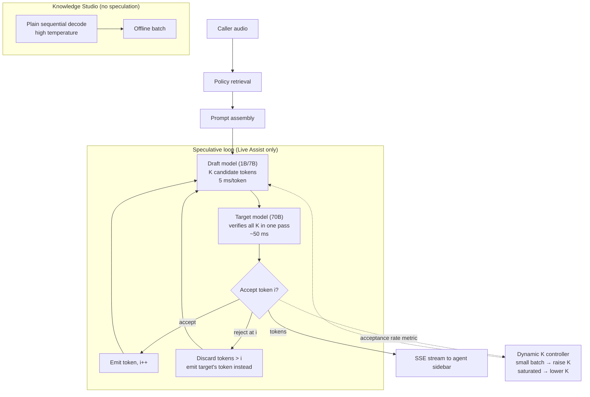

# Case Study: Speculative Decoding for a Real-Time Agent Assist

> **Topic:** `T09` · **Transcript coverage:** partial · **Difficulty:** L4
> **One line:** Whether to buy latency with a second model in the serving path — and the acceptance-rate floor below which speculation makes the product slower than not doing it.

## Table of Contents

- [1. The Scenario](#1-the-scenario)
- [2. Requirements](#2-requirements)
- [3. Architecture](#3-architecture)
- [4. Component Deep Dive](#4-component-deep-dive)
- [5. Decision Table](#5-decision-table)
- [6. Edge Cases & Exceptions](#6-edge-cases--exceptions)
- [7. Failure Modes & Mitigations](#7-failure-modes--mitigations)
- [8. Capacity & Cost Model](#8-capacity--cost-model)
- [9. Benchmarks & Measured Numbers](#9-benchmarks--measured-numbers)
- [10. Operational Runbook](#10-operational-runbook)
- [11. What Changes at 10x](#11-what-changes-at-10x)
- [12. Interview Walkthrough](#12-interview-walkthrough)

---

## 1. The Scenario

Fathom sells a real-time assist for contact centres. A human agent is on a call; Fathom transcribes, retrieves the relevant policy, and streams a suggested reply into the agent's sidebar **as the caller is still speaking**. The suggestion arrives token by token. If it arrives slowly, the agent has already answered from memory and the product is useless.

**TPOT is the product.** A per-token latency of 50 ms means a 40-token suggestion takes 2.0 seconds — long enough that the agent has moved on. At 20 ms the same suggestion lands in 0.8 seconds, which is inside the conversation's natural pause.

Fathom runs a 70B-class target model, and here is the arithmetic that defines the problem, stated in the corpus in its most compact form: decoding is "memory-bound: **loading 140GB of weights (70B model) to produce a single 2-byte token** is inefficient" `[R]` (ai-system-design-guide, 04-inference-optimization/03-speculative-decoding.md).

Two surfaces, with opposite characteristics:

- **Live Assist** — grounded, factual, low temperature, 40-token outputs, TPOT-critical. This is the product.
- **Knowledge Studio** — generates help-centre articles overnight, deliberately varied, high temperature, latency-irrelevant. Nobody is waiting.

Three forces shape the design.

**The sales team has promised a bigger model.** An upgrade would improve suggestion quality, and it would push per-token latency the wrong way — larger weights mean more bytes read per token. Speculative decoding is the only technique on the table that buys back the latency without giving up the quality, which is why it moves from "optimisation" to "contractual prerequisite."

**The team is three people, and speculation adds a second model to the serving path.** A draft model has its own weights, its own KV cache, its own version skew against the target, and its own failure modes. The corpus notes the industry has been moving away from this for exactly that reason: "The industry has moved away from separate draft models (which add VRAM overhead) toward **Medusa Heads**" `[R]`.

**And on one of the two surfaces, speculation is actively harmful.** The corpus names the case precisely: high-temperature generation produces a flatter distribution, acceptance collapses, and "the target model's parallel pass was **wasted compute**, and the system falls back to standard sequential decoding, **adding the overhead of the draft model's latency**" `[R]`. Fathom has one surface of each kind. The design must know which is which.

## 2. Requirements

### Functional

| Requirement | Priority | Notes |
|---|---|---|
| Stream suggestions token-by-token | P0 | SSE `[R]` |
| Target model at 70B-class quality | P0 | The sales promise |
| TPOT ≤ 20 ms on Live Assist | P0 | The product |
| Preserve output quality exactly | P0 | "**zero loss in quality**" `[R]` is the technique's contract |
| Graceful degradation when acceptance collapses | P0 | §5.5 |
| No second model on the Knowledge Studio path | P1 | Latency-tolerant; complexity not justified |
| Draft and target must be version-locked | P0 | A drifted draft degrades silently |

### Non-functional

| Requirement | Target | Rationale |
|---|---|---|
| Speedup, Live Assist | 2x–3x wall clock | `[R]` the corpus's stated range |
| Effective TPOT | 15–25 ms | `[R]` the corpus's speculative row |
| Acceptance rate floor | ≥ 40% | `[D]` derived in §8; below ~30% speculation loses |
| Extra VRAM for speculation | Minimal | Medusa's stated advantage `[R]` |
| Draft model maintenance burden | Justified by a named engineer | §1's three-person team |

### Constraints and non-goals

- **We do not speculate on the high-temperature surface.** The corpus's acceptance-rate argument makes it a net loss `[R]`.
- **We do not treat speculation as a quality technique.** It is exactly quality-neutral by construction, and any observed quality change is a bug, not a trade.
- **We do not add a second model without owning it.** Version skew between draft and target is the characteristic failure.
- **We do not assume a fixed draft length.** The corpus's dynamic-draft-length behaviour exists because the right `K` depends on batch saturation `[R]`.
- **We do not expect speculation to help a saturated GPU.** §4.6.

## 3. Architecture



The diagram separates the two surfaces deliberately: speculation is a property of the *request*, not of the deployment. The dashed controller line is the piece most teams omit and then need — acceptance rate is a live signal, and `K` is the knob it drives.

## 4. Component Deep Dive

### 4.1 The bottleneck being attacked

Speculative decoding exists to break a specific wall, and the corpus states it in one sentence: decoding is memory-bound, "loading **140GB of weights (70B model) to produce a single 2-byte token** is inefficient" `[R]`.

The ratio is worth dwelling on. From [T06](../01-case-studies/T06-inference-fundamentals.md), decode at batch 1 for a 70B model in FP8 sits roughly 150x below the hardware's arithmetic-intensity ridge point: the GPU reads 70 GB to do 140 GFLOP, when it could do ~299 FLOP per byte read. **Almost all of the memory traffic produces almost none of the arithmetic.** Speculative decoding's insight is that if you are going to read the weights anyway, you should verify several candidate tokens with that read instead of one.

This is why the technique is quality-neutral: the target model still decides every accepted token; the draft only proposes.

### 4.2 The three-step loop

The corpus's mechanism, verbatim `[R]`:

1. **Drafting** — "A small, fast 'Draft Model' (e.g., 1B or 7B) generates `K` candidate tokens."
2. **Verification** — "The large 'Target Model' processes all `K` tokens at once."
3. **Acceptance** — "The target model's logits are used to accept or reject candidates. **If token `i` is rejected, all tokens after it are discarded.**"

The corpus's latency table `[R]`:

| Model | Size | Speed | Latency per token |
|---|---|---|---|
| Draft | 1B | Fast | **5 ms** |
| Target | 70B | Slow | **50 ms** |
| Speculative | — | Fast | **15–25 ms** |

**Net result: "2x to 3x speedup in wall-clock time with zero loss in quality"** `[R]`.

Two mechanical details matter more than they look. First, **verification is one parallel pass**, which is possible only because the target's computation for token `t+1` does not depend on token `t` being sampled — it depends on `t` being *known*. The draft supplies that. Second, **rejection truncates the suffix**: tokens after the rejected one are discarded even if they would have been correct. That is what makes the expected yield per pass a geometric quantity (§8), and it is why acceptance rate, not draft quality, is the governing metric.

### 4.3 Medusa: removing the second model

"The industry has moved away from separate draft models (which add VRAM overhead) toward **Medusa Heads**" `[R]`:

- **What it is**: "Extra 'heads' (small linear layers) attached to the last layer of the target model."
- **How it works**: "Instead of predicting just token `t+1`, Head 1 predicts `t+1`, Head 2 predicts `t+2`, and so on."
- **Benefit**: "No second model needed; **2.5x speedup with minimal VRAM increase**."

The corpus's own comparison of the two approaches is the argument for a three-person team `[R]`: "Traditional speculative decoding requires a separate, smaller model (the Draft Model) which takes up extra VRAM and requires its own **KV cache management**. Medusa, instead, adds multiple 'heads' to the base model's final hidden state… This eliminates the need for a second model and minimizes the communication overhead between steps, as all 'guesses' are generated within the same base model architecture during a single forward pass."

**Note the structural consequence for [T07](../01-case-studies/T07-kv-cache.md):** a separate draft model means a second KV cache to allocate, page, evict and tier. Inside a fleet whose binding resource is already KV blocks, that is not a small cost. Medusa's heads share the target's forward pass *and* its cache.

The cost Medusa pays: the heads must be **trained** for the specific target model, which is a real dependency — you cannot swap the target without retraining them. A draft model can be any small model of the same tokenizer.

**The production lineage: Medusa → MTP → EAGLE.** Medusa is not the end of this line, and the infrastructure transcripts show where it went. One serving-stack vendor describes the runtime support as "different ways of supporting spec decoding, from **Eagle, MTP** to Deep[Seek]-Flash and recent [DeepSeek]… introduced by DeepSeek. There are also like scheduling designs including the **overlap scheduler** and then our most recent **Spec V2** for better support the native spec decoding speedup in inference stage" `[T]`.

Two things are worth extracting from that, and both are structural rather than vendor-specific.

**MTP (multi-token prediction) is the same idea as Medusa, productionized.** Where Medusa bolts trained heads onto a frozen target, MTP heads are part of the model's own pretraining objective — the model was *trained* to predict multiple future tokens, so the heads are not an afterthought. That removes Medusa's awkward dependency (heads trained post-hoc against a frozen target) and replaces it with a constraint on model choice: you need a checkpoint that was trained for it.

**The measured benefit is real and modest.** In a production agentic deployment on GLM 5.2 across H100s and H200s, MTP "enabled more interactivity … gained **about 2x improvement in throughput**" `[T]` *(quoted across the ASR's duplicated "which which" and disfluencies)*. That sits inside the corpus's 2x–3x `[R]` and, notably, at the *bottom* of it — a useful corrective to anyone planning a 3x.

**"Native" is the operative word in Spec V2.** As speculation moves from a serving-engine add-on into the model checkpoint and the engine's scheduler (`overlap scheduler`), it stops being a config flag a team can turn on and starts being a property of the model you chose. **For Kestrel that means the Medusa heads are not a deployment detail but a selection criterion at model-evaluation time** — and it means the retraining dependency in §5.4 is a dependency on the *model vendor's* release cadence, not only on ours.

### 4.4 Lookahead decoding: speculation without any model

"An alternative that uses the model's **own past hidden states** to find recurring patterns (n-grams) to 'look ahead' and predict future tokens" `[R]`.

**Best for**: "Structured data, code, and highly repetitive technical writing" `[R]`.

This is the cheapest form of speculation to operate — no draft model, no heads, no training — and the most brittle, because it only works where the output is genuinely repetitive. The corpus's framing of its best case is a good predictor of its worst case: an n-gram match is common in code and boilerplate, and rare in conversational text. **Live Assist produces conversational text, which is the unfavourable case.** Hold this as an option for a future code-oriented product, not for this one.

### 4.5 Dynamic draft lengths

"Frontier serving frameworks (vLLM, TensorRT-LLM) now use **Dynamic Draft Lengths**" `[R]`:

- "If the GPU is **underutilized** (small batch), the system **increases** the number of draft tokens (`K`)."
- "If the GPU is **saturated** (large batch), it **decreases** `K` to prioritize throughput over individual request latency."

**Why the direction is what it is:** speculation trades extra compute for fewer memory round-trips. When the batch is small, the GPU has idle compute and is starved for parallelism — the trade is nearly free. When the batch is large, the GPU is already compute-saturated from useful work, and the draft's tokens compete for the same arithmetic units while adding no throughput. **Speculation is a small-batch optimisation**, and this is the single most commonly misapplied fact about it — teams enable it globally at peak load and measure a regression.

### 4.6 Where it stops working

Three failure regimes, all named in the corpus.

**Flat distributions.** The corpus's answer to why speculation fails for creative writing `[R]`: "Speculative decoding relies on the 'Draft Model' being able to accurately predict what the 'Target Model' would say. In high-temperature creative writing, the probability distribution is '**flatter**,' and the model is encouraged to pick less-likely tokens. This leads to a very **low Acceptance Rate**… When a guess is rejected, the target model's parallel pass was **wasted compute**, and the system falls back to standard sequential decoding, **adding the overhead of the draft model's latency**."

**Saturation.** §4.5. At large batch there is no idle compute to spend.

**Draft-target divergence.** A draft model that is fine-tuned, re-quantized, or merely a different vintage than the target will propose tokens the target rarely wants. Acceptance falls, and the failure is silent — the output is still correct (the target verifies everything), it is simply slower. **This is the dangerous one, because correctness masks the regression.**

The CMU course treats speculative decoding only as a framing item — lecture 1 lists "**draft models and speculative decoding**" as a roadmap bullet under efficiency and system-level optimisation, and lecture 2 does not develop the mechanism, the acceptance mathematics, or any speedup figure `[T]`. **The quantification for this topic comes from the supporting corpus, not from the lectures**, and the header records that honestly.

## 5. Decision Table

### 5.1 Which speculation mechanism

| Option | Pros | Cons | Exceptions — when it breaks | When to use |
|---|---|---|---|---|
| No speculation | Zero complexity; quality baseline | TPOT is bounded by memory bandwidth; the bigger model cannot be adopted | — | The high-temperature surface |
| Separate draft model | Any small model with a matching tokenizer; 2x–3x `[R]` | "extra VRAM overhead"; its own KV cache to manage; version skew `[R]` | Breaks when the draft drifts from the target — silently slower, still correct | When the draft model already exists in the fleet |
| **Medusa heads (chosen)** | "No second model needed"; **2.5x** with "minimal VRAM increase" `[R]`; shares the target's forward pass and cache `[R]` | Heads must be **trained** per target model; cannot swap the target freely | Breaks on a target upgrade — the heads are now stale and must be retrained | The default for a small team on a fixed target |
| Lookahead / n-gram | No model, no training, no VRAM | Only works on repetitive output `[R]` | Breaks on conversational text, which is our product | Code, structured output, boilerplate |
| N-gram speculation from the prompt | Nearly free when the output quotes the input | Same repetition dependence | Breaks the moment the model paraphrases | Retrieval-heavy surfaces where outputs quote sources |
| Ensemble / multi-draft | Higher acceptance | Cost and complexity multiply | — | Deferred |

**Chosen:** Medusa heads trained on the current target model, with an n-gram path evaluated for a future code surface.
**Revisit if:** the target model changes often enough that retraining heads becomes the bottleneck — then a draft model's flexibility outweighs its cache cost.

### 5.2 Draft length `K`

| Option | Pros | Cons | Exceptions — when it breaks | When to use |
|---|---|---|---|---|
| Fixed small `K` (1–2) | Cheap; robust to low acceptance | Leaves speedup on the table at high acceptance | — | When acceptance is unknown |
| Fixed large `K` (8+) | Maximum yield at high acceptance | Draft cost grows linearly; wasted on rejection | Breaks at moderate acceptance — you pay for drafts the target discards | Only with measured high acceptance |
| **Dynamic `K` (chosen)** | "small batch → increase `K`; saturated → decrease `K`" `[R]`; adapts to both load and acceptance | Controller complexity; needs a feedback signal | Breaks with a badly tuned controller — oscillation between values | Default |
| `K` from acceptance telemetry | Directly optimised for the metric that governs speedup | Needs per-request or per-window measurement | Breaks if the metric is aggregated too coarsely to react | With dynamic control |
| Very large `K` | Approaches the target's max | The verify pass becomes compute-bound; gains plateau then reverse | Breaks when verification stops being free | Never |

**Chosen:** dynamic `K` driven by measured acceptance and batch occupancy.
**Revisit if:** acceptance telemetry shows a stable regime — then a fixed `K` is simpler and equivalent.

### 5.3 Which surfaces get speculation

| Option | Pros | Cons | Exceptions — when it breaks | When to use |
|---|---|---|---|---|
| All surfaces | Uniform config | Actively harmful on high-temperature output `[R]` | Breaks the Knowledge Studio path — adds the draft's latency for nothing | Never as a blanket policy |
| **Low-temperature, latency-critical only (chosen)** | Targeted at where acceptance is high and latency matters | Two code paths | Breaks if a "low-temperature" surface drifts toward creative output — monitor acceptance, not the config | Default |
| Latency-critical regardless of temperature | Simple rule | Wrong on the creative case | — | Only if acceptance is measured per surface |
| None | Safe | The bigger model cannot ship | — | Until acceptance is measured |

**Chosen:** Live Assist only, with a per-surface acceptance gate that can disable speculation automatically.
**Revisit if:** Knowledge Studio acquires a latency requirement — but fix the temperature first, since that is the actual cause.

### 5.4 Draft deployment shape

| Option | Pros | Cons | Exceptions — when it breaks | When to use |
|---|---|---|---|---|
| **Heads inside the target model (chosen)** | No second model, no second KV cache, one forward pass `[R]` | Retraining per target; no independent scaling | Breaks on target upgrade | One stable target, small team |
| Draft on the same GPU | Simple routing; low transfer latency | Competes for KV and compute — directly against §4.5 | Breaks under saturation | When the draft is tiny relative to the target |
| Draft on a separate GPU | No resource competition | KV transfer between devices; a second hop for every step | Breaks when interconnect is slow — the transfer cost can exceed the draft's benefit | Large drafts, or a draft shared across several targets |
| Draft as a service | Independent scaling | Network latency per step, which is exactly the budget | Breaks always for a per-step call | Never for this workload |

**Chosen:** Medusa heads in-process.
**Revisit if:** a second target model is added and head training becomes a per-model cost that a shared external draft would avoid.

### 5.5 When acceptance collapses

| Option | Pros | Cons | Exceptions — when it breaks | When to use |
|---|---|---|---|---|
| Keep speculating | No mode switch | Pays the draft cost for no benefit — "wasted compute… adding the overhead of the draft model's latency" `[R]` | — | Never |
| **Disable per request on a low-acceptance signal (chosen)** | Immediately reverts to the 50 ms baseline | Needs a low-latency decision | Breaks if the signal lags — then you pay for a window of waste | Default |
| Reduce `K` | Softer response; may still help | Slower to react than disabling | — | Marginal acceptance (near the §8 floor) |
| Disable globally on a per-surface threshold | Simple; protects capacity | Punishes requests that would have been fine | — | When acceptance is bimodal by surface |
| Switch to a different draft | Restores acceptance | Needs a second draft in memory | — | When the low acceptance is a drift problem, not a distribution problem |

**Chosen:** reduce `K`, then disable, on a rolling acceptance window.
**Revisit if:** disabling is frequent — that indicates a target or tokenizer mismatch, not a workload property.

### 5.6 Interaction with batch size

| Batch regime | Speculation effect | Policy |
|---|---|---|
| Small batch, idle compute | **Strongly positive** — the draft's tokens use otherwise-wasted arithmetic | Raise `K` `[R]` |
| Moderate batch | Positive but shrinking | Moderate `K` |
| **Saturated** | **Negative** — the draft competes for compute and adds no throughput `[R]` | Lower `K` to 0 |

**Chosen:** `K` is a function of batch occupancy, not a static config `[R]`.
**Revisit if:** measurement shows the crossover at a different occupancy than assumed — the crossover is hardware-specific and should be measured, not inherited.

## 6. Edge Cases & Exceptions

| Situation | Symptom | Handling |
|---|---|---|
| **High-temperature output** | Acceptance collapses; TPOT worse than baseline `[R]` | Disable speculation on that surface. The distribution is flat; the draft is guessing |
| **Draft drifts from the target** | Acceptance falls gradually | **Silent** — outputs remain correct because the target verifies everything. Monitor acceptance as a first-class metric, not just latency |
| **Target model upgraded, heads not retrained** | Acceptance drops sharply after deploy | Version-lock the heads to the target; a target upgrade is a heads retraining, not a config change |
| **Rejected mid-sequence** | Tokens after the rejection discarded `[R]` | Expected. The yield per pass is geometric, not `K` — size `K` from acceptance (§8) |
| **GPU saturated** | Speculation reduces throughput `[R]` | Dynamic `K` → 0 above the occupancy threshold |
| **Verification becomes compute-bound** | Gains plateau then reverse at large `K` | Cap `K`; the verify pass stops being free |
| **All-draft-rejected request** | Worse than no speculation | This is the sub-floor acceptance regime; the per-request disable in §5.5 exists for it |
| **Draft and target tokenizers differ** | Acceptance near zero | Only same-tokenizer drafts are usable; a tokenizer mismatch is a configuration bug |
| **Quality regression reported** | Any quality change | Speculation is quality-neutral by construction `[R]`. Treat any change as a bug — usually in the acceptance rule, which is a correctness-critical code path |
| **Draft model's own KV cache** | VRAM pressure ([T07](../01-case-studies/T07-kv-cache.md)) | The cost the corpus names for external drafts `[R]`. Heads avoid it; an external draft does not |
| **Speculation enabled during a traffic spike** | Throughput regression at exactly the wrong moment | `K` must be load-aware, not just acceptance-aware |
| **Streaming interleaves with rejection** | Client sees tokens then a correction | Never emit an unverified token to the client. Emit only accepted tokens; the draft's proposals are internal |

## 7. Failure Modes & Mitigations

| Failure | Symptom | Detection | Blast radius | Mitigation | Recovery |
|---|---|---|---|---|---|
| Acceptance collapse | TPOT worse than no speculation | Acceptance-rate dashboard per surface | One surface | Per-surface disable; reduce `K` | Turn off; investigate the distribution change |
| Draft-target drift | Gradual latency regression, quality unchanged | Acceptance trend over weeks | Whole surface | Version-lock draft and target; retrain heads on upgrade | Retrain; re-baseline |
| Speculation at saturation | Throughput falls under peak load | Throughput vs batch-occupancy curve | Fleet | Dynamic `K` → 0 above the crossover `[R]` | Disable under load |
| Acceptance-rule bug | Quality change | Eval plus acceptance-rate anomaly | Correctness | Treat the acceptance rule as correctness-critical; property-test it | Roll back the engine version |
| Second KV cache exhaustion | OOM under the draft | KV occupancy including the draft | Node | Prefer heads `[R]`; account for the draft's cache in capacity | Reduce `K` or disable |
| Draft latency dominates | TPOT worse despite decent acceptance | Draft-time share of the step | One surface | Smaller draft, or heads; check the §8 floor | Reduce `K`; reconsider the draft |
| Unverified tokens reach the client | Visible corrections in the stream | Client-side output comparison | Customer-visible | Emit accepted tokens only | Fix the streaming path |
| Head staleness after a target upgrade | Sharp acceptance drop | Post-deploy acceptance check | Whole surface | Retraining in the upgrade runbook | Retrain before promoting the target |
| Speculation masking a real latency problem | TPOT acceptable only because of speculation | Baseline TPOT without speculation | Diagnostic | Track both numbers | Fix the underlying cause |

## 8. Capacity & Cost Model

Arithmetic is mine; assumptions are shown.

**Assumptions**

| Input | Value | Basis |
|---|---|---|
| Draft latency per token | 5 ms | `[R]` |
| Target latency per token | 50 ms | `[R]` |
| Speculative effective latency | 15–25 ms | `[R]` |
| Verify cost for `K` tokens ≈ one target step | 50 ms | `[D]` — this is the memory-bound argument: reading the weights once serves the whole verify pass |
| Draft length `K` | 4 | `[D]` |
| Live Assist outputs | 40 tokens | §1 |

**Step 1 — the yield formula.** With per-token acceptance probability `α` and draft length `K`, the expected number of accepted tokens per verification pass is the truncated geometric sum:

```
E[tokens] = (1 − α^(K+1)) / (1 − α)
```

**The single most important correction to intuition here is that `E[tokens] ≪ K`.** At `α = 0.8` and `K = 4`, `E = (1 − 0.328) / 0.2 = 3.36` tokens — not 4, and not 5. At `α = 0.5` and the same `K = 4`, `E = (1 − 0.03125) / 0.5 = 1.94`. **Half the drafts are discarded at even odds of acceptance.** Budgeting a speedup from `K` rather than from `E[tokens]` is the most common modelling error in this topic.

**Step 2 — the per-token time, and the corpus's table reproduced.** With draft cost `5 ms × K` and verify `50 ms`:

| `K` | Step time | `α = 0.9` | `α = 0.8` | `α = 0.5` | `α = 0.3` | `α = 0.2` |
|---|---|---|---|---|---|---|
| 1 | 55 ms | 28.9 ms | 30.6 ms | 36.7 ms | 42.3 ms | 45.8 ms |
| 2 | 60 ms | 22.1 ms | 24.6 ms | 34.3 ms | 43.2 ms | 48.4 ms |
| **4** | **70 ms** | **17.1 ms** | **20.8 ms** | **36.1 ms** | **49.1 ms** | **56.0 ms** |
| 8 | 90 ms | 14.7 ms | 20.8 ms | 45.1 ms | 63.0 ms | 72.0 ms |

*Every cell above was recomputed during verification directly from `step / E[α, K]` with `step = 5K + 50`,
so the table reproduces from the stated model. An earlier draft of this table did not reproduce at
several cells (`K=2, α=0.5` and `K=8, α=0.9` among them); it was corrected rather than patched. The
`K = 4` column was already consistent.*

Read three things off that table.

- **At `α = 0.8`, `K = 4` gives 20.8 ms** — inside the corpus's stated 15–25 ms band `[R]`, which is a good sign that the model is sane. The corpus's band is reproduced rather than assumed.
- **`K` has an optimum, and the optimum falls as acceptance falls.** At `α = 0.8`, `K = 4` and `K = 8` are the same (20.8 ms) — the extra drafts buy nothing. At `α = 0.5` the optimum has moved to `K = 2` (34.3 ms vs 36.1 at `K = 4`), and at `α = 0.3` every `K` is above the 50 ms baseline. Conversely, at high acceptance longer drafts *do* pay: at `α = 0.9`, `K = 8` (14.7 ms) beats `K = 4` (17.1 ms). **Drafting harder is not the lever; raising acceptance is** — and the acceptance rate you actually have is what should set `K`.
- **The break-even sits near `α ≈ 0.3`.** At `K = 4`, `α = 0.2` gives 56.0 ms — **worse than the 50 ms baseline.** This is the §2 acceptance floor, and it is the number the disable policy is built on.

**Step 3 — the floor, stated as a rule.** With these assumptions, speculation loses money below roughly **30% acceptance** and wins decisively above 60%. The floor is not universal — it depends on the draft/target cost ratio, which moves with model sizes and hardware — but the shape is: **there is a positive acceptance rate below which speculation is strictly harmful, and it is not zero.** Any deployment that does not measure acceptance cannot know which side of it it is on.

**Step 4 — the product impact.** A 40-token suggestion at 50 ms/token takes 2.0 s; at 20.8 ms/token it takes 0.83 s. **A 2.4x reduction, matching the corpus's 2x–3x** `[R]`. Against §1's requirement that the suggestion land inside the conversational pause, that is the difference between the product working and not.

**Step 5 — the cost, and why quality is not part of it.** The technique adds `5 ms × K = 20 ms` of draft work per 70 ms step — about 29% more compute per step, for 2.4x more tokens per second. In throughput terms the fleet does more work per second, not less. **And there is no quality term at all**, because "the target model's logits are used to accept or reject candidates" `[R]` — every emitted token is one the target model chose. If a quality metric moves, the acceptance rule has a bug.

**Step 6 — the saturation crossover.** The `50 ms` verify assumption holds while the verify pass is memory-bound. As batch occupancy rises, the decode step becomes compute-bound ([T06](../01-case-studies/T06-inference-fundamentals.md)), the verify pass stops being free, and the model above breaks down: the draft's `5 ms × K` competes with useful work. **The crossover occupancy is hardware- and model-specific and must be measured.** The corpus's dynamic-`K` design `[R]` is precisely a controller for this crossover.

**Sensitivity**

| Scenario | Effect |
|---|---|
| Acceptance 0.8 → 0.6 | At `K=4`: 20.8 ms → 30.4 ms (and `K=2` is level with it at 30.6 ms). Still a win; the product still ships |
| Acceptance 0.8 → 0.4 | At `K=4`: → 42.4 ms; at `K=2`: → 38.5 ms. **The optimal `K` moves down as acceptance falls** — and at 0.4 the `K=4` column is within 15% of the 50 ms baseline, so the policy should already have shortened the draft |
| Draft is 5 ms → 15 ms (a 7B draft) | At `K=4`: step time 110 ms; `α=0.8` → 32.7 ms. The draft's own speed is second only to acceptance |
| `K` fixed at 8 during peak | Cost 90 ms/step with no yield gain over `K=4` — this is the saturation regression |
| Heads replace an external draft | Removes a second KV cache ([T07](../01-case-studies/T07-kv-cache.md)) and a model's VRAM; the corpus's "minimal VRAM increase" `[R]` |

**Break-even.** Speculation pays when `(1 − α^(K+1)) / ((1 − α)(1 + cK)) > 1`, where `c` is the draft's per-token cost as a fraction of a target step (here `5/50 = 0.1`). With `c = 0.1` and `K = 4`, the floor is `α ≈ 0.3`; with a 7B draft (`c = 0.3`) the floor rises to `α ≈ 0.58`. **A slower draft does not merely reduce the benefit — it raises the acceptance rate you must clear to break even at all.** That single fact decides §5.4: the draft must be as small as it can be while still being predictive, and if it cannot be both, speculate with heads instead.

## 9. Benchmarks & Measured Numbers

| Metric | Value | Source | Conditions |
|---|---|---|---|
| Weight-read inefficiency | 140 GB of weights to produce a single 2-byte token (70B) | `[R]` 04-inference-optimization/03-speculative-decoding.md | The motivating statement |
| Draft latency | **5 ms** per token (1B draft) | Same `[R]` | The corpus's table |
| Target latency | **50 ms** per token (70B) | Same `[R]` | The corpus's table |
| Speculative latency | **15–25 ms** per token | Same `[R]` | The corpus's table |
| Speedup | **2x–3x** wall clock | Same `[R]` | "zero loss in quality" |
| Medusa speedup | **2.5x** | Same `[R]` | "minimal VRAM increase" |
| Medusa mechanism | Extra heads on the last layer; head `n` predicts `t+n` | Same `[R]` | Trained per target model |
| Lookahead decoding | Uses past hidden states to find n-gram patterns | Same `[R]` | Best for structured data, code, repetitive technical writing |
| Dynamic draft lengths | Small batch → raise `K`; saturated → lower `K` | Same `[R]` | vLLM, TensorRT-LLM |
| MTP in production | "**about 2x improvement in throughput**" | `[T]` llm-d agentic-inference talk | GLM 5.2 on H100/H200; stated as an interactivity gain |
| Spec-dec lineage in a serving stack | "Eagle, MTP to Deep[Seek]-Flash… Spec V2"; "overlap scheduler" | `[T]` Banghua Zhu, agentic-infra talk | **ASR-garbled model names**; cited as a soft attribution |
| High-temperature failure | Flat distribution → low acceptance → wasted compute + draft overhead | Same `[R]` | The corpus's own interview answer |
| Acceptance floor | **~30%** at `K=4`, `c=0.1` | `[D]` my arithmetic from the corpus's latency figures | Assumes a verify pass costs about one decode step — true only while memory-bound |
| `E[tokens]` at `α=0.8`, `K=4` | 3.36, not 4 | `[D]` geometric sum | The modelling correction |
| CMU lecture coverage | Roadmap bullet only: "**draft models and speculative decoding**" | CMU lecture 1 `[T]` | **The lectures provide no mechanism, acceptance maths, or speedup figure for this topic** |

**Vendor claims:** the 2x–3x, 2.5x, and 15–25 ms figures are the supporting repo's stated results, not measurements performed here. The corpus attaches no benchmark conditions to them.

## 10. Operational Runbook

**Deploy**
1. **Measure acceptance before enabling.** The floor in §8 is the gate, and it cannot be evaluated without the metric.
2. `K` is load-aware from day one; a fixed `K` regresses under peak `[R]`.
3. Version-lock the draft (or the heads) to the target. A target upgrade is a draft retraining.
4. Speculation is a **per-surface** flag, defaulted off on any high-temperature surface.
5. The acceptance rule is correctness-critical code and gets a test suite of its own.

**Tune — in this order**
1. **Acceptance rate first.** It dominates the speedup more than `K`, the draft's speed, or anything else. If it is low, fix the draft or the temperature, not the config.
2. **Then the draft's own latency** — a slower draft raises the break-even floor.
3. **Then `K`**, against measured acceptance and batch occupancy.
4. **Then the occupancy crossover**, measured rather than inherited.
5. **Then the disable thresholds.**

**Monitor**
- **Acceptance rate** per surface, per model version, over time. The primary metric; a falling trend is the earliest signal of a draft problem.
- Effective TPOT **with speculation on and off**, tracked side by side. If only the speculative number is tracked, a regression that speculation is masking is invisible.
- Draft-time share of each step.
- `K` distribution and the controller's decisions.
- Batch occupancy at which the disable fires.
- Quality metrics — expected to be flat, and any movement is an incident.
- VRAM and KV occupancy with the draft included ([T07](../01-case-studies/T07-kv-cache.md)).

**Incident — top 5**
1. **TPOT worse than baseline.** Symptom: latency rose after enabling. Diagnosis: acceptance below the floor, or `K` too high for the observed acceptance. Action: reduce `K`, then disable per surface.
2. **Latency regression under peak load.** Symptom: throughput falls when traffic rises. Diagnosis: the saturation crossover — `K` was not reduced. Action: make `K` occupancy-aware `[R]`.
3. **Gradual latency creep over weeks.** Symptom: acceptance drifting down, quality unchanged. Diagnosis: draft-target divergence. Action: re-lock versions; retrain heads.
4. **Quality regression.** Symptom: eval drop. Diagnosis: the acceptance rule — this is a correctness bug, not a trade `[R]`. Action: roll back the engine; property-test the rule.
5. **Sharp acceptance drop after a deploy.** Symptom: a step change correlated with a model promotion. Diagnosis: stale heads or a tokenizer change. Action: retrain the draft as part of the target's promotion runbook.

## 11. What Changes at 10x

- **The draft stops being a per-target artefact and becomes shared infrastructure.** At 10x requests across several target models, a draft model per target is unmanageable; either one draft serves many targets, or heads are trained as part of every model's release pipeline.
- **The saturation crossover becomes the dominant operational concern.** At 10x, the fleet runs saturated more of the time, and speculation's value concentrates in the off-peak windows. `K` control moves from a nice-to-have to the difference between a gain and a regression.
- **Acceptance becomes a capacity-planning input.** If acceptance varies with workload mix, so does effective throughput, and the fleet's effective capacity fluctuates with something that is not request count.
- **What inverts:** "speculation is a latency optimisation" becomes "speculation is a latency optimisation *at low occupancy*," and at scale most of the traffic is not at low occupancy. The technique's addressable share of traffic shrinks as the fleet grows.
- **What survives:** the quality-neutrality argument, the acceptance floor, the `E[tokens]` correction, and the dynamic-`K` control. Those are structural.

## 12. Interview Walkthrough

**Whiteboard order (35 min)**
1. The bottleneck, in the corpus's own framing: reading 140 GB of weights to produce a 2-byte token.
2. The three-step loop — draft `K`, verify all `K` in one parallel pass, accept or reject with suffix truncation.
3. The corpus's latency table, and the 2x–3x with zero quality loss.
4. The `E[tokens] = (1 − α^(K+1))/(1 − α)` correction — say plainly that `K = 4` at `α = 0.8` yields 3.36 tokens, not 4.
5. The acceptance floor: below ~30% at these assumptions, speculation is slower than not doing it.
6. Medusa versus a draft model, in terms of the second KV cache and the training dependency.
7. Dynamic `K` and the saturation crossover — speculation is a small-batch optimisation.

**The three numbers to say out loud**
- **5 ms / 50 ms / 15–25 ms** — the draft, the target, and the result.
- **3.36, not 4** — the expected accepted tokens at `K = 4`, `α = 0.8`. It is the correction that makes the rest of the arithmetic honest.
- **~30%** — the acceptance floor below which speculation loses.

**The tradeoff to volunteer before you are asked:** speculation does not create quality and it does not create throughput — it trades compute for memory round-trips, and that trade only pays when the GPU has idle compute. At high batch occupancy it is a regression, which is why `K` must be load-aware.

**Follow-ups**

1. *Why is speculative decoding quality-neutral?* — The target model's logits accept or reject every candidate token. The draft never emits anything the target did not choose.
2. *What limits the speedup?* — The acceptance rate, predominantly. `K` beyond the optimum buys nothing, and a slower draft raises the break-even floor.
3. *Medusa versus a draft model?* — Medusa heads live inside the target, so there is no second model, no second KV cache, and no inter-model communication. The cost is that the heads must be trained per target.
4. *Why does it fail on creative writing?* — High temperature flattens the distribution, the draft's guesses are rejected, the parallel pass is wasted, and you pay the draft's latency on top.
5. *When is it a net loss?* — Below roughly 30% acceptance at a 5 ms/50 ms draft-to-target ratio, and at high batch occupancy regardless of acceptance.
6. *What is lookahead decoding?* — Speculation from the model's own past hidden states via n-gram patterns. No extra model, but it only works where output is repetitive — code and boilerplate, not conversation.
7. *How do you size `K`?* — From `α`, not from the target speedup, and dynamically: raise it when the batch is small, drop it when the GPU saturates.
8. *What is the failure mode that worries you most?* — A draft that drifts from the target. Output stays correct because the target verifies everything, so the only symptom is latency — which is why acceptance rate is a first-class monitored metric rather than a diagnostic.

## Sources

- `refs/ai-system-design-guide-main/ai-system-design-guide-main/04-inference-optimization/03-speculative-decoding.md` — the memory-bound motivation with the 140 GB / 2-byte-token framing, the three-step draft-verify-accept loop including suffix truncation, the 5 ms / 50 ms / 15–25 ms latency table, the 2x–3x-with-zero-quality-loss result, Medusa heads with the 2.5x and minimal-VRAM claims and the head-per-offset mechanism, lookahead decoding and its structured-data best case, dynamic draft lengths with the small-batch/saturated direction, and the two interview answers on high-temperature failure and Medusa-versus-draft-model.
- `refs/ai-system-design-guide-main/ai-system-design-guide-main/04-inference-optimization/01-inference-fundamentals.md` — the decode-is-memory-bound argument, the metric definitions, and the guidance that TPOT is improved by quantization, GQA or speculative decoding.
- `refs/ai-system-design-guide-main/ai-system-design-guide-main/04-inference-optimization/04-batching-strategies.md` — the batch-occupancy behaviour that the saturation crossover in §5.6 depends on.
- `refs/ai-system-design-guide-main/ai-system-design-guide-main/04-inference-optimization/02-kv-cache-and-context-caching.md` — the KV cache as the fleet's binding resource, and the cache-management cost that an external draft model adds.
- `refs/CMU_Inference_Algorithms_for_Language_Modeling_Fall_2025_transcripts_2/CMU_LLM_Inference_1_Introduction_to_Language_Models_and_Inference.txt` — speculative decoding appears only as a roadmap bullet under efficiency and system-level optimisation. **The lecture provides no mechanism, no acceptance mathematics and no speedup figure**, and nothing numeric is attributed to it here.
- `refs/CMU_Inference_Algorithms_for_Language_Modeling_Fall_2025_transcripts_2/CMU_LLM_Inference_2_Probability_Review_and_Code_Examples.txt` — the sampling and probability-review framing that motivates drafting from a distribution.
- `refs/vLLM_Inference_Meetup_Bengaluru_2026_transcripts/Scaling_Agentic_AI_Distributed_Inference_with_llm-d.txt` — the production MTP result: "MTP multi token prediction… enabled more interactivity… gained about 2x improvement in throughput", measured on GLM 5.2 across H100s and H200s.
- `refs/Agentic_AI_Infra_transcripts_2/Banghua_Zhu_-_Building_Frontier_Inference_and_Training_Infra_for_Agent_A_Case_St.txt` — the speculative-decoding lineage in a serving stack (Eagle, MTP, DeepSeek variants), the overlap scheduler, and Spec V2 for native speculative speedup. **The transcript is ASR-garbled on the model names**, so this is cited as a soft attribution with no numeric claim attached.
- `refs/llm-inference-engineering-main/llm-inference-engineering-main/README.md` — topic inventory confirming coverage of speculative decoding, Medusa, EAGLE, n-gram speculation and draft-model trade-offs. **This file is a table of contents and contains no figures.**
- `refs/ai-system-design-guide-main/ai-system-design-guide-main/16-case-studies/01-enterprise-rag.md` — house style reference.
