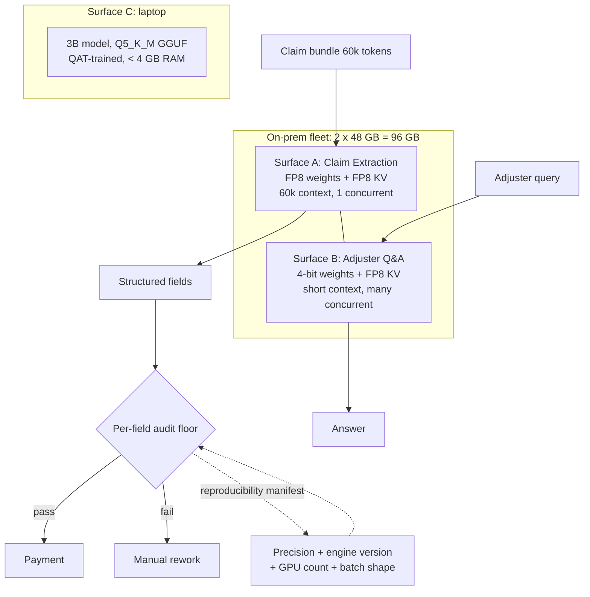

# Case Study: Quantization Under an Audit Floor

> **Topic:** `T10` · **Transcript coverage:** partial · **Difficulty:** L4
> **One line:** When precision stops being a memory decision and becomes a compliance decision — and why the right answer differs by a factor of four across three surfaces in the same product.

## Table of Contents

- [1. The Scenario](#1-the-scenario)
- [2. Requirements](#2-requirements)
- [3. Architecture](#3-architecture)
- [4. Component Deep Dive](#4-component-deep-dive)
- [5. Decision Table](#5-decision-table)
- [6. Edge Cases & Exceptions](#6-edge-cases--exceptions)
- [7. Failure Modes & Mitigations](#7-failure-modes--mitigations)
- [8. Capacity & Cost Model](#8-capacity--cost-model)
- [9. Benchmarks & Measured Numbers](#9-benchmarks--measured-numbers)
- [10. Operational Runbook](#10-operational-runbook)
- [11. What Changes at 10x](#11-what-changes-at-10x)
- [12. Interview Walkthrough](#12-interview-walkthrough)

---

## 1. The Scenario

Kestrel runs claims triage for a mid-size insurer. Claims arrive as scanned bundles — the claim form, medical records, repair estimates, correspondence — routinely 40,000 to 80,000 tokens each once OCR'd. A 70B-class model reads each bundle and extracts structured fields: claim amounts, dates of loss, policy numbers, procedure codes, injury descriptions. Those fields drive payment, so they are audited.

Kestrel runs on-premises. Not for cost reasons — for data-residency ones. The fleet is **two 48 GB GPUs, 96 GB total**. That number is the whole problem.

**Surface A — Claim Extraction.** 60k-token documents, structured output, latency-tolerant (a minute is fine), accuracy-critical, audited.
**Surface B — Adjuster Q&A.** Short conversational queries against the claim corpus. Latency-sensitive, bursty, lower accuracy stakes.
**Surface C — Field Adjuster Tool.** A 3B model on a laptop, offline, for adjusters at damaged properties. Quantization is not optional here; it is the only reason the surface exists.

Two constraints define the decision, and neither is about memory.

**The audit sets a per-field accuracy floor.** The insurer's model-risk function requires a minimum exact-match rate on *numeric* fields specifically, because those are the ones that move money. This is the constraint that makes quantization interesting: it is not aggregate quality that matters, and the sources are explicit that degradation is not uniform.

**The audit also requires reproducibility.** Given the same input, the system must produce the same output, so that a disputed claim can be re-run and the result re-verified. This sounds trivial and is not — see §4.5.

Three facts from the sources frame the trade.

**Quantization buys real money.** The LLMOps cost walkthrough stacks the levers on a common baseline: naive 16-bit serving = 100 cost units; continuous batching → ~42; **"Quantize to 4-bit and you reach 26"**; prompt caching → ~11 `[T]`. Quantization is worth a further **38% reduction** on top of batching, in a stack that reaches roughly a tenth of the original bill.

**It attacks two things at once.** The same source: quantization "stores weights in eight or four bits instead of 16. Together, they attack the two things you pay for: **the memory a request occupies and the compute each token costs**" `[T]`.

**And it is not free, in a way that is easy to miss.** "Four-bit quantization is nearly free on many models, but on some it **quietly drops accuracy**. So **always rerun your evals after quantizing**" `[T]`. *Quietly* is the operative word: the output still looks like fluent structured data.

## 2. Requirements

### Functional

| Requirement | Priority | Notes |
|---|---|---|
| Extract structured fields from 40k–80k-token bundles | P0 | Surface A |
| Meet the audit's numeric-field exact-match floor | P0 | Per-field, not aggregate |
| Byte-reproducible output for a fixed input | P0 | Audit evidence |
| Serve adjuster Q&A concurrently with extraction | P0 | Surface B cannot wait behind a 60k prefill |
| Run a 3B model offline on a laptop | P1 | Surface C |
| Fit within 96 GB | P0 | The fleet is fixed for the fiscal year |

### Non-functional

| Requirement | Target | Rationale |
|---|---|---|
| Extraction throughput | 6,000 claims/day | §8 |
| Q&A P95 latency | < 2 s | Interactive |
| Laptop footprint | < 4 GB app RAM | On-device constraint `[R]` |
| Concurrency on Surface A | ≥ 3 in-flight bundles | Otherwise Q&A starves |
| Reproducibility manifest | precision + engine + GPU count + batch shape | §4.5 |

### Constraints and non-goals

- **We do not treat precision as one global setting.** The three surfaces have quality bars that differ by more than 4x; a single config is wrong for at least two of them.
- **We do not accept aggregate quality metrics as evidence.** The audit floor is per-field, and quantization damage is not uniform across field types.
- **We do not trade accuracy for hardware without pricing the accuracy.** §8 shows the accuracy is worth 6.5x the hardware, which settles it.
- **We do not quantize below 4-bit for weights.** The source's own table puts 2-bit at **10–15% quality loss** and "Research / Specialized" compatibility `[R]`.
- **We do not assume the quality figures transfer.** They are stated for a generic model on generic tasks; ours must be measured `[T]`.

## 3. Architecture



The two-fleet split inside one 96 GB box is the architecture. Surface A and Surface B run **different weight precisions from the same base model**, because A is context-bound and accuracy-bound while B is concurrency-bound and latency-bound. The dotted ledger line is the piece that keeps the audit honest.

## 4. Component Deep Dive

### 4.1 What quantization does and what it costs

The source's table, for an 8B model, is the cleanest statement of the trade `[R]`:

| Precision | Bits | Weight size (8B) | Quality loss | GPU compatibility |
|---|---|---|---|---|
| **BF16** | 16 | 16 GB | 0% (baseline) | All modern |
| **FP8** | 8 | 8 GB | < 1% | H100 / B200 / RTX 4090 |
| **4-bit (NF4)** | 4 | 5 GB | 1–2% | All modern |
| **2-bit** | 2 | 2.5 GB | 10–15% | Research / specialized |

**Read the size column against the arithmetic and something appears.** The rule of thumb from the on-device chapter is `VRAM (GB) ≈ params × bits / 8` `[R]`, which for an 8B model gives 16 GB at BF16, 8 GB at FP8, **4 GB at 4-bit**, and **2 GB at 2-bit**. The table says 16, 8, **5**, and **2.5**.

**"4-bit" is not 4 bits.** Once group scales and zeros are counted — NF4 stores a scale per block of 64 weights, GPTQ per group of 128 — the effective rate is roughly 4.2–5 bits per weight. The table's own numbers show it: **the sub-byte rows carry a consistent 25% overhead over the formula, and the 8- and 16-bit rows carry none.** That is not a rounding difference; it is 25% of the model, and it is the difference between a model fitting and not.

**Planning rule, mine:** for sub-byte formats, multiply the nominal ratio by **1.25**. For our 70B:

| Precision | Nominal (formula) | Real (×1.25 for sub-byte) |
|---|---|---|
| BF16 | 140 GB | 140 GB |
| FP8 | 70 GB | 70 GB |
| 4-bit | 35 GB | **43.75 GB** |
| 2-bit | 17.5 GB | 21.9 GB |

Against a 96 GB box with a 15% runtime reserve (81.6 GB usable), BF16 is dead on arrival, FP8 fits narrowly, and 4-bit fits comfortably.

### 4.2 The methods, and why the choice is not about bits

**NF4 (NormalFloat4)** — "the gold standard for fine-tuning (QLoRA). It assumes weights follow a normal distribution and maps them to a set of 16 values" `[R]`. The interview answer explains the design: standard Float4 has "a fixed grid that doesn't map well to the actual distribution of LLM weights, which typically follow a zero-centered normal distribution. NF4 is mathematically optimized so that **each quantization bin contains an equal number of values from the normal distribution**. This prevents 'clustering' of weights and ensures the model preserves as much information (entropy) as possible" `[R]`.

**AWQ (Activation-aware Weight Quantization)** — "instead of quantizing all weights equally, AWQ identifies the **1% of 'salient' weights** that are most important for quality and keeps them in higher precision" `[R]`. Its advantage is specific: "AWQ achieves better perplexity than GPTQ, **especially for smaller models or more aggressive quantization (e.g., 3-bit)**" `[R]`.

**GPTQ** — "a 'Layer-wise' quantization method that minimizes the mean squared error of the weights" `[R]`. It is the older baseline and still the more widely available in tooling.

**FP8** — "hardware-native quantization supported by Nvidia's Transformer Engine… It provides the **speed of Int8 with the dynamic range of Float16**, making it stable for both training and inference" `[R]`. This is why FP8 occupies a different category from the 4-bit methods: it is a *native* format the hardware executes directly, rather than a compressed format the hardware must decompress.

**BitNet** — the source mentions "even 1.5-bit (BitNet)" in prose but **gives it no row in the tradeoff table and no quality figure** `[R]`. Treat it as a research direction, not an option.

**The choice that matters for Kestrel is AWQ at 4-bit**, on the source's own reasoning: our model is large, but our quantization is aggressive *and* our task is numeric-heavy, which is exactly the regime where AWQ's salient-weight preservation is claimed to win.

### 4.3 KV cache quantization — the lever under the weights

In long-context work, "the **KV Cache** often consumes more VRAM than the model weights themselves" `[R]`. For Kestrel that is not a hypothetical: a 60k-token bundle in a 70B model with 80 layers, 8 KV heads and head dim 128 in BF16 costs

```
2 × 80 × 8 × 128 × 2 bytes = 327,680 B ≈ 0.3125 MB per token      [D]
0.3125 MB × 60,000 = 18.75 GB per bundle                           [D]
```

**One bundle's cache is a quarter of the model.** At FP8 KV it is 9.4 GB; at Int4 KV, 4.7 GB.

The source's own illustration is worth reconciling rather than repeating `[R]`:

> "**BF16 KV Cache**: 2M tokens ≈ 32GB VRAM (on 8B model). **FP8/Int4 KV Cache**: 2M tokens ≈ 8GB - 16GB VRAM."

Check it against the formula. 32 GB over 2M tokens is **16 KB per token**, and for an 8B model with ~32 layers and head dim 128, 16 KB per token requires **a single KV head** — MQA, not the GQA most 8B models ship with. Under the more typical 8 KV heads the same 2M tokens need 250 GB, an 8x difference `[D]`.

**So the source's figure is exact for an MQA-configured model, and its FP8/Int4 range reconciles perfectly with that base**: FP8 halves 32 → 16 GB, Int4 quarters it → 8 GB, matching the quoted "8GB – 16GB" `[D]`. The number is usable once you know which configuration it belongs to. **And it carries the important reminder from [T07](../01-case-studies/T07-kv-cache.md): KV cost is a function of the GQA/MQA choice at least as much as of the dtype.**

The operational consequence the source names: frameworks now support "**Streaming Quantization** where the KV cache is compressed on-the-fly, allowing **4x higher concurrency on the same GPU**" `[R]`.

**The gap I have to flag:** the source gives VRAM figures for KV quantization and **no accuracy figure at all** `[R]`. Weight quantization gets a quality column; KV quantization does not. §5.3 treats this explicitly.

### 4.4 QAT, and the surface where it is not optional

"Instead of quantizing a model *after* it's trained (post-training quantization), QAT simulates quantization *during* the training process… The model learns to compensate for the lost precision" `[R]`.

The source makes a strong claim about when it is required: QAT is "**mandatory for models smaller than 3B parameters to remain useful at 4-bit**" `[R]`.

That claim lands directly on Surface C. A 3B field-adjuster model at 4-bit without QAT is, on the source's assertion, not useful. Note the scope: it is a claim about *post-training* quantization of small models, and it is stated without qualification or supporting measurement. **Kestrel's response is to treat it as a hypothesis that gates the Surface C release**: build the 3B with QAT, and if the non-QAT baseline passes the eval anyway, the claim does not apply to this model and the cheaper path wins.

The frontier version of the same technique shows up in production training infrastructure: one vendor reports "very heavy investment in low precision training where your rollout will be in a lower precision and your training backend will be with… some type of like **quantization aware training**. So that enables us to train with lower precision in rollout stage where we natively support like **8-bit and also 4-bit training**… we also recently work with [ASR-garbled] to support a **[FP4]** native rollout in our stage without any performance loss" `[T]`. The transcript renders "FP4" as "VIP 4" and the partner name is garbled, so the specific attribution is soft — but the shape is clear: **QAT is now a training-infrastructure concern, not only a post-hoc compression step.**

### 4.5 The constraint nobody plans for: quantization breaks reproducibility

Kestrel's audit requires that a disputed claim can be re-run and produce the same answer. The CMU lecture raises exactly the mechanism that defeats this, in a student exchange about temperature-0 non-determinism:

> "Does quantization make the problem worse? **Yeah, it will because you'll have more rounding errors.**" `[T]`

And on the multi-GPU dimension: "does it get compounded by using multiple instances of GPUs? … it depends where you aggregate, but like **one GPU is more likely to have a larger difference than the threads within the GPU**, so it certainly would" `[T]`.

**This is a first-class operational finding, not a footnote.** Quantization adds rounding error, rounding error is the source of run-to-run variation at temperature 0, and Kestrel runs quantized weights across **two GPUs** — the configuration the lecture identifies as compounding the problem. The audit's reproducibility requirement is therefore in direct tension with the fleet's existence, and the tension is invisible in any dashboard.

The same exchange contains the security-adjacent corollary: a student asks whether this behaviour could be used to "infer what kind of quantization" a provider is using, and the professor's reply is that it is "a good idea… I'll give you an A+ on the project if you can demonstrate that" `[T]`. Precision configuration is **fingerprintable from output behaviour** — which is a reminder that the precision manifest Kestrel records for the audit is also information it should not leak.

### 4.6 Formats

| Format | Deployment | Pros | Cons |
|---|---|---|---|
| **GGUF** (llama.cpp) | "CPU + GPU offloading" | "Cross-platform (Mac, Linux, Windows), single file, highly portable" | "Slower than pure GPU formats" |
| **EXL2** (ExLlamaV2) | "GPU-only (Nvidia)" | "The **fastest 4-bit format on Nvidia GPUs**" | "Inflexible (Nvidia only)" |

`[R]` Both. **Surface C is GGUF** — the laptop may be either platform and portability dominates. **Surfaces A and B are server-side and do not use either format**; they use FP8 or AWQ safetensors under a serving engine.

The GGUF quant levels are where Surface C's real decision lives, and the deployment guidance is unusually concrete `[R]`: **Q4_K_M** is "the practical sweet spot (roughly **1–3% quality loss** versus FP16 at about a quarter of the size), **Q5_K_M** is noticeably better for **code and reasoning** at under ~1% loss, **Q8_0** is effectively lossless at about half FP16, and **Q2/Q3** save the most memory but degrade **math and reasoning by 5–10% or more**."

That gives Surface C an answer that Surface A's precision table does not: **Q5_K_M, not Q4_K_M**, because the adjuster tool's job includes reading and reconciling numbers, which is the exact capability the guidance says Q4_K_M compromises and Q5_K_M protects. The cost is ~1.25x the size, which is affordable at 3B.

## 5. Decision Table

### 5.1 Weight precision, per surface

| Option | Pros | Cons | Exceptions — when it breaks | When to use |
|---|---|---|---|---|
| BF16 | Baseline quality | 140 GB — **does not fit 96 GB at all** | — | Never on this fleet |
| **FP8 (chosen for A)** | 70 GB fits; "< 1%" loss `[R]`; native hardware format | 1 concurrent 60k bundle; needs H100/B200/4090-class support `[R]` | Breaks when a bundle exceeds ~76k tokens — capacity, not quality | The accuracy-critical, context-bound surface |
| **4-bit AWQ (chosen for B)** | 43.75 GB real; "1–2%" loss `[R]`; "All Modern" compatibility `[R]` | 1–2% loss is **above the audit floor** — fine for Q&A, fatal for extraction | Breaks the moment Surface B's job expands to include numeric fields | Short-context, concurrency-bound, lower-stakes surfaces |
| 2-bit | 21.9 GB | **"10–15%"** loss; "Research / Specialized" `[R]` | Breaks everything that matters | Never |
| 1.5-bit (BitNet) | Smallest | No quality figure in the source `[R]`; no compatibility row | Unknown | Research only |
| Mixed precision (salient weights up) | AWQ's mechanism `[R]` | Not user-controllable in most serving stacks | — | What AWQ already does internally |

**Chosen:** FP8 for Surface A, 4-bit AWQ for Surface B, from the same base checkpoint.
**Revisit if:** the audit floor changes, or a bundle length routinely exceeds the FP8 concurrency budget.

### 5.2 Quantization method at 4-bit

| Option | Pros | Cons | Exceptions — when it breaks | When to use |
|---|---|---|---|---|
| RTN (round-to-nearest) | Trivial; no calibration data | Worst quality at a given bit width | Breaks first on small models and 3-bit | Never when a better option exists |
| GPTQ | Layer-wise MSE minimisation `[R]`; widely available | "AWQ achieves better perplexity than GPTQ" `[R]` | Breaks on aggressive (3-bit) and small models `[R]` | Legacy compatibility |
| **AWQ (chosen)** | Salient 1% kept in higher precision `[R]`; better at 3-bit and on small models `[R]` | Needs a calibration run | Breaks if the calibration set does not resemble production traffic | 4-bit and below, numeric-heavy tasks |
| NF4 | Entropy-optimal bins for a normal distribution `[R]`; the QLoRA standard | Designed for fine-tuning workflows | — | When the plan includes QLoRA fine-tuning |
| FP8 | Native, dynamic range of FP16 `[R]` | Only 2x compression | Needs H100/B200/4090-class hardware `[R]` | Surface A |
| **GGUF Q5_K_M (chosen for C)** | "< ~1% loss", better on "code and reasoning" `[R]` | ~1.25x the size of Q4_K_M | — | The laptop surface |
| GGUF Q4_K_M | The "practical sweet spot", 1–3% `[R]`, quarter size | Compromises exactly the numeric capability the job needs | — | Size-constrained laptops |

**Chosen:** AWQ for B, GGUF Q5_K_M for C, FP8 for A.
**Revisit if:** Surface C's laptop fleet turns out to have less RAM than assumed and Q5_K_M does not fit with headroom.

### 5.3 KV cache quantization

| Option | Pros | Cons | Exceptions — when it breaks | When to use |
|---|---|---|---|---|
| BF16 KV | No accuracy risk | 18.75 GB per 60k bundle — **the dominant cost** | Breaks the concurrency budget | Only when context is short |
| **FP8 KV (chosen)** | Halves to 9.4 GB; the milder of the two compressions | **No accuracy figure anywhere in the source `[R]`** | Must be eval-gated; the evidence is missing | Default for long context |
| Int4 KV | Quarters to 4.7 GB; "4x higher concurrency" `[R]` | Same evidence gap, larger magnitude | Breaks if eval shows degradation on numeric fields | When concurrency is the binding constraint and eval passes |
| Streaming (on-the-fly) quantization | "compressed on-the-fly, allowing 4x higher concurrency" `[R]` | Engine support varies | — | Supported serving engines |
| Reduce context instead | No precision risk | Loses information the extraction needs | — | When the tail of the document is genuinely irrelevant |

**Chosen:** FP8 KV on both server surfaces, gated on eval.
**Revisit if:** the eval shows numeric-field degradation — then revert KV before reverting weights, since KV is where the 8x VRAM swing is and weight precision is where the *documented* risk is.

**The reasoning to state out loud:** the source documents weight-precision quality loss and does not document KV-precision quality loss `[R]`. That asymmetry argues for compressing KV first and weights second — **not because KV is proven safer, but because the weight risk is quantified and the KV risk is unknown, and an unknown risk you can revert is preferable to a measured one you cannot.** Kestrel's eval gate is what makes that position defensible.

### 5.4 Where precision is decided

| Option | Pros | Cons | Exceptions — when it breaks | When to use |
|---|---|---|---|---|
| One global precision | Simple; one artefact | Wrong for at least two of three surfaces | Breaks the audit or the footprint | Single-surface products |
| **Per surface (chosen)** | Each surface gets its own quality/footprint point | Three artefacts, three evals, three manifests | More eval surface area to maintain | Multi-surface products with different bars |
| Per request, dynamically | Optimal | Precision switching costs a reload | Breaks latency SLOs on reload | Rarely justified |
| Per layer (mixed) | Near-BF16 quality at near-4-bit size | Needs research-grade tooling | — | When the serving stack supports it natively |

**Chosen:** per surface.
**Revisit if:** the fleet consolidates to one model and two surfaces — then the 4x spread collapses.

### 5.5 PTQ versus QAT

| Option | Pros | Cons | Exceptions — when it breaks | When to use |
|---|---|---|---|---|
| **PTQ (chosen for A and B)** | No training pipeline; hours not weeks; the source's method for the 70B-class case | "quietly drops accuracy" `[T]` — **requires eval after quantizing** | Breaks silently without a numeric-field eval | Models where PTQ measures within the floor |
| **QAT (chosen for C)** | Model "learns to compensate for the lost precision" `[R]`; claimed "mandatory" below 3B at 4-bit `[R]` | A training pipeline for an edge model; slower iteration | Breaks the release cadence if the pipeline is unowned | Small models at aggressive precision |
| QLoRA fine-tune after PTQ | Recovers task accuracy; NF4 is the QLoRA standard `[R]` | A fine-tune to maintain per model version | — | When PTQ alone misses the floor |
| Distillation to a smaller model instead | Avoids quantization entirely | Different technique, different failure modes | — | When the task is narrow and high-volume |

**Chosen:** PTQ for the server surfaces, QAT for the 3B.
**Revisit if:** Surface A's PTQ misses the numeric floor — then QLoRA-recover rather than accept the regression.

### 5.6 Handling the reproducibility requirement

| Option | Pros | Cons | Exceptions — when it breaks | When to use |
|---|---|---|---|---|
| Assume determinism | No work | **Quantization adds rounding errors that break it** `[T]`; two GPUs compound it `[T]` | Breaks on the first disputed claim | Never |
| **Record a precision manifest per output (chosen)** | Cheap; makes the audit question answerable | Does not make output reproducible, only explainable | — | Always |
| Run the audit sample at BF16, single GPU | Genuinely reproducible | Needs hardware the fleet may not have; slow | Breaks if the production path diverges from the audited path | When the audit demands byte-equality |
| Pin dtype, engine version, GPU count, batch shape | Reduces variation to a known set | Still not byte-equal | — | Default discipline, and it matches the "a model is not X, it is X on this engine at this version on this hardware" rule from [T08](../01-case-studies/T08-batching-scheduling.md) |
| Accept approximate reproducibility | Honest | May fail an audit that requires exactness | — | Only if the auditor agrees |

**Chosen:** manifest on every output; BF16 single-GPU re-run for contested claims.
**Revisit if:** the auditor accepts approximate reproducibility with a documented manifest — then the BF16 path becomes an escalation rather than a standing requirement.

## 6. Edge Cases & Exceptions

| Situation | Symptom | Handling |
|---|---|---|
| **Aggregate quality holds but a field type degrades** | The headline eval passes; the audit fails | **The central risk.** Evaluate per field type, not aggregate. "Quietly drops accuracy" `[T]` means the aggregate is the last place it shows |
| **Numeric fields degrade first** | Amounts and dates wrong; prose fine | The source's Q2/Q3 guidance says "math and reasoning" degrade first `[R]`. Weight the eval toward numeric exact match |
| **"4-bit" underestimates the footprint** | The model does not fit despite the formula | The formula omits group scales: apply ~1.25x for sub-byte formats `[D]` |
| **KV cache outgrows the weights** | OOM with a modest batch | Expected at long context `[R]`. Compress KV or shorten context |
| **BF16 KV at 60k blows the budget** | One bundle leaves no room for a second | 18.75 GB per bundle `[D]`. Quantize KV or accept 1 concurrent |
| **Temperature-0 output varies across runs** | The same claim yields different fields | Quantization adds rounding errors `[T]`; two GPUs compound it `[T]`. Manifest plus BF16 re-run |
| **Quantized model behaves differently per GPU** | Node A and node B disagree | The lecture's multi-GPU aggregation point `[T]`. Pin to a node class |
| **Calibration set does not match production** | AWQ underperforms its reputation | AWQ's salience is derived from activations `[R]`; calibrate on real claim bundles |
| **A 3B model at 4-bit is useless without QAT** | Surface C's quality is unacceptable | The source claims QAT is "mandatory" below 3B `[R]`. Build with QAT, or verify the claim does not apply |
| **Q2/Q3 tempting for footprint** | "5–10% or more" degradation on math and reasoning `[R]` | Not an option for anything touching numbers |
| **A new base model arrives pre-quantized** | Vendor-provided 4-bit weights | Re-run the eval anyway `[T]`; a vendor's quant is not your eval |
| **Fine-tuning the quantized model** | Quality shifts after LoRA | NF4 is the QLoRA standard `[R]`, but re-eval after any fine-tune |
| **FP8 unavailable on the target GPU** | Kernel falls back or fails | FP8 needs "H100 / B200 / RTX 4090" class hardware `[R]`. Check before designing around it |
| **The manifest leaks precision configuration** | A fingerprinting opportunity | The lecture's student question `[T]`. Do not expose the manifest externally |
| **Batch shape changes output** | Different results at different concurrency | Reduces reproducibility; pin batch shape for audited runs |
| **Context grows past the audited configuration** | Extraction quality drops on the longest bundles | The eval must cover the actual length distribution, not the median |

## 7. Failure Modes & Mitigations

| Failure | Symptom | Detection | Blast radius | Mitigation | Recovery |
|---|---|---|---|---|---|
| Silent accuracy drop | Fluent, plausible, wrong fields | Per-field-type eval, run after every precision change `[T]` | Financial, audited | Eval gate on the numeric slice | Revert precision; QLoRA-recover |
| Footprint miss | Model does not load; OOM at runtime | Capacity model including scale overhead | Deployment | Use the 1.25x sub-byte factor `[D]` | Move to a coarser format or KV compression |
| KV blowout at long context | OOM on the longest bundles | KV occupancy vs bundle length | One surface | Streaming KV quantization `[R]` | Compress KV; cap context |
| Irreproducible output | Contested claims cannot be re-verified | Repeat-run comparison at temperature 0 | Audit standing | Manifest; BF16 single-GPU re-run §5.6 | Escalate to the audit path |
| Calibration mismatch | AWQ underperforms expectations | Eval deltas vs the reference quant | One surface | Calibrate on production-shaped data | Re-quantize with a better set |
| Engine fallback to unfused kernels | Throughput collapses at unchanged precision | Kernel-path telemetry | Fleet | Verify FP8/4-bit kernel support on the target GPU `[R]` | Move to a supported format |
| Quantized model silently swapped | Quality changes with no deploy | Precision manifest comparison | Fleet | Pin the artefact and record its hash | Roll back; re-eval |
| Edge model below usefulness | Surface C's output is unacceptable | On-device eval | One surface | QAT `[R]`; Q5_K_M over Q4_K_M | Retrain with QAT |
| Vendor pre-quantized weights adopted unvalidated | Unknown quality profile | Eval on the vendor artefact | Fleet | Always re-run evals `[T]` | Replace with an in-house quant |
| Precision chosen by intuition | Unexplained quality or cost profile | No eval record | Fleet | Every precision change is a measured change | Backfill the eval |

## 8. Capacity & Cost Model

Arithmetic is mine; assumptions are shown.

**Assumptions**

| Input | Value | Basis |
|---|---|---|
| Fleet | 2 × 48 GB = 96 GB | §1 |
| Runtime reserve | 15% → 81.6 GB usable | `[D]` |
| Sub-byte overhead | ×1.25 | `[D]` from the source's own table `[R]` |
| Bundle length | 60,000 tokens | §1 |
| KV per token (70B, 80 layers, 8 KV heads, dim 128, BF16) | 0.3125 MB | `[D]`, consistent with [T07](../01-case-studies/T07-kv-cache.md) |
| Prefill FLOPs | 2 × params × tokens | `[D]` |
| Decode memory traffic | weight bytes per token | `[D]` |
| Claims per day | 6,000 | §2 |

**Step 1 — does it fit?**

| Configuration | Weights | KV per bundle | Total, 1 bundle | Total, 2 bundles | Fits 81.6 GB? |
|---|---|---|---|---|---|
| BF16 weights | 140 GB | 18.75 GB | 158.75 GB | — | **No — does not fit at all** |
| FP8 weights + BF16 KV | 70 GB | 18.75 GB | 88.75 GB | 107.5 GB | No |
| **FP8 weights + FP8 KV** | 70 GB | 9.375 GB | **79.4 GB** | 88.75 GB | **1 bundle only** |
| FP8 weights + Int4 KV | 70 GB | 4.69 GB | 74.7 GB | 79.4 GB | 2 bundles |
| 4-bit weights + BF16 KV | 43.75 GB | 18.75 GB | 62.5 GB | 81.25 GB | 2 bundles, razorthin |
| **4-bit weights + FP8 KV** | 43.75 GB | 9.375 GB | 53.1 GB | 62.5 GB | **3 bundles** |
| 4-bit weights + Int4 KV | 43.75 GB | 4.69 GB | 48.4 GB | 53.1 GB | 7 bundles |

**Three findings, in order of importance.**

**BF16 is not on the table** — 140 GB of weights will not fit in a 96 GB box, so the question is never "should we quantize" but "how far". That is a structural fact about running frontier-class models on fixed on-prem hardware.

**FP8 is what makes Surface A possible at all**, and it gives exactly **one concurrent 60k bundle**. Surface B — the interactive, latency-sensitive one — therefore has no room alongside A. **This is the constraint that actually breaks the product, and it is a capacity constraint before it is a quality constraint.**

**Compressing KV is the highest-leverage single move.** Going BF16 → FP8 KV at 4-bit weights takes concurrency from 2 to 3 (+50%); going FP8 → Int4 KV takes it from 3 to 7. **The KV dtype swings concurrency more than the weight dtype does**, because KV scales with context and context is the dominant term here.

**Step 2 — does the fleet have the time?**

Prefill: `2 × 70e9 × 60,000 = 8.4 PFLOP` per bundle. At an assumed 400 effective TFLOPS → **21 s per bundle**. 6,000 bundles → 126,000 GPU-seconds = **35 GPU-hours/day**. (Prefill FLOPs do not change with weight precision; only the achievable throughput does.)

Decode: ~800 output tokens per bundle. Memory traffic per token equals the weight bytes: 70 GB at FP8, 35 GB at 4-bit. At an assumed 3,350 GB/s:
- FP8: 70/3350 = **20.9 ms/token** → 16.7 s per bundle → 28 GPU-hours/day
- 4-bit: 35/3350 = **10.4 ms/token** → 8.4 s per bundle → 14 GPU-hours/day

| Config | Prefill | Decode | Total | vs 48 GPU-hours/day |
|---|---|---|---|---|
| FP8 weights | 35 h | 28 h | **63 h** | **131% — does not fit** |
| 4-bit weights | 35 h | 14 h | **49 h** | 102% — marginal |

**At batch 1, the fleet is short even at 4-bit** — which means the answer is not precision at all, it is concurrency. Prefill is compute-bound ([T06](../01-case-studies/T06-inference-fundamentals.md)) and therefore **batches**: three concurrent bundles cost far less than three sequential ones. This is the same lesson as [T08](../01-case-studies/T08-batching-scheduling.md) arriving from a different direction — **the fleet's problem is throughput, and throughput comes from batching, which comes from KV capacity, which comes from KV precision.**

**Step 3 — what does a 1% accuracy loss cost?**

The source's 4-bit figure is "1–2%" `[R]`. Take the optimistic end and apply it to the surface where it matters:

| Item | Value |
|---|---|
| Claims/day | 6,000 |
| Numeric-field error rate induced | 1% `[R]`, optimistic end |
| Claims affected | 60/day |
| Adjuster rework | 20 min @ $45/hr = $15 |
| Daily rework cost | **$900** |
| Annualised (260 working days) | **$234,000** |

**Step 4 — what does the hardware cost instead?**

| Item | Value |
|---|---|
| A second 2-GPU node, 3-year amortisation | $30,000 capex → $10,000/yr |
| Power, cooling, ops, spares (assumed) | $8,000/yr |
| All-in per node | **$18,000/yr** |
| Nodes needed to match the 4-bit concurrency | 2 extra |

**$36,000/yr of hardware against $234,000/yr of rework — a 6.5x ratio in favour of buying the hardware.**

**Step 5 — the resulting decision, which is not "quantize less".**

The 6.5x ratio does not mean "run BF16", because BF16 does not fit. It means:

1. **Do not spend weight precision to buy concurrency.** Move FP8 → 4-bit weights only where the accuracy bar allows it (Surface B), never on Surface A.
2. **Spend KV precision instead**, because KV is where the concurrency actually is, and because it is the compression that can be reverted without changing the model artefact.
3. **Buy the third node**, at $18,000/yr, to give Surface A the concurrency that Surface B needs to exist — cheaper by 6.5x than accepting the accuracy regression that would otherwise pay for it.
4. **Keep 4-bit for Surface B and Q5_K_M for Surface C**, where the bars are genuinely lower.

**The general rule this produces:** quantization pays when the accuracy it costs is worth less than the hardware it saves. The source's cost ladder makes the *saving* vivid — 42 → 26 cost units `[T]` — but the ladder says nothing about the accuracy term, and in a regulated numeric task the accuracy term dominates by roughly an order of magnitude. **Compute both sides before choosing a precision.**

**Sensitivity**

| Scenario | Effect |
|---|---|
| Audit floor rises by 0.5% | The 4-bit path for Surface B comes into question; A is already FP8 |
| Bundle length 60k → 30k | KV per bundle halves; FP8 + FP8 gives 2 concurrent instead of 1 — the constraint relaxes sharply |
| GQA 8 → 4 KV heads | KV per token halves; same effect as a KV dtype change, for free |
| Rework estimate 20 min → 5 min | The accuracy-to-hardware ratio falls to 1.6x — the decision gets close |
| Fleet grows to 4 GPUs | The concurrency constraint disappears; 4-bit weights become optional rather than necessary |
| A future model ships QAT-native | The accuracy term shrinks; 4-bit becomes defensible on Surface A |

## 9. Benchmarks & Measured Numbers

| Metric | Value | Source | Conditions |
|---|---|---|---|
| BF16 / FP8 / 4-bit / 2-bit weight size (8B) | 16 / 8 / 5 / 2.5 GB | `[R]` 03-training-and-adaptation/07-quantization-deep-dive.md | The tradeoff table |
| Quality loss | 0% / < 1% / 1–2% / **10–15%** | Same `[R]` | Baseline = BF16 |
| GPU compatibility | All / H100-B200-4090 / All / Research | Same `[R]` | FP8 is the constrained row |
| VRAM rule of thumb | `params × bits / 8`, plus KV, plus 10–20% | `[R]` 04-inference-optimization/09-on-device-and-edge-deployment.md | Weights only |
| GGUF Q4_K_M | "1–3%" loss, ~quarter size, "practical sweet spot" | Same `[R]` | — |
| GGUF Q5_K_M | "< ~1%", "noticeably better for code and reasoning" | Same `[R]` | Surface C's choice |
| GGUF Q2/Q3 | "**5–10% or more**" on math and reasoning | Same `[R]` | — |
| AWQ | Keeps **1%** of salient weights in higher precision | `[R]` quantization-deep-dive | Better than GPTQ at 3-bit and on small models |
| QAT requirement | "**Mandatory for models smaller than 3B** to remain useful at 4-bit" | Same `[R]` | Stated without qualification — treat as a hypothesis |
| KV cache, 2M tokens, 8B | 32 GB BF16; 8–16 GB FP8/Int4 | Same `[R]` | **Exact for MQA (1 KV head); 250 GB under the more typical GQA 8** `[D]` |
| Streaming KV quantization | **4x higher concurrency** on the same GPU | Same `[R]` | Engine-dependent |
| EXL2 | "Fastest 4-bit format on Nvidia GPUs" | Same `[R]` | Nvidia only |
| Cost ladder | 100 → 42 (batching) → **26 (4-bit)** → 11 (caching) | `[T]` LLMOps cost/latency/KV/batching/quantization talk | Stated as illustrative cost units |
| Quantization attacks | "the memory a request occupies **and the compute each token costs**" | Same `[T]` | — |
| Eval requirement | "always rerun your evals after quantizing"; drops accuracy "quietly" | Same `[T]` | — |
| Quantization and determinism | "you'll have more rounding errors" | `[T]` CMU lecture 2 | Answering a student question |
| Multi-GPU compounding | "one GPU is more likely to have a larger difference than the threads within the GPU" | Same `[T]` | — |
| Precision fingerprinting | Could reveal "what kind of quantization" a provider uses | Same `[T]` | Raised as a student project idea |
| QAT in training infra | Native 8-bit and 4-bit training; FP4 rollout "without any performance loss" | `[T]` Banghua Zhu, agentic-infra talk | ASR renders FP4 as "VIP 4"; partner name garbled |
| Quantization on AMD | An AITER operator class, enabled by one environment variable | `[T]` vLLM Bengaluru, ROCm/WideEP talk | ASR garbles both AITER and the variable name |
| Sub-byte overhead | **~25%** over the nominal ratio | `[D]` derived from the source's own table | 8B: 5 GB real vs 4 GB nominal |

**Vendor claims:** the cost ladder (100 → 11) is an illustrative video example, not a measured bill. The FP4-without-performance-loss claim is a vendor claim about the vendor's own training stack. Neither the 2x–3x-class savings nor the vendor's QAT claims have published conditions in this corpus.

## 10. Operational Runbook

**Deploy**
1. Run the **numeric-field eval** on the BF16 baseline first, so the quantized delta is measurable against something.
2. Quantize weights and KV **separately and in that order of evidence**, not together — otherwise a regression cannot be attributed.
3. Record the **precision manifest** with every audited output: dtype, method, engine version, GPU count, batch shape.
4. Pin the quantized artefact by hash. A quantized model is not "the 70B"; it is "this checkpoint, this method, this calibration set, this engine" — the same discipline [T08](../01-case-studies/T08-batching-scheduling.md) applies to the engine.
5. Size with the **1.25x sub-byte factor**, not the nominal ratio.

**Tune — in this order**
1. **KV dtype first.** It is where the concurrency is and it is the most reversible lever.
2. **Then context length**, if the eval shows the document tail does not carry signal.
3. **Then weight precision** — and per surface.
4. **Then the method** (AWQ over GPTQ, Q5_K_M over Q4_K_M).
5. **Then QAT**, only if PTQ misses the floor.

**Monitor**
- Per-field-type exact match on a held-out bundle set, not aggregate quality.
- Precision manifest completeness on audited outputs.
- Repeat-run divergence at temperature 0 — the reproducibility metric.
- KV occupancy against bundle length, with the length distribution alongside it.
- Concurrency achieved per surface.
- Kernel-path telemetry — a silent fallback to an unfused kernel looks like a precision change and is not.

**Incident — top 5**
1. **Audit failure on numeric fields with a passing aggregate eval.** Symptom: quality looks fine, the audit disagrees. Diagnosis: per-field degradation hidden by an aggregate. Action: revert the most recent precision change; re-eval per field type.
2. **OOM under concurrency.** Symptom: the fleet serves one bundle and rejects the next. Diagnosis: KV, not weights. Action: FP8 or Int4 KV; check the streaming-quantization support in the engine.
3. **Contested claim cannot be reproduced.** Symptom: re-running gives different fields. Diagnosis: rounding error plus multi-GPU aggregation `[T]`. Action: BF16 single-GPU re-run for the contested claim; record the manifest.
4. **A quantized model does not fit despite the formula.** Symptom: load failure at an expected-fitting size. Diagnosis: the sub-byte scale overhead. Action: recompute with the 1.25x factor.
5. **Quality regression after a routine fine-tune.** Symptom: the quantized model drifts. Diagnosis: the fine-tune interacted with the quantized weights. Action: re-quantize from the new checkpoint rather than fine-tuning a quantized artefact.

## 11. What Changes at 10x

- **Per-surface precision stops scaling and becomes per-workload classes.** At 10x, three surfaces become dozens of task types, and the precision decision has to be derived from a policy — accuracy bar plus context length plus concurrency need — rather than a hand-maintained table.
- **The eval becomes the constraint, not quantization.** Every precision change needs a per-field-type eval, and at 10x the eval volume grows with the number of precision points. Eval throughput becomes an ops problem in its own right.
- **Reproducibility gets harder in proportion to the fleet.** The lecture's multi-GPU aggregation point `[T]` scales with GPU count; at 10x the audit's reproducibility requirement is met by a dedicated deterministic path, not by the production fleet.
- **What inverts:** today the 70B does not fit and quantization is mandatory. At 10x the fleet is larger and a BF16 tier becomes affordable for the audit path — **precision becomes a choice again, and the choice is made per path rather than per model.**
- **What survives:** the 1.25x sub-byte factor, the non-uniformity of quality loss, the eval-after-quantizing rule, and the accuracy-versus-hardware comparison. Those are structural.

## 12. Interview Walkthrough

**Whiteboard order (35 min)**
1. The footprint: 140 GB of BF16 weights against a 96 GB box. Quantization is not optional.
2. The source's precision table, then the correction — **sub-byte formats carry ~25% overhead**, so "4-bit" is 43.75 GB, not 35 GB. This is the detail that makes capacity numbers work.
3. Weight versus KV: the KV cache at long context is a quarter of the model, and **KV dtype swings concurrency more than weight dtype does**.
4. The quality asymmetry: weight precision has published loss figures, KV precision does not. Compress the unquantified risk first, and gate it on an eval.
5. The audit constraint: per-field, not aggregate — because degradation is non-uniform and the sources describe it as quiet.
6. The reproducibility constraint: quantization adds rounding error `[T]`; two GPUs compound it `[T]`.
7. The economic close: 1% numeric error costs ~$234k/yr in rework against $36k/yr of hardware. **Buy the node.**

**The three numbers to say out loud**
- **1.25** — the sub-byte overhead factor. It is the difference between a model fitting and not.
- **18.75 GB** — the KV cache for one 60k-token bundle. It is why KV precision, not weight precision, decides concurrency.
- **6.5x** — rework cost versus hardware cost at a 1% accuracy loss. It is why the answer is "buy the node".

**The tradeoff to volunteer before you are asked:** quantization is the only lever that reduces memory *and* compute at once `[T]`, which makes it look free — and it is free until the eval, where the loss is non-uniform and quiet. In a regulated numeric task the accuracy term dominates the hardware term by roughly an order of magnitude, so the correct posture is to quantize the thing you can revert and buy the thing you cannot.

**Follow-ups**

1. *Why not just use 4-bit and take the 1–2%?* — Because the audit floor is per-field and numeric fields degrade first. The aggregate is the last place the loss shows `[T]`.
2. *Why not BF16?* — 140 GB of weights against a 96 GB box. It is a capacity question before it is a quality question.
3. *AWQ or GPTQ?* — AWQ keeps the 1% salient weights in higher precision and wins at aggressive bit widths and on smaller models `[R]`, which is our regime.
4. *What does the KV cache cost?* — 0.3125 MB per token for an 80-layer/8-KV-head/128-dim model at BF16, so 18.75 GB for a 60k bundle — a quarter of the model, and the term that decides concurrency.
5. *Is KV quantization safe?* — Unknown. The source gives VRAM figures and no accuracy figures. Treat it as the reversible lever and gate it on an eval.
6. *When is QAT required?* — The source claims below 3B at 4-bit. Verify on your own model rather than accepting it.
7. *What breaks reproducibility?* — Quantization's rounding errors, compounded by multi-GPU aggregation, at temperature 0. That is why the manifest exists.
8. *When does quantization not pay?* — When the accuracy it costs is worth more than the hardware it saves. In an audited numeric task that is most of the time, and the arithmetic is in §8.

## Sources

- `refs/ai-system-design-guide-main/ai-system-design-guide-main/03-training-and-adaptation/07-quantization-deep-dive.md` — the BF16/FP8/4-bit/2-bit tradeoff table with sizes, quality loss and GPU compatibility; NF4, AWQ and FP8 method descriptions including the 1% salient-weight mechanism and the AWQ-beats-GPTQ-at-3-bit claim; GGUF and EXL2 format comparisons; the 2M-token KV cache illustration and streaming quantization's 4x concurrency; QAT and the below-3B claim; and both interview answers.
- `refs/ai-system-design-guide-main/ai-system-design-guide-main/04-inference-optimization/09-on-device-and-edge-deployment.md` — the `params × bits / 8` VRAM rule of thumb, the GGUF quant-level quality figures (Q4_K_M, Q5_K_M, Q8_0, Q2/Q3), the 10–20% headroom rule, the on-device hardware table, and the mobile sub-1B-to-3B and 4-bit-standard guidance.
- `refs/ai-system-design-guide-main/ai-system-design-guide-main/04-inference-optimization/01-inference-fundamentals.md` — the FP8 speedup and its sub-0.1% accuracy figure, which **conflicts with this repo's own quantization chapter (< 1%)**; and the arithmetic-intensity framing used in §8.
- `refs/ai-system-design-guide-main/ai-system-design-guide-main/04-inference-optimization/07-cost-optimization-playbook.md` — quantization's place in the cost ladder, VRAM as a cost driver with GQA and quantization as its optimizations, and the self-host break-even framing.
- `refs/ai-system-design-guide-main/ai-system-design-guide-main/11-infrastructure-and-mlops/04-finops-and-token-economics.md` — the FinOps framing for the build-versus-buy comparison in §8, and the hidden-cost multiplier for self-hosting.
- `refs/LLMOps_Agentic_AIOps_The_Hands-On_Playlist_2026_transcripts/Cut_LLM_Cost_Latency_KV_Cache_Batching_Quantization_vLLM.txt` — the 100 → 42 → 26 → 11 cost ladder with 4-bit quantization as the third rung; "the memory a request occupies and the compute each token costs"; "always rerun your evals after quantizing" and the "quietly drops accuracy" warning; AWQ and GPTQ named as the quantization tools; and the cost/latency metrics to track.
- `refs/CMU_Inference_Algorithms_for_Language_Modeling_Fall_2025_transcripts_2/CMU_LLM_Inference_2_Probability_Review_and_Code_Examples.txt` — the instructor's answer that quantization worsens temperature-0 non-determinism through rounding errors, the multi-GPU aggregation compounding, and the student's quantization-fingerprinting suggestion.
- `refs/Agentic_AI_Infra_transcripts_2/Banghua_Zhu_-_Building_Frontier_Inference_and_Training_Infra_for_Agent_A_Case_St.txt` — low-precision training with quantization-aware training, native 8-bit and 4-bit training, and the FP4 rollout claim. **The transcript is ASR-garbled at this passage** ("VIP 4" for FP4; the partner name is unusable), and it is cited as a soft attribution.
- `refs/vLLM_Inference_Meetup_Bengaluru_2026_transcripts/Distributed_Inference_on_ROCm_with_WideEP_on_vLLM_llm-d.txt` — quantization as one of AITER's optimized operator classes on AMD, enabled by a single environment variable. **The transcript renders both "AITER" and the variable name garbled**, and no figure is attributed to it.
- `refs/llm-inference-engineering-main/llm-inference-engineering-main/README.md` — topic inventory covering quantization. **This file is a table of contents and contains no figures.**
- `refs/ai-system-design-guide-main/ai-system-design-guide-main/16-case-studies/01-enterprise-rag.md` — house style reference.
