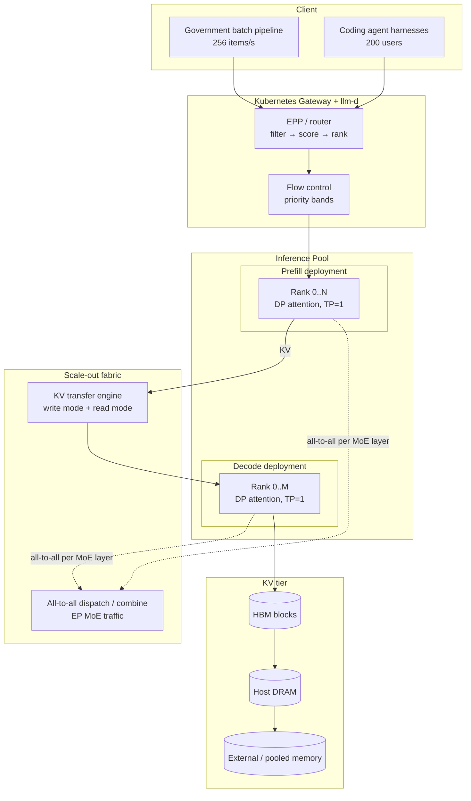

# Case Study: Sharding a Trillion-Parameter MoE Across a Mixed-Vendor Fleet

> **Topic:** `T11` · **Transcript coverage:** primary · **Difficulty:** L4
> **One line:** Frontier MoE inference is no longer a compute problem — it is a *sharding and
> communication* problem, and the winning parallelism layout is not the obvious one.

## Table of Contents

1. [The Scenario](#1-the-scenario)
2. [Requirements](#2-requirements)
3. [Architecture](#3-architecture)
4. [Component Deep Dive](#4-component-deep-dive)
5. [Decision Table](#5-decision-table)
6. [Edge Cases & Exceptions](#6-edge-cases--exceptions)
7. [Failure Modes & Mitigations](#7-failure-modes--mitigations)
8. [Capacity & Cost Model](#8-capacity--cost-model)
9. [Benchmarks & Measured Numbers](#9-benchmarks--measured-numbers)
10. [Operational Runbook](#10-operational-runbook)
11. [What Changes at 10x](#11-what-changes-at-10x)
12. [Interview Walkthrough](#12-interview-walkthrough)

---

## 1. The Scenario

**NxtScale** is the AI platform group inside a sovereign cloud operator. It has signed two
contracts that land in the same quarter:

- A **government document-intelligence pipeline** — population scale, batch, throughput-oriented,
  and legally required to run inside national borders. This is the `NextGen` archetype Abhishek
  Singh described: a government customer with ~700 controls to satisfy, "extremely finicky", for
  whom cost is secondary to citizen-service throughput [T] (*Scaling AI Inference at NxtGen*).
- An **enterprise coding-agent product** — 200 paying users, interactive, price-sensitive, and
  already sold at a monthly rate that assumes roughly two accelerator cards. Singh's arithmetic:
  at ~85 QPS the llm-d crossover halves the card count and takes the bill "from ten lakh rupees to
  five lakh rupees a month" [T] (same talk).

The hardware fleet is deliberately heterogeneous, because it was procured over three fiscal years:
MI300X (192 GB HBM), MI355X (288 GB HBM), and H100/H200 SXM nodes [T] (Chaitanya Sri Krishna,
*Distributed Inference on ROCm with WideEP*; Singh, *NxtGen*). The models are open-weight MoE
frontier models — the class Woosuk Kwon calls "trillion parameters" and Chaitanya calls out at
896 experts for one recent model [T].

**The real constraint is organisational, not technical.** Three teams own three parts of the stack
and none of them owns the whole. The kernel team owns AMD's AITER op library and the fused-MoE
kernels. The serving team owns the vLLM launch configuration. The platform team owns llm-d, the
gateway and the scheduler. Nobody owns "the layout", and layout is where the performance is.

---

## 2. Requirements

### Functional

| Requirement | Priority | Notes |
|---|---|---|
| Serve ≥2 frontier open-weight MoE models concurrently | P0 | One general, one coding-specialised |
| 1M-token native context, no forced truncation | P0 | Reported as achievable on H200; H100 lands nearer 250k [T] (Pravin, *llm-d*) |
| Multi-turn agent sessions with no re-prefill across turns | P0 | "We never recompute the tokens in the previous turns" [T] (Kwon) |
| Run on MI300X, MI355X, H100, H200 without a fork per vendor | P0 | Procurement reality |
| PD-disaggregated deployment | P1 | Prefill ≈98% of agentic tokens [T] (Pravin) |
| Per-tenant prioritisation under saturation | P1 | Premium vs best-effort bands [T] (Pravin) |

### Non-functional

| Requirement | Target | Rationale |
|---|---|---|
| TTFT, interactive coding agent | p95 < 1.5 s | Multi-turn interactivity is where TTFT matters [T] (Pravin) |
| Session completion time, agentic | p95, tracked as a first-class SLI | "We are looking at request latencies, program completion times… those become more important than individual TTFTs" [T] (Pravin) |
| Enterprise SLA | 16 req/s sustained on half an H100 / half an MI325X | Quoted contractual figure [T] (Singh) |
| Government pipeline | 256 items/s end-to-end | If app servers do 256 req/s, inference must too [T] (Singh) |
| KV cache hit rate per session | >70% | Named as *the* agentic metric [T] (Pravin) |
| Availability | 99.9% monthly, degraded-mode acceptable | Batch can queue; interactive cannot |

### Constraints and non-goals

- **Non-goal: training.** This is inference only; RL and rollout infra is a separate fleet [T]
  (Zhu, *SGLang and Miles*).
- **Non-goal: single-vendor standardisation.** "There's not going to be a single chip or server
  type that's going to power the AI workloads of the next decade" [T] (Peter DeSantis,
  *Constraint Driven Innovation*).
- **Non-goal: chasing peak tokens/sec/GPU.** The requirement is *predictable* p95 at the SLA, not
  a benchmark number. Chaitanya explicitly flags his own topology comparison as "very initial
  results — don't look into the performance here" [T].
- **Constraint: ROCm parity is uneven.** "WideEP enablement is still in progress for AMD GPUs for
  a few models. We have a lot of PRs open" [T] (Chaitanya).

---

## 3. Architecture



The request path, in order:

1. Gateway terminates; the EPP attaches xDS and begins the **filter → score → rank** chain. For a
   prefill candidate it filters to prefill pods, then applies prefix-cache-identity and token-load
   scorers; for decode it applies an active-request scorer, "because they don't pull the KV cache
   from the prefill" [T] (Pravin).
2. Flow control admits or queues based on operator-defined saturation (e.g. KV cache 80% full, or
   mean active requests > 8) [T] (Pravin).
3. Prefill runs. **This is where ~98% of the tokens in an agentic workload are spent** [T] (Pravin).
4. KV blocks transfer prefill→decode over the KV transfer engine (MoRI-O for AMD, NIXL-class for
   NVIDIA) [T] (Chaitanya; Pravin).
5. Decode runs, holding KV in HBM, spilling to host DRAM and external storage as the session idles.
6. Every MoE layer inside steps 3 and 5 issues an **all-to-all dispatch** and an **all-to-all
   combine** across the expert-parallel group [T] (Chaitanya).

The non-obvious part: step 6 means the network is on the critical path of *every layer of both
phases*, and its cost scales with how far the experts are spread. That single fact drives most of
the decisions below.

---

## 4. Component Deep Dive

### 4.1 WideEP: the layout that is actually being deployed

Wide Expert Parallelism is, reduced to vLLM flags, two settings: `data_parallel_size` and
`enable_expert_parallel_size`. Underneath it is a split personality:

- **Attention runs data-parallel.** "Each rank has its own KV cache and each rank has its own
  requests that they are trying to handle" [T] (Chaitanya).
- **MoE runs expert-parallel.** Experts are spread across GPUs, and a single token's route may
  cross nodes [T] (Chaitanya; Pravin).

The consequence that surprises people: **tensor parallelism stays at 1.** In the Q&A Chaitanya is
unambiguous — for 16 GPUs, for 72 GPUs, "for every case tensor parallelism is one. So we are not
touching tensor parallelism here" [T]. The scaling knob is EP width, and DP-attention follows it.

Why this beats the obvious 8-way TP: with 8-way TP, every MoE layer's expert GEMM is cut eight
ways, producing small, communication-dominated matrix shapes. With EP, each GPU holds whole
experts, so the GEMMs stay wide and the all-to-all is the only added cost [T] (Kwon makes the same
argument for the DeepSeek case: "expert parallelism gives us better GEMM shapes, better matrix
multiplication shapes compared to the eight-way tensor parallelism").

### 4.2 The EP sizing arithmetic

Chaitanya's worked example, which is the cleanest sizing rule in the corpus [T]:

| Config | Experts (DeepSeek-V3 class) | EP degree | Nodes | Experts per GPU | Weights/GPU |
|---|---|---|---|---|---|
| Single node | 256 | 8 | 1 × 8 GPU | 32 | Large |
| Scale-out | 256 | 32 | 4 × 8 GPU | 8 | ¼ of the above |

The point is not the experts-per-GPU number for its own sake. It is that the *freed* VRAM is
re-invested: "you have more GPU VRAM and that can be used for KV cache or more batching or you can
use it for long context" [T] (Chaitanya). WideEP is therefore **not a throughput optimisation
first — it is a KV-cache capacity optimisation**, which is exactly what long-context agentic
workloads need. This is why he immediately cites MI300's 192 GB and MI355's 288 GB per GPU: the
more memory per card, the further EP can be pushed before experts-per-GPU becomes the binding
constraint.

### 4.3 The MoE communication pattern, and the kernel fusion

Per MoE layer, naively:

```
tokens on GPUs → top-k routing → all-to-all dispatch → expert GEMM (2 grouped GEMMs)
              → unpermute + reduction + scale → all-to-all combine
```

Two communication patterns and **six kernels** [T] (Chaitanya). AMD's optimisation collapses this
to **three kernels**: one dispatch all-to-all, one combine all-to-all, and one fused MoE kernel
that swallowed top-k permute, both grouped GEMMs, unpermute and the reduction/scale. The stated
rationale is not arithmetic — it is **launch overhead**: "these six kernels are converted into one
kernel and we don't have GPU launch overhead in this case" [T].

This generalises: in an MoE serving path with hundreds of layers and hundreds of decode steps per
second, kernel launch latency is a first-class cost. It is also the least portable part of the
stack — hand-written assembly kernels, Triton variants, HIP C++ and a FlyDSL path, all behind one
environment variable (`VLLM_USE_ROCM=1`) [T] (Chaitanya).

### 4.4 The transfer fabric

Two distinct communication planes, often conflated:

| Plane | Traffic | Library | Notes |
|---|---|---|---|
| **EP all-to-all** | Per-layer token dispatch/combine | MoRI (AMD), NCCL-class (NVIDIA) | Intra- and inter-node; RDMA direct GPU kernels [T] (Chaitanya) |
| **KV transfer** | Prefill→decode, plus pool read/write | MoRI-O, NIXL-class, KV-agnostic connectors | Write mode and read mode both supported [T] (Chaitanya) |

Woosuk Kwon's framing of the second plane is the more important one for agentic work: the KV
connector is an **abstraction**, not a transport. It must interoperate with "third-party libraries
like Mooncake" and with prefill disaggregation simultaneously, because KV moves in three
directions — prefill→decode, engine→distributed pool, and back [T] (Kwon).

### 4.5 Hybrid attention: the memory-partitioning problem

Modern frontier models are **hybrid**: some layers are full attention, others are sliding-window
or linear attention such as Kimi Delta Attention. Full attention's KV grows linearly with context;
KDA keeps a *fixed-size state per sequence regardless of context length* [T] (Kwon).

That means one GPU holds two resident populations with incompatible growth curves. Static
partitioning ("x% for full attention, y% for the rest") is the obvious answer and it fails, because
"the optimal split between the two depends on the batch size and context lengths, which is pretty
dynamic over time during inference" [T] (Kwon). vLLM's answer is **dynamic partitioning**: one
shared memory pool, one allocator per attention type, with full-attention blocks carved per-token
and the linear-attention allocator taking one large block per sequence [T] (Kwon).

---

## 5. Decision Table

### 5.1 Primary parallelism layout

| Option | Pros | Cons | Exceptions — when it breaks | When to use |
|---|---|---|---|---|
| **A. 8-way TP, single node** | Simplest; no inter-node fabric; best per-layer latency at small batch | Model may not fit at 1M context; poor MoE GEMM shapes; no KV headroom for long context | Breaks the moment experts-per-GPU × expert size exceeds VRAM, or when agentic context pushes KV past the card | Small models (<70B dense), or MoE that fits comfortably with KV headroom |
| **B. WideEP (DP attention + EP MoE, TP=1)** | Whole experts resident → wide GEMMs; freed VRAM goes to KV; scales past one node | All-to-all on every layer, both phases; needs high-speed RDMA; ROCm enablement still landing | Degrades when inter-node bandwidth is poor — the all-to-all becomes the bottleneck and EP width stops paying | Frontier MoE, long context, multi-node. **The default in 2026.** |
| **C. TP × PP × SP × EP across 16 GPUs** | Best measured configuration for DeepSeek-Pro prefill on B200 | Requires per-workload performance modelling; no universal winner; pipeline bubbles at low concurrency | Breaks at batch 1–2 where PP bubbles dominate | Prefill-heavy PD-disaggregated deployments with large batch |
| **D. EP with TP>1 inside the node** | Reduces experts-per-GPU further | Chaitanya explicitly does not do this; adds a second reduction dimension to the all-to-all | Untested in the corpus | Not recommended without measurement |

**Chosen:** B for the general MoE fleet, because the binding constraint in §2 is agentic KV
capacity, not raw FLOPS — and B is the only option that converts sharding into KV headroom.
**Revisit if:** a model's expert count drops below roughly 2× the EP degree, at which point
experts-per-GPU falls so low that the all-to-all cost dominates and simple TP wins.

### 5.2 The 8-way TP baseline versus the tuned layout

| Option | Pros | Cons | Exceptions — when it breaks | When to use |
|---|---|---|---|---|
| Single-host 8-way TP | "The most standard and simplest way to do it" [T] (Kwon) | Loses on both TTFT and throughput/GPU in the measured B200 prefill case | Wins whenever the model fits and the workload is short-context | First bring-up, correctness testing |
| TP+PP+SP+EP mix across 16 GPUs/replica (TP=2) | Lower TTFT and higher throughput/GPU [T] (Kwon); PP chunks the long prefill, SP overlaps comms and compute; exact factorisation ASR-garbled in the source | Needs 16 GPUs per replica; needs a performance model to configure | Loses if GPUs are scarce and replicas matter more than per-replica efficiency | Prefill pools for long-context workloads |

**Chosen:** tune per workload, keeping 8-way TP as the correctness baseline.
**Revisit if:** vLLM ships auto-tuned layouts that remove the need for a hand-built performance
model — Kwon names this as the actual barrier: "you need to have the right insight and performance
model to configure this in the correct way" [T].

### 5.3 AMD versus NVIDIA for the MoE fleet

| Option | Pros | Cons | Exceptions — when it breaks | When to use |
|---|---|---|---|---|
| **AMD MI355X** | 288 GB HBM/GPU [T]; open ROCm stack; AITER kernels; MoRI EP + MoRI-O KV both vendor-native | WideEP enablement incomplete for some models; nightly CI still shows breakages; "every nightly we see some kind of an issue" [T] (Chaitanya) | Breaks on models whose attention metadata (e.g. sparse MLA) has not yet been enabled through MoRI | Capacity-per-card-bound workloads; sovereign procurement |
| **NVIDIA H100/H200** | Broadest model enablement; 1M context demonstrated on H200 (vs ~250k on H100) [T] (Pravin) | Less HBM per card than MI355X; cost | Breaks when the model needs >1M context or a per-card memory footprint H200 cannot hold | Frontier models with day-zero requirements |
| **Mixed fleet, llm-d routing across both** | Measured *better* throughput and TTFT than either alone [T] (Singh, citing a published study across MI325X, H100 SXM and Gaudi 3) | Two parallel CI matrices; two kernel stacks | Breaks if the router cannot see per-vendor saturation signals | Default for a fleet that was procured over several years |

**Chosen:** mixed, with llm-d as the reconciling layer — Singh's own summary of the published
multi-accelerator study is that "serving these models across different types of accelerators…
we're able to see significantly higher throughput and significantly better TTFT" [T].
**Revisit if:** a single vendor reaches day-zero parity for every model in the portfolio; the
routing complexity is only justified by hetero-geneity it can actually exploit.

### 5.4 Fused kernel strategy

| Option | Pros | Cons | Exceptions — when it breaks | When to use |
|---|---|---|---|---|
| Portable kernels only (Triton) | One code path; easy upgrades | Leaves launch overhead and hand-tuned perf on the table | Breaks when kernel launch count dominates at small batch | Portability-critical deployments |
| Fused MoE kernel (6→3 kernels) | Removes GPU launch overhead; measured gain on AMD [T] | Vendor-specific; must be re-tuned per GPU generation; regressions hidden inside one opaque op | Breaks when a new model architecture changes the MoE topology and the fused op has to be re-derived | Every production MoE deployment where the vendor has shipped one |
| Hand-written assembly | Highest ceiling | Highest maintenance; unreadable stack traces | — | Only where the fused path is insufficient and the team owns GPU engineers |

**Chosen:** fused, because launch overhead is paid per layer per step and the transcript attributes
the gain directly to its removal.
**Revisit if:** the model's MoE topology changes faster than the fused kernel can be updated —
then a partially-fused fallback must exist as a documented degraded mode.

### 5.5 Context-length ceiling

| Option | Pros | Cons | Exceptions — when it breaks | When to use |
|---|---|---|---|---|
| Cap context at topology's safe concurrency | Predictable; no recomputation cliff | Under-serves long-context agents | — | Default in production |
| Advertise the model's native context | Honest capability | At 28k input on a 1P1D topology, "KV cache recomputation [happens] every single time" and throughput collapses [T] (Chaitanya) | Breaks precisely when concurrency × context exceeds KV | Only after re-topologising to add decode instances |
| Re-topologise (add decode) up to 2P4D | Recovers the long-context case; best measured of the shapes tried | Preliminary numbers only [T]; more cards | Untested above 2P4D | Long-context-heavy tenants |

**Chosen:** cap and document, then re-topologise for the tenants that need more.
**Revisit if:** the workload mix shifts toward long context — at which point the prefill/decode
ratio, not the parallelism layout, is the real lever. See [T12](T12-disaggregation-kv-transfer.md).

---

## 6. Edge Cases & Exceptions

- **The 28k-input recomputation cliff.** Chaitanya's team measured max concurrency ≈ 20k tokens on
  1P1D with 28k inputs. Above it, KV is recomputed on every step. Diagnosis: 7.34 M total tokens
  for that shape, of which decode alone accounts for ~5 M [T]. Handling: alert on
  `kv_cache_usage_perc` *and* on recomputation-implied TTFT inflation; the trigger is the *product*
  of concurrency and context, not either alone.
- **Sparse MLA crossing GPUs.** Sparse attention metadata had to be explicitly fixed for the
  router, and sparse MLA had to be made to traverse MoRI [T] (Chaitanya). Symptom if you skip it:
  silent accuracy loss, not a crash, which is why the NIAH matrix exists.
- **Hybrid-attention memory starvation.** A batch of very long sequences can exhaust the
  full-attention allocator while the linear-attention allocator sits idle. Dynamic partitioning
  handles this; static partitioning returns OOM at a batch size that worked yesterday [T] (Kwon).
- **Version skew across vendors.** The same model at the same revision behaves differently on
  MI355X and H200 because the kernels differ. Handling: pin the tuple
  (model, engine version, kernel library version, hardware) and never A/B a model change without
  holding the tuple fixed.
- **Cold start of a 1T-parameter MoE.** Weight load dominates; the guide recommends un-quantised
  base images with weights on a high-speed mount to bring startup from minutes to 15–20 s [R]
  (`04-inference-optimization/06-serving-infrastructure.md`). With WideEP this is per-rank parallel
  load, so it scales better than the single-node case suggests.
- **Tenant noise on a shared EP group.** One tenant's long-context session inflates every rank's KV
  in the DP-attention group. There is no per-tenant isolation *inside* an EP group — isolation must
  be enforced by placing tenants on separate replicas, or by the router's priority bands [T] (Pravin).
- **Degenerate expert distribution.** If routing collapses onto a few experts, some GPUs do all the
  work while others idle — the all-to-all is still paid in full. This is why the guide calls MoE
  batching "non-monotonic": adding requests can *decrease* throughput [R]
  (`04-inference-optimization/06-serving-infrastructure.md`).

---

## 7. Failure Modes & Mitigations

| Failure | Symptom | Detection | Blast radius | Mitigation | Recovery |
|---|---|---|---|---|---|
| EP all-to-all fabric degradation | Throughput drops in steps; TTFT rises across all layers | MoE-layer timing histograms; RDMA counter errors | Whole EP group, both phases | Dedicated east-west fabric; ECMP health checks; reduce EP degree | Fail EP group down to intra-node only |
| KV transfer failure on the P→D hop | Decode starts but recomputes; TTFT ≈ prefill time | Recomputation count per request; KV-transfer error rate | One request → one decode pool | KV connector with read *and* write modes [T] (Chaitanya) | Re-route the request to a collocated replica |
| Host-DRAM KV tier exhaustion | OOM on offload; session eviction storms | `kv_cache_usage_perc`; offload queue depth | All sessions on that node | Pooled rack memory or external store [T] (Kim); retention API with session metadata | Shed best-effort band; offload to external tier |
| Sparse-MLA accuracy regression under a new topology | NIAH pass rate falls while latency looks fine | 10-needle NIAH matrix, ≥7/10 threshold per config [T] (Chaitanya) | Silent — corrupts output, not availability | Run the 72-configuration matrix as a gate, not a post-hoc report | Roll back the topology change |
| Fused MoE kernel regression | Throughput drop invisible in isolation | End-to-end tokens/s per GPU against a pinned baseline | Whole model | Pin kernel library version in the manifest | Pin back one version |
| Nightly CI breakage on AMD | Day-zero model fails on the AMD half of the fleet | Nightly distributed-inference CI (1P1D, 2P2D; TP8 / EP8 / DP16) [T] (Chaitanya) | One vendor's slice | Fix within one day — the team's stated cadence | Fall back to the other vendor via the router |
| Expert-parallel group partition | Requests hang mid-decode; all-to-all times out | Collective timeout counters | Whole replica | Timeout + fail the in-flight batch; do not retry in place | Pod restart; router drains the replica |
| Weight-load failure on a large replica | Replica never becomes ready; capacity silently halved | Readiness gate on a warm-up inference | One replica | Readiness probe must run a real generation, not just bind a port | Reschedule; router excludes unready replicas |

---

## 8. Capacity & Cost Model

*All arithmetic below is mine; every input is attributed. Prices are illustrative and stated.*

### Assumptions

| Input | Value | Source |
|---|---|---|
| Model | 256 experts, top-k 8, ~78 layers | Chaitanya's GLM-class description [T] |
| EP degree | 32 (4 nodes × 8 GPUs) | Chaitanya's example [T] |
| Attention parallelism | DP, TP=1 | Chaitanya, Q&A [T] |
| Per-GPU HBM | 288 GB (MI355X) | Chaitanya [T] |
| Total HBM, EP32 | 32 × 288 = **9,216 GB** | mine |
| Expert weights, 8 experts/GPU | — | Chaitanya's arithmetic [T] |
| Interactive SLA | 16 req/s sustained | Singh [T] |
| Agentic context | 28k input, 1k output | Chaitanya [T] |
| Measured decode tokens for that shape | ~5,000,000 | Chaitanya [T] |
| Measured total tokens for that shape | 7,340,000 | Chaitanya [T] |

### Step 1 — Memory available to KV after EP32

The transcript gives experts-per-GPU (8) but not expert size, so I do not compute weight bytes.
What I *can* compute is the ratio the transcript implies: EP32 frees three-quarters of the
per-GPU expert weight footprint relative to EP8 (32 experts/GPU → 8). If expert weights occupied
*W* GB per GPU at EP8, they occupy *W*/4 at EP32, so KV headroom per GPU rises by 0.75·*W*.
At 288 GB/card with 32 cards, the pool is 9,216 GB; the decision that matters is not the absolute
number but that **the freed fraction is reinvested in KV, not in batch** — Chaitanya lists KV
first [T].

### Step 2 — Does the long-context shape fit?

Per the transcript, the 28k/1k shape at the tested concurrency generates 7.34 M tokens, of which
decode is ~5 M. So prefill is ≈ 2.34 M tokens.

- **Prefill share of tokens: 2.34 / 7.34 ≈ 31.9%**
- **Decode share: 5.0 / 7.34 ≈ 68.1%**

This is the interesting inversion. The llm-d talk reports prefill ≈98% of tokens for *agentic*
workloads [T] (Pravin); Chaitanya's shape is a *long-input, low-output* benchmark where decode's
per-step cost across many concurrent sequences dominates the token count. **The PD ratio must be
derived per workload; it is not a constant.** With 1P1D failing at 28k and 2P4D performing best,
the empirical answer from the same talk is that decode instances must outnumber prefill instances
by roughly 2:1 *for this shape* — the opposite of the naive read of "prefill is 98%".

### Step 3 — Enterprise SLA sizing

16 req/s sustained on half an H100 [T] (Singh). Scale linearly: **1 whole H100 ≈ 32 req/s** for
that model class (Qwen-class, per the talk). For 256 req/s (the government pipeline):

```
256 / 32 = 8 H100-equivalents, at 100% utilisation.
At a 60% target utilisation (headroom for burst):
256 / (32 × 0.6) = 13.3 → 14 H100-equivalents
```

Singh's own framing of the batch case is the useful sanity check: "if they say it's okay if you do
it in two weeks, now you need four cards" versus eight for one week — i.e. **the deadline, not the
SLA, sets the card count for batch** [T].

### Step 4 — Sensitivity

| Scale | Cards (linear from 16 req/s / half-card) | Note |
|---|---|---|
| 0.1× (1.6 req/s) | ~0.1 card → MIG slice | Below the point where a dedicated card is justified; share |
| 1× (16 req/s) | ~1 card (2 × half) | The quoted contract |
| 10× (160 req/s) | ~10 cards | Where llm-d's prefix routing starts paying — the crossover is at ~85 QPS [T] (Singh) |

**Break-even note (mine):** Singh's ₹10 lakh → ₹5 lakh/month for 200 users is a *2× throughput*
effect, not a hardware swap. Translating: the same 200-user workload needs two cards without
routing and one card with it, so the break-even on adopting llm-d is one card-month, minus the
platform engineering time to run it. Given his own caveat that autoscaling needs spare GPU capacity
("autoscaling when it comes to models is a little touchy because you need to have available GPU
capacity which is again very expensive" [T]), the honest comparison includes idle headroom — which
is exactly what prefix routing removes the need for.

---

## 9. Benchmarks & Measured Numbers

| Metric | Value | Source | Conditions |
|---|---|---|---|
| Experts per GPU, EP8 (256 experts) | 32 | Chaitanya [T] | DeepSeek-V3-class MoE |
| Experts per GPU, EP32 (4 nodes × 8) | 8 | Chaitanya [T] | Same model |
| MI300 HBM per GPU | 192 GB | Chaitanya [T] | Vendor spec, stated on stage |
| MI355 HBM per GPU | 288 GB | Chaitanya [T] | Vendor spec, stated on stage |
| Fused MoE kernels | 6 → 3 | Chaitanya [T] | AMD AITER; measured on their stack |
| NIAH configurations tested | 72 (10 needles × concurrencies × 3 shapes) | Chaitanya [T] | Pass threshold ≥7/10 needles per config |
| Max concurrency, 1P1D, 28k input | ~20,000 tokens | Chaitanya [T] | Above this, KV recomputation every step |
| Tokens in the 28k/1k shape | 7.34 M total, ~5 M decode | Chaitanya [T] | Preliminary |
| Best topology in that experiment | 2P4D | Chaitanya [T] | **Explicitly flagged preliminary** |
| GLM-5.1 scale test | 64 GPUs, full PD + WideEP on MI300/MoRI | Chaitanya [T] | EP4 → EP32 |
| AMD nightly CI policy | 1P1D and 2P2D; TP8 / EP8 / DP16 | Chaitanya [T] | 30×30 tests passing nightly at TP8/DP8 |
| B200 prefill, DeepSeek | TP+PP+SP+EP mix over 16 GPUs (TP=2) beats single-host 8-way TP | Kwon [T] | Lower TTFT, higher throughput/GPU |
| vLLM stars | ~88k | Kwon [T] | As of the talk |
| H200 context ceiling | 1M tokens native | Pravin [T] | H100 ≈250k |
| Multi-accelerator study (MI325X, H100 SXM, Gaudi 3) | "Significantly higher throughput and significantly better TTFT" with llm-d | Singh [T], citing a published study | Vendor-affiliated study; treat as a vendor claim |

**Not measured anywhere in this corpus:** expert-weight bytes for a frontier MoE, the actual
all-to-all wire bytes per layer, and any NVIDIA-versus-AMD head-to-head on identical models. Do not
assert these.

---

## 10. Operational Runbook

**Deploy.**
1. Pin the tuple: model revision, engine version, kernel library, driver, hardware SKU.
2. Bring up with 8-way TP first. Run NIAH (10 needles) and a fixed generation suite. This is the
   correctness baseline, not the performance configuration.
3. Re-deploy in WideEP. Re-run the identical suite. Any NIAH delta is a blocker.
4. Only then enable PD disaggregation; re-run the suite a third time.

**Tune — in this order, because each invalidates the next.**
1. `tensor_parallel_size` — leave at 1 for WideEP. Do not "optimise" it.
2. `data_parallel_size` / `enable_expert_parallel_size` — raise together until experts-per-GPU
   reaches the point where freed VRAM stops buying KV headroom.
3. Memory partitioning — confirm dynamic partitioning is active for hybrid-attention models.
4. `max_num_batched_tokens` / `max_num_seqs` — the real throughput knobs; raise until TTFT p95
   crosses the SLA, then back off 20%.
5. PD ratio — derive from measured prefill:decode token share, never from a default.

**Monitor.** Dashboard must carry, per pod: TTFT p50/p95, ITL p50/p95, session completion time
p95, KV cache utilisation %, active requests, queue depth, prefix-cache hit rate *per session*
[all T] (Pravin), plus MoE-layer all-to-all latency and RDMA error counters (mine). Alert on KV
utilisation crossing the operator-set saturation threshold, not on a fixed number — "the saturation
mechanism is decided by you" [T] (Pravin).

**Incident — top 5.**

| Symptom | First check | Action |
|---|---|---|
| Throughput collapses above a context length | Concurrent tokens × context vs KV capacity | Reduce admission for that tenant; re-topologise toward more decode |
| TTFT inflated, ITL normal | Is prefill recomputing? KV-transfer error rate | Fail over to a collocated replica; check the P→D fabric |
| Accuracy drift, no latency change | NIAH matrix against the pinned baseline | Roll back the last topology or kernel change |
| One GPU at 100% in an EP group | Expert routing skew | Drain and rebalance; check for a routing-collapse pattern |
| Node-wide OOM during offload | Host DRAM and external-tier depth | Evict best-effort band first; shed the longest idle sessions |

---

## 11. What Changes at 10x

- **EP degree stops being free.** At EP32 the all-to-all crosses four nodes; at EP128 it crosses
  sixteen and the fabric becomes the dominant term. The first thing that breaks is not compute — it
  is the collective. Expect to move to a rack-scale fabric or to hierarchical EP with intra-rack
  first.
- **The fused-kernel advantage inverts into a liability.** One fused op that must be re-derived per
  architecture is fine at two models; at twenty it is a queue. Build the Triton fallback path
  *before* you need it.
- **Prefill:decode ratios stop being uniform.** At 10x the workload mix, a single global ratio
  wastes a third of the fleet. Per-workload pools with independent autoscaling is the change.
- **Heterogeneity becomes the default, not a procurement accident.** "No senior architect designs
  a serious AI product around a single vendor anymore" [R]
  (`11-infrastructure-and-mlops/01-llm-infrastructure.md`). The router, not the hardware, becomes
  the portability layer.
- **What survives:** WideEP as the layout, TP=1 as the rule, dynamic memory partitioning, NIAH as
  the gate. These are architectural, not tuning.

---

## 12. Interview Walkthrough

**Whiteboard order (35 min):**
1. Requirements — two workloads, three SLAs, one heterogeneous fleet. Put the 16 req/s and the
   256 items/s on the board immediately.
2. Draw the two-phase path: prefill (compute-bound) → KV transfer → decode (memory-bandwidth-bound).
3. Annotate every layer with "all-to-all" to make the MoE communication cost visible.
4. Then the layout: DP attention + EP MoE, TP=1. Explain *why* TP=1 by comparing GEMM shapes.
5. Then PD ratio, derived from token share.
6. Then the decision table, in order of irreversibility.

**Two numbers to say out loud:**
- **256 experts / EP32 = 8 experts per GPU**, and the freed VRAM goes to KV, not batch.
- **1P1D caps at ~20k tokens of concurrency at 28k input**, above which KV is recomputed on every
  step. That single number explains why PD ratio is workload-specific.

**Volunteer before you are asked:** that the 2P4D result is *preliminary*, as the speaker says on
stage — "these are all preliminary results, so don't look into the performance here". A candidate
who quotes a preliminary number as settled has failed a provenance check.

**Follow-ups.**

1. *Why not tensor-parallelise the experts?* Because TP splits already-narrow grouped GEMMs and adds
   a reduction on top of an all-to-all you are paying anyway. EP keeps whole experts and wide GEMMs.
   — tests whether you understand shapes, not slogans.
2. *What breaks first when you go from one node to four?* The all-to-all. Latency per MoE layer
   rises, and because it is paid per layer per token, decode ITL degrades before TTFT does. —
   tests layer-by-layer cost reasoning.
3. *How do you know the sharding did not silently change the model's answers?* NIAH, 10 needles,
   ≥7/10 per configuration, run as a gate on every topology change. — tests that you treat accuracy
   as a systems property.
4. *Dynamic versus static memory partitioning for a hybrid-attention model?* Static fails because
   the optimal split depends on batch and context, both of which vary during inference. Dynamic uses
   one pool and one allocator per attention type. — tests whether you have read the actual mechanism.
5. *How much HBM do you need for a 1M-token session?* Do not guess: derive it from layers × KV heads
   × head dim × 2 × dtype × tokens, then subtract what hybrid attention layers keep fixed. State the
   formula and the assumption. — tests arithmetic honesty.
6. *Your MI355X nightly CI fails and the NVIDIA half is green. Ship?* No — the router will send
   traffic to a configuration that was never validated for that model. Fall back at the router to
   the validated vendor and fix forward. — tests operational judgement over heroics.
7. *What is the one thing you would not put in the request path?* MoE routing decisions. "MoE
   routing is not done at the level of llm-d — it's more at the LM level" [T] (Pravin). — tests
   layering discipline.
8. *Is WideEP a throughput optimisation?* No — it is a KV-capacity optimisation that happens to
   improve GEMM shapes. The freed VRAM is what lets you hold long agentic contexts. — tests whether
   you know why the technique exists.

---

## Sources

Transcripts (`refs/`):
- `vLLM_Inference_Meetup_Bengaluru_2026_transcripts/Distributed_Inference_on_ROCm_with_WideEP_on_vLLM_llm-d.txt`
  — Chaitanya Sri Krishna (AMD). WideEP mechanics, EP sizing arithmetic, fused MoE kernels, MoRI,
  NIAH matrix, 28k recomputation cliff, 2P4D, nightly CI.
- `vLLM_Inference_Meetup_Bengaluru_2026_transcripts/Scaling_Agentic_AI_Distributed_Inference_with_llm-d.txt`
  — Pravin (IBM Research). Router/EPP, all-to-all for frontier models, H100 vs H200 context
  ceilings, "MoE routing is not done at the llm-d level".
- `Agentic_AI_Infra_transcripts_2/Woosuk_Kwon_-_vLLM_Building_Open_and_Efficient_Inference_for_Agents.txt`
  — seven parallelism types, the B200 DeepSeek-Pro prefill layout, hybrid attention and dynamic
  memory partitioning, KV connector and Mooncake interop, >10 hardware backends.
- `Agentic_AI_Infra_transcripts_2/Banghua_Zhu_-_Building_Frontier_Inference_and_Training_Infra_for_Agent_A_Case_St.txt`
  — SGLang (ASR: "Ashlan"/"SLR") 5-D parallelism, DP-attention/DCP/PCB, HiCache tiering.
- `Agentic_AI_Infra_transcripts_2/Ankit…`, `refs/Agentic_AI_Infra_transcripts/Peter_DeSantis_-_Constraint_Driven_Innovation_A_Look_at_the_AI_Systems_Problem.txt`
  — DeSantos on heterogeneity, systolic-array Trainium, SRAM-chip trade-offs, models-and-chips
  co-design, "AI infrastructure is not a model problem, it's not a chip problem, it's a systems
  problem".
- `vLLM_Inference_Meetup_Bengaluru_2026_transcripts/Scaling_AI_Inference_at_NxtGen_Indias_Best_Sovereign_Cloud_AI_Powerhouse.txt`
  — Abhishek Singh. Multi-accelerator study, 16 req/s SLA, ₹10→5 lakh/month.
- `Agentic_AI_Infra_transcripts_2/Jongryool_Kim_-_Disaggregated_LLM_Serving_with_Shared_Memory_KV_Cache_at_Rack_Sc.txt`
  — rack-scale pooled memory ("Niagara"), pooling vs sharing mode.

Supporting repositories (`refs/`):
- `ai-system-design-guide-main/ai-system-design-guide-main/04-inference-optimization/06-serving-infrastructure.md`
  — TP vs PP trade-offs, MoE-aware serving (expert residency, non-monotonic batching), May-2026
  engine landscape.
- `ai-system-design-guide-main/ai-system-design-guide-main/11-infrastructure-and-mlops/01-llm-infrastructure.md`
  — accelerator landscape (MI400 432 GB, B300 NVL72), three-tier fleet strategy, multi-vendor
  default, cold-boot guidance.

**ASR corrections applied:** "YDP"/"wideb" → WideEP; "Mori"/"Moish"/"MOI IO"/"more" → MoRI / MoRI-O;
"M355" → MI355X; "Kim3" → Kimi K3; "Deepsec V3" → DeepSeek V3; "NIA" → NIAH; "Ashlan" → SGLang;
"aer"/"soder" → AITER; "fly DSL"/"FDSL" → FlyDSL; "P2P K"/"NVIDIA and Excel" → NIXL.
