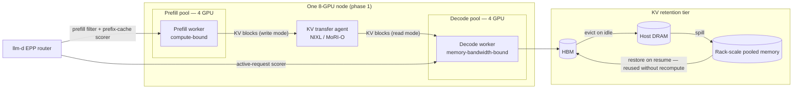

# Case Study: Prefill/Decode Disaggregation and the KV Transfer That Makes It Work

> **Topic:** `T12` · **Transcript coverage:** primary · **Difficulty:** L4
> **One line:** Prefill and decode want opposite things from hardware, so you split them — and the
> moment you do, the KV cache stops being an optimisation and becomes the system's most important
> interface.

## Table of Contents

1. [The Scenario](#1-the-scenario)
2. [Requirements](#2-requirements)
3. [Architecture](#3-architecture)
4. [Component Deep Dive](#4-component-deep-dive)
5. [Decision Table](#5-decision-table)
6. [Edge Cases & Exceptions](#6-edge-cases--exceptions)
7. [Failure Modes & Mitigations](#7-failure-modes--mitigations)
8. [Capacity & Cost Model](#8-capacity--cost-model)
9. [Benchmarks & Measured Numbers](#9-benchmarks--measured-numbers)
10. [Operational Runbook](#10-operational-runbook)
11. [What Changes at 10x](#11-what-changes-at-10x)
12. [Interview Walkthrough](#12-interview-walkthrough)

---

## 1. The Scenario

**Helix Inference** runs the serving tier for a mid-sized AI product company: a coding assistant
with a browser-embedded agent, roughly 40,000 daily active sessions, deployed on a single
8-GPU node plus a rack of pooled memory in one region.

The workload has drifted, and the drift is the whole story. When the product launched it was
chat-shaped: short prompts, long-ish outputs, and TTFT and ITL both mattered roughly equally. Now
sessions are agentic — the harness reads a repository, calls tools, waits for the user, resumes.
Two numbers from the llm-d talk describe the new shape precisely:

- **~70% of inference traffic is now agentic** [T] (Pravin, *Scaling Agentic AI: Distributed
  Inference with llm-d*).
- Within that traffic, **prefill occupies ~98% of the tokens**, because the agent reads code and
  documents while emitting comparatively few output tokens — "output could be consisting of tool
  call, few user permissions and all that" [T] (Pravin).

The consequence on the operator's Grafana board is ugly: TTFT p95 has gone from 400 ms to over 4 s
during repository-indexing bursts, while ITL has barely moved. The decode capacity the company
bought is idle 60% of the time; the prefill capacity it did not buy is the bottleneck.

**The political constraint:** the CFO has approved one node's worth of incremental spend, and the
head of infrastructure has already been burned by a previous "distributed" project that halved
throughput. The requirement is therefore not "go disaggregated" — it is "prove it on the existing
node first", which is exactly what the NxtGen talk describes doing: "four GPUs run let's say prefill
and four GPUs run decode" *inside one node* [T] (Abhishek Singh).

---

## 2. Requirements

### Functional

| Requirement | Priority | Notes |
|---|---|---|
| Agentic multi-turn sessions with tool calls and human waits | P0 | The session is the unit of work, not the request [T] (Pravin) |
| Independent scaling of prefill and decode capacity | P0 | The reason to disaggregate at all |
| KV reuse across turns with no re-prefill | P0 | "We never recompute the tokens in the previous turns" [T] (Kwon) |
| Survive the idle-pause-resume pattern of tool calls | P0 | Sessions "take a pause and come back after some time" [T] (Pravin) |
| VLM support on the roadmap (image inputs) | P2 | Drives the EPD question [T] (Zhu) |
| Deployable on the existing single node first | P0 | Political |

### Non-functional

| Requirement | Target | Rationale |
|---|---|---|
| TTFT p95, interactive turns | < 1.5 s | Interactive multi-turn is where TTFT and ITL matter [T] (Pravin) |
| TTFT on session return after a pause | ≤ 1/5 of cold prefill | CPU KV offload is reported to save ~5× TTFT on session return [T] (Pravin) |
| Agentic session completion p95 | Tracked as the primary SLI | "Request latencies, program completion times… those become more important than individual TTFTs" [T] (Pravin) |
| KV hit rate per session | > 70% | Named as a top-3 agentic metric [T] (Pravin) |
| Cost | ≥ 1 node's worth of headroom recovered | The CFO's condition |
| Throughput at crossover | ~85 QPS | The measured llm-d crossover point [T] (Singh) |

### Constraints and non-goals

- **Non-goal: new hardware.** Prove it on the existing node before any procurement.
- **Non-goal: encoder disaggregation in phase 1.** EPD is real [T] (Zhu) but the VLM workload is
  P2; adding a third disaggregation axis before the first is stable is how migrations fail.
- **Constraint: the network is not a given.** Pravin's framing: "the KV cache… transferred between
  the pre-fill and the decode nodes using NIXL" [T] — ASR renders NIXL as "NVIDIA and Excel", and
  the same talk describes a "P2P K" that "transfers the KV cache between one node to the other
  node" [T]. Corrected: NIXL. If the fabric cannot carry that traffic, disaggregation *reduces*
  throughput rather than raising it.
- **Constraint: this is now a communication problem.** "Distributed inference is becoming more of a
  communication and a memory problem and a systems problem, but it's not really related to
  computation anymore" [T] (Chaitanya Sri Krishna, *ROCm with WideEP*).

---

## 3. Architecture



The request path:

1. The EPP router picks a **prefill** pod. It filters to prefill instances, then scores on
   prefix-cache identity and token load [T] (Pravin).
2. Prefill computes attention over the full prompt and materialises the KV blocks. In an agentic
   workload this is where ~98% of the tokens are spent [T] (Pravin).
3. The prefill worker **writes** the KV blocks into the transfer engine. On NVIDIA this is NIXL;
   on AMD it is MoRI-O, which supports both write and read modes [T] (Chaitanya).
4. Decode reads the blocks and begins token generation, scoring against **active requests** rather
   than prefix cache — "the decode requests just need active request scorer because they don't pull
   the KV cache from the prefill" [T] (Pravin).
5. If the session pauses (tool call, human wait), the KV blocks are **evicted to CPU DRAM** and
   later to a pooled tier, tagged with session metadata so the router knows which blocks belong to
   which session [T] (Pravin).
6. On resume, the blocks are restored rather than recomputed. The measured result is ~5× better
   TTFT than recomputation [T] (Pravin).

Step 5–6 is the step people forget, and it is where the money is. Disaggregation without a KV
retention tier is a latency optimisation; disaggregation *with* one is what makes agentic sessions
economical.

---

## 4. Component Deep Dive

### 4.1 Why the split exists: two hardware profiles, not two software modes

Peter DeSantis's framing is the cleanest statement of the underlying physics in the corpus. Under
an autoregressive transformer there are "two workloads":

- **Prefill / encoding** — "extremely compute-intensive".
- **Auto-regressive token generation** — "extremely memory-bandwidth [bound], because each
  subsequent token requires us to access every model weight" [T] (Peter DeSantis, *Constraint
  Driven Innovation*).

"the profile of those two workloads is radically different if you look at it at a hardware level"
[T]. That is not a software inconvenience; it is a silicon-level mismatch, and it is why DeSantis
expects specialised decode silicon (SRAM-heavy chips, trading compute transistors for memory) to
earn a place — while warning that such chips are poor at prefill *and* poor at moving long context:
"if you're running agentic AI, you probably need really, really long context windows, and it's hard
to move that context in and out of an SRAM chip" [T].

The corollary for this case study: **disaggregation is the software expression of a hardware
asymmetry, and it will outlive any particular chip.** You split because the two phases scale on
different axes.

### 4.2 Choosing the ratio

The ratio is the decision. Reported observations:

| Workload | Best observed ratio | Caveat |
|---|---|---|
| Agentic, prefill-heavy (GLM-5.2 on H100/H200) | "Having more prefill than the decode definitely helped" — 2P2D vs 3P1D compared [T] (Pravin) | Workload dependent; the speaker says to identify which side is the bottleneck and scale that variant |
| Long-input benchmark at 28k/1k | 2P4D performed best | **Explicitly preliminary** — "these are all preliminary results, don't look into the performance here" [T] (Chaitanya) |
| CI policy | 1P1D and 2P2D are the two tested shapes [T] (Chaitanya) | Not an optimum, a coverage policy |

These are not contradictory once you look at the token arithmetic. Pravin's agentic workload is
prefill-heavy at the *token* level (98% prefill), which argues for more prefill capacity. Chaitanya's
28k/1k benchmark has *many concurrent long sequences*, so the aggregate decode step count across
those sequences dominates — 5 M of 7.34 M tokens are decode [T]. Same technique, opposite ratio,
because the shapes differ.

**The rule: derive the ratio from measured prefill:decode token share per workload class, and expect
to run more than one pool.** A single global ratio is the classic first-production mistake.

### 4.3 The transfer engine

Two planes in the same wire:

| Direction | Traffic | Purpose |
|---|---|---|
| Prefill → Decode | KV blocks for the current request | The classic PD transfer |
| Engine ↔ distributed store | Evicted/restored KV blocks | Session pause/resume; cross-turn reuse |

Kwon describes why this is genuinely hard: "in the prefill disaggregation case, the movement of KV
cache is pretty dynamic and complex because it needs to move between prefill instance to decode
instance, prefill instance to the distributed KV storage pool like Mooncake" [T] (Woosuk Kwon,
*vLLM*). His design answer is an **abstraction** — the KV connector — that hides the transport so
that both NIXL-class P2P transfer and third-party stores like Mooncake sit behind one interface
[T].

Chaitanya's parallel stack on AMD is **MoRI-O**, described as "a KV cache transfer engine… a GPU to
GPU, GPU-initiated KV transfer" with "both support mode, like write mode as well as read mode" [T].
Write *and* read matters: it lets the receiver pull rather than requiring the sender to push, which
changes who blocks under contention.

### 4.4 Rack-scale pooled memory: disaggregation below the server

Jongryool Kim's talk is the hardware half of the same idea. Instead of transferring KV over the
network between servers, he puts a physically disaggregated memory pool in the middle of the rack —
"a really disaggregated memory pool… multiple servers can use this memory pool at the same time"
[T] (Jongryool Kim, *Disaggregated LLM Serving with Shared Memory KV Cache at Rack Scale*).

Two modes, and the distinction is the whole design:

| Mode | Semantics | Use |
|---|---|---|
| **Memory pooling** | Each node dynamically allocates additional memory, but "that memory region is isolated between node" [T] | Pure capacity extension — more room, no sharing |
| **Sharing mode** | "Multiple nodes can see the same memory address space. So each node can access the same data" [T] | True KV sharing; the same blocks usable by several servers |

Three claimed benefits, all attributable:

1. **Faster than RDMA.** "Instead of using TCP/IP we generally use RDMA. This is fast, but this
   pooled-memory-based data sharing is faster than RDMA" [T].
2. **OOM resilience.** "If there is out of memory at the decoding side and prefill side… we can
   continuously do the prefill because we already uploaded that KV cache to the pool memory side"
   [T]. This is architecturally significant: the pool decouples prefill's ability to make progress
   from decode's ability to consume.
3. **Contention removal.** Storing and reusing KV creates contention on GPU-side PCIe bandwidth and
   the network. Routing the traffic through the pool removes it [T].

And the reuse point: "the old KV cache can be stored in the memory pool, so we can reuse it for the
next request without any additional storing operation" [T]. The performance claim is against
recomputation, and the comparison baseline he names is Mooncake and a DRAM cache — "very initial
performance numbers" [T].

### 4.5 Where disaggregation sits in the deployment evolution

Zhu's four-stage ladder is the industry's own framing [T] (Banghua Zhu, *SGLang and Miles*):

```
collocate → prefill/decode split → prefill/decode disaggregation → EPD (encoder disaggregation)
```

The first step is a *logical* split on shared hardware; the third is a physical one; the fourth adds
a third phase for vision-language models where the encoder is itself a distinct workload. This
matters because it tells you disaggregation is a **continuum**, not a binary. The single-node 4+4
split is stage two, and it is a legitimate production configuration — the NxtGen talk describes it
for exactly that purpose: "if you want you could do a node. So four GPUs run let's say prefill and
four GPUs run decode" [T] (Singh).

---

## 5. Decision Table

### 5.1 Co-located versus disaggregated

| Option | Pros | Cons | Exceptions — when it breaks | When to use |
|---|---|---|---|---|
| **A. Co-located (both phases, same engine)** | Simplest; no transfer cost; KV never leaves the GPU; single failure domain | Phases contend for the same SM and HBM; a prefill burst destroys ITL for in-flight decodes; cannot scale one phase independently | Breaks as soon as the workload is asymmetric — prefill-heavy agentic traffic starves decode | Chat-shaped workloads; small scale; bring-up; single-tenant low-QPS |
| **B. Logical split, shared hardware (4+4 GPUs one node)** | Independent pools without new procurement; isolates phase interference; the NxtGen configuration [T] | Half the node per phase; still one failure domain; transfer over in-node fabric | Breaks if one phase needs the whole node under peak | The proving-ground step; sustained loads under ~85 QPS [T] (Singh's crossover) |
| **C. Physical disaggregation across nodes** | True independent scaling; enables heterogeneous silicon per phase; the DeSantis hardware-profile argument | Network becomes critical path; KV transfer latency added to every request; two deployments to operate; a fabric failure is now a request failure | Breaks when the fabric is slow or shared with EP all-to-all traffic — then it is a net loss | Sustained asymmetric load; multi-node fleets; frontier models needing EP |
| **D. Disaggregation + pooled rack memory** | Adds OOM resilience and cross-server KV reuse [T] (Kim); removes PCIe/network contention | Exotic hardware; sharing-mode coherence risk; immature tooling | Breaks when the pool's latency exceeds the cost of recomputation for short prompts | Long-context, high-reuse, rack-scale deployments |

**Chosen:** B now, C when sustained QPS passes the measured ~85 QPS crossover — which is precisely
where the llm-d study found 2× throughput [T] (Singh). The evidence for the crossover point is the
reason the migration is even schedulable.
**Revisit if:** the workload mix re-flattens toward chat — disaggregation then buys nothing and costs
a hop.

### 5.2 Prefill:decode ratio

| Option | Pros | Cons | Exceptions — when it breaks | When to use |
|---|---|---|---|---|
| Symmetric (1P1D, 2P2D) | Simple; CI-tested [T] (Chaitanya) | Ignores workload asymmetry entirely | Breaks whenever the workload is not symmetric — i.e. almost always | Baseline; correctness testing |
| Prefill-heavy (3P1D) | Matches a 98%-prefill token mix | Wastes decode capacity if that mix is only true in bursts | Breaks when bursts are short — you have over-provisioned the wrong pool | Sustained agentic indexing/retrieval traffic |
| Decode-heavy (2P4D) | Best measured for many long concurrent sequences [T] (Chaitanya, preliminary) | Needs more cards; preliminary evidence only | Breaks at low concurrency where decode steps are few | Long-input, many-concurrent-sequence benchmarks |
| **Adaptive (per-workload pools, independently autoscaled)** | Matches each tenant class to its own optimum | Most operational complexity; needs per-tenant routing | Breaks if the router cannot classify the workload before it hits a pool | Multi-tenant platforms |

**Chosen:** start 2P2D (CI-tested and safe), then move to per-workload pools once traffic
classification exists — with the ratio *derived* from measured token share, never from a default.
**Revisit if:** a single workload class exceeds ~70% of traffic; then a single tuned ratio is
simpler and equally good.

### 5.3 KV transport

| Option | Pros | Cons | Exceptions — when it breaks | When to use |
|---|---|---|---|---|
| **NIXL (NVIDIA)** | P2P KV transfer between nodes; mature; the default in llm-d deployments [T] (Pravin, ASR "NVIDIA and Excel", "P2P K") | NVIDIA-centric; separate stack to operate | Breaks outside NVIDIA hardware | NVIDIA fleets; the default PD path |
| **MoRI-O (AMD)** | GPUDirect RDMA; write *and* read modes; integrated with vLLM/llm-d [T] (Chaitanya) | Newer; per-model enablement (e.g. sparse MLA over MoRI) still landing | Breaks for models whose attention metadata is not yet enabled | AMD fleets |
| **KV connector abstraction** | One interface over NIXL, MoRI-O and third-party stores like Mooncake [T] (Kwon) | Lowest-common-denominator API; per-transport quirks leak | Breaks when a transport has a feature the abstraction cannot express | Any multi-transport deployment |
| **Rack-scale pooled memory** | Faster than RDMA per the vendor [T] (Kim); OOM resilience; no re-store on reuse | Non-standard hardware; sharing-mode coherence | Breaks for cross-rack or cross-datacentre topologies | Single-rack, long-context, high-reuse |
| **Recompute instead of transfer** | No transfer infrastructure at all | Wastes the compute you just paid for; catastrophic at 28k inputs [T] (Chaitanya) | Viable only for very short prompts | Never as a default; only as an explicit degraded mode |

**Chosen:** the KV connector abstraction over NIXL today, with MoRI-O behind the same interface so
the AMD half of the fleet is reachable later. The abstraction is chosen *because* hetero-geneity is
the fleet's defining property.
**Revisit if:** a single transport becomes dominant and the abstraction costs measurable latency.

### 5.4 What to do with KV during a session pause

| Option | Pros | Cons | Exceptions — when it breaks | When to use |
|---|---|---|---|---|
| **Keep in HBM** | Zero restore cost | Blocks capacity for other sessions; the cause of agentic eviction storms | Breaks as soon as the number of paused sessions × their KV exceeds HBM — which is immediate at 70% agentic traffic [T] | Very short pauses only |
| **Evict to CPU DRAM** | ~5× better TTFT than recomputation on return [T] (Pravin); no special hardware | Host memory is finite; PCIe contention; needs retention API with session metadata | Breaks when pauses are long enough that DRAM also fills | The default for agentic sessions |
| **Spill to external/pooled tier** | Effectively unbounded; enables true cross-turn reuse; HiCache-style HBM→DRAM→external ladder [T] (Zhu) | Restore latency; more moving parts | Breaks when restore is slower than recompute for short contexts | Long sessions, long pauses, high reuse |
| **Recompute on return** | Nothing to store; nothing to fail | Defeats the purpose of a cache; at 28k inputs it is "KV cache recomputation happening every single time" and throughput collapses [T] (Chaitanya) | Only sane for short prompts | Explicit degraded mode |

**Chosen:** tiered — HBM while active, DRAM on pause, external for long tails, with session metadata
on the blocks so the router can reason about them [T] (Pravin).
**Revisit if:** the tier's restore path exceeds recompute cost for the median session — measure this,
do not assume it.

### 5.5 Push versus pull on the transfer

| Option | Pros | Cons | Exceptions — when it breaks | When to use |
|---|---|---|---|---|
| Write (prefill pushes) | Prefill controls timing; natural completion signal | Prefill blocks on a slow decode; failure surfaces at the sender | Breaks under decode-side backpressure — prefill stalls, wasting the scarce resource | Decode pool has spare capacity |
| Read (decode pulls) | Decode controls its own admission; backpressure lands on the correct side | Decode must track availability; more state | Breaks if the decode pool over-commits reads and thrashes | Prefill is the bottleneck — the 98%-prefill agentic case |
| Both, selectable | MoRI-O supports both [T] (Chaitanya) | Two code paths to test | — | Default: expose both |

**Chosen:** both, defaulting to read when prefill is the bottleneck.
**Revisit if:** measurement shows one path never wins on this fabric.

---

## 6. Edge Cases & Exceptions

- **The very short prompt.** For a 200-token prompt, transfer latency can exceed recomputation.
  Route short prompts to a collocated replica; do not force every request through the disaggregated
  path. This is the single most common cause of "disaggregation made us slower".
- **Concurrent EP all-to-all.** MoE all-to-all and KV transfer share the east-west fabric. Under
  WideEP (see [T11](T11-parallelism-moe.md)) they contend directly. Isolate with QoS classes or
  separate NICs; otherwise both degrade together and the diagnosis is confusing.
- **The decode pool's cold start.** A newly scaled decode pod has no prefix cache and no
  in-flight requests, so the "active request scorer" gives it a perfect score and it absorbs a
  flood. Warm-up traffic before adding a pod to the pool.
- **Session metadata loss.** If the KV retention API's session metadata is lost (restart, eviction
  of the metadata store), blocks become orphaned — they consume memory but cannot be attributed to
  any session. Reap orphans on a timer; this is a slow leak, not a crash.
- **Pause longer than the retention TTL.** The session resumes, the blocks are gone, and the client
  sees a TTFT spike indistinguishable from a cold start. Alert on
  `session_resume_recompute_total` rather than relying on TTFT alone.
- **Asymmetric failure.** Prefill is healthy, decode is not: requests enter prefill, produce KV, and
  stall. The symptom is *full* prefill queues and *zero* decode utilisation — the inverse of the
  usual overload signature. Admission must check the *downstream* pool, not just the local one.
- **Version skew between pools.** Prefill on engine vN and decode on vN+1, where the KV layout
  changed, produces silently corrupted output — not a crash. Pin both pools to one engine version
  as a single deployable unit.
- **VLM / encoder inputs.** An image in the prompt is an encoder workload with its own profile; if
  it is not disaggregated (EPD), it lands on the prefill pool and its cost is invisible in the
  text-token metrics [T] (Zhu).
- **Multi-tenant prefill poisoning.** Because prefill is a shared pool, a tenant with enormous
  prompts consumes prefill capacity that other tenants' sessions need. Flow control's priority
  bands exist precisely for this [T] (Pravin).

---

## 7. Failure Modes & Mitigations

| Failure | Symptom | Detection | Blast radius | Mitigation | Recovery |
|---|---|---|---|---|---|
| KV transfer agent down | Decode waits, then recomputes; TTFT ≈ full prefill time | KV-transfer error rate; recompute counter per request | Every disaggregated request | Health-check the agent as a first-class dependency | Fail the pool back to collocated mode; drain and restart |
| Fabric saturation (KV + EP all-to-all) | Both TTFT and ITL degrade together; no single culprit | Per-plane bandwidth counters; NIC queue depth | Whole node or rack | Separate QoS classes or NICs per plane | Temporarily reduce EP degree |
| Prefill pool starvation | Long prefill queue, idle decode | Queue depth by pool; pool utilisation asymmetry | All new requests; in-flight decodes fine | Independent autoscaling per pool; priority bands | Shed best-effort band; borrow idle decode GPUs |
| Decode pool failure with healthy prefill | Prefill full, decode empty — the inverted signature | Per-pool active-request counts | All new sessions | Cross-pool admission check | Re-route to collocated replica; restart decode |
| HBM eviction storm | Repeated evict/restore; throughput oscillates | KV utilisation crossing the saturation threshold repeatedly [T] (Pravin) | All sessions on the node | Offload to a lower tier instead of thrashing; retention API | Shed long-idle sessions to the external tier |
| Pooled memory unreachable | Offload failures; OOM on the decode side | Pool health probe | Every session needing offload | Keep a DRAM tier as an intermediate so the pool is not the only fallback | Fall back to DRAM-only; disable pooling |
| Session metadata corruption | Orphaned blocks; memory leak | Block accounting: allocated vs attributed | Slow, node-wide | Reaper; metadata checksum | Restart the retention service; reclaim orphans |
| Ratio drift after a workload change | One pool saturated, the other idle — permanently | Rolling 7-day pool utilisation asymmetry | Cost, then SLA | Alert on sustained >30% utilisation asymmetry between pools | Re-tune the ratio or split pools per workload |

---

## 8. Capacity & Cost Model

*All arithmetic below is mine; every input is attributed. Prices illustrative.*

### Assumptions

| Input | Value | Source |
|---|---|---|
| Node | 8 GPU, 192 GB HBM each = 1,536 GB | MI300 spec [T] (Chaitanya) |
| Agentic token mix | prefill ≈98%, decode ≈2% | [T] (Pravin) |
| Long-input benchmark mix | prefill ≈32%, decode ≈68% | Derived from 7.34 M total / ~5 M decode [T] (Chaitanya) |
| CPU KV offload benefit | ~5× TTFT on session return | [T] (Pravin) |
| llm-d crossover | ~2× throughput at ~85 QPS | [T] (Singh) |
| Enterprise SLA | 16 req/s on half an H100 | [T] (Singh) |
| Node cost | $30,000/month | Illustrative |
| Host DRAM | 2 TB per node | Illustrative |

### Step 1 — Is the prefill bottleneck real?

At 98% prefill tokens, if the node's token budget is *B* tokens/s, prefill consumes 0.98·*B* and
decode 0.02·*B*. A collocated engine allocates SM and HBM to whichever request arrives; the
observed pattern — TTFT p95 up 10×, ITL flat — is exactly what you expect when the prefill work
queue grows and decode stays small. **The fix is to give prefill its own silicon, not to make
prefill faster.** A 2× faster prefill with the same contention yields a ~2× queue, which is a
~2× TTFT improvement, versus an independent pool which removes the coupling entirely.

### Step 2 — Sizing the split on one node

Using Singh's contract as the unit: **half an H100 sustains 16 req/s** for that model class. So:

- One full H100-equivalent ≈ 32 req/s.
- The target: **>85 QPS**, the measured llm-d crossover [T].

```
85 / 32 ≈ 2.66 H100-equivalents of raw capacity
```

That is under one 8-GPU node, which is consistent with the crossover being reachable on modest
hardware — and with Singh's observation that the crossover is where things get "staggering… it's
not supposed to be such a drastic improvement, but it is" [T].

For the 4+4 split on the existing node:

```
Prefill pool = 4 GPUs, decode pool = 4 GPUs
If decode needs only 2% of tokens, the decode pool is wildly over-provisioned
→ at 98/2, the correct split is closer to 7P1D than 4P4D
→ but a 1-GPU decode pool has no failure tolerance and no burst headroom
→ practical floor: 2 decode GPUs (one for burst, one for availability)
```

**Conclusion (mine):** on an 8-GPU node with a genuinely 98/2 mix the split should be **6P2D,
not 4P4D** — the symmetric split is a *coverage* choice, not an optimal one. Chaitanya's CI runs
1P1D and 2P2D because they are the shapes worth testing, not because they are optimal.

### Step 3 — The value of the KV retention tier

Assume a session that pauses 30 times per lifecycle and prefills 8,000 tokens per turn.

```
Without retention: 30 prefills × 8,000 tokens = 240,000 prefill tokens per session
With retention:     1 prefill  × 8,000 tokens =   8,000 prefill tokens per session
Reduction: 240,000 → 8,000 = 96.7% fewer prefill tokens
```

Even if the 5× TTFT figure is the *only* measured benefit and cache hit is imperfect, the token
arithmetic is overwhelming: this is why "KV cache hit rate per session" [T] (Pravin) is a
first-class SLI and why the retention API with session metadata is not a nice-to-have.

In cost terms, at the LLMOps corpus's observed ~10× cheaper cache read versus fresh token [T]
(*Cut LLM Cost, Latency: KV Cache, Batching, Quantization, vLLM*):

```
Uncached: 240,000 fresh prefill tokens
Cached:     8,000 fresh + 232,000 cached reads at 1/10 cost = 8,000 + 23,200 effective = 31,200
Effective reduction: 240,000 → 31,200 ≈ 87%
```

### Step 4 — Sensitivity

| Scale | What holds | What breaks |
|---|---|---|
| 0.1× (1 node, chat-shaped) | Co-located is correct; disaggregation is pure overhead | The transfer hop costs more than it saves |
| 1× (1 node, 98/2 agentic) | 6P2D split; DRAM retention tier | Symmetric splits waste ~3 GPUs |
| 10× (multi-node, mixed) | Per-workload pools with independent autoscaling; pooled memory tier | A single global ratio; the fabric becomes the constraint |

**Break-even (mine):** the incremental cost of disaggregation is the transfer hop plus the
operational overhead of a second deployment. Singh's ₹10 lakh → ₹5 lakh/month for 200 users [T]
implies the *routing* half pays for itself at one card-month. The disaggregation half pays for
itself when the pool ratio is wrong by more than one GPU — i.e. almost always, if the workload is
asymmetric.

---

## 9. Benchmarks & Measured Numbers

| Metric | Value | Source | Conditions |
|---|---|---|---|
| Agentic share of inference traffic | ~70% | Pravin [T] (llm-d) | Speaker's observation |
| Prefill share of tokens, agentic | ~98% | Pravin [T] | Coding-agent workloads |
| CPU KV offload TTFT improvement | ~5× | Pravin [T] | On session return after a pause |
| PD ratio comparison | 2P2D vs 3P1D compared; more prefill helped | Pravin [T] | Prefill-heavy agentic workload |
| Precise vs approximate KV routing | Precise significantly better | Pravin [T] | Agentic, high KV churn |
| Topology sweep on 64 GPUs (GLM-5.1) | Full PD + WideEP, EP4→EP32, MI300, MoRI | Chaitanya [T] | Model has 78 layers, 256 experts, top-k 8, sparse MLA |
| Max concurrency, 1P1D at 28k input | ~20,000 tokens | Chaitanya [T] | Above this, KV recomputed every step |
| Tokens in the 28k/1k shape | 7.34 M total, ~5 M decode | Chaitanya [T] | Preliminary |
| Best topology in that sweep | 2P4D | Chaitanya [T] | **Flagged preliminary by the speaker** |
| CI topologies | 1P1D and 2P2D | Chaitanya [T] | Coverage policy, not optimum |
| llm-d crossover | ~2× throughput at ~85 QPS | Singh [T] | Multi-accelerator study, vendor-affiliated |
| Single-node split | 4 GPU prefill + 4 GPU decode | Singh [T] | Described as a viable configuration |
| Pooled memory vs RDMA | "Faster than RDMA" | Kim [T] | **Vendor claim** (SK hynix); described as initial numbers |
| Pooled memory vs Mooncake / DRAM cache | Improvement shown | Kim [T] | **Vendor claim**; "very initial performance number" |
| Production claims (llm-d) | Tesla ~3×; AWS/Oracle/Google "Vortex"; Capital One adopting | Pravin [T] | Reported by the project's own contributor; treat as project claims |

**Not measured in this corpus:** KV transfer bytes per token, transfer latency in microseconds,
and any head-to-head of NIXL versus MoRI-O. Do not assert these.

---

## 10. Operational Runbook

**Deploy.**
1. Collocated baseline: pin engine version, run the workload, record TTFT/ITL/session-completion
   p95 and KV hit rate per session. This is the number every later claim is measured against.
2. Enable the KV retention tier *before* disaggregating. Retention is the higher-value change and
   it is lower-risk; do it first so that a disaggregation regression is isolated.
3. Split 4+4 within the node. Re-run the identical suite.
4. Only then go multi-node, and only past ~85 QPS.

**Tune — in this order.**
1. **Retention TTL and tier thresholds.** Longest lever; cheap to change.
2. **Pool ratio.** Move from 4P4D toward 6P2D as the measured token mix justifies it.
3. **Transfer direction** (write vs read) — flip when prefill is the bottleneck.
4. **Saturation threshold** that triggers flow control. Operator-defined; "when the KV cache is
   80% full I declare the cluster is saturated" is the pattern [T] (Pravin).
5. **Admission policy** — premium/best-effort bands [T] (Pravin).

**Monitor.** Per pool: queue depth, active requests, KV utilisation, TTFT p50/p95, ITL, session
completion p95, prefix-cache hit rate per session, KV transfer error rate and bandwidth, recompute
counter, restore-versus-recompute ratio, and the utilisation asymmetry between pools.

**Incident — top 5.**

| Symptom | Likely cause | First action |
|---|---|---|
| TTFT spikes, ITL flat | Prefill pool starved or KV transfer slow | Check prefill queue depth, then transfer error rate |
| Prefill full, decode idle | Decode pool unhealthy but admission has not noticed | Add the downstream health check to admission; restart decode |
| Throughput oscillates on a period | HBM evict/restore thrash at the saturation threshold | Lower the threshold or push to the next tier |
| Accuracy drift, no latency change | Engine version skew between pools | Verify both pools report the same engine version |
| Memory creeps with no traffic growth | Orphaned KV blocks after metadata loss | Run the reaper; check the retention service health |

---

## 11. What Changes at 10x

- **The transfer hop becomes the SLA.** At 10× the fabric is carrying KV *and* MoE all-to-all
  simultaneously. The first thing that breaks is not the engine — it is the NIC. Plan separate
  planes before you need them.
- **A single ratio becomes indefensible.** Two pools become five; classification (see
  [T14](T14-routing-gateways.md)) becomes a prerequisite rather than an optimisation.
- **Retention stops being optional and becomes the primary cost lever.** At 10× the difference
  between an 87% and a 0% effective token reduction is the difference between profitable and not.
- **Rack-scale pooled memory inverts from exotic to obvious.** Kim's OOM-resilience argument gets
  stronger with scale, not weaker: prefill can keep making progress when decode is behind, which at
  10× is the difference between a backlog and an outage.
- **EPD arrives.** Vision is no longer a P2 feature at 10×; the encoder is a third pool.
- **What survives:** the split itself, the connector abstraction, tiered retention, per-pool
  autoscaling, session-level SLIs. These are architectural.

---

## 12. Interview Walkthrough

**Whiteboard order:**
1. Draw prefill and decode as two boxes with different resource profiles. Say "compute-bound" and
   "memory-bandwidth-bound" and draw the arrow between them labelled KV.
2. State the numbers: ~70% agentic traffic, ~98% of tokens are prefill.
3. Show why a collocated engine cannot serve a 98/2 mix well.
4. Draw the split, then immediately draw the retention tier — this is the step most candidates skip.
5. Derive the ratio from the token mix on the board.
6. Then the failure modes: what happens when the transfer agent dies.

**Two numbers to say out loud:**
- **Prefill ≈98% of tokens** in agentic traffic — this is why the bottleneck moved.
- **~5× TTFT on session return** from CPU KV offload — this is why the retention tier, not the
  split, is the real win.

**Volunteer before you are asked:** that the 2P4D result is *preliminary* and that the pooled-memory
numbers are *vendor claims*. Saying this unprompted is the fastest way to signal that you read
sources rather than summaries.

**Follow-ups.**

1. *Why not just make prefill faster with better kernels?* Because the coupling, not the speed, is
   the problem. A 2× faster prefill on the same silicon still steals SM cycles from in-flight
   decodes. — tests whether you understand contention versus throughput.
2. *You have 8 GPUs and a 98/2 token mix. Split?* 6P2D, not 4P4D — with a floor of 2 decode GPUs for
   burst and availability. The symmetric split is a coverage choice. — tests whether you derive
   rather than recall.
3. *When is disaggregation a net loss?* Short prompts, chat-shaped traffic, low QPS, and any case
   where the transfer latency exceeds recomputation cost. Also whenever the KV and EP planes share a
   saturated fabric. — tests judgement.
4. *What is NIXL and where does it sit?* The KV transfer layer between prefill and decode, also
   usable P2P between nodes; it sits behind the engine's KV connector abstraction alongside MoRI-O
   on AMD and stores like Mooncake. — tests depth on the transfer plane.
5. *What goes wrong with a VLM?* The encoder is a third workload with its own profile; undisaggregated
   it lands on prefill and its cost is invisible in text-token metrics — which is what EPD exists to
   fix. — tests whether you know the evolution ladder.
6. *How do you know the ratio is still right?* Alert on sustained utilisation asymmetry between
   pools; re-derive from the rolling token mix. — tests that you treat configuration as a
   continuously validated decision.
7. *What is the single most valuable metric here?* KV cache hit rate per session. It predicts both
   cost and latency and it is the one number that tells you whether retention is working. — tests
   metric selection.
8. *Pooled rack memory — what does it actually buy you?* Three things: faster-than-RDMA movement, OOM
   resilience because prefill can keep going when decode is behind, and removal of PCIe/network
   contention from store-and-reuse. The vendor claims the first two; the third is architectural.
   — tests whether you separate claims from structure.

---

## Sources

Transcripts (`refs/`):
- `vLLM_Inference_Meetup_Bengaluru_2026_transcripts/Scaling_Agentic_AI_Distributed_Inference_with_llm-d.txt`
  — Pravin (IBM Research). PD ratio comparison, ~70% agentic / ~98% prefill, CPU KV offload ~5×,
  NIXL as the transfer layer, precise vs approximate prefix routing, P2P KV sharing, session-aware
  routing and the retention API.
- `vLLM_Inference_Meetup_Bengaluru_2026_transcripts/Distributed_Inference_on_ROCm_with_WideEP_on_vLLM_llm-d.txt`
  — Chaitanya Sri Krishna. PD over MoRI, 28k recomputation cliff, 2P4D (preliminary), CI topologies,
  MoRI-O read/write modes, "distributed inference is becoming a communication and memory problem".
- `Agentic_AI_Infra_transcripts_2/Jongryool_Kim_-_Disaggregated_LLM_Serving_with_Shared_Memory_KV_Cache_at_Rack_Sc.txt`
  — rack-scale pooled memory ("Niagara"), pooling vs sharing mode, store/load, OOM resilience,
  reuse without re-store, comparison against Mooncake and a DRAM cache.
- `Agentic_AI_Infra_transcripts_2/Woosuk_Kwon_-_vLLM_Building_Open_and_Efficient_Inference_for_Agents.txt`
  — the KV connector abstraction, Mooncake interop, three-direction KV movement.
- `Agentic_AI_Infra_transcripts_2/Banghua_Zhu_-_Building_Frontier_Inference_and_Training_Infra_for_Agent_A_Case_St.txt`
  — the collocate → PD → EPD evolution ladder; HiCache HBM→DRAM→external tiering (ASR: "Ashlan" →
  SGLang).
- `Agentic_AI_Infra_transcripts/Peter_DeSantis_-_Constraint_Driven_Innovation_A_Look_at_the_AI_Systems_Problem.txt`
  — prefill/decode as hardware profiles; SRAM chips, their trade-offs and their long-context
  weakness; models-and-chips co-design.
- `vLLM_Inference_Meetup_Bengaluru_2026_transcripts/Scaling_AI_Inference_at_NxtGen_Indias_Best_Sovereign_Cloud_AI_Powerhouse.txt`
  — Abhishek Singh. Single-node 4+4 split, KV utilisation knob, ~85 QPS crossover, ₹10→5 lakh/month.

Supporting repositories (`refs/`):
- `llm-inference-engineering-main/llm-inference-engineering-main/README.md` — the prefill/decode
  asymmetry and the Prefill-Decode Disaggregation chapter outline (advantages, disadvantages, where
  it is overkill, co-located vs disaggregated).
- `ai-system-design-guide-main/ai-system-design-guide-main/04-inference-optimization/06-serving-infrastructure.md`
  — gateway responsibilities (context tracker / sticky sessions), GPU scaling table.
- `ai-system-design-guide-main/ai-system-design-guide-main/11-infrastructure-and-mlops/01-llm-infrastructure.md`
  — accelerator landscape and the multi-vendor default.

**ASR corrections applied:** "NVIDIA and Excel" → NIXL; "P2P K" → NIXL; "Mori"/"MOI IO" → MoRI /
MoRI-O; "M355" → MI355X; "Ashlan" → SGLang; "LightLLM" → LiteLLM; "honey" → harness.

**Note on a corpus gap:** `TOPICS.md` lists `11-infrastructure-and-mlops/01-llm-infrastructure.md`
as the `[R]` source for "NIXL and KV transfer". That file does not mention NIXL or KV transfer at
all (it covers deployment options, scaling, cost, monitoring and the May-2026 accelerator
landscape). The NIXL material in this case study is therefore `[T]` from the ASR-garbled llm-d
transcript, with the correction noted, plus `[D]` for mechanism.
