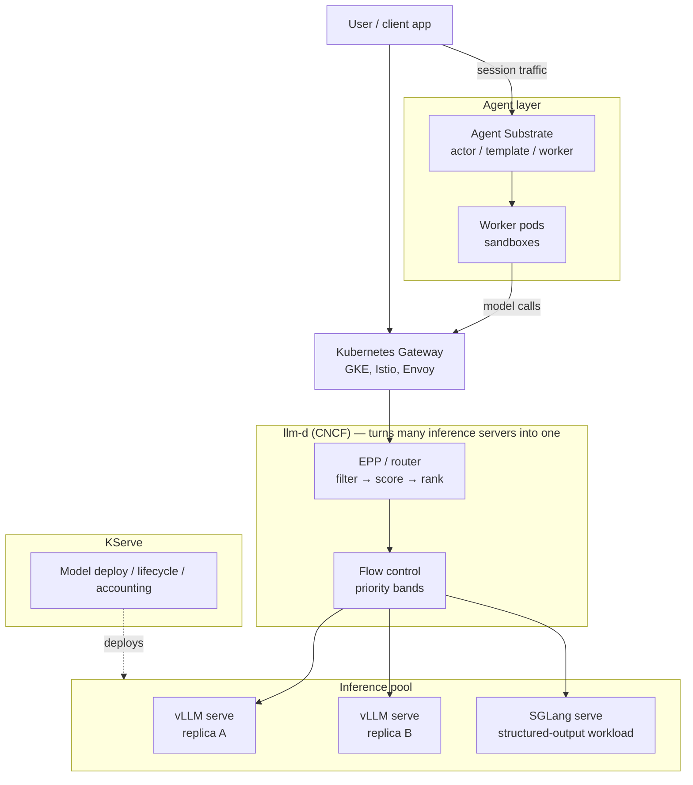

# Case Study: Choosing and Operating the Serving Stack — Engine, Orchestrator, Substrate

> **Topic:** `T13` · **Transcript coverage:** primary · **Difficulty:** L4
> **One line:** The engine is the least interesting choice you will make; the boundary between the
> engine, the orchestrator and the platform — and who owns state at each layer — is the decision.

## Table of Contents

1. [The Scenario](#1-the-scenario)
2. [Requirements](#2-requirements)
3. [Architecture](#3-architecture)
4. [Component Deep Dive](#4-component-deep-dive)
5. [Decision Table](#5-decision-table)
6. [Edge Cases & Exceptions](#6-edge-cases--exceptions)
7. [Failure Modes & Mitigations](#7-failure-modes--mitigations)
8. [Capacity & Cost Model](#8-capacity--cost-model)
9. [Benchmarks & Measured Numbers](#9-benchmarks--measured-numbers)
10. [Operational Runbook](#10-operational-runbook)
11. [What Changes at 10x](#11-what-changes-at-10x)
12. [Interview Walkthrough](#12-interview-walkthrough)

---

## 1. The Scenario

**Meridian Labs** is a 40-person AI product company. Its flagship is a long-running document
research agent: a user poses a question, the agent fans out across a corpus, calls tools, waits for
human review at two checkpoints, and eventually produces a report. Median session length is 12
minutes of wall time; median *compute* activity is under 20 seconds.

The company runs on Kubernetes because it already did — three services, a Postgres, a Redis. The
platform team has been asked three questions in one quarter, and they are all really the same
question:

1. "Should we move from vLLM to SGLang or TensorRT-LLM?" (from the ML team, after reading a
   structured-output benchmark)
2. "Do we need llm-d, or is a Kubernetes Service enough?" (from the platform lead, after a
   conference talk)
3. "Why does our agent fleet cost more than the model serving does?" (from the CFO)

The three questions have one answer between them. The engine is the least consequential choice —
Prasad Mukhedkar's framing is that vLLM leads "not about the performance… ease of use. If you look
at the other inference engine, they are very difficult to configure" [T] (*Opening Note, vLLM
Inference Meetup Bengaluru*). The orchestrator matters because it owns placement. And the cost
problem is not in the engine at all: it is that agent sessions are **idle 99.999% of the time**
[T] (Tim Hockin, *Is Kubernetes Good for Agents?*) and the platform is paying for idle sandboxes.

---

## 2. Requirements

### Functional

| Requirement | Priority | Notes |
|---|---|---|
| OpenAI-compatible and Anthropic-compatible endpoints | P0 | "Any agent framework that speaks the OpenAI or Anthropic API can work out of the box" [T] (Kwon) |
| Three models served concurrently (small, mid, frontier) | P0 | Routing is per-model, not per-engine |
| Day-zero support for new open-weight releases | P1 | A stated goal for both vLLM and SGLang [T] (Kwon; Zhu) |
| Agent sandboxes with filesystem and network access | P0 | The agent runs code, not just a prompt |
| Session suspend and resume across human checkpoints | P0 | Two human approvals per session |
| Per-tenant isolation | P0 | "You can't share a sandbox" [T] (Hockin) |

### Non-functional

| Requirement | Target | Rationale |
|---|---|---|
| Agent wake-up on inbound message | Low-hundreds of milliseconds | The target Hockin states for Agent Substrate [T] |
| Idle-cost fraction of total spend | < 20% | The CFO's question, restated as a number |
| Session-scale ceiling | 10⁵ concurrent sessions at 10⁴ activations/s | Hockin's stated design targets, scaled down from his 10⁵-node framing [T] |
| Upgrade cadence | ≤ 1 week from upstream CVE to patched in prod | Engine CVEs now have a web-server-like cadence [R] (guide `04/06`) |
| Multi-vendor accelerators | ≥ 2 vendors in production | Procurement and sovereignty requirements |
| Cost per completed session | Measurable and attributed | "Optimization without measurement is just guessing" [T] (LLMOps cost talk) |

### Constraints and non-goals

- **Non-goal: a single engine for everything.** The 2026 posture is engine-per-workload [R]
  (`04-inference-optimization/06-serving-infrastructure.md`).
- **Non-goal: replacing Kubernetes.** llm-d is "on top of Kubernetes… it still uses Kubernetes and
  there's also work on using Slurm and non-Kubernetes for the RL work. But predominantly right now
  we deploy in Kubernetes" [T] (Pravin).
- **Constraint: llm-d is a performance router, not a model selector.** "llm-d is not concerned with
  the difference in the qualitative performance of these models — it's a performance-oriented
  router" [T] (Singh). Model *choice* belongs elsewhere — see [T14](T14-routing-gateways.md).
- **Constraint: the substrate problem is unsolved.** Agent Substrate is "still pre-production
  grade" [T] (Hockin), so a production design cannot depend on it yet.

---

## 3. Architecture



Three layers, three owners, and the arrows are where designs fail:

- **The engine** owns GPU memory, the KV cache, batching and the model's execution. It owns state
  *within a request and within a replica*.
- **The orchestrator (llm-d)** owns placement, admission, and the cluster-level view of KV. It owns
  state *about replicas* — which blocks exist where, which pods are saturated.
- **KServe** owns model lifecycle and deployment. Pravin is explicit that llm-d does not replace
  it: "KServe is more for deploying the models… llm-d works with KServe. So it's not something that
  replaces KServe. So Tesla in fact uses KServe with llm-d" [T].
- **The substrate** owns session state — the sandbox, its filesystem, its identity — and is what
  makes an idle agent cheap.

The critical insight: **no layer owns the session end-to-end.** That gap is where the money leaks.

---

## 4. Component Deep Dive

### 4.1 vLLM: what it is and where it stops

Prasad's analogy is the cleanest available: "If you compare vLLM with Docker, they are the same.
Docker is to run the workload… vLLM is also something that you can run your workload. But when you
want to scale, from one system to ten system to a hundred system, that time you will require the
orchestration" [T]. llm-d is that orchestration: "it turns many inference servers into one."

Two entry points, and choosing between them is the first interface decision [T] (Kwon):

| Entry point | Use | Notes |
|---|---|---|
| `LLM` class (Python) | Offline batch inference | "You give it a Hugging Face model name and you call generate" — vLLM handles loading, optimisation, scheduling, memory |
| `vllm serve` | Online serving | One command → OpenAI-*and* Anthropic-compatible endpoint |

Internals that matter operationally:

- **>10 hardware backends** behind a plugin structure, sharing the core engine [T] (Kwon). This is
  the mechanism behind the heterogeneity strategy in [T11](T11-parallelism-moe.md): the API layer
  is standardised, the hardware underneath is not.
- **Dynamic memory partitioning** across attention types for hybrid models [T] (Kwon) — see
  [T11 §4.5](T11-parallelism-moe.md).
- **The KV connector** as a transport-agnostic abstraction over NIXL, MoRI-O and stores like
  Mooncake [T] (Kwon) — see [T12](T12-disaggregation-kv-transfer.md).
- **The recipes repository** as the practical onboarding path: "if you want to run some model, this
  is the place where you can go and get the parameters" [T] (Prasad).

The vLLM V2 engine is now the default for single-replica serving [T] (Singh) — a change that
matters because it means the "one replica, maximum throughput" case is no longer the case for
hand-tuning.

### 4.2 SGLang, or: the engine is chosen per workload

SGLang is positioned by its own team as the production engine "more optimized for agentic
workloads", with "performant day-zero model support and also very broad hardware support including
NVIDIA, AMD, TPU, Trainium, Intel" [T] (Zhu). Its distinguishing machinery [T] (Zhu):

- **HiCache** — "enable people to move the KV cache down from HBM to DRAM and even to your external
  storage" — the same tiering idea as [T12](T12-disaggregation-kv-transfer.md) §4.4.
- **HiSparse** — sparse-attention optimisation that processes "the full KV with a hot buffer" to cut
  memory and raise throughput.
- **Spec V2 / overlap scheduler** — scheduling designs that overlap to raise throughput.
- **Chunk pipeline parallelism** — chunking a long prompt and processing the chunks in parallel,
  plus a second chunking dimension across GPUs.

The measurable claim — "over 2.2× improvement and achieving up to 500 tokens per second per user"
on GLM-5.2, measured against its own day-zero baseline [T] (Zhu) — is a **self-reported vendor
claim** about a version-over-version improvement, not a head-to-head against another engine. Treat
it as such.

The independent-looking comparison in the supporting guide is a different matter: SGLang v0.4.3
reported **~29% throughput advantage over vLLM on structured-output / function-calling workloads**,
attributed to async constrained decoding [R] (`04-inference-optimization/06-serving-infrastructure.md`).
That is the strongest published reason to run two engines rather than one.

**And the caveat that makes the choice non-trivial:** the same guide records that as of May 2026
SGLang has "unpatched RCEs in the multimodal and disaggregated-prefill code paths", with the
text-only path safe [R]. Several large deployments moved multimodal traffic back to vLLM and kept
SGLang for text-only function calling [R]. This is why §2 sets a one-week CVE cadence as a
requirement: the engine choice is a *security* choice as much as a performance one.

### 4.3 TensorRT-LLM: the build step is the product

TensorRT-LLM's model is "prepare the model ahead of time instead of figuring things out on the
fly" — a build step that produces an engine, with kernel fusion, custom attention kernels, a paged
KV cache, in-flight batching, CUDA graphs and speculative decoding baked in [R]
(`llm-inference-engineering-main/README.md`, *How does TensorRT-LLM work?*).

The consequence is operational, not technical: every new model needs an engine build (a multi-hour,
model-and-GPU-specific compilation), version pinning is tight, and there is no path off CUDA
without a full re-platform [R] (`04/06`). Prasad's summary — "the other inference engine, they are
very difficult to configure" [T] — is the same observation from a user's seat.

**When it pays:** one or two flagship models, a committed NVIDIA fleet for two years, and a need
for every last token/sec. **When it does not:** an open-weight portfolio that rotates monthly.

### 4.4 llm-d: what it actually adds over a Service

llm-d is "a native Kubernetes stack for distributed LLM inference", built on "the Gateway API
inference extension of Kubernetes", in CNCF, "in collaboration with Google, CoreWeave, Nvidia, Red
Hat" [T] (Pravin). The architecture is [T]:

- **Inference pool** — the set of vLLM/SGLang pods.
- **Router / EPP (Endpoint Picker)** — "a single deployment that sits between the vLLM pods and…
  attaches to the gateway."
- **Gateway API Inference Extension** — the hook into whatever gateway you already run (GKE, Istio).
- **KV events** — vLLM pods emit KV create/evict events, and "whenever a vLLM pod creates a KV
  cache or evicts a KV cache the llm-d router gets to know this" [T].
- **Data layer** — "maintains all the states that… what all cache is available in the vLLM, which
  pods are saturated and all that" [T].
- **Workload variant autoscaler** — "saturation based autoscaling" [T].

The honest comparison to "just a Service": a Kubernetes Service distributes by connection or round
robin, with no knowledge of KV. The failure that produces is the one Singh draws out in detail — a
three-turn conversation whose prefix is recomputed three times, with the cache hit rate "atrocious"
in Prometheus [T] (Singh). That is the specific, measurable harm llm-d removes.

Two practical properties that matter for adoption:

1. **You can start without GPUs.** "You can even… start with inference simulator as well because
   you don't need a vLLM instance running on the GPU or CPU" [T] (Pravin).
2. **It does not do model selection.** Performance routing only; qualitative routing belongs to the
   vLLM semantic router *in front of* it [T] (Pravin; Singh).

### 4.5 Kubernetes and the agent-shaped problem

Hockin's talk is the most important correction to a naive "run agents on K8s" design. Four
properties of agent workloads break Kubernetes' assumptions [T]:

| Property | Consequence |
|---|---|
| **Bursty** — short spurts, then idle "minutes, hours, even days, weeks" | Idle resources if approached naively |
| **Untrusted** | Must run in sandboxes: OCI, gVisor, or microVMs via runtime classes |
| **Single-tenant** | "You can't share a sandbox. That would kind of defeat the purpose" → "we miss out on a ton of opportunities for optimizations, specifically the amortization of overheads" |
| **Human-in-the-loop** | Highly sensitive to perceived latency |

The two state-of-the-art patterns and why both are unsatisfying [T]:

- **Sandbox pod per agent.** Correct isolation, but pod startup is "seconds usually, but that's not
  fast enough", and agents that load a browser or runtime environment take "10s or 15 seconds or
  more". So operators keep pods alive after a turn, waiting "tens of seconds at the low end to tens
  of minutes at the high end" — burning resources nobody else can use.
- **DIY mega-workload.** "A giant workload per machine" with a bespoke control plane and manager.
  "It can be very efficient" but "you end up reinventing large parts of Kubernetes", and it is
  "difficult to operate for smaller companies, especially startups."

The third path is Agent Substrate, built on the premise that "we don't want idle resources". The
vocabulary [T]:

| Term | Meaning |
|---|---|
| **Actor** | A stand-in for an agent, sandbox, or anything that acts like one |
| **Actor template** | "If an actor is a cookie, the actor template is the cookie cutter" — includes sandbox technology choice; many templates per substrate |
| **Worker** | Usually a pod; consumes resources; runs actors serially |
| **Per-node manager** | Manages all workers on a node; needed for networking (ASR renders this "eight-let", most likely "atelet") |
| **Enlightened proxy** | Triggers wake-ups on receipt of traffic (ASR: "eight-net", likely "atenet") |
| **Golden snapshot** | The prepared template image the controller takes and stores for fast resume |

The mechanism: creating an actor does *not* run it. The first inbound message wakes it from the
golden snapshot, assigns it to a worker, and "the cool part is this happens in a couple hundred
milliseconds" [T]. When the turn finishes, "we pause, take the snapshot, and shuffle the data off,
and now the worker is unassigned. It's available for use by another actor." Overnight, state goes
to cloud storage.

The scale framing is the number that should change your architecture: "each of those agents are
idle 99.999% of the time" [T], with stated targets of billions of sessions under management,
"thousands, tens of thousands of activations per second", wake-up "in the low three-digit
milliseconds", and clusters from a one-node kind cluster on a laptop to "200,000 nodes in the
cloud" [T]. He is explicit that this is "aspirational" in places and "still pre-production grade"
[T].

---

## 5. Decision Table

### 5.1 Serving engine

| Option | Pros | Cons | Exceptions — when it breaks | When to use |
|---|---|---|---|---|
| **vLLM** | Easiest to configure; broadest hardware; OpenAI + Anthropic APIs; fastest CVE turnaround; ~90K stars; V2 engine default for single replica | Not always the fastest; multimodal CVE history (patched in v0.18.2+) | Breaks if you need maximum structured-output throughput or peak NVIDIA perf | Default for mixed traffic, multimodal, and any team optimising for operational simplicity |
| **SGLang** | ~29% throughput win on structured output / function calling [R]; RadixAttention prefix reuse; first-class MoE; HiCache/HiSparse | Unpatched RCEs in multimodal and disaggregated-prefill paths as of May 2026 [R] | Breaks for multimodal in production until patched | Text-only function-calling and structured-output workloads |
| **TensorRT-LLM** | Highest peak tokens/sec/$ on NVIDIA; custom FP4/FP8 kernels ahead of open engines | Per-model engine build; version pinning; NVIDIA-only | Breaks when the model portfolio rotates faster than the build pipeline | One or two flagship models on a committed NVIDIA fleet |
| **Ollama / llama.cpp** | Trivial; runs on a laptop | "Ollama is meant for desktops… where your batch size is equal to zero or one" [T] (Prasad); no continuous batching at scale | Breaks immediately under concurrent production load | Developer laptops; single-user local |
| **A custom engine** | Exactly your workload | You now maintain kernels, schedulers and a safety process | — | Almost never; only a hard hardware constraint justifies it |

**Chosen:** vLLM as the default, with SGLang as a canary/second engine for the structured-output
workload — following the guide's explicit posture: "production traffic on vLLM, 1–5% canary on
SGLang or TensorRT-LLM, alert on quality or latency divergence" [R] (`04/06`).
**Revisit if:** the structured-output workload exceeds ~30% of traffic, at which point it earns its
own pool; or if SGLang's multimodal advisories clear, at which point it becomes a full candidate.

### 5.2 Orchestration: Service vs llm-d

| Option | Pros | Cons | Exceptions — when it breaks | When to use |
|---|---|---|---|---|
| **Kubernetes Service / round robin** | Zero new infrastructure; works today | No KV awareness → prefix recomputed per turn; "cache hit rate will be… atrocious" [T] (Singh) | Breaks precisely when multi-turn sessions dominate — i.e. always for agents | Single-replica deployments; stateless short-prompt workloads |
| **llm-d** | KV-event-driven placement; flow control with priority bands; saturation autoscaling; works with the gateway you already run | Another control plane; a single router deployment is a shared dependency; needs a CNCF-ecosystem commitment | Breaks if vLLM pods cannot emit KV events or if the fabric cannot carry the transfers | Multi-replica, multi-turn, prefix-heavy traffic — the ~85 QPS+ regime [T] |
| **KServe alone** | Model lifecycle, deployment, accounting | Not a router; does not solve placement | — | Always present; complements llm-d, does not compete with it [T] |
| **DIY router** | Exactly your rules | You re-implement KV tracking, saturation, fairness | — | Only with a constraint nothing off-the-shelf meets |

**Chosen:** llm-d, because the workload is multi-turn and prefix-heavy, which is exactly the case
Singh's talk demonstrates as the failure mode of a plain load balancer.
**Revisit if:** the fleet collapses to one replica per model, at which point llm-d has nothing to
place.

### 5.3 Where agent sandboxes live

| Option | Pros | Cons | Exceptions — when it breaks | When to use |
|---|---|---|---|---|
| **Pod per agent, kept warm** | Simple; native K8s; strong isolation | Idle pods hold resources for "tens of seconds to tens of minutes" [T]; the CFO's complaint | Breaks when session count × idle window exceeds cluster capacity | Low session counts; short idle windows |
| **Pod per agent, killed on idle** | No idle waste | Cold start of 10–15 s for browser/runtime-loading agents [T]; unacceptable to a human waiting | Breaks the moment an agent loads a heavyweight runtime | Stateless, fast-starting agents |
| **DIY mega-workload** | "Can be very efficient" [T] | Reinvents large parts of Kubernetes; hard to operate at small scale | Breaks for teams without a dedicated platform org | Very large fleets with an existing bespoke control plane |
| **Agent Substrate** | Suspend/resume onto pre-warmed runners; wake in low-hundreds of ms; targets 10⁴ activations/s | "Still pre-production grade" [T] | Not yet — the speaker says workable state targeted for late fall | Greenfield designs that can absorb the risk; pilot it now |

**Chosen:** pod-per-agent with a warm pool *and* an explicit idle timer, while piloting Agent
Substrate in parallel. The warm pool is the honest answer today; the substrate is the answer the
architecture should be shaped to accept.
**Revisit if:** Agent Substrate reaches a stable release, at which point "keep warm" becomes
strictly worse on cost.

### 5.4 Session-state ownership

| Option | Pros | Cons | Exceptions — when it breaks | When to use |
|---|---|---|---|---|
| **In the sandbox only** | No external store | Lost on pod death | Breaks on every rollout | Never for long sessions |
| **In the KV cache tier** | Reuses prefill; ~5× better TTFT on return [T] (Pravin) | Tied to engine; lost on engine upgrade | Breaks across model or engine version changes | Model calls within one session |
| **In an external session store (durable log)** | Survives everything; the substrate's model | Duplication; restore latency | — | The agent's own state; the recommended default |
| **In the client** | Zero server state | Client must replay; insecure | — | Stateless protocols only |

**Chosen:** external durable session store for agent state, KV tier for model state, and an
explicit acknowledgement that the two have different lifetimes — an engine upgrade invalidates one
and not the other.
**Revisit if:** the engine exposes KV portability across versions, which would collapse the two.

### 5.5 Version-pinning strategy

| Option | Pros | Cons | Exceptions — when it breaks | When to use |
|---|---|---|---|---|
| **Track upstream latest** | Always patched | Constant churn; regressions surface in prod | Breaks during a CVE week when three patches land at once | Only with strong canary coverage |
| **Pin engine version per deployment, patch on a schedule** | Reproducible; a model is "Llama-X on vLLM vN with config C on hardware H" [R] | You are exposed between patches | Breaks under an actively exploited CVE | The default |
| **Pin per model, allow divergence** | Each model optimised independently | Cross-model bugs hidden; two support matrices | Breaks in multi-model sessions | Only with per-model owners |

**Chosen:** pin the full tuple and patch on a ≤1-week cadence, driven by the advisory feeds rather
than release notes [R] (`04/06`).
**Revisit if:** the engine ships a stable LTS line with backported security fixes, which changes the
cadence maths entirely.

---

## 6. Edge Cases & Exceptions

- **A model that only runs on one engine.** Some architectures land day-zero in one engine and take
  weeks elsewhere [T] (Kwon; Zhu). The router must be able to express "this model exists only on
  that pool" rather than assuming uniform pools.
- **Engine version skew across replicas.** The router scores on KV events; if two replicas run
  different engine versions with different KV layouts, the events are not comparable. Pin the
  engine as one deployable unit across the pool.
- **The single-point-of-failure router.** llm-d's router is "a single deployment" [T] (Pravin).
  Design its failure explicitly: what does the gateway do when the EPP is gone? The honest answer
  is a fallback path that degrades to naive routing — slower, but serving.
- **Agent sandbox escape.** The runtime class is the boundary. OCI containers are the default and
  the weakest; gVisor and microVMs are the stronger options that Kubernetes supports as extension
  points [T] (Hockin). Choose per agent *template*, not per cluster.
- **The warm-pool tax.** A warm pool converts cold-start latency into idle cost. Set the idle timer
  from measured startup cost, not from a default: "you have to do some math, and it's different for
  everybody" [T] (Hockin).
- **A 10–15 second agent startup.** Agents that load a browser or a full runtime cannot be started
  per turn. Either keep them warm, or use a snapshot mechanism, or accept the latency — there is no
  fourth option today [T].
- **Human-in-the-loop timeouts.** A 30-minute approval wait will exceed most idle timers, producing
  teardown and a cold restart on approval. The session must be *durable* across the wait, which is
  a substrate or external-store problem, not an engine one.
- **Model registry drift.** Two "same" models at different revisions produce different KV layouts
  and different outputs. The registry, not the router, must be the source of truth — KServe's role
  in the llm-d split [T] (Pravin).
- **Engine CVE during a freeze.** If multimodal traffic is on an engine with an unpatched
  multimodal advisory, the mitigation is to move that traffic, not to pin. The guide records real
  deployments doing exactly this [R].
- **The 1,300-registration problem.** Prasad notes the meetup drew "1,300 plus registrations on day
  two… and then we had to close the registration" [T] — evidence of how fast the ecosystem is moving
  and therefore how quickly any engine decision decays. Treat §5.1 as a decision with an expiry date.

---

## 7. Failure Modes & Mitigations

| Failure | Symptom | Detection | Blast radius | Mitigation | Recovery |
|---|---|---|---|---|---|
| Router (EPP) down | All new requests fail or degrade to naive routing | Router health; request success rate | Entire fleet | Redundant router deployment; gateway-level fallback route | Restart; fail over to fallback |
| KV events not arriving | Prefix routing silently degrades to approximate | KV event rate vs request rate | Cache hit rate, then cost | Alert on event rate going to zero | Restart the metrics path; check engine version |
| Engine CVE (e.g. multimodal RCE) | Not a symptom — an absence of one until exploited | Advisory feeds, not metrics | Every request on the affected path | Version pinning + fast patch; move traffic off the affected path | Patch and redeploy; rotate credentials |
| Agent sandbox escape | Outbound network anomalies, unexpected process trees | Runtime-class telemetry; egress monitoring | Host, then cluster | gVisor/microVM runtime class; egress policy | Kill the sandbox; rotate its identity |
| Warm-pool exhaustion | New sessions queue; cold starts return | Pool occupancy; session-start p95 | New sessions only | Size the pool from measured arrival rate and idle window | Shed to cold start; extend pool |
| Golden snapshot corruption | Actors wake into a broken state | Actor startup failure rate by template | Every new actor of that template | Versioned snapshots; validate on capture | Roll back the template snapshot |
| Model registry / deployment drift | Two replicas serve different behaviours for one model name | Output-hash comparison across replicas | Silent correctness | Deploy via KServe; pin revision in the manifest | Redeploy the drifted replica |
| Idle timer shorter than human think-time | Sessions torn down mid-conversation; cold-start latency spikes felt by users | Session restarts per conversation; wake latency p95 | Perceived latency | Measure the human gap distribution and set the timer above p95 | Durable session store + resume |
| Engine upgrade regression | Quality or latency divergence on one pool | Canary comparison against the pinned baseline | One pool | 1–5% canary on a second engine [R] | Pin back; keep the previous image |

---

## 8. Capacity & Cost Model

*All arithmetic is mine; inputs attributed. Prices illustrative.*

### Assumptions

| Input | Value | Source |
|---|---|---|
| Concurrent agent sessions | 10,000 | Scenario |
| Median compute time per session | 20 s | Scenario |
| Median wall time per session | 12 min | Scenario |
| Agent idle fraction | 99.999% | Hockin [T] |
| Idle-window range before teardown | tens of seconds → tens of minutes | Hockin [T] |
| Agent cold start (lightweight) | "seconds usually" | Hockin [T] |
| Agent cold start (browser/runtime) | 10–15 s or more | Hockin [T] |
| Substrate wake target | low three-digit ms | Hockin [T] |
| Pod cost | $0.10/hour | Illustrative |

### Step 1 — The idle tax of a warm pool

At 10,000 concurrent sessions with a 10-minute idle keepalive:

```
Warm pods held at steady state        = 10,000
Fraction of session time computing    = 20 s / 720 s ≈ 2.8%
Cost of holding 10,000 pods for 1 hour = 10,000 × $0.10 = $1,000/hour
Useful compute bought                  = 2.8% of that = $28/hour of real work
Idle tax                               = $972/hour ≈ 97.2% of spend
```

That is the CFO's question answered in one line. **Even a generous schedule of 30-second
keepalives leaves the overwhelming majority of spend idle**, which is why Hockin's framing —
"suspend and resume and cloud storage to multiplex agents onto pre-warmed runners" [T] — is a cost
argument before it is a latency argument.

### Step 2 — What suspend/resume buys

If wake-up is ~200 ms (his "couple hundred milliseconds" [T]) versus a 12 s cold start for a
browser-loading agent:

```
Cold start:   12,000 ms
Suspend/resume: 200 ms
Ratio: 60× faster to first response
```

Even against a lightweight 2 s start, the ratio is 10×. And critically, the *cost* changes shape:
a suspended actor's state lives in cloud storage, not in a held pod, so the idle tax in Step 1
collapses to storage cost.

### Step 3 — Cost of the engine choice, for contrast

Engine choice affects the *compute* cost, which is ~2.8% of the total. Suppose SGLang's ~29%
structured-output advantage [R] applies to 20% of the token volume:

```
Engine-level saving = 0.29 × 0.20 = 5.8% of compute cost
As a fraction of total spend = 5.8% × 2.8% ≈ 0.16%
```

**Mine, and the point of this case study:** optimising the engine choice, in an agent-heavy
platform, moves roughly a sixth of one percent of total spend. Optimising the sandbox lifecycle
moves the other 97%. Get the ordering right. (The counter-case: in a *non-agentic*, high-QPS
inference product, compute is close to 100% of spend and the 5.8% is real — which is why §5.1 is
still a decision worth making well, just not the first one.)

### Step 4 — Sensitivity

| Scale | What dominates | First thing to change |
|---|---|---|
| 0.1× (1,000 sessions) | Fixed platform cost | Nothing — use a plain Deployment and a Service |
| 1× (10,000 sessions) | Sandbox idle tax | Warm pool with a tuned idle timer |
| 10× (100,000 sessions) | Sandbox idle tax **and** routing | Suspend/resume substrate; llm-d becomes mandatory |

**Break-even (mine):** llm-d's cost is one router deployment plus engineering time. Its benefit,
per Singh, is a 2× throughput effect at ~85 QPS that halves a card-months bill — for 200 users,
₹10 lakh → ₹5 lakh/month [T]. The platform engineering to run llm-d is well under one card-month at
that scale, so the break-even is immediate *once the crossover is crossed* and negative below it.

---

## 9. Benchmarks & Measured Numbers

| Metric | Value | Source | Conditions |
|---|---|---|---|
| vLLM GitHub stars | ~90K (Prasad) / ~88K (Kwon) | [T] | Both speakers, different talks; treat as approximate |
| Meetup registrations | 1,300+ on day two, then closed | Prasad [T] | Ecosystem-growth indicator |
| SGLang vs vLLM, structured output | ~29% throughput advantage | [R] `04/06`, citing an April 2026 SGLang blog | Vendor-published benchmark |
| SGLang GLM-5.2 improvement | >2.2× over its own day-zero; up to 500 tok/s/user | Zhu [T] | **Vendor claim**, version-over-version |
| TensorRT-LLM | Highest peak tokens/sec/$ on H200/B200/B300 for hand-tuned models | [R] `04/06` | Vendor/guide claim |
| Kubernetes pod start | "seconds usually" | Hockin [T] | Not "fast enough" for agents |
| Agent cold start with browser/runtime | 10–15 s or more | Hockin [T] | Observed |
| Agent idle fraction | 99.999% | Hockin [T] | His framing |
| Agent Substrate wake time | "a couple hundred milliseconds"; target low three-digit ms | Hockin [T] | Project target, "still working on it" |
| Agent Substrate scale targets | billions of sessions; 10⁴ activations/s; up to 200,000 nodes | Hockin [T] | Explicitly aspirational |
| Idle keepalive range observed | tens of seconds → tens of minutes | Hockin [T] | "Different for everybody" |
| llm-d crossover | ~2× throughput at ~85 QPS | Singh [T] | Vendor-affiliated study |
| llm-d production claims | Tesla ~3×; AWS/Oracle/Google "Vortex"; Capital One | Pravin [T] | Project-contributor claims |
| vLLM/SGLang security posture | vLLM ≥ v0.18.2 required for multimodal; SGLang multimodal + disagg-prefill unpatched | [R] `04/06` | As of May 2026 |

**Not measured in this corpus:** any head-to-head vLLM vs SGLang vs TensorRT-LLM on identical
hardware and models, and any cost-per-session figure for an agent platform. Do not assert these.

---

## 10. Operational Runbook

**Deploy.**
1. vLLM, pinned version, single replica. Prove correctness before anything else.
2. Add KServe for model lifecycle, then llm-d in front. Confirm KV events are arriving *before*
   trusting routing — an EPP with zero KV events is a load balancer wearing a costume.
3. Add a second engine (SGLang) as a 1–5% canary, on a text-only structured-output path only.
4. Only then touch the agent sandbox layer.

**Tune — in this order.**
1. **Sandbox idle timer** — the highest-leverage knob in the whole system (§8).
2. **Saturation thresholds** that trigger flow control — operator-defined [T] (Pravin).
3. **Warm-pool size** — from measured arrival rate × idle window.
4. **Priority bands** — premium vs best-effort [T] (Pravin).
5. **Engine batch parameters** (`max_num_batched_tokens`, `max_num_seqs`) — last, and only after
   the above, because they trade TTFT against throughput within one pool.

**Monitor.** Four dashboards, one per layer. Engine: TTFT, ITL, KV utilisation, prefix hit rate per
session. Router: KV event rate, queue depth per priority band, routing decision distribution.
Sandbox: active actors, suspended actors, wake latency, cold starts, pool occupancy, idle timer
firings. Cost: cost per completed session, idle fraction of spend, GPU-hours per session. Alert on
**idle fraction > target** and on **KV event rate = 0** before alerting on latency.

**Incident — top 5.**

| Symptom | Likely cause | First action |
|---|---|---|
| All requests slow simultaneously | Router down or degraded | Check EPP health; confirm gateway fallback works |
| Cost up, latency flat | Warm pool grew or idle timer drifted | Check pool occupancy and timer config |
| Cache hit rate fell overnight | KV events stopped, or a replica was replaced | Compare KV event rate to request rate |
| New sessions slow to start, existing fine | Pool exhausted; cold starts | Check pool occupancy before touching the engine |
| Quality divergence on a subset of traffic | Canary engine or a drifted replica | Compare by replica and engine version, not by model |

---

## 11. What Changes at 10x

- **The router becomes a tier, not a deployment.** At 10× a single EPP deployment is a fleet-wide
  single point of failure; it becomes a sharded, replicated service with regional failover.
- **The sandbox layer becomes the platform.** At 10× the idle tax is the entire budget, and the
  substrate is no longer an optimisation — it is the product. This is where the industry is
  visibly heading: "beyond harnesses" is a talk title, not a slogan.
- **Engine homogeneity returns, but at the pool level.** Ten engines across fifty pools is
  unmanageable; two engines across three workload classes is not. Expect consolidation *within*
  tiers and diversification *across* them.
- **The engine version becomes a fleet-wide object.** At 10× a CVE means a coordinated rollout
  across hundreds of replicas within a week, which is a CI/CD problem, not a serving one — see the
  guide's `11-infrastructure-and-mlops/02-cicd.md` [R].
- **KServe's role grows.** Once the model registry has to be authoritative across many pools, the
  lifecycle layer stops being plumbing and becomes the source of truth.
- **What survives:** the three-layer split (engine / orchestrator / substrate), the KV-event
  feedback loop, per-workload engine choice, pinned tuples. These are architectural.

---

## 12. Interview Walkthrough

**Whiteboard order:**
1. Three boxes, three labels: engine, orchestrator, substrate. Say what state each owns *before*
   naming any product.
2. Name the products: vLLM/SGLang/TensorRT-LLM; llm-d; Agent Substrate (and note it is pre-production).
3. Draw the two arrows that matter: KV events from engine to router, session traffic to substrate.
4. Then the decision table, in order of leverage — substrate first, engine last.
5. Then failure modes, starting with "the router is down".

**Two numbers to say out loud:**
- **~97% of agent-platform spend is idle sandbox time** (my arithmetic from Hockin's 99.999% idle
  figure) — this reframes the whole discussion.
- **~29% throughput advantage for SGLang on structured output** [R] — the one concrete reason to
  run two engines.

**Volunteer before you are asked:** that Agent Substrate is explicitly "pre-production grade", that
the llm-d production figures are project-contributor claims, and that the SGLang security posture
in multimodal paths is a live constraint. Volunteering three caveats is the strongest possible
signal.

**Follow-ups.**

1. *Why not just use a Kubernetes Service in front of vLLM replicas?* Because it has no KV
   awareness: a three-turn conversation gets its prefix recomputed three times and the cache hit
   rate is "atrocious" [T] (Singh). — tests whether you understand the specific harm.
2. *Engine choice: does it matter?* It matters, but less than people think, and the ordering depends
   on the workload. In agent-heavy systems it is a rounding error against the sandbox idle tax; in
   high-QPS non-agentic inference it is material. — tests whether you quantify before optimising.
3. *Where does model selection happen?* Not in llm-d — it is a performance router. Qualitative model
   choice is the semantic router's job, in front of llm-d. — tests layering.
4. *You run one engine and hit a CVE in a code path you use. Plan?* Move that traffic to a second
   engine, patch, move back. This is what real deployments did with SGLang's multimodal path [R].
   — tests whether you have a live migration path, not just a rollback.
5. *What makes agents hard for Kubernetes?* Bursty, untrusted, single-tenant, human-in-the-loop.
   The single-tenant requirement is the one that costs the most, because it removes the amortisation
   that Kubernetes assumes. — tests whether you know *why*, not just *that*.
6. *How would you make 10,000 idle agents cheap?* Suspend to storage, multiplex onto pre-warmed
   workers, wake on inbound traffic. That is Agent Substrate's model, and it is a session-lifecycle
   design, not a serving one. — tests architectural imagination plus realism.
7. *What is the first thing you would instrument?* The KV event rate. If it is zero, your
   orchestrator is a load balancer and your cache hit rate is lying to you. — tests debugging
   instinct.
8. *When is a warm pool correct despite the cost?* When wake latency dominates perceived quality —
   an interactive human waiting. Quantify the wait and the startup cost; the answer is arithmetic,
   not preference. — tests that you can hold a tradeoff with numbers.

---

## Sources

Transcripts (`refs/`):
- `vLLM_Inference_Meetup_Bengaluru_2026_transcripts/Opening_Note_vLLM_Inference_Meetup_Bengaluru_September_19_2026.txt`
  — Prasad Mukhedkar. vLLM-as-Docker / llm-d-as-orchestration, ease-of-use over performance,
  Ollama's batch-size-zero-or-one scope, PyTorch Foundation vs CNCF, recipes repository, ~90K stars,
  1,300 registrations.
- `Agentic_AI_Infra_transcripts_2/Woosuk_Kwon_-_vLLM_Building_Open_and_Efficient_Inference_for_Agents.txt`
  — the two entry points, OpenAI + Anthropic APIs, >10 hardware backends and the plugin structure,
  dynamic memory partitioning, the KV connector.
- `vLLM_Inference_Meetup_Bengaluru_2026_transcripts/Scaling_Agentic_AI_Distributed_Inference_with_llm-d.txt`
  — Pravin (IBM Research). llm-d architecture, Gateway API Inference Extension, router/EPP, KV
  events, KServe complementarity, the inference simulator, the workload variant autoscaler, SIG
  agentic inference.
- `Agentic_AI_Infra_transcripts_2/Tim_Hockin_-_Is_Kubernetes_Good_for_Agents_Infrastructure_Solutions_for_Agent_Sh.txt`
  — the four agent properties, the two state-of-the-art patterns, Agent Substrate (actor, actor
  template, worker, per-node manager, proxy, golden snapshot, pause/resume), scale targets.
- `Agentic_AI_Infra_transcripts_2/Banghua_Zhu_-_Building_Frontier_Inference_and_Training_Infra_for_Agent_A_Case_St.txt`
  — SGLang (ASR "Ashlan") positioning, hardware breadth, HiCache, HiSparse, Spec V2, overlap
  scheduler, chunk pipeline parallelism, the 2.2× GLM-5.2 claim (vendor).
- `vLLM_Inference_Meetup_Bengaluru_2026_transcripts/Scaling_AI_Inference_at_NxtGen_Indias_Best_Sovereign_Cloud_AI_Powerhouse.txt`
  — Abhishek Singh. vLLM V2 engine as the single-replica default, the missing inference reference
  architecture, the naive-load-balancer failure, the ~85 QPS crossover.
- `Agentic_AI_Infra_transcripts_2/Jongryool_Kim_…`, `Agentic_AI_Infra_transcripts/Peter_DeSantis_-_Constraint_Driven_Innovation_A_Look_at_the_AI_Systems_Problem.txt`
  — pooled memory; Trainium, systolic arrays and "no abstractions if you want absolute performance".

Supporting repositories (`refs/`):
- `ai-system-design-guide-main/ai-system-design-guide-main/04-inference-optimization/06-serving-infrastructure.md`
  — May-2026 engine landscape, the engine-per-workload decision framework, SGLang's ~29% and its
  security caveat, TensorRT-LLM's operational cost, canary posture, CUDA-graph/CUDA-lock-in notes.
- `llm-inference-engineering-main/llm-inference-engineering-main/README.md`
  — how vLLM (PagedAttention, continuous batching), SGLang (RadixAttention), TensorRT-LLM (build
  step, kernel fusion, CUDA graphs) and GGUF each work.
- `ai-system-design-guide-main/ai-system-design-guide-main/11-infrastructure-and-mlops/01-llm-infrastructure.md`
  — self-hosting options table (vLLM/TGI/TensorRT-LLM/Ollama/llama.cpp) and the API-vs-self-host
  decision framework.
- `ai-system-design-guide-main/ai-system-design-guide-main/11-infrastructure-and-mlops/02-cicd.md` —
  deployment and rollout practice for engine upgrades.

**ASR corrections applied:** "VLM" → vLLM; "Olama" → Ollama; "LightLLM" → LiteLLM; "Ashlan"/"SLR" →
SGLang; "Mouse" → Miles (RL framework); "CNC"/"CNCF"; "Saram"/"Saran" → Sarvam; "eight-let"/"eight-net"
→ the Agent Substrate per-node manager and edge proxy respectively (proper nouns uncertain;
descriptive terms used in the body).
