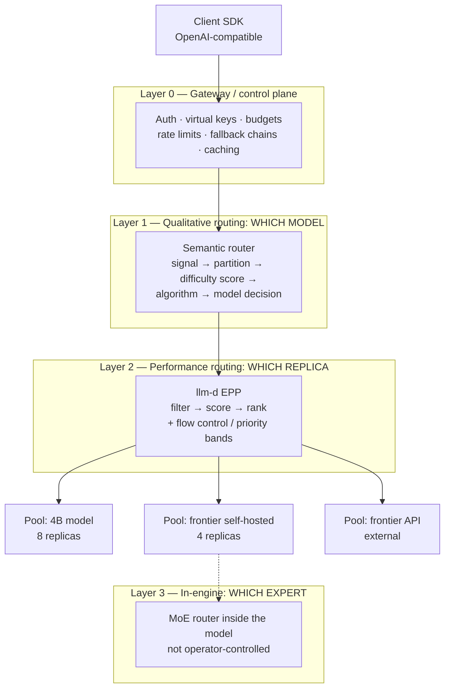

# Case Study: Routing and Gateways — Four Decisions, Not One

> **Topic:** `T14` · **Transcript coverage:** primary · **Difficulty:** L4
> **One line:** "Routing" is four independent decisions at four different layers — which model,
> which replica, which provider, which expert — and the single most common production failure is
> collapsing them into one component.

## Table of Contents

1. [The Scenario](#1-the-scenario)
2. [Requirements](#2-requirements)
3. [Architecture](#3-architecture)
4. [Component Deep Dive](#4-component-deep-dive)
5. [Decision Table](#5-decision-table)
6. [Edge Cases & Exceptions](#6-edge-cases--exceptions)
7. [Failure Modes & Mitigations](#7-failure-modes--mitigations)
8. [Capacity & Cost Model](#8-capacity--cost-model)
9. [Benchmarks & Measured Numbers](#9-benchmarks--measured-numbers)
10. [Operational Runbook](#10-operational-runbook)
11. [What Changes at 10x](#11-what-changes-at-10x)
12. [Interview Walkthrough](#12-interview-walkthrough)

---

## 1. The Scenario

**Aperture Freight** runs two assistants on one model platform:

- **"Dispatch"** — customer-facing. 40,000 sessions/day. "Where is my container?" "Can I change the
  delivery address?" "What's the customs status on booking 44921?" Median prompt 900 tokens, median
  output 120 tokens, and an answer quality bar that a 4B-class model clears comfortably on most
  traffic.
- **"Ops Analyst"** — internal. 300 sessions/day. Users ask the model to reconcile a rate
  discrepancy across three contract PDFs, or to reason about why a lane is unprofitable. Median
  prompt 60,000 tokens, median output 3,000 tokens, and a quality bar only a frontier reasoning
  model clears.

The platform lead has one routing component today: a round-robin Kubernetes Service in front of six
vLLM replicas of a frontier model, chosen by a string match on the model name in the request. It
works. It costs $410k/year, of which the arithmetic in §8 says roughly $180k is spent answering
questions a 4B model would have answered indistinguishably.

Three pressures arrive in one quarter:

1. **A rate-limit incident.** The frontier provider's API — used for the ~8% of Ops Analyst traffic
   that exceeds the self-hosted context window — throttled during a peak, and there was no fallback.
   The supporting guide reports the industry version of this: rate-limit and capacity errors are
   "the single largest production failure mode", roughly 5% of requests failing, with roughly 60% of
   those failures capacity-driven [R] (`11-infrastructure-and-mlops/03-ai-gateways-and-model-routing.md`,
   citing Datadog's 2026 State of AI Engineering).
2. **A cost review** asking why a frontier model answers "where is my container".
3. **A cache-miss review.** The three-turn Dispatch conversations recompute their prefix on every
   turn because round-robin sends each turn to a different replica.

These are three different problems. They need three different components in three different layers,
and the political constraint is that the platform team has **one engineer-quarter** to spend — so
they must be introduced in the order that produces the most value per unit of work.

---

## 2. Requirements

### Functional

| Requirement | Priority | Notes |
|---|---|---|
| Route by query difficulty across two model classes | P0 | The 4B/frontier split is the cost lever |
| Route to the replica holding the prefix | P0 | Multi-turn Dispatch conversations |
| Fall back across providers on 429/5xx | P0 | The incident |
| Per-team budget enforcement and spend attribution | P1 | The cost review |
| Serve data-residency-constrained traffic in-region only | P0 | Contractual: some freight customers require in-country processing |
| Preserve the OpenAI-compatible interface | P0 | Client SDKs must not change |

### Non-functional

| Requirement | Target | Rationale |
|---|---|---|
| Routing overhead added per request | < 5 ms for the model-choice decision; < 1 ms for replica placement | Against 500–2,000 ms model latency [R] |
| Cost reduction from difficulty routing | ≥ 40% of total spend without a measurable quality drop | The cost review |
| Prefix cache hit rate on Dispatch | > 70% of turns | From ~0% today |
| Fallback coverage | 100% of 429/5xx on the frontier API path | The incident |
| Routing-decision explainability | Every response carries the chosen model, the confidence, and the reason | Debuggability; the semantic router exposes "around 50 to 60 headers" [T] |
| Availability of the routing tier itself | ≥ 99.9%, and non-load-bearing until proven | The gateway is a new SPOF [R] |

### Constraints and non-goals

- **Non-goal: one router to do everything.** The transcripts are explicit that the qualitative and
  performance decisions belong to different components: "llm-d is not concerned with the difference
  in the qualitative performance of these models… it's a performance-oriented router and semantic
  routing… can perhaps help with picking the right model for the right task" [T] (Abhishek Singh,
  *NxtGen*).
- **Non-goal: routing at the MoE-expert level.** "MoE routing is not done at the level of llm-d. So
  it's more at the LM level" [T] (Pravin, *llm-d*).
- **Constraint: do not put an expensive model in the router seat.** See §4.1.
- **Constraint: the semantic router's classifier is fine-tuned and shipped by its maintainers** —
  "we are currently using a classifier model that is ambert 32 model [ASR; a ModernBERT-class
  encoder]. So we are on a regular basis fine-tune that model and publishing on the Hugging Face
  repositories" [T] (*Inside vLLM Semantic Router*). You inherit a model you did not train.

---

## 3. Architecture



The request path, numbered:

1. Client sends an OpenAI-shaped request. Nothing about the routing is visible to it.
2. **Layer 0** authenticates, checks the virtual key's budget, applies the rate limit, and — on a
   retryable failure later in the path — owns the fallback chain.
3. **Layer 1** inspects the *content*. It emits signals (is this code? is it long? is it a
   knowledge-lookup pattern?), partitions the signals by the routing configuration, scores
   difficulty, applies an algorithm, and picks a *model*. It writes its decision into response
   headers [T].
4. **Layer 2** receives a request already labelled with a model, and picks a *replica* of that model
   using a filter→score→rank pipeline over load and prefix-cache state [T].
5. Inside the engine, **Layer 3** — the MoE router — picks experts per token. This is not a
   routing layer anyone operates, and treating it as one is a category error.

The arrows that carry state are the interesting ones: Layer 2 depends on **KV events emitted per
request by every vLLM pod** — "for every request we get the KV events… we get events on when a KV
cache is created and also evicted" [T] (Pravin). If that event stream stops, Layer 2 silently
degrades into a load balancer.

---

## 4. Component Deep Dive

### 4.1 The four layers, and the mistake each one prevents

**Layer 0 — the gateway.** A control plane between applications and models exposing "one consistent
(almost always OpenAI-compatible) API and centralizing the cross-cutting concerns that would
otherwise be smeared across every service" [R]. Jobs: unified API, fallback chains, load balancing
across keys and regions, retries with backoff and jitter, rate-limit handling, virtual keys with
dollar budgets, spend attribution, observability, caching, guardrails. The mental model from the
guide is the one to keep: it "converts an `N providers × M concerns` glue problem in application
code into a single policy-enforced choke point" [R]. The cost is one extra network hop and a
component you must keep highly available.

**Layer 1 — qualitative routing: which model.** This is where difficulty-based routing lives. The
canonical production shape, from the LLMOps cost talk: "A small, cheap classifier looks at each
incoming query and decides whether it is easy or hard. The easy majority go to a small, fast model.
Only the genuinely hard queries reach the expensive one. Put a cache in front of the whole thing and
a timeout the graceful fallback behind it, and a routing tier alone often cuts total spend by half
with no drop in quality that users notice" [T] (*Cut LLM Cost, Latency…*). The same talk calls it
"the single highest leverage pattern most teams add" [T].

The vLLM semantic router is the mature open implementation, and its own maintainer's most important
correction is that it is **not** an if-else chain: "most of the people have the concern like it is
just a semantic router that helps to determine… some people think this is an if-else condition, like
this prompt is matching to the model description it will route, but no — there are multiple layers of
pipeline… signal, projection, algorithm, model" [T]. The pipeline [T]:

| Stage | Job |
|---|---|
| **Signal** | Detect properties of the prompt: "the signal determines… the prompt can be code, long prompt, and multiple signals" |
| **Partition** | Decide which signals are relevant given the routing configuration |
| **Score** | Produce a *difficulty score* |
| **Algorithm** | Apply a routing algorithm — the talk names confidence, rem, fusion and workflow loops, each published with its own before/after benchmark |
| **Model decision** | Commit to a model |

Two operational details matter more than the pipeline diagram. First, the **50–60 response
headers**: "we are providing suitable types of headers… responsible for providing which model it is
being chosen, what is the confidence of this… this can be used as a source of truth, like where did
your request go through, what were the consequences, what will happen if you choose this model or
not" [T]. For a system whose whole job is a decision, this observability surface *is* the product.
Second, the maintainer's honest admission about the tail: routing quality is configuration-driven,
and "if you are using the default state in the config and you find there's a gap between your X
state and Y state then you need to update your config, what kind of algorithm you can choose,
different kinds of plugins you can add; so this is kind of manual work you need to do at present"
[T]. Budget for that.

**Layer 2 — performance routing: which replica.** llm-d's EPP is "a single deployment that sits
between the vLLM pods and attaches to the gateway" [T] (Pravin). Its selection is a three-stage
pipeline with *composable* filters and scorers [T]:

| Stage | What it does | Example policies from the talk |
|---|---|---|
| **Filter** | Narrows the candidate set | Prefill filter (prefill nodes only); prefix-cache-identity filter; decode needs only an active-request scorer "because they pull the KV cache from the prefill" |
| **Score** | Ranks the survivors | Token-load scorer; active-request scorer; prefix-affinity |
| **Rank** | Picks one | "where to route based on the token load or the active request a particular instance is serving" |

Two variants of prefix awareness, and the difference is the point [T]: **precise** prefix routing is
driven by the per-request KV create/evict events, while **approximate** routing "doesn't go there,
which is mainly based on the hash, and that has all the consistency problems" [T]. The speaker notes
"for the precise we have significant improvements" [T] — a claim from a project contributor.

Then **flow control**, which is a separate job from selection: "the flow control mainly comes into
the picture when your cluster is saturated, and the saturation mechanism is decided by you" — the
examples given are "when the KV cache is 80% full I declare the cluster saturated, or the number of
active requests a particular cluster is seeing on average is more than eight" [T]. Once saturating,
the EPP queues, and the queue *policy* is the operator's choice. First-come-first-serve is described
as adding nothing and "just going to slow down everything"; **priority bands** — "a premium or a
best-effort where, under such saturation, only the premium traffic is dispatched and the rest are
not dispatched until you have capacity" — are the mechanism that protects "customer-facing or
interactive workloads" while "batch processing workloads can wait and then retry later" [T]. Later
slides add least-attained-service and turn-priority strategies, with a reported 2–3× effect [T].

**Layer 3 — the MoE router.** Expert selection per token, inside the model, not addressable by any
gateway. Included here only to name the boundary explicitly.

### 4.2 Rule-based routing: the 2025 pattern, and its one legitimate use

Singh's talk is the honest history: "in 2025 we started off with simple rule-based or regex-based
routing. I'm sure a lot of you have tried that out. If the query contains 'date', go to a date tool,
right? So that's a rule-based router" [T].

Rule-based routing is still correct for three things, and it is a mistake for everything else:

- **Deterministic capability dispatch.** "Query needs a calendar tool" is a fact, not a prediction.
  A regex is more reliable and 1000× cheaper than a classifier.
- **Hard compliance constraints.** "This tenant's traffic must not leave the region" is a policy, not
  a similarity score, and should never be probabilistic.
- **Cold-start bootstrapping.** Before you have labelled data, rules are the only thing that works.

### 4.3 The expensive-router anti-pattern

The single most quotable design error in this topic, stated plainly by Singh about his own past
work: "I've even built solutions wherein we've used very expensive mixture-of-expert models because
they're so smart and so capable, but they are expensive to run… I would still use them to do some
form of routing. So I would use the same Qwen 3… to decide which is the right model to address — but
that's not the right thing to do, because if you solve that problem efficiently you are going to
address the query significantly faster and you're going to meet that SLA" [T].

**Why it fails, arithmetically (mine):** if the router costs the same as the model it routes to, the
routing decision is pure added latency and added cost, with the only benefit being that *some*
requests reach a cheaper model. The saving must exceed the routing cost on every request,
including the ones the router sends to the expensive model. A router that costs 30% of the frontier
call and diverts 50% of traffic to a model 20× cheaper nets out only if the diversion rate is high;
at low diversion rates the router is a pure loss.

The supporting guide gives the overhead ladder that makes the same point quantitatively [R]:

| Strategy | Overhead | Note |
|---|---|---|
| Rule-based | < ~1 ms | "vendor/practitioner figures, order-of-magnitude only" |
| Embedding / semantic | ~5 ms | |
| Heavier ML classifier or LLM-as-router | ~50–100 ms | |
| *For comparison: model latency* | *500–2,000 ms* | |

A 5 ms encoder classifier against a 900-token Dispatch prompt whose prefill alone is tens of
milliseconds is a rounding error. A 90 ms LLM-as-router call is 10–18% of the total budget — worth
it only for the ambiguous tail, which is exactly what the guide recommends: a "two-stage hybrid that
handles the confident majority semantically and sends the ambiguous tail to an LLM-as-router" [R].

### 4.4 Fallback and reliability

The guide's treatment is the right level of detail, and its three rules are worth reproducing
because each one has a matching production incident [R]:

- **Retry only retryable failures** — 429 and 5xx, never 400-class, which "just waste quota".
- **Exponential backoff with jitter** — jitter specifically so clients "do not retry in lockstep and
  create a thundering herd that worsens the outage".
- **Honor `Retry-After`**, using `max(retry_after, computed_backoff)`. "Ignoring `Retry-After` is the
  most common backoff bug."

Plus circuit breakers "so you stop hammering a dead or throttled provider on every request", and
the structural fix that matters most: load balancing across multiple keys, regions and providers
"multiplies your effective rate-limit headroom, which is the most direct structural fix for capacity
failures" [R]. The caution: "blind retries amplify outages" — a gateway without backoff, jitter,
breakers and `Retry-After` handling makes rate limits worse, not better.

### 4.5 The tool landscape, and what it means for choosing

| Tool | Shape | Strong at | Weak at |
|---|---|---|---|
| **LiteLLM** | OSS, self-hosted proxy + SDK | 100+ providers behind one OpenAI-format API; latency/usage/cost/least-busy routing; ordered fallbacks; virtual keys with dollar budgets; native OTel | "YAML config strains at enterprise-governance scale" [R] |
| **OpenRouter** | Managed aggregator | Fastest breadth, 200+ models, zero ops, pass-through pricing | External hop; data leaves the perimeter |
| **Portkey** | Managed + self-host tier | Full control plane: routing, fallbacks, token-level observability, semantic caching, guardrails | Another dependency |
| **Cloudflare AI Gateway** | Managed, edge | Observability and caching; sequential provider fallback | "Lighter on routing logic and budget enforcement" [R] |
| **Kong AI Gateway** | API-management platform | LLM + semantic routing, retries, semantic caching, PII sanitizer | Best only if you already run Kong |
| **Envoy AI Gateway** | OSS, CNCF | "Infra-grade priority-based fallback, retries, timeouts, Kubernetes-native" [R] | Lower-level; you compose more |
| **Cloud-native** (Bedrock prompt routing, Vertex) | Managed | Tight integration with the cloud | Per-account rate limits still force a multi-provider layer |

The guide's warning applies to the whole table: "treat versions and exact feature claims as
point-in-time, and note that several comparison figures below come from vendor marketing" [R].

---

## 5. Decision Table

### 5.1 Where each routing decision lives

| Layer | Decision | Options | Pros | Cons | Exceptions — when it breaks | When to use |
|---|---|---|---|---|---|---|
| **0** | Which provider, and what happens on failure | In-app wrapper / self-hosted gateway / managed gateway | See §5.4 | See §5.4 | See §5.4 | Whenever you have >1 provider or >1 team |
| **1** | Which model (qualitative) | Rules / classifier / semantic router / LLM-as-router | Cheap rules are deterministic; classifiers are ~5 ms | Classifiers need periodic retraining; semantic router needs config tuning | Breaks when the difficulty distribution drifts and nobody re-fits the config — "this is kind of manual work you need to do at present" [T] | Any workload with a bimodal difficulty distribution |
| **2** | Which replica (performance) | Round robin / approximate hash / precise KV-event | Precise is accurate | Precise needs a working KV event stream | Breaks the moment KV events stop — silently degrades to a load balancer | Any multi-replica, multi-turn workload |
| **3** | Which expert | (not operator-controlled) | — | — | — | Never exposed; do not build a router here |

**Chosen:** all three operator-controllable layers, introduced in the order Layer 2 → Layer 1 →
Layer 0, for reasons of value-per-engineer-week (§8 Step 4).
**Revisit if:** the fleet collapses to one replica per model (Layer 2 has nothing to do) or to one
model total (Layer 1 has nothing to do).

### 5.2 The model-choice strategy

| Strategy | Decides by | Pros | Cons | Exceptions — when it breaks | When to use |
|---|---|---|---|---|---|
| **Static / manual** | Hard-coded model per route | ~0 ms; trivially debuggable | "Brittle; no adaptation to outages or price changes" [R] | Breaks on the second model | One model, one workload |
| **Task-based** | Task taxonomy | < 1 ms; explainable | "Misclassification; taxonomy goes stale" [R] | Breaks when a task spans two categories | A small, stable, known set of tasks |
| **Cost-based** | Cheapest model meeting constraints | Directly targets the bill | "Can starve quality; cheapest may rate-limit" [R] | Breaks on the query that needed the big model | Batch work with a hard quality floor |
| **Capability-based** | Required capability — long context, vision, tools | Correct by construction for hard constraints | Over-provisions to the "best" model | Use it for the *constraint*, never for preference | Routing on context-window or modality |
| **Semantic / classifier** | Embedding or encoder classification | ~5 ms; handles mixed difficulty | "Embedding drift; ambiguous tail; threshold tuning" [R] | Breaks when the tail is large or the domain shifts | The default for the easy majority |
| **LLM-as-router** | A small LLM classifies and picks | Handles the ambiguous tail | "Adds an LLM call with its own cost and failure surface" [R]; 50–100 ms | Breaks if the router model is expensive — see §4.3 | Only for the tail a classifier cannot resolve |
| **Cascade** | Cheap model first, escalate on low confidence | "The highest-leverage cost play" [R] | "Double-spend on escalated queries; noisy confidence" [R] | Breaks when escalation rate is high — "a cascade that escalates most traffic saves little" [R] | When escalation is genuinely rare and confidence is calibrated |
| **Rule-based / regex** | Pattern match | ~0 ms; deterministic; auditable | Brittle; no generalisation | Breaks on any phrasing you did not anticipate | Hard policy constraints and deterministic capability dispatch only |

**Chosen:** a two-stage hybrid — an encoder classifier for the confident majority, escalating the
ambiguous tail to a small LLM router, with regex reserved for the two compliance rules that must
never be probabilistic.
**Revisit if:** the ambiguous-tail fraction exceeds ~20%, at which point the LLM router's 50–100 ms
is no longer a tail cost but a mainstream one, and the classifier needs retraining instead.

### 5.3 Performance routing: replica selection

| Option | Pros | Cons | Exceptions — when it breaks | When to use |
|---|---|---|---|---|
| **Round robin / Service** | Zero infrastructure | Prefix recomputed per turn; "cache hit rate will be… atrocious" [T] (Singh) | Breaks exactly when multi-turn traffic dominates | Single replica; genuinely stateless short prompts |
| **Approximate prefix (hash)** | No event stream needed; simple | "All the consistency problems" [T] (Pravin) | Breaks whenever replica membership changes — hashes move | When replicas are static and the engine cannot emit KV events |
| **Precise prefix (KV events)** | Per-request accuracy on where the cache is; "significant improvements" [T] | Requires every pod to emit create/evict events; the router becomes a stateful consumer | Breaks silently when the event stream stops | Multi-replica, multi-turn, prefix-heavy traffic |
| **Least-attained service** | Fairness under mixed request sizes; reported 2–3× effect [T] | Needs per-request progress tracking | Breaks if request-size distribution is wildly heavy-tailed and you need strict FIFO | Mixed-size traffic where tail latency matters |
| **Turn priority** | Protects interactive turns from batch turns within one session | Complexity; needs a notion of "turn" | Breaks when the session abstraction is absent | Agent sessions with interleaved interactive and background turns |

**Chosen:** precise prefix routing with least-attained service for the Dispatch pool, plus priority
bands for saturation. The prefix win is the one the incident review already predicts.
**Revisit if:** the KV event stream proves unreliable in production, at which point approximate
routing plus sticky sessions is the honest fallback — and you should know that in advance.

### 5.4 The gateway itself

| Option | Pros | Cons | Exceptions — when it breaks | When to use |
|---|---|---|---|---|
| **Thin in-app abstraction** | No new hop, no new SPOF; fits in your head | No cross-team budgets or attribution; glue gets copy-pasted | Breaks at the second team | 1–2 providers; a prototype [R] |
| **Self-host LiteLLM** | Data in perimeter; full control; required for strict compliance | "*You* must make the proxy highly available or it becomes the single point of failure" [R] | Breaks under enterprise governance scale — YAML strain [R] | Data-residency and control requirements with platform-team bandwidth |
| **Managed gateway** (OpenRouter, Portkey, Cloudflare) | Near-zero ops; fast | "Data transits a third party and you inherit their availability as a hard dependency" [R] | Fails the residency requirement outright | Fast adoption with no residency constraint |
| **Envoy AI Gateway** | Infra-grade fallback/retries/timeouts; Kubernetes-native | Lower-level; you compose the policy | — | Already running Envoy/Kubernetes |

**Chosen:** self-hosted LiteLLM, because Aperture Freight has a contractual residency constraint that
disqualifies every managed option outright — a constraint that decides the question before any
feature comparison begins.
**Revisit if:** the residency requirement is lifted for some tenants, at which point a managed
gateway for those tenants removes an HA burden.

### 5.5 Overload policy

| Option | Pros | Cons | Exceptions — when it breaks | When to use |
|---|---|---|---|---|
| **First-come-first-serve queue** | Trivial; fair in a narrow sense | "It's going to slow down everything… that doesn't add anything extra to your policies" [T] (Pravin) | Breaks under sustained overload — the queue never drains | Brief, rare bursts |
| **Priority bands** | Protects interactive traffic; batch waits and retries [T] | Requires a classification of every request into a band | Breaks if everything is labelled premium | Mixed interactive and batch traffic |
| **Shed / reject with 429** | Protects the served population | Callers must handle 429 | Breaks client SLAs if shedding is indiscriminate | Hard capacity ceiling with well-behaved clients |
| **Degrade to a smaller model** | Keeps serving; latency stays bounded | Quality silently drops; must be visible | Breaks trust if invisible — the caller must be told | When a slightly worse answer beats no answer |
| **Elastic scale-out** | No degradation | "autoscaling when it comes to models is a little touchy subject … for you to autoscale you need to have available GPU capacity" [T] | Breaks when GPU capacity is not actually available | When the fleet can genuinely grow |

**Chosen:** priority bands first (cheap, immediate), then elastic scale-out, with explicit 429
shedding only for the non-interactive batch band.
**Revisit if:** the batch band becomes a revenue-bearing product, at which point shedding needs a
negotiated SLA rather than an implicit one.

### 5.6 Fallback chain shape

| Option | Pros | Cons | Exceptions — when it breaks | When to use |
|---|---|---|---|---|
| **Retry same endpoint** | Simplest | Amplifies the outage — "blind retries deepen the outage" [R] | Breaks under provider-wide throttle | Transient single-request blips only |
| **Ordered cross-provider chain** | Structural fix for capacity failures [R] | Cross-provider output differences; cost variance | Breaks if the two providers are the *same* upstream | The default for any frontier API dependence |
| **Multi-key / multi-region LB** | "Multiplies your effective rate-limit headroom" [R] | Key sprawl; per-key quota management | Breaks when the quota is account-wide | Same provider, quota-limited |
| **Self-host as the fallback** | No third party; predictable | You must have the capacity idle | Breaks expensively if the capacity is not there | When the self-hosted pool already exists |

**Chosen:** ordered chain across two external providers plus the self-hosted pool as the final hop,
with circuit breakers and `Retry-After` honoured. Explicitly **not** `max_retries > 2` on the
primary.
**Revisit if:** cross-provider output divergence shows up in user-visible ways, at which point
fallback must be paired with a quality check on the fallback path.

---

## 6. Edge Cases & Exceptions

- **A three-word prompt with a huge consequence.** "Should we reroute the Rotterdam booking?" is
  lexically trivial and semantically hard. Encoder classifiers score on surface features; this is
  the canonical case where the difficulty score is wrong. Mitigation: a low-confidence band that
  escalates regardless of predicted difficulty.
- **Classifier drift.** The semantic router's maintainers "fine-tune that model and publish on the
  Hugging Face repositories" [T] — but that model was trained on *their* data. Your distribution
  will drift away from it. Re-fit on your traffic, or accept a decay you cannot see.
- **The router cannot see the conversation.** Difficulty often lives in turn 4, not turn 1. A router
  that inspects only the last message mis-routes every multi-turn escalation. Either route on a
  truncated conversation window or accept per-turn re-decisions.
- **Residency is a hard constraint in a soft layer.** If the region policy is implemented as a
  *score* rather than a *filter*, a borderline case will eventually send regulated data abroad.
  Policy constraints belong in a filter that runs before any scoring.
- **Approximate prefix + replica churn.** Hash-based routing is stable only while the replica set is
  stable. A rolling deploy reshuffles every hash. Precise KV events re-converge; hashes do not.
- **KV event loss during a router restart.** The router's world view is rebuilt from events; a
  restart mid-stream leaves gaps. Warm the state, or start pessimistic (route to load) until the
  event stream refills.
- **A cascade that escalates everything.** "The escalation rate is the live cost variable" [R]. If
  the confidence signal is poorly calibrated, the cascade pays for the cheap model *and* the
  expensive one on most traffic — strictly worse than routing statically.
- **The gateway as a new SPOF.** "A gateway that centralizes everything but runs as one instance has
  simply *moved* your single point of failure" [R]. This is the most common way a reliability
  improvement makes things worse.
- **Retry storms across layers.** Gateway retries × SDK retries × client retries multiplies. Count
  the retry layers explicitly and disable all but one.
- **Cost-based routing starvation.** "The cheapest may rate-limit" [R] — the cost-optimal route is
  often the most contended. Cost routing needs a health gate, not just a price table.
- **Two tenants, one classifier.** A classifier trained on the aggregate mis-serves any tenant whose
  difficulty distribution differs. Per-tenant thresholds, or the 4B-model tenant gets frontier
  answers forever.
- **The `Retry-After` header on a streamed response.** Once tokens are streaming, you cannot fail
  over. Decide the failover boundary *before* the first token; after it, the only honest option is
  to terminate and let the client retry.

---

## 7. Failure Modes & Mitigations

| Failure | Symptom | Detection | Blast radius | Mitigation | Recovery |
|---|---|---|---|---|---|
| Router (EPP) down | Requests fail or degrade to naive routing | Router health; success rate | Entire fleet | Redundant router; gateway fallback route; non-load-bearing until proven | Restart; fail over |
| KV event stream stops | Cache hit rate falls; cost rises, latency flat | KV event rate vs request rate | Cost, then latency | Alert on event rate = 0 | Restart the event path |
| Classifier mis-routes systematically | Frontier spend rises with no quality change | Chosen-model distribution vs expected | Spend only (silent) | Monitor the model-choice distribution as a first-class metric | Re-tune config or re-fit the classifier |
| LLM-as-router in the hot path | p50 latency up 50–100 ms across all traffic | Routing-time metric per layer | Perceived latency | Restrict the LLM router to the ambiguous tail | Revert to classifier-only |
| Gateway SPOF | Total outage | Gateway health | Everything | ≥3 replicas, externalized state (Redis for counters, DB for keys) [R] | Fail over; scale replicas |
| Blind retry storm | Load spike during a provider slowdown | Retry rate vs request rate | Worsens the original outage | Backoff + jitter + circuit breaker + `Retry-After` [R] | Disable retries; shed |
| Fallback provider divergence | Users see different answer style mid-session | Output-diff sampling per provider | Trust | Quality check on the fallback path; session-sticky provider choice | Pin the session to one provider |
| Priority band mislabelling | Batch traffic starves interactive | Band composition; premium queue depth | Interactive SLAs | Validate the band assignment at the edge, not in the router | Reclassify at the source |
| Budget cap blocks production traffic | 402/403s on a working key | Budget-exhaustion events | One team | Budget alerts at 70/90%; hard cap only on non-production keys | Raise the cap; re-attribute |
| Residency rule bypassed | Regulated data served from the wrong region | Per-response region header audit | Contractual | Region as a *filter*, never a score; audit headers | Fail the request; disclose |

---

## 8. Capacity & Cost Model

*All arithmetic is mine; inputs attributed. Prices illustrative.*

### Assumptions

| Input | Value | Source |
|---|---|---|
| Dispatch sessions/day | 40,000 | Scenario |
| Dispatch turns per session | 2.5 | Scenario |
| Dispatch prompt / output | 900 / 120 tokens | Scenario |
| Ops sessions/day | 300 | Scenario |
| Ops prompt / output | 60,000 / 3,000 tokens | Scenario |
| Easy fraction of Dispatch traffic | 90% | Assumed, to be measured |
| 4B vs frontier cost per token | ~20× cheaper (order of magnitude) | [D], consistent with the 100→42→26→11 ladder in the cost talk [T] |
| Routing tier's effect | "often cuts total spend by half with no drop in quality that users notice" [T] | *Cut LLM Cost…* |
| Cache read vs fresh token | "roughly 10 times cheaper" [T] | *Cut LLM Cost…* |
| llm-d crossover | ~2× throughput at ~85 QPS | Singh [T] |

### Step 1 — Where the tokens go

```
Dispatch tokens/day  = 40,000 × 2.5 × (900 in + 120 out) = 102.0M tokens/day
Ops tokens/day       =    300 × 1  × (60,000 + 3,000)   =  18.9M tokens/day
Total                = 120.9M tokens/day
```

Dispatch is **84% of token volume** but only **31% of prompt-compute-weighted volume** in
cost terms once the 20× price difference is applied to the Ops prompts — which is exactly why the
naive "route the small stuff to the small model" instinct under-delivers unless it covers Dispatch
broadly.

### Step 2 — What difficulty routing is worth

If 90% of Dispatch traffic is genuinely easy and routes to a model ~20× cheaper:

```
Dispatch cost index, before = 102.0M tokens at frontier price  = 102.0
Dispatch cost index, after  = 102.0 × (0.9/20 + 0.1)           = 102.0 × 0.145 = 14.8
Dispatch saving             = 85.5% of Dispatch cost
Dispatch share of total     ≈ 102.0 / (102.0 + 18.9×20) ≈ 21%
Blended saving              ≈ 0.855 × 0.21 ≈ 18% of total spend
```

That is a *real* saving but far short of the "half your spend" the talk reports, and the reason is
instructive: **the frontier-priced Ops traffic dominates cost despite being 16% of tokens.** The
talk's "half" figure presumes a traffic mix without a heavy frontier-priced tail. Mine, and worth
saying out loud: difficulty routing's value is bounded by the *cheap model's share of the priced
mix*, not by the share of requests.

### Step 3 — What prefix routing is worth

Dispatch turns 2.5 per session, so 60% of turns are continuations that currently recompute their
prefix (round robin = ~0% hit rate). With precise prefix routing at ~70% hit rate on those turns,
and cache reads ~10× cheaper:

```
Continuation turns                    = 60% of 100,000 turns/day = 60,000
Turns now hitting cache               = 60,000 × 0.70 = 42,000
Tokens served from cache per turn     = ~900 input tokens
Tokens moved from fresh to cached     = 42,000 × 900 = 37.8M tokens/day
Effective token reduction             = 37.8M × (1 − 1/10) = 34.0M effective tokens/day
As a fraction of Dispatch prompt tokens = 34.0 / 81.0 ≈ 42%
```

Combined with Step 2, the two levers act on different axes — routing reduces the *price per token*,
prefix reuse reduces the *number of tokens* — so they multiply rather than add.

### Step 4 — Value per engineer-week, to set the order

| Work item | Effort | Annual saving (est.) | Value/week |
|---|---|---|---|
| Layer 2: precise prefix routing | 3 weeks | ~$95k from cache reuse | **~$32k/week** |
| Layer 1: difficulty classifier | 4 weeks | ~$74k from model substitution | ~$18k/week |
| Layer 0: gateway + fallback | 3 weeks | Avoided outage + budget control | ~$10k/week (risk-adjusted) |
| Layer 3 | — | n/a | — |

**Mine.** This ordering is the entire answer to §1's political constraint: the platform team does
prefix routing first, because it is both the largest and the cheapest win, and it was discovered as
an *incident*, not a project.

### Step 5 — Break-even and sensitivity

| Scale | Routing tier verdict |
|---|---|
| 0.1× (4,000 sessions/day) | Overhead exceeds saving; use static routing and a thin in-app wrapper |
| 1× (40,000 sessions/day) | All three layers justified; ~$180k/year addressable |
| 10× (400,000 sessions/day) | Routing tier is load-bearing infrastructure; per-tenant classifiers required |

**Break-even on the classifier (mine):** a 4-week build at a fully-loaded $8k/week is $32k. The
saving in Step 2 is ~$74k/year. Break-even at **~5.2 months**. Below roughly 15,000 sessions/day the
same build does not pay back within a year.

---

## 9. Benchmarks & Measured Numbers

| Metric | Value | Source | Conditions |
|---|---|---|---|
| Companies running 3+ models in production | 69% | [R] guide, citing Datadog *State of AI Engineering 2026* | Survey |
| Requests failing in production | ~5%, of which ~60% capacity-driven | [R] guide, citing Datadog | Survey |
| Rule-based routing overhead | < ~1 ms | [R] guide | "vendor/practitioner figures, order-of-magnitude only" |
| Embedding / semantic routing overhead | ~5 ms | [R] guide | Same caveat |
| ML classifier / LLM-as-router overhead | ~50–100 ms | [R] guide | Same caveat |
| Typical model latency (for contrast) | 500–2,000 ms | [R] guide | Same caveat |
| RouteLLM quality / cost | ~95% of frontier quality at 45–85% cost reduction | [R] guide, citing RouteLLM (UC Berkeley/LMSYS, ICLR 2025) | **Benchmark-specific ceiling, not a guarantee** |
| Semantic router response headers | "around 50 to 60" | [T] *Inside vLLM Semantic Router* | Current state of the project |
| Semantic router classifier | "ambert 32" (ASR; ModernBERT-class encoder), fine-tuned and re-published regularly | [T] | Maintainer's description |
| Semantic router P50 routing latency | "40% of P50 routing latency we identify" [sic] | [T] | Self-reported; the sentence is ambiguous in the transcript — treat the exact meaning as unverified |
| Semantic router vs GPT-5.5, live coding bench (2025) | 92.66 vs 96.0 | [T] | **Project's own benchmark**, "a bit outdated" per the speaker, on the project's own datasets |
| Routing tier effect on total spend | "often cuts total spend by half" | [T] *Cut LLM Cost…* | No quality degradation "that users notice" |
| Cache reads vs fresh tokens | "roughly 10 times cheaper" | [T] *Cut LLM Cost…* | |
| llm-d crossover | ~2× throughput at ~85 QPS; ₹10 lakh → ₹5 lakh/month | [T] Singh | Vendor-affiliated study, 200 users |
| llm-d least-attained service / turn priority | 2–3× | [T] Pravin | Contributor claim |
| llm-d saturation example thresholds | KV 80% full; mean active requests > 8 | [T] Pravin | **Examples the operator sets**, not defaults |

**Not measured in this corpus:** any head-to-head of a semantic router against a naive baseline on
traffic resembling Aperture Freight's, and any measurement of classifier drift over time. Do not
assert these.

---

## 10. Operational Runbook

**Deploy — in this order, and only in this order.**
1. **Observe.** Add model-choice, cache-hit and routing-time telemetry to the *existing* round-robin
   setup. You cannot order the work without the numbers in §8.
2. **Layer 2** — llm-d, or any precise-prefix router. Verify the KV event rate equals the request
   rate before trusting it.
3. **Layer 1** — the classifier, in shadow mode first: log the decision it *would* have made
   without acting on it. Compare against the actual cost and quality for two weeks.
4. **Layer 0** — gateway in observe mode, then budgets (attribution before enforcement), then
   fallback chains.

**Tune — in this order.**
1. **Saturation thresholds** — operator-defined [T]; set them from measured goodput, not from a
   blog post.
2. **Difficulty threshold** — the single knob that trades cost against quality. Move it in small
   steps and re-run evals each time.
3. **Priority bands** — decide who waits.
4. **Cache TTL and eviction** — interacts with routing: a very short TTL makes prefix routing
   pointless.
5. **Retry policy** — last, and conservatively.

**Monitor.** The routing distribution is the primary dashboard: which model was chosen, at what
confidence, for which tenant, and what it cost. Then routing overhead p50/p99 per layer; cache hit
rate by pool; KV event rate; fallback activations by reason; 429 rate by provider and key; and
band-specific queue depth.

**Incident — top 5.**

| Symptom | Likely cause | First action |
|---|---|---|
| Cost up, latency flat, quality flat | Classifier drifted toward the frontier model | Check the model-choice distribution, not the latency |
| Latency up ~50–100 ms across the board | LLM-as-router promoted out of the tail | Check the per-layer routing-time metric |
| Cache hit rate collapsed | KV events stopped, or replicas were replaced | KV event rate vs request rate |
| Total outage | Gateway or router SPOF | Confirm replicas; check the gateway's externalized state |
| Provider throttling again | Fallback chain missing a hop, or `Retry-After` ignored | Inspect the fallback trace; verify the header handling |

---

## 11. What Changes at 10x

- **Per-tenant routing replaces global routing.** At 10× a single classifier serves tenants whose
  difficulty distributions differ materially; one threshold is guaranteed to be wrong for someone.
  Routing configuration becomes a per-tenant artifact.
- **The routing tier becomes the most critical service you run.** It is now in the path of every
  request, with its own SLO, its own on-call, and its own capacity model. Plan for it explicitly.
- **Routing decisions become contractual.** Once a customer is promised a model class or a region,
  the router is enforcing an SLA, not optimising a bill. That changes the required auditability from
  "nice headers" to "immutable decision log".
- **The ambiguous tail is where the engineering goes.** At 10× the confident majority is solved, and
  all remaining value and all remaining risk live in the tail — which is where LLM-as-router earns
  its cost.
- **What survives:** the four-layer separation, filter-before-score for hard policy, the
  observe-before-enforce rollout, and the rule "the router must be much cheaper than what it routes
  to". These are architectural.
- **What inverts:** the value of caching and prefix routing *falls* relative to routing once
  sessions become short — and rises once they become long. Watch the session-length distribution,
  because it drives the ordering in §8.

---

## 12. Interview Walkthrough

**Whiteboard order:**
1. Draw **four boxes** left to right and label them by the *question* each answers: which provider /
   which model / which replica / which expert. Do this before naming a single product.
2. Name the products per box, and say explicitly that the last box is not yours to control.
3. Draw the KV-event arrow from the engine back to the replica router. Say what happens when it
   stops.
4. Then the decision tables, in leverage order.
5. Then the failure modes, starting with "the gateway is now a SPOF".

**Two numbers to say out loud:**
- **~5 ms** for an embedding/classifier routing decision against **500–2,000 ms** of model latency
  [R] — the reason routing is affordable.
- **"A routing tier alone often cuts total spend by half"** [T], qualified immediately by your own
  arithmetic showing the saving is bounded by the cheap model's share of the *priced* mix, not the
  share of requests.

**Volunteer before you are asked:** that the "half the spend" figure is a claim for a traffic mix
without a heavy frontier-priced tail; that the semantic router's benchmark is the project's own; and
that the routing tier is itself a new single point of failure. Naming the SPOF you are creating is
the strongest engineering signal in this topic.

**Follow-ups.**

1. *Why not one router for everything?* Because the qualitative and performance decisions need
   different inputs — content versus load and cache state — and the projects say so explicitly:
   llm-d "is a performance-oriented router" and is "not concerned with the difference in the
   qualitative performance of these models" [T]. — tests layering.
2. *Is an LLM-as-router a good idea?* Only for the ambiguous tail. At 50–100 ms it is 10–18% of a
   900 ms budget, and if the router model is expensive you have reinvented the anti-pattern Singh
   describes [T]. — tests whether you have the arithmetic.
3. *What breaks prefix routing?* Replica churn under approximate hashing, and a dead KV event stream
   under precise routing. Both are silent. — tests operational realism.
4. *Where do compliance constraints belong?* In a filter, never a score. A probabilistic region
   policy will eventually send regulated data abroad. — tests judgement about hard constraints.
5. *Your gateway is down. What happens?* If you cannot answer instantly, you built a SPOF. The fix
   is replicas plus externalized state, decided before it is load-bearing. — tests whether you build
   reliability into the reliability component.
6. *When is a gateway overkill?* Single provider, prototype, or a wrapper that fits in your head —
   use a thin in-app abstraction [R]. — tests whether you can say no to infrastructure.
7. *How do you decide the saturation threshold?* From measured goodput, not from a default. The
   llm-d examples (KV 80%, >8 active requests) are illustrations of the *kind* of rule, and the
   speaker is explicit that the threshold is the operator's. — tests whether you distinguish an
   example from a default.
8. *A customer complains the assistant got dumber last Tuesday. Debug order?* Model-choice
   distribution first (silent mis-routing), then cache hit rate, then provider fallback activation,
   then the model itself. Routing failures present as quality complaints. — tests diagnosis.

---

## Sources

Transcripts (`refs/`):
- `vLLM_Inference_Meetup_Bengaluru_2026_transcripts/Scaling_Agentic_AI_Distributed_Inference_with_llm-d.txt`
  — Pravin (IBM Research). Filter→score→rank, precise vs approximate prefix routing, per-request KV
  events, operator-defined saturation thresholds, the FCFS-is-useless critique, priority bands,
  least-attained service and turn priority, "MoE routing is not done at the level of llm-d",
  the ~70% agentic-traffic and prefill≈98% framing.
- `vLLM_Inference_Meetup_Bengaluru_2026_transcripts/Inside_vLLM_Semantic_Router.txt` — the
  signal→partition→score→algorithm→model-decision pipeline, 50–60 response headers, the "ambert 32"
  classifier, the 92.66 vs 96.0 benchmark, the manual-configuration admission, enterprise guards
  (input filtering, semantic classification, policy routing), and the gateway→semantic-router→llm-d→
  vLLM lifecycle.
- `vLLM_Inference_Meetup_Bengaluru_2026_transcripts/Scaling_AI_Inference_at_NxtGen_Indias_Best_Sovereign_Cloud_AI_Powerhouse.txt`
  — Abhishek Singh. The two-model-class example, "llm-d is not concerned with the qualitative
  performance", the 2025 regex-routing history, the expensive-MoE-as-router anti-pattern, the ~85 QPS
  crossover and the ₹10 lakh → ₹5 lakh/month claim.
- `LLMOps_Agentic_AIOps_The_Hands-On_Playlist_2026_transcripts/Cut_LLM_Cost_Latency_KV_Cache_Batching_Quantization_vLLM.txt`
  — difficulty-based routing as "the single highest leverage pattern most teams add", the ~50%
  spend reduction claim, cache reads ~10× cheaper, "optimization without measurement is just
  guessing".

Supporting repositories (`refs/`):
- `ai-system-design-guide-main/ai-system-design-guide-main/11-infrastructure-and-mlops/03-ai-gateways-and-model-routing.md`
  — the gateway job table, the routing-strategy ladder with overhead figures, fallback/retry/
  circuit-breaker rules, the 2026 tool landscape, architecture patterns, and the "do you need a
  gateway yet" decision. The Datadog 2026 and RouteLLM figures are cited from this file.
- `ai-system-design-guide-main/ai-system-design-guide-main/04-inference-optimization/06-serving-infrastructure.md`
  — inference gateway components (auth/rate limiting, model router, context tracker/sticky sessions,
  output filter) and the engine-per-workload posture.
- `llm-inference-engineering-main/llm-inference-engineering-main/README.md` — the LLM-routing blog
  outline (routing as a discipline distinct from serving).

**ASR corrections applied:** "VLM semantic router" → *vLLM semantic router*; "LMD"/"LLMD" → *llm-d*;
"LightLLM" → *LiteLLM*; "ambert 32" → a ModernBERT-class encoder classifier (name uncertain, treated
as approximate); "quen 3.8"/"Quen 3.8" → *Qwen 3.x*; "BLM" → *vLLM*.
