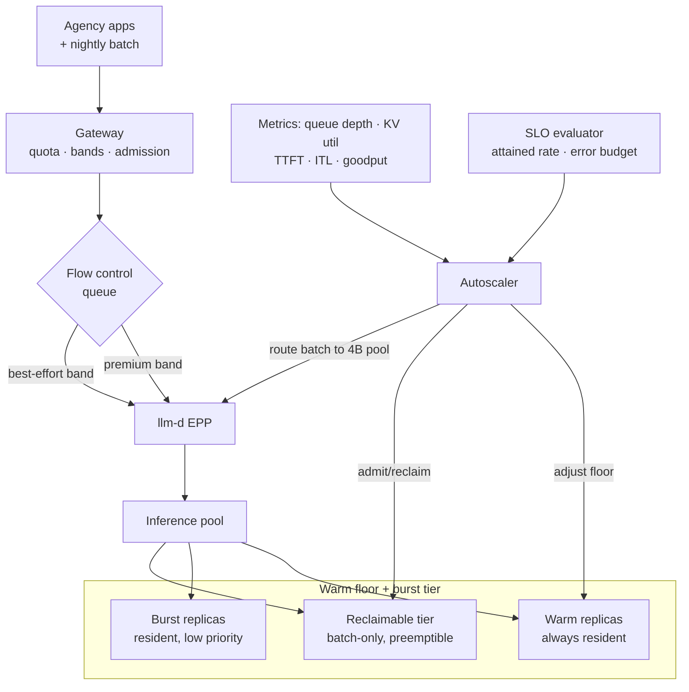

# Case Study: Autoscaling and SLOs for a Contracted Inference Fleet

> **Topic:** `T15` · **Transcript coverage:** primary · **Difficulty:** L4
> **One line:** There is no autoscaler that can create a GPU that does not exist — so the design
> problem is not elasticity, it is turning a contracted sustained rate and a bursty demand curve
> into a warm floor, a queue, and a degradation ladder that you can defend in a contract review.

## Table of Contents

1. [The Scenario](#1-the-scenario)
2. [Requirements](#2-requirements)
3. [Architecture](#3-architecture)
4. [Component Deep Dive](#4-component-deep-dive)
5. [Decision Table](#5-decision-table)
6. [Edge Cases & Exceptions](#6-edge-cases--exceptions)
7. [Failure Modes & Mitigations](#7-failure-modes--mitigations)
8. [Capacity & Cost Model](#8-capacity--cost-model)
9. [Benchmarks & Measured Numbers](#9-benchmarks--measured-numbers)
10. [Operational Runbook](#10-operational-runbook)
11. [What Changes at 10x](#11-what-changes-at-10x)
12. [Interview Walkthrough](#12-interview-walkthrough)

---

## 1. The Scenario

**Kestrel Public Services** operates a shared inference platform for fourteen municipal agencies
under a sovereign-cloud contract. The contract has two clauses that decide the entire architecture:

- **A rated sustained rate.** Each agency's deployment is "rated for 16 requests per second
  sustained" — the phrasing Abhishek Singh uses for a real government/enterprise commitment: "If
  I'm committing that I'm going to use half an NVIDIA H100 or half an AMD MI325X to run maybe a Qwen
  3.6 and I'm telling the customer, look, this deployment is rated for 16 requests per second
  sustained. I need to make sure that it does that day in day out, otherwise I breach the SLA" [T]
  (*NxtGen*).
- **A whole-pipeline obligation.** The platform is one component of a document-intelligence pipeline
  that must process **256 pages per second** end to end. Singh's framing is the constraint that makes
  this a systems problem rather than a serving problem: "your application server needs to handle that
  256 requests per second, it would mean you need to write into your databases at 256 requests per
  second and inference will need to happen at 256 requests per second. So your network bandwidth
  needs to support 256 requests per second" [T].

Demand is not flat. Business-hours traffic runs at about 55 req/s aggregate; a nightly batch
re-indexing job pushes to ~140 req/s for 40 minutes; and a public-records request that hits the news
creates a genuinely unforecastable spike. The platform team's existing autoscaler is a Kubernetes
HPA on CPU utilisation, and it has never once scaled meaningfully — which is expected, and is the
subject of §4.1.

The organisational constraint is the sharpest one: **the GPUs are procured annually**, on a capital
cycle, in a sovereign datacentre. There is no cloud region to burst into.

---

## 2. Requirements

### Functional

| Requirement | Priority | Notes |
|---|---|---|
| Serve 14 agencies with per-agency quota and attribution | P0 | Contractual |
| Hold a rated sustained rate per deployment | P0 | Breach = SLA credit |
| Absorb a nightly 2.5× batch surge without violating interactive SLOs | P0 | The batch job is revenue-bearing too |
| Degrade predictably under overload rather than fail | P0 | Contract clause on "graceful degradation" |
| Scale *something* within 60 seconds of a demand step | P1 | Not necessarily GPU count — see §5.3 |

### Non-functional

| Requirement | Target | Rationale |
|---|---|---|
| TTFT p95, interactive agencies | < 800 ms | Contracted |
| ITL p95, interactive agencies | < 60 ms | Contracted |
| Batch-band completion | ≤ 4 hours for the nightly window | Business requirement, not latency |
| Sustained-rate attainment | 100% of rated hours, measured weekly | The contract's actual metric |
| Utilisation of the procured fleet | ≥ 55% average | Procurement justification |
| Cold-start time for a new replica | ≤ 20 s | The floor the corpus reports [R] |
| Overload behaviour | Shed batch before interactive, always | Contract clause |

### Constraints and non-goals

- **Non-goal: elastic GPU capacity.** "For you to autoscale you need to have available GPU capacity,
  which is again very expensive" [T] (Singh). In a sovereign datacentre with annual procurement,
  there *is* no spare pool. The autoscaler's job is therefore **reallocation**, not acquisition.
- **Non-goal: scale to zero.** See §5.2.
- **Constraint: inference must scale at the same rate as everything else.** "You need to ensure that
  your inference scales at the same rate as your applications, scales at the same rate as your
  databases" [T] (Singh). An inference fleet sized independently of its pipeline is sized wrong.
- **Constraint: the model is not the only thing that needs capacity.** Routing, gateway, storage and
  network are all in the rated path [T] (Singh).

---

## 3. Architecture



Four things scale here, and only one of them is a replica count:

1. **The warm floor** — always-resident replicas, sized for the *rate of demand change*, not for
   average demand.
2. **The burst tier** — replicas that exist but are deprioritised; they cost money and buy headroom.
3. **The reclaimable tier** — batch-only, preemptible by interactive traffic.
4. **The work itself** — routing, quantisation, batching and prefix reuse change how much work each
   GPU can absorb. This is the highest-leverage axis and the one teams skip.

The SLO evaluator is a first-class component, not a dashboard: it computes *attained* rate and error
budget continuously, because the contract's unit is not latency, it is a rate sustained over time.

---

## 4. Component Deep Dive

### 4.1 Why the CPU-based HPA never fires

A vLLM replica with a saturated KV cache and a full batch is often at **moderate CPU** — the work is
on the GPU, and the prefill kernels are launched asynchronously. CPU utilisation therefore tracks
tokenisation and request handling, not load. Autoscaling on it will either never fire or fire late
and erratically.

The supporting guide states the rule and then contradicts it in its own example. The rule:
"**Autoscaling**: Scaling based on **KV Cache utilization** rather than CPU or standard memory
usage" [R] (`04-inference-optimization/06-serving-infrastructure.md`). The contradiction: the same
corpus's infrastructure chapter ships an HPA manifest whose metric list is "type: Resource, name:
cpu, target Utilisation 70" followed by a `requests_per_second` Pods metric [R]
(`11-infrastructure-and-mlops/01-llm-infrastructure.md`). **Copy the manifest and you have built the
anti-pattern the guide warns against.** This is worth saying out loud in any design review, because
the wrong config is the one that is easiest to find.

The right signals, in order of usefulness:

| Signal | What it measures | Why it works | Why it fails |
|---|---|---|---|
| **Queue depth / waiting requests** | Unmet demand directly | The only signal that is causal about *user harm* | Needs a queue to exist; a router that sheds gives no signal |
| **KV cache utilisation** | Memory pressure, hence how close to eviction and preemption | Direct, cheap, per-pod [R] | Saturates before throughput does; at 100% it stops discriminating |
| **Goodput / attained tokens per second** | Useful output under SLO | The metric that actually matters | Needs an SLO definition per band |
| **TTFT / ITL percentile** | User-perceived quality | Catches degradation before saturation | Noisy; a single slow request can trip it |
| **Requests per second** | Arrival rate | Simple | Ignores request size — 1 req/s of 60k-token prompts is heavier than 100 req/s of 200-token prompts |
| **CPU utilisation** | Nothing useful here | — | Wrong resource |

### 4.2 The cold-start floor, and why it sets the warm floor

The corpus gives one concrete number for how fast a GPU replica can be brought up: "**Cold Booting**:
Using **Un-quantized Base Images** and loading weights from a high-speed Lustre/mount to reduce
startup time from **minutes to 15-20 seconds**" [R] (`04/06`).

Twenty seconds is the floor for a *bare* replica. It does not include the model download, container
pull, CUDA context init, or weight load for a large model — those are the "minutes" the guide says
were reduced. And it certainly does not include the much longer start times reported for
agent sandboxes [T] (Hockin).

The consequence is a rule the platform team must internalise:

> **The warm floor is sized by the fastest demand ramp you must survive, not by average demand.**
> If demand can rise 2× in 30 seconds and a new replica takes 20 seconds to become useful, a
> scale-out policy cannot help you. Only a warm floor can.

This is why the burst tier exists as *resident* capacity rather than as a scale-out target. Singh's
framing of why autoscaling models is hard is exactly this: "autoscaling when it comes to models is a
little touchy… because for you to autoscale you need to have available GPU capacity which is again
very expensive" [T].

### 4.3 The four scaling axes, ranked

| Axis | What changes | Latency to effect | Ceiling | Cost |
|---|---|---|---|---|
| **1. Batch parameters** | `max_num_batched_tokens`, `max_num_seqs`, chunked-prefill size | Sub-second | Latency-vs-throughput frontier | Free |
| **2. Routing / work shaping** | Send some traffic to a smaller model; raise cache hit rate | Sub-second | Quality | Free |
| **3. Admission / priority** | Queue batch, protect interactive | Sub-second | User-visible queueing | Free |
| **4. Replica count** | More pods | 15–20 s at best [R] | Procured GPU count | CapEx + power |

**Mine, and the ordering that matters:** teams reach for axis 4 first because it is the one
Kubernetes makes easy. Axes 1–3 are faster, cheaper and reversible, and they buy headroom that the
autoscaler would otherwise have to buy with hardware. In a sovereign deployment where GPU capacity
is fixed, axes 1–3 are not optimisations — they are the *only* real elasticity you have.

### 4.4 What the autoscaler actually does here

llm-d ships a **workload variant autoscaler** described by its contributor as "saturation based
autoscaling" [T] (Pravin), with the community adding "KEDA signals for autoscaling" [T] (Singh). The
saturation definition is the operator's, and the examples given are illustrative rather than
defaults: "when the KV cache is 80% full I declare that the cluster is saturated, or the number of
active requests a particular cluster is seeing on average is more than eight" [T] (Pravin).

In Kestrel's design, the autoscaler does four distinct jobs, and conflating them is the classic
error:

1. **Reallocate** replicas between the interactive and batch tiers (the only true "scaling").
2. **Re-shape** work by adjusting the model-choice threshold (axis 2) — this is a routing action
   triggered by a capacity signal, and it is the highest-value thing the autoscaler does.
3. **Re-parameterise** the batch settings of overloaded replicas (axis 1).
4. **Admit or defer** queued batch work (axis 3).

### 4.5 SLO definition: rate, not latency

Because the contract is a *rate*, the SLO must be expressed as one. Three definitions and their
failure modes:

- **Latency SLO (TTFT p95 < 800 ms)** — necessary, insufficient. A fleet can meet every latency
  percentile by shedding 30% of requests. Latency percentiles are computed over *served* requests.
- **Availability SLO (99.9% success)** — necessary, insufficient. A 429 is a "successful" response
  from an instrumentation standpoint unless you count it as an error.
- **Attained-throughput SLO (≥16 req/s sustained per deployment, measured hourly and weekly)** —
  the one that matches the contract, because it is computed over *demanded* requests. It cannot be
  met by shedding, by queueing beyond the window, or by degrading quality invisibly.

The third definition subsumes the first two as *guardrails*: you may not attain the rate by
violating TTFT, and you may not attain it by returning errors. **Mine**, and the operational test
for it is simple: can a customer construct a dashboard that shows your attainment without trusting
your telemetry? If not, the SLO is not written correctly.

This is also what makes "goodput" the right internal metric: useful output delivered under the
latency constraint, which is not maximised by running the GPU at maximum batch size [D].

---

## 5. Decision Table

### 5.1 The autoscaling signal

| Signal | Pros | Cons | Exceptions — when it breaks | When to use |
|---|---|---|---|---|
| **CPU utilisation** | Ubiquitous; free; Kubernetes-native | Tracks tokenisation, not load; the HPA never fires | Breaks systematically on GPU workloads — this is the anti-pattern [R] | Never for GPU inference |
| **Requests per second** | Simple; matches the contract's unit | Ignores request size; a p99 token count destroys the assumption | Breaks with bimodal prompt lengths | Homogeneous, short, uniform workloads |
| **Queue depth / wait time** | Causal about user harm; catches everything upstream | Requires a real queue; a shedding router produces nothing | Breaks if the router sheds rather than queues | The primary signal when flow control exists |
| **KV cache utilisation** | Direct memory pressure; per-pod; cheap [R] | Saturates at 100% and stops discriminating; high under a single long prompt | Breaks with highly variable context lengths | The primary signal for replica-level pressure |
| **TTFT / ITL percentile** | Closest to user experience | Noisy; one slow request trips it | Breaks without per-band SLOs | As a guardrail, never as the sole trigger |
| **Goodput / attained rate** | Matches the contract; cannot be gamed by shedding | Needs an SLO definition per band; slower to react | Breaks if the window is too long for a fast ramp | The SLO metric; a slow-loop scaling signal |
| **Composite (queue + KV + band-specific latency)** | Covers both demand and pressure | More knobs to tune and to get wrong | — | The honest production answer |

**Chosen:** a composite primary — queue depth drives scale-out, KV utilisation drives per-replica
pressure actions, band-specific latency percentiles act as guardrails, and attained rate is the SLO
metric reported weekly.
**Revisit if:** the queue is removed in favour of immediate shedding, at which point queue depth
becomes meaningless and the signal set collapses to KV + latency.

### 5.2 Scale to zero

| Option | Pros | Cons | Exceptions — when it breaks | When to use |
|---|---|---|---|---|
| **Scale to zero** | Zero idle cost | 20 s minimum cold start [R], minutes realistically; the first user pays it; KV cache is gone | Breaks any interactive SLO | Batch-only, latency-tolerant pools |
| **Warm floor (N replicas always)** | Meets ramp requirements; KV stays warm | Pays for idle GPUs | Breaks the utilisation target if N is too large | Interactive, contracted-rate pools |
| **Micro-batching floor** | A small model on a shared/fractional GPU keeps a floor cheap | Requires MIG-style partitioning or shared VRAM [T] (Singh) | Breaks if the model does not fit the slice | Enterprise tenants with fractional-GPU contracts |
| **Session multiplexing** | Idle sessions cost storage, not compute — "agents are idle 99.999% of the time" [T] (Hockin) | Needs a snapshot/restore substrate, "still pre-production grade" [T] | Not available as a product yet | Where the workload is agent sessions rather than requests |

**Chosen:** no scale-to-zero for the interactive pools; a small warm floor sized to the maximum
2-minute ramp; scale-to-zero permitted only for the batch-only reclaimable tier.
**Revisit if:** a session-multiplexing substrate becomes production-grade, at which point the idle
floor moves from GPUs-as-idle to sessions-as-suspended, and the cost model in §8 changes shape
entirely.

### 5.3 Where the elasticity comes from

| Option | Pros | Cons | Exceptions — when it breaks | When to use |
|---|---|---|---|---|
| **More replicas** | Obvious; horizontal | 15–20 s minimum [R]; needs GPUs to exist | Breaks in a sovereign fixed-capacity fleet | When capacity exists and the ramp is slow |
| **Bigger tensor-parallel degree** | Fits larger models; can raise per-request speed | Requires a restart of the replica; more failure surface | Breaks for small models — TP overhead dominates | When the model does not fit one GPU |
| **Batch re-parameterisation** | Instant; free; reversible | Trades latency for throughput — can violate the SLO | Breaks when you are already latency-bound | Always, first |
| **Routing to a smaller model** | Instant; large effect; the cost lever | Quality; needs the routing layer to exist | Breaks when the traffic is genuinely all hard | Whenever a quality floor permits |
| **Raising prefix cache hit rate** | Instant; reduces work per request | Needs a capable router; only helps repeated prefixes | Breaks on cold, unique prompts | Multi-turn and template-heavy traffic |
| **Deferring batch work** | Instant; protects interactive | Batch window may exceed its deadline | Breaks if the batch has a hard deadline | Always, before shedding anything |

**Chosen:** batch re-parameterisation → prefix reuse → routing → deferral → replica count, in that
order. This ordering is the answer to "there are no spare GPUs": you get four chances to avoid
buying one.
**Revisit if:** the fleet gains a genuinely elastic pool, at which point replica count moves up the
list because it becomes cheap.

### 5.4 Overload response ordering

| Step | Action | User-visible cost | When it stops helping |
|---|---|---|---|
| 1 | Compress batch settings (smaller batches, shorter chunks) | Lower throughput per GPU | When the GPU is launch-bound |
| 2 | Raise the small-model routing threshold | Quality on borderline queries | When the tail is genuinely hard |
| 3 | Push best-effort band into the queue | Batch latency | When the batch window is at risk |
| 4 | Degrade best-effort to a smaller model | Visible quality change on batch | When the batch must be accurate |
| 5 | Shed best-effort with 429 + `Retry-After` | Explicit failure | Always helps, always costs trust |
| 6 | Shed premium traffic | Contract breach | Never an acceptable steady state |

**Chosen:** exactly this ladder, with the boundary between steps 3 and 5 written into the contract
so that the degradation clause and the implementation agree. The most common real-world error is a
ladder that jumps from step 1 to step 6 because nobody defined the middle.
**Revisit if:** the batch band becomes latency-sensitive, at which point step 3's "wait" is no
longer free and the ladder needs a second dimension.

### 5.5 Capacity acquisition model

| Model | Pros | Cons | Exceptions — when it breaks | When to use |
|---|---|---|---|---|
| **Annual CapEx procurement** | Cheapest per GPU-hour; sovereignty-compatible | No elasticity; forecast risk is yours alone | Breaks on any unforecastable demand | Sovereign and regulated deployments |
| **Reserved cloud capacity** | Committed price; some flexibility | Still a forecast; still a commitment | Breaks when the region has no capacity | Non-sovereign, predictable base load |
| **On-demand** | Perfectly elastic | 3–5× the price; availability not guaranteed at peak | Breaks precisely when everyone else also needs it | Spiky above a reserved base |
| **Spot / preemptible** | Very cheap | Preemption at the worst moment | Breaks any stateful or latency-critical pool | Batch-only, checkpointable work |
| **Mixed (base reserved + on-demand burst)** | Balanced | Two operational regimes to manage | — | The default recommendation |

**Chosen:** annual CapEx for the interactive floor (there is no alternative in a sovereign
datacentre), with the reclaimable batch tier allowed to be preempted internally.
**Revisit if:** the sovereign datacentre adds a shared spare pool, which converts the whole problem
from allocation back into elasticity.

### 5.6 SLO definition

| Option | Pros | Cons | Exceptions — when it breaks | When to use |
|---|---|---|---|---|
| **Latency percentile (TTFT/ITL p95)** | Directly user-facing; easy to measure | Computed over served requests only; gameable by shedding | Breaks when shedding is possible | As a guardrail on the attained-rate SLO |
| **Availability (success rate)** | Simple | 429s hide inside "success" unless explicitly counted | Breaks if the error taxonomy is not enforced | As a guardrail |
| **Attained throughput vs contracted rate** | Matches the contract; ungameable by shedding | Must be computed over *demanded* requests; needs careful instrumentation | Breaks if demand is not observable (no queue, no admission log) | The primary SLO for a contracted deployment |
| **Goodput (useful tokens/s under SLO)** | The right internal efficiency metric | Needs a per-band SLO; complex | Breaks when "useful" is ambiguous | Internal capacity planning |

**Chosen:** attained-throughput as the primary SLO, with TTFT/ITL percentiles and an explicit
429-error-budget clause as guardrails.
**Revisit if:** the contract changes to a per-request latency commitment, which moves latency to
primary and requires the shed path to be removed from the ladder entirely.

---

## 6. Edge Cases & Exceptions

- **The 256 req/s pipeline is only as fast as its slowest stage.** "Inference scales at the same rate
  as your applications, scales at the same rate as your databases" [T] (Singh). A fleet rated
  correctly and a database that cannot sustain the write rate produces a pipeline that fails at the
  same point every time. Test the pipeline, not the fleet.
- **A single 60k-token prompt is heavier than 100 short ones.** Any per-request scaling signal is
  wrong for a bimodal prompt distribution. Scale on *tokens* or on KV bytes, not on requests.
- **KV utilisation pinned high by one long prompt.** A single huge request can hold KV utilisation
  near its ceiling while the fleet is under-utilised in throughput terms. Per-replica KV utilisation
  is a pressure signal, not a load signal.
- **The autoscaler oscillates.** With a 15–20 s cold start [R] and a 10 s metric window, a step
  change produces scale-up, over-shoot, scale-down, and a repeat. Hysteresis and asymmetric windows
  (fast up, slow down) are mandatory, as is a cooldown at least as long as the start time.
- **Scale-down evicts the KV cache you just paid to build.** Removing a replica discards its prefix
  cache; the next request that would have hit it recomputes. Scale-down must be prefix-aware, or it
  converts a memory saving into a compute cost.
- **Preemption mid-stream.** A reclaimable replica pulled during a streamed response produces a
  truncated answer that looks like a model failure. Drain before preempting, and only preempt
  between turns.
- **The nightly batch starves itself.** Batch work deferred under step 3 may never get a window if
  interactive traffic is continuous. Reserve a *time* window for batch rather than relying on
  priority alone.
- **Agency quota accounting under degradation.** If the platform degrades a request to a smaller
  model, what does the agency get charged? Decide before the first degraded request, because
  retrofitting an answer is a contract dispute.
- **A "rated for 16 req/s" contract measured over the wrong window.** Sustained means sustained: a
  fleet that hits 16 req/s for 23 hours and 8 req/s during a backup window has breached. Measure the
  way the contract measures.
- **Fractional GPUs and memory interference.** Running two tenants on one GPU via MIG or shared VRAM
  [T] (Singh) is the enterprise answer to cost, but the KV cache partition is now contended. One
  tenant's long context reduces the other's achievable batch.
- **The router as a capacity consumer.** Routing and gateway tiers consume CPU and memory and can
  become the bottleneck at exactly the load where they matter most. Size them against peak QPS, not
  average.
- **Warm-floor drift.** Nobody lowers the floor after a temporary peak, and six months later the
  floor is the peak. Review the floor quarterly against the measured ramp distribution.

---

## 7. Failure Modes & Mitigations

| Failure | Symptom | Detection | Blast radius | Mitigation | Recovery |
|---|---|---|---|---|---|
| HPA on CPU never fires | Sustained latency growth under load; flat replica count | Replica count vs queue depth | Fleet-wide, gradual | Scale on queue depth / KV utilisation [R] | Replace the metric; re-tune |
| Scale-out slower than the ramp | TTFT p95 breach during a step change | TTFT vs demand ramp | Interactive SLO | Warm floor sized to the 2-minute ramp | Raise the floor; accept the cost |
| Oscillation | Replica count sawtoothing; frequent cold starts | Replica-count variance | Cost + latency | Hysteresis, asymmetric windows, cooldown ≥ start time | Stabilise; widen windows |
| Scale-down cache eviction | Cost falls then compute rises | Cache hit rate after scale-down | Cost | Prefix-aware scale-down; drain before removal | Restore the replica; pin the floor |
| Batch starvation | Nightly window deadline missed repeatedly | Batch completion time vs deadline | Business function | Reserved time window, not just priority | Re-run in an extended window |
| Overload ladder jumps to shedding | 429s on premium traffic | 429 rate by band | Contract breach | Define and test the middle of the ladder | Execute the ladder manually; then automate |
| Cold-start storm | Many replicas starting simultaneously; registry or storage saturation | Pull/load time per replica | Cluster | Rate-limit concurrent starts; pre-warm images | Stagger restarts |
| Fractional-GPU interference | One tenant's latency degrades with another's load | Per-tenant latency vs co-tenant context length | Tenant-level | Cap per-tenant context; separate at high utilisation | Move the noisy tenant |
| Gateway/routing saturation | Added latency on every request at peak | p99 routing overhead | Fleet-wide | Size routing against peak QPS; horizontal replicas | Scale the router tier |
| Rate-limit breach at the external stage | 429s from a provider inside the pipeline | Provider error rate | Pipeline stage | Fallback chain [see T14] | Fail over |
| SLO measured over served requests only | Metric green, users unhappy | Compare demanded vs served counts | Trust | Attained-rate SLO with a demanded-request denominator | Fix instrumentation |
| Procurement forecast miss | Fleet oversubscribed for months | Attained rate vs contract | Contract | Model demand from the pipeline, not from last year | Renegotiate; degrade openly |

---

## 8. Capacity & Cost Model

*All arithmetic is mine; inputs attributed. Prices illustrative.*

### Assumptions

| Input | Value | Source |
|---|---|---|
| Contracted sustained rate per deployment | 16 req/s on half an H100 (or half an MI325X) | Singh [T] — used as an anchor |
| Whole-pipeline target | 256 req/s end to end | Singh [T] |
| Cold boot for a bare replica | 15–20 s | [R] `04/06` |
| Aggregated business-hours demand | 55 req/s | Scenario |
| Nightly batch peak | 140 req/s for 40 min | Scenario |
| Median request | 900 in / 300 out tokens | Scenario |
| llm-d crossover | ~2× throughput at ~85 QPS | Singh [T] |
| Fleet utilisation target | ≥ 55% | Scenario requirement |

### Step 1 — Per-GPU capability, derived from the contract anchor

Singh's anchor is a *contract*, not a benchmark: half an H100 rated for 16 req/s sustained [T].
Deriving a per-GPU figure from it (mine):

```
Half H100 rated sustained      = 16 req/s
Full H100 equivalent           = 32 req/s   (linear scaling assumed — see Caveat)
```

**Caveat, stated because it matters:** 32 req/s per H100 is a *contracted* figure for a specific
model, context length and token mix. It is not a benchmark for your model. Re-derive it by measuring
your own deployment; the number here exists only to make the arithmetic below concrete.

### Step 2 — Sizing the interactive floor

Interactive demand is 55 req/s; the fleet must also hold headroom for a 2× step change within the
20-second cold-start floor, and must retain the burst tier for the nightly surge.

```
Per-GPU capacity                 = 32 req/s
Replicas at saturation for 55    = 55 / 32 = 1.72 → 2 replicas
Warm floor for a 2× ramp         = 110 req/s / 32 = 3.44 → 4 replicas
Headroom at business hours       = 4 × 32 = 128 req/s capacity vs 55 req/s demand
Utilisation at business hours    = 55 / 128 = 43%
```

43% is below the 55% utilisation target — which is the *point* of the warm floor and the reason the
target must be negotiated with procurement, not assumed. A fleet sized exactly to average demand
cannot survive a step change; a fleet sized for the ramp runs at low average utilisation. Those two
facts are in direct conflict and the contract is what resolves them.

### Step 3 — Sizing for the nightly batch

```
Batch peak demand  = 140 req/s for 40 min
Interactive at the time (off-hours) ≈ 10 req/s
Surplus capacity with 4 warm replicas = 128 − 10 = 118 req/s
Deficit           = 140 − 10 − 118 = 12 req/s
```

The deficit is small enough to absorb with axis 1 and axis 2 — batch re-parameterisation plus
routing the batch band to the small model — **without procuring a fifth GPU**. Mine, and this is the
single most valuable output of the model: the correct answer to a 12 req/s shortfall in a fixed
fleet is not a GPU.

### Step 4 — What the burst tier actually costs

If the fifth and sixth replicas exist *only* for the nightly window and cannot be reclaimed:

```
Idle cost = 2 GPUs × 24h − 2 GPUs × (40/60 h) = 46.7 GPU-hours/day wasted
Fraction of the day idle = 97.2%
```

Compare with re-parameterising: zero additional GPU-hours, at the cost of some interactive TTFT
during the batch window (which is off-hours, where the SLO is looser). **Mine:** the burst-tier
replicas are worth it only if the batch window's latency requirement is hard *and* the interactive
SLO is tight in the same period. Off-hours, neither is true.

### Step 5 — Sensitivity

| Scale | Dominant constraint | First thing to change |
|---|---|---|
| 0.1× (5.5 req/s) | Cold start; overhead | One replica, no autoscaler, generous timeouts |
| 1× (55 req/s) | Ramp survival | Warm floor of 4; the four-axis ladder |
| 10× (550 req/s) | Procurement and routing | llm-d is mandatory (well past the ~85 QPS crossover [T]); batch tier is a distinct fleet |

**Break-even on the routing tier (mine):** the ~85 QPS crossover [T] is crossed at roughly 10×
Kestrel's business-hours load, so the performance-routing layer is *not yet* justified on throughput
grounds at 1× — it is justified on prefix-reuse grounds [see T14]. At 10× it is mandatory on both.

---

## 9. Benchmarks & Measured Numbers

| Metric | Value | Source | Conditions |
|---|---|---|---|
| Contracted sustained rate | 16 req/s on half an H100 / half an MI325X | Singh [T] | A real customer commitment, for a Qwen-class model |
| Whole-pipeline target | 256 req/s end to end (app, DB, inference, network) | Singh [T] | Government document-intelligence archetype |
| Cold boot for a GPU replica | "minutes to 15-20 seconds" with un-quantized base images + high-speed Lustre mount | [R] `04/06` | The optimised figure |
| Autoscaling signal | KV cache utilisation, "rather than CPU or standard memory usage" | [R] `04/06` | Stated rule |
| llm-d autoscaling | "saturation based autoscaling"; KEDA signals | [T] Pravin; Singh | Community work in progress |
| llm-d saturation example thresholds | KV cache 80% full; mean active requests > 8 | [T] Pravin | **Operator-defined examples**, not defaults |
| llm-d crossover | ~2× throughput at ~85 QPS; ₹10 lakh → ₹5 lakh/month at ~200 users | [T] Singh | Vendor-affiliated study |
| Agent idle fraction | "idle 99.999% of the time" | [T] Hockin | Agent workloads specifically |
| Agent sandbox cold start | "seconds usually" (light); 10–15 s with browser/runtime | [T] Hockin | Pod-based sandboxes |
| Agent substrate wake target | low three-digit ms; 10⁴ activations/s; up to 200,000 nodes | [T] Hockin | Explicitly aspirational |
| Serverless agent pattern | agent loop stateless + durable session + sandbox execution tier; "save a lot on infrastructure costs, particularly for agents that are model-bound" | [T] Gosia Steinder | Vendor's own results, "encouraging" |
| Datadog capacity-failure rate | ~5% of requests fail; ~60% of those capacity-driven | [R] guide, citing Datadog 2026 | Survey |

**Not measured in this corpus:** any goodput curve, any autoscaling convergence time, and any
measured utilisation figure for a warm floor. Do not assert these.

---

## 10. Operational Runbook

**Deploy.**
1. Instrument before you scale. Queue depth, KV utilisation, TTFT/ITL per band, demanded-vs-served
   counts, and attained rate. A week of this data decides every threshold below.
2. Set the warm floor from the measured 2-minute ramp, not from average demand.
3. Replace any CPU-based HPA on GPU pods — including, notably, the manifest the guide itself ships
   [R].
4. Define the overload ladder in writing and test each step manually before automating.
5. Add the autoscaler last, and only for reallocation between tiers.

**Tune — in this order.**
1. **Batch parameters** (axis 1) — instant, free, reversible.
2. **Prefix routing** (axis 2) — reduces work per request.
3. **Model-choice threshold** (axis 2) — the quality/cost dial.
4. **Band admission** (axis 3) — who waits.
5. **Warm floor** (axis 4) — from the ramp distribution.
6. **Autoscaler windows and hysteresis** — last, and conservatively.

**Monitor.** Four views: *Demand* (arrivals, tokens/s, band mix, queue depth); *Service* (TTFT/ITL
p50/p95/p99 per band, attained rate per deployment, error budget); *Fleet* (replica count, KV
utilisation, cache hit rate, GPU-hours); *SLO* (attained-vs-contracted rate per agency, weekly, with
the demanded-request denominator). Alert on **attained rate below contract** before alerting on
latency — the contract is the thing that gets breached.

**Incident — top 5.**

| Symptom | Likely cause | First action |
|---|---|---|
| TTFT breach during a step change | Scale-out slower than the ramp | Raise the warm floor; do not tune the autoscaler |
| Replica count sawtoothing | Metric window shorter than cold start | Widen windows; add cooldown |
| Batch window deadline missed | Batch never got a slot | Reserve a time window, not just priority |
| Cost up, latency flat | Scale-down evicted prefix caches | Check cache hit rate after scale-down events |
| Attained rate below contract with healthy latency | Requests being shed and not counted | Check demanded-vs-served; fix instrumentation before touching capacity |

---

## 11. What Changes at 10x

- **The routing tier stops being optional.** At 10× (≈550 req/s) the fleet is well past the ~85 QPS
  crossover where prefix-aware routing returns ~2× [T]. It becomes mandatory on throughput grounds,
  not just on cache grounds.
- **The batch tier becomes a separate fleet.** Shared capacity at 10× means the batch job is
  perpetually starved; dedicated batch GPUs with their own (relaxed) SLO is the only stable answer.
- **SLOs become per-agency and differentiated.** A single attained-rate SLO across fourteen agencies
  will be met for the aggregate and breached for the unlucky. Per-tenant isolation in the SLO
  evaluator mirrors the isolation you already need in the fleet.
- **The warm floor becomes a fleet-wide cost line worth optimising.** At 1× the floor is four GPUs;
  at 10× it is forty, and the difference between a 2× and a 1.5× ramp requirement is ten GPUs — the
  most expensive threshold in the system.
- **Procurement lead time becomes the dominant latency.** At 10× the binding constraint is the
  annual cycle, and demand forecasting becomes an engineering discipline with a model and an error
  budget.
- **What survives:** the four-axis ladder, KV utilisation as a pressure signal, attained-rate as the
  SLO, and the warm floor sized by ramp rather than average. These are architectural.
- **What inverts:** at 0.1× the autoscaler is pure overhead and a hand-set replica count is
  strictly better. Do not build the machinery you cannot yet justify.

---

## 12. Interview Walkthrough

**Whiteboard order:**
1. Start with the **contract**, not the system: "16 req/s sustained" and "256 req/s end to end". Say
   that these two sentences determine the architecture.
2. Draw the demand curve and the cold-start floor on the same axis. The gap between them *is* the
   warm floor.
3. List the four scaling axes in leverage order, and note that only the last one is Kubernetes-easy.
4. Then the SLO definition — say "attained rate" out loud and explain why latency percentiles alone
   are gameable by shedding.
5. Then the overload ladder, step by step.

**Two numbers to say out loud:**
- **15–20 seconds** to cold-boot a replica [R] — the number that makes autoscaling useless for fast
  ramps and makes the warm floor the real design decision.
- **16 req/s on half an H100** [T] — a *contracted* figure, which you then convert to a capacity model
  while flagging that you would re-measure it for your own model.

**Volunteer before you are asked:** that you would replace the CPU-based HPA (and that the corpus's
own manifest is an example of the anti-pattern), and that the warm floor trades utilisation against
ramp survival — a tradeoff you must negotiate with procurement rather than assume.

**Follow-ups.**

1. *Why not autoscale on CPU like every other service?* Because the work is on the GPU; CPU tracks
   tokenisation, not load, so the HPA never fires meaningfully. Scale on queue depth and KV
   utilisation [R]. — tests whether you know the specific mechanism.
2. *How do you size the warm floor?* From the fastest ramp you must survive and the cold-start time.
   A replica that takes 20 s to become useful cannot help you with a 30-second step. — tests the
   causal reasoning.
3. *Your contract is "16 req/s sustained". What do you monitor?* Attained rate over demanded
   requests, weekly, per deployment — not latency percentiles, which are computed over served
   requests only. — tests whether you can define an ungameable SLO.
4. *Batch traffic is starving. Fix?* Reserve a time window rather than relying on priority; a
   permanently deprioritised class never runs. — tests operational realism.
5. *You scale down and costs go up. Why?* The scale-down evicted prefix caches, converting a memory
   saving into recomputation. Scale-down must be prefix-aware. — tests whether you understand the
   coupling between the cache and the fleet size.
6. *When is autoscaling the wrong answer entirely?* Below roughly 5 req/s, and in any fixed-capacity
   fleet where it can only reallocate. There, the four other axes are the whole game. — tests
   judgement.
7. *Where does the 256 req/s pipeline fail?* Wherever the slowest stage is — often the database or the
   network fabric, not inference. Test the pipeline end to end. — tests systems thinking.
8. *How would you cut the warm-floor cost in half without risking the SLO?* Session multiplexing for
   agent-shaped workloads, or a smaller model on fractional GPUs for the floor. Both change what
   "idle" costs rather than how many replicas exist. — tests whether you reach for the right lever.

---

## Sources

Transcripts (`refs/`):
- `vLLM_Inference_Meetup_Bengaluru_2026_transcripts/Scaling_AI_Inference_at_NxtGen_Indias_Best_Sovereign_Cloud_AI_Powerhouse.txt`
  — Abhishek Singh. The 256 req/s end-to-end pipeline, the 16 req/s contracted sustained rate on
  half an H100/MI325X, "autoscaling models is a little touchy", KEDA signals, the ~85 QPS crossover
  and ₹10 lakh → ₹5 lakh/month, KV utilisation as a deployment hyperparameter (the 90% example),
  fractional GPUs, and the 700 government controls.
- `vLLM_Inference_Meetup_Bengaluru_2026_transcripts/Scaling_Agentic_AI_Distributed_Inference_with_llm-d.txt`
  — Pravin. The workload variant autoscaler, saturation-based scaling, operator-defined saturation
  thresholds (KV 80%, mean active requests > 8), flow control and priority bands, least-attained
  service.
- `Agentic_AI_Infra_transcripts_2/Tim_Hockin_-_Is_Kubernetes_Good_for_Agents_Infrastructure_Solutions_for_Agent_Sh.txt`
  — the 99.999% idle framing, sandbox cold-start times, warm-pool behaviour and idle wait windows,
  the Agent Substrate wake target.
- `Agentic_AI_Infra_transcripts_3/Gosia_Steinder_-_Beyond_Harnesses_Platform_Solutions_for_Agent_Reliability_Secur.txt`
  — the serverless agent pattern: a stateless agent loop, a durable session store and a sandbox
  execution tier, with claimed infrastructure-cost savings for model-bound agents.

Supporting repositories (`refs/`):
- `ai-system-design-guide-main/ai-system-design-guide-main/04-inference-optimization/06-serving-infrastructure.md`
  — the KV-cache-utilisation autoscaling rule, the 15–20 s cold-boot figure, L7 load balancing of
  long-lived SSE/WebSocket connections, multi-GPU orchestration.
- `ai-system-design-guide-main/ai-system-design-guide-main/11-infrastructure-and-mlops/01-llm-infrastructure.md`
  — the HPA manifest example (CPU + RPS metrics) that contradicts the guide's own autoscaling
  guidance; GPU scaling tiers; queue-based architecture; May-2026 capacity picture.
- `llm-inference-engineering-main/llm-inference-engineering-main/README.md` — continuous batching and
  the throughput/latency frontier, which underpin §4.5's goodput argument.

**ASR corrections applied:** "VLM" → vLLM; "LLMD"/"LMD" → llm-d; "kada" → KEDA; "ASLA" → SLA;
"LightLLM" → LiteLLM; "on-remise" → on-premise; "Quen 3.6/3.8" → Qwen 3.x.
