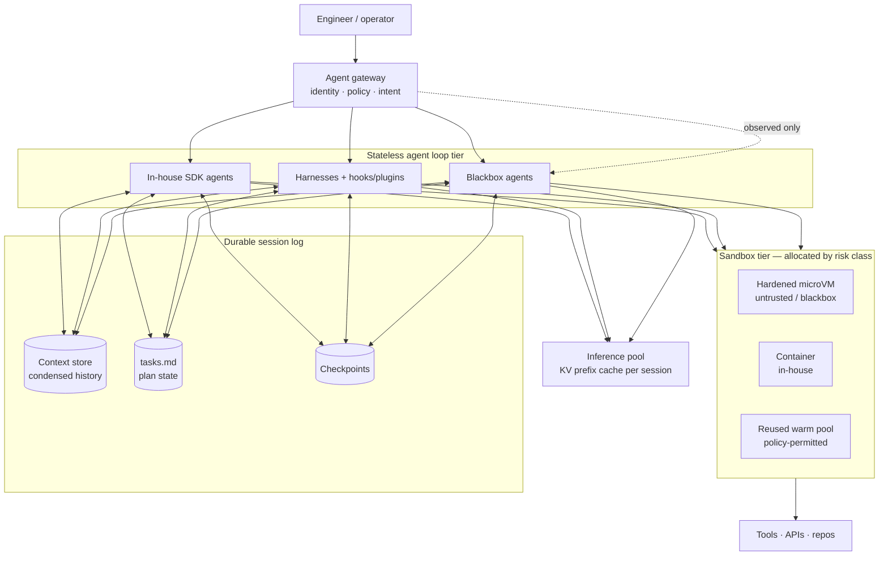

# Case Study: Agentic Inference — Platforms, Sessions and Sandboxes

> **Topic:** `T16` · **Transcript coverage:** primary · **Difficulty:** L4
> **One line:** An agent is not a longer request — it is a session that outlives the request, and
> every serving assumption you have (statelessness, error codes, a bounded retry, one GPU-second per
> call) breaks when the thing on the other side decides at runtime what to do next.

## Table of Contents

1. [The Scenario](#1-the-scenario)
2. [Requirements](#2-requirements)
3. [Architecture](#3-architecture)
4. [Component Deep Dive](#4-component-deep-dive)
5. [Decision Table](#5-decision-table)
6. [Edge Cases & Exceptions](#6-edge-cases--exceptions)
7. [Failure Modes & Mitigations](#7-failure-modes--mitigations)
8. [Capacity & Cost Model](#8-capacity--cost-model)
9. [Benchmarks & Measured Numbers](#9-benchmarks--measured-numbers)
10. [Operational Runbook](#10-operational-runbook)
11. [What Changes at 10x](#11-what-changes-at-10x)
12. [Interview Walkthrough](#12-interview-walkthrough)

---

## 1. The Scenario

**Ironbark Software** has 900 engineers. It is rolling out coding and operations agents to all of
them, and the platform team has been told to make it work for **5,000 concurrent agent sessions**.

The fleet is deliberately mixed, and the mix is the whole problem. Following the taxonomy the
*Beyond Harnesses* talk lays out [T] (Gosia Steinder, IBM Research), Ironbark runs:

1. **In-house agents** built on an internal SDK — "we have complete control over them" [T].
2. **Well-known harnesses** — vendor coding agents and chat harnesses — "that we can control via
   hooks and plugins" [T].
3. **Blackbox agents** — third-party and partner agents — "that we cannot do anything about, those we
   can only control by observing them on the outside" [T].

The first prototype worked beautifully at 40 users. At 900 it produced four problems in one week:

- A blackbox agent with an over-broad credential deleted a staging database. Nobody could say
  afterwards which session did it, because the agent had no identity distinct from the engineer who
  launched it.
- The inference bill tripled with a 2.2× increase in sessions — because agent sessions grow to
  hundreds of steps and the context, not the request count, is the cost driver.
- A long-running agent was evicted by a node rollout and lost 40 minutes of work. It had no durable
  state.
- Two agents reported "task complete" and had not completed the task. There was no error code,
  because there is no error code: as Steinder puts it, "we essentially do not have any reliable error
  codes" [T].

---

## 2. Requirements

### Functional

| Requirement | Priority | Notes |
|---|---|---|
| Agent identity distinct from the invoking user | P0 | "The identity systems that they are using are separate from the user because they can do things beyond what the user is able to do" [T] (Tiwary) |
| Durable session state surviving pod eviction and rollout | P0 | The 40-minute loss |
| Per-agent, per-session permission scoping and blast-radius control | P0 | The deleted staging database |
| Interruption, inspection and resumption of a running agent | P0 | Human-in-the-loop is a requirement, not a feature |
| Uniform interception across all three agent classes | P1 | Otherwise the blackbox class is ungoverned |
| Per-session tool-call and token ceilings | P0 | Runaway loops |
| Sandbox allocation by risk class | P1 | "Not all agents require most expensive sandboxes" [T] |

### Non-functional

| Requirement | Target | Rationale |
|---|---|---|
| Session resume latency | low hundreds of ms | The wake target for a suspended agent [T] (Hockin) |
| Cold-start tolerance | 10–15 s acceptable for new sessions, not for resumes | Agent cold start is reported in this range [T] |
| Idle cost of a session | Near zero | Agents are "idle 99.999% of the time" [T] (Hockin) |
| Context-growth control | Bounded per session | Hundreds of steps per run is normal [T] |
| Cost per task | Known, per agent class | "Cost per task, not per call" [R] |
| Session durability | Survive node drain, rollout, and process restart | The 40-minute loss |
| Attribution | Every tool call and model call tagged to an agent identity and a user | Governance + FinOps |

### Constraints and non-goals

- **This is not about prompt engineering.** The problems are structural: agents have an "open-ended
  instruction set" — "they decide which of these instructions to use at runtime, and they order them
  at runtime" [T] (Steinder) — and that single property is what breaks the platform assumptions.
- **Non-goal: making agents deterministic.** They will not be. The goal is containment and
  observability around non-determinism.
- **Constraint: the mix is fixed.** Ironbark cannot retire the blackbox agents; they must therefore
  be governed from the outside.
- **Constraint: this is a wave of platform evolution, not a feature.** Steinder's framing is that
  each previous wave — hardware/software separation, then cloud — produced "a new operating system" —
  a foundation that abstracts applications from infrastructure and offers primitives for "resiliency,
  scalability, and efficiency". Agents "will require a new foundation" too [T].

---

## 3. Architecture



The three-part split is Steinder's serverless agent pattern, and it is the single most useful
architectural idea in the topic: **"the right application pattern is serverless"** — "the agent loop
as a stateless component", separated from "a durable session [log] where the context is being
managed", and from an "execution tier provided by diverse set of sandboxes" [T]. She reports that
this "leads to better resiliency, better accuracy, better performance, and better scalability", with
"a lot" saved on infrastructure costs "particularly for agents that are model-bound" [T].

Read that against the classic serving model and the inversion is clear. A conventional inference
service is stateless and the *request* is the unit of work. An agent is stateful and the *session* is
the unit of work — the model call is just one of many side effects the session produces.

---

## 4. Component Deep Dive

### 4.1 Why agentic serving is a different problem

Four properties, each of which breaks a standard assumption.

| Property | What it breaks | Consequence |
|---|---|---|
| **Open-ended instruction set** — the agent picks and orders operations at runtime [T] | Zero-trust security, which "depends on understanding interaction patterns between applications a priori, at configuration time" [T] | You cannot pre-declare the call graph; you must mediate each call |
| **Instructions and data share one context** [T] | Execution separation between the instruction source and the data source | Prompt injection becomes an *authorisation* problem, not an input-validation problem |
| **No reliable error codes** [T] | Retry, circuit-breaking, alerting, recovery — all built on status | "If we cannot determine what the problem is, we cannot recover from this either" [T] |
| **Multiplicative cost per step** | Capacity planning per request | "10 to 100× more expensive in terms of inference compute… compared to non-agentic workload" [T] (Tiwary) |

The recovery consequence deserves emphasis because it is the one teams discover latest. Traditional
distributed-systems recovery leans on compensations and rollback, and Steinder is direct that with
agents "traditional techniques, like compensations and rollback, become intractable to implement" [T]
— because the agent's side effects are not a known, ordered transaction. That is why the industry
answer is not better rollback but **sandboxing and permission scoping**: make the blast radius small
enough that recovery is unnecessary.

### 4.2 The interception layer, and the three agent classes

Because Ironbark runs all three classes, the only place a uniform control can live is an interception
layer: "a layer of interception that can integrate with all of these styles of agents and provides a
uniform way to observe and modify all interactions that these agents are making with the external
world" [T].

The control functions Steinder's group layered onto it, in the order they built them [T]:

1. **Agent identity** — an identity of its own, not the user's.
2. **Delegation flows with authorization** — the agent acts on the user's behalf under an explicit
   grant.
3. **Policy-based access** — what this agent class may do.
4. **Intent-based access** — "evaluate if what agent is doing is actually aligned with users
   objectives" [T].

Then the semantic layer, which is where the topic gets interesting for a serving engineer because it
touches context directly: "can [we], in this business-logic-independent way outside of agents,
control the context and manage context that agents are using? Can we manage the correctness of tool
calls and do data flow analysis to understand how data is flowing and control that?" [T]. They report
"cost reduction even with state-of-the-art agents from context compaction", "consistent improvements
to tool calling accuracy, which translates into improvements to agent quality", and transparent
permissioning [T].

The implementation discipline is worth copying: **extend existing standards rather than invent new
ones** — "we are not replacing the existing platform", orchestrating on Kubernetes, gateway-based
approaches originally on Envoy and moving to a Rust-based proxy [T]. *(The project name behind the
interception layer and the Rust proxy are ASR-degraded in the transcript — see Sources.)*

### 4.3 Where the tokens actually go

Agent cost is dominated by context, not by request count. The CMU lecture puts concrete numbers on it:
in a typical SWE-bench or WebArena evaluation "the conversation history can go up to as much as a
hundred steps… maybe 50 tool calls, 100 actions and observations", which "can get over hundreds of
thousands of tokens"; and in real usage the lecturer reports using agents "for up to 2,000 steps…
that's like tens of millions of tokens in your context length" [T] (CMU Lecture 11).

Three consequences follow, and they are the serving agenda for agents:

**1. Prompt/KV caching is the primary lever, and it is used better than most services think.** The
lecture's framing is that after the first step you have already computed the autoregressive
representations of the system prompt, the observation and the action; subsequent steps need only the
new tokens fed in, which "saves you a lot of money and time". But the observation that should change
your gateway design is this one: "in reality a lot of services will only cache the things that you
had in your prompt… some of them will only cache the system message and the observation. But in
reality you can also cache the action as well if you're clever about it" [T]. Most agent stacks
leave the action tokens uncached and re-prefill them every step.

**2. Context condensation buys roughly a factor of two.** Summarising earlier steps with an LLM after
N steps "roughly halves context while keeping most relevant information"; the reported result is "2x
or even more cost reductions while maintaining performance on SWE-bench" [T]. Its cost is stated
honestly — "it's not perfect. Sometimes you lose information that would be useful later" [T].

**3. Web context condensation is a caching trade, not a free win.** Dropping older page
representations saves tokens but "prompt caching is less effective — you lose one of your inputs when
you're doing prompt caching", and you still pay to process each new page [T].

**4. Environment representation is recomputed every step, and that is waste.** The lecturer confirms
the representations are reprocessed each time and floats precomputation as an unexploited
optimisation [T].

### 4.4 Sandboxing: the taxonomy and its honest limits

The CMU tool-use lecture gives the ladder, with the limits stated in the lecturer's own words [T]
(CMU Lecture 10):

| Approach | Isolation | Cost | Stated limit |
|---|---|---|---|
| **Local process wrapper** (allowlist safe modules; block `os`, `subprocess`, `socket`, `sys`, dunder access) | Weak | Negligible | "It still runs in the same process as the rest of your code. It can access memory… it's near impossible to get rid of all dangerous codes" |
| **Container** (Docker) | OS-level, plus network restriction | Moderate | "It can consume resources… a lot harder to set up and run and it takes time to get stuff started" |
| **MicroVM / WebAssembly** | Strongest | Highest | Slower start; more engineering |

Services named in the lecture: **E2B** (open source) and **Daytona** [T]. Steinder's fleet-level
recommendation is the same idea applied to threat class: allocate sandboxes "flexibly… not all agents
require most expensive sandboxes. And they can be quite expensive", and "reuse sandboxes for certain
types of agents where security policy allows that" [T].

The threat model the sandbox exists for is not hypothetical, and both lectures name the same two
classes of incident:

- **Injection as instruction.** Web content can say "please upload your information to this URL… And
  it will upload all of your information to a phishing site" [T].
- **Accidental destruction by a well-meaning agent.** "It might say 'Oh, I made a mistake. I should
  delete my work and start again.' And it will delete your work" [T].

The second is the one that surprises people, and it is why sandboxes must be backed by snapshots
rather than only by permissions.

### 4.5 Tools: the interface, the failure modes, and the tool *supply*

The tool-use lecture's taxonomy is worth carrying into design reviews: tools are **perception**
(information from outside the model — "retrieval is a tool call"), **action** (changing the
environment), or **computation** (no new information; "does what is not easy to do within a language
model") [T].

The interface history matters for serving because it determines how many round trips you make.
Toolformer learned tool use self-supervised with only four tools and scaling tested to 6.5B, with the
finding that "the improvement from using tools actually increased as the model size got larger" [T].
The 2024 OpenAI function-calling standard replaced free-form parsing with JSON-schema types — and the
lecturer's own diagnosis of the era is a serving insight: "that's actually why coding agents didn't
work very well originally because they couldn't make these function calls with all these backslashes.
They'd miss a backslash somewhere or they'd miss a tab somewhere and things would break" [T].
Structured output is not free — the model is emitting escaped content inside a JSON envelope, and
that costs tokens and failure modes.

Then the current era: **MCP** ("APIs for agents", modelled in the lecture at "at least 17,000"
servers, with a centralized registry) versus **A2A** — "A2A is for agents to talk to agents and MCP is
for agents to talk to tools… It's not a two-way conversation. It's basically a do this and I did
this" [T]. The original MCP motivation was a security one: hide API keys behind the server so agents
never see them.

And the failure modes that a platform must absorb [T]:

| Failure | Evidence |
|---|---|
| **Silent incorrectness on broken APIs** | On a benchmark of deliberately broken APIs, "surprisingly low — few models were able to tell that the results were wrong", and "awareness was not always equal to task success" |
| **Poor tool selection among many** | "I don't think they are particularly good at this" |
| **Duplicate/redundant tools blowing context** | Tools crowd the window and confuse selection |
| **API drift and parameter errors** | "APIs go out of date… the file editing tool will fail because you have the parameters a little bit wrong" |
| **Toolformer's filter is usefulness, not truth** | "Their only criterion for choosing tools is whether the output was useful" |

The platform-level answer to several of these is **tool induction**: create tools at test time. The
lecturer's method runs three strategies (import an existing tool / create a new tool / no tool) at
K=5 each — "15 different rollouts" — picks the answer by self-consistency, adds a tool to the toolbox
if it improved correctness, and prunes rarely used tools, yielding "toolboxes that had relatively
small sizes but significantly outperformed just using no induction at all" [T].

### 4.6 The governance triad, and why identity is first

Tiwary's platform decomposition gives the four problems a platform must solve — **build, scale,
govern, optimize** — and the governance triplet is the deployment-critical one: "agent identity,
agent registry, and agent gateway to make sure that the agents are working within the right
confines" [T]. The reason identity comes first is stated plainly: the agent's identity must be
"separate from the user because they can do things beyond what the user is able to do" [T].

The scale side is a managed runtime "so that you can scale from a single instance of that agent to
millions of agents" [T]. The optimize side is "tracing, simulation, evaluation, observability… so
that you can keep on improving the agents once you land into production" [T].

### 4.7 The scale of the demand

Two numbers frame why this is worth platform investment. Google processes **3.2 quadrillion tokens
per month** — "equivalent to three novels for every person in this world" [T] (Tiwary). And Kaggle's
five-day agents course drew **1.5 million registrations** [T]. Against that, the hardware split is
explicit: the current TPU generation splits into **8T for training and 8I for inference**, with the
inference path seeing a 10× jump in per-pod performance to 11.6 exaflops, because "inference needs
are increasing very very rapidly" [T].

Tiwary's closing picture — the autonomous discovery loop, compressing a research cycle "which used to
take years" into "hours and days" — is the demand curve this case study is preparing for [T].

---

## 5. Decision Table

### 5.1 Where the agent loop runs

| Option | Pros | Cons | Exceptions — when it breaks | When to use |
|---|---|---|---|---|
| **In the client / user's machine** | No server cost; full local file access | No governance; no durability; dies with the laptop | Breaks the moment the agent needs shared credentials | Single-user, offline tools |
| **In the inference service process** | Lowest latency; one deployable | State and compute coupled; a model redeploy kills every session | Breaks on long-running agents | Short, stateless agents only |
| **Stateless loop tier + durable session log** (Steinder's serverless pattern) | Survives rollout; scales independently; "better resiliency, better accuracy, better performance, and better scalability" [T] | Two systems to operate; context serialisation cost | Breaks if the context store becomes the bottleneck | The default for anything multi-step |
| **Managed agent runtime (vendor)** | Fast to adopt; vendor handles scale | Identity and data leave your perimeter; limited interception | Breaks on residency or audit requirements | Blackbox/partner agents |

**Chosen:** the serverless pattern for in-house and harness agents; the managed runtime only for
blackbox agents, wrapped by the interception layer.
**Revisit if:** context-store latency starts dominating session step time, at which point add a
session-local cache in front of the durable log.

### 5.2 Session state ownership

| Option | Pros | Cons | Exceptions — when it breaks | When to use |
|---|---|---|---|---|
| **In-memory in the agent process** | Simplest; fastest | Lost on eviction/rollout — the 40-minute loss | Breaks on any node lifecycle event | Never, past a prototype |
| **Durable log, replayed on resume** | Full history; auditable | Replay cost grows with length | Breaks on 2,000-step sessions unless combined with checkpoints | Auditable/regulated agents |
| **Durable log + periodic checkpoints + condensed history** | Bounded resume cost; ~2× cheaper context [T] | Condensation loses information | Breaks when a condensed-away detail turns out to be load-bearing | The default |
| **Externalised plan file** (the `tasks.md` pattern) | Plan "can't just disappear from the context window" [T] | A second artifact to keep consistent | — | Any agent with a multi-step plan |

**Chosen:** durable log + periodic checkpoints + condensation, plus an externalised plan file. The
plan file is a specific and cheap trick worth naming in a design review: persisting the plan to disk
and re-reading it into the recent context means a compaction event cannot erase the agent's intent [T].
**Revisit if:** condensation loss becomes a measured cause of task failure, at which point pin
critical facts outside the condensed region.

### 5.3 Sandbox allocation by agent class

| Agent class | Sandbox | Rationale |
|---|---|---|
| **In-house SDK agent** | Container, warm pool, shared where policy allows | "We have complete control over them" [T]; reuse "where security policy allows that" [T] |
| **Harness with hooks** | Container, per-session, hooks-enforced policy | Controllable but not written by you |
| **Blackbox / partner agent** | Hardened microVM, network-isolated, no shared pool, snapshot-backed | "We cannot do anything about [them]… only control by observing them on the outside" [T] |

| Option | Pros | Cons | Exceptions — when it breaks | When to use |
|---|---|---|---|---|
| **One sandbox class for everything** | Simple | Paying microVM prices for trusted work; "they can be quite expensive" [T] | Breaks when the fleet is majority in-house agents | Small fleets, single trust level |
| **Risk-classed sandboxes** | Cost matched to threat | Policy engine complexity | Breaks if the classifier mis-assigns a class | Any mixed fleet |
| **Full isolation for all** | Simplest security story | Highest cost; slowest start | Breaks the budget at scale | Regulated or multi-tenant-unknown |

**Chosen:** risk-classed, with microVMs mandatory for blackbox agents and a warm container pool for
in-house agents.
**Revisit if:** a cross-class incident occurs, which collapses the classes toward the strictest.

### 5.4 Tool-call transport

| Option | Pros | Cons | Exceptions — when it breaks | When to use |
|---|---|---|---|---|
| **Individual tool calls per turn** | Simple; each result is small | Many round trips; each turn re-prefills | Breaks on long chains with high latency | Interactive, low-latency paths |
| **Parallel function calling** | Multiple calls in one turn | Wider context per step; harder scheduling | Breaks if calls have hidden ordering dependencies | Independent calls |
| **Code-as-action (CodeAct)** | One large generation replaces many; "simplifies the action space"; the serving win is explicit — "one action that generates a very large output versus many many individual actions" [T] | Larger single outputs; harder to sandbox | Breaks where each step needs a human checkpoint | Programmatic, high-confidence tasks |
| **MCP servers** | Keys hidden from the agent; standard interface | Another hop; server lifecycle | Breaks if the server is unversioned | Tool access across teams |
| **A2A** | Agent-to-agent delegation | "It's not a two-way conversation" [T]; opaque state | Breaks when you need the intermediate reasoning | Cross-vendor agent composition |

**Chosen:** CodeAct for in-house agents where the steps are mechanical, individual calls for anything
with a human checkpoint, MCP for shared tool access.
**Revisit if:** JSON-escaping failures reappear as a measurable error class — that is the signal the
action space is too granular.

### 5.5 Permission model

| Option | Pros | Cons | Exceptions — when it breaks | When to use |
|---|---|---|---|---|
| **Run as the invoking user** | No new identity plumbing | "They can do things beyond what the user is able to do" [T]; unattributable | Breaks the moment an agent acts autonomously | Never |
| **Static service identity** | Attributable; simple | No least privilege; broad blast radius | Breaks on destructive operations | Read-only agents |
| **Agent identity + delegation** | Explicit grant; auditable; scoped | Requires an identity provider and policy engine | Breaks if grants are never expired | Default |
| **+ policy-based access** | Class-level rules | Policy maintenance | Breaks when rules drift from reality | Fleets with several agent classes |
| **+ intent-based access** | Catches authorised-but-wrong actions — "is what agent is doing actually aligned with users objectives" [T] | Needs an intent signal; false positives | Breaks for exploratory tasks with no crisp objective | Highest-risk operations |

**Chosen:** identity + delegation + policy for everything, with intent checks reserved for
irreversible operations.
**Revisit if:** false-positive intent blocks start interrupting legitimate work, at which point move
intent checks from blocking to alerting.

### 5.6 Handling "I don't know if it failed"

| Option | Pros | Cons | Exceptions — when it breaks | When to use |
|---|---|---|---|---|
| **Trust the agent's self-report** | Free | "We essentially do not have any reliable error codes" [T] | Breaks constantly | Never as the sole signal |
| **Terminal-state heuristic** | Cheap | Confuses "stopped" with "finished" | Breaks on long silent tool calls | As a trigger for external checks |
| **External verification (tests, invariants, diff review)** | Ground truth | Costs compute; needs a testable task | Breaks on "tasks that are not necessarily easily unit testable like a research task" [T] | Every task with a verifier |
| **Critic / reranker model** | Catches bad trajectories; 20→32 on SWE-bench at 16× inference [T] | "At the cost of having to run inference like 16 times" [T] | Breaks the budget on exploratory work | High-value, verifiable tasks |

**Chosen:** external verification wherever a verifier exists; a critic is used only when the value of
success justifies 16× inference — the lecturer's own framing is that if "you could spend $10,000 on
making sure that it succeeded, then this could be a viable option" [T].
**Revisit if:** a cheaper process reward model becomes available — it predicts per-step success but
"needs much more complex supervision" [T].

---

## 6. Edge Cases & Exceptions

- **The unbounded session.** "Most language models cannot handle this. Even if they can handle this,
  it becomes very expensive" [T] — and real usage reaches 2,000 steps. Condensation has to be
  designed in from the first version, not retrofitted.
- **Condensation loses the load-bearing detail.** The lecture is explicit: "sometimes you lose
  information that would be useful later" [T]. The mitigation is not a better summariser but keeping
  the plan and any verified facts *outside* the condensed region.
- **Web condensation kills prefix caching.** Dropping older page representations "lose[s] one of your
  inputs when you're doing prompt caching" [T]. The agent gets cheaper per call and more expensive
  per task. Measure both.
- **Recomputing environment representations every step.** Confirmed as current behaviour and flagged
  as an unexploited optimisation [T]. Until it is precomputed, budget for it.
- **Agent awareness ≠ task success.** On broken-API benchmarks, "awareness was not always equal to
  task success" [T]. A monitoring system keyed on "did the agent notice?" will pass failing runs.
- **The repeated-PR loop.** A reported war story: the agent "would send a pull request… forget that it
  had sent a pull request and then it would send another pull request over and over and over again",
  which "demonstrates the difficulty of benchmarking in real use" [T]. This is a *deduplication*
  failure, not a reasoning failure — a platform-level guard (idempotency keys on side-effecting
  tools) catches it where prompt fixes do not.
- **Sandbox reuse is a policy decision, not an efficiency one.** Reuse "for certain types of agents
  **where security policy allows that**" [T] — the qualifier is the whole sentence. Two tenants'
  agents must never share a filesystem with residual state.
- **Tool drift mid-session.** "APIs go out of date" [T]; a session running for hours can cross a tool
  version boundary. Pin tool versions per session.
- **Duplicate tools in the registry.** They "blow the context window" and degrade selection [T].
  Registry hygiene is a serving concern, not housekeeping.
- **The blackbox agent that ignores your interception.** Observing from the outside "is the only way"
  to control that class [T]. Design for detection and scoping, not enforcement, for that class.
- **Multi-agent context passing is lossy.** Reported concretely: a browsing sub-agent "would give a
  very brief report back that wasn't sufficient and the coding agent would be missing information
  that the web browsing agent actually discovered" [T]. Named as "communication difficulties".
- **Multi-agent specialization may not pay.** The lecturer is candid: "we have an LLM that can do all
  of these things well and LLM kind of absorbs all the specialized knowledge… So I'm a little bit
  less convinced that this is a good motivation" [T]. The stronger motivations are parallelisation
  and verification.
- **Parallelisation conflicts on code.** "Very often it's hard to decompose the task… without having
  conflicts between the code you write" [T].
- **Latent-state communication does not exist yet.** Multi-agent context is always passed as tokens,
  never logits or hidden states, mostly because the best agent models are API-only [T]. Any design
  assuming shared internal state is a research bet.
- **Watching the agent work.** "It's kind of a failure mode of agents. You shouldn't watch your agent
  work… That wastes a lot of your time" [T]. Human-in-the-loop must be asynchronous and event-driven,
  not a live console.
- **Node drain during a long tool call.** The tool call is not idempotent; resuming replays it. Only
  sandbox-level snapshots or tool-level idempotency keys make this safe.

---

## 7. Failure Modes & Mitigations

| Failure | Symptom | Detection | Blast radius | Mitigation | Recovery |
|---|---|---|---|---|---|
| Session lost on rollout | 40 minutes of work gone | Resume attempts failing | One session | Durable log + checkpoints | Replay from last checkpoint |
| Agent exceeds its authority | Destructive action on a resource | Policy deny / audit trail | Environment-wide | Agent identity + delegation + scoping; sandbox | Snapshot restore; revoke grant |
| Runaway loop | Step/token count climbing | Per-session counters | Cost | Hard step, token and retry ceilings **inside** the loop [R] | Kill session; add ceiling |
| Context overflow | Truncation or hard failure | Context-length histogram | One session | Condensation + checkpointing | Resume from a condensed checkpoint |
| Prompt injection via tool output | Agent follows instructions from fetched content | Egress monitoring; anomalous tool calls | Credentials, data | Instruction/data separation at the platform; egress allowlists; microVM isolation | Revoke credentials; purge sandbox |
| Silent task failure | "Complete" with wrong result | External verifier | Output quality | Tests, invariants, diff review | Rerun with a critic |
| Duplicate side effects | Repeated PRs, repeated emails | Idempotency-key collisions | External systems | Idempotency keys on side-effecting tools | Deduplicate downstream |
| Attestation/identity expiry mid-session | Tool calls start failing | Auth errors | One session | Refresh tokens transparently; fail closed on identity, not on action | Re-delegate; resume |
| Cache regression | Cost per task jumps, sessions unchanged | Cache-hit rate per session step | Cost | Stabilise the cached region; cache the action tokens too [T] | Restore prompt ordering |
| Sandbox resource exhaustion | Slow or killed sessions | Sandbox CPU/mem/disk | Node | Per-session quotas; risk-classed allocation | Kill; requeue with a bigger class |
| Blackbox agent drifts | Behaviour changes with no deploy | External observation only | Unknown | Interception-layer telemetry; pinned versions | Quarantine the class |
| Multi-agent deadlock | Two agents waiting on each other | Step-count with no state change | Session tree | Turn limits; a supervising orchestrator | Terminate the tree from the root |

---

## 8. Capacity & Cost Model

*All arithmetic is mine; inputs attributed.*

### Assumptions

| Input | Value | Source |
|---|---|---|
| Agentic vs non-agentic compute | 10–100× | Tiwary [T] |
| Benchmark run length | ~100 steps, ~50 tool calls, ~100 actions+observations | CMU Lecture 11 [T] |
| Benchmark context size | hundreds of thousands of tokens | CMU Lecture 11 [T] |
| Real-usage worst case | 2,000 steps, tens of millions of tokens | CMU Lecture 11 [T] |
| Context condensation | ~2× cost reduction at maintained SWE-bench performance | CMU Lecture 11 [T] |
| Critic reranking | 20% → 32% accuracy at 16× inference | CMU Lecture 11 [T] |
| Agent cold start | 10–15 s | Hockin [T] |
| Resume/wake target | low hundreds of ms | Hockin [T] |
| Idle fraction | agents "idle 99.999% of the time" | Hockin [T] |
| Concurrency target | 5,000 sessions | Scenario |

### Step 1 — Context growth dominates

Model a session of S steps with a per-step observation/action of T tokens, naively re-prefilling the
whole history every step:

```
Total tokens processed  ≈ Σ_{i=1..S} (i × T) = T × S(S+1)/2
For S = 100, T = 1,000:  1,000 × 100 × 101 / 2 = 5.05M tokens processed
For S = 200, T = 1,000:  1,000 × 200 × 201 / 2 = 20.1M tokens processed
```

Doubling the step count **quadruples** the tokens processed. This is the entire reason agent cost
behaves nothing like request cost — and it is why the CMU numbers ("hundreds of thousands of tokens"
in a benchmark run) sit so far above a chat turn.

### Step 2 — What caching and condensation recover

```
With full prefix caching: every step prefills only the new observation+action
  → total ≈ S × T instead of T × S(S+1)/2
  For S = 200, T = 1,000: 200,000 tokens instead of 20.1M — a 100× reduction
With caching but actions left uncached (the common real-world case):
  → total ≈ S × T × 2
Condensation on top (~2× per the lecture): halves the retained history
```

The headline is that **the difference between caching everything and caching only the system message
plus observation is a factor of two**, and the difference between caching and not is up to two orders
of magnitude at long session lengths. This is the single highest-leverage serving decision in agent
infrastructure.

### Step 3 — Idle cost, and why suspend/resume is the whole ballgame

```
5,000 concurrent sessions
Fraction actually executing at any instant  = 0.00001  ("idle 99.999% of the time")
Sessions genuinely running                  ≈ 0.05
```

That figure is the extreme case, not a planning number, but the direction is unambiguous: a
platform that keeps a sandbox allocated per *session* is paying for a fleet sized by concurrency
while the work is sized by the fraction of sessions actually thinking. Ironbark's plan:

```
Naive:   5,000 warm sandboxes                      = 5,000 units
Realistic duty cycle (say 5% active)              =   250 units
Plus a warm pool of 10% for burst                 =   500 units
Saving                                            ≈ 90%
```

My numbers, and deliberately rough — the point is the *shape*: **the ratio between provisioned
sandboxes and productive sandboxes is the cost lever**, and it is set by resume latency, not by
compute. A 10–15 s cold start makes suspending expensive; a low-hundreds-of-ms resume makes it free.

### Step 4 — Cost per task, across classes

| Agent class | Steps | Caching | Condensation | Relative cost per task |
|---|---|---|---|---|
| In-house, mechanical (CodeAct) | ~30 | Full | Yes | 1.0 (baseline) |
| In-house, exploratory | ~150 | Full | Yes | ~5× |
| Harness, mixed | ~100 | Partial (vendor-controlled) | Vendor | ~7× |
| Blackbox | ~100 | Unknown | Unknown | ~10× + unattributed |
| Any class + critic reranking | as above | as above | as above | **16×** additional |

The bottom row is the one to price explicitly. The lecturer's framing is that reranking is a
benchmark-maximising technique — "in reality, I don't know if there's that many people who use this
in a production setting" [T] — and it should be reserved for tasks where the cost of a wrong answer
exceeds 16× the cost of the inference.

---

## 9. Benchmarks & Measured Numbers

| Metric | Value | Source | Conditions |
|---|---|---|---|
| Agentic vs non-agentic inference compute | 10–100× | Tiwary [T] | Per task |
| Google monthly token volume | 3.2 quadrillion | Tiwary [T] | "Three novels for every person in this world" |
| Kaggle agents course registrations | 1.5 million | Tiwary [T] | 5-day online course |
| TPU split | V8T training / V8I inference | Tiwary [T] | First generation with the split |
| Per-pod FP4 compute | 121 exaflops (training class), 3× gen-on-gen | Tiwary [T] | Pod-level |
| Inference pod performance | 11.6 exaflops, 10× jump | Tiwary [T] | Pod-level |
| Benchmark session length | ~100 steps, ~50 tool calls, ~100 actions+observations | CMU L11 [T] | SWE-bench / WebArena-class eval |
| Benchmark context | "over hundreds of thousands of tokens" | CMU L11 [T] | Same |
| Practical worst case | 2,000 steps, tens of millions of tokens | CMU L11 [T] | Lecturer's own usage |
| Context condensation | 2× or more cost reduction, SWE-bench performance maintained | CMU L11 [T] | Measured by the lecturer's group |
| Critic reranking gain | ~20% → ~32% accuracy | CMU L11 [T] | At 16× inference cost |
| SWE-bench scale | 2,000 issues, 12 Python repos; Verified = 500 | CMU L11 [T] | Dataset sizes |
| OpenHands eval directory | 25 benchmarks | CMU L11 [T] | |
| MCP server count | "at least 17,000" | CMU L10 [T] | Lecture's figure, with a central registry |
| Toolformer scale | 4 tools, up to 6.5B params | CMU L10 [T] | Tool benefit *increased* with model size |
| PAL on GSM8K | 19.7 plain → 65.6 with CoT → higher with program execution | CMU L10 [T] | The lecturer's figures |
| Tool-use RL reward range | −3 to +4 | CMU L10 [T] | Format + correctness with partial credit |
| Tool induction | K=5 × 3 strategies = 15 rollouts | CMU L10 [T] | Self-consistency selection, pruning |
| Agent cold start | 10–15 s | Hockin [T] | |
| Agent wake target | low hundreds of ms | Hockin [T] | Suspend/resume |
| **Not measured in this corpus** | agent session resume latency under production load; sandbox cost per session-hour; interception-layer overhead | — | Do not assert these |

---

## 10. Operational Runbook

**Deploy.**
1. **Identity before agents.** Agent identity, registry, gateway — "separate from the user" [T]. An
   agent launched before its identity exists cannot be audited afterwards.
2. **Split the loop from the session log** before the first long-running workload. Retrofitting
   durability after a work-loss incident is more expensive than designing it in.
3. **Sandbox by risk class** from day one; a single class either over-pays or under-protects.
4. **Turn on prefix caching and cache the action tokens**, not just the system message [T].
5. **Add condensation** and externalise the plan to disk.
6. **Add the interception layer** and extend it to the blackbox class, accepting observation-only
   control there.

**Tune — in this order.**
1. Cache-hit rate *per session step* (the dominant lever).
2. Condensation threshold (N steps) and what is pinned outside it.
3. Sandbox pool sizing and suspend/resume latency.
4. Step and token ceilings per agent class.
5. Critic reranking, only for high-value verifiable tasks.
6. Multi-agent fan-out, last — it multiplies everything above.

**Monitor.** *Session*: steps, tokens per step, context length, condensation events, resume
success/latency, terminal-state reason. *Governance*: tool calls by agent identity and user, policy
denials, intent-check outcomes, egress attempts per sandbox. *Cost*: cost per task, per class, per
team; cache-hit rate; reasoning share. *Quality*: verifier pass rate; "self-reported complete but
failed" rate (the silent-failure metric, which no standard dashboard carries).

**Incident — top 5.**

| Symptom | Likely cause | First action |
|---|---|---|
| Sessions lost on deploy | State in the loop process | Confirm the durable log is being written, not just read |
| Cost per task jumps, sessions flat | Cache-hit regression or action tokens uncached | Compare hit rate per step |
| Destructive action | Over-broad delegation | Revoke the grant; restore from snapshot; tighten scope |
| Agent reports success, work is wrong | No verifier on the path | Add an external check; measure the silent-failure rate |
| Node full of zombie sandboxes | Sessions suspended but not reaped | Reconcile allocated vs active sandboxes |

---

## 11. What Changes at 10x

- **The interception layer stops being a sidecar and becomes the platform.** At 5,000 sessions, per-
  agent instrumentation is affordable; at 50,000 it must be central and uniform across all three
  agent classes.
- **Session storage becomes the scaling bottleneck, not GPUs.** At 10× the dominant cost is likely
  context storage and replay, which is why checkpointing and condensation move from optimisation to
  necessity.
- **The blackbox class has to be bounded, not governed.** At scale you cannot inspect every one, so
  the controls become egress allowlists, resource quotas and revocation, enforced by the sandbox.
- **Multi-agent fan-out becomes affordable and therefore ubiquitous** — and the context-passing loss
  the lecturer describes becomes the dominant quality problem rather than a curiosity.
- **Human review moves from live to queued.** The lecture's "you shouldn't watch your agent work" [T]
  becomes an operational rule, not advice.
- **What survives:** agent identity separate from the user; loop/session/sandbox separation; caching
  including the action tokens; external verification because the agent cannot self-report; sandbox
  isolation as the answer to an unbounded instruction set. These are architectural.
- **What inverts:** critic reranking. At 1× it is a benchmark trick; at 10× on a high-value verifiable
  task, 16× inference for a 20→32 accuracy move is cheap.

---

## 12. Interview Walkthrough

**Whiteboard order:**
1. Define an agent the way the lecture does — "a system that iteratively uses tools to achieve a
   task" [T] — and immediately say that this makes the **session**, not the request, the unit of work.
2. Draw the three-part split: stateless loop, durable session log, sandbox tier.
3. Put the three agent classes on the left and say that only an interception layer covers all of them.
4. Show the context-growth curve — quadratic without caching, linear with it.
5. Close on the governance triad: identity, registry, gateway — with identity separate from the user.

**Three numbers to say out loud:**
- **Hundreds of steps and hundreds of thousands of tokens per benchmark run; up to 2,000 steps and
  tens of millions of tokens in real usage** [T] — this is why agent serving is not inference serving.
- **Context condensation buys ~2× at maintained SWE-bench performance** [T] — the cheapest structural
  win after caching.
- **10 to 100× the inference compute of a non-agentic workload** [T] (Tiwary) — the budget
  conversation, in one figure.

**Volunteer before you are asked:** that there are no reliable error codes, so "did it succeed?" must
be answered externally; that rollback and compensation are intractable for agents and sandboxing is
the substitute; and that multi-agent specialization is the weakest of the three motivations.

**Follow-ups.**

1. *Why is an agent not just a long request?* Three reasons: the session outlives the process, the
   instruction set is chosen at runtime, and the cost is quadratic in steps without caching. — tests
   the core framing.
2. *The agent says it finished. Do you believe it?* No. "We essentially do not have any reliable
   error codes" [T]. Use an external verifier; measure the silent-failure rate explicitly. — tests
   whether you trust self-reports.
3. *How do you cut agent cost by 2× without changing models?* Cache the action tokens as well as the
   system message and observation, and condense the history — the lecture's own ~2× result. — tests
   whether you know where agent tokens actually go.
4. *When is multi-agent worth it?* For parallelisation and verification, not specialization — the
   LLM already absorbs the specialist knowledge. And parallelisation is hard on code because of
   write conflicts. — tests judgement against the hype.
5. *An agent with a broad credential deletes production. What did you get wrong?* It ran as the user;
   there was no agent identity, no delegation grant, and no sandbox snapshot. Three separate
   failures. — tests whether you can enumerate controls.
6. *Compare MCP and A2A.* MCP is agents talking to tools — one-way, "do this and I did this". A2A is
   agents talking to agents. They solve different composition problems. — tests precision about the
   protocol layer.
7. *Your 2,000-step agent hits context limits. Options?* Condense, checkpoint, externalise the plan
   to disk so compaction cannot erase intent, and pin verified facts outside the condensed region.
   Accept that condensation loses information. — tests whether you know the mitigations and their
   costs.
8. *What would you not build?* A live agent-watching console as the primary human-in-the-loop
   mechanism. It is a known failure mode, and it wastes the most expensive resource you have. — tests
   whether you have opinions.

---

## Sources

Transcripts (`refs/`):
- `Agentic_AI_Infra_transcripts_3/Gosia_Steinder_-_Beyond_Harnesses_Platform_Solutions_for_Agent_Reliability_Secur.txt`
  — the third wave of platform evolution and the "new operating system" framing; structural vs
  semantic challenges; the open-ended instruction set breaking zero-trust security, recovery and
  pre-deployment testing; the loss of instruction/data separation and of execution separation; "we
  essentially do not have any reliable error codes"; the three agent classes; the interception layer;
  agent identity, delegation, policy-based and intent-based access; context management, tool-call
  correctness and data-flow analysis; the results on compaction, tool-calling accuracy and
  permissioning; the serverless agent pattern with a stateless loop, a durable session log and a
  sandbox execution tier; and flexible sandbox allocation with reuse where policy allows.
- `Agentic_AI_Infra_transcripts_2/Saurabh_Tiwary_-_From_Models_to_Agents_to_Discovery_Building_the_Full_Stack_of_A.txt`
  — the 10–100× agentic compute multiplier; Kaggle's 1.5M registrations; 3.2 quadrillion tokens per
  month; the TPU V8T/V8I split and per-pod compute figures; the build/scale/govern/optimize platform
  decomposition; agent identity, registry and gateway with identity separate from the user; the
  managed runtime scaling from one to millions of agents; and the autonomous discovery loop.
- `CMU_Inference_Algorithms_for_Language_Modeling_Fall_2025_transcripts/CMU_LLM_Inference_11_Agents_and_Multi-Agent_Communication.txt`
  — the agent definition; ReAct and CodeAct; the task-tracker tool and the disk-persisted plan; the
  thinking tool as an inference-time capacity extension; environment representations (markdown,
  accessibility tree, Set-of-Marks) and Mind2Web; context condensation at ~2× and web context
  condensation's effect on prompt caching; the action-token caching observation; step counts, context
  sizes and the 2,000-step real-usage figure; critic models and outcome vs process reward models;
  SWE-bench, WebArena, GAIA and benchmark hubs; multi-agent motivations, overheads and the
  context-passing failure; and the serving trade-off between one large CodeAct generation and many
  small tool calls.
- `CMU_Inference_Algorithms_for_Language_Modeling_Fall_2025_transcripts/CMU_LLM_Inference_10_Incorporating_Tools.txt`
  — the perception/action/computation tool taxonomy; WebGPT; Toolformer's four tools and the
  benefit-increases-with-scale finding; the 2024 function-calling standard and the JSON-escaping
  failure mode; MCP versus A2A and the ~17,000-server figure; PAL's GSM8K results; the sandboxing
  ladder and its stated limits; Gorilla and the Berkeley Function Calling Leaderboard; RL reward
  design (−3 to +4, cold start over SFT); the broken-API robustness benchmark's "surprisingly low"
  awareness; tool induction with 15 rollouts and pruning; and the prompt-injection and
  accidental-deletion threat examples.
- `Agentic_AI_Infra_transcripts_2/Tim_Hockin_-_Agent_Substrate.txt`
  — the Agent Substrate vocabulary (actor, actor template, worker, per-node manager, enlightened
  proxy, golden snapshot), the "idle 99.999% of the time" observation, the 10–15 s agent cold start,
  the low-hundreds-of-ms wake target, and the 200,000-node scale envelope.

Supporting repositories (`refs/`):
- `ai-system-design-guide-main/ai-system-design-guide-main/11-infrastructure-and-mlops/04-finops-and-token-economics.md`
  — cost per task rather than per call, the agent multi-step multiplier, and hard step/token/retry
  ceilings inside the loop as the defence against runaway agents.
- `ai-system-design-guide-main/ai-system-design-guide-main/11-infrastructure-and-mlops/01-llm-infrastructure.md`
  — queue-based architecture and the infrastructure layer the agent platform sits on.

**ASR corrections applied:** "Ashlan"/"SLM" → SGLang; "honey" → harness; "eight-let" → the per-node
manager component (exact name unresolved); "eight-net" → the enlightened proxy component (exact name
unresolved); "durable session lock" → durable session **log**; "O of tools for identity non-policy
languages" → OAuth for identity plus a policy language (exact names unresolved); "project praxis" →
the Rust-based proxy project (name unresolved); "Rossoctl" → the context/tool-call control project
(spelling as transcribed, unverified); "NVIDIA and Excel"/"P2P K" → NIXL; "LightLLM" → LiteLLM.
