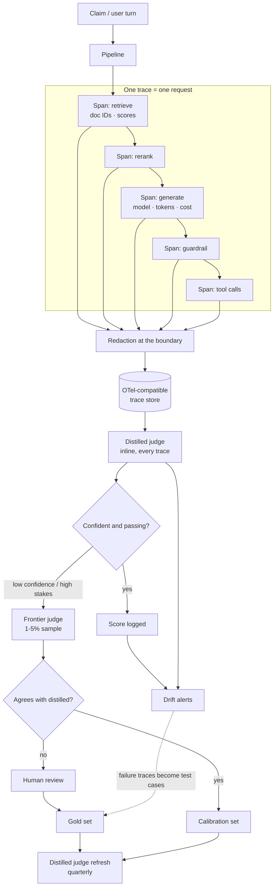

# Case Study: Observability and Evaluation

> **Topic:** `T17` · **Transcript coverage:** primary · **Difficulty:** L4
> **One line:** A fast, available system producing bad answers is a failing system — so quality has
> to be a first-class metric with a trace attached to it, and the only sustainable way to afford that
> is a judge hierarchy where the cheap judge runs on everything and the expensive judge runs on the
> disagreements.

## Table of Contents

1. [The Scenario](#1-the-scenario)
2. [Requirements](#2-requirements)
3. [Architecture](#3-architecture)
4. [Component Deep Dive](#4-component-deep-dive)
5. [Decision Table](#5-decision-table)
6. [Edge Cases & Exceptions](#6-edge-cases--exceptions)
7. [Failure Modes & Mitigations](#7-failure-modes--mitigations)
8. [Capacity & Cost Model](#8-capacity--cost-model)
9. [Benchmarks & Measured Numbers](#9-benchmarks--measured-numbers)
10. [Operational Runbook](#10-operational-runbook)
11. [What Changes at 10x](#11-what-changes-at-10x)
12. [Interview Walkthrough](#12-interview-walkthrough)

---

## 1. The Scenario

**Ridgeline Insurance** runs an LLM claims assistant in production: a RAG pipeline over 40,000 policy
documents (retrieve → rerank → generate), plus an agentic tier that files, amends and escalates
claims.

Three incidents land in one month, and none of them is diagnosable with the telemetry the team has.

**Incident one — "the bot cited the wrong policy."** A customer complains that the assistant quoted
an obsolete coverage clause. The team's logs contain the final answer and the HTTP status. They
cannot tell whether retrieval fetched the wrong chunk or the model embellished a correct one. The
observability video names exactly this failure and its resolution: with a trace you see "the retrieval
span pulled an outdated chunk, and the model faithfully summarized that bad chunk", and "in under a
minute, you know the model behaved correctly, and the fault is in retrieval. Without the trace, you
would be guessing and probably blaming the wrong component" [T].

**Incident two — the agent that reported success.** The claims-triage agent marked 340 claims
resolved. 40 had no filed document. There was no error, no failed status, no alert. The team has no
way to ask "how often does the agent claim success and not achieve it?" because that question does
not exist in their metrics.

**Incident three — a model swap nobody could gate.** A vendor released a cheaper model. Engineering
wanted to adopt it. Nobody could say whether it was safe, because the only quality artefact in the
repository was a 30-row spreadsheet of prompts and vibes.

Two constraints frame everything. First, this is a regulated domain: **trace stores become privacy
incidents if user text is written without redaction** — "redact personal data at the boundary before
it is ever written, so your trace store never becomes a privacy problem of its own" [T]. Second, the
volume forces a cost decision: evaluating every trace with a frontier judge is unaffordable, and the
2026 eval stack's answer is a hierarchy, not a single judge.

---

## 2. Requirements

### Functional

| Requirement | Priority | Notes |
|---|---|---|
| Every request traced as a tree of nested spans | P0 | Retrieval, prompt assembly, model call, guardrails, tools — "an LLM app is not one call" [T] |
| Span-level attribution for a bad answer | P0 | The wrong-policy incident |
| Redaction at the boundary, before persistence | P0 | Compliance; "before it is ever written" [T] |
| Per-stage quality metrics for RAG | P0 | Faithfulness, answer relevancy, context precision, context recall [R] |
| Trajectory-level grading for agents | P0 | The 340/40 incident is invisible to final-answer grading |
| A golden set run on every change | P0 | The gate that did not exist |
| Pass^k reliability metric for agents | P1 | "Pass^4 is what tells you whether the agent is reliable" [R] |
| Cost and token attribution per request | P0 | The bill is a first-class metric [see T19] |
| Alerting on quality drift | P1 | "A 10% degradation triggers a warning" [R] |

### Non-functional

| Requirement | Target | Rationale |
|---|---|---|
| Trace coverage | 100% of requests, sampled in what is *stored*, not in what is *traced* | "A blind spot in your tracing is a blind spot in your whole system" [T] |
| Error retention | 100% of failures kept | "In high-traffic production, sample the successes, but always keep 100% of the errors" [T] |
| Live-eval sample rate | 1–5% | The guide's range, and the range the cost model supports [R] |
| Judge latency added to the request path | Zero | Judges run async, off the critical path |
| Evaluation cost as a share of inference cost | Small single-digit % | The layered architecture exists to keep it there |
| Backend portability | Instrument once against OpenTelemetry | "That portability is worth protecting" [T] |

### Constraints and non-goals

- **Non-goal: a dashboard.** "Worst of all is the dashboard nobody owns. If no alert fires and no
  eval reads the traces, you have paid for storage, not for insight" [T]. Every artifact in this case
  study must be attached to an alert, an eval, or a decision.
- **Non-goal: ground truth everywhere.** Most LLM outputs have "subjective correctness" and "often no
  ground truth to compare against" [R]. The design therefore samples and calibrates rather than
  asserting.
- **Constraint: no single judge can be trusted.** "Never trust the distilled judge alone for novel
  failure modes that were not in its training distribution" [R].
- **Constraint: agents are the hard case.** Long-horizon agents "fail in ways the final answer cannot
  reveal" [R] — right answer from wrong reasoning, right answer via a dangerous path, or right answer
  at runaway cost.

---

## 3. Architecture



The loop at the bottom is the point of the whole diagram. As the observability video puts it, "on
their own, traces are logs nobody opens. The magic is the feedback loop. Score live traces with a
judge, alert when the score drops, and sample the failures into a dataset… Yesterday's production
failure becomes today's test case, and your eval set gets stronger every week on its own" [T].

---

## 4. Component Deep Dive

### 4.1 Spans, and what a span must carry

A trace is one request; each step inside it is a span. Each span carries "a trace ID and a parent ID,
which is how the nested tree gets rebuilt", plus "start and end times, the model used, token counts,
and cost", a status "so errors are visible", and "a set of standard gen AI attributes defined by Open
Telemetry, which is why different tools can read each other's traces" [T].

The worked example from the video is worth keeping as the canonical demo: total 1.2 s, retrieval 90 ms,
generation over a second — "the bottleneck is obvious the moment you can see it" [T]. Compare that
with the aggregate p95, which shows a slow request and tells you nothing about which component to fix.

The design rule that follows: **tag each span with the attribute that will be needed during the next
incident, not the attribute that is easy to emit.** The video's own example is retrieval recording
which document IDs came back and generation recording the token count — "those two attributes are
exactly what you needed in the last example" [T].

### 4.2 What to trace, and the redaction boundary

| Environment | Policy |
|---|---|
| Development | "Trace everything. The detail is worth it" [T] |
| High-traffic production | "Sample the successes, but always keep 100% of the errors" [T] |
| Everywhere | "Redact personal data at the boundary before it is ever written" [T] |

The third row is a compliance control, not a courtesy. In a regulated domain, an unredacted trace
store is a second copy of the customer database with weaker access controls, and it is the most
common way an observability rollout becomes an incident.

### 4.3 The three-pillar minimum, with thresholds

The guide's operational minimum, with the alert thresholds it recommends [R]:

| Metric | Alert threshold | Why it matters for this scenario |
|---|---|---|
| Error rate | > 5% | Table stakes |
| Latency p50 / p95 / p99 | > 2 s / > 5 s / > 10 s | p99 catches the tail that reaches a customer |
| TTFT | > 1 s | Streaming perception |
| Token throughput | Below baseline | Capacity signal |
| Quality score (sampled) | < 3.5 over 1 h | The metric that makes LLM observability distinct |
| Faithfulness (RAG, sampled) | Drift from baseline | Incident one |
| Cost per request / daily cost | > 2× rolling hourly average | Runaway spend |
| Trace coverage | Falling | "A blind spot in your tracing is a blind spot in your whole system" [T] |

The dashboard list the video insists on is deliberately short: "median and 95th percentile latency
broken down by span so you know whether retrieval or generation is the problem", cost per request and
per day, "error and fallback rate", and "trace coverage itself" [T].

### 4.4 Quality sampling and drift detection

Sampling is what makes continuous evaluation affordable: evaluate a random 1–5% of requests with a
judge, record the score per criterion, and keep a baseline distribution. Drift detection then compares
a rolling window to the baseline — the guide's implementation uses a window of 1,000 scores and a 10%
relative-degradation threshold, with a statistical test (t-test) behind the simple threshold [R].

Two subtleties matter more than the mechanism:

- **The baseline must be a *passing* period, not simply the earliest period.** Otherwise a system that
  degrades during onboarding and never recovers establishes a degraded baseline as "normal".
- **Sampling rate interacts with traffic shape.** A 1% sample of 10,000 requests/day is 100 evaluations
  — enough to detect a 10% shift, not enough to detect a 2% shift. Anything below the detection floor
  must be caught by the golden set instead.

### 4.5 The judge hierarchy — the 2026 architecture

This is the single most important update in the topic, and it comes from a cost constraint: "serving
frontier judges (Claude Opus 4.7, GPT-5, Gemini Ultra 3) on every production trace is unaffordable
above ~100K req/day. Distilled judges run hot, frontier judges calibrate, humans set ground truth" [R].

The four layers [R]:

| Layer | Runs on | Purpose |
|---|---|---|
| **Distilled judges inline** | Every trace | Cheap, fast, task-specific classification |
| **Frontier judge** | A 1–5% sample | Detects drift between the distilled judge and the larger model |
| **Automatic fallback to frontier** | Low-confidence distilled outputs | Catches what the small judge does not know it does not know |
| **Human review** | Disagreements and high-stakes traces | Sets ground truth and refreshes the gold set |

The published figures for one distilled judge family (Galileo Luna-2, February 2026) are: ~97% lower
cost per evaluation, ~10× lower P50 latency (sub-100 ms for short responses), and 88–92% agreement
with the frontier judge across published benchmarks, landing "within 2-3 points of the frontier judge"
on human gold labels [R]. **These are vendor claims and should be treated as such** — but the
architectural point holds regardless of whose distilled judge you use.

The catch is stated as plainly as the benefit, and it is the sentence to design around: the distilled
judge "is trained on a fixed taxonomy of failure modes (groundedness, instruction-following, toxicity,
PII, off-topic, refusal). Anything outside that taxonomy regresses to a default score" [R]. So a
freshly-released attack vector, a new category of user intent, or a domain-specific factuality check
will be scored confidently and wrongly.

Comparable shipped distilled judges named in the guide: **Patronus AI Lynx** (groundedness),
**Vectara HHEM-2** (hallucination detection), and **Arize Phoenix Evals** (open distilled judges plus
a calibration harness) [R].

### 4.6 Judging trajectories, not answers

For the agentic tier, final-answer grading is structurally insufficient. Three failure shapes it
cannot see [R]:

- **Right answer, wrong reasoning** — the agent guessed correctly after a botched calculation.
- **Right answer, dangerous path** — four destructive tool calls before a fifth safe one succeeded.
- **Right answer, runaway cost** — 47 retrieval calls where 2 would have sufficed.

The production pattern has two components [R]:

- **Process Reward Models (PRMs)** score each step independently. They were originally trained for
  math and have generalized to code, tool-use trajectories and multi-turn dialogue.
- **An auditor agent** — often a *different* model from the one being graded — replays the trajectory,
  asks "was this step justified?" at each node, and emits a graded transcript.

The named trajectory failure modes are a useful checklist for building the auditor's rubric:
**reasoning-action mismatch** (the chain of thought says one thing, the tool call does another),
**over-retrieval**, **tool flailing** (the same tool with slight variations until something works),
**premature commitment** (answering before the evidence is in), and **self-jailbreaking** (the
agent's intermediate reasoning bypasses its own safety policy) [R].

The CMU agent lecture supplies the same idea from a different direction, and confirms the cost: critic
reranking took accuracy from around 20% to 32% on SWE-bench, "at the cost of having to run inference
like 16 times", and the lecturer is candid that this is largely a benchmark-maximising technique —
"in reality, I don't know if there's that many people who use this in a production setting" [T]. The
practitioner's reconciliation is the one from §5.4: use trajectory grading cheaply (PRM on every
trajectory) and reserve expensive reranking for tasks where a wrong answer costs more than 16× the
inference.

### 4.7 Reliability is not the success rate — it is Pass^k

The tau2-bench update is the most actionable evaluation idea to enter the topic recently [R]:

- **More domains** — retail, airline, financial, healthcare, telecom.
- **Pass^k** — the probability the agent succeeds on **all** k repeated trials of the same task.
  Pass^1 is the traditional success rate.
- **Verifier-based grading** — deterministic post-conditions (the order is cancelled, the refund
  exists, the seat is changed) rather than LLM-graded transcript scoring.

The interpretation the guide offers is the one to quote: "A Pass^1 of 70% and a Pass^4 of 12% says
'the agent works on the easy path but cannot recover from any small perturbation.' That is exactly the
signal production teams need before rolling out an agent at scale" [R].

The sister benchmarks close two specific blind spots: **tau-Voice** (speech-to-speech, catching timing,
interruption and ASR-recovery failures "that text-only benchmarks miss entirely") and **tau-Knowledge**
(adding a knowledge base the agent must retrieve from, which "decouples 'does the agent retrieve' from
'does the agent act'") [R].

### 4.8 Memory needs its own eval, per operation

HaluMem's contribution is that hallucination should be measured at the operations that produce and use
memory rather than only at the answer [R]:

| Stage | Failure example |
|---|---|
| **Extraction** | The agent stored "user is allergic to peanuts" when the source said "user dislikes peanuts" |
| **Update** | A new memory contradicts an older one without resolution |
| **QA** | The agent answers from parametric knowledge while pretending to cite memory |

The insight is compounding: "a system can hit very high QA accuracy on standard hallucination
benchmarks while making catastrophic extraction errors… a 5% extraction error compounds over thousands
of operations into a wholly unreliable agent" [R]. Aggregate metrics hide the stage where the error
originated, and the stage is the only thing you can fix.

### 4.9 Judge bias, and the mitigations that actually work

| Bias | Description | Mitigation |
|---|---|---|
| Position | Prefers first or last option | Randomise or swap order and check consistency |
| Length | Prefers longer responses | Instruct the judge to ignore length |
| Self-preference | Prefers its own model's outputs | Use a different judge model |
| Format | Prefers certain formats | Diverse examples in calibration |

The calibration technique worth memorising is the swap test: run the pairwise comparison twice with
the positions exchanged, and if the two runs disagree, record the result as a **tie with low
confidence** rather than a winner [R]. That converts an invisible bias into an explicit uncertainty
signal — and at scale, the tie rate becomes a metric: a rising tie rate means the judge can no longer
distinguish the candidates, which is itself a finding.

### 4.10 RAG evaluation, stage by stage

The four RAGAS metrics map onto the pipeline stages, which is why they diagnose rather than merely
score [R]:

| Metric | Question | Stage |
|---|---|---|
| **Context precision** | Are the retrieved contexts relevant? | Retrieval |
| **Context recall** | Did we retrieve everything needed? | Retrieval |
| **Faithfulness** | Is the answer grounded in the context? | Generation |
| **Answer relevancy** | Does the answer address the question? | Generation |

Incident one decomposes exactly this way: high faithfulness with low context precision means the model
behaved correctly on bad input — which is the conclusion the trace made obvious and the aggregate
quality score could not.

### 4.11 Interpreting the numbers honestly

Two limitations belong in the design review rather than in a footnote:

- **Benchmark ceiling ambiguity.** From the CMU lecture: "just because you get a good score on
  SWE-bench Verified doesn't mean you've solved all GitHub issues, which would require interacting
  with a human… ask clarifying questions" [T]. A benchmark measures the benchmark.
- **The oracle is not always available.** Unit tests are the cleanest verifier available — "software
  testing sounds boring until you realize that if you can write a really good unit test the agent can
  usually solve the problem for you" [T] — but "models are not all that great at generating unit
  tests", and some tasks "are not necessarily easily unit testable like a research task" [T].
  Verifier-based grading is the right default precisely *because* it fails loudly when no verifier
  exists.

---

## 5. Decision Table

### 5.1 Evaluation strategy mix

| Option | Pros | Cons | Exceptions — when it breaks | When to use |
|---|---|---|---|---|
| **Offline golden set** | Reproducible; free of production risk; runs on every change | Goes stale; covers only imagined cases | Breaks when the golden set is small and hand-written — it encodes the team's priors | Every change, as a gate |
| **Online sampled judging** | Catches what you did not imagine | Costs money per evaluated trace; noisy at low volume | Breaks below its detection floor (a 1% sample of low traffic cannot see a 2% shift) | Continuous, in production |
| **Human review** | Ground truth; catches nuance | Expensive; slow; needs guidelines and agreement checks | Breaks without an annotation guide and inter-annotator agreement measurement | Gold-set construction; high-stakes and novel cases |
| **A/B or interleaved experiment** | Measures the business outcome | Needs traffic and a stable metric | Breaks when the outcome metric is noisy or lagged | Once a causal question matters more than a quality score |
| **Trajectory / PRM grading** | Sees process failures | Needs a trajectory logger and a rubric | Breaks when the task has no step-level notion of justified | Any multi-step agent |

**Chosen:** all five, layered — golden set as the gate, sampled online judging as the continuous
signal, trajectory grading for the agentic tier, human review as the ground-truth source, and A/B for
the business question.
**Revisit if:** online judging cost exceeds a small single-digit share of inference cost, at which
point shift sample rate from successes to errors only.

### 5.2 Judge architecture

| Option | Pros | Cons | Exceptions — when it breaks | When to use |
|---|---|---|---|---|
| **Frontier judge on everything** | Simplest; best quality | "Unaffordable above ~100K req/day" [R] | Breaks on cost, not capability | Low volume, high stakes |
| **Distilled judge only** | Cheap; fast; runs on everything | "Anything outside that taxonomy regresses to a default score" [R] | Breaks on novel failure modes, new intents, domain-specific factuality | A stable, well-taxonomised failure surface |
| **Layered (distilled inline + frontier sample + human gold)** | Affordable at scale; self-calibrating | Three systems; a retraining cadence to own | Breaks if the calibration sample is never actually reviewed | The default for any production system at scale |
| **No judge; deterministic checks only** | Free; no bias | Sees only what you can specify | Breaks for open-ended quality | Regulated output contracts, schema validation |

**Chosen:** layered, with the explicit rule that the distilled judge is never the sole arbiter of a
novel failure mode. The escalation path is confidence-triggered, not sampled-only.
**Revisit if:** the distilled judge's tie/low-confidence rate rises, which means the taxonomy has
drifted from reality and the gold set needs refreshing.

### 5.3 What to trace

| Option | Pros | Cons | Exceptions — when it breaks | When to use |
|---|---|---|---|---|
| **Trace everything, store everything** | Maximum detail | "The signal disappears under the noise" [T]; storage and privacy cost | Breaks the moment user text is involved | Development only |
| **Trace everything, sample storage** | Full coverage with bounded cost | Requires sampling logic in the pipeline | Breaks if errors are sampled out | Production default |
| **Sample tracing itself** | Cheapest | "A blind spot in your tracing is a blind spot in your whole system" [T] | Breaks the first time an unreproducible bug appears in the unsampled region | Never for correctness; acceptable for cost-only signals |
| **Trace everything, 100% of errors retained** | Diagnosable failures at bounded cost | Error detection must be correct | Breaks if "error" is defined only as an exception (agents do not raise) | The production default |

**Chosen:** trace all requests, store sampled successes and 100% of errors, redact at the boundary
before persistence.
**Revisit if:** the error definition proves incomplete — which it will, because agents "do not have any
reliable error codes" [see T16] — at which point quality-score thresholds, not exceptions, define what
counts as an error.

### 5.4 Grading agents: answer, trajectory or both

| Option | Pros | Cons | Exceptions — when it breaks | When to use |
|---|---|---|---|---|
| **Final answer only** | Cheap | Misses wrong reasoning, dangerous paths, runaway cost | Breaks for multi-step agents | Single-shot tasks |
| **Trajectory / PRM on every run** | Catches process failures | Needs a rubric and a logger | Breaks when steps have no justifiability notion | Any production agent |
| **Critic reranking (best-of-N)** | +12 points on SWE-bench in the reported case [T] | "Run inference like 16 times" [T] | Breaks the budget on exploratory work | High-value, verifiable tasks |
| **Pass^k reliability** | Measures consistency, not best-case | Needs k repeated runs of the same task | Breaks when tasks are non-repeatable | Pre-rollout gate |

**Chosen:** PRM on every trajectory; Pass^k as the rollout gate; critic reranking only where the cost
of a wrong answer exceeds 16× the inference cost.
**Revisit if:** a process reward model becomes cheap enough to replace the auditor agent, which
removes a whole component from the stack.

### 5.5 Observability backend

| Option | Pros | Cons | Exceptions — when it breaks | When to use |
|---|---|---|---|---|
| **Vendor SaaS** | Fast to adopt; good UI | Data leaves the perimeter; per-seat/per-span cost | Breaks on residency requirements | Pre-compliance, small teams |
| **Self-hosted open source** (Langfuse-class) | Data stays inside | You operate the store | Breaks if nobody owns the cluster | Regulated environments |
| **Proxy-based** (Helicone-class) | "Almost no code change" [T] | Sees only what traverses the proxy | Breaks for in-process tool calls | Fast cost/latency visibility |
| **OTel-standard, backend-agnostic** | "Instrument once… swap back ends later without touching your application code" [T] | You own the semantic conventions | Breaks if custom attributes are non-standard | The default once any tooling exists |

**Chosen:** instrument against OpenTelemetry (via OpenLLMetry auto-instrumentation for coverage, then
hand-added spans for the steps that matter), with a self-hosted backend.
**Revisit if:** the operational burden of self-hosting exceeds the compliance value — a real trade at
small scale, and one to revisit rather than assume.

### 5.6 The gate for a model or prompt change

| Option | Pros | Cons | Exceptions — when it breaks | When to use |
|---|---|---|---|---|
| **Ship and watch** | Fast | The 30-row spreadsheet problem | Breaks on regulated output | Never for a customer-facing change |
| **Golden set + offline eval** | Reproducible; catches regressions | Blind to production distribution | Breaks when the golden set is stale | Every change, minimum bar |
| **Golden set + shadow traffic** | Sees real distribution without risk | Double inference cost during the window | Breaks if shadow traffic is not representative (e.g. excludes peak) | High-stakes changes |
| **Canary with quality gate** | Real effects, bounded blast radius | Needs live judging to be trustworthy | Breaks when the live judge is a distilled judge on a novel failure mode | Final validation |
| **Pass^k run on the agent suite** | Measures reliability, not just capability | k× the eval cost | Breaks for non-repeatable tasks | Agent behaviour changes |

**Chosen:** golden set + shadow traffic + a canary with a quality gate; Pass^k for anything that
changes agent behaviour.
**Revisit if:** the canary's live judge is the distilled judge and the change introduces a novel
capability, in which case escalate the canary's judging to the frontier model for the window.

---

## 6. Edge Cases & Exceptions

- **"Error" is undefined for agents.** Agents do not raise exceptions when they fail; they report
  success [see T16]. Error-retention policies therefore need a *quality* definition of error, or
  100%-of-errors silently becomes 100% of exceptions, which is nearly nothing.
- **The redaction boundary leaks through tool arguments.** Redacting prompt and response text but not
  tool-call arguments puts the same personal data in the trace by another route. Redact every
  free-text field, including tool parameters and retrieved document bodies.
- **Distilled judges regress to a default outside their taxonomy.** A new intent or a novel attack is
  scored confidently and wrongly. Detect by monitoring the score *distribution's* shape, not only its
  mean — an unusually tight distribution often means the judge has stopped discriminating.
- **Sampling successes can hide a rising failure rate.** If the sample rate is fixed in absolute terms
  while traffic grows, the number of sampled successes grows and the proportion of failures in the
  sample falls. Sample at a rate, not a count.
- **Drift detection against a degraded baseline.** If the baseline window is taken after a regression,
  the regression becomes the new normal [R]. Re-baseline only on a verified-good period.
- **The judge changes and the metric moves.** Upgrading the judge model looks exactly like a quality
  change. Pin the judge version and record it alongside every score.
- **Position bias in pairwise comparison.** Unmitigated, it produces a winner every time and no
  signal; the swap test converts disagreement into a tie [R].
- **Self-preference when the judge is the same family as the system.** Route the judge to a different
  model family, or accept a known bias and document it.
- **Trajectory grading of a trajectory that spans sessions.** A resumed agent has a multi-session
  trajectory; a per-session PRM will miss the fact that the failure occurred across the boundary [see
  T16].
- **Over-retrieval looks like diligence.** An agent making 47 retrieval calls is often scored as
  thorough by a final-answer judge. Only trajectory grading catches it [R].
- **Pass^k on a non-repeatable task.** Repeating a task that mutates state measures the mutation, not
  the agent. Use sandboxed, reset-able environments.
- **Verifier-based grading requires a verifier.** When the post-condition cannot be expressed
  deterministically, the grade falls back to a judge and inherits all its biases.
- **The golden set encodes yesterday's distribution.** Production moves; a golden set that never
  grows from production failures decays. The feedback loop is what keeps it alive [T].
- **Trace storage becomes the incident.** "Store user text without redaction, and your trace store
  becomes an incident" [T]. This is the single highest-severity failure in the topic, because it
  creates a second, less-guarded copy of regulated data.
- **The dashboard nobody owns.** "You have paid for storage, not for insight" [T]. Assign an owner to
  every dashboard and every alert, or delete it.
- **Alert thresholds that fire on the wrong thing.** A p95 latency alert on the whole pipeline tells
  you a request was slow; a p95 alert *per span* tells you whether to fix retrieval or generation [T].

---

## 7. Failure Modes & Mitigations

| Failure | Symptom | Detection | Blast radius | Mitigation | Recovery |
|---|---|---|---|---|---|
| Unredacted trace store | PII in the observability backend | Periodic PII scan of the store | Compliance incident | Redaction at the boundary, before persistence [T] | Purge; disclose; add a test that fails on PII |
| Blind spot from over-sampling | A bug nobody can reproduce | Trace coverage metric [T] | Diagnostics | Trace all; sample what is *stored* | Raise coverage; backfill if possible |
| Judge blind to a novel failure | Scores stay high while quality drops | Low-confidence rate; distribution shape | Quality | Confidence-triggered escalation to the frontier judge [R] | Escalate; add the failure mode to the taxonomy; retrain |
| Distilled-judge default regression | Uniform scores suddenly | Score variance collapsing | Quality | Monitor variance, not just mean | Route to frontier; refresh the gold set |
| Quality drift undetected | Slow degradation over weeks | Sampled LLM-judge score, 10% threshold [R] | Quality, trust | Drift detector with a verified-good baseline | Roll back; investigate by stage |
| Silent agent failure | "Complete" with no effect | Verifier / post-condition checks | Business outcome | Verifier-based grading; Pass^k gate [R] | Rerun; add the post-condition check |
| Trajectory failure on a right answer | Correct output, dangerous path | PRM / auditor agent [R] | Safety | Trajectory grading, not answer grading | Re-policy; constrain the tool surface |
| Over-retrieval cost creep | Cost per task rising, quality flat | Retrieval-call count per trajectory [R] | Cost | Trajectory-level budget per task | Tighten retrieval budget |
| Golden set decay | Regressions reach production despite green evals | Production failures not appearing in the eval set | Quality | Feedback loop: sample failures into the dataset [T] | Add the failures; re-run; re-gate |
| Judge version drift | Quality metric moves with no system change | Judge version recorded per score | Measurement | Pin and record the judge version | Re-baseline; annotate the change point |
| Cost of evaluation | Evaluation spend becoming material | Eval cost as a share of inference cost | Cost | Distilled inline + frontier sample [R] | Lower the frontier sample rate; narrow the taxonomy |
| Alert fatigue | On-call ignoring quality alerts | Alert-to-action ratio | Operations | Severity tiers with response times [R] | Delete or quiet unowned alerts |

---

## 8. Capacity & Cost Model

*All arithmetic is mine; inputs attributed.*

### Assumptions

| Input | Value | Source |
|---|---|---|
| Traffic | 10,000 requests/day | Scenario |
| Live-eval sample rate | 1–5% | [R] guide |
| Distilled judge cost | ~97% lower than a frontier judge | [R] Luna-2 vendor claim |
| Distilled judge latency | ~10× lower P50, sub-100 ms | [R] Luna-2 vendor claim |
| Distilled judge agreement | 88–92% with the frontier judge | [R] vendor claim |
| Frontier judge sample | 1–5% of traces | [R] guide |
| Drift window | 1,000 scores, 10% threshold | [R] guide |
| Critic reranking cost | 16× inference | [T] CMU L11 |
| Critic reranking gain | ~20% → ~32% on SWE-bench | [T] CMU L11 |

### Step 1 — The cost of judging everything with a frontier judge

Assume the frontier judge costs roughly the same as a production call. Then:

```
Judging 100% of traces doubles the bill (1.0x production + 1.0x judging)
Judging 5% of traces adds 5%            → affordable
Judging 5% with a distilled judge inline at 3% of frontier cost:
  inline over 100% of traces = 1.00 x 0.03 = 3% of the bill
  frontier over 5%           = 5%
  total eval overhead        ≈ 8% of inference cost
```

**That is the whole architectural argument in four lines.** The layered stack costs roughly 8% where
frontier-on-everything costs 100%. My arithmetic, using the vendor's 97% figure — and the conclusion
is robust to that figure being optimistic: even at a 10× rather than 30× cost advantage, inline
judging over all traces is 10% and the total is 15%.

### Step 2 — The detection floor

A 1% sample of 10,000 requests/day is 100 evaluations per day. To detect a 10% relative shift in a
score with standard deviation σ, using a rough two-sample comparison at 80% power:

```
Detectable effect ≈ 2.8 × σ × √(2/n)
n = 100, σ = 0.5 (on a 1-5 scale)  → 2.8 × 0.5 × √(0.02) = 0.198
```

**A ~0.2-point shift on a 1–5 scale is the detection floor at this volume**, and anything smaller
must come from the golden set or from a deterministic check. My arithmetic; the point is that "we
sample 1%" is a *design decision with a measurable consequence*, not a knob to set by convention.

### Step 3 — The reranking decision, priced

```
Critic reranking at 16x inference
On a 5%-of-traffic hard tier:
  = 0.05 x 16 = 0.80 → 80% bill increase for the reranked tier
Break-even: worth it iff
  P(wrong answer) x Cost(wrong answer) > 0.15 x Cost(inference for that task)
```

For a claim denial with regulatory consequences, the left side is large and the reranking is trivially
justified. For an internal draft summary, it is not. The decision is the *value of correctness*, not
the accuracy delta — which is why the CMU lecturer frames it as "you could spend $10,000 on making
sure that it succeeded" [T] rather than as a quality improvement.

### Step 4 — What the observability stack costs

| Item | Relative cost | Note |
|---|---|---|
| Trace storage (sampled successes + all errors) | Small | Bounded by the sample rate |
| Inline distilled judging | ~3% of inference | The dominant eval cost |
| Frontier judge on 1–5% | ~1–5% of inference | Calibration only |
| Human review | Unbounded if unsupervised | Must be budgeted and scoped |
| Retraining the distilled judge | Quarterly, amortised | One-off cost per cycle |

My layout. The one line that can run away is human review, which is why its scope is set by the
disagreement rate rather than by a desire for thoroughness.

---

## 9. Benchmarks & Measured Numbers

| Metric | Value | Source | Conditions |
|---|---|---|---|
| Trace example latency | 1.2 s total, 90 ms retrieval, > 1 s generation | [T] observability video | One real request |
| Live-eval sample rate | 1–5% | [R] guide | Production sampling |
| Drift threshold | 10% degradation; 1,000-score window | [R] guide | Statistical test behind the threshold |
| Error-rate alert | > 5% | [R] guide | |
| Latency alerts | p50 > 2 s, p95 > 5 s, p99 > 10 s | [R] guide | |
| TTFT alert | > 1 s | [R] guide | |
| Quality alert | Mean judge score < 3.5 over 1 h | [R] guide | |
| Cost-spike alert | Hourly cost > 2× rolling average | [R] guide | |
| Critic reranking gain | ~20% → ~32% accuracy | [T] CMU L11 | SWE-bench-class; at 16× inference |
| SWE-bench size | 2,000 issues / 12 Python repos; Verified = 500 | [T] CMU L11 | |
| Trace-coverage principle | "A blind spot in your tracing is a blind spot in your whole system" | [T] observability video | |
| **Distilled judge cost** | **~97% lower per evaluation** | [R] **vendor claim** (Galileo Luna-2) | Published benchmarks |
| **Distilled judge latency** | **~10× lower P50; sub-100 ms short responses** | [R] **vendor claim** | |
| **Distilled judge agreement** | **88–92% with frontier judge; within 2–3 points of human gold** | [R] **vendor claim** | |
| **Distilled judge blind spot** | Regresses to a default score outside its fixed taxonomy | [R] guide's own caveat | The load-bearing limitation |
| Pass^k interpretation | Pass^1 70% / Pass^4 12% = "works on the easy path, cannot recover" | [R] tau2-bench | Illustrative pair |
| HaluMem stages | Extraction / update / QA, measured separately | [R] HaluMem | "Aggregate metrics hide the stage" |
| **Not measured in this corpus** | judge agreement on Ridgeline's domain; the detection floor on real traffic; redaction coverage rate | — | Do not assert these |

---

## 10. Operational Runbook

**Deploy.**
1. **Instrument against OpenTelemetry first**, with auto-instrumentation for coverage and hand-added
   spans for the steps that matter [T]. Do this before choosing a backend.
2. **Put redaction at the boundary** in the same change. Never land tracing without it.
3. **Set the four dashboard panels** — p50/p95 latency by span, cost per request and per day, error
   and fallback rate, trace coverage [T].
4. **Stand up the golden set** and wire it into CI as a gate.
5. **Turn on sampled online judging** with a distilled judge, escalating on low confidence.
6. **Add trajectory logging and a PRM** for the agentic tier, then Pass^k as the rollout gate.

**Tune — in this order.**
1. Redaction coverage (a correctness property, not a knob).
2. Sample rate for stored successes (cost) and the escalation threshold (quality).
3. Drift-detector window and threshold, against a verified-good baseline.
4. Golden-set composition, fed by production failures.
5. Judge taxonomy coverage — the list of failure modes the distilled judge recognises.
6. Reranking budget, per task class.

**Monitor.** *Diagnostics*: trace coverage, span-level p50/p95, error and fallback rate.
*Quality*: sampled judge score by criterion, faithfulness and context precision for RAG, PRM
trajectory scores, Pass^k for agents, silent-failure rate (self-reported success that failed
verification). *Governance*: redaction coverage, judge version pinned per score, alert ownership.

**Incident — top 5.**

| Symptom | Likely cause | First action |
|---|---|---|
| "The bot said something wrong" | Retrieval or generation — unknown without a trace | Open the trace; read span by span from the top [T] |
| Quality score drops | Prompt, model, or retrieval change | Check deployments first, then slice by stage |
| Score looks suspiciously uniform | Distilled judge regressing to a default | Escalate to the frontier judge on a sample |
| Cost per request rising, quality flat | Over-retrieval or context growth | Trajectory retrieval counts per task |
| PII found in the trace store | Redaction gap, usually in tool arguments | Purge; re-redact; add a failing test |

---

## 11. What Changes at 10x

- **Frontier judges on every trace become impossible, and the hierarchy becomes mandatory.** The
  ~100K req/day threshold the guide names is where this transition happens [R].
- **The distilled judge becomes a trained asset with an owner, a version, and a retraining cadence** —
  not a vendor feature you switch on.
- **A/B experimentation replaces golden sets as the primary decision mechanism.** At 1× the golden set
  answers "did we break anything?"; at 10× the business question is "did we improve anything?", and
  only an experiment answers it.
- **Sampling policy becomes a statistical discipline.** Sample counts, power, and detection floors
  (§8) become design inputs rather than conventions.
- **Trace storage becomes a cost line and a compliance surface simultaneously.** Both pressures push
  toward more aggressive aggregation at write time — which risks losing the detail you need at
  incident time. Keep 100% of errors, always.
- **Human review becomes a scoped, budgeted function** driven by the disagreement rate between judges.
- **What survives:** trace as a tree of spans with the attributes you will need; redaction at the
  boundary; quality as a first-class metric; the failure-to-test-case feedback loop; never trusting
  the distilled judge on a novel failure mode; verifier-based grading for agents. These are
  architectural.
- **What inverts:** at 0.1×, a spreadsheet and a sampled judge are proportionate. The failure is not
  having a small eval programme; it is having no gate at all when the first model swap arrives.

---

## 12. Interview Walkthrough

**Whiteboard order:**
1. Draw one trace as a nested tree — retrieve, rerank, generate, guardrail, tool — and put the 1.2 s
   / 90 ms / >1 s example on it. Say out loud that this is what turns "the bot said something weird"
   into a diagnosis.
2. Draw the judge hierarchy: distilled inline, frontier sampled, human gold, retrain.
3. Put the redaction boundary on the diagram before drawing the store.
4. For agents, redraw the same trace as a trajectory and say that final-answer grading cannot see it.
5. Close the loop back to the golden set.

**Three numbers to say out loud:**
- **Frontier-judge-on-everything is unaffordable above ~100K req/day** [R] — the constraint that
  creates the architecture.
- **~97% lower cost and ~10× lower latency for a distilled judge, at 88–92% agreement with the
  frontier judge** [R, vendor claim] — the trade, with its caveat: it regresses to a default outside
  its taxonomy.
- **Pass^1 70% with Pass^4 12% means "works on the easy path, cannot recover from a perturbation"** [R]
  — the reliability framing.

**Volunteer before you are asked:** that error retention is meaningless for agents until "error" is
defined as a quality outcome rather than an exception; that a distilled judge is confidently wrong
outside its taxonomy; and that critic reranking costs 16× inference and is mostly a benchmark
technique.

**Follow-ups.**

1. *A user says the answer cited the wrong policy. What do you do first?* Open the trace and read it
   span by span. Retrieval or generation — the trace answers it in a minute. — tests the core skill.
2. *How do you evaluate an agent that reports success incorrectly?* You cannot from the answer.
   Verifier-based post-conditions, PRMs on the trajectory, and Pass^k as the gate. — tests whether you
   know final-answer grading is insufficient.
3. *Your eval bill is now 40% of your inference bill. Fix it.* Move the inline judge to a distilled
   model, keep the frontier judge on a 1–5% sample, and scope human review to the disagreement rate. —
   tests cost awareness in the eval stack.
4. *What is the difference between context precision and faithfulness?* Context precision is a
   retrieval metric; faithfulness is a generation metric. Together they localise the fault. — tests
   RAG eval literacy.
5. *How do you know your LLM judge is biased?* Swap the positions and check consistency; a
   disagreement is a tie, not a winner. And watch the tie rate over time. — tests calibration
   practice.
6. *What is the worst failure mode in LLM observability?* An unredacted trace store — you have built
   a second, less-guarded copy of regulated data. — tests whether you think about compliance.
7. *When is critic reranking worth 16× inference?* When the value of correctness exceeds 16× the
   inference cost. On a regulated decision, yes; on a draft summary, no. — tests whether you price
   accuracy.
8. *Your dashboards are green and users are unhappy. What went wrong?* Quality was not a first-class
   metric, or the judge's taxonomy does not cover the failure. Check score variance, not the mean. —
   tests whether you understand what the metrics do not cover.

---

## Sources

Transcripts (`refs/`):
- `LLMOps_Agentic_AIOps_The_Hands-On_Playlist_2026_transcripts/LLM_Observability_Traces_Spans_OpenTelemetry_for_AI_Apps.txt`
  — the trace/span model and the trace ID / parent ID tree; the span attributes that matter (model,
  tokens, cost, status, OTel GenAI conventions); the 1.2 s / 90 ms / >1 s worked example; the
  retrieval-versus-generation diagnosis; the feedback loop from live traces to the eval set; the
  trace-everything-in-dev / sample-successes-keep-all-errors / redact-at-the-boundary policy; the four
  dashboard panels; the three observability failure modes (unredacted store, noise, unowned
  dashboard); the tool landscape (Langfuse, LangSmith, Phoenix, MLflow, Helicone) and OpenLLMetry
  auto-instrumentation from Traceloop; and the portability argument for OpenTelemetry.
- `CMU_Inference_Algorithms_for_Language_Modeling_Fall_2025_transcripts/CMU_LLM_Inference_11_Agents_and_Multi-Agent_Communication.txt`
  — critic models as rerankers or auditors; the 20% → 32% reranking gain at 16× inference and the
  $10,000 justification framing; the outcome-vs-process reward model distinction; SWE-bench (2,000
  issues, 12 repos), SWE-bench Verified (500), WebArena, GAIA and the benchmark hubs; the
  unit-test-as-oracle limitation and the benchmark-ceiling caveat; and the observation that reranking
  is largely a benchmark-maximising technique.

Supporting repositories (`refs/`):
- `ai-system-design-guide-main/ai-system-design-guide-main/14-evaluation-and-observability/01-llm-evaluation.md`
  — evaluation dimensions and task-specific criteria; automated methods (exact match, keyword,
  semantic similarity, ROUGE, code execution); LLM-as-judge prompts, pairwise comparison, the four
  judge biases and the swap-test calibration; human evaluation and inter-annotator agreement; RAGAS
  metrics and faithfulness evaluation; evaluation pipeline structure; production metrics; and the 2026
  evolution — the layered judge architecture, the distilled-judge cost/latency/agreement figures and
  their taxonomy caveat, the named distilled judges, tau2-bench and Pass^k with verifier-based
  grading, tau-Voice and tau-Knowledge, agent-as-judge trajectory grading with the five trajectory
  failure modes, and HaluMem's per-operation hallucination measurement.
- `ai-system-design-guide-main/ai-system-design-guide-main/14-evaluation-and-observability/02-observability.md`
  — why LLM observability differs (quality as a first-class metric, non-determinism, token economics,
  subjective correctness); the three pillars with logging, metrics and tracing implementations; the
  operational, quality and cost metric tables with alert thresholds; quality sampling at 1–5%; drift
  detection with a 10% threshold; cost tracking and attribution; the alert configuration with severity
  tiers and response times; and the tool comparison.
- `ai-system-design-guide-main/ai-system-design-guide-main/14-evaluation-and-observability/03-benchmarks-and-leaderboards.md`
  — the public-benchmark context for reading model claims.

**ASR corrections applied:** "LangFuse" → Langfuse; "Helicon" → Helicone; "Open Telemetry" →
OpenTelemetry. No other proper nouns in the sources required correction.
