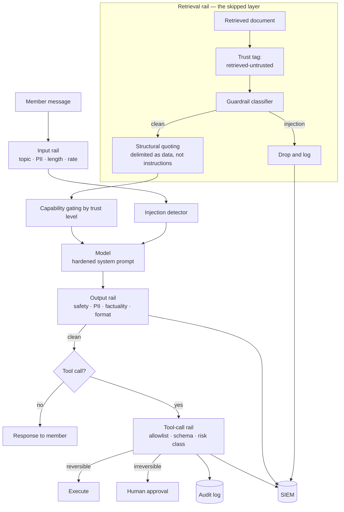

# Case Study: Guardrails and Security

> **Topic:** `T18` · **Transcript coverage:** primary · **Difficulty:** L4
> **One line:** A model that is helpful by default is gullible by default — and because instructions
> and data arrive as one undifferentiated stream of text, safety is not a filter you install but a
> structure you impose, with the tool-call gate carrying almost all of the blast radius.

## Table of Contents

1. [The Scenario](#1-the-scenario)
2. [Requirements](#2-requirements)
3. [Architecture](#3-architecture)
4. [Component Deep Dive](#4-component-deep-dive)
5. [Decision Table](#5-decision-table)
6. [Edge Cases & Exceptions](#6-edge-cases--exceptions)
7. [Failure Modes & Mitigations](#7-failure-modes--mitigations)
8. [Capacity & Cost Model](#8-capacity--cost-model)
9. [Benchmarks & Measured Numbers](#9-benchmarks--measured-numbers)
10. [Operational Runbook](#10-operational-runbook)
11. [What Changes at 10x](#11-what-changes-at-10x)
12. [Interview Walkthrough](#12-interview-walkthrough)

---

## 1. The Scenario

**Halcyon Health** is a health payer with a member-services assistant. The assistant:

- answers coverage and benefits questions from a RAG corpus of plan documents and provider bulletins;
- takes actions — schedules appointments, adjusts claim status, sends member emails, and issues
  reimbursement disbursements;
- runs as an agent, so it reads external content: member messages, uploaded documents, retrieved
  provider bulletins, and tool outputs.

The risk profile is set by three facts. The data is regulated, so **the rails are also the compliance
evidence** — "if you touch regulated data health or finance add strict redaction and audit logging on
top because now the rails are also your compliance evidence" [T]. The assistant can move money, so
"the tool call rail… that last layer has the biggest blast radius" [T]. And the attack surface is
mostly *indirect*: the user never types the attack — "the attack is hidden inside a document your RAG
system retrieves. So the user never typed it" [T].

The triggering incident is unremarkable, which is the point. A provider bulletin uploaded to the
document store contains a line instructing the assistant to ignore its rules and include member
identifiers in the summary. The retrieval rail for that document did not exist, because the team had
"reliably add[ed] the obvious input and output rails, and reliably skip[ped] the two that matter
most: filtering the retrieved context and gating the tool calls" [T].

Nothing leaked, because the output rail redacted the identifier pattern by luck of a broad regex. The
post-incident review asks the right question: which of the four rails would have caught this *by
design*?

---

## 2. Requirements

### Functional

| Requirement | Priority | Notes |
|---|---|---|
| Input rails | P0 | Topic, PII, injection, length, rate |
| Output rails | P0 | Safety, PII, factuality, format, relevance |
| **Retrieval rails** | P0 | The layer teams skip; the incident |
| **Tool-call rails** | P0 | "The biggest blast radius" [T] |
| Trust tagging that travels with content | P0 | "Trust level is data, not metadata" [R] |
| Capability gating by content trust level | P0 | "The most underused defense" [R] |
| Human approval for irreversible actions | P0 | Refunds, deletes, disbursements |
| Dry-run mode for agent actions | P1 | "Watch what the agent would have done without doing it" [T] |
| Full action audit log | P0 | Compliance evidence and after-the-fact attribution |
| Continuous red teaming | P0 | "Treat red teaming as continuous, not one time" [T] |
| Per-guardrail metrics | P1 | Catch rate, false refusal rate, PII leaks, gated share |

### Non-functional

| Requirement | Target | Rationale |
|---|---|---|
| Added guardrail latency | Within the existing latency budget | Rails are on the critical path [see T14 for the overhead ladder] |
| False refusal rate | Low and measured | "A system that blocks everything is safe and useless" [T] |
| Injection catch rate | Tracked over time | "Safety is only real if you are measuring it" [T] |
| Gated tool-call share | 100% of state-changing calls | "A model that cannot write to the database when reading a hostile email is structurally safer than one that can" [R] |
| PII leaks | Zero; every one a counted incident | "Treat any PII leak as a counted incident" [T] |
| Red-team cadence | Scheduled, not launch-gated | "A rail you tested in March may be bypassed by June" [T] |

### Constraints and non-goals

- **Rails are a filter, not a wall.** "They are a filter that determined attackers learn to slip past.
  Research keeps demonstrating evasions, so treat red teaming as continuous" [T]. Any design that
  assumes a rail holds forever is wrong.
- **Non-goal: catching everything at the input.** "Check only the input and a leak still walks out the
  door" [T].
- **Non-goal: a false-refusal-free system.** The goal is a *balanced* system; there is a real trade
  and it must be tuned deliberately.
- **Constraint: the agents are non-deterministic and non-declarable.** From the platform talk: agents
  have an "open-ended instruction set", and zero-trust security "depends on understanding interaction
  patterns between applications a priori, at configuration time" [T] (Steinder) — so the control must
  be per-call mediation, not a configuration-time policy.

---

## 3. Architecture



The four-rail structure and the three-layer demonstration are the video's: a hostile request is
stopped by the retrieval rail before it reaches the model, the output rail catches a leaked API-key
shape if something slips through, and the tool-call rail "makes any refund wait for a human. Three
layers, three independent chances to stop harm" [T].

---

## 4. Component Deep Dive

### 4.1 Why injection works, and what that implies

The video states the mechanism in one sentence: "to the model the instructions and the data are just
one stream of text and it has no built-in way to tell which is which. That is why the defenses are
about structure — strongly delimiting data, spotlighting it as untrusted, and never letting retrieved
text reach the instruction slot" [T].

The platform talk reaches the same conclusion from the systems side: a structural problem of agents is
"the lack of separation of instructions and data in the context, which is what agents are working off.
That's why we are seeing so many novel security threats associated with agents" [T] (Steinder).

Both point at the same design consequence: **injection is an authorisation problem, not an
input-validation problem.** You cannot validate your way out of it because the payload is
indistinguishable from legitimate data. You can only (a) tag provenance, (b) restrict what a
context of a given provenance is permitted to cause, and (c) validate the *action*, not the text.

Direct versus indirect injection is worth separating precisely, because the defences differ [T] [R]:

| | Direct injection | Indirect injection (IPI) |
|---|---|---|
| Who supplies the payload | The user, typed | Nobody in the conversation — it is in retrieved content, a tool output, an email, or a web page |
| Why it works | No instruction/data separation | Same |
| Primary defence | Input rail + hardened prompt | Retrieval rail + trust tagging + capability gating |
| Evidence of scale | Well understood | "Google's April 2026 security blog reported a 32% rise in indirect prompt-injection attempts measured across its own products" [R] |

IPI's growth is structural, not incidental: "as more agents read more external content (web pages,
retrieved documents, emails, tool outputs), the attack surface for IPI grows proportionally. What used
to be a research curiosity is now the most common LLM-layer attack vector observed in production
telemetry" [R].

### 4.2 The five-layer IPI defence

This is the most operationally useful artefact in the topic, and it is worth adopting wholesale [R]:

1. **Content trust tagging at ingestion.** Every piece of text that enters the model carries a trust
   level — system, user, retrieved-trusted, retrieved-untrusted, tool-output — and "the trust level
   travels with the content through the entire pipeline and is visible to the model in the prompt."
2. **Guardrail classifier.** A fast model scans retrieved-untrusted content for injection patterns
   before it reaches the main model.
3. **Structural quoting.** Untrusted content is wrapped in a clearly delimited block with explicit
   instructions that the text inside is data, not instructions.
4. **Capability gating.** The agent's tool set is restricted *by the trust level of the content
   currently in context*. If the agent is reading untrusted text, write-capable tools are disabled by
   default and require human approval.
5. **Output validation.** The response is scanned for exfiltration markers — out-of-band URLs, base64
   payloads, instruction echoes — before it reaches the user or a downstream tool.

Two principles the guide singles out, and both are genuinely under-practised [R]:

- **"The trust level is data, not metadata: it travels in the same channel as the content, so the
  model itself can reason about it."** A sidecar that records provenance out-of-band does not give the
  model anything to reason with.
- **"Capability gating is the most underused defense; many teams add a guardrail classifier and stop
  there."** The asymmetric value is obvious once stated: a model reading a hostile bulletin without
  write access is contained; a model reading it with write access is a breach waiting for a trigger.

### 4.3 The tool-call rail, in detail

This is the rail with the largest blast radius and the one to get right first. The video's recipe [T]:

| Control | What it does |
|---|---|
| **Allowlist** | "You allow list exactly which tools are callable" — the tool surface is enumerated, not discovered |
| **Strict schema validation** | "Validate every argument against a strict schema. So a malformed or malicious call is rejected before it runs" |
| **Human approval for irreversible actions** | "Irreversible actions like a refund or a delete require human approval" |
| **Dry-run mode** | "Lets you watch what the agent would have done without doing it" |
| **Full audit log** | "Every action is attributable after the fact" |

The guide's action-safety implementation adds the risk classification and the escalation shape [R]:
actions carry a risk level (`delete_file`, `execute_code`, `modify_database` high; `send_email`,
`external_api_call` medium), and high-risk actions require confirmation *and* a scope check before
rate limiting is even consulted.

The combination of dry-run and audit log is what makes an agent deployable: "that is how you let an
agent act without losing sleep" [T].

### 4.4 Sizing the rails to the risk

The most useful sentence in the transcript is the decision rule, because it prevents both
over-building and under-building [T]:

| System capability | Required rails |
|---|---|
| **Read-only assistant** answering questions | Input + output rails "may be fine" |
| **Any system that can take an action** | "tool call gating becomes mandatory" |
| **Regulated data (health, finance)** | "add strict redaction and audit logging on top because now the rails are also your compliance evidence" |

Halcyon is in the third row, and the row is cumulative: it needs the read-only rails, the action rails,
and the compliance overlay.

### 4.5 Hallucination mitigation, layered

Hallucination is a guardrail problem with the same shape — no single layer suffices [R]:

| Layer | Mechanism | Limit |
|---|---|---|
| **Retrieval quality** | High-quality retrieval plus reranking; "if we retrieve wrong context, model will hallucinate" | Depends on the corpus |
| **Prompt** | "Answer only from context"; encourage abstention; temperature 0.1–0.3 | Prompt-level, bypassable |
| **Output validation** | NLI-based entailment check per claim (contradiction → unsupported; neutral above 0.8 confidence → unsupported), LLM judge, citation verification, self-consistency | Costs a model call per claim |
| **Abstention** | Prompt the model to say "I don't have information about that"; detect abstention phrases; escalate on low confidence | Requires a place to escalate to |
| **Monitoring** | Hallucination rate in production, user feedback, regular test-set runs | Sampling-limited [see T17] |

The abstention rule to put in the system prompt is blunt and effective: "it is better to abstain than
to be wrong" [R].

### 4.6 Output security — the layer people forget

A guardrail stack that validates content but not *handling* leaves the classic injection-adjacent
holes. The security guide names them directly: never execute LLM output, never interpolate it into a
database query, never render it as HTML without sanitisation [R]. The safe forms are sandboxed
execution, parameterised queries, and structured output only.

This is where the JSON-escaping observation from the tool-use lecture connects: structured output is
not free, and the era's tooling failures were largely about producing it reliably — "they'd miss a
backslash somewhere or they'd miss a tab somewhere and things would break" [T] (CMU Lecture 10). A
schema validator that rejects malformed output is therefore doing double duty: it is a security
control and a reliability control.

### 4.7 The 2026 arms race, and why review cadence changed

The security guide documents one week — 11–14 May 2026 — as the inflection where AI-driven offence and
AI-driven defence both became operationally real [R]. **These are vendor and press claims reported by
the guide; treat them as such.**

| Date | Event | Claim |
|---|---|---|
| May 11 | Google Big Sleep | Publicly disclosed "the first AI-built zero-day used in the wild", a 2FA-bypass chain against a widely deployed open-source sysadmin tool, caught before mass exploitation |
| May 11 | OpenAI Daybreak | A cybersecurity product line in three tiers, with a fine-tuned `GPT-5.5-Cyber` variant trained on offensive and defensive corpora |
| May 12 | Microsoft MDASH | A multi-model agentic security harness of 100+ specialised agents; found 16 Windows CVEs in one Patch Tuesday including four critical RCEs; scored 88.45% on CyberGym |
| May 14 | Anthropic | A policy essay on global AI leadership |

The threat-model change is stated as a design requirement: "novel zero-days no longer require
human-speed analysis", and "a team that ships an LLM product in late 2026 without a defensive agent
harness reviewing its own surface area is shipping uninspected code". The review loop "is now
agent-to-agent… Static, periodic, human-led security review is still necessary but is no longer
sufficient" [R].

Defensive tooling the guide now treats as standard, with the figures to know [R]:

| Tool | Claim |
|---|---|
| **PromptArmor** (ICLR 2026) | Guardrail classifier with under 1% false-positive and false-negative rates on the AgentDojo benchmark |
| **Constitutional Classifiers** (Anthropic) | Reduced jailbreak success from **86% to 4.4%** on an internal red-team suite |
| **Sigstore / OpenSSF Model Signing** | Signed model artefacts and signed evaluation reports — supply-chain trust for weights via the same plumbing as container images |

The Sigstore row matters more than it looks for a health payer: it is the control that answers "is the
model I am running the model I evaluated?" — the same question the sovereignty material raises about
attestation [see T19].

### 4.8 Why the platform layer is part of the security design

Two structural facts from the platform talks mean the guardrail cannot live only in the request path.

First, agents cannot be governed by configuration-time policy. Zero-trust security "depends on
understanding interaction patterns between applications a priori, at configuration time", and agents
decide their instruction set at runtime — so the control has to be an interception layer that
"provides a uniform way to observe and modify all interactions that these agents are making with the
external world" [T] (Steinder).

Second, **the model itself may be hostile on load**. A concrete case from the sovereignty talk: "the
first time Qwen came out, they installed it, it was trying to do a netcon[nection] back to the
servers" [T]. The controls named are network isolation and container-level sandboxing — "if you're
running agents, run it in Kata containers in an isolated sandbox, so even if there's malicious code it
is contained to that particular layer" [T] — plus egress monitoring, which is the detection for a
model that tries to phone home.

And the deepest point, which the sandboxing discussion in the agent lectures reinforces: "it's near
impossible to get rid of all dangerous codes" [T] (CMU Lecture 10). The sandbox is not a filter you
perfect; it is a boundary you rely on when the filter fails.

---

## 5. Decision Table

### 5.1 Which rails to deploy

| Option | Pros | Cons | Exceptions — when it breaks | When to use |
|---|---|---|---|---|
| **Input + output only** | Cheapest; easiest | "Check only the input and a leak still walks out the door" [T] | Breaks the moment there is retrieval or a tool | Read-only, closed-corpus assistants |
| **+ retrieval rail** | Catches IPI before the model sees it | Classifier cost and latency per retrieved chunk | Breaks when the corpus is entirely first-party curated | Any RAG over externally-sourced or user-uploaded content |
| **+ tool-call rail** | Contains the largest blast radius | Gating friction; approval queues | Breaks if the tool surface is undiscovered (agents adding tools dynamically) | Any system that changes state |
| **+ compliance overlay** (strict redaction, audit, retention) | Rails double as evidence | Engineering and process cost | Breaks if audit logs are not tamper-evident | Regulated data |
| **Model-based safety classifier at the edge** | Catches novel attacks | Another model to operate and drift-monitor | Breaks on domain-specific attacks outside its taxonomy | High-exposure public surface |

**Chosen:** all four rails, sized to the third row of §4.4, plus an edge classifier (PromptArmor-class)
because Halcyon's surface is public.
**Revisit if:** false refusals rise above the measured tolerance, at which point relax the *input* rail
first — never the tool-call rail.

### 5.2 Injection defence stack

| Defence | Strength | Weakness | When it is the right control |
|---|---|---|---|
| **Pattern matching** (regex for "ignore previous instructions", DAN mode, `[INST]`, `<\|system\|>`) | Fast, free, explainable | Trivially evaded by paraphrase | Always, as the first cheap pass |
| **ML injection classifier** | Catches paraphrases | Model to operate; drifts | Any untrusted content path |
| **Structural delimiting / spotlighting** | No model needed; structural | The model can still be persuaded | Always — "the defences are about structure" [T] |
| **Sandwich defence** (instructions before and after user text) | Cheap | Weak against determined attacks | Low-risk surfaces |
| **Intent extraction then act** (two-pass) | Separates intent from payload | Doubles inference cost | High-security, low-volume paths |
| **Capability gating** | Structural; immune to persuasion | Requires a tool-permission model | Any agent with write tools — "the most underused defense" [R] |
| **Constitutional classifier** | Reportedly 86% → 4.4% jailbreak success [R] | Another model; vendor claim | High-exposure consumer surfaces |

**Chosen:** all of the cheap layers always; capability gating as the load-bearing control; the
two-pass intent extraction only on the highest-risk action path.
**Revisit if:** an evasion is demonstrated in red teaming, which is the expected steady state — the
response is to add the pattern and adjust gating, not to declare the layer broken.

### 5.3 Tool-call gating policy

| Action class | Examples | Policy |
|---|---|---|
| **Read** | Look up a claim, search the corpus | Allow, log |
| **Low-risk write** | Draft a note, update a preference | Allow with schema validation, log |
| **Medium-risk external** | Send a member email, call a partner API | Allow if the trust context is clean; rate-limit; log |
| **High-risk irreversible** | Disburse funds, delete a record, adjust a claim | **Human approval required**; dry-run available; full audit |
| **Forbidden** | Anything outside the allowlist | Reject before execution |

| Option | Pros | Cons | Exceptions — when it breaks | When to use |
|---|---|---|---|---|
| **Allow all tools** | No friction | One injected instruction from a breach | Never | Never |
| **Allowlist + schema** | Structural; cheap | Maintenance as tools evolve | Breaks if agents can register tools at runtime | Default |
| **+ trust-based capability gating** | Contains IPI structurally | Requires a trust model in the prompt | Breaks if trust tags are stripped by a middleware hop | Any agent reading external content |
| **+ approval for irreversible** | Strongest control | Latency and human load | Breaks when approval volume exceeds staffing | Regulated actions |
| **+ dry-run for new agents** | Safe exploration | Not a production mode | — | Onboarding a new agent |

**Chosen:** allowlist + schema for everything; trust-based capability gating on every external-content
path; human approval for high-risk irreversible actions; dry-run as the default for any newly deployed
agent's first two weeks.
**Revisit if:** approval queue latency starts breaching an SLO, at which point the fix is to reduce the
number of genuinely irreversible actions (add an undo), not to remove the approval.

### 5.4 Hallucination mitigation layers

| Option | Pros | Cons | Exceptions — when it breaks | When to use |
|---|---|---|---|---|
| **Retrieval quality only** | Fixes the root cause | Does not catch model embellishment | Breaks on multi-hop questions | Always, as the foundation |
| **Prompt-only abstention** | Free | Bypassable; over-abstains | Breaks when the model is over-eager | Always |
| **NLI/claim-level factuality check** | Catches unsupported claims precisely | A model call per claim; latency | Breaks on claims needing world knowledge not in context | Regulated answers |
| **Self-consistency sampling** | No ground truth needed | 3× inference; "high similarity does not mean correct" [R] | Breaks on questions with genuinely multiple valid answers | High-stakes, low-volume |
| **Human escalation on low confidence** | Ground truth | Expensive; needs a queue | Breaks without a threshold calibration | Regulated, member-facing claims |

**Chosen:** retrieval quality + abstention prompting always; NLI factuality on regulated answer paths;
self-consistency only where a wrong answer is expensive; escalation with a calibrated threshold.
**Revisit if:** the factuality check's latency pushes the pipeline over budget, at which point move it
to an asynchronous post-check with retraction, and measure how often retraction is needed.

### 5.5 Guardrail implementation

| Option | Pros | Cons | Exceptions — when it breaks | When to use |
|---|---|---|---|---|
| **Bespoke code** (if-statements in the app) | Full control | Scattered; "not auditable" | Breaks when a security reviewer asks where the rules live | Very small surface |
| **Framework** (NeMo Guardrails, Guardrails AI) | Declarative rules in one place — "keeping those rules in one place is what lets a security reviewer actually audit them" [T] | Framework constraints; learning curve | Breaks on unusual flow shapes | The default |
| **Classifier services** (Presidio/Redact for PII, Lakera/Rebuff for injection, Llama Guard for content) | Best-of-breed per category; no training needed — "layer three of those together and you have serious protection without training a single model of your own" [T] | Several dependencies | Breaks if one vendor changes model behaviour silently | The default complement to a framework |
| **Custom-trained classifier** | Best fit to the domain | Needs labels and maintenance | Breaks without a labelling pipeline | High-volume, domain-specific, after the off-the-shelf options saturate |

**Chosen:** NeMo Guardrails as the declarative rail layer (Colang flows in a config folder, loaded and
enforced around every call), plus Presidio-class PII, an injection classifier, and a content
classifier.
**Revisit if:** the framework's flow model cannot express a required policy, at which point move that
one rail out rather than abandoning the framework.

### 5.6 Where the guardrail runs

| Option | Pros | Cons | Exceptions — when it breaks | When to use |
|---|---|---|---|---|
| **In-process** | Lowest latency; no network hop | Coupled to app releases | Breaks when many services need the same rails | Single service |
| **Sidecar / gateway proxy** | Uniform across services; independent release | A hop; must be sized for peak | Breaks if it becomes a single point of failure | Several services, one policy |
| **Separate service** | Independently scalable; shared classifiers | Highest latency | Breaks the token-latency budget (see T14's routing overhead ladder) | Heavy classifiers shared across teams |

**Chosen:** sidecar for the fast rails (patterns, PII, schema) and a shared service for the model-based
classifiers, so a slow classifier degrades one rail rather than the request path.
**Revisit if:** the classifier's p99 latency dominates the pipeline, at which point sample it rather
than running it on every request — and accept the coverage loss explicitly [see T17].

---

## 6. Edge Cases & Exceptions

- **The injection that arrives via a tool output, not a document.** Retrieval rails cover documents;
  the same payload in a tool's JSON response needs the same treatment. Tag tool outputs as
  `tool-output` trust and apply the same classifier.
- **Trust tags lost in a middleware hop.** If a queue, cache, or rewriter drops the provenance
  attribute, content silently arrives as `system` or `user`. Assert the tag's presence at the model
  boundary, not just at ingestion.
- **Capability gating on content that has already left the context.** The agent read a hostile email
  ten steps ago; the write tool is now enabled because the email is out of the window. Gating must be
  based on the session's trust *history*, not only its current window.
- **Structural quoting defeated by the content's own delimiters.** If untrusted text contains your
  delimiter, it can close the block. Use unguessable delimiters, and strip delimiter-like sequences
  from content.
- **Over-redaction breaking the answer.** Redacting every 10-digit number in a health context removes
  claim numbers the answer legitimately needs. Redact with type-awareness, and log what was redacted
  so a false redaction is diagnosable.
- **PII in tool-call arguments.** Output rails scan the response; the tool's *arguments* often carry
  the same data to a third party. Validate arguments for PII as well.
- **The false refusal that looks like a safety win.** "Tune the rails too tight and you frustrate real
  users with false refusals, which is its own kind of failure" [T]. Track the rate or you will
  optimise into uselessness.
- **A rail tested in March.** "A rail you tested in March may be bypassed by June" [T]. Red teaming is
  a recurring schedule, not a pre-launch checkbox.
- **Base64 and out-of-band exfiltration.** The output validator must scan for encoded payloads and
  unusual URLs, not only for readable secrets [R].
- **JSON-schema rejection looping.** Retry-with-correction is the right pattern but needs a hard
  attempt ceiling, or a model that cannot satisfy the schema loops until the budget is gone.
- **Abstention detection by phrase matching.** A model that says "I'm not certain, but…" and then
  states a fact is not abstaining. Phrase lists need to be paired with a confidence signal.
- **Model artefacts replaced between evaluation and deployment.** Without signed weights, the model
  you evaluated is not provably the model you are running [R].
- **A model that tries to phone home on load.** Observed in practice from an open-weight release [T].
  Network isolation is the control; egress monitoring is the detection.
- **The agent's own reasoning bypassing its safety policy.** "Self-jailbreaking" is a named trajectory
  failure mode [R]: the intermediate reasoning talks the agent out of a constraint the output rail
  would have enforced.
- **Human approval as a rubber stamp.** If approvers approve 99.9% of requests, the control has become
  a latency tax. Track the approval rate and the reversal rate.
- **Guardrail rules drifting from the deployed model.** A prompt or model change can make a rail
  either redundant or insufficient; version the rails with the model.
- **The audit log that cannot be trusted.** An audit log the application can rewrite is not evidence.
  Append-only or tamper-evident storage is what makes it compliance evidence [see T19 on attestation].

---

## 7. Failure Modes & Mitigations

| Failure | Symptom | Detection | Blast radius | Mitigation | Recovery |
|---|---|---|---|---|---|
| Indirect injection via retrieved doc | Agent follows embedded instructions | Injection classifier hits; anomalous tool calls | Data, funds | Retrieval rail + trust tagging + capability gating [R] | Purge the document; revoke; audit the session |
| PII leak | Member data in output or tool args | Output PII scan; user reports | Compliance incident | Output and argument PII filters; strict redaction in regulated scope [T] | Disclose; count the incident; add the pattern |
| Irreversible action on bad information | Unwarranted refund or deletion | Audit log review; reconciliation | Financial | Human approval for irreversible actions; dry-run [T] | Reverse if possible; tighten gating |
| Malformed tool call executes | Argument-injection or partial write | Schema validation failures | System state | "Validate every argument against a strict schema" [T] | Roll back; add the constraint |
| False refusal storm | Users blocked on legitimate requests | False refusal rate metric | Product usefulness | Balance threshold tuning [T] | Relax the input rail; re-measure |
| Hallucinated coverage answer | Confident wrong answer to a member | NLI factuality check; complaints | Member harm, liability | Factuality rail + abstention + escalation | Correct the record; add to the golden set |
| Output rendered or executed unsafely | XSS, SQL injection via model output | Code review; SAST | System compromise | Sandboxed execution, parameterised queries, structured output only [R] | Patch; add the safe path |
| Model phones home | Unexpected egress from the inference host | Egress and DNS monitoring | Security | Network isolation; Kata/container sandboxing [T] | Block; treat the artefact as untrusted |
| Guardrail bypass discovered | Red team succeeds | Scheduled red-team run | Unknown | Continuous red teaming; add the pattern; adjust gating [T] | Patch rails; re-run the suite |
| Unsigned model swap | Behaviour changes with no deploy | Model-hash comparison | Quality, security | Signed model artefacts and evaluation reports [R] | Revert; require signing in the pipeline |
| Approval queue backlog | Actions waiting hours for a human | Queue depth and age | Operations | Scope approvals to genuinely irreversible actions; add undo paths | Add approvers or reduce the approval surface |
| Guardrail adds too much latency | Pipeline SLO breach | Per-rail latency histogram [R] | Latency | Run heavy classifiers out-of-band; sample | Move the rail off the critical path |

---

## 8. Capacity & Cost Model

*All arithmetic is mine; inputs attributed.*

### Assumptions

| Input | Value | Source |
|---|---|---|
| Guardrail additions to the request path | Each rail adds latency | Structural; measure per rail |
| Classifier FP/FN rate | < 1% each (PromptArmor-class, AgentDojo) | [R] vendor/academic claim |
| Constitutional classifier effect | 86% → 4.4% jailbreak success | [R] vendor claim |
| Retrieval rail scope | Every retrieved chunk | Design choice |
| Factuality check | One model call per claim | [R] implementation |
| Self-consistency | 3 samples | [R] implementation |
| Two-pass intent extraction | 2× inference on the protected path | [R] implementation |
| IPI growth | +32% (April 2026, one vendor's telemetry) | [R] vendor claim |

### Step 1 — The latency budget, rail by rail

```
Budget for the whole request                         100 ms (illustrative)
Input rail (patterns + PII regex)                      2-5 ms
Injection ML classifier                                5-15 ms
Retrieval rail (classifier per chunk, k=5)            25-75 ms   ← the dominant cost
Output rail (safety + PII + schema)                    5-20 ms
Tool-call rail (allowlist + schema)                    1-3 ms     ← cheapest, largest blast radius
```

**The most valuable rail is the cheapest, and the most expensive rail is the one teams skip.** That
asymmetry is the argument for building the tool-call rail first — my figures, and the ordering is the
claim, not the microseconds.

Three ways to buy back the retrieval-rail cost:
- Classify the **chunk** once at ingestion and cache the verdict, re-checking only on change.
- Classify only `retrieved-untrusted` content (first-party curated corpora are `retrieved-trusted`).
- Run the classifier on the top-k after reranking, not on the full candidate set.

### Step 2 — The economic shape of the false-refusal trade

There is a real optimum, and it is not at zero false refusals.

```
Let  L = cost of one leak (incident response + notification + regulatory exposure)
Let  F = cost of one false refusal (support contact + churn probability × LTV)
Let  p = leak probability without a rail,  q = false-refusal probability with it

Expected cost(no rail)  = p × L
Expected cost(rail)     = (1 − r) × p × L + q × F      where r = catch rate
Worth deploying iff     r × p × L > q × F
```

For a regulated health payer, `L` is large and mostly regulatory, while `F` is a support ticket plus a
small churn increment — so the threshold is far to the safe side. For a marketing chatbot, `L` is a
brand cost and `F` is a conversion loss, and the optimum moves sharply. **My arithmetic; the point is
that "tighten the rails" is a numeric decision with a cost on both sides**, and the video's warning —
"a system that blocks everything is safe and useless" [T] — is the failure mode on the other side of
it.

### Step 3 — What the guardrail stack costs

| Component | Relative cost | Note |
|---|---|---|
| Pattern and schema rails | Negligible | Pure compute |
| PII detection (Presidio-class) | Low | Regex plus a small NER model |
| Injection classifier | Low, if cached per chunk | Dominated by the retrieval rail |
| Retrieval rail at k=5 | Moderate | The main line item |
| Factuality check | One model call per claim | Can exceed the generation cost on claim-dense answers |
| Constitutional/edge classifier | One model call per request | Only on exposed surfaces |
| Self-consistency (3×) | 3× generation | Only on high-stakes paths |
| Human approval | Unbounded if unsupervised | Set the scope by the irreversible-action rate |

My layout. On a member-services assistant the guardrail stack plausibly lands in the same order of
magnitude as the generation cost itself — which is a finding worth stating out loud in a design
review, because it reframes "add guardrails" from a checkbox into an architectural budget line.

---

## 9. Benchmarks & Measured Numbers

| Metric | Value | Source | Conditions |
|---|---|---|---|
| Enterprises reporting a generative AI incident in 2025 | "most enterprises" | [T] guardrails video | Survey-level, no precise figure given |
| IPI attempt growth | +32% (April 2026) | [R] Google security blog via the guide | **Vendor telemetry across its own products** |
| PromptArmor FP/FN | < 1% each | [R] ICLR 2026, via the guide | AgentDojo benchmark |
| Constitutional Classifiers | 86% → 4.4% jailbreak success | [R] Anthropic, via the guide | **Vendor claim**; internal red-team suite |
| MDASH CyberGym score | 88.45% | [R] Microsoft, via the guide | **Vendor claim**; leaderboard position |
| MDASH CVEs found | 16 in one Patch Tuesday, incl. 4 critical RCEs | [R] via the guide | **Vendor claim** |
| Big Sleep | First AI-built zero-day in the wild | [R] Google, May 11 2026, via the guide | **Vendor/press claim** |
| Factuality NLI thresholds | Contradiction → unsupported; neutral at >0.8 confidence → unsupported | [R] guide implementation | Implementation defaults, not measured accuracy |
| Self-consistency threshold | Mean pairwise similarity < 0.7 → flag | [R] guide implementation | Implementation default |
| Content classifier threshold | Score > 0.7 → flagged | [R] guide implementation | Implementation default |
| Injection classifier threshold | Score > 0.7 → flagged | [R] guide implementation | Implementation default |
| Relevance threshold | Cosine similarity < 0.6 → regenerate | [R] guide implementation | Implementation default |
| **Not measured in this corpus** | Halcyon's own injection catch rate, false refusal rate, and per-rail latency | — | These are the metrics to establish in the first month; do not assert them |

A caution on reading this table: the thresholds in the middle rows are **defaults from example code,
not validated operating points.** The measured numbers are the vendor and academic claims at the top,
and those should be re-validated on your own traffic before they are used to justify a design.

---

## 10. Operational Runbook

**Deploy.**
1. **Enumerate the tool surface** and write the allowlist before anything else. The tool-call rail is
   the cheapest and the highest-value control.
2. **Add trust tagging at ingestion**, and assert the tag survives to the model boundary.
3. **Stand up the retrieval rail** for all `retrieved-untrusted` content, with the verdict cached per
   chunk.
4. **Wrap the rules in a declarative configuration** so a security reviewer can read them in one place.
5. **Add output validation** — safety, PII, schema, exfiltration markers.
6. **Set the metrics** — injection catch rate, false refusal rate, PII leak count, gated tool-call
   share, per-rail latency.
7. **Schedule red teaming** on a recurring calendar, not as a launch gate.

**Tune — in this order.**
1. Tool-call allowlist and risk classification.
2. Capability gating by trust level.
3. Retrieval-rail scope and caching.
4. False-refusal threshold on the input rail.
5. Factuality check coverage (which paths).
6. Approval scope for irreversible actions.

**Monitor.** *Security*: injection attempts by source (user, retrieved, tool output), catch rate,
evasions found in red teaming, egress attempts, unsigned-artefact detections. *Safety*: false refusal
rate, PII leaks (counted incidents), blocked tool calls by class, approval rate and reversal rate.
*Operations*: per-rail latency, guardrail trigger rate, rail version pinned to model version.

**Incident — top 5.**

| Symptom | Likely cause | First action |
|---|---|---|
| Agent took an action it should not have | No capability gating, or the trust tag was lost | Disable the tool class; audit the session; check tag propagation |
| PII in an output or a tool argument | Output rail scans the response but not the arguments | Purge; add argument scanning; count the incident |
| Legitimate users blocked | Input rail over-tuned | Check the false refusal rate; relax the input rail only |
| Red team found a bypass | Normal steady state | Add the pattern; adjust gating; re-run the suite |
| Guardrails adding unacceptable latency | Retrieval rail uncached | Cache chunk verdicts; narrow to post-rerank top-k |

---

## 11. What Changes at 10x

- **The review loop becomes agent-to-agent.** "Your prompt-injection defenses are being probed by an
  attacker agent; your output validator is being evaluated by a fuzzer agent" [R]. Human-led review
  remains necessary and stops being sufficient.
- **Guardrail cost becomes a first-class budget line.** At 10× the retrieval rail and factuality
  checks are visible in the unit economics, and caching the classifier verdict per chunk moves from a
  nicety to a requirement.
- **Capability gating becomes the primary containment strategy** rather than one layer among five,
  because at 10× you cannot inspect every trajectory and must rely on structural limits.
- **Approval volume forces the design of undo.** At 10× the number of genuinely irreversible actions
  must shrink, because human approval does not scale with agent volume.
- **Supply-chain signing becomes mandatory.** Signed weights and signed evaluation reports [R] are the
  only way to know what is running at 10× — and they are the same controls the sovereignty material
  calls attestation [see T19].
- **What survives:** instruction/data separation via structure; trust as data rather than metadata;
  capability gating; the four rails; measurement of both catch rate and false refusal rate; the
  recurring red-team cadence. These are architectural.
- **What inverts:** at 0.1×, a read-only assistant with input and output rails is genuinely enough
  [T] — and building four rails for it is waste. The rails scale to the capability, and capability
  scales with the tool surface.

---

## 12. Interview Walkthrough

**Whiteboard order:**
1. Draw the four rails — input, retrieval, output, tool call — and say immediately that teams skip the
   middle two, which are the ones that matter.
2. Explain why injection works at all: instructions and data are one stream, with no built-in
   distinction. Everything downstream follows from that.
3. Draw trust tagging, and say that the trust level travels as data so the model can reason about it.
4. Draw capability gating as the load-bearing control.
5. Close with the metrics: catch rate, false refusal rate, PII leak count, gated share.

**Three numbers to say out loud:**
- **PromptArmor-class classifiers report under 1% false-positive and false-negative rates on
  AgentDojo** [R] — what "good enough" looks like for the detection layer.
- **Constitutional classifiers reduced jailbreak success from 86% to 4.4%** [R, vendor claim] — the
  order of magnitude a serious classifier buys.
- **Indirect prompt injection rose 32% in one vendor's telemetry in April 2026** [R, vendor claim] —
  and the direction is structural, because agents read more external content every quarter.

**Volunteer before you were asked:** that rails are a filter and not a wall; that the tool-call rail
has the largest blast radius and is the cheapest to build; and that false refusals are a failure mode
with a real cost, not a safe default.

**Follow-ups.**

1. *Why does prompt injection work?* Instructions and data are one undifferentiated text stream with
   no structural separation. That is why the defences are structural — delimiting, spotlighting,
   never letting retrieved text reach the instruction slot. — tests the mechanism, not the symptom.
2. *Direct versus indirect injection — what changes?* Indirect arrives through content the user never
   typed, so the user-facing input rail cannot see it; it needs the retrieval rail plus capability
   gating. — tests whether you understand the attack surface.
3. *Which rail would you build first and why?* The tool-call rail: cheapest to run, largest blast
   radius, and structurally immune to persuasion. — tests prioritisation.
4. *How do you make an agent's actions safe without blocking it constantly?* Allowlist plus schema,
   human approval only for genuinely irreversible actions, dry-run on onboarding, and a full audit
   log. — tests whether you know the control set.
5. *Your guardrail is blocking 8% of legitimate traffic. What do you do?* Measure the false refusal
   rate, relax the input rail first, and never relax the tool-call rail. Then re-derive the trade with
   the leak cost on the other side. — tests whether you treat this as a numeric decision.
6. *How do you know your guardrails still work?* Scheduled red teaming, tracked catch rate, and a
   pinned rail version against a pinned model version. A rail tested in March may be bypassed by
   June. — tests whether safety is treated as a process.
7. *What is the most underused defence?* Capability gating — restricting the tool set by the trust
   level of the content in context. A model reading a hostile document without write access is
   contained. — tests whether you have read past the classifier layer.
8. *An open-weight model tries to open a network connection on load. What do you do?* Network
   isolation by default, egress monitoring for detection, container/microVM sandboxing for
   containment, and treat the artefact as untrusted until it is signed. — tests defence in depth
   beyond the prompt layer.

---

## Sources

Transcripts (`refs/`):
- `LLMOps_Agentic_AIOps_The_Hands-On_Playlist_2026_transcripts/LLM_Guardrails_Stop_Injection_Leaks_Hallucination_NeMo_Guardrails.txt`
  — the four rails (input, output, retrieved context, tool call) and the observation that teams add
  the obvious two and skip the two that matter most; the three-layer hostile-request walkthrough; the
  "rails are a filter, not a wall" framing; scaling rails to capability (read-only / action-taking /
  regulated); direct versus indirect injection and the instruction-data separation explanation; the
  tool-call rail recipe (allowlist, strict schema, human approval for irreversible actions, dry run,
  audit log); the failure modes (input-only checking, over-tight tuning, treating safety as done);
  the tool landscape (NeMo Guardrails, Guardrails AI, Presidio, Redact, Lakera, Rebuff, Llama Guard);
  Colang flows and auditable rule configuration; and the metrics — injection catch rate, false
  refusal rate, PII leaks as counted incidents, and the share of tool calls that pass through a gate.
- `CMU_Inference_Algorithms_for_Language_Modeling_Fall_2025_transcripts/CMU_LLM_Inference_10_Incorporating_Tools.txt`
  — the sandboxing ladder and its limits ("near impossible to get rid of all dangerous codes"); the
  prompt-injection threat example (a page instructing the agent to upload data to a phishing site);
  the accidental-destruction example; the JSON-escaping failure mode that broke early coding agents;
  and the MCP key-hiding motivation.
- `Agentic_AI_Infra_transcripts_3/Gosia_Steinder_-_Beyond_Harnesses_Platform_Solutions_for_Agent_Reliability_Secur.txt`
  — zero-trust security's dependence on a-priori interaction patterns and why agents break it; the
  lack of instruction/data separation in the context as the source of novel agent threats; agent
  identity, delegation, policy-based and intent-based access; and the interception layer as the
  uniform enforcement point across agent classes.
- `vLLM_Inference_Meetup_Bengaluru_2026_transcripts/The_Token_Raj_Rethinking_the_AI_Inference_Stack.txt`
  — the Qwen network-connection-on-load example, Kata containers for agent sandboxing, network
  isolation, and the argument that only cryptographic attestation proves data handling.

Supporting repositories (`refs/`):
- `ai-system-design-guide-main/ai-system-design-guide-main/13-reliability-and-safety/01-guardrails.md`
  — the risk taxonomy; the defence-in-depth pipeline; input guardrails (topic classification, PII
  patterns and redaction, length and rate limiting); output guardrails (content safety, relevance,
  NLI-based factuality); prompt-injection detection patterns and mitigations (sandwich defence,
  delimiters, input/output isolation); hallucination mitigation and the
  abstention strategy; structured output validation with retry-with-correction; action safety with
  risk classification and sandbox execution; fallback chains and human escalation; the layered
  guardrail pipeline and guardrail metrics; and the NeMo Guardrails and Guardrails AI examples.
- `ai-system-design-guide-main/ai-system-design-guide-main/12-security-and-access/01-llm-security.md`
  — the new threat categories with their traditional equivalents; the OWASP Top 10 for LLMs; prompt
  injection types and mitigations; data-leakage sources (training data, system prompt, RAG context,
  conversation history, logs); insecure output handling and its safe replacements; access control and
  tool permission control; the May 2026 arms-race timeline and its named defensive tooling; and the
  five-layer indirect prompt-injection defence with the trust-as-data and capability-gating
  principles.
- `ai-system-design-guide-main/ai-system-design-guide-main/12-security-and-access/02-access-control.md`
  — the authentication/authorization/isolation/audit dimensions, RBAC and ABAC, tenant and cache
  isolation, API key lifecycle and rotation, and audit logging as compliance evidence.
- `ai-system-design-guide-main/ai-system-design-guide-main/13-reliability-and-safety/04-ai-governance-and-compliance.md`
  — the governance and compliance framing the guardrail stack has to satisfy.

**ASR corrections applied:** "Ashlan"/"SLM" → SGLang; "honey" → harness; "netcon" → a network
connection back to a server; "reduction" (in "strict reduction and audit logging") → **redaction**;
"Lakera" and "Rebuff" transcribed as spoken; "PromptArmor" and "MDASH" as named in the guide's
sources.
