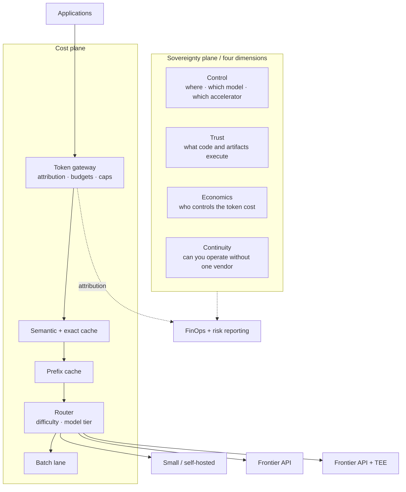

# Case Study: FinOps, Token Economics and Sovereignty

> **Topic:** `T19` · **Transcript coverage:** primary · **Difficulty:** L4
> **One line:** Token spend and sovereignty are the same argument seen from two sides — both are
> about who controls the layer that turns your data into value, and both are settled by
> measurement and attestation rather than by intent.

## Table of Contents

1. [The Scenario](#1-the-scenario)
2. [Requirements](#2-requirements)
3. [Architecture](#3-architecture)
4. [Component Deep Dive](#4-component-deep-dive)
5. [Decision Table](#5-decision-table)
6. [Edge Cases & Exceptions](#6-edge-cases--exceptions)
7. [Failure Modes & Mitigations](#7-failure-modes--mitigations)
8. [Capacity & Cost Model](#8-capacity--cost-model)
9. [Benchmarks & Measured Numbers](#9-benchmarks--measured-numbers)
10. [Operational Runbook](#10-operational-runbook)
11. [What Changes at 10x](#11-what-changes-at-10x)
12. [Interview Walkthrough](#12-interview-walkthrough)

---

## 1. The Scenario

**Northgate Financial** is a mid-size bank with 4,000 employees. It runs two AI products:

- **Northgate Copilot** — an internal coding and document assistant for 1,200 engineers and analysts.
  Token consumption grew **4.3× year over year** with roughly flat headcount. Finance has asked for a
  plan, not an explanation.
- **Northgate Assist** — a customer-service agent that reads account history, drafts replies, and
  escalates to humans. It runs against a frontier model API.

Two events land in the same quarter.

**The bill.** The CFO forwards an internal memo: several teams have "exhausted all their token
budgets in the first three or four months of the year" [T] (the pattern described in *The Token Raj*),
and the vendor has removed the introductory discount. The engineering lead's own observation matches
the talk's: most of the tokens are now spent "for explaining what you have written" rather than for
writing it [T].

**The regulator.** The bank's supervisor asks a question the compliance team cannot answer with a
contract: *prove that customer data processed by the AI is not readable by the model provider or by
the infrastructure provider.* The team's current answer — a signed data-processing agreement — is
exactly the answer the *Token Raj* speaker dismisses: "you can't legislate a memory dump" [T].

The organisational constraint is that these two problems are owned by different people. The CFO owns
the bill; the Chief Risk Officer owns the regulator. **They are the same problem** — both are about
who controls the inference layer — and the whole point of this case study is that solving them
separately is more expensive than solving them together.

---

## 2. Requirements

### Functional

| Requirement | Priority | Notes |
|---|---|---|
| Per-team, per-feature, per-tenant token attribution | P0 | Cannot manage what is untagged |
| Cost reduction of ≥ 50% with no measurable quality loss | P0 | The CFO's ask |
| Hard per-run ceilings for agentic workloads | P0 | "Runaway agents have burned tens of thousands of dollars over a single weekend" [R] |
| Cryptographic attestation of the inference environment | P0 | The regulator |
| Regional confinement of regulated data | P0 | Contractual and statutory |
| Exit path to a second model and a second accelerator | P1 | "Can you operate without a single vendor?" [T] |

### Non-functional

| Requirement | Target | Rationale |
|---|---|---|
| Cache-hit rate on the static prefix | > 85% | The system prompt is ~69% of input tokens [R] |
| Reasoning-token share of output spend | Visible and gated | Billed at output rate and invisible in the response [R] |
| Cost per resolved support case | Known and trended | "Know your cost per resolution before you price per resolution" [R] |
| Confidential-computing throughput penalty | ≤ 25% | "It's not going to run as fast as what it was running before" [T] — quantified, not hand-waved |
| Attribution coverage | 100% of API calls tagged | Without it there is no unit economics [R] |
| Time to produce an attestation for an auditor | < 1 day | The regulator's cadence |

### Constraints and non-goals

- **Non-goal: training.** "You train once and probably you do some other training and then that's it.
  But inference is not like that" [T] (*Sovereign AI Inference*). Inference is 80–90% of total GenAI
  spend in many deployments [R], so the discipline is per-request economics.
- **Non-goal: buying silicon.** "Unless you're a silicon accelerator [company] you can't [own] your
  own hardware… but what you can absolutely control is your software" [T] (*The Token Raj*).
- **Constraint: this is not purely an engineering problem.** Sovereignty has legal, commercial and
  geopolitical dimensions; the case study treats those explicitly rather than modelling them away.
- **Constraint: sovereignty is not binary.** "Think about sovereignty as something like binary —
  it's a sovereign setup or non-sovereign setup. I think that's wrong… you need to start looking at
  it as a system property, and this particular system property has various dimensions" [T]
  (*Sovereign AI Inference*).

---

## 3. Architecture



The two planes are drawn separately because they are usually owned separately — and the design
insight is that they should share one enforcement point. The token gateway is the only component that
sees every call, so it is also the only place where residency policy, budget policy and attribution
can be enforced *once*. The *Token Raj* speaker makes the sovereignty version of this argument: "stop
asking your vendors the contracts of sovereignty, ask them to cryptographically prove the
attestation" [T] — a demand that can only be met if you know, per request, which environment served
it.

---

## 4. Component Deep Dive

### 4.1 The cost stack, layer by layer

The supporting guide's decomposition is the best available map, and its anchor statistic is the one
to memorise: **system prompts are about 69% of input tokens, yet only about 28% of calls use prompt
caching** [R] (`11-infrastructure-and-mlops/04-finops-and-token-economics.md`, citing Datadog's 2026
State of AI Engineering). The single largest, cheapest lever in most stacks is sitting unused.

| Layer | Driven by | Behaviour | Primary lever |
|---|---|---|---|
| System prompt / instructions | Fixed scaffolding, tool defs, few-shot | ~69% of input tokens, paid every call if uncached | Prompt caching |
| Retrieved / context tokens | RAG chunks, injected documents | Scales with k and chunk size | RAG vs long context |
| Conversation / memory | Chat history, agent scratchpad | Grows unbounded without summarisation | Windowing, compaction |
| Model tier | Frontier vs mid vs small/self-host | 10–100× spread | Right-sizing, cascades, routing |
| Output length | Verbosity, format, `max_tokens` | Billed at the higher output rate | Caps, terse output contracts |
| Reasoning / thinking tokens | Extended thinking | **Billed at output rate, invisible in the response** | Gate thinking by task complexity |
| Retry / overhead | Transient errors, guardrail re-runs | Multiplies on failure | Bounded retries, circuit breakers |
| Agent multi-step | Plan–act–observe loops, sub-agents | Multiplies the whole stack per step | Step ceilings, per-run budgets |

The two rows that surprise people are the last two. Reasoning tokens are billed at the output rate —
the expensive rate — and "do not appear in the response, so a 'short' call can cost an order of
magnitude more than its visible output suggests", with reported multipliers "anywhere from ~3× to
~15× depending on the task" [R]. And agents multiply the *entire* stack on every step, which is why
the right unit is **cost per task, not cost per call**: "a chat turn is cents, while an agentic
multi-step task can run from tens of cents to several dollars" [R]. Saurabh Tiwary's figure is the
same fact from the capacity side: an agentic task is "10 to 100× more expensive in terms of inference
compute… compared to non-agentic workload" [T].

### 4.2 The levers, ranked by (saving × ease)

The cost talk's ladder is the practitioner's version: an order-of-magnitude reduction comes from
*stacking* techniques, "not from any single hero optimization" [T]. Its headline is that the
combination takes you "from a naive baseline to roughly a tenth of the cost with no change to the
model itself" [T]. Its stated ordering principle is decisive about what to do first: "before you
touch the model at all, exhaust the free wins. Prompt caching and difficulty-based routing usually
move the bill more than switching models does" [T].

And the sentence that should be on the wall of every platform team: **"Optimization without
measurement is just guessing"** [T].

| Rank | Lever | Mechanism | Claimed effect | Cost to adopt |
|---|---|---|---|---|
| 1 | **Prompt / prefix caching** | Stable prefix cached at the provider or in your own KV tier | Cache reads "roughly 10 times cheaper than fresh tokens" [T]; provider discounts ~50% (OpenAI) to ~90% (Anthropic) to ~75% (Google) [R] | Config + prompt discipline |
| 2 | **Difficulty-based routing** | Easy majority to a small model, hard tail to the frontier | "often cuts total spend by half" [T]; cascades 45–85% at ~95% quality [R] | A routing tier |
| 3 | **Context discipline** | Trim bloated context | Every wasted token "is charged twice, once on the invoice and once as latency" [T] | Prompt engineering |
| 4 | **Output caps** | `max_tokens`, terse contracts, negative prompting | 20–40% token cut [R]; "don't be wordy" saves ~15% of output tokens [R] | Free |
| 5 | **Quantisation** | 4-bit on self-hosted models | Enables smaller/cheaper hardware | "Nearly free on many models, but on some it quietly drops accuracy — always rerun your evals" [T] |
| 6 | **Batch lane** | Offline work via the batch API | ~50% discount, ~24 h ceiling [R] | Queue plumbing |
| 7 | **Distillation** | Fine-tune a small model on a locked eval | 5–40× per-token cost cut [R] | Data + training + eval ownership |
| 8 | **Reserved throughput** | Provisioned capacity | 15–70% on sustained, predictable load [R] | A commitment |

### 4.3 Attribution, and why showback comes first

The guide's FinOps section reduces to four practices [R]:

- **Attribution** — "tag every call by team, feature, customer/tenant, model, route, and
  environment", with a token proxy or gateway as the technical enabler. "Without attribution there is
  no way to compute unit economics."
- **Showback before chargeback** — dashboards first, billing later, "once the tags are trustworthy".
- **Unit economics** — cost per user, conversation, resolved ticket; AI cost as a percentage of
  revenue *and* of gross margin.
- **Margin reality** — AI-product gross margins are reported roughly **25–30 points below** the
  80–90% of traditional SaaS, because every request carries a variable cost. This is why outcome-based
  pricing is rising, and why the imperative is to "know your cost per resolution before you price per
  resolution".

For Northgate, the sequencing matters politically as much as technically: chargeback to a team before
the tags are trusted produces a fight about the numbers instead of a plan to reduce them.

### 4.4 The four dimensions of sovereignty

This is the framing to carry, verbatim from the *Sovereign AI Inference* talk. Sovereignty is not a
binary state but "a system property" with four dimensions [T]:

| Dimension | The question it answers | Concrete implementation |
|---|---|---|
| **Control** | Where does inference run, on which model, on which accelerator? | Regional deployment; model and accelerator choice held as your decision, not the vendor's |
| **Trust** | What code and artifacts are actually executing? | Provenance, reproducibility, hermetic/air-gapped builds, attestation |
| **Economics** | Who controls the token cost? | Attribution, routing, self-host break-even — the §4.2 levers |
| **Continuity** | Can you operate without a single vendor? | Multi-model, multi-accelerator, portable serving layer |

The economics example the speaker gives is worth keeping as a design test: "say you're running a
sovereign AI model, you're inferencing with it in Bengaluru, and the bill should not come to you from
Belarus" [T]. The continuity example is geopolitical rather than technical: "today you have a
dependency on something and tomorrow your country says you cannot use something from the other
country — so can you operate without a single vendor?" [T].

The asymmetry that makes inference the load-bearing layer: "you train once and probably do some other
training, and then that's it. But inference is not like that — whenever a user asks a question,
you're using inferencing" [T]. Train once, infer constantly. And the stack, bottom to top:
**Linux → accelerators → models and architectures → inference engines like vLLM and distributed
inference → the application where value is created** [T]. Sovereignty requires owning the layers that
deliver the outcome: "it's not about owning a particular component, but it is all about owning an
entire system that delivers the outcome" [T].

The accelerator point is a design instruction, not a preference: "the choice of accelerator is
extremely important, and it should not be treated as an option when we are doing the sovereign stuff,
but it should be part of the implementation strategy" [T] — hence portable models, multiple
accelerators, and hybrid cloud.

And the closing definition, which is the one to quote in a governance review: **"sovereignty is not
about just owning or doing everything yourself. It's about having the freedom to choose, having the
freedom to control, having the freedom to verify, and having the freedom to operate"** [T].

### 4.5 The trust problem, and why TEEs are the answer

*The Token Raj* talk states the problem more sharply than the sovereignty talk does. There is a
**three-way trust problem** between model owners, infrastructure providers, and consumers [T]:

- The **model owner** fears that putting model weights on someone else's infrastructure exposes
  "years of training… and the millions of dollars they are spending" to the **silicon owner**.
- The **infrastructure provider** fears that a model ships "malicious code along with the model
  weights" — the speaker's example is concrete: "the first time Qwen came out, they installed it, it
  was trying to do a netcon[nection] back to the servers" [T].
- The **consumer** fears the model provider trains on their data, or the infrastructure provider
  builds a competing service from it.

Everything sits "in plain text in memory on the GPUs and the CPUs", silicon signing keys are held by
predominantly US-based vendors, and the mitigations available today are legal rather than
cryptographic: "right now the only frameworks which are protecting sovereignty are the legal
frameworks… GDPR, DPDP, other regional frameworks. How can you prove cryptographically that none of
the data stored in your CPUs and GPUs can be stolen? You need a cryptographic attestation" [T].

The answer the speaker points at is already shipping in silicon: "most of the modern silicon which is
coming — NVIDIA, AMD, Intel — everything have [confidential] execution environments where you can
have single-rooted encryption and attestation; only you as the data owner can see that in plain text,
but you can attest that and put it in a cryptographic attestation" [T]. The cost is stated honestly:
"it's a trade-off. It's not going to run as fast as what it was running before. But it is going to run
more securely" [T]. And the operational form for agents: "if you're running agents, run it in Kata
containers in an isolated sandbox, so even if there's malicious code it is contained to that
particular layer" [T].

Two secondary points that are easy to miss and expensive to learn late:

- **Open weights ≠ open source.** "When people say open source model they'll just publish open
  weights. They don't show the source code which was used to train, and they don't showcase the kind
  of silicon they used to train that, so that you can replicate it and reproduce it" [T]. Treat
  "open" as a spectrum with a named position, not a checkbox.
- **Software is a liability.** "All software which you're writing is always a liability. It is never
  an asset for your company" — and the LLM era makes the usual metrics meaningless, because a model
  "tends to make a shallow copy of the whole file and make a new file", which breaks line-based and
  PR-based measurement [T]. The proposed alternative metric — "the number of days it sits in the
  repository without being changed" — is unorthodox but points at a real problem: the volume of
  generated code is not evidence of value.

---

## 5. Decision Table

### 5.1 Where to attack cost first

| Option | Pros | Cons | Exceptions — when it breaks | When to use |
|---|---|---|---|---|
| **Prompt / prefix caching** | Largest single lever; ~10× cheaper cache reads [T]; no model change | Only helps a **stable** prefix — "cache something that changes each call and you gain nothing" [T] | Breaks on per-call nonces, timestamps, unpinned tool ordering; write-premium caches need a break-even number of reads [R] | First, always, in any stack with a system prompt |
| **Difficulty routing** | "Often cuts total spend by half" [T] | Needs a routing tier and a quality signal | Breaks if the router is expensive or escalates most traffic [see T14] | Second, once attribution exists |
| **Context trimming** | Improves cost *and* TTFT simultaneously | Prompt surgery risk | Breaks if the trimmed content was load-bearing | Continuous |
| **Output caps + terse contracts** | Free; 20–40% token cut [R] | Can truncate legitimate answers | Breaks for open-ended generation tasks | Continuous |
| **Quantisation** | Enables cheaper hardware | "On some [models] it quietly drops accuracy" [T] | Breaks without an eval harness | Self-hosted models only |
| **Batch lane** | ~50% off [R] | ~24 h ceiling; async only | Breaks for anything a human waits on | Evals, backfills, bulk classification |
| **Distillation** | 5–40× per-token cut [R] | Needs data, training, eval ownership | "Wins on narrow, high-volume tasks and fails on open-ended long-tail work" [R] | A stable, high-volume, narrow task |
| **Reserved capacity** | 15–70% on sustained load [R] | A commitment | Breaks if utilisation disappoints | High, predictable, steady volume |

**Chosen:** caching → routing → context and output discipline → batch lane → and only then model
substitution or distillation. This is the talk's own ordering: "before you touch the model at all,
exhaust the free wins" [T].
**Revisit if:** the prefix genuinely changes each call (then caching yields nothing and routing moves
to first), or if a single narrow task exceeds ~40% of spend (then distillation moves up sharply).

### 5.2 Self-host vs API

| Option | Pros | Cons | Exceptions — when it breaks | When to use |
|---|---|---|---|---|
| **Managed API** | No ops; instantly elastic; someone else's kernel engineers | Data leaves the perimeter; per-token pricing; rate limits | Breaks on residency requirements | Low or bursty volume; no residency constraint |
| **Self-host (vLLM-class)** | Control; predictable marginal cost; residency | Real cost is not GPU rental | "Raw GPU rental is only 30–40% of true cost — apply a ~2.5–3× multiplier, and engineering labour often exceeds infrastructure" [R] | "High steady volume" [T]; residency requirements |
| **Hybrid (base self-host, burst API)** | Best of both | Two regimes to operate | Breaks if the API fallback needs the same data classification | The realistic default at scale |
| **Sovereign / on-prem** | Meets the strongest compliance bar | Fixed capacity; annual procurement cycle | Breaks on unforecastable demand [see T15] | Government and regulated workloads |

**Chosen:** hybrid, with the self-hosted pool carrying the steady base and the API carrying burst —
but with the *classification* of data determining which lane a request may use, not the load.
**Revisit if:** the break-even analysis in §8 flips, or if a residency rule makes the API lane
unavailable for the majority of traffic.

### 5.3 Caching strategy

| Option | Pros | Cons | Exceptions — when it breaks | When to use |
|---|---|---|---|---|
| **Provider prefix caching** | Steep discount on the repeated prefix; ~50–90% [R] | The headline applies to the cached prefix only, not the whole bill [R] | Breaks if the prefix is not stable, or if the write premium never breaks even | Any stack with a large static prefix |
| **Self-hosted KV prefix cache** | No provider involvement; works inside your perimeter | You operate it | Breaks across engine version changes [see T12] | Self-hosted pools |
| **Exact-match response cache** | Zero false positives; cheap | Only identical requests | Breaks when queries are naturally varied | Deterministic or templated queries |
| **Semantic response cache** | Higher hit rate on natural language | False-hit risk that must be guarded | Breaks when a near-duplicate has a different correct answer (account-specific data!) | FAQ-like, non-personalised traffic only |

**Chosen:** provider (or self-hosted) prefix caching as the base, plus exact-match; explicit **no** to
semantic caching on any tenant-specific data path, because the cost of one false hit on a bank
balance query exceeds the entire saving.
**Revisit if:** the semantic cache can be scoped per-tenant and keyed on a verified identity, at
which point it becomes safe for a subset of queries.

### 5.4 Sovereignty posture

| Posture | What it is | Pros | Cons | Exceptions — when it breaks | When to use |
|---|---|---|---|---|---|
| **Compliance-only** | Contractual commitments; data-processing agreements; regional endpoints | Cheap; fast | "You can't legislate a memory dump" [T]; it is a legal checkbox, not a proof | Fails the moment a regulator asks for cryptographic evidence | Low-sensitivity workloads |
| **Regional + attested** | In-region deployment plus TEEs with cryptographic attestation | Provable; satisfies the regulator; "the model providers can't see what your data does" [T] | Throughput penalty; engineering complexity | Breaks if the silicon vendor is outside your trust boundary | Regulated data on third-party infrastructure |
| **Own the accelerators** | Buy the silicon; run the fleet | Full control of the bottom layers | Capital; annual cycles; no elasticity | Breaks on demand you cannot forecast | Sovereign clouds, defence, large regulated institutions |
| **Own the whole stack** | Silicon, models, weights, serving | Maximum control | Only viable for a handful of organisations globally | — | Nation-scale programmes |

**Chosen:** regional + attested, in stages — attestation on the regulated paths first, then
everywhere, with the throughput penalty measured rather than assumed.
**Revisit if:** the measured TEE penalty exceeds the 25% budget, or if the workload's data
classification changes.

### 5.5 Open-weight adoption criteria

| Criterion | Why it matters | How to check |
|---|---|---|
| **Weights, and what else?** | "Open weights" ≠ open source [T] | Ask for training-data provenance, training code, and a replication path — expect not to get them, and record it |
| **Network behaviour** | A model may attempt outbound connections on load [T] | Deploy into a network-isolated environment; monitor egress attempts |
| **Licence** | Determines your rights to serve and to modify | Read it; the term "open" carries no legal meaning |
| **Eval performance on your tasks** | Benchmarks do not transfer | Run your own eval suite before adoption |
| **Portability across accelerators** | Continuity requires a second option [see T11] | Test on two vendors before committing |

**Chosen:** adopt open weights only with network isolation and a documented provenance gap. The
provenance gap is recorded as a *known residual risk* for the risk register, not waved away.
**Revisit if:** a vendor provides full training-data and training-code provenance, which would move
it from "open weights" to genuinely open.

### 5.6 Cost governance model

| Option | Pros | Cons | Exceptions — when it breaks | When to use |
|---|---|---|---|---|
| **No attribution** | Zero effort | "No way to compute unit economics" [R] | Fails the first time the bill doubles | Never, past a prototype |
| **Showback** | Visibility; no political cost; builds trust in the tags | No behavioural pressure | Breaks when nobody acts on it | First 1–2 quarters |
| **Chargeback** | Real accountability | Requires trustworthy tags; can drive shadow AI | Breaks when teams route around the gateway | Once tags are trusted |
| **Hard per-run caps** | Stops runaway spend at the source | Can terminate legitimate long tasks | Breaks if the cap is set from a mean rather than a tail | Non-negotiable for agentic workloads |

**Chosen:** showback, then chargeback, with hard per-run ceilings for agents from day one — the
ordering the corpus implies, and the ceilings because "runaway agents have burned tens of thousands
of dollars over a single weekend before anyone noticed" [R].
**Revisit if:** a team's spend is small enough that chargeback overhead exceeds the saving.

---

## 6. Edge Cases & Exceptions

- **Cache invalidation by a one-line prompt change.** A timestamp, a request ID, or a reordered tool
  definition at the *front* of the prompt invalidates everything downstream. This is the most common
  silent cost regression and the first thing to check when a bill jumps with flat traffic [R].
- **The reasoning-token trap.** A "short" answer from a thinking model can cost an order of magnitude
  more than its visible output [R]. The metric that hides it — tokens per visible output — is exactly
  the metric the *Token Raj* speaker says teams must stop using [T].
- **Token-per-output performance metrics.** "Companies which are doing tokens per output as one of
  the metrics — you need to change the metrics. You need to start looking at it as a business outcome
  rather than the token spend" [T]. Lines of code and PRs merged are the classic example: visible,
  measurable, and uncorrelated with outcomes [T].
- **Vendor default settings.** "The default options in many of the cloud providers are for their
  better revenue generation. It's not for the most optimal settings" [T]. Every default is a decision
  someone else made; audit them.
- **Subsidy removal.** Introductory pricing is a customer-acquisition cost, and "the subsidy is
  over" [T]. A business case built on a promotional price is a business case that expires.
- **Benchmark-to-value decay.** The *Token Raj* figure is precise and unsettling: between February and
  April, the same 10,000-token knowledge-artifact task fell from 30¢ to 16¢, but lines of code
  drafted fell from 630 to 91 and files touched from 8.2 to 3.6, while thinking tokens rose [T]. The
  cheaper task was also a *smaller* task. A cost-per-task reduction that comes from doing less work
  is not a saving.
- **Semantic cache false hits on personalised data.** A near-duplicate query about a different
  customer's account will hit a semantically similar cached answer. On a bank's path this is a data
  leak, not a cost optimisation.
- **TEE throughput penalty exceeding the budget.** "It's not going to run as fast as what it was
  running before" [T] — measure it before promising an SLA around it. If a 30% penalty lands on a
  latency-SLO'd path, the sovereign path needs its own SLO.
- **Attestation expiry mid-session.** A long agent session can outlive its attestation window.
  Define what happens: re-attest, or terminate the session.
- **The model that phones home.** An open-weight model attempting outbound connections on first load
  is a documented pattern [T]. Network isolation is the control, and egress monitoring is the
  detection.
- **Chargeback driving shadow AI.** Teams that find the gateway's budget inconvenient will use
  personal accounts. Detect it by comparing gateway spend against provider-side invoices for the same
  period.
- **Residency enforced by a score.** If the region constraint is implemented as a routing *score*
  rather than a *filter*, a borderline case will eventually process regulated data in the wrong
  region. Hard constraints belong in filters [see T14].
- **Distillation that fails on the long tail.** "Wins on narrow, high-volume tasks and fails on
  open-ended long-tail work" [R]. Distilling the 90% easy path and routing the tail is correct;
  distilling the tail is not.

---

## 7. Failure Modes & Mitigations

| Failure | Symptom | Detection | Blast radius | Mitigation | Recovery |
|---|---|---|---|---|---|
| Prompt cache regression | Bill up with flat traffic | Cache-hit rate per call [R] | Cost | Pin prefix order; no timestamps/nonces in the cached region | Restore prefix; re-measure |
| Runaway agent loop | Sudden large spend in hours | Per-run token counters; spend alerts | Cost, potentially severe | Hard step/token/retry ceilings **inside** the loop, not after-the-fact alerts [R] | Kill the run; add the ceiling |
| Reasoning left on by default | Output cost per call up 3–15× with no visible change | Reasoning-token share of output spend | Cost | Gate thinking by task complexity [R] | Disable for the affected routes |
| Attribution gap | Cannot answer "what did team X spend?" | Tag coverage rate | Management capability | Gateway/proxy token attribution [R] | Backfill where possible; tag forward |
| Budget cap blocking production | 402/403 on working traffic | Budget-exhaustion events | One team's service | Separate production from non-production keys; alert at 70/90% | Raise the cap; re-attribute |
| Attestation failure | Requests refused on the protected path | Attestation verification logs | Regulated traffic only | Verify at session start; define a bounded retry | Fail closed; page the risk owner |
| TEE throughput penalty | Latency SLO breach on the attested path | Attested-path p95 vs baseline | Regulated traffic | Separate SLO for the attested path; measure before promising | Re-tune; consider partial attestation |
| Model phones home | Egress attempts from the inference host | Egress monitoring; DNS logs | Security | Network isolation by default [T] | Block; investigate; consider the vendor untrusted |
| Semantic cache false hit | A customer sees another's answer fragment | Answer-diff sampling; user reports | Trust, and potentially a breach | Do not use semantic caching on tenant-specific paths | Purge the cache; disclose |
| Shadow AI | Provider invoice > gateway spend | Reconciliation of gateway vs provider totals | Governance | Make the sanctioned path the easiest path | Onboard the team; close the account |
| Distillation to a model that fails the tail | Quality regression concentrated on hard queries | Eval scores sliced by difficulty | Quality | Distil the easy path; keep the tail on the frontier model | Roll back the route |
| Reserved commitment under-used | Paying for capacity you do not use | Utilisation vs commitment | Cost | Commit only to the measured base load | Renegotiate at the next window |

---

## 8. Capacity & Cost Model

*All arithmetic is mine; inputs attributed. Prices illustrative.*

### Assumptions

| Input | Value | Source |
|---|---|---|
| Engineers/analysts on Copilot | 1,200 | Scenario |
| YoY token growth, flat headcount | 4.3× | Scenario |
| System prompt share of input tokens | ~69% | [R] Datadog 2026, via the guide |
| Calls using prompt caching | ~28% | [R] Datadog 2026, via the guide |
| Cache read vs fresh token cost | ~10× cheaper | [T] *Cut LLM Cost…* |
| Output vs input price ratio | 3–5× | [R] guide |
| Reasoning multiplier | ~3× to ~15× | [R] guide |
| Agentic vs non-agentic compute | 10–100× | Tiwary [T] |
| Cost per 10k-token knowledge artifact | 30¢ (Feb) → 16¢ (Apr) | [T] *The Token Raj*, citing a Stanford-affiliated study on Opus 4.6 |
| Routing's effect | "often cuts total spend by half" | [T] *Cut LLM Cost…* |
| Self-host break-even | high tens to hundreds of millions of tokens/month; raw GPU rental = 30–40% of true cost → 2.5–3× multiplier | [R] guide |

### Step 1 — Decompose the current bill

Assume Copilot spends **$1.00** today, split as the stack implies:

```
Input tokens      $0.45   of which system prompt = 69% × (input share)
Output tokens     $0.35   (billed 3-5x input rate, so fewer tokens for more money)
Reasoning tokens  $0.15   (billed at output rate, invisible)
Retry/overhead    $0.05
```

*(Mine; the split is illustrative and the point is that it must be replaced by your own measured
split before any of the numbers below mean anything.)*

### Step 2 — The uncached-prefix penalty

If 28% of calls cache the prefix and 72% do not, and cached reads are ~10× cheaper:

```
Prefix share of input tokens              = 69% × $0.45 = $0.3105
Fraction currently uncached               = 72%
Cost of the uncached share today          = $0.3105 × 0.72 = $0.2236
Cost if 90% of calls cached it            = $0.3105 × (0.90/10 + 0.10) = $0.3105 × 0.19 = $0.0590
Saving                                    = $0.2236 − ($0.0590 − $0.3105×0.28/10)
```

Let me redo this cleanly, because the arithmetic is the whole argument:

```
Prefix tokens per call (index)            = 1.00 unit
Cost at 10x-cheaper cache read            = 0.10 unit
Cost at full price                        = 1.00 unit

Today:  28% cached, 72% full  → 0.28×0.10 + 0.72×1.00 = 0.748 units
Fixed:  90% cached, 10% full  → 0.90×0.10 + 0.10×1.00 = 0.190 units
Reduction on the prefix line             = (0.748 − 0.190) / 0.748 = 74.6%
Prefix line as share of the whole bill    = $0.3105 / $1.00 = 31.1%
Blended saving on the total bill          = 0.746 × 0.311 = 23.2%
```

**A 23% total-bill reduction from caching alone, with no model change and no quality risk.** Mine,
and the sensitivity that matters: at a 5× cache discount the saving is ~13%; at 10× it is 23%; at 50×
(the Anthropic-class discount) it is 27% — because the *uncached* 10% floor dominates as the discount
grows.

### Step 3 — Stacking the routing lever

Routing the easy majority to a small model is claimed to cut total spend by half [T]. Applied to the
$1.00 baseline before caching:

```
Routing alone, claim applied        → $0.50
Then caching on the routed traffic  → $0.50 × (1 − 0.232) ≈ $0.385
Combined vs baseline                = 61.5% reduction
```

Stacked savings multiply rather than add — the talk's own point — but they also stop compounding
once each lever has saturated its share of the bill.

### Step 4 — The sovereignty cost, quantified

Attestation is not free. Assume a measured TEE penalty (my illustrative figure; measure your own):

```
Attested-path throughput penalty   = 20%
Cost uplift on the attested share  = 1/(1 − 0.20) − 1 = 25% more compute per token
If 40% of traffic must be attested = 0.40 × 25% = 10% uplift on the total bill
```

So the sovereign posture costs roughly **10% of the bill** at a 20% penalty on 40% of traffic — and
that is the number to put in front of the CRO, because the alternative is not "free", it is an
unquantified legal exposure. Mine; the penalty is the variable to measure first.

### Step 5 — Self-host break-even

```
Frontier API blended rate                ≈ $5 / M tokens (illustrative)
Self-host on rented H100: $2.50/hr
Throughput: ~32 req/s (T15 derivation), ~1,200 tokens/req → ~138M tokens/hr
Raw cost per M tokens                    = $2.50 / 138 = $0.018 / M
Apply the 2.5-3x true-cost multiplier [R] = $0.045 - $0.054 / M
```

**The raw arithmetic says self-hosting is ~100× cheaper per token, which is exactly why the guide's
warning matters**: raw GPU rental is only 30–40% of true cost, engineering labour often exceeds
infrastructure, and the reported break-even sits at "high tens to hundreds of millions of tokens per
month" [R]. My own conclusion: at Northgate's Copilot volume — 1,200 users, not a public API — the
break-even is *not* obviously met, and the decision should be taken on **residency grounds**, where
self-hosting wins outright, rather than on cost grounds, where it may not.

### Step 6 — Sensitivity

| Scale | Dominant lever | What changes |
|---|---|---|
| 0.1× (120 users) | Attribution only | No optimisation is worth the engineering; just tag and watch |
| 1× (1,200 users) | Caching, then routing | The 23% + 38% stack above |
| 10× (12,000 users) | Self-host base + attestation | Break-even crossed; sovereignty becomes affordable rather than a premium |

---

## 9. Benchmarks & Measured Numbers

| Metric | Value | Source | Conditions |
|---|---|---|---|
| System prompts as share of input tokens | ~69% | [R] Datadog 2026 via the guide | Survey |
| Calls using prompt caching | ~28% | [R] Datadog 2026 via the guide | Survey |
| Cache reads vs fresh tokens | "roughly 10 times cheaper" | [T] *Cut LLM Cost…* | |
| Provider caching discounts | ~50% (OpenAI) / ~90% (Anthropic, with write premium) / ~75% (Google) | [R] guide | Applies to the **cached prefix only** |
| Output vs input price | 3–5× | [R] guide | Structural |
| Reasoning multiplier | ~3× to ~15× | [R] guide | Billed at output rate, invisible in the response |
| Batch API discount | ~50%, ~24 h ceiling | [R] guide | Both major providers |
| Provisioned/reserved savings | 15–70% | [R] guide | High, predictable utilisation only |
| Inference share of total GenAI spend | 80–90% | [R] guide, citing the FinOps Foundation | Many deployments |
| AI-product gross margin vs SaaS | ~25–30 points lower | [R] guide | Because every request has a variable cost |
| Cascade routing | 45–85% cost reduction at ~95% quality | [R] guide, citing RouteLLM/FrugalGPT-class work | "Benchmark-specific ceiling, not a guarantee" |
| Distillation | 5–40× per-token cost cut | [R] guide | Narrow, high-volume tasks |
| Output/prompt engineering | 20–40% token cut | [R] guide | Minimal quality loss |
| Negative prompting | ~15% of output tokens saved | [R] cost playbook | "Don't be wordy" |
| Cascade tiering example | 0.5B classifier → 8B (90%) → frontier (9%) → thinking (1%) = **80% cost reduction** | [R] cost playbook | Illustrative tiering |
| Agentic vs non-agentic compute | 10–100× | Tiwary [T] | Inference compute per task |
| Cost per chat turn vs agentic task | cents vs tens of cents to several dollars | [R] guide | Reported bands |
| Runaway agent incidents | "tens of thousands of dollars over a single weekend" | [R] guide | Reported |
| **Knowledge-artifact cost, Feb → Apr** | **30¢ → 16¢** per 10,000-token artifact | [T] *The Token Raj*, citing a Stanford-affiliated study on Opus 4.6 | Same model, same general task |
| Lines of code drafted, same period | 630 → 91 | [T] same | The cost fell because the task shrank |
| Files touched, same period | 8.2 → 3.6 | [T] same | Same |
| Google monthly token volume | 3.2 quadrillion | Tiwary [T] | "equivalent to three novels for every person in this world" |
| TEE penalty | "not going to run as fast as what it was running before" — unquantified | [T] *The Token Raj* | **Not measured in this corpus; measure your own** |

**Not measured in this corpus:** any TEE throughput penalty figure, any attestation latency, and any
verified self-host break-even for a specific organisation. Do not assert these.

---

## 10. Operational Runbook

**Deploy.**
1. **Instrument attribution first** — a token gateway or proxy that tags every call by team, feature,
   tenant, model and route [R]. Nothing else is meaningful without it.
2. **Stabilise the prefix** and turn on caching. Verify the hit rate is a first-class metric, not a
   footnote.
3. **Add the batch lane** for evals, backfills and bulk classification — roughly half price for work
   nobody is waiting on.
4. **Add routing** once attribution gives you a difficulty distribution.
5. **Then** evaluate self-hosting, on residency grounds first and cost grounds second.
6. **Attestation last**, on the regulated paths first, with the throughput penalty measured before
   any SLO is promised.

**Tune — in this order.**
1. Cache-hit rate (the largest and safest lever).
2. `max_tokens` and output contracts.
3. Reasoning gating by task complexity.
4. Routing threshold.
5. Per-run agent ceilings.
6. Reserved capacity, only once the base load is measured.

**Monitor.** Three dashboards. *Spend*: cost per 1,000 requests, cost per resolved case, cost by
team/feature/model/route, cache-hit rate, reasoning-token share, retry rate. *Governance*: tag
coverage, budget utilisation, cap hits, shadow-usage reconciliation against provider invoices.
*Sovereignty*: attestation success rate, attested-path latency vs baseline, residency-rule
enforcement count, egress attempts from inference hosts.

**Incident — top 5.**

| Symptom | Likely cause | First action |
|---|---|---|
| Bill doubles, traffic flat | Cache-hit regression from a prompt change | Compare cache-hit rate before/after the last prompt deploy |
| Spend spike overnight | Runaway agent loop | Kill the run; check per-run ceilings exist *inside* the loop |
| Cannot explain a charge | Attribution gap | Tag coverage report; backfill what you can |
| Attestation failures on the regulated path | Expired or mismatched attestation | Fail closed; verify at session start |
| Quality complaint on the cheap path | Routing threshold drifted | Slice eval scores by routed model |

---

## 11. What Changes at 10x

- **Attribution becomes a product, not a script.** At 10× the FinOps dashboards are consumed by
  finance and product, with SLAs, and the gateway becomes critical-path infrastructure.
- **The self-host break-even is crossed and the argument inverts.** Below the break-even, managed
  APIs win on total cost; above it, the sovereign posture stops being a premium and becomes the
  cheaper option — which is the single most useful thing that happens at 10×.
- **Distillation becomes worth owning.** At 10× a narrow high-volume task justifies a training
  pipeline, an eval suite and a model owner. At 1× it does not.
- **Reserved capacity becomes the dominant cost line** and demand forecasting becomes an engineering
  discipline with an error budget.
- **Attestation moves from the regulated paths to everything.** At 10× the operational cost of
  running two regimes exceeds the TEE penalty, and the whole fleet becomes attested.
- **What survives:** measure before optimising; caching before model changes; attribution before
  chargeback; hard ceilings inside agent loops; residency as a filter, never a score; sovereignty as
  four dimensions rather than a binary. These are architectural.
- **What inverts:** at 0.1× none of this is worth building. Tag, watch, and do not buy tooling you
  cannot yet justify.

---

## 12. Interview Walkthrough

**Whiteboard order:**
1. Draw the token stack — the eight layers — and put the 69%/28% statistic at the top. That single
   number reframes the whole conversation.
2. Draw the four sovereignty dimensions (control, trust, economics, continuity) as a separate box
   beside it, and say that economics is where the two boxes overlap.
3. Give the lever ordering: cache → route → context/output → batch → distill.
4. Quantify the caching saving on a napkin — it is the most defensible number in the topic.
5. Then the trust problem: three parties, plain text in memory, legal frameworks only, TEEs as the
   cryptographic answer.

**Two numbers to say out loud:**
- **~69% of input tokens are the system prompt; only ~28% of calls cache it** [R] — the largest
  unused lever in most stacks.
- **30¢ → 16¢ per 10,000-token artifact between February and April, while lines of code drafted fell
  from 630 to 91** [T] — the best available warning that a falling cost-per-task may be a shrinking
  task rather than an efficiency gain.

**Volunteer before you are asked:** that the TEE throughput penalty is unquantified in this corpus
and must be measured; that "open weights" is not "open source"; and that self-hosting is usually a
residency decision before it is a cost decision.

**Follow-ups.**

1. *Your bill doubled with flat traffic. First three checks?* Cache-hit rate (prompt change), agent
   step counts, reasoning tokens on. Attribution first if you cannot slice the bill at all. — tests
   diagnosis order.
2. *Why is caching the first lever and not the model choice?* Because the system prompt is ~69% of
   input tokens and is static, while model substitution carries a quality risk and a router cost. The
   talk's ordering — "exhaust the free wins" — is empirical. — tests sequencing.
3. *When does self-hosting win?* At high, predictable, well-utilised volume, or when residency
   requires it. Not at "the GPU rental is cheaper" — raw rental is 30–40% of true cost. — tests
   whether you count the hidden costs.
4. *How do you prove sovereignty to a regulator?* Not with a contract. With cryptographic attestation
   from a TEE, per request, with the environment identity recorded. — tests whether you know the
   difference between legal and technical assurance.
5. *What is the three-way trust problem?* Model owners, infrastructure providers and consumers each
   fear a different exposure, and none can verify the others. TEEs change who can see plaintext. —
   tests systemic thinking.
6. *Is a semantic response cache a good idea?* On FAQ-like, non-personalised traffic, yes. On a bank's
   account-specific path, one false hit is a breach. — tests judgement about when an optimisation is
   unsafe.
7. *How do you stop runaway agents?* Hard step, token and retry ceilings **inside** the loop. Alerts
   are after-the-fact; "tens of thousands of dollars over a single weekend" is what after-the-fact
   looks like. — tests whether you build the control at the right layer.
8. *What would you put in the RFP for a sovereign deployment?* Not a sovereignty clause —
   cryptographic attestation, accelerator portability, hermetic build reproducibility, and a
   documented answer on training-data provenance. — tests whether you can turn the four dimensions
   into procurement language.

---

## Sources

Transcripts (`refs/`):
- `vLLM_Inference_Meetup_Bengaluru_2026_transcripts/The_Token_Raj_Rethinking_the_AI_Inference_Stack.txt`
  — the subsidy ending, budget exhaustion, the 30¢→16¢ knowledge-artifact study (630→91 lines, 8.2→3.6
  files, rising thinking tokens, Opus 4.6), vendor-default incentives, the three-way trust problem,
  plaintext-in-memory, silicon signing keys, TEEs and attestation, "you can't legislate a memory
  dump", open-weights-vs-open-source, the Qwen netconnect example, Kata containers, "software is a
  liability", and "stop asking your vendors the contracts of sovereignty".
- `vLLM_Inference_Meetup_Bengaluru_2026_transcripts/Sovereign_AI_Inference_Own_Your_AI._Control_Your_Data.txt`
  — the four dimensions (control, trust, economics, continuity), "sovereignty is a system property",
  the train-once/infer-constantly asymmetry, the five-layer stack, the traffic-congestion analogy for
  llm-d, accelerator choice as implementation strategy, hermetic builds, and the closing definition of
  sovereignty as freedom to choose, control, verify and operate.
- `vLLM_Inference_Meetup_Bengaluru_2026_transcripts/Scaling_AI_Inference_at_NxtGen_Indias_Best_Sovereign_Cloud_AI_Powerhouse.txt`
  — the ₹10 lakh → ₹5 lakh/month routing result, ~700 government controls, sovereign-cloud archetypes,
  the KV-utilisation hyperparameter.
- `LLMOps_Agentic_AIOps_The_Hands-On_Playlist_2026_transcripts/Cut_LLM_Cost_Latency_KV_Cache_Batching_Quantization_vLLM.txt`
  — the stacked cost ladder ("roughly a tenth of the cost"), cache reads ~10× cheaper, difficulty
  routing "often cuts total spend by half", buy-vs-build guidance, the quantisation accuracy warning,
  "optimization without measurement is just guessing", and the tool chain (vLLM/TGI/TensorRT-LLM/
  SGLang; AWQ/GPTQ; LiteLLM/OpenRouter).
- `Agentic_AI_Infra_transcripts_2/Saurabh_Tiwary_-_From_Models_to_Agents_to_Discovery_Building_the_Full_Stack_of_A.txt`
  — the 10–100× agentic compute multiplier, 3.2 quadrillion tokens/month, agent identity/registry/
  gateway, and the build/scale/govern/optimize platform decomposition.

Supporting repositories (`refs/`):
- `ai-system-design-guide-main/ai-system-design-guide-main/11-infrastructure-and-mlops/04-finops-and-token-economics.md`
  — the eight-layer cost stack, the 69%/28% anchor, reasoning and agent multipliers, provider caching
  discount ranges, batch and provisioned pricing, the FinOps discipline, structural cost decisions
  and their reported ranges, and the cost anti-pattern table.
- `ai-system-design-guide-main/ai-system-design-guide-main/04-inference-optimization/07-cost-optimization-playbook.md`
  — the cascade tiering example (0.5B → 8B → frontier → thinking, 80% reduction), SLM economics,
  spot-instance risk and live KV-cache migration, negative prompting, and the DeepSeek V4 pricing
  floor.
- `ai-system-design-guide-main/ai-system-design-guide-main/11-infrastructure-and-mlops/03-ai-gateways-and-model-routing.md`
  — the gateway as the attribution and budget-enforcement point.
- `ai-system-design-guide-main/ai-system-design-guide-main/11-infrastructure-and-mlops/01-llm-infrastructure.md`
  — the multi-vendor capacity picture and "no senior architect designs a serious AI product around a
  single vendor anymore".

**ASR corrections applied:** "token ro"/"token raj" → *Token Raj* (the talk's own title); "BLM"/"VLM"
→ vLLM; "LightLLM" → LiteLLM; "jeves" → an unnamed recent model gating thinking time (name
unresolved); "a stationation"/"station" → *attestation*; "clustered execution environments" →
*confidential* execution environments; "netcon" → a network connection back to a server; "Big Spin" →
an unnamed Stanford-affiliated research group (name uncertain); "VSLI" → VLSI; "SAS" → SaaS.
