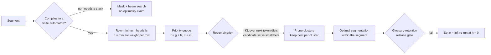

# Interview Bank: Beam, A* and Best-First Search

> `T02` · **Transcript coverage:** primary · [Cheat sheet](../00-cheat-sheets/T02-search-decoding.md) · [Case study](../01-case-studies/T02-search-decoding.md) · [Design blueprint](../03-design-blueprints/T02-search-decoding/HLD.md)

## How to use this bank

Levels are **L3** (working competence — you have shipped with this), **L4** (senior practitioner — you own the tradeoff), **L5** (staff/architect — you own the decision and its blast radius). Every answer here is a *model* answer, not a script: it shows the shape and the numbers a strong candidate reaches for, and none of it should be recited. Numbers carry provenance — `[T]` for a lecture statement with the speaker and lecture named, `[D]` for arithmetic derived here with assumptions shown. Where the corpus does not supply a figure, the answer says so rather than inventing one; there is no dollar figure anywhere in this topic's corpus and no measurement of the case study's own fleet.

Questions are ordered to read as one interview: foundations, then mechanism, then the tradeoffs, then debugging, then design at scale.

---

### Foundations

#### T02-Q1 · What is decoding search actually optimising?
**Difficulty:** L3 · **Depth expected:** 2 min
**Question:** Set the frameworks aside. When you run beam search instead of greedily taking the argmax, what objective are you optimising — and is it the objective you want?
**Model answer:** Beam search is an approximate search for the **highest-probability sequence** under the model. The exact object is `argmax_y P(y | x)`, which factorises autoregressively into a product of per-token conditionals. The lecture's framing of the motivation is explicit — the quality team wants "not just a good output from our model but um the single most likely output" `[T]` (CMU lecture 4). Two things immediately qualify that. First, the search is approximate and is not guaranteed optimal: "it can be better than greedy search, but it will not be guaranteed to get the best answer," and exact decoding "would require setting your beam size to the size of the vocabulary" `[T]`. Second, and more important, **the model's probability is not the objective the product cares about**. The likelihood trap says the human-preferred region sits away from the mode for older or non-RLHF'd models `[T]`. So the honest statement is that beam search optimises a *proxy* — sequence likelihood — and the entire craft of this topic is knowing when that proxy tracks quality (machine translation with a reference) and when it inverts (open-ended generation). Say both halves.
**Signal:** Names the exact objective as `argmax` sequence probability, then immediately qualifies it as approximate *and* as a proxy — rather than equating "most likely" with "best."
**Follow-ups:**
- *So what does greedy optimise?* — Also a proxy, a myopic one: the argmax at each step, with no backtracking.
- *Where does the proxy break down?* — The likelihood trap; Q17 develops the search-error/model-error split.
**Red flags:** "Beam search finds the best output" stated flatly; no awareness that likelihood is a proxy for quality.

#### T02-Q2 · Greedy decoding: two failure modes and one legitimate use
**Difficulty:** L3 · **Depth expected:** 3 min
**Question:** Greedy takes the argmax at every step. Say concretely what goes wrong, with the mechanism, not just the label.
**Model answer:** Two documented failures. **Myopia:** at a split, the higher-probability token at time `t` has a continuation whose best next token has probability **0.1**, while a slightly less probable token at `t` has a much higher-probability completion; multiplying out gives greedy "substantially lower probability" `[T]` (CMU lecture 4). Greedy has "no no backtracking of any variety," so that sequence is foreclosed permanently. **The repetition trap:** GPT-3 story generation collapsed into "repeating the same um 10 or 15 tokens over and over again," and "once you've repeated it twice, you're going to repeat it a third time" because argmax "reinforces this repetition" `[T]`. The mechanism is autoregressive: the repeated context raises the probability of repeating again, so the decoder locks in. The corpus notes that pre-training contains exactly this degenerate text — CSV files, malformed XML, and a Dolma-paper example of Reddit posts that are "just the letter M repeated over and over" — and that instruction tuning and RL training both reduce it, the latter because a low score for repetition is "explicit bias against repeating yourself" `[T]`. The legitimate use: latency-critical short segments and already-tuned high-resource pairs, where the locally-best token does not foreclose a globally-better sequence.
**Signal:** Gives the 0.1 counterexample and the *mechanism* of repetition lock-in, and prices greedy honestly rather than calling it "boring but safe."
**Follow-ups:**
- *Does greedy produce the highest-likelihood output?* — No; that is beam search's target, and even beam only approximates it.
- *What is the substitute on natural-language surfaces?* — Low-temperature sampling rather than pure argmax.
**Red flags:** "Greedy is deterministic so it's safe"; cannot say why repetition self-reinforces.

#### T02-Q3 · Beam search mechanics: walk the worked example
**Difficulty:** L3 · **Depth expected:** 5 min
**Question:** Prefix "when my cat gets hungry," beam width 3. Walk me through two expansion steps and tell me the candidate counts at each.
**Model answer:** Step 1's top 3 are **she, he, it**. Each expands into its own top 3 — **9 options** — each scored by multiplying path probabilities, equivalently summing log-probs. Prune 9 back to 3. Composition is unrestricted: "this happens to be two things from sort of our first original beam and one thing from our second beam… this could just as equally be three things from three different beams" `[T]` (CMU lecture 4). Expanding again yields only **6** children instead of 9, because one selected item was EOS — EOS beams are not expanded — giving **7 candidates total**: one complete sentence and six partials. Then prune back to 3, and terminate at max length or when every beam ends in EOS. The general shape is: pick width `K`; initialise with the top `K` tokens; at each step expand the top `K`, each into its `K` best completions, i.e. up to `K²` options; prune back to `K` by log-prob plus length normalisation; rescore and return the best. Two mechanical points worth stating aloud: the `K²` bound is why cost is roughly linear in `K` per step but the *candidate set* is quadratic, which is exactly the waste best-first beam search attacks; and beams can converge on the same prefix, which is why recombination exists.
**Signal:** Gets 9 → 6 → 7 right, explains the missing 3 as an unexpanded EOS beam, and volunteers that `K²` is the cost structure.
**Follow-ups:**
- *Why is one beam not expanded?* — It already terminated; keeping it in the candidate set but not expanding it is the standard handling.
- *What if two beams hold identical prefixes?* — Recombination's job; Q14.
**Red flags:** Says `K²` candidates are evaluated per step with no EOS caveat; cannot produce the counts.

#### T02-Q4 · Why log-probabilities instead of probabilities
**Difficulty:** L3 · **Depth expected:** 2 min
**Question:** You are multiplying probabilities down a path. What goes wrong numerically, and what is the fix?
**Model answer:** Probabilities "become really, really small numbers close to zero. Our hardware doesn't like really, really small numbers close to zero" `[T]` (CMU lecture 4). A 30-token sequence with a per-token probability of 0.1 is `1e-30`; at a few hundred tokens you underflow to zero in fp32 and every hypothesis scores identically, which destroys the pruning comparison. The fix is to work in log space: multiplying probabilities becomes summing log-probs, so scores are negative numbers that grow linearly rather than shrinking exponentially, and the ordering is preserved because `log` is monotone. Two consequences that matter downstream. **Lower score is better** — this is a negative-log-probability view, and the lecture's A\* trace says it explicitly: "when I boost their score by one that makes the score worse because like lower scores are better" `[T]` (CMU lecture 5). And **length normalisation becomes a division in log space**, which is why the two ideas travel together. The lecture also notes the same log-space move is what lets search be read as a shortest-path problem — combining alternatives with `min` and extending paths with `+`.
**Signal:** Explains underflow as the reason rather than reciting "logs are more stable," and connects it to the "lower is better" convention that the A\* trace depends on.
**Follow-ups:**
- *Does the sign convention matter?* — Only for consistency; mixing max-likelihood and min-negative-log-probability in one comparator is a real bug source.
- *What does this buy the search view?* — Products become sums, so the whole family is a shortest-path search; Q9.
**Red flags:** "Logs are more numerically stable" with no underflow mechanism; does not know the sign convention.

#### T02-Q5 · Length normalisation and why EOS is unfair
**Difficulty:** L4 · **Depth expected:** 5 min
**Question:** Beam search keeps producing short outputs. Explain the cause precisely, give the fix, and tell me what is wrong with the fix.
**Model answer:** The cause is that sequences of different lengths are being compared on a quantity that is monotonically non-increasing in length. A completed sequence at length 3 competes against partials at length 4, so EOS "is getting an unfairly good chance" — because "our probabilities are monotonically non-increasing and generally monotonically decreasing" `[T]` (CMU lecture 4). Every extra token multiplies in a factor below 1, so the shorter hypothesis wins by construction, and the effect worsens as beam width rises. The fix: divide the log-prob by the length so far — "we divide log props of EOS by three and we divide the log prop of everything else by four." EOS still "winds up being capped as one of our potential completions… but as these other things get longer and longer, there's a chance that they'll sort of work out to be higher probability" `[T]`. HuggingFace's variant divides by `|Y|^alpha`, which the lecture calls the length penalty. **What is wrong with the fix** is that alpha has no principled setting. The lecture says only "you can set this to be zero if you want no normalization at all. You can set this to be one" `[T]`; it does *not* state a canonical alpha and does not claim alpha must be below 1. The honest position is the lecturer's own: "my sense is that this is sort of the price we pay by making our models locally normalized. I don't I can't think of anything that would guarantee" `[T]`.
**Signal:** States the monotonicity argument as the *cause*, and volunteers that the fix introduces a free parameter with no principled value — including that the lecture declines to name one.
**Follow-ups:**
- *What is the only principled alternative?* — A source-length prior, applied as an additive reward or a multiplied length distribution; Q21.
- *Where does this rank in the tune order?* — First, before width; it is the largest single source of the curse-of-beam effect.
**Red flags:** "Divide by length to stop short outputs" with no monotonicity argument; asserts a canonical alpha value the corpus does not contain.

#### T02-Q6 · What is the blessing of beam search?
**Difficulty:** L3 · **Depth expected:** 4 min
**Question:** Everyone knows beam search is supposed to be worse than sampling. Give me the result that argues the other way.
**Model answer:** The *Blessing of Beam Search* result: beam search with a small width enforces **uniform local information density**, defined in the lecture as "the standard deviation of the negative log likelihood of each individual token" `[T]` (CMU lecture 4) — and lowering beam size up to a point lowers that standard deviation. Read it as an accidental optimisation: beam search is nominally a crude approximation to a possibly-wrong objective, but its pruning happens to spread surprisal evenly across the sequence, and for tasks with a real target — translation being the canonical one — even information density is a property you want. The argument is stronger than "it finds the mode," because the mode may be degenerate; it says the *approximation itself* has a desirable side effect. The measured context matters and should be stated: the effect is documented for small widths, and the lecture's framing puts it against the curse, which is the same method at larger widths on 2018–2020-era models. Both results are in the same lecture and the same literature; they are not in tension if you read beam width as a dial that helps up to a point and hurts past it. This is the case study's whole justification for keeping beam search in production for translation.
**Signal:** Gives the definition of uniform local information density, not just the slogan, and places the blessing against the curse as a width-dependent pair.
**Follow-ups:**
- *Why does even information density help?* — It spreads content across the sequence rather than front-loading it, which matches some target distributions better than the human-preference curve.
- *What is the counterweight?* — The curse at larger widths; Q16.
**Red flags:** Cannot define uniform information density; treats the blessing as proof that beam search is generally better.

#### T02-Q7 · Is beam search optimal? What would exact decoding take?
**Difficulty:** L3 · **Depth expected:** 3 min
**Question:** A customer asks you to guarantee "the most likely translation." Can you? What would it actually cost?
**Model answer:** No, and the reason is structural rather than a matter of tuning. Beam search is "an approximate search algorithm… it can be better than greedy search, but it will not be guaranteed to get the best answer" `[T]` (CMU lecture 4), because pruning to `K` discards hypotheses that may have been on the optimal path. The exact version is exhaustive: "exact decoding would require setting your beam size to the size of the vocabulary" `[T]`. With a 128k vocabulary that is a beam of 128k, and the next step would be 128k² — the lecture's own scaling caveat for exhaustive search is that with a larger vocabulary or a longer graph "we would spend our entire time sitting right at the very beginning and searching around the various things at the very beginning unless we had a very very peaky probability distribution" `[T]` (CMU lecture 5). So the deliverable is honesty, not a guarantee: state that beam 4 is an approximation, that the true mode is not obtainable, and then make the *positive* case — the blessing result argues the approximation is benign for a task with a real target (`[T]`, Q6). The case study's incident-handling row says exactly this: say so, do not promise the mode.
**Signal:** Answers "no" without hedging, gives the vocabulary-sized beam as the reason, and then supplies the argument for why the approximation is still defensible.
**Follow-ups:**
- *Is uniform-cost search exact?* — Yes, and provably finds the optimal path before any other terminal — but it is hopeless at scale for the same reason.
- *What does this mean for the contract?* — Write the SLO in BLEU and latency, never in "most likely."
**Red flags:** Promises the MAP sequence; thinks a larger beam width eventually becomes exact.

---

### Mechanism

#### T02-Q8 · Weighted FSAs and the two weight systems
**Difficulty:** L3 · **Depth expected:** 4 min
**Question:** A\* in this lecture is built on top of a finite-state machine. What is the machine, and what are the two ways of weighting it?
**Model answer:** A **weighted finite-state automaton** is: a finite set of states, an alphabet (here the vocabulary), transitions from a state and a symbol to a state, an initial state, a set of final states, and a weight on each transition `[T]` (CMU lecture 5). Exactly two weight systems are worked. **Probability**: range 0–1, combine by multiplication, select by argmax — the worked path is `0.5 × 0.3 × 0.2`. **Log / negative-log probability**: range `−∞` to 0, combine by addition, and used for the rest of the lecture because "typically when we're doing search we usually do… shortest path searches" `[T]`. The mapping between them is the whole point: multiplication in probability space is addition in log space, so maximizing a product and minimising a sum are the same operation. A third objective — the sum over all paths — is mentioned and explicitly set aside: "I'll skip over that because we don't use it very much for language models" `[T]`. That matters for the case study, because the sum-over-paths objective is the one that would give you a properly normalised sequence probability, and the search view deliberately does not compute it. Recognising an LLM decoder as an FSA over a 128k-token alphabet is what makes the exponential-blowup argument in Q18 obvious rather than surprising.
**Signal:** Names the weight systems with their ranges, combination rules and selection rules, and knows the sum-over-paths objective exists and is discarded.
**Follow-ups:**
- *Why does the sum-over-paths matter?* — It is the normalised version; without it, sequence scores are unnormalised and length-comparison is arbitrary — Q5.
- *Where does the FSA boundary bite?* — Constraints needing a stack are not FSAs; Q26.
**Red flags:** Confuses the FSA's states with decoder hidden states; thinks negative log-probabilities are a different algorithm rather than a re-parameterisation.

#### T02-Q9 · The priority queue: one algorithm, four configurations
**Difficulty:** L3 · **Depth expected:** 5 min
**Question:** Greedy, beam search, uniform-cost search and A\* are usually taught as four algorithms. Unify them, and give me the step counts on the toy graph.
**Model answer:** They are one priority-queue algorithm with three parameters: a comparator, a beam constraint `K`, and a heuristic `h`. The lecture's statement of it: beam search "always prioritizes things that are shorter… and then… if the output is the same length it prioritizes based on score," best-first "always prioritizes based on score. Uh but if the score is the same then it prioritizes based on length," `K` is the beam size for one and infinite for the other, and "beam search doesn't have one [a heuristic]. Best search doesn't have one but a star search does have one" `[T]` (CMU lecture 5). Filling in the table: greedy is a queue "limited to one," `K = 1`, `h = 0` — **4 steps** on the toy graph. Beam search is length-first-then-score with `K = 2` in the worked example — **6 steps**. Uniform-cost / Dijkstra-style is best-score-first, exhaustive, `K = ∞`, `h = 0` — **9 steps**. A\* is best-`f`-first with an admissible `h` — **8 steps**. Vocabulary there is 3, so it is explicitly a toy, not a benchmark. The engineering value of the unification is that it is *one* queue implementation on the critical path, with four configurations under a versioned policy object — which is exactly what the case study's router selects between.
**Signal:** Produces the `(comparator, K, h)` triple unprompted and gets all four step counts, while flagging the toy as a toy.
**Follow-ups:**
- *Why is beam's comparator length-first?* — So that completed hypotheses are compared sensibly against partials as they surface.
- *Which of the four is exact?* — Uniform-cost, and A\* when `h` is admissible; Q19.
**Red flags:** Treats them as unrelated algorithms; cannot produce the step counts or presents them as measurements.

#### T02-Q10 · Diverse beam search: groups, staggering and the step count
**Difficulty:** L3 · **Depth expected:** 5 min
**Question:** Six beams on your captioning model returned six near-identical captions. What is the fix, and what does it cost?
**Model answer:** The observation that motivates it: six beams on an image-captioning example collapsed to near-duplicates — "a steam engine train traveling um through blank down" — whereas "if you asked six people to give a caption… they would probably give you six outputs that are all reasonable and look quite different" `[T]` (CMU lecture 4). Diverse beam search makes diversity **relative and iterative**: "we're going to encourage each new output we decode to be different from everything else that we've decoded up to that point." Mechanics: partition beams into groups; group size 1 decodes everything at once (ordinary beam search), group size equal to the number of beams is greedy within each group, and in between is beam search within groups. In practice "they set the number of groups to be the same as the number of beams" and group size to 1 — which is what the case study's 3-phrasing product runs. Pruning happens **within a group only**, and each group's probabilities are modified by the groups already decoded. The efficiency trick is staggering rather than serialising: "if normal beam search would have finished in t steps um diverse beam search will finish in **t plus g minus one** steps" `[T]` for `g` groups, against `g × t` if you decoded them one after another. The corpus example uses 6 beams and 3 groups `[T]`. The cost is not the step count; it is the penalty tuning (Q11) and the risk of forcing unnatural variation.
**Signal:** States relative-and-iterative diversity as the mechanism, and gets `t + g − 1` rather than assuming `g × t`.
**Follow-ups:**
- *What breaks if groups are serialised?* — Cost becomes `g × t`; the staggering is the whole efficiency argument.
- *Why prune within a group only?* — Cross-group pruning would defeat the purpose; each group is pushed away from the earlier ones.
**Red flags:** "Run beam search with a diversity penalty" with no group structure; assumes the cost is `g × t`.

#### T02-Q11 · The four diversity penalties: which two, and the fairness flaw
**Difficulty:** L4 · **Depth expected:** 5 min
**Question:** Four penalty terms were examined in the source. Which would you deploy, and what is wrong with the obvious one?
**Model answer:** The four are: **Hamming diversity**, penalising "a token proportionally to the number of times it's occurred before in active beams from the groups that we're considering" `[T]` (CMU lecture 4); **cumulative diversity**, "penalizing only if you're using the same token at the same time step" `[T]`; **n-gram diversity**, which "penalizes matches of exact engrams" with a longer prefix match penalised more than a shorter one `[T]` — "engrams" being an ASR artefact for *n-grams*; and **embedding similarity**, penalising tokens whose embeddings are close, which the lecture dismisses as "the 2017 equivalent of penalizing things that are semantically close" and finds "not actually worth the extra computational cost" `[T]`. The case study deploys cumulative plus n-gram, and n-gram specifically for the glossary product where phrase-level repetition is the complaint. **The flaw in the obvious choice is Hamming's position-blindness.** It penalises a token by how often it has appeared, regardless of position, so "the" or a legitimate content word is suppressed even when it is correct at a different position — the lecture's own objection. Cumulative fixes this by conditioning on the time step; n-gram fixes it at phrase granularity. The general principle worth stating: any count-based penalty is a *bias* like temperature, so it belongs in the same eval gate as any other decoding parameter, and it is tuned last because its effect on the pre-pruning distribution interacts with width and with everything upstream.
**Signal:** Names Hamming's position-blindness as the flaw rather than just preferring a different term, and notes the ASR garble instead of repeating it.
**Follow-ups:**
- *Which term for the glossary product?* — n-gram, because the complaint is phrase-level repetition.
- *Why is embedding similarity rejected?* — Cost not justified by its benefit, per the lecture's verdict.
**Red flags:** "Just turn on the diversity penalty" with no term named; does not see that count-based penalties punish legitimate repeats.

#### T02-Q12 · Stochastic beam search and the Gumbel-max trick
**Difficulty:** L4 · **Depth expected:** 6 min
**Question:** You want `K` *samples* from the model, not the top `K`. Why is that hard, and what is the trick?
**Model answer:** Beam search gives you the top `K` sequences, which is not sampling. Naive fixes are slow: sampling-then-removing `K` times over a vocabulary-sized distribution is "a little bit slow," and rejection sampling is worse — "if our distribution over next tokens is extremely peaky, we could sample a 100red or 200 things and only get one or two unique outputs," with unbounded runtime `[T]` (CMU lecture 4). The Gumbel-max trick resolves it. Draw `X_i` from a Gumbel with location `mu_i`; then the probability that `X_i` is the maximum is `e^{mu_i} / Σ_j e^{mu_j}` — "Does anyone know what this is? This is softmax" `[T]`. So "choosing the argmax of this collection is functionally equivalent to taking the soft max over all of these mui values and sampling one from it" `[T]`. Practically: add independent Gumbel noise with **location zero, scale one** to each logit and take the argmax; or take the top-`k` of the noised logits to get "k things drawn from our distribution **without replacement**" `[T]`. That is the deliverable — `K` distinct samples in one pass, no rejection loop, no unbounded runtime. A student's reaction in the lecture — "I've done the math and I still think it's magic" — is a fair summary of how the trick lands the first time. The reason it matters for the case study is that it converts beam-width compute into a *proper sample* of `K` diverse candidates, which is what a diversity-hard requirement actually needs.
**Signal:** States the softmax identity as the justification, not just "add Gumbel noise," and knows the noised top-`k` gives sampling without replacement.
**Follow-ups:**
- *What are the Gumbel parameters?* — Location zero, scale one, added to the logits.
- *Why is "without replacement" the useful property?* — It guarantees distinct candidates in one pass; Q13 covers the correctness trap.
**Red flags:** "Add random noise to the logits" with no Gumbel distribution or softmax justification; thinks rejection sampling is fine in practice.

#### T02-Q13 · What breaks if you drop the Gumbel correction?
**Difficulty:** L4 · **Depth expected:** 5 min
**Question:** A refactor tidies up the stochastic beam path and scores the sampled candidates by plain log-probability. What has silently changed?
**Model answer:** You have reverted to top-`K` selection and lost the sampling property. The lecture is explicit: scoring those `K` by plain log-prob would "undo all of our good work here because then we're just going to choose whichever one of them was the highest probability to begin with" `[T]` (CMU lecture 4). The fix is subtler than "keep the noised score": the Gumbel-modified log-prob is carried forward but **capped**, because added noise can make a child score *higher* than its parent, which breaks monotonicity and therefore breaks length normalisation as well. So the algorithm adds "a little correction factor such that the modified log props are never going to be higher than the log props of the node we sampled from" `[T]`. The placement is the part implementations get wrong: the cap is applied **only in pruning, not in expansion** — "when you take the top K out of your gumball noise logits you wind up with something that is exactly a sample from the distribution. And then when you're pruning and you're scoring, you need to adjust it back down" `[T]`. So expansion is a proper Gumbel-max sample and pruning is a deliberate compromise. The operational consequence is a test, not a review: assert that the noised score is used at prune time and that a child's pruned score never exceeds its parent's. Without that assertion this class of bug is invisible — the output is still fluent, just less diverse, which reads as a tuning problem.
**Signal:** Identifies the silent regression as top-`K` in disguise, and knows the cap is prune-only — the detail that separates reading the paper from implementing it.
**Follow-ups:**
- *Why cap only at prune time?* — Capping at expansion would destroy the sampling property the trick exists to provide.
- *What test catches it?* — Parent-score dominance at prune time plus a noised-score assertion; the case study's edge-case table lists exactly this.
**Red flags:** "Keep the noisy scores" without knowing about the cap; assumes the symptom is an obvious crash rather than silent diversity loss.

#### T02-Q14 · Hypothesis recombination: n-gram versus KL
**Difficulty:** L4 · **Depth expected:** 5 min
**Question:** When is hypothesis recombination worth its risk, and which clustering criterion would you use?
**Model answer:** The case study's position is that it is "maybe necessary, maybe not necessary," but **required for any A\*-style algorithm** `[T]` (CMU lecture 5) — because unbounded breadth is what makes exhaustive search infeasible. The mechanics: "we want to group uh similar states together um to reduce the number of hypotheses that we're dealing with" — cluster hypotheses "with similar um representations of some variety and keep the best of each for each cluster," which "reduces exponential growth while maintaining quality" `[T]`. Two criteria families. **n-gram clustering** on "shared recent word contexts": "very easy to implement in cache," composes with beam search, and "the truncation length controls precision" — `n = ∞` is no recombination, `n = 2 or 3` recombines everything sharing the most recent two or three words. Its failure is stated in the lecture: "you could get something that was very different previously but similar for the most recent uh words" `[T]` — which is how a glossary term gets merged with a different reading. **Distribution distance**: Euclidean or cosine on the state representation, or "KL divergence between the distributions induced over the next token" `[T]`. The worked cost is O(K²): for each live hypothesis compute `P(y_t | y_<t)` over the vocabulary, concatenate into a matrix, and take pairwise KL — **a 16×16 matrix of KL divergences at beam 16** `[T]`, then prune "the ones where the kale divergence is like relatively low" (KL). The lecture corrects his own slide on the compared object: it is the logit distribution, not the hidden state. Deployment: n-gram `n = 3` for prose, KL for the bounded A\* path where the candidate set is small.
**Signal:** Picks different criteria for the two paths and justifies it with the O(K²) cost, and knows the comparison is over next-token distributions rather than hidden states.
**Follow-ups:**
- *What is the KV side benefit?* — Recombining hypotheses share a prefix, so they can share cache blocks.
- *What tells you recombination is too aggressive?* — Glossary-term retention as its own metric.
**Red flags:** "Recombination merges similar hypotheses" with no criterion and no cost; uses hidden-state similarity and repeats the lecture's own slide error.

#### T02-Q15 · Future-cost heuristics: the discount dial and the RL analogy
**Difficulty:** L4 · **Depth expected:** 6 min
**Question:** You cannot write an admissible heuristic for an open-ended decoder. What can you write instead, and how do you keep it safe?
**Model answer:** A **future-cost heuristic** — "an inadmissible but useful heristic. So this is exactly uh the case when we don't have a heristic that satisfies you know admissibility but still could be useful" `[T]` (CMU lecture 5). It is a learned predictor of "the cost of completing a partial sequence… given all of the information that you have now predict the cost of the completion" `[T]`. It is integrated with a discount: "you use the log probability of what you've done up until this point and then you multiply uh multiply this in," and "if we set this to zero, it is admissible… because it's zero and zero is uh never going to underestimate" `[T]` — making the discount a dial between admissible-but-useless and useful-but-unsafe. Training has two options: an auxiliary loss on the main model so it fits "not the current cost but the current cost plus the cost that we're going to pay in the future," or a separate predictor trained on completed sequences with a head that regresses to the full sequence probability, ground truth being the sum of all token log-probs. The RL analogy is explicit: "this is very similar to like a value function you learn in reinforcement learning" `[T]`. The separate-predictor motivation is practical — you may not want to fine-tune the generator, and the transcript's example is wanting a future-cost model for DeepSeek V3 while only having "your small quen [Qwen] model," which "doesn't have as good an idea of like what deepseek is going to predict next" `[T]`. **The flag to carry:** the positive evidence is 2020-era MT results, and the lecturer's own instruction is "so take it with a grain of salt" `[T]`. Hence the case study keeps it as an offline research path, not a default.
**Signal:** Explains the discount as the safety mechanism — an explicit admissibility dial — and repeats the grain-of-salt caveat rather than presenting future cost as a solved win.
**Follow-ups:**
- *What is the discount-0 case?* — Identical to `h = 0`, i.e. uniform-cost; safe and pointless.
- *Why a separate predictor rather than fine-tuning?* — You may not control the generator, and a smaller model can serve as the heuristic.
**Red flags:** Presents future cost as a free win; does not know the discount exists or what zero buys.

---

### Tradeoffs

#### T02-Q16 · The curse of beam search: two diagnoses, and the order you try them
**Difficulty:** L4 · **Depth expected:** 6 min
**Question:** You raise beam width from 4 to 8 and BLEU falls. Tell me what is happening and what you do first.
**Model answer:** This is the **curse of beam search**: "as you increase the beam size… the performance downstream actually goes down" `[T]` (CMU lecture 4). Two diagnoses, and the order matters. **First, length normalisation.** It is the largest single source of the effect and it is cheap to sweep, so it is the first thing to test — the case study's tune order is explicit that alpha comes before width, and the paper shown is reported to remove the degradation on some tasks by tuning it. **Second, if alpha tuning does not fix it, the true mode is degenerate** — the model's most probable sequence is genuinely a worse output, and then the objective is the problem, not the search. The case study's rule is: stop searching harder, and either accept the lower width or fix the model. The **critical caveat is the vintage of the result**: the curse is documented on "roughly 2018 to 2020" models per the lecturer's own characterisation, and is *not* a current-model result. Stating that is the difference between knowing the literature and knowing the history of the literature. So the honest framing is conditional: for the models where it was measured, widening the beam made things worse; whether it does so for your checkpoint is an empirical question you answer with a per-width BLEU curve, which is why the case study maintains that curve as a release artifact rather than a single BLEU number.
**Signal:** Gives both diagnoses in the right order, and volunteers that the curse is a 2018–2020-era result rather than a universal law.
**Follow-ups:**
- *Why is the curve a release artifact?* — A single BLEU number hides the turn; the curve is what detects it.
- *What if alpha tuning and reverting width both fail?* — Re-baseline on a customer-sampled set and treat it as a model problem.
**Red flags:** "Bigger beam is always better, just slower"; treats the curse as a current-model fact without the vintage caveat.

#### T02-Q17 · The likelihood trap and the search-error/model-error split
**Difficulty:** L4 · **Depth expected:** 6 min
**Question:** Our model prefers an output our reviewers dislike. Is that a search bug? How do you tell?
**Model answer:** Not a search bug — a **model** bug, and the split is the point. **Search error** means the right sequence existed within the search's reach but was pruned away; widening the beam or fixing length normalisation can recover it. **Model error** means the model assigned the correct sequence low probability — no amount of search fixes it, because the search is faithfully finding the wrong maximum. The **likelihood trap** is the documented case: the highest-probability completions are "less preferred… by humans" than things "still… in the top quarter of a percentile of probability scores" `[T]` (CMU lecture 4). The lecture's characterisation of the paper is that it holds for "particularly… older models and… models that were not RLHF'd / instruction tuned," so the trap's size is a property of the checkpoint, not a constant. The lecture's own theory for why "people don't really use beam search for sort of frontier models anymore" `[T]` is exactly this: it is a model error, and better post-training flattens the human-preference curve at the top. The diagnostic that decides between the two: plot model log-probability against human rating on a sample. If human-preferred outputs sit near the mode, your problem is search error and worth fixing with search. If they sit away from it, the response is a reranker ([T05](../01-case-studies/T05-verifiers-best-of-n.md)) or better post-training — never more search. The case study keeps this plot as a quarterly monitor precisely because its *shape* changing is a model or post-training event.
**Signal:** Separates the two error classes, reaches for the trap's "top quarter of a percentile" position, and answers with the right fix for each class.
**Follow-ups:**
- *Is the trap permanent?* — No; it is model-conditional, which is why the plot is monitored rather than assumed.
- *What is the wrong response?* — Widening the beam; that optimises the wrong objective harder.
**Red flags:** Prescribes more search; cannot distinguish "the beam pruned the right answer" from "the model disliked the right answer."

#### T02-Q18 · Why can't you run A\* over the open decoder?
**Difficulty:** L5 · **Depth expected:** 7 min
**Question:** A\* gives you optimal search given an admissible heuristic. Why is that not the answer for LLM decoding, and what would it take to change your mind?
**Model answer:** Two independent blockers, both stated in the lecture. **Exponential growth.** "if you have a vocabulary size of ABC, basically every token you generate um you exponentially grow your graph"; with a large vocabulary "you will be stuck at the beginning of the graph" `[T]` (CMU lecture 5). The FSA view makes this concrete: branching factor is `|V|`, and a 128k vocabulary is 128k children per node. **No admissible heuristic exists.** Admissibility means `h` "never overestimates the true cost of the goal. It can underestimate the true cost of the goal but it can't overestimate" `[T]`, so it is a lower bound on remaining cost. The obstruction is memorisation: "it's very very difficult to come up with an admissible heristic. Um and the reason why is because a transformer-based language model is you know huge uh very hard to comprehend and it is quite possible that you could suddenly hit a sweet spot and pay like zero cost for the rest of the time" `[T]`. The example is reciting the US Constitution, where the model "would generate like thousands of tokens with like probability of one because it's exactly memorized" `[T]` — true remaining cost near zero, so any nonzero `h` overestimates. The only universally safe `h` is zero, which degenerates to uniform-cost and dies on blocker one. The mirror case makes the difficulty sharper: a prefix like "the solution to the first… homework" must be predicted to consume much more probability, and that prediction has to come from the prefix alone. `[D]` What would change my mind: a heuristic with a *proven* lower bound for the specific model and input class, which is exactly the finite-state-bounded case in Q26 — a compiled grammar where remaining length is known and a row-minimum floor is computable. In Q&A the lecturer's summary is blunt: "an A star with a asterisk you know it's not actually a star" `[T]`.
**Signal:** Gives both blockers with the memorisation example, and shows the zero-heuristic degenerate case — rather than saying "A\* is too slow."
**Follow-ups:**
- *Is admissibility necessary?* — No: it is "not a necessary condition to do good search but it is… a sufficient condition" `[T]`; inadmissible `h` "might" deviate.
- *Is a constant offset a problem?* — No — adding 10 everywhere is equivalent to underestimating by the same amount.
**Red flags:** "A\* needs a heuristic and we don't have one" with no memorisation argument; believes a better-designed `h` would solve it.

#### T02-Q19 · Choosing a heuristic for the bounded path
**Difficulty:** L4 · **Depth expected:** 5 min
**Question:** You are deploying A\* over a bounded, glossary-constrained segment. Which heuristic, and what breaks it?
**Model answer:** Four options in the case study's table. **`h = 0`**: guaranteed optimal, trivially safe, 9 steps on the toy graph against A\*'s 8 `[T]` — hopeless at scale but the correct fallback and the reference answer when you suspect the heuristic. **Row-minimum `h`**: admissible by construction and cheap; the lecture builds one by hand, taking the minimum arc weight in each row — one row's floor gives `h = 0.5`, another `h = 1.0`, "so I'm just going to assign h equals 0.5 for everything that ends in s4 to s6 and h equals 1.0 for everything that ends in s1 to s3" `[T]` (CMU lecture 5). The trace: `S0→S2` scores `0.69 + 1 = 1.69`, and because "when I boost their score by one that makes the score worse because like lower scores are better," expansion order changes; the optimal output is found at step 8 instead of 9, and "I never expanded the S0 to S1 thing because the heristic function plus the actual score never got like low enough" `[T]`. It is weak — a loose lower bound, useless when one long high-probability arc dominates. **Learned future cost** is stronger but inadmissible (Q15). **Discounted-to-zero future cost** degrades gracefully to `h = 0` and is pointless at zero. The case study picks row-minimum and keeps the learned path offline. **What breaks it:** a memorised span *inside* the bounded segment — the heuristic overestimates, admissibility is lost, and you get a plausible suboptimal segmentation rather than an error. The mitigation is a heuristic-overestimate counter with a fallback to `h = 0` for that segment. `[D]` One further gap worth naming: the lecture never mentions *consistency* (monotonicity), and a merely-admissible-but-inconsistent heuristic with node re-expansion is what breaks naive A\* implementations — so test re-expansion explicitly, not just admissibility.
**Signal:** Picks row-minimum with the 8-vs-9 evidence, names the memorisation failure, and volunteers the consistency gap the lecture does not cover.
**Follow-ups:**
- *How do you detect the failure in production?* — An overestimate counter; it is cheap and it is the only signal.
- *Why not just raise `h` for speed?* — You trade the optimality guarantee for ordering quality; only acceptable with the discount and an eval.
**Red flags:** Chooses the learned heuristic for its ordering strength with no admissibility discussion; has no detection story for the overwriting case.

#### T02-Q20 · Best-first beam search: the 10x and its preconditions
**Difficulty:** L5 · **Depth expected:** 7 min
**Question:** Standard beam search expands every beam at every step. What is the fix, what does it claim, and what would stop you deploying it?
**Model answer:** The problem: standard beam search "always expands all of the inputs um within your beam," and with "a beam size of 16 or 32," "most of those 16 are just not good like kind of obviously really low probability solutions and it's not worth initially exploring" `[T]` (CMU lecture 5). The fix is "score-based prioritization like a star while maintaining beam constraints" — the priority-queue unification of Q9, with the beam constraint still in force. The headline result is a **10x speedup over standard beam search with identical results** `[T]`, and the lecturer calls it "the most important part of the paper." Costs are stated honestly: "memory overhead and implementation complexity, but it's actually not that bad" `[T]`. Preconditions: "scores can only decrease uh when extended," plus early pruning of hypotheses guaranteed to fall off the beam and early termination once a complete hypothesis is found. "A\* beam search" is defined in that paper as beam search with a future cost that is an admissible heuristic; the lecturer's amendment is that admissibility is not required if you are willing to lose the accuracy guarantee. **What would stop me deploying it:** the precondition. Any reward-augmented or penalised score that can *increase* on extension violates "scores can only decrease," and then frontier growth is unbounded and the failure is a host OOM, not a GPU event — the case study's top-5 incident list has exactly this row. **And the number carries a flag:** 10x is a paper result on the paper's models, not on our workload. The case study discounts it explicitly — it assumes only one third is realised (3.3x) and shows the deployment decision holds at either end (Q28).
**Signal:** States the precondition as the deployment gate and discounts the 10x rather than quoting it as a planning figure.
**Follow-ups:**
- *What does it change about width?* — It makes width 8 affordable, and the fraction of obviously-bad beams rises with `K`, so its advantage grows.
- *What is the monitoring signal?* — Priority-queue depth and memory, with an alert threshold.
**Red flags:** Quotes 10x as an expected saving; does not know the comparator precondition.

#### T02-Q21 · Which length normalisation, and when does each break?
**Difficulty:** L4 · **Depth expected:** 5 min
**Question:** Compare the length-normalisation options and tell me which one you would run and why the alternatives lose.
**Model answer:** Four options, each with a stated exception. **No normalisation** is an unbiased estimator of sequence probability but EOS "get[s] an unfairly good chance" `[T]` (CMU lecture 4) and outputs get shorter as width rises — so it never *breaks*, it just systematically prefers short outputs; correct only if you genuinely want the MAP sequence and can live with that. **Divide by length** is simple and is the fair comparison between a completed and a partial beam, at the cost of ignoring that some languages are longer — it over-corrects toward verbosity at high width. **Divide by `len^alpha`** (HF's length penalty) gives a continuous dial, and its exception is the honest one: no alpha makes all lengths comparable — "I can't think of anything that would guarantee" `[T]` — and an extreme alpha "exploding" inverts the preference to short sequences `[T]`. **Source-length prior**, the MT-style additive reward over expected output lengths, is the only principled option and the only one that addresses the real problem (German is longer than English); it "does require you as the user to kind of define your own prior" and is "not very commonly done anymore" `[T]`. The case study picks **divide by length with a per-language alpha tuned on a held-out set and capped in range**, and its revisit trigger is specific: if the output length distribution drifts after a model upgrade, re-tune alpha *before* touching width. **Note a corpus flag:** vendor documentation and cheat sheets circulate a "typical alpha in [0.6, 1.0]" range, but the lecture states only that alpha can be 0 or 1 and does not name a canonical value or claim alpha must be below 1 — so a candidate quoting a specific range should be asked where it came from.
**Signal:** Walks all four with their exceptions, picks the tuned-alpha default, and can say which knob to touch first when the length distribution drifts.
**Follow-ups:**
- *Why not go straight to the source-length prior?* — Per-language prior estimation, and it is out of fashion — but it is the only principled fix.
- *What is the earliest signal that alpha has drifted?* — The per-language output-length distribution.
**Red flags:** Asserts a canonical alpha without a source; "just divide by length, it's standard" with no awareness of the over-correction.

#### T02-Q22 · When would you drop beam search entirely?
**Difficulty:** L5 · **Depth expected:** 6 min
**Question:** The case study keeps beam search for translation and refuses it for the tone-rewriting product. Defend that split, and tell me what would move it.
**Model answer:** The split follows one criterion: **is there a well-defined target with an objective that the search's likelihood proxy actually tracks?** Translation has a reference, an automatic metric the contract is written in, and a customer who notices fluency regressions — so beam search's better sequences on well-defined targets are real value, and the blessing result (Q6) explains why the approximation is benign. The tone-rewriting product has none of that: no reference, no verifier, and an open-ended objective where the likelihood trap bites — so "keep it for translation, refuse it for the tone-rewriting product" is the case study's chosen row, with sampling plus a reranker as the alternative ([T05](../01-case-studies/T05-verifiers-best-of-n.md)). **Three things would move it.** A model whose human-preference curve peaks away from the mode to the point where search hurts even on translation — testable, and the case study's trigger is to re-run the likelihood-trap plot on 500 outputs before deciding. A customer eval where BLEU and human review diverge, which means the objective is wrong rather than the search. And the industry signal the lecture surfaces: a vLLM thread where maintainers propose removing beam search and users object, with **Spotify** named as a real dependent `[T]` (CMU lecture 4) — the direction of travel is clear, and at 10x the plan is for beam search to be a legacy path with a shrinking share, staffed accordingly. **What I would not do** is decide this by argument. It is a measurement: maintain the per-width BLEU curve, the trap plot, and the customer-sampled holdout, and let them move the row.
**Signal:** States the criterion (a real target whose objective the proxy tracks), and names the measurements that would flip the decision rather than defending it on principle.
**Follow-ups:**
- *Why does the vLLM thread matter?* — It shows real dependents; removing the feature is not free for the ecosystem.
- *What is the alternative for open-ended work?* — Sampling plus a verifier; the scorer bounds the gain.
**Red flags:** Picks a side by preference; does not know the trap may shrink with better models.

---

### Debugging

#### T02-Q23 · BLEU fell after we raised the beam width
**Difficulty:** L4 · **Depth expected:** 5 min
**Question:** A release raised width 4 → 8 for a language pair. BLEU dropped 1.8 points. Nothing else changed. Walk me through it.
**Model answer:** Work the runbook order, because the case study's tune order exists for this exact incident. **Step one: revert the width**, restoring service, then diagnose. **Step two: sweep alpha on the frozen eval with width held at the old value.** Length normalisation is the single largest source of the curse-of-beam-search effect and it is cheap to sweep; if a better alpha at width 4 recovers the loss, you have the answer and you never needed width 8. **Step three: if alpha does not recover it, decide whether width 8 is worth having at all** — the paper's reported fix removes the degradation on *some* tasks by tuning length normalisation, and where it does not, the true mode is degenerate. Then the diagnosis changes class: this is a model problem, not a search problem (Q17), and the response is to revert width and investigate whether the model is strong enough to make the mode unhelpful. **Two things to check while you are there.** Was the width change actually isolated? The case study's rule is never to tune two knobs in one experiment — width changes the optimal alpha, and if both moved, you cannot attribute anything. And is the eval itself overfitted? The lecture's warning is that "the users who then pick up your model are unlikely to do you the same favor" `[T]` (CMU lecture 4) — so re-baseline on the customer-sampled holdout, not just the internal frozen set. **What I would not do** is treat the 1.8 points as noise: the contract's BLEU regression tolerance is 0.3 per release.
**Signal:** Reverts first, sweeps alpha second, and correctly reclassifies an alpha-resistant regression as a model problem rather than escalating the search budget.
**Follow-ups:**
- *Why revert before diagnosing?* — It is a config flip and the decoders are stateless; the cost of waiting is a live contract breach.
- *Why is the customer-sampled holdout the right re-baseline?* — Eval overfitting to beam width is a documented failure row.
**Red flags:** Pushes the width higher to recover; tunes width and alpha together; treats 1.8 points as noise.

#### T02-Q24 · The 3-phrasing endpoint returns near-duplicates
**Difficulty:** L4 · **Depth expected:** 5 min
**Question:** The product promise is three genuinely different phrasings. Customers report they are near-identical. What do you check, in order?
**Model answer:** Three checks, cheapest first, all of them configuration rather than modelling. **Grouping invariants first.** Diverse beam search's mechanics require that pruning happen *within* a group only, that each group be penalised against groups decoded before it, and that the number of groups match the number of beams — "they set the number of groups to be the same as the number of beams" `[T]` (CMU lecture 4). If a refactor set groups to 1, or serialised the groups, you have ordinary beam search with three outputs and the symptom is exactly this. **Penalties second.** Verify the penalty is actually applied and that it is a term that can work here: Hamming is position-blind and can be a poor fit; cumulative diversity "penalizing only if you're using the same token at the same time step" `[T]` is the better-behaved count-based term; n-gram diversity is right when the complaint is phrase-level repetition, which is what the case study deploys it for on the glossary product. **Third, check the measurement, not just the output.** The product promise is *zero exact duplicates in a 3-output set*, which is a cheap exact-duplicate and bigram-overlap check on the returned set, tracked per request — and the case study's failure table treats a near-duplicate complaint as a product-level detection on exactly that check. **Do not** reach for temperature: the corpus's measured result is that temperature moves diversity and fluency against each other — "as you sample more diverse things, the the quality goes down. And temperature sampling is particularly well known for this" `[T]` (CMU lecture 2) — so raising temperature to fix a duplicate problem buys diversity by spending fluency, when the actual bug is free to fix.
**Signal:** Goes configuration-first (grouping invariants, then penalty choice), and refuses the tempting temperature fix with a reason.
**Follow-ups:**
- *What is the invariant to assert in a test?* — Groups = beams, group size = 1, penalty applied per group against earlier groups.
- *If configuration is clean, what next?* — The model may be so peaked that three outputs are genuinely the same; then the surface needs a different mechanism.
**Red flags:** Raises temperature; does not know the group structure has invariants that a refactor can break.

#### T02-Q25 · Best-first decoder host OOM
**Difficulty:** L4 · **Depth expected:** 5 min
**Question:** One replica OOMs. The GPU is fine. The host process running the priority queue died. What happened and what do you do?
**Model answer:** This is the signature failure of best-first beam search, and the case study's failure table puts it precisely: "OOM on the engine host, not the GPU," with priority-queue depth as the detection metric and an alert at a threshold. **The mechanism** is the precondition being violated. Best-first beam search is valid only when "scores can only decrease uh when extended" `[T]` (CMU lecture 5); if a score can *increase* on extension, hypotheses that should have fallen off the beam stay in the frontier, the frontier grows without bound, and the first thing to die is host memory — not GPU memory, which is why the GPU dashboards look clean. **What can make a score increase:** a reward-augmented or penalised score. Penalties that are subtracted per emitted token can make a child score better than its parent, and so can a future-cost term that is not discounted, or a diversity penalty applied at prune time. **The sequence of actions:** verify the comparator reproduces the "scores only decrease" property on a fixture — this is a unit test, not an investigation — then bound the frontier explicitly, because the same precondition is what licenses aggressive pruning. **The immediate mitigation** is to fall back to plain beam search, which is a config flip since both are the same queue with a different comparator (Q9). **The structural fix** is to treat comparator changes as a gated release with the monotonicity assertion in CI, alongside the same class of assertion the stochastic-beam path needs for its Gumbel cap (Q13). Monitor queue depth and process RSS, not just GPU utilisation.
**Signal:** Diagnoses a comparator precondition violation from a host-side OOM, and knows the same property licenses the mitigation.
**Follow-ups:**
- *Why is host memory the symptom?* — The frontier is CPU-side; the beams' KV is GPU-side and is not what grew.
- *What is the config-level recovery?* — Route the width class back to plain beam search; the same queue, one comparator different.
**Red flags:** Blames a memory leak or the GPU; does not know the precondition exists.

#### T02-Q26 · A glossary violation in a bounded A\* segment
**Difficulty:** L5 · **Depth expected:** 6 min
**Question:** A customer finds a mistranslated glossary term inside a constrained segment. The bounded A\* path was supposed to guarantee it. Two causes, and how do you tell them apart?
**Model answer:** Two causes, and they have opposite fixes. **Cause one: recombination merged two readings.** n-gram clustering has a documented failure — "you could get something that was very different previously but similar for the most recent uh words" `[T]` (CMU lecture 5) — and a glossary term whose last two tokens coincide with a wrong reading is exactly the case. **Cause two: the heuristic became inadmissible** on that grammar, so A\* returned a plausible but suboptimal segmentation. The signature of this one is a memorised or near-deterministic span inside the segment: the true remaining cost approaches zero, any nonzero `h` overestimates, and the optimality guarantee — "A\* is optimal when a heristic is admissible" `[T]` — is void. **How to tell them apart, in order.** First, **disable recombination** (`n = ∞`) for that grammar and re-run: if the violation disappears, it was the merge rule; the case study's action row is exactly that. Second, if it persists, **re-run with `h = 0`** and compare — uniform-cost is slow but optimal, so a difference between `h = 0` and the row-minimum output is proof that the heuristic mis-ordered the search. Third, check the **heuristic-overestimate counter** already instrumented for that segment; if it fired, you have a direct measurement rather than an inference. **The metric to add** is glossary-term retention as a first-class eval on constrained segments (a monitor item in the case study), because this failure is silent in BLEU — one wrong term in a long document barely moves an n-gram metric. **The structural boundary to state:** this whole path is only definable when the constraint compiles to a *finite* automaton; a constraint needing a stack — arbitrary nesting — is a pushdown automaton, not an FSA, and the bounded A\* argument does not apply `[T]` (CMU lecture 6).
**Signal:** Gives two causes with opposite fixes, an ordered experiment that discriminates them, and volunteers the FSA-versus-pushdown boundary that decides whether the path is definable at all.
**Follow-ups:**
- *Why is the memorisation case the heuristic's enemy rather than the search's?* — True remaining cost ≈ 0 makes every nonzero `h` an overestimate; Q18.
- *What if the constraint is not an FSA?* — The bounded path is not definable; fall back to masking plus beam, per [T03](../01-case-studies/T03-constrained-generation.md).
**Red flags:** Blames the model; has no discriminating experiment; does not know recombination can merge distinct readings.

---

### Scale and design

#### T02-Q27 · Design the search-policy router
**Difficulty:** L4 · **Depth expected:** 7 min
**Question:** You have four decoders and a heterogeneous workload. Design how a request selects one, and tell me what you would refuse to automate.
**Model answer:** Four classes, one router, one implementation underneath. The case study's chosen design is "a four-way class router — greedy, beam 4, diverse 3×1, bounded A\* — with best-first beam search as the beam implementation." The routing signal is the **segment class**: plain prose → beam width 4 with length normalisation; glossary-constrained → bounded A\* over the compiled FSA; the "3 phrasings" product → diverse beam search, 3 groups × 1 beam; latency-critical → greedy. **Why class rather than per-request difficulty:** a difficulty-based router is "a really reasonable thing to do" per the lecture `[T]` but no published system does it, it doubles the (policy, request) evaluation surface, and regressions become unattributable — so defer it until the policy layer is stable. **What I would refuse to automate:** the decision to widen the beam in response to a quality complaint. That is the curse-of-beam-search trap; the router's width is a tuned constant per language pair, not a runtime variable, and any change goes through the per-width BLEU curve. **Two invariants that make it operable.** Every decoder is the same priority queue parameterised by `(comparator, K, h)` — the unification from Q9 — so the router selects a configuration object, not a code path; and every configuration is a versioned object `(algorithm, K, alpha, recombination, penalties)`, so replay is a request plus a policy id. **The cost of misrouting is asymmetric:** a greedy-class request routed to beam costs 4x decode compute and 4x KV; a beam-class request routed to greedy ships a quality regression to a paying customer. So the router's default on ambiguity is the *expensive* class, with a cost alert on the misroute rate rather than a quality alert. **Revisit trigger:** a customer eval showing BLEU and human review diverging — that means the objective, not the routing, is wrong.
**Signal:** Selects by segment class with a stated cost asymmetry for errors, and explicitly refuses the adaptive-width automation that the curse makes dangerous.
**Follow-ups:**
- *Why not route by difficulty?* — Doubles the evaluation surface with no published precedent; defer until the policy layer is stable.
- *What makes replay possible?* — Versioned configuration objects plus a stateless decoder between requests.
**Red flags:** Routes per-request on a difficulty score in v1; has no story for what a misroute costs.

#### T02-Q28 · Is width-4 beam affordable? Do the arithmetic
**Difficulty:** L5 · **Depth expected:** 8 min
**Question:** Finance asks whether beam width 4 costs four times greedy. Answer with arithmetic and show your assumptions.
**Model answer:** The naive answer is wrong, and the case study's §8 is the model for doing this honestly. **Assumptions (all `[D]`, from the case study's table):** 2.0M segments/month scaled from 40M words at ~20 words/segment; 30 average output tokens per segment; greedy decode cost normalised to 1 unit/token; width 4; decode is memory-bandwidth-bound while prefill is compute-bound `[T]` (LLMOps cost talk). **Step 1 — width multiplies FLOPs and KV, not necessarily latency.** At batch 1 a decode step at width 4 moves the same weights and processes four positions; the weight read dominates, so the step costs only marginally more than width 1. At high batch the GEMM is saturated and the four positions cost four times the arithmetic. So: **beam width is nearly free at low occupancy and roughly linear at high occupancy.** That is why the SLO is written as "≤ 25% wall-clock at batch 32," not "4x." **Step 2 — monthly compute.** `2.0M × 30 = 60M` output tokens/month; at width 4 that is `240M` decode-unit-token equivalents. If the fleet does 1,800 aggregate greedy-equivalent tokens/s, width 4 reduces effective throughput to `1,800 / 4 = 450` tokens/s at saturation — the same fleet does one quarter the work at full occupancy. **Step 3 — best-first beam search is the lever.** The source claims "a 10x speed up over standard beam search with identical results" `[T]`, but that is a paper result on the paper's models, so discount it. At the full 10x, effective width-4 throughput rises to `4,500` tokens/s — above the 1,800 greedy baseline, i.e. search *cheaper* than greedy. Assume we realise only one third, 3.3x: `450 × 3.3 = 1,485`, which is `1,485 / 1,800 = 0.82x` the greedy baseline. So the honest claim is the weaker one: **width-4 search costs 0.82x greedy rather than 4x** — near-free in wall-clock while remaining 4x in arithmetic. The decision holds at either end of that range (0.82x at a third of the claim, 0.25x if the claim holds fully). **Step 4 — the real constraint is KV**, not arithmetic: see Q29.
**Signal:** Refuses the 4x answer, states the occupancy dependence, and presents the discounted 3.3x case as the planning number rather than the 10x claim.
**Follow-ups:**
- *Why is the 0.25x end not the plan?* — It is a paper result on different models; the case study discounts it deliberately.
- *Which number is the binding constraint?* — KV footprint, not FLOPs; Q29.
**Red flags:** Answers "4x FLOPs so 4x cost"; quotes 10x as an expected saving; invents a dollar figure — the corpus contains none.

#### T02-Q29 · KV footprint, multi-tenancy and pool splitting
**Difficulty:** L5 · **Depth expected:** 7 min
**Question:** Width 4 means four beams per request. What does that do to a shared GPU pool, and what is the decision that inverts?
**Model answer:** Four beams means four forked sequences, so the steady-state KV multiplier is up to 4x — worst case is 4 and the pool must be sized for the worst case, even though recombination at `n = 3` lets beams sharing their last three tokens share blocks and keeps the *typical* multiplier well below 4. Concretely, `[D]` if a replica's KV budget supports 64 concurrent greedy sequences, it supports **16 concurrent width-4 beam requests**. That is the real constraint on the translation SLO, not arithmetic (Q28). **Why it becomes a multi-tenancy incident rather than a capacity number:** beam requests hold long-lived KV allocations for the duration of a 2,000-token document, so they evict interactive tenants' KV and those tenants see TTFT spikes with no change to their own configuration. The case study's failure row describes exactly this: "KV exhaustion from wide beams — other tenants see TTFT spikes," with pool-level KV utilisation as the detection signal. **The decision that inverts at scale is "one pool for all widths"** — the case study's 10x sensitivity table names it directly, and the same inversion appears in T01's sampling analysis: isolate by width class. **The mitigations, in order.** Cap the width × length product, or cap per-request width by document length and route long documents to a pool with more KV headroom. Split pools by width class so a beam request cannot evict a latency-critical one. And do not co-schedule beam requests with latency-critical traffic at all. **The order matters:** capping width is a quality decision and needs the per-width BLEU curve; pool splitting is an infrastructure decision and can be made unilaterally. Do the infrastructure fix first so you are not trading quality under pressure.
**Signal:** Converts the beam width into a concrete KV admission number, names the cross-tenant symptom, and separates the quality-affecting mitigation from the infrastructure one.
**Follow-ups:**
- *Does recombination reduce the multiplier?* — Below 4 in steady state, but size for the worst case; do not plan on it.
- *What is the monitoring signal?* — Pool-level KV utilisation split by width class, with the saturation thresholds as the alert.
**Red flags:** Treats it as a GPU-FLOPs problem; plans on recombination reducing the worst case; no isolation story.

#### T02-Q30 · 10x traffic: what breaks, what inverts
**Difficulty:** L5 · **Depth expected:** 8 min
**Question:** The estate grows 10x. Which parts of this search design survive, which break, and what inverts?
**Model answer:** Four movements. **The router, not the decoder, becomes the system.** At 10x segments, per-segment class selection has to be automatic and cheap, because a misrouted segment costs 4x compute on a 4x-larger fleet. The decoder itself — the priority queue — scales linearly in requests and is not the problem; the classification layer is. **Best-first beam search stops being optional.** At small scale plain beam at width 4 is affordable; at 10x the wasted expansion of obviously-bad beams dominates the arithmetic, and the 10x claim is what makes width 8 viable at all. Its cost moves too: the priority queue's memory is a host-side resource, so the failure mode shifts from GPU capacity to process RSS on the engine host. **Recombination becomes a correctness concern, not an optimisation.** At beam 16 across a wide fleet, uncapped frontier growth is an outage, and the merge rule determines whether glossary terms survive — so glossary-term retention graduates from a monitor to a release gate. **What inverts:** the likelihood trap gets worse before it gets better. Stronger models change the trap's shape, and the decision "search harder for quality" inverts as the model improves — which is the lecturer's own explanation for why "people don't really use beam search for sort of frontier models anymore" `[T]` (CMU lecture 4). Plan for beam search to be a legacy path with a shrinking share and staff it accordingly, while noting the industry friction: the lecture points to a vLLM thread where maintainers propose removing beam search and users object, with **Spotify** named as a real dependent `[T]`. **And one thing that does not change:** exact decoding stays impossible. The memorisation argument does not weaken with scale — if anything, more capable models memorise more — so A\* over the open decoder is off the table at every scale, forever. **What I would measure now to be ready:** the misroute rate, priority-queue depth per replica, KV utilisation by width class, and glossary retention per grammar.
**Signal:** Identifies the router and the recombination rule as the two things that change character, and refuses to claim exact decoding becomes viable at any scale.
**Follow-ups:**
- *Why does the likelihood trap invert the decision?* — The trap is model error; a stronger model's mode can be more confidently wrong about human preference.
- *What is the staffing implication?* — Beam search as a legacy path with a shrinking share, not a growth area.
**Red flags:** "Scale the GPUs"; assumes the decoder is the bottleneck; expects the curse to get better with stronger models.

---

## Whiteboard exercises

### Exercise 1 — Draw the search family and place a workload on it
**Prompt.** You are given one priority-queue decoder and a translation workload with three segment classes: plain prose, glossary-constrained, and a latency-critical FAQ path. On a whiteboard, derive the family of algorithms the queue can express, place each class on it, and defend the choice with the toy-graph evidence and the deployment evidence. You have 25 minutes.

**What to produce.** The `(comparator, K, h)` table with step counts, one marked row per segment class, and a stated reason for each that names either a lecture result or a deployment constraint.

**Expected whiteboard.**

```
One priority queue, three parameters: comparator | K | h

  Algorithm          comparator            K      h            toy steps
  ---------------------------------------------------------------------
  Greedy             (any; K=1)            1      0            4
  Beam search        shorter first, then   4      -            6
                     score                 (2 in the
                                            toy example)
  Uniform-cost       score first,          inf    0            9
                     exhaustive
  Best-first beam    score first,          K      -            same output
                     beam constraint in                          as beam,
                     force                                       ~10x faster
  A*                 best f = g + h        inf    admissible   8

  Placement:
    plain prose          -> BEST-FIRST BEAM, K=4, row-min n/a
    glossary-constrained -> A* over compiled FSA, K=inf, h=row-min
    latency-critical FAQ -> GREEDY, K=1, h=0
    (3-phrasing product) -> DIVERSE BEAM, 3 groups x 1 beam

  Why each, in one line:
    prose     : blessing at small width; curse past the turn; best-first makes K=4 cheap
    glossary  : bounded space -> row-min h is admissible -> optimality is real
    FAQ       : greedy's myopia rarely forecloses a globally-better short answer
```

```
Deployment evidence to say out loud:
  - beam 4 at high batch ~ 4x arithmetic but 0.82x greedy wall-clock [D, with best-first at 1/3 of claim]
  - 64 concurrent greedy sequences -> 16 concurrent width-4 beam requests [D]
  - never A* over the open decoder: exponential branching + no admissible h (memorisation)
```

**Grading rubric.**
- Produces the `(comparator, K, h)` unification rather than four unrelated algorithms, and gets the step counts 4/6/9/8 right while flagging them as a 3-token toy.
- Places glossary-constrained work on bounded A\* *because the row-minimum heuristic is admissible there*, and explicitly refuses A\* over the open decoder on the memorisation argument.
- Names best-first beam search as the beam implementation and connects it to the latency budget rather than treating it as a separate algorithm.
- Prices the beam choice in both arithmetic (4x) and wall-clock (sub-1x with the discounted best-first claim) and says which one binds — KV.

### Exercise 2 — Diagnose a beam-quality regression under a change freeze
**Prompt.** `Localize Pro` runs beam width 4 with `alpha` tuned per language pair. This week: German BLEU down 1.4, French flat, output length for German down ~11%, and the priority-queue depth metric on the beam replica has been climbing. A model revision shipped in the same release; no decoding parameters changed. You have logs, the policy registry, the per-width BLEU curves, and 20 minutes. Produce the diagnosis and the fix.

**What to produce.** A ranked hypothesis list with the measurement that kills each, the direction-of-evidence argument, and a fix plus rollback.

**Expected whiteboard.**

```
Hypotheses (ranked by likelihood x cheapness to test)
  1. alpha is now mis-set for the new revision's length distribution
       test: output-length distribution per language, this release vs last
  2. Model revision moved the distribution shape
       test: per-width BLEU curve re-run at K=4 on the frozen set, new vs old revision
  3. Comparator precondition broken (comparator change smuggled in the release)
       test: priority-queue depth curve + monotonicity unit test on a fixture
  4. Eval overfit / customer-set divergence
       test: re-run on the customer-sampled holdout

Direction of evidence:
  GERMAN SHORT + BLEU DOWN + QUEUE DEPTH UP
     length down  -> alpha too low for the new revision's lengths
                     (alpha is the first knob, not width)  [case study tune order]
     depth up     -> queue-side anomaly: either a flatter model distribution
                     (more hypotheses survive pruning) or a comparator bug
     French flat  -> not a fleet-wide change; consistent with (1)/(2), NOT with a
                     global config error

Fix path:  roll back alpha -> re-run per-width BLEU curve -> re-tune alpha on held-out set
           THEN investigate queue depth separately; do not touch width
Rollback:  flip the resolver's (language -> policy_version) pointer
```

**Grading rubric.**
- Puts length normalisation first and justifies it with the case study's tune order — alpha before width — and reads the German-short signal as direct evidence for it.
- Separates the two anomalies and refuses to fix them with one change: the BLEU/length regression and the rising queue depth are different findings, and the depth signal points at the comparator precondition or a distribution shift.
- Uses French-flat to eliminate a global configuration error, i.e. reasons from the *pattern* across languages rather than from the worst-affected one.
- Does not raise or lower beam width, and gives a rollback that is a pointer flip.

### Exercise 3 — Design a bounded A\* path with a safety case
**Prompt.** A customer requires that a set of glossary terms be honoured exactly in translation, and that the resulting segmentation be *provably* optimal within the constrained segment. You may rely only on what the corpus supports. Design the path: the automaton, the heuristic, the recombination rule, and the safety instrumentation. State plainly where the optimality guarantee stops holding.

**What to produce.** The pipeline, the heuristic construction with its admissibility argument, the recombination choice with its failure mode, and the explicit list of conditions under which the guarantee is void.

**Expected whiteboard.**



```
Admissibility argument (say it line by line):
  h(state) = min arc weight in that state's row        [lecture's construction: 0.5 / 1.0]
  every completion must pay at least one arc from the row
  -> h never exceeds the true remaining cost -> h is a lower bound -> A* is optimal

Why not a learned future cost:
  inadmissible -> "you might deviate from the optimal solution"
  only safe with a discount, and at discount 0 it is identical to h = 0

GUARANTEE IS VOID WHEN:
  * the constraint needs a stack (arbitrary nesting) -- pushdown, not an FSA
  * a memorised/near-deterministic span sits inside the segment:
      true remaining cost ~ 0, any nonzero h overestimates
      -> detect with a heuristic-overestimate counter, fall back to h = 0
  * recombination merges two distinct glossary readings
      -> run n = inf as the reference answer
  * the heuristic is merely admissible but NOT consistent, and nodes
      are re-expanded  [D -- the lecture never names consistency]
```

**Grading rubric.**
- Constructs the row-minimum heuristic and gives the admissibility argument explicitly as a lower bound, citing the lecture's 0.5/1.0 rows and the 8-vs-9 step evidence.
- Names the FSA boundary — a constraint needing a stack is not an FSA — and refuses the optimality claim outside it.
- Lists at least three void conditions including the memorisation case and recombination merging readings, and gives the detection instrument for each rather than only the condition.
- Chooses recombination appropriate to a small candidate set (KL) rather than n-gram, and states its cost as O(K²).

## Sources

- `refs/CMU_Inference_Algorithms_for_Language_Modeling_Fall_2025_transcripts_2/CMU_LLM_Inference_4_Beam_Search_and_Variants.txt` — the mode-seeking framing and the "single most likely output" quote, greedy's myopia with the 0.1 continuation and the repetition trap with the 10–15 token loop, beam mechanics with the 3-beam "when my cat gets hungry" walkthrough (9 → 6 → 7), the log-prob stability argument, EOS unfairness and length normalisation with the alpha discussion and the absence of any canonical alpha, diverse beam search with groups, staggering and `t + g − 1`, the four diversity penalties and the embedding-similarity verdict, stochastic beam search with the Gumbel-max trick and the prune-only correction cap, the blessing of beam search and uniform local information density, the curse of beam search with its 2018–2020 vintage caveat, the likelihood trap, the search-error/model-error split, and the vLLM/Spotify coda. Note the transcript is ASR output and garbles several terms — "heristic," "engrams," "gumball," "kale divergence," "100red."
- `refs/CMU_Inference_Algorithms_for_Language_Modeling_Fall_2025_transcripts/CMU_LLM_Inference_5_A_and_Best_First_Search.txt` — weighted FSAs and the two weight systems (probability 0–1 by multiplication; log / negative-log by addition), the sum-over-paths objective explicitly skipped, the priority-queue `(comparator, K, h)` unification with the toy step counts 4 / 6 / 9 / 8, admissibility as sufficient-but-not-necessary, the hand-built row-minimum heuristic (`h = 0.5` / `h = 1.0`, the `S0→S2` score of `0.69 + 1 = 1.69`, the 8-step trace that never expands `S0→S1`), the memorisation argument against A\* (US Constitution, the homework prefix), hypothesis recombination with n-gram and KL criteria and the 16×16 matrix (the lecturer first says "16x5," likely a slip), future-cost heuristics with the discount dial and the RL value-function analogy, and best-first beam search with the "scores can only decrease" precondition and the 10x claim. The lecture never names consistency/monotonicity — the gap flagged in Q19 and Exercise 3 is a `[D]` addition.
- `refs/CMU_Inference_Algorithms_for_Language_Modeling_Fall_2025_transcripts/CMU_LLM_Inference_6_Other_Controlled_Generation_Methods.txt` — the finite-automaton construction and the regular / context-free / Turing-machine boundary, which is what makes the FSA-versus-pushdown limit in Q26 a stated constraint rather than an inference.
- `refs/LLMOps_Agentic_AIOps_The_Hands-On_Playlist_2026_transcripts/Cut_LLM_Cost_Latency_KV_Cache_Batching_Quantization_vLLM.txt` — the prefill/decode asymmetry and the decode-is-memory-bandwidth-bound premise that the Q28 arithmetic rests on.
- `refs/CMU_Inference_Algorithms_for_Language_Modeling_Fall_2025_transcripts_2/CMU_LLM_Inference_3_Common_Sampling_Methods.txt` — the search-error/model-error distinction as stated in the sampling lecture, which is the version quoted in Q17.
- `refs/CMU_Inference_Algorithms_for_Language_Modeling_Fall_2025_transcripts_2/CMU_LLM_Inference_2_Probability_Review_and_Code_Examples.txt` — length-normalised scoring of completed sequences and the diversity/quality tradeoff statement used in Q24.
- `refs/ai-system-design-guide-main/ai-system-design-guide-main/16-case-studies/01-enterprise-rag.md` — house style reference.

**Marker note.** Answers in this bank carry `[T]` (lecture statement, lecture named) and `[D]` (arithmetic derived here, assumptions printed alongside). There are **no `[R]` markers**: this topic's corpus is almost entirely lecture transcripts, and every claim used here traces to a transcript rather than to a supporting repo file. The one repo path in Sources below is a house-style reference and supplies no claim to mark.

**Coverage flags carried forward.** No figure in this bank is a measurement of the case study's own fleet; every number is a lecture illustration or a cited paper result, and §9 of the case study says so. The 10x best-first speedup is a paper result on the paper's models and is discounted rather than quoted as a plan (Q28). The curse of beam search is a 2018–2020-model result, not a current-model result (Q16). The lecture states no canonical length-penalty alpha; values circulating in vendor documentation and cheat sheets are not in this corpus (Q21). The corpus contains no dollar figures at all, so no cost answer in this bank is expressed in currency. All §8-style arithmetic is `[D]` with its assumptions printed alongside it.
