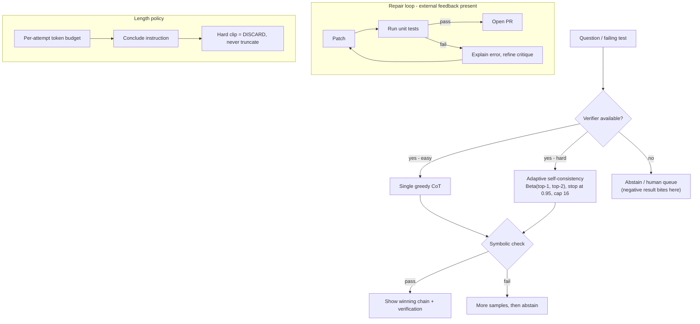

# Interview Bank: Chain-of-Thought, Self-Correction & Reasoning Models

> `T04` · **Transcript coverage:** primary · [Cheat sheet](../00-cheat-sheets/T04-test-time-compute.md) · [Case study](../01-case-studies/T04-test-time-compute.md) · [Design blueprint](../03-design-blueprints/T04-test-time-compute/HLD.md)

## How to use this bank

Levels are **L3** (working competence — you have shipped with this), **L4** (senior practitioner — you own the tradeoff), **L5** (staff/architect — you own the decision and its blast radius). Every answer here is a *model* answer, not a script: it shows the shape and the numbers a strong candidate reaches for, and none of it should be recited. Numbers carry provenance — `[T]` for a lecture statement, `[R]` for a supporting-repo path, `[D]` for arithmetic derived here with assumptions shown. Where the corpus has no figure, the answer says so rather than inventing one.

Questions are ordered to read as one interview: foundations, then mechanism, then the tradeoffs, then debugging, then design at scale.

---

### Foundations

#### T04-Q1 · What is chain-of-thought actually computing?
**Difficulty:** L3 · **Depth expected:** 3 min
**Question:** Forget the prompt engineering. In probabilistic terms, what is a chain of thought, and what quantity are we trying to compute when we use one?
**Model answer:** The framing is a latent-variable model. `X` is the problem, the chain of thought `Z` is a **latent variable**, and `Y` is the answer; what we want is the best `p(y|x)` obtained by "marginalizing over z. So summing over all Z so that we can get a better prediction of Y" `[T]` (CMU lecture 7). That is the whole theoretical case: the intermediate tokens are not part of the deliverable, they are a computational device that raises the marginal probability of the right answer. The lecture gives two advertised advantages — extra tokens buy **adaptive computation time**, and if the chain is faithful a human can walk through it — and the second is a conditional, not a guarantee, which is why faithfulness gets its own question later (Q23). The critical consequence is that exact marginalisation is intractable. For a 100-token chain the number of `z` values is "essentially… close to **v to the power of 100**" `[T]`, with `v` the vocabulary. So every practical CoT method is an *approximation* to that sum, and the whole design space of this topic is the question of which approximation to buy: mode-seeking (greedy), sampling (self-consistency), or search. Naming that is the point of the question. A candidate who describes CoT as "making the model think harder" has not got the frame.
**Signal:** States `P(Y|X) = Σ_Z P(Y|X,Z)P(Z|X)` as the objective and calls every method an approximation to it — rather than describing CoT as a prompting trick that improves quality.
**Follow-ups:**
- *Why is exact marginalisation impossible?* — `v^100`; Q5 works the size of that space and what it forces.
- *What does "adaptive computation time" mean here?* — More tokens on harder problems; Q18 turns it into a budget policy.
- *Is the chain part of the answer?* — No, it is a latent variable — unless the product *is* the explanation; Q23.
**Red flags:** Calls CoT "the model showing its work" with no probabilistic content; does not distinguish the chain from the answer.

#### T04-Q2 · Why does CoT exist at all, if nobody trained it?
**Difficulty:** L3 · **Depth expected:** 3 min
**Question:** Chain-of-thought was not engineered into these models. So where does the behaviour come from, and what are the routes to getting it deliberately?
**Model answer:** It was **emergent**. The 2022 chain-of-thought paper "discovered that even without teaching the model or training the model in any way to do chain of thought it was able to do that" `[T]` (CMU lecture 7). The explanation the lecture gives is about the training corpus: it already contains deduction sequences — "code," "stories," "proofs," and "a ton of grade school math online that has these deductions like explicitly written in it" `[T]`. The model is reproducing a format it has seen, not discovering a reasoning faculty. There are **three routes** to obtaining the behaviour deliberately `[T]`: **emergent** (elicited by prompting), **supervised fine-tuning** on data with explicit reasoning steps, and **reinforcement learning** with a reward for task success. The lecturer adds a fourth that is easy to miss — **mid-training**: "pre-train the model and then you throw in a lot of data that's like very high quality… right at the end of pre-training" `[T]`. His conclusion is the practically important part: "our base models are now half like supervised trained… things that might seem like they're they've just emerged in the base models actually already were there because… the people who pre-trained the models very carefully selected the data they showed at the end of training" `[T]`. So "emergent" is partly a statement about a data-curation decision you cannot see. That matters when you are choosing a model: the emergence threshold is a property of someone's mid-training recipe, not a law of scale.
**Signal:** Names mid-training and connects emergence to a data-selection decision made by the vendor — the answer that shows they have read past the headline.
**Follow-ups:**
- *What is the scale threshold for emergence?* — It has moved a long way; Q3 gives the two ends.
- *Which route would you buy?* — Q12 is the full decision table; Q17 covers the distillation shortcut.
**Red flags:** "Big models can reason, small ones can't" as the whole answer; unaware that SFT and RL are routes to the same behaviour.

#### T04-Q3 · Where does CoT actually help — and where does it not?
**Difficulty:** L3 · **Depth expected:** 3 min
**Question:** Marketing says reasoning models are better at everything. What does the evidence in the course say about the shape of the gain?
**Model answer:** The gain is real and narrow. A meta-analysis of "**100 plus papers**" plus a fresh evaluation on "**20 data sets across 14 models**" found "there's a **huge gain on things like uh math and deductive reasoning** and much less impressive gains on a lot of the others" `[T]` (CMU lecture 7). The sharpest version is a split rather than a scale: taking MMLU and partitioning the questions by whether they contain an equal sign, "people were saying, Oh, chain of thought reasoning helps on MMLU. But basically it only helps with the math in MLU" `[T]`. So a headline benchmark gain can be almost entirely composed of the symbolic subset. Two practical takeaways the lecturer draws `[T]`: "if you want to use reasoning models, you should probably try them on math first," and "there's a big opportunity for coming up with more generalizable uh reasoning strategies" — that second one is a statement that the general case is unsolved. The reason this question matters for a design review is that it decides where the architecture is allowed to spend. A math-tutor surface is in the good column, so a reasoning budget there is defensible on the corpus's own evidence. A code-repair bot is in the weaker column for *reasoning* gains — but it has something better, which is execution feedback, and that is a different mechanism entirely.
**Signal:** Knows the gain is concentrated in math/symbolic work and quotes the equal-sign split, rather than repeating "reasoning models are better."
**Follow-ups:**
- *Why does the equal-sign split matter?* — It shows a headline gain can be one subset in disguise.
- *So does the code-repair bot benefit from CoT?* — Not from CoT primarily; from execution feedback — Q11, Q26.
**Red flags:** Claims CoT helps generally; cannot name the task class where the gain concentrates.

#### T04-Q4 · Self-consistency: the mechanism and the price tag
**Difficulty:** L3 · **Depth expected:** 3 min
**Question:** Explain self-consistency. What does it cost, and what class of task is it simply invalid for?
**Model answer:** Sample many reasoning paths from the same prompt, count the final answers, and take the most frequent `[T]` (CMU lecture 7). It is a Monte Carlo estimate of the marginal `P(Y|X)` from Q1 — you are approximating the sum by sampling rather than enumerating. The cost is stated flatly in the course and is the reason this topic is a budget topic: "if you want to sample a hundred of these then it's **100 times the inference cost**" `[T]`. Cost is linear in `n`, with no discount, because every sample is a full generation. The scope limit is equally explicit and is the part candidates skip: "Self-consistency only works in uh relatively simple cases like mathematical reasoning where it's like we have a single answer uh that's an integer. Um it will not work when we're generating essays" `[T]`. That is not a quality caveat, it is a validity condition: majority voting requires a countable answer space, so there must be something to count. Two consequences follow. First, the technique is only available on surfaces whose outputs are discrete and comparable — which is why it fits a math tutor and not a prose surface. Second, the cost is multiplicative with everything else you do, so `n` is the first knob anyone asks about and the reason the adaptive variant exists at all. There is no free lunch in the table: the whole of §5.2 in the case study is a search for a cheaper estimator of the same quantity.
**Signal:** Names the validity condition (a discrete, countable answer) as a *precondition* rather than a quality note, alongside the 100x cost.
**Follow-ups:**
- *What is the cheap version?* — Adaptive self-consistency; Q7 does the Beta machinery.
- *When does voting not help even on a valid task?* — When the model genuinely does not know — Q8.
**Red flags:** Says self-consistency "improves accuracy" without the 100x cost or the single-answer precondition.

#### T04-Q5 · Why can't we just marginalise exactly?
**Difficulty:** L3 · **Depth expected:** 3 min
**Question:** You have the formulation. Why is search over the chain not the answer — and what does the lecture recommend instead?
**Model answer:** Because the space is astronomical and, more subtly, because the objective is hard in the wrong way. The count of `z` values for a 100-token chain is "essentially… close to **v to the power of 100**" `[T]` (CMU lecture 7), so enumeration is out on arithmetic alone. The harder problem is that the quantity you want is a **mode-seeking** quantity: the argmax over `y` of a sum over all `z` leading to `y`. Optimising a sum over a huge latent space with a max on the outside is exactly the shape that breaks greedy search heuristics. The lecture's recommended direction is therefore sampling rather than search: "ancestral sampling with a temperature of one is going to always be good enough uh in an auto regressive model" `[T]` — sample `z`, then sample `y`. Notice what this is doing: it converts an intractable optimisation into an unbiased estimator, which is what self-consistency then averages. It also explains why temperature matters so much here. If the estimator is sampling, then sampling *at temperature 1* is the estimator being correct, and any other temperature is a biased estimator of the quantity you claimed to be computing. This is the bridge from this topic to the sampling topic: the reason reasoning-model APIs pin temperature is not a convention, it is that the marginal is only estimated correctly by an unbiased draw.
**Signal:** Identifies the objective as mode-seeking over a sum, and explains why sampling is the escape rather than a heuristic compromise.
**Follow-ups:**
- *What goes wrong with the obvious alternative?* — Joint argmax; Q6.
- *Why does temperature 1 reappear here?* — The estimator must be unbiased; [T01](../01-case-studies/T01-sampling-decoding.md) covers the general case.
**Red flags:** "The space is too big so we approximate" with no sense of what is being approximated; proposes beam search over chains.

#### T04-Q6 · The joint-argmax trap
**Difficulty:** L3 · **Depth expected:** 4 min
**Question:** A colleague proposes beam search over the chain: maximise the joint probability of chain and answer together. Give the counterexample and explain what it shows.
**Model answer:** The counterexample is deliberately trivial. Question: "how many inches are there in 3 ft?" A model with a strong tendency to talk about centimetres produces the best joint `z`-`y` score on that path — and the wrong answer: "y equals 36 you would get 0.6 where this is 0.4" `[T]` (CMU lecture 7). So the jointly-most-probable chain-and-answer pair is not the pair with the best `p(y)`. What the example shows is that `argmax_{z,y} P(z,y|x)` and `argmax_y Σ_z P(y,z|x)` are different objectives, and that the fluent-but-irrelevant chain wins the first. This is not a corner case — it is the normal failure of a search procedure that scores the path instead of the outcome, and it is exactly what a beam-search-based reasoning pipeline does. It is also why the case study puts "beam/best-first search over chains" in the reject column and says it "breaks precisely on the reasoning tasks it is reached for" — the trap bites hardest where reasoning is needed. The fix is the sampling route from Q5: draw `z` from `P(z|x)` and score the resulting `y`, which is unbiased with respect to the quantity you actually care about. A useful diagnostic for a candidate: if you find yourself scoring intermediate chain steps with the model's own likelihood, you have rebuilt the trap.
**Signal:** Uses the 0.6-vs-0.4 numbers to distinguish the two objectives, and recognises the trap as the *default* behaviour of likelihood-based search rather than an edge case.
**Follow-ups:**
- *Is best-first search over chains ever right?* — Not for this; it is the same scoring pathology with a better frontier.
- *What about search with an external verifier?* — Then the scorer is not the model — [T02](../01-case-studies/T02-search-decoding.md), [T05](../01-case-studies/T05-verifiers-best-of-n.md).
**Red flags:** Cannot produce a counterexample; believes beam search is "more thorough" and therefore safer.

---

### Mechanism

#### T04-Q7 · Adaptive self-consistency: the Dirichlet, the Beta and the 0.95
**Difficulty:** L4 · **Depth expected:** 5 min
**Question:** Walking through adaptive self-consistency — why a prior at all, why Dirichlet, why Beta, and what the threshold means.
**Model answer:** The motivation is MLE embarrassment. If you sample and see one `a` and no `b` or `c`, the maximum-likelihood probabilities are "One, right? Yeah. 1.0 and 0" `[T]` (CMU lecture 7) — the lecture's analogy is arriving in a new country where "it's sunny the first day. Do you think it's going to be sunny for eternity?" `[T]`. A **Dirichlet prior** is "a prior probability that you can put on discrete distributions," and the posterior is proportional to observed count plus `α · P_prior`. The **α semantics** are the thing to get right: "If alpha is higher you rely on the prior probability more… If alpha is zero this is maximum likelihood estimation" `[T]`. The worked example to quote: observed counts 1, 0, 0 with **α = 3** gives pseudo-counts "2, 1, 1" and a posterior of **0.5 for A, 0.25 for B, 0.25 for C** — "much more reasonable… You're not saying the probability of B or C is zero because you've never seen it before" `[T]`. Dirichlet is the **conjugate prior** for the multinomial, so updating stays in the family, but it is expensive over a full vocabulary, so "they simplify it to use something called the **beta distribution**" over only the **top-1 and top-2** outputs `[T]`. The stopping rule is "they set this threshold to **0.95**, which basically says I have 95% confidence that if I sample more, I'm not going to get a different result" `[T]`, checked "after each batch of generations" `[T]`. Critically, the lecture reports **no** samples-saved figure — it is called "a cool trick that you can do to save uh compute" with no number `[T]`.
**Signal:** Gets the α semantics and the 1,0,0 → 0.5/0.25/0.25 arithmetic right *and* volunteers that the lecture reports no savings figure.
**Follow-ups:**
- *What does the Beta posterior over top-1/top-2 not tell you?* — Anything about correctness — Q8.
- *Why per batch and not per sample?* — The update is cheap but the check is a policy decision; the case study adopts per-batch checking.
**Red flags:** Confuses α with a learning rate or an accuracy target; quotes a samples-saved percentage the corpus does not contain.

#### T04-Q8 · The stopping rule measures agreement, not correctness
**Difficulty:** L4 · **Depth expected:** 5 min
**Question:** Adaptive sampling terminates at 0.95 with an answer that is confidently wrong. What went wrong, and what do you change?
**Model answer:** Nothing went wrong — the mechanism did exactly what it was built to do, and the answer is that the Beta posterior measures **agreement**, not correctness. Two failure shapes. First, the model is confidently wrong and self-consistent: every sample lands on the same wrong integer, the posterior crosses 0.95 quickly, and you have spent three samples to buy confidence in an error. Second, the top two answers are near-equally likely: the posterior "sits near 0.5 and never crosses 0.95," the sample cap terminates it, and the question routes to the human queue. Both are expected behaviours, listed in the case study's edge-case table. What you change is the thing candidates get wrong: **you do not raise the threshold.** Raising 0.95 to 0.99 adds cost and adds no information, because more samples from a confidently-wrong model return more of the same wrong answer — the posterior is a function of the same distribution that produced the error. The case study's own revisit rule is explicit: if measurement shows early stops on confidently-wrong answers, "raise the floor sample count rather than the threshold." The real fix is a **verifier** — something outside the model that can disagree with it. That is why the architecture in the case study branches on verifier availability before it branches on difficulty, and why the not-checkable branch abstains rather than looping. Volunteering "the posterior is a confidence signal for routing, not a correctness signal" is the whole answer.
**Signal:** Refuses to raise the threshold, and explains why more samples cannot fix a confidently-wrong model — the discriminating insight.
**Follow-ups:**
- *What is the confidence signal good for, then?* — Routing, "I'm not sure" messaging, and human-queue triage.
- *What if you have a verifier?* — Then sample-and-check replaces vote-and-trust; Q18, [T05](../01-case-studies/T05-verifiers-best-of-n.md).
**Red flags:** Raises the threshold; treats 0.95 as an accuracy guarantee.

#### T04-Q9 · The negative result on self-correction
**Difficulty:** L4 · **Depth expected:** 5 min
**Question:** "Just ask the model to check its work." Give me the result that contradicts that, the mechanisms behind it, and the evidence quality.
**Model answer:** The result is a paper titled "large language models cannot self-correct reasoning yet," and the lecture's summary is: "intrinsic self-correction often fails without external feedback. And um performance can even **degrade** uh quite frequently if you're just asking it to self-correct itself" `[T]` (CMU lecture 8). Two mechanisms are named `[T]`. Models "struggle to identify their own errors" — and the asymmetry that explains it is one sentence worth memorising: "things that are difficult for the models to do are things that are also difficult for them to check." The second is **confirmation bias**: "a tendency to reinforce initial reasoning" `[T]`, i.e. the critique step defends the prior answer rather than auditing it. The practical statement of the failure is that asking a model to reconsider a *correct* answer frequently converts it into a wrong one — so the loop is not neutral, it is actively harmful on reasoning. **And here is the evidence caveat, which is itself the test.** The transcript provides **no author attribution, no benchmark names and no accuracy figures** for this result; the degradation claim is qualitative only `[T]`. A strong candidate says the figure is unavailable and declines to supply one. A candidate who volunteers "accuracy drops by about 20%" on a question that asks for evidence quality has fabricated a number, and that is worse than not knowing it. The fix is not a better prompt; it is an external signal — Q10 and Q11 are where the result stops being bad news.
**Signal:** States plainly that no number exists in the source and refuses to invent one, while still delivering both named mechanisms.
**Follow-ups:**
- *So is self-correction useless?* — No — the taxonomy has a good column; Q10.
- *What makes the good column work?* — An oracle the model is not; Q11.
- *Where did the loop actually run in Northwind?* — Nowhere on reasoning; presentation only (case study §5.3).
**Red flags:** Cites an accuracy number for the negative result; concludes "self-correction never works" and stops.

#### T04-Q10 · Where does self-correction actually work?
**Difficulty:** L3 · **Depth expected:** 4 min
**Question:** Give me the lecturer's taxonomy of where self-correction works and where it fails, and place a math tutor and a code-repair bot on it.
**Model answer:** The taxonomy is short and it is the most useful thing in the topic. **Where it works** `[T]` (CMU lecture 8): grammar, style and formatting; anything with **external feedback** — "things like code execution and factchecking you can get significant improvements"; and it works "significantly better with stronger base models." **Where it does not** `[T]`: "deep reasoning errors like mathematical proofs in logic"; **knowledge gaps** — "if the model doesn't know… a particular fact, you can't really have it self-correct"; and "complex uh multi-step reasoning." The placement is then mechanical. The **tutor** is a multi-step-reasoning surface with no external checker, so it sits in the bad column — the architecture must not run an intrinsic self-correction loop on its reasoning. The **repair bot** sits in the good column, because unit tests are external feedback that the model is not, and that is the one place the loop belongs. One nuance the lecturer gives that most candidates miss: the rule is not hard and fast at the task level. On "very simple math problems it's able to do better but on the other hand for very simple math problems it can go in and break itself," so "there's also not particularly uh a hard and fast rule that you should use it in this case and not use it in this case" `[T]` — which is why the case study gates it by surface and measures rather than assuming. One architecture, two answers, and the dividing line is the availability of an external oracle.
**Signal:** Places both surfaces correctly and names the external-feedback column as the discriminator, rather than reciting the list without applying it.
**Follow-ups:**
- *Why does a stronger base model self-correct better?* — And needs it less; the case study's edge-case table says re-evaluate the loop on a model swap.
- *What is the good column's mechanism?* — Q11.
**Red flags:** Says "self-correction is unreliable" without the taxonomy; proposes a critique loop on the tutor's arithmetic.

#### T04-Q11 · Self-Debugging and the 16-vs-1 result
**Difficulty:** L4 · **Depth expected:** 5 min
**Question:** Why is Self-Debugging different in kind from Self-Refine, and what is the number that makes the argument for external feedback?
**Model answer:** The difference is the feedback source, and it is categorical rather than a matter of degree. Self-Refine's feedback comes from the model itself — "solely relied on the language model to improve the outputs" `[T]` (CMU lecture 8) — which is the configuration the negative result condemns. Self-Debugging "started introducing uh external tools and specifically they uh introduced code execution where you can do code generation. You actually execute the code to see if it passes unit tests" `[T]`. The loop is: run, and if all tests pass you are done; "if not, you ask the language model to explain the error and then based on that you refine the critique" `[T]`. So the oracle is the interpreter, which is genuinely not the model. **The number is 16 versus 1.** Compared against self-consistency, "self-consistency they had to sample 16 samples and then uh in contrast to that they did self-debugging and with self-debugging they only need needed one sample from the model" `[T]`. That single comparison is the case study's whole argument for external feedback: one sample plus an external signal matched sixteen samples of brute-force hypothesis expansion. The lecture also records that "execution feedback was really critical here um and uh gave significant results on especially the harder tasks" `[T]`. The honest caveat is the verifier-gaming risk: the loop converges on *passing the tests*, which is not the same as being correct when the tests do not cover the bug — a case study edge case, and a real one.
**Signal:** Quotes 16-vs-1 as the argument for external feedback, and volunteers the test-coverage caveat without being led to it.
**Follow-ups:**
- *What is the cost of the repair loop?* — Latency and sandbox compute, not tokens; case study §8 step 2.
- *How do you mitigate test-gaming?* — Generate a coverage signal and treat "tests pass" as necessary, not sufficient.
**Red flags:** Treats Self-Refine and Self-Debugging as variants of the same loop; does not know the 16-vs-1 comparison.

---

### Tradeoffs

#### T04-Q12 · How do you obtain reasoning capability?
**Difficulty:** L5 · **Depth expected:** 7 min
**Question:** Your team has no RL infrastructure and a fixed budget. Enumerate the routes to a reasoning-capable system and argue for one, including what would make you change your mind.
**Model answer:** Five options, and the case study's §5.1 table is the honest enumeration. **Prompt-only CoT** — zero training, works on strong models; the zero-shot variant was found by trying one prompt and "they evaluated a whole bunch of other prompts and none of them were as good" `[T]`; its limit is that gains concentrate in math/symbolic tasks, and it breaks below the emergence threshold, which has fallen from GPT-3 175B in 2022 to Qwen 2.5 1B in 2025 `[T]`. **SFT on reasoning traces** — cheap relative to RL, gives format control, but carries the **oversupervision plateau**: models bootstrap faster and end up "plateauing at a worse place than… purely with reinforcement learning" `[T]`, and SFT degrades non-reasoning tasks in the lecturer's transfer experiments. **RL from base with GRPO** — the mechanism behind R1's 15% → >70% AIME curve and it generalises to untrained reasoning tasks without damaging others, but it needs a rollout engine, group sampling, a reward server, temperature 1, on-policy rollouts, and above all a **verifiable reward**; and 7B-class models "really struggled to develop complex abilities" `[T]`. **Distillation** — "this 32B model is beating this 470B model" `[T]`, no RL infrastructure, fastest path to a small reasoning model; it loses the ability to exceed the teacher and raises licence and data-provenance questions. **Buy as a service** — zero infrastructure, but per-token cost is rising precisely because reasoning models think more, and no logit access rules out the [T03](../01-case-studies/T03-constrained-generation.md) family. **The argument:** Phase 1 is prompt-only CoT with adaptive sampling, because there is no verifiable reward at volume yet and no RL stack; Phase 2 is **distillation**, not RL from scratch, because the cost model says a 32B student at up to 8x tokens is half the cost of the 470B teacher (Q17). **The revisit trigger:** a verifiable reward appearing at volume for the tutor — a symbolic math checker covering most of the curriculum — which would make GRPO on our own data viable.
**Signal:** Enumerates with the *exceptions* attached to each row, and gives a specific revisit trigger rather than a general "reassess later."
**Follow-ups:**
- *Why not start with RL?* — No verifier at volume; Q13 and Q14 show what a verifier buys.
- *What does distillation cost you?* — The ceiling; Q17 also covers provenance.
**Red flags:** Picks SFT because it is familiar; no revisit trigger; treats the options as interchangeable.

#### T04-Q13 · STaR and rationalisation
**Difficulty:** L4 · **Depth expected:** 5 min
**Question:** Explain STaR. What is rationalisation for, and what does the sparse-reward result tell you about when the method works?
**Model answer:** STaR is "the first paper uh that did this kind of from the point of view of LLMs" `[T]` (CMU lecture 9). The loop: "generate answers and rationales, filter correct chains based on reward, if correct keep the full chain, if incorrect generate a rationale given an answer, and then you fine-tune on the filtered data" `[T]`. The distinctive step is **rationalisation** — for a wrong answer you supply a **hint** (the correct answer) and regenerate a rationale that reaches it, then train on that. It was tested on a small model (the transcript renders it as "GPJ… 6B," i.e. GPT-J 6B) on arithmetic, common-sense QA and GSM8K, over **four iterations** `[T]`. The result that carries the design lesson is where it fails: "you could train the model quite well on **one digit addition**… without rationalization. Um but without rationalization things like **three-digit and four-digit** just… didn't work as well because you had very sparse rewards" — the model "wasn't able to get enough of the **five-digit**… addition ones correct in order to add them to the training data" `[T]`. With rationalisation, "a much faster… uptake" `[T]`. So the precondition for this entire family is a **dense enough signal in the model's own output distribution**; where it cannot solve enough instances to bootstrap, filtering has nothing to filter. The caution attached to this family is the one that matters at budget time: "if you kind of like oversupervise reasoning models they bootstrap a lot faster but then they end up **plateauing at a worse place** than if you train them purely with reinforcement learning" `[T]`. Faster early, worse late — the classic SFT-versus-RL shape, which Q16 explains mechanistically.
**Signal:** Explains rationalisation as a sparse-reward fix rather than a data-augmentation trick, and volunteers the oversupervision plateau.
**Follow-ups:**
- *Why is the 1-digit/3-digit split the interesting result?* — It locates the sparse-reward boundary empirically.
- *What replaces the filter at scale?* — A verifiable reward with RL; Q14.
**Red flags:** Describes STaR as "self-training" with no mention of the hint step; no awareness of the plateau.

#### T04-Q14 · DeepSeek R1: 470B, no SFT, and the think tags
**Difficulty:** L4 · **Depth expected:** 6 min
**Question:** How was R1 trained differently from the SFT-then-RL recipe everyone expected, and what was the only thing the base model was given?
**Model answer:** Three departures from the expected recipe. It is "**470 billion** parameters"; it was trained "with large-scale reinforcement learning directly on the base model"; and "they did **no** supervised fine-tuning at all first… using an objective that they call **GRPO**" `[T]` (CMU lecture 9). The only priming was a **prompt template** — the assistant "first thinks about the reasoning process in the mind and then provides the user with the answer," with the reasoning enclosed in **think/answer tags** `[T]`. The lecturer's own surprise is the interesting part: "this actually was sufficient to get the model to do a good enough job at this," and his explanation is that a 470B internet-trained model is "able to pick up the fact that it should be following this template some of the time not all of the time but enough that it's able to learn from the results" `[T]`. So the tags are not a format specification the model obeys — they are a **partial** behaviour that already exists in the base model's distribution, which RL then amplifies because samples that use it score better. That is the mechanism by which a prompt template substitutes for SFT, and it is why the trick is scale-dependent: the base model must already contain the behaviour at low probability. The headline number is the justification for the whole topic: AIME pass@1 starts "very low… like **15% top one accuracy**" and reaches "**over 70% accuracy on AIME**" `[T]`, on the R1-Zero self-consistency@16 curve, trained "**8,000 steps**" `[T]`.
**Signal:** Explains the template as amplifying a pre-existing low-probability behaviour rather than as an instruction the model follows — the mechanism, not the fact.
**Follow-ups:**
- *Why does GRPO not need a critic?* — Q15.
- *Does the 15%→70% transfer to a small model?* — Distillation, not RL-from-scratch, is the answer; Q17.
**Red flags:** "They just did RL and it worked"; believes the think tags are a hard format constraint.

#### T04-Q15 · GRPO: group-normalised advantage and the clip
**Difficulty:** L5 · **Depth expected:** 6 min
**Question:** Derive GRPO's advantage for me. Why no critic, what does the clip do, and why must temperature be 1?
**Model answer:** GRPO generates "a group of outputs for the same query," scores each, and computes the advantage as "the **reward minus the mean of all of the rewards in the group divided by the standard deviation** of all of the rewards in the group" `[T]` (CMU lecture 9). **No critic** is the point: the group mean replaces the learned value-function baseline that PPO would need, and "normalizing by the standard deviation" keeps gradients "normalized to be in a reasonable range" `[T]`. That removes a whole model from the training stack and removes the critic's own approximation error — a real engineering win, and the property that makes GRPO cheap enough to be the default for open reasoning models. The **loss** is the probability ratio (new policy over old) times the advantage, clipped to a band set by epsilon — "let's say **epsilon was 0.1** this would be clipped between **0.9 and 1.1**" `[T]` — and the operative detail is that you take the **minimum** of the clipped and unclipped values. Taking the min is what makes the clip asymmetric: it removes the incentive to move the ratio far in the improving direction, which is what prevents one high-advantage sample from destroying the policy. **Temperature must be 1**: sampling at another temperature "you'd be off policy because you wouldn't be sampling from the policy that you're optimizing. And… **the only thing that gives you samples directly from the policy is temperature one**" `[T]`. Notice this is the same fact as Q5 from a different direction — temperature 1 is the only unbiased draw — and it explains the API convention that reasoning models pin temperature. Off-policy sampling does not crash; it silently stops the gradient from tracking the policy, which is why it is on the case study's edge-case list as "the first thing that goes wrong when a training phase starts."
**Signal:** Gets the min-of-clipped-and-unclipped asymmetry and ties temperature 1 back to on-policy sampling rather than reciting it as a rule.
**Follow-ups:**
- *What is the group size for?* — It is the baseline's sample; too small and the mean is noise.
- *Why does this matter at inference time on an inference-only team?* — It explains why a vendor's reasoning model behaves the way it does, and what distillation inherits — Q17.
**Red flags:** Says GRPO "is PPO without the critic" and stops; cannot explain the min; thinks temperature is a tuning knob in RL.

#### T04-Q16 · Why does RL generalise better than SFT?
**Difficulty:** L4 · **Depth expected:** 5 min
**Question:** A colleague's paper shows RL beating SFT on held-out reasoning tasks and *damaging* non-reasoning tasks. Explain the mechanism, not just the result.
**Model answer:** The result is from the lecturer's own paper: **Qwen 3 14B**, trained on math-only data, with SFT implemented as "rejection sampling with a Qwen 3 32B teacher" and RL using answer correctness as the reward. On other reasoning tasks both improved, "but they improved **more when they were trained using RL**." On non-reasoning tasks, RL-trained models "still improve somewhat, but the models trained uh with SFT actually **decreased**" `[T]` (CMU lecture 9). The mechanism is a single crisp sentence, and it is the answer to this question: "**in GRPO you're downweing the negative sequences that were sampled that got a bad reward. And in SFT, you're upweing the one sequence that you sampled that got a good reward and downweing everything else.** So basically, you're modifying **every sequence** in SFT, whereas in RL you're only upweing and downweing like particular sequences" `[T]`. That is the whole story in gradient terms. SFT's loss is defined over the whole distribution — every token of every training sequence is pushed, including tokens in domains you did not intend to touch. RL's gradient is gated by the advantage, so only the sampled sequences move, and sequences that were already good get near-zero advantage. Token-probability analysis agreed with the mechanism: SFT led to "lots of change," RL to "relatively little change," concentrated in reasoning-related words `[T]`. The design consequence for a multi-surface estate is direct: if you adopt a trained model, prefer one whose reasoning was trained by RL, because an SFT-heavy reasoning model is a model that has been perturbed everywhere — and the perturbation is not confined to math.
**Signal:** Reproduces the "modifying every sequence versus particular sequences" mechanism rather than citing the benchmark direction.
**Follow-ups:**
- *Where does SFT still win?* — Format control and cheap bootstrapping — but watch the plateau; Q13.
- *How would you detect this damage?* — A non-reasoning regression suite held out from the training domain.
**Red flags:** "RL is just better"; cannot explain why SFT damages unrelated capabilities.

#### T04-Q17 · The distillation economics
**Difficulty:** L5 · **Depth expected:** 6 min
**Question:** The corpus claims a 32B distilled model beats a 470B base. Why is that plausible, and at what token multiplier does the advantage disappear?
**Model answer:** The claim as the lecture states it: "you can distill the reasoning traces from these very large 470 billion parameter models down to models of more manageable sizes" — specifically a **32B** distilled model, and "**this 32B model is beating this 470B model**" (the base) `[T]` (CMU lecture 9). The lecturer's framing of why this matters: "you can spend like more tokens at inference with a smaller model and get uh better results. So this paradigm is really the one that made inference really really popular at the beginning of uh this year" `[T]`. The comparison against the alternative is what makes it a decision rather than a curiosity: training the small model from scratch with RL was "much less effective" than distilling from the big one, "basically just the larger model is more able to get like a decent non-zero accuracy" `[T]`. **The break-even, derived.** Take the case study's assumed per-token cost ratio of **1 : 8** for 32B versus 470B `[D]` (a rough scaling by parameter count — an assumption, not a measurement). If the 32B needs 4x the tokens to match the 470B on a task, cost goes `1 × 4 = 4` units against `8 × 1 = 8` — **half the cost at parity** `[D]`. Setting `1 × m = 8 × 1` gives break-even at a token multiplier of **8x**: beyond that the big model wins per request. So the number to *measure* is the multiplier on your own task, not the parameter ratio — and the case study says exactly that. Note the caveats that do not show up in the cost model: the student inherits the teacher's confident-error habit unless you audit for it, and the distillation procedure filters for *correct* traces, which is not the same as filtering for *faithful* ones `[T]`.
**Signal:** Produces the break-even derivation with the assumption labelled, and adds the faithfulness caveat that the cost model omits.
**Follow-ups:**
- *What is the floor on this strategy?* — 7B-class models "really struggled to develop complex abilities" `[T]`.
- *How does distillation relate to buying an API?* — It is the middle option in §5.1; Q12.
**Red flags:** Quotes 32B-beats-470B as a free lunch with no token-multiplier caveat; presents the 8x break-even as a measured figure.

#### T04-Q18 · Allocating test-time compute: choosing among five options
**Difficulty:** L4 · **Depth expected:** 6 min
**Question:** You have five allocation strategies — single greedy CoT, fixed self-consistency at n = 16, adaptive self-consistency, beam search over chains, and sampling plus reranking. Pick one for a checkable hard question and justify rejecting the other four.
**Model answer:** **Adaptive self-consistency with a Beta posterior and a 0.95 stop**, capped at 16 — but the justification is in the rejections. **Single greedy CoT** is cheap and has no error signal, so a wrong chain ships; it is right only for the easy quartile where a symbolic check exists anyway. **Fixed n = 16** is the lecture's own comparison point `[T]` and needs no stopping-rule bookkeeping, but it costs 16x on *every* question including the trivial ones — which is what the adaptive variant exists to avoid. **Beam search over chains** is out on the joint-argmax trap (Q6): the "3 ft in inches" example gives the best joint `z`-`y` score on a wrong `y` `[T]`, and it "breaks precisely on the reasoning tasks it is reached for." **Sampling plus reranking** is genuinely good and is the right answer when a *cheap scorer* exists, including a symbolic checker — the case study's row for it is "when a cheap verifier exists," and its limit is that a reward-model scorer carries its own biases ([T05](../01-case-studies/T05-verifiers-best-of-n.md)). The reason adaptive self-consistency wins here is that it is the only row that spends compute *where the answer is contested*, and it emits a usable confidence signal — the 0.5/0.25/0.25 posterior from Q7 — as a by-product. The honest caveats: the Beta posterior measures agreement, not correctness (Q8), and the lecture gives **no** samples-saved figure, so the savings must be instrumented rather than assumed.
**Signal:** Justifies by rejecting each alternative on its own mechanism, and flags that the chosen option's headline saving is unmeasured.
**Follow-ups:**
- *When would you pick best-of-n instead?* — When the scorer is a real verifier, not the model; [T05](../01-case-studies/T05-verifiers-best-of-n.md).
- *What is the ceiling on the cap?* — 16, the lecture's reference point; raise only with evidence.
**Red flags:** Picks beam search because it "searches more"; picks fixed 16 for simplicity without costing it.

#### T04-Q19 · Length control and the exceed-rate crash
**Difficulty:** L4 · **Depth expected:** 5 min
**Question:** What goes wrong when a reasoning model runs out of output length — and what is the inference-time fix?
**Model answer:** The failure is a crash, not a slowdown, and it is from the lecturer's own length-control work: models "would improve for a while and then they would suddenly **crash**… they were **exceeding the maximum output length** and some of these models had you know a fixed maximum output length and that's what we measured by the **exceed rate** and once they started exceeding the maximum output length they would be getting all of the the problems wrong basically because the **final answer was getting clipped**… basically just our training uh **died**" `[T]` (CMU lecture 9). Two facts to take from that. First, clipping is *catastrophic rather than degrading*: the reasoning may be perfect and the answer is still wrong, because the answer is the part that got cut. Second, training and inference share the pathology — the training run died of it, and a request dies of the same thing. The **training-time fix** is a length-aware reward: correctness multiplied by a cosine that "**converge[s] to zero at the maximum output length**," so "if the answer is wrong we basically give a **larger negative reward when the answer is short**… And then if you're getting it right, make it shorter" `[T]`. That shape is deliberate: it removes the incentive to ramble (short-and-correct is rewarded) and punishes short-and-wrong hardest. The **inference-time analogue is not a reward**, because there is no gradient — it is a policy: a per-attempt token budget with an explicit instruction to conclude before the budget, plus a hard clip whose job is to **discard** the generation, never to truncate it. The rule the case study states as a non-functional requirement — zero truncation-induced wrong answers — is enforced by construction: a clipped generation is never returned as an answer. The lecture's related finding, that "**7B models** really struggled to develop complex abilities," is the reason the budget has a floor as well as a ceiling.
**Signal:** States that clipping is catastrophic rather than degrading, and separates the training-time reward from the inference-time policy.
**Follow-ups:**
- *Why does the cosine converge to zero rather than applying a flat penalty?* — It makes the penalty continuous in length, so there is no cliff to game.
- *What do you monitor?* — The exceed rate, as a first-class metric; case study §10.
**Red flags:** "Just raise max_tokens"; treats truncation as a quality degradation instead of a wrong-answer generator.

#### T04-Q20 · Budget forcing, and the smallest training recipe in the corpus
**Difficulty:** L3 · **Depth expected:** 4 min
**Question:** Describe S1 — the "budget forcing" trick — and explain what it demonstrates about how little is needed, and what the inference-time version of it is.
**Model answer:** The setup is deliberately minimal: "you could use a minimal data with like a thousand carefully curated reasoning examples and a very simple trick called **budget forcing** which allows you to control thinking duration at test time to very efficiently train reasoning models" `[T]` (CMU lecture 9). The training was plain **supervised fine-tuning** — no RL — on Qwen 2.5 32B, and the report is "good results in a very sample efficient manner" `[T]`. Budget forcing has two moves `[T]`. First, **extend**: "they had a short chain of thought model generate the chain of thought and then they just put the word weight after it and then they made it generate again" — the transcript renders the token as "weight," plainly an ASR artefact for **"wait"** — so the prompt forces "re-examination of its previous hypothesis," and "this actually worked." Second, **curtail**: "when it started uh reaching the end of its token limit they cut it off and they said times out now answer and it answered" `[T]`. The lecturer is explicit that this is "completely heristic" and that it nonetheless got "quite good results with a very small number of examples" `[T]`. Two things follow. The demonstration is that **length is controllable by prompt** — you do not need a length-aware reward to influence how long a model thinks, which is why the case study can adopt a conclude instruction at inference without any training. And the caveat is the one that keeps this honest: budget forcing is a heuristic that depends on the model obeying a budget instruction, which the case study lists as the condition under which the "cap with an instruction to conclude" row is reliable at all.
**Signal:** Names both halves of budget forcing — extend via a "wait" token, curtail via a forced answer — and reads it as evidence that length is prompt-controllable.
**Follow-ups:**
- *When does the inference-time version break?* — With a model that does not follow budget instructions; §5.5.
- *Why does the corpus pair S1 with LCPO?* — LCPO adds a gold-length reward term for a better accuracy/length tradeoff — Q19, Q23.
**Red flags:** Confuses budget forcing with a training-time reward; cannot describe the curtailment half.

---

### Debugging

#### T04-Q21 · Accuracy fell after adding a self-critique step
**Difficulty:** L4 · **Depth expected:** 5 min
**Question:** A team adds a "review your answer and correct any mistakes" turn to a math tutor. Accuracy on a frozen eval set drops. Walk me through the diagnosis and the fix.
**Model answer:** This is the predicted outcome, not a bug, and the first move is to say so. The mechanism is the negative result: "intrinsic self-correction often fails without external feedback. And um performance can even **degrade** uh quite frequently if you're just asking it to self-correct itself" `[T]` (CMU lecture 8), via two named causes — models "struggle to identify their own errors," and "there's also a **confirmation bias**… a tendency to reinforce initial reasoning" `[T]`. The asymmetry that predicts it is "things that are difficult for the models to do are things that are also difficult for them to check" `[T]`. The diagnosis therefore has a specific shape: the set of questions where the loop helps (presentation, formatting) and the set where it hurts (multi-step reasoning) must be separated, because a whole-surface average will hide a large loss on reasoning behind a small gain on style. Measure it as an A/B on a frozen set with correction on and off, stratified by question type — that is the case study's own detection row for "self-correction degrades a correct answer." Look specifically at the *conversion* direction: how often a correct answer becomes wrong, versus the reverse. The second measurement is the mechanism check — is the critique turn producing a genuine error identification, or a restatement that defends the original? The fix is to **remove the loop from the reasoning path entirely** and keep it for presentation only: format the solution, do not recompute it. The case study's recovery step is "disable the loop; re-baseline." The structural point is that this is not a prompt-tuning problem: no critique prompt fixes a model that cannot check a computation it cannot do.
**Signal:** Predicts the regression before diagnosing it, and separates the presentation win from the reasoning loss rather than reporting a single average.
**Follow-ups:**
- *What would change the verdict?* — An external checker; the taxonomy's second column, Q10.
- *How do you re-evaluate after a model swap?* — Self-correction improves with stronger base models but is needed less; re-run, don't carry the config — case study edge cases.
**Red flags:** Tries a better critique prompt; cannot name the two mechanisms.

#### T04-Q22 · The sampling budget is on fire
**Difficulty:** L4 · **Depth expected:** 5 min
**Question:** Cost per tutor question has tripled overnight. The model and the prompt are unchanged. What do you check, and what do you do about it?
**Model answer:** Work from the assumption that the *distribution of compute per question* moved, not the per-token price. The instrument is the **samples-per-question distribution** — the case study's first monitor, with an alert on cap saturation — and the usual suspects, in order. **One: difficulty-routing regression.** If the router that sends easy questions to a single greedy pass has drifted, every question becomes a sampling question. The arithmetic makes this the first thing to check: at an assumed 600-token output and a 30% hard rate, the case study's adaptive policy costs `270k × 600 × 5 + 630k × 600 = 1,188M` tokens against a `540M` baseline — a **2.2x** multiplier `[D]`; if the hard rate silently moves toward 100%, you approach the fixed-`n = 16` figure of `900k × 600 × 16 = 8,640M`, a **16x** multiplier `[D]`. A routing regression is exactly the size of the observed jump. **Two: a prompt change that changed chain lengths.** Longer chains mean more samples before the posterior crosses 0.95, because each sample costs more tokens. **Three: the stopping rule.** Check whether the fraction of questions hitting the cap of 16 has risen — a rising cap-saturation rate means the posterior is failing to converge, usually because the top-2 are contested (Q8), and the cost goes to the cap on those questions. **What to do:** tighten routing first, then the sample cap, in that order — the case study's tune order is verifier, then cap, then threshold, then length budget, and it warns never to tune the correction loop and the sampling budget in the same experiment. Raising the threshold is the wrong lever: it adds cost without adding information.
**Signal:** Reaches for the samples-per-question distribution and the cap-saturation rate rather than the model, and rules out the threshold as a fix.
**Follow-ups:**
- *Why not lower the 0.95?* — It lowers confidence in the answer, not just the cost; Q8.
- *How do you bound it structurally?* — Hard cap at 16 *is* the termination guarantee; case study §7.
**Red flags:** Reaches for `max_tokens` or a cheaper model without checking routing; blames the provider.

#### T04-Q23 · Is the chain you are showing the chain that produced the answer?
**Difficulty:** L4 · **Depth expected:** 6 min
**Question:** A school district asks you to prove the working shown to students is the reasoning that produced the answer. What does the corpus say, and what do you actually promise?
**Model answer:** The corpus's finding is adverse, and the honest answer starts there. The experiment introduced "subtle biases into the fshot um examples that influenced the model predictions" — for example reordering multiple-choice options so that every example was A — then asked models for CoT explanations of their biased predictions and tested faithfulness `[T]` (CMU lecture 7). The worked example: the unbiased context gets "Wayne Rooney is a soccer player… so the best answer is B plausible"; the biased context produces "18 likely refers to a yard line, which is part of American football or golf. So the best answer is a implausible" — "this is the same model, right?" `[T]`. The two findings to quote: "they found accuracy drops uh and also **models generate confident explanations for both correct and incorrect answers**" `[T]`. So the chain is not an audit log; it is a second generation that is often post-hoc. Two caveats the lecturer adds, both of which a strong candidate volunteers: this was "on **Claude 1.0 in 2023**" and "models have gotten a lot better at not doing this as much, but they still do it when they're out of distribution or on topics they're not familiar with" `[T]`. **What you promise.** Not "the chain is why the model got it right" — that is not provable. You promise (a) the chain shown is **causally the one that produced the verified answer** — if you sample five chains and vote, you show the winning chain, never a post-hoc rationalisation; (b) an **independently checkable verification** is attached where one exists; (c) where no verifier applies, you **abstain** rather than show an unverified chain; and (d) a **faithfulness ledger** keyed by chain id ties the shown chain to the sampled one, with human review of 500 transcripts a week. The case study's revisit trigger is the diagnostic signal: if review shows the winning chain is consistently *not* the chain a human would use, the model is right for the wrong reasons, and that is a model-selection problem, not a policy one.
**Signal:** Distinguishes "causally the chain that produced the answer" from "the reason the model got it right," and promises only the former.
**Follow-ups:**
- *Why is the answer-level verification not enough?* — It says nothing about the chain; step-level checking is the stronger row — §5.4.
- *What weakens this on a distilled model?* — Distillation filters for correct traces, not faithful ones; Q17.
**Red flags:** Promises the chain is faithful; reports "the model can explain itself" as a guarantee.

#### T04-Q24 · A knowledge gap dressed as a reasoning error
**Difficulty:** L3 · **Depth expected:** 4 min
**Question:** A student asks a question the model gets fluently and confidently wrong. It is not arithmetic. How do you tell a knowledge gap from a reasoning error, and what does each imply?
**Model answer:** The taxonomy's own split gives the test. Self-correction fails on "**knowledge gaps** — if the model doesn't know… a particular fact, you can't really have it self-correct" — separately from deep reasoning errors and complex multi-step reasoning `[T]` (CMU lecture 8). The distinguishing behaviour is the *shape* of the failure: a reasoning error typically shows work that is checkable and wrong at a step, so a verifier or a careful reader can point at the step; a knowledge gap shows fluent, well-formed reasoning built on a false premise or a missing fact, and there is no step to point at. The mechanism also tells you why: "things that are difficult for the models to do are things that are also difficult for them to check" `[T]` — if the fact is not in the weights, no amount of additional test-time compute reaches it, because every sample is drawn from the same deficient distribution. That is the same argument as the confidently-wrong case in Q8, and it is why the case study's handling is **detection via retrieval availability**: "if the fact is not in the context, no amount of test-time compute fixes it." So the operational response is different in kind from a reasoning failure. A reasoning failure gets more compute, a verifier, or a human queue. A knowledge gap needs the fact supplied — retrieval, a tool, or a curriculum boundary — and the honest product behaviour is to say the question is outside the covered material rather than to spend more tokens on it. This is the case where the abstention branch is not a cost-saving measure but the correct answer.
**Signal:** Separates the two failure shapes and states that compute cannot fix a knowledge gap — the non-obvious conclusion.
**Follow-ups:**
- *How do you detect it in production?* — Retrieval availability, and a curriculum-boundary check.
- *Why does a bigger token budget not help?* — Every sample comes from the same distribution; Q8, Q5.
**Red flags:** Proposes more samples or a critique loop; treats all wrong answers as reasoning failures.

---

### Scale and design

#### T04-Q25 · Design the test-time compute policy for both surfaces
**Difficulty:** L5 · **Depth expected:** whiteboard
**Question:** One GPU pool, two products: a K-12 math tutor whose deliverable is the worked solution, and an internal code-repair bot that has a real test suite. Design the compute policy for both. Whiteboard it.
**Model answer:** The claim to open with is that **the primary routing variable is verifier availability, not difficulty.** Difficulty determines *how much* compute to spend; verifier availability determines *whether spending it helps at all*. Draw the tree with that branch first. **Tutor.** Checkable and easy: one greedy CoT pass, symbolic check, ship. Checkable and hard: adaptive self-consistency — sample in small batches, maintain a Beta posterior over the top-1 and top-2 answers, stop when the probability that more sampling changes the answer exceeds 0.95 `[T]`, hard-capped at 16, the lecture's own comparison point `[T]`. Not checkable: abstain or route to a human queue — this is where the negative result bites (Q9). No intrinsic self-correction anywhere on the reasoning path; if a correction loop exists at all it is presentation-layer only. Length: a per-attempt token budget with an explicit conclude instruction and a hard clip that *discards* rather than truncates. **Repair bot.** A genuinely different regime because unit tests are real external feedback: generate patch, run tests, on failure "explain the error and then based on that you refine the critique" `[T]`, bounded attempts, escalate to a human with the last critique attached. Self-Debugging rather than self-consistency: the lecture's own comparison is 16 samples versus 1 `[T]`. The cost story is the asymmetry: the repair loop is cheap in tokens — at an assumed 3 attempts of 600 tokens across 6k sessions a month that is `6k × 3 × 600 = 10.8M` tokens `[D]`, negligible against the tutor's hundreds of millions — but it is expensive in **latency and sandbox compute**, which is why its SLO is expressed in minutes, not tokens. The tutor's is the reverse: token-bound, latency-bound at a P95 of 12 s, and capped at a target of 1.6x a single greedy call.
**Signal:** Draws verifier availability as the first branch and refuses to copy the correction loop across surfaces — one architecture, two answers.
**Follow-ups:**
- *Why not self-correct the tutor's reasoning?* — Q9, Q10.
- *What is the tunable order?* — Fix the verifier first, then the cap, then the threshold, then the length budget; case study §10.
- *What if the tutor gains a symbolic checker covering the curriculum?* — Then the abstention branch shrinks and a checker-feedback loop becomes legitimate — case study §5.3 revisit.
**Red flags:** One policy for both surfaces; branches on difficulty first; puts a critique loop on the tutor.

#### T04-Q26 · Verifier availability as the primary routing variable
**Difficulty:** L5 · **Depth expected:** 6 min
**Question:** Argue for branching on verifier availability rather than on difficulty. What breaks if you get the order wrong, and what does the not-checkable branch cost you?
**Model answer:** The argument is that difficulty tells you how much compute buys accuracy, and verifier availability tells you whether *any* amount does — so getting the order wrong means spending budget on a surface where it cannot help. Concretely, if you branch on difficulty first, your hardest tutor questions get the largest budgets, and those are exactly the questions where the model is most likely to be confidently wrong and self-consistent; the Beta posterior crosses 0.95 on a wrong answer and you have bought confidence in an error (Q8). The negative result is the same statement from the training side: "intrinsic self-correction often fails without external feedback, and performance can even degrade" `[T]` — more compute on an uncheckable reasoning task is not a neutral bet. **What the correct order buys:** verifier coverage becomes the platform's most valuable number, which is the case study's 10x conclusion — at 10x questions, coverage determines what fraction of traffic gets a guarantee, and "investing in verifiers has a better return than any sampling change." **What the not-checkable branch costs:** coverage. That is a real product cost, and the honest framing is that abstention is a *feature* of the contract, not a fallback — the promise is "verified where a checker exists, honestly flagged where one does not," never "the tutor is right." **The instrumentation that makes the argument survivable:** monitor verifier coverage as a first-class metric, and read the abstention rate directionally — a rising abstention rate is a *good* signal if coverage is falling and a bad one if coverage is stable (case study §10). The lecturer's own recommendation on building the verifier is the practical close: "**rule-based verifiers basically work better than modelbased verifiers**," and "if you want a shortcut to making things work, I recommend this. We've tried it several times since we did this paper and it works quite well" `[T]`. A model-based verifier reintroduces every bias of the generator.
**Signal:** Frames abstention as a contractual feature with an instrumentation story, and cites the rule-based-over-model-based recommendation as the build guidance.
**Follow-ups:**
- *What is the strongest counter-argument?* — Coverage loss is a real product cost; the answer is to grow the verifier, not to lower the bar.
- *What happens to the confidence signal when coverage grows?* — It becomes the main product output — case study §8 sensitivity.
**Red flags:** Treats abstention as a failure to be engineered away; proposes a model-based verifier without noting the bias risk.

#### T04-Q27 · 10x: what breaks, what inverts, what survives
**Difficulty:** L5 · **Depth expected:** 7 min
**Question:** The estate grows 10x. Which parts of this test-time-compute design break, what inverts, and what is structural?
**Model answer:** **What breaks first: the human-review layer.** The faithfulness audit is a fixed cost — 500 transcripts a week at an assumed 6 minutes each is `500 × 6 / 60 = 50` reviewer-hours, roughly 1.25 FTE `[D]`. At 10x volume that logic gives ~12.5 FTE, "which is a department." The audit must be redesigned as **stratified sampling with a fixed budget** — each difficulty tier audited at a fixed rate, accepting a wider confidence interval on rare tiers. That is the binding constraint, and it is not a GPU problem. **What else breaks: the token budget's shape, not its size.** Token cost scales linearly with questions, but the cost distribution's tail is the problem: compute concentrates on a few hard questions, and the case study's mitigation is difficulty-based routing plus a per-question ceiling ([T14](../01-case-studies/T14-routing-gateways.md)). **What inverts:** *use the largest model with the fewest tokens* becomes *use the smallest model that can reason at all, with a large token budget*. The mechanism is the 32B-beats-470B claim `[T]` plus the break-even arithmetic from Q17, where a student at up to 8x tokens is still half the cost of the teacher `[D]`. The caveat that keeps this honest is the corpus's own floor: 7B-class models "really struggled to develop complex abilities" `[T]`, so the strategy has a bottom. **What becomes justified:** training. At 10x the fixed cost of RL infrastructure amortises, and the corpus's evidence is that RL generalises to untrained reasoning tasks while SFT degrades them `[T]` — which matters precisely because at 10x the tutor's surface expands beyond math into subjects the meta-analysis says CoT does not help with. **What survives:** verifier-first routing, no intrinsic self-correction on reasoning, and adaptive sampling with a hard cap. Those are structural, and the reason is that none of them depend on volume — they depend on whether an external check exists.
**Signal:** Puts human review, not compute, as the first thing to break, and names the model-size inversion with its floor attached.
**Follow-ups:**
- *Why does review break before compute?* — It is linear in headcount, and the case study puts it at ~1.25 FTE now.
- *What is the structural core?* — Verifier-first, no intrinsic correction, capped adaptive sampling.
**Red flags:** "Add GPUs"; misses the review-cost scaling; claims the small-model inversion has no floor.

#### T04-Q28 · The one organising idea, and the two numbers to say out loud
**Difficulty:** L5 · **Depth expected:** 6 min
**Question:** You have one slide for the research team and one for the finance owner, both asking why the reasoning budget looks the way it does. What is the organising idea, and which two numbers carry it?
**Model answer:** **The organising idea: test-time compute multiplies the cheapest unit, and it only buys accuracy where something can check the result.** Those are the two halves, and the second is the half that gets cut in a budget meeting. The first half is arithmetic. Tutor baseline: 900k questions × an assumed 600 output tokens = `540M` tokens a month `[D]`. With adaptive sampling on an assumed 30% of questions at an assumed mean of 5 samples: `270k × 600 × 5 + 630k × 600 = 1,188M`, a **2.2x** multiplier `[D]`. Compare fixed `n = 16` on everything: `900k × 600 × 16 = 8,640M`, a **16x** multiplier `[D]` — so the adaptive policy is `1,188 / 8,640 = 13.8%` of the naive policy's compute `[D]`. Note every assumption is labelled, and the case study says plainly that the mean of 5 is an assumption — the lecture reports no samples-saved figure `[T]` — which is why the 1.6x target is instrumented rather than asserted. If the true mean were 10, the multiplier rises to **3.7x** `[D]`, still far below 16x, so the decision does not invert but the target needs revising. The second half is the reason the first half is not waste. **The two numbers to say out loud:** **16 vs 1** — self-consistency's samples against self-debugging's, for comparable or better results `[T]`. It is the whole argument for external feedback in one line. And **~15% → over 70% on AIME** — the R1 progression `[T]`, which is why test-time compute became a budget line rather than a research curiosity. **The tradeoff to volunteer before you are asked:** more test-time compute only helps when something can check the result, so the tutor's hard questions get *less* benefit per token than the repair bot's — which is why the design abstains rather than loops.
**Signal:** Leads with the two-part organising idea, prices the budget with clearly labelled assumptions, and volunteers the limitation of the whole approach before being asked.
**Follow-ups:**
- *What is the strongest objection from finance?* — "You are paying 2.2x for an unmeasured gain"; the answer is instrumentation plus the verifier-coverage number.
- *What is the strongest objection from research?* — The mean sample count is an assumption; agree on measuring it before defending the target.
**Red flags:** Quotes a samples-saved percentage; presents the 2.2x as measured rather than derived; omits the verifier dependency from the pitch.

---

## Whiteboard exercises

### Exercise 1 — Design the test-time compute policy for both surfaces
**Prompt.** Northwind Learning runs a K-12 math tutor (900k questions/month, deliverable is the worked solution, no external checker for most of the curriculum) and an internal code-repair bot (6k sessions/month, real unit tests). One GPU pool, one fixed monthly budget, P95 latency of 12 s for the tutor and 6 min for a repair session, and a target of ≤ 1.6x the cost of a single greedy CoT call per solved tutor question. Design the compute policy for both surfaces.

**What to produce.** A routing diagram with the *first* branch justified, the allocation choice per branch with the rejected alternative named, the loop design for the repair surface with its stopping rule, and the length policy for both.

**Expected whiteboard.**



```
Branch order:  verifier availability FIRST, difficulty second
  difficulty answers "how much compute"
  verifier availability answers "whether compute helps at all"

Rejected per branch:
  hard tutor -> fixed n=16  (16x on every question)
  hard tutor -> beam over chains (joint-argmax trap: 0.6 vs 0.4)
  repair     -> self-consistency (16 samples vs self-debugging's 1)
```

**Grading rubric.**
- Puts verifier availability as the first branch and states the asymmetry — difficulty sets the amount, the verifier sets whether it helps at all.
- Chooses adaptive self-consistency for the hard checkable branch and rejects fixed `n = 16` on its 16x-everywhere cost, citing the lecture's 16 as the cap rather than the default.
- Rejects beam search over chains on the joint-argmax trap with the 0.6-vs-0.4 numbers, not on cost.
- Runs Self-Debugging with a bounded attempt count on the repair surface and cites the 16-vs-1 comparison as the reason, and puts no intrinsic correction loop on the tutor.

### Exercise 2 — The self-correction regression
**Prompt.** Three weeks ago the tutor team added a second turn: "Review your solution above and correct any mistakes." Overall accuracy on the frozen eval set fell 4 points, but the style rubric improved and the content team reports the transcripts read better. The team wants to tune the critique prompt. You have the eval set, per-question results with and without the loop, and the question's difficulty tier. Produce the diagnosis and the recommendation.

**What to produce.** A hypothesis set with the measurement that confirms each, the *direction* of the evidence read jointly, the decision per question class, and the recommendation to the team.

**Expected whiteboard.**

```
Hypotheses                                          test
  1. Predicted negative result (intrinsic correction)  conversion matrix:
     correct -> wrong  vs  wrong -> correct   (per class)
  2. Stratification effect: gain on style, loss on
     reasoning, averaged into one number ............. per-tier delta on the
                                                      frozen set
  3. Critique is restating, not auditing ............. sample 50 critiques:
                                                      does it name an error,
                                                      or defend the answer?

Direction of evidence:
  style UP + reasoning DOWN + overall DOWN
    -> NOT a prompt-quality bug (a bad prompt would hurt both)
    -> consistent with (1): confirmation bias reinforces initial reasoning
    -> mechanism: hard-to-do is hard-to-check

Decision:  remove the loop from the REASONING path
           keep it for PRESENTATION (format, style) only
Rollback:  disable loop, re-baseline the frozen set
Evidence caveat: the negative result has NO accuracy figure and NO author
           attribution in the corpus - do not quote one
```

**Grading rubric.**
- Names the negative result as the leading hypothesis *before* looking at the evidence, and reads style-up/reasoning-down as its signature rather than as a prompt bug.
- Reports the conversion matrix (correct→wrong versus wrong→correct) as the decisive instrument, stratified by difficulty tier.
- Recommends separating the surfaces — presentation-only correction, no intrinsic correction on reasoning — rather than tuning the critique prompt.
- States that the corpus supplies no accuracy figure or author attribution for the negative result, and does not quote one.

### Exercise 3 — Size the budget and prove the clip count is zero
**Prompt.** The finance owner will fund adaptive self-consistency only if you can show (a) the total token multiplier stays under the 1.6x target on the stated assumptions, and (b) no student ever sees a truncated answer. You may use: 900k questions/month, an assumed 600-token average CoT output, an assumed 30% hard-question rate, a sample cap of 16, and an explicit conclude instruction plus a hard clip. Produce the arithmetic and the guarantee.

**What to produce.** The baseline and policy token counts, the multiplier, the sensitivity table, the break-even on the assumed mean sample count, and the mechanism that makes the clip count zero by construction.

**Expected whiteboard.**

```
Baseline  900k x 600                                   = 540M tok/mo

Policy (mean 5 samples on the 30% hard tier)
  630k x 600          (easy, single pass)              = 378M
  270k x 600 x 5      (hard, adaptive)                 = 810M
                                            total      = 1,188M
Multiplier  1,188 / 540                                =  2.2x      [D]

Naive comparison  fixed n=16 on everything
  900k x 600 x 16                                      = 8,640M
Adaptive as a fraction of naive   1,188 / 8,640         = 13.8%     [D]

Sensitivity on the assumed mean sample count:
  mean  5 -> 2.2x      mean 10 -> 3.7x     naive 16 -> 16x
  -> 2.2x EXCEEDS the 1.6x target: instrument the mean,
     do not assert it. The lecture gives NO samples-saved figure.

Zero-clip guarantee (by construction, not by luck):
  budget per attempt  = observed chain-length p99 + headroom for the answer
  conclude instruction  -> answer always has room to be emitted
  hard clip at max_tokens -> the generation is DISCARDED, never truncated
  assert: final answer present  OR  attempt discarded and retried
  never: return clipped text          (the exceed-rate crash, in miniature)
```

**Grading rubric.**
- Shows the baseline, the policy total and the multiplier with every assumption labelled `[D]`, and states that the mean of 5 is an assumption because the lecture reports no samples-saved figure.
- Notes that 2.2x *exceeds* the 1.6x target on these assumptions and turns that into an instrumentation requirement rather than quietly rounding it away.
- Gives the sensitivity row (mean 10 → 3.7x, naive 16 → 16x) and concludes the decision does not invert even at double the assumed mean.
- Makes the zero-clip guarantee structural — budget plus conclude instruction plus a clip that discards — and explicitly contrasts it with the exceed-rate crash where a correct chain produced a wrong answer.

## Sources

- `refs/CMU_Inference_Algorithms_for_Language_Modeling_Fall_2025_transcripts/CMU_LLM_Inference_7_Chain_of_Thought_and_Intermediate_Steps.txt` — the latent-variable formulation with `X`/`Z`/`Y` and marginalisation over `Z`, the `v^100` intractability, the `T = 1` ancestral-sampling recommendation, the joint-argmax counterexample with the 0.6-vs-0.4 numbers, emergent CoT and the corpus explanation (code, stories, proofs, grade-school math), the three learning routes plus mid-training, the moving emergence threshold (GPT-3 175B 2022 → Qwen 2.5 1B 2025), the 100+-paper meta-analysis over 20 datasets and 14 models with the MMLU equal-sign split, self-consistency at 100x cost and its single-answer validity condition, adaptive self-consistency with the Dirichlet/Beta machinery (α = 3, counts 1,0,0 → pseudo-counts 2,1,1 → 0.5/0.25/0.25), the top-1/top-2 simplification, the 0.95 threshold and per-batch checking, and the faithfulness experiment with the biased few-shot options, the Wayne Rooney example, the accuracy drop and the confident-explanations finding on Claude 1.0 (2023).
- `refs/CMU_Inference_Algorithms_for_Language_Modeling_Fall_2025_transcripts/CMU_LLM_Inference_8_Self-Refine_and_Self-Correction_Methods.txt` — the uniform generate/critique/stop/refine template with hard iteration caps, the design axes, the seven methods surveyed (2017 two-pass decoding, edit-process modelling, edit vectors at 512 dimensions, Self-Refine, Self-Debugging, Reflexion, the tool-using critic), Self-Refine's style/sentiment wins and its failure on mathematical reasoning, Self-Debugging's code-execution loop with the error-explanation step and the 16-vs-1 comparison against self-consistency, the "execution feedback was really critical" finding, Reflexion's persistent memory, the tool-using critic's operational complexity, the negative result with the two named mechanisms (models struggle to identify their own errors; confirmation bias reinforces initial reasoning), the hard-to-do/hard-to-check asymmetry, GPT-4 as the first spontaneously self-correcting model, and the taxonomy of where self-correction works (grammar, style, formatting, external feedback) and fails (deep reasoning errors, knowledge gaps, complex multi-step reasoning).
- `refs/CMU_Inference_Algorithms_for_Language_Modeling_Fall_2025_transcripts/CMU_LLM_Inference_9_Reasoning_Models.txt` — STaR's generate/filter/hint/regenerate/fine-tune loop with rationalisation and the sparse-reward digit results (1-digit works; 3-, 4-, 5-digit need rationalisation) on the ~6B model over four iterations, the oversupervision warning (faster bootstrap, worse plateau), R1's 470B parameters and RL-from-base with no SFT, the think/answer tag template as the only priming, the 15% → over 70% AIME progression on the R1-Zero self-consistency@16 curve over 8,000 steps, thinking-length growth from ~800 tokens to thousands with no growth in the first 200 steps, distillation to 32B and the claim that the 32B student beats the 470B base, GRPO in full (group-normalised advantage as reward minus group mean over group standard deviation, no critic, the clip at ε ≈ 0.1 giving [0.9, 1.1], the min of clipped and unclipped, temperature 1 for on-policy sampling), the four cognitive behaviours (verification, sub-goal setting, backtracking, backward chaining), the length-control work with the exceed-rate crash and the cosine reward converging to zero at maximum output length, rule-based verifiers beating model-based ones, the 7B-scale limitation, S1's ~1,000 curated examples with budget forcing (the "wait" continuation and the cut-off "now answer" curtailment) on Qwen 2.5 32B by SFT alone, LCPO with the gold-length reward term, stream of search with 500k Countdown trajectories, and the RL-versus-SFT transfer results on Qwen 3 14B including the "modifying every sequence" mechanism and the token-probability analysis.
- `refs/CMU_Inference_Algorithms_for_Language_Modeling_Fall_2025_transcripts_2/CMU_LLM_Inference_2_Probability_Review_and_Code_Examples.txt` — the marginalisation-over-reasoning-traces framing that connects this topic to the sampling family, and the temperature-1-as-unbiased-draw principle reused in Q5 and Q15.
- `refs/ai-system-design-guide-main/ai-system-design-guide-main/16-case-studies/01-enterprise-rag.md` — house style reference for the case-study and interview-bank format.
