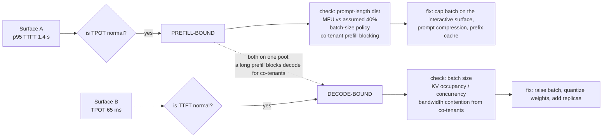

# Interview Bank: Prefill/Decode, Roofline & Latency Metrics

> `T06` · **Transcript coverage:** partial · [Cheat sheet](../00-cheat-sheets/T06-inference-fundamentals.md) · [Case study](../01-case-studies/T06-inference-fundamentals.md) · [Design blueprint](../03-design-blueprints/T06-inference-fundamentals/HLD.md)

## How to use this bank

Levels are **L3** (working competence — you have shipped with this), **L4** (senior practitioner — you own the tradeoff), **L5** (staff/architect — you own the decision and its blast radius). Every answer is a *model* answer, not a script: it shows the shape and the numbers a strong candidate reaches for, and none of it should be recited. Transcript coverage for this topic is **partial** — the corpus gives the phase split, the FLOPs reasoning and the structural parameters, and gives **no** numeric crossover, **no** hardware capacities or prices and **no** worked FLOP example — so several questions expect the candidate to derive and label rather than to quote. Numbers carry provenance: `[T]` for a lecture statement, `[R]` for a supporting-repo path, `[D]` for arithmetic derived here with assumptions shown. Where the corpus has no figure, the answer says so.

Questions are ordered to read as one interview: foundations, then mechanism, then the tradeoffs, then debugging, then design at scale.

---

### Foundations

#### T06-Q1 · What are the two phases, and why are they not the same workload?
**Difficulty:** L3 · **Depth expected:** 3 min
**Question:** Strip away the frameworks. LLM inference is described as having two phases. Name them, say what each one does, and say why the distinction is load-bearing rather than pedantic.
**Model answer:** **Prefill** processes the entire prompt in a single pass — high-parallelism matrix multiplications, bounded by compute (FLOPs), complexity `O(N)` in input length and parallelised. **Decode** generates one token at a time, each depending on the last, bounded by **memory bandwidth**, complexity `O(M)` and inherently sequential `[R]`. The corpus's table gives the mechanism for each: prefill is compute-bound because "parallel processing saturates the GPU's arithmetic units," while decode is memory-bound because "weights must be loaded from VRAM for *every single token*" `[R]`. The one-clause justification for why decode is slow is that each step is "loading Gigabytes of weights to produce Milligrams of data" `[R]`. Why it is load-bearing: the two phases are measured by different metrics (TTFT measures prefill, TPOT measures decode) and are fixed by different levers — FlashAttention and precision for prefill, quantization, GQA and batching for decode — so optimising the wrong phase produces weeks of work and no latency change. The case study's §8 makes the split numeric: at batch 1 with 70 GB of FP8 weights on a 3,350 GB/s part, decode spends 20.9 ms waiting on memory against 0.35 ms of maths, while prefill inverts to 0.70 s of maths against 20.9 ms of memory `[D]`.
**Signal:** Names which *resource* each phase saturates and attaches the right metric to each phase, rather than describing prefill as "the prompt" and decode as "the answer."
**Follow-ups:**
- *Which phase does a classification task touch?* — Prefill only; it is one parallel pass and therefore compute-optimal `[R]`.
- *Why do the phases need separate dashboards?* — A blended latency number cannot tell you which phase to fix; see Q3.
**Red flags:** Treats the two phases as a description of the request lifecycle rather than two different bottleneck regimes; cannot say which resource each saturates.

#### T06-Q2 · Why does inference have a KV cache, and what makes it valid?
**Difficulty:** L3 · **Depth expected:** 3 min
**Question:** The KV cache is usually introduced as an implementation trick. Derive it from the architecture instead — why is caching prior keys and values legitimate at all?
**Model answer:** Because the model is decoder-only and the attention is masked. The stack is "an embedding process positional embeddings masked multi head attention… you're masking to not attend to future tokens… layer norm and then the feed forward network and then uh layer norm again a linear layer and a prediction" `[T]` (CMU lecture 1). Masking means "the inputs at position three cannot depend on the word in position 4," so the representation of an earlier token does not change when a later token is appended — hence "the reason why we don't have to update the embedding of the previous words is because we're using masked attention" `[T]`. The lecturer grounds it in the probability model rather than in performance: without the causal constraint, "the chain rule of probability doesn't hold here" `[T]`. That is the whole validity argument, and it is what lets decode avoid recomputing the prompt's keys and values on every step. Two honest caveats. First, this is the single most important structural fact in the topic — every other inference optimisation (paged attention, prefix caching, disaggregation) is a consequence of it. Second, the lecture does **not** develop the KV cache in lecture 1: it appears in the roadmap as "KV cache optimization" and no more `[T]`. The detail belongs to the KV-cache topic, not to this one.
**Signal:** Derives validity from causal masking and the chain rule, and can say that the same masking is what makes the whole cache-then-page-then-reuse lineage possible.
**Follow-ups:**
- *What breaks if attention is unmasked?* — The chain rule; earlier representations would change, so nothing could be cached `[T]`.
- *What does the cache cost?* — It grows per token and eventually rivals the weights; Q12.
**Red flags:** Says "we cache to avoid recomputation" with no validity argument; believes the cache is an inference-time hack unrelated to the architecture.

#### T06-Q3 · Which metric measures which phase?
**Difficulty:** L3 · **Depth expected:** 2 min
**Question:** Here are four metrics — TTFT, TPOT, throughput, end-to-end latency. Map each to a phase and a purpose, and tell me what each is for.
**Model answer:** The corpus gives all four with targets `[R]`: **TTFT** (time to first token, target < 200 ms) measures prefill and user-perceived responsiveness; **TPOT** (time per output token, < 30 ms) measures decode and is stated as "reading speed and conversational flow"; **throughput** (aggregate tokens/second) is to be maximised and determines cost per query; **end-to-end latency** (< 2.0 s) is the total turn-around, stated for a conversational turn. The mapping is the point: TTFT is a prefill metric and TPOT is a decode metric, so they are fixed by disjoint sets of levers — TTFT by FlashAttention-3, tensor parallelism, or prefix caching to skip prefill entirely; TPOT by 4-bit weights, GQA, or speculative decoding `[R]`. Two disciplines follow. First, instrument them **separately** from day one; a blended latency number cannot tell you which phase is failing. Second, treat the given targets as **defaults, not requirements** — a 4k-token document summary does not need a 200 ms TTFT, and a review queue can tolerate a second, which is exactly why the case study relaxes TTFT to 900 ms contractually. Adopting vendor defaults without checking them against your workload is how teams over-buy.
**Signal:** Maps metrics to phases *and* refuses to accept the published targets as requirements — the second half is the discriminator.
**Follow-ups:**
- *Which target did the case study change, and why?* — TTFT, relaxed to 900 ms, bought with longer prompts; TPOT adopted unchanged.
- *What does end-to-end latency add?* — It is the user-visible SLO, but it "hides which phase is failing" and is therefore not a tuning target `[R]`.
**Red flags:** Uses one blended latency number; repeats the 200 ms target as a requirement without asking what the workload is.

#### T06-Q4 · Why is generation slower than classification?
**Difficulty:** L3 · **Depth expected:** 3 min
**Question:** A product owner notices that classifying a document takes 200 ms and summarising the same document takes 40 seconds. Explain the gap without hand-waving about "more tokens."
**Model answer:** Because the two tasks run different phases. Classification is a "Prefill-only" task: it "processes the entire input and produces a single output in one parallel pass, making it compute-optimal" `[R]`. Generation is **auto-regressive** — "each token depends on the previous one, forcing a sequential Decode loop," and "because each step in this loop is memory-bound (loading Gigabytes of weights to produce Milligrams of data), the system spends most of its time waiting for memory transfers rather than doing math" `[R]`. So the gap is not proportional to output length alone; it is proportional to output length multiplied by the cost of a memory-bound step. The supporting framing from the lecture is that training "can like completely saturate a GPU all the time," whereas inference is "smaller block, smaller block… predict a word" `[T]` (CMU lecture 1). And it is worse than a naive per-token count suggests: with a 3-token prefix and 3 generated tokens, "we had to make **four steps** through each layer" `[T]` — the last prompt token's forward pass is not free, and each step pays a fixed dispatch-and-wait cost. The correct answer to the product owner is a phase answer, not a token-count answer.
**Signal:** Answers with "prefill-only versus autoregressive" and the gigabytes-to-milligrams ratio, and knows the prompt's final token costs a step too.
**Follow-ups:**
- *Does the ratio hold at long context?* — No; attention's quadratic term enters and the FLOPs picture changes; Q8.
- *What would you do to close the gap on the summarisation path?* — Treat it as decode: batching, quantization, GQA; Q11.
**Red flags:** "Summaries are longer so they take longer" with no mechanism; does not know classification touches only prefill.

#### T06-Q5 · The per-step fixed cost, and why the GPU does not saturate
**Difficulty:** L3 · **Depth expected:** 3 min
**Question:** Why does a decode step cost a fixed amount of time regardless of how much useful arithmetic it does? And what does that have to do with a utilization target?
**Model answer:** Each step "essentially has a **fixed cost** um in that we have to **dispatch to our GPU** and then we need to wait for the GPU to finish processing… we might **not fully saturate our GPU** because GPUs have many many threads" `[T]` (CMU lecture 1). The mechanism is arithmetic intensity: a decode step reads the entire weight set to produce one token's worth of arithmetic, so the unit of work is a memory transfer with a kernel launch attached, not a compute-bound batch. The lecture contrasts this with training, where "if things go well you can like completely saturate a GPU all the time" `[T]`; inference is a chain of small kernels, each with dispatch latency and a tail of idle threads. Two consequences that matter operationally. First, the under-saturation is **not an implementation defect** — it is the arithmetic-intensity consequence of producing one token at a time, which is why the case study's committee caps the model at 60% assumed average utilization rather than treating full occupancy as achievable. Second, it is the origin of batching: if the weights are read once per step anyway, amortising that read across `B` sequences is nearly free. That is the bridge from this question to Q11.
**Signal:** Connects the fixed per-step cost to arithmetic intensity and to why batching exists, rather than calling it "overhead."
**Follow-ups:**
- *Is this fixed cost per token or per step?* — Per step; it is precisely why batching across sequences is the primary decode lever.
- *What does it imply for a utilization target?* — Treat utilization as a measured output of the pilot, not an input to the model; §8's model cannot settle it.
**Red flags:** Calls it "kernel launch overhead" and stops; treats low GPU utilization as a bug to be fixed by a better kernel.

#### T06-Q6 · Why is "how expensive is inference" a malformed question?
**Difficulty:** L3 · **Depth expected:** 2 min
**Question:** Someone asks you whether inference is expensive. What is missing from the question, and how do you answer it properly?
**Model answer:** The context length. The lecture opens with a deliberately ambiguous quiz and resolves it by asking "anyone think this was a trick question?" — the answer being that it depends on context length `[T]` (CMU lecture 1). The mechanism is the FLOPs decomposition: the query×key attention product is "quadratic in sequence length," while the projections and the MLP are "**basically linear in the sequence length.** You can see by looking at L" `[T]`. So "as the context length gets uh longer the flops you know increase uh **super linearly** with the context length… the total flops scale **quadratically** uh with the context… at least uh if you look in big O notation" `[T]`. The regime flips: at short context "the MLP part is the green part here **this dominates the the cost of the computation because it's 3.5 times uh larger than the the other parts**," but "as you get up to larger context lengths actually the uh quadratic part of attention starts to dominate" `[T]`. The correct answer to the question as asked is therefore: fix the prompt length distribution and the output length, then answer — and say which of the two phases you are pricing, because a 32k-token prompt and a 4k-token output are two different cost problems in one request.
**Signal:** Refuses the question as posed and reformulates it around context length and phase, rather than quoting a per-token cost.
**Follow-ups:**
- *Where exactly does the crossover sit?* — The lecture describes it qualitatively and gives **no context length** for it `[T]`; Q15.
- *So which phase do you price for a 32k/4k workload?* — Both; prefill sets TTFT, decode sets end-to-end; Q21.
**Red flags:** Quotes a per-token price as a general answer; does not know that attention and the MLP have different scaling exponents.

#### T06-Q7 · Search error versus model error — and why it is a procurement test
**Difficulty:** L3 · **Depth expected:** 3 min
**Question:** The team's instinct is to buy the largest model that fits. Before we price that, distinguish the two reasons an output can be bad, and tell me which one a larger model buys down.
**Model answer:** Lecture 1 separates them cleanly `[T]`. **Search error**: "the search algorithm failed to find the output that gives you the highest model score" — fixed by a better inference algorithm (greedy → beam → A*). **Model error**: "your model's score s theta is not a good output according to whatever evaluation metric you care about" — and "probably the quote unquote correct way of solving this problem is by training your model better." The warning attached to the second is the reason this is a procurement question: fixing model error at inference time "basically means **breaking your inference algorithm to get a better output**," which is a different and worse kind of change than improving the decoder. A larger model buys down **model** error. But under the phase analysis, size is also a direct multiplier on every decode step's memory traffic, because the weights are read once per token generated — so it worsens TPOT and $/page in direct proportion. Asking "which error am I buying down, and at what price per token" before choosing a size is the discipline. Two corollaries worth volunteering: the corpus observes that as models improved, "people are **sampling less and searching more**… very often people are using **greedy search**" `[T]` — so the search-error budget has shrunk — with the caution that "greedy search completely fall[s] apart on GPT2" `[T]`, meaning this is a consequence of model quality and not a law.
**Signal:** Separates the errors, attaches the cost multiplier to the model-error purchase, and volunteers the sampling/searching trend with its caveat rather than treating greedy as universally fine.
**Follow-ups:**
- *If the eval says the small model passes, what is the large model for?* — Nothing, in Phase 1; the second tier exists only if the difficulty distribution is bimodal.
- *Which error does better decoding fix?* — Search error only; see [T01](../02-interview-questions/T01-sampling-decoding.md).
**Red flags:** Says "buy the biggest model for quality" with no cost side; conflates the two error types or cannot name either.

---

### Mechanism

#### T06-Q8 · The FLOPs decomposition: what is quadratic, what is linear
**Difficulty:** L4 · **Depth expected:** 5 min
**Question:** Decompose the FLOPs of a decoder layer. Which terms are quadratic in sequence length, which are linear, and where does the feed-forward network sit?
**Model answer:** Three groups. **The quadratic term** is the query×key attention product — "each position the query is attending to the keys… you're multiplying the queries in the keys" — and it is "costly but it's also **quadratic in sequence length**… for some components of the attention" `[T]` (CMU lecture 1). **The linear terms** are the projections: query, key, value and output projections are "**basically linear in the sequence length**. You can see by looking at L" `[T]`. **The feed-forward network** is per-layer cost times layer count, with the per-layer FLOPs "basically the dimensionality of the underlying embedding times the dimensionality of the feed forward network… if you're using the swiggloo [SwiGLU] you have a gating function and then you have an up projection and down pro[jection]." Crucially, that whole term "is **entirely linear in the sequence length**" `[T]` — so the MLP does not become quadratic, but it is multiplied by the layer count and by the ~3.5x hidden-width expansion (Q14), which is why the lecture calls the feed-forward layers "wide and heavy." The observed curve: total FLOPs "increase uh **super linearly** with the context… **quadratically** uh with the context… at least uh if you look in big O notation" `[T]`. The operational reading: at short context the MLP dominates; at long context the attention product takes over; and the crossover is described qualitatively only (Q15).
**Signal:** Names the q×k product as the sole quadratic term and can attribute the MLP's weight to layer count and the 3.5x expansion, not to sequence length.
**Follow-ups:**
- *Does GQA change this decomposition?* — It reduces K/V projection cost and KV memory, and leaves the query projection carrying the compute; Q13.
- *Which term does prefill's `O(N)` label hide?* — The quadratic one; `O(N)` is the projection-and-MLP picture and is only true at modest context.
**Red flags:** Says "attention is quadratic so long context is expensive" without separating the product from the projections; thinks the MLP is quadratic too.

#### T06-Q9 · Derive `2N·params`, and say what the derivation is worth
**Difficulty:** L4 · **Depth expected:** 6 min
**Question:** Everyone quotes "FLOPs per token is about `2 × params`." Derive the factor of two, and tell me how much authority to give the rule.
**Model answer:** The factor of two is a multiply and an add per weight. The lecture's explanation of the underlying operation: "a matrix multiply is a multiplication and in an addition… you multiply by the weight and then you add it to the sum" `[T]` (CMU lecture 1) — one multiply-accumulate per weight per token, and a MAC is conventionally counted as two FLOPs. So the per-token forward-pass cost of a dense model is approximately `2 × N_params`, giving `2 × N × N_prompt` for prefill and `2 × N` per generated token for decode `[D]`. **The provenance matters and should be said out loud: the lecture never states the `2N·params` rule.** It explains the MAC reasoning and it poses the FLOPs question, but it supplies no rule, no formula and no worked numeric example `[T]` — the case study labels the rule `[D]` for exactly this reason, and a candidate who attributes it to the lecture has mis-read the source. Second, the rule has a stated blind spot: it ignores attention entirely, so it is accurate at short context and progressively wrong as the quadratic term grows. Use it as the first-order sizing term, then check the context length against the crossover argument in Q8. Third, it is what makes the phase story quantitative: `2N` FLOPs against `N_params × bytes_per_param` bytes moved gives the arithmetic intensity that decides which phase binds (Q10).
**Signal:** Derives the 2 from MAC arithmetic *and* volunteers that the lecture never states the rule — the provenance discipline is the discriminator here, not the formula.
**Follow-ups:**
- *So what is decode's FLOPs per token?* — `2 × 70e9 = 140 GFLOP` for the case study's 70B model; against 70 GB of FP8 weight traffic `[D]`.
- *Where does the rule fail?* — Long context, where attention's quadratic term dominates; and MoE, where only active parameters count.
**Red flags:** Quotes `2N·params` as a lecture result; cannot derive the 2; applies it unchanged at 128k context.

#### T06-Q10 · Place the workload on the roofline
**Difficulty:** L4 · **Depth expected:** 6 min
**Question:** Compute the arithmetic intensity of decode and of prefill for the case study's 70B model at batch 1, place both against the machine's balance point, and say what the comparison buys you.
**Model answer:** **Decode at batch 1, FP8.** Compute is `2 × 70e9 = 140 GFLOP`; bytes moved is the weight read, 70 GB, so intensity is `140 / 70 = 2 FLOP/byte`. The hardware balance point is `peak FLOPs / bandwidth = 1,000e12 / 3,350e9 ≈ 299 FLOP/byte`. Decode sits **~150x below the ridge**, so it is memory-bound by two orders of magnitude, and the time split follows: `70 / 3,350 = 20.9 ms` of memory against `140 / (1,000e12 × 0.4) = 0.35 ms` of compute — **60x more waiting than maths** `[D]`. **Prefill of a 2,000-token prompt.** Compute is `2 × 70e9 × 2,000 = 280 TFLOP` over 70 GB of weights read once, so intensity is `280e12 / 70e9 = 4,000 FLOP/byte` — **above** the ridge, hence compute-bound. The time split is `0.70 s` of maths against `20.9 ms` of memory, a ratio of **33x** `[D]`. Every number here comes from the case study's stated assumptions — 70B parameters, FP8 weights at 70 GB, 3,350 GB/s, 1,000 TFLOPS peak FP8, 40% achievable MFU — and the lecture supplies **none** of the hardware inputs `[T]`, so they are labelled `[D]` and must be re-stated whenever the hardware changes. What the comparison buys you is a decision rule that survives a hardware swap: intensity is a property of the workload, the ridge point is a property of the part, and the sign of `intensity − ridge` tells you whether to buy compute or bandwidth. The case study's §8 closes the loop — the same weights on the same GPU invert the binding constraint by a factor of about 2,000x between the phases.
**Signal:** Computes both intensities, compares each to the ridge, and states the hardware inputs are external rather than quoting them as given.
**Follow-ups:**
- *What happens to the decode point at batch 32?* — Intensity rises with the batch, though the weight read stays put; Q11.
- *When does the roofline model itself break?* — When the workload is neither compute- nor memory-clean, e.g. attention at long context, where the quadratic term is a moving target `[R]`.
**Red flags:** Says "decode is memory-bound" without a number; treats the ridge point as fixed when the hardware changes; cannot say where the bandwidth and peak-FLOP figures came from.

#### T06-Q11 · Batching is the only lever that fixes decode — show the arithmetic
**Difficulty:** L4 · **Depth expected:** 5 min
**Question:** You have a 60x memory-to-compute imbalance in decode. Which single change attacks it, and can you show me the number rather than assert the fix?
**Model answer:** Batching, and it is arithmetic rather than configuration. The mechanism: the weights are read once per step and reused across every sequence in the batch, so the memory cost per token falls roughly as `weights_bytes / (bandwidth × B)`. Using the case study's numbers, the batch-1 weight read is `70 / 3,350 = 20.9 ms`; amortised perfectly across `B = 32`, that becomes `20.9 / 32 = 0.65 ms` per token, and even at a modest `B = 8` it is `20.9 / 8 = 2.6 ms` `[D]`. So the 60x imbalance is a property of **batch size 1, and only of batch size 1** — which is precisely the lecture's "we might **not fully saturate our GPU**" turned into a number `[T]` (CMU lecture 1). The independent corroboration is in lecture 2: the reason speculative decoding works at all is that "calculating tokens in batches is much faster on GPUs" `[T]`. Two honest qualifications. First, the amortisation is not free at the latency layer: longer batches delay every sequence's next token, so there is a batch size at which TPOT or TTFT breaches and the curve turns — which is why the case study's runbook raises batch size until an SLO breaks and then backs off. Second, this is a decode-only statement: prefill is already compute-bound at batch 1, so batching does not fix a prefill problem and more replicas do not reduce a single request's prefill compute.
**Signal:** Derives the per-token cost at two batch sizes and states the boundary condition — that the amortisation stops when an SLO breaks.
**Follow-ups:**
- *Why does continuous batching beat a static batch size?* — See [T08](../01-case-studies/T08-batching-scheduling.md); the case study defers it.
- *Does batching help prefill?* — No; prefill is compute-bound and the FLOPs are already saturated.
**Red flags:** Says "increase the batch size" with no mechanism or number; believes batching is free and does not name the latency it trades away.

#### T06-Q12 · KV cache per token: derive it, and the surprising result
**Difficulty:** L4 · **Depth expected:** 6 min
**Question:** Derive the KV cache size per token for the case study's model, scale it to the p99 context, and tell me what the number means for the purchase.
**Model answer:** The formula is `2 (K and V) × n_kv_heads × head_dim × dtype_bytes` per layer, times the layer count. For the case study's 70B/80-layer, 8-KV-head model with head dim 128 `[D]`: `2 × 8 × 128 × 2 = 4,096 bytes` per layer, and `4,096 × 80 = 327,680 bytes ≈ 0.31 MB` per token in BF16 — half that in FP8 `[D]`. At the 32k p99 context that is `0.31 MB × 32,000 ≈ 9.9 GB` per request; at the model's full 128k it is **≈ 40 GB** `[D]`. That last number is the one that should stop the procurement: **a single 128k-context request consumes roughly as much memory as the 70B model's FP8 weights.** Two provenance notes. The **8 GQA KV heads** is a lecture fact and a Llama-3.1-series fact specifically — "in grouped query attention they always have **eight** uh over all of them in the llama 3.1 series" `[T]` (CMU lecture 1) — so on any other model family read the model card; the case study lists head-count mismatch as an edge case that silently corrupts this arithmetic. The **head dimension is derived** as `hidden / heads`, not stated `[T]`, and the lecture gives no per-row parameter counts and no attention-head counts beyond the KV-head figure. The consequence is the case study's single most important capacity conclusion: the KV cache, not the weights, sets concurrency, and the binding resource at scale is memory capacity. For contrast, the larger 405B shape at 126 layers and the same 8 KV heads gives `2 × 126 × 8 × 128 × 2 ≈ 516 KB` per token, so the effect grows with depth.
**Signal:** Produces the per-token formula and the 40 GB result, and flags the two inputs (KV heads, head dim) that come from outside the transcript.
**Follow-ups:**
- *What halves it?* — FP8 KV cache; roughly doubles concurrency `[R]`.
- *Where does this go next?* — Quantization, eviction, paging and sharing: [T07](../01-case-studies/T07-kv-cache.md).
**Red flags:** Recites a KV size without the formula; assumes 8 KV heads on every model; does not notice that KV can exceed the weights.

#### T06-Q13 · GQA and which projection pays
**Difficulty:** L4 · **Depth expected:** 5 min
**Question:** The course analyses grouped-query attention. What is it, what does it save, and what does it cost — and why does the cost land differently in the two phases?
**Model answer:** GQA shares key and value projections across groups of query heads: "in grouped query attention, you essentially create groups of the key vectors and value vectors … you attend like this to save memory" `[T]` (CMU lecture 1); the course calls it "the **grouped query attention transformer** which is a transformer that is used pretty widely nowadays." The cost is asymmetric and worth stating precisely. The **query projection carries all the compute**, "because you're calculating this for every head," while "for the key and value projections, you uh calculate less because you're grouping them together" `[T]`. So GQA is a **memory** optimisation that trades away a little of the K/V projection compute — and the phase distinction explains why that is the right trade in one place and a mildly wrong one in the other. In **decode**, which is memory-bound, the memory it saves on the KV cache is the binding resource, so the trade is clearly good, and the corpus lists GQA as a primary decode optimisation alongside quantization and batching `[R]`. In **prefill**, which is compute-bound, you have paid a small amount of compute for a memory saving you did not need at that moment. The size of the win is visible in the numbers: 8 KV heads instead of, say, 64 is an eighth of the cache, which is the difference between a 32k request costing 9.9 GB and costing far more (Q12). Notation from the lecture, useful when writing this down: `L` for sequence length, `D` for total vector dimensionality, `DH` for per-head dimensionality `[T]`.
**Signal:** States the K/V-versus-query projection asymmetry and then places it correctly on the phase axis — good for decode, mildly bad for prefill.
**Follow-ups:**
- *Does GQA reduce prefill FLOPs?* — It reduces K/V projection FLOPs slightly while leaving the quadratic q×k product untouched.
- *What else attacks the KV cache?* — Quantization, eviction, sharing across heads, low-rank compression and paged allocation: [T07](../01-case-studies/T07-kv-cache.md).
**Red flags:** Says GQA "makes attention faster" with no mechanism; thinks GQA saves compute in prefill rather than memory in decode.

#### T06-Q14 · The 3.5x MLP: convention or law?
**Difficulty:** L3 · **Depth expected:** 3 min
**Question:** Every sizing estimate I see multiplies the hidden size by 3.5 to get the MLP width. Where does that number come from, and how much should my FLOPs estimate lean on it?
**Model answer:** It is an empirical convention with two stated rationales, not a law. The lecture gives two reasons `[T]` (CMU lecture 1). First a compute/accuracy argument: it "should be larger than the hidden size… this allows you to like combine learn combination features." Second, and more distinctive, a **GPU utilization** argument — "having this be like an X uh 3.5 is good for GPU utilization based on threads." The lecturer is candid about the limits of his own explanation and says he would have to look up the full justification, which is exactly why the case study calls it an empirical convention rather than a law and instructs you to use the model's actual intermediate size when you have it. The sizing consequences are direct. The MLP term is the dominant linear contribution to per-layer FLOPs — "the MLP part is the green part here **this dominates the the cost of the computation because it's 3.5 times uh larger than the the other parts**" `[T]` — so a 20% error in the ratio is a material error in a prefill estimate, and prefill is precisely the phase where the MLP dominates. The correct engineering move is to take the intermediate size from the model config, and to keep 3.5x as the fallback for a model whose config you cannot read. The case study lists "the MLP ratio is not 3.5x" as an edge case whose symptom is a FLOPs estimate that is off.
**Signal:** Gives both rationales and volunteers that the lecturer himself did not have the full justification — treating the number as a convention with a config-based override.
**Follow-ups:**
- *Which phase does this error hit hardest?* — Prefill, where the MLP term dominates and the target is compute-bound.
- *What is the lecture's model-family shape?* — 32/80/126 layers with hidden 4,096/8,192/16,384 and MLP ≈3.5x hidden; the hidden sizes are spoken approximations `[T]`.
**Red flags:** Quotes 3.5 as a constant of the architecture; never looks at the model config.

#### T06-Q15 · What the lecture does not give you numerically
**Difficulty:** L4 · **Depth expected:** 5 min
**Question:** You are writing the sizing document and want to cite the course for the crossover point, the per-token FLOPs rule, a worked FLOP example and the machine's bandwidth. Which of those can you cite, and what do you do instead?
**Model answer:** None of them, and a candidate who claims otherwise has misread the source. On the crossover, the lecture is explicit but qualitative: at short context "the MLP part is the green part here **this dominates the the cost of the computation because it's 3.5 times uh larger than the the other parts**"; the linear projections "cost a lot of money"; "**multiplying the attention vectors together doesn't cost a whole lot**"; and "as you get up to larger context lengths actually the uh quadratic part of attention starts to dominate" `[T]` (CMU lecture 1). **No crossover context length is given.** On FLOPs, the lecture explains the multiply-and-add reasoning but **never states the `2N·params` rule** and gives **no worked numeric example** — the case study derives it `[D]` for exactly this reason (Q9). On hardware, the survey names A100, H100, B200, TPU, Cerebras and Groq but gives **no memory capacities, no $/hour and no $/FLOP** `[T]`. And the framing caveat governs everything: the analysis is "the **ideal setting where we're only calculating flops and we're not worrying about… whether we can use all of the flops that our processor or chip allows us to use efficiently**" `[T]`. So the document has to do four things: build the arithmetic yourself and label it `[D]`; show every input and its source; state that the hardware inputs are external and re-derive when they change; and be explicit that the result is a **comparison tool, not a forecast**, because MFU and dispatch overhead are not in it. That last point is the one that decides whether the purchase survives contact with traffic — the case study's tripwire is measured throughput below 60% of the prediction.
**Signal:** Recites the four specific absences accurately and responds with labelled derivation plus the ideal-setting caveat — rather than filling the gaps with plausible-sounding numbers.
**Follow-ups:**
- *Where do you get bandwidth, then?* — External, and re-stated when the hardware changes; the case study uses 3,350 GB/s as a labelled `[D]` input.
- *What is the model actually good for?* — Sizing and comparison; retire it on day one of the pilot.
**Red flags:** Attributes a crossover context length or the `2N` rule to the lecture; presents the ideal-FLOPs figure as a throughput forecast.

---

### Tradeoffs

#### T06-Q16 · Model size: largest-that-fits versus smallest-that-passes
**Difficulty:** L4 · **Depth expected:** 6 min
**Question:** Finance wants the smallest model that passes the eval; the team wants the largest that fits. Argue both sides, tell me when the largest is actually correct, and name what breaks each option.
**Model answer:** The table's core asymmetry `[R]`: the largest-that-fits has the fewest model errors and the simplest eval story, but "weights are read every decode step, so size is a direct multiplier on TPOT and $/page" — and it **breaks when the binding constraint is memory bandwidth, which for decode it almost always is** `[R]`. The smallest-that-passes minimises bytes-per-token and leaves headroom for context growth, and it **breaks when the eval set does not represent production**, at which point "passes the eval" is a false signal rather than a measurement. So the case study's chosen option is the smallest model that passes a **production-representative** eval, with a documented re-evaluation trigger. When is the largest actually right? Only when the workload is **prefill-dominated or the SLO is loose** — because prefill's cost is compute-bound and the weights are read once per request rather than once per token, size stops being a per-token multiplier. That is the honest exception, and a candidate who states it has understood the mechanism instead of the folklore. The two other rows matter for the decision: a **two-tier** arrangement (small default, large on demand) is cost-optimal and keeps a quality ceiling, but breaks when both tiers cannot be held resident, and it needs routing ([T14](../01-case-studies/T14-routing-gateways.md)); **MoE** offers large capacity at lower active FLOPs but is deferred because routing, load balancing and expert-parallel communication are a second-order problem you should not take on before dense serving works. Revisit if the eval-to-production gap exceeds tolerance, or context growth exceeds the headroom.
**Signal:** Names the exception (prefill-dominated or loose SLO) and the failure of the chosen option (a non-representative eval) instead of defending one row.
**Follow-ups:**
- *Why does size multiply TPOT?* — Weights are read once per token generated; Q11.
- *What is the MoE trap at this stage?* — Variable latency and expert imbalance before you can serve a dense model at all.
**Red flags:** "Bigger is better for quality" with no memory-bandwidth cost; picks the smallest without asking what the eval measures.

#### T06-Q17 · Precision: FP8, 4-bit, quantized KV and the exception that breaks each
**Difficulty:** L4 · **Depth expected:** 6 min
**Question:** You have four precision options on the table. For each, say what it buys, and name the specific condition under which it breaks. Then tell me how much to trust the FP8 accuracy claim.
**Model answer:** Four rows, four exceptions `[R]`. **BF16/FP16**: reference quality, no calibration, but 2 bytes per weight — "the largest memory footprint, and decode is memory-bound," so it costs you the thing that binds. Its role is the accuracy baseline for any eval, not a production setting. **FP8 (chosen)**: "**2x faster than FP16/BF16 with negligible (<0.1%) accuracy loss**," native on current server GPUs, and it represents the dynamic range of activations better than Int8 because of its smaller mantissa and larger exponent, "without complex calibration." Its exception is exact and important: it **breaks without dynamic FP8 scaling**, which "adjust[s] the quantization scales per-layer to prevent outliers from degrading the entire model's logic" `[R]`. **4-bit weights**: halves memory again and is "the largest TPOT win available," but carries real quality risk and **breaks on the eval for some models and not others — always measure per model**; the case study's break-even is that 4-bit frees about 45 GB for KV and is "roughly a 4x capex reduction for the same workload," which is why it is held in reserve rather than treated as a last resort. **Quantized KV cache**: attacks the *other* memory consumer, adds error to attention rather than weights, and **breaks at long context where the cache dominates** — a separate decision belonging to [T07](../01-case-studies/T07-kv-cache.md). On the FP8 claim: treat it as a **vendor/hardware claim needing per-model re-measurement**, and flag a genuine conflict in the corpus — `04-inference-optimization/01-inference-fundamentals.md` states "<0.1% accuracy loss" while `03-training-and-adaptation/07-quantization-deep-dive.md` gives the FP8 row as "< 1%". Both are in the same repo. Do not pick one silently: state that the range is wide, and that the gating item is an eval on your model, not a citation.
**Signal:** Gives an exception per row, and volunteers the FP8 discrepancy *and* the resolution procedure rather than quoting the friendlier number.
**Follow-ups:**
- *Which precision change is a purchase-order change, not a config change?* — A 4-bit build that passes eval and halves the footprint.
- *What happens without dynamic scaling?* — Outliers degrade a whole layer; the mitigation is to restore the BF16 reference and re-quantize with scaling.
**Red flags:** Quotes "<0.1%" as a fact about their model; treats 4-bit as safe because a blog said so; does not know quantized KV is a separate decision from weight precision.

#### T06-Q18 · Parallelism: TP, PP, or replicate
**Difficulty:** L4 · **Depth expected:** 6 min
**Question:** A model does not fit on one device. Walk the parallelism options, say what each buys and what each breaks, and tell me what you would default to once the model *does* fit.
**Model answer:** Four rows `[R]`. **Single GPU** has no communication and no complexity, but a hard capacity ceiling: "a model that does not fit does not run." **Tensor parallelism** spreads weights and KV across GPUs and directly reduces per-GPU memory, at the cost of communication on **every layer**, so it "breaks with slow interconnect" — and the lecture's TPU description is the cleanest statement of why that matters, since TPUs were "created from the ground up for doing this and they have things like **very large memory, very fast interconnect**," contrasted with GPUs that "originally started for gaming" `[T]` (CMU lecture 1). **Pipeline parallelism** has cheaper communication but bubble/depth trade-offs and more complexity, and "breaks with small batch sizes, where bubbles dominate." **Replicate, don't split** scales request throughput linearly with no per-request communication, but every replica must hold the full model, so it "breaks when the model barely fits — no room for KV growth." The case study's choice follows from the phase analysis: **replicate on single-GPU nodes with FP8 weights**, and use tensor parallelism only if the eval-winning model does not fit. The reasoning is that a 70 GB FP8 model on an 80 GB device barely fits, so the KV cache is already the constraint (Q12) and splitting is a contingency, not a plan. The revisit condition is the one worth volunteering: once you split, **interconnect becomes a first-class procurement requirement** rather than a footnote, and the failure symptom is scaling efficiency collapsing against GPU count. For Bellhaven the residency requirement forces self-hosting but does **not** force NVIDIA — the lecture notes AMD has "very good hardware but **not as well supported in the software ecosystem**" `[T]`, which is why Phase 1 takes the well-supported path.
**Signal:** Prices the communication cost of each option and knows that replication, not splitting, is the default once the model fits — plus the interconnect-as-procurement point.
**Follow-ups:**
- *Why is PP bad for inference specifically?* — Bubbles dominate at small batch, and interactive serving runs small batches.
- *What does the corpus say about non-NVIDIA stacks?* — AMD serving material exists `[R]` and is covered in [T07](../01-case-studies/T07-kv-cache.md); the ecosystem gap is the Phase-1 argument.
**Red flags:** Reaches for tensor parallelism by default; does not mention communication cost or interconnect quality.

#### T06-Q19 · What to optimise for — and when the target inverts
**Difficulty:** L5 · **Depth expected:** 7 min
**Question:** Throughput, TTFT, TPOT or end-to-end: which do you make the tuning target for this estate, and what would have to change for you to pick a different one?
**Model answer:** Four options, each with a failure mode `[R]`. **Throughput** minimises $/page but long batches inflate TTFT and can breach a contractual latency term — it belongs on batch/offline surfaces. **TTFT** gives interactive feel but larger batches hurt it, and it "breaks when the workload is decode-dominated — you optimise the cheaper phase." **TPOT (chosen)**: the workload is decode-dominated, and TPOT is "also the end-to-end driver for long outputs," but it requires memory-side optimisation and "breaks for very short outputs, where TTFT dominates." **End-to-end** matches the user experience but is "hard to attribute; hides which phase is failing," so it "breaks as a tuning signal" — it belongs on the dashboard as an SLO, never as the thing you tune. So: **TPOT as the tuning target, with TTFT and end-to-end as SLOs on the dashboard.** Two things make this a senior answer rather than a preference. First, the justification is arithmetic, not taste: with a 4,000-token output against a 2,000-token average prompt, the estate is decode-dominated by token count, and §8's decode analysis is where the cost is. Second, the inversion condition should be stated up front — **if the workload mix shifts toward short outputs, the target inverts**, because a 200-token answer is TTFT-dominated and you would then be optimising the cheaper phase under the old choice. The case study's own TTFT position sharpens this: prefill at 0.70 s against a 900 ms contract leaves only ~200 ms of margin before scheduling and network, so there is nothing cheap left to buy on the TTFT side and the honest answer is prompt compression or prefix caching if the p99 prompt grows. Naming the margin is what makes the choice defensible rather than arbitrary.
**Signal:** States the chosen target *and* the condition that inverts it, and grounds the choice in the workload's token mix rather than in a preference for latency.
**Follow-ups:**
- *Why is end-to-end not a tuning target?* — It cannot tell you which phase to fix; attribute first, then tune.
- *What is the TTFT margin, and why does it matter?* — ~200 ms against 900 ms `[D]`; it is why TPOT is the target and TTFT is only an SLO.
**Red flags:** "Optimise everything"; picks TTFT for a long-output workload; cannot say what would change the answer.

#### T06-Q20 · Where to compute the cost estimate, and the tripwire
**Difficulty:** L5 · **Depth expected:** 7 min
**Question:** You need a $/1,000-pages figure that becomes a contract price, and you have no hardware yet. Where do you compute it, what does each option cost you, and what tells you the model was wrong?
**Model answer:** Four options, with the caveats carrying the answer `[R]`. **Vendor benchmark**: free and vendor-tuned, but it is not your prompt distribution, not your batch size and not your SLO — it "breaks whenever the workload differs from the benchmark's," so it is a sanity-check only. **Published FLOPs analysis**: phase-aware and it shows the crossover, which is genuinely useful for comparison, but it carries the lecture's explicit caveat that it is the "**ideal setting**… not worrying about whether we can use all the flops" `[T]`, so it "breaks as a forecast — MFU and dispatch overhead are not in it." **Roofline / arithmetic-intensity model (chosen)**: one number that says which phase binds, and it survives a hardware swap because intensity is a property of the workload — but it needs memory bandwidth, "which the lecture does not give" `[T]`, and it "breaks when the workload is neither compute- nor memory-clean (e.g. attention at long context)." **Measured pilot**: the truth, but it needs hardware you have not bought — the circular dependency. The case study's choice is the arithmetic-intensity model for the purchase decision, **retired in favour of measurement on day one of the pilot**, and the discipline that makes it honest is knowing its useful life is one week. The tripwire is the part candidates forget: **if measured throughput is below 60% of the model's prediction, that is an implementation problem, and buying more GPUs is the wrong response.** The correct response is to fix the stack — kernel selection, batching configuration, or a saturated interconnect — because the model already assumes only 40% MFU, and falling below that is not a hardware shortfall but a defect.
**Signal:** Ranks the options by what each can and cannot support, and states the tripwire *with its correct response* — fix the stack, not the purchase order.
**Follow-ups:**
- *What is the model's useful life?* — Until the pilot hardware exists; it is a comparison tool, not a forecast.
- *Which input is the most leveraged unknown?* — MFU: at 60% instead of 40%, prefill falls to 0.47 s and restores TTFT margin `[D]`.
**Red flags:** Presents the FLOPs figure as a throughput forecast; responds to a shortfall by buying hardware; cannot name a single input it lacks.

#### T06-Q21 · The purchase: which resource actually binds?
**Difficulty:** L5 · **Depth expected:** 8 min
**Question:** Walk me through the purchase arithmetic for this estate. Which resource sets the GPU count, and why is it not FLOPs?
**Model answer:** Work the constraints in order, because each one changes what the next means. **Weights first.** At FP8 the 70B model is 70 GB, so on an 80 GB device there are ~10 GB left — "**but the KV cache has to live there too**" `[D]`. **Then KV.** At 0.31 MB per token, a 32k-context request needs ≈9.9 GB, so the FP8 build holds "about one 32k-context request at a time, or several shorter ones" `[D]`. **Now the conclusion: the binding resource is KV memory, not FLOPs.** The count is `peak concurrent requests × KV per request / KV memory per GPU`, and the second question is "whether that many replicas can be kept busy." That second question is where the model honestly fails: the committee's 60% utilization target and the model's 40% assumed MFU are "close enough that the model cannot settle the count alone; that is the argument for buying the pilot increment first." **The sensitivity table is where the leverage lives.** 4-bit weights drop the model to 35 GB, free ~45 GB for KV, and "roughly 4x the concurrency of the FP8 build" — "the largest single lever available, if eval passes"; FP8 KV halves per-request KV and roughly doubles concurrency; a p99 prompt growing to 64k doubles prefill to 1.4 s and breaches the TTFT SLO **before any memory constraint binds**; a 16k output quadruples decode time and leaves the memory constraint unchanged; and bandwidth 20% lower than assumed worsens every decode number by 25% without changing the phase conclusion. **Why not FLOPs:** at batch 1 decode the maths is 0.35 ms against 20.9 ms of memory, so FLOPs are not remotely the constraint; and even prefill, which *is* compute-bound, is a single request's problem that more replicas cannot solve. **The break-even:** FP8 serves roughly one 32k request at a time, the 4-bit build serves four — so if the eval passes, 4-bit is roughly a 4x capex reduction for the same workload, which makes the eval, not the hardware, the gating item on the purchase order.
**Signal:** Walks the constraints in the order in which each becomes binding, lands on KV memory, and refuses to let the model settle the GPU count — buying the pilot increment instead.
**Follow-ups:**
- *What would change the binding resource?* — Longer context or higher concurrency moves it further toward capacity; a prefill-heavy mix moves it toward compute.
- *Why is prefill not fixed by more replicas?* — Prefill is compute-bound and more replicas do not reduce a single request's compute.
**Red flags:** Sizes on FLOPs or on tokens/second; produces a GPU count with no KV term; does not mention the pilot increment.

#### T06-Q22 · Published targets are defaults, not requirements
**Difficulty:** L3 · **Depth expected:** 3 min
**Question:** Your vendor's reference architecture says TTFT under 200 ms and end-to-end under 2 seconds. Your contract says 900 ms and 120 seconds. Justify the difference to an auditor.
**Model answer:** Because those figures are defaults written for a conversational turn, and this workload is not one. The corpus gives them as targets `[R]`: TTFT < 200 ms because it drives "user-perceived responsiveness," and end-to-end < 2.0 s as "total turn-around for the agent." But the case study's SLOs are derived from the workload: a 4k-token document summary is not a conversational turn, so the honest end-to-end is `TPOT × length` — 30 ms × 4,000 = 120 s `[D]` — and a **document-review queue** can tolerate a second before the first token, which is why TTFT was relaxed to 900 ms contractually. Two things are worth saying to an auditor. First, the relaxation is not sloppiness: it is bought knowingly, and the case study's §8 shows the price — prefill at 0.70 s against 900 ms leaves ~200 ms of margin before scheduling and network, so the contract is genuinely tight and the team has said so. Second, TPOT was adopted **unchanged**, because 30 ms is already the reading-speed constraint and there is no reason to relax a constraint that is not binding. The general rule the case study states: "adopting vendor-default targets without checking them against the workload is how teams over-buy" — the auditor's question is not "why did you deviate" but "what did you check", and the answer is the phase each metric measures and the length of the artefact being produced.
**Signal:** Derives the SLO from output length and the user's tolerance, and shows the end-to-end arithmetic rather than asserting a relaxation.
**Follow-ups:**
- *Which target would you tighten rather than relax?* — None here; TPOT is adopted as-is and is the tuning target (Q19).
- *What breaks the 120 s figure?* — A 16k-token output quadruples decode and breaches it `[D]`.
**Red flags:** Adopts the 200 ms target and over-provisions; relaxes a target without a derivation or without saying what was checked.

#### T06-Q23 · The price assumption and the single-price-point bet
**Difficulty:** L5 · **Depth expected:** 6 min
**Question:** The business case is built against today's GPU price. What is wrong with that, and how do you write it honestly?
**Model answer:** GPU rental is a spot market, and a purchase decision made against a single price point is a bet on that market. The lecture's practical material on renting is unexpectedly load-bearing here `[T]` (CMU lecture 1): **Modal** and **RunPod** — "particularly good for like if you want to spin up a bunch of GPUs uh quickly or you want to have like **serverless GPUs**" — plus **San Francisco Compute Company** and **Prime Intellect**, of which "Prime Intellect has like a **stock price like a stock ticker but for GPU prices**… So this is like the price for an H100 and you can actually see it **go up and down like the stock market**." So the honest business case does three things. It **states the price and its date** as an explicit assumption, in the same table as the bandwidth and MFU assumptions, so a reader can see it is an input and not a fact. It **separates capex from rental** and says which one the decision rides on — the residency requirement forces self-hosting for the document path, but the residency constraint does not forbid renting for evaluation, burst, or the pilot. It **states the sensitivity**, because the case study's own table shows the cost model's real risk is not the price at all: a 20% bandwidth miss worsens every decode number by 25% and leaves the phase conclusion intact, whereas an MFU of 60% instead of 40% cuts prefill to 0.47 s and changes the SLO margin. In other words, the price assumption is the *loudest* number in the model and not the most leveraged one, and the write-up should say both. The failure the case study names is a business case that dates: a purchase made against a single price point with no date and no sensitivity band.
**Signal:** Names the spot-market property with the corpus's own evidence, and then ranks the price assumption *below* MFU as a risk — the non-obvious move.
**Follow-ups:**
- *Does the residency requirement force a purchase?* — It forces self-hosting, not ownership; the hardware survey notes the ecosystem gap is the reason to take the well-supported path `[T]`.
- *What else in the model is a dated assumption?* — Bandwidth, peak FLOPs and MFU; all are `[D]` inputs that must be restated when the hardware changes.
**Red flags:** Presents a price as a constant; treats rental and capex as interchangeable; has no sensitivity band.

---

### Debugging

#### T06-Q24 · TTFT SLO breach: diagnose it in order
**Difficulty:** L4 · **Depth expected:** 6 min
**Question:** p95 TTFT on the review queue crosses 900 ms overnight. Walk me through the diagnosis, and tell me what you would *not* do.
**Model answer:** Attribute the phase first, because the fix set is disjoint. TTFT is a **prefill** metric, so a TTFT breach with normal TPOT is prefill-bound by construction `[R]`. Then, in order. **Prompt length distribution**: the SLO is set by the p95 prompt, and prefill compute is linear in prompt tokens — a shift in what clients send is the most common cause and is invisible in the mean. **MFU**: the case study's prefill prediction of 0.70 s assumes 40% MFU; if measured MFU has drifted down, prefill stretches with no change to traffic, and MFU is "the most leveraged unknown in the model." **Batch-size policy**: larger batches inflate TTFT specifically, so a scheduler change or a burst that pushed batch size up can do this with no change to prompts or hardware. **Whether a long prefill is blocking decode for co-tenants** — on a shared replica "a long prefill blocks decode for everyone on that replica," which is the interference the corpus names disaggregation for at scale. The fixes, in the case study's own order: cap batch size on the interactive surface, or compress the prompt; if the p99 prompt has genuinely grown toward 64k, prefill doubles to 1.4 s and **breaches the SLO before any memory constraint binds** — so the answer is prompt compression or prefix caching, not hardware. **What I would not do: buy GPUs.** More replicas raise throughput but "do not reduce a single request's prefill compute." And I would not touch quantization — it is a decode lever and will not move a prefill-bound metric, which is the case study's named failure mode of "effort spent on quantization with no latency change."
**Signal:** Attributes the phase before touching anything, checks MFU and prompt distribution ahead of hardware, and explicitly refuses both the hardware purchase and the quantization lever.
**Follow-ups:**
- *When would you add replicas?* — When utilization is genuinely saturated and the problem is throughput, not a single request's compute.
- *What if TTFT and TPOT both degrade?* — Suspect a co-tenant or host-level effect — bandwidth contention — before assuming two independent causes.
**Red flags:** Reaches for hardware; changes a precision setting to fix a prefill metric; looks at mean latency instead of the prompt-length-sliced p95.

#### T06-Q25 · Throughput at half the model's prediction
**Difficulty:** L4 · **Depth expected:** 6 min
**Question:** The pilot comes back at roughly half the tokens/second the arithmetic-intensity model predicted. What is your response, and what is the wrong one?
**Model answer:** The model assumed 40% MFU, so being at half of prediction means roughly 20% MFU — which is a **stack** result, not a hardware result, and the case study is explicit about the response: measured throughput "below 60% of the model's prediction" means "that is an implementation problem, and buying more GPUs is the wrong response" `[D]`. The diagnosis, in the order the corpus points at. **Batching configuration**: the model's decode number is an amortised weight read, and if the serving stack is running batch 1 or a small static batch, the amortisation never happens — this is the first thing to check because it is the single largest lever (Q11). **Kernel selection**: the model assumes the ideal setting where "we're not worrying about… whether we can use all of the flops that our processor or chip allows us to use efficiently" `[T]`, so kernel efficiency relative to peak is exactly the gap being measured. **Interconnect**: if the deployment did split the model, communication on every layer offsets part of the gain and near-linear scaling fails — symptom, scaling efficiency against GPU count. **Whether the phases are interfering**: a 32k prompt and a 4k output on the same replica means "a long prefill blocks decode for everyone on that replica" at high concurrency. **What I would not do:** buy GPUs, re-tune the model's assumptions upward to match reality, or change the model size — the case study's tuning order puts model size last precisely because "changing the model invalidates every other measurement." The one legitimate model-level response is to record the measured MFU as the new input and keep the tripwire as an alert, so MFU drift is caught rather than rediscovered.
**Signal:** Reads the shortfall as a stack signal because the model already discounts for MFU, and goes straight to batch configuration — the highest-leverage check.
**Follow-ups:**
- *Why is 60% the threshold?* — Below it you are outside the model's own generous band, so the gap is implementation, not silicon.
- *What do you do with the measured number?* — Replace the assumed MFU and monitor tokens/second per GPU against it.
**Red flags:** Concludes "we need more hardware"; adjusts the model to match the measurement without diagnosing; skips batch size.

#### T06-Q26 · Quality regression after a precision change
**Difficulty:** L4 · **Depth expected:** 5 min
**Question:** Two weeks after moving to FP8, one document class starts failing review at a rate the eval never caught. Nothing else changed. What happened?
**Model answer:** The most likely mechanism is **FP8 without dynamic per-layer scaling** — which is the case study's named incident and the precision table's stated exception: outliers "can degrade a whole layer without scaling," and dynamic scaling exists to "adjust the quantization scales per-layer to prevent outliers from degrading the entire model's logic" `[R]`. So the first check is whether the build actually has dynamic scaling enabled, because a serving framework default can silently disagree with what the eval used. Second, and more subtle: the eval that passed may not have been representative. The precision row's own caveat is that the FP8 accuracy figure is a **general claim needing per-model re-measurement**, and a document class that is under-represented in the eval is exactly where a quantization outlier expresses itself. Third, treat the claim itself with scepticism — the corpus carries two different numbers for the same thing: `<0.1%` in `04-inference-optimization/01-inference-fundamentals.md` and `< 1%` in `03-training-and-adaptation/07-quantization-deep-dive.md`. That is a 10x spread, and it means "negligible" is not a number you can plan against. The response is procedural: **restore the BF16 reference and re-quantize with scaling**, then re-run the eval with the failing class represented; if the gap persists, the class is genuinely precision-sensitive and it becomes a candidate for a separate tier rather than a rollback. Note also that the failure is a *model-error* change, not a search-error one (Q7), so no decoding change will recover it. And the detection lesson: this surfaced as a human review rate, not an alert, which means the eval gate was on the wrong distribution.
**Signal:** Goes to dynamic scaling first, then to eval representativeness, and volunteers the 10x spread between the corpus's two FP8 figures rather than quoting the flattering one.
**Follow-ups:**
- *What should have caught it before rollout?* — A BF16-baseline eval gate with the failing class represented; precision is a purchase-order-affecting decision.
- *What if the regression is real and per-model?* — Keep BF16 as the reference, and route that class to an unquantized build rather than rolling back the estate.
**Red flags:** Blames the model; accepts the regression as expected FP8 behaviour; does not know what dynamic scaling is for.

#### T06-Q27 · OOM under long documents
**Difficulty:** L5 · **Depth expected:** 7 min
**Question:** Requests start failing at high context while the weights are demonstrably fine in memory. Which resource ran out, and how do you size it next time?
**Model answer:** The **KV cache**, not the weights. This is the case study's third top-5 incident and it is a capacity failure, not a compute one: at 0.31 MB per token for the 80-layer/8-KV-head shape, a 32k-context request holds ≈9.9 GB and a full 128k request holds **≈40 GB** — "roughly as much memory as a 70B model's FP8 weights" `[D]`. The symptom is diagnostic: request failures at high context with normal throughput at low context, because the FP8 weights are 70 GB of a fixed 80 GB and it is only the variable term that grew. The detection signal to have on the dashboard is **KV memory per request and the concurrency distribution**, plus "requests rejected or queued for memory," which the case study names as the leading indicator of a capacity wall. The sizing discipline that prevents it: compute `KV per token × max_context × concurrency` from the request's p99 rather than the mean, because the failure is in the tail by construction. The mitigations, in order of what they cost you. **Cap context** — the crude fix, and cheap, but it interacts with a quality hazard the corpus flags: exceeding the training length is "a silent quality failure, not a crash" `[T]` for the model, so a context cap can trade an OOM for a quiet quality regression. **Quantize the KV cache** — halves per-request KV and roughly doubles concurrency `[R]`, but adds error to attention and "breaks at long context where the cache dominates," which is exactly the regime you are in. **Paged allocation and eviction** — the [T07](../01-case-studies/T07-kv-cache.md) territory, and the right long-run answer. The structural point is the §2 requirement of **2x headroom for context growth**: this failure is predictable from the requirement, and the case study's answer to it is a purchase-shape decision, because at 10x the question stops being "how fast can we read weights" and becomes "how many KV caches fit."
**Signal:** Identifies the KV cache from the symptom pattern, sizes on the p99 rather than the mean, and prices each mitigation including the one that trades an OOM for a silent quality loss.
**Follow-ups:**
- *Why is a context cap dangerous?* — Beyond the training length the model degrades silently rather than erroring `[T]`.
- *What inverts at 10x?* — The binding constraint moves from bandwidth to capacity; Q29.
**Red flags:** Blames the weights or the GPU count; sizes on mean context; proposes only a context cap with no quality check.

#### T06-Q28 · Meeting the SLO on average, missing at P95
**Difficulty:** L5 · **Depth expected:** 6 min
**Question:** Average TTFT is 300 ms, comfortably inside the 900 ms contract, but the service keeps breaching the contractual term. What is going on, and what is the structural fix?
**Model answer:** Averages are the wrong instrument, and this is the case study's named failure: "**Latency SLO met on average, missed at P95**" — a contractual breach with detection at P95/P99 TTFT and the mitigation being "batch-size limits on the interactive surface" `[R]`. Three mechanisms produce it, and they compound. **Prompt-length skew**: the contract is set by the p95 prompt, and prefill compute is linear in prompt tokens, so a mixed workload with a long tail of 32k-token contracts and a mass of short ones has a mean that describes neither population — the case study's monitoring list therefore includes the **prompt-length distribution**, not just latency, and the requirement is to report P50/P95/P99 **sliced by prompt-length bucket**. **Batch-size sensitivity**: long batches inflate TTFT specifically, so a burst that raises batch size moves the tail while leaving the median roughly intact, which is the failure the mitigation names. **Shared-replica interference**: at high concurrency a long prefill "blocks decode for everyone on that replica," so a single expensive request in the batch creates a tail event for its co-tenants — the interference that motivates disaggregation at scale. The structural fix is not a bigger fleet: it is a **batch-size cap on the interactive surface**, plus pool separation by output-length class so a long-prefill client cannot generate tail events for the review queue. The reason this is an L5 question is the contract framing — the SLO is a P95 commitment, and the mean is not a proxy for it, so the metric set has to be chosen to match the term that is signed. The case study's dashboard does exactly that: TTFT p50/p95/p99 and TPOT p50/p95/p99, separately, plus the prompt-length distribution and the queue-for-memory counter.
**Signal:** Connects a P95 breach to prompt-length skew and batch-size sensitivity, and fixes it with a batch cap and pool separation rather than capacity.
**Follow-ups:**
- *Why separate TTFT percentiles from TPOT percentiles?* — They are different phases and different fixes; a blended percentile cannot attribute.
- *What is the leading capacity indicator?* — Requests rejected or queued for memory.
**Red flags:** Recommends adding replicas; monitors a mean; does not look at prompt-length distribution.

---

### Scale and design

#### T06-Q29 · What changes at 10x
**Difficulty:** L5 · **Depth expected:** 8 min
**Question:** Traffic grows 10x. Which parts of this design survive unchanged, which break, and what inverts?
**Model answer:** **What survives**, and it is worth saying first because it is the design's value: the phase split, the `2N·params` arithmetic, the KV-per-token formula, and the rule that TTFT and TPOT are measured separately `[R]`. None of those are scale-dependent, which is why the §8 model is written parameterised rather than hard-coded. **What breaks first: the binding constraint moves from bandwidth to capacity.** At 10x concurrency the question stops being "how fast can we read the weights" and becomes "how many KV caches fit" — a different purchase, and the transition that makes [T07](../01-case-studies/T07-kv-cache.md) the load-bearing topic. **Second, prefill and decode stop sharing hardware well.** With a 32k prompt and a 4k output on the same device, "a long prefill blocks decode for everyone on that replica," and the corpus carries disaggregation as the named technique for exactly this `[R]`. **Third, batch size becomes a policy rather than a number** — continuous batching and scheduling decisions displace static configuration ([T08](../01-case-studies/T08-batching-scheduling.md)). **Fourth, the model-size decision re-opens**: at 10x the difference between the smallest-passing model and the largest-that-fits is a multiplicative cost difference, so the eval's *precision* matters more than its existence. **What inverts:** "buy the biggest GPUs" becomes "buy the right memory-to-compute ratio," and for a decode-heavy workload that increasingly means memory capacity and bandwidth rather than peak FLOPs — the lecture's own note that TPUs were built with "**very large memory, very fast interconnect**" `[T]` is the same argument from the other direction. Two things get harder rather than better. The **TTFT margin** does not improve with replicas, because it is a single request's compute; and **determinism** narrows as GPU count, MoE and quantization variants multiply, so completion replay rather than regeneration becomes the only audit mechanism.
**Signal:** Separates what survives from what inverts, names capacity replacing bandwidth as the binding constraint, and knows the TTFT margin is not a scaling problem.
**Follow-ups:**
- *What is the first architectural change?* — Pool separation / disaggregation by phase and by output-length class.
- *Why is the TTFT margin not fixable by scale?* — Prefill is compute-bound per request; more replicas raise throughput only.
**Red flags:** "Add replicas"; assumes the phase split stops applying; no view on what the eval has to become.

#### T06-Q30 · Defending the model — and retiring it
**Difficulty:** L5 · **Depth expected:** 8 min
**Question:** You have to put this analysis in front of a procurement committee who will hold you to it. What do you claim, what do you refuse to claim, and what is your exit condition?
**Model answer:** **What I claim.** The phase attribution, which is a structural fact and not a measurement: prefill is compute-bound and sets TTFT, decode is memory-bandwidth-bound and sets TPOT, measured by separate metrics `[R]`. The capacity arithmetic — weights, KV per token, KV at the p99 context — because it is closed-form, depends only on the model's structural parameters, and produces the load-bearing number: a single 128k-context request needs ≈40 GB, roughly as much as the FP8 weights `[D]`. And the comparison that decides the purchase: decode at batch 1 is ~150x below the machine's ridge point, so the binding resource is memory capacity, and the GPU count is a KV question rather than a FLOPs question. **What I refuse to claim.** A throughput or $/page *forecast*, because the analysis is "the ideal setting where we're only calculating flops and we're not worrying about… whether we can use all of the flops that our processor or chip allows us to use efficiently" `[T]` — MFU and dispatch overhead are not in it. Any figure the lecture does not give — no crossover context length, no hardware capacities, no prices — presented as if it were given. A single price point without a date and a sensitivity band, because GPU rental behaves like a market `[T]`. And I will not let the model settle the GPU count: at 40% assumed MFU against a 60% utilization target "the two constraints are close enough that the model cannot settle the count alone; that is the argument for buying the **pilot increment first**." **Exit condition.** The model retires on day one of real traffic, replaced by measurement. And the tripwire that governs the transition: measured throughput below 60% of prediction is an implementation problem, and the correct response is to fix the stack, not to buy more GPUs. The committee is being asked to fund the pilot increment and a documented re-evaluation trigger, not a fleet sized by arithmetic.
**Signal:** Separates structural claims from forecasts, names the pilot increment as the ask, and gives the tripwire with its correct response — the model is presented as a comparison tool with an expiry date.
**Follow-ups:**
- *What if the committee wants a fixed number?* — Give the range and the two sensitivities that move it: MFU and the eval outcome on 4-bit weights.
- *What is the largest single lever you are holding in reserve?* — 4-bit weights, if the eval passes: ~45 GB freed and roughly 4x concurrency.
**Red flags:** Presents an ideal-FLOPs figure as a throughput commitment; quotes hardware capacities or prices the corpus does not contain; commits to a fleet size before the pilot.

---

## Whiteboard exercises

### Exercise 1 — Place the workload on the roofline
**Prompt.** You have a 70B dense model, 80 layers, hidden 8192, 8 GQA KV heads, head dim 128. It runs at FP8 on one device with 3,350 GB/s of memory bandwidth and 1,000 TFLOPS peak FP8, at an achievable MFU of 40%. The workload is a 2,000-token average prompt with a 4,000-token output. Compute the arithmetic intensity of both phases at batch 1, mark them on a roofline sketch, and state the one lever you would pull.

**What to produce.** The two intensity numbers with their inputs shown, the ridge point, the sketch with both phases marked, and the single lever with its mechanism.

**Expected whiteboard.**

```
Decode, batch 1 (FP8)                          Prefill, 2,000 tokens (FP8)
  FLOPs  = 2 x 70e9            = 140 GFLOP      FLOPs = 2 x 70e9 x 2,000 = 280 TFLOP
  bytes  = 70 GB (weights)                       bytes = 70 GB (weights, read once)
  intensity = 140/70           = 2 FLOP/byte     intensity = 280e12/70e9 = 4,000 FLOP/byte

Ridge point = peak / bandwidth = 1,000e12 / 3,350e9 ~= 299 FLOP/byte      [D]

Throughput (FLOP/s)
  ^            memory-bound           compute-bound
  |                /|                      |
  |   slope = BW  / |                      |  flat = peak FLOPs
  |              /  |                      |
  |        x DECODE |                      x PREFILL   (4,000)
  |        (2)     |                      |
  +----------------+----------------------+----------------> AI (FLOP/byte)
                   299                    4,000
        150x below the ridge             ~13x above the ridge

Time split, batch 1 decode:  memory 70/3,350 = 20.9 ms   compute 140/(1,000e12x0.4) = 0.35 ms
                             -> 60x more waiting than maths
Time split, prefill 2k:      compute 0.70 s                memory 20.9 ms
                             -> 33x more maths than waiting
```

**Lever:** batching. The weights are read once per step and reused across the batch, so the
decode memory cost per token falls roughly as `weights_bytes / (bandwidth x B)` — at `B = 32`,
`20.9 / 32 = 0.65 ms`; at `B = 8`, `20.9 / 8 = 2.6 ms`. The 60x imbalance is a property of
batch size 1 and only of batch size 1. Raise the batch until TTFT or TPOT breaches, then back off.

**Grading rubric.**
- Computes both intensities correctly and states the ridge point, showing the bandwidth and peak-FLOP inputs as assumptions rather than as given facts.
- Marks decode **below** and prefill **above** the ridge, and reads the direction correctly — decode is memory-bound *because* it sits 150x below, not merely "because it is autoregressive."
- Names batching as the lever and derives the amortised per-token cost at two batch sizes, rather than asserting that batching helps.
- States the boundary condition: the amortisation stops at the batch size where an SLO breaches, and notes that no lever fixes prefill's single-request compute.

### Exercise 2 — Write the purchase memo
**Prompt.** The procurement committee will approve a fixed capex number this fiscal year and will not approve a plan that assumes more than 60% average GPU utilization. They want the GPU count, the binding resource, and the condition under which the plan is wrong. Produce the memo's technical core.

**What to produce.** The constraint walk in the order each constraint becomes binding, the number that sets the count, the sensitivity that would change the answer, and the retire condition.

**Expected whiteboard.**

```
Per-replica constraint walk (FP8, 80 GB device)                        [D]

  device memory                                    80.0 GB
  - FP8 weights (70e9 x 1 byte)                    70.0 GB
  = headroom for KV + activations                  10.0 GB

  KV per token = 2 x 8 heads x 128 dim x 2 bytes x 80 layers
               = 327,680 B  ~= 0.31 MB/token
  KV at p99 32k = 0.31 MB x 32,000                  ~= 9.9 GB   -> ~1 request resident
  KV at 128k                                        ~= 40 GB    -> does not fit alone

  BINDING RESOURCE = KV memory, not FLOPs
    count = peak_concurrency x KV_per_request / KV_memory_per_GPU
    second question: can that many replicas be kept at 60% utilisation?
    -> 60% target vs 40% assumed MFU are too close; the model cannot settle the count
    -> ASK: pilot increment first (1 replica, 1 week of real traffic)

Sensitivity table (pick the two that move the number):
  4-bit weights        35 GB -> ~45 GB free for KV -> ~4x concurrency   <- largest lever
  FP8 KV cache         halves KV per request -> ~2x concurrency
  p99 prompt -> 64k    prefill 1.4 s -> TTFT SLO breached BEFORE any memory binds
  output -> 16k        decode 4x -> end-to-end SLO breached; memory unchanged
  MFU 60% (not 40%)    prefill 0.47 s -> TTFT margin restored

Retire condition: the model is a comparison tool. Measurement replaces it on day one.
Tripwire: measured throughput < 60% of prediction -> fix the stack, do not buy GPUs.
```

**Grading rubric.**
- Walks weights → KV → binding resource in that order, and states plainly that the count is a KV-memory question rather than a FLOPs question.
- Shows the KV-per-token arithmetic (the `2 × heads × dim × bytes × layers` chain) and scales it to the p99 context rather than the mean.
- Refuses to commit to a fleet size, asking for the pilot increment instead, and names the 60%-utilization versus 40%-MFU gap as the reason the model cannot settle it.
- Names at least two sensitivities with their effects, and gives the retire condition and the tripwire with the correct response to each.

### Exercise 3 — Two surfaces, two SLO breaches
**Prompt.** Two surfaces share one GPU pool. Surface A — a long-contract review queue — has p95 TTFT at 1.4 s against a 900 ms contract. Surface B — a summarisation batch — has TPOT at 65 ms against a 30 ms expectation. Both are in the same fleet and the dashboard shows one blended latency number that looks acceptable. Produce the diagnosis, the fix order, and the dashboard you would replace it with.

**What to produce.** The phase attribution for each surface, the check order for each, the fix that does *not* involve buying hardware, and the metric set.

**Expected whiteboard.**



```
Attribution rule: TTFT is a prefill metric, TPOT is a decode metric. Disjoint fix sets.

What NOT to do:
  - do not buy GPUs for Surface A: more replicas raise throughput but do not
    reduce a single request's prefill compute
  - do not quantize for Surface A: it is a decode lever and will not move a
    prefill-bound metric
  - do not tune on the blended number: it cannot attribute

Replacement metric set (per surface, never blended):
  TTFT p50/p95/p99  and  TPOT p50/p95/p99  separately
  GPU utilisation vs the 60% assumption
  KV memory per request + concurrency distribution
  requests rejected or queued for memory        <- leading capacity indicator
  tokens/second per GPU vs the model prediction <- catches MFU drift
  prompt-length distribution                    <- drives the prefill SLO
```

**Grading rubric.**
- Attributes each surface to a phase by construction (TTFT → prefill, TPOT → decode) before proposing any fix, and keeps the two fix sets disjoint.
- Explicitly refuses the hardware purchase for the TTFT breach and the quantization lever for it, on the grounds that neither reduces a single request's prefill compute.
- Names the shared-pool interference — a long prefill blocking decode for co-tenants — as the reason a blended dashboard hides the problem.
- Produces a metric set with TTFT and TPOT percentiles reported separately, plus prompt-length distribution, KV per request, queue-for-memory and tokens/second per GPU against prediction.

## Sources

- `refs/CMU_Inference_Algorithms_for_Language_Modeling_Fall_2025_transcripts_2/CMU_LLM_Inference_1_Introduction_to_Language_Models_and_Inference.txt` — decoder-only architecture for inference and why causal masking makes caching valid, the chain-rule constraint, GQA and the query-versus-K/V projection asymmetry, the `L`/`D`/`DH` notation, SwiGLU and the FFN FLOPs being entirely linear in sequence length, the 3.5x MLP convention with its GPU-utilization rationale and the lecturer's own hedge, the Llama 3.1 structural table (32/80/126 layers, hidden 4,096/8,192/16,384, 8 GQA KV heads across the series, 128k context), the quadratic-versus-linear FLOPs decomposition and the qualitative-only crossover, the "trick question" framing that makes context length the missing variable, the ideal-FLOPs caveat, training-versus-inference and the fixed per-step cost with the four-steps-through-each-layer observation, the hardware survey (A100/H100/B200, TPU, AMD's ecosystem gap, Cerebras and Groq) with no capacities or prices, the GPU rental marketplaces and the price-ticker observation, search error versus model error, and the sampling-less/searching-more trend with its GPT-2 caution.
- `refs/CMU_Inference_Algorithms_for_Language_Modeling_Fall_2025_transcripts_2/CMU_LLM_Inference_2_Probability_Review_and_Code_Examples.txt` — the independent statement that "calculating tokens in batches is much faster on GPUs," used as corroboration for the batching-as-decode-lever argument; also the source of the GPU non-determinism material referenced in the follow-ups.
- `refs/ai-system-design-guide-main/ai-system-design-guide-main/04-inference-optimization/01-inference-fundamentals.md` — the prefill/decode phase definition with the per-phase bottleneck and optimisation table, complexity `O(N)` parallelised versus `O(M)` sequential, the memory-wall framing, the TTFT/TPOT/throughput/latency metric table with the < 200 ms, < 30 ms and < 2.0 s targets, FP8 with dynamic per-layer scaling and the "2x faster… (<0.1%) accuracy loss" claim, the "gigabytes of weights to produce milligrams of data" formulation, the TTFT-versus-TPOT optimisation guidance, and the prefill-only classification argument.
- `refs/ai-system-design-guide-main/ai-system-design-guide-main/03-training-and-adaptation/07-quantization-deep-dive.md` — the precision/performance table whose FP8 row states "< 1%" quality loss. This is the **conflicting** figure that the FP8 discrepancy flag rests on, against the "<0.1%" in the same repo; the bank carries the conflict rather than resolving it silently.
- `refs/llm-inference-engineering-main/llm-inference-engineering-main/README.md` — the topic inventory confirming which serving techniques the corpus covers (KV cache and compression, PagedAttention, FlashAttention, GQA, continuous batching, speculative decoding, prompt caching, vLLM, SGLang, TensorRT-LLM, MoE, routing, GPU/TPU/LPU). **This file is a table of contents and contains no figures** — nothing numeric is attributed to it. It is the basis for refusing to invent figures the corpus does not carry.
- `refs/gpu-perf-engineering-resources-main/gpu-perf-engineering-resources-main/README.md` — a curated link index. It supplies the roofline model's lineage (the original Roofline CACM 2008 paper, along with transformer-inference-arithmetic and TTFT/TPOT/goodput/Etalon references) and **no figures of its own**. The intensity, ridge-point and phase-placement arithmetic in Q10 and Exercise 1 is derived here `[D]` from the case study's stated inputs, not quoted from this index.
- `refs/ai-system-design-guide-main/ai-system-design-guide-main/16-case-studies/01-enterprise-rag.md` — house style reference.
