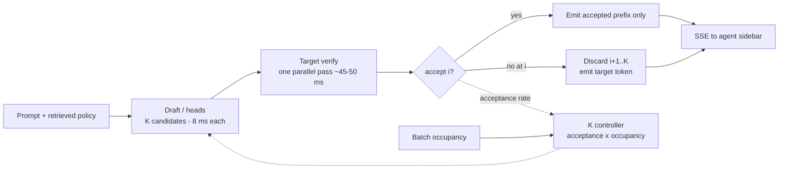

# Interview Bank: Speculative Decoding

> `T09` · **Transcript coverage:** partial · [Cheat sheet](../00-cheat-sheets/T09-speculative-decoding.md) · [Case study](../01-case-studies/T09-speculative-decoding.md) · [Design blueprint](../03-design-blueprints/T09-speculative-decoding/HLD.md)

## How to use this bank

Levels are **L3** (working competence — you have shipped with this), **L4** (senior practitioner — you own the tradeoff), **L5** (staff/architect — you own the decision and its blast radius). Every answer is a *model* answer, not a script: it shows the shape and the numbers a strong candidate reaches for, and none of it should be recited.

Numbers carry provenance — `[T]` for a transcript statement with the speaker or talk named, `[R]` for a supporting corpus path, `[D]` for arithmetic derived here with assumptions shown. Where the corpus has no figure, the answer says so rather than inventing one. This topic's quantification comes from the supporting repo, **not** from the CMU lectures, and one question (Q28) is there to make a candidate prove they know that.

Questions are ordered to read as one interview: foundations, then mechanism, then variants, then the tradeoffs, then debugging, then design at scale.

---

### Foundations

#### T09-Q1 · Why is decoding the phase that needs attacking?
**Difficulty:** L3 · **Depth expected:** 2 min
**Question:** Strip away the frameworks. Why is token-by-token generation the expensive part of inference, in terms a hardware person would accept?
**Model answer:** Because decode is memory-bound. The corpus's most compact statement is that decoding is "memory-bound: **loading 140GB of weights (70B model) to produce a single 2-byte token** is inefficient" `[R]` (ai-system-design-guide, 04-inference-optimization/03-speculative-decoding.md). At batch 1, every decode step reads the whole weight tensor and does almost nothing with it: for a 70B model in FP8 the weights are ~70 GB and the arithmetic is `2 × 70e9 = 140 GFLOP`, so the arithmetic intensity is `140 GFLOP / 70 GB = 2 FLOP/byte` against a hardware balance point of roughly `299 FLOP/byte` — decode sits about **150x below the ridge point** `[R]` (derived in [T06](../01-case-studies/T06-inference-fundamentals.md) from the fundamentals repo file, which states the "Gigabytes of weights to produce Milligrams of data" formulation). The step time is therefore set by bytes moved, not FLOPs available. Three consequences worth saying out loud: the cost of a token is roughly flat in batch size until compute saturates, which is why batching is the dominant throughput lever; a faster GPU does not fix it, because the ratio moves only with memory bandwidth; and any technique that gets *more tokens out of one weight read* is a direct win. That last one is speculative decoding's entire premise.
**Signal:** Frames the problem as bytes-not-FLOPs, knows the read-per-token is near 1:1, and connects it to "more tokens per weight read" rather than to "faster hardware."
**Follow-ups:**
- *Which phase does this describe?* — Decode; prefill is compute-bound for a different reason — Q4.
- *What else does the same argument justify?* — Batching, GQA and quantization all attack the same ratio; speculative decoding attacks the token-per-read term instead.
**Red flags:** "Decoding is slow because the model is big" with no bandwidth mechanism; proposes a faster GPU as the fix.

#### T09-Q2 · What is speculative decoding, and what does it actually buy?
**Difficulty:** L3 · **Depth expected:** 3 min
**Question:** Give me the technique in one sentence, then the mechanism, then the result you would promise a product owner.
**Model answer:** One sentence: a cheap predictor proposes several tokens and the target model verifies all of them in a single forward pass, keeping only the ones it agrees with. The corpus's three steps `[R]`: **drafting** — "a small, fast 'Draft Model' (e.g. 1B or 7B) generates `K` candidate tokens"; **verification** — "the large 'Target Model' processes all `K` tokens at once"; **acceptance** — "the target model's logits are used to accept or reject candidates. If token `i` is rejected, all tokens after it are discarded." The repo's latency table makes the mechanism concrete: 5 ms per token for a 1B draft, **50 ms** for the 70B target, **15–25 ms** on the speculative path `[R]` — and the headline result is "**2x to 3x speedup in wall-clock time with zero loss in quality**" `[R]`. Why it works is Q1: the step costs whatever it costs to read the weights, and reading them once to score `K+1` positions costs about the same as reading them once to score one. What it is *not*: it is not a quality technique, and at high batch occupancy it is not even a throughput technique (Q18). Vendor-claim caveat worth stating: 5 ms / 50 ms / 15–25 ms and the 2x–3x are the supporting repo's stated results, not measurements performed here, and the repo attaches no benchmark conditions to them `[R]`.
**Signal:** Delivers the three steps *and* the memory-bound reason they compose, and qualifies the headline number as the repo's claim rather than a measurement.
**Follow-ups:**
- *Why zero quality loss?* — Q3.
- *Where does the 15–25 ms come from?* — Q6 derives it from the other two numbers and an acceptance assumption.
**Red flags:** Recites "draft model" with no verify pass; promises quality improvement; quotes 2x–3x as a measured guarantee.

#### T09-Q3 · Why is the output exactly the target model's?
**Difficulty:** L3 · **Depth expected:** 3 min
**Question:** Speculation replaces the target's decode step with a draft's guess plus a verification. Why does that not change what the model says?
**Model answer:** Because the target decides every emitted token; the draft only proposes. "The target model's logits are used to accept or reject candidates" `[R]`, and the token that gets emitted is the target's token, not the draft's — so the output distribution is the target's distribution and the corpus's contract is "**zero loss in quality**" `[R]`. The case study states the operational form of this: speculation "is exactly quality-neutral by construction, and any observed quality change is a bug, not a trade." The construction that makes it *exact* rather than merely close is the accept/reject rule — accept a drafted token with probability `min(1, p_target/p_draft)`, and on rejection resample from the residual distribution `normalise(max(0, p_target − p_draft))`. Be precise about provenance here: that rule is the standard construction for the technique and is carried in this topic's cheat sheet, but it is **not spelled out in the case study** (which argues neutrality from the "target's logits" sentence) and the CMU lectures contain no acceptance mathematics at all `[T]`. A candidate who cannot state it has a real gap: without residual resampling, "reject and move on" means drawing from the draft's distribution, which does change the output. Two consequences: speculation can never be the fix for a quality problem, and a quality regression after enabling it points at the acceptance rule as a correctness bug (Q24).
**Signal:** Argues neutrality from *who emits the token*, then volunteers the residual-resampling detail and flags that the corpus does not carry it.
**Follow-ups:**
- *What breaks if residual resampling is missing?* — The output silently leaves the target's distribution; Q24.
- *Does this hold across the whole sequence?* — Yes by induction: every accepted token is drawn from the target conditionally on the accepted prefix.
**Red flags:** Describes speculation as an approximation or a quality/speed trade; thinks the draft's token is emitted when accepted.

#### T09-Q4 · Does it help TTFT or TPOT?
**Difficulty:** L3 · **Depth expected:** 2 min
**Question:** Your product has a slow first token and slow streaming. Which of those does speculation fix?
**Model answer:** Streaming only. It attacks **decode**, the per-token phase, and leaves prefill — and therefore TTFT — untouched. The reason is structural, not conventional. The verify pass is shaped exactly like a decode step: one sequence, `K+1` positions, weights read once, almost no arithmetic per byte — which is the memory-bound regime the technique exploits. Prefill already processes the prompt's tokens in parallel and is compute-bound; there is no idle arithmetic for the draft's work to occupy, so all it would add is work to a saturated step. Second, a draft can only propose continuations of an existing context, which is what decode has and prefill does not. The practical consequence for an agentic product is a scoping one: such workloads lean heavily on prefill, so speculation's addressable share of the request is the decode tail, and a decode-dominated surface like the case study's 40-token Live Assist suggestion is the favourable case. Worth noting that the case study's §8 arithmetic rests on an explicit assumption — that a verify pass over `K` tokens costs about one target decode step `[D]` — and that assumption is *about the memory-bound regime*. It fails as batch occupancy rises, which is the saturation crossover (Q18).
**Signal:** Answers decode-only and derives it from the compute/memory split rather than repeating a slogan, and knows the §8 model is conditional on the regime.
**Follow-ups:**
- *What fixes TTFT?* — Prefill-side work: chunked prefill, cache reuse, a smaller prompt — not speculation.
- *Why is 40 tokens a favourable output length?* — Short outputs are decode-heavy relative to prefill; long outputs are the reverse.
**Red flags:** Claims a TTFT improvement; cannot say which phase the verify pass resembles.

#### T09-Q5 · Why does a rejection discard everything after it?
**Difficulty:** L4 · **Depth expected:** 4 min
**Question:** The target rejects the second of four drafted tokens. Tokens three and four might have been right. Why do we throw them away?
**Model answer:** Because they were computed against a context that no longer exists. The verification pass scores positions `t+1 … t+K` conditioned on the *draft-supplied* prefix — the target never saw the sequence it would actually have produced, because it never sampled position `t+2` from its own distribution over the corrected prefix. So the tokens after the rejection are not merely unverified; they are conditioned on a prefix the model would not have generated, which makes them uninformative rather than merely risky. The corpus states the rule flatly: "If token `i` is rejected, all tokens after it are discarded" `[R]`. The structural consequence governs the rest of this topic: the number of tokens you get per pass is **not `K`**, it is a geometric quantity that decays with offset — which is why the expected yield is `(1 − α^(K+1))/(1 − α)` and not `K` (Q7), and why acceptance rate rather than draft quality is the governing metric. It is also why long drafts stop paying: once per-token acceptance decays with offset, the marginal drafted token is mostly discarded while its 5 ms was still spent. And it creates a hard rule for the serving path: a rejected suffix is a *correction*, so it must never have been visible to the client (Q26).
**Signal:** Explains the invalidity as a loss of conditioning context, and immediately converts it into the yield-is-not-`K` conclusion.
**Follow-ups:**
- *So what is the expected yield?* — Q7.
- *What if we kept the later tokens and re-verified?* — You would be running a second pass; that is a different algorithm (tree/parallel speculation), not this one.
**Red flags:** "Tokens after the rejection might still be right, so keep them"; cannot connect truncation to the yield formula.

---

### Mechanism

#### T09-Q6 · Where does the 15–25 ms figure come from?
**Difficulty:** L4 · **Depth expected:** 5 min
**Question:** The corpus gives 5 ms for the draft, 50 ms for the target and 15–25 ms for the speculative path. Is the third number a measurement, a claim, or arithmetic?
**Model answer:** It is arithmetic on the first two plus an acceptance assumption — which is why it is a good sanity check on whether you understand the mechanism. Take the case study's §8 model: drafting costs `5 ms × K`; the verify pass costs about one target step, 50 ms, because the step's cost is dominated by reading the weights and one read serves all `K+1` positions `[D]` (the case study's assumption, justified by the memory-bound argument of Q1). So a `K = 4` step costs `5×4 + 50 = 70 ms` and yields `E[tokens] = (1 − α^(K+1))/(1 − α)` accepted tokens. At `α = 0.8` that is `(1 − 0.8^5)/0.2 = 3.36` tokens, so `70 / 3.36 = **20.8 ms**` per token `[D]` — inside the corpus's stated 15–25 ms band `[R]`, which is the evidence that the derivation and the table describe the same system. Read the band's edges off the same model: you reach ~15 ms only with high acceptance at the optimal `K`, and you drift to ~25 ms by `α ≈ 0.6` at `K = 4`, and past the band entirely below `α ≈ 0.4`. The load-bearing caveat is that the whole derivation inherits the memory-bound assumption — at high batch occupancy the verify pass stops being free, the 50 ms term is no longer the step cost, and the band is meaningless (Q18). Provenance: 5 ms / 50 ms / 15–25 ms are the supporting repo's stated results, not measurements performed here `[R]`.
**Signal:** Reproduces the published band from the mechanism rather than quoting it, and names the assumption that can invalidate it.
**Follow-ups:**
- *What would you measure to check the model?* — Step time and accepted-tokens-per-pass directly; the acceptance rate; the crossover occupancy.
- *What if the draft is 15 ms not 5 ms?* — Q10: the floor moves, not just the speedup.
**Red flags:** Treats 15–25 ms as an independent measurement; never connects it to acceptance or `K`.

#### T09-Q7 · Derive the expected number of accepted tokens per pass.
**Difficulty:** L4 · **Depth expected:** 5 min
**Question:** You draft `K` tokens. How many does the target actually keep, on average?
**Model answer:** With per-token acceptance probability `α`, a pass keeps one token with probability `α`, two with probability `α²`, and so on, plus the target's own bonus token when all `K` are accepted. The expectation is the truncated geometric sum:

```
E[tokens] = (1 − α^(K+1)) / (1 − α)
```

At `α = 0.8`, `K = 4`: `(1 − 0.8^5) / 0.2 = (1 − 0.328) / 0.2 = ` **3.36 tokens — not 4, and not 5** `[D]`. At `α = 0.5`: `1.94` — with even odds of acceptance you keep under two tokens per pass while paying the draft for four. This is the case study's own `[D]` derivation and it is the single most important correction to intuition in the topic, because most people budget the speedup from `K`. Two further readings a strong candidate adds. First, the yield is capped at `1/(1 − α)` however large `K` grows — at `α = 0.8` the ceiling is 5.0 tokens per pass, so `K = 4` already captures two-thirds of the available headroom and `K = 8` only reaches 4.33 while doubling the draft cost. **Drafting harder is not the lever; raising acceptance is.** Second, this model assumes a constant `α` across offsets; in reality acceptance decays with position — the cheat sheet's per-position variant uses a product over positions for exactly that reason `[R]` — so the true yield is lower than the constant-`α` number. Practical discipline: recompute from the formula rather than reading a cell out of a table — the case study's §8 table does not reproduce exactly from its own formula at every `(α, K)` pair, and the formula is the thing to trust.
**Signal:** Writes the formula from memory, says 3.36 out loud, names the `1/(1−α)` ceiling, and distrusts a table over the formula.
**Follow-ups:**
- *What does this do to the optimal `K`?* — Q8: it makes the benefit non-monotone.
- *How do you raise `α`?* — Lower the temperature, improve the draft's agreement with the target, or shorten the draft — Q16, Q10.
**Red flags:** "`K = 4` means four tokens per pass"; uses `K` as a speedup proxy; has never seen the geometric sum.

#### T09-Q8 · How do you size the draft length `K`?
**Difficulty:** L5 · **Depth expected:** 7 min
**Question:** You can draft 1, 2, 4 or 8 tokens. Pick one, and tell me what changes that answer.
**Model answer:** You size `K` **from `α`, not from a target speedup**, and you expect an interior optimum rather than a monotone benefit. Step time is `5K + 50 ms`; tokens per step is the geometric sum from Q7; so `ms/token = (5K + 50) / E[tokens]`. At `α = 0.8` `[D]`: `K = 1 → 30.6`, `K = 2 → 24.6`, `K = 4 → 20.8`, `K = 8 → 20.8 ms`. **`K = 4` and `K = 8` are identical** — the extra four drafts buy nothing, because the yield is asymptoting to `1/(1−α) = 5` tokens while the draft cost keeps growing at 5 ms per token. At lower acceptance the optimum moves *down*: at `α = 0.4`, `K = 2` gives `60 / 1.56 = 38.5 ms` against `K = 4`'s `70 / 1.65 = 42.4 ms` `[D]` — the case study's §8 sensitivity table draws the same conclusion, that the optimal `K` moves down as acceptance falls. At very large `K` the verify pass stops being free and gains plateau and then reverse `[R]` (the "never" row of §5.2). So the correct answer is not a constant: `K` is a function of measured acceptance and batch occupancy — which is exactly what the frontier serving frameworks do, increasing `K` when the GPU is underutilised and decreasing it when saturated `[R]`. Name the two failure shapes: a fixed small `K` leaves speedup on the table at high stable acceptance, and a fixed large `K` pays draft latency for tokens the target discards.
**Signal:** Derives the interior optimum instead of assuming monotonicity, and lands on a controlled `K` rather than a number.
**Follow-ups:**
- *When is a fixed `K` acceptable?* — When acceptance telemetry shows a stable regime; then it is simpler and equivalent (the case study's revisit condition).
- *What drives `K` down at runtime?* — Falling acceptance, rising batch occupancy — Q11, Q18.
**Red flags:** "Bigger `K` means more speedup"; picks a `K` without reference to `α`; treats `K` as static config.

#### T09-Q9 · Is there an acceptance rate below which speculation loses?
**Difficulty:** L4 · **Depth expected:** 5 min
**Question:** Can speculation ever be *slower* than not doing it, with everything working correctly?
**Model answer:** Yes, and the threshold is not zero — it is the number the whole deployment policy hangs on. Using the case study's assumptions (`5 ms` draft, `50 ms` target, verify ≈ one step) at `K = 4`: `α = 0.2` gives `E = 1.25` tokens for a 70 ms step, i.e. `56.0 ms/token` `[D]` — **worse than the 50 ms baseline** with no bug anywhere. The break-even is the point where `(1 − α^(K+1)) / ((1 − α)(1 + cK)) = 1`, with `c` the draft's per-token cost as a fraction of a target step (`5/50 = 0.1` here); at `c = 0.1`, `K = 4`, the case study derives the floor at roughly **`α ≈ 0.3`** `[D]`. Between the floor and ~0.6 it is a shrinking win; above ~0.6 it wins decisively. Three things a strong answer adds. **The floor is not universal** — it moves with the draft/target cost ratio and with `K`, so it must be computed for your pair rather than inherited (Q10 shows how far it moves). **The floor is a product number as well as an arithmetic one**: at 20.8 ms you are inside a 20 ms-ish requirement, at 36 ms you are technically faster than baseline and commercially nowhere. And **a deployment that does not measure acceptance cannot know which side of the floor it is on** — which is why "measure acceptance before enabling" is the first line of the case study's deploy runbook and why the disable policy is built on this number.
**Signal:** Says plainly that correct-but-slower is possible, gives ~30%, derives it from the formula, and notes the floor is workload-specific.
**Follow-ups:**
- *What happens between 0.3 and 0.6?* — A shrinking win; the correct response is to reduce `K` before disabling — §5.5.
- *How do you find your own floor?* — Compute it from your draft/target cost ratio, then confirm it against measured on/off TPOT — Q25.
**Red flags:** "Speculation always reduces latency"; no break-even concept; treats the 30% figure as universal.

#### T09-Q10 · Why is a slower draft worse than proportionally worse?
**Difficulty:** L5 · **Depth expected:** 6 min
**Question:** A 7B draft is more accurate than a 1B draft. Why is it often the wrong choice?
**Model answer:** Because the draft's cost enters the **break-even condition**, not just the speedup. At `c = 0.3` — roughly a 7B draft at ~15 ms against a 50 ms target — the floor rises above `α ≈ 0.5` `[R]` `[D]` (case study §8). So a slower draft does not merely reduce the benefit; it raises the acceptance rate you must clear before speculation pays *at all*, and a workload at `α = 0.4` that was profitable with a 1B draft becomes a net loss with a 7B one. Concretely at `α = 0.8`, `K = 4`: the 5 ms draft gives `70 / 3.36 = 20.8 ms`; the 15 ms draft gives a `110 ms` step, so `110 / 3.36 = 32.7 ms` `[D]` — the speedup falls from ~2.4x to ~1.4x, and a ≤ 20 ms product requirement is missed even though the technique "worked." An accuracy gain that raises `α` from 0.8 to 0.85 does not obviously compensate, because yield is asymptoting toward its `1/(1−α)` ceiling while the cost term is linear in `K`. That single fact decides the deployment shape: the draft must be **as small as it can be while still being predictive**, and if it cannot be both, speculate with heads inside the target rather than with a second model (Q13). It also gives the case study's tuning order — acceptance first, then the draft's own latency, then `K` — because a draft that is slow *and* inaccurate puts you below the floor for reasons no amount of `K`-tuning can fix.
**Signal:** Connects draft latency to the *floor* rather than to the speedup, and uses it to justify the architecture rather than a parameter.
**Follow-ups:**
- *So when is a bigger draft justified?* — Only with measured acceptance showing it clears the new floor by enough to beat the smaller draft's net time.
- *What is the alternative if you need both?* — Heads in the target — Q13.
**Red flags:** "A more accurate draft is always better"; compares drafts on speed or accuracy but not on the floor.

#### T09-Q11 · Dynamic draft lengths: which direction, and why that direction?
**Difficulty:** L4 · **Depth expected:** 5 min
**Question:** Frontier serving frameworks adjust `K` at runtime. Which way, and what is the mechanism behind the direction?
**Model answer:** Raise `K` when the batch is small; lower it when the GPU saturates. The corpus's rule for vLLM and TensorRT-LLM `[R]`: "If the GPU is **underutilized** (small batch), the system **increases** the number of draft tokens (`K`). If the GPU is **saturated** (large batch), it **decreases** `K` to prioritize throughput over individual request latency." The mechanism is the shape of the trade: speculation converts memory round-trips into compute. At small batch the GPU has idle arithmetic and is starved for parallelism, so the draft's work is nearly free; at large batch those same units are doing useful work, so the draft competes with it and adds no throughput — which is why the case study's §5.6 says `K` should go to **0** above the crossover, not merely be reduced. So `K` tracks **occupancy plus measured acceptance**, not acceptance alone: acceptance tells you whether a pass is worth doing, occupancy tells you whether it is affordable, and the two can disagree (high acceptance at peak load is exactly the dangerous combination). The failure the controller exists to prevent is the field's most common one — speculation enabled globally, `K` sized on an idle GPU, measured win at low traffic, throughput regression at peak. Two practical cautions: a badly tuned controller oscillates, so it wants hysteresis and a low-pass filter on both signals; and the crossover occupancy is hardware- and model-specific and must be **measured rather than inherited** `[R]` (the case study's own revisit condition).
**Signal:** Gives the direction with the compute-versus-bandwidth reason, and insists `K` is a function of two signals rather than one.
**Follow-ups:**
- *What does `K → 0` mean at saturation?* — Speculation is off, not shrinking; the draft's tokens have no idle capacity to occupy.
- *How would you tune the controller safely?* — Measure the crossover first, then set thresholds; watch the `K` distribution for oscillation — Q25.
**Red flags:** "Increase `K` for more speedup" as a universal; unaware the saturated case is negative rather than neutral.

---

### Variants

#### T09-Q12 · Medusa: what is it, what does it remove, what does it cost?
**Difficulty:** L4 · **Depth expected:** 5 min
**Question:** Explain Medusa heads to someone who has only seen draft-model speculation. What problem do they solve, and what new problem do they create?
**Model answer:** Medusa attaches "extra 'heads' (small linear layers) attached to the last layer of the target model," where "instead of predicting just token `t+1`, Head 1 predicts `t+1`, Head 2 predicts `t+2`, and so on," with the stated benefit "no second model needed; **2.5x speedup with minimal VRAM increase**" `[R]`. What it removes is bigger than it sounds. A separate draft model means a second set of weights *and* a second KV cache to allocate, page, evict and tier; the case study's point is that in a fleet whose binding resource is already KV blocks, that second cache is not a footnote. Medusa's heads share the target's forward pass *and* its cache, and the corpus's own comparison is the argument for a small team: traditional speculation "takes up extra VRAM and requires its own **KV cache management**," while Medusa "eliminates the need for a second model and minimizes the communication overhead between steps, as all 'guesses' are generated within the same base model architecture during a single forward pass" `[R]`. The costs, all three: the heads must be **trained** for the specific target, so you cannot swap the target without retraining; the heads cannot be scaled independently of the target; and they are a per-target artefact, so at 10x with several targets either one draft serves many models or head training joins every release pipeline (Q28). Note the speedup numbers do not discriminate — Medusa's 2.5x sits inside the draft model's 2x–3x `[R]` — so this is a memory-and-maintenance decision (Q13), not a speed one.
**Signal:** Names the second KV cache and the retraining dependency as the real axes, and points out the headline numbers do not decide it.
**Follow-ups:**
- *Where does head staleness show up?* — A sharp acceptance drop correlated with a target promotion — Q23.
- *Heads or a draft model for this estate?* — Q13.
**Red flags:** "Medusa removes the draft model so it is free"; unaware the heads must be trained per target.

#### T09-Q13 · Heads or a separate draft model — how do you actually decide?
**Difficulty:** L5 · **Depth expected:** 6 min
**Question:** Walk me through the decision, and tell me what would make you reverse it.
**Model answer:** Four axes, and the case study picks heads for a small team on a stable target with the draft model as the escape hatch.
- **Memory and cache.** Heads add small layers and share the target's KV cache; an external draft adds a whole second model plus a second KV cache to allocate, page and tier `[R]` — and in a fleet where KV is the binding resource, that is the expensive part, not the weights.
- **Flexibility.** A draft can be any small model sharing the target's tokenizer and can be replaced without touching the target; heads are welded to one target and must be retrained on upgrade.
- **Failure mode.** An external draft drifts — fine-tuned, re-quantized, or simply a different vintage — and the symptom is silent, because output stays correct and only latency moves (Q23). Heads fail loudly instead, at the promotion: a step-change in acceptance correlated with a deploy.
- **Cost ratio.** The draft's per-token cost sets the acceptance floor (Q10), so a draft that is not much faster than the target is worse than no speculation at all — which is a constraint heads do not have.
The chosen answer is heads in-process for one stable target `[R]`. Reverse it if the target changes often enough that retraining becomes the bottleneck — then a draft's replaceability outweighs its cache cost — or if a second target model arrives and one shared external draft amortises across both. The framing to state explicitly: this is not decided by which is faster, because 2.5x and 2x–3x are the same band; it is decided by who maintains what.
**Signal:** Chooses on cache and maintenance axes while explicitly refusing the speedup comparison as non-discriminating.
**Follow-ups:**
- *What has to be true for a draft model to be safe?* — Version-locked to the target and acceptance-monitored as a first-class metric.
- *Where would a shared draft live?* — Q21 prices the placement options.
**Red flags:** Decides on the headline speedup; ignores the second KV cache and the retraining dependency.

#### T09-Q14 · What is MTP, and what number should you plan against?
**Difficulty:** L3 · **Depth expected:** 4 min
**Question:** Medusa, MTP, EAGLE — where did this line go, and what is the honest production number?
**Model answer:** MTP — multi-token prediction — is Medusa's idea productionized. Where Medusa bolts trained heads onto a *frozen* target, MTP heads are part of the model's own pretraining objective: the checkpoint was trained to predict multiple future tokens, so the heads are native rather than an afterthought. That removes Medusa's awkward post-hoc dependency and replaces it with a constraint on model choice — you need a checkpoint trained for it, and you cannot bolt MTP onto an arbitrary model. The number to plan against is the production one: in an agentic deployment on GLM 5.2 across H100s and H200s, MTP "enabled more interactivity … gained **about 2x improvement in throughput**" `[T]` (llm-d talk; the transcript renders it across duplicated disfluencies). Two honesty notes that matter more than the number. It sits inside the corpus's 2x–3x `[R]` and at the **bottom** of it — a useful corrective to anyone budgeting a 3x. And the wider lineage a serving vendor describes — "different ways of supporting spec decoding, from **Eagle, MTP** to Deep[Seek]-Flash… the **overlap scheduler** and then our most recent **Spec V2**" `[T]` (Banghua Zhu talk) — is **ASR-garbled on the model names** and must be carried as a soft attribution with no number attached to it. The strategic point: as speculation moves into the checkpoint and the engine's scheduler, it stops being a config flag a team turns on and becomes a property of the model you chose — which makes head support a model-evaluation criterion rather than a deployment detail.
**Signal:** Plans at 2x rather than 3x and flags the garbled transcript attribution instead of laundering it into a fact.
**Follow-ups:**
- *What constraint does MTP put on model choice?* — You need a checkpoint trained with it; it is not runtime-configurable.
- *Why does that matter at 10x?* — Head training becomes a release-pipeline dependency — Q28.
**Red flags:** Quotes 3x as the expectation; treats MTP as a flag; repeats the garbled model names as established fact.

#### T09-Q15 · Lookahead and n-gram speculation — when do they work, and when are they useless?
**Difficulty:** L3 · **Depth expected:** 4 min
**Question:** There is a form of speculation with no second model at all. What is the mechanism, and what makes it succeed or fail?
**Model answer:** Mechanism: "An alternative that uses the model's **own past hidden states** to find recurring patterns (n-grams) to 'look ahead' and predict future tokens" `[R]` — with a cheaper cousin that matches candidate continuations directly against the prompt. Operationally it is the cheapest form of speculation there is: no draft weights, no heads, no training, no second KV cache, and no version skew to manage. Its brittleness is structural: it can only propose something that already appears in the recent context or prompt, so it works exactly where output is genuinely repetitive. The corpus's stated best case is "structured data, code, and highly repetitive technical writing" `[R]`, and that best case predicts its worst case precisely — n-gram matches are common in code, JSON and boilerplate, and rare in conversational prose. The case study applies this directly: Live Assist produces conversational text, which is the *unfavourable* case, so lookahead is held as an option for a future code-facing surface and not enabled on this one. The general rule to carry: reach for it on any surface whose output **quotes its input** — summarisation, extraction, RAG answers, code editing — where the proposal is nearly free and frequently right. And note the asymmetry in the failure: when it fails, it costs almost nothing, which is exactly why it is worth evaluating before building a draft-model path.
**Signal:** States the repetition dependence as the criterion and applies it to *reject* it for a conversational surface rather than proposing it everywhere.
**Follow-ups:**
- *Which of our surfaces quote their input?* — Retrieval-heavy ones; the case study's §5.1 has an n-gram-from-prompt row for exactly that case.
- *Why is the failure cost low?* — No draft model latency to pay on a rejected pass — the cost that makes a failed draft-model deployment actively harmful.
**Red flags:** "No model needed, so it is strictly better"; proposes n-gram speculation for chat.

---

### Tradeoffs

#### T09-Q16 · Which surfaces should get speculation?
**Difficulty:** L4 · **Depth expected:** 5 min
**Question:** Two product surfaces, one model. Do you enable speculation on both, one, or neither — and what decides it?
**Model answer:** Low-temperature, latency-critical surfaces only, and the decision must be driven by *measured acceptance*, not by the config value. The failure case is precise: high-temperature generation flattens the distribution, the draft's guesses get rejected, the target's parallel pass is "**wasted compute**, and the system falls back to standard sequential decoding, **adding the overhead of the draft model's latency**" `[R]`. So a blanket enable is *worse than none* on the creative surface — you pay the draft on every request and collect nothing, which is a strict regression rather than a missed opportunity. The case study's estate has one of each: Live Assist (grounded, low temperature, 40-token outputs, TPOT-critical) and Knowledge Studio (deliberately varied, high temperature, overnight, latency-irrelevant). Speculation goes on Live Assist only, with a per-surface acceptance gate that can disable it automatically. The subtle exception the case study flags: temperature is the *cause* of low acceptance but it is the wrong control signal, because a nominally low-temperature surface can drift toward creative output — so you gate on acceptance telemetry, not on the configured temperature. And the direction of the fix if the creative surface later acquires a latency requirement is to fix the temperature first, because speculation cannot succeed where the distribution is flat. Say the conclusion baldly: **speculation is a property of the request, not of the deployment.**
**Signal:** Gates on measured acceptance rather than a config label, and knows a blanket enable is worse than not enabling.
**Follow-ups:**
- *What does "fails back" cost?* — The full draft latency plus the wasted verify — Q17.
- *When would you speculate on a high-temperature surface?* — Never; change the surface's temperature or accept the latency.
**Red flags:** "Enable everywhere and let it fall back" — falling back is the cost; decides from temperature alone with no acceptance measurement.

#### T09-Q17 · Why does high-temperature creative writing break it?
**Difficulty:** L3 · **Depth expected:** 4 min
**Question:** Speculation is exact and quality-neutral. Why does it stop working on a creative-writing surface?
**Model answer:** Because acceptance is a property of the distribution's *shape*, and temperature reshapes it. The corpus's own answer `[R]`: speculation "relies on the 'Draft Model' being able to accurately predict what the 'Target Model' would say. In high-temperature creative writing, the probability distribution is 'flatter,' and the model is encouraged to pick less-likely tokens. This leads to a very low **Acceptance Rate**… When a guess is rejected, the target model's parallel pass was **wasted compute**, and the system falls back to standard sequential decoding, **adding the overhead of the draft model's latency**." Three things to separate. **The degradation is double.** Temperature makes the target's next token less predictable, and the draft — which is a weaker model of the same distribution — becomes less able to guess it, so acceptance falls for two reasons at once. **The cost is asymmetric.** A rejected pass costs the draft's `5 ms × K` *plus* the verify you were going to pay anyway, so at low acceptance you have added ~29% compute per step `[D]` (case study §8) and bought nothing. **There is a floor.** As acceptance falls toward the flat-distribution limit, the per-token time crosses the 50 ms baseline and keeps going (Q9) — the failure is not "no benefit," it is "strictly slower than the thing you replaced."
**Signal:** Frames acceptance as distributional agreement between two models, and knows an unproductive pass is strictly additive cost.
**Follow-ups:**
- *Where exactly is the crossing point?* — Q9's ~30% floor at the case study's cost ratio.
- *Could a better draft rescue it?* — Only if it restores agreement; a "more creative" draft makes it worse.
**Red flags:** "It just doesn't work for creative writing" with no mechanism; prescribes a bigger or better draft model.

#### T09-Q18 · How does batch size change the economics?
**Difficulty:** L4 · **Depth expected:** 5 min
**Question:** You enable speculation and it works beautifully overnight. What happens at 2 p.m., and why?
**Model answer:** The sign flips. Speculation trades extra compute for fewer memory round-trips, and that trade is nearly free when there is idle compute and **negative** when there is not. The corpus's §5.6 shape `[R]`: small batch with idle compute — strongly positive, raise `K`; moderate batch — positive but shrinking; **saturated — negative**, because the draft's tokens "compete for the same arithmetic units and add no throughput," so `K` goes to zero. Mechanically, as the weights are amortised over more sequences the decode step moves from memory-bound toward compute-bound, eroding exactly the idle capacity speculation was exploiting — and it breaks the case study's §8 assumption that a verify pass costs about one decode step, so all the ms/token arithmetic stops being meaningful under load. This is the single most commonly misapplied fact in the topic, and the misapplication has a signature: **the regression is invisible in the offending configuration's own latency metrics** and shows up in *other* surfaces' latency and in fleet throughput at peak. The crossover occupancy is hardware- and model-specific and should be measured, not inherited `[R]` — the case study's own revisit condition says the same. Operationally the consequence is that `K` must be load-aware from day one, which is why the deploy runbook makes that a launch requirement rather than a later optimisation.
**Signal:** States the sign reversal, says the memory-bound assumption is what fails, and knows the symptom appears in other surfaces' metrics.
**Follow-ups:**
- *What is the controller?* — Q11: `K` as a function of occupancy and acceptance.
- *What would you measure to place the crossover?* — Throughput versus batch occupancy, on your hardware and model — the case study's sensitivity table names this explicitly.
**Red flags:** "Speculation helps latency, so it must help throughput"; no crossover concept; plans to enable it globally and measure later.

#### T09-Q19 · What does speculation cost?
**Difficulty:** L4 · **Depth expected:** 5 min
**Question:** Price it for me — compute, memory, quality, and anything you would call operational cost.
**Model answer:** Compute: at `K = 4`, the draft adds `5 ms × 4 = 20 ms` of work to a 70 ms step — **about 29% more compute per step** `[D]` (case study §8), and that is the whole ledger. Quality: **zero**, and that is not a hope but a construction — every emitted token is one the target chose (Q3), so the case study's rule is that a quality change is a bug, not a trade. Memory: none in the heads shape; in the external-draft shape, a whole second model *plus* a second KV cache to allocate, page and tier `[R]` — and in a KV-bound fleet that is the larger cost, which is why Medusa wins on a small team. Operational cost, which teams under-price: a second artefact in the serving path means its own version skew, its own failure modes, its own retraining dependency on target upgrades, and a maintenance burden the case study insists must be justified by a **named engineer**. Diagnostic cost, the subtle one: if you only track TPOT with speculation on, a latency problem that speculation is *masking* becomes invisible — the runbook's answer is to track effective TPOT with speculation on **and off**, side by side. And the honest upside framing: in throughput terms the fleet does more work per second, not less, whenever acceptance is above the floor — you get 3.36 tokens from a weight read that used to produce one.
**Signal:** Prices the cost as compute-only with no quality term, and volunteers the masking risk as a real operational cost.
**Follow-ups:**
- *How do you know you are not masking a baseline problem?* — Track both TPOT numbers; the case study lists "speculation masking a real latency problem" as a named failure mode.
- *Does the draft cost get paid on rejected passes?* — Yes, which is the whole content of the floor — Q9.
**Red flags:** "It is free because the verify pass was happening anyway"; forgets the draft cost is paid regardless of outcome.

#### T09-Q20 · Is speculation a latency technique or a throughput technique?
**Difficulty:** L5 · **Depth expected:** 7 min
**Question:** Your capacity plan needs a label for this. Which is it, and what breaks if you choose wrong?
**Model answer:** It is a **latency technique at low occupancy**, and that qualifier is the answer. At batch 1 it converts idle arithmetic into accepted tokens — the same weight read that produced one token now produces 3.36 at `α = 0.8` `[D]` — which is a per-request latency win and incidentally a throughput win, because requests finish sooner. At saturation the identical mechanism is a throughput *loss*, since the compute the draft consumes was already doing useful work (Q18). So it is a two-regime object, and the case study's 10x section draws the uncomfortable conclusion: as the fleet grows, more traffic sits at high occupancy, so **the technique's addressable share of traffic shrinks**. What that does to capacity planning is the part most candidates miss: effective throughput becomes a function of *workload mix*, because acceptance varies by surface and by request, so the fleet's effective capacity fluctuates with something that is not request count — and a GPU pool sized from request rate alone will be wrong in both directions at different times of day. What survives at any scale, and is therefore the durable part of the answer: quality-neutrality, the acceptance floor, the `E[tokens]` correction, and `K` control. Everything else is a property of the occupancy regime you happen to be in.
**Signal:** Refuses the single-label answer, names the inversion, and connects it to capacity planning rather than stopping at the mechanism.
**Follow-ups:**
- *What becomes the dominant operational concern at 10x?* — The saturation crossover — Q28.
- *How would you present this to a capacity planner?* — As an acceptance-dependent throughput factor per surface, measured, not a constant multiplier.
**Red flags:** "It is a latency optimisation, obviously" with no regime qualifier; claims a uniform throughput gain.

#### T09-Q21 · Where does the draft live — same GPU, another GPU, or a service?
**Difficulty:** L4 · **Depth expected:** 5 min
**Question:** You have decided to use a draft. Where do you put it, and what does each placement cost?
**Model answer:** Four shapes; three of them fail on a specific cost, and the ranking follows from the per-step budget.
- **Draft on the same GPU.** Simplest routing and the lowest transfer latency, but it competes for KV and compute — directly against the small-batch-only economics of Q18. Tolerable only when the draft is tiny relative to the target.
- **Draft on a separate GPU.** No resource competition, but now every step carries a cross-device hop, and when the draft's own cost is ~5 ms the transfer can exceed the benefit. Justified for large drafts, or one draft shared across several targets.
- **Draft as a service.** Independent scaling and the wrong latency profile: a network round-trip per step against a 5 ms budget. Never for this workload.
- **Heads inside the target (the case study's choice).** No second model, no second KV cache, one forward pass, "minimal VRAM increase" `[R]`. The price is retraining per target and no independent scaling.
The governing principle is that the draft's cost is measured against a 5–50 ms per-step budget, so anything inserted into the per-step path — a copy, a hop, an RPC, a serialization — is competing with the exact thing you are trying to save. Hence "as close to the target as possible, ideally inside it." The one honest reason to move: a second target model, where per-model head training becomes a cost that a shared external draft would amortise (Q13's revisit condition).
**Signal:** Prices each shape against the per-step latency budget rather than judging on architectural cleanliness.
**Follow-ups:**
- *What is the external draft's hidden cost?* — A second KV cache and its management — [T07](../01-case-studies/T07-kv-cache.md).
- *When is a shared external draft right?* — Multiple targets, where the per-target head training outweighs the hop.
**Red flags:** "Put it on another GPU to avoid contention" without pricing the hop; proposes a per-step network call.

---

### Debugging

#### T09-Q22 · We enabled speculation and TPOT got worse. Diagnose it.
**Difficulty:** L5 · **Depth expected:** 7 min
**Question:** Latency rose after you shipped speculation. Walk me through the diagnosis in the order you would actually run it.
**Model answer:** Five steps, ordered by likelihood times cheapness.
1. **Acceptance against the floor.** Pull acceptance per surface and per model version. If it is near or below ~0.3 at this draft/target cost ratio, the mechanism is fully explained — you are paying the draft on every request and the target discards most of it (Q9). Action: reduce `K`, then disable per surface `[R]`. Do not tune anything else first.
2. **`K` against the observed acceptance.** If acceptance is ~0.5 and `K` is 8, the step is `90 ms` for `E = 2.0` tokens, i.e. 45 ms/token `[D]` — barely better than the 50 ms baseline and much worse than `K = 2` would have been. Fixed `K` sized for the wrong acceptance is the second most common cause (Q8).
3. **Batch occupancy.** If the regression appears *only* under load, the cause is the saturation crossover rather than acceptance: the draft is stealing compute at peak (Q18). Action: make `K` occupancy-aware, going to zero above a measured crossover.
4. **A version event.** A gradual decline correlated with a model promotion, a quantization change or a draft swap points at the draft-target pair — and the signal is silent, because quality will look fine (Q23).
5. **Tokenizer mismatch.** Acceptance near zero, and it is a configuration bug rather than a workload property.
The structural close: if the runbook did not measure acceptance *before* enabling, steps 1 and 2 are unavailable and you are guessing — which is exactly why "measure acceptance first" is the deploy runbook's first line, and why the acceptance floor is a requirement rather than a dashboard.
**Signal:** Orders by likelihood and cost, separates the acceptance cause from the occupancy cause cleanly, and closes on the instrumentation gap.
**Follow-ups:**
- *How would you tell causes 1 and 3 apart?* — Correlation with load versus correlation with the request's distribution; acceptance is flat across load in the first case.
- *What is the rollback?* — Per-surface disable, which is why the flag is per-surface and not global — Q16.
**Red flags:** Jumps straight to "lower `K`" without measuring; blames the model; disables globally when only one surface is affected.

#### T09-Q23 · Latency creeps up over weeks and quality is unchanged. What is happening?
**Difficulty:** L4 · **Depth expected:** 6 min
**Question:** Nothing broke, nothing was deployed, but TPOT has drifted 15% over a month. Quality is flat. What is your hypothesis?
**Model answer:** Draft-target divergence — and the flat quality is the *tell*, not reassurance. The draft has drifted from the target (a fine-tune, a re-quantization, a different vintage, or a target upgraded without retraining the heads), so it now proposes tokens the target rarely wants. Acceptance falls gradually, and because "the target model's logits are used to accept or reject candidates" `[R]` the output stays **correct** — the target vetoes everything it disagrees with. The case study calls this the dangerous failure precisely because correctness masks the regression, and the corpus's edge-case table marks it "**Silent** — outputs remain correct because the target verifies everything. Monitor acceptance as a first-class metric, not just latency." Detection: acceptance rate per surface and per model version, tracked as a **trend** rather than a snapshot; a falling trend appears before TPOT does, which is the whole point of making it the primary metric. Mitigation: version-lock draft and target together and treat a target upgrade as a draft retraining in the promotion runbook rather than a follow-up. The diagnostic that separates drift from a workload change: drift is a *trend* with a step at a deployment boundary; a high-temperature or shifted workload is a *level* that was always low — and a persistently high disable rate indicates a target or tokenizer mismatch rather than a workload property, which is the case study's revisit condition for the whole architecture.
**Signal:** Reads flat quality as the signature of a silent failure, and distinguishes a drift trend from a workload level.
**Follow-ups:**
- *What would you change in the promotion process?* — Retrain heads as a promotion step; a stale-head check post-deploy — the runbook's incident #5.
- *How would you prove it?* — Re-baseline acceptance for the current draft/target pair against the recorded value at the last lock.
**Red flags:** "Quality is fine so speculation is fine"; monitors latency only; treats the drift as noise.

#### T09-Q24 · Quality regressed after we enabled speculation. What is it?
**Difficulty:** L4 · **Depth expected:** 6 min
**Question:** Your eval drops two points the week speculation goes live. Speculation is supposed to be quality-neutral. Explain what you are looking at.
**Model answer:** A correctness bug — and the first place to look is the acceptance rule. Speculation is quality-neutral *by construction*, and the construction is that the target's logits decide every emitted token `[R]`, so a quality change cannot be a trade; the corpus's position is that "any observed quality change is a bug." Ranked causes:
1. **The acceptance rule.** If it accepts a token the target did not agree with — comparing the wrong position's logits, an off-by-one in the offset, comparing against the wrong distribution, or a missing residual resample on rejection (Q3) — output leaves the target's distribution. The case study's requirement is that this rule is treated as correctness-critical code with its own test suite, and the remediation is property-testing plus a rollback of the engine version.
2. **The streaming path.** A correction visible to the client reads as a quality regression in the transcript and is not a modelling problem at all (Q26).
3. **A confound in the same deploy.** Speculation enabled alongside a model revision or a prompt change is the classic confound; a canary at the same commit with speculation on and off separates them.
4. **Draft/target tokenizer mismatch** — near-zero acceptance and, in a badly built loop, malformed output; a configuration bug, not a quality tradeoff.
The framing to hand the interviewer: the technique's contract is that the output distribution is unchanged, so the only question is which part of the implementation broke it — and the answer is never "we traded quality for speed."
**Signal:** Refuses the tradeoff frame outright, puts the acceptance rule first, and names the property test as the remedy.
**Follow-ups:**
- *How would you prove the distribution is unchanged?* — Property-test the sampling rule against a reference implementation on the same logits, plus an A/B eval with speculation on and off.
- *What if the canary is clean?* — Then the regression is not from speculation; revert the flag anyway to remove the variable.
**Red flags:** Accepts "we traded a little quality for speed"; rolls back without identifying the cause; does not know the acceptance rule is the suspect.

#### T09-Q25 · What do you monitor for a speculative deployment?
**Difficulty:** L4 · **Depth expected:** 6 min
**Question:** You own this in production. What is on the dashboard, and which number do you look at first?
**Model answer:** Six signals, one primary.
- **Acceptance rate** — per surface, per model version, over time. The primary metric, and the case study's argument for that status is that a falling trend is the earliest detectable signal of a draft problem, arriving before any latency movement. It also gates the floor (Q9) and the disable policy.
- **Effective TPOT with speculation ON and OFF**, tracked side by side. Without the baseline you cannot see a regression that speculation is masking — a named failure mode in the case study's table.
- **Draft-time share of each step** — how you catch a draft too slow for the floor before the acceptance trend has moved.
- **`K` distribution and the controller's decisions** — an oscillating controller is invisible in the average and obvious in the distribution.
- **Batch occupancy at which the disable fires** — this is how the crossover gets *measured* instead of assumed, and it is the metric that tells you whether `K` control is set correctly.
- **Quality metrics, expected flat** — any movement is an incident, not a trade (Q24).
Plus the shared-resource view: VRAM and KV occupancy **including the draft**, because in the external-draft shape the second cache is invisible in per-request metrics and shows up as a node-level OOM ([T07](../01-case-studies/T07-kv-cache.md)).
**Signal:** Puts acceptance first with the on/off TPOT pair second, and includes the controller's `K` distribution and the measured crossover in the instrument set.
**Follow-ups:**
- *What alerts?* — Acceptance trend and disable rate, not absolute acceptance; plus divergence between on/off TPOT.
- *Which of these would you add after an incident?* — Whichever one was missing in Q22's diagnosis.
**Red flags:** Monitors TPOT only; no non-speculative baseline; treats quality as a distribution to be traded.

#### T09-Q26 · The client sees a token appear and then get corrected. What went wrong?
**Difficulty:** L3 · **Depth expected:** 3 min
**Question:** An agent reports that text appeared in the sidebar and then changed. What is the bug, and what is the rule?
**Model answer:** The streaming path emitted an unverified draft token. The rule is absolute in the case study's edge-case table: "**Never emit an unverified token to the client.** Emit only accepted tokens; the draft's proposals are internal." The mechanism that makes it easy to get wrong is that the draft produces `K` tokens in a burst, so streaming them optimistically hides the verify pass's ~50 ms — but a rejection at position 2 invalidates positions `3..K` (Q5), so the client would have to un-render them. The consequences are worse than the latency saved: the sidebar flickers, an agent reads a half-correct suggestion mid-call, and any client-side logging, transcript or copy-to-clipboard captures text the model never produced. The correct shape is to hold the draft's tokens in the serving layer, emit only the accepted prefix, and emit the target's correcting token in the same flush — so the client sees one incremental update rather than a burst and a retraction. There is a metric consequence too: this is exactly why the managed quantity is TPOT — time per *output* token — and the verify pass's duration, because accepted tokens per flush is what the user experiences.
**Signal:** Names the rule, names the burst-then-correct temptation, and connects it to what the product's latency metric actually measures.
**Follow-ups:**
- *Does holding tokens cost latency?* — Up to one verify pass of delay per flush, which is why the verify pass is the thing worth optimising.
- *Where does this belong in the test suite?* — A client-visible assertion that no token is emitted before acceptance; a stream-diff test against the non-speculative path.
**Red flags:** "The client should handle corrections"; streams draft tokens to look faster.

---

### Scale and design

#### T09-Q27 · Design speculation for a two-surface estate.
**Difficulty:** L5 · **Depth expected:** 8 min
**Question:** A real-time assist with a latency-critical low-temperature surface and an overnight high-temperature surface, a 70B-class target, and a three-person team. Design it, and tell me what you would refuse to do.
**Model answer:** The shape, with the reasoning visible.
- **Split by surface first.** Speculation is a property of the *request*, not the deployment. Live Assist — grounded, low temperature, 40-token outputs, TPOT-critical — gets it; Knowledge Studio — high temperature, overnight, nobody waiting — does not, because a blanket policy is actively worse than none there (Q16, Q17).
- **Mechanism: heads inside the target, not a second model.** No second KV cache, one forward pass, "minimal VRAM increase" `[R]`; and for a three-person team the maintenance argument decides it, since an external draft brings its own version skew, its own cache and its own failure modes (Q13).
- **Draft length: dynamic.** Driven by measured acceptance *and* batch occupancy, with the crossover measured rather than inherited `[R]`. `K = 4` is the worked point — 20.8 ms at `α = 0.8` — but the controller is what makes it survivable at peak (Q8, Q11).
- **The gate.** The promise is TPOT ≤ 20 ms with a 70B-class target, which is why speculation is a contractual prerequisite rather than an optimisation: a 40-token suggestion at 50 ms/token takes 2.0 s, at 20.8 ms/token it takes 0.83 s — a 2.4x reduction matching the corpus's 2x–3x `[R]` `[D]`. Acceptance target ≥ ~0.4 with the ~0.3 floor as the disable line.
- **Version lock.** Heads are welded to the target, so a target upgrade is a retraining inside the promotion runbook, not a config change (Q23).
- **What I would refuse:** speculation on the creative surface; a second model without a named owner; a fixed `K`; and any framing of this as a quality technique.
The summary to give: this buys 2x–3x at zero quality cost and pays for it with a second artefact to train, a controller to tune, and an acceptance metric you watch forever.
**Signal:** Ties each choice to a decision table in the case study and states the refusals explicitly rather than only listing the choices.
**Follow-ups:**
- *Revisit conditions?* — Target changes often → reconsider an external draft; acceptance stable → a fixed `K` is simpler; a code surface appears → evaluate n-gram speculation.
- *What is the biggest risk to the three-person team?* — The retraining dependency and the silent drift failure — Q23.
**Red flags:** Enables globally; picks a fixed `K`; treats speculation as a quality improvement; adds a second model with no owner.

#### T09-Q28 · At 10x, what changes — and what does the corpus actually support?
**Difficulty:** L5 · **Depth expected:** 8 min
**Question:** Your estate grows 10x. Separately: tell me which of the numbers you have used are measurements, which are derivations, and which are claims you would have to verify yourself.
**Model answer:** Two halves, and the second is the one that separates candidates.
**What changes at 10x.** The draft stops being a per-target artefact and becomes shared infrastructure — one draft serving several targets, or head training folded into every model release. The saturation crossover becomes the dominant operational concern, because the fleet is saturated more of the time, so speculation's value concentrates in off-peak windows and `K` control is the difference between a gain and a regression. Acceptance becomes a capacity-planning input, since effective throughput now fluctuates with workload mix rather than request count. And the inversion: "speculation is a latency optimisation" becomes "…at low occupancy," so **the technique's addressable share of traffic shrinks as the fleet grows**. What survives, and is therefore what to build on: quality-neutrality, the acceptance floor, the `E[tokens]` correction, and dynamic-`K` control.
**Provenance.** The CMU lectures carry this topic only as a framing item — lecture 1 lists "**draft models and speculative decoding**" as a roadmap bullet under efficiency and system-level optimisation `[T]`, and lecture 2 mentions it in passing (a small model generating a handful of tokens for a larger model to check, justified by batched GPU computation being faster `[T]`) — but the course supplies **no acceptance mathematics and no speedup figure**, and the topic's header records that honestly. The quantification comes from the supporting repo `[R]`: the 140 GB / 2-byte-token framing, the 5 ms / 50 ms / 15–25 ms table, the 2x–3x with zero quality loss, Medusa's 2.5x and minimal-VRAM claims, lookahead's best case, and the dynamic-draft-length rule. Those are the repo's **stated results, not measurements performed here**, and the repo attaches no benchmark conditions to them. The MTP "**about 2x improvement in throughput**" is a single production report from one talk `[T]` (llm-d). And the Eagle / MTP / DeepSeek / Spec-V2 model names come from a transcript that is **ASR-garbled** `[T]` (Banghua Zhu talk), so they are carried as soft attribution with no number attached. The arithmetic — `E[tokens]`, the `K` table, the ~30% floor, the 29% compute overhead, the 2.4x product impact — is `[D]`, derived in the case study under stated assumptions, and the central assumption (a verify pass ≈ one decode step) holds only while decode is memory-bound.
**Signal:** Gives the inversion and the survival list, then draws the provenance line unprompted and correctly — including the lecture's framing-only status and the garbled attribution.
**Follow-ups:**
- *What would you measure first at 10x?* — The saturation crossover per hardware class, and per-surface acceptance at that occupancy.
- *What breaks in the runbook?* — Head training becomes a release-pipeline dependency, and the per-target draft model stops being maintainable.
**Red flags:** Plans a 3x; presents the corpus's figures as our measurements; cannot say where any number came from.

---

## Whiteboard exercises

### Exercise 1 — Size `K` and prove the floor
**Prompt.** You have a measured per-token acceptance of `α = 0.55` for a draft/target pair. The draft costs **8 ms** per token and the target's decode step costs **45 ms**. Your SLO is **25 ms per token**. Produce: the expected accepted tokens per pass, the effective ms/token at `K = 1, 2, 4, 8`, the `K` you would deploy, the break-even acceptance at that `K`, and what you would do if acceptance fell to 0.30.

**What to produce.** The formula written out, the four computed values, the break-even derivation with `c` shown, and a one-line recommendation with the SLO verdict stated honestly.

**Expected whiteboard.**

```
E[tokens] = (1 - a^(K+1)) / (1 - a)          step_time = 8K + 45 ms
c = 8/45 = 0.178                             baseline (no spec) = 45.0 ms/token

  K    E[tokens]    step ms    ms/token    SLO 25 ms?
  1      1.55          53         34.2         no
  2      1.85          61         32.9         no   <- best
  4      2.11          77         36.5         no
  8      2.21         109         49.3         no   (worse than baseline)

break-even at K=2:  (1 - a^3) / ((1 - a) * (1 + 0.178*2)) = 1
                    solve  ->  a ~= 0.28            [D]

  a=0.30, K=2:  E=1.39, 61/1.39 = 43.9 ms  (1.03x - technically a win, commercially not)
  a=0.30, K=4:  E=1.43, 77/1.43 = 54.0 ms  (WORSE than baseline)
```

**Grading rubric.**
- Computes `E[tokens]` from the formula and states plainly that it is far below `K` — the arithmetic must be shown, not asserted.
- Picks `K = 2` and says explicitly that `K = 4` and `K = 8` are worse, and that **no `K` meets the 25 ms SLO with this draft** — the honest answer is "the lever is acceptance or a faster draft, not `K`."
- Derives break-even at roughly `α ≈ 0.28` with `c = 8/45` shown, and notes it is *higher* than the case study's ~0.30-at-`c = 0.1` because this draft is more expensive relative to its target.
- At `α = 0.30` prescribes reducing `K` and a per-request disable, and does **not** respond by raising `K`.

### Exercise 2 — Choose the mechanism and draw the request path
**Prompt.** Two surfaces on one 70B-class target: (a) a latency-critical, low-temperature, 40-token suggestion stream; (b) an overnight batch job generating deliberately varied long-form text. Choose the speculation mechanism for each, the deployment shape, and the `K` policy. Draw the request path and mark where a rejection is handled and where the `K` controller sits.

**What to produce.** A decision table with the rejected alternative per surface, plus the request-path diagram with the accept/reject branch and the control loop.

**Expected whiteboard.**

| Surface | Mechanism | Reject | Deployment shape | `K` policy | Wrong-if signal |
|---|---|---|---|---|---|
| (a) Suggestion stream | Heads in the target (Medusa-style) | External draft model — second KV cache and version skew | In-process, no second model | Dynamic: raise at small batch, → 0 when saturated | acceptance trend falls; on/off TPOT diverges |
| (b) Overnight long-form | None | Any speculation | Plain sequential decode | n/a | TPOT improvement that never arrives |



**Grading rubric.**
- Chooses heads in-process for (a) and justifies it on the second KV cache and the retraining dependency, not on speedup — the speedup numbers do not discriminate.
- Refuses speculation entirely for (b) and gives the flat-distribution reason, noting a blanket enable is *worse* than none there.
- Draws the accept/reject branch with suffix truncation and shows **only accepted tokens** leaving the process boundary toward the client.
- Puts the `K` controller on two inputs — acceptance and batch occupancy — and states that `K` goes to zero above a *measured* crossover.

### Exercise 3 — Diagnose the peak-load regression
**Prompt.** Speculation was enabled globally last week. Overnight, TPOT on Live Assist is 19 ms — better than the 22 ms target. At 2 p.m. fleet throughput is down 18%, Live Assist TPOT is 31 ms, and other surfaces' latency has risen. Acceptance is 0.72 on Live Assist and 0.18 on Knowledge Studio. Nothing else changed. Diagnose, prescribe, and write the runbook change.

**What to produce.** Two independent causes named and separated, the measurement that distinguishes them, the arithmetic that proves the Studio surface is below the floor, and the specific config and process changes.

**Expected whiteboard.**

```
Cause 1 (per-surface, always):  Studio acceptance 0.18 is BELOW the ~0.3 floor
    -> every Studio request pays the draft and the target discards it
    -> strict regression on a surface that never needed speculation
    fix: per-surface disable; speculation is a property of the request

Cause 2 (load-dependent):  at 2 p.m. the fleet is saturated
    -> decode is compute-bound, the verify pass is no longer free
    -> the draft competes with useful work; K was sized on an idle GPU
    -> other surfaces' latency rises: the symptom is NOT in the offending config

Distinguishing measurement:
    acceptance flat across the day, latency varies with load  -> Cause 2
    acceptance low all day on one surface                     -> Cause 1
    cross-check: on/off TPOT delta per surface, per hour

Config change:  K = f(occupancy, acceptance); K -> 0 above the MEASURED crossover
                speculation flag: on for Live Assist, off for Studio
Process change: acceptance measured BEFORE enable, per surface; on/off TPOT tracked
                side by side; crossover measured on our hardware, not inherited
```

**Grading rubric.**
- Names **two** independent causes and separates them by the load-correlation test, rather than offering one explanation for both symptoms.
- Does the arithmetic showing Studio at `α = 0.18` is below the break-even floor at `c = 0.1`, `K = 4` — i.e. it is slower than the 50 ms baseline, not merely unimproved.
- Explains that the fleet-level symptom (other surfaces' latency) is the expected signature of the saturation crossover, and that it is invisible in the offending configuration's own metrics.
- Prescribes a per-surface flag plus a load-aware `K` — and does **not** respond by globally disabling speculation, which would give up the overnight win.

## Sources

- `refs/ai-system-design-guide-main/ai-system-design-guide-main/04-inference-optimization/03-speculative-decoding.md` — the memory-bound motivation with the 140 GB / 2-byte-token framing, the three-step draft-verify-accept loop including suffix truncation, the 5 ms / 50 ms / 15–25 ms latency table, the 2x–3x-with-zero-quality-loss result, Medusa heads with the 2.5x and minimal-VRAM claims and the head-per-offset mechanism, lookahead decoding and its structured-data best case, dynamic draft lengths with the small-batch-raise / saturated-lower direction, and the repo's two interview answers on high-temperature failure and Medusa-versus-draft-model.
- `refs/ai-system-design-guide-main/ai-system-design-guide-main/04-inference-optimization/01-inference-fundamentals.md` — the decode-is-memory-bound argument, the prefill/decode phase split, the "Gigabytes of weights to produce Milligrams of data" formulation, the metric definitions, and the guidance that TPOT is improved by quantization, GQA or speculative decoding. This is the file behind Q1's arithmetic-intensity argument.
- `refs/ai-system-design-guide-main/ai-system-design-guide-main/04-inference-optimization/04-batching-strategies.md` — the batch-occupancy behaviour that the saturation crossover in Q11 and Q18 depends on.
- `refs/ai-system-design-guide-main/ai-system-design-guide-main/04-inference-optimization/02-kv-cache-and-context-caching.md` — the KV cache as the fleet's binding resource, and the cache-management cost an external draft model adds; the basis of Q13's decision and Q25's VRAM view.
- `refs/CMU_Inference_Algorithms_for_Language_Modeling_Fall_2025_transcripts_2/CMU_LLM_Inference_1_Introduction_to_Language_Models_and_Inference.txt` — speculative decoding appears only as a roadmap bullet under efficiency and system-level optimisation ("optimization uh draft models and speculative decoding", ~1:01:44) `[T]`. **The lecture provides no mechanism, no acceptance mathematics and no speedup figure**, and nothing numeric is attributed to it here.
- `refs/CMU_Inference_Algorithms_for_Language_Modeling_Fall_2025_transcripts_2/CMU_LLM_Inference_2_Probability_Review_and_Code_Examples.txt` — an in-passing mention at ~1:02:17 (a small model generating a handful of tokens for a larger model to check, justified by batched GPU computation being faster) `[T]`, together with the sampling and probability-review framing that motivates drafting from a distribution. The mention is not developed: **no acceptance mathematics, no speedup figure, and no residual-resampling rule** — which is why Q3's exactness construction is flagged as not carried by the corpus.
- `refs/vLLM_Inference_Meetup_Bengaluru_2026_transcripts/Scaling_Agentic_AI_Distributed_Inference_with_llm-d.txt` — the production MTP result at ~18:11: MTP "enabled more interactivity … gained about 2x improvement in throughput", on GLM 5.2 across H100s and H200s `[T]`. Note the same talk's separate 2x–3x claim at ~22:56 is about agent-aware fairness scheduling, **not** speculation, and is not used as a speculation figure anywhere in this bank.
- `refs/Agentic_AI_Infra_transcripts_2/Banghua_Zhu_-_Building_Frontier_Inference_and_Training_Infra_for_Agent_A_Case_St.txt` — the speculative-decoding lineage in a serving stack at ~5:49 ("Eagle, MTP to Deep[Seek]-Flash… the overlap scheduler… Spec V2") `[T]`. **The transcript is ASR-garbled on the model names**, so it is carried as a soft attribution with no numeric claim attached.
- `refs/llm-inference-engineering-main/llm-inference-engineering-main/README.md` — topic inventory confirming coverage of speculative decoding, Medusa, EAGLE, n-gram speculation and draft-model trade-offs. **This file is a table of contents and contains no figures** — nothing numeric is attributed to it.
- `refs/ai-system-design-guide-main/ai-system-design-guide-main/16-case-studies/01-enterprise-rag.md` — house style reference.
