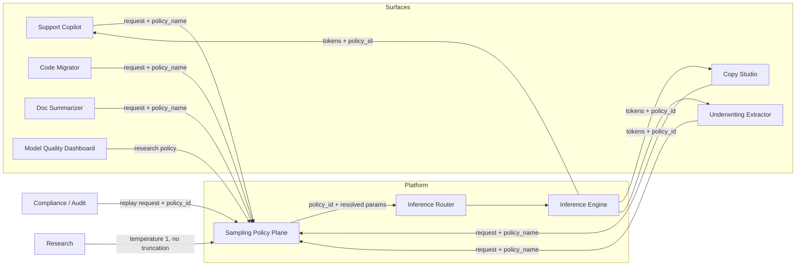
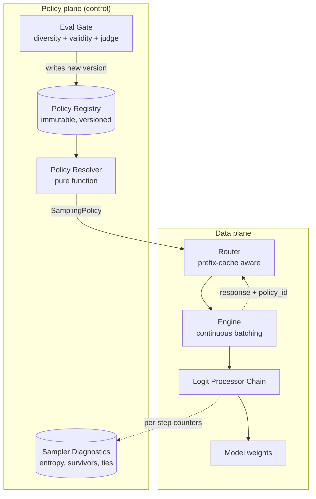

# HLD: Sampling & Decoding

> `T01` · **Transcript coverage:** primary · [LLD](LLD.md) · [Sequences](docs/SEQUENCES.md) · [Case study](../../01-case-studies/T01-sampling-decoding.md) · [Cheat sheet](../../00-cheat-sheets/T01-sampling-decoding.md)

## 1. Problem & Scope

Design the **sampling policy plane** for a shared multi-tenant inference estate. The estate serves
one base model to six product surfaces whose decoding requirements are mutually incompatible, and
it must answer two questions that are organisational before they are technical:

1. **Where does the sampling policy live** — in application code, in the model's
   `generation_config`, or in a platform service?
2. **What reproducibility guarantee may the platform make in writing**, given that
   `temperature=0` is not deterministic?

**In scope:** the policy resolver and its registry; the logit-processor chain and its ordering; the
evaluation gate that gates a policy release; the sampler diagnostics that make a decoding
regression diagnosable; the contract the platform offers to an auditor.

**Out of scope:** the model weights; training or fine-tuning (constraints that must hold on every
output are enforced at inference time, not learned `[T]`); the batching scheduler and KV cache
(see [T07](../T07-kv-cache/HLD.md), [T08](../T08-batching-scheduling/HLD.md)); structured-output
grammar compilation, which this design *consumes* as a mask (see [T03](../T03-constrained-generation/HLD.md)).

**Explicit non-goals.** We do not attempt cross-hardware or cross-version determinism — two GPU
models, two CUDA versions, or a quantized versus unquantized checkpoint will not agree, and we
document that rather than promise otherwise. We do not expose raw logits to product teams; the
parameter set is closed so the cost model stays possible. We do not use beam search on any
production surface. We do not claim the model is calibrated: post-training "mess[es] with this
property of the distribution," so "you don't have really a lot of guarantee of calibration" `[T]`,
and our surfaces therefore consume *ranked candidates*, never calibrated confidence scores.

## 2. Requirements

### Functional

| Requirement | Priority | Notes |
|---|---|---|
| Per-request sampling parameters (`temperature`, `top_k`, `top_p`, `min_p`/`epsilon`, seed) | P0 | Surfaces differ irreconcilably |
| Versioned, auditable policy per surface | P0 | Replay is request + `policy_id` |
| Sampling-aware eval gate before a policy ships | P0 | The 98%→71% JSON-validity failure class |
| Structured-output masking composable with any sampler | P0 | Ordering is load-bearing — §5.5 of the case study |
| Diversity metrics on every release candidate | P1 | Copy Studio's only quality proxy |
| Per-request policy switching at the serving layer | P2 | Called "a really reasonable thing to do"; no published system does it `[T]` |

### Non-functional

| Requirement | Target | Rationale |
|---|---|---|
| TTFT, interactive surfaces | P95 < 400 ms | Chat UX |
| Inter-token latency, interactive | P95 < 60 ms | Chat UX |
| Sampler overhead per decode step | < 2% | It runs on every token of every request |
| Reproducibility, `T=0` + fixed seed, single GPU, batch 1 | ≥ 99% identical over 24 h | The strongest defensible claim |
| Reproducibility, production batching, multi-GPU | **not offered** | Honest ceiling |
| JSON validity, Underwriting Extractor | ≥ 99.9% of responses | Downstream parser |
| Distinct-n, Copy Studio first drafts | ≥ 0.55 | Diversity floor |
| Sampling-induced cost, Copy Studio (6 candidates) | ≤ 6x single-candidate | Budget cap |

### Constraints

The **pinned-stack** requirement for any reproducibility claim: same model revision, same engine
version, same GPU model, batch-invariant kernels, fixed seed, no continuous batching `[D]`. Turning
continuous batching off is what makes the strict promise expensive — §10 prices it.

## 3. System Context (C4 L1)



**What crosses each boundary.** Surfaces send a *policy name*, never a float — this is the design's
central interface decision. The policy plane answers with a resolved, immutable `SamplingPolicy`
plus its version identity, and the engine echoes `policy_id` back on every response so a quality
incident is always attributable to a configuration. Compliance does not call the model at all; it
replays `(request, policy_id)` against the registry. Research holds an explicit escape hatch because
their requirement — temperature 1, no truncation — is a *measurement* requirement, and truncation
would measure a biased version of the model rather than the model.

## 4. Container View (C4 L2)



| Container | Responsibility | State it owns | Scaling unit |
|---|---|---|---|
| **Policy Resolver** | Map `(surface, model_id, policy_version)` → `SamplingPolicy`. Never reads request bodies. | None (pure) | Replicas; stateless |
| **Policy Registry** | Immutable versioned policies; the audit record | All policy versions | Vertical; read-mostly |
| **Eval Gate** | The only writer to the registry. A policy change is a release. | Eval runs and baselines | Job queue |
| **Sampler Diagnostics** | Per-step counters: pre-truncation entropy, survivors, tie count | Time series | Alongside the engine |
| **Logit Processor Chain** | Mask → penalties → temperature → truncation → draw | Per-request RNG state | In-engine |
| **Router** | Place the request where its prefix cache is | Cache locality map | Horizontal |

The **Processor Chain** is deliberately in-process with the engine. A network hop per token would
cost more than the sampler itself; the chain's total work is one softmax and one sort over the
vocabulary, which §10 shows is microseconds against a decode step bounded by weight bandwidth.

## 5. Component View (C4 L3) — the processor chain

```mermaid
flowchart LR
    L[logits<br/>float32, vocab] --> M{Schema mask<br/>active?}
    M -->|yes| M1[mask: set forbidden<br/>logits to -inf]
    M -->|no| P
    M1 --> P[Penalty processors<br/>repetition, presence]
    P --> T[Temperature<br/>p^(1/T) renormalise]
    T --> TR{Truncation rule}
    TR -->|top_p| TR1[nucleus]
    TR -->|top_k| TR2[fixed count]
    TR -->|locally typical| TR3[sort by distance<br/>from entropy]
    TR -->|mirostat| TR4[target-perplexity<br/>threshold]
    TR1 & TR2 & TR3 & TR4 --> V{survivors > 0?}
    V -->|no| FB[Fallback: temperature-only<br/>+ log empty-set event]
    V -->|yes| D[Draw]
    FB --> D
    D --> RNG[(seeded RNG)]
```

**Why the mask runs first.** At a JSON step there may be "over 100,000 choices but only like maybe
10 of them that will give us valid JSON at the end" `[T]`. Truncating before masking spends the
probability budget on tokens the grammar will reject. `run.py` §4 demonstrates the degenerate case:
with 10 valid tokens all in the tail, truncate-then-mask produces an **empty candidate set** while
mask-then-truncate leaves 10 drawable candidates. That empty set is the classic deadlock, and the
fallback path exists because it is cheaper to sample something valid-ish than to fail a request.

**The survivors counter is the design's most useful diagnostic.** A rising survivor count with flat
quality means the model's distribution flattened — a model change, not a policy change. A
zero-survivor event is an alert. Neither is visible from latency or error rate alone.

## 6. Data Flow

**Request path (steady state).**

1. Surface issues a request naming `policy_name` and `model_id`.
2. Resolver returns `SamplingPolicy` + `policy_version` (a cache hit in the common case).
3. Request reaches the engine carrying the resolved parameters and the version.
4. Engine runs the processor chain per step: mask → penalties → temperature → truncation → draw.
5. Each response carries `policy_id`; diagnostics emit entropy, survivors and tie counts.
6. Copy Studio's path forks: `n = 6` candidates generated, then a reranker scorer picks.

**Audit path.** Compliance submits a recorded `(request, policy_id)`. The default is
**completion replay** — the recorded output is returned bit-exact at zero inference cost. When a
fresh generation is legally required the request is routed to the pinned-stack path, which is
slower and whose throughput cost §10 prices.

## 7. Deployment Topology

The policy plane and the data plane have different failure economics and are deployed separately.

- **Policy plane** — 2+ replicas of the resolver, a small highly-available registry (a versioned
  config store; read-mostly, never on the token path), and the eval gate as an offline job.
- **Data plane** — engines on GPU nodes behind the router. The processor chain runs in-process.
- **Diagnostics** — an OTel collector sidecar per engine node, sampling per-step counters. Sampling
  *every* step would be its own load problem, so the collector samples and the alertable counters
  (empty candidate set, tie rate) are always-on while entropies are sampled.

The resolver is on the request path, so it is cached aggressively at the router. If the resolver is
unreachable the router falls back to the last-known-good policy **per surface**, never to a global
default — a global fallback is how one surface's parameters silently become another's.

## 8. Scaling Strategy

| Dimension | Strategy | Why |
|---|---|---|
| Requests | Horizontal; resolver is stateless and cacheable | The resolver's work is O(1) per request |
| Policies | Vertical; registry is read-mostly | Cost is O(number of policies), not O(tokens) |
| Tokens | Handled by the engine and scheduler | The sampler is < 2% of a decode step |
| Output length | **This is the real scaling axis** | Policy changes alter output length, which alters KV pressure, which changes router placement |
| Eval surface | Must become automated | At 10x surfaces, hand-run 200-prompt evals per release stop fitting |

The coupling worth naming: **a decoding policy is a capacity decision in disguise.** Copy Studio's
six 600-token candidates occupy six concurrent long sequences. At 10x the first thing that breaks
is the shared pool, not the sampler, and the decision that inverts is "one pool for everything" —
you split by output-length class, which is a decoding-policy consequence rather than a hardware one.

## 9. Failure Domains & Degradation

| Failure | Blast radius | Degradation |
|---|---|---|
| Resolver unreachable | All new requests | Serve the last-known-good policy per surface; never a global default |
| Registry unavailable | Policy *changes* blocked | Serving continues on cached policies; releases queue |
| Eval gate down | Releases blocked | Fail closed — an ungated policy change is the failure this system exists to prevent |
| Empty candidate set at a step | One request (or a class, if systematic) | Fall back to temperature-only sampling, log the event, alert on rate |
| Diagnostics pipeline loss | Observability only | Alert on staleness; do not fail requests |
| Model revision swap | One surface | Policy is keyed to model revision, so the swap forces a re-eval; until then the surface pins the old revision |

**The graceful degradation ladder**, in order: (1) shed non-interactive load; (2) disable Copy
Studio's `n = 6` fan-out to `n = 1`; (3) pin every surface to its last eval-passed policy; (4) fall
back to temperature-only sampling if the diagnostics show truncation is the binding constraint.
Note that step 2 is available because `n` is a policy parameter — an estate that hard-coded six
candidates in application code would have no such lever.

## 10. Capacity Model

All arithmetic here is mine `[D]`; assumptions are stated so the numbers can be re-derived.

**Assumptions**

| Input | Value | Basis |
|---|---|---|
| Interactive decode throughput, shared pool | 1,800 tokens/s aggregate | `[D]` estate planning figure |
| Average interactive output | 250 tokens | `[D]` from surface prompt templates |
| Copy Studio candidates per brief | 6 | `[D]` product requirement |
| Average Copy Studio output | 600 tokens | `[D]` |
| Sampler work per step | 1 softmax + 1 sort over 128k logits | `[T]` Llama 3's vocabulary is 128k |

**Step 1 — the sampler is not the problem.** The truncation sampler sorts a 128k vector every step.
That is microseconds against a decode step dominated by the memory bandwidth needed to stream model
weights. This is why the "< 2%" requirement is easy and why per-request parameter switching is
feasible at all: the corpus's remark that these methods are "super super simple manipulations…
literally like eight characters of code" `[T]` is a statement about the *API*, not the runtime.

**Step 2 — Copy Studio is a 6x multiplier.** Six candidates at 600 tokens is 3,600 output tokens per
brief against 250 for chat. At 1,800 tokens/s aggregate that is **2.0 s** of dedicated pool time per
brief. With reranking, generation stays `n`× and ranking is a cheap scorer over the pool — the
corpus's re-ranking demo used a medium model to rerank small-model outputs, scored by sequence
log-probability "normalized by length… that makes it easier to compare longer and shorter things on
the same footing" `[T]`.

**Step 3 — adaptive stopping, with the corpus's gap made explicit.** Self-consistency costs "100
times the inference cost" for 100 samples `[T]`; adaptive self-consistency stops early against a
0.95 confidence threshold on the Beta posterior over the top-1 and top-2 outputs `[T]`. The corpus
**does not give the samples saved**, so we claim no number and instrument it instead. Worked
expectation with an *assumed* mean of 5 samples to reach 0.95 versus a fixed 20:
`(20 − 5) / 20 = 75%` reduction on that surface. The 5 is an assumption, labelled.

**Step 4 — the price of the strictest reproducibility promise.** Satisfying the pinned-stack
contract on the Extractor means disabling continuous batching, which removes the batching win
entirely. The corpus's cost ladder runs 100 → 42 for the continuous-batching rung `[T]`, so the
strict promise costs roughly `100/42 ≈ **2.4x**` on that surface. That is the arithmetic reason the
default audit mechanism is completion replay rather than regeneration.

**Sensitivity**

| Scenario | Effect |
|---|---|
| 10x traffic | The sort stays negligible; the binding constraint becomes KV pressure from long outputs, not decoding parameters |
| 0.1x traffic | Everything fits; the policy plane is pure overhead and teams will ask to bypass it — hold the line, the audit trail is the point |
| Vocabulary doubles to 256k | Sort cost doubles, still negligible. Truncation *behaviour* changes: the absolute-mass tail is longer, so a fixed top-p keeps more tokens `[D]` |
| A surface moves to a reasoning model | Temperature is pinned to 1 by convention `[T]` and truncation must be disabled or the thinking trace is corrupted — that surface leaves the policy matrix |

## 11. Key Design Decisions

| Decision | Options | Chosen | Why | Revisit if |
|---|---|---|---|---|
| Where policy lives | App code / model config / **platform service** / difficulty router | **Platform service** | Immutable versions, replay by `policy_id`, eval gate as a release gate, closed parameter space makes cost modelling possible | The eval surface covers the (policy × difficulty) matrix cheaply |
| Beam search in production | Greedy / beam / **sampling + rerank** / diverse beam | **None** | Curse of beam search on 2018–2020 models and the likelihood trap — the highest-probability completion is "less preferred… by humans" than things "still… in the top quarter of a percentile" `[T]` | A model whose human-preference curve flattens at the top |
| Truncation rule | top-k / **top-p + epsilon** / locally typical / mirostat | top-p + ε for chat; locally typical for Copy Studio; none for the quality dashboard | top-p is a fixed *mass*, and the mass moves: 68% in the top 6 after "the" versus 99% after "the car" `[T]` | A surface's eval shows truncation, not the model, is the binding constraint |
| Processor order | temperature→top-p→mask / **mask→temperature→top-p** / mask-last | **Mask first** | With ~10 valid tokens of 100k, truncating first spends the budget on tokens the schema rejects and can empty the candidate set | The mask becomes cheap *and* dense — not expected |
| Reproducibility contract | bit-exact / nothing / **conditional + completion replay** | Completion replay by default; conditional for legal necessity | `T=0` is not deterministic, and the conditional promise costs 2.4x | The engine ships a batch-invariant decode path at acceptable cost |

## 12. Build vs Buy

**Build:** the policy registry, resolver and eval gate. These encode *our* surfaces and *our* audit
contract; no product sells them, and the whole point is that the parameter space is closed and ours.
The eval gate in particular is the system's immune response and is worth owning.

**Buy/adopt:** the engine's sampler primitives (temperature, top-k, top-p, penalties) rather than
reimplementing them — the corpus's judgement is that they are trivial manipulations, and the value
is in the ordering and the policy around them, not the arithmetic. Adopt the grammar compiler from
[T03](../T03-constrained-generation/HLD.md) rather than writing an FSM engine. Adopt the model
card's swept defaults as the *seed* for every new policy, because "those numbers in those
generation configs did not come from [thin air]" — vendors "done some kind of exhaustive
hyperparameter sweep" `[T]` — then override everything we care about.

**The break-even on owning the eval gate.** A hosted eval service is cheaper per run. It stops being
cheaper the moment a quality incident requires correlating a policy version with a surface-level
regression, because that correlation needs the `policy_id` join that only our registry has. We
therefore own the gate and buy only the judge model — never one from the same family that generated
the text, since "Claude will really like Claude, GPT will really like GPT" `[T]`.

## Sources

- `refs/CMU_Inference_Algorithms_for_Language_Modeling_Fall_2025_transcripts_2/CMU_LLM_Inference_3_Common_Sampling_Methods.txt` — temperature/top-k/top-p/epsilon/locally-typical/Mirostat/ADA; the 128k vocabulary and the long tail; the 68% vs 99% top-6 example; HuggingFace and Llama defaults; model-versus-search error.
- `refs/CMU_Inference_Algorithms_for_Language_Modeling_Fall_2025_transcripts_2/CMU_LLM_Inference_2_Probability_Review_and_Code_Examples.txt` — the temperature formula and its limits; GPU non-determinism from reduction order, MoE routing and quantization; the multi-GPU compounding; the judge prompt and the greedy 5.3 score; length-normalized reranking.
- `refs/CMU_Inference_Algorithms_for_Language_Modeling_Fall_2025_transcripts_2/CMU_LLM_Inference_4_Beam_Search_and_Variants.txt` — the repetition trap, the curse of beam search and the likelihood trap, diverse beam search.
- `refs/CMU_Inference_Algorithms_for_Language_Modeling_Fall_2025_transcripts/CMU_LLM_Inference_6_Other_Controlled_Generation_Methods.txt` — the logit-mask mechanism that fixes the processor ordering.
- `refs/CMU_Inference_Algorithms_for_Language_Modeling_Fall_2025_transcripts/CMU_LLM_Inference_7_Chain_of_Thought_and_Intermediate_Steps.txt` — self-consistency cost and the adaptive-stopping threshold used in §10.
- `refs/LLMOps_Agentic_AIOps_The_Hands-On_Playlist_2026_transcripts/Cut_LLM_Cost_Latency_KV_Cache_Batching_Quantization_vLLM.txt` — the continuous-batching rung of the cost ladder used for the 2.4x reproducibility price.
- `refs/ai-system-design-guide-main/ai-system-design-guide-main/16-case-studies/01-enterprise-rag.md` — house style reference.
