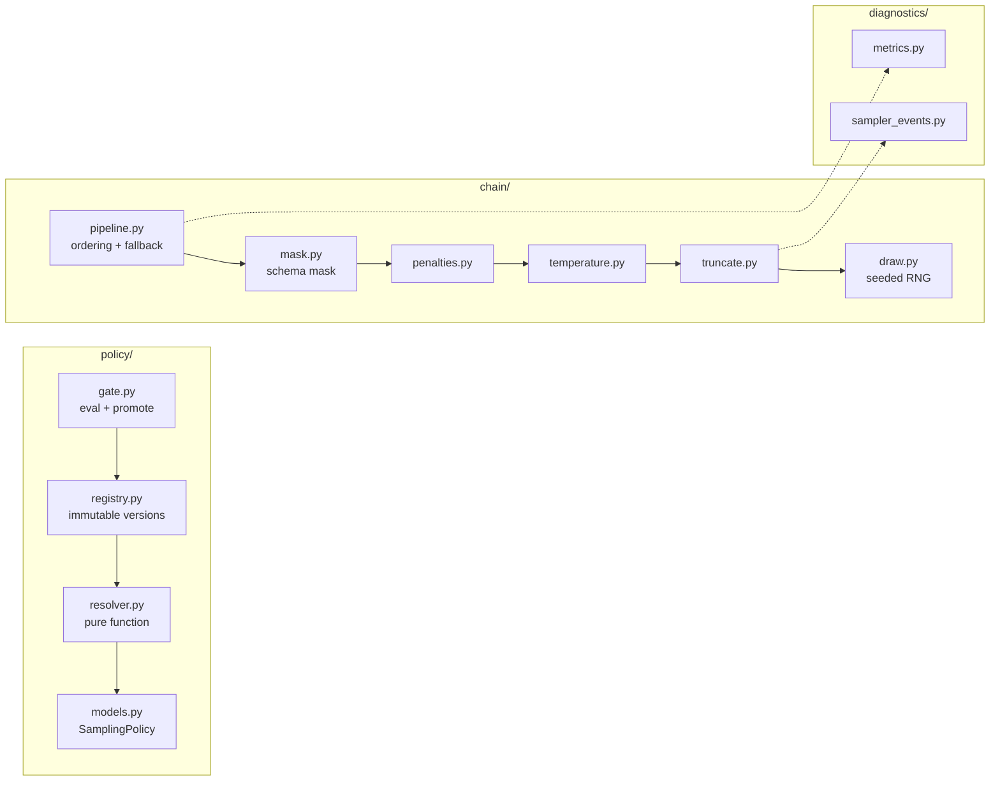
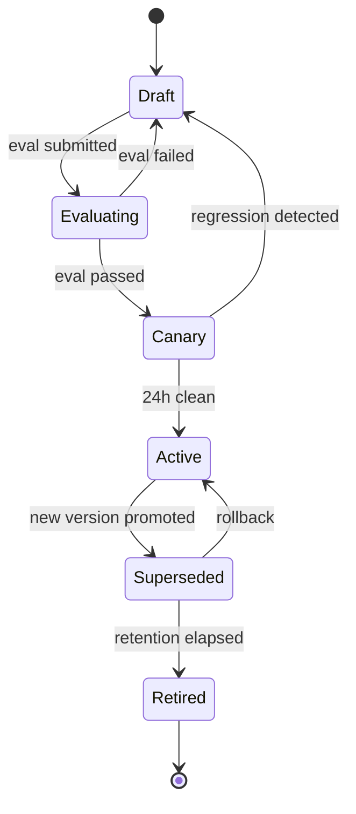
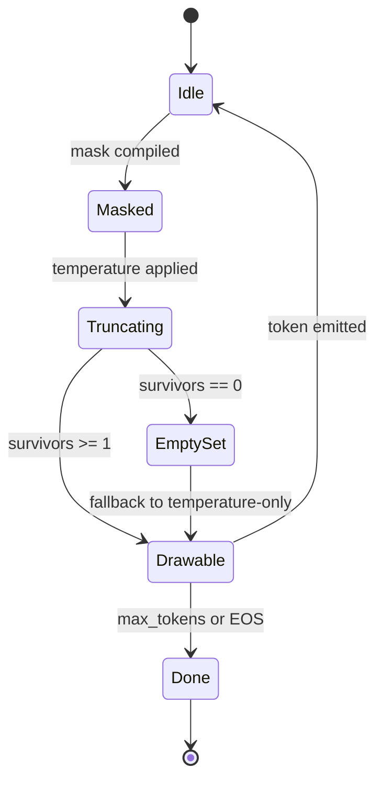

# LLD: Sampling & Decoding

> `T01` · **Transcript coverage:** primary · [HLD](HLD.md) · [Sequences](docs/SEQUENCES.md) · [Case study](../../01-case-studies/T01-sampling-decoding.md) · [Cheat sheet](../../00-cheat-sheets/T01-sampling-decoding.md)

## 1. Module Map



**Responsibilities and the things each module must never do.**

| Module | Owns | Must never |
|---|---|---|
| `resolver.py` | `(surface, model_id, policy_version) → SamplingPolicy` | Read a request body; hold mutable state; make a network call on the token path |
| `registry.py` | Immutable policy versions + the surface→version pointer | Mutate a published version; be writable by anything but the eval gate |
| `gate.py` | Running the eval suite; promoting a version | Promote on a partial eval run; auto-rollback without a human-visible record |
| `mask.py` | Compiling/consuming a grammar mask to a forbidden-index set | Decide *when* to mask (that is `pipeline.py`); renormalise without reporting retained mass |
| `temperature.py` | The `p^(1/T)` reshape | Truncate; be applied after truncation |
| `truncate.py` | top-k, top-p, epsilon, locally-typical, mirostat | Return an empty candidate set silently — it must signal, and `pipeline.py` owns the fallback |
| `draw.py` | Deriving the per-request RNG and drawing | Share an RNG across requests; depend on wall-clock time |
| `pipeline.py` | The fixed order and the fallback path | Reorder its stages at runtime; hide an empty set |

## 2. Core Data Structures

```python
# Illustrative shapes, not code to run.

@dataclass(frozen=True)
class SamplingPolicy:
    policy_id: str            # "support.chat.v7" -- identity is the version
    model_id: str             # policies are keyed to a model revision
    temperature: float        # 0.0 <= t <= 1.2, hard-capped
    top_p: float | None       # 0.0 < p <= 1.0
    top_k: int | None         # >= 0
    min_p: float | None       # epsilon floor, 0.0 <= e <= 1.0
    truncation: str           # "top_p" | "top_k" | "local_typical" | "mirostat" | "none"
    mirostat_target: float | None
    repetition_penalty: float
    max_tokens: int           # the only worst-case cost bound
    mask_order: str           # "mask_first" (only legal value in v1)
    seed: int | None
    created_at: str
    eval_run_id: str          # a policy without a passing eval cannot exist


@dataclass
class ChainState:
    """Per-sequence processor state. Lives in the engine, one per request."""
    policy: SamplingPolicy
    rng: Random               # seeded per (request, step) -- see section 6
    step: int
    seen_tokens: list[int]    # for repetition penalties
    mirostat_mu: float | None
    last_survivors: int
    last_retained_mass: float
    empty_set_events: int


@dataclass
class StepOutcome:
    token_id: int
    survivors: int
    retained_mass: float
    pre_truncation_entropy: float
    tie_count: int            # tokens sharing the max after temperature
    fell_back: bool           # True when the empty-set path was taken
```

**Invariants.** `policy_id` is unique and immutable once written. `eval_run_id` is non-null on any
policy reachable by the resolver — the registry refuses a write without one. `ChainState.rng` is
never shared between sequences. `StepOutcome.survivors` is `>= 1` on every non-error return, because
the fallback path guarantees it.

**Why `policy_id` is the version.** A replay must be `(request, policy_id)`. If the identity were
`"support.chat"` and the version a separate field, a replay could silently resolve to a different
policy after a promotion. Carrying the version *inside* the identity makes that unrepresentable.

## 3. Interfaces & Contracts

### 3.1 `resolve(surface, model_id, policy_version=None) -> ResolvedPolicy`

Returns the policy plus its registry generation.

- **Pre:** `surface` is a known surface; `model_id` is loaded.
- **Post:** returns a `SamplingPolicy` whose `model_id` matches the request, or raises
  `PolicyNotFound`.
- **Errors:** `PolicyNotFound` (no policy for this surface+model — *not* retryable, surfaces the
  missing registration); `RegistryUnavailable` (retryable; caller serves last-known-good).
- **Idempotent:** yes, pure. **Threading:** lock-free read of an immutable snapshot.
- **Never** falls back to a global default. A missing surface policy is an error, not a default.

### 3.2 `process_step(logits, mask, chain_state) -> StepOutcome`

The per-token hot path.

- **Pre:** `len(logits) == vocab_size`; `chain_state.policy.mask_order == "mask_first"`.
- **Post:** returns a drawable token. `retained_mass` reports how much mass the truncation kept
  *before* renormalisation, so the caller can see how aggressive the rule was.
- **Errors:** `MaskDisjointFromSupport` — the grammar permits nothing with non-zero probability.
  This is a *grammar* problem, not a sampler problem, and it is raised rather than papered over.
- **Side effects:** emits one diagnostics record if the collector's sampling flag selects this step.
- **Threading:** `chain_state` is not shared; the function is pure with respect to everything else.

### 3.3 `promote(policy_version, eval_run_id) -> None`

- **Pre:** `eval_run_id` completed and passed every gate in §9.2.
- **Post:** the surface→version pointer moves atomically; the previous version remains readable
  forever.
- **Errors:** `EvalIncomplete`, `EvalFailed`. Both are terminal for the attempt.
- **Idempotent:** yes — promoting an already-active version is a no-op.

### 3.4 `replay(request, policy_id) -> Completion`

- **Post:** returns the recorded completion, bit-exact, with zero inference cost.
- **Errors:** `ReplayRecordExpired` (retention boundary — the caller must then use the pinned-stack
  path and accept its cost).
- **Contract:** replay does **not** re-derive the answer. It reproduces the *record*. This is the
  distinction the whole reproducibility design turns on.

## 4. State Machines

**Policy version lifecycle.**



The pointer moves only on `Canary → Active` and on rollback. `Superseded` versions stay readable
forever, because a replay of a six-month-old request must resolve the policy that produced it.

**Per-request chain state.**



`EmptySet` is a real, expected state, not an exception. It must be *observable* — the alert is on
its rate, and a rising rate is the earliest signal that a grammar and a distribution have diverged.

## 5. Algorithms

**Temperature, in log space** (avoids `p^(1/T)` underflow at small `T`):

```
def temperature(logits, T):
    if T <= 0: return one_hot_over(max(logits))   # uniform over the tied set
    scaled = [x / T for x in logits]
    return softmax(scaled)
```

**Nucleus truncation** — sort descending, accumulate until the threshold, renormalise:

```
def top_p(probs, threshold):
    order = argsort_desc(probs)
    kept, acc = [], 0
    for i in order:
        kept.append(i); acc += probs[i]
        if acc >= threshold: break
    return normalise(kept), acc
```

**Locally typical** — sort by `| -log p_i − H |` rather than by `p_i`. This is the rule that can cut
a likely-but-atypical token, and it is why its output has *higher* perplexity than ancestral
sampling by design.

**Mirostat** — a running surprise estimate `mu`, decremented by
`rate * (observed_surprise − target_surprise)`, with the truncation threshold set to `mu` each step.
`run.py` §8 shows it hitting its target (12.6 against a target of 12) where a fixed `top_p(0.95)`
drifts to 573.8 on a long-tailed step. The cost is a control loop that converges poorly on short
outputs, which is why it is experimental-only.

**Seeded RNG derivation.** The RNG is derived, not stored: `seed = H(request_id || policy_seed ||
step)`. This makes a replay reproducible *given the same logits*, keeps chain state small, and means
two concurrent sequences with the same policy cannot accidentally share a stream. It does **not**
make the completion reproducible, because the logits themselves are not — that is the point the
simulation's §6 makes.

## 6. Concurrency & Locking

| Concern | Discipline |
|---|---|
| Registry reads | Immutable snapshots; readers never lock. A promotion swaps a pointer with release semantics. |
| Registry writes | Single writer (the eval gate), serialised. Concurrent promotions to the same surface are rejected, not merged. |
| Chain state | Thread-confined to the sequence's worker. No locking; sharing is a bug. |
| Diagnostics | Lock-free ring buffer per engine thread, drained by the collector. Dropping samples under pressure is correct — never block the token path for a metric. |
| Resolver cache | Per-router cache with the `policy_id` in the key, so a promotion cannot serve a stale entry under a new identity. |

**The ordering guarantee that matters:** a response's `policy_id` must be the version that actually
produced it. The version is captured at resolution and carried through to the response, never
re-read at completion time — otherwise a promotion mid-request would mislabel the output, which is
precisely the audit failure this system exists to prevent.

## 7. Error Handling

| Error | Retryable | Caller sees | Logged | Notes |
|---|---|---|---|---|
| `PolicyNotFound` | No | HTTP 400 with the surface name | Yes | A missing policy is a deployment error |
| `RegistryUnavailable` | Yes, with backoff | Served from last-known-good | Yes, at WARN | Alert if it persists past the cache TTL |
| `MaskDisjointFromSupport` | No | HTTP 422, grammar named | Yes, at ERROR | The grammar and the model disagree; fail the request |
| `EmptyCandidateSet` | n/a | Not visible — fallback succeeds | Yes, counter | Alert on rate, not on occurrence |
| `EvalFailed` | No | Release blocked | Yes | Fail closed |
| `ReplayRecordExpired` | No | HTTP 410 with the retention boundary | Yes | Forces the pinned-stack path |
| `MaxTokensExceeded` | No | Truncated result + a flag | Yes | Bounded by `max_tokens`, which is enforced at the router |

**Backoff.** Registry and resolver reads use exponential backoff with jitter, capped at 2 s, three
attempts, then last-known-good. There is deliberately **no** retry on the token path: a decode step
that fails is retried by the engine's own sequence-level logic, not by the processor chain.

## 8. Resource Accounting

| Resource | Acquired | Tracked | Released | On abort |
|---|---|---|---|---|
| `ChainState` | Request admission | Per-sequence registry | Sequence completion or kill | Freed by the sequence's drop handler |
| RNG stream | Derived, not allocated | Not tracked (no allocation) | n/a | n/a |
| Diagnostics ring buffer | Engine start | Fixed capacity | Process exit | Overwritten, never grown |
| Resolver cache entry | First resolution | LRU, bounded | Eviction or promotion | Evicted; a re-resolve is cheap |
| Replay record | First response | Retention store, TTL-indexed | TTL expiry | n/a — expiry is the release |

Diagnostics cardinality is the one resource that can run away: entropy histograms are keyed by
`(surface, policy_id, step_bucket)`. The `step_bucket` is coarse (logarithmic) specifically so a
10,000-token generation cannot create 10,000 time series.

## 9. Configuration Surface

| Knob | Type | Default | Range | Effect | Tuning order |
|---|---|---|---|---|---|
| `max_tokens` | int | per surface | 1..32768 | Bounds worst-case cost and pool occupancy | **1st** |
| `temperature` | float | per surface | 0.0..1.2 | Reshapes the distribution | 2nd |
| `truncation` | enum | `top_p` | see §5 | Which tail rule runs | 3rd |
| `top_p` | float | 0.95 | 0.0..1.0 | Mass kept | 3rd |
| `top_k` | int | None | 0..vocab | Hard candidate bound | 3rd |
| `min_p` | float | None | 0.0..1.0 | Absolute floor, applied after top-p | 4th |
| `repetition_penalty` | float | 1.0 | 1.0..2.0 | Interacts with everything above | **Last** |
| `mirostat_target` | float | None | 1..100 | Target perplexity; experimental | n/a |

**Rule: never tune two of these in the same experiment.** They interact, and a two-knob change
produces a result you cannot attribute.

## 10. Observability Hooks

| Signal | Type | Name | Tells you |
|---|---|---|---|
| Policy in use | label | `policy_id` on every response | Which version produced this |
| Pre-truncation entropy | histogram | `sampler.entropy` | A shift means the *model* changed, not the policy |
| Survivors after truncation | histogram | `sampler.survivors` | How aggressive the rule is at this step |
| Retained mass | histogram | `sampler.retained_mass` | Whether truncation is close to starving |
| Empty candidate set | counter | `sampler.empty_set` | Alert on rate — the grammar/distribution divergence |
| Tie count | counter | `sampler.ties` | Rising ties suggest quantization is distorting logits |
| Fallback taken | counter | `sampler.fallback` | The empty-set path fired; correlated with the grammar version |
| Eval gate duration | histogram | `gate.duration` | The release pipeline's own SLO |

The diagnostics that matter are **not** latency or error rate. A decoding regression is invisible to
both: the request succeeds, the latency is normal, and the output is subtly wrong. Entropy and
survivors are the only signals that see it.

## 11. Test Strategy

**Unit.** Temperature at its limits (`T=1` identity, `T→0` one-hot, `T→∞` uniform, and **uniform
over an exactly tied set** — the case greedy implementations get wrong). Each truncation rule's
survivor count and retained mass on a peaked and a long-tailed distribution. The mask-before-truncate
ordering, asserted as a *property*: for any distribution and any non-empty grammar, the pipeline
never returns an empty set.

**Integration.** A policy version round-trips: draft → eval → canary → active → replay resolves the
same version. A promotion mid-request does not mislabel the in-flight response. The resolver's
last-known-good path serves under a simulated registry outage.

**Load.** Sampler overhead measured as a fraction of a simulated decode step, asserted under 2%.
Diagnostics cardinality bounded under a 10,000-token generation with 50 concurrent sequences.

**Chaos.** Kill the registry during a promotion — serving must continue and the release must fail
closed. Inject a grammar that is disjoint from the model's support — the request must fail with 422,
not loop or hang.

**The invariants worth asserting**, in priority order:

1. `survivors >= 1` on every successful step (the no-empty-set property).
2. `T=1` is the identity to within float tolerance.
3. A response's `policy_id` matches the version captured at resolution.
4. Exactly tied logits at `T=0` produce a uniform draw, not index 0.
5. No policy is reachable by the resolver without a passing `eval_run_id`.

## Sources

- `refs/CMU_Inference_Algorithms_for_Language_Modeling_Fall_2025_transcripts_2/CMU_LLM_Inference_3_Common_Sampling_Methods.txt` — the sampling methods implemented in §5, and the long-tail argument behind the survivors diagnostic.
- `refs/CMU_Inference_Algorithms_for_Language_Modeling_Fall_2025_transcripts_2/CMU_LLM_Inference_2_Probability_Review_and_Code_Examples.txt` — the temperature formula, the tied-token behaviour, and the three sources of nondeterminism that §5's RNG derivation cannot fix.
- `refs/CMU_Inference_Algorithms_for_Language_Modeling_Fall_2025_transcripts/CMU_LLM_Inference_6_Other_Controlled_Generation_Methods.txt` — the logit mask that `mask.py` consumes, and the ~10-valid-tokens-of-100k observation behind the ordering decision.
- `refs/ai-system-design-guide-main/ai-system-design-guide-main/16-case-studies/01-enterprise-rag.md` — house style reference.
