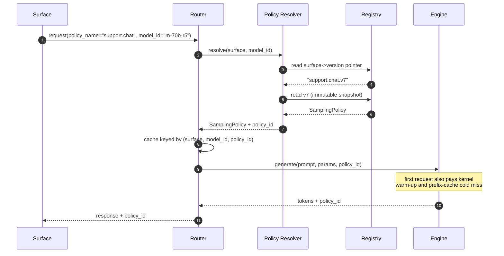
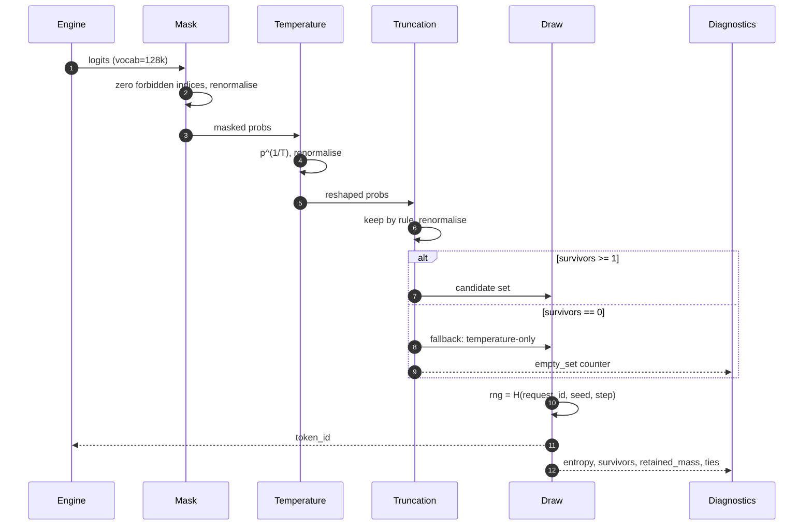
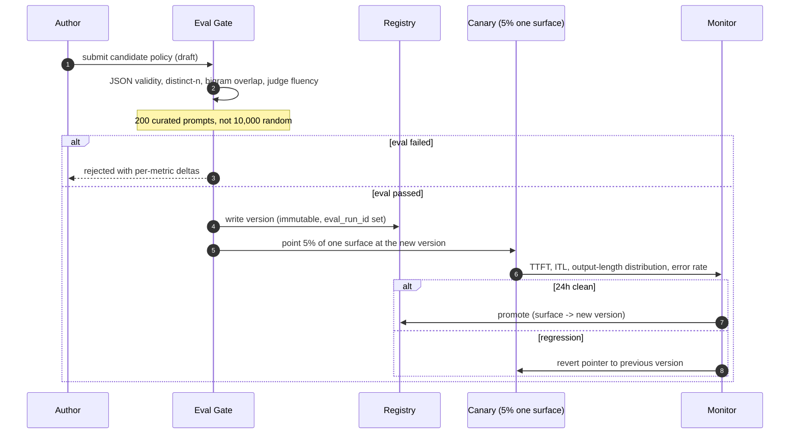
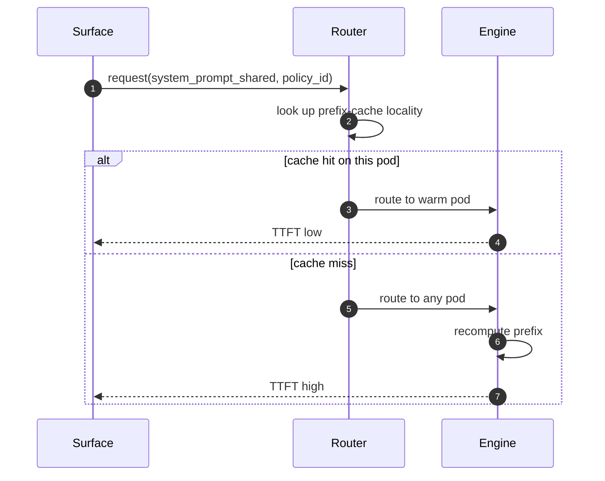
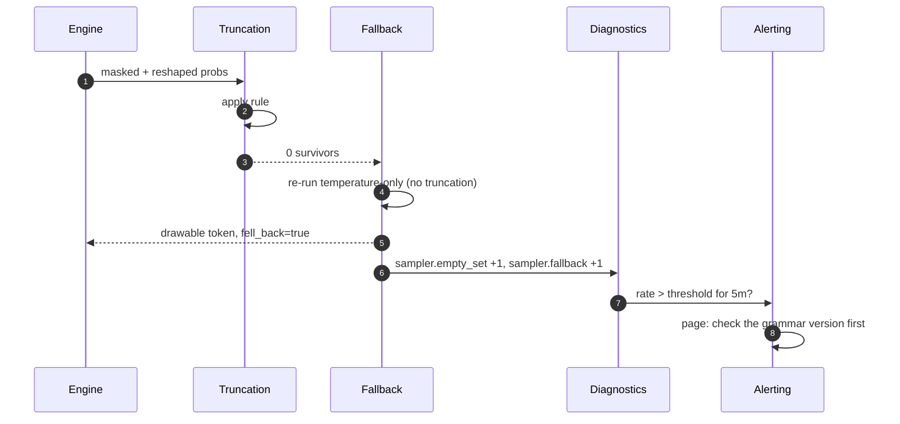
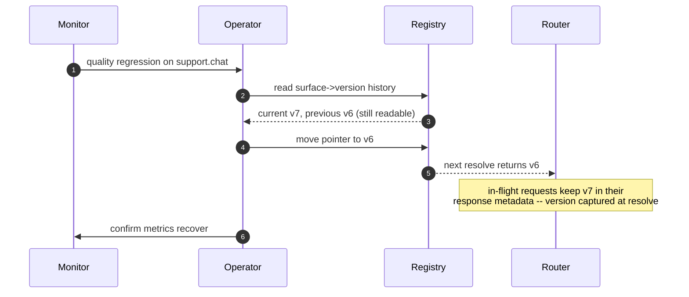
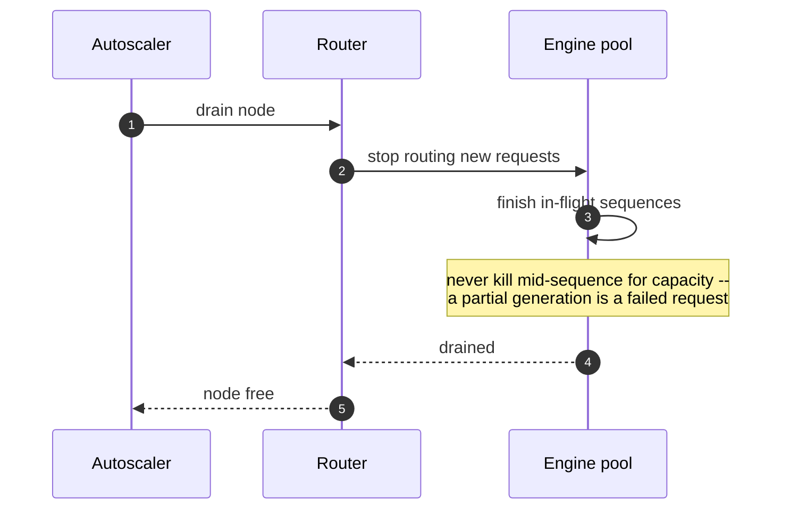

# Sequences: Sampling & Decoding

> `T01` · [HLD](../HLD.md) · [LLD](../LLD.md) · [Case study](../../../01-case-studies/T01-sampling-decoding.md)

End-to-end flows for the sampling policy plane. Each step names where it can fail; the failure
taxonomy is in [LLD §7](../LLD.md#7-error-handling).

---

## 1. Cold start — first request after a deploy



**Failure points.** Registry unavailable → the resolver serves last-known-good and logs at WARN; the
request still succeeds. A *missing* surface policy is not a fallback — it returns 400, because a
surface that was never registered should not silently inherit another's decoding behaviour.

**Why the first request is special.** Prefix-cache state, compiled kernels and quantization
calibration all differ before warm-up, so the same prompt can produce a different completion. This
is why replay audits are re-run only *after* the warm-up window — auditing against a cold start
would produce false divergences.

---

## 2. Steady state — one decode step



**Failure points.** The `survivors == 0` branch is the only in-band failure, and it is *expected* —
it is counted, alerted on by rate, and rescued. `MaskDisjointFromSupport` (the grammar permits
nothing with non-zero probability) is different and is raised: it means the grammar and the model
disagree, and no amount of sampling will fix it.

**Why the mask is first.** `run.py` §4 shows the degenerate case concretely: with 10 valid tokens all
in the tail, truncate-then-mask empties the candidate set while mask-then-truncate leaves 10
drawable candidates. Reordering the chain is a one-line change that silently breaks a fraction of
requests — which is why the test strategy asserts the ordering as a property rather than testing it
as a configuration.

---

## 3. Policy release — draft to active



**Failure points.** The gate is the only writer to the registry, so a promotion that skips it is not
representable. A regression during canary reverts a *pointer*, not a deployment — rollback is
seconds, which is what makes the canary cheap enough to run on every policy change.

**The judge caveat is load-bearing.** The gate never judges with the same model family that
generated the text: "Claude will really like Claude, GPT will really like GPT" `[T]`. The 5th
percentile of outputs is sampled for human review, because a judge score used as ground truth is
how a change that lowers real quality raises the judged score.

---

## 4. Prefix-cache hit versus miss



**Why this is in a *sampling* sequence document.** The coupling is indirect but real: a decoding
policy determines average output length, output length determines KV pressure, and KV pressure
determines which pods can accept the request. A policy that lengthens outputs moves the router's
placement decisions. This is the mechanism behind incident #4 in the case study's runbook — a
Copy Studio latency spike caused by six long candidates per brief occupying KV, not by anything in
the sampler.

---

## 5. Failure — empty candidate set



**Diagnosis order matters.** The instinct is to loosen the policy. The correct first check is the
*grammar*: an empty set means the schema and the distribution have diverged, and that is usually a
schema-version change (or a token-healing heuristic that was disabled — see
[T03](../../T03-constrained-generation/HLD.md)), not a sampler problem. Loosening `top_p` would hide
the symptom and let the real defect ship.

---

## 6. Recovery — rollback



**The subtlety.** In-flight requests must keep the `policy_id` they resolved with. The version is
captured at resolution and carried through, never re-read at completion — otherwise a rollback
mid-request would mislabel the output, and the audit trail would attribute a v7 completion to v6.
That is precisely the failure this design exists to prevent.

---

## 7. Scale-out

```mermaid
sequenceDiagram
    autonumber
    participant AU as Autoscaler
    participant ENG as Engine pool
    participant R as Router
    participant P as Policy Resolver

    AU->>ENG: add replicas (KV-utilisation signal, not CPU)
    ENG->>P: resolver already cached -- no re-resolve storm
    Note over P: the policy plane does not scale with tokens,<br/>only with the number of policies
    R->>R: rebalance; prefix locality degrades briefly
    R->>ENG: traffic spreads
```

**What scales and what does not.** The engine pool scales horizontally. The policy resolver scales
horizontally and trivially, because its work is O(1) per request and its state is immutable. The
*eval gate* does not scale with traffic at all — it scales with the number of releases, and at 10x
surfaces the hand-run 200-prompt eval stops fitting, which is the first thing that breaks in the
control plane rather than the data plane.

---

## 8. Scale-in



**Failure point.** Draining must respect `max_tokens`. A sequence with an unbounded generation budget
would hold a node indefinitely, which is why the case study's tunable order puts `max_tokens` first:
it is the only parameter that bounds worst-case occupancy.
