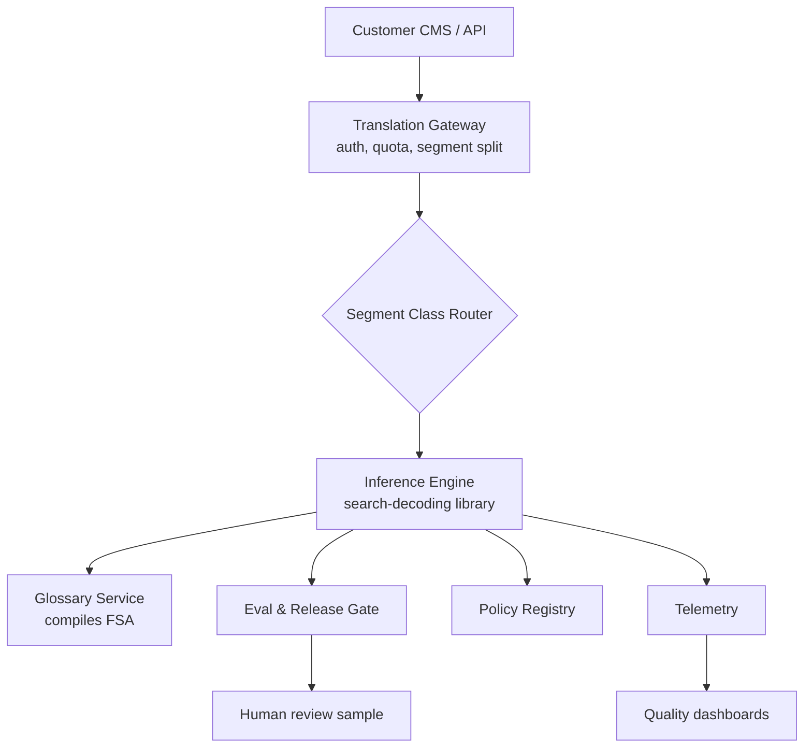
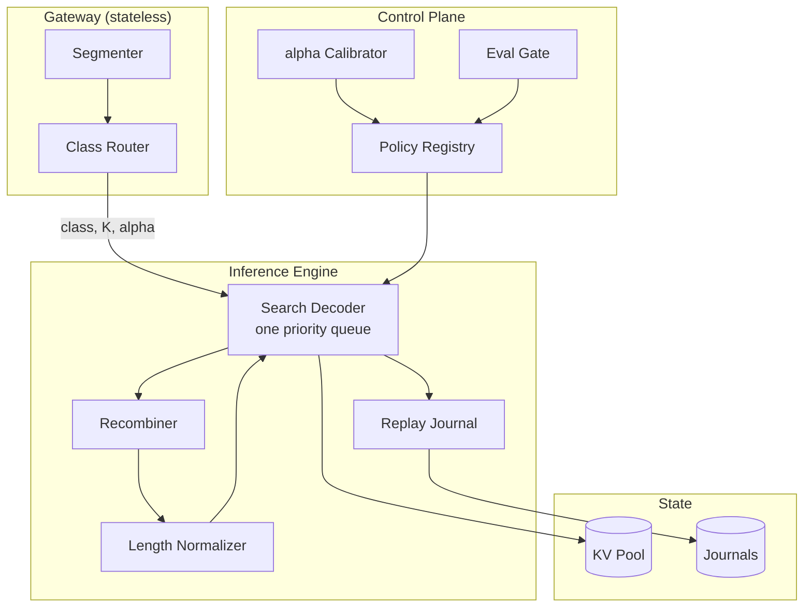
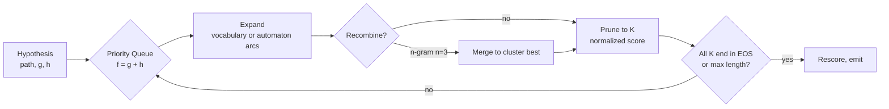

# HLD: Beam, A* and Best-First Search

> `T02` · **Transcript coverage:** primary · [LLD](LLD.md) · [Sequences](docs/SEQUENCES.md) · [Case study](../../01-case-studies/T02-search-decoding.md) · [Cheat sheet](../../00-cheat-sheets/T02-search-decoding.md)

Provenance: `[T]` transcript, `[R]` repo/reference, `[D]` derivation by this author with assumptions shown.

## 1. Problem & Scope

Design the **search-decoding plane** for a translation estate. Vantage Localization serves 340
enterprise customers, 40M source words a month across 31 target languages, on open-weight models it
serves itself. Translation is one of the last production homes of beam search, and the design
question is not "beam or not." It is:

1. **Which search budget applies to which segment**, given that width multiplies decode cost and
   that the customer contract is written against BLEU while the model optimises likelihood.
2. **When is searching harder actively harmful**, and what does the system do about it.

**In scope:** the segment-class router; the four decoder configurations; the length normalisation
policy and its per-language calibration; hypothesis recombination; the bounded A\* path for
glossary-constrained segments; the replay contract for contract disputes.

**Out of scope:** the grammar compiler that turns a glossary into a finite automaton — this design
*consumes* it ([T03](../T03-constrained-generation/HLD.md)); the KV allocator and prefix cache that
the beams fork into ([T07](../T07-kv-cache/HLD.md)); the continuous-batching scheduler the beam
requests share a pool with ([T08](../T08-batching-scheduling/HLD.md)); the reranker used when the
objective itself is wrong ([T05](../T05-verifiers-best-of-n/HLD.md)).

**Explicit non-goals.**

- **We do not use A\* over an unbounded decoder.** "It's very very difficult to come up with an
  admissible heristic… it is quite possible that you could suddenly hit a sweet spot and pay like
  zero cost for the rest of the time" `[T]` — CMU lecture 5. A\*-style search is confined to
  finite-state-bounded segments where the remaining length is known.
- **We do not promise that higher beam width means higher quality.** The curse of beam search is
  documented `[T]`.
- **We do not attempt exact decoding.** "exact decoding would require setting your beam size to the
  size of the vocabulary" `[T]`.
- **We do not offer beam search on the open-ended tone-rewriting product.** That is a sampling
  problem ([T01](../T01-sampling-decoding/HLD.md)).

## 2. Requirements

### Functional

| Requirement | Priority | Notes |
|---|---|---|
| Beam search, configurable width, length normalisation, early stopping | P0 | The core decoder |
| Diverse beam search with grouped penalties | P1 | The "give me 3 phrasings" product |
| Bounded search mode for finite-state-constrained segments | P1 | Glossary translation; see [T03](../T03-constrained-generation/HLD.md) |
| Per-request search policy (greedy / beam / diverse / bounded) | P0 | Customers differ in budget |
| Deterministic replay of any beam output | P1 | Contract disputes |
| Hypothesis recombination by n-gram or KL | P1 | The only thing that makes the bounded path affordable |

### Non-functional

| Requirement | Target | Rationale |
|---|---|---|
| P95 end-to-end latency, 2,000-token document | < 3.5 s | Contract |
| Default beam width | 4 | Quality team's floor, cost team's ceiling |
| Wall-clock overhead at batch 32 vs greedy | ≤ 25% | Measured, §10 |
| KV footprint per concurrent beam-4 request | ≤ 4x greedy | Beams fork the cache; see [T07](../T07-kv-cache/HLD.md) |
| BLEU regression tolerance per release | ≤ 0.3 | Below the eval set's noise floor |
| Diverse-beam exact duplicates in a 3-output set | 0 | Product promise |

### Constraints

- **Scores must be monotonically non-increasing along a path** `[T]`. This is a precondition of
  best-first beam search's early-termination rule, and it is why a reward-augmented score cannot be
  dropped into the queue unchanged.
- **The priority queue is on the engine host's memory, not the GPU's.** A frontier blow-up takes
  out the replica rather than the accelerator.
- **The decoder is a library, not a service.** It is called in-process by the engine; adding a
  network hop per step is unaffordable at these step counts.

## 3. System Context (C4 L1)

Four external actors. The **customer** submits documents and, on dispute, asks for a replay. The
**glossary service** owns the automaton; the decoder asks it for a compiled graph and never
compiles one itself. The **eval gate** is the only writer of the active policy version. **Human
review** samples output and is the arbiter when BLEU and judgement disagree — which, per §9, is the
signal that the objective rather than the search is wrong.

The load-bearing boundary is the router. Every downstream component behaves identically regardless
of class; the router is the only place the product decision lives.

## 4. Container View (C4 L2)

- **Search Decoder** — one priority-queue implementation, four configurations. This is the
  architectural claim of the topic, not an implementation convenience: greedy, beam, uniform-cost
  and A\* differ only in `(comparator, K, h)`, so there is one code path to test.
- **Recombiner** — sits between expansion and pruning. Optional; mandatory when the bounded path is
  in use.
- **Length Normalizer** — applies the per-language `alpha`. It is a *container* rather than a
  function because its calibrated parameters are versioned and released like any other policy.
- **Replay Journal** — enough of the request to reproduce the output bit-for-bit at the same stack
  version (see [T01](../T01-sampling-decoding/HLD.md) for why this is conditional on stack pinning).
- **alpha Calibrator** — offline; produces the per-language normalisation constants.

## 5. Component View (C4 L3) — one queue, four settings

The unifying result comes from the best-first beam search paper as the lecture reads it. Beam search
"always prioritizes things that are shorter… and then… if the output is the same length it
prioritizes based on score"; best-first "always prioritizes based on score. Uh but if the score is
the same then it prioritizes based on length"; `K` "is the beam size for one and infinite for the
other"; and "beam search doesn't have one [a heuristic]. Best search doesn't have one but a star
search does have one" `[T]`.

So the parameter surface is exactly three things:

| Parameter | Greedy | Beam | Uniform-cost | A\* |
|---|---|---|---|---|
| Comparator | score only | length, then score | score only | `f = g + h` |
| `K` (beam constraint) | 1 | 4 (default) | ∞ | ∞ |
| `h` | 0 | 0 | 0 | row-minimum over the automaton |
| Domain | any | any | any | bounded FSA only |

**Beam mechanics.** Seed with the top-`K` tokens; at each step expand the top `K`, each into its `K`
best completions — "up to `K` squared options" — and prune back to `K`. EOS beams are not expanded,
so an expansion after a beam completes yields fewer children: the lecture's width-3 example produces
9 candidates, then 7 total after one beam ends in EOS `[T]`. Log-probabilities rather than
probabilities throughout, because probabilities "become really, really small numbers close to
zero. Our hardware doesn't like really, really small numbers close to zero" `[T]`.

**Length normalisation.** A completed sequence at length 3 competes against partials at length 4, so
EOS "is getting an unfairly good chance" `[T]`. HuggingFace's variant divides by `|Y|^alpha`. What
the lecture actually says about alpha: "you can set this to be zero if you want no normalization at
all. You can set this to be one" `[T]`. It does not state a canonical alpha, and the closest thing
to a caution is a student's argument, endorsed non-committally, that a very high alpha "explod[es]"
and "clearly I put the shorter sequences on a much better footing than the longer sequences" `[T]`.
Our position is the honest one: **there is no alpha that puts all lengths on equal footing** —
"my sense is that this is sort of the price we pay by making our models locally normalized. I don't
I can't think of anything that would guarantee" `[T]`. We therefore calibrate per language and cap
the range, and we treat alpha as a release artifact rather than a tunable.

**Bounded A\* and the row-minimum heuristic.** Where the glossary compiles to an FSA the remaining
path length is bounded and no EOS absorbing state exists, so "take the minimum arc weight in each
row of the graph" `[T]` gives a genuine lower bound on the remaining cost, and A\* "is optimal when a
heristic is admissible" `[T]`. On the lecture's toy graph this moves the optimal output from step 9
to step 8, and it never expands `S0→S1` at all because "the heristic function plus the actual score
never got like low enough" `[T]`.

**Why that heuristic is illegal one line over.** The same row-minimum function applied to the
*open-ended* decoder stops being a lower bound, because EOS is an available action and can be far
cheaper than the cheapest non-EOS arc out of a state. The heuristic then overestimates, and
inadmissibility means "you might deviate from the optimal solution. You're not guaranteed to
deviate… but you might" `[T]`. §9's simulation demonstrates exactly this, and it is the reason the
bounded path is a separate code path with a separate admissibility argument rather than a flag.

**Recombination.** "maybe necessary, maybe not necessary," but required for any A\*-style algorithm
`[T]`. Two criteria families. n-gram clustering on "shared recent word contexts" is "very easy to
implement in cache" and composes with beam search, with truncation length controlling precision;
its downside is that "you could get something that was very different previously but similar for the
most recent… words" `[T]`. KL divergence over the next-token distribution is semantically grounded
— the compared object is explicitly the distribution, not the hidden state, because "similarity in
neural representations is not the correct term here" `[T]` — but costs an O(K²) pairwise matrix: at
beam 16 that is a 16×16 matrix of KL divergences per step `[T]`.

**Best-first beam search.** Standard beam "always expands all of the inputs um within your beam,"
and at "a beam size of 16 or 32," "most of those 16 are just not good like kind of obviously really
low probability solutions and it's not worth initially exploring" `[T]`. Best-first prioritises by
score while keeping the beam constraint, and the headline claim is a **10x speed-up over standard
beam search with identical results** `[T]` — "the most important part of the paper." Its
preconditions are that scores can only decrease when extended, plus early pruning and early
termination.

## 6. Data Flow

**Request path.** Document → segmenter → class router assigns `(class, K, alpha, recombination)` →
decoder seeds the queue → iterate expand/recombine/prune → on all-EOS or max length, rescore with
the *same* normalisation used during search and emit → journal.

**Why the rescore must reuse the normaliser.** The lecture's termination rule is "until each of our
top three highest probability beams ends in an EOS token. And then we'll rescore those three…
usually still using this length normalization method" `[T]`. Rescoring with a different normaliser
is a silent objective change at the last moment.

**Control path.** alpha calibrator reads held-out parallel data → proposes per-language alphas →
eval gate runs the width sweep → registry publishes a new policy version → decoders pick it up on
the next request.

## 7. Deployment Topology

The decoder is in-process in the engine, so there is no separate deployment. What deploys is the
**policy bundle**: `{class → (decoder, K, alpha, recombination_criterion, early_stop)}` plus the
per-language alpha table. It is versioned, immutable, and rolled out like a model.

Beam requests are routed to a pool with KV headroom, not to the latency-critical pool. This is a
scheduling decision made here and enforced in [T08](../T08-batching-scheduling/HLD.md): a width-4
request occupies four forked sequences, and co-scheduling it with interactive traffic produces TTFT
spikes that the interactive tenant can see.

## 8. Scaling Strategy

Search cost scales with `K` and with sequence length, and the two multiply. The strategy is
therefore to make `K` a function of the work rather than a constant:

| Signal | Adjustment | Why |
|---|---|---|
| Document length | Cap `K` at 4 for long documents | The KV product `K × length` is the binding constraint |
| Language pair | `K = 1` for pairs already above the BLEU target | Search is buying quality the customer cannot detect |
| Customer tier | `K = 8` with best-first beam | Best-first makes larger effective widths affordable |
| Pool pressure | Degrade to `K = 1` | §9's degradation ladder |

The horizontal story is unremarkable — the decoder is stateless and the engine scales out — but the
*vertical* story is the interesting one, because raising `K` on a saturated replica converts a
quality knob into an availability incident.

## 9. Failure Domains & Degradation

**The likelihood trap is not a search failure.** When the model prefers an output humans dislike,
the diagnosis is model error: "if our model was a perfect representation of what we actually wanted
to decode from it, the things that humans liked the most would be the things that were at the true
mode" `[T]`. The response is a reranker ([T05](../T05-verifiers-best-of-n/HLD.md)) or better
post-training — never more search.

**The curse of beam search is a diagnosis with two branches.** Width up and BLEU down means either
imperfect length normalisation or a genuinely degenerate mode. The prescribed test order is to tune
length normalisation first and, if the degradation persists, conclude the objective is the problem
`[T]`. The lecturer's own scope caveat applies: the published degradation curve is "roughly 2018 to
2020" models, "not a current-model result" `[T]`.

**Degradation ladder**, in order:

1. Best-first beam → plain beam at the same width (loses the speed-up, keeps the output).
2. `K = 8 → 4` (halves KV and arithmetic).
3. `K → 1`, i.e. greedy (the quality floor; the customer-visible contract is P95, not BLEU).
4. Bounded path heuristic `h` → `0` (falls back to uniform-cost; loses speed, keeps optimality).
5. Disable recombination for grammars where it merges distinct readings.

The order is deliberate: steps 1–3 trade quality for capacity, steps 4–5 trade speed for
correctness. A capacity incident and a correctness incident should never be the same switch.

## 10. Capacity Model

All arithmetic in this section is mine; assumptions are shown.

**Assumptions.**

| Input | Value | Basis |
|---|---|---|
| Segments per month | 2.0M | `[D]` 40M words ÷ ~20 words/segment |
| Output tokens per segment | 30 | `[D]` |
| Greedy decode cost per token | 1 unit | `[D]` normalisation |
| Default width | 4 | §2 |
| Decode is memory-bandwidth-bound | assumed | `[T]` decode is memory-bound, prefill compute-bound |
| KV per token per sequence | 1 unit | `[D]` |

**Step 1 — width multiplies arithmetic, not necessarily latency.** At batch 1 a decode step at
width 4 moves the same weights and processes four positions; the weight read dominates. At high
batch the GEMM is saturated and the four positions cost four times the arithmetic. So **beam width
is nearly free at low occupancy and roughly linear at high occupancy** `[D]`. This is why §2 states
the target as "≤ 25% wall-clock at batch 32" rather than "4x".

**Step 2 — monthly arithmetic.** `2.0M × 30 = 60M` output tokens/month. At width 4 that is `240M`
decode-unit-token equivalents. If the fleet does 1,800 aggregate greedy-equivalent tokens/s, width 4
reduces effective throughput to `1,800 / 4 = 450` at saturation — **the same fleet does one quarter
the work at full occupancy** `[D]`.

**Step 3 — best-first is the lever that pays for itself.** The source claims 10x `[T]`. That is a
paper result on the paper's models, so discount it. At the full 10x, effective width-4 throughput
rises from 450 to `4,500`, i.e. width-4 search would be *cheaper in wall-clock than greedy without
search*. Assume we realise one third — 3.3x: `450 × 3.3 = 1,485` tokens/s, or `1,485 / 1,800 =
0.82x` the greedy baseline. **So the honest claim is the weaker one: width-4 search costs 0.82x
greedy rather than 4x** `[D]`. The range (0.82x at a third of the claimed speed-up, 0.25x if the
claim holds fully) is what justifies the deployment, and the decision does not depend on which end
is true.

**Step 4 — the KV consequence.** Four beams means four forked sequences. With n-gram recombination
at `n = 3`, beams sharing their last three tokens can share blocks, so the steady-state multiplier
is below 4 — but worst case is 4 and the pool is sized for worst case. If a replica's KV budget
supports 64 concurrent greedy sequences, it supports 16 concurrent width-4 beam requests `[D]`.
That, not arithmetic, is the real constraint on the SLO.

## 11. Key Design Decisions

| Decision | Chosen | Rejected | Revisit if |
|---|---|---|---|
| Search family | One priority queue, four settings | Four separate decoders | Never — this is the unifying result `[T]` |
| Default width | 4 | 8 (cost), 1 (quality) | Width sweep shows 8 pays on the customer set |
| Beam implementation | Best-first beam, width 8 where affordable | Plain beam | Queue memory becomes the binding constraint |
| Normalisation | Divide by `len^alpha`, per-language, capped | None, or a single global alpha | Output-length distribution drifts after a model upgrade |
| Recombination | n-gram `n = 3` for prose, KL for bounded | None (too slow), KL everywhere (too costly) | Recombination starts merging distinct glossary readings |
| Bounded heuristic | Row-minimum | Learned future cost | A future-cost model beats row-minimum on the bounded task |
| A\* scope | Bounded FSA segments only | Open-ended decoding | Never — no admissible heuristic exists `[T]` |
| Replay | Request + policy version + pinned stack | Output text only | — |

**The one decision worth defending at length is the A\* scope.** It is not a cost decision. It is
that the object does not exist: an admissible heuristic over an open-ended decoder would have to
lower-bound the remaining cost of an arbitrary continuation, and a model that has memorised a span
will "generate like thousands of tokens with like probability of one because it's exactly
memorized" `[T]`, so any non-zero estimate overestimates there. The mirror case — a prefix after
which the model "spend[s] a lot more probability" — must be predicted from the prefix alone. Hence
the lecture's aside that "an A star with a asterisk you know it's not actually a star" `[T]`.

## 12. Build vs Buy

**Build** the queue, the recombination, and the bounded A\* path. They are a few hundred lines, they
are the differentiating mechanism, and — decisively — the comparator and the admissibility argument
have to be inspectable when a customer disputes a translation.

**Buy** (or rather, reuse) the tokenizer and the FSA compilation for glossaries; the glossary
service already owns the automaton. **Reuse** the engine's KV allocator rather than building a
beam-specific one — beams fork into the same pool everything else uses ([T07](../T07-kv-cache/HLD.md)).

**Do not buy a search library.** The two candidates are general-purpose graph-search packages whose
beam constraint is bolted on and whose pruning does not apply the length normaliser during search,
which is precisely the bug that produces the curse of beam search in the first place.

The eval gate we own, because the correlation between width and customer-visible quality needs the
policy-version join that only our registry has.

## Sources

- `refs/CMU_Inference_Algorithms_for_Language_Modeling_Fall_2025_transcripts/CMU_LLM_Inference_5_A_and_Best_First_Search.txt` — weighted finite-state automata; the priority queue and `f = g + h`; the greedy/beam/uniform-cost/A\* step counts (4/6/9/8) on the toy graph; admissibility as sufficient but not necessary; the row-minimum heuristic construction; the memorisation argument against an admissible heuristic over an open-ended decoder; best-first beam search and the 10x claim; future cost and its discount; hypothesis recombination by n-gram and by distribution distance; the 16×16 KL matrix.
- `refs/CMU_Inference_Algorithms_for_Language_Modeling_Fall_2025_transcripts_2/CMU_LLM_Inference_4_Beam_Search_and_Variants.txt` — beam mechanics and the 9-then-7 candidate example; log-probs for numerical stability; the EOS unfairness and the HuggingFace `|Y|^alpha` length penalty; the alpha discussion and the "no guarantee" position; the curse of beam search and the likelihood trap; the repetition trap; diverse beam search, the four penalty terms and `t + g − 1` steps; stochastic beam search and the Gumbel-max trick; the source-length prior.
- `refs/CMU_Inference_Algorithms_for_Language_Modeling_Fall_2025_transcripts/CMU_LLM_Inference_6_Other_Controlled_Generation_Methods.txt` — finite-state constraints as a mask, which is the boundary this design consumes for the bounded path.
- `refs/CMU_Inference_Algorithms_for_Language_Modeling_Fall_2025_transcripts_2/CMU_LLM_Inference_3_Common_Sampling_Methods.txt` — the decode-cost ladder and the greedy baseline this design prices against.
- `refs/CMU_Inference_Algorithms_for_Language_Modeling_Fall_2025_transcripts/CMU_LLM_Inference_12_Reward_Models_and_Best-of-N.txt` — the reranker route taken when the objective rather than the search is wrong.
- `refs/LLMOps_Agentic_AIOps_The_Hands-On_Playlist_2026_transcripts/Cut_LLM_Cost_Latency_KV_Cache_Batching_Quantization_vLLM.txt` — decode is memory-bandwidth-bound; the occupancy argument in §10.
- `refs/ai-system-design-guide-main/ai-system-design-guide-main/16-case-studies/01-enterprise-rag.md` — house style reference.
