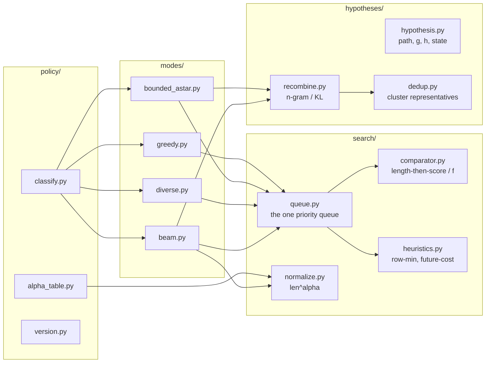
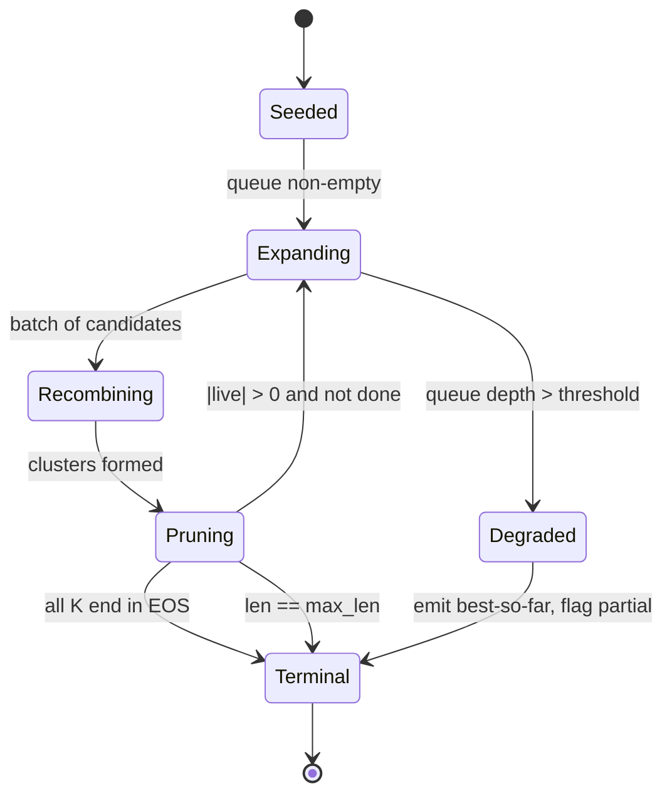
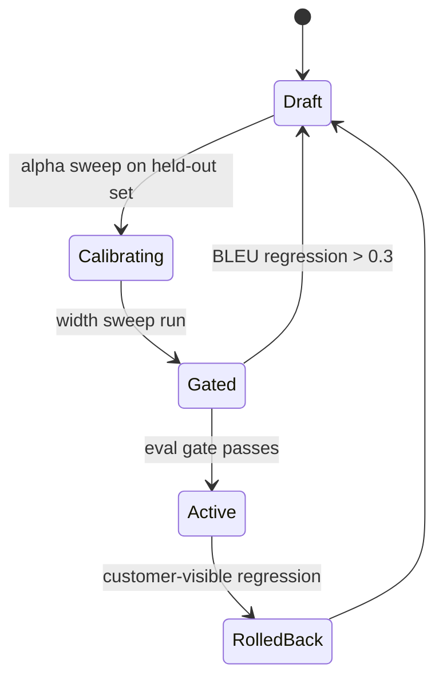

# LLD: Beam, A* and Best-First Search

> `T02` · **Transcript coverage:** primary · [HLD](HLD.md) · [Sequences](docs/SEQUENCES.md) · [Case study](../../01-case-studies/T02-search-decoding.md) · [Cheat sheet](../../00-cheat-sheets/T02-search-decoding.md)

Provenance: `[T]` transcript, `[R]` repo/reference, `[D]` derivation by this author with assumptions shown.

## 1. Module Map



The dependency arrow that matters: **all four modes point at `queue.py` and none point at each
other.** `modes/` contains configuration and termination rules, not search logic. If a mode ever
needs its own expansion loop, the unification has been lost and the design's central claim has
become false.

`heuristics.py` is imported by `bounded_astar.py` only. The open-ended modes are constructed so that
they *cannot* accept a heuristic — the parameter is absent from their signature rather than
defaulted to zero, which makes "we accidentally shipped A\* over an open decoder" a type error
rather than a runtime surprise.

## 2. Core Data Structures

```python
# Illustrative shapes, not code to run.

@dataclass(frozen=True)
class Hypothesis:
    path: tuple[int, ...]      # token ids, EOS terminal
    g: float                   # accumulated cost = -sum(log p), LOWER IS BETTER
    h: float = 0.0             # heuristic estimate of remaining cost
    state: int = 0             # automaton state (bounded mode) or last token
    # f = g + h is derived, never stored -- storing it invites drift

@dataclass(frozen=True)
class SearchConfig:
    mode: Literal["greedy", "beam", "diverse", "bounded"]
    K: int                     # beam constraint; 1 for greedy
    alpha: float               # length-penalty exponent
    max_len: int
    recombine: Literal["none", "ngram", "kl"]
    recombine_n: int = 3
    groups: int = 1            # diverse mode only
    diversity_penalty: float = 0.0

@dataclass
class SearchResult:
    best: Hypothesis
    candidates: list[Hypothesis]   # NOT just the best -- the reranker needs these
    expansions: int
    optimality_guaranteed: bool    # True only when h == 0 or h is proven admissible
```

Three deliberate choices.

**Cost, not score.** Internally everything is `-log p`, so "better" means "smaller" and costs add.
The lecture uses both weight systems and notes the switch is for convenience — probability combines
by multiplication and selects by argmax, log-probability combines by addition and supports
"shortest path searches" `[T]`. Mixing them is the single most common source of sign errors in a
search implementation, so the boundary is enforced by using cost everywhere inside `search/` and
converting only at the API edge.

**`optimality_guaranteed` is a field, not a comment.** It is `True` only when the heuristic is
identically zero, or when the caller supplies an admissibility proof token. This exists because
inadmissibility costs you the guarantee silently: "you might deviate from the optimal solution.
You're not guaranteed to deviate… but you might" `[T]`.

**`candidates` is returned, not discarded.** The reranker ([T05](../T05-verifiers-best-of-n/HLD.md))
and the diversity deduplicator both need the set, not the argmax.

## 3. Interfaces & Contracts

### 3.1 `search(config: SearchConfig, model, constraint=None) -> SearchResult`

Preconditions: `config.K >= 1`; `config.mode == "bounded"` requires a non-`None` `constraint`;
`config.alpha` is in the calibrated range for the target language.

Postconditions: the returned `best.path` terminates in EOS or has length `max_len`; `candidates` is
sorted by the *same* normalised score used during pruning; `optimality_guaranteed` is honest.

The normaliser reuse is a real contract, not a nicety. The lecture's termination rule rescored the
final beams "usually still using this length normalization method" `[T]`.

### 3.2 `compare(a: Hypothesis, b: Hypothesis, order: Comparator) -> int`

Two comparators, and the lecture defines both explicitly. Beam search "always prioritizes things
that are shorter… and then… if the output is the same length it prioritizes based on score";
best-first "always prioritizes based on score. Uh but if the score is the same then it prioritizes
based on length" `[T]`. Both are total orders, and both are used in production — the first in beam
mode, the second in the boundedly-branching settings.

### 3.3 `recombine(hypotheses, criterion, n) -> dict[ClusterKey, Hypothesis]`

Returns the surviving representative per cluster — "keep the best of each for each cluster" `[T]`.
Must be deterministic: the representative is the minimum by `(cost, path)` so ties break on token
ids rather than on iteration order.

### 3.4 `heuristic(state, steps_remaining) -> float` (bounded mode only)

Contract: for all reachable `state`, `heuristic(state, r) <= true_min_remaining_cost(state, r)`.
The row-minimum construction satisfies this by taking "the minimum arc weight in each row of the
graph" `[T]` and multiplying by the remaining steps. Any implementation that multiplies by a factor
greater than one, or that computes the row minimum over a *subset* of the row (for example,
excluding EOS on an open-ended decoder) violates the contract.

### 3.5 `replay(request_id, policy_version) -> SearchResult`

Returns the identical output at the identical stack version. Cross-version replay is not offered
(see [T01](../T01-sampling-decoding/LLD.md) for the GPU non-determinism argument).

## 4. State Machines

**Decoder state machine** — per request.



The `Degraded` transition exists because the priority queue is host memory. Best-first beam search's
own preconditions give the mitigation: scores can only decrease when extended, so hypotheses that
cannot survive the beam can be pruned early, and a completed hypothesis permits early termination.

**Policy state machine** — per language.



## 5. Algorithms

**The unified step.** Everything in `modes/` reduces to this:

```
pop the best hypothesis by comparator
if it is terminal: record it, and in best-first mode stop
expand: for each allowed next token (or automaton arc)
    child.g = parent.g + cost(parent.state, token)
    child.h = heuristic(child.state, remaining)     # 0 in open-ended modes
    push child with f = child.g + child.h
recombine if enabled
while |live| > K: drop the worst by normalised score
```

**Length normalisation.** `score = g / len^alpha` when `alpha > 0`; raw `g` when `alpha == 0`. The
lecture's own description of the HuggingFace variant is division by `|Y|^alpha`, and it is explicit
that "you can set this to be zero if you want no normalization at all" `[T]`. Our calibration
produces a per-language alpha and caps the range; the justification for capping is the observation
that a very aggressive alpha "explod[es]" and inverts the preference toward short sequences `[T]`.
There is no alpha that makes all lengths comparable — "I can't think of anything that would
guarantee" `[T]` — and the code says so in a comment rather than implying a correct value exists.

**Recombination.** n-gram: key is the last `n` tokens, `n = 3` for prose. KL: compute the next-token
distribution per hypothesis, take pairwise KL, merge under a threshold. Cost is `O(K²)` per step —
at beam 16 that is the 16×16 matrix the lecture describes `[T]` — which is why it is enabled only on
the bounded path where `K` is small. The compared object is the distribution, never the hidden
state: "similarity in neural representations is not the correct term here" `[T]`.

**Diverse beam.** Partition the beam into `g` groups; expand group `i` with a penalty against tokens
already chosen at the same time step by groups `< i`; prune within the group. The efficiency result
is that groups are staggered rather than serialised, so the cost is "t plus g minus one" steps
rather than `g × t` `[T]`. The penalty we use is the cumulative form — "penalizing only if you're
using the same token at the same time step" `[T]` — rather than raw Hamming, whose objection is that
it penalises "the" regardless of position.

**What the implementation deliberately does not do.** It does not implement stochastic beam search's
Gumbel correction, and it does not implement a learned future cost. Both are documented as rejected
or deferred rather than omitted. The Gumbel form is rejected because the correction step is easy to
get wrong in a way that silently reverts the algorithm to top-K selection — the noised log-prob must
be carried forward but capped so that "the modified log props are never going to be higher than the
log props of the node we sampled from" `[T]` — and a silent reversion to top-K is worse than not
having the feature. Future cost is deferred because its discount dial has an admissible end that is
pointless and a useful end that is unsafe, and we have no evidence yet on where on that dial our
workload sits.

## 6. Concurrency & Locking

The decoder is single-threaded per request. The shared state is:

| Shared object | Access | Discipline |
|---|---|---|
| Policy bundle | read-mostly | Immutable; swapped by pointer; readers never block |
| alpha table | read-mostly | Same |
| KV pool | concurrent | Owned by the engine, not the decoder ([T07](../T07-kv-cache/HLD.md)) |
| Replay journal | append-only | Per-request partition; no cross-request ordering |

The only lock the decoder takes is on the KV block allocator, and it takes it once per expansion
batch rather than once per hypothesis. A beam at width 4 forks four sequences, and allocating blocks
per hypothesis would turn a quality knob into an allocator contention source.

**Determinism.** Within a pinned stack, a beam output is reproducible because the queue's tie-break
is the token-id tuple, which is a total order. Without that, ties resolve by heap insertion order
and replay diverges at the first tie. This is the same class of bug as the GPU reduction-order
non-determinism in [T01](../T01-sampling-decoding/LLD.md), but it is ours to fix.

## 7. Error Handling

| Condition | Detection | Response |
|---|---|---|
| Empty candidate set | All beams pruned | Return `max_len` best partial; flag `partial=True`; alert |
| Grammar compile failure | Glossary service error | Route to plain beam; do not silently drop the glossary |
| Heuristic contract violated | Overestimate counter in bounded mode | Disable `h` for that grammar; log the state |
| Queue depth over threshold | Depth metric | Degrade per HLD §9 step 1 |
| Recombination merges distinct readings | Glossary-term retention eval | Lower `n`; switch to KL; disable for that grammar |
| Alpha out of calibrated range | Config validation at load | Refuse the bundle; keep the previous version active |
| EOS never emitted | Length cap reached on every beam | Emit; count it — a model that will not stop is a model problem |

The empty-candidate case deserves a note because it is reachable in bounded mode. If the automaton
and the beam constraint together leave no live hypothesis, there is no valid output, and the honest
response is a flagged partial rather than an empty string.

## 8. Resource Accounting

Per request, with `K` the beam width, `L` the output length, `V` the vocabulary, `S` the automaton
state count (bounded mode):

| Resource | Cost | Note |
|---|---|---|
| Expansions | `O(K · V · L)` open-ended | `K²` candidates per step before pruning |
| Expansions | `O(K · A · L)` bounded | `A` = automaton out-degree; the automaton prunes the branching factor |
| Recombination | `O(K²)` per step (KL), `O(K)` (n-gram) | The 16×16 matrix at beam 16 `[T]` |
| KV | `K` forked sequences | Worst case; recombination reduces it |
| Queue memory | `O(K · L)` hypotheses | **Host** memory, not GPU |
| Wall clock | sublinear in `K` at low occupancy | §10 of the HLD |

The queue is the one to watch. It is the only resource here that grows with the *search* rather than
the *request*, and it is on the wrong side of the PCIe bus from the KV pool.

## 9. Configuration Surface

| Key | Type | Default | Notes |
|---|---|---|---|
| `mode` | enum | `beam` | `greedy` / `beam` / `diverse` / `bounded` |
| `K` | int | 4 | Per class; capped by length |
| `alpha` | float | per language | Calibrated, range-capped, versioned |
| `max_len` | int | 512 | Also the truncation for degenerate EOS |
| `recombine` | enum | `ngram` | `none` / `ngram` / `kl` |
| `recombine_n` | int | 3 | Prose default |
| `groups` | int | 3 | Diverse only |
| `diversity_penalty` | float | 0.5 | Diverse only |
| `early_stop` | bool | true | All-EOS termination |
| `heuristic` | enum | `row_min` | Bounded only; `none` means uniform-cost |

## 10. Observability Hooks

| Metric | Type | Purpose |
|---|---|---|
| `search.expansions` | histogram | Per mode and `K`; the search cost |
| `search.queue_depth` | gauge | Early warning for the degrade transition |
| `search.pruned_by_recombination` | counter | Is recombination earning its keep |
| `search.optimality_guaranteed` | counter | Should be 100% outside bounded mode |
| `search.heuristic_overestimates` | counter | Should be 0; nonzero means the contract broke |
| `search.length_histogram` | histogram | Per language; the alpha drift signal |
| `search.width_vs_bleu` | offline artifact | Per release; the curse-of-beam-search test |
| `search.partial_outputs` | counter | Degenerate EOS or empty candidates |

Two of these are release gates rather than dashboards. `search.heuristic_overestimates` must be zero
— a nonzero value means an inadmissible heuristic is live and optimality is no longer guaranteed.
`search.width_vs_bleu` is a maintained curve, because the curse of beam search is diagnosed by
comparing widths and cannot be seen from production traffic alone.

## 11. Test Strategy

| Layer | What it asserts |
|---|---|
| Unit — normaliser | `alpha = 0` returns raw cost; `alpha = 1` divides by length; a longer candidate can win after normalisation |
| Unit — comparator | Both lecture comparators are total orders; ties break deterministically |
| Unit — recombine | n-gram and KL agree on identical inputs; the representative is the cluster minimum |
| Property — cost monotonicity | A child's `g` is never less than its parent's; the precondition of early termination `[T]` |
| Property — heuristic admissibility | Sweep all automaton states and all remaining lengths; assert `h <= true_remaining` |
| Integration — one queue | Greedy, beam, uniform-cost and bounded A\* produce the documented results on a fixture graph |
| Integration — bounded vs open | The row-minimum heuristic finds the optimum in bounded mode and a *worse* answer in open-ended mode |
| Regression — width sweep | Width 2/4/8 × 31 languages; BLEU recorded per width as a release artifact |
| Chaos — queue bound | Inject a graph that maximises frontier; assert the degrade path emits a partial and exits |

The seventh row is the one that matters most and is the one most likely to be skipped. The claim
"no admissible heuristic exists over an open-ended decoder" is testable in both directions — the
heuristic must work where it is legal and fail where it is not — and a test that only checks the
legal case would pass while the design's central scope restriction was silently violated.

## Sources

- `refs/CMU_Inference_Algorithms_for_Language_Modeling_Fall_2025_transcripts/CMU_LLM_Inference_5_A_and_Best_First_Search.txt` — the two queue disciplines and their comparators; `f = g + h`; the row-minimum heuristic and its admissibility; the toy-graph step counts; the overestimate failure and "you might deviate"; recombination by n-gram and by distribution distance; the 16×16 KL matrix; best-first beam search's preconditions.
- `refs/CMU_Inference_Algorithms_for_Language_Modeling_Fall_2025_transcripts_2/CMU_LLM_Inference_4_Beam_Search_and_Variants.txt` — the `|Y|^alpha` length penalty and the alpha discussion; the EOS unfairness; diverse beam search's cumulative penalty and `t + g − 1`; the Hamming-diversity objection; the Gumbel correction and why the cap is needed; the `K²` expansion and EOS-beam non-expansion.
- `refs/CMU_Inference_Algorithms_for_Language_Modeling_Fall_2025_transcripts/CMU_LLM_Inference_6_Other_Controlled_Generation_Methods.txt` — finite-state constraints as masking, the boundary the bounded mode consumes.
- `refs/CMU_Inference_Algorithms_for_Language_Modeling_Fall_2025_transcripts_2/CMU_LLM_Inference_2_Probability_Review_and_Code_Examples.txt` — numerical stability of log-probability accumulation.
- `refs/ai-system-design-guide-main/ai-system-design-guide-main/16-case-studies/01-enterprise-rag.md` — house style reference.
