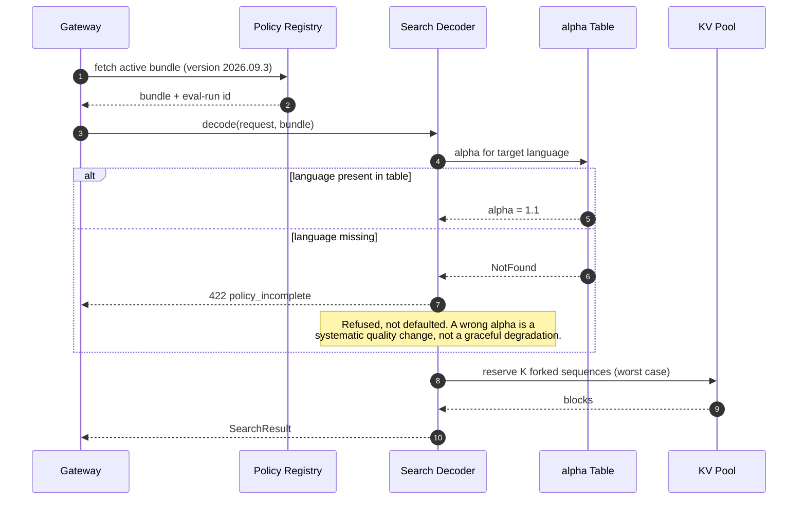
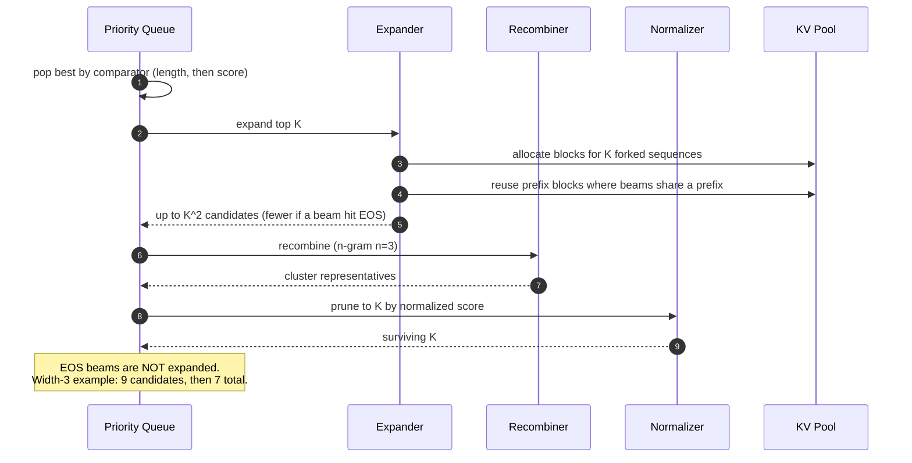
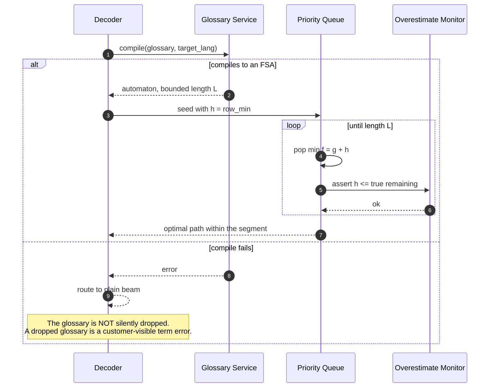
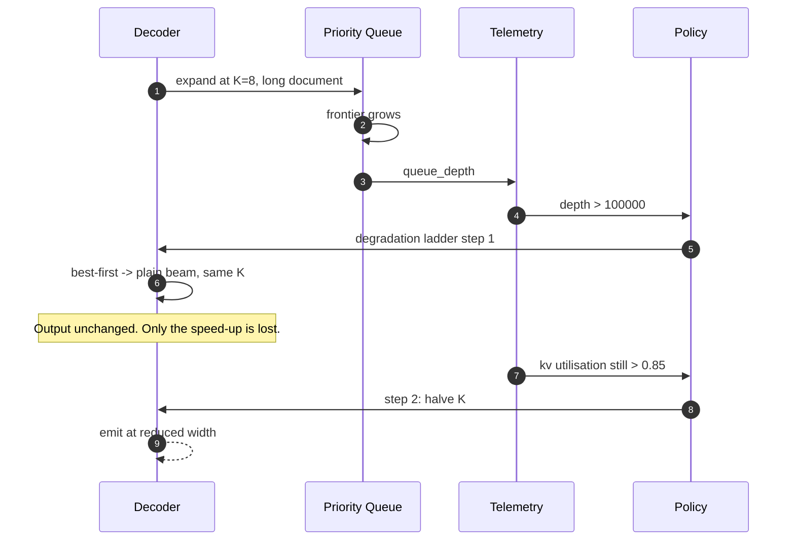
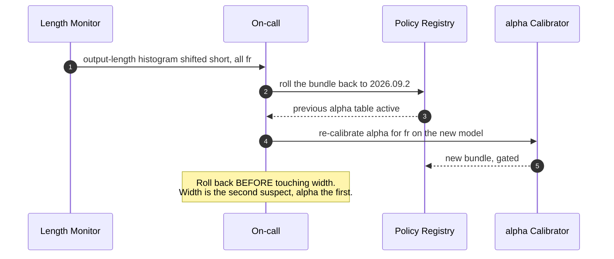
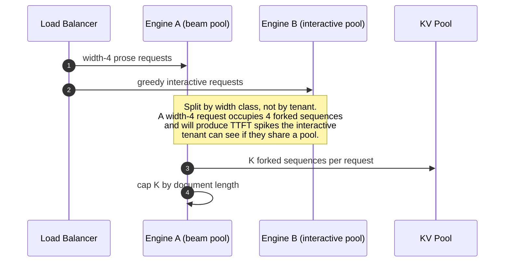
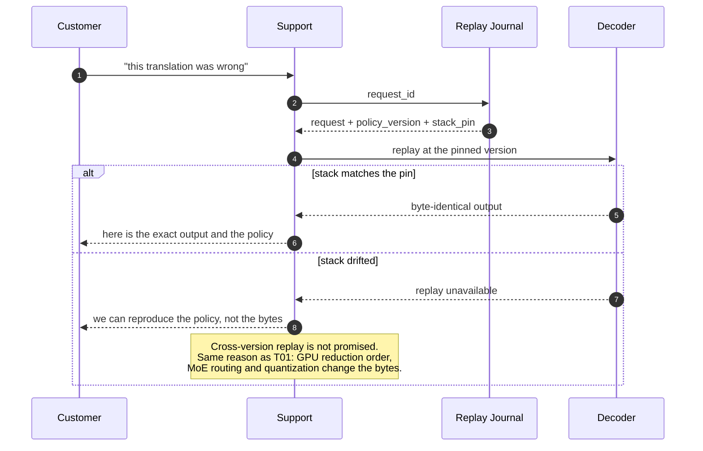

# Sequences: Beam, A* and Best-First Search

> `T02` · [HLD](../HLD.md) · [LLD](../LLD.md) · [Case study](../../../01-case-studies/T02-search-decoding.md)
> **Transcript coverage:** primary · [Cheat sheet](../../../00-cheat-sheets/T02-search-decoding.md) · [Interview bank](../../../02-interview-questions/T02-search-decoding.md) · [Runnable core](../run.py)

End-to-end flows for the search-decoding plane. Each step names where it can fail; the failure
taxonomy is in [LLD §7](../LLD.md#7-error-handling).

---

## 1. Cold start — first request after a policy release



**Failure point:** a bundle that loads without a gate id. The registry rejects it at load; a bundle
without a gate is a policy nobody evaluated.

---

## 2. Steady state — one beam step



**Failure point:** the normaliser used at prune time differing from the one used at final rescore.
That is a silent objective change at the last moment and it is the mechanism behind "width up, BLEU
down."

---

## 3. The curse of beam search — width raised, BLEU falls

```mermaid
sequenceDiagram
    autonumber
    participant ENG as Search Engineer
    participant SWEEP as Width Sweep
    participant NORM as alpha Calibrator
    participant GATE as Eval Gate
    participant HUMAN as Human Review

    ENG->>SWEEP: run widths 1,2,4,8 over held-out set
    SWEEP-->>ENG: BLEU curve rising to 4, falling at 8
    ENG->>NORM: re-tune alpha first
    NORM-->>SWEEP: re-run the sweep at the new alpha
    alt degradation removed
        SWEEP-->>GATE: BLEU monotone in width
        GATE-->>ENG: ship
    else degradation persists
        Note over GATE: The objective is wrong, not the search.
        GATE->>HUMAN: sample 500 outputs, compare to metric
        HUMAN-->>ENG: metric and judgement diverge
        ENG->>GATE: REFUSE the release; escalate to reranker (T05)
    end
```

The order is prescribed: tune length normalisation first, and only then conclude the objective is at
fault. Both branches are legitimate outcomes and the second one is not a failure of the search design.

---

## 4. Bounded A\* on a glossary segment



**Failure point:** applying the same row-minimum heuristic one line over, on the open-ended decoder.
There EOS is available and can be cheaper than the state's cheapest non-EOS arc, so the row minimum
overestimates and the guarantee is void. The monitor exists to make that a counted event, and the
`InadmissibleHeuristicLive` alert is a page.

---

## 5. Failure — best-first queue blow-up



Step 1 is chosen first because it is the only rung that loses *nothing* — best-first beam search
returns identical results to plain beam by construction, so the first response to pressure is to
give up the speed-up rather than the quality.

---

## 6. Recovery — a bad alpha after a model upgrade



---

## 7. Scale-out

Horizontal scale is unremarkable — the decoder is stateless and the engine scales out. The
interesting axis is vertical, and it is the reason `K` is a function of work rather than a constant:



---

## 8. Replay for a contract dispute



## Sources

- `refs/CMU_Inference_Algorithms_for_Language_Modeling_Fall_2025_transcripts/CMU_LLM_Inference_5_A_and_Best_First_Search.txt` — weighted finite-state automata; `f = g + h`; the greedy/beam/uniform-cost/A\* step counts; admissibility as sufficient but not necessary; row-minimum heuristics; hypothesis recombination; the 16x16 KL matrix
- `refs/CMU_Inference_Algorithms_for_Language_Modeling_Fall_2025_transcripts_2/CMU_LLM_Inference_4_Beam_Search_and_Variants.txt` — beam mechanics; log-probs for numerical stability; EOS unfairness and the HuggingFace length penalty; diverse beam search; stochastic beam search and the Gumbel-max trick
- `refs/CMU_Inference_Algorithms_for_Language_Modeling_Fall_2025_transcripts/CMU_LLM_Inference_12_Reward_Models_and_Best-of-N.txt` — the reranker route taken when the objective rather than the search is wrong
- `refs/LLMOps_Agentic_AIOps_The_Hands-On_Playlist_2026_transcripts/Cut_LLM_Cost_Latency_KV_Cache_Batching_Quantization_vLLM.txt` — decode is memory-bandwidth-bound; the occupancy argument

**All sequence structure is `[D]`.** Corpus facts (`[T]`) are attributed inline; the failure taxonomy
is in [LLD §7](../LLD.md#7-error-handling).
