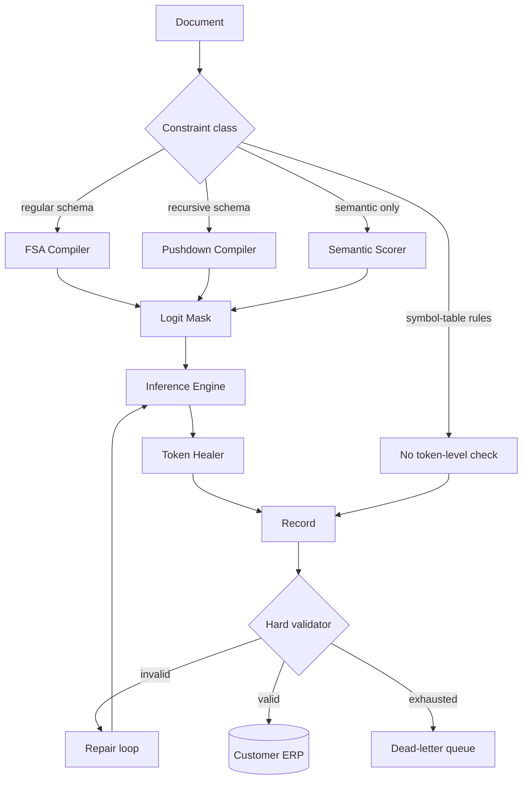
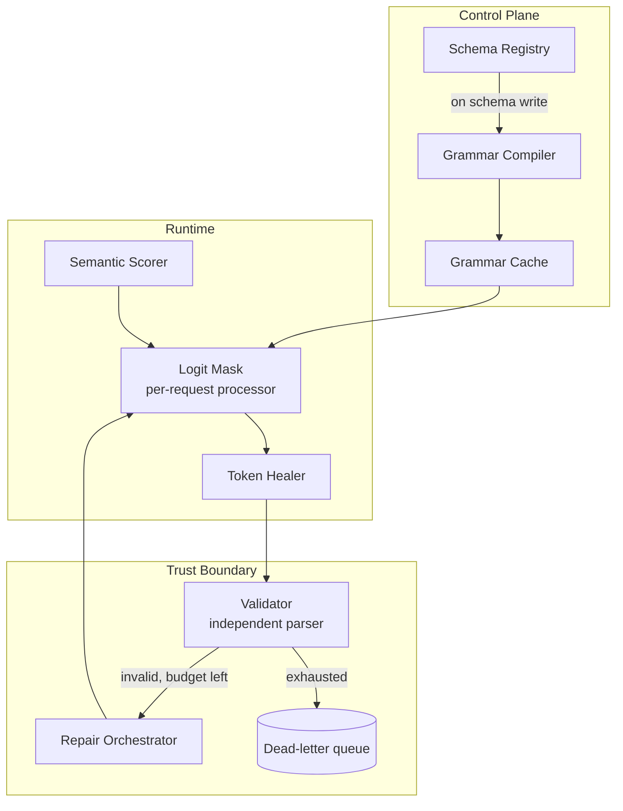

# HLD: Constrained Generation

> `T03` · **Transcript coverage:** primary · [LLD](LLD.md) · [Sequences](docs/SEQUENCES.md) · [Case study](../../01-case-studies/T03-constrained-generation.md) · [Cheat sheet](../../00-cheat-sheets/T03-constrained-generation.md)

Provenance: `[T]` transcript, `[R]` repo/reference, `[D]` derivation by this author with assumptions shown.

## 1. Problem & Scope

Design the **structure-enforcement plane** for regulated document intake. Ledgerline ingests
financial documents — invoices, purchase orders, remittance advices, customs declarations — and
emits records into customer ERP systems. 5M documents a month, 240 customer-specific schemas, and a
hard rule from the audit committee: **a record that does not validate against the customer's schema
must never reach the ERP**. Not "should rarely." Must never.

Three surfaces, one model:

| Surface | Output | Constraint class | Why it is hard |
|---|---|---|---|
| Invoice extraction | JSON per a per-customer schema | Regular for flat fields; nested line items | 240 schemas, some with fixed nesting, some recursive |
| Remittance matching | A short SQL predicate over a fixed table set | Needs symbol tables — "variables must be defined before they are used" `[T]` | Not expressible as a token-level check |
| Notes → structured codes | A closed code from a 900-entry list | Regular | The model must pick the *semantically* right code, not merely a valid one |

**In scope:** the constraint taxonomy and the router that applies it; schema compilation to an
automaton; the per-step logit mask; token healing at template boundaries; the semantic scorer; the
hard validator at the ERP boundary and its repair loop.

**Out of scope:** the search machinery that handles end-verifiable constraints
([T02](../T02-search-decoding/HLD.md)); the scheduler that must keep per-request grammar state
straight under continuous batching ([T08](../T08-batching-scheduling/HLD.md)); the KV cache the
masking engine shares ([T07](../T07-kv-cache/HLD.md)); the guardrail layer that defends against
adversarial document content ([T18](../T18-guardrails-security/HLD.md)).

**Explicit non-goals.**

- **We do not fine-tune to enforce structure.** The lecture's framing is decisive for a 240-schema
  estate: "if you wanted to change hello to bonjour for a week… would you want to retrain your model
  entirely to do that?" `[T]`. Training pays off for broadly applicable constraints; templatic
  constraints belong at inference time.
- **We do not use hard token-level masking for semantic constraints.** Three failure modes —
  synonyms, senses, presupposition — and the "rock"→"climbing" case is common in our corpus.
- **We do not promise that a valid record is a correct record.** The mask guarantees *syntax*;
  correctness needs the validator plus domain checks. That distinction is the audit conversation.
- **We do not attempt arbitrary nesting without a stack.** Anything needing more than one stack gets
  neither the mask nor the validator `[T]`.

## 2. Requirements

### Functional

| Requirement | Priority | Notes |
|---|---|---|
| Schema-valid JSON, guaranteed, per customer schema | P0 | Audit requirement; "must never" |
| Nested and recursive line-item structures | P0 | Needs a pushdown automaton, not an FSA `[T]` |
| Schema registry with versioned validation and a compile step | P0 | 240 schemas, changing weekly |
| Token healing at template boundaries | P1 | The unnatural-boundary problem `[T]` |
| A semantic constraint — no product code from the retirement group (an illustrative constraint of this design, **not** a transcript quote) | P1 | Not regex-expressible; needs FUDGE-class scoring `[T]` |
| Post-generation validation with a bounded repair loop | P0 | The belt to the mask's braces |

### Non-functional

| Requirement | Target | Rationale |
|---|---|---|
| Schema-validity rate at the ERP boundary | 100.00% of emitted records | Validation is a hard gate, not a metric |
| Validity at the *first* model attempt | ≥ 99.5% | Repair loops cost tokens and latency |
| Added per-token latency from masking | < 3% of a decode step | Runs on every token |
| Schema compile time | < 2 s | Weekly schema churn |
| Masked-vocabulary size at a typical step | a handful of tokens | `[T]` "over 100,000 choices but only like maybe 10 of them that will give us valid JSON" |
| P95 extraction latency, 12-page document | < 9 s | Downstream batch window |
| Semantic-violation rate on the code surface | < 0.5%, with no fine-tuning | The FUDGE-class budget |

### Constraints

- **The mask runs on every token of every request.** Its cost is per-step, not per-request; an
  implementation that evaluates a regex per step is unusable.
- **Grammar state is per request.** Under continuous batching two requests with different schemas
  share a batch and their masks must not collide — the concurrency hazard of masking in a
  paged-attention engine.
- **We need logit access.** FUDGE-class methods "require access to logits," ruling out third-party
  APIs `[T]`.
- **The validator must not import the compiler.** Separate systems, separate failure modes; shared
  code would let a stale-grammar bug hide.

## 3. System Context (C4 L1)

A document is classified by **constraint class, not by customer**. The compiler turns the schema
into either a DFA (flat, bounded nesting) or a pushdown automaton (recursive). Both drive the same
per-step mask: a vector of `-inf` on illegal transitions, added to the logits before softmax. Token
healing sits between engine and output because the mask makes token boundaries unnatural. The
validator is the only component that can write to the ERP, and it runs at a different trust level
from the model.

**The architectural claim: the mask and the validator are not redundant.** The mask guarantees the
output is in the *language*; the validator guarantees it is in the *schema version currently in
force*. If a schema is updated and a cached mask is stale, only the validator catches it.

## 4. Container View (C4 L2)

- **Grammar Compiler** — runs on schema *write*, never on read. The artifact is content-addressed and
  versioned alongside the schema, so a request binds a grammar version the way it binds a policy
  version.
- **Logit Mask** — a per-request logit processor; state is a DFA state (or PDA stack) per sequence.
- **Token Healer** — triggered heuristically, not always.
- **Semantic Scorer** — the FUDGE-class discriminator over a truncated candidate set.
- **Validator** — a separate process with its own schema source. It is the release mechanism.
- **Dead-letter queue** — human review. A record here means the schema or template is wrong, not the
  model.

## 5. Component View (C4 L3) — the constraint taxonomy drives the architecture

The lecture separates **syntactic constraints** — "constraints that are very easy to write down as
sort of a list of allowable or unallowable tokens" — from **semantic constraints**, "a little bit
harder to define in that way"; both are checkable by "some deterministic function… at the end of
generation" `[T]`. The second axis is the one that determines the architecture:

- **Token-wise verifiable** — "every token needs to start with a space," "everything I am writing
  needs to be for instance valid JSON," everything in Chinese `[T]`.
- **End-verifiable only** — "the output must be exactly 10 tokens long" `[T]`.

**Token-wise-verifiable constraints get a mask; end-verifiable constraints get a search or a
filter.** The NeuroLogic-A\*-flavoured example is end-verifiable: "write a sentence with these
concepts car drive and snow." The walkthrough — prefix "I drive my car during the," where "summer" is
high-probability but makes "snow" hard while "winter" is slightly lower probability but likelier to
satisfy the constraint — is a *search* problem, not a masking problem. That is the router's first
branch; the search side is [T02](../T02-search-decoding/HLD.md).

**Schema → automaton → mask.** The lecture builds the JSON case on
`{"name": "Taylor Swift", "birth year": 1989}`, credited to "my friend Matt at USC": "we're going to
represent this schema as a state machine that kind of tracks our progress through the generation"
`[T]`. State 0's only legal token is the opening brace; state 1 offers the two keys; inside `name`
only letters are legal, implemented as a regex per field; inside `birth year` only digits, then a
comma, then optionally the other key. The accept state is a second concentric circle.

**The masking mechanism, verbatim:** "you just sort of set the probabilities to everything that
isn't a valid transition in this graph to be like arbitrarily low. Um, and you do that by adding
like a large negative right before softmax" `[T]`. Formally: "all the things that are allowed as the
next token are zero, all the things that are not allowed to the next token we add minus infinity and
then we take the softmax again to renormalize" `[T]`. The states compile "down into a pretty like
efficient just like check against a list and mask out the logits" `[T]`.

**Sparsity is why this works.** "this is a really narrow constraint at any individual
decoding step. We have over 100,000 choices but only like maybe 10 of them that will give us valid
JSON at the end" `[T]`. A 10-of-100,000 candidate set is not something a prompt reliably produces; a
mask makes it structural. The lecture's endorsement is unguarded: "I would be surprised if they were
doing something different. Um because this is like an exact solution to the problem" `[T]`.

**The defects a hand-drawn FSA has.** The lecture has the class attack its own example, and the list
is a real compiler's bug list `[T]`: no length limit; repetitive keys; the year can be omitted
entirely; no constraint that it is one number rather than a thousand; "a name… can't have any spaces
in it"; and — decisively — **no nested JSON: "we cannot do that in this type of construction at
all."** The proposed fix is separate states for "name but no birthday" and "birthday but no name,"
which is the automaton growing with the number of *combinations*. That is why flat automata do not
scale to recursive schemas.

**The theory-of-computation hierarchy, in the terms the lecture uses.**

| Class | Machine | Example given |
|---|---|---|
| Regular | Finite automaton — "doesn't have any way of keeping track of how many times it's been in a state before" `[T]` | "any number as 0 to 9 possibly infinite amounts" `[T]` |
| Context-free | Pushdown automaton — "a stack of prior values" `[T]` | "match numbers of a's and b's or match numbers of parentheses… or json max numbers of curly braces" `[T]` |
| Turing machine | Multiple stacks or a tape — "a strictly more expressive thing than a context-free language" `[T]` | "uniqueness of keys," "variables must be defined before they are used" `[T]` — our remittance SQL surface |

Fixed nesting stays regular: "you can define like a really long automa that captures like exactly
every level of nesting by just defining a set of different states… this is the state for brackets
nested five times versus six versus seven" `[T]` — what our flat schemas use, and it explodes
combinatorially.

**The claim the design turns on:** "in general, anything that supports uh JSON schemas is actually
writing push down automa to enforce its constraints, not FSAs" `[T]`. Build the FSA version and call
it a JSON-schema engine and you will be correct on flat schemas and silently wrong on recursive
ones. **And the honest limit:** rules needing more than one stack — key uniqueness,
define-before-use — are not enforceable "in this kind of like token by token um, checking way" `[T]`.
The lecture says "there's a whole broad world outside of these two things" without naming the
context-sensitive or decidable classes; the corpus does not give the full Chomsky hierarchy `[T]`.

**Token healing.** Templates produce "token boundaries that are quote unquote unnatural" `[T]`. The
example: unconstrained, the model emits "the URL is http slash" as one token, but the automaton path
emits a colon and then needs two slashes, and if pre-training "always tokenized this as this single
token dot slash in uh URLs… this could be a relatively difficult token to predict" `[T]`.
**Procedure:** "we'll roll back a token… and we'll just require that the next token starts with that
token that we would have predicted before… we'll eliminate everything that doesn't start with colon.
So colon is still a valid next token, but so is colon slash, which has a lot higher probability"
`[T]`. **Invariant:** the surface form is preserved — "we're not actually changing our output string.
We're just changing the tokens of the output to get there" `[T]`. **Triggers:** a curated offender
list (colon, space, slash); "when the last token is very short"; "when the last token doesn't start
or end with whitespace or punctuation"; "when the last token predicted was an exact prefix of another
likely token" `[T]`. **Why not always:** "it's just expensive. you have to go back and recompute"
`[T]`.

**Semantic constraints.** The target is sampling from `p(next token | history, constraint a)` where
the constraint is not regex-expressible. The rewrite: proportional to
`P(constraint satisfied | prefix so far) × P(token)` — "we're going to softmax everything anyway.
So, we don't care about sort of exact value" `[T]`. The discriminator is trained on *every prefix* of
each labelled document, so "starting with I would appreciate is almost always only seen in the formal
data" `[T]`. Decoding runs the LM, runs the discriminator on history + candidate, and multiplies. The
worked example is "do you want" vs "do you prefer" vs "do you thus" — "thus is a really low
probability output in general… but thus is a very formal like phrase and so it gets a high formality
score but a low overall score"; the winner is "do you prefer" because "want and prefer were
relatively even probability but prefer is more formal so it gets updated" `[T]`. What makes it
affordable: "they take the **top 200 most likely next tokens** um and you run on just those 200
instead of all 100,000 and some" `[T]`, with "a very small model" `[T]`. Limits: "this is not
guaranteed to satisfy the constraint" `[T]`, and it requires logit access.

**Where hard masking breaks.** Token-level hard masking is "a hardline approach" whose failure modes
for *semantic* constraints are three `[T]`: **synonyms** (banning "climbing" does not stop
"bouldering"); **senses** (banning a token kills its legitimate uses); **presupposition** (earlier
tokens presuppose the banned one, so banning it later yields "non-naturalistic or nonfluent
generation").

## 6. Data Flow

**Compile path.** Schema write → registry → compiler → content-addressed artifact → cache. The
compiler proves two properties before publishing: every reachable state has at least one legal token,
and every reachable state can still reach an accept state. Failing either is a build failure, not a
production incident.

**Request and repair path.** Document → class router → grammar lookup → per-step mask → decode →
healing → record → validator → ERP or repair. On rejection the orchestrator re-invokes with the
validation error appended and the same grammar, for a bounded 2 retries, then the dead-letter queue.
A non-converging repair loop means the schema and the template disagree, not that the model is weak.

## 7. Deployment Topology

Two trust levels, deliberately. The **runtime** (mask, healer, scorer) runs in-process in the engine
and is on the token path. The **validator** is an independent service with its own schema source,
deploy cadence, and no code shared with the compiler; the ERP is reachable only from it.

This is not defence in depth for its own sake. If the validator imported the compiler, a
stale-grammar bug would be invisible to both and the auditor's "must never" would rest on a single
implementation being correct. Two independent implementations of the same schema — one checking a
language, one checking a version — is what makes the guarantee auditable.

## 8. Scaling Strategy

| Component | Scales with | Strategy |
|---|---|---|
| Mask | vocabulary × concurrent sequences | A compiled transition table per state; no regex at runtime |
| Grammar cache | number of (schema, version) pairs | 240 schemas × weekly churn — thousands of small artifacts, cached at the engine |
| Validator | documents | Independently scalable; a parse per record is cheap next to generation |
| Semantic scorer | constrained steps × k | Batched over the truncated candidate set |

The binding resource is not compute but **grammar cache coherence**: with weekly schema churn the
risk is a window in which a request binds a grammar version the validator no longer agrees with. The
request carries its grammar version and the validator reads the current one; a mismatch is a
rejection, never a silent pass.

## 9. Failure Domains & Degradation

**The mask and the validator fail differently, and that is the point.**

| Failure | Which layer sees it |
|---|---|
| Stale compiled grammar | Validator only |
| Grammar forbids every high-probability token | Mask (survivors counter) |
| Recursive schema exceeds stack depth | Mask (depth counter) |
| Semantic error, structurally valid | Neither — the scorer, or human review |
| Token healing corrupts a value | Surface-form invariant test |
| Schema version skew | Validator only |

**Degradation ladder,** in order:

1. Semantic scorer → off (loses the policy constraint; structure unaffected).
2. Token healing → off (loses fluency at template boundaries; structure unaffected).
3. Repair budget 2 → 1 (more records to human review).
4. Mask → on, pinned to the *last known good* grammar version rather than the newest.
5. Never: mask → off. An unmasked run cannot honour the audit requirement; the correct response to
   that pressure is to shed load, not the guarantee.

The ordering trades semantic quality first, fluency second, and the structural guarantee never.

## 10. Capacity Model

All arithmetic here is mine; assumptions are shown.

| Input | Value | Basis |
|---|---|---|
| Documents per month | 5M | §1 |
| Output tokens per record | 400 | `[D]` |
| Greedy decode throughput, one replica | 1,800 tokens/s | `[D]` planning figure |
| Vocabulary | 128k | `[T]` |
| Valid tokens at a typical schema step | ~10 | `[T]` |
| Naive validity without masking | 92% | `[D]` assumption for the comparison |
| Masked validity at first attempt | 99.5% | §2 target |
| Retry cost | full regeneration of the record | `[D]` |

**Step 1 — masking is nearly free.** Each step builds an index over the legal set: the lecture's
"check against a list and mask out the logits" `[T]`. That is O(legal tokens) plus a masked softmax
over 128k entries — a vector operation against a decode step dominated by weight reads. The 3%
budget is generous; the real cost is *development*, not runtime.

**Step 2 — the retry economics are where masking pays.** At 92% naive validity with a retry budget of
2, `8%` of records exhaust to human review: `5M × 8% = 400k` a month. At `[D]` 45 seconds each,
`400,000 × 45 / 3600 ≈ 5,000` hours — **30 full-time reviewers**. That, not the GPU bill, is the cost
of not masking. At 99.5% masked validity, exhausted records are `25k`, about `312` hours, roughly 2
reviewers: a **16x reduction** in the human tier `[D]`.

**Step 3 — token healing is bounded by the trigger rate.** Healing rolls back one token and
recomputes: one extra forward pass over a short prefix, not a full regeneration. At a 2% trigger rate
`[D]` that is `400 × 0.02 = 8` extra passes against 400 — **2% overhead**. Healing every step would
be 100%, which is the situation the lecture's caveat describes `[T]`.

**Step 4 — the semantic scorer.** The discriminator runs over the top 200 candidates at each
constrained step `[T]`. If the constraint covers a 40-token span of a 400-token record, that is 40
extra batched passes over 200 short sequences — roughly **10% overhead** on that surface `[D]`.
Contrastive decoding is a flat **2x** `[T]`, so it is used only where the amateur is already
resident.

## 11. Key Design Decisions

| Decision | Chosen | Rejected | Revisit if |
|---|---|---|---|
| How to enforce structure | Logit masking against a compiled grammar, plus a hard validator | Prompting; per-schema fine-tuning | The engine ecosystem moves masking into a hosted API with the same guarantee |
| Which machine | FSA where it suffices, PDA for recursive schemas, post-hoc validation above context-free | FSA everywhere | A customer ships a uniqueness constraint the mask cannot see |
| Token healing | Heuristic-triggered | Always on; always off | A tokenizer change alters which boundaries are unnatural |
| Semantic mechanism | FUDGE-class scorer over top-k, plus sampled human review | Hard mask (fails on synonyms/senses/presupposition); contrastive (2x) | The amateur model becomes resident for other reasons |
| Mask vs validator authority | Validate everything, always | Trust the mask | Never for regulated output |
| Grammar compile timing | On schema write | On first read | Never — compile-on-read puts the latency on the request |
| Repair budget | 2 retries | Unbounded | Never — an unbounded loop hides a schema bug |

The one worth defending is **validate everything**. It looks redundant with the mask and is not: a
stale grammar, a tokenizer change, or a healing bug all produce silently invalid output the mask
cannot see by construction — §7 has the reasoning.

## 12. Build vs Buy

**Build** the grammar compiler, the mask, and the validator. The compiler is the differentiating
artifact and its correctness is what the audit rests on; decisively, the two properties it must prove
(no dead ends, accept reachable) are properties a general-purpose regex or JSON-schema library will
not assert for you. The mask is a transition-table lookup whose only real work is per-request state
under continuous batching. The validator is an independent parser, deliberately *not* a reuse of the
compiler — the whole value of the second check is that it is a second implementation.

**Reuse** the tokenizer, the engine's logit-processor interface, and its batching and KV machinery,
rather than building a constraint-specific path.

**Do not buy a constrained-decoding library and stop there.** Hosted "structured output" features are
useful and their guarantee is real, but they do not cover the recursive case, do not heal tokens to
our templates, and cannot answer the auditor's question about which schema version was in force.

## Sources

- `refs/CMU_Inference_Algorithms_for_Language_Modeling_Fall_2025_transcripts/CMU_LLM_Inference_6_Other_Controlled_Generation_Methods.txt` — the syntactic/semantic split and the token-wise/end-verifiable axis; the JSON schema-to-state-machine construction; the "add minus infinity before softmax" mechanism; the ~10-of-100,000 sparsity; the hand-drawn FSA's defect list and the nesting failure; the regular/context-free/Turing hierarchy and the "JSON schemas are pushdown automata" claim; token healing's procedure, invariant and triggers; FUDGE, the top-200 truncation and the worked "do you prefer" example; the three failure modes of hard masking; the "would you want to retrain your model entirely" framing.
- `refs/CMU_Inference_Algorithms_for_Language_Modeling_Fall_2025_transcripts_2/CMU_LLM_Inference_3_Common_Sampling_Methods.txt` — the 128k vocabulary and the long tail that make the legal set sparse.
- `refs/CMU_Inference_Algorithms_for_Language_Modeling_Fall_2025_transcripts/CMU_LLM_Inference_5_A_and_Best_First_Search.txt` — the search alternative for end-verifiable constraints, which is the router's other branch.
- `refs/CMU_Inference_Algorithms_for_Language_Modeling_Fall_2025_transcripts/CMU_LLM_Inference_7_Chain_of_Thought_and_Intermediate_Steps.txt` — the separate thinking channel used when the model wants to explain before emitting JSON.
- `refs/LLMOps_Agentic_AIOps_The_Hands-On_Playlist_2026_transcripts/Cut_LLM_Cost_Latency_KV_Cache_Batching_Quantization_vLLM.txt` — per-step logit-processor cost against a decode step's weight reads.
- `refs/ai-system-design-guide-main/ai-system-design-guide-main/16-case-studies/01-enterprise-rag.md` — house style reference.
