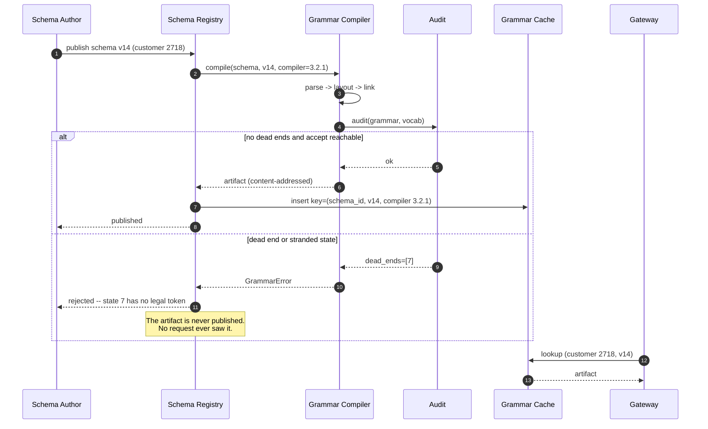
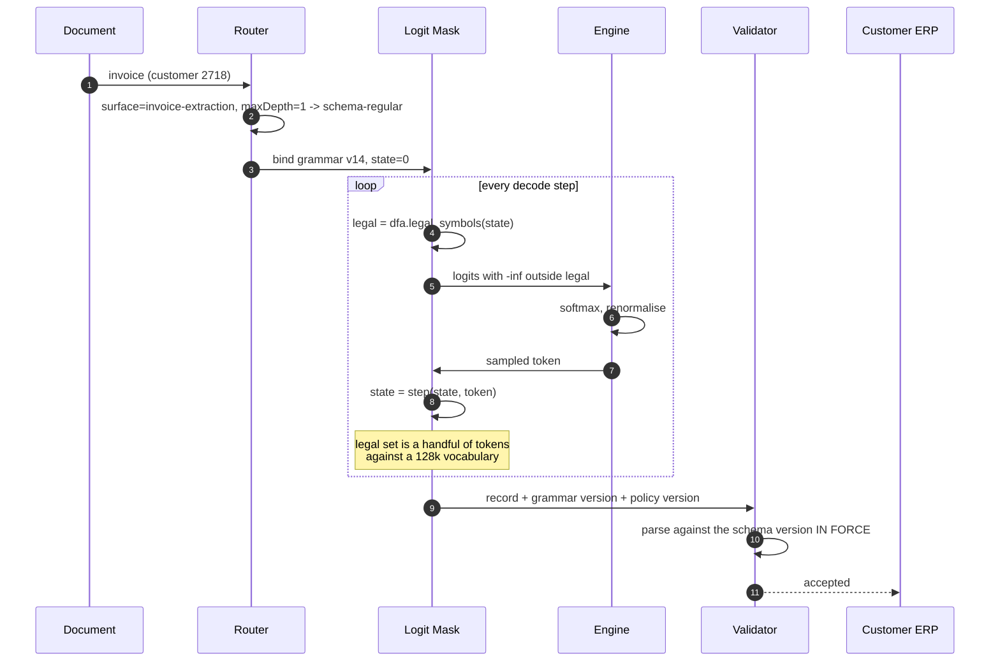
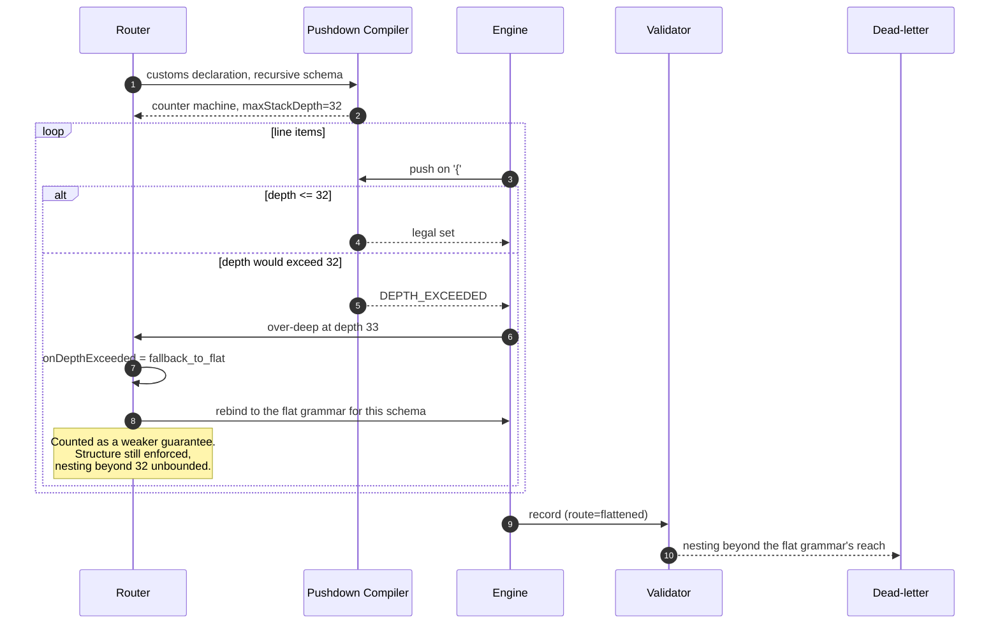
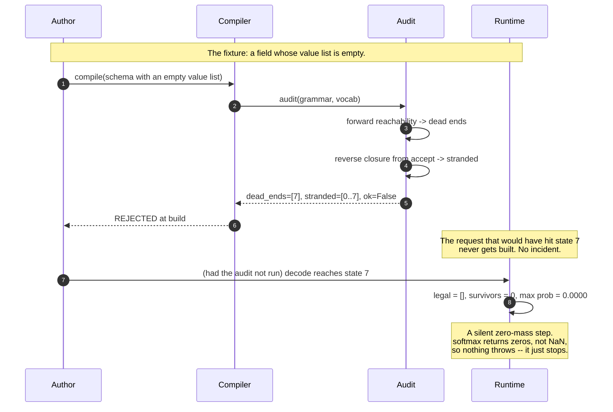
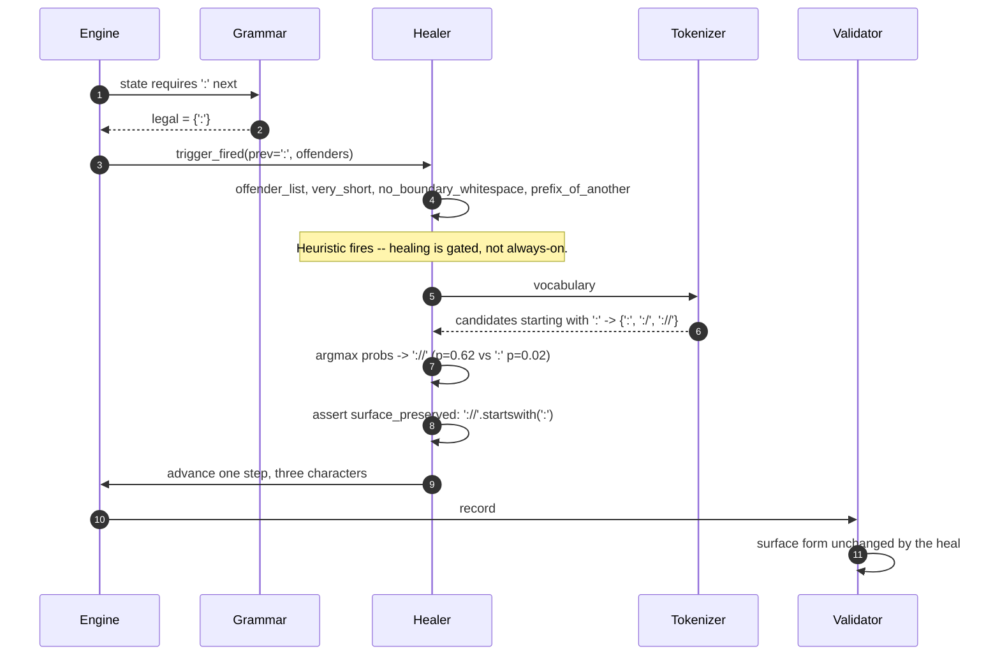
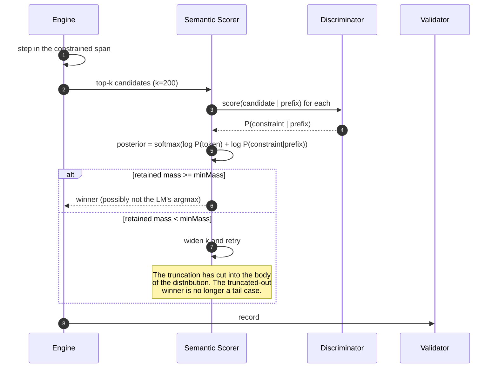
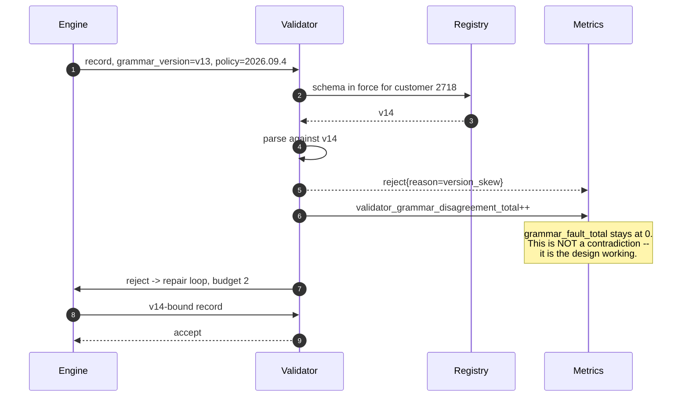
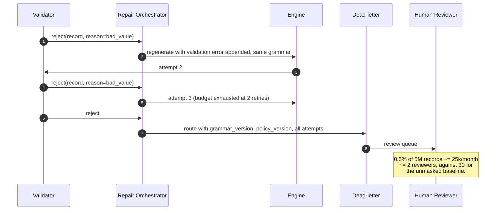

# Sequences: Constrained Generation

> `T03` · [HLD](../HLD.md) · [LLD](../LLD.md) · [Case study](../../../01-case-studies/T03-constrained-generation.md)
> **Transcript coverage:** primary · [Cheat sheet](../../../00-cheat-sheets/T03-constrained-generation.md) · [Interview bank](../../../02-interview-questions/T03-constrained-generation.md) · [Runnable core](../run.py)

End-to-end flows for the constraint plane. Each step names where it can fail; the failure taxonomy
is in [LLD §7](../LLD.md#7-error-handling), and the degradation ladder is in
[HLD §9](../HLD.md#9-failure-domains--degradation).

---

## 1. Cold start — first request after a schema publish

**Failure point:** a schema that compiles but fails the audit. `spec.audit.onFailure: reject_artifact`
is the only sane setting — publishing a grammar with a dead-end state means every request that
reaches that state produces a zero-mass step at runtime, which is a production incident instead of a
build failure. The `strict: false` switch exists so a schema author can compile a work-in-progress
locally; nothing non-strict is publishable.

**Second failure point:** the compiler version. The artifact's cache key includes it, so a compiler
bug fix invalidates every cached grammar rather than leaving stale artifacts serving traffic —
without it, a fix ships and nothing changes.

---

## 2. The normal path — masked extraction

**Failure point:** a step whose legal set is empty. `assertSurvivorsPerStep: true` turns it into a
counted `GRAMMAR_FAULT` and a page rather than a silent zero-mass sample. It should be unreachable in
a healthy system, which is exactly why it pages when it happens.

---

## 3. A recursive schema hits the depth cap

**Failure point:** the cap is checked at push time, not at overflow. Checking at overflow means the
stack has already grown past its bound before anything notices, which under paged attention is a
memory-growth path rather than an error path. `onDepthExceeded: fallback_to_flat` is a real
weakening — the flat grammar enforces the first 32 levels structurally and the rest not at all — so
the route is stamped on the record and the validator is the backstop.

---

## 4. Empty candidate set — compile-time catch against runtime symptom

**Failure point:** this is the sequence the whole audit exists to prevent. `softmax` returning zeros
for an all-`-inf` row is the right *arithmetic* contract — it stops one bad step poisoning a batch
with `NaN` — but it is the wrong *detection* contract, because a zero-mass step raises nothing. The
detection belongs at compile time, and the runtime assertion is the second net.

---

## 5. Token healing at a URL boundary

**Failure point:** building the candidate set from the masked legal set instead of from the full
vocabulary. The mask's legal set is `{':'}` — every multi-character token was already excluded — so
healing that starts there is a no-op that still costs a recompute. The candidates must be re-derived
from the prefix over the whole vocabulary.

**Second failure point:** `changed == False`. The argmax of the healed set is sometimes the token the
mask would have picked anyway. That is one wasted forward pass, and the ratio of
`healing_changed_total` to `healing_trigger_total` is the measurement that decides whether the
trigger list is earning its cost.

---

## 6. A semantic constraint on the code surface

**Failure point:** the truncation blind spot, which is not a bug and cannot be fixed. A candidate the
constraint would prefer but the language model ranked below `k` is unreachable, by construction —
that is what makes the method affordable. `semantic.minMass` does not remove the blind spot; it makes
it *detectable*, by distinguishing "the top 200 held 95% of the mass and the answer was in there"
from "the top 200 held 60% and the answer may not be".

**Second failure point:** the discriminator is a model, not a grammar. It is not guaranteed to
satisfy the constraint `[T]`, which is why the semantic layer degrades first and the validator is
never relaxed.

---

## 7. The validator rejects — version skew

**Failure point:** the interpretation, not the code. A validator reject alongside a clean
`grammar_fault_total` looks like the two layers disagreeing about the language. They are answering
different questions: the mask guarantees membership in the *language*, the validator guarantees
membership in the *schema version currently in force*. A record generated under v13 and validated
under v14 is exactly the case the mask cannot see and the validator exists to catch.

**Second failure point:** reading a high `reject{reason=bad_value}` as skew. That reason means the
grammar and the validator disagree about the language itself, which is a compiler or validator bug,
not a timing artefact. The runbook separates them for this reason.

---

## 8. Repair exhausted — the record reaches a human

**Failure point:** an unbounded repair loop. A record that fails three times against the same
grammar is not a weak model — it is a schema and a template that disagree, or a document the schema
cannot represent. Retrying further burns tokens and hides the signal. `repair_attempts` going bimodal
at the cap is the metric that names this, and the fix is a schema or template change.

**Second failure point:** reading the DLQ as a model-quality metric. It is a *contract* metric. The
0.5% residual is not a masking failure — it is the class the mask cannot see at all: semantic errors,
stale schemas, upstream document problems. The correct response to a rising DLQ is to look at
`validator_decisions_total{reason}` before looking at the model.

## Sources

- `refs/CMU_Inference_Algorithms_for_Language_Modeling_Fall_2025_transcripts/CMU_LLM_Inference_6_Other_Controlled_Generation_Methods.txt` — the syntactic/semantic split; the JSON schema-to-state-machine construction; "add minus infinity before softmax"; the ~10-of-100,000 sparsity; the regular/context-free/Turing hierarchy; token healing; FUDGE and the top-200 truncation; the three failure modes of hard masking
- `refs/CMU_Inference_Algorithms_for_Language_Modeling_Fall_2025_transcripts_2/CMU_LLM_Inference_3_Common_Sampling_Methods.txt` — the 128k vocabulary and its long tail, which make the legal set sparse
- `refs/CMU_Inference_Algorithms_for_Language_Modeling_Fall_2025_transcripts/CMU_LLM_Inference_5_A_and_Best_First_Search.txt` — the search alternative for end-verifiable constraints
- `refs/LLMOps_Agentic_AIOps_The_Hands-On_Playlist_2026_transcripts/Cut_LLM_Cost_Latency_KV_Cache_Batching_Quantization_vLLM.txt` — per-step logit-processor cost against a decode step's weight reads

**All sequence structure is `[D]`.** Corpus facts (`[T]`) are attributed inline; the degradation
ladder and the failure taxonomy are in [LLD](../LLD.md).
