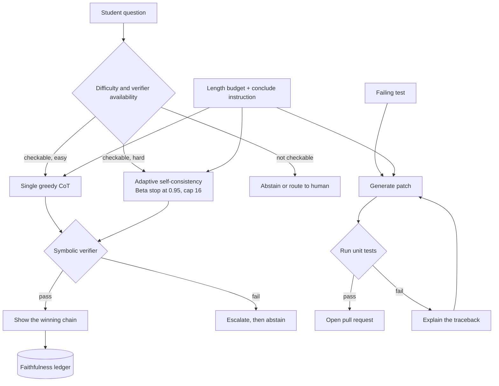
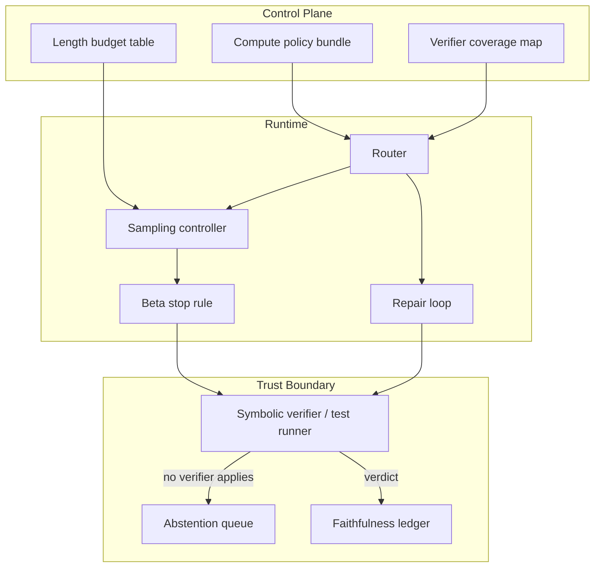

# HLD: Test-Time Compute

> `T04` · **Transcript coverage:** primary · [LLD](LLD.md) · [Sequences](docs/SEQUENCES.md) · [Case study](../../01-case-studies/T04-test-time-compute.md) · [Cheat sheet](../../00-cheat-sheets/T04-test-time-compute.md)

Provenance: `[T]` transcript, `[R]` repo/reference, `[D]` derivation by this author with assumptions shown.

## 1. Problem & Scope

Design the **test-time compute policy** for one estate serving two products with opposite answers to
the same question.

**The tutor** answers a student's math question *and shows the working*. 900k questions a month,
K-12 through early undergraduate. The explanation is the deliverable — a correct answer with no
visible reasoning fails the districts' review. The model has **no external checker**.

**The code-repair bot** fixes failing unit tests in Northwind's own repositories. 6k sessions a
month. It has something the tutor does not: **a test suite that says mechanically whether it
succeeded**.

Both share one GPU pool and one budget, and both are under pressure to adopt a reasoning model.

**In scope:** the compute-allocation policy per surface; the difficulty and verifier-availability
router; adaptive self-consistency and its stopping rule; the self-correction decision and its
external-feedback gate; length budgeting and the exceed rate; the faithfulness ledger.

**Out of scope:** the sampler and its parameter surface ([T01](../T01-sampling-decoding/HLD.md));
search over chains ([T02](../T02-search-decoding/HLD.md)); the verifier pool and Best-of-N scheduling
([T05](../T05-verifiers-best-of-n/HLD.md)); KV pressure from long thinking traces
([T07](../T07-kv-cache/HLD.md)); the agent loop the repair bot sits inside
([T16](../T16-agentic-inference/HLD.md)).

**Explicit non-goals.**

- **We do not train a reasoning model in this phase.** No RL infrastructure exists. The corpus is
  explicit that RL from a base model is what produced the headline result — AIME pass@1 from "very
  low… like 15% top one accuracy" to "over 70%" `[T]` — and equally explicit about what it costs:
  GRPO, group-normalised advantages, a clip at "epsilon was 0.1", and temperature fixed at 1 so the
  rollouts stay on-policy `[T]`. That is a different project with a different team.
- **We do not use model-based verifiers where a rule-based one is possible.** The lecturer's own
  recommendation from his length-control work: "**rule-based verifiers basically work better than
  modelbased verifiers**… if you want a shortcut to making things work, I recommend this" `[T]`.
- **We do not show a chain that did not produce the answer.** If we sample five chains and vote, the
  winning chain is shown, not a post-hoc rationalisation.
- **We do not use intrinsic self-correction on reasoning.** The negative result is a design input,
  not a caution — §5.3.
- **We do not treat the confidence signal as a correctness signal.** The model proves this in §5.4,
  and it is the single most important negative finding in this blueprint.

## 2. Requirements

### Functional

| Requirement | Priority | Notes |
|---|---|---|
| Step-by-step solution, not just a final answer | P0 | The tutor's deliverable |
| Verified final answer before it reaches a student | P0 | Districts contract on accuracy |
| Adaptive compute: easy questions must not cost what hard ones cost | P0 | Budget |
| Repair loop with test-execution feedback | P0 | The internal product |
| Faithfulness ledger: shown chain == sampled chain | P0 | Content review |
| Length budget so no request is clipped mid-answer | P0 | §5.5 |
| A confidence signal, honestly labelled as agreement | P1 | Routing and "I'm not sure" messaging |

### Non-functional

| Requirement | Target | Rationale |
|---|---|---|
| P95 tutor latency | < 12 s | A student will not wait longer |
| P95 repair session | < 6 min | Agentic, multi-attempt |
| Cost per solved tutor question | ≤ 1.6x a single greedy CoT call | The adaptive budget |
| Cost per solved repair | ≤ 4x a single attempt | Loop budget |
| Self-consistency sample cap | 16 | The corpus's own comparison point — self-debugging was measured against self-consistency at **16 samples** `[T]` |
| Truncation-induced wrong answers | 0 | The exceed-rate crash `[T]` |
| Faithfulness-audited sample | 500 transcripts/week | Product promise |

### Constraints

- **Every extra sample is a full generation.** "if you want to sample a hundred of these then it's
  100 times the inference cost" `[T]`. There is no cheaper sampler for this.
- **Self-consistency needs a discrete answer to vote on.** "it will not work when we're generating
  essays" `[T]`. The tutor's free-text explanation cannot be voted on; only its final answer can.
- **Longer chains are not linearly better.** The corpus's own length findings: "7B models really
  struggled to develop complex abilities", and "overexposure to short data hindered the long cot
  development" `[T]`.
- **Verifier availability, not difficulty, is the first branch.** Spending compute only helps where
  something can tell us whether the spend worked.

## 3. System Context (C4 L1)



**The first branch is verifier availability, not difficulty.** That ordering is the design's core
claim. Difficulty decides *how much* compute to spend; verifier availability decides *whether
spending it can help at all*. On the tutor, where no checker exists for most of the curriculum, the
honest third branch is abstention — and the corpus says so: intrinsic self-correction without
external feedback "often fails… and um performance can even **degrade**" `[T]`.

## 4. Container View (C4 L2)



- **Verifier coverage map** — per curriculum topic, whether a checker exists. It is the router's
  input and it is *authored*, not inferred: the model must never be the thing that decides whether it
  can be checked.
- **Sampling controller** — batches of samples, tally maintained across batches.
- **Beta stop rule** — reads the tally, decides to continue or stop. §5.4 is about what it does not
  tell you.
- **Repair loop** — a genuinely different regime: sequential attempts with an executor between them.
- **Faithfulness ledger** — records which chain id was shown, so a reviewer can confirm the shown
  chain is the sampled one.

## 5. Component View (C4 L3)

### 5.1 The formulation

Input `X`, chain `Z` as a latent variable, answer `Y`. The target is `P(Y|X) = Σ_Z P(Y|X,Z)P(Z|X)`,
found by "marginalizing over z. So summing over all Z so that we can get a better prediction of Y"
`[T]`. Two claimed advantages: extra tokens give adaptive computation time, and a faithful chain lets
a human walk the reasoning.

Exact marginalisation is intractable — the number of `z` values for a 100-token chain is "essentially…
close to **v to the power of 100**" `[T]`. The three approximations differ, and the corpus's
counterexample is "how many inches are there in 3 ft": a model that talks about centimetres with high
probability "would give the best joint z-y score but not the best p(y)", where the numbers are
"y equals 36 you would get 0.6 where this is 0.4" `[T]`.

`sim/` reproduces that shape exactly (§5.2), and the consequence is a design rule: **do not search
over chains for reasoning.** Joint argmax over `(z, y)` is what a beam-based reasoning pipeline
computes, and it is the wrong quantity. The corpus's recommended direction is sampling: "ancestral
sampling with a temperature of one is going to always be good enough uh in an auto regressive model"
`[T]`.

**CoT was not engineered; it was discovered.** The 2022 paper "discovered that even without teaching
the model or training the model in any way to do chain of thought it was able to do that" `[T]` — the
explanation given being that training data already contains deduction sequences: "code," "stories,"
"proofs," and "a ton of grade school math online that has these deductions like explicitly written in
it" `[T]`. That matters for scoping: it explains why prompting works at all, and why the gains are
concentrated where the training data had the structure.

### 5.2 The three readings of the sum, measured

The simulation's contested fixture is the corpus's counterexample. Three chains, `P(z|x)` = 0.50 /
0.25 / 0.25, with the 0.50 chain leaning to the wrong answer and the two 0.25 chains agreeing on the
right one:

| Decoder | Path chosen | Answer | Correct |
|---|---|---|---|
| Greedy (argmax z, then argmax y) | `cm_reasoning` | 91 | **no** |
| Joint argmax `(z,y)` | `cm_reasoning`, 91, `p = 0.30` | 91 | **no** |
| True marginal `argmax_y Σ_z` | — | 36 (`p = 0.65`) | **yes** |

This is the blueprint's first design constraint and it is not a subtlety: **the model that reasons in
the wrong unit wins the joint score and loses the question.** Greedy and joint argmax agree here, so
"just pick the most likely chain" and "just beam-search the chain and answer jointly" fail together.
Only the sum is right, and the sum is only reachable by sampling.

### 5.3 Self-consistency, and the adaptive version

Sample many paths, count answers, take the most frequent. Its scope limit is explicit and narrow:
"Self-consistency only works in uh relatively simple cases like mathematical reasoning where it's
like we have a single answer uh that's an integer. Um it will not work when we're generating essays"
`[T]`. Its price is equally explicit: 100 samples is 100x the inference cost `[T]`.

**Adaptive self-consistency** — the corpus's account is a paper "by Pranjal Agarwal who's a PhD
student in LTI" — samples a small number, then keeps sampling until "the probability of the final
sample you get after sampling an infinite number of samples" clears a threshold, checked "after each
batch of generations" `[T]`.

The statistics, as taught: a **Dirichlet prior** is "a prior probability that you can put on discrete
distributions", motivated by the MLE embarrassment — one observation of `a` and no `b` or `c` gives
"One, right? Yeah. 1.0 and 0", against which the lecturer offers the analogy "you go to a new country
and… it's sunny the first day. Do you think it's going to be sunny for eternity?" `[T]`. The posterior
is proportional to observed count plus `α · P_prior`; "If alpha is higher you rely on the prior
probability more… If alpha is zero this is maximum likelihood estimation" `[T]`. The worked example:
counts 1,0,0 with `α = 3` and a uniform prior give pseudo-counts "2, 1, 1" and therefore
"**0.5 for A, 0.25 for B, 0.25 for C**" `[T]`. The Dirichlet is then simplified to a **Beta over the
top-1 and top-2** outputs because the full-vocabulary version "can be kind of expensive" `[T]`. The
threshold is **0.95** — "I have 95% confidence that if I sample more, I'm not going to get a different
result" `[T]`.

`sim/` reproduces the prior arithmetic exactly, including the boundary case:

| α | Pseudo-counts (1,0,0) | Posterior |
|---|---|---|
| 0.0 | 1.00, 0.00, 0.00 | 1.000, 0.000, 0.000 (MLE) |
| 3.0 | 2.00, 1.00, 1.00 | **0.500, 0.250, 0.250** |
| 30.0 | 11.00, 10.00, 10.00 | 0.355, 0.323, 0.323 |

**And now the finding that changes the capacity model.** The corpus calls this "a cool trick that you
can do to save uh compute" and reports **no samples-saved figure at all** `[T]`. So the model measures
it, and the answer is the opposite of the intuition:

| Problem | Mean samples | Stopped early | Hit the cap | Saving vs n=16 |
|---|---|---|---|---|
| Easy (marginal accuracy 0.964) | 4.55 | 100% | 0% | **72%** |
| Contested (marginal accuracy 0.650) | 12.84 | 35% | 65% | 20% |
| Adversarial (0.45 mass on one wrong chain) | 13.89 | 22% | 78% | 13% |

The rule at `α = 3` is conservative: a run must be near-unanimous before the leader's posterior clears
0.95. Two unanimous samples give the leader a `Beta(3.5, 1.5)` posterior, whose probability of
exceeding one half is **0.8395** — short of the threshold. A 5-0 run gives `Beta(5.5, 1.5)` = 0.9527
and does fire. **Easy questions produce unanimous runs immediately; contested questions by definition
do not.** So the saving lands on the questions that never needed the extra samples, and the contested
ones run to the cap. A capacity model that assumes a mean of 5 samples `[D]` is assuming the easy
case; §10 revises it.

### 5.4 The blind spot: the posterior measures agreement, not correctness

On the adversarial fixture the wrong answer sits in one high-probability chain, so a short unlucky run
is unanimous *and* wrong. The rule reads unanimity as confidence and stops on it.

| Floor (min samples) | Mean samples | Accuracy | Wrong **and** confident |
|---|---|---|---|
| 2 | 13.89 | 0.748 | 0.059 |
| 8 | 14.93 | 0.738 | 0.045 |
| 12 | 15.69 | 0.736 | 0.025 |
| 16 | 16.00 | 0.735 | 0.011 |

Floors at or below 4 are inert — the rule cannot fire that early — which is itself the point. Raising
the floor buys protection and costs samples, and it **does not remove the failure**: at a floor of 16
the residue is the majority-wrong rate, which no stopping rule can fix. A posterior over answers is a
statement about how much the samples agree. It is silent on whether the agreeing answer is right.

**This is the blueprint's most important negative finding, and it shapes the architecture:** the
confidence signal is used for routing and for "I'm not sure" messaging, never as a correctness gate.
Correctness comes from a verifier, and where no verifier exists the design abstains rather than
reporting a confident wrong answer. The corpus hands the same problem to the next topic —
[Best-of-N and the verifier pool](../T05-verifiers-best-of-n/HLD.md).

### 5.5 Self-correction: the negative result, and the condition behind it

The corpus's summary is unambiguous: "intrinsic self-correction often fails without external
feedback. And um performance can even degrade uh quite frequently if you're just asking it to
self-correct itself" `[T]`. Two mechanisms are named: models "struggle to identify their own errors",
and "there's also a **confirmation bias**… a tendency to reinforce initial reasoning" `[T]`. The
asymmetry that explains both: "things that are difficult for the models to do are things that are
also difficult for them to check" `[T]`.

The corpus gives **no benchmark, no accuracy figure and no author attribution** for the degradation —
it is qualitative. So the design does not cite an amount. It fixes two rates and derives the
boundary:

```
a correct answer is damaged with probability f_c
a wrong answer is repaired with probability f_w
acc' = acc(1 - f_c) + (1 - acc) f_w
accuracy falls  <=>  f_c / f_w  >  (1 - acc) / acc
```

At `acc = 0.80` the threshold is **0.25**. A corrector that damages a correct answer at a quarter the
rate it repairs a wrong one is already net-negative. Measured against the model:

| f_c / f_w | Accuracy after one round | Net |
|---|---|---|
| 0.05 | 0.848 | helps |
| 0.25 | 0.800 | exactly break-even |
| 0.50 | 0.740 | **loses** |
| 1.00 | 0.620 | **loses** |

The oracle arm is different in kind, not degree: an executor never damages a correct answer, so `f_c`
is structurally zero and accuracy can only rise — 0.80 → 0.86 → 0.902 → 0.931 over three rounds on the
same inputs. That is the asymmetry the corpus measures as **16 samples versus 1** `[T]`, and it is why
the repair bot gets a correction loop and the tutor does not.

**Where the corpus says correction works** `[T]`: grammar, style and formatting; anything with
external feedback — "things like code execution and factchecking you can get significant
improvements"; and it works "significantly better with stronger base models". **Where it does not:**
"deep reasoning errors like mathematical proofs in logic", knowledge gaps — "if the model doesn't
know… a particular fact, you can't really have it self-correct" — and "complex uh multi-step
reasoning". That taxonomy *is* the assignment: the tutor is in the bad column, the repair bot is in
the good one.

### 5.6 Length: the exceed rate, and the failure that kills a run

Reasoning models use more tokens over training — R1's thinking "naturally increases from **hundreds to
thousands of tokens**… **maybe 800 tokens** or something at the very beginning" `[T]`. The failure
mode, from the lecturer's own work: models "would improve for a while and then they would suddenly
**crash**… they were **exceeding the maximum output length**", and once past it "they would be getting
all of the the problems wrong basically because the **final answer was getting clipped**" — and
"basically just our training uh **died**". The metric is the **exceed rate** `[T]`.

The fix there is a cosine-shaped length reward, and the simulation shows both stated behaviours fall
out of its shape:

| Length | `cos(π/2 · L/Lmax)` | Reward if right | Reward if wrong |
|---|---|---|---|
| 200 | 0.9877 | 0.9877 | −0.9877 |
| 600 | 0.8910 | 0.8910 | −0.8910 |
| 1200 | 0.5878 | 0.5878 | −0.5878 |
| 2000 | 0.0000 | 0.0000 | −0.0000 |

A wrong answer is punished hardest when it is short — "if the answer is wrong we basically give a
larger negative reward when the answer is short" — and a right answer is pushed shorter — "if you're
getting it right, make it shorter" `[T]`. **At inference there is no gradient**, so the design's
analogue is not a reward but a budget: never return a clipped generation as an answer. A clipped trace
cannot emit its final answer and is therefore counted wrong, which is exactly the corpus's mechanism:

| Budget | Exceed rate | Accuracy (raw) | Accuracy (with a conclude instruction) |
|---|---|---|---|
| 400 | 0.800 | 0.160 | 0.672 |
| 600 | 0.600 | 0.320 | 0.704 |
| 1000 | 0.280 | 0.576 | 0.755 |
| 2000 | 0.030 | 0.776 | 0.795 |
| 2400 | 0.000 | 0.800 | 0.800 |

The instruction to conclude before the budget is the S1-style budget forcing the corpus describes:
"when it started… reaching the end of its token limit they cut it off and they said… **now answer**
and it answered" `[T]`. It buys the accuracy of a budget roughly 4x larger.

### 5.7 Faithfulness

The corpus's finding is directly adverse to a product whose deliverable *is* the explanation: with
biased few-shot examples, "they found accuracy drops uh and also **models generate confident
explanations for both correct and incorrect answers**" `[T]`. An unfaithful chain is not a cosmetic
defect; it is a wrong answer delivered with a plausible justification, in front of children.

The design response is procedural, not statistical: show the chain that produced the verified answer,
attach the verification, and abstain where neither step-level nor answer-level verification applies.
**And be honest about what that does not prove:** the chain is causally the one that produced the
answer; it is not proof that the chain is *why* the model got it right. The corpus's own caution —
CoT is unfaithful, never treat the trace as an audit log — survives the design.

## 6. Data Flow

**Tutor path.** Question → difficulty estimate → verifier coverage lookup → branch (greedy / adaptive
fan-out / abstain) → symbolic check → show the winning chain + verification → ledger. A failed check
escalates the sample count and then abstains; it never self-corrects intrinsically.

**Repair path.** Failing test → generate patch → execute → on failure explain the traceback and
refine → repeat to the attempt cap → open a PR. The executor is between every pair of attempts, which
is the whole difference from the tutor path.

**Length path.** Every path above is gated by the same budget table, and a generation that hits the
budget without concluding is discarded, not truncated.

## 7. Deployment Topology

Two trust levels again. The **sampling controller and stop rule** run in-process; they are on the
token path and their state is per request. The **verifier** is a separate service: a symbolic checker
for the tutor, a sandboxed test runner for the repair bot. It has its own failure modes, its own
capacity, and — critically — it is the only component whose verdict is allowed to gate a release.

The sandbox is the operational heavy end, and the corpus says so: "spinning up a code sandbox is much
much more operationally complex than just hitting a language model API" `[T]`. That is the price of
having a real oracle, and it is why the tutor — which has no oracle — is the cheaper product to build
and the harder one to make honest.

## 8. Scaling Strategy

| Component | Scales with | Strategy |
|---|---|---|
| Sampling fan-out | hard-question volume × mean samples | The dominant token cost; capped at 16 |
| Stop rule | batches, not samples | Arithmetic over small integer counts |
| Verifier | solved questions | Independent service; a symbolic check is far cheaper than a generation |
| Repair sandbox | sessions × attempts | The binding constraint is sandbox capacity and wall-clock, not tokens |
| Faithfulness audit | fixed sample per week | A statistical control; it does not scale with volume |

The binding resource is **verifier throughput, not GPU**. Every design decision here pushes work
toward the thing that can say whether the work succeeded, and that thing is the harder resource to
scale.

## 9. Failure Domains & Degradation

| Failure | Detected by | Response |
|---|---|---|
| Beta posterior stops on a wrong answer | Verifier | Escalate; count `wrong_and_confident` |
| No verifier for the topic | Coverage map | Abstain; do not sample |
| Sample cap hit without a leader | Stop rule | Return the plurality with an explicit low-confidence flag |
| Generation hits the length budget | Budget counter | **Discard**; never truncate |
| Repair loop converges on passing tests | Human review | The tests are the spec; widen them |
| Verifier is down | Health check | Abstain on that surface — the whole policy depends on it |

**Degradation ladder,** in order:

1. Reduce the sample cap 16 → 8 (fewer votes; abstention rate rises).
2. Suspend the semantic confidence signal (routing falls back to difficulty only).
3. Repair attempts 3 → 1.
4. Tutor hard questions → abstain rather than sample.
5. Never: emit an answer as verified when no verifier ran.

The ordering trades vote quality first, then routing finesse, then repair depth, and the honesty of
the "verified" label never.

## 10. Capacity Model

Arithmetic is mine; assumptions are shown. The case study's §8 assumed a mean of 5 samples on hard
questions `[D]`; §5.3 measures a different number, so the multiplier is revised here rather than
carried over.

| Input | Value | Basis |
|---|---|---|
| Tutor questions/month | 900k | §1 |
| CoT output, one sample | 600 tokens | `[D]` |
| Hard questions requiring sampling | 30% | `[D]` |
| Mean samples, easy question | 4.5 | `[D]` from the model's 4.55 |
| Mean samples, contested question | 13 | `[D]` from the model's 12.84 |
| Repairs/month, attempts each | 6k, 3 | `[D]` |
| 32B vs 470B cost per token | 1 : 8 | `[D]` rough parameter scaling |

**Step 1 — the multiplier, revised upward.** Baseline `900k × 600 = 540M` output tokens/month. With
adaptive sampling: `270k × 600 × 13 = 2,106M` plus `630k × 600 × 4.5 = 1,701M`, giving `3,807M` — a
**7.1x** multiplier on the sampled population and **3.5x** overall. Against fixed `n = 16` on every
question (`8,640M`, 16x), adaptive still saves 56%, but it is nowhere near the 2.2x the case study's
mean-of-5 assumed. This is the single largest correction this blueprint makes to the earlier model:
**the adaptive rule saves most on questions that never needed it, so a population-level saving
assumption must be driven by the difficulty mix, not by the rule.**

**Step 2 — the repair loop is cheap in tokens and expensive in wall-clock.** `6k × 3 × 600 = 10.8M`
tokens — 0.3% of the tutor's. The cost is three test-suite runs per session, each potentially minutes
on a large repository. That is why its SLO is in minutes.

**Step 3 — small model plus more tokens.** The corpus's claim is a 32B distilled model beating the
470B base `[T]`. Against the 8:1 per-token ratio, a 32B needing 4x the tokens costs `1 × 4 = 4` units
against `8 × 1 = 8` — **half the cost at parity**. Break-even is at a token multiplier of **8x**, and
that is the number to measure.

**Step 4 — abstention is a cost, and it must be budgeted.** The not-checkable branch returns no
answer. At a 15% abstention rate on 900k questions that is 135k questions a month reaching a human
queue `[D]`. That number is a product decision, not an inference one, and it is the honest price of
the design's refusal to guess.

## 11. Key Design Decisions

| Decision | Chosen | Rejected | Revisit if |
|---|---|---|---|
| How to read the chain sum | Sampling (ancestral, temperature 1) | Greedy; joint argmax; search over chains | Never — the model shows both alternatives fail on the corpus's own case |
| Vote allocation | Adaptive, Beta at 0.95, cap 16 | Fixed n=16 everywhere | Never on cost; the cap is the safety valve |
| What the posterior means | An agreement signal | A correctness signal | Never — measured, §5.4 |
| Correction | Oracle-gated only; repair bot yes, tutor no | Self-Refine on the tutor | The tutor gains a symbolic checker over most of the curriculum |
| Length control | Budget + conclude instruction + discard-on-clip | A length reward (no gradient at inference) | Phase 2, when training exists |
| Verifier type | Rule-based where possible | Model-based | Only where no rule exists — the corpus prefers rules `[T]` |
| Capability source, Phase 1 | Prompt-only CoT | Buying a reasoning model (no logit access) | Volume or residency requirements change |
| Capability source, Phase 2 | Distillation | RL from scratch | A verifiable reward appears at volume |

The two worth defending are **correction only behind an oracle** and **the posterior is not a
correctness signal**. Both are the corpus's negative results turned into architecture, and both cost
something visible: the first leaves the tutor's reasoning errors uncorrected, the second sends 15% of
questions to a human queue.

## 12. Build vs Buy

**Build** the sampling controller, the stop rule, and the length budget. They are small, they are
policy, and they are where the product's honesty properties live.

**Build** the verifier — a symbolic maths checker for the tutor, a sandboxed test runner for the
repair bot. This is the differentiating component. Buying a model-based checker instead would trade
away the corpus's clearest practical recommendation for a shortcut that does not exist: rules "work
better than modelbased verifiers" `[T]`.

**Reuse** the engine's sampler, batching, and KV machinery. The extra `n` sequences of a fan-out are
ordinary concurrent requests, not a special path.

**Do not buy a reasoning model as the whole answer.** A hosted reasoning model has no logit access —
which rules out the constraint machinery of [T03](../T03-constrained-generation/HLD.md) — and its
token growth is the vendor's, not ours: "reasoning models are all using more tokens to think which
means inference is becoming more expensive" `[T]`. It remains the right answer for surfaces with no
volume and no verifier.

## Sources

- `refs/CMU_Inference_Algorithms_for_Language_Modeling_Fall_2025_transcripts/CMU_LLM_Inference_7_Chain_of_Thought_and_Intermediate_Steps.txt` — the latent-variable formulation and the `v^100` intractability; the 3 ft/inches counterexample and the 0.6/0.4 figures; ancestral sampling at temperature 1; CoT's emergence and the training-data explanation; self-consistency's 100x cost and its single-answer scope limit; the biased-few-shot result and "confident explanations for both correct and incorrect answers"; adaptive self-consistency, the Dirichlet prior, the alpha semantics, the 1,0,0 → 2,1,1 → 0.5/0.25/0.25 worked example, the Beta simplification over top-1/top-2, and the 0.95 threshold checked per batch.
- `refs/CMU_Inference_Algorithms_for_Language_Modeling_Fall_2025_transcripts/CMU_LLM_Inference_8_Self-Refine_and_Self-Correction_Methods.txt` — the generate/critique/refine template and its stopping criteria; Self-Refine's readability-versus-math result; Self-Debugging's execution feedback and the 16-samples-versus-1 comparison; Reflexion's memory; the tool-using critic; edit vectors at 512 dimensions; the negative result, the "hard-to-do is hard-to-check" asymmetry, and confirmation bias; the taxonomy of where correction works and where it does not.
- `refs/CMU_Inference_Algorithms_for_Language_Modeling_Fall_2025_transcripts/CMU_LLM_Inference_9_Reasoning_Models.txt` — the exceed rate and the clipped-answer crash; the cosine length reward and both of its stated behaviours; rule-based versus model-based verifiers; the 7B limitation and the short-data overexposure finding; STaR and its sparse-reward boundary; DeepSeek R1 at 470B, the AIME 15%-to-70% curve, GRPO's group-normalised advantage, the 0.1 clip and the temperature-1 on-policy requirement; the four emergent cognitive behaviours; the 32B-distill-beats-470B claim; RL-versus-SFT transfer and its mechanism.
- `refs/CMU_Inference_Algorithms_for_Language_Modeling_Fall_2025_transcripts/CMU_LLM_Inference_11_Agents_and_Multi-Agent_Communication.txt` — the agentic repair loop's shape.
- `refs/LLMOps_Agentic_AIOps_The_Hands-On_Playlist_2026_transcripts/Cut_LLM_Cost_Latency_KV_Cache_Batching_Quantization_vLLM.txt` — long generations and their KV cost.
- `refs/ai-system-design-guide-main/ai-system-design-guide-main/16-case-studies/01-enterprise-rag.md` — house style reference.
