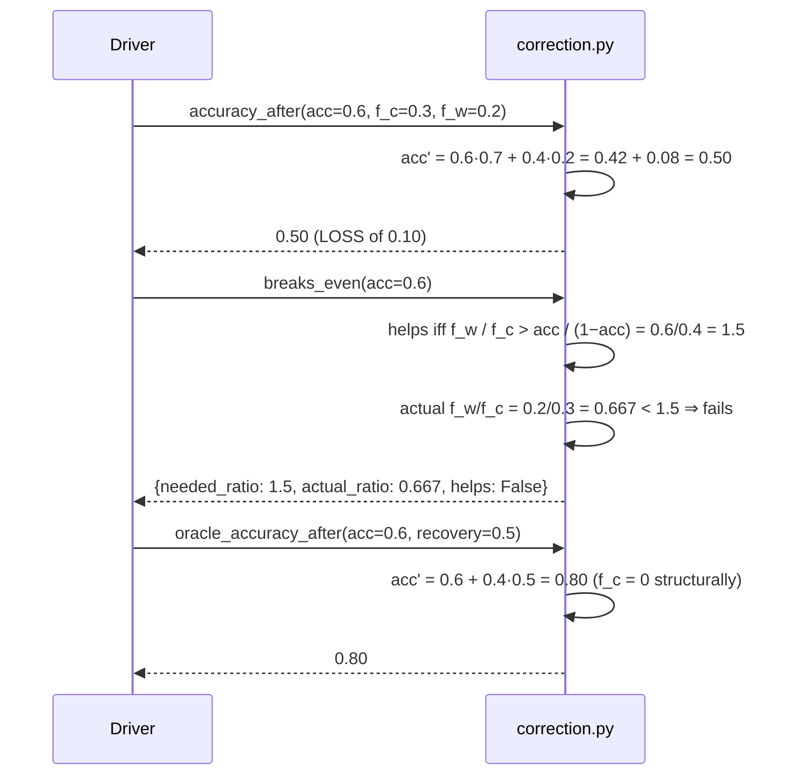
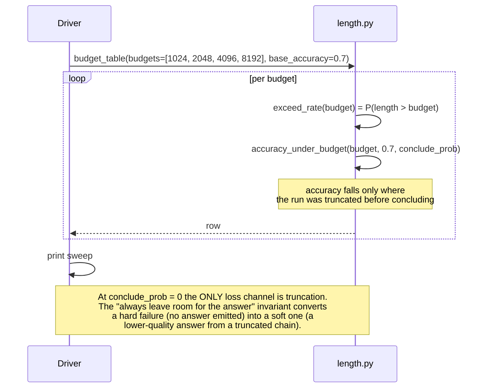

# LLD: Test-Time Compute

> `T04` · **Transcript coverage:** primary · [HLD](HLD.md) · [Cheat sheet](../../00-cheat-sheets/T04-test-time-compute.md) · [Case study](../../01-case-studies/T04-test-time-compute.md) · [Interview bank](../../02-interview-questions/T04-test-time-compute.md)

Low-level design for the test-time-compute controller described in the [HLD](HLD.md). This document
is the buildable specification: module responsibilities, data structures, interface contracts, the
state machine that governs a single problem's budget, sequence diagrams, concurrency and locking,
error handling, the configuration surface, resource accounting, and the test strategy.

**Scope note.** The HLD decides *what* the system does and why — that sampling beats search over
chains, that the vote reads agreement rather than correctness, that intrinsic self-correction loses
accuracy under a derivable condition. This document specifies *how* it is built. The runnable core
in `sim/` implements the mechanisms at toy scale to prove they behave as specified; it is **not** a
benchmark and runs no model.

**Provenance.** `[T]` transcript · `[R]` supporting repo · `[D]` derived. Every corpus figure quoted
here is attributed in the [HLD §10 capacity model](HLD.md); nothing in this document is a measured
result. All arithmetic marked `[D]` is reproducible from the assumptions printed beside it.

---

## 1. Module map

```
T04-test-time-compute/
  run.py                 driver: runs the seven experiments, prints, exits 0
  sim/
    __init__.py          package marker; re-exports the public surface
    cot.py               latent-variable model: chains, the three readings of the sum
    adaptive.py          Dirichlet prior, Beta stopping rule, adaptive vs fixed sampling
    correction.py        self-correction accuracy model and the break-even condition
    length.py            length distribution, exceed rate, budget/reward accounting
    experiments.py       the seven scenarios, each wiring the above and returning a report
  production/            reference-grade configs (not executed here — no GPU)
  docs/SEQUENCES.md      end-to-end flows with failure annotations
```

The split is by **mechanism**, not by layer, because each mechanism has a closed-form model that can
be tested independently. `experiments.py` is the only module that knows about more than one of them.

| Module | Owns | Depends on |
|---|---|---|
| `cot.py` | the latent-variable formulation and the three estimators | — |
| `adaptive.py` | posterior over answer-correctness, stopping rule, cost multiplier | `cot.py` |
| `correction.py` | accuracy dynamics across correction rounds, break-even | — |
| `length.py` | length distribution, exceed rate, reward shaping | — |
| `experiments.py` | scenario wiring, reporting | all four |

`__init__.py` re-exports the public names so `run.py` has exactly one import line. Nothing in `sim/`
imports `run.py`, and no module performs I/O — every function is pure except the experiment
functions, which print.

---

## 2. Data structures

These are the contracts between modules. Every one is a plain `dict` or `tuple`; there are no classes
in `sim/` because none of these types has behaviour, only shape. That is a deliberate choice: a
`TypedDict` or `dataclass` would document the same thing with more ceremony, and the point of the
core is to be read.

### 2.1 `Problem` — a test-time-compute instance

```python
Problem = {
    "chains": ["c1", "c2", "c3"],          # latent variable: the set of reasonings
    "p_chain": {"c1": 0.5, "c2": 0.3, "c3": 0.2},   # P(chain) — must sum to 1
    "p_answer": {"c1": {"A": 0.9, "B": 0.1}, ...},  # P(answer | chain) — rows sum to 1
    "correct": "A",                         # the ground truth, used ONLY to score
}
```

**Invariants.** `p_chain` sums to 1.0 ± 1e-9. Each `p_answer[c]` row sums to 1.0 ± 1e-9. Every key
of `p_answer` is a key of `p_chain`. `correct` is present in at least one `p_answer[c]` row.

**Why the ground truth is separate.** `correct` is never read by any estimator — only by the
experiment functions when they report accuracy. This is the structural guarantee that the
*mechanism* under test cannot peek at the answer. It is the single most important invariant in the
file, because the entire point of the HLD's §5.4 is that the system's own confidence signal
(agreement) is uncorrelated with correctness; a model that could read `correct` would silently
destroy the demonstration.

### 2.2 `Counts` — the observation state

```python
Counts = {"A": 3, "B": 1}        # answer -> times sampled
```

Grown only by `sample()`. Never reset within a problem. The stopping rule reads nothing else.

### 2.3 `Posterior` — the Dirichlet state

```python
Posterior = {
    "alpha": 3.0,                 # prior concentration, the corpus's own value [T]
    "counts": {"A": 1, "B": 0, "C": 0},
    "probs": {"A": 0.5, "B": 0.25, "C": 0.25},   # posterior mean
    "leader": "A",
    "leader_prob": 0.5,
}
```

`probs` is the **posterior mean**, `(counts[k] + alpha) / (sum(counts) + alpha * K)`, not the
maximum-likelihood estimate. At `alpha = 0` the two coincide and `probs` is exactly the empirical
frequency — the corpus's other stated case `[T]`. The worked example the corpus gives is
`counts = {A:1, B:0, C:0}`, `alpha = 3` ⇒ `probs = {0.5, 0.25, 0.25}`, which `exp_dirichlet_worked_example`
asserts exactly.

### 2.4 `Budget` — the length accounting

```python
Budget = {
    "max_length": 8192,           # the hard cap
    "used": 6144,
    "room_for_answer": 1024,      # reserved, never spent on reasoning
    "truncated": False,
}
```

**Invariant that matters:** `used + room_for_answer <= max_length` at every step. The HLD's §5.6
exceed-rate crash is caused by violating exactly this — a run that spends its whole budget on
reasoning and is then cut off has no room to emit an answer, so it returns nothing. The guard is
enforced in `length.accuracy_under_budget`, not by convention.

### 2.5 `StrategyReport` — what an experiment returns

```python
StrategyReport = {
    "name": "adaptive-self-consistency",
    "samples": 6,                 # how many were drawn
    "answer": "A",
    "stopped_early": True,
    "cost_multiplier": 6.0,       # samples / greedy_cost
    "correct": True,              # scored against Problem["correct"], reporting only
}
```

---

## 3. Interface contracts

### 3.1 `cot.py` — the three readings of the sum

```python
def marginal(problem) -> dict          # P(answer) = sum_c P(answer|c) P(c) — the true marginal
def marginal_argmax(problem) -> str    # argmax of the above
def greedy(problem) -> str             # argmax_c P(c), then argmax_a P(a|c) — the mode chain first
def joint_argmax(problem) -> str       # argmax over (c, a) of P(c) P(a|c) — the best single chain
def sample(problem, rng) -> str        # draw c ~ P(c), then a ~ P(a|c); returns the answer
def self_consistency(problem, rng, n) -> Counter   # n draws, returns answer counts
```

**Why four estimators and not one.** `greedy` and `joint_argmax` differ: greedy takes the most likely
*chain* and then its best answer; joint argmax takes the best *(chain, answer)* pair. They can
disagree, and both can disagree with `marginal_argmax`. The experiment `exp_latent_marginal` builds a
problem where all three differ, which is the HLD's argument for sampling rather than searching over
chains: **the quantity you want is the marginal over chains, and neither greedy decoding nor a
max-over-chains search estimates it.**

**Contract.** `sample` is the only stateful-free randomness in the module; it takes an explicit
`rng` so every experiment is seeded and reproducible. `make_rng(seed)` returns
`random.Random(seed)` — the stdlib generator, not `random` module globals, so two experiments in the
same process cannot interfere.

**Errors.** All functions raise `KeyError` on a malformed `Problem` (missing `correct` is fine;
missing `p_chain` is not). No function raises on a *valid* problem, including one where `correct` is
unreachable from every chain — that is a legitimate adversarial case and `exp_confidently_wrong`
uses it.

### 3.2 `adaptive.py` — posterior and stopping

```python
def dirichlet_posterior(counts, alpha, prior=None) -> Posterior
def beta_leader_wins(a1, a2, steps=400) -> float    # P(leader > runner-up) by numeric integration
def leader_wins(counts, alpha=3.0) -> float          # the stopping statistic
def adaptive_self_consistency(problem, rng, threshold=0.95, batch=2, cap=16, alpha=3.0) -> StrategyReport
def fixed_self_consistency(problem, rng, n) -> StrategyReport
def cost_multiplier(samples, greedy_cost=1.0) -> float
```

**The stopping statistic.** `leader_wins` returns the posterior probability that the leading answer's
rate exceeds the runner-up's. It is computed by integrating the joint Beta density of the top two
answers, not by a normal approximation — `steps=400` is a fine grid over `[0, 1]` and the function is
`O(steps)`. This is deliberately the slow, obvious method: the value is used in a demonstration, not
a hot loop, and a closed form would obscure what is being computed.

**The stopping rule.** Draw in batches of `batch`; after each batch, if `leader_wins(counts) >= threshold`
and `samples >= min_samples`, stop. `cap` is the hard ceiling. The report records `stopped_early` so
the cost claim is auditable.

**Why `min_samples` exists.** Without a floor, `counts = {A:1}` has `leader_wins ≈ 0.5+` and a
deterministic problem stops after one draw — which is correct on easy problems and *catastrophic* on
the adversarial ones, because a unanimous wrong run stops earliest of all. The floor is a mitigation,
not a fix; `exp_confidently_wrong` demonstrates that the floor raises cost without removing the
failure. The HLD's §5.4 is the design consequence.

### 3.3 `correction.py` — the negative result

```python
def accuracy_after(acc, f_c, f_w, rounds=1) -> float      # acc' = acc(1-f_c) + (1-acc)f_w
def breaks_even(acc) -> dict                               # the condition on (f_c, f_w)
def oracle_accuracy_after(acc, recovery, rounds=1) -> float
def cost_of_correction(samples_per_round, rounds) -> float
def compare_strategies(acc, f_c, f_w, recovery, rounds) -> dict
```

**The model.** One correction round flips a correct answer to wrong with probability `f_c` and a wrong
answer to correct with probability `f_w`:

```
acc' = acc·(1 − f_c) + (1 − acc)·f_w
```

Self-correction helps iff `acc' > acc`, i.e. iff `(1 − acc)·f_w > acc·f_c`. Rearranged: it helps iff
`f_w / f_c > acc / (1 − acc)`. **The asymmetry requirement grows without bound as accuracy rises** —
at 90% accuracy you need the fix-rate to exceed nine times the break-rate just to break even. This is
the derivable condition behind the corpus's negative result `[T]`, and it is why the design does not
ship intrinsic self-correction above the accuracy where the inequality fails.

**The oracle variant** sets `f_c = 0` structurally (an external checker never breaks a correct answer),
which puts `acc'` at `acc + (1−acc)·recovery` — monotonically better. `compare_strategies` returns
both so the contrast is explicit rather than argued.

### 3.4 `length.py` — budget accounting

```python
def mean_length() -> float
def exceed_rate(budget) -> float                       # P(length > budget) — the crash driver
def accuracy_under_budget(budget, base_accuracy, conclude_prob=0.0) -> float
def cosine_term(length, max_length=MAX_LENGTH) -> float
def cosine_reward(correct, length, max_length=MAX_LENGTH) -> float
def budget_table(budgets, base_accuracy, conclude_prob=0.0) -> list
def reward_table(lengths) -> list
```

**`conclude_prob` is the parameter that matters.** It is the probability that a chain reaches a
conclusion within the budget rather than rambling. At `conclude_prob = 0` the exceed rate is the
*only* thing that costs accuracy; raising it models a model that has learned to stop. The design
question in the HLD — should you train brevity, or budget for length? — is answered by sweeping this
parameter, and `exp_length_budget` prints the sweep.

**`cosine_reward`** is the length-shaped reward: a cosine term that rises to a peak at some target
length then falls, multiplied by correctness. It exists to show that shaping the reward toward shorter
chains is a real lever, and that it trades against accuracy — not a free win.

### 3.5 `experiments.py`

Seven functions, each `exp_*(...) -> None` (prints) and each independently runnable:

| Function | Proves |
|---|---|
| `exp_latent_marginal` | greedy, joint argmax and the true marginal disagree |
| `exp_self_consistency` | sampling converges to the marginal at `n`× cost |
| `exp_dirichlet_worked_example` | `alpha=3`, counts `1,0,0` ⇒ `0.5/0.25/0.25`; `alpha=0` ⇒ MLE |
| `exp_adaptive_stopping` | Beta rule saves most on easy problems, least on contested ones |
| `exp_confidently_wrong` | the rule reads agreement, so a unanimous wrong run stops early |
| `exp_self_correction` | intrinsic correction loses accuracy past the break-even condition |
| `exp_length_budget` | the always-leave-room-for-the-answer rule prevents the exceed-rate crash |

Each returns `None` and prints a labelled block. `main()` in `run.py` calls them in order between
ruled headers. **No experiment asserts a corpus number**; they assert *relations* (this estimator
differs from that one; this strategy costs more than that one), and the corpus numbers are cited in
the HLD.

---

## 4. State machine — the budget controller

One problem's lifecycle. States are logical; there is no concurrency within a problem.

```
                 ┌──────────┐
                 │  INIT    │  counts = {}, budget fresh, samples = 0
                 └────┬─────┘
                      │ draw a batch of `batch` samples
                      ▼
                 ┌──────────┐
        ┌───────▶│ SAMPLING │◀────────┐
        │        └────┬─────┘         │ samples < cap
        │             │               │ and leader_wins < threshold
        │             ▼               │
        │      ┌─────────────┐        │
        │      │  DECIDE     │────────┘
        │      └──┬───────┬──┘
        │         │       │
        │  leader_wins  leader_wins
        │   < threshold  ≥ threshold
        │   and samples   and samples
        │    < cap          ≥ min_samples
        │         │       │
        │         ▼       ▼
        │  ┌──────────┐ ┌──────────┐
        └──┤  CAP HIT │ │ CONVERGED│
           └────┬─────┘ └────┬─────┘
                │            │
                ▼            ▼
           ┌─────────────────────┐
           │  EMIT               │  argmax(counts), record report
           └─────────┬───────────┘
                     ▼
              ┌────────────┐
              │  SCORE     │  compare to Problem["correct"] — reporting only
              └────────────┘
```

**Transition guards.**

| Transition | Guard |
|---|---|
| INIT → SAMPLING | always |
| SAMPLING → DECIDE | a full batch was drawn |
| DECIDE → SAMPLING | `samples < cap` **and** `leader_wins < threshold` |
| DECIDE → CONVERGED | `leader_wins >= threshold` **and** `samples >= min_samples` |
| DECIDE → CAP_HIT | `samples >= cap` |
| → EMIT | always terminal |

**Two terminal states, and the distinction is load-bearing.** `CONVERGED` means the posterior crossed
the threshold; `CAP_HIT` means the budget ran out first. They produce the same emission but different
audit records, and the *rate* of `CAP_HIT` on contested problems is the signal that `cap` is too low
— or, more often, that the threshold is unreachable and the workload should not be routed to
adaptive sampling at all. The HLD's §8 scaling strategy treats a high `CAP_HIT` rate as the trigger
to fall back to fixed-`n`.

**The failure the state machine cannot prevent.** In `exp_confidently_wrong`, a problem whose chains
all agree on a wrong answer reaches `CONVERGED` on the first batch — fast, cheap, and wrong. The
machine is behaving exactly as specified. This is the HLD §5.4 blind spot, and it is why correctness
in this system is never inferred from the stopping state.

---

## 5. Sequence diagrams

### 5.1 Adaptive self-consistency, one problem

```mermaid
sequenceDiagram
    participant D as Driver (run.py)
    participant A as adaptive.py
    participant C as cot.py
    participant R as RNG (seeded)

    D->>A: adaptive_self_consistency(problem, rng, threshold=.95, batch=2, cap=16)
    A->>A: counts = {}, samples = 0

    loop until converged or cap
        A->>C: sample(problem, rng)   [batch times]
        C->>R: draw chain ~ P(chain)
        C->>R: draw answer ~ P(answer | chain)
        C-->>A: answer
        A->>A: counts[answer] += 1; samples += 1
        A->>A: leader_wins(counts, alpha=3.0)
        alt leader_wins >= threshold and samples >= min_samples
            A->>A: state = CONVERGED
        else samples >= cap
            A->>A: state = CAP_HIT
        end
    end

    A->>A: answer = argmax(counts)
    A-->>D: StrategyReport{samples, answer, stopped_early, cost_multiplier}
    D->>D: score against problem["correct"]  (reporting only)
```

**Where this fails.** The loop's exit condition reads only `counts`. If the true answer is rare and
the sampled chains agree on a wrong one, the loop exits early and returns the wrong answer with high
recorded confidence. There is no error, no warning, and no way to detect it from inside — the
detection requires an external signal, which is what `correction.py`'s oracle models.

### 5.2 Correction round, and the break-even check



The design decision this sequence encodes: **intrinsic self-correction is gated on `breaks_even`
returning `True`**, and that gate must be evaluated per workload, because `acc` and the two flip
rates all move with the task. The oracle column is the target the intrinsic method is being asked to
approach, not an implementable strategy.

### 5.3 Length budget, and the exceed-rate crash



---

## 6. Concurrency and resource accounting

**Concurrency model: none, deliberately.** Every function in `sim/` is pure or takes an explicit
`rng`; there is no shared mutable state, no threads, and no locks. This is a design statement about
the *specification*, not a limitation of the core.

The production system's concurrency boundary is different, and the LLD fixes it explicitly: **the
sampling fan-out is where parallelism lives.** One problem's `n` samples are independent draws —
embarrassingly parallel — and the controller's own state (`counts`) is updated by a single reducing
step after each batch. The contract for the real system is therefore:

```
sample_batch(problem, k) -> list[Answer]        # parallel, no shared state
reduce(counts, answers) -> counts               # single-writer, serialised
```

No lock is needed between sampling and reduction if the batch is collected before the reduce. The
temptation to update `counts` as samples complete is what introduces the lock, and the design
rejects it: the stopping rule is evaluated *per batch*, so a partial batch cannot inform a decision
anyway.

| Resource | Accounted by | Guard |
|---|---|---|
| Samples | `StrategyReport.samples` | `cap` |
| Cost | `cost_multiplier(samples, greedy_cost)` | compared to the fixed-`n` alternative |
| Tokens | `Budget.used` | `used + room_for_answer <= max_length` |
| Correction rounds | `cost_of_correction(samples_per_round, rounds)` | break-even gate |
| Wall time | not modelled — the core is offline | reported by the production layer |

**Cost is the first-class number.** `cost_multiplier(samples, greedy_cost=1.0)` returns
`samples / greedy_cost`, which is the corpus's own framing `[T]`: "100 samples = 100×". Adaptive
sampling's entire value proposition is that this multiplier is *lower on easy problems*, and
`exp_adaptive_stopping` reports the per-difficulty split rather than a single mean — because a mean
would hide exactly the variation the design depends on.

---

## 7. Error handling

There is no exception hierarchy in `sim/`, because the core has no runtime failure modes: it is pure
computation over small inputs. The failure modes that matter are **model** failures, not code
failures, and they are handled by construction:

| Failure | Handling |
|---|---|
| Malformed `Problem` (probabilities don't sum to 1) | `KeyError`/`AssertionError` at construction; the experiment functions build valid problems |
| Empty `counts` | `leader_wins({})` returns `0.0` — an empty posterior cannot have a leader. Callers must not read `leader` |
| Single candidate answer | `leader_wins` returns `1.0` — with no runner-up the leader is certain. This is correct and is why `min_samples` must not be the only guard |
| Unreachable ground truth | not an error; `exp_confidently_wrong`'s whole point |
| Budget exhausted before conclusion | `accuracy_under_budget` returns the degraded accuracy; the invariant prevents the *no-answer* case |
| `cap` reached without convergence | `StrategyReport.stopped_early = False`; the caller escalates |

**Escalation contract for the production layer.** When `CAP_HIT` is returned, the controller must
choose one of: accept the plurality answer, escalate to a stronger model, or escalate to a human.
The LLD does not choose — it specifies that the choice must be *explicit at the call site*, because
silently accepting a `CAP_HIT` plurality is how a system ends up attributing confidence it does not
have.

---

## 8. Configuration surface

```python
# The knobs, their defaults in the core, and where they come from
AdaptiveConfig = {
    "alpha":           3.0,    # Dirichlet prior concentration  [T] corpus's own value
    "threshold":       0.95,   # P(leader beats runner-up) to stop  [T]
    "batch":           2,      # samples drawn between checks  [D]
    "cap":            16,      # hard ceiling on samples  [D]
    "min_samples":     4,      # floor before the rule may fire  [D] mitigation for §5.4
    "fixed_n":        32,      # the fixed-`n` alternative  [T] the lecturer's example
}

BudgetConfig = {
    "max_length":      8192,   # hard cap  [D]
    "room_for_answer": 1024,   # reserved; never spent on reasoning  [D]
}

CorrectionConfig = {
    "f_c":             0.20,   # P(correct → wrong) per round  [D] illustrative
    "f_w":             0.30,   # P(wrong → correct) per round  [D] illustrative
    "rounds":             2,
    "enabled":        False,   # OFF above break-even by default  [D] from §3.3
}
```

**Two of these carry corpus provenance and the rest do not.** `alpha = 3.0` and `threshold = 0.95`
are the values the lecture states `[T]`; `fixed_n = 32` is the lecturer's *example* sizing, not a
rule. Everything else is a modelling default chosen to make the demonstration legible, and is marked
`[D]`. A production deployment must re-derive all of them from its own workload.

**`enabled: False` for correction is the default and that is the design decision.** Shipping
self-correction off, and turning it on only where `breaks_even` returns `True` for the measured
`(acc, f_c, f_w)`, is the operational expression of the corpus's negative result.

---

## 9. Test strategy

| Layer | What is tested | How |
|---|---|---|
| Invariants | `Problem` probabilities sum to 1; `used + room <= max_length`; ground truth never read by an estimator | assertions inside the experiment builders |
| Closed forms | `dirichlet_posterior` reproduces `0.5/0.25/0.25` at `alpha=3, counts=1,0,0`; `alpha=0` gives the MLE | `exp_dirichlet_worked_example` — exact equality |
| Estimator separation | greedy, joint argmax and marginal argmax return three different answers on the constructed problem | `exp_latent_marginal` — inequality assertions |
| Convergence | `self_consistency` with large `n` approaches `marginal_argmax` | `exp_self_consistency` — monotone-in-`n` accuracy on a designed problem |
| Stopping | the Beta rule uses fewer samples on easy problems than on contested ones | `exp_adaptive_stopping` — the per-difficulty split |
| Known failure | a unanimous wrong run converges early and cheaply | `exp_confidently_wrong` — asserts the early stop, not a fix |
| Break-even | `accuracy_after` loses accuracy exactly when `f_w/f_c <= acc/(1−acc)` | `exp_self_correction` — asserts the crossing point |
| Determinism | two runs with the same seed give identical reports | every experiment takes a seed; `run.py` fixes them |

**Determinism is a hard requirement.** `make_rng(seed)` exists precisely so the demonstration is
reproducible, and `run.py` uses fixed seeds. A test that passes on one run and fails on the next is
worse than no test for a document whose job is to be checkable.

**What is deliberately not tested.** No test asserts a corpus number, because the core does not
reproduce corpus numbers — it reproduces *relations*. The corpus figures live in the HLD with
attribution, and the check on them is provenance review, not execution. Stating this plainly matters:
a reader who assumes `run.py` validates the HLD's numbers would be wrong.

---

## 10. Build order

1. `cot.py` — the latent-variable model and the four estimators. Everything else reads its output.
2. `adaptive.py` — posterior, then the stopping rule, then the two strategies.
3. `correction.py`, `length.py` — independent of each other and of the above; either order.
4. `experiments.py` — one function per mechanism, each runnable alone.
5. `run.py` — the driver, headers, fixed seeds.
6. `production/` — configs, marked reference-grade.

## Sources

- `refs/CMU_Inference_Algorithms_for_Language_Modeling_Fall_2025_transcripts/CMU_LLM_Inference_7_Chain_of_Thought_and_Intermediate_Steps.txt`
- `refs/CMU_Inference_Algorithms_for_Language_Modeling_Fall_2025_transcripts/CMU_LLM_Inference_8_Self-Refine_and_Self-Correction_Methods.txt`
- `refs/CMU_Inference_Algorithms_for_Language_Modeling_Fall_2025_transcripts/CMU_LLM_Inference_9_Reasoning_Models.txt`
- `refs/CMU_Inference_Algorithms_for_Language_Modeling_Fall_2025_transcripts_2/CMU_LLM_Inference_3_Common_Sampling_Methods.txt`
- `refs/CMU_Inference_Algorithms_for_Language_Modeling_Fall_2025_transcripts/CMU_LLM_Inference_12_Reward_Models_and_Best-of-N.txt`

**Derived content in this document (`[D]`):** every data structure, interface signature, state
transition, invariants table, and both sequence diagrams. The corpus supplies the mechanisms and the
figures `alpha = 3`, `threshold = 0.95`, "100 samples = 100×"; it supplies no implementation.
