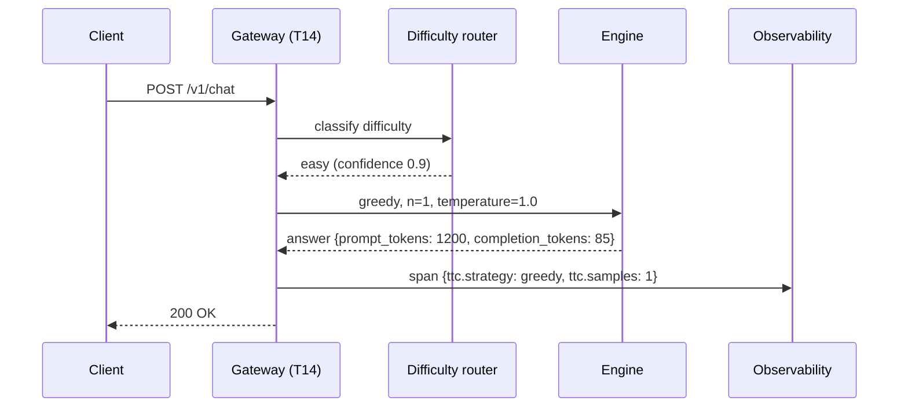
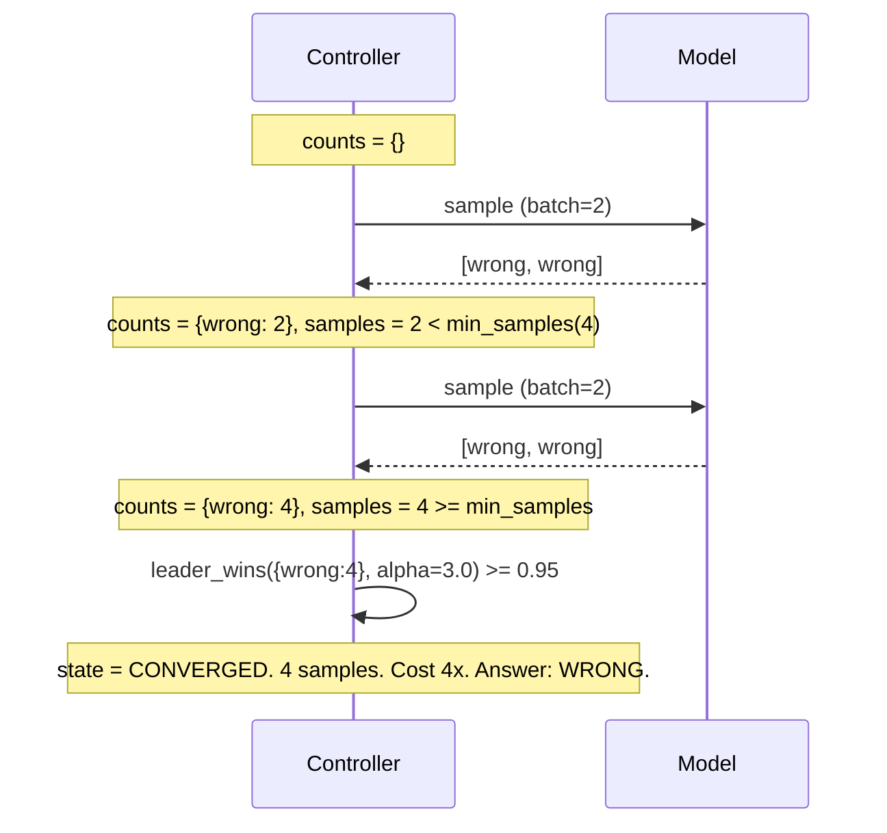
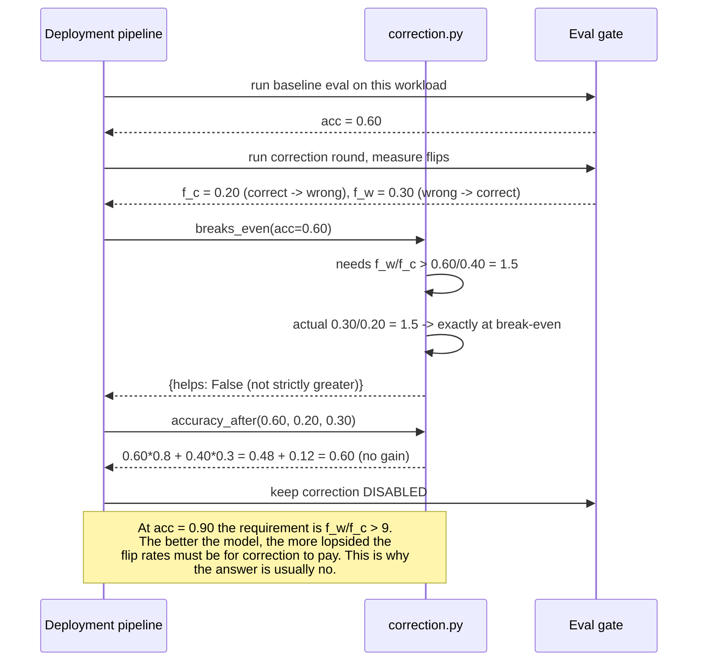
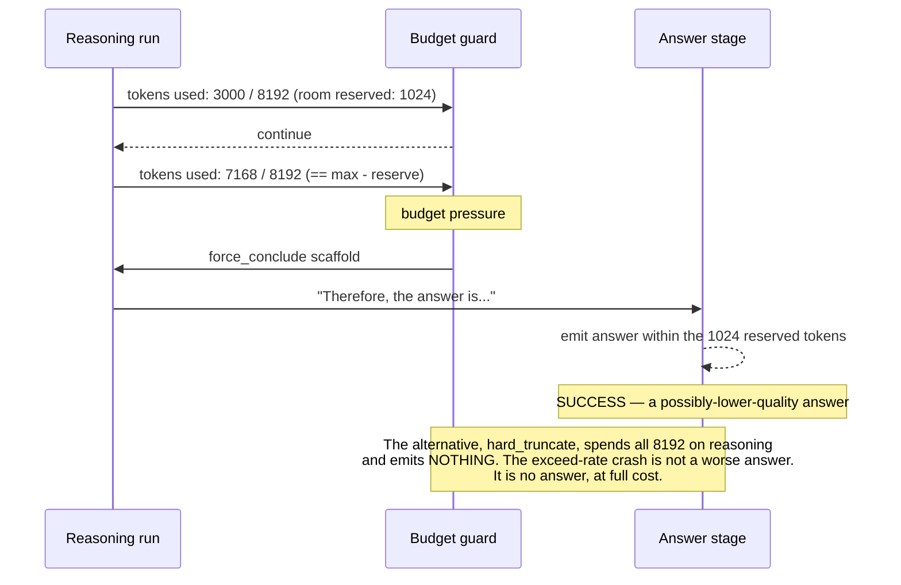

# T04 — Sequences: Test-Time Compute, End to End

> **Transcript coverage:** primary · [HLD](../HLD.md) · [LLD](../LLD.md) · [production/](../production/README.md)

Five end-to-end flows. Each is written as prose over the mermaid diagram in the [LLD §5](../LLD.md),
with an explicit **"where this fails"** annotation — because in this system the failures are model
failures, not code failures, and a diagram that shows only the happy path teaches the wrong thing.

Provenance: `[T]` transcript · `[R]` repo · `[D]` derived.

---

## 1. A simple question, routed to greedy

The common case, and the one that matters most for cost: **most traffic never enters the sampling
loop at all.**



**Why temperature is 1.0 on the greedy path.** `n = 1` makes the sampling distribution irrelevant to
cost, and temperature 0 does not buy determinism anyway — outputs still differ run to run `[T]` CMU
lecture 2. Setting 1.0 keeps the deployment consistent across paths and avoids the false belief that
the greedy path is reproducible.

**Where this fails.** The router's `easy` label is a *prediction*, and a mislabelled hard question
gets one shot with no verification. This is the design's largest single accuracy risk, and it is
deliberately accepted: the cost of sampling every request is `n×`, and the corpus's own position is
that prompt caching and difficulty-based routing move the bill more than model choice does `[T]`.
The mitigation is a **periodic shadow audit** — sample a small fraction of `easy` traffic at `n = 16`
and compare. Without the audit the router degrades silently.

---

## 2. A hard question, adaptive sampling

The flow the blueprint is mostly about.

```mermaid
sequenceDiagram
    participant G as Gateway
    participant C as TTC controller
    participant E as Engine (n>1 fan-out)
    participant P as Prefix cache
    participant S as Scorer

    G->>C: question (difficulty: hard)
    C->>C: counts = {}, samples = 0
    loop until leader_wins >= 0.95 or samples >= cap
        C->>E: sample(prompt, batch=2)
        E->>P: lookup prompt prefix
        alt prefix present
            P-->>E: hit — skip prefill
        else
            E->>E: prefill once, cache it
        end
        E-->>C: [answer_a, answer_b]
        C->>C: counts update; leader_wins(counts, alpha=3.0)
    end
    C->>S: score(answer, question)
    S-->>C: correct | incorrect
    C-->>G: answer + {samples, stopped_early, state}
```

**The single most important efficiency fact in this sequence.** All `n` samples of one prompt share
a prefix. Without prefix caching the prompt is prefilled `n` times and the cost multiplier is real
in the worst way; with it, the shared prefix is prefilled once and the n chains diverge only after
it `[T]` vLLM / `[R]` llm-inference-engineering. This is why `enable_prefix_caching: true` in
[production/vllm-sampling.yaml](../production/README.md) is not a tuning detail — it is what makes
the strategy affordable at all.

**Where this fails — `CAP_HIT`.** If the posterior never crosses 0.95 within `cap` samples, the
controller reaches `CAP_HIT` (LLD §4). The contract requires an explicit call-site choice
(accept / escalate to a stronger model / escalate to a human). A rising `cap_hit_fraction` is a
*routing* signal, not a compute shortage: it means this question class should never have been sent
to adaptive sampling.

**Where this fails — the blind spot.** This is HLD §5.4 and the sequence cannot show it, because
nothing in the loop is wrong. If every sampled chain agrees on an incorrect answer, `leader_wins`
crosses 0.95 on the first batch: the loop exits **fast, cheap, and wrong**. `min_samples: 4` raises
the floor but does not remove the failure. The stopping statistic measures *agreement*, and
agreement is not accuracy — this is the corpus's central caution about self-consistency `[T]` CMU
lecture 9, and it is why correctness is never inferred from the stopping state.

---

## 3. The `n = 1` unanimity trap, in detail

The blind spot deserves its own flow, because it is the failure a reader is most likely to build.



**Read the cost line.** The failure mode of self-consistency is not that it is expensive — it is
that it is **cheapest exactly when it is most wrong**. A model with a systematically biased chain
distribution produces unanimous wrong answers, which converge fastest. The corpus's own framing of
the fix is that you need a signal from outside the sampled distribution — a reward model, a
verifier, an oracle `[T]` CMU lecture 12. That is T05's subject.

**What the design does about it, and what it cannot.** `min_samples` bounds the damage. The
escalation contract prevents silent acceptance. But nothing inside the controller detects it. The
detection is the shadow audit (§1) and the eval gate ([production/eval-gate.yaml](../production/README.md)).

---

## 4. Self-correction: the gate that says no

Intrinsic self-correction is **off by default**, and this flow shows the arithmetic that turns it on
or keeps it off.



**The asymmetry, stated once more because it is the whole result.** Self-correction helps iff
`(1 − acc)·f_w > acc·f_c`. The required ratio `f_w/f_c > acc/(1−acc)` **grows without bound as
accuracy rises**. A 90%-accurate model needs its fix-rate to exceed nine times its break-rate just to
break even. This is a derivable consequence, not an empirical curiosity, and it is why the corpus's
negative result `[T]` CMU lecture 8 is a *design* result rather than a bug report.

**Where this fails.** The gate is only as good as the measured `(acc, f_c, f_w)`, and those move
with the task. A gate evaluated once on last quarter's traffic will enable correction on a workload
where it now loses. Re-measure, and re-measure before enabling — not after.

---

## 5. The length budget, and the crash it prevents



**Why this is the highest-value guard in the blueprint.** The failure it prevents is qualitatively
worse than a quality regression: you pay the full compute cost and receive no output. The corpus
ties thinking length directly to reasoning gains `[T]` CMU lecture 9 — so the pressure to let the
chain run is real and legitimate, and the reservation is what lets you keep the pressure without
risking the crash.

**Where this fails.** `force_conclude` truncates with a scaffold, and a chain cut off mid-argument
can produce a confidently-stated wrong conclusion. The `ttc.truncated` span attribute exists so this
population is countable, and `accuracy_under_budget(budget, base_accuracy, conclude_prob)` in the
core models exactly this trade — the truncation loss channel is the *only* channel at
`conclude_prob = 0`, which is the worst case.

---

## Sources

- `refs/CMU_Inference_Algorithms_for_Language_Modeling_Fall_2025_transcripts/CMU_LLM_Inference_7_Chain_of_Thought_and_Intermediate_Steps.txt`
- `refs/CMU_Inference_Algorithms_for_Language_Modeling_Fall_2025_transcripts/CMU_LLM_Inference_8_Self-Refine_and_Self-Correction_Methods.txt`
- `refs/CMU_Inference_Algorithms_for_Language_Modeling_Fall_2025_transcripts/CMU_LLM_Inference_9_Reasoning_Models.txt`
- `refs/CMU_Inference_Algorithms_for_Language_Modeling_Fall_2025_transcripts/CMU_LLM_Inference_12_Reward_Models_and_Best-of-N.txt`
- `refs/CMU_Inference_Algorithms_for_Language_Modeling_Fall_2025_transcripts_2/CMU_LLM_Inference_2_Probability_Review_and_Code_Examples.txt`
- `refs/LLMOps_Agentic_AIOps_The_Hands-On_Playlist_2026_transcripts/Cut_LLM_Cost_Latency_KV_Cache_Batching_Quantization_vLLM.txt`

**All sequence structure, state names and span attribute names are `[D]`.** The corpus supplies the
mechanisms, the two threshold values and the negative result; it supplies no end-to-end flow.
