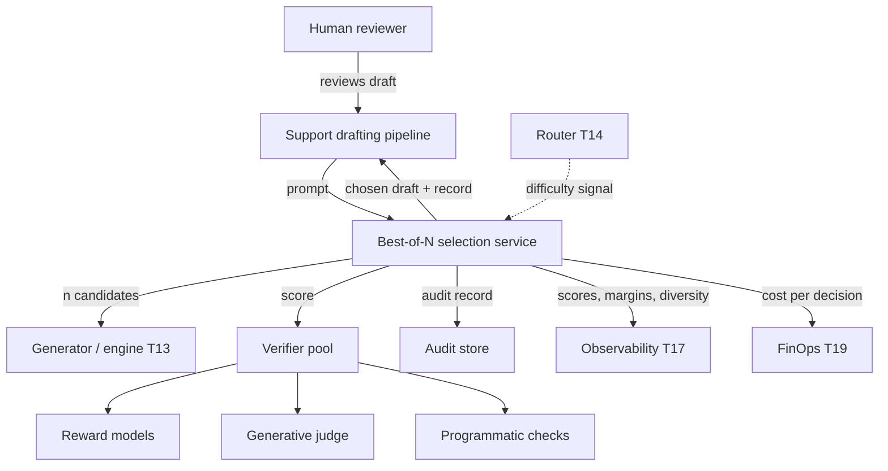
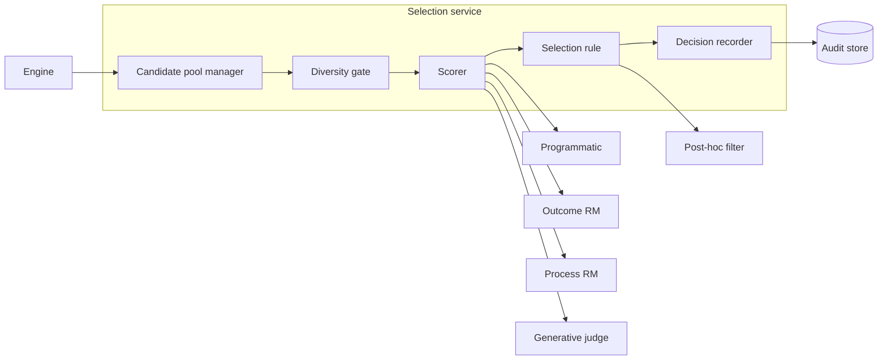
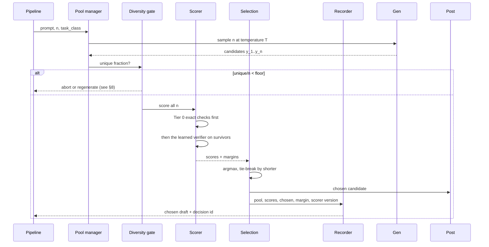
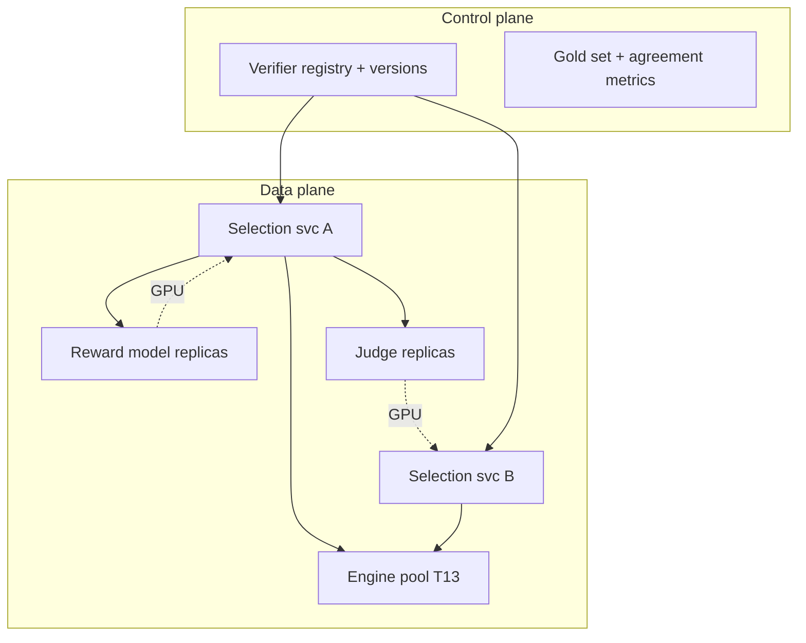

# T05 — Verifiers and Best-of-N: high-level design

> `T05` · **Transcript coverage:** primary · [Cheat sheet](../../00-cheat-sheets/T05-verifiers-best-of-n.md) · [Case study](../../01-case-studies/T05-verifiers-best-of-n.md) · [Interview bank](../../02-interview-questions/T05-verifiers-best-of-n.md) · **Companions:** [LLD](LLD.md) · [production/](production/README.md) · [SEQUENCES](docs/SEQUENCES.md)

**What this blueprint designs.** A **selection service**: given a prompt, draw `n` candidate
completions, score each with the strongest verifier available, and return the best. It is the
serving-system counterpart of T04's test-time-compute controller — T04 decides *how many* samples to
draw, T05 decides *which one wins*.

**Why it is a separate system and not a flag.** Best-of-N without a verifier is random selection with
extra steps. The entire value lives in the scorer, and the scorer is where every interesting failure
mode lives: it has biases (verbosity), it has provenance questions (whose preferences?), it can be
gamed, and it is far cheaper than generation — which is the fact that makes the whole architecture
tractable.

**Provenance.** `[T]` transcript · `[R]` supporting repo · `[D]` derived. Every corpus figure is
attributed inline. No benchmark number in this document was measured by this project.

---

## 1. Problem and scope

A support-drafting pipeline produces a customer-facing reply for a human agent to review. The
requirements are asymmetric: a wrong draft costs a human's time and risks a wrong answer reaching a
customer, while a slow draft costs nothing — the human is already there. That asymmetry is what makes
Best-of-N the right architecture and what makes an *expensive* verifier acceptable.

**In scope.** Candidate generation, verifier selection and scoring, diversity management, the
selection rule, the audit trail for each decision, cost accounting for the `n×` multiplier.

**Out of scope.** The drafting model itself; the human review UI; the customer's CRM. Also out of
scope: **training** a reward model — this blueprint consumes one, and the "build vs buy" section
covers what it takes to acquire one either way.

**The one-sentence design.** Generate `n` candidates, rank with the strongest verifier the task can
support, return the top one, and **record why** — because the selection decision is an auditable
policy action, not an implementation detail.

---

## 2. Requirements

### Functional

| # | Requirement |
|---|---|
| F1 | Given a prompt, produce `n` candidates at a configured temperature |
| F2 | Score every candidate with a verifier chosen per task class |
| F3 | Return the argmax, with the runner-up retained for audit |
| F4 | Support verifier types: programmatic, outcome RM, process RM, generative judge |
| F5 | Enforce a diversity floor — abort or regenerate if the pool is degenerate |
| F6 | Emit a per-decision audit record: pool, scores, chosen, margin |
| F7 | Support a post-hoc filter stage, distinct from the scorer |
| F8 | Degrade to `n = 1` (greedy) under load without failing the request |

### Non-functional

| # | Requirement | Target |
|---|---|---|
| N1 | p95 added latency over single-sample | budgeted, not aspirational — see §10 |
| N2 | Cost multiplier | reported per task class; `n` plus verifier cost |
| N3 | Diversity | unique-answer fraction in the pool measured, not assumed |
| N4 | Auditability | every selection reproducible from the record |
| N5 | Determinism of *scoring* | scores are deterministic given a fixed scorer version |
| N6 | Scorer versioning | model id + prompt hash + params recorded per decision |

**N5 is the subtle one.** Generation is non-deterministic even at temperature 0 `[T]` CMU lecture 2 —
so the *pool* cannot be reproduced. What can be, and must be, is the *scoring*: given the same pool
and the same scorer version, the same candidate wins. Without that, the audit record proves nothing.

### Constraints and non-goals

- The generator is fixed; this system does not train it.
- **No verifier is trusted without a measured agreement number** (§5.4).
- Latency is a secondary objective; correctness of the draft is primary.
- The system does not attempt to make Best-of-N *cheap*. It attempts to make it *worth it*.

---

## 3. System context (C4 L1)



The dashed line is the coupling with T04/T14: a difficulty router decides whether a request is worth
`n` samples at all, and T05 takes that as an input rather than re-deriving it. **A selection service
that is asked to run on every request is a cost incident**, not a design.

---

## 4. Container view (C4 L2)



**The ordering is the design.** Diversity is checked **before** scoring: scoring a degenerate pool is
wasted verifier compute, and it is the most common way teams discover that their `n = 32` was really
`n = 3` distinct answers. §6 covers the failure; the placement of the gate prevents paying for it.

---

## 5. Component view (C4 L3) — the verifier, which is the whole system

### 5.1 The verifier hierarchy — always prefer the strongest exact signal

`[T]` The corpus is unambiguous that a **programmatic check beats a learned one** whenever you can
write it, because it is exact and costs approximately nothing. For code that is a unit test, a
compiler or a type checker — "the strongest verifier that exists" `[T]`. For structured output it is a
schema validator. For a support draft the exact checks are narrower but real: does it cite a policy
that exists, does it promise something the account is not entitled to, does it contain a
prohibited phrase, is the customer's name spelled as the CRM has it.

| Tier | Verifier | Signal | Cost per candidate | When |
|---|---|---|---|---|
| 0 | **Programmatic** | exact | ~0 | whenever a check can be written |
| 1 | **Outcome RM (ORM)** | learned, sequence-level | 1 forward | no rule exists; preference data available |
| 2 | **Process RM (PRM)** | learned, per-step | 1 forward per **step** | long reasoning, error is mid-trajectory |
| 3 | **Generative judge** | prompted LLM | 1 **generation** | flexibility; no training data |
| 4 | **Critic reranking over rollouts** | learned | ~**16×** inference `[T]` | high-value, 2× accuracy worth 16× cost |

**Tier 0 first is a rule, not a preference.** The corpus's own measured result is that a judge can be
made *strictly better* by adding deterministic criteria to it `[T]` — the deterministic part is free
and exact, and the learned part covers only what remains. Any design that reaches for a judge before
enumerating its programmatic checks has skipped the cheapest and most reliable tier.

### 5.2 The KL bound, and the way it is usually misquoted

This is the single most-fumbled item in the corpus, so the design document states it carefully.

```
KL(P_bon || P_target) ≤ log n − (n − 1)/n
```

The lecture is explicit that this is the divergence between **your best-of-N outputs distribution and
your target distribution** `[T]` — *not* the base policy. Three consequences the design depends on:

1. **The price of selection grows only as `log n`.** Best-of-N moves the policy with no gradient step
   and no training run. That is why it is attractive at all.
2. **Both sides rise with `n`.** More samples buy a more aggressive selection, and the bound on the
   divergence you have created rises with it. There is no monotonicity paradox here — a claim that
   "the bound increases while the quantity it bounds decreases" is simply a misreading.
3. **The bound is loose.** It is routinely quoted as exact. The lecture notes it is **not tight** and
   cites a tighter result at a later paper's equation 25 `[T]`. Empirical measurements sit below the
   bound line. **Design against the measured divergence, not against the bound.**

The design implication: the bound is a *sanity ceiling* on how far from the target preference
distribution a selection policy can drift, and it justifies treating Best-of-N as safe to apply
without a training loop. It is not a tuning target.

### 5.3 Choosing `n`: the hardware argument, not the accuracy argument

`n = 10` or `100` are named `[T]`. The specific figure the corpus singles out is **`n = 32`**, and the
reason is the one a system designer should internalise: **32 fits in one batch**. The 33rd sample
requires a second pass or a second GPU `[T]`.

```
n = 32  -> one batch, one pass
n = 33  -> two batches, and the second is 97% empty
```

This is why `n` is a *systems* parameter as much as a statistical one, and it is why the capacity
model in §10 is written in terms of batches rather than in terms of samples. A team that picks `n` on
accuracy grounds alone will pick 40 and pay for two passes.

### 5.4 Trusting the verifier: the agreement number

**A verifier you have not measured is not a verifier.** The design requires every scorer to carry an
agreement figure against a human-labelled gold set:

```
agreement = |scorer agrees with human| / |gold set|
```

and requires that the figure be re-measured when the scorer's model, prompt or version changes.
`[D]` as a rule; `[R]` the guide's eval chapter. This is the same discipline T17 applies to
LLM-as-judge, and it exists here because the selection decision is *invisible*: a bad scorer produces
a plausible draft, not an error.

### 5.5 Diversity — the pool is usually smaller than you think

`[T]` At **temperature 0.2, 100 draws produce only ~20 unique outputs.** A `n = 32` Best-of-N over a
low-temperature generator is not 32 candidates; it is a handful of candidates and a lot of duplicates.

Two design responses, and the second is the one that matters:

1. **Measure the unique fraction** (`unique / n`) and record it per decision. The diversity gate
   (§4) exists to act on it.
2. **Do not fix it by raising temperature blindly.** Temperature raises diversity *and* lowers the
   quality of each candidate, so the best-of-N gain can fall as the pool improves. The right move is
   the one the corpus's other result points at: if the generator is too peaked, that is a *generator*
   property to address — or a case for a PRM, which can distinguish candidates that agree on the
   final answer but differ in trajectory `[T]`.

### 5.6 The judge's biases — verbosity is the direction that reverses

`[T]` The corpus names position bias, length/verbosity bias and self-preference (Jung et al. 2023).
For a **selection** system, verbosity bias is the dangerous one, and it is dangerous in a specific
direction: judges prefer longer answers, so Best-of-N **selects for length** even when length is
uncorrelated with quality. The consequence is a system that monotonically inflates its outputs over
time with no quality change — and the inflation is invisible because it looks like thoroughness.

Mitigations the design specifies: randomise candidate order across the pool (kills position bias),
pin or normalise length before scoring (kills verbosity bias), use a **different model family** for
the judge than the generator (kills self-preference), and **measure agreement** (§5.4). Cross-family
is not a nicety: a judge from the same family systematically prefers its own family's outputs `[T]`.

### 5.7 Reward models can beat the generator — and the design should know when

`[T]` The corpus notes reward models can outperform the generator that produced the candidates. This
is not a paradox: the reward model is trained on *preference* data, which encodes what people want,
while the generator is trained on *next-token* data, which encodes what people write. Where those
diverge — and for customer-facing drafts they diverge constantly — the verifier is the better guide.
The design consequence is that the verifier's capability is the binding constraint on the whole
system, which is why §5.4's agreement figure is a first-class production metric.

### 5.8 The measured version of this idea

`[T]` Critic reranking over rollouts on SWE-bench: **20% → 32%**, at **~16×** inference cost, with a
roughly **constant gain per doubling of rollouts**. Two design readings: the gain is real and
substantial, and it has a *shape* — constant per doubling means the curve is logarithmic in cost, so
there is a point past which the next doubling is not worth 2× more compute. That is the same
logarithm as the KL bound, seen from the cost side.

---

## 6. Data flow



**Tier 0 runs first and can short-circuit.** A candidate that fails an exact check is eliminated
without spending a learned-verifier forward pass on it. This is where the cost model in §10 gets its
best lever: exact checks are free, and they remove candidates from the expensive tier.

**The tie-break is specified, not incidental.** Equal scores break toward the **shorter** candidate,
because the judge's verbosity bias (§5.6) makes ties disproportionately long. An unspecified
tie-break inherits the bias.

---

## 7. Deployment topology



**The scorer replicas are separate from the engine.** A reward model is a *different* model from the
generator, with a different memory footprint and a different batching profile — one forward per
candidate, no KV growth, no decode loop. Co-locating them on the generator's replicas forces one
scheduler to satisfy two incompatible shapes. This is the same argument T12 makes for prefill/decode
disaggregation, applied one level up.

---

## 8. Scaling strategy

| Signal | Response |
|---|---|
| Pool unique fraction falling | raise temperature *or* regenerate; do not silently score duplicates |
| Verifier queue depth rising | the verifier, not the generator, is the bottleneck — scale it separately |
| Added latency over budget | **degrade `n`**, do not degrade the verifier (§9) |
| `n = 32` pool spilling to a second batch | the batch-fit property is lost; cost rises non-linearly |
| Judge cost dominating | move candidates to a cheaper tier; keep the judge for the final few |
| Agreement drifting below threshold | **stop serving the verdict**; fall back to `n = 1` |

**The cascade is tiered, and it runs *down* the tiers under load but *never* skips the exact tier.**
Programmatic checks are cheap enough to survive any degradation. What degrades is the learned
verifier: judge → ORM → exact-only → greedy. A degraded system may return a worse draft; it must not
return an *unverified* one while claiming verification.

---

## 9. Failure domains and degradation

| Failure | Blast radius | Response |
|---|---|---|
| Scorer version skew across replicas | inconsistent selection | pin versions; registry is the only source |
| Judge timeout | request-level | fall back to the ORM for this decision; record the fallback |
| Degenerate pool | selection is meaningless | abort; regenerate with a higher temperature |
| Verifier gamed (reward hacking) | **systemic, silent** | red-team the scorer; monitor score-vs-quality drift |
| Verbosity inflation | **systemic, silent** | length-normalise; alert on mean chosen length |
| Self-preference | systemic | cross-family judge; measure |
| Audit record lost | no reproducibility | synchronous write before returning |
| Cost blowup | budget | `n` cap per task class; see T19 |

**Reward hacking deserves its emphasis.** A learned scorer is a proxy for quality, and Best-of-N
optimises the proxy hard — this is precisely what the KL bound describes. A scorer with a systematic
quirk will find it. The design defence is not a better scorer alone but a **continuous check that the
score-to-quality relationship holds**, which means holding out human labels and re-measuring
agreement on live traffic rather than only on the original gold set.

**The degradation rule, stated once.** Under any pressure the system reduces `n` and, if necessary,
the verifier tier — but it never returns a selected candidate while reporting a verification that did
not happen. Silent unverified verification is the one failure mode worse than a slow response.

---

## 10. Capacity model

The arithmetic a reviewer must be able to do on a whiteboard.

**Generation cost.** `n` samples at one batch when `n ≤ 32` `[T]`, so generation cost is
approximately `n ×` a single sample's decode cost, with the shared prompt prefilled once (T12/T16).

**Verifier cost, by tier.** The critical asymmetry: **generation is far more expensive than scoring**
`[T]`.

```
Tier 0 (exact)        : ~0                     -> run on all n, always
Tier 1 (ORM)          : 1 forward per candidate -> ~1/50 of a generation [D] illustrative
Tier 3 (judge)        : 1 GENERATION per pair   -> can exceed the generation cost itself
Tier 4 (critic rerank): ~16x inference [T]      -> only for high-value tasks
```

**The two-stage pattern that makes this affordable** `[D]`:

```
stage 1: generate n = 32 candidates             (2.4x a single sample's cost, one batch)
stage 2: Tier 0 exact checks on all 32          (~free; eliminates some)
stage 3: Tier 1 ORM on survivors                (cheap; rank)
stage 4: Tier 3 judge on the top k = 4          (expensive, but 4 not 32)
```

Scoring 4 candidates with a judge instead of 32 cuts the judge call count by 8× — and the judge is
where the dominant cost lives — while losing little, because the ORM has already done the coarse
ranking. The *total* ratio is smaller than 8× because the ORM pass is unchanged and is not free; the
judge is the tier that must be economised. **This is the single most valuable cost decision in the
blueprint**, and it is only available because the tiers have different price points.

**The batch boundary.** `n = 32` is not a round number; it is the batch size `[T]`. Crossing it costs
a second pass whose occupancy is `(n − 32)/32`. At `n = 40` you pay for two full batches to get 40
samples, an effective 25% waste. The capacity model should therefore be written in batches, and the
`n` cap should sit **on** the boundary, not above it.

**Added latency, honestly.** The honest statement: Best-of-N adds `n`-way generation plus verifier
time, mitigated by the fact that the `n` samples batch together, and the mitigation **fails at the
batch boundary**. There is no measured latency figure in this document because this project measured
none; a real deployment must measure it, and the corpus supplies no latency number for best-of-N.

---

## 11. Key design decisions

| # | Decision | Rationale | Rejected alternative |
|---|---|---|---|
| D1 | Verifier tiering, exact first | exact is free and reliable `[T]` | a judge for everything |
| D2 | Diversity gate **before** scoring | do not pay the verifier for duplicates | scoring then filtering |
| D3 | `n` capped at the batch boundary | `n=32` fits one batch `[T]` | accuracy-optimal `n`, extra passes |
| D4 | Scorer replicas separate from engine | incompatible batching shapes | co-location for simplicity |
| D5 | Cross-family judge | self-preference is real `[T]` | same-family judge |
| D6 | Length-normalised scoring; shorter tie-break | verbosity bias selects for length `[T]` | raw judge scores |
| D7 | Two-stage ORM → judge on top-k | cuts dominant cost ~8× | judge all `n` |
| D8 | Synchronous audit record | a lost record loses reproducibility | async audit |
| D9 | Degrade `n`, never the verification claim | unverified-but-reported is worse than slow | degrade the verifier silently |
| D10 | `n = 1` fallback under load | availability without lying | fail the request |

---

## 12. Build vs buy

| Component | Build | Buy / reuse | Recommendation |
|---|---|---|---|
| Programmatic checks | task-specific, always build | — | **build** — this is your domain knowledge |
| Outcome RM | needs preference data + training | hosted RM | **buy** unless you have labelled preferences |
| Process RM | needs step-level labels (expensive) | rare | build only with a strong reason |
| Generative judge | prompt + eval harness | any strong LLM | **buy**, but *measure agreement* yourself |
| Diversity / selection logic | trivial | — | build |
| Audit store | — | existing log infrastructure | reuse |

**The rule.** Buy the scorer; build the *checks* and the *agreement measurement*. The programmatic
checks encode what your business will not tolerate, which no vendor can supply. The agreement
measurement is what makes a bought scorer trustworthy in your domain, and it is the piece teams skip.

---

## 13. What to carry away

1. **The verifier is the system.** Best-of-N is trivial; scoring is where the value and every failure
   lives.
2. **Exact first, always.** A programmatic check is free and correct; a learned one is neither.
3. **`n = 32` because it fits a batch** `[T]` — a systems constraint wearing statistical clothes.
4. **Verbosity bias reverses the objective.** The judge prefers long, so Best-of-N selects for long.
5. **A verifier you have not measured is not a verifier.** Agreement on a gold set, per version.
6. **The KL bound is `log n` and it is loose** `[T]` — a safety ceiling, not a target.

## Sources

- `refs/CMU_Inference_Algorithms_for_Language_Modeling_Fall_2025_transcripts/CMU_LLM_Inference_12_Reward_Models_and_Best-of-N.txt` — `n = 10/100/32`, the batch-fitting argument, the KL bound and its looseness, temperature-0.2 diversity, post-hoc filters, reward-model-beats-generator
- `refs/CMU_Inference_Algorithms_for_Language_Modeling_Fall_2025_transcripts/CMU_LLM_Inference_11_Agents_and_Multi-Agent_Communication.txt` — critic reranking 20→32% at ~16×
- `refs/CMU_Inference_Algorithms_for_Language_Modeling_Fall_2025_transcripts_2/CMU_LLM_Inference_2_Probability_Review_and_Code_Examples.txt` — non-determinism at temperature 0
- `refs/LLMOps_Agentic_AIOps_The_Hands-On_Playlist_2026_transcripts/How_to_Evaluate_LLM_Apps_LLM-as-a-Judge_RAGAS_Without_the_Bias.txt` — judge bias sources, agreement measurement
- `refs/ai-system-design-guide-main/04-inference-optimization/` `[R]` — supporting reference for the capacity model
