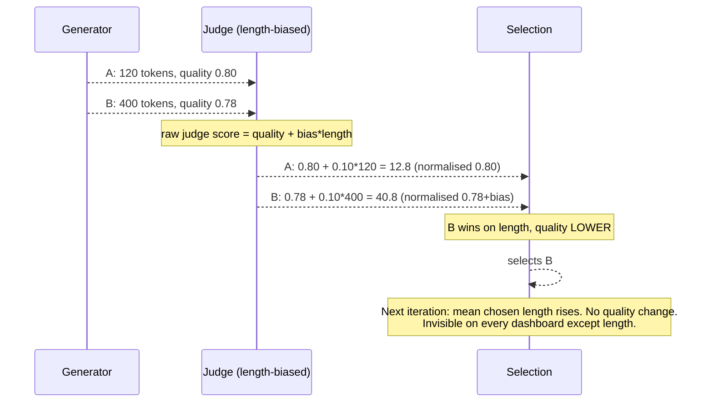
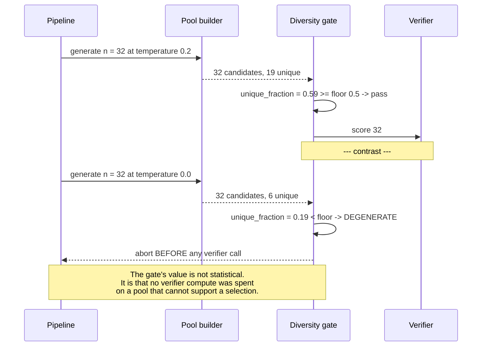

# T05 — Verifiers and Best-of-N: low-level design

> `T05` · **Transcript coverage:** primary · [HLD](HLD.md) · [Cheat sheet](../../00-cheat-sheets/T05-verifiers-best-of-n.md) · [Case study](../../01-case-studies/T05-verifiers-best-of-n.md) · [Interview bank](../../02-interview-questions/T05-verifiers-best-of-n.md)

Buildable specification for the selection service described in the [HLD](HLD.md). Module
responsibilities, data structures, interface contracts, the selection state machine, sequence
diagrams, concurrency, error handling, the configuration surface, resource accounting and the test
strategy.

**Scope.** The HLD decides *what*: tier the verifiers exact-first, gate diversity before scoring, cap
`n` at the batch boundary, buy the scorer and measure it yourself. This document specifies *how*. The
runnable core in `sim/` implements the mechanisms at toy scale — it runs no model and is **not a
benchmark**.

**Provenance.** `[T]` transcript · `[R]` repo · `[D]` derived. Corpus figures are attributed in the
[HLD §10 capacity model](HLD.md); nothing here is a measured result.

---

## 1. Module map

```
T05-verifiers-best-of-n/
  run.py                 driver: six experiments, prints, exits 0
  sim/
    __init__.py          package marker; re-exports the public surface
    candidates.py        Candidate, Pool, diversity measurement and the gate
    verifiers.py         the tier hierarchy, bias models, agreement measurement
    selection.py         argmax + tie-break, margin, the KL bound, rejection sampling
    experiments.py       the six scenarios, each returning a report
  production/            reference-grade configs (not executed — no GPU)
  docs/SEQUENCES.md      end-to-end flows with failure annotations
```

Split by mechanism, because each has a closed-form model testable in isolation. `experiments.py` is
the only module that spans more than one.

| Module | Owns | Depends on |
|---|---|---|
| `candidates.py` | pool construction, unique-fraction, the gate | — |
| `verifiers.py` | tiers, scoring, bias, agreement | `candidates.py` |
| `selection.py` | the selection rule, margin, KL bound, acceptance | `candidates.py` |
| `experiments.py` | scenario wiring and reporting | all three |

No module performs I/O except the experiment functions, which print. `__init__.py` re-exports so
`run.py` has one import line. Nothing in `sim/` imports `run.py`.

---

## 2. Data structures

Plain `dict`/`tuple`/`dataclass` shapes; no behaviour beyond what is stated. Every type below is a
contract between modules, and the invariants are the parts that matter.

### 2.1 `Candidate`

```python
@dataclass(frozen=True)
class Candidate:
    id: str              # stable within a pool
    text: str            # the completion
    length: int          # tokens — read by the verbosity-bias path, never by the scorer
    logprob: float       # the generator's own score; an INPUT, never the selection signal
    meta: dict           # task-specific fields the programmatic tier needs
```

**`logprob` is present but is never the selection signal.** A generator's own log-probability is
systematically biased toward what it already produces, so selecting on it degenerates to greedy
decoding with extra steps. It is carried for diagnostics only. This is stated as an invariant because
using it is the most natural mistake a builder makes.

### 2.2 `Pool`

```python
Pool = {
    "prompt": str,
    "candidates": list[Candidate],     # len == n requested, unless generation short-fell
    "requested_n": int,
    "unique_fraction": float,          # distinct text / len(candidates)
    "degenerate": bool,                # unique_fraction < floor
}
```

**Invariant.** `unique_fraction == len({c.text for c in candidates}) / len(candidates)`, computed from
`text` exactly — no normalisation, no fuzzy matching. Whether near-duplicates should count as distinct
is a **task** decision, and the LLD declines to make it silently: a task that wants semantic
deduplication supplies its own `dedup_key` in `meta` and the gate reads that instead.

### 2.3 `Scores` and `Decision`

```python
Scores = {
    "candidate_id": str,
    "tier": int,             # 0..4 — the tier that produced this score
    "score": float,          # higher is better; all tiers return this orientation
    "eliminated": bool,      # True if a Tier-0 check failed
    "reason": str | None,    # why eliminated
}

Decision = {
    "decision_id": str,
    "chosen": str,           # candidate id
    "runner_up": str | None,
    "margin": float,         # chosen.score - runner_up.score
    "tier_used": int,        # the most expensive tier actually consulted
    "n_scored_by_tier": dict,  # {"0": 32, "1": 28, "3": 4} — the cost record
    "scorer_version": str,
    "degraded": bool,        # True if n or tier was reduced under load
    "diversity": float,
}
```

**`n_scored_by_tier` is the resource-accounting record, and it is not optional.** The HLD's
two-stage pattern (exact on all, ORM on survivors, judge on top-k) is the single biggest cost lever in
the blueprint, and it is unverifiable without this field. A decision record that cannot say how many
candidates reached the judge cannot support a cost claim.

### 2.4 `Verifier`

```python
VerifierSpec = {
    "name": str,
    "tier": int,
    "kind": "programmatic" | "orm" | "prm" | "judge",
    "model_id": str | None,       # None for programmatic
    "prompt_hash": str | None,    # required for judge — the judge IS its prompt
    "version": str,               # semantic; recorded per decision
    "agreement": float | None,    # measured vs gold set; None until measured
    "cost_per_call": float,       # in normalized units, never currency
}
```

**`agreement is None` means the verifier may not be used in production.** The type permits the
unmeasured state so that a development harness can run, and the *loader* rejects it in a production
profile. Making the field optional at the type level and mandatory at the config level is deliberate:
it forces the gap to be visible rather than defaulting to a plausible number.

---

## 3. Interface contracts

### 3.1 `candidates.py`

```python
def make_candidate(cid, text, length, logprob, meta=None) -> Candidate
def build_pool(prompt, candidates, floor=0.5, dedup_key=None) -> Pool
def unique_fraction(candidates, dedup_key=None) -> float
def diversity_gate(pool, floor) -> tuple[bool, str]   # (passes, reason)
```

`build_pool` never raises on a degenerate pool — it sets `degenerate=True` and returns. The *caller*
decides whether to abort, regenerate or proceed, because those are policy choices the HLD §8 assigns
to the pipeline rather than to the pool builder.

### 3.2 `verifiers.py`

```python
def programmatic_score(candidate, rules) -> Scores          # tier 0, exact
def orm_score(candidate, weights) -> Scores                 # tier 1, one forward
def prm_score(candidate, steps, weights) -> Scores          # tier 2, per step
def judge_score(candidate, pool_position, length_bias, family, generator_family) -> Scores  # tier 3
def tiered_score(candidates, rules, top_k, ...) -> tuple[list[Scores], dict]
def measure_agreement(scorer, gold_set) -> float
```

**The bias model in `judge_score` is explicit and is the point of the function.** Its parameters are
`pool_position` (position bias), `length_bias` (verbosity), and `family` vs `generator_family`
(self-preference). The function can be run with each set to zero to isolate its effect, which is what
`exp_verbosity_bias` and `exp_judge_family` do. A judge simulated as an unbiased oracle would make
the experiments vacuous.

**`tiered_score` returns the tier-usage dict.** It runs tier 0 on all candidates, eliminates failures,
runs tier 1 on survivors, and tier 3 on the top `k` — never the full pool. The returned
`{"0": n, "1": n', "3": k}` is what `Decision.n_scored_by_tier` copies.

### 3.3 `selection.py`

```python
def select(scores, candidates, tie_break="shorter") -> tuple[str, str | None, float]
def kl_bound(n) -> float                       # log n - (n - 1)/n
def acceptance_probability(p_x, q_x, C) -> float
def rejection_sample(pool, weights, C, rng) -> Candidate | None
```

**The tie-break is a parameter with a non-arbitrary default.** `"shorter"` because the judge's
verbosity bias makes ties disproportionately long (HLD §5.6). `"first"` and `"random"` are available
and are wrong defaults for a judged system.

**`kl_bound(n) = log n − (n−1)/n`** is transcribed directly from the corpus `[T]` and is used
**only** as a ceiling in the experiments, never as a target. The LLD states this because the most
common misuse is treating it as a quantity to be maximised.

### 3.4 `experiments.py`

| Function | Proves |
|---|---|
| `exp_kl_bound` | the bound rises with `n` as `log n − (n−1)/n`, and the measured divergence sits **below** it |
| `exp_batch_boundary` | cost is flat up to `n = 32` and steps at 33; the waste at `n = 40` |
| `exp_diversity` | at low temperature a large `n` yields few unique candidates; the gate fires |
| `exp_verbosity_bias` | a length-biased judge selects longer, with no quality gain |
| `exp_tiered_cost` | the two-stage pattern cuts the judge call count from n to k at equal selection quality |
| `exp_judge_family` | a same-family judge systematically prefers its own family's outputs |

Each returns `None` and prints. No experiment asserts a corpus number; they assert **relations**, and
the corpus numbers live in the HLD with attribution.

---

## 4. State machine — one selection decision

```
        ┌───────────┐
        │  ADMITTED │  n, task_class, verifier set resolved from the registry
        └─────┬─────┘
              │ generate n candidates
              ▼
        ┌───────────┐
        │ GENERATED │  pool built; unique_fraction computed
        └─────┬─────┘
              │
       ┌──────┴───────┐
       │              │
   unique >= floor  unique < floor
       │              │
       ▼              ▼
  ┌─────────┐   ┌──────────────┐
  │ SCORING │   │ DEGENERATE   │──▶ ABORT or REGENERATE (policy at the call site)
  └────┬────┘   └──────────────┘
       │ tier 0 on all -> eliminate
       │ tier 1 on survivors
       │ tier 3 on top-k
       ▼
  ┌─────────────┐
  │ SCORED      │  every surviving candidate has exactly one effective score
  └──────┬──────┘
         │
    ┌────┴─────┐
    │          │
 survivors>0  survivors=0
    │          │
    ▼          ▼
┌─────────┐ ┌────────────────┐
│ SELECTED│ │ ALL_ELIMINATED │──▶ fall back to n=1 greedy, record degraded=True
└────┬────┘ └────────────────┘
     │
     ▼
┌──────────────┐
│ RECORDED     │  synchronous write; then and only then return
└──────────────┘
```

**Three terminal outcomes, and the distinction is operational.** `SELECTED` is normal.
`DEGENERATE` means the pool could not support a selection — the pipeline's choice is to regenerate
(expensive, may fail again) or accept a worse draft. `ALL_ELIMINATED` means every candidate failed an
exact check, which is a **generator or prompt problem**, not a scoring problem: the model cannot
produce an acceptable answer to this prompt at any `n`. Conflating it with `DEGENERATE` sends
operators to the wrong component.

**`RECORDED` precedes the return, and it is a hard ordering.** An async audit write means a crash
between selection and recording loses the only evidence of how the draft was chosen. The record is
synchronous; the *store* may be fast or slow, but the write completes first.

---

## 5. Sequence diagrams

### 5.1 The tiered scoring cascade — where the cost is saved

```mermaid
sequenceDiagram
    participant S as Selection svc
    participant T0 as Tier 0 (exact)
    participant T1 as Tier 1 (ORM)
    participant T3 as Tier 3 (judge)
    participant R as Recorder

    Note over S: n = 32 candidates
    S->>T0: check all 32
    T0-->>S: 28 pass, 4 eliminated
    S->>T1: score 28 (1 forward each)
    T1-->>S: ranked
    S->>T3: score top k = 4 (1 generation each)
    T3-->>S: judge scores
    S->>S: argmax over the 4; tie-break shorter
    S->>R: Decision{n_scored_by_tier: {0:32, 1:28, 3:4}}
```

**The saving is the whole design.** Judging all 32 costs 32 judge generations; judging 4 costs 4. The
ORM's coarse ranking makes the judge's job a *comparison among near-equals*, which is what judges are
best at, rather than a search over the whole pool.

**Where this fails.** If the ORM's top-4 omits the true best candidate, the judge can never recover
it. The cascade inherits the ORM's recall at `k`, and **`k` is a recall parameter, not a cost
parameter** — the design must measure "how often is the eventual human-preferred candidate in the
ORM's top-k?" and set `k` from that. Setting `k = 4` because 4 is cheap is how the cascade silently
caps quality.

### 5.2 The verbosity reversal



**This is the failure a selection system most reliably ships with.** Quality is flat, length inflates,
and the only visible symptom is that drafts get longer — which reads as thoroughness. The design
responses are all in `judge_score`'s signature: length-normalise, randomise `pool_position`,
cross-family. `exp_verbosity_bias` runs the case with `length_bias` at zero and non-zero to make the
reversal explicit.

### 5.3 Degenerate pool — the gate that saves the verifier bill



**The corpus's number behind this.** At temperature 0.2, 100 draws produce only ~20 unique outputs
`[T]`. A team that assumes `n = 32` means 32 distinct candidates will build a pipeline whose effective
`n` is a fraction of what they configured, and will not know it — because duplicates score identically
and the argmax is unaffected. The unique fraction is the field that makes it visible.

---

## 6. Concurrency and resource accounting

**Within one decision: parallel, with a serialised reduce.** The `n` candidates are independent; their
scoring is independent given a stateless scorer. The contract:

```
generate(prompt, n)          -> list[Candidate]     parallel
score_tier(candidates, tier) -> list[Scores]        parallel
reduce(scores)               -> list[Scores]        single-writer, serialised
```

**The judge is the exception and must be serialised per decision.** A judge scoring candidates is a
generative call whose *context includes the pool ordering* if the prompt presents candidates
comparatively. Two judge calls in the same decision that share a comparison context cannot run
concurrently without a defined ordering — and the ordering is what position bias acts on. The rule:
**position-randomise once, before fan-out, and record the permutation.**

**Across decisions: fully independent.** No shared state; the scorer registry is read-only at
serving time and version-pinned.

| Resource | Accounted by | Guard |
|---|---|---|
| Generation samples | `n`, `requested_n` | `n` cap, at the batch boundary |
| Verifier calls | `Decision.n_scored_by_tier` | two-stage cascade |
| Judge generations | `n_scored_by_tier["3"]` | `top_k` |
| Candidate tokens | `Candidate.length` | the verbosity alert |
| Added latency | not modelled offline | measured in production, per HLD §10 |

**Cost units are normalised, never currency.** `VerifierSpec.cost_per_call` is in dimensionless units
for the same reason T16's budget is: the corpus asserts no price, and a currency default would be a
fabricated number carrying the authority of a config file.

---

## 7. Error handling

| Failure | Detection | Response |
|---|---|---|
| Generation short-fell (`len < n`) | `len(candidates) < requested_n` | proceed if `unique_fraction` passes; record the shortfall |
| Degenerate pool | `unique_fraction < floor` | `DEGENERATE` — abort or regenerate, pipeline's choice |
| All candidates eliminated | zero survivors | `ALL_ELIMINATED` — fall back to `n=1`, `degraded=True` |
| Judge timeout | no response within budget | fall back to the ORM's ranking; record `tier_used` accordingly |
| Verifier version mismatch | registry vs replica | reject the replica; a partial version skew is worse than an outage |
| `agreement is None` in production | loader check | refuse to start |
| Score ties beyond the tie-break | equal scores and equal lengths | deterministic by `candidate.id` — last resort, still deterministic |
| Audit write failure | recorder raises | **fail the decision** — do not return an unrecorded selection |

**The last row is the strongest policy in the table and it is deliberate.** Every other failure
degrades quality; an unrecorded selection loses the ability to explain, after the fact, why a
customer received a particular draft. For a customer-facing support pipeline that is the failure with
the worst tail, so the design chooses to fail closed.

**`ALL_ELIMINATED` is routed to the generator, not the scorer.** The error message must say so
explicitly, because the natural instinct on seeing "everything scored zero" is to debug the verifier.

---

## 8. Configuration surface

```python
SelectionConfig = {
    "n":                32,     # [T] fits one batch; crossing it costs a second pass
    "n_cap":            32,     # on the boundary, never above it
    "temperature":      0.8,    # [D] balance: low temps make the pool degenerate [T] at 0.2
    "diversity_floor":  0.5,    # [D] unique fraction; the gate's threshold
    "top_k_for_judge":  4,      # [D] a RECALL parameter, not a cost parameter (LLD §5.1)
    "tie_break":        "shorter",   # [D] because judges prefer long (HLD §5.6)
}

VerifierConfig = {
    "tier0_rules":      [...],   # task-specific exact checks; always on
    "tier1_model":      "orm",   # [D]
    "tier3_model":      "judge", # must be a DIFFERENT FAMILY from the generator
    "length_normalise":  True,   # [D] kills verbosity bias
    "randomise_order":   True,   # [D] kills position bias
    "require_agreement": True,   # [D] refuse to serve an unmeasured verifier
    "min_agreement":     0.75,   # [D] per-verifier floor
}

DegradationConfig = {
    # The order in which quality is given up under load. Tier 0 is NEVER in this list.
    "cascade": ["tier3", "tier1", "n"],
    # What is never surrendered: the verification CLAIM (HLD §9).
    "never":   ["tier0_exact", "audit_record", "agreement_check"],
}
```

**`top_k_for_judge` being a recall parameter is the line most likely to be mis-set.** Its default of
4 is illustrative; a real deployment sets it from the measured recall of the ORM's top-k against human
preference, and raises it whenever the cascade is found to be capping quality.

---

## 9. Test strategy

| Layer | What is tested | How |
|---|---|---|
| Invariants | `logprob` never enters the selection rule; `unique_fraction` computed from exact text | assertions in `selection.select` and `candidates.unique_fraction` |
| Orientation | every tier returns higher-is-better | a single test asserting all tier outputs share orientation |
| The bound | `kl_bound(n)` matches `log n − (n−1)/n`; measured divergence ≤ bound | `exp_kl_bound` — inequality, not equality, on the divergence |
| Batch boundary | cost flat to 32, steps at 33; waste at 40 | `exp_batch_boundary` — the step, not an absolute cost |
| The gate | a low-temperature pool trips `DEGENERATE` before any verifier call | `exp_diversity` — asserts the verifier call count is 0 |
| Bias isolation | with `length_bias=0` the reversal does not occur; with it, it does | `exp_verbosity_bias` — asserts the *difference* |
| Cascade quality | the two-stage cascade matches full-judge selection on the designed pool | `exp_tiered_cost` — asserts equal choice at lower cost |
| Family bias | a same-family judge prefers its family's outputs | `exp_judge_family` — the direction |
| Determinism | the same pool and scorer version give the same winner | fixed seeds via `make_rng` |

**What is deliberately not tested.** No test asserts a corpus number — the corpus supplies `n = 32`,
`~20 unique at temperature 0.2` and the `20→32%` critic result, and those are checked by provenance
review, not execution. A reader who assumes `run.py` validates them would be wrong.

**The one integration test that matters.** Score the *same* pool twice with the same scorer version
and assert the winner is identical. Generation is non-deterministic `[T]`, so the pool cannot be
reproduced; the scoring must be, or the audit record proves nothing (HLD N5).

---

## 10. Build order

1. `candidates.py` — shapes, the pool, the unique fraction, the gate.
2. `verifiers.py` — tier 0 first (exact, trivial), then the ORM, then the biased judge.
3. `selection.py` — argmax and tie-break, margin, `kl_bound`, rejection sampling.
4. `experiments.py` — one function per mechanism.
5. `run.py` — driver, fixed seeds.
6. `production/` — registry, cascade, agreement-gate configs.

## Sources

- `refs/CMU_Inference_Algorithms_for_Language_Modeling_Fall_2025_transcripts/CMU_LLM_Inference_12_Reward_Models_and_Best-of-N.txt` — tiers, `n = 32` batch fit, the KL bound and looseness, temperature-0.2 diversity, post-hoc filters, reward-model-beats-generator
- `refs/CMU_Inference_Algorithms_for_Language_Modeling_Fall_2025_transcripts/CMU_LLM_Inference_11_Agents_and_Multi-Agent_Communication.txt` — critic reranking 20→32% at ~16×
- `refs/CMU_Inference_Algorithms_for_Language_Modeling_Fall_2025_transcripts_2/CMU_LLM_Inference_2_Probability_Review_and_Code_Examples.txt` — non-determinism at temperature 0
- `refs/LLMOps_Agentic_AIOps_The_Hands-On_Playlist_2026_transcripts/How_to_Evaluate_LLM_Apps_LLM-as-a-Judge_RAGAS_Without_the_Bias.txt` — position, verbosity and self-preference bias

**Derived content in this document (`[D]`):** every data structure, signature, state transition,
invariant and sequence diagram. The corpus supplies the mechanisms, the batch-fit argument and the
bias list; it supplies no implementation.
