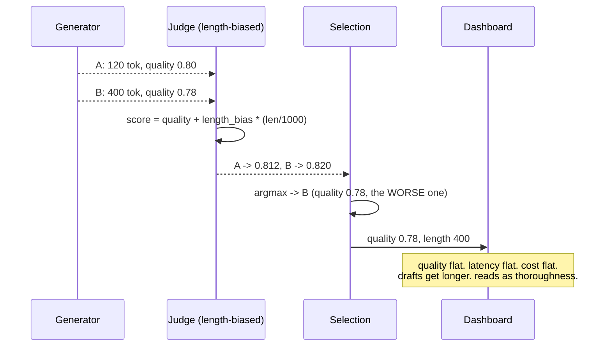
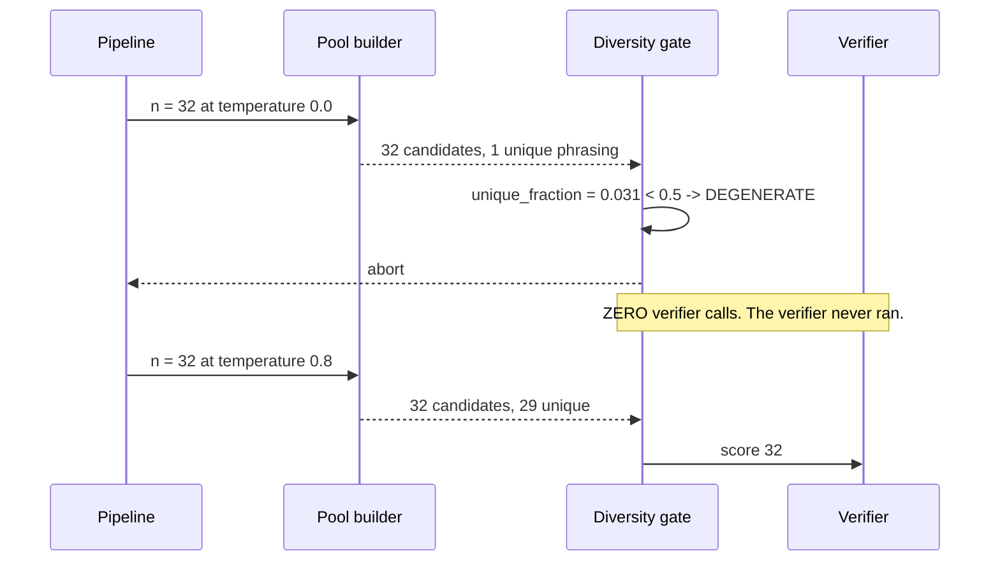
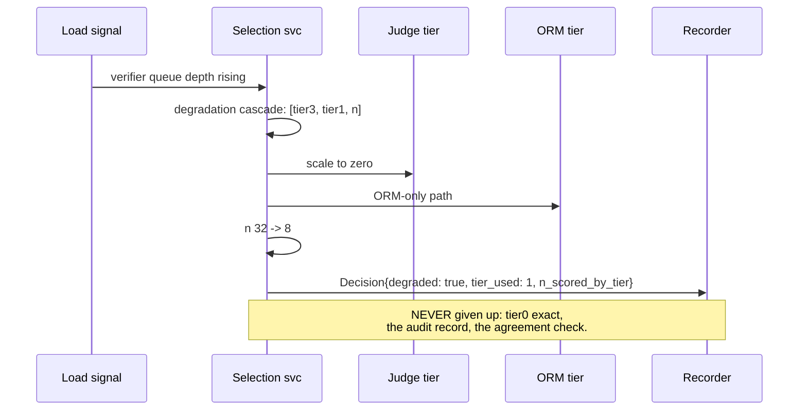
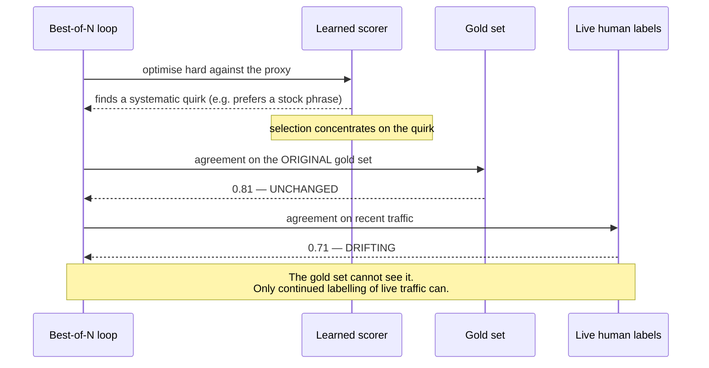

# T05 — Sequences: Verifiers and Best-of-N, End to End

> **Transcript coverage:** primary · [HLD](../HLD.md) · [LLD](../LLD.md) · [production/](../production/README.md)

Five flows. Each ends with **where this fails**. In a selection system the failures are *silent* far
more often than loud — a biased judge produces a plausible draft, not an error — so the failure
annotations are the part worth reading.

`[T]` transcript · `[R]` repo · `[D]` derived.

---

## 1. The full decision, happy path

```mermaid
sequenceDiagram
    participant P as Pipeline
    participant B as Pool builder
    participant D as Diversity gate
    participant T0 as Tier 0 (exact)
    participant T1 as Tier 1 (ORM)
    participant T3 as Tier 3 (judge)
    participant R as Recorder

    P->>B: prompt, n = 32, task_class
    B->>B: generate 32 candidates
    B-->>D: pool {unique_fraction: 0.81}
    D->>D: 0.81 >= floor 0.5 -> PASS
    D->>T0: check all 32 (cost 0)
    T0-->>D: 26 pass, 6 eliminated
    D->>T1: score 26 survivors (cost 26 x 0.02)
    T1-->>D: coarse ranking
    D->>T3: judge top 4 (cost 4 x 1.00)
    T3-->>D: fine ranking of the near-equals
    D->>D: argmax; tie-break SHORTER
    D->>R: Decision{chosen, margin, n_scored_by_tier:{0:32,1:26,3:4}, scorer_version}
    R-->>P: draft + decision_id
```

**Why the order is exact → ORM → judge and not the reverse.** Tier 0 is free and exact, so it runs on
everything and can *eliminate* before any expensive tier sees the candidate. Tier 1 is cheap and its
job is coarse ranking; tier 3 is expensive and its job is fine ranking among candidates that are
already close — which is what judges are actually good at. Reversing the order pays judge prices for
exact checks.

**Where this fails.** The cascade inherits the ORM's recall at `k`. If the eventual human-preferred
candidate is 7th by ORM score, the judge never sees it and cannot select it. `n_scored_by_tier["3"]`
records this so the limitation is at least *visible*, but the only real fix is measuring top-k recall
and setting `k` from the measurement. **`k = 4` because 4 is cheap is how the cascade silently caps
quality.**

---

## 2. The verbosity reversal — the failure that ships



**The number behind it** `[D]` from `exp_verbosity_bias`: at `length_bias = 0` the better candidate
wins; at `0.10` the longer, worse one does, and it keeps winning as the bias grows. The judge's
preference for long text is not a small perturbation — it is enough to flip a 0.02 quality gap at a
400-token length difference.

**Where this fails — and it fails invisibly.** There is no error, no quality regression, and no cost
change. The only visible symptom is that chosen outputs get longer over time, which reads as
thoroughness. That is why [judge-policy.yaml](../production/README.md) carries a
`chosen-length-inflation` alert and why `tie_break: shorter` is the default: an unspecified tie-break
inherits exactly this bias.

---

## 3. The diversity gate — saving the verifier bill



**The corpus's datum** `[T]`: at temperature 0.2, 100 draws produce only ~20 unique outputs. Measured
in the core at `n = 32`: temperature 0.0 → unique fraction 0.031; 0.2 → 0.50; 0.8 → 0.91.

**Where this fails.** A pool can pass the gate and still be *effectively* degenerate: two candidates
can differ by one character and count as distinct. The `unique_fraction` is computed on exact text, and
the LLD deliberately declines to make semantic deduplication a silent default — a task that wants it
supplies its own `dedup_key`. A team that leaves the default and finds its effective `n` is 4 has hit
this, and the fix is the dedup key, not a higher temperature.

---

## 4. Degradation under load — what is given up, and what never is



**The rule stated once.** Degradation may reduce `n` and may drop the judge. It may **not** return a
selected candidate while reporting a verification that did not run. Losing the judge is a quality
regression, and `degraded: true` on the record says so. Claiming a judge that did not run is a
correctness lie about the one thing the system exists to provide.

**Where this fails.** `degraded: true` is only useful if something reads it. A pipeline that ignores
the flag will ship ORM-only drafts at the same confidence as judged ones, and the flag becomes
decoration. The consuming contract: a degraded decision must be visibly marked in the human review UI.

---

## 5. Reward hacking — the slow, systemic failure



**Why this is the systemic failure.** A learned scorer is a *proxy* for quality, and best-of-N
optimises the proxy hard — which is exactly what the corpus's KL bound describes as the divergence you
create by selecting `[T]`. A scorer with a systematic quirk will be found by the optimiser, and the
symptom is a scorer whose score rises while human preference does not.

**Where this fails.** A frozen gold set cannot detect it, because the gold set is not being optimised
against — the live traffic is. `agreement-eval.yaml` therefore carries a `live_check` at a 1% sample
rate, and the design treats *drift between gold-set and live agreement* as the signal. This is the one
failure in the blueprint where the honest answer is "you cannot verify it once and be done".

---

## Sources

- `refs/CMU_Inference_Algorithms_for_Language_Modeling_Fall_2025_transcripts/CMU_LLM_Inference_12_Reward_Models_and_Best-of-N.txt` — reward models, the KL bound, temperature-0.2 diversity, exact-first tiering
- `refs/CMU_Inference_Algorithms_for_Language_Modeling_Fall_2025_transcripts/CMU_LLM_Inference_11_Agents_and_Multi-Agent_Communication.txt` — critic reranking
- `refs/LLMOps_Agentic_AIOps_The_Hands-On_Playlist_2026_transcripts/How_to_Evaluate_LLM_Apps_LLM-as-a-Judge_RAGAS_Without_the_Bias.txt` — judge biases and agreement measurement

**All sequence structure, state names and span attribute names are `[D]`.** Figures cited as `[D]` are
reproduced from this blueprint's own `run.py`; corpus figures are attributed inline.
