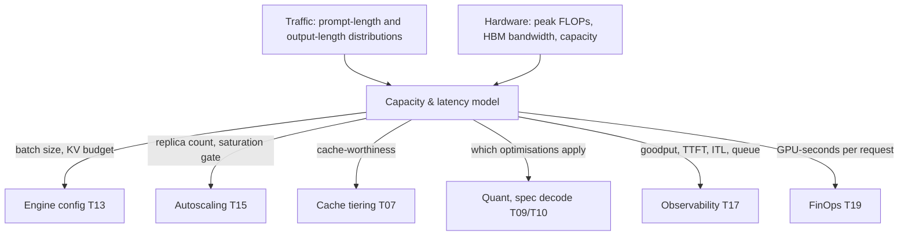
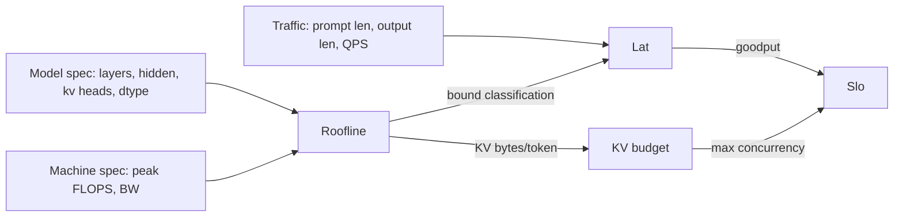
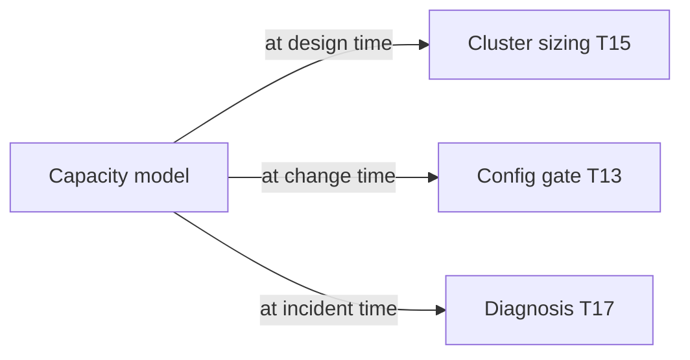

# T06 — Inference Fundamentals: high-level design

> `T06` · **Transcript coverage:** primary · [Cheat sheet](../../00-cheat-sheets/T06-inference-fundamentals.md) · [Case study](../../01-case-studies/T06-inference-fundamentals.md) · [Interview bank](../../02-interview-questions/T06-inference-fundamentals.md) · **Companions:** [LLD](LLD.md) · [production/](production/README.md) · [SEQUENCES](docs/SEQUENCES.md)

**What this blueprint designs.** A **capacity and latency model** — the thing you build before you
build anything else, because every later decision (batch size, parallelism, quantization, cache
tiering, autoscaling trigger) is a query against it. It is not a service. It is the model that tells
you what a service will do.

**Why it is a blueprint and not an appendix.** The corpus's single most useful sentence is that
*prefill is compute-bound and sets TTFT; decode is memory-bandwidth-bound and sets ITL* `[T]`. Every
serving optimisation in the other eighteen topics is a consequence of which side of that line it
targets. A team that cannot place its own workload on the roofline cannot tell an optimisation from a
regression.

**Provenance.** `[T]` transcript · `[R]` repo · `[D]` derived. The model parameters (Llama 3.1
dimensions, the `2N` rule, the bandwith/compute balance) come from the corpus; the arithmetic is
this document's and is reproducible from the formulas printed beside it.

---

## 1. Problem and scope

**In scope.** The two-phase decomposition; the roofline test that places a workload on either side;
the FLOPs and bytes arithmetic; KV size per token; the latency budget decomposition; the metric set
with **goodput** as the headline.

**Out of scope.** The engine that implements it (T13), the cache that makes reuse possible (T07),
the parallelism that splits it (T11). This blueprint supplies the *numbers those topics are tuned
against*.

**The one-sentence design.** Model the workload as two phases with different bottlenecks, compute the
arithmetic intensity of each, compare it to the machine's balance point, and let that comparison
decide which optimisations are even applicable.

---

## 2. Requirements

| # | Requirement |
|---|---|
| F1 | Compute FLOPs per token, prefill FLOPs and decode FLOPs from model dimensions |
| F2 | Compute KV bytes per token, and total KV for a context length |
| F3 | Compute arithmetic intensity and compare to the machine balance point |
| F4 | Decompose end-to-end latency into `TTFT + ITL × N_out` and solve for a required ITL |
| F5 | Compute **goodput** against a two-part SLO, not throughput |
| F6 | Report which phase dominates a given workload, as a single classification |

| # | Non-functional | Target |
|---|---|---|
| N1 | The model must be closed-form — no simulation, no measurement | whiteboard-reproducible |
| N2 | Every constant must be a declared parameter, never a magic number | auditable |
| N3 | Predictions must be **order-of-magnitude and directional**, never a latency claim | honest |

**N3 is a constraint, not a caveat.** This blueprint predicts *which way* a change moves and *which
resource* it exhausts. It does not predict milliseconds, because the corpus supplies no
millisecond-level measurements for this project to validate against, and a fabricated latency number
would be worse than no number.

---

## 3. System context (C4 L1)



**Every arrow is a consumer.** The value of this blueprint is that six other topics need its output
and none of them can produce it: the engine cannot choose a batch size, the autoscaler cannot pick a
saturation gate, and the FinOps model cannot compute a unit cost without the arithmetic below.

---

## 4. Container view (C4 L2)



Four inputs, three outputs. `Roofline` is the piece with the intellectual content; `Lat` and `Kvm`
are arithmetic once it has decided the classification.

---

## 5. Component view (C4 L3)

### 5.1 The two phases, and what each one is bound by

| | **Prefill** | **Decode** |
|---|---|---|
| Work | processes the **whole prompt** at once | generates **one token at a time** |
| Parallelism | fully parallel over prompt tokens | inherently sequential |
| Bound by | **compute** (FLOPs) | **memory bandwidth** |
| Sets | **TTFT** | **ITL / TPOT** |
| Bottleneck resource | tensor cores | HBM bandwidth |
| Batching | amortises well | amortises *very* well — weights are read once for the whole batch |
| Typical levers | chunked prefill, prefix caching, sequence parallelism | KV cache, quantization, spec decoding |

**Why decode amortises better than prefill.** In decode, every sequence in the batch needs the *same*
weights, so one read of `N` weights serves the whole batch. Doubling the batch costs almost no extra
weight traffic. In prefill, the compute is proportional to prompt tokens, so batching adds work
linearly. That asymmetry is why the two phases want different batching policies — and why T08's
continuous batching and T12's disaggregation exist.

### 5.2 The roofline test — the one comparison that matters

```
intensity = FLOPs / bytes_moved
machine_balance = peak_FLOPs / memory_bandwidth
if intensity < machine_balance:  memory-bound
else:                            compute-bound
```

For a dense forward pass:

```
FLOPs/token     ≈ 2 × N_params          (one multiply + one accumulate)
Prefill FLOPs   ≈ 2 × N × N_prompt
Decode  FLOPs   ≈ 2 × N                 per generated token, per sequence
bytes_moved     ≈ 2 × N × dtype_bytes   the weights, read once (2 bytes per param at fp16)
```

**Decode sits far below the balance line; prefill sits above it.** That single comparison is the
whole roofline story for LLM inference, and it is why the `2N` rule — which makes decode look
*cheap* — is misleading: decode is cheap in FLOPs and expensive in **memory traffic**, because you
read all `N` weights to produce one token.

### 5.3 Attention is quadratic, MLPs are linear — and the crossover is real

```
attention FLOPs ∝ N_ctx² · d
MLP FLOPs       ∝ N_ctx  · d²
```

At **short** context the MLP dominates. At **long** context attention takes over. The design
consequence is that long-context serving is a *different engineering problem*, not the same one with
a bigger number — and it is why sparse and linear attention architectures exist. The crossover point
is a function of `d`, so it moves with the model, which is why the blueprint computes it rather than
quoting it.

### 5.4 KV cache size — the arithmetic that constrains everything

```
bytes/token = 2 (K and V) × n_layers × n_kv_heads × head_dim × dtype_bytes
```

Worked for **Llama 3.1 405B** at fp16 `[T]` dimensions (126 layers, 8 GQA KV heads, head_dim 128):

```
2 × 126 × 8 × 128 × 2 = 516,096 bytes/token  ≈ 516 KB
at 128,000 tokens: 516,096 × 128,000 ≈ 66 GB for ONE sequence
```

**This single number motivates three separate topics.** GQA exists because `n_kv_heads = 8` instead
of 128 cuts this by 16×. KV quantization (T10) attacks the `dtype_bytes` factor. Paging (T07) attacks
the *allocation* of it. And 66 GB for one sequence is why the 405B model cannot serve 128k context
without paging and offload, no matter how much compute you have.

**The GQA observation the corpus makes explicitly** `[T]`: every Llama 3.1 size — 8B, 70B, 405B —
has **8 KV heads**, regardless of its hidden dimension. KV cost therefore does not scale with model
size the way parameter count does, which is why a 405B model's KV is affordable at all.

### 5.5 The metric set, and why goodput is the headline

| Metric | Definition | For |
|---|---|---|
| **TTFT** | time to first token | interactive responsiveness |
| **ITL / TPOT** | inter-token latency | streaming smoothness |
| **E2E** | `TTFT + ITL × N_out` | the user-visible number |
| **Throughput** | tokens/sec across all requests | cost efficiency |
| **Goodput** | requests **meeting the SLO** / total | **the metric that matters** |

```
goodput = |{r : TTFT(r) ≤ T_t AND ITL(r) ≤ T_i}| / |requests|
```

**Why goodput rather than throughput.** Throughput counts every token; goodput counts only tokens
delivered inside the SLO. A configuration can **double throughput while halving goodput** by batching
so aggressively that latency blows out — and that is not a hypothetical, it is the standard failure of
tuning on the wrong metric. Alert on goodput; a mean-latency alert fires after users have already
suffered.

**Agentic workloads invert the metric set** `[T]`. For chat, TTFT and ITL are the numbers. For agents,
the right units are **request latency**, **whole-program completion time**, and **KV hit rate per
session** — because agentic traffic is ~98% prefill `[T]` and a per-call-fast agent that cannot reuse
KV loses overall.

### 5.6 Non-determinism at temperature 0

`[T]` The corpus states it plainly: the same prompt at `temperature = 0` produces different outputs.
Three mechanisms, all worth naming because "non-determinism" is usually treated as one thing:

1. **Floating-point non-associativity** — `(a+b)+c ≠ a+(b+c)` in fp16/fp32, and reduction order
   depends on kernel tiling.
2. **Batch-shape-dependent kernels** — a kernel chosen for batch 16 can use a different accumulation
   order than the one chosen for batch 17, so the *same request* can produce different output
   depending on who else is in the batch.
3. **MoE argmax ties** — where two experts score identically, the selection can be order-dependent.

The design consequence is a **testing rule**: assert properties, never exact string equality. It also
explains the second-order fact the corpus notes — quantization *worsens* this `[T]` — and why an eval
that passes can fail on the next run for reasons unrelated to the change under test.

---

## 6. Data flow

```mermaid
sequenceDiagram
    participant U as Operator
    participant M as Model
    participant R as Roofline
    participant L as Latency
    participant K as KV budget

    U->>M: model spec + hardware spec + traffic distribution
    M->>R: FLOPs/token, bytes/token
    R->>R: intensity vs machine_balance
    R-->>L: bound classification (compute | memory)
    R-->>K: bytes/token
    L->>L: E2E = TTFT + ITL x N_out ; goodput vs SLO
    K->>K: max_concurrency from KV capacity
    L-->>U: predicted goodput, and which lever moves it
    K-->>U: max concurrency, and what to do when it binds
```

**The output is a classification plus a lever, not a number.** The model's job is to say "this
workload is decode-bound, so quantization and spec decoding apply and chunked prefill does not" —
which is a decision, not a prediction.

---

## 7. Deployment topology

This artifact **is not deployed**. It is a library invoked at three points in a deployment's life:

| Point | What it computes | Consequence |
|---|---|---|
| **Sizing** | KV/sequence, max concurrency, replicas | the cluster shape |
| **Config change** | does this move me across the roofline line? | which optimisation applies |
| **Incident** | is this TTFT-bound or ITL-bound? | which dashboard to open |



**Every consumer is an interface, and the interface is the same three functions.** This is why the
blueprint ships as a library with a `run.py` rather than as a service: a service would need to be
deployed, and the model needs to be *available at the moment of decision*, which is usually a
whiteboard or a pull-request review.

---

## 8. Scaling strategy

The model scales by **adding terms**, not by adding replicas.

| When this becomes a factor | Add to the model |
|---|---|
| Batch large enough that KV eviction occurs | eviction term; recompute cost `[T]` the 28k cliff |
| Context past the attention crossover | the quadratic attention term, explicitly |
| MoE model | expert dispatch traffic — becomes a **network** problem `[T]` |
| Disaggregated deployment | separate prefill and decode budgets (T12) |
| Agentic traffic | per-session KV retention and hit rate (T16) |
| Multi-tenant | per-tenant queuing term (T15) |

**The corpus's own reframe belongs here** `[T]` NextGen: *"distributed inference is becoming more of
a communication and memory problem … not really related to computation anymore."* Past a certain
scale the roofline's compute side stops being the binding constraint, and the model must grow a
network term. A team still tuning FLOPs at that point is optimising the wrong resource.

---

## 9. Failure domains and degradation

This blueprint has no runtime, so its failure modes are **modelling** failures — and they are more
dangerous than a service outage, because a wrong model produces confidently wrong decisions.

| Failure | Symptom in production | Root cause |
|---|---|---|
| Mean instead of P95 prompt length | latency fine in load test, bad in prod | the traffic distribution is skewed |
| Throughput used as the tuning objective | users complain while dashboards improve | goodput not measured |
| KV capacity ignored at long context | OOM mid-run | `bytes/token × max_ctx × concurrency` not computed |
| Decode assumed compute-bound | quantization "fails to help" | the workload was placed on the wrong side of the roofline |
| Prefill assumed memory-bound | chunked prefill "fails to help" | same error, other direction |
| Batch-shape non-determinism mistaken for a bug | flaky tests | §5.6 mechanism 2 |
| Attention term omitted at long context | model accurate at 8k, wrong at 128k | the crossover moved |

**The most consequential row is the second.** A team that tunes for throughput will, with complete
internal consistency, degrade the user experience and read every dashboard as improving. The fix is
not a better model — it is measuring the right quantity, which is why §5.5 makes goodput the headline
rather than a footnote.

---

## 10. Capacity model

The whiteboard arithmetic, in the order it should be done.

**Step 1 — place the workload.**

```
decode:  intensity = 2N FLOPs / (2N bytes)     = 1 FLOP/byte    [always, at fp16]
prefill: intensity = (2 × N × P) / (2N bytes)  = P FLOPs/byte
```

So decode's intensity is **1 FLOP per byte at fp16 — independent of model size**, and a machine with
a few hundred FLOPs/byte of balance is memory-bound for decode by a factor of ~300. Prefill's
intensity grows with prompt length `P`, crossing the balance point at `P ≈ machine_balance` — a few
hundred tokens on an H100-class part. **That is the quantitative form of "prefill is compute-bound
and decode is memory-bound", and it is the whole result.**

(The general form is `2 / dtype_bytes` for decode and `2P / dtype_bytes` for prefill, so fp8 doubles
both — which is why quantization moves *time* without moving the *classification*.)

**Step 2 — KV budget.**

```
bytes/token  = 2 × n_layers × n_kv_heads × head_dim × dtype_bytes
max_concurrency = (GPU_memory − weights − activation_headroom) / (bytes/token × max_ctx)
```

Llama 3.1 405B fp16 at 128k: 516 KB/token × 128,000 = **66 GB per sequence** `[T]`. On an 80 GB part
with the weights spilled across replicas, this is why long-context 405B serving requires paging
(T07) and offload rather than a bigger GPU.

**Step 3 — latency budget.**

```
E2E = TTFT + ITL × N_out
```

Worked `[D]`: TTFT 200 ms, ITL 20 ms, 300 output tokens ⇒ `0.2 + 0.02 × 300 = 6.2 s`. To hit a 3 s
budget you must cut ITL to ~9 ms, **or** cut output length. **TTFT is not the lever at this output
length** — halving TTFT gets you to 6.1 s. The model's job is to say that, because the instinct is to
attack TTFT first.

**Step 4 — goodput.**

```
goodput = |{r : TTFT(r) ≤ T_t ∧ ITL(r) ≤ T_i}| / |requests|
```

Two-part SLO, and both parts are needed: a request with excellent TTFT and terrible ITL fails, and so
does the reverse. A one-part SLO cannot express streaming quality.

**What this model does not give you.** Milliseconds. Every prediction above is directional or an
order of magnitude. The corpus supplies no per-millisecond measurements for this project to validate
against, and the honest output is a classification and a lever.

---

## 11. Key design decisions

| # | Decision | Rationale | Rejected |
|---|---|---|---|
| D1 | Two-phase decomposition as the primary structure | every optimisation follows from it `[T]` | a single "inference latency" model |
| D2 | Roofline classification before any tuning | decides which optimisations *apply* | tune by experiment on everything |
| D3 | Goodput as the headline metric | throughput can improve while users suffer | throughput |
| D4 | P95 prompt length, never mean | real traffic is skewed | mean |
| D5 | Closed-form, no simulation | must be reproducible on a whiteboard | a profiler |
| D6 | Directional predictions, explicitly | no measured corpus baseline exists | invented latency numbers |
| D7 | KV capacity computed per sequence, at max ctx | the OOM is mid-run not at startup | average-context sizing |
| D8 | Non-determinism treated as three mechanisms | prevents misdiagnosis as a bug | one "non-determinism" bucket |

---

## 12. Build vs buy

| Component | Build | Buy | Recommendation |
|---|---|---|---|
| FLOPs/KV arithmetic | trivial, and **yours** | — | build |
| Roofline classification | a few lines | — | build |
| Hardware specs (peak FLOPs, BW) | — | vendor datasheets | **buy** — but re-derive `machine_balance` yourself |
| Traffic distribution | — | your gateway's metrics | reuse T14/T17 |
| Latency measurement | needs a real deployment | — | build, and it is the step everyone skips |

**The rule.** Build the model; buy the specs. And note what is *not* on this list: a profiler. The
model is deliberately not a profiler — a profiler tells you what happened, the model tells you what
*can* happen and which lever moves it. The corpus's own warning applies: *"optimization without
measurement is just guessing"* `[T]` — and its converse, measurement without a model, is just
data collection.

---

## 13. What to carry away

1. **Prefill is compute-bound and sets TTFT; decode is memory-bandwidth-bound and sets ITL** `[T]`.
2. **Decode's arithmetic intensity is 1 FLOP/byte at fp16** `[D]`, independent of model size — it is
   always memory-bound.
3. **Goodput, not throughput.** Batching can improve one while destroying the other.
4. **KV is 516 KB/token on a 405B at fp16 ⇒ 66 GB for one 128k sequence** `[T]` dimensions.
5. **Non-determinism at temperature 0 is expected**, from three mechanisms — assert properties.
6. **The model gives a classification and a lever, never a millisecond.**

## Sources

- `refs/CMU_Inference_Algorithms_for_Language_Modeling_Fall_2025_transcripts_2/CMU_LLM_Inference_1_Introduction_to_Language_Models_and_Inference.txt` — Llama 3.1 dimensions, always-8 GQA KV heads, MLP width ≈3.5× hidden
- `refs/CMU_Inference_Algorithms_for_Language_Modeling_Fall_2025_transcripts_2/CMU_LLM_Inference_2_Probability_Review_and_Code_Examples.txt` — non-determinism at temperature 0; quantization worsening it
- `refs/vLLM_Inference_Meetup_Bengaluru_2026_transcripts/Scaling_AI_Inference_at_NxtGen_Indias_Best_Sovereign_Cloud_AI_Powerhouse.txt` — "decode is solved; the hard part is the first token"; SLA examples
- `refs/vLLM_Inference_Meetup_Bengaluru_2026_transcripts/Scaling_Agentic_AI_Distributed_Inference_with_llm-d.txt` — request latency and program completion time as the agentic units; ~98% prefill
- `refs/LLMOps_Agentic_AIOps_The_Hands-On_Playlist_2026_transcripts/LLM_Observability_Traces_Spans_OpenTelemetry_for_AI_Apps.txt` — the 1.2 s traced request
- `refs/ai-system-design-guide-main/04-inference-optimization/` `[R]` — supporting reference for the roofline treatment
