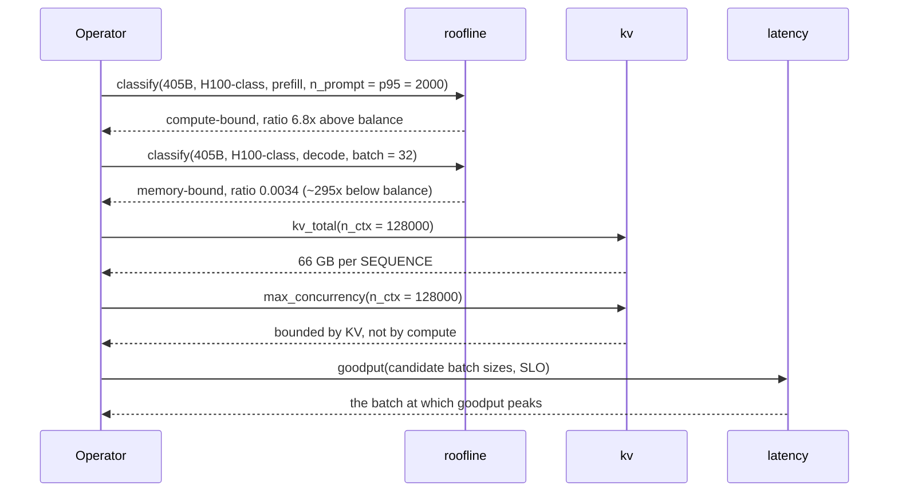
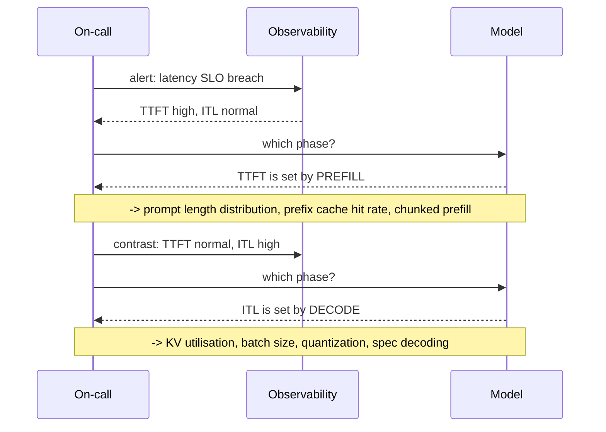

# T06 — Inference Fundamentals: low-level design

> `T06` · **Transcript coverage:** primary · [HLD](HLD.md) · [Cheat sheet](../../00-cheat-sheets/T06-inference-fundamentals.md) · [Case study](../../01-case-studies/T06-inference-fundamentals.md) · [Interview bank](../../02-interview-questions/T06-inference-fundamentals.md)

Buildable specification for the capacity and latency model in the [HLD](HLD.md). This module has no
server, no state and no concurrency; its subject matter is **arithmetic discipline** — the shapes that
force every constant to be a declared parameter, and the tests that keep the model honest.

**Provenance.** `[T]` transcript · `[R]` repo · `[D]` derived. The model dimensions and the `2N` rule
come from the corpus; the code is derived.

---

## 1. Module map

```
T06-inference-fundamentals/
  run.py                 driver: six experiments, prints, exits 0
  sim/
    __init__.py          re-exports
    roofline.py          model + hardware specs, FLOPs, bytes, intensity, classification
    latency.py           TTFT/ITL/E2E, budget solving, goodput
    kv.py                KV bytes/token, capacity, max concurrency, GQA scaling
    experiments.py       the six scenarios
  production/            reference-grade: hardware inventory, SLO templates, a config gate
  docs/SEQUENCES.md      the three decision points where the model is invoked
```

**Why four modules and not one.** Each has a distinct input domain and a distinct consumer:
`roofline` consumes model+hardware, `latency` consumes traffic, `kv` consumes model+hardware+context.
Splitting them means the KV budget can be exercised without a traffic distribution, which is how a
sizing exercise actually goes.

---

## 2. Data structures

### 2.1 `ModelSpec`

```python
@dataclass(frozen=True)
class ModelSpec:
    name: str
    params: float          # total parameters, NOT active parameters (see 2.2)
    n_layers: int
    hidden: int
    n_heads: int
    n_kv_heads: int        # GQA: may be << n_heads
    head_dim: int
    dtype_bytes: int = 2   # fp16

    @property
    def weights_bytes(self) -> float: return self.params * self.dtype_bytes
    @property
    def kv_bytes_per_token(self) -> float:
        return 2 * self.n_layers * self.n_kv_heads * self.head_dim * self.dtype_bytes
```

**`n_kv_heads` is separate from `n_heads`, and this is the whole point of the dataclass.** For Llama
3.1, `n_kv_heads = 8` at every size while `n_heads` is 32/64/128 `[T]`. A model spec that collapsed
the two would over-estimate KV by 16× on the 405B and produce a completely wrong capacity plan.

**`head_dim` is stored, not derived.** Deriving it as `hidden / n_heads` is correct for Llama and
wrong for plenty of other architectures. When a derived value *can* be wrong for a real model, it is
stored.

### 2.2 MoE models — `params` is ambiguous and the type must not hide it

For an MoE model, total and active parameters differ by a large factor, and the two enter *different*
formulas:

```
weights_bytes  <- TOTAL params   (you must store every expert)
decode FLOPs   <- ACTIVE params  (you compute only the routed experts)
```

`ModelSpec` therefore carries **`params` (total)** and an optional **`active_params`**. When
`active_params is None` the model is dense and the two coincide. The type makes the MoE case
*explicit* rather than silently wrong — the standard bug is to size the weights from active params
and under-provision the cluster by the sparsity factor.

### 2.3 `HardwareSpec`

```python
@dataclass(frozen=True)
class HardwareSpec:
    name: str
    peak_flops: float          # dense, at the working precision
    memory_bw: float           # bytes/s
    memory_capacity: float     # bytes

    @property
    def machine_balance(self) -> float:
        return self.peak_flops / self.memory_bw     # FLOPs per byte
```

**`peak_flops` must be the dense figure at the working precision.** Vendors quote sparse and
low-precision peaks that are 2–4× the number your kernel actually achieves. Using a quoted sparse FP4
peak against an fp16 deployment moves `machine_balance` by an order of magnitude and flips the
classification. The dataclass cannot enforce this, so the loader does: a `assert_dense_peak` check
that fails loudly rather than silently mis-classifying.

### 2.4 `TrafficSpec`

```python
@dataclass(frozen=True)
class TrafficSpec:
    prompt_tokens_p50: int
    prompt_tokens_p95: int      # P95 is what sizes the KV budget
    output_tokens_p50: int
    output_tokens_p95: int
    qps: float
```

**Both percentiles are mandatory.** `prompt_tokens_p95` is the sizing input and `p50` is the sanity
input; requiring both prevents the single most common modelling error, which is sizing on the mean and
discovering the skew in production (HLD §9).

---

## 3. Interface contracts

### 3.1 `roofline.py`

```python
def flops_per_token(model, phase: str, n_prompt: int = 0) -> float
def bytes_moved(model, phase: str, batch: int = 1, n_prompt: int = 0) -> float
def intensity(model, phase, batch, n_prompt) -> float
def classify(model, hw, phase, batch, n_prompt) -> tuple[str, float]
def prefill_crossover(model, hw) -> float        # prompt length at which prefill becomes compute-bound
def attention_mlp_ratio(model, n_ctx) -> float
```

**`classify` returns `(bound, intensity_ratio)` where the ratio is `intensity / machine_balance`.** A
ratio below 1 is memory-bound; the *magnitude* matters as much as the side, because a ratio of 0.001
and a ratio of 0.9 both read "memory-bound" but call for completely different urgency.

**`bytes_moved` for decode is `weights_bytes`, independent of batch size.** That is the fact that
makes decode amortise so well (HLD §5.1), and it is encoded here rather than described: a batch of 32
reads the weights once.

### 3.2 `latency.py`

```python
def ttft(n_prompt: int, prefill_throughput: float) -> float
def itl(model, hw, batch: int) -> float
def e2e(ttft_s: float, itl_s: float, n_out: int) -> float
def required_itl(budget_s: float, ttft_s: float, n_out: int) -> float
def required_output_len(budget_s: float, ttft_s: float, itl_s: float) -> float
def goodput(requests: list[dict], ttft_slo: float, itl_slo: float) -> float
```

**`required_itl` and `required_output_len` are the two levers, and they are separate functions on
purpose.** The HLD's worked example shows that at 300 output tokens `TTFT` is not the lever; the API
makes that expressible. A single `solve_budget` returning "the required ITL" would hide the fact that
*capping output length* is often the cheaper move.

**`goodput` takes a list of per-request `{ttft, itl}` and a two-part SLO.** Both parts are required —
a one-part SLO cannot express streaming quality (HLD §5.5).

### 3.3 `kv.py`

```python
def kv_bytes_per_token(model) -> float
def kv_total(model, n_ctx, concurrency=1) -> float
def max_concurrency(model, hw, n_ctx, headroom_frac=0.10) -> int
def gqa_saving(n_heads, n_kv_heads) -> float
def kv_dtype_effect(model, dtype_bytes) -> dict
```

**`max_concurrency` takes `headroom_frac` explicitly and defaults to 10%.** Activation memory,
fragmentation and the CUDA context are real and are not modelled; making the headroom a parameter
rather than a constant keeps the omission visible instead of pretending the model is exact.

**`gqa_saving` exists because it is the design's explanation for why a 405B is servable at all.** With
8 KV heads instead of 128, KV per token is 16× smaller `[T]`. A model without that property would be
unservable at long context, and the function makes the dependency explicit.

---

## 4. State machine — the decision flow

There is no runtime state. What replaces it is the **decision flow** the model serves: three entry
points, each with a different question and a different output.

```
  ┌──────────────────┐
  │  ENTRY: SIZING   │  inputs: model, hw, traffic
  └────────┬─────────┘
           │ classify(phase=prefill, n_prompt=p95) and classify(phase=decode)
           ▼
  ┌──────────────────┐
  │  PHASE PLACED    │  which phase dominates, and by how much
  └────────┬─────────┘
           │ kv.max_concurrency(); latency.goodput() at candidate batch sizes
           ▼
  ┌──────────────────┐
  │  PLAN EMITTED    │  replicas, batch envelope, KV ceiling, predicted goodput
  └──────────────────┘

  ┌──────────────────┐
  │  ENTRY: CHANGE   │  "will quantizing to int8 help?"
  └────────┬─────────┘
           │ re-classify with the new dtype_bytes
           ▼
  ┌──────────────────┐
  │  VERDICT         │  quantizing weights does NOT move decode off the memory bound
  │                  │  (it halves the bytes, so it halves the time — but the bound is
  │                  │  unchanged); it DOES change the KV budget. Two different effects.
  └──────────────────┘

  ┌──────────────────┐
  │  ENTRY: INCIDENT │  "users say it is slow"
  └────────┬─────────┘
           │ compare observed TTFT and ITL against the model's expectation
           ▼
  ┌──────────────────┐
  │  DIAGNOSIS       │  TTFT high + ITL fine -> prefill/cache problem
  │                  │  TTFT fine + ITL high -> decode/KV/batch problem
  └──────────────────┘
```

**The `CHANGE` branch is where the model earns its keep.** The intuition that "quantization helps
inference" is half right, and the model separates the halves: weight quantization reduces
`bytes_moved` in decode, which reduces time but does **not** change the classification — decode was
memory-bound and remains memory-bound. KV quantization is a different change with a different effect
on the KV budget. Conflating them is the standard error.

---

## 5. Sequence diagrams

### 5.1 Sizing a deployment



**Where this fails.** The KV result — 66 GB per sequence — makes 128k context on a single 80 GB part
impossible, and the model's honest answer is *"paging and offload, or a shorter context"*, not a
better batch size. A team that runs this and then tunes batch size has misread the output: the
binding constraint is capacity, not scheduling.

### 5.2 The long-context crossover

```mermaid
sequenceDiagram
    participant Op as Operator
    participant R as roofline

    Op->>R: attention_mlp_ratio(n_ctx = 4096)
    R-->>Op: MLP dominates
    Op->>R: attention_mlp_ratio(n_ctx = 128000)
    R-->>Op: attention dominates
    Note over R: attention ~ N^2 * d ; MLP ~ N * d^2
    R-->>Op: the model is a DIFFERENT problem past the crossover
```

**Where this fails.** A model validated at 8k and deployed at 128k will be wrong, and the cause is not
a bug in the model or the engine — it is that the *dominant term changed*. The blueprint's answer is
to compute the crossover rather than assume the short-context model extends.

### 5.3 The incident triage



**Where this fails.** Both symptoms can appear together, and then the model does not disambiguate —
it only orders the investigation. The honest guidance: check the *ratio*. If TTFT rose more than ITL,
the prefill path changed; if ITL rose more, the decode path did. If both moved proportionally, a
shared resource (network, host, scheduler) is the suspect, and the two-phase model is the wrong tool.

---

## 6. Concurrency and resource accounting

**No runtime concurrency.** Every function is pure and side-effect free. There is no shared state to
lock and no I/O.

The accounting this module performs is **resource attribution**, and it is the reason the model is
worth building:

| Resource | Accounted by | Consumer |
|---|---|---|
| FLOPs | `flops_per_token` | which optimisations apply |
| Weight bytes | `weights_bytes` | memory footprint, quantisation effect |
| KV bytes | `kv_bytes_per_token` | concurrency ceiling |
| Activation headroom | `headroom_frac` | explicitly unmodelled |
| Latency | `ttft`, `itl`, `e2e` | the SLO |
| Conforming requests | `goodput` | the autoscaling signal (T15) |

**No cost accounting in currency.** The model produces GPU-seconds and tokens; a rate is applied at
the edge by T19. This is the same convention as T05 and T16, and for the same reason — the corpus
asserts no vendor price.

---

## 7. Error handling

| Condition | Handling |
|---|---|
| `n_heads % n_kv_heads != 0` | raise — GQA requires an integer group ratio |
| `head_dim * n_heads != hidden` | **warn, do not raise** — some architectures use `head_dim ≠ hidden/n_heads` |
| `n_prompt <= 0` on prefill | raise — prefill of nothing is a caller bug |
| `batch <= 0` | raise |
| `machine_balance` computed from a sparse/quoted peak | `assert_dense_peak` in the loader fails loudly |
| `active_params > params` | raise — an MoE cannot compute more than it stores |
| `n_ctx > model.max_ctx` | raise — sizing beyond the trained window is not a capacity question |
| `required_itl` returns ≤ 0 | the budget is unachievable; raise rather than return a negative latency |
| Goodput with an empty request list | return 0.0, not `ZeroDivisionError` |

**Two of these deserve their reasoning.** The `head_dim` mismatch *warns* rather than raising because
it is legitimate in real architectures — raising would make the model unusable on correct inputs. And
`required_itl ≤ 0` raises because a caller who has asked for a budget that TTFT alone exceeds has made
a modelling error, and returning a negative latency would let that error propagate into a config file.

---

## 8. Configuration surface

```python
ModelSpecs = {
    # Dimensions from [T] CMU lecture 1. Note n_kv_heads = 8 at EVERY size.
    "llama-3.1-8b":   ModelSpec(params=8e9,   n_layers=32,  hidden=4096,  n_heads=32,  n_kv_heads=8, head_dim=128),
    "llama-3.1-70b":  ModelSpec(params=70e9,  n_layers=80,  hidden=8192,  n_heads=64,  n_kv_heads=8, head_dim=128),
    "llama-3.1-405b": ModelSpec(params=405e9, n_layers=126, hidden=16384, n_heads=128, n_kv_heads=8, head_dim=128),
}

Hardware = {
    # peak_flops MUST be dense at the working precision. See LLD 2.3.
    "h100-class": HardwareSpec(peak_flops=..., memory_bw=..., memory_capacity=80e9),
}

Defaults = {
    "dtype_bytes": 2,          # fp16
    "headroom_frac": 0.10,     # activations, fragmentation, context -- explicit, not modelled
    "mlp_width_ratio": 3.5,    # [T] CMU lecture 1 -- MLP width is ~3.5x hidden
}
```

**`mlp_width_ratio = 3.5` is a corpus figure** `[T]` and is used only where an MLP-width estimate is
needed; it is not universal across architectures and is marked as an assumption rather than a fact.

---

## 9. Test strategy

| Layer | What is tested | How |
|---|---|---|
| Invariants | `kv_bytes_per_token` scales linearly in `n_kv_heads`; weights scale in `params` | direct assertions |
| GQA | 405B with 8 KV heads is 16× cheaper in KV than with 128 | `gqa_saving(128, 8) == 16.0` |
| Roofline | decode intensity is **1 FLOP/byte independent of model size** at fp16 | assert equality across all three model specs |
| Roofline | prefill crosses to compute-bound at `n_prompt ≈ machine_balance` | `prefill_crossover` matches the closed form |
| Batch invariance | decode `bytes_moved` does not grow with batch | the amortisation claim, asserted |
| KV worked example | 405B fp16 at 128k ≈ **66 GB** | exact arithmetic to the stated precision |
| Budget | `e2e(0.2, 0.02, 300) == 6.2` | the HLD's worked example |
| Lever separation | at 300 output tokens, halving TTFT does not meet a 3 s budget | asserts TTFT is not the lever |
| Goodput | a request failing *either* SLO part is non-conforming | two-part, both directions |
| Monotonicity | more output tokens monotonically worsens E2E | property test |
| Non-determinism | **not testable here** — it is a hardware property, asserted only in prose | — |

**The batch-invariance test is the one that encodes the HLD's key asymmetry.** If `bytes_moved` for
decode grew with batch, decode would not amortise and continuous batching would not be the win the
corpus says it is. Asserting the invariance is asserting the mechanism.

**What is deliberately not tested.** Latency in milliseconds. The model has no measured baseline and
the corpus supplies none; a test asserting an absolute latency would be a fabricated benchmark wearing
a test's clothing.

---

## 10. Build order

1. `roofline.py` — specs, FLOPs, bytes, intensity, classification. Everything else depends on it.
2. `kv.py` — the arithmetic that constrains capacity; independent of `latency.py`.
3. `latency.py` — the budget decomposition and goodput.
4. `experiments.py` — six scenarios, each a decision the model is asked to make.
5. `run.py` — driver, fixed constants, no seeds needed (the model is deterministic by construction).

**This module needs no RNG at all**, unlike T04 and T05 — it is closed-form. That absence is worth
noting: it is the difference between a model and a simulation.

## Sources

- `refs/CMU_Inference_Algorithms_for_Language_Modeling_Fall_2025_transcripts_2/CMU_LLM_Inference_1_Introduction_to_Language_Models_and_Inference.txt` — model dimensions, GQA, MLP width
- `refs/CMU_Inference_Algorithms_for_Language_Modeling_Fall_2025_transcripts_2/CMU_LLM_Inference_2_Probability_Review_and_Code_Examples.txt` — non-determinism
- `refs/vLLM_Inference_Meetup_Bengaluru_2026_transcripts/Scaling_AI_Inference_at_NxtGen_Indias_Best_Sovereign_Cloud_AI_Powerhouse.txt` — the prefill/decode reframe
- `refs/LLMOps_Agentic_AIOps_The_Hands-On_Playlist_2026_transcripts/LLM_Observability_Traces_Spans_OpenTelemetry_for_AI_Apps.txt` — the traced request, "optimization without measurement is just guessing"

**Derived (`[D]`):** all structures, signatures, the decision flow and the sequence diagrams. The
corpus supplies the dimensions, the `2N` rule and the two-phase framing; it supplies no code.
