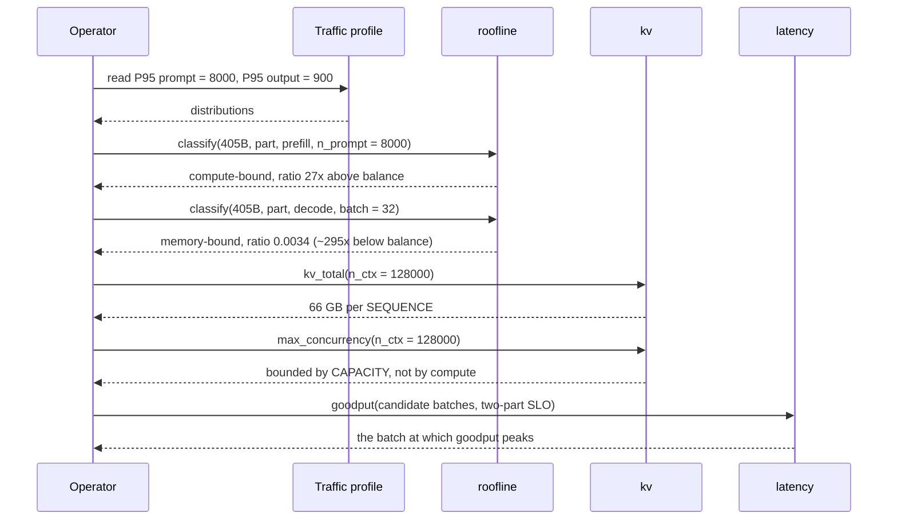
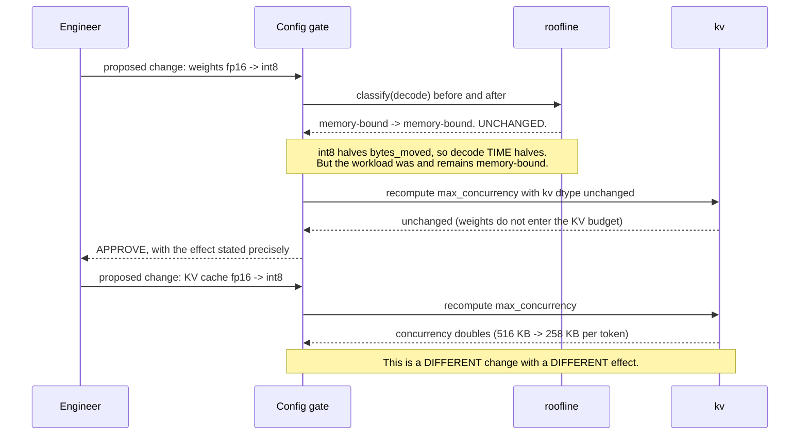
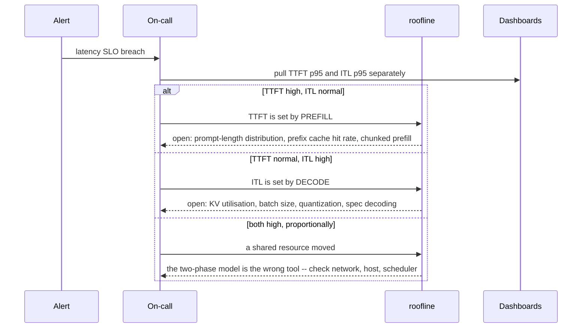
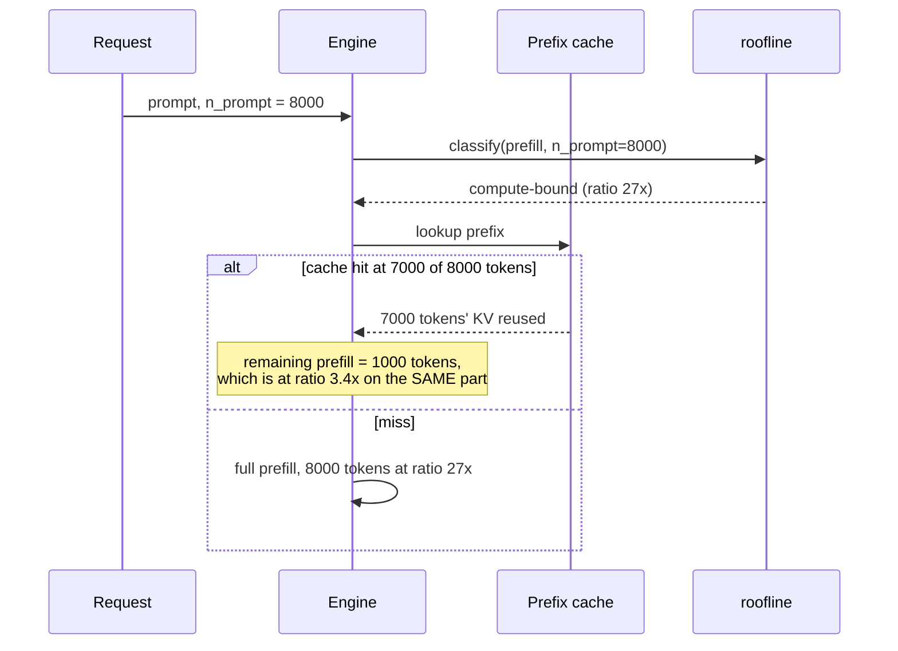

# T06 — Sequences: Inference Fundamentals, End to End

> **Transcript coverage:** primary · [HLD](../HLD.md) · [LLD](../LLD.md) · [production/](../production/README.md)

This blueprint has no runtime. What it has is **three decision points** where the model is queried,
and those are the sequences below — followed by the two diagnostic flows that the model's output
enables.

`[T]` transcript · `[R]` repo · `[D]` derived.

---

## 1. Design-time: sizing a deployment



**The result to read carefully.** Prefill's ratio (27×) and decode's (0.0034) are on opposite sides by
a factor of ~8,000. That gap is why the two phases cannot share a tuning policy, and it is what the
whole blueprint exists to make visible.

**Where this fails — the capacity wall.** `kv_total` returns 66 GB for one 128k sequence on a 405B
`[T]` dimensions, and `max_concurrency` therefore returns a capacity-bound number, not a
compute-bound one. The honest answer is *paging and offload (T07), or a shorter context* — **not** a
better batch size. A team that runs this and then tunes batching has misread the output: the binding
constraint is memory capacity.

---

## 2. Change-time: "will quantizing help?"



**The distinction the gate enforces.** Weight quantization and KV quantization are routinely discussed
as one thing called "quantization", and they are two changes with different effects:

| Change | Effect on decode time | Effect on classification | Effect on concurrency |
|---|---|---|---|
| Weight quant | **halves it** | **none** | none |
| KV quant | none | none | **doubles it** |

**Where this fails.** A gate that only checks "is it still memory-bound" will approve both changes and
report the same verdict, hiding the fact that one of them buys concurrency and the other does not.
The gate must recompute **both** the classification and the KV budget, which is why it has two checks
rather than one.

---

## 3. Incident-time: which dashboard to open



**Where this fails — the proportional case.** When TTFT and ITL rise together by the same factor, the
two-phase model does not disambiguate: a shared resource (network, host CPU, scheduler contention)
moved, and the right move is to stop decomposing by phase. This is stated explicitly because the
model's most likely misuse is to be applied where it does not fit.

---

## 4. The prefill-cache flow



**The insight this flow encodes.** A prefix cache hit does not just save time — it moves the *remaining*
work down the roofline curve. At 8,000 tokens the prefill is 27× above the balance point; at 1,000
remaining tokens it is 3.4×. Both are compute-bound, so the classification does not flip — but the
*margin* collapses, and the margin is what tells you how much headroom a further optimisation has.

**Where this fails.** The cache only helps if the prefix is byte-stable; a per-turn timestamp in the
system prompt invalidates from its own offset and every request pays the full 8,000-token prefill.
The detection is a prefix-cache hit rate that sits near zero while prompts look stable (T16 §3).

---

## 5. The goodput divergence

```mermaid
sequenceDiagram
    participant Eng as Engineer
    participant B as Batch tuner
    participant M as Model
    participant Obs as Dashboards

    Eng->>B: increase batch to raise tokens/s
    B->>M: goodput(batch, two-part SLO)
    alt larger batch
        M-->>B: throughput UP, queue_wait UP, ITL UP
        Note over M,B: queue_wait lands on TTFT; the KV/attention slope lands on ITL
        B-->>Eng: goodput DOWN -- block
    else smaller batch
        M-->>B: throughput DOWN, goodput UP
        B-->>Eng: goodput UP -- approve
    end
    B->>Obs: emit both, NEVER on the same axis
```

**The measured shape** `[D]` from `exp_goodput`: throughput rises monotonically across every batch
size tested; goodput peaks and then falls, because queue wait lands directly on TTFT and the KV slope
lands on ITL. Past the peak, the extra tokens are delivered too late to count.

**Where this fails — silently, and with internal consistency.** A team tuning on tokens/s will improve
every dashboard they look at while degrading the user experience. The fix is not a better tuner; it is
measuring the right quantity. This is why goodput is the headline metric in the [HLD](../HLD.md) and
why the throughput and goodput panels are specified on **separate axes**.

---

## Sources

- `refs/CMU_Inference_Algorithms_for_Language_Modeling_Fall_2025_transcripts_2/CMU_LLM_Inference_1_Introduction_to_Language_Models_and_Inference.txt` — Llama 3.1 dimensions and GQA
- `refs/CMU_Inference_Algorithms_for_Language_Modeling_Fall_2025_transcripts_2/CMU_LLM_Inference_2_Probability_Review_and_Code_Examples.txt` — non-determinism
- `refs/vLLM_Inference_Meetup_Bengaluru_2026_transcripts/Scaling_Agentic_AI_Distributed_Inference_with_llm-d.txt` — agentic metric set, cache hit rate as a routing signal
- `refs/LLMOps_Agentic_AIOps_The_Hands-On_Playlist_2026_transcripts/Cut_LLM_Cost_Latency_KV_Cache_Batching_Quantization_vLLM.txt` — the cost/latency levers

**All sequence structure is `[D]`.** The `[D]` figures quoted (the 27× and 3.4× ratios, the goodput
shape) are reproducible from this blueprint's own `run.py`; corpus figures are attributed inline.
