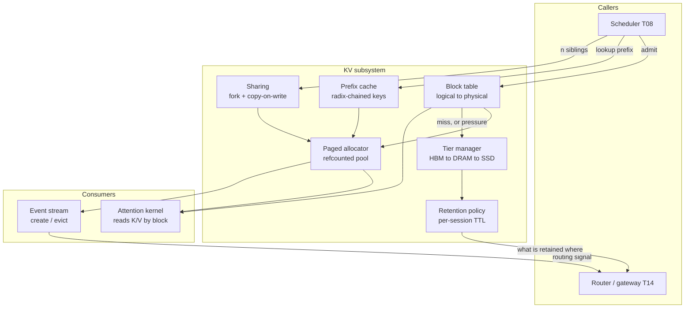
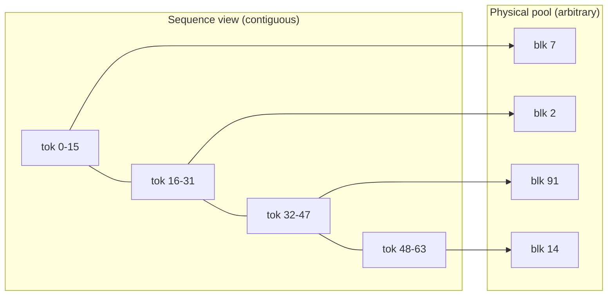
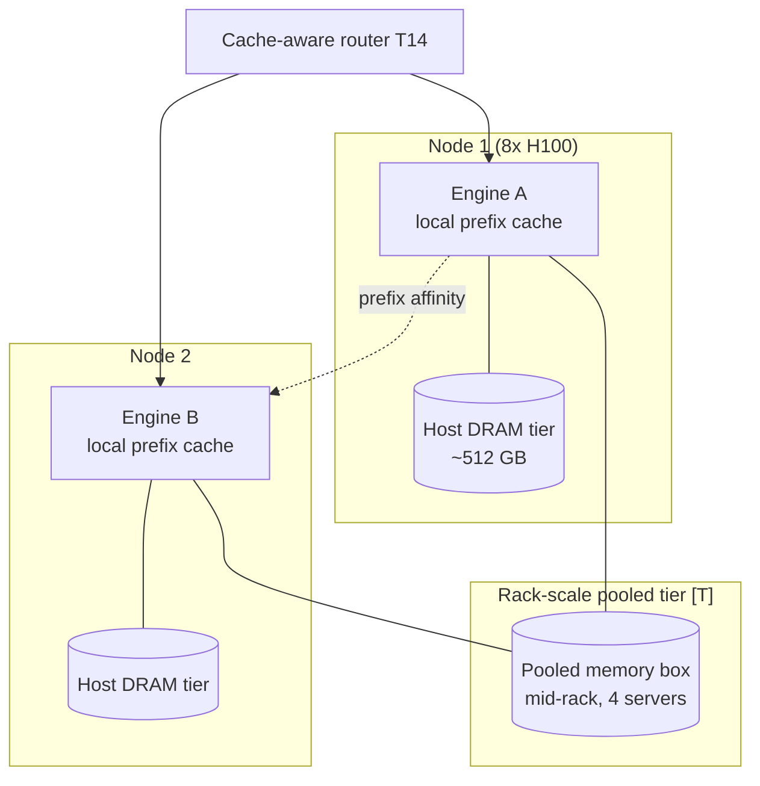

# T07 — KV Cache: high-level design

> `T07` · **Transcript coverage:** primary · [LLD](LLD.md) · [Cheat sheet](../../00-cheat-sheets/T07-kv-cache.md) · [Case study](../../01-case-studies/T07-kv-cache.md) · [Interview bank](../../02-interview-questions/T07-kv-cache.md) · [Runnable core](run.py) · [Production](production/README.md) · [Sequences](docs/SEQUENCES.md)

The KV cache is the resource that decides how many users you can serve. Not FLOPs, not weights —
KV. On a 70B at fp16 a single 8,000-token session holds 2.6 GB of key-value state, and at 128k it
holds 42.9 GB, which is more than half of an 80 GB part for **one conversation**. Everything in
this blueprint follows from that ratio.

`[T]` transcript · `[R]` repo · `[D]` derived. Every modelled number here is reproducible from
[`run.py`](run.py); every corpus number is cited to its speaker.

---

## 1. System context

A serving engine's KV subsystem sits between the scheduler (which wants to admit requests, T08)
and the attention kernel (which needs K and V laid out where it can read them). It answers exactly
four questions, and the design is the union of the four answers:

| Question | Mechanism | Failure if absent |
|---|---|---|
| Where does sequence N's KV live? | block table + paged allocator | 60–89% of memory reserved for lengths that never arrive |
| Can I avoid recomputing this prefix? | content-addressed prefix cache | every conversational turn re-prefills the whole history |
| Can several sequences share one prefix? | refcounted blocks + copy-on-write | best-of-N at n=32 does not fit |
| Where does KV go when HBM is full? | tiers (DRAM, SSD) + retention policy | preemption thrashes; long sessions are unresumable |



**The event stream is part of the design, not telemetry.** The corpus states that the router
consumes per-request create **and evict** events, and that an offload tier and a retention API
exist `[T]` (llm-d). That is a routing input: a router that sends a request to a replica which
never held the prefix has converted a cache hit into a full prefill, and a hit-rate counter alone
cannot see it. Section 7 is the design of that stream.

---

## 2. Why paging is the entry fee, not an optimisation

The corpus's figures: contiguous allocation wastes **60–80%** of KV; paged attention wastes
**`<4%`** `[R]`; saturation gates fire at **KV 80% full**, and the engine is sized to fill **90%
of VRAM** `[T]` (NextGen).

The mechanism is not internal fragmentation, and stating it precisely matters because the two have
different fixes:

- **Contiguous allocation** must reserve `max_seq_len` for every sequence, because KV that grows
  monotonically cannot be extended in place once a neighbour has been placed. A sequence that
  stops at 400 tokens still owns 2,048 tokens' worth of the pool.
- **Paged allocation** reserves whole *blocks* (typically 16 tokens `[R]`), so the reservation is
  bounded by the block, not by the maximum length.

This produces **two different waste numbers**, and conflating them is the standard error:

| Measure | Definition | Value here | What it is for |
|---|---|---|---|
| ratio-of-sums | wasted tokens / allocated tokens | contiguous 50–89%, paged 0.7–4.6% | **capacity** — sizes the fleet |
| mean-of-ratios | mean over sequences of each one's own waste | contiguous = same, paged up to 49% | **fairness** — who pays the rounding |

A 20-token request rounds up to a whole 16-token block and "wastes" 37% of itself. That is real,
it is a fairness penalty on short requests, and it is **not** a capacity problem. A team that reads
only the per-sequence number concludes paging does not work; a team that reads only the capacity
number never notices their short-request traffic is the expensive part.

**Why the capacity number is the one that matters.** At 80% waste on 40 GB of KV you serve ~6
sequences where you could serve ~30 `[D]`, reproducible in experiment 1 and 6 of [`run.py`](run.py).
Same hardware, same model, same latency target: a **5× throughput difference from an allocator**.

### 2.1 The block-size decision

| Block size | Capacity waste | Mean table entries/seq | Verdict |
|---|---|---|---|
| 4 | 0.42% | 102 | table cost dominates; a fraction of a point of memory saved |
| 8 | 1.01% | 51 | rarely worth doubling the table vs 16 |
| **16** | **2.19%** | **26** | **the corpus-typical default `[R]` — the knee** |
| 32 | 4.51% | 13 | fine for long-context-only workloads |
| 64 | 9.04% | 7 | waste is now visible |
| 128 | 17.20% | 3.8 | waste is the dominant term |

**Where the default is wrong — the exception that matters.** Very *short* sequences. A 20-token
prompt occupies 32 tokens of blocks at size 16 (60% overhead) and 128 tokens at size 128 (6.4×
overhead on that request). Chat and classification traffic is dominated by short prompts, so this
is not a corner case; it is the common case. A deployment serving mostly sub-64-token requests
should use block size 8 and accept the table cost.

**Where the block size does *not* matter.** Long sequences. At 64k tokens one partial block is a
rounding error, so a long-context-only deployment can use 32 or 64 and reclaim the table overhead.
The decision is a property of the traffic *distribution*, not of the model.

---

## 3. The block table, the pool, and the refcount



The indirection is the entire mechanism: the sequence sees a contiguous address space, the
allocator sees whatever is free. **Everything else in this blueprint is built on the fact that two
block tables can point at the same physical block.**

That is why the pool is **refcounted** rather than a free list. `retain` increments, `release`
decrements, and the block returns to the free list only when the count reaches zero. A free-list
pool without refcounts can support paging but cannot support sharing or prefix caching — the two
features that carry most of the operational value.

**The invariant that must never be violated:** a block is freed if and only if its refcount reaches
zero. Every bug in this subsystem is a violation of it in one direction or the other:

| Violation | Symptom |
|---|---|
| Freed too early (leaked reference) | **silent wrong output** — a live sequence reads blocks that were reallocated to another request |
| Freed too late (missed release) | pool exhaustion with `kv_cache_usage_ratio` near 1.0 and no live sequence accounting for it |

The first is far worse than the second. A leak is a capacity incident; a premature free is a
correctness incident that produces fluent, confident, wrong text, and it is one of the very few
failures in this whole repository that does not crash.

---

## 4. Prefix caching

The corpus establishes the mechanism and the operational consequence: the router consumes create
and evict events and a retention API exists `[T]`; prefix-cache-aware routing is a dedicated talk
`[T]`; and the agentic talk treats KV hit rate per session as a first-class metric `[T]`.

**What it buys.** A 12-turn conversation with a 1,536-token system prompt and 192 tokens per turn
prefills 33,408 tokens without a cache and 3,840 with one — **88.5% of prefill work removed**
`[D]`, reproducible in experiment 3. The shape is the point: prefill goes from **quadratic in turn
count to linear in the delta**. This is the single largest serving win available for chat and agent
traffic, and it costs one hash per block.

### 4.1 The key must chain, and this is a correctness requirement

Keys are chained: block N's hash includes block (N−1)'s hash. This makes the cache a **radix
tree** rather than a bag of blocks.

**Why the naive version is wrong.** Hashing token blocks independently lets a lookup match a block
that is identical *in isolation* but sits under a **different prefix**. The KV in that block was
computed with attention over a different history, so it is the wrong value — and the request
produces confident, wrong output rather than an error. Chaining makes a hit mean *"the entire
prefix from position 0 matches"*, which is the only claim that is actually true.

The same reasoning forces a second rule: **a partial final block is never reused.** The last cached
block may be partially filled, and KV for the empty slots was never computed. Reusing it reads
uninitialised memory as if it were K/V.

### 4.2 A prefix is not identified by its tokens

`block_hash` takes an `extra` component. Two requests with identical tokens but different LoRA
adapters, different image hashes, or different system-prompt *versions* must not share KV. This is
the same failure class as the unchained hash — silently wrong output — which is why it is a
first-class parameter rather than an afterthought.

### 4.3 Where prefix caching fails, silently

| Cause | Symptom | Fix |
|---|---|---|
| a per-turn timestamp or nonce in the system prompt | hit rate pinned near zero while prompts *look* stable | pin a byte-stable prefix (T16) |
| per-pod caching with a load balancer in front | per-pod hit rate looks fine; fleet-wide reuse is near zero | cache-aware routing by prefix (T14) |
| KV dtype or block size changed between deploys | old entries never match; cache slowly warms from zero | invalidate the cache on config change |
| a LoRA adapter swapped under the same tokens | wrong output | include the adapter id in `extra` |

**The diagnosis to teach.** "Prefix caching is not helping" is almost never a bug in the cache. It
is an unstable prefix or a non-cache-aware router. The measurement that separates them: compare
per-pod hit rate against fleet-wide reuse. If per-pod is healthy and fleet-wide is not, the router
is the problem.

---

## 5. Sharing — and why it is not a cache

| | Prefix cache | Block sharing |
|---|---|---|
| Purpose | survive *across* requests | bind *within* a live group |
| Lifetime | until evicted | until the last reference drops |
| Eviction | yes, LRU under pressure | **none — eviction would be a bug** |
| Users | any future request | best-of-N siblings (T05), a fork |

**The two get conflated, and both then get built wrong.** Implementing sharing as "a cache with a
TTL" drops prefixes that live sequences are still reading — a correctness failure. Implementing a
cache as a binding leaks blocks no request will ever read again — a capacity failure.

**What sharing buys.** At a 2,048-token prompt with ~384 generated tokens per candidate, n=32
best-of-N siblings cost 25.5 GB unshared and 4.7 GB shared `[D]`; on a 12 GB budget that is the
difference between n=32 fitting and not fitting at all. Without sharing the cost scales with n over
the **whole** sequence; with it, only the **generated** part scales. The saving approaches the
prompt/generated ratio as n grows, so long-prompt best-of-N is where sharing matters most.

**Copy-on-write is what makes it safe.** Siblings share until they disagree; the first writer pays
for a private copy. The check is `refcount > 1` — if the block is unshared, the write goes in
place and no copy is made. This is why the refcount is load-bearing and not an optimisation.

---

## 6. Tiering — and why the medium decides whether tiering is a win

The corpus gives both an ordering and a result: **pooled memory < RDMA << TCP/IP** `[T]`, and
**~5× TTFT improvement** when a session's KV is restored from CPU instead of recomputed `[T]`
(llm-d). It also reports a **recomputation cliff at 28k input tokens** `[T]` (ROCm/WideEP) and a
rack-scale demo pooling memory across **4 servers with one pooled box mid-rack** `[T]` (Jongryool
Kim, SK hynix).

### 6.1 The decision is a straight cost comparison — and the medium decides it

For an 8,000-token 70B session holding 2.62 GB of KV, with re-prefill at 12,000 tokens/s `[D]`:

| Medium | Offload (2-way) | Recompute | Winner |
|---|---|---|---|
| pooled memory | 5.8 ms | 667 ms | offload — ~115× |
| RDMA | 105 ms | 667 ms | offload — ~6.4× |
| local NVMe | 749 ms | 667 ms | **recompute** |
| TCP/IP | 1,748 ms | 667 ms | **recompute — 2.6× worse** |

**Read the bottom of that table carefully.** On TCP/IP, moving the KV takes *longer than
re-prefilling it*. The corpus's ordering is not a preference; on a slow fabric, tiering is
strictly worse than recompute, and a team that tiers everything has **added latency and called it
an optimisation**. This is the single most actionable fact in the topic, and it is why the model
prices the medium instead of assuming a tier is always good.

**The 6.4× on RDMA is the corpus's ~5× `[T]`, reproduced** from this blueprint's own arithmetic —
which is the check that the model is calibrated rather than invented.

### 6.2 Cost and occupancy are two different questions

The cost comparison above is **gap-independent**: 2× transfer against one re-prefill, exactly. What
the gap governs is **occupancy** — how long the tier holds the bytes.

| Idle gap | Tier bytes held at steady state (6 GB tier) |
|---|---|
| 0.05 s | ~0.00 GB |
| 5 s | ~0.10 GB |
| 300 s | ~6.00 GB |

**A tier that evicts before the sequence resumes pays the transfer AND the re-prefill**, which is
strictly worse than never tiering at all. Size the occupancy first, then decide the policy.

### 6.3 Preemption is not session return

Two exits from an out-of-memory condition: **recompute** (drop the blocks, re-prefill on resume) or
**swap** (move them to a tier). The corpus's ~5× figure is a **session-return** measurement, where
the gap is seconds to minutes. Quoting it to justify swap-at-preemption — a millisecond-scale
decision — is the most common misreading of that number. The cost arithmetic happens to be the same
in both cases; the occupancy pressure is not.

### 6.4 The recompute cliff

Below the cliff, dropping a preempted sequence and re-prefilling it on resume is cheaper than the
memory it was occupying. Past it, the re-prefill costs more than the memory is worth and the engine
must tier. The corpus's **28k tokens** `[T]` is a figure on specific hardware: it is a function of
prefill throughput and fabric bandwidth, both of which an operator can measure. **Treating 28k as a
universal constant is the exception to flag** — the *shape* is universal, the *number* is not.

### 6.5 Retention is per-session, not a fleet TTL

A single TTL gets it wrong in **both** directions at once:

| Session | KV | Re-arrival | Naive TTL verdict | Correct verdict |
|---|---|---|---|---|
| agent tool call | 2.6 GB | ~0.4 s | evicted — **loses the win** | **retain** |
| chat session | 0.4 GB | ~45 s | retained ✓ | retain |
| one-shot batch | 5.2 GB | never | retained — **wastes 5.2 GB** | **evict** |

A TTL sized for chat evicts the agent prefix that returns in milliseconds; the same TTL holds the
batch job's 5.2 GB forever. Retention must be driven by each session's **re-arrival distribution**.
This is why the router is fed both create *and* evict events `[T]` rather than a hit count: a hit
count alone cannot distinguish *"this tier is working"* from *"this tier is full of sessions that
will never come back"*.

**The corpus states the contract precisely** `[T]` (llm-d): the retention API is intended to
"orchestrate the movement of KV cache" at the engine layer and it "adds a **session metadata** to
the KV cache so that we know which session a particular request belongs to". Two design
consequences follow, and both are load-bearing:

1. **KV blocks carry a session identity**, not just a content hash. That is what makes "which
   session is coming back after a long tool call?" an answerable question at the routing layer.
2. **Movement is orchestrated, not automatic.** The engine exposes the capability; the policy that
   decides *when* lives above it, because only the layer that sees the harness knows the expected
   tool-call latency (T16).

This is also why the corpus frames the win as conditional — *"if you know that it's going to take a
longer time you can evict the KV cache and put it to the CPU and then come back to it"*. Without
session metadata there is no "if you know", and the tier fills with sessions nobody is waiting for.

---

## 7. The capacity model

The corpus's worked example `[T]`: `40e9 / (327e3 × 4000) ≈ 30` concurrent sequences.

```
bytes_per_token = 2 × n_layers × n_kv_heads × head_dim × dtype_bytes
                = 2 × 80 × 8 × 128 × 2 = 327,680 bytes  (320 KiB) for Llama-3.1-70B fp16

max_concurrency ≈ HBM_for_KV / (bytes_per_token × avg_context_len)
```

| HBM for KV | avg ctx | raw | block-granular |
|---|---|---|---|
| 40 GB | 4,000 | 30.5 | **30** ← the corpus's number |
| 40 GB | 128,000 | 1.0 | **0** |
| 180 GB | 4,000 | 137.3 | 137 |
| 180 GB | 128,000 | 4.3 | 4 |

**Three things the table teaches.**

1. **`hbm_for_kv` is HBM *after* weights and activations.** Passing total HBM is the most common
   capacity-planning error and it is not a rounding issue: a 70B at fp16 has 140 GB of weights and
   does not fit one 80 GB part at all. `max_concurrency` raises on a non-positive budget for
   exactly this reason.
2. **Raw and block-granular differ.** You cannot serve a fraction of a sequence, and every
   sequence rounds up to whole blocks. Reporting only the raw quotient over-promises.
3. **128k context is a wall, not a tuning problem.** One sequence needs 42.9 GB — more than the
   whole 40 GB budget. The fixes are paging plus offload, KV quantization, or a shorter context.
   **No batch size or scheduler change moves it.**

### 7.1 Which quantization changes *this* number

| KV dtype | bytes/token | KV @128k | Concurrency multiplier |
|---|---|---|---|
| fp16 | 327,680 | 42.9 GB | 1.0× |
| fp8 | 163,840 | 21.5 GB | **2.0×** |
| int4 | 81,920 | 10.7 GB | **4.0×** |

**KV quantization moves the concurrency ceiling. Weight quantization does not touch it at all** —
it moves decode *time*. The two are routinely discussed as one thing called "quantization", and
separating them is the point of this table (T06 §2, T10).

**The exception, stated plainly:** KV quantization is where the accuracy risk lives, not weight
quantization. Every token's K and V is quantized once and then **read back for the whole life of
the sequence**, so an error compounds over the entire generation rather than averaging out. T10
owns the accuracy question; this blueprint owns the capacity consequence.

---

## 8. Deployment topology and scaling



| Scale | What breaks | What to change |
|---|---|---|
| 1 replica | nothing — the local cache is the whole story | — |
| 2–8 replicas | per-pod caches diverge; fleet-wide reuse collapses | prefix-affinity routing (T14) |
| 8–64 replicas | host DRAM fills; TTL policy starts evicting useful sessions | per-session retention (§6.5) |
| rack-scale | per-node DRAM is stranded | pooled memory tier `[T]`; re-rank by measured RTT |
| multi-rack | the fast fabric ends | **recompute beats transfer** (§6.1) — do not tier across it |

**The counter-intuitive scaling result.** More replicas makes caching *worse*, not better, unless
routing is prefix-aware. Each new replica starts with a cold cache and dilutes the hit rate across
the fleet. The corpus's whole prefix-cache-aware routing talk `[T]` exists because of this, and
`scope_id` as a placement input (T16) is the same mechanism applied to agents.

---

## 9. Failure domains

| Failure | Detects as | Blast radius | Mitigation |
|---|---|---|---|
| premature free (refcount underflow) | **nothing** — fluent wrong output | one or more live requests | refcount assertions in dev; never free on release without checking |
| leaked reference | `kv_cache_usage_ratio` → 1.0, no live sequence accounts for it | whole replica | periodic accounting: sum(refcounts) == total − free |
| unstable prefix | hit rate pinned near 0 | fleet-wide prefill cost | pin the prefix (T16); alert on hit rate |
| cache-blind routing | per-pod hits fine, fleet reuse ~0 | fleet-wide | prefix-affinity routing (T14) |
| tier slower than recompute | TTFT **rises** after enabling tiering | all restored sessions | price the medium (§6.1) before enabling |
| tier evicts before resume | pays transfer *and* re-prefill | restored sessions | size occupancy (§6.2) |
| unchained block hash | **wrong output** after a shared-prefix hit | any request hitting the cache | chain every key to its parent |
| block size changed between deploys | cache slowly warms from zero; no error | fleet-wide, transient | invalidate cache on config change |

**Two of these do not crash, and they are the two that matter.** A premature free and an unchained
hash both produce a *working engine serving wrong answers*. Neither is caught by a latency
dashboard, a throughput chart, or a health check. The only defences are the invariants in §3 and
§4.1 — enforced in code, not in a runbook.

---

## 10. Capacity and cost model — worked

A concrete sizing exercise, all `[D]` and reproducible from [`run.py`](run.py):

```
Model: Llama-3.1-70B fp16, 4x 80 GB parts (weights 140 GB -> 2 parts minimum)
KV budget per part: (80 GB - 70 GB weights) x 0.9 fill target = ~9 GB   <- note the 0.9 [T]
Traffic: P95 prompt 8,000 tokens, avg context 4,000

bytes_per_token          = 327,680
bytes per sequence        = 327,680 x 4,000 = 1.31 GB
sequences per part        = 9 GB / 1.31 GB = 6
sequences per replica     = 6 x 4 parts = 24       (without tensor parallelism)
```

**Compare against the single-sequence 128k case:** 42.9 GB, which exceeds a whole part. At long
context the per-part budget is consumed by *one* session, and the honest answer is offload, KV
quantization, or a shorter context — not a bigger batch.

**Cost accounting.** This blueprint produces GPU-seconds and bytes, never currency. A rate is
applied at the edge by T19. The corpus asserts no vendor price, and inventing one would be the
fabricated-benchmark failure the whole repository's provenance convention exists to prevent.

---

## 11. Build vs buy

| Capability | Build | Buy / use | Recommendation |
|---|---|---|---|
| Paged allocation | — | in every modern engine (vLLM, SGLang, TRT-LLM) | **never build**; it is table stakes |
| Prefix caching | — | in-engine, block-hash keyed | **never build**; configure it |
| Sharing / COW | — | in-engine | **never build**; it is a refcount |
| Tier manager | rare | in-engine swap/offload paths | configure first; build only for a pooled tier the engine does not know about |
| Retention policy | **yes** | nothing generic exists | **build** — it is the one piece that must know your traffic |
| Cache-aware routing | **yes** | llm-d EPP `[T]` if it fits | build or adopt; it is the fleet-scale multiplier |
| Event stream | **yes** | OTel (T17) | build — create/evict is the routing contract |

**The pattern.** Everything *inside* one engine is solved and should be used, not written.
Everything *across* engines — routing, retention, the event stream — is application-specific and
must be built. A team that writes its own paged allocator has wasted a quarter; a team that assumes
prefix reuse happens fleet-wide by default has a hit rate near zero and no idea why.

---

## 12. What changes at 10× scale

| Dimension | 1× | 10× | What breaks first |
|---|---|---|---|
| Replicas | 1 | 10 | fleet-wide cache reuse → needs prefix-affinity routing |
| Sessions | 100 | 1,000 | host DRAM fills → retention policy becomes load-bearing |
| Context | 8k | 128k | 42.9 GB/sequence → capacity wall (§7) |
| Turns/session | 1 | 12 | prefill quadratic → prefix cache becomes the dominant lever |
| Agents | none | many | per-session KV hit rate becomes the SLO (T16, T15) |
| Tier | none | required | **must re-rank media by measured RTT** (§6.1) |

**The one that catches teams out.** Going from 1 replica to 10 makes caching *worse* while every
per-pod dashboard stays green. The measurement that reveals it is fleet-wide reuse, and the fix is
routing, not cache tuning.

---

## 13. Six things to carry away

1. **Paging is the entry fee.** 60–89% of the pool is otherwise reserved for lengths that never
   arrive — a concurrency limit, not a bill.
2. **Report two waste numbers.** Capacity is ratio-of-sums; fairness is mean-of-ratios. Conflating
   them makes paging look broken.
3. **Sharing is a refcount; a cache is an eviction policy.** Building either as the other produces
   a correctness bug or a leak.
4. **Chain the block hash.** An unchained key can match a block under a different prefix — fluent
   wrong output, no crash.
5. **Price the medium before enabling tiering.** On TCP/IP the transfer is slower than
   re-prefilling; tiering there is a latency *regression* recorded as an optimisation.
6. **Retention follows the re-arrival distribution.** One fleet TTL both evicts the sessions that
   return in milliseconds and hoards the ones that never return.

---

## Sources

- `refs/vLLM_Inference_Meetup_Bengaluru_2026_transcripts/Scaling_Agentic_AI_Distributed_Inference_with_llm-d.txt` — the ~5× TTFT improvement restoring a session's KV from CPU instead of recomputing; the router consuming per-request create and evict events; the offload tier and retention API
- `refs/vLLM_Inference_Meetup_Bengaluru_2026_transcripts/Scaling_AI_Inference_at_NxtGen_Indias_Best_Sovereign_Cloud_AI_Powerhouse.txt` — saturation at KV 80% full; the 90%-of-VRAM fill target
- `refs/Agentic_AI_Infra_transcripts_2/Jongryool_Kim_-_Disaggregated_LLM_Serving_with_Shared_Memory_KV_Cache_at_Rack_Sc.txt` — the rack-scale pooled-KV demo (4 servers, one pooled memory box mid-rack) and the transfer-medium ordering pooled memory < RDMA << TCP/IP
- `refs/vLLM_Inference_Meetup_Bengaluru_2026_transcripts/Distributed_Inference_on_ROCm_with_WideEP_on_vLLM_llm-d.txt` — the recomputation cliff at 28k input tokens
- `refs/vLLM_Inference_Meetup_Bengaluru_2026_transcripts/` — prefix-cache-aware routing as a dedicated talk
- `refs/llm-inference-engineering-main/llm-inference-engineering-main/README.md` — paged attention and block-table structure; `[R]` block size and the `<4%` paged-waste figure
- `refs/CMU_Inference_Algorithms_for_Language_Modeling_Fall_2025_transcripts_2/CMU_LLM_Inference_1_Introduction_to_Language_Models_and_Inference.txt` — model dimensions and GQA (`n_kv_heads = 8` at every size)

**Derived (`[D]`):** all component structure, the refcount and COW invariants, the two-measure
waste decomposition, the cost/occupancy split, the retention policy, and every modelled number in
this document — all reproducible from [`run.py`](run.py). The corpus supplies the mechanisms, the
figures quoted inline, and the medium ordering; it supplies no design.
