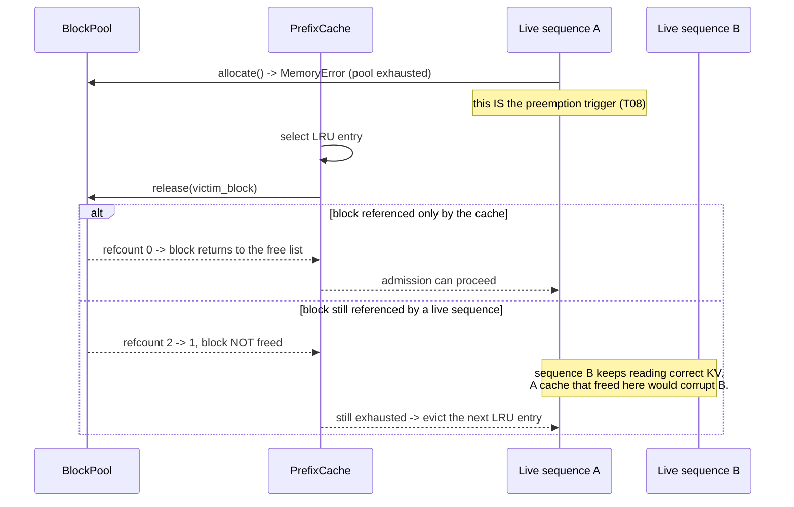
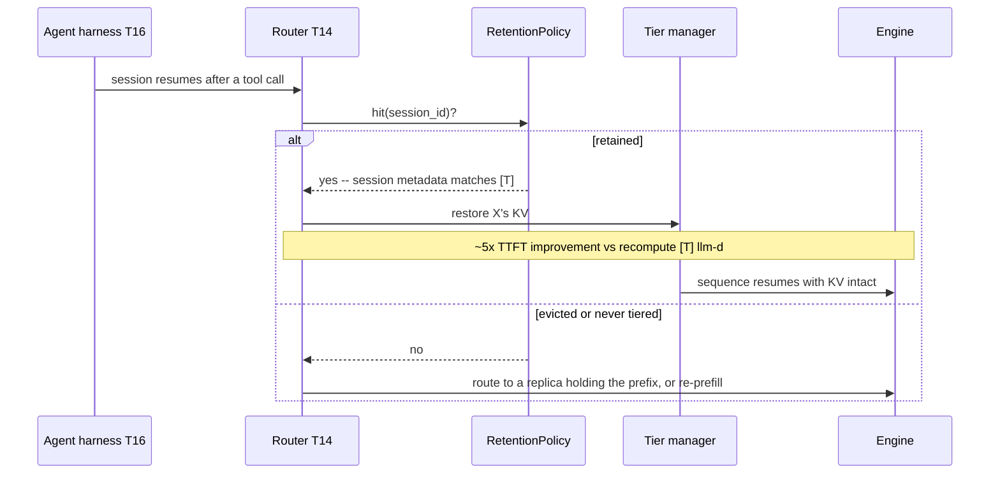

# T07 — KV Cache: low-level design

> `T07` · **Transcript coverage:** primary · [HLD](HLD.md) · [Cheat sheet](../../00-cheat-sheets/T07-kv-cache.md) · [Case study](../../01-case-studies/T07-kv-cache.md) · [Interview bank](../../02-interview-questions/T07-kv-cache.md) · [Runnable core](run.py) · [Production](production/README.md) · [Sequences](docs/SEQUENCES.md)

Buildable specification for the subsystem in the [HLD](HLD.md). The central design claim is that
**paging, sharing, caching and tiering are four mechanisms sharing one primitive** — a refcounted
block — and that most real bugs come from implementing one of them as another.

**Provenance.** `[T]` transcript · `[R]` repo · `[D]` derived. The corpus supplies the mechanisms,
the medium ordering and the retention/session-metadata contract; every structure, signature,
invariant and state machine below is derived and runnable in [`run.py`](run.py).

---

## 1. Module map

```
T07-kv-cache/
  run.py                 driver: seven experiments, prints, exits 0
  sim/
    __init__.py          re-exports
    allocator.py         BlockTable, BlockPool (refcounted), waste arithmetic, block-size curve
    prefix_cache.py      chained block hashing, PrefixCache, fork/COW, sharing saving
    tiering.py           Medium, transfer cost, breakeven, preemption choice, RetentionPolicy
    kvmath.py            bytes/token, concurrency ceiling, quant effects, cliff, headroom
    experiments.py       the seven scenarios
  production/            reference-grade: engine config, retention policy, metrics
  docs/SEQUENCES.md      the flows: admission, hit, eviction, preemption, restore
```

**Why the four modules split this way.** Each owns one question and one input domain:
`allocator` owns *where blocks live*, `prefix_cache` owns *what can be reused*, `tiering` owns
*where KV goes under pressure*, `kvmath` owns *how much fits*. The dependency graph is a line —
`kvmath` ← `allocator` ← `prefix_cache` — and `tiering` depends only on `kvmath`. That shape lets
capacity be sized (`kvmath`) without a cache or a tier, which is how a planning exercise actually
proceeds.

---

## 2. Data structures

### 2.1 `BlockTable` — the indirection that is paged attention

```python
@dataclass
class BlockTable:
    seq_id: str
    block_size: int = 16
    blocks: list[int] = field(default_factory=list)
    n_tokens: int = 0

    def needed_blocks(self, n_tokens: int) -> int:      # ceil(n_tokens / block_size)
    def append(self, n_tokens: int, pool) -> int:       # returns NEW blocks allocated
    @property
    def capacity_tokens(self) -> int:                   # len(blocks) * block_size
```

**`capacity_tokens` is separate from `n_tokens`, and the gap between them is the waste.** Exposing
both rather than a single "length" is deliberate: the internal fragmentation is exactly
`capacity_tokens - n_tokens`, and a type that reported only the logical length would hide the
quantity the whole first experiment is about.

### 2.2 `BlockPool` — refcounts are the primitive

```python
class BlockPool:
    def __init__(self, n_blocks: int, block_size: int = 16)
    def allocate(self) -> int          # raises MemoryError when exhausted
    def retain(self, b: int) -> None   # add a reference (share)
    def release(self, b: int) -> None  # drop a reference; frees at zero
    @property
    def used(self) -> int              # blocks with refcount > 0
    def free_blocks(self) -> int
```

**Three decisions worth stating.**

1. **Exhaustion raises `MemoryError`, it does not return `None`.** Pool exhaustion *is* the
   preemption trigger (T08), and it must be a distinguishable event rather than a null the caller
   may ignore.
2. **`retain` and `release` validate the refcount** and raise on a free block. These are cheap
   assertions that catch the underflow — the failure mode in the HLD's §9 that produces *silent
   wrong output*. An assertion here is worth more than any dashboard downstream.
3. **`used` is computed, not tracked.** A cached counter would be faster and would drift; the
   derivation is the accounting check that catches a leak, so it is kept honest.

### 2.3 `CacheEntry` and the chained key

```python
def block_hash(parent_hash: str, tokens: tuple, extra: str = "") -> str:
    """blake2b over parent_hash || tokens || extra -- digest_size=8 (64 bits)."""

@dataclass
class CacheEntry:
    key: str; block: int; n_tokens: int; hits: int = 0; last_used: int = 0
```

**The `parent_hash` parameter is the correctness mechanism of the whole file** (HLD §4.1). A
signature that took only `tokens` would be simpler and would produce a cache that can return KV
computed under a *different prefix* — fluent, confident, wrong output with no error anywhere.

**Digest size 8 bytes (64 bits), not 16.** Birthday-collision probability is ~50% at 2³² entries;
a KV cache holds 10³–10⁶ blocks, so the margin is ~10⁶×. The collision is the same failure class
as an unchained hash, which is why the sizing is stated rather than defaulted. An implementer
wanting more margin should raise it — the point is that the choice is *visible*.

**`extra` carries everything that makes two identical token sequences non-interchangeable:** the
LoRA adapter id, a multimodal content hash, a system-prompt version. This is the second silently-
wrong-output risk in the file, and it is a parameter rather than an afterthought for that reason.

### 2.4 `Medium` and `Tier`

```python
@dataclass(frozen=True)
class Medium:
    name: str; bandwidth: float; latency: float; rank: int
    def transfer_time(self, n_bytes: float) -> float   # latency + n_bytes / bandwidth

@dataclass
class Tier:
    name: str; medium: Medium; capacity_bytes: float
    used_bytes: float = 0.0; entries: int = 0
```

**`Medium` is frozen and `Tier` is not**, and the distinction matters: media are physical constants
of a deployment (replace them, do not mutate them), while tier occupancy is live state. Making a
medium mutable invites configuring a fabric at runtime, which is never what anyone means.

**The corpus ordering is a `rank` field, but the model uses `bandwidth` and `latency`.** Encoding
only the rank would make the ordering a hard-coded fact and the cost table uncomputable. Encoding
only the physical numbers would lose the corpus's stated ordering, which is the thing the operator
needs to compare against their own fabric. Both are carried; the model uses the numbers and the
table shows the rank beside them, so a disagreement between corpus ordering and measured numbers is
**visible** rather than silently resolved.

### 2.5 `KvSpec`

```python
@dataclass(frozen=True)
class KvSpec:
    name: str; n_layers: int; n_kv_heads: int; head_dim: int
    n_heads: int = 0; dtype_bytes: int = 2; max_ctx: int = 131072

    @property
    def bytes_per_token(self) -> float:
        return 2 * self.n_layers * self.n_kv_heads * self.head_dim * self.dtype_bytes
    @property
    def gqa_ratio(self) -> float: return self.n_heads / self.n_kv_heads
```

**Self-contained by design.** It deliberately duplicates T06's model dimensions rather than
importing them: a blueprint must run standalone, and a shared import would couple two artefacts
that are read independently. The duplication is the same four numbers, and T06's `ModelSpec` and
this `KvSpec` are checked against each other by both test suites.

**`max_ctx` is enforced** — `kv_table` raises above the trained window. Sizing beyond it is not a
capacity question and silently answering it produces a plan for a model that does not exist.

---

## 3. Interface contracts

### 3.1 `allocator.py`

```python
def paged_waste(seq_len, block_size=16) -> float
def contiguous_waste(seq_len, max_seq_len) -> float
def expected_waste(lengths, max_seq_len, block_size=16) -> dict
def make_length_distribution(rng, n=4000, max_seq_len=2048, shape=4.0) -> list[int]
def block_size_table(lengths, sizes=(4,8,16,32,64,128)) -> list[dict]
```

**`expected_waste` returns six quantities, and the duplication is the point:**

```python
{"contiguous_agg", "paged_agg",       # ratio-of-sums   -> CAPACITY
 "contiguous_mean", "paged_mean",     # mean-of-ratios  -> FAIRNESS
 "ratio_agg", "ratio_mean"}
```

A single "waste fraction" would be a **wrong API**, not merely an incomplete one: the capacity
figure and the fairness figure differ by up to 20× here, and a caller who picked either one without
knowing which they had would draw the opposite conclusion about whether paging works (HLD §2).

**Both `expected_waste` and `block_size_table` report at the *aggregate* measure.** This was a
corrected defect: the first implementation used mean-of-ratios throughout, which reported 27% paged
waste at block size 16 and contradicted the corpus's `<4%` `[R]`. The mean is dominated by very
short sequences rounding up to a whole block. The per-sequence number is now printed *alongside*,
with the distinction explained, rather than replacing the aggregate.

**`contiguous_waste` raises when `seq_len > max_seq_len`** rather than clamping. Clamping would
silently model a sequence that cannot exist.

### 3.2 `prefix_cache.py`

```python
def block_hash(parent_hash, tokens, extra="") -> str
class PrefixCache:
    def lookup(self, tokens, extra="") -> tuple[int, list[int]]
    def retain_all(self, blocks) -> None
    def insert(self, tokens, blocks, extra="") -> int
    def evict_to(self, target_blocks) -> int
    def hit_rate(self) -> float
    def reuse_fraction(self) -> float

def fork(parent_blocks, pool) -> list[int]
def copy_on_write(table_ref, idx, pool) -> int
def sharing_saving(n_siblings, prompt_blocks, gen_blocks) -> dict
```

**`lookup` returns `(n_tokens_hit, [blocks])`, and the token count is not redundant with the block
list.** `len(blocks) * block_size` gives the hit length *only* because the function stops at the
last **complete** block. Returning both makes the partial-block rule (HLD §4.1) visible in the
contract rather than implied by a caller's arithmetic — and a caller that computed
`len(blocks) * block_size` would be right, which is exactly why the rule must be enforced here.

**Two counters, not one.** `hit_rate` counts *requests* served from cache; `reuse_fraction` counts
*tokens* reused over tokens offered. They answer different questions: a workload of many tiny
requests with one long one has a high token-reuse fraction and a low request hit rate. The corpus's
router signal is token-level `[T]`; a dashboard showing only request hit rate will mis-size the
cache.

**`insert` takes blocks the caller already allocated** and takes a *second* reference. This is the
step where a leak is introduced if forgotten: a cached block outlives the sequence that produced it
because the cache holds its own reference. That is intentional and it is also the pool's largest
consumer — `retained_blocks` is exposed so the cache's footprint is observable rather than implied.

**`_evict_one` releases only the cache's reference.** If a live sequence still holds the block, the
refcount stays positive and the block survives — the sequence keeps reading correct KV. A cache that
freed unconditionally would corrupt live requests. This is the exact point where "a cache" and "a
binding" must be the same primitive with different policies, and the code makes it a two-line
function so the difference is inspectable.

**`sharing_saving` is the design's argument, expressed as a function.** It returns the unshared and
shared block counts and the fraction saved, so the claim "sharing makes n=32 fit" is a computed
result in the driver rather than an assertion in prose.

### 3.3 `tiering.py`

```python
def offload_cost(n_bytes, medium) -> float                 # BOTH directions
def recompute_cost(seq_len, prefill_throughput) -> float
def breakeven(seq_len, bytes_per_token, medium, prefill_throughput) -> dict
def preemption_choice(seq_len, bytes_per_token, medium, prefill_throughput,
                      expected_gap_s=0.0) -> dict
class RetentionPolicy:
    def create(self, session_id, bytes_kv, ttl_s=None) -> dict
    def evict(self, session_id, reason="ttl") -> dict
    def value_of_retention(self, session_id, re_arrival_s, bytes_per_token,
                           seq_len, medium, prefill_throughput) -> dict
```

**`offload_cost` multiplies by two, and that factor is the whole reason the model is honest.** The
restore is on the critical path of the *returning* request; the write is on the critical path of
the *departing* one. A model that counts only the restore halves the cost and reaches the opposite
conclusion for local NVMe and TCP/IP (HLD §6.1).

**`breakeven` is named for what it does, and an earlier draft of this file mis-named it
`breakeven_idle_gap`.** The idle gap does **not** enter the cost comparison — a retained block
costs nothing while it sits. What the gap governs is occupancy, and occupancy lives in
`RetentionPolicy`. Naming the function after a variable it does not use was a real defect: it
implied a dependency the arithmetic does not have, and an implementer following the name would
have added a parameter that changes nothing.

**`preemption_choice` takes `expected_gap_s` and uses it only for the occupancy note.** The choice
itself is `breakeven`'s verdict. The docstring states explicitly that the cost is gap-independent
and the occupancy is not, because conflating them is how a fleet ends up swapping into a tier that
evicts before resume — paying both the transfer and the re-prefill.

**`RetentionPolicy.create` evicts for space before inserting,** choosing the soonest-expiring
session. This models the pressure that makes retention a *policy* rather than a lookup table.

**`value_of_retention` returns `retain` plus a **reason string**, not a boolean.** The reason is
what an operator reads when a session they expected to be retained was not. A bare boolean makes
that unanswerable.

### 3.4 `kvmath.py`

```python
def kv_table(spec, contexts) -> list[dict]
def max_concurrency(spec, hbm_for_kv, avg_ctx, block_size=16) -> dict
def kv_quant_effect(spec, n_ctx, dtypes=(2, 1, 0.5)) -> list[dict]
def offload_headroom(spec, hbm_for_kv, host_dram, avg_ctx) -> dict
def recompute_cliff(spec, crossover_tokens, n_ctx) -> dict
```

**`max_concurrency` raises on a non-positive `hbm_for_kv`.** This is the single highest-value guard
in the module: passing *total* HBM is the most common capacity-planning error, and for a 70B fp16
the weight footprint (140 GB) exceeds a whole 80 GB part, so the naive quotient is not merely wrong
but meaningless. The error message names the likely cause.

**It returns `raw_concurrency` *and* `block_granular_concurrency`.** An earlier draft returned only
a raw quotient computed as `hbm_for_kv / bytes_per_token` — missing the `× avg_ctx`. That reported
122,070 concurrent sequences where the truth was 30. The correction is the arithmetic the corpus
does `[T]` (40e9 / (327e3 × 4000) ≈ 30), and keeping *both* forms is what makes the rounding
visible: raw 1.0 against block-granular 0 at 128k is the difference between "one fits" and
"nothing fits".

**`kv_quant_effect` defaults to `(2, 1, 0.5)` — fp16, fp8, int4.** The multiplier column (2/b) is
the number that changes, and it is the number weight quantization does **not** change.

---

## 4. State machine — the block lifecycle

This is the one place in T07 with real state, and it is where every invariant lives.

```
                     ┌──────────────────────────────────────────┐
                     │              FREE                        │
                     │  refcount == 0, on the free list         │
                     └────────────┬─────────────────────────────┘
                                  │  allocate()
                                  ▼
                     ┌──────────────────────────────────────────┐
        ┌───────────▶│              LIVE                        │
        │            │  refcount >= 1, held by a sequence        │
        │            └───┬──────────────────────────┬───────────┘
        │                │ insert() into cache      │ fork()
        │                │ refcount -> 2            │ refcount -> 2..n
        │                ▼                          ▼
        │   ┌────────────────────────┐   ┌────────────────────────┐
        │   │  LIVE + CACHED         │   │  SHARED                │
        │   │  a sequence AND the    │   │  n live sequences      │
        │   │  cache hold references │   │  agree on the contents │
        │   └───┬────────────────┬───┘   └───────┬────────────────┘
        │       │ release()      │ evict()       │ writer diverges
        │       │ (sequence ends)│ (cache drops  │ copy_on_write()
        │       │                │  its ref)     ▼
        │       ▼                ▼        ┌────────────────────────┐
        │   ┌────────────────────────┐    │  LIVE + PRIVATE        │
        │   │  CACHED-ONLY           │    │  writer paid one copy  │
        │   │  survives the sequence │    │  refcount back to 1    │
        │   └────────┬───────────────┘    └────────────────────────┘
        │            │ evict(), or pool pressure
        │            ▼
        │   ┌──────────────────────────────────────────────────────┐
        └───│  BACK TO FREE -- only when refcount reaches 0        │
            └──────────────────────────────────────────────────────┘
```

**Three transitions carry the whole design.**

1. **LIVE → LIVE+CACHED** happens on `insert`, and it is why a prefix survives the request that
   created it. The cache takes a second reference; nothing is copied.
2. **LIVE → SHARED** happens on `fork`, and it is the best-of-N mechanism. Note that no eviction
   policy exists on this path — the blocks are pinned by live sequences, and "evicting" them would
   be a correctness bug, not a policy choice.
3. **CACHED-ONLY → FREE** is the only path that requires an eviction policy, because it is the only
   state where no request is waiting on the block. **The cache's LRU applies here and nowhere
   else.** A design that applies LRU to the SHARED state has confused the two mechanisms.

**There is no transition from LIVE directly to FREE while a cache entry references the block.** The
refcount enforces it; the state machine documents it.

---

## 5. Sequence diagrams

### 5.1 Request admission with a prefix hit

```mermaid
sequenceDiagram
    participant S as Scheduler T08
    participant PC as PrefixCache
    participant PA as BlockPool
    participant AT as Attention kernel

    S->>PC: lookup(tokens, extra=adapter_id)
    PC->>PC: chain hashes from parent, block by block
    Note over PC: stops at the last COMPLETE block --<br/>the partial tail's KV was never computed
    PC-->>S: (1728 tokens hit, [blocks 7,2,91,...])
    S->>PA: retain_all(hit_blocks)
    Note over PA: refcount 1 -> 2 : the cache still holds its reference
    S->>PA: allocate(remaining blocks)
    PA-->>S: 12 new blocks
    S->>AT: attention over 1728 cached + 192 new tokens
    AT-->>S: first token -- TTFT excludes the cached prefill
    S->>PC: insert(tokens, table.blocks)
    Note over PC: new keys only; the shared prefix is already keyed
```

**Where this fails.** If `extra` does not carry the adapter id, two requests with identical tokens
under different LoRA adapters share KV and produce wrong output — no error, no latency change.

### 5.2 Eviction under pool pressure



**The `else` branch is the design.** Eviction releases the *cache's* reference; the sequence's
reference is untouched. The loop continues until a genuinely unreferenced block is found — which is
why `evict_to` returns a count rather than assuming one eviction frees one block.

### 5.3 Preemption and restore

```mermaid
sequenceDiagram
    participant S as Scheduler
    participant T as Tier manager
    participant M as Medium
    participant R as RetentionPolicy
    participant RK as Router T14

    S->>S: out of memory, sequence X must yield
    S->>M: breakeven(seq_len, bpt, medium, prefill_tps)
    alt transfer cost < recompute cost
        M-->>S: swap wins
        S->>T: offload X's blocks
        T->>M: write (on the DEPARTING request's path)
        T->>R: create(session_id, bytes_kv, ttl)
        R->>RK: emit {event: create, session_id, bytes_kv}
    else recompute is cheaper
        M-->>S: recompute wins (e.g. TCP/IP)
        S->>S: drop the blocks; re-prefill on resume
        R->>RK: emit {event: evict, session_id, reason}
    end
    Note over R,RK: the router consumes BOTH event types [T] --<br/>a hit count cannot tell "working" from "full of dead sessions"
```

**Where this fails.** Choosing per-`breakeven` alone ignores occupancy: a tier that evicts before
the sequence resumes pays the transfer **and** the re-prefill — strictly worse than never tiering.
`expected_gap_s` exists to keep that second question in view.

### 5.4 Session return



**Where this fails.** The ~5× figure `[T]` is measured for a **long** gap (a pause, then a
return). Applying it to a millisecond preemption gap is the most common misreading of that number
(HLD §6.3).

---

## 6. Concurrency and locking

The real subsystem is concurrent in a way this simulation is not, and the difference is worth
stating precisely rather than hand-waving.

| Operation | Real-engine concurrency | Invariant it must preserve |
|---|---|---|
| `append` (allocate new blocks) | scheduler thread, per step | never hand the same block to two sequences as their *private* tail |
| `lookup` | any thread, read-mostly | a hit means the **whole** prefix matched |
| `insert` | scheduler thread | refcount incremented for every cached block |
| `release` | scheduler thread | free **iff** refcount reaches zero |
| `copy_on_write` | scheduler thread, mutating a live table | the sibling's table is not mutated |
| eviction | background/step boundary | never free a block with a live reference |

**The lock ordering, and why it matters.** A real engine takes the pool lock only to move a block
between `free` and refcounted states, never across an attention kernel launch. Holding the pool lock
across a GPU operation serialises every sequence on the device — a throughput catastrophe that
looks like a mysterious slowdown, not a deadlock, and so is rarely traced back to the lock.

**Two read-only paths must be lock-free:** `lookup` and the attention kernel's block-table read.
Both are on the hot path of every decode step, and both are safe because blocks are never mutated
in place once shared (COW guarantees it).

**`copy_on_write` takes a mutable table reference** (`table_ref: list[int]`) rather than a
`BlockTable`, so the mutation is explicit at the call site. A signature taking a table would make
it easy to mutate a sibling's table by passing the wrong object.

---

## 7. Error handling

| Condition | Handling |
|---|---|
| pool exhausted on `allocate` | raise `MemoryError` — this **is** the preemption signal (T08) |
| `release` on a free block | raise — refcount underflow is the silent-corruption bug |
| `retain` on a free block | raise — sharing a freed block is corruption |
| `n_blocks <= 0` on `BlockPool` | raise — a zero-block pool is a caller bug |
| `seq_len <= 0` in waste functions | raise |
| `seq_len > max_seq_len` in `contiguous_waste` | raise, do not clamp |
| empty length distribution | raise — there is no "average waste of nothing" |
| `n_siblings < 1` in `sharing_saving` | raise |
| `hbm_for_kv <= 0` in `max_concurrency` | raise, **naming the likely cause** (weights not subtracted) |
| `avg_ctx <= 0` in `max_concurrency` | raise |
| `n_ctx > spec.max_ctx` | raise — beyond the trained window is not a capacity question |
| `prefill_throughput <= 0` | raise — would be a division by zero in `recompute_cost` |
| `hit_rate` with no lookups | return `0.0`, not `ZeroDivisionError` |
| `evict_to` with nothing evictable | return `0`, do not loop forever |
| `RetentionPolicy.evict` on an unknown session | return the event anyway (idempotent) |

**Two deserve their reasoning.** `hbm_for_kv <= 0` raises with a *named cause* because the error is
diagnostic: an operator who sees "did you subtract the weights?" fixes it in one step, whereas a
`ZeroDivisionError` sends them to the engine source. And `evict_to` must terminate even when every
entry is pinned by a live sequence — returning `0` reports "I could not free anything", which is
the truthful answer and the one the scheduler needs to trigger preemption.

---

## 8. Configuration surface

```python
# allocator
BLOCK_SIZE = 16            # [R] corpus-typical default; 8 for short-prompt traffic, 32-64 for long-only

# prefix_cache
CACHE_CAPACITY_BLOCKS = None   # None -> the whole pool. A cache that can consume the whole pool
                               # will: bound it below the pool so live sequences always have room.

# tiering  -- [D] ILLUSTRATIVE bandwidths. REPLACE WITH MEASURED FABRIC NUMBERS.
POOLED_MEMORY = Medium("pooled-memory", bandwidth=900e9, latency=2e-6, rank=0)   # [T] fastest
RDMA          = Medium("rdma",          bandwidth=50e9,  latency=5e-6, rank=1)   # [T]
NVME_LOCAL    = Medium("nvme-local",    bandwidth=7e9,   latency=20e-6, rank=2)  # [D] not ranked by the corpus
TCP           = Medium("tcp",           bandwidth=3e9,   latency=200e-6, rank=3) # [T] slowest

# retention
DEFAULT_TTL_S = 300.0      # [D] a STARTING POINT, not a policy. See HLD 6.5.

# kvmath
FILL_TARGET = 0.90         # [T] NextGen: size to fill 90% of VRAM
SATURATION_GATE = 0.80     # [T] alert at KV 80% full
```

**Every bandwidth here is `[D]` and illustrative.** The corpus supplies the *ordering* (pooled <
RDMA << TCP/IP `[T]`) and no numbers. A deployment that copies these values without measuring its
own fabric will get the tiering decision wrong in exactly the regime where it matters — the
crossover between offload and recompute.

**`CACHE_CAPACITY_BLOCKS = None` (the whole pool) is the dangerous default.** A prefix cache will
happily consume every block in the pool, and then a live sequence cannot be admitted. The
production artifact bounds it — see [`production/`](production/README.md).

---

## 9. Test strategy

| Layer | What is tested | How |
|---|---|---|
| Refcount invariant | `used + free_blocks == total` after every operation | property test over random allocate/retain/release sequences |
| Refcount underflow | `release` on a free block raises | direct assertion |
| Sharing safety | after `fork`, mutating one table leaves the sibling's blocks intact | the COW test |
| Cache correctness | a hit is only returned when the **whole** prefix matches | build two prefixes sharing a suffix; assert no hit |
| Chained keys | identical token blocks under different parents get different keys | direct hash comparison |
| Partial block | `lookup` never returns a partial final block | length-16 boundary cases |
| Eviction safety | evicting a cache entry does **not** free a live sequence's block | the LIVE+CACHED test |
| Waste arithmetic | paged capacity waste `<5%`, contiguous `>50%` on a skewed distribution | matches the corpus `[R]` claim |
| Two measures | `mean-of-ratios != ratio-of-sums` and both are returned | guards the corrected defect |
| Block curve | waste is monotone decreasing in block size | property test |
| Capacity | 40 GB / 4k ctx / 70B fp16 ≈ **30** | the corpus's worked example `[T]` |
| Capacity guard | `hbm_for_kv = 0` raises with the named cause | assertion on the message |
| Block granularity | raw ≥ block-granular, always | property test |
| Tiering | pooled < RDMA < NVMe < TCP on transfer time | ordering assertion |
| Tiering inversion | on TCP, recompute beats offload at 8k tokens | the HLD §6.1 result |
| Offload cost | `offload_cost` is exactly 2× `transfer_time` | the both-directions rule |
| Retention | an agent session inside TTL is retained; a never-returning one is evicted | policy test |
| Retention events | create and evict both appear in the stream | the routing contract `[T]` |

**The test that would have caught the shipped defect.** "Capacity ≈ 30" is the corpus's own worked
example, and it fails loudly against `hbm_for_kv / bytes_per_token` (which returns 122,070). Every
blueprint should have at least one test pinned to a corpus number for exactly this reason: it is
the only check that catches a formula error rather than a typo.

**What is deliberately not tested.** Absolute transfer latencies. The corpus supplies no fabric
numbers, so any test asserting "an 8k session restores in 105 ms" would be a fabricated benchmark
wearing a test's clothing. The tests assert *ordering* and *internal consistency*, which are the
claims the model actually makes.

---

## 10. Build order

1. `kvmath.py` — bytes/token and the concurrency ceiling. Everything sizes against it; nothing
   depends on it.
2. `allocator.py` — `BlockTable`, the refcounted `BlockPool`, and the two waste measures.
3. `prefix_cache.py` — chained hashing, then `lookup`/`insert`, then sharing and COW.
4. `tiering.py` — media and transfer costs, then `breakeven`, then the retention policy.
5. `experiments.py` — the seven scenarios, each a decision rather than a printout.
6. `run.py` — driver. **One seeded RNG** (`random.Random(7)`) for the length distribution; every
   other experiment is closed-form.

**Only one experiment needs RNG.** The length distributions in experiments 1 and 2 are sampled; the
capacity, tiering, sharing and cliff experiments are closed-form. This is worth noting because it
means six of the seven results are whiteboard-reproducible and one is seeded — a reader who wants
to check the arithmetic by hand knows exactly which one they cannot.

---

## Sources

- `refs/vLLM_Inference_Meetup_Bengaluru_2026_transcripts/Scaling_Agentic_AI_Distributed_Inference_with_llm-d.txt` — CPU KV offload saving "about 5x in TTF when agentic session comes back after a pause"; the router consuming per-request create **and** evict events; the retention API orchestrating KV movement and adding **session metadata** so the system knows which session a request belongs to
- `refs/Agentic_AI_Infra_transcripts_2/Jongryool_Kim_-_Disaggregated_LLM_Serving_with_Shared_Memory_KV_Cache_at_Rack_Sc.txt` — the pooled-memory tier across 4 servers, mid-rack; the transfer-medium ordering
- `refs/vLLM_Inference_Meetup_Bengaluru_2026_transcripts/Scaling_AI_Inference_at_NxtGen_Indias_Best_Sovereign_Cloud_AI_Powerhouse.txt` — saturation at KV 80% full; the 90%-of-VRAM fill target
- `refs/vLLM_Inference_Meetup_Bengaluru_2026_transcripts/Distributed_Inference_on_ROCm_with_WideEP_on_vLLM_llm-d.txt` — the recomputation cliff at 28k input tokens
- `refs/llm-inference-engineering-main/llm-inference-engineering-main/README.md` — paged attention block structure; the `[R]` block-size default and `<4%` paged-waste figure
- `refs/CMU_Inference_Algorithms_for_Language_Modeling_Fall_2025_transcripts_2/CMU_LLM_Inference_1_Introduction_to_Language_Models_and_Inference.txt` — model dimensions, GQA

**Derived (`[D]`):** every structure, signature, invariant, state machine, sequence diagram and
test. The corpus supplies the mechanisms, the ordering, the retention/session-metadata contract and
the figures quoted inline; it supplies no code, no bandwidth and no configuration.
