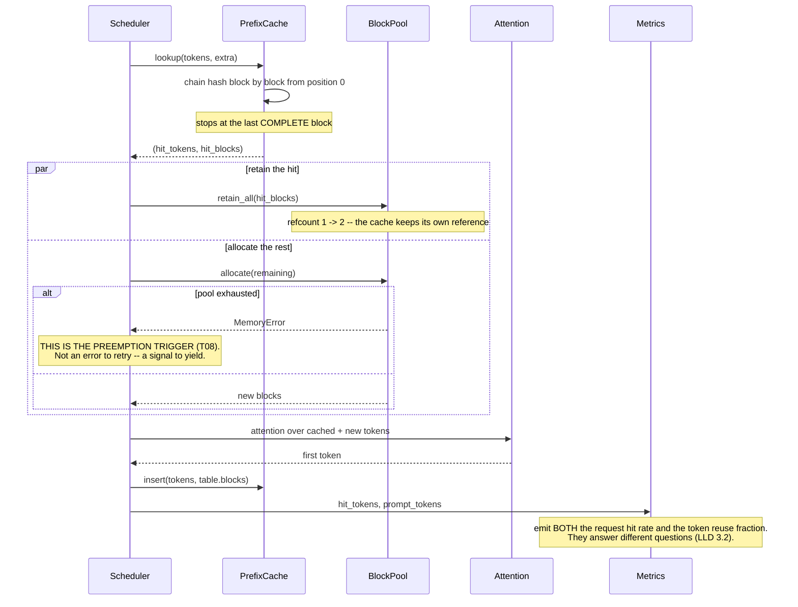
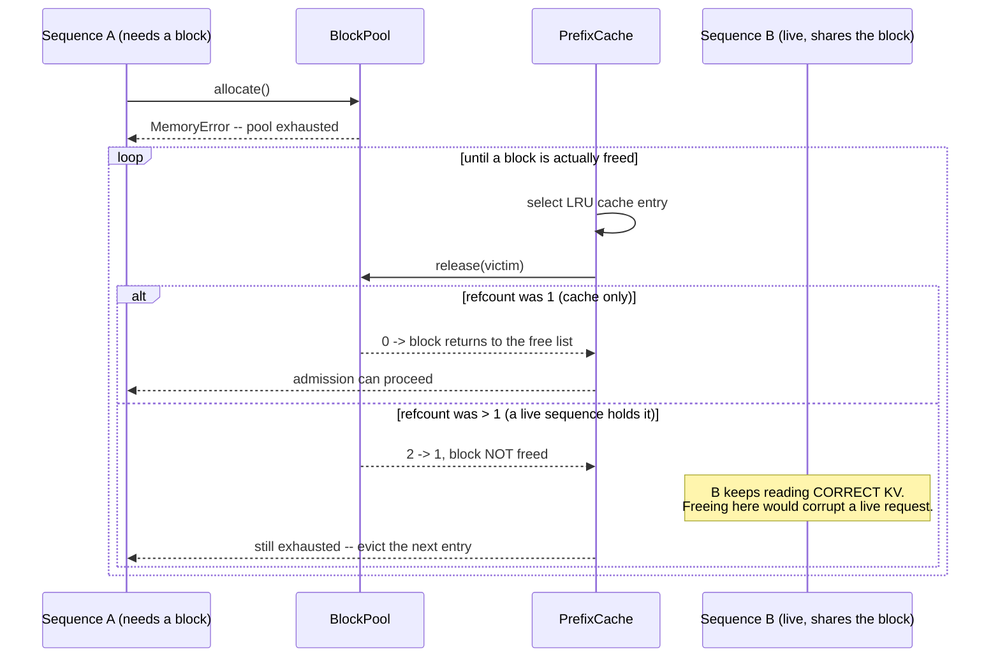
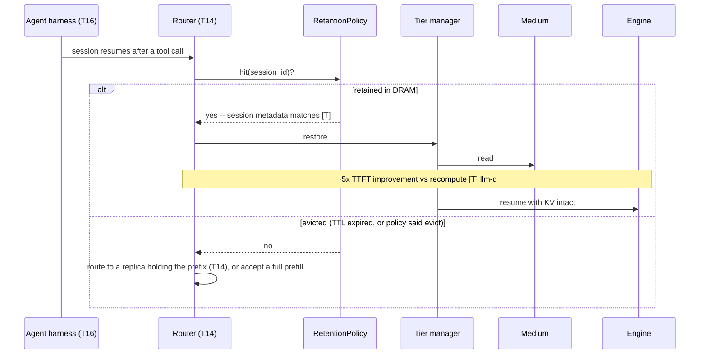
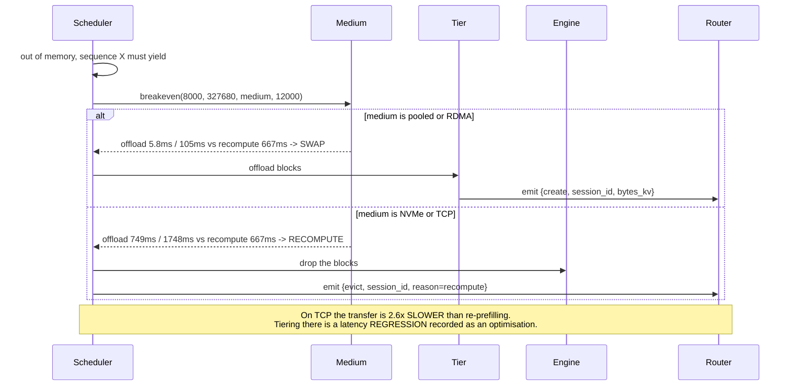
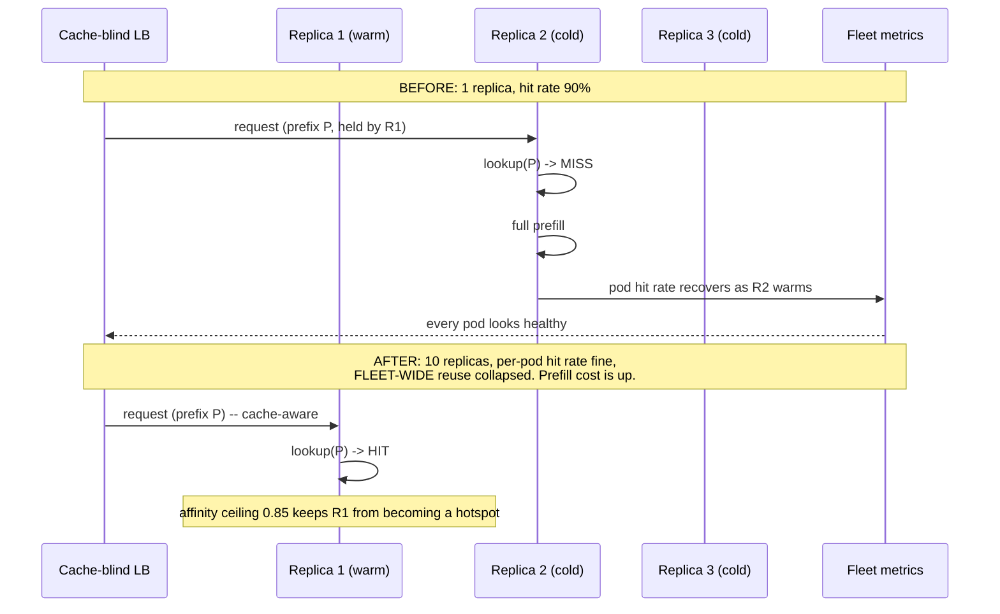

# T07 — Sequences: KV Cache

> **Transcript coverage:** primary · [HLD](../HLD.md) · [LLD](../LLD.md) · [production/](../production/README.md) · [run.py](../run.py)

Five flows. Each one is a place where KV policy is decided, and each has a failure mode that is
**silent** — no crash, no error, no latency spike. That is not a coincidence; it is the property
that makes this topic hard to operate.

`[T]` transcript · `[R]` repo · `[D]` derived.

---

## 1. Admission — the prefix lookup

**What this flow makes visible.** The cache holds a **second reference** to every block it caches.
That is why a prefix outlives the request that created it — and why forgetting the release is a
leak rather than a missed optimisation.

**Where this fails, silently.** If `extra` omits the LoRA adapter id, two requests with identical
tokens under different adapters share KV. The output is fluent and wrong. Nothing in this diagram
changes: same hit, same latency, same token count.

---

## 2. Eviction — and the branch that must not free

**The `else` branch is the whole design of this file.** A cache that frees unconditionally corrupts
live sequences; a cache that never frees leaks. The refcount is what makes "release the cache's
reference" and "free the block" *different operations* — and this is the exact point where a
design that implemented sharing as "a cache with a TTL" breaks.

**Where this fails.** If every cache entry is pinned by a live sequence, the loop terminates and
returns 0 freed blocks. That is the correct answer: the scheduler must now preempt (T08), not keep
asking the cache. An `evict_to` that looped forever, or that assumed one eviction frees one block,
would hang the admission path.

---

## 3. Session return — the ~5× win, and its precondition

**The precondition nobody states.** This win requires that the system **knew the gap was coming**.
The corpus is explicit `[T]`: *"if you know that it's going to take a longer time you can evict the
KV cache and put it to the CPU and then come back to it"*. Without session metadata and a harness
that reports expected tool latency (T16), there is no "if you know" — the tier fills on a timer and
the sessions that return are the ones that got evicted.

**Where this fails — the misread.** The ~5× is a **session-return** figure, measured across a
pause. Applying it to a millisecond preemption gap is the most common misreading of that number.
The cost arithmetic is the same; the occupancy pressure is not (HLD §6.3).

---

## 4. Preemption — recompute or swap

**The result to read twice.** On TCP/IP the swap costs **1,748 ms to avoid a 667 ms re-prefill**.
The corpus's medium ordering (pooled < RDMA << TCP/IP) `[T]` is not a preference — it is the line
between a working tier and an anti-optimisation. This blueprint's RDMA figure (105 ms vs 667 ms,
~6.4×) reproduces the corpus's ~5× `[T]`, which is the check that the model is calibrated.

**Where this fails.** Choosing on `breakeven` alone ignores **occupancy**. A tier that evicts before
the sequence resumes pays the transfer *and* the re-prefill — strictly worse than never tiering.
That is why the flow emits session metadata with every transfer: occupancy is the router's problem,
and the router can only see it if the engine reports it.

---

## 5. Fleet scaling — the flow that gets worse with more replicas

**Why this is a sequence diagram rather than a paragraph.** The failure is invisible in every
per-pod metric: each replica's own hit rate looks healthy as it warms, so nothing alerts. The only
signal is *fleet-wide* reuse, and the only fix is routing. This is exactly why the corpus devotes a
full talk to prefix-cache-aware routing `[T]` and why `scope_id` is a placement input for agents
(T16).

**Where this fails.** Perfect affinity without a ceiling turns a hot prefix into a hotspot: every
request for it queues on one replica. The corpus's saturation gate — KV ~80% full `[T]` — is where
the affinity weight must yield to load balancing. Affinity is a **scorer**, not a constraint.

---

## Sources

- `refs/vLLM_Inference_Meetup_Bengaluru_2026_transcripts/Scaling_Agentic_AI_Distributed_Inference_with_llm-d.txt` — CPU KV offload "about 5x in TTF when agentic session comes back after a pause"; the router consuming per-request create and evict events; the retention API orchestrating KV movement and adding session metadata; "if you know that it's going to take a longer time you can evict the KV cache and put it to the CPU"
- `refs/vLLM_Inference_Meetup_Bengaluru_2026_transcripts/Scaling_AI_Inference_at_NxtGen_Indias_Best_Sovereign_Cloud_AI_Powerhouse.txt` — saturation at KV 80% full
- `refs/Agentic_AI_Infra_transcripts_2/Jongryool_Kim_-_Disaggregated_LLM_Serving_with_Shared_Memory_KV_Cache_at_Rack_Sc.txt` — the transfer-medium ordering pooled memory < RDMA << TCP/IP
- `refs/vLLM_Inference_Meetup_Bengaluru_2026_transcripts/` — prefix-cache-aware routing as a dedicated talk

**All sequence structure and every modelled figure are `[D]`**, reproducible from [`run.py`](../run.py).
Corpus facts (`[T]`) are attributed inline. The corpus supplies the mechanisms and the ordering; it
supplies no flow, no threshold and no bandwidth.
