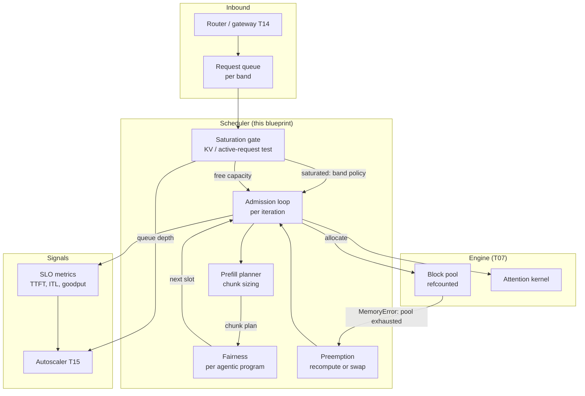

# T08 — Batching & Scheduling: high-level design

> `T08` · **Transcript coverage:** primary · [LLD](LLD.md) · [Cheat sheet](../../00-cheat-sheets/T08-batching-scheduling.md) · [Case study](../../01-case-studies/T08-batching-scheduling.md) · [Interview bank](../../02-interview-questions/T08-batching-scheduling.md) · [Runnable core](run.py) · [Production](production/README.md) · [Sequences](docs/SEQUENCES.md)

Continuous batching is the largest single free win in the serving stack, and it is the one teams
most often measure, conclude "didn't help", and revert. Both halves of that sentence are the
subject of this document. The win is real — the corpus's cost ladder puts naive 16-bit serving at
**100 cost units** and continuous batching at **~42**, before any quantization or caching `[T]`
(LLMOps cost talk). The reason teams mis-measure it is that the win is **almost entirely in
latency and slot reuse, not makespan**, and a throughput dashboard shows neither.

This blueprint designs the admission layer: which request gets a slot, when, in what order, and
what happens when there is no slot to give.

`[T]` transcript · `[R]` repo · `[D]` derived. Every modelled number here is reproducible from
[`run.py`](run.py); every corpus number is cited to its speaker.

---

## 1. System context

The scheduler sits between the router (T14) and the engine's memory manager (T07). It is the only
component that decides **when** work enters the GPU, and it is therefore the component that
determines whether the GPU is busy.

| Question | Mechanism | Failure if absent |
|---|---|---|
| When is a slot refilled? | iteration-level admission | a slot idles from the moment its request finishes until the slowest sibling does |
| Who gets the next free slot? | fairness policy (per program) | one program's fan-out monopolises the engine |
| What if the prompt is huge? | chunked prefill | one long prefill stalls every decode in the batch |
| What if there is no memory? | preemption | the pool fills to 100% and deadlocks (see §6) |
| What if demand exceeds capacity? | saturation gate + priority bands | the system degrades into uselessness instead of shedding load |
| What is the objective? | goodput at an SLO | throughput rises monotonically and can never say "too deep" |



**Two of these edges are the ones teams omit.** The `MemoryError → preemption` edge is the
difference between a system that degrades and one that deadlocks (§6). The `gate → autoscaler`
edge is the difference between a system that sheds load visibly and one that fails at nothing and
therefore alerts on nothing (§8). Both are design decisions, not tuning.

---

## 2. Why admission is the optimisation

The corpus's mechanism, verbatim: continuous batching "keeps the GPU full by slotting new requests
in as others finish" `[T]` (LLMOps cost talk). The guide states the same thing structurally:
continuous batching "allows new requests to join the batch and finished requests to leave at the
end of every individual token generation step" `[R]`
(`04-inference-optimization/04-batching-strategies.md`).

A **static** batch is admitted whole and retired whole, so its wall-clock is set by its **longest**
member while its useful work is the **sum** of its members. Every short sequence in that batch is a
slot that finished early and then idled. Reproduced in experiment 1 of [`run.py`](run.py):

| traffic | max len | mean len | static utilisation | continuous (8 slots) |
|---|---|---|---|---|
| uniform | 1,023 | 596 | **58.3%** | **100.0%** |
| mild skew | 1,023 | 351 | **34.4%** | **100.0%** |
| real skew | 1,012 | 237 | **23.4%** | **100.0%** |

**Read the shape, not the numbers.** The static penalty tracks the length **distribution**: a
uniform benchmark wastes 42% of the GPU, and a realistically skewed one wastes 77%. The corpus's
100 → 42 is measured on real traffic, and this table is why that is the honest place to measure it
`[T]`. A team that benchmarks continuous batching with uniform-length prompts will see less than
half the gain production delivers, and may conclude the migration is not worth the risk.

**Why it is not a tunable.** There is no traffic shape for which waiting for the slowest sequence
is the right answer. That is what distinguishes an admission discipline from a parameter — it has
no downside to trade against.

### 2.1 What actually changes, and it is not the makespan

Experiment 2 runs identical traffic under both disciplines, with slots deliberately
**over-provisioned** (8 slots for 4 long sequences) so there is genuine free capacity:

| discipline | makespan | short finishes | short waited | idle |
|---|---|---|---|---|
| static | 9 | [9, 9, 9, 9] | **6** | 0.0% |
| continuous | 9 | [3, 3, 3, 3] | **0** | 44.4% |

**The makespan is identical.** Four of the eight slots were never needed by the long sequences and
sat idle for the whole batch: the capacity existed, and the admission discipline could not reach
it. Under continuous batching the shorts are admitted at the next iteration and finish immediately.

This is the single most important operational consequence in the document. Static batching is not
slower in aggregate; it is unable to use capacity it already has. **A makespan chart or a
tokens/sec gauge will show no difference at all**, and the observable that does change — per-request
latency, and slot-idle time — is usually not on the dashboard. That is the whole of the
"continuous batching didn't help" story.

**The exception, stated plainly.** With slots fully occupied by long sequences, *both* disciplines
make the shorts wait, and the experiment measures nothing. Over-provisioning the slots is what
makes the comparison honest. The corollary is that continuous batching pays off most when there is
free engine capacity under static batching — i.e. essentially always in production, and least in a
saturated benchmark.

---

## 3. Two regimes, two budgets — why the scheduler has two resources

The corpus separates the phases explicitly: "Prefill is when the model reads your whole prompt at
once. It is **compute-bound** and it sets your time to first token. Decode is when the model writes
the answer one token at a time, and that phase is limited by **memory bandwidth**. This is why
continuous batching helps so much. It packs many requests' decode steps together to keep the GPU
busy" `[T]` (LLMOps cost talk). The guide adds that In-Flight Batching mixes the two so "the
Prefill request utilizes the GPU's idle compute cores while the Decode requests utilize the memory
bandwidth" `[R]` (`04-batching-strategies.md`).

A scheduler that models **one** resource cannot produce a correct result, in either direction:

| Model | What it predicts | Why it is wrong |
|---|---|---|
| decode only | adding slots always reduces latency; throughput rises forever | ignores that a deep batch shares a fixed bandwidth budget, so per-request speed falls |
| with a shared decode budget | over-batching becomes visible; goodput can peak | still misses that a long prefill occupies a slot without producing decode tokens |
| both budgets (this blueprint) | the ITL/ TTFT trade becomes explicit and chunking becomes a real decision | — |

Concretely, [`sim/scheduler.py`](sim/scheduler.py) `run_continuous` takes `prefill_rate`
(tokens/step, shared among all prefilling sequences) and `step_token_budget` (decode tokens/step,
the roofline ceiling). Without the second, every sequence decodes at full speed regardless of batch
depth — i.e. the model assumes **infinite memory bandwidth** — so adding slots can only ever help
and goodput can never peak.

**This is not a simulation convenience; it is the design.** The engine's `max_num_batched_tokens`
is exactly this second budget, and it is why `prefill_chunk_size ≈ max_num_batched_tokens −
decode_seqs × 1` (§4). A real deployment that sizes the token budget from decode throughput alone
will discover the interaction under load, in production, as an ITL spike.

---

## 4. Chunked prefill — trading a little TTFT for a lot of ITL stability

Experiment 3, budget 8,192 tokens, 16 sequences decoding at 100 tok/s:

| prompt | chunk | chunks | unchunked ITL spike | chunked spike | TTFT steps added |
|---|---|---|---|---|---|
| 512 | 8,176 | 1 | 6 steps | 1 step | 0 |
| 2,048 | 8,176 | 1 | 21 steps | 1 step | 0 |
| 8,192 | 8,176 | 2 | 82 steps | 1 step | 1 |
| 32,768 | 8,176 | 5 | **328 steps** | 1 step | **4** |

**Unchunked, a 32k prompt is one step that takes ~328 decode-steps of time.** Every other sequence
in the batch waits that long. The guide names this a "stall" and describes chunked prefill as
breaking the prefill into chunks "and interleav[ing] them with the ongoing Decode steps of other
users… maintain[ing] a steady TPOT even when heavy requests arrive" `[R]`
(`04-batching-strategies.md`).

**Note the direction of the trade, because it is counter-intuitive:** TTFT gets slightly **worse**
(4 extra steps for a 32k prompt) and ITL gets dramatically **better** (328 → 1). A team that
optimises or dashboards on TTFT alone will conclude chunking hurt the system and switch it off.

### 4.1 The decision table

| Setting | Pros | Cons | Use when | Exception |
|---|---|---|---|---|
| chunking **off** | lowest TTFT; fewest scheduling steps | any long prompt stalls the whole batch | prompt lengths are uniformly short (< chunk size) | a single 100k-token upload will still freeze every in-flight stream |
| chunking **on**, large chunk | near-unchunked TTFT; modest ITL smoothing | only helps on the longest prompts | mixed traffic with a moderate tail | — |
| chunking **on**, small chunk | near-constant ITL regardless of prompt | more steps; TTFT inflated for long prompts | interactive/streaming traffic where ITL jitter is the user-visible metric | pure batch traffic: no user watches ITL, so this is pure overhead |
| **chunk size from the budget** | self-correcting as concurrency changes | requires concurrency-aware config | default recommendation | — |

`prefill_chunk_size ≈ max_num_batched_tokens − (decode_seqs × 1)` `[D]`, computed in
[`sim/policies.py`](sim/policies.py). The subtraction is the point: a decode step consumes one token
per running sequence, and whatever remains of the budget is available to prefill. Sizing the budget
in isolation, without reference to the concurrent decode batch, is the standard configuration error.

**Too small →** many chunks, TTFT suffers. **Too large →** the chunk displaces decode work and ITL
spikes, which is the failure chunking was supposed to prevent.

---

## 5. Preemption — the safety valve, and why it is not optional

When the block pool is exhausted, something has to give. The design question is what:

| Strategy | Mechanism | Pros | Cons | Use when |
|---|---|---|---|---|
| **recompute** | evict a sequence's blocks; re-prefill it on return | free; no transfer path | re-prefill cost rises with context length — quadratic in the worst case | short contexts; cheap prefill; no fast fabric |
| **swap** | move blocks to host DRAM (or SSD); copy back on return | bounded restore cost, independent of recompute cost | consumes PCIe/NVLink bandwidth; needs a tier (T07) | long contexts; a fabric exists; recompute would be punitive |
| **queue** | refuse admission; the request waits | zero cost; preserves every in-flight request | increases latency for the refused one | the pool is sized with headroom and the refusal is rare |
| **drop** | reject with an error | protects the server absolutely | user-visible failure; the corpus expects a retry, not an error | only for explicitly batch/retryable traffic |

The corpus says the flow controller **queues** rather than drops: at saturation "the EP starts
queuing the request… and once the queueing happens in the flow control we can decide how we want to
handle this queue" `[T]` (llm-d). So the third row is the corpus's default and the fourth is the
exception.

**The deadlock, demonstrated.** Experiment 5 runs X and Y at turn 40 of 44 (40,000 tokens of
resident KV each) against Z, a long-horizon program with 40 cheap turns, at 2 slots:

| KV cap | policy | X done | Y done | Z done | KV freed @ | refused |
|---|---|---|---|---|---|---|
| unlimited | least_attained | 71 | 81 | 81 | 81 | 0 |
| unlimited | turn_priority | 41 | 41 | 121 | 41 | 0 |
| **88,000** | **least_attained** | **–** | **–** | **–** | **–** | **14,880** |
| 88,000 | turn_priority | 41 | 41 | 122 | 41 | 1 |
| 120,000 | least_attained | 71 | 81 | 81 | 81 | 0 |
| 120,000 | turn_priority | 41 | 41 | 121 | 41 | 0 |

At a 88,000-token cap, least-attained service **never completes**: X and Y hold 40,000 tokens each
while waiting their turn, Z needs room to continue, and the pool is too full to admit anyone.
Nothing running means nothing retires means nothing frees.

**This is not a simulation artefact, and it is the strongest argument in the blueprint for two
standard practices.** A scheduler that fills KV to 100% with no preemption cannot recover, because
the request that would free space is the one that cannot be admitted. Real engines avoid it two
ways, and the design must choose explicitly:

1. **Reserve headroom.** The corpus's saturation gate is KV **80% full** `[T]` (llm-d), not 100%.
   That is not conservatism; it is the slack the recovery path needs.
2. **Preempt** — evict a resident program and recompute or swap its KV on return (T07's tiering).

**A fairness policy is not a substitute for either.** The table shows the same policy deadlocking
or not depending purely on the cap, which is to say: no dispatch heuristic makes an over-committed
pool safe.

---

## 6. Fairness — per program, not per request

The corpus's scenario and its fix, verbatim: "there is a small session and a [large] session that
comes in and then takes all the dispatch cycles. So the shorter sessions are starving now. So to
address this we have built an **agentic program aware fairness** in the flow controller… based on
the attained service of each of these different agents" `[T]` (llm-d).

**Fairness is computed per PROGRAM, not per request.** This is the design decision the phrase
"agentic program aware" encodes, and getting it wrong rewards the program that issues the most
requests — exactly the program that needs throttling. An agentic program keeps a fan-out of its own
turns outstanding and refills them the instant any retire, so it presents a **permanent queue** to
the scheduler; a per-request policy then serves that queue forever.

Experiment 4 models it: one large program C fanning out to N concurrent turns of 400 tokens, and
six 2-turn sessions arriving behind it, at 8 slots.

| C fan-out | policy | small mean latency | C mean latency | C done @ |
|---|---|---|---|---|
| 8 | fcfs | 4.83 | 4.2 | 34 |
| 8 | least_attained | **1.00** | 4.2 | 35 |
| 12 | fcfs | 5.33 | 6.1 | 33 |
| 12 | least_attained | **1.00** | 6.1 | 35 |
| 16 | fcfs | 8.83 | 7.9 | 34 |
| 16 | least_attained | **1.00** | 7.9 | 35 |
| 24 | fcfs | 12.83 | 11.0 | 34 |
| 24 | least_attained | **1.00** | 11.0 | 35 |

**The trend is the finding, not the constant.** Least-attained service holds small sessions at a
1-cycle latency regardless of how deep the large program's backlog gets, while FCFS's penalty grows
with the fan-out — 4.8× at fan-out 8, 12.8× at 24. The more aggressively one program parallelises,
the more a naive arrival-order policy punishes everyone else.

**And the large program does not pay.** Its mean latency moves 4.2 → 11.0 and it finishes at
essentially the same cycle either way. Serving the small sessions first costs the large one
nothing — which is the corpus's own second-order claim, "short sessions finish much faster and
leaving the room for larger sessions to also finish much faster" `[T]` (llm-d), reproduced here as
"no worse".

### 6.1 The policy table

| Policy | Key | Protects | Starves | Use when | Exception |
|---|---|---|---|---|---|
| **FCFS** | enqueue order | nothing in particular | anyone behind a high-fan-out program | never as the sole policy; it is the baseline | acceptable if all tenants are equally interactive and no program fans out |
| **priority bands** | band, then order | premium/interactive tenants | best-effort, deliberately | mixed interactive + batch traffic | under saturation with no cap on the reserved share, premium can take everything (see §8) |
| **least-attained service** | **absolute** service received | small/short sessions | the largest program, mildly | any multi-tenant agentic fleet | useless when every program is the same size |
| **turn priority** | turns remaining | near-done programs, and hence the pool | long-horizon agents | **only** under KV saturation | pure starvation with no memory pressure (exp 5: Z at 121 vs 81) |

### 6.2 Two counter-intuitive details that decide whether this works

**Least-attained must key on ABSOLUTE service, not service as a fraction of demand.** A
ratio-based key (`served / demand`) is permanently smallest for the program with the largest
demand, so it reproduces exactly the starvation it was meant to fix. Absolute service needs no
knowledge of program size at all, which is *why* it protects short sessions: a short session
finishes before it accumulates much service and departs early, while a long one keeps being pushed
back. This is the classic least-attained-service / foreground-background semantics `[D]`. During the
build of this blueprint, the ratio-based version inverted the corpus's result (0.69×–0.76× at low
fan-out) — a plausible-looking, wrong-sign output that no crash or assertion would have caught.

**The direction is the reverse of the common assumption.** The corpus's scenario has the **large**
program monopolising dispatch, so least-attained service protects the **small** sessions. It is not
"protect the long agent from short requests". An engineer who reasons from "long jobs deserve
fairness" will implement the opposite policy and defend it confidently.

### 6.3 Two mechanisms, two different resources — the design lesson

This is the corpus's most important structural claim, and it is easy to read past: "these two
strategies — least attained service and then the turn priority — we're looking at how to integrate
them so that **one addresses the compute saturation, other addresses the KV cache saturation**"
`[T]` (llm-d).

| | least-attained service | turn priority |
|---|---|---|
| Scarce resource | **dispatch cycles** (compute) | **KV occupancy** (memory) |
| Signal | service already received | turns remaining |
| Effect | spreads service across programs | finishes near-done programs to **evict** their KV |
| Fairness posture | pro-fair | deliberately **anti-fair** |
| Failure without the other | nothing when memory is the constraint | starvation when memory is not |

They are **not two settings in one config slot**. They are responses to two different bottlenecks,
which is why the corpus describes integrating them rather than choosing between them.

**A finding this blueprint produced, which the corpus does not state.** On a compute-only model the
two policies are nearly indistinguishable — experiment 5's `unlimited` rows are far closer than the
capped rows. The separation appears **only once KV occupancy is modelled**, because turn priority's
benefit is *releasing* memory rather than reshuffling dispatch. Two consequences follow: (a) an
operator tuning fairness on a compute dashboard will not be able to tell these policies apart and
may conclude neither works; (b) any evaluation of these policies must include the memory
constraint or it is measuring the wrong thing.

---

## 7. Flow control — the saturation gate

The corpus's trigger and its handling, verbatim: "the flow control mainly comes into the picture
when your cluster is saturated and the saturation mechanism is decided by you… when the KV cache is
80% full I declare that the cluster is saturated or the number of active requests a particular
cluster is seeing on average is more than eight. So at that point when a saturation is detected the
EP starts queuing the request in the flow control" `[T]` (llm-d).

```python
saturated = (kv_usage > 0.80) or (active_requests > 8)     # sim/policies.py
```

**Why this belongs to scheduling and not to autoscaling.** Without a gate the system does not shed
load — it degrades gracefully into uselessness. Every request gets slower, so nothing fails, so
nothing alerts, so no capacity is added. A gate converts a latency collapse into a **queue**, which
is a failure mode an operator can see, alert on, and autoscale against.

Experiment 7, with a premium tenant keeping 1 turn outstanding against a best-effort tenant
flooding 8, at 4 slots:

| mode | premium latency | best-effort latency | slots idle |
|---|---|---|---|
| ungated (no bands, FCFS) | 1.8 | 1.9 | 8 |
| gated (priority bands) | **1.0** | 2.2 | 0 |
| reserved (band + hard gate) | **1.0** | 3.8 | 12 |

**The gate does not make the system faster — it makes the right traffic fast and the other traffic
wait.** That is the entire point. Ungated, the flood from best-effort is served first because it
arrived first and it is deeper, so premium's single request queues behind it; everything slows
together. The corpus's phrasing is that under saturation "only the premium traffic is dispatched
and the rest are not dispatched until you have capacity… to make sure that your customer-facing or
interactive workloads don't suffer while your batch processing workloads can wait and then retry
later" `[T]` (llm-d).

**Watch the third row.** Hard reservation protects premium best but burns 12 slots while premium is
not using them. Reserve-and-**release** (row 2) is the corpus's shape: the request queues rather
than being refused, and whatever premium does not use goes back to everyone else. A gate that
reserved unconditionally would leave slots idle and starve best-effort forever.

**A gate with no queue is a dropped request.** The queue depth is the signal the autoscaler (T15)
consumes to add capacity. Discarding at the gate removes both the load and the evidence of it.

---

## 8. The objective — goodput, and the SLO that makes it mean something

Throughput is the wrong objective, and it is wrong in a specific and dangerous way: **it rises
monotonically with batch size, so it can never tell you that you have batched too far.** Experiment
6, 96 requests arriving together, 800 prompt + 200 output tokens, engine decode ceiling 800 tok/step:

| slots | run avg | at full batch | P50 | P99 | idle | goodput @ 10 | @ 15 | @ 25 |
|---|---|---|---|---|---|---|---|---|
| 4 | 400 | 400 | 26 | 48 | 0.0% | 21% | 29% | 50% |
| 8 | 800 | **800** | 14 | 24 | 0.0% | **42%** | **58%** | 100% |
| 16 | 640 | **800** | 20 | 30 | 0.0% | 33% | 50% | 83% |
| 32 | 582 | **800** | 22 | 33 | 0.0% | 0% | 33% | 67% |
| 64 | 606 | **800** | 23 | 33 | 15.2% | 0% | 0% | 67% |
| 128 | 588 | **800** | 34 | 34 | 26.5% | 0% | 0% | 0% |

**Read the columns separately, because they do not peak together.**

- **At full batch** the rate climbs to the engine ceiling and then **stops**. It is flat at 800 from
  8 slots upward. Throughput goes *quiet*, which looks like success on a dashboard.
- **The run average declines** (800 → 588) and that is a **measurement artefact, not a regression**.
  It counts prefill-only steps, and a deeper batch spends proportionally more of its life
  prefilling. Report the saturated rate; a run average will make you think you have a throughput
  problem when you have a metric problem. (This artefact is easy to introduce accidentally: an
  earlier version of this simulator reported 768 instead of 800 at 64 slots purely from integer
  division dropping a remainder.)
- **P50/P99 rise** once past the knee. Adding slots does not create capacity; it redistributes a
  fixed budget more thinly across more requests.
- **goodput peaks and falls** — if the SLO binds at all.

**peak-goodput slot count by SLO** (from `run.py`):

| SLO | peaks at | conforming | falls to |
|---|---|---|---|
| 10 | 8 slots | 42% | 0% at 128 slots |
| 15 | 8 slots | 58% | 0% at 128 slots |
| 25 | **no peak** | every batch size conforms | — |

**"An SLO you always meet is not a constraint, it is decoration."** At SLO 25 every batch size
conforms, so goodput does not discriminate at all — and this is the failure mode teams actually hit.
The SLO is usually set *after* looking at the latency distribution, which guarantees it is
achievable, which means the tuning then happens against a target that no longer constrains
anything.

**So "what is the right batch size" has no answer until the SLO is fixed.** The batch size that
maximises goodput is a function of the SLO as much as of the engine, which is why
[`batch_sweep`](sim/policies.py) reports goodput at several SLOs rather than one. A single-SLO
column invites the reader to treat the peak as a property of the hardware, which it is not.

**The exception.** For genuinely offline batch traffic with no SLO, throughput **is** the right
objective and the peak-goodput slot count is under-provisioned. The metric follows the workload,
not the other way round.

---

## 9. Capacity and cost model — worked

The corpus's ladder, applied to a scheduling decision `[T]` (LLMOps cost talk). Start from naive
16-bit serving, one request at a time, as **100 cost units**:

| Step | Mechanism | Cost | What it buys |
|---|---|---|---|
| baseline | 16-bit, one request at a time | 100 | — |
| **continuous batching** | refill slots per iteration | **≈42** | the GPU is no longer idle behind the longest sequence |
| 4-bit quantization (T10) | weights in 4 bits | ≈26 | more headroom per slot, so more slots |
| prompt caching (T07) | stable system prompt cached | ≈11 | prefill stops re-reading the same context |

**Note what batching and quantization do to each other, because the ladder hides it.** Batching's
42 is achieved by *multiplexing more sequences through the same engine*; quantization's further
reduction works by *making each sequence cheaper in memory*, which raises the number of slots.
They are multiplicative in effect but they compete for the same resource: quantization's headroom
is spent as extra batch depth, so the combined number depends on where you stop.

**Worked scheduling arithmetic.** For the experiment-6 configuration (800 prompt + 200 output
tokens, ceiling 800 decode tok/step, prefill rate 8,000 tok/step):

```
  per-request work        = 800 prefill + 200 decode = 1,000 token-units
  decode ceiling          = 800 tok/step   (bandwidth-bound, shared)
  prefill rate            = 8,000 tok/step (compute-bound, shared)

  Ideal sustained decode rate  = 800 tok/step
  96 requests x 200 output tok = 19,200 decode tokens
  Ideal decode steps           = 19,200 / 800 = 24 steps
  Plus prefill steps           = 96 x 800 / 8,000  = 9.6 -> 10 steps (contended)
  Ideal makespan               ~ 34 steps

  Measured: P99 = 34 at 128 slots, 48 at 4 slots.
```

The gap between 4 slots and 8 slots is the admission win (the batch is too shallow to reach the
ceiling at 4 — capped at 400 tok/step, exactly half). The gap between 8 and 128 is **all latency**
and no throughput: past 8 slots the ceiling is reached, so every additional slot only deepens the
queue. **That is the capacity model's whole message: past the knee, adding concurrency buys
nothing and costs latency.**

**Sizing rule `[D]`:** pick the smallest slot count that reaches the engine's saturated rate at the
target SLO, then add headroom for burst and for the recovery path (§5). In the table that is 8
slots, not 128 — a 16× difference in provisioned concurrency for identical throughput, with P99
24 instead of 34.

**Which numbers here are corpus facts and which are modelled.** 100 → 42 → 26 → 11 is the corpus's
ladder `[T]`. The per-step rates, the 96-request mix, the P50/P99 and the goodput columns are
**this blueprint's model**, reproducible from `run.py`; they are not measurements of any real
engine and are labelled as such in the output. No corpus figure is asserted as an output of the
simulator.

---

## 10. Deployment topology and scaling

The scheduler is not a separate service in the common design — it is the engine's own loop, driven
by configuration. Where it becomes a service, it is at the **router** (T14), as flow control.

| Placement | What it can see | Pros | Cons | Use when |
|---|---|---|---|---|
| **in-engine** (`max_num_seqs`, `max_num_batched_tokens`) | this replica's queue and pool | zero latency; exact KV knowledge | cannot arbitrate across replicas; no fleet view | single-replica or any deployment; always present |
| **at the router / EPP** | all replicas, all tenants, bands | fleet-wide fairness and admission; the corpus's placement `[T]` | an extra hop; needs per-replica state to be accurate | multi-replica, multi-tenant, the corpus's llm-d shape |
| **at the gateway** (T14) | tenants, keys, quotas | quota enforcement, billing | no idea what a slot is; cannot do KV-aware admission | as an outermost policy layer, not as the scheduler |

The corpus places flow control explicitly at the router: "the flow control that performs the
admission and the placement is done by the router" `[T]` (llm-d). The in-engine limits remain the
backstop — a router that admits more than the engine can hold has moved the deadlock rather than
prevented it.

### 10.1 Scaling behaviour

| Replicas | What improves | What gets worse | Mitigation |
|---|---|---|---|
| more, same batch depth | total concurrent slots | per-replica batch depth falls → ceiling may not be reached | scale out only past the knee (§8) |
| more, same total concurrency | burst absorption | cache dilution (T07), fairness becomes fleet-wide not per-replica | prefix-aware routing (T07/T14) |
| fewer, deeper | reaches the ceiling at lower cost | P99 rises; one long prefill stalls more streams | chunked prefill; cap depth at the goodput peak |
| heterogeneous | — | a shallow slot pool and a deep one behave differently under one policy | per-replica slot budgets |

**The interaction with T15 that is easy to get wrong.** Autoscaling on GPU utilisation is useless
for this layer: a continuous batcher *keeps utilisation high by design*, so the autoscaler sees a
healthy fleet right up until the queue explodes. Scale on **queue depth and saturation-gate state**
(§7), which is what the gate exists to expose.

---

## 11. Failure domains

| Failure | Symptom | Silent? | Detection | Mitigation |
|---|---|---|---|---|
| slots fully committed, no preemption | total stall; nothing completes | **yes** until P99 explodes | queue depth that never drains; zero completions | headroom (80% gate) + preemption (§5) |
| long prefill admitted mid-batch | every stream's ITL spikes | no (users see it) | ITL p99 vs prompt-length correlation | chunked prefill (§4) |
| one program's fan-out monopolises the engine | small tenants slow, large ones fine | **yes** — every dashboard is green | per-tenant latency, not fleet mean | least-attained service (§6) |
| turn priority with no memory pressure | long-horizon agents never finish | **yes**; average latency barely moves | per-program completion rate for long sessions | gate the policy on KV occupancy (§6.3) |
| SLO set after seeing the latency curve | tuning optimises nothing | **yes** — goodput looks fine | goodput is ~100% at every setting | fix the SLO first; check it binds (§8) |
| run-average throughput used as the metric | a "regression" that is arithmetic | **yes** | run avg falls while saturated rate is flat | report the saturated rate (§8) |
| fairness computed per request | largest program gets the most service | **yes** | service share by tenant vs demand | per-program accounting (§6) |
| token budget sized without concurrency | ITL spikes at high concurrency only | no, but only in production | ITL p99 vs concurrent decode count | `budget − decode_seqs` (§4) |

**Seven of the eight are silent.** That ratio is the operational character of this layer: the
scheduler's mistakes rarely crash anything. They produce a system that is quietly serving the wrong
traffic, or quietly not using capacity it owns, while every standard dashboard reports healthy. The
detections above are therefore the actual deliverable — the mechanisms only matter if they are
observable.

---

## 12. Build vs buy

| Component | Build | Buy / adopt | Recommendation |
|---|---|---|---|
| core admission loop | — | vLLM / SGLang / TensorRT-LLM | **adopt, always.** This is solved, tuned, and kernel-coupled. |
| chunked prefill | — | engine config (`max_num_batched_tokens`) | **adopt.** A configuration decision, not a codebase. |
| fairness policy | per-program policy at the router | engine `--scheduling-policy` | **build at the router** if tenants differ in size or band; adopt in-engine default otherwise |
| saturation gate | gate + queue + band policy | llm-d flow control `[T]` | **build or adopt**, but it must exist; the engine has no opinion about tenants |
| preemption | — | engine (recompute/swap) | **adopt.** Fabric-coupled (T07) and easy to get wrong. |
| goodput instrumentation | SLO-aware metrics | — | **build.** No engine ships the SLO that makes goodput meaningful. |

**The corpus's view of what is already solved** is worth taking at face value: vLLM is "an
open-source high-throughput inference engine… Its PagedAttention design and built-in continuous
batching are exactly what led it serve many requests per GPU far more cheaply than naive serving.
It is the open default with TGI, TensorRT-LLM, and SGLang as strong alternatives… vLLM gives you
the throughput wins with almost no configuration. Load a quantized model, call generate on a batch
of prompts, and continuous batching keeps the GPU saturated for you. **No manual batching logic
required**" `[T]` (LLMOps cost talk). Writing an admission loop is not the job. Deciding *who* gets
the slot, and *what happens when there is none* — the fairness policy, the gate, and the SLO — is.

---

## 13. What changes at 10× scale

| At 1× | At 10× | Why it changes |
|---|---|---|
| FCFS is fine, tenants are similar | per-program fairness is mandatory | one agentic program's fan-out can out-compete every other tenant at once (§6) |
| the pool is never full | the 80% gate and preemption are load-bearing | the deadlock in §5 appears only when occupancy is chronically near the cap |
| one replica; in-engine limits suffice | fleet-level flow control at the router | fairness and admission must arbitrate across replicas, which no engine can do `[T]` |
| TTFT is the user-visible metric | ITL and goodput are | at depth, streams are the product, and a batch that stalls one stream stalls all |
| batch depth tuned once | tuned against a binding SLO | the goodput peak moves with both traffic mix and SLO (§8) |
| a long prompt is rare | chunked prefill is always on | long prompts become routine once agents carry context |
| throughput is the capacity metric | queue depth is | the fleet reaches the ceiling at 1/16th the concurrency you might provision (§9) |

**The one that bites first is fairness.** It is the change that has no engine-level equivalent, and
its symptom — one tenant's agents starving everyone else while every dashboard stays green — is
indistinguishable from a capacity problem until someone looks at latency **per program**.

---

## 14. Six things to carry away

1. **Admission is the optimisation.** The win is in latency and slot reuse, not makespan. If you
   measure only makespan, you will conclude it did nothing and revert it (§2.1).
2. **Two regimes, two budgets.** Prefill is compute-bound and sets TTFT; decode is bandwidth-bound
   and sets ITL. A scheduler modelling one resource gets over-batching wrong and chunking wrong (§3).
3. **Chunked prefill trades TTFT down for ITL up.** Enable it when the prompt-length distribution
   has a tail, not by default (§4).
4. **Fairness is per agentic program, keyed on absolute service, and protects the SMALL sessions.**
   All three of those clauses are commonly got backwards (§6).
5. **Least-attained service and turn priority address different resources** — compute and memory —
   and only separate once memory is modelled. They are not two settings in one slot (§6.3).
6. **Past saturation the system is not slow, it is useless.** The gate converts that into a queue,
   and the queue is what the autoscaler needs. Without a gate you fail at nothing and alert on
   nothing (§7), and without headroom you deadlock instead (§5).

---

## Sources

Corpus (transcripts under `refs/`):

- `refs/LLMOps_Agentic_AIOps_The_Hands-On_Playlist_2026_transcripts/Cut_LLM_Cost_Latency_KV_Cache_Batching_Quantization_vLLM.txt` — continuous batching "keeps the GPU full by slotting new requests in as others finish"; the 100 → 42 → 26 → 11 ladder; the prefill/decode phase split and "batch harder for decode"; vLLM's PagedAttention and built-in continuous batching.
- `refs/vLLM_Inference_Meetup_Bengaluru_2026_transcripts/Scaling_Agentic_AI_Distributed_Inference_with_llm-d.txt` — Pravin (IBM Research): the 80%-KV / >8-active-request saturation test; "a naive way of doing this is first come first serve but that doesn't add anything extra to your policies"; priority bands with premium and best-effort; agentic-program-aware fairness and least-attained service; the small/large session starvation scenario; turn priority and KV eviction; "one addresses the compute saturation, other addresses the KV cache saturation".

Supporting repos:

- `refs/ai-system-design-guide-main/ai-system-design-guide-main/04-inference-optimization/04-batching-strategies.md` — static vs dynamic batching; continuous (iteration-level) batching; in-flight batching; chunked prefill and the "stall"; the static-vs-continuous comparison table.
- `refs/ai-system-design-guide-main/ai-system-design-guide-main/04-inference-optimization/01-inference-fundamentals.md` — prefill/decode asymmetry and the roofline framing behind §3.
- `refs/ai-system-design-guide-main/ai-system-design-guide-main/04-inference-optimization/02-kv-cache-and-context-caching.md` — the pool the scheduler allocates from, and hence the preemption trigger.
- `refs/llm-inference-engineering-main/llm-inference-engineering-main/README.md` — KV cache → paged attention → engine → hardware reading order.

Runnable: [`run.py`](run.py) and [`sim/`](sim/) — seven experiments, stdlib-only, offline, no GPU. Every modelled number above is printed by that script.
