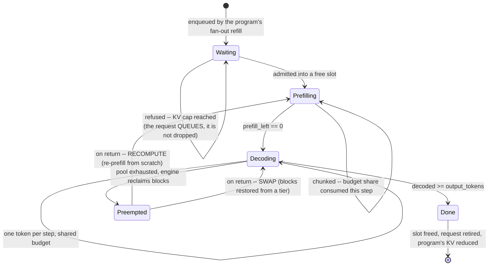
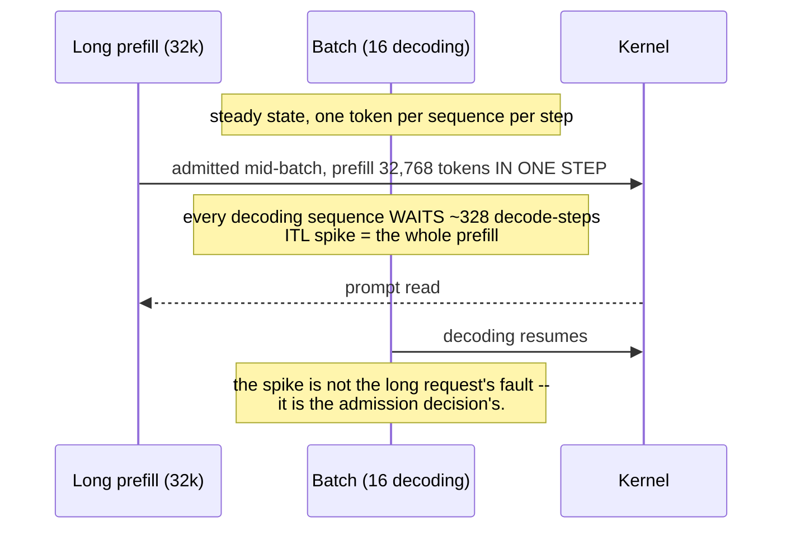
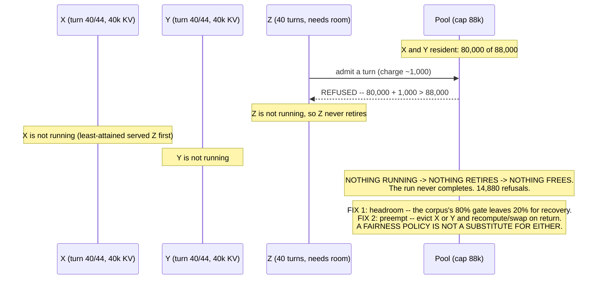

# T08 — Batching & Scheduling: low-level design

> `T08` · **Transcript coverage:** primary · [HLD](HLD.md) · [Cheat sheet](../../00-cheat-sheets/T08-batching-scheduling.md) · [Case study](../../01-case-studies/T08-batching-scheduling.md) · [Interview bank](../../02-interview-questions/T08-batching-scheduling.md) · [Runnable core](run.py) · [Production](production/README.md) · [Sequences](docs/SEQUENCES.md)

The scheduler is ~400 lines of decision logic wrapped in an enormous amount of coupling: it reads
the pool's occupancy, the engine's token budget, the tenant's band, and the program's service
history, and it writes a slot assignment that everything downstream inherits. This document is the
module decomposition, the data structures those decisions are made **on**, and the interfaces that
keep the decision separable from the engine.

`[T]` transcript · `[R]` repo · `[D]` derived.

---

## 1. Module map

```
T08-batching-scheduling/
  run.py                 driver: prints seven experiments, exits 0
  sim/
    __init__.py          re-exports the public surface
    scheduler.py         Seq, SchedulerState, the admission loop, static vs continuous
    fairness.py          AgentProgram, Request, the four policies, the dispatcher
    policies.py          chunk sizing, the saturation gate, goodput
    experiments.py       the seven scenarios and their READ blocks
  production/            reference-grade: engine limits, flow control, alerts
  docs/SEQUENCES.md      the flows: admission, stall, starvation, deadlock, gate
```

**Why the three modules split this way.** Each owns one question and one input domain:

| Module | Owns | Inputs | Depends on |
|---|---|---|---|
| `scheduler.py` | *when* a slot is refilled | arrival, length, slots, token budgets | nothing |
| `fairness.py` | *who* gets the next slot | per-program service history, band, KV occupancy | nothing (models its own KV) |
| `policies.py` | *how much* work one step may admit, and *what the objective is* | the engine's budget, the SLO | `scheduler` |

The dependency graph is a line, not a web: `scheduler` → `policies`, and `fairness` stands alone.
That shape is deliberate. **Fairness is the part you will change most often** — it is the part with
no engine equivalent, and the part that is tenant-specific — and it can be reasoned about, tested
and replaced without touching the admission loop or the budget arithmetic.

**What is deliberately *not* here.** The block allocator and the KV pool are T07. The scheduler in
this blueprint models occupancy as an integer token count and treats allocation as a capacity check.
That is the correct interface boundary: a scheduler that reached into block tables would be coupled
to the engine's memory layout, and the entire point of the flow-control layer is that it can be
moved, replaced, or run across replicas.

---

## 2. Data structures

### 2.1 `Seq` — one sequence in flight

```python
@dataclass
class Seq:
    seq_id: str
    prompt_tokens: int
    output_tokens: int
    session: str = "default"          # owning agentic program
    arrival: int = 0                  # the STEP at which this sequence may be admitted
    decoded: int = 0
    prefill_left: int = 0
    prefilled: bool = False
    start: int | None = None
    finish: int | None = None

    @property
    def total_tokens(self) -> int     # prompt + output
    @property
    def done(self) -> bool            # decoded >= output_tokens
```

**`prompt_tokens` and `output_tokens` are separate fields, and that is the whole design.** The two
phases have different cost models (compute-bound vs bandwidth-bound, §3 of the HLD), so a type that
stored a single "length" would make the two-regime model impossible to express. `prefill_left`
exists rather than being derived because chunked prefill leaves a sequence **partially prefilled**
across steps — a state that has no representation in a `prompt_tokens`-only model.

**`arrival` is a step number, not a sequence-ordering key.** It is compared against the scheduler's
own step counter, so latencies (`finish - arrival`) are in one consistent clock. Mixing clocks here
is a real and silent bug class; see §2.2.

### 2.2 `Request` — one turn of an agentic program, waiting for a slot

```python
@dataclass
class Request:
    session: str
    turn: int
    arrival: int                      # the CYCLE at which this turn entered the queue
    band: int                         # 0 = premium, 1 = best-effort
    hold: int                         # cycles this dispatch occupies its slot
    kv_charge: int = 0                # context this turn adds while in flight
    seq: int = 0                      # global monotone enqueue counter -- TIE-BREAK ONLY
    dispatched_at: int | None = None
    finished_at: int | None = None

    @property
    def latency(self) -> int | None:
        return None if self.finished_at is None else self.finished_at - self.arrival
```

**Why there are two ordering fields, `arrival` and `seq`.** This is the design's most instructive
detail. `arrival` is the clock (when the request entered the queue); `seq` is a monotone counter
used *only* for deterministic tie-breaking, so two requests arriving in the same cycle sort
stably. The two must never be mixed.

Collapsing them into one field — using a global enqueue counter where a cycle number belongs —
produces latencies that are **negative, internally consistent, and wrong**. Every policy comparison
then silently returns ≈1.0, because all four policies are being measured on the same garbage clock.
This happened during the build of this blueprint and nothing crashed. The rule the type encodes:
*any field compared against `finished_at` must be in the same units as `dispatched_at`.*

**`kv_charge` is counted separately from the program's accumulated context.** A program's resident
KV is `completed_turns × tokens_per_turn` (the conversation so far) **plus** the charge of each of
its in-flight turns. Counting only the accumulated context under-reports a program with a wide
fan-out — exactly the program whose KV pressure matters most — and the capacity check then never
fires. See §2.3.

### 2.3 `AgentProgram` — the unit of fairness

```python
@dataclass
class AgentProgram:
    session_id: str
    turns: int                        # total turns in the session
    tokens_per_turn: int
    max_in_flight: int = 1            # FAN-OUT: how many turns kept outstanding
    band: int = 1                     # 0 = premium, 1 = best-effort
    start_cycle: int = 1
    initial_turns: int = 0            # turns already completed before observation starts
    served: int = 0                   # tokens served -- the LAS signal
    completed_turns: int = 0
    issued: int = 0
    in_flight: int = 0
    finished_at: int | None = None

    def __post_init__(self) -> None:   # seed counters from initial_turns
    @property
    def demand(self) -> int            # turns * tokens_per_turn
    @property
    def attained(self) -> float        # served / demand  -- REPORTING ONLY
    @property
    def remaining(self) -> int         # turns - completed_turns -- the turn-priority signal
    @property
    def hold(self) -> int              # cycles one dispatch occupies its slot
    def outstanding(self) -> int       # issued - completed_turns
    @property
    def kv_tokens(self) -> int         # resident KV; 0 once finished_at is set
```

**Four decisions in this type are load-bearing, and each corresponds to a way the model was wrong
before it was fixed.**

1. **`attained` (the ratio) is for reporting; `served` (absolute) is the scheduling signal.** These
   are different quantities and only one of them is the policy key. Keying on the ratio inverts the
   corpus's result, because a huge program's ratio stays near zero for a long time — it becomes
   permanently least-attained and is permanently served first, reproducing the exact starvation the
   policy exists to fix (HLD §6.2).

2. **`kv_tokens` returns 0 once `finished_at` is set.** This is not bookkeeping. Releasing a
   completed program's context is the *entire mechanism* turn priority exploits (HLD §6.3). A model
   that keeps a finished program's KV resident makes the two fairness policies indistinguishable
   however long it runs, because the resource they disagree about never moves.

3. **`initial_turns` seeds `completed_turns`, `issued` and `served` in `__post_init__`.** A session
   can be observed **mid-flight**. The corpus's turn-priority scenario is an agent "at turn 100" `[T]`
   (llm-d), which is only meaningful if the program already has 100 turns of service and a
   corresponding pile of resident KV behind it. Starting every program at zero makes both policies
   behave identically, because neither has anything to disagree about yet.

4. **`max_in_flight` (fan-out) is the mechanism of starvation.** A program with a wide fan-out
   refills its outstanding turns the instant any retire, so it presents a **permanent queue** to the
   scheduler. The corpus's "large session… takes all the dispatch cycles" `[T]` is this field, and
   experiment 4's independent variable is nothing else.

**`hold`** derives cycles from tokens (`round(tokens_per_turn / TPS_PER_CYCLE)`) so that a longer
turn genuinely occupies its slot longer. Without it, a program's turn length would be cost-free and
the large session's advantage would vanish.

### 2.4 `SchedulerState` — occupancy and the measurement artefact

```python
@dataclass
class SchedulerState:
    slots: int
    running: list[Seq] = field(default_factory=list)
    waiting: list[Seq] = field(default_factory=list)
    done: list[Seq] = field(default_factory=list)
    step: int = 0
    idle_slots_total: int = 0
    admits: int = 0
    preemptions: int = 0
    full: int = 0                  # min(slots, n_seqs) -- the occupancy this run CAN reach
    steady_steps: int = 0          # steps at which the batch was at that occupancy
    steady_tokens: int = 0         # decode tokens produced during those steps

    @property
    def free(self) -> int
    def idle_fraction(self) -> float
    def saturated_throughput(self) -> float
```

**`full` is separate from `slots`, and `saturated_throughput` is separate from throughput.** Both
separations exist because the naive version reports a false regression:

- A batch of 96 requests in a 128-slot engine can never reach 128 concurrent sequences. Testing
  `len(running) == slots` is then never true, so the saturated-rate counter records zero — which
  reads as "a 128-slot engine produces no throughput" rather than "the occupancy test was wrong".
- The **run average** counts prefill-only steps, and a deeper batch spends proportionally more of
  its life prefilling, so the run average **falls** as the batch grows. That looks exactly like a
  throughput regression and is a measurement artefact (HLD §8). `saturated_throughput` counts only
  steps at full occupancy and is flat at the engine ceiling — which is the honest answer to "can
  this engine go faster".

**The integer-remainder leak.** Distributing decode tokens as `actual // len(decoding)` drops the
remainder: at 64 slots the engine reports 768 tok/step instead of its 800 ceiling, purely because
800 // 64 leaves 32 tokens unassigned. The fix is `divmod` and one extra token to each of the first
`extra` sequences. A plateau *below* the roofline is a bug until proven otherwise.

---

## 3. Interface contracts

### 3.1 `scheduler.py`

```python
def static_utilisation(lengths: list[int]) -> dict
    # {"n", "max_len", "mean_len", "utilisation", "useful_token_steps", "wall_token_steps"}
    # utilisation = (mean / max) -- the 100 -> 42 mechanism, as a closed form.

def continuous_utilisation(lengths: list[int], slots: int) -> dict
    # Greedy longest-processing-time-first slot fill; optimal for makespan.
    # {"n", "slots", "makespan", "utilisation"}

def run_continuous(seqs, slots, prefill_rate=8000, tps_per_slot=100,
                   step_token_budget=800, max_steps=100000) -> SchedulerState
def static_schedule(seqs, slots, tps_per_slot=100) -> SchedulerState
def throughput(st, tps_per_slot=100) -> float
def completion_stats(st) -> dict     # {"n", "p50", "p99", "mean", "makespan", "idle_fraction"}
```

**`run_continuous` contract.** Admission is iteration-level: each step admits, prefills, decodes,
retires — in that order, with retirement *before* the next admission. A sequence is admitted only
once `step >= arrival`, so arrival and finish are the same clock. Prefill consumes a shared
`prefill_rate`; decode consumes a shared `step_token_budget`. A prefilling sequence occupies its
slot **without** decoding, and the batch does **not** stall behind it — this is the chunked case.

**`static_schedule` exists so the comparison is fair.** Comparing continuous batching against a
hand-computed ideal proves nothing; comparing it against the static scheduler you would actually
have replaced is the argument. Static groups `slots` sequences, admits them together and retires
them together at the wall-clock of the **longest** member; a sequence arriving after a batch forms
cannot join it.

**Raising, not returning sentinels.** `slots <= 0`, `prefill_rate <= 0`, `step_token_budget <= 0`
and empty batch all raise `ValueError`. A zero budget silently returning an empty schedule would
look like "no work arrived".

### 3.2 `fairness.py`

```python
def fcfs_order(queue, programs) -> list[Request]
def priority_band_order(queue, programs) -> list[Request]
def least_attained_order(queue, programs) -> list[Request]
def turn_priority_order(queue, programs) -> list[Request]

POLICIES = {"fcfs", "priority_band", "least_attained", "turn_priority"}

def dispatch(programs, slots, cycles=400, policy="fcfs", premium=None,
             saturation=False, kv_capacity=0) -> dict
```

**Uniform policy signature `(queue, programs) -> ordered queue`.** All four take the same two
arguments and return the same shape, so they are interchangeable by construction and a fifth can be
added without touching the dispatcher. The programs dict is passed to every policy even when a
policy ignores it, because *what a policy is allowed to know* is itself a design question: FCFS
deliberately ignores program state, which is exactly why it can be starved.

**`dispatch` contract.** Each cycle: (1) retire finished requests, (2) let every program refill its
fan-out, (3) retire fully-done programs, (4) order the queue by the policy and dispatch into free
slots. Returns `finished_at`, `served`, `attained`, `kv_tokens`, `kv_refused`, `kv_high_water`,
`latencies`, `latency_stats`, `idle_total` — all keyed by session id.

**Four behaviours inside `dispatch` that are easy to omit and fatal to omit:**

| Behaviour | Why it must be there |
|---|---|
| `p.band = 0` assigned from the `premium` set | without it every program keeps band 1, `priority_band_order` degenerates to arrival order, and the gated and ungated runs print **identical** numbers — reading as "the gate does nothing" rather than "the gate was never wired up" |
| `resident = Σ p.kv_tokens + Σ r.kv_charge` | completed context plus in-flight charges; omitting the second term under-reports a wide-fan-out program and the cap never fires |
| refusal **queues** (`continue`) rather than drops | the corpus's contract is that the request waits `[T]`; dropping removes both the load and the signal |
| reserve-and-release in the saturation branch | `eligible = reserved if reserved else queue`; a hard reservation leaves slots idle and starves best-effort forever (HLD §7) |

**`kv_refused` counts refusals per dispatch attempt, not distinct requests.** A request that is
refused every cycle it waits is counted every cycle. In experiment 5's deadlock this is why the
figure is 14,880 rather than a small number — and that magnitude is the diagnostic: a healthy
deployment's refusal count stays near zero, and a climbing one means the pool is over-committed.

### 3.3 `policies.py`

```python
def prefill_chunk_size(max_num_batched_tokens: int, decode_seqs: int) -> int
    # max(0, budget - decode_seqs) -- one token per decoding sequence
def chunk_plan(prompt_tokens: int, chunk: int) -> dict
def chunking_effect(prompt_lens, decode_seqs, budget, tps=100) -> list[dict]
def saturation_gate(kv_usage, active_requests,
                    kv_threshold=0.80, active_threshold=8) -> dict
def goodput(latencies: list[float], slo: float) -> float
def batch_sweep(seqs, slot_options, slo, slos=(), tps=100) -> list[dict]
```

**`saturation_gate` returns a reason, not a boolean.** `{"saturated", "reason": "kv" | "active" |
"none"}`. The reason is what makes the alert actionable: KV saturation calls for retention,
eviction or preemption (T07); active-request saturation calls for **more capacity** (T15). A bare
boolean tells an operator that something is wrong and nothing about which lever to pull. Either
condition alone is sufficient — the corpus's two tests are alternatives, not a conjunction `[T]`.

**`goodput` is the objective and `batch_sweep` reports it at several SLOs.** `slos` is a tuple of
SLOs to report alongside the primary one, because the batch size that maximises goodput is a
function of the SLO as much as of the engine. A single-SLO column invites the reader to treat the
peak as a property of the hardware, which it is not (HLD §8).

**`chunk_plan` describes both directions of the trade** — `unchunked_steps_blocked`,
`chunked_steps_blocked`, `ttft_steps_added` — because the decision is a trade and a function that
returned only the chunk count would hide the cost side of it.

---

## 4. State machine — the request lifecycle



**The two edges that are the design, not the plumbing:**

- **`Waiting → Waiting` on refusal.** The self-loop is deliberate. A refused request stays in the
  queue, and the queue depth is the signal the autoscaler consumes. Turning this into a transition
  to a terminal `Rejected` state converts a capacity problem into a user-visible error and destroys
  the evidence at the same time.
- **`Prefilling → Decoding` is not the only entry to decode.** A swapped-back sequence resumes
  **directly into decoding**, because its KV was preserved; a recomputed one must re-enter prefill.
  The scheduler sees two different costs for the same eviction, and that is why the preemption
  strategy is a design choice (HLD §5) rather than a flag.

**Terminal-state invariant.** `Done` must release both the slot and the program's corresponding KV.
A `Done` that frees the slot but leaves `kv_tokens` unchanged is the bug that makes turn priority a
no-op (HLD §6.3), and its only symptom is that a policy stops having any effect.

---

## 5. Sequence diagrams

### 5.1 Admission — the iteration loop

```mermaid
sequenceDiagram
    participant P as AgentProgram
    participant D as Dispatcher
    participant G as SaturationGate
    participant Q as Queue
    participant E as Engine / pool

    loop every cycle
        D->>D: retire finished requests; free slots
        P->>D: refill fan-out (up to max_in_flight)
        D->>D: retire fully-done programs (release their KV)
        D->>G: evaluate(kv_usage, active_requests)
        G-->>D: saturated? reason = kv | active | none
        alt saturated and a premium band exists
            D->>Q: eligible = premium requests only
            Note over D: RESERVE AND RELEASE.<br/>Whatever premium does not use returns to everyone else.
        else
            D->>Q: eligible = the whole queue
        end
        D->>D: order(eligible) by the policy
        loop over ordered requests while slots are free
            D->>E: resident + kv_charge <= capacity?
            alt fits
                E-->>D: admitted; resident += kv_charge
            else
                Note over D: REFUSED. It stays in the queue.<br/>kv_refused += 1 -- the count is the diagnostic.
            end
        end
    end
```

### 5.2 The stall — a long prefill admitted mid-batch



**Where the fix attaches.** Chunked prefill admits the same request but lets it consume only
`budget - decode_seqs` tokens per step, interleaved with decode. The spike becomes one chunk; the
prompt finishes `chunks - 1` steps later. That is the TTFT cost, and it is why the decision is a
trade rather than an improvement (HLD §4).

### 5.3 Starvation — one program's fan-out

```mermaid
sequenceDiagram
    participant C as Large program C (fan-out 24)
    participant S as Scheduler
    participant X as Small sessions x6

    loop every cycle
        C->>S: 24 outstanding turns; retire one, enqueue another
        Note over S: FCFS: C's queue is ALWAYS at the head.<br/>It arrived first and it is deeper.
    end
    X->>S: 2 turns each, arrive at cycle 5
    Note over X: mean latency 12.83 under FCFS
    Note over S: least_attained: order by ABSOLUTE service received.<br/>C has the most, so C waits; small mean latency 1.00
    Note over C: C finishes at the same cycle either way.<br/>Serving the smalls first costs C nothing.
```

**The measurement that makes this visible** is per-tenant latency, not the fleet mean. Under FCFS
the fleet mean barely moves while one tenant's latency grows 12× — which is why this failure is
listed as silent in the HLD's failure table.

### 5.4 Deadlock — pool filled to 100% with no preemption



---

## 6. Concurrency and locking

The model here is single-threaded and cycle-stepped. A production scheduler is not, and the
differences are the interesting part.

| Concern | In this model | In production | Failure if ignored |
|---|---|---|---|
| Slot assignment | one owner, serial steps | one scheduler thread per engine | two threads assigning the same slot |
| Pool occupancy | an integer, read then written | refcounted block pool (T07) | the check-then-allocate race: two requests each see room for one |
| Program service counters | plain fields | shared across router replicas `[T]` | **per-replica counters give per-replica fairness, which is not fairness** |
| Fan-out refill | once per cycle | triggered by completion events | a completion lost between router and engine stalls the program's fan-out permanently |
| Policy swap | a string key | live reconfiguration | a policy change mid-flight can leave requests ordered by the old key |

**The check-then-allocate race is the one that matters.** `dispatch` computes `resident` once per
cycle and then admits against it, which is safe in a serial loop. Under concurrency the equivalent
code must reserve the capacity *atomically with the decision* — otherwise two requests can each
observe sufficient room and together over-commit the pool. In an engine that means the block
allocator's `allocate` must be the authority (T07 raises `MemoryError` and the scheduler handles
it); at the router it means per-replica capacity must be leased, not merely read.

**And the third row is the architectural consequence.** The corpus places flow control at the
**router**, across replicas `[T]` (llm-d). Program service counters therefore live in a shared tier,
not in each engine's process. A deployment that implements per-program fairness inside each replica
gets a policy that is correct per replica and wrong for the fleet — a failure with no local symptom
at all.

---

## 7. Error handling

| Condition | Behaviour | Rationale |
|---|---|---|
| `slots <= 0` | `ValueError` | a zero-slot engine is a configuration bug, not a queue |
| `prefill_rate <= 0`, `step_token_budget <= 0` | `ValueError` | a zero budget would return an empty schedule that looks like "no traffic" |
| unknown policy name | `ValueError` listing `POLICIES` | a typo'd policy must not silently fall back to FCFS |
| pool exhausted (real engine) | `MemoryError` → **preempt**, not retry | T07's contract; retrying re-enters the same deadlock |
| KV cap exceeded (this model) | refuse and **queue**; `kv_refused += 1` | the corpus's contract `[T]`; dropping destroys the autoscaling signal |
| saturation gate fires | queue + band policy | convert a latency collapse into a visible queue |
| a program never gets a turn | no error — **this is the failure** | starvation is not an exception; it is detected by per-program latency, not by a handler |
| `max_steps` reached | return the partial state, do not raise | a deadlocked run must still produce the evidence of its deadlock |

**The last two rows are the design's honesty.** Starvation and deadlock are not error conditions in
any code sense — nothing raises, nothing logs, the loop simply does not converge on the outcome you
wanted. That is why `max_steps` returns partial state rather than raising: the useful output of a
deadlocked run is the `kv_refused` counter and the non-completion, and a handler that swallowed
them would leave an operator with a hung process and no diagnosis.

---

## 8. Configuration surface

```yaml
# ---- limits (in-engine, always present) -----------------------------------------------
max_num_seqs: 128              # the slot count -- and the ceiling on batch depth
max_num_batched_tokens: 8192   # the per-step token budget; sets the chunk size
#   prefill_chunk_size ~= max_num_batched_tokens - (concurrent decode seqs x 1)
#   The budget must be sized against the CONCURRENT batch, not chosen in isolation.

enable_chunked_prefill: true   # OFF unless the prompt distribution has a tail
#   ON costs a little TTFT and buys ITL stability. A team measuring only TTFT will
#   turn it off and be right about the metric and wrong about the system (HLD 4).

# ---- flow control (at the router; the corpus's placement [T]) -------------------------
saturation:
  kv_threshold: 0.80           # corpus value [T]. NOT 1.0 -- this is the recovery slack.
  active_request_threshold: 8  # corpus value [T]
  on_saturation: queue         # queue | refuse      -- queue, because the depth is the signal
  bands:
    premium: [interactive, chat]         # dispatched under saturation
    best_effort: [batch, eval]           # waits for capacity, then retries

fairness:
  policy: least_attained       # fcfs | priority_band | least_attained | turn_priority
  scope: program               # program | request  -- PROGRAM. request-scope is inverted.
  key: absolute_service        # absolute_service | share_of_demand
  #   share_of_demand is PERMANENTLY SMALLEST FOR THE LARGEST PROGRAM.
  #   It reproduces the starvation the policy exists to prevent (HLD 6.2).

turn_priority:
  enabled: false               # gate this on KV occupancy, not on a schedule
  activate_above_kv: 0.70      # below this it is pure starvation of long-horizon agents

preemption:
  strategy: recompute          # recompute | swap
  #   recompute is free and scales with context length; swap needs a tier and a fabric.
  headroom_fraction: 0.20      # the 80% gate expressed as reserved capacity

objective:
  slo_ttft_ms: 800             # MUST bind -- verify it, do not assume it
  slo_itl_ms: 50
  goodput_reporting_slos: [ ... ]   # report several; the peak is a function of the SLO
```

**Three lines in this file are the ones that decide whether the system works**, and all three are
places where the intuitive value is the wrong one:

1. `key: absolute_service` — the intuitive `share_of_demand` (a "fair share") inverts the result.
2. `kv_threshold: 0.80` — the intuitive `1.0` (fill the memory you paid for) removes the slack the
   recovery path needs, and the pool deadlocks (HLD §5).
3. `slo_ttft_ms` — must **bind**. An SLO that every configuration meets makes goodput uninformative
   and the tuning target meaningless (HLD §8).

---

## 9. Test strategy

| Layer | What is tested | How | Why it matters here |
|---|---|---|---|
| unit | `static_utilisation` closed form vs a simulated static run | they must agree | the 100 → 42 mechanism is a formula; a mismatch means the model drifted from the claim |
| unit | `prefill_chunk_size` for `decode_seqs` 0, 1, N | table | the subtraction is the config error everyone makes |
| unit | `goodput` on an empty list and on an all-conforming list | 0.0 and 1.0 | a non-binding SLO must be *visible* as 100%, not hidden |
| **invariant** | Σ(served) ≤ Σ(demand); Σ(kv_tokens) ≤ kv_capacity | assertion | the two accounting identities the whole model rests on |
| **invariant** | `latency >= 0` for every request | assertion | the two-clocks bug produces negative latencies that still sort consistently |
| invariant | every admitted request eventually appears in `done` or in the queue at `max_steps` | assertion | silent losses are worse than crashes |
| **regression** | least-attained beats FCFS on small-session latency at fan-out ≥ 8 | exp 4 | the sign of this result is the most commonly inverted claim in the topic |
| regression | turn priority frees KV **earlier** than least-attained | exp 5 | if it does not, `kv_tokens` is not being released on completion |
| regression | saturated throughput is flat from 8 slots up at 800 | exp 6 | a plateau *below* the ceiling is an arithmetic leak, not a finding |
| **negative** | least-attained **deadlocks** at an 88k cap | exp 5 | the deadlock is a designed demonstration; if it stops reproducing, the refusal path broke |
| differential | static vs continuous on identical traffic | exp 2 | the disciplines must differ; identical output means one of them is not running |
| property | `priority_band` must **not** equal `fcfs` when a premium set is supplied | assertion | the unwired-band bug printed identical numbers for gated and ungated runs |

**The negative test is not optional.** The deadlock in experiment 5 is the blueprint's strongest
argument for headroom and preemption, and it reproduces only if the capacity check, the refusal
path, and the KV release-on-completion are all wired correctly. A refactor that breaks any of the
three turns the deadlock into a normal completion — and every test above would still pass.

**Determinism is a test requirement, not a convenience.** Every ordering is sorted with an explicit
tie-break on `seq`, so runs are reproducible and a diff between two runs is always a real change.
Without it, policy comparisons are noise.

---

## 10. Build order

1. `Seq`, `SchedulerState`, `static_utilisation`, `continuous_utilisation` — the closed-form
   mechanism, before any loop. Experiment 1 runs on this alone.
2. `run_continuous` with **one** budget, then add `step_token_budget` and observe over-batching
   appear. The two-regime model is the design's core claim; build it in two steps so the difference
   is visible.
3. `static_schedule` — the discipline to compare against. Add it *before* any fairness work, or the
   admission claim has no baseline.
4. `AgentProgram` with `kv_tokens` releasing on completion, then `Request` with the two-clock
   discipline, then `dispatch`. Experiment 2 and 4 run on this.
5. `least_attained_order` on **absolute** service. Verify the sign against FCFS before proceeding.
6. `kv_capacity` and the refusal path — and confirm the deadlock reproduces at the cap. This is the
   test that proves steps 4 and 5 are correct.
7. `turn_priority` and the `initial_turns` seeding. Confirm the two policies separate **only** with
   memory modelled — that observation is the corpus's "two resources" claim made testable.
8. `saturation_gate`, `priority_band`, the band assignment, and reserve-and-release.
9. `prefill_chunk_size`, `chunk_plan`, `chunking_effect`.
10. `batch_sweep` with `saturated_throughput` and multi-SLO goodput.

**The order is the argument.** Steps 1–3 establish that admission is the optimisation; steps 4–7
establish that fairness is per program, signed the counter-intuitive way, and separable from compute
only by modelling memory; steps 8–10 establish that none of it survives saturation. A reader
following this order can run the blueprint at every stage and watch each claim appear.

---

## Sources

Corpus (transcripts under `refs/`):

- `refs/vLLM_Inference_Meetup_Bengaluru_2026_transcripts/Scaling_Agentic_AI_Distributed_Inference_with_llm-d.txt` — Pravin (IBM Research): flow control at the router; the 80%-KV and >8-active-request saturation tests; FCFS as the naive default; premium/best-effort priority bands; agentic-program-aware fairness, least-attained service, and the small/large starvation scenario; turn priority and KV eviction; "one addresses the compute saturation, other addresses the KV cache saturation".
- `refs/LLMOps_Agentic_AIOps_The_Hands-On_Playlist_2026_transcripts/Cut_LLM_Cost_Latency_KV_Cache_Batching_Quantization_vLLM.txt` — continuous batching "keeps the GPU full by slotting new requests in as others finish"; the prefill (compute-bound, TTFT) / decode (bandwidth-bound) split; the 100 → 42 → 26 → 11 ladder; vLLM's built-in continuous batching requiring "no manual batching logic".

Supporting repos:

- `refs/ai-system-design-guide-main/ai-system-design-guide-main/04-inference-optimization/04-batching-strategies.md` — static vs dynamic vs continuous (iteration-level) batching; in-flight batching; chunked prefill and the "stall".
- `refs/ai-system-design-guide-main/ai-system-design-guide-main/04-inference-optimization/05-paged-attention.md` — the block allocator whose `MemoryError` is this design's preemption trigger.
- `refs/ai-system-design-guide-main/ai-system-design-guide-main/04-inference-optimization/02-kv-cache-and-context-caching.md` — KV occupancy, the quantity `kv_capacity` models.

Runnable: [`run.py`](run.py) and [`sim/`](sim/) — `scheduler.py`, `fairness.py`, `policies.py`, `experiments.py`. Stdlib-only, offline, no GPU; `python run.py` exits 0 and prints every figure quoted in the HLD.
