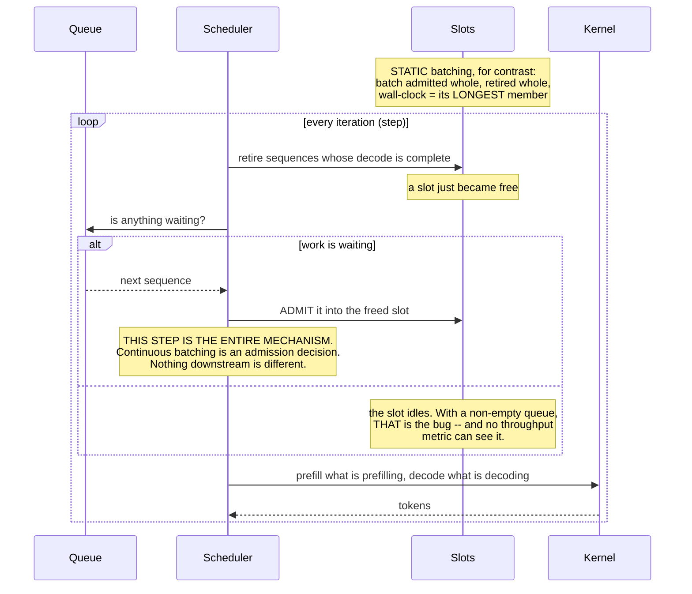
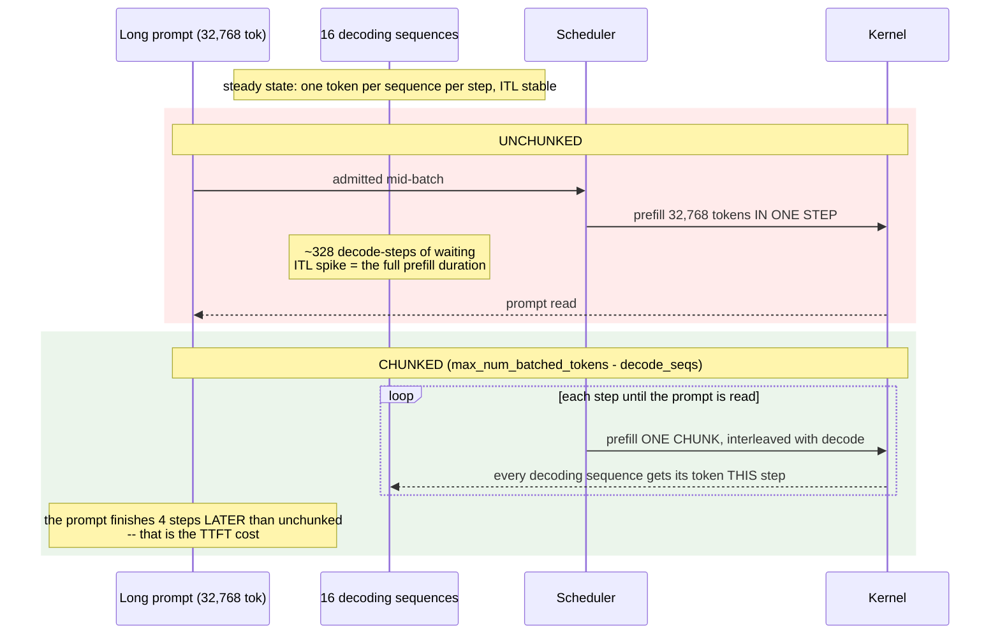
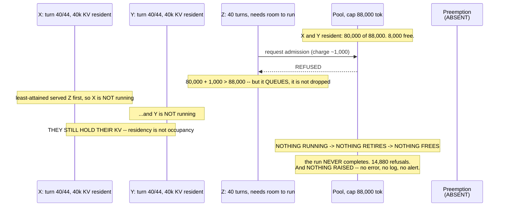
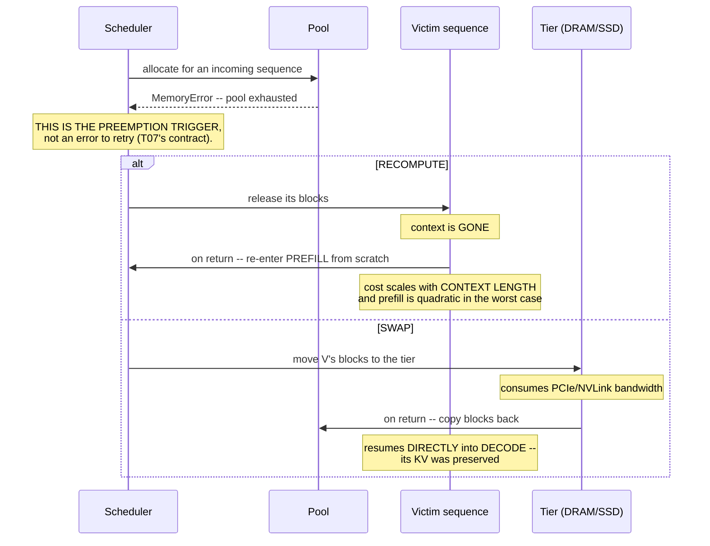
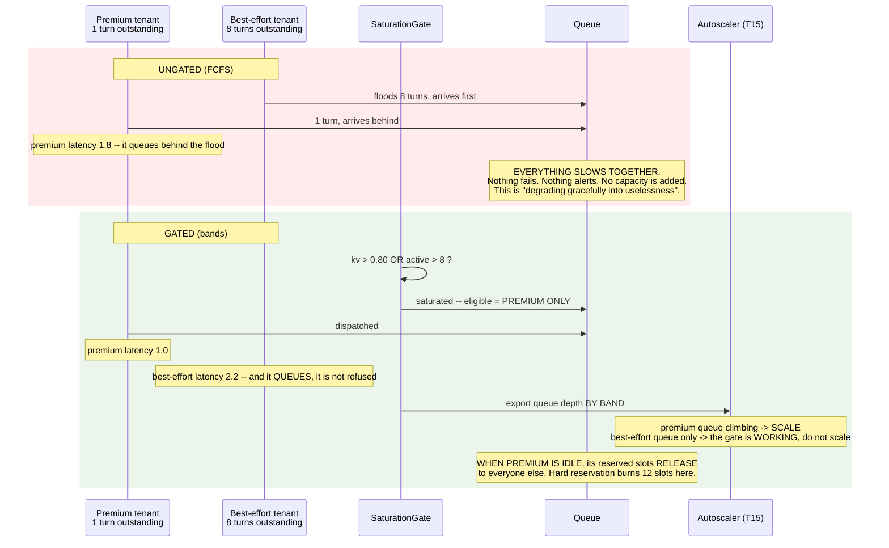

# T08 — Sequences: Batching & Scheduling

> **Transcript coverage:** primary · [HLD](../HLD.md) · [LLD](../LLD.md) · [production/](../production/README.md) · [run.py](../run.py)

Six flows. Each one is a place where a scheduling decision is made, and **four of the six fail
silently** — no crash, no error, no latency spike, and in three of those cases no change to any
fleet-wide metric. That ratio is the operational character of this layer, and it is why the
diagrams below annotate the *detection* as carefully as the mechanism.

`[T]` transcript · `[R]` repo · `[D]` derived.

---

## 1. Iteration admission — the flow that is the win



**What this flow makes visible.** The difference between static and continuous batching is entirely
in one line: *when the slot is refilled*. Everything else — kernels, memory layout, the model — is
unchanged.

**Where this fails, silently.** Static batching is **not slower in aggregate**. Experiment 2,
identical traffic, 8 slots for 4 long sequences:

| discipline | makespan | short finishes | short waited | idle |
|---|---|---|---|---|
| static | 9 | [9, 9, 9, 9] | **6** | **0.0%** |
| continuous | 9 | [3, 3, 3, 3] | **0** | 44.4% |

The makespan is **identical**. Four of eight slots were never needed by the long sequences and sat
idle for the whole batch. A throughput gauge, a makespan chart, and a GPU-utilisation graph all
show **no difference at all**. The only observables that change are per-request latency and
slot-idle-time — and the second of those is not on most dashboards.

**Detection:** `slot_idle_fraction` sustained below 1.0 *while the queue is non-empty*. That
combination, and not either half alone, is the signature (production §5, query 1).

---

## 2. The prefill stall — and where chunking attaches



**What this flow makes visible.** The stall is not the long request's fault; it is the **admission
decision's**. Unchunked, the scheduler grants the whole prefill in a single step, and a step is the
unit of scheduling — so every other sequence in the batch waits for the entire prompt. The guide
calls this a "stall" and describes the fix as interleaving chunks with "the ongoing Decode steps of
other users" `[R]` (`04-batching-strategies.md`).

**The trade runs in the counter-intuitive direction.** Experiment 3, budget 8,192, 16 decoding at
100 tok/s:

| prompt | chunks | unchunked ITL spike | chunked spike | TTFT steps added |
|---|---|---|---|---|
| 2,048 | 1 | 21 steps | 1 step | 0 |
| 8,192 | 2 | 82 steps | 1 step | 1 |
| 32,768 | 5 | **328 steps** | 1 step | **4** |

TTFT gets **worse**; ITL gets **much better**. A team optimising or alerting on TTFT alone will
conclude chunking hurt the system and switch it off — right about the metric, wrong about the
system.

**Detection:** correlate ITL p99 against **prompt length**. An ITL spike that tracks prompt length
is head-of-line blocking, and chunking is the fix. An ITL spike that tracks **batch depth** is
over-batching, and the slot count is the fix. Same symptom, opposite levers (production §5, query 3).

**When *not* to enable it.** If the prompt distribution is genuinely uniform and short, chunking is
pure scheduling overhead — more steps, no benefit. Enable it when the tail exists, not by default.

---

## 3. Starvation — one program's fan-out

```mermaid
sequenceDiagram
    participant C as Program C<br/>fan-out 24, 400-tok turns
    participant S as Scheduler
    participant X as Six small sessions<br/>2 turns each

    Note over C: wide fan-out -> refills outstanding turns<br/>the instant ANY turn retires

    rect rgb(255, 235, 235)
    Note over S,X: FCFS -- order by arrival
    loop forever
        C->>S: retire one turn; enqueue another
        Note over S: C's queue is ALWAYS at the head --<br/>it arrived first and it is deeper
    end
    X->>S: arrives at cycle 5
    Note over X: mean latency 12.83 (fan-out 24)<br/>and the FLEET MEAN BARELY MOVES
    end

    rect rgb(235, 245, 235)
    Note over S,X: LEAST-ATTAINED -- order by ABSOLUTE service received
    S->>X: C has the most service, so C WAITS
    Note over X: mean latency 1.00 across every fan-out
    Note over C: C finishes at the same cycle either way (34 vs 35).<br/>Serving the smalls first COSTS C NOTHING.
    end
```

**What this flow makes visible.** A wide fan-out is not an abuse; it is how agentic programs work.
But it presents a **permanent queue** to the scheduler, and any arrival-order policy then serves
that queue forever. The corpus names the scenario exactly: "there is a small session and a [large]
session that comes in and then takes all the dispatch cycles. So the shorter sessions are starving
now" `[T]` (llm-d).

**Three details that decide whether the fix works, all of them counter-intuitive:**

1. **Scope to the PROGRAM.** Per-request fairness rewards the program that issues the most
   requests — precisely the one that needs throttling. The corpus's term is "agentic program aware
   fairness" `[T]`.
2. **Key on ABSOLUTE service, not share-of-demand.** A ratio-based key is permanently smallest for
   the largest program, so the largest program is permanently served first — reproducing the
   starvation the policy exists to prevent (HLD §6.2).
3. **Protect the SMALL sessions.** The large program is the monopoliser in the corpus's scenario.
   "Protect the long agent from short requests" is the reverse, and it is what many engineers
   implement from intuition.

**And the large program does not pay.** Experiment 4: C's mean latency moves 4.2 → 11.0 with deeper
contention, and it finishes at essentially the same cycle under both policies. That is the corpus's
own second-order claim — "short sessions finish much faster and leaving the room for larger
sessions to also finish much faster" `[T]` — reproduced here as "no worse".

**Where this fails, silently.** Nothing raises. The fleet mean is stable. Per-tenant p95 does not
move either, because the starved tenant is small and its requests are *slow*, not *failing*.

**Detection:** per-**tenant** p95/p50 ratio climbing while the fleet is stable; and service share
by tenant falling below demand share (production §5, query 5).

---

## 4. Deadlock — the pool at the cap



**Why this is not a simulation artefact.** A scheduler that fills KV to 100% with no preemption
cannot recover, because **the request that would free space is the one that cannot be admitted**.
The trap is that residency and occupancy are different: X and Y hold 80,000 tokens *while waiting*,
which is precisely the memory Z needs.

**Two fixes, and the design must choose both explicitly:**

| Fix | Mechanism | Corpus basis |
|---|---|---|
| **headroom** | the gate fires at KV 80%, leaving 20% for recovery | `[T]` llm-d: "when the KV cache is 80% full I declare the cluster is saturated" |
| **preemption** | evict a resident program; recompute or swap its KV on return | `[R]` guide: pool exhaustion as an event; T07's tiering |

**A fairness policy is not a substitute for either.** Experiment 5's table shows the *same* policy
deadlocking or completing depending purely on the cap — turn priority survives at 88,000 while
least-attained does not. That is the proof that no dispatch heuristic makes an over-committed pool
safe. It is a capacity decision.

**Detection:** `kv_refused_total` climbing, and `kv_usage` sustained above 0.90. In the deadlock the
refusal count reached **14,880** — and it was the only numeric evidence the run produced, because
nothing raised (production §5, query 6).

---

## 5. Preemption — recompute or swap



**What this flow makes visible.** The two strategies give the scheduler **two different costs for
the same eviction**. Recomputed sequences re-enter `Prefilling`; swapped ones resume into
`Decoding`. That is why the choice is a design decision rather than a flag:

| | recompute | swap |
|---|---|---|
| Cost model | scales with context length | bounded, fixed by transfer time |
| Infrastructure | none | a tier and a fabric (T07) |
| Wins when | short contexts, cheap prefill, no fabric | long contexts, where re-prefill is punitive |
| Loses when | contexts are long | the fabric is slower than recomputing — **and then it is a net loss** |

**The failure that hides here.** Tiering that made things slower looks exactly like tiering that is
working: preemption is rare, so the regression never appears in a mean. Compare TTFT for restored
against recomputed sessions directly; if restored is slower, the medium is wrong and tiering should
be off for that medium (T07 §6.1).

---

## 6. The saturation gate — converting a collapse into a queue



**What this flow makes visible.** The gate does not make the system faster. It makes the **right**
traffic fast and the other traffic **wait**. That is the entire point, and it is why "the gate
slowed down best-effort" is not a defect report.

The corpus's two tests are alternatives, not a conjunction `[T]`: KV ~80% full, **or** average
active requests above 8. Experiment 7's gate evaluation:

| kv usage | active | saturated | reason |
|---|---|---|---|
| 0.42 | 3 | False | none |
| 0.81 | 5 | **True** | kv |
| 0.55 | 12 | **True** | active |
| 0.95 | 20 | **True** | kv |

**The reason is what makes the alert actionable**, which is why the gate returns it rather than a
boolean: KV saturation calls for retention, eviction or preemption (T07); active-request saturation
calls for **more capacity** (T15). A bare boolean tells an operator that something is wrong and
nothing about which lever to pull.

**Two design details that are easy to get wrong:**

- **Reserve AND release.** Hard reservation protects premium best (latency 1.0) and burns 12 idle
  slots while premium is not using them. Reserve-and-release is the corpus's shape: whatever
  premium does not use returns to everyone else. Both are in experiment 7's table; the difference
  is 12 wasted slots.
- **A gate with no queue is a dropped request.** Refusing at the gate removes both the load and the
  evidence of it. The corpus queues `[T]`, and the queue depth is what the autoscaler consumes.

**Detection — and the one that matters most.** Autoscale on **queue depth by band**, never on GPU
utilisation. A continuous batcher keeps utilisation high **by design** — that is the mechanism
working — so a utilisation-driven autoscaler sees a healthy fleet right up until the queue
explodes. The gate exists partly to expose the queue; a gate that queues without exporting its
depth is only half built.

---

## Sources

- `refs/vLLM_Inference_Meetup_Bengaluru_2026_transcripts/Scaling_Agentic_AI_Distributed_Inference_with_llm-d.txt` — Pravin (IBM Research): flow control and queuing at the EP; the 80% KV and >8 active-request saturation tests; FCFS as the naive default; premium/best-effort bands; agentic-program-aware fairness on attained service; turn priority and KV eviction; the two mechanisms addressing compute and KV-cache saturation respectively.
- `refs/LLMOps_Agentic_AIOps_The_Hands-On_Playlist_2026_transcripts/Cut_LLM_Cost_Latency_KV_Cache_Batching_Quantization_vLLM.txt` — continuous batching "keeps the GPU full by slotting new requests in as others finish"; prefill as compute-bound/TTFT and decode as bandwidth-bound; "trim the prompt for prefill or batch harder for decode".
- `refs/ai-system-design-guide-main/ai-system-design-guide-main/04-inference-optimization/04-batching-strategies.md` — the "stall" and chunked prefill; static vs continuous batching structure.
- `refs/ai-system-design-guide-main/ai-system-design-guide-main/04-inference-optimization/05-paged-attention.md` — the block pool whose exhaustion triggers preemption.

Flows 1, 3, 4 and 6 reproduce numbers printed by [`../run.py`](../run.py) (experiments 2, 4, 5 and
7 respectively). Flow 2 reproduces experiment 3. Run the script to see every figure above.
