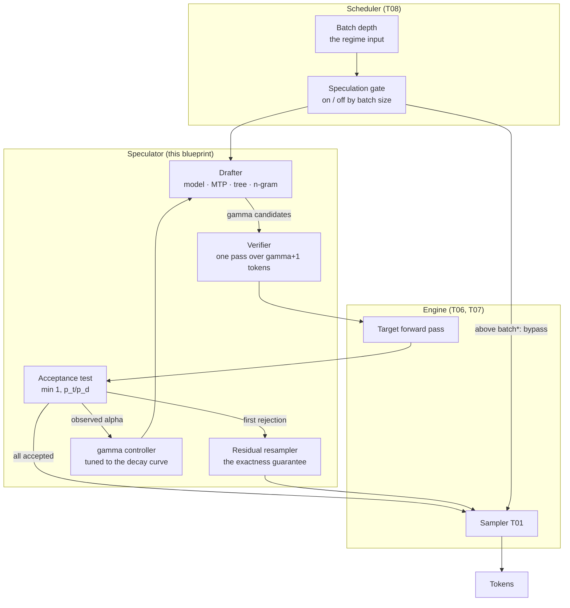

# T09 — Speculative Decoding: high-level design

> `T09` · **Transcript coverage:** partial · [LLD](LLD.md) · [Cheat sheet](../../00-cheat-sheets/T09-speculative-decoding.md) · [Case study](../../01-case-studies/T09-speculative-decoding.md) · [Interview bank](../../02-interview-questions/T09-speculative-decoding.md) · [Runnable core](run.py) · [Production](production/README.md) · [Sequences](docs/SEQUENCES.md)

Speculative decoding is presented as a speedup, and it is three separate things that must be
designed separately: an **exact sampler** whose correctness rests on one construction, a family of
**drafters** whose cost varies by more than an order of magnitude, and a **regime-dependent**
optimisation that stops working exactly when the batch grows enough to consume the compute it was
harvesting. Conflating the three is why deployments disappoint — the corpus's own production figure
is a modest and workload-specific **~2× from MTP** `[T]` (llm-d), not the 3–4× that the
research literature's small-batch benchmarks suggest.

`[T]` transcript · `[R]` repo · `[D]` derived. Every modelled number here is reproducible from
[`run.py`](run.py); every corpus number is cited to its speaker.

---

## 1. System context

The drafter-verifier loop sits inside the engine's decode path, between the scheduler (T08) and the
sampler (T01). It is the only optimisation in the stack whose benefit **depends on the batch size
the scheduler chose** — which is why it cannot be designed without T06's roofline and T08's
admission policy.

| Question | Mechanism | Failure if absent |
|---|---|---|
| Who proposes the candidate tokens? | a drafter (model, heads, tree, or a string match) | — |
| What does the target do with them? | one verify pass over γ+1 tokens | — |
| When is a candidate accepted? | `min(1, p_target / p_draft)` | — |
| What happens on rejection? | resample from `normalise(max(0, p_target − p_draft))` | **the output distribution silently drifts** |
| How long should the draft be? | γ tuned against a decaying acceptance profile | extra draft tokens cost more than they return |
| Is it safe at this load? | a batch-size gate | a speedup at p50 and a regression at p99 |



**Two edges carry the design.** `Residual resampler → Sampler` is the correctness guarantee: it is
the only reason the output equals the target distribution. `Scheduler → Speculation gate` is the
economics: it is the only reason a deployment does not silently regress when its traffic grows.

---

## 2. Exactness — the correctness contract

The corpus's own framing is that speculation buys tokens "with **zero loss in quality**" `[R]`
(`04-inference-optimization/03-speculative-decoding.md`). That is not approximately true. It is
exactly true, and it is bought by one line of arithmetic:

```
accept the draft token x with probability   min(1, p_target(x) / p_draft(x))
on rejection, resample from                 normalise(max(0, p_target − p_draft))
```

**Why the residual, and not simply the target.** The intuition is that on rejection you should "ask
the real model". That is wrong, and it is wrong in a way that survives every quality evaluation:

```
P(output = x)  =  min(p_d, p_t)(x)      <- the accepted branch already contributed this
               +  R · p_residual(x)     <- must supply exactly the DEFICIT
   where  R = sum_y max(0, p_t(y) − p_d(y)) = P(reject)
```

Substituting the target for the residual double-counts the mass where the target exceeds the draft
— precisely the tokens the draft declined to propose.

**Measured, not asserted.** Experiment 1 of [`run.py`](run.py) runs 200,000 speculative steps
against an 8-token target/draft pair and compares both implementations to `p_target`:

| implementation | total variation from `p_target` |
|---|---|
| residual resampling (correct) | **0.00096** — sampling noise |
| resample `p_target` on rejection | **0.0796** — ~8 percentage points |
| | **83× worse** |

The broken variant piles extra mass on the tokens the target favours: token 0 goes from 0.3000 to
0.2389, token 1 from 0.2500 to 0.2823. The output is fluent and on-topic. **No quality eval
reliably catches it, because the text is good.** It is caught by a distribution test against the
target model, which nobody runs.

### 2.1 The operational consequence

| Statement | Consequence |
|---|---|
| speculative decoding is exact | any measurable change in your output distribution is a **defect**, not a side effect |
| the residual is the guarantee | it must be present even when acceptance is high — a 5% rejection path still carries 5% of the tokens |
| the drift is directional | a broken sampler over-samples the target's favourites, so it *looks* better on many evals |

**When this matters most.** Any deployment where output distribution is a deliverable — model
evaluation, data generation, A/B against a frozen baseline, regulated output. In those settings the
residual resampler is the single line that makes speculation usable at all, and it must be verified
rather than assumed to be implemented.

---

## 3. Acceptance — and why the draft length has an optimum

```
tokens_per_step = 1 + Σ_{i=1..γ} Π_{j=1..i} α_j
```

**The leading 1 is not the draft.** It is the token the target produces anyway on its own: a
rejected first candidate always yields exactly one token from the verify pass. So the floor of the
function is 1.0, and a bad draft can never make you produce *fewer* tokens — it can only fail to
produce more, while still costing you its forward pass. That asymmetry is the whole risk of the
method.

**Acceptance decays with position**, because each draft token is conditioned on the previous
*drafted* tokens — which were themselves guesses. Errors compound. Measured, α₁ = 0.80 with decay
0.90 (experiment 2):

| γ | α at position γ | tokens/step | speedup (c = 0.014) |
|---|---|---|---|
| 1 | 0.8000 | 1.800 | 1.775 |
| 2 | 0.7200 | 2.376 | 2.311 |
| 4 | 0.5832 | 2.967 | 2.810 |
| **6** | **0.4724** | **3.135** | **2.892 ← peak** |
| 8 | 0.3826 | 3.167 | 2.848 |
| 12 | 0.2510 | 3.171 | 2.715 |

**The numerator saturates while the denominator grows linearly in γ.** Nothing about "use more
draft tokens" is monotone, and the peak moves with **both** α and c.

### 3.1 The modelling error that makes tuning underperform

Treating α as a single constant for all positions. At γ = 8 that predicts **4.329** tokens/step
where the decaying profile gives **3.167** — a **1.37×** over-prediction, and exactly why a tuned γ
underperforms its forecast. A capacity plan built on the constant-α model will over-provision by a
third.

### 3.2 The decision table

| Choice | Pros | Cons | Use when | Exception |
|---|---|---|---|---|
| γ small (1–2) | cheap; robust to decay; safe deep into the compute-bound region | leaves most of the acceptance on the table | high variance in α; near the batch crossover | — |
| γ mid (4–8) | near-peak speedup for typical decay | draft cost paid on every rejection | the default for a good drafter | measure α; do not assume the peak is here |
| γ large (>12) | marginally more tokens/step | speedup *falls*; every rejection wastes more compute | never on its own | a **zero-cost** drafter (n-gram), where the denominator does not grow |
| γ adaptive | tracks the regime shift | needs per-request α feedback | the mature deployment | — |
| γ constant-α model | simple | over-predicts by ~1.4× at useful γ | never for capacity planning | — |

**Pick the smallest γ within 2% of the peak**, not the argmax. In the table above that flat region
is γ ∈ {5,6,7,8} at less than a 2% spread — so an operator has latitude, and the smaller value
spends less draft work for the same result.

**The monitor is acceptance, not speedup.** Acceptance is a property of the draft/target *pair*;
speedup is downstream of acceptance **and** of the batch regime. A falling acceptance rate means γ
is too high or the draft has drifted from the target; a falling speedup with stable acceptance
means the *load* changed. Two different problems, two different fixes — and a single speedup
counter cannot tell them apart.

---

## 4. The drafters — the cost table is the decision

`c` is the draft cost as a fraction of one target forward pass. It varies by more than an order of
magnitude, and at useful draft lengths it is a **bigger lever than the drafter's quality**
(experiment 3, γ = 8, identical acceptance):

| Drafter | c | denominator `1+γc` | speedup |
|---|---|---|---|
| **n-gram / prompt lookup** | **0.0000** | 1.000 | **3.167** |
| draft model, 1B vs 70B | 0.0143 | 1.114 | 2.842 |
| MTP, 2 heads trained in | 0.0200 | 1.160 | 2.730 |
| MTP, 4 heads trained in | 0.0400 | 1.320 | 2.399 |
| Medusa tree, 8 candidates | 0.0920 | 1.736 | 1.824 |
| Medusa tree, 32 candidates | 0.3680 | 3.944 | **0.803 — a loss** |

**The last row is not a corner case.** A wide tree at a long draft length loses money, because the
candidate count multiplies into the denominator while γ multiplies it again. Trees buy *quality*,
never cost — see §7.

**`c` understates the draft model's real cost.** The 1B draft's 0.014 is latency only. Its weights
and its own KV cache occupy HBM that would otherwise hold target KV, which lowers the concurrency
ceiling (T07). The cost that bites a draft-model deployment is **capacity**, not time, and a plan
that budgets only the latency term will find its throughput ceiling has dropped.

### 4.1 The variant table

| Variant | Draft source | Extra state | Pros | Cons | Use when |
|---|---|---|---|---|---|
| **n-gram / prompt lookup** | string match against the prompt | none | free; cannot drift; needs no training | inert when output does not quote input | **summarisation, extraction, code edit, RAG** — the best default |
| **MTP** | heads trained into the target | trained heads | no second model; the corpus's ~2× production path `[T]` | **cannot be bolted onto an arbitrary checkpoint** | you control training or the checkpoint ships heads |
| **draft model** | a small sibling model | a second model + its KV | simple; works with any target | consumes HBM; tokenizer must match exactly | a good small sibling exists and HBM is available |
| **Medusa / EAGLE** | heads or a small net, tree-verified | heads + tree attention | best acceptance at moderate α; native in modern runtimes `[T]` | tuning the tree is real work; cost grows with candidates | a mediocre draft model you want to rescue |
| **self-speculation** | skip layers of the target | none | no extra weights | lower acceptance; less mature | no budget for a second model and no MTP heads |

**The corpus's production evidence is MTP**, and it is worth reading precisely: MTP "enabled more
interactivity which **gained about 2x improvement in throughput**" `[T]` (llm-d). Note *interactivity*
— the mechanism is per-request latency, not aggregate throughput at saturation. The same talk's
runtime note is that support is now native: SGLang offers spec decoding "from Eagle, MTP to Deep
Flash" with "Spec V2 for better support the native spec decoding speed up" `[T]` (Banghua Zhu).

---

## 5. N-gram / prompt lookup — the decision with a closed form

A prompt-lookup drafter proposes a token **deterministically** — it is a copy, so `p_draft = 1` on
that token. The acceptance rule collapses:

```
α = min(1, p_target(x) / 1) = p_target(x)
```

**The acceptance rate is exactly the model's own probability of the copied token.** That makes the
when-to-use decision decidable *in advance from the workload*, with no benchmark, no draft model to
align, and nothing to retrain. Measured (experiment 4, γ = 5, c = 0):

| p(copy) | tokens/step | speedup | workload |
|---|---|---|---|
| 0.99 | 5.852 | **5.85×** | verbatim extraction |
| 0.95 | 5.298 | 5.30× | summarise / quote |
| 0.85 | 4.152 | 4.15× | RAG-grounded answer |
| 0.70 | 2.941 | 2.94× | code edit with context |
| 0.45 | 1.803 | 1.80× | paraphrase |
| 0.20 | 1.250 | 1.25× | open-ended writing |
| 0.08 | 1.087 | 1.09× | creative / high temperature |

**Ask one question: does the output quote the input?** If yes, α is high and the speedup follows.
There is no tuning step and no model to maintain.

**The asymmetry that makes this the best default.** With `c = 0`, when the guess is **wrong** the
step cost is 1.0 and you have produced exactly one token — identical to plain decoding. *N-gram
speculation is free to be wrong.* Every other variant pays `γ·c` whether or not the tokens are
accepted, so a drafter that is merely cheap still loses efficiency on every rejection.

**Where it does nothing.** Creative and open-ended generation, where the drafter finds no span to
follow. It is inert there rather than harmful, which is why shipping it by default costs almost
nothing and occasionally pays enormously — the opposite risk profile from every other variant.

**Note the modelling difference from a learned draft.** The per-position acceptance is treated as
*constant*, not decaying. A learned draft conditions each guess on its own previous guesses, so
errors compound; a copy follows a matched span, and a wrong copy is simply wrong. Applying the
draft-model decay curve to an n-gram drafter understates it.

---

## 6. The regime — the hidden third input

Speculation pays for one reason: **a verify pass over γ+1 tokens costs the same as a one-token
decode.** That is true exactly while decode is **memory-bound** — the weights are the bottleneck, so
extra tokens ride along on bandwidth that was going to be spent anyway. It is false once the batch
is large enough that decode becomes **compute-bound**, where the verify pass costs γ+1 times as
much and speculation is a net loss.

**Where the line is.** Bytes moved per step = `W + batch·KV`; FLOPs = `2N·batch`. Weights are a
**constant** and KV **grows with batch**, so at small batch the weights dominate and extra tokens
are nearly free; past the crossover the KV traffic dominates. Solving
`arithmetic_intensity(batch) = machine_balance` gives

```
batch* = (B · W) / (2N − B · kv_per_token)
```

Worked for the figures in this blueprint `[D]` — 70B at fp16 with grouped-query KV on an
H100-class part (B ≈ 295 flops/byte, W = 140 GB, kv = 0.33 MB/token):

| batch | regime | step cost | speedup (γ=4, c=0.014) |
|---|---|---|---|
| 1 | memory-bound | 1.057 | 2.807 |
| 32 | memory-bound | 1.057 | 2.807 |
| 256 | memory-bound | 1.057 | 2.807 |
| **512** | **compute-bound** | **5.057** | **0.587** |
| 1024 | compute-bound | 5.057 | 0.587 |

**The crossover is at ~295 concurrent sequences** (experiment 5). It does not taper — it is a hard
switch, and the speedup does not decay gracefully through it.

**That single number explains most of the disagreement about whether speculative decoding "works".**
A few hundred concurrent sequences is **below** the concurrency a throughput-oriented deployment
runs at and **above** what a latency-oriented one runs at. The two deployments are on opposite
sides of the same line, and both can be right about their own measurements.

**The design consequence is unambiguous: speculation is a latency tool for small batches.** It is
not a throughput feature, and it must be gated on batch size rather than switched on in a config
file and forgotten.

---

## 7. Tree drafting — and the inversion that decides whether it is worth it

A linear draft commits to one branch, so a single early rejection discards every later candidate.
A tree keeps *m* branches alive at each position and verifies them together under a tree attention
mask. Position *i* then survives if **any** of its candidates is accepted, so the per-position
factor becomes `1 − (1 − α_i)^m` (experiment 6, γ = 4):

| α₁ | linear | tree m=4 | tree m=16 | gain (m=4) |
|---|---|---|---|---|
| 0.95 | 3.820 | 4.984 | 5.000 | 1.30× |
| 0.85 | 3.225 | 4.949 | 5.000 | 1.53× |
| 0.75 | 2.732 | 4.864 | 5.000 | 1.78× |
| 0.60 | 2.150 | 4.550 | 5.000 | 2.12× |
| **0.45** | 1.720 | 3.898 | 4.996 | **2.27×** |
| 0.30 | 1.405 | 2.899 | 4.925 | 2.06× |

**The gain is LARGEST AT MODERATE ACCEPTANCE and collapses at high acceptance** — the opposite of
the intuitive reading. At α₁ = 0.95 the linear draft is already keeping nearly every branch, so
there is nothing for extra candidates to rescue. At α₁ = 0.45 the linear draft is discarding most
of its work, and a tree recovers it.

**So trees pay where a draft model is mediocre, and pay least where it is already good.** That
inverts the usual deployment logic: if your draft model is excellent, a tree buys little and the
plain draft is the cheaper configuration.

**Honest limitation of the model.** `1 − (1−α)^m` assumes the *m* candidates are **independent**
draws from the target's conditional distribution. A real tree is built from a beam or a chain of
heads, so its candidates are **correlated** and drawn from a finite vocabulary — when the target's
token is not in the tree at all, no candidate rescues that position. The true curve is flatter than
the table's right-hand columns and approaches the ceiling more slowly. Read the **direction**;
treat the magnitudes as optimistic.

**And the cost side is real.** Candidate count multiplies into `c` (§4): 32 candidates gives
`c = 0.368` and a **speedup below 1.0** at γ = 8. Buy a tree for the better acceptance profile,
never for its cost.

---

## 8. Where speculation does not apply

| Workload | Speculation's effect | Why |
|---|---|---|
| **Prefill-dominated** (agentic, long-context RAG) | little | it attacks **decode** only. The corpus measures agentic workloads at *"prefill is occupying like 98% of the tokens"* `[T]` — there is almost no decode to accelerate |
| **High-temperature creative** | near zero | a flat distribution means low α for any drafter; `[R]` the guide's own worked case |
| **Large-batch throughput serving** | **negative** | past `batch*` the verify pass costs γ+1× (§6) |
| **Structured / template output** | high | the continuation is predictable; also a natural fit for constrained decoding (T03) |
| **Summarisation, extraction, code edit** | high | output quotes the input → n-gram α is high (§5) |
| **Latency-critical single-stream** | highest | small batch, memory-bound, exactly the regime where it works |

**The agentic paradox, stated plainly.** Speculative decoding is most often proposed for exactly the
workload where it does least. A wide-fan-out agent fleet is **both** compute-bound (so verification
is not free) **and** prefill-heavy (so there is little decode to accelerate). The corpus still
reports ~2× from MTP in an agentic deployment `[T]` — but on a different mechanism, **interactivity**
at moderate fan-out, not aggregate throughput at saturation. Both statements are true; they are
about different operating points.

**AND THE OTHER LEVER IS USUALLY BIGGER.** In the same passage the corpus reports that CPU KV-cache
offloading "saved about **5x** in TTFT when the agentic session comes back after a pause" `[T]`
(llm-d). For agents, prefix caching and KV offload (T07) beat speculation by a wide margin, because
they attack the phase agents actually spend their tokens in.

---

## 9. Capacity and cost model — worked

**Latency model.** For the experiment-2 profile (α₁ = 0.80, decay 0.90, γ = 6, c = 0.014):

```
  tokens_per_step = 1 + 0.80 + 0.576 + 0.4147 + 0.2986 + 0.2150 + 0.1548
                  = 3.135
  denominator     = 1 + 6 x 0.0143 = 1.086
  speedup         = 3.135 / 1.086 = 2.89x

  Against a 1B-draft baseline decode of, say, 50 ms/token:
     plain          : 1000 tokens x 50 ms            = 50.0 s
     speculative    : 1000 / 3.135 = 319 steps
                      319 x (50 + 6 x 0.72) ms       = 319 x 54.3 ms = 17.3 s
     ratio          : 2.89x   -- and it must be verified at the batch the service reaches
```

**Capacity model — the cost the speedup number hides.** A separate draft model consumes HBM twice:
its weights, and its own KV cache.

```
  70B target at fp16                  = 140 GB
  1B draft at fp16                    =   2 GB weight
  draft KV (same context, 1/70 of the
    target's per-token KV)            =   ~0.005 MB/token  -- small, but not zero
  target KV budget  =  HBM - 142 GB   instead of  HBM - 140 GB
```

On an 80 GB part this is a ~2.5% loss of KV budget, which translates directly into a ~2.5% loss of
**concurrency ceiling** (T07) — and concurrency is what the throughput of the deployment is made of.
**A deployment that adds a draft model to reduce latency can lose throughput**, and the two effects
are measured by different dashboards. MTP and n-gram avoid this entirely: MTP's heads are small
linear layers on weights already resident; n-gram has no weights at all.

**Which numbers are corpus facts and which are modelled.** "~2× throughput from MTP" and "5× TTFT
from KV offload" are the corpus's `[T]`. "98% prefill for agentic" is the corpus's `[T]`. The
acceptance profiles, decay curves, cost denominators, `batch*` arithmetic and every speedup figure
in this document are **this blueprint's model**, reproducible from `run.py`, and are not
measurements of any real engine. No corpus figure is asserted as an output of the simulator.

---

## 10. Deployment topology and gating

| Placement | What it sees | Pros | Cons | Use when |
|---|---|---|---|---|
| **in-engine** (`--speculative-config`) | per-request batch depth | the standard integration; native in vLLM/SGLang/TensorRT-LLM `[T]` | the engine's setting is global; per-workload variation needs routing | the default |
| **at the router** (T14) | the workload class of each request | enable per route: n-gram for extraction, off for creative | the router must understand the workload | mixed workloads with different α |
| **in the scheduler** (T08) | the live batch depth | can gate on `batch*` automatically | requires the engine to expose depth and accept reconfiguration | the mature deployment |
| **a proxy / sidecar** | nothing useful | — | adds a hop and cannot see inside a forward pass | never |

**The gate is the design, not an optimisation.** A deployment that enables speculation statically
gets a speedup at p50 and a regression at p99 (§6). The gate needs one input — the live batch depth
— and one threshold — `batch*` — and it must be able to turn speculation off mid-flight.

**Worked gating table** (experiment 7, 70B/H100-class, γ = 4):

| deployment | p50 batch | p99 batch | speedup @p50 | @p99 | verdict |
|---|---|---|---|---|---|
| interactive chat, 1 replica | 8 | 48 | 2.81× | 2.81× | **SAFE** |
| latency-SLA API, bursty | 32 | 400 | 2.81× | **0.59×** | **REGRESSES** |
| batch/offline throughput | 256 | 1024 | 2.81× | 0.59× | REGRESSES |
| agentic, wide fan-out | 400 | 900 | **0.59×** | 0.59× | REGRESSES |

Row 2 is the trap: comfortable at p50, a **loss** at p99, and the mean improves. **Judge speculation
at the batch size the service actually reaches**, not the one it runs at on a quiet afternoon.

---

## 11. Failure domains

| Failure | Symptom | Silent? | Detection | Mitigation |
|---|---|---|---|---|
| **residual resampling omitted** | output drifts from the target distribution | **yes** — text is fluent and on-topic | distribution test against the target (§2) | implement the residual; test it |
| tokenizer mismatch with the draft | acceptance collapses toward chance | no, but often misread as "no gain" | verify tokenizer identity **first** | same-family draft, or a head-based drafter |
| acceptance decayed / draft drifted | speedup below forecast at every batch | **yes** | acceptance-rate counter, not speedup | retune γ; retrain or replace the draft |
| γ too large | speedup falls; draft compute wasted on rejections | **yes** | marginal-gain series (§3) | smallest γ within 2% of peak |
| **enabled in the compute-bound regime** | latency regression under load; mean improves | **yes** | batch-depth histogram against `batch*` | gate on batch size (§10) |
| draft model OOM / capacity loss | throughput ceiling drops | no, but attributed to the model, not the drafter | KV budget vs concurrency ceiling (§9) | MTP or n-gram instead of a second model |
| tree tuned for cost, not acceptance | wide tree gives speedup < 1 | **yes** | `1 + γc` against tokens/step | buy trees for α, cap candidates |
| speculation proposed for agents | little effect, effort spent | **yes** | prefill vs decode token split | fix TTFT and KV reuse first (T07) |

**Seven of the eight are silent**, and the character of the silence is different from T08's: here
the system does not misbehave, it simply **does not do what was promised**, or does it and then
stops when the load grows. That is why **acceptance rate** and **batch depth** are the two
dashboards this blueprint insists on — between them they discriminate every silent row above.

---

## 12. Build vs buy

| Component | Build | Adopt | Recommendation |
|---|---|---|---|
| drafter-verifier loop | — | engine (`--speculative-config`) | **adopt.** Kernel-coupled, and native in every major runtime `[T]` |
| residual resampler | — | engine | **adopt, but VERIFY.** It is the correctness guarantee; confirm it is there before trusting the output |
| drafter choice | the workload analysis (§5) | the mechanism | **build the decision.** Which drafter, for which route, is the deployment-specific part |
| γ controller | adaptive γ from observed α | static engine default | **build** if α varies by workload; static is fine for a single-route service |
| batch-size gate | the gate and its threshold | — | **build.** No engine ships this, and without it the p99 regression is invisible |
| MTP heads | — | model checkpoint + training | **adopt.** They cannot be bolted on; you need a checkpoint that ships them `[T]` |

**The split is the same shape as T08's.** The mechanism is solved and shipped; the *decisions* are
not. Which drafter, how long a draft, and whether it is on at all right now are the three things
this blueprint exists to decide — and the third is the one nobody builds.

---

## 13. What changes at 10× scale

| At 1× | At 10× | Why it changes |
|---|---|---|
| speculation is on, statically | it is gated on batch depth | at 1× the batch rarely crosses `batch*`; at 10× it crosses it daily (§6) |
| one drafter for the whole service | per-route drafters | a summarisation route and a creative route have completely different α (§5) |
| a draft model is affordable | n-gram and MTP win on capacity | the draft's HBM is a concurrency cost that scales with the fleet (§9) |
| γ tuned once | γ adapts per request | α varies by workload and by temperature |
| "we got 2x" is the report | acceptance and batch depth are the metrics | a single number describes one operating point |
| prefill is 30% of tokens | it is 98% of them | agentic traffic shifts the bottleneck to the phase speculation cannot help (§8) |
| the mean latency is the SLA | p99 at peak batch is the SLA | speculation's benefit is largest exactly when load is lowest |

**The one that bites first is the gate.** Without it, a service that has been quietly getting 2.8×
for a year starts regressing the first week its traffic grows past `batch*` — and the dashboard
shows an improved mean, because the requests that got slower are a minority of the samples.

---

## 14. Six things to carry away

1. **Speculative decoding is exact, and the residual resampler is why.** Drop it and the output
   distribution shifts ~8 points while the text stays fluent — measured, not asserted (§2).
2. **Acceptance decays with position, so γ has an optimum.** The constant-α simplification
   over-predicts by ~1.4× at useful γ, which is why tuned deployments underperform their forecast
   and capacity plans over-provision (§3).
3. **Draft cost is a bigger lever than draft quality** at useful γ, and its range is an order of
   magnitude. n-gram's `c = 0` makes a wrong guess free — the best default for any workload whose
   output quotes its input (§4, §5).
4. **Speculation works only while decode is memory-bound.** Past ~295 concurrent sequences on a
   70B/H100-class deployment, verification costs γ+1× and speculation is a net loss. It is a
   **latency tool for small batches**, not a throughput feature (§6).
5. **Trees pay most where the draft is mediocre** — the opposite of the intuitive reading — and
   their cost grows with candidates, so a wide tree can lose money (§7).
6. **Gate it on batch depth.** A service can be memory-bound at p50 and compute-bound at p99:
   a speedup in every average, a regression under load, and no alert. For agents specifically, fix
   TTFT and KV reuse first — speculation attacks the phase agents barely use (§8, §10).

---

## Sources

Corpus (transcripts under `refs/`):

- `refs/vLLM_Inference_Meetup_Bengaluru_2026_transcripts/Scaling_Agentic_AI_Distributed_Inference_with_llm-d.txt` — Pravin (IBM Research): MTP "enabled more interactivity which gained about 2x improvement in throughput"; CPU KV-cache offloading saving "about 5x in TTFT when the agentic session comes back after a pause"; the agentic prefill share.
- `refs/Agentic_AI_Infra_transcripts_2/Banghua_Zhu_-_Building_Frontier_Inference_and_Training_Infra_for_Agent_A_Case_St.txt` — SGLang's spec-decoding support "from Eagle, MTP to Deep Flash" and "Spec V2 … for the native spec decoding speed up in inference stage".
- `refs/vLLM_Inference_Meetup_Bengaluru_2026_transcripts/Opening_Note_vLLM_Inference_Meetup_Bengaluru_September_19_2026.txt` — the meetup's own history of the field moving through "speculative decoding" and paged attention.

Supporting repos:

- `refs/ai-system-design-guide-main/ai-system-design-guide-main/04-inference-optimization/03-speculative-decoding.md` — the draft-verify paradigm; the draft/target/speculative latency table; Medusa and multi-token heads; lookahead decoding; hardware-aware dynamic draft lengths; why high-temperature creative writing defeats a draft model.
- `refs/ai-system-design-guide-main/ai-system-design-guide-main/04-inference-optimization/01-inference-fundamentals.md` — the memory-bound/compute-bound roofline behind §6.
- `refs/ai-system-design-guide-main/ai-system-design-guide-main/04-inference-optimization/02-kv-cache-and-context-caching.md` — the KV budget a draft model competes with (§9).
- `refs/llm-inference-engineering-main/llm-inference-engineering-main/README.md` — KV cache → paged attention → engine → hardware reading order.

Runnable: [`run.py`](run.py) and [`sim/`](sim/) — `acceptance.py`, `drafters.py`, `regimes.py`, `experiments.py`. Stdlib-only, offline, no GPU; `python run.py` exits 0 and prints every figure quoted above.
