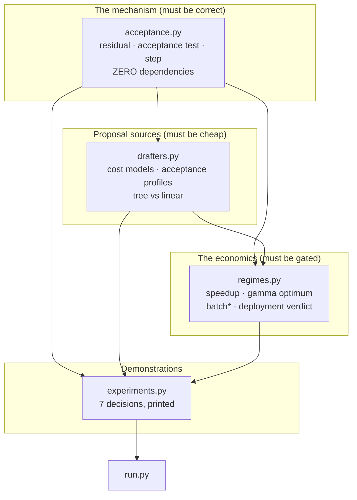
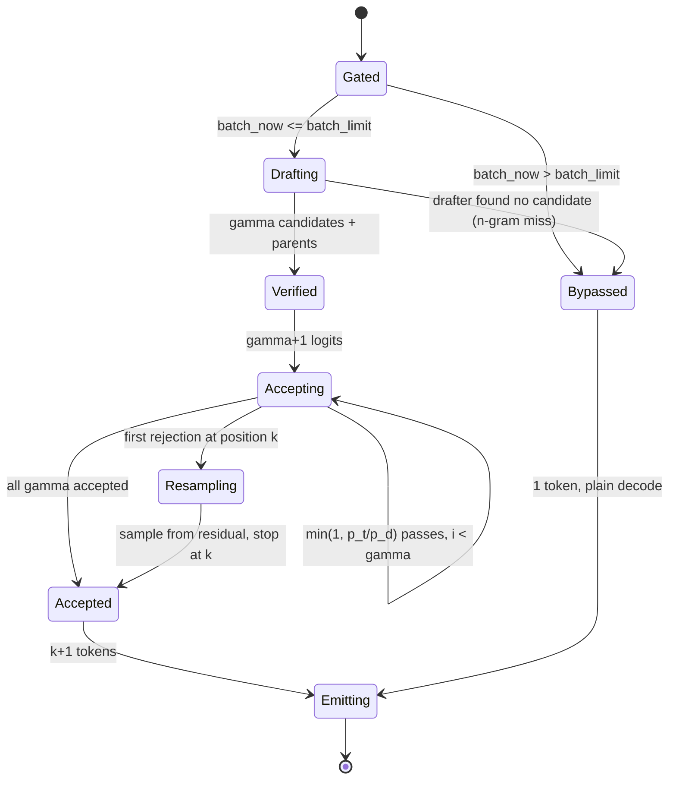
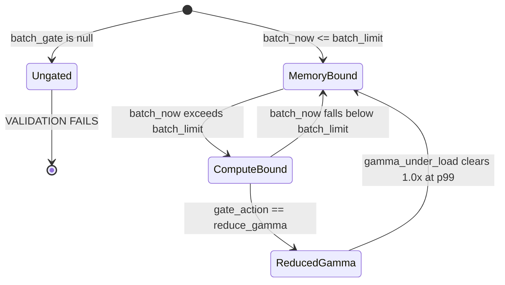
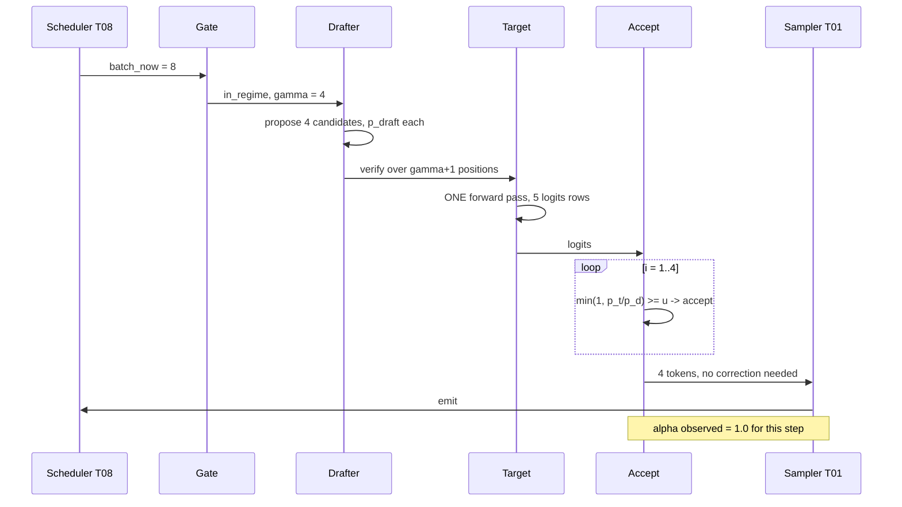
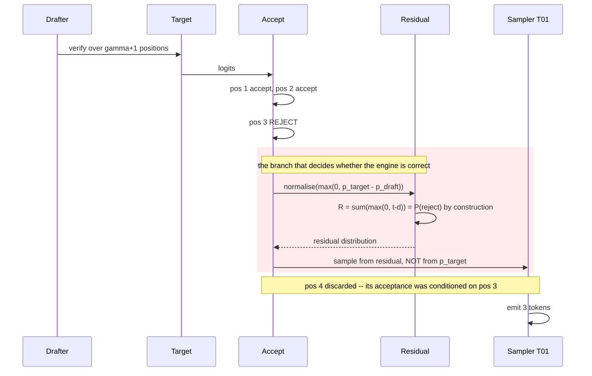
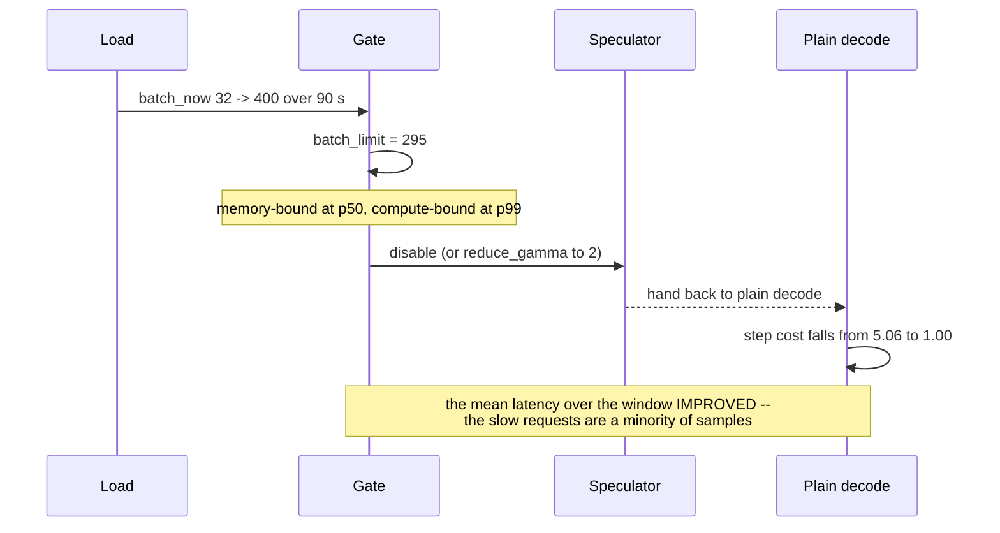
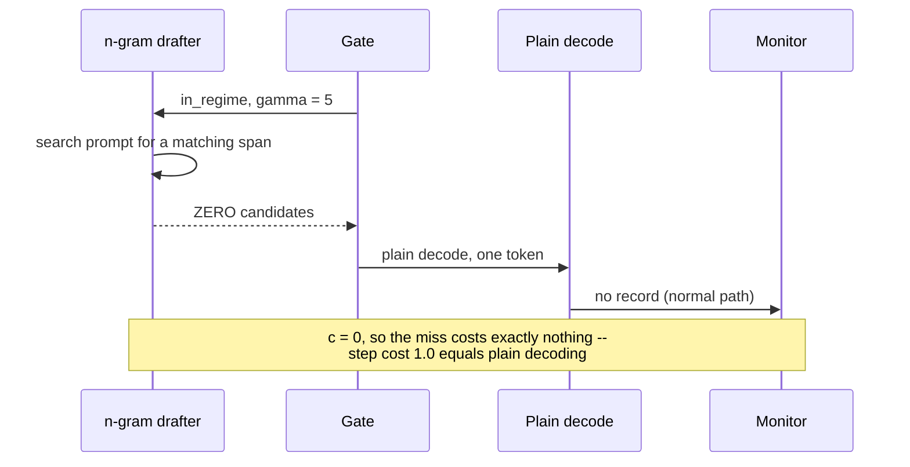

# T09 — Speculative Decoding: low-level design

> `T09` · **Transcript coverage:** partial · [HLD](HLD.md) · [Cheat sheet](../../00-cheat-sheets/T09-speculative-decoding.md) · [Case study](../../01-case-studies/T09-speculative-decoding.md) · [Interview bank](../../02-interview-questions/T09-speculative-decoding.md) · [Runnable core](run.py) · [Production](production/README.md) · [Sequences](docs/SEQUENCES.md)

This is the design of the **speculator**: the component that sits between the scheduler (T08) and
the sampler (T01), proposes candidate tokens, verifies them in one pass, and either accepts them or
corrects them. The correctness of the whole engine rests on about fifteen lines of arithmetic in
`acceptance.py`, and the economics rest on a single gate in `regimes.py`.

The module split follows the HLD's three separations deliberately: **proposal** (`drafters.py`),
**correction** (`acceptance.py`), **economics** (`regimes.py`). None imports the others' internals;
`acceptance` imports nothing, `drafters` imports only the acceptance-profile helper, `regimes`
imports the token accounting. That ordering is the dependency order in which the system must be
built and tested.

`[T]` transcript · `[R]` repo · `[D]` derived. Figures quoted are from [`run.py`](run.py).

---

## 1. Module map



**Why `acceptance.py` has zero dependencies.** It is the only module whose correctness is a
*theorem* rather than a preference. Keeping it free of configuration, engine handles and logging
means it can be tested against an arbitrary `(p_target, p_draft)` pair with no engine at all — which
is exactly what the exactness experiment does. Anything that could make the residual branch
conditional belongs outside this file.

**What is deliberately not here.**

| Omitted | Why | Where it belongs |
|---|---|---|
| the attention kernel handling the tree mask | kernel work, not design | engine (T06) |
| KV allocation for draft tokens | the block allocator's problem | engine (T07) |
| the batch-size *measurement* | the scheduler already has it | scheduler (T08) |
| the tokenizer alignment check | a deployment-time validation, not a runtime path | §7 error handling |
| the draft model's weights and its KV budget | capacity accounting, not speculation logic | T07 / §9 of the HLD |

The last row is the one that gets lost. The blueprint models draft cost as a latency fraction; the
*deployment* pays an HBM cost too, and that cost lives in T07's ledger, not here. A team that reads
only this file will under-budget the draft model.

---

## 2. Data structures

### 2.1 `DraftProposal` — what a drafter produces

| Field | Type | Meaning |
|---|---|---|
| `tokens` | `list[int]` | γ candidate ids, in draft order |
| `p_draft` | `list[dict[int, float]]` | per-position distribution over the candidates |
| `parents` | `list[int]` | tree only: index of the parent candidate, `-1` for roots |
| `source` | `str` | `ngram` / `mtp` / `model` / `tree` / `self` |
| `cost` | `float` | `c`, this proposal's own cost fraction |

**`p_draft` is sparse and this matters.** For an n-gram drafter it is `{x: 1.0}` at one token and
empty elsewhere — the deterministic-proposal case that collapses the acceptance rule to
`α = p_target(x)` (§4.3 of the HLD). A data structure that assumed a dense distribution over the
vocabulary would make the n-gram path needlessly expensive and would obscure that collapse.

**`parents` is absent for a linear draft and this is the honest representation.** A linear draft has
no tree, so there is nothing to encode. Code that stores `parents` unconditionally invites a reader
to assume branching exists where it does not.

### 2.2 `VerifyResult` — what the target returns

| Field | Type | Meaning |
|---|---|---|
| `logits` | `list[list[float]]` | one row per verified position, γ+1 rows |
| `cost` | `float` | the target pass cost, `1.0` memory-bound, `γ+1` compute-bound |
| `regime` | `str` | which of the two it was, recorded not inferred |

**`regime` is recorded at verify time rather than derived later.** The regime is a property of the
batch the pass actually ran in. Recomputing it downstream from a stored batch size invites a
mismatch between the number the engine used and the number the report shows.

**Why γ+1 rows.** The verify pass always evaluates one position beyond the draft: that is the token
the target produces on its own when every draft token is rejected, and it is the reason
`tokens_per_step` has a floor of 1.0. A verify that ran only γ positions would have no fallback
token and would have to re-run the target on rejection — a silent extra round trip.

### 2.3 `AcceptanceRecord` — the health signal

| Field | Type | Meaning |
|---|---|---|
| `position` | `int` | which draft position this was |
| `accepted` | `bool` | the outcome |
| `alpha_expected` | `float` | the α used for the position's correction |
| `gamma_configured` | `int` | γ in force for this step |

**`position` is load-bearing.** Acceptance is only interpretable *by position*: aggregate acceptance
cannot distinguish "the drafter is bad" (α₁ low) from "γ is too long" (α₁ fine, α_γ low). The two
have different fixes — replace the drafter vs shorten the draft — and one aggregate number hides
which you have.

### 2.4 `SpecConfig` — the configuration surface, in one type

| Field | Default | Meaning |
|---|---|---|
| `enabled` | `false` | **default off.** Speculation must be turned on for a workload, never inherited |
| `drafter` | `none` | `none` / `ngram` / `mtp` / `model` / `tree` |
| `gamma` | — | draft length; must be ≤ the drafter's trained/supported depth |
| `draft_model_path` | `null` | required iff `drafter == model` |
| `batch_gate` | `null` | the `batch*` threshold; **`null` means ungated and is a defect** |
| `gate_action` | `disable` | `disable` / `reduce_gamma` |
| `gamma_under_load` | `null` | used when `gate_action: reduce_gamma` |

**Two fields carry the design.**

- `enabled: false` by default. A global default-on is how a service ends up regressing at p99
  without anyone choosing to enable it.
- `batch_gate: null` is treated as a **defect, not a default**. The gate is the whole economics of
  the method (§6 of the HLD). A config that omits it should fail validation rather than silently
  run ungated — because the ungated failure mode is a p99 regression with a *improved* mean, which
  no dashboard surfaces.

### 2.5 `RegimeState` — the gate's view

| Field | Type | Meaning |
|---|---|---|
| `batch_now` | `int` | concurrent decode sequences this step |
| `batch_limit` | `float` | `batch*` for this model/hardware |
| `in_regime` | `bool` | `batch_now <= batch_limit` |
| `speedup_now` | `float` | the modelled speedup at this instant |

**`speedup_now` is the operational output and it is a *modelled* number, not a measurement.** It is
computed from the acceptance profile and the regime, and its purpose is to drive the gate and to
populate the dashboard *before* the change is deployed. The measured speedup is the wall-clock
ratio an operator observes afterwards; the two should agree, and a persistent disagreement is itself
the signal that the acceptance model is wrong.

---

## 3. Interface contracts

### 3.1 `acceptance.py` — the correctness boundary

```python
residual(p_target, p_draft) -> list[float]          # normalise(max(0, t - d)); the guarantee
acceptance_rate(p_target, p_draft) -> float          # sum(min(t, d)); the health metric
total_variation(p, q) -> float                       # 0.5 * L1; the test
speculative_step(p_target, p_draft, rng) -> (int, bool)
naive_step(p_target, p_draft, rng) -> (int, bool)    # the BROKEN variant, kept to be measured
decay_profile(alpha1, gamma, decay) -> list[float]
tokens_per_step(alphas) -> float
```

**Preconditions:** `p_target` and `p_draft` share a support and are normalised. `residual` raises on
a support mismatch; `normalise` raises on zero mass. Both are real conditions — a zero-mass residual
means the draft dominates the target *everywhere*, which cannot happen for normalised
distributions and therefore indicates an unnormalised input.

**Postcondition of `speculative_step`:** the returned token is distributed as `p_target`. This is
the entire contract and it is verified by the exactness report rather than by unit tests on the
internals.

**Why `naive_step` ships.** It is the only way to make the drift *measurable* rather than
described. Measured (experiment 1, 200,000 steps): TV **0.00096** correct vs **0.0796** naive —
**83×**. An implementation guide that says "use the residual" without shipping the counter-example
leaves a reader unable to tell which one their engine has.

### 3.2 `drafters.py` — the cost boundary

```python
draft_model_cost(draft_params_b, target_params_b) -> float
mtp_cost(n_heads, head_params_ratio=0.01) -> float
ngram_cost() -> 0.0
medusa_tree_cost(n_candidates, head_params_ratio=0.01, verify_slack=0.15) -> float
ngram_acceptance(p_target_of_copied_token) -> float
drift_penalty(base_alpha, tokenizer_mismatch=0.0, draft_staleness=0.0) -> float
tree_expected_accepts(alphas, n_candidates) -> float
linear_expected_accepts(alphas) -> float
```

**The three cost functions return a fraction of *one target forward pass*.** That common unit is
what makes them comparable, and it is also why `draft_model_cost` understates the real deployment
cost: HBM is not in the unit. Stated in the docstring rather than corrected in the arithmetic,
because inventing a capacity term would make these numbers incomparable with the literature's.

**`drift_penalty` has a discontinuity at `tokenizer_mismatch > 0.5`.** It clamps acceptance to ≤0.05
rather than degrading smoothly, because a tokenizer mismatch is not a degradation — the draft's
tokens denote different strings. Making it continuous would hide a correctness bug behind a
plausible-looking slowdown.

### 3.3 `regimes.py` — the economics boundary

```python
speedup(alphas, draft_cost) -> float
gamma_sweep(alpha1, draft_cost, decay, max_gamma) -> list[dict]
optimal_gamma(alpha1, draft_cost, decay, max_gamma) -> dict
marginal_gamma_gain(alpha1, draft_cost, decay, max_gamma) -> list[dict]
arithmetic_intensity(batch, params_b, weight_bytes=2, kv_bytes_per_token=0.33e6) -> float
memory_bound_batch_limit(params_b, machine_balance) -> float
step_cost(batch, gamma, draft_cost, batch_limit) -> float
speedup_vs_batch(alphas, draft_cost, batch_limit, batches) -> list[dict]
deployment_verdict(alphas, draft_cost, batch_limit, batch_p50, batch_p99) -> dict
```

**`step_cost` is a hard switch, not a smooth curve**, and that is a deliberate modelling choice
with a stated consequence: it makes the p50/p99 verdict binary and therefore actionable. A smooth
interpolation would produce a speedup of 0.94 and invite the reader to round it to 1.0. The real
system does not taper, and modelling it as if it did is how a regression gets argued away.

**`memory_bound_batch_limit` raises rather than returning infinity** when
`balance × kv_per_token > 2N`. That configuration means the machine can never be compute-bound at
any batch size, so speculation always pays — a genuine and useful finding that should be reported as
such, not silently encoded as a very large number.

---

## 4. State machine

### 4.1 One speculative step



**Two entries to `Accepted` and two to `Emitting`.** This is the structural point: the accepted
branch and the bypassed branch converge, so **the engine's downstream code cannot tell whether
speculation ran**. That property is what makes the gate safe to flip mid-flight — turning speculation
off changes latency, never output.

**`Accepting → Resampling` stops at the first rejection.** Positions after k are discarded, because
their acceptance was conditioned on a token that did not survive. This is where a linear draft's
wasted work accumulates, and it is the exact loss that a tree (§7 of the HLD) recovers.

**`Drafting → Bypassed` on an n-gram miss is not an error path.** The drafter returning zero
candidates is the normal case for creative text, and it must be as cheap as the gate path — one
token, no special handling. If this transition raised or logged loudly, a creative route would fill
its logs with noise on every request.

### 4.2 The gate



**`Ungated` is drawn as a terminal failure state, deliberately.** There is no benign ungated
configuration: the deployment either has a gate or it has an undetectable p99 regression waiting for
its traffic to grow (§10 of the HLD). Drawing it as a normal state would imply it is a choice.

**`ReducedGamma` exists because disabling is not always the answer.** A shorter draft has a smaller
denominator and survives deeper into the compute-bound region — at γ = 4, `1 + γc = 1.057` against
γ = 8's `1.114`. So the fallback is not "off" but "shorter", and it keeps some of the benefit under
load.

---

## 5. Sequence diagrams

### 5.1 All accepted — the happy path



**The verify is one pass for γ+1 positions**, and that is the entire mechanism. If it were γ+1
passes there would be no speedup at all, and the memory-bound condition in §6 of the HLD is exactly
the condition under which one pass costs one pass.

### 5.2 Rejection at position 3 — where the correctness lives



**The red block is the defect.** Substituting `p_target` for the residual here is the single
plausible-looking mistake that makes the engine a different model. Measured: **0.0796** total
variation, ~8 percentage points, in a *direction* — extra mass on the tokens the target favours
(experiment 1).

**`R = P(reject)` is not a coincidence, it is the proof.** The residual's normaliser is the
rejection mass, so the two branches' contributions sum exactly to `p_target`. That identity is why
the method is exact, and it is the assertion the test suite should check numerically rather than
trust.

### 5.3 The gate closing under load



**Nothing alerts here.** The requests that got slower are a minority of the samples, so the mean
improves while the tail degrades. The only signals that discriminate are a **batch-depth histogram**
against `batch*` and **per-position acceptance** — the two dashboards the HLD insists on.

### 5.4 The n-gram miss



**This is why n-gram is the safest default.** Every other drafter pays `γ·c` whether or not the
tokens are accepted; the n-gram drafter's miss costs exactly one plain step. Its downside is
bounded at zero, which is a different risk class from "cheap".

---

## 6. Concurrency and locking

**The speculator is batch-synchronous and holds no lock of its own.** It runs inside one decode
iteration, on the batch the scheduler already assembled. Its inputs arrive frozen for the step and
its outputs are consumed before the iteration ends, so the concurrency story is the scheduler's
(T08 §6) rather than a separate one here.

| Shared state | Written by | Read by | Hazard |
|---|---|---|---|
| `gamma` | the gate | the drafter | none — read once per iteration |
| `batch_now` | the scheduler | the gate | a stale read gates on the wrong regime for one step |
| acceptance counters | the acceptor | the monitor | benign; a lost increment in a counter is noise |
| the draft model's KV | the drafter | — | **real**: it competes with target KV for HBM |

**The one real hazard is capacity, not concurrency.** The draft model's weights and KV reduce the
KV budget available to the batch, which lowers the concurrency ceiling (T07). That is a
*steady-state* contention, not a race, and it is invisible to any lock. It must be accounted at
capacity-plan time (§9 of the HLD), and it is the reason MTP and n-gram — which add no resident
model — are preferred at scale.

**`batch_now` is sampled at iteration start and not re-read.** A scheduler that admitted a large
batch mid-iteration would leave the gate's decision inconsistent with the pass that actually ran.
The `regime` field on `VerifyResult` exists precisely so that the regime *used* is recorded rather
than recomputed from a value that may have moved.

---

## 7. Error handling

| Condition | Detection | Response | Rationale |
|---|---|---|---|
| **support mismatch** | `len(p_target) != len(p_draft)` | raise | unnormalised or misaligned input; cannot be silently repaired |
| **zero-mass residual** | `sum(max(0, t-d)) == 0` | raise | impossible for normalised inputs; indicates a bug upstream |
| **tokenizer mismatch** | startup validation of the draft's tokenizer | **refuse to start** | correctness failure, not degradation (§3.2) |
| **drafter returns 0 candidates** | normal return | plain decode, no log | the expected case for creative routes (§4.1) |
| **γ > the drafter's trained depth** | config validation vs the checkpoint's metadata | **refuse to start** | the drafter cannot produce the tokens; a silent clamp would disguise a config error |
| **draft model OOM / KV budget exceeded** | engine's allocator | fall back to plain decode, **alert** | the deployment is now losing throughput and the cause is not obvious |
| **draft model missing at boot** | file check | **refuse to start** if `drafter == model` | a silently-disabled speculator reads as "speculation gave no speedup" |
| **`batch_gate` unset** | config validation | **refuse to start** | §2.4; the failure is otherwise invisible |
| **acceptance collapses at runtime** | per-position counters | alert, do not auto-disable | auto-disabling hides a drifted draft model; the operator needs to know |
| **p99 latency regression** | `deployment_verdict` at observed p99 batches | alert with the batch histogram | the mean will look fine (§5.3) |

**Four rows are startup refusals and they share a rationale.** Each one is a misconfiguration whose
runtime symptom is *the absence of a benefit* — no speedup, or a speedup that quietly stops. Those
are the failures that survive for months, so they are rejected at boot where they are still cheap to
find.

**The one that must NOT auto-disable is falling acceptance.** Auto-disabling on low acceptance
converts a diagnosable problem (the draft has drifted from the target) into an unexplained
disappearance of a feature. The monitor alerts; a human decides.

---

## 8. Configuration surface

### 8.1 The engine-level surface (reference-grade; vLLM-shaped)

```yaml
# --speculative-config
speculative:
  enabled: false            # DEFAULT OFF. Enable per workload, never globally.
  method: ngram             # ngram | mtp | draft_model | medusa | eagle
  num_speculative_tokens: 5 # gamma. The smallest value within 2% of the peak.
  draft_model: null         # required iff method == draft_model
  ngram:
    prompt_lookup_min: 2    # shortest match that counts as a proposal
    prompt_lookup_max: 5    # longest span to copy
```

### 8.2 The gate surface (this blueprint's addition — no engine ships it)

```yaml
speculation_gate:
  batch_limit: 295          # batch* from memory_bound_batch_limit(); MUST be set
  measure: batch_depth      # concurrent decode sequences, sampled per iteration
  on_exceed: reduce_gamma   # disable | reduce_gamma
  gamma_under_load: 2
  hysteresis: 0.10          # avoid flapping at the boundary
  alert:
    acceptance_below: 0.55  # per-position alert threshold
    report_positions: true  # aggregate acceptance cannot distinguish the two causes
```

**The three decisive lines.**

- `batch_limit: 295` — must be **computed for the actual model and hardware**, not copied. It moves
  with parameter count, weight precision and KV layout (§6 of the HLD).
- `measure: batch_depth` — not queue depth, not request rate. Speculation's regime is a function of
  *concurrent decode sequences*, and a proxy metric will gate on the wrong thing.
- `report_positions: true` — aggregate acceptance cannot tell "bad drafter" from "γ too long", and
  those are the two most common real problems.

### 8.3 The decision table for drafter selection

| Workload | Drafter | γ | Why |
|---|---|---|---|
| summarise / extract / RAG | **ngram** | 5 | output quotes input → high α, `c = 0`, free to be wrong (§5 of the HLD) |
| code edit with context | **ngram** | 5 | same; the edit region is a copy |
| interactive chat, latency-SLA | **mtp** or **model** | 4–6 | α high, small batch, memory-bound (§10 of the HLD) |
| long-context reasoning | **ngram** | 3 | high quote rate, but γ must stay short for the KV budget |
| creative / high temperature | **none** | — | α collapses; the drafter is inert |
| wide-fan-out agents | **mtp** (if the checkpoint has it) | 2–4 | prefill-dominated; speculation is not the lever (§8 of the HLD) |
| throughput batch job | **none** | — | compute-bound at batch; speculation is a net loss |

**The default row is the first one.** Most deployments start with a summarisation or extraction
route, where n-gram is both the cheapest and the best-performing option and requires nothing to be
trained, aligned or budgeted.

---

## 9. Test strategy

| # | Test | Asserts | Kind |
|---|---|---|---|
| 1 | **Distribution test vs the target** | TV(exact, p_target) < 0.005 at n = 200k | the one that matters |
| 2 | **Counter-example test** | TV(naive, p_target) > 0.05 — the broken variant is *detectably* wrong | guards the guard |
| 3 | Residual identity | `sum(normalise(max(0,t−d))) == 1` and its normaliser equals `rejection_mass` | analytic |
| 4 | `tokens_per_step` floor | always ≥ 1.0 for any α ∈ [0,1] | invariant |
| 5 | `tokens_per_step` ceiling | `≤ γ+1`, equality iff all α = 1 | invariant |
| 6 | γ monotonicity | speedup rises then falls; the argmax exists and is interior for `c > 0` | property |
| 7 | n-gram flatness | with `c = 0`, speedup is non-decreasing in γ | property |
| 8 | Constant-α over-prediction | the constant-α model exceeds the decaying model at γ ≥ 4 | documents the trap |
| 9 | `batch*` solver | `arithmetic_intensity(batch*) ≈ machine_balance` within 1% | numeric |
| 10 | Regime switch | `step_cost` jumps from `1+γc` to `γ+1+γc` exactly at `batch_limit` | boundary |
| 11 | **Gate negative test** | a deployment with p99 > batch* **fails** `deployment_verdict` | the safety property |
| 12 | Tokenizer mismatch | `drift_penalty(0.9, tokenizer_mismatch=0.6) ≤ 0.05` | correctness |
| 13 | Tree ceiling | `tree_expected_accepts ≤ γ+1` for all m and α | invariant |
| 14 | Tree monotonicity in m | the gain over linear is non-decreasing in m and **decreasing in α** | the inversion |
| 15 | Determinism | fixed seed → identical `exactness_report` | reproducibility |

**Test 2 is the unusual one and it is the most valuable.** Verifying that the *correct* sampler is
correct is necessary but not sufficient — an implementation that also passes a broken variant's test
is testing nothing. Test 2 asserts that the broken variant is *detectably* wrong, which proves the
test has power.

**Test 11 is the safety property.** It is the only test in this file that prevents a production
regression rather than a correctness bug, and it is the reason `deployment_verdict` returns a
`safe` flag rather than just numbers.

**Tests 6–8, 13–14 are property tests on the model, not on a product.** They encode the two
counter-intuitive claims of this blueprint — that γ has an interior optimum, and that trees pay most
where the draft is mediocre — so that a future change to the formulas cannot silently invert them.

---

## 10. Build order

| Step | Do | Gate to proceed |
|---|---|---|
| 1 | `acceptance.py`: `normalise`, `residual`, `acceptance_rate`, `total_variation` | test 3 passes (the residual identity) |
| 2 | `speculative_step` + `naive_step` | **test 1 and test 2 both pass** — do not proceed on test 1 alone |
| 3 | `decay_profile`, `tokens_per_step` | tests 4, 5 |
| 4 | `drafters.py` cost functions | the c table reproduces (§4 of the HLD) |
| 5 | `ngram_acceptance`, the deterministic collapse | the α = p(copy) table reproduces |
| 6 | `drift_penalty` + **startup tokenizer validation** | test 12 |
| 7 | `regimes.py`: `speedup`, `gamma_sweep`, `optimal_gamma` | tests 6, 7, 8; the γ optimum lands at 6 for α₁=0.8 |
| 8 | `arithmetic_intensity`, `memory_bound_batch_limit` | test 9; `batch* ≈ 295` for 70B/H100-class |
| 9 | `step_cost`, `speedup_vs_batch` | test 10 |
| 10 | `deployment_verdict` + **the gate config** | **test 11** — the gate is not optional |
| 11 | tree model + its limitation note | tests 13, 14 |
| 12 | wire into the engine's decode loop | the gate flips mid-flight without changing output |

**Step 2's gate is the important one.** A team that ships the residual and tests only that the
output "looks right" has no evidence their implementation is the exact one. The counter-example test
is what converts "we used the residual" from a claim into a measurement.

**Step 12 has a hard acceptance criterion: flipping the gate must not change the output.** Both
entries to `Emitting` (§4.1) converge on the same path, so this is a structural property of the
design — and it is the property that makes the gate safe to deploy at all.

---

## Sources

Corpus (transcripts under `refs/`):

- `refs/vLLM_Inference_Meetup_Bengaluru_2026_transcripts/Scaling_Agentic_AI_Distributed_Inference_with_llm-d.txt` — MTP as the production speculation path, "about 2x improvement in throughput"; the agentic prefill share that bounds speculation's value there.
- `refs/Agentic_AI_Infra_transcripts_2/Banghua_Zhu_-_Building_Frontier_Inference_and_Training_Infra_for_Agent_A_Case_St.txt` — native spec-decoding support "from Eagle, MTP to Deep Flash"; "Spec V2 … native spec decoding speed up".
- `refs/vLLM_Inference_Meetup_Bengaluru_2026_transcripts/Opening_Note_vLLM_Inference_Meetup_Bengaluru_September_19_2026.txt` — the field's path through speculative decoding and paged attention.

Supporting repos:

- `refs/ai-system-design-guide-main/ai-system-design-guide-main/04-inference-optimization/03-speculative-decoding.md` — draft/verify paradigm, the draft/target/speculative latency split, Medusa, multi-token heads, lookahead decoding, hardware-aware dynamic draft lengths, the high-temperature limitation.
- `refs/ai-system-design-guide-main/ai-system-design-guide-main/04-inference-optimization/01-inference-fundamentals.md` — the roofline used for `arithmetic_intensity` and `batch*`.
- `refs/ai-system-design-guide-main/ai-system-design-guide-main/04-inference-optimization/02-kv-cache-and-context-caching.md` — the KV budget the draft model competes with (§6).
- `refs/llm-inference-engineering-main/llm-inference-engineering-main/README.md` — the KV → paged attention → engine reading order.

Runnable: [`run.py`](run.py), [`sim/acceptance.py`](sim/acceptance.py), [`sim/drafters.py`](sim/drafters.py), [`sim/regimes.py`](sim/regimes.py), [`sim/experiments.py`](sim/experiments.py). Stdlib-only, offline, no GPU; `python run.py` exits 0.
