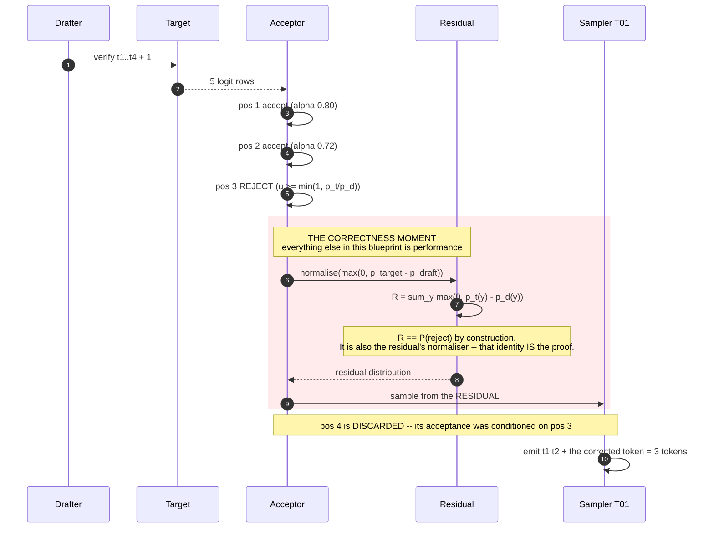
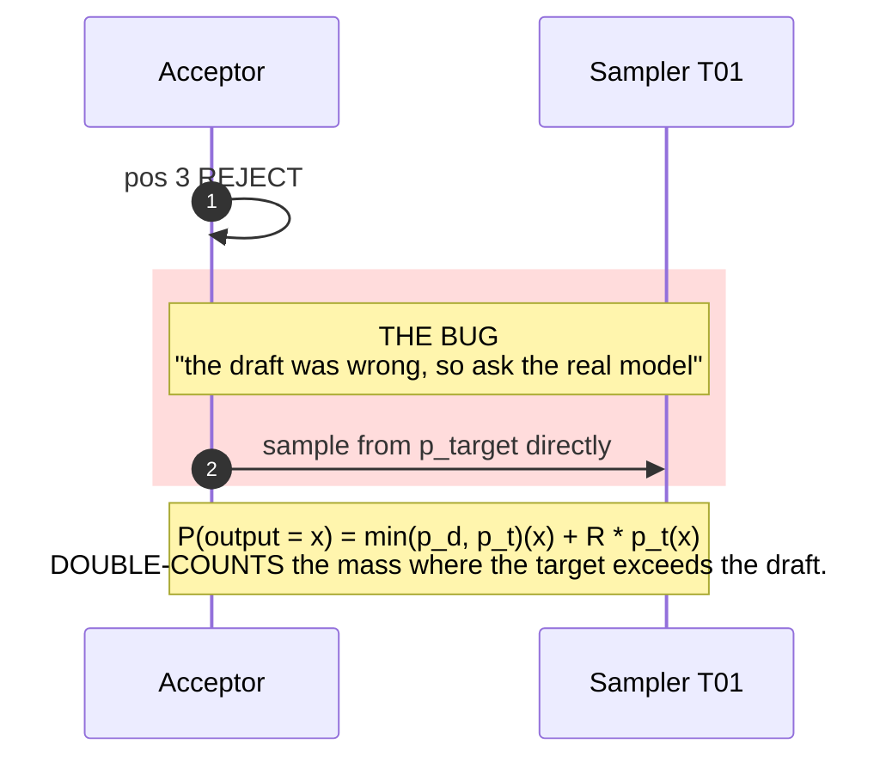
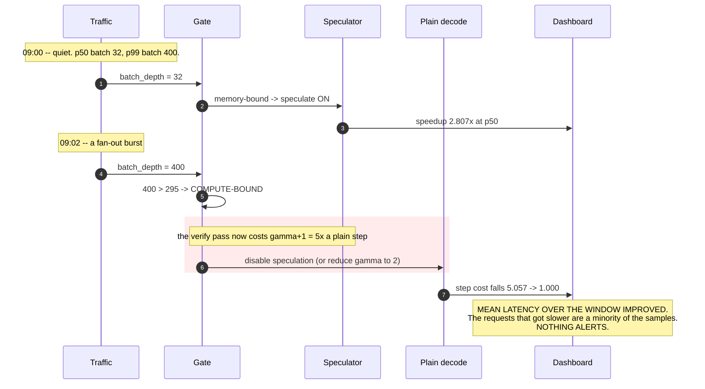
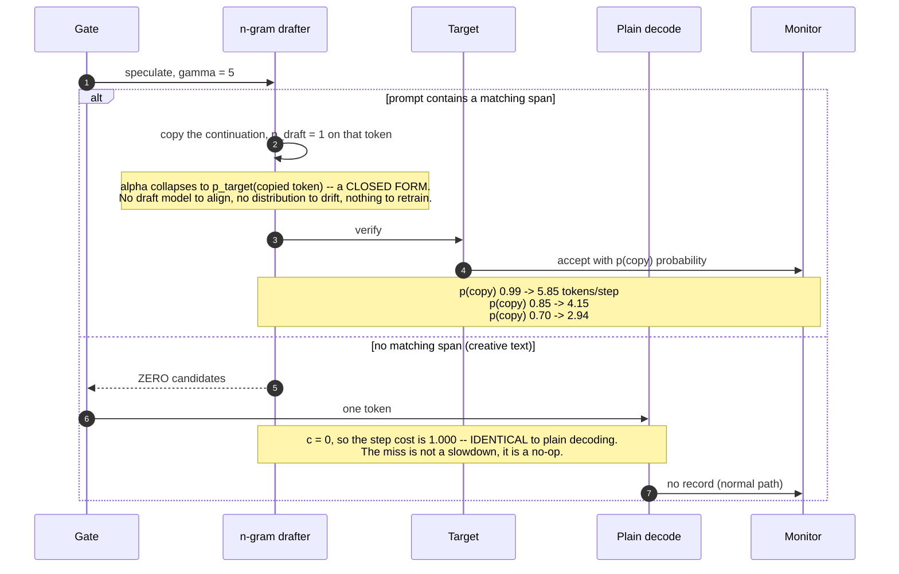
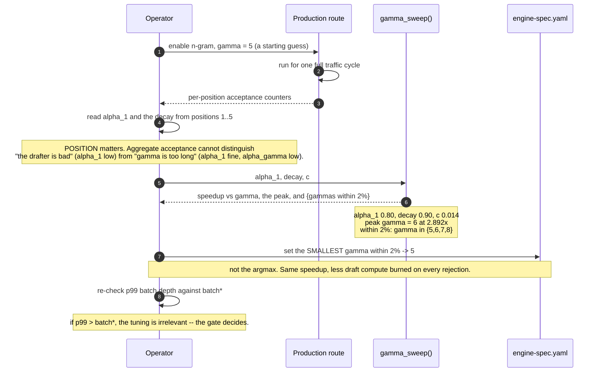

# T09 — Speculative decoding: sequence flows

> `T09` · **Transcript coverage:** partial · [HLD](../HLD.md) · [LLD](../LLD.md) · [Production](../production/README.md) · [Runnable core](../run.py)

Six flows, each one a place where the design makes a decision that a diagram makes visible. The
first two are the mechanism, the third is the failure the whole blueprint exists to prevent, the
fourth is why n-gram is the safe default, the last two are the operational loops around them.

All figures are from [`run.py`](../run.py) at the parameters stated in each flow. Nothing here is a
measured benchmark.

---

## 1. One speculative step, all accepted

**Parameters:** γ = 4, α₁ = 0.80, decay 0.90, c = 0.014 (1B draft vs 70B), batch ≤ `batch*` so the
verify pass is memory-bound. Expected output: **2.807 tokens/step**.

```mermaid
sequenceDiagram
    autonumber
    participant Sch as Scheduler T08
    participant Gate as Gate
    participant Dr as Drafter
    participant Tgt as Target
    participant Acc as Acceptor
    participant Smp as Sampler T01

    Sch->>Gate: batch_depth = 8
    Gate->>Gate: 8 <= batch* (295) -> memory-bound
    Gate->>Dr: speculate, gamma = 4

    Note over Dr: ONE proposal, no forward pass needed yet
    Dr->>Dr: tokens t1 t2 t3 t4, p_draft each

    Dr->>Tgt: verify tokens t1..t4 + 1 free position
    Note over Tgt: ONE forward pass over 5 positions.<br/>Memory-bound: this costs the same as a 1-token decode.
    Tgt-->>Acc: 5 logit rows

    loop i = 1..4
        Acc->>Acc: u ~ U(0,1); accept if u < min(1, p_t(ti)/p_d(ti))
        Note over Acc: pos 1: alpha 0.80 -> accept<br/>pos 2: alpha 0.72 -> accept<br/>pos 3: alpha 0.65 -> accept<br/>pos 4: alpha 0.58 -> accept
    end

    Acc->>Smp: 4 tokens, no correction
    Smp->>Sch: emit t1 t2 t3 t4
    Note over Acc,Smp: tokens/step = 5? No -- see below.
```

**Why 4 accepted tokens is 2.807 and not 5.** `tokens_per_step = 1 + Σ Π α_j` is an **expectation
over many steps**, not this step's outcome. The fifth position exists only as the fallback when
every draft token is rejected. **The ceiling is γ+1 = 5 tokens; the expectation at this α is 2.807.**
Confusing the two is how a capacity plan ends up 1.8× optimistic.

**The step is not free even when everything is accepted.** The denominator is `1 + γc = 1.057`, so
the target pass plus the draft's own pass together cost 5.7% more than a plain decode. That is why
`c` matters as much as `α`.

---

## 2. Rejection at position 3 — the residual branch

**This is the flow that decides whether the engine is the model you deployed.** Measured, 200,000
steps: correct implementation TV = **0.00096** from `p_target`; the "obvious" variant TV =
**0.0796** — **83× worse**.



**The wrong branch, drawn explicitly.** Replace `Residual` with `p_target` and the flow looks
identical — same latency, same token count, fluent output:



**Measured drift, per token (experiment 1):** token 0 goes 0.3000 → **0.2389**, token 1 goes
0.2500 → **0.2823**. The bias is **directional** — extra mass on the tokens the target favours,
which is exactly the region the draft declined to propose.

**The operational conclusion.** The output is fluent and on-topic, so no quality eval reliably
catches it. The only detector is a **distribution test against the target model**, and the only
canary in production is `spec_residual_resample_total` (§5 of `production/metrics.promql`) being
non-zero whenever rejections are happening.

---

## 3. The gate closing under load — the invisible regression

**The failure this blueprint exists to prevent.** Parameters: 70B/H100-class, `batch* ≈ 295`,
γ = 4, c = 0.014.



**The numbers, at both operating points (experiment 7).**

| deployment | p50 | p99 | speedup @p50 | @p99 | verdict |
|---|---|---|---|---|---|
| interactive chat, 1 replica | 8 | 48 | 2.81× | 2.81× | **SAFE** |
| latency-SLA API, bursty | 32 | 400 | 2.81× | **0.59×** | **REGRESSES** |
| batch/offline throughput | 256 | 1024 | 2.81× | 0.59× | REGRESSES |
| agentic, wide fan-out | 400 | 900 | **0.59×** | 0.59× | REGRESSES |

**Row 2 is the trap.** Comfortable at p50, a **loss** at p99, and the mean improves. A deployment
without the gate in `production/gate-policy.yaml` cannot detect this, because the only metrics that
discriminate are a **batch-depth histogram against `batch*`** and **per-position acceptance**.

**The gate has a second action.** Disabling is not the only fallback: a shorter draft has a smaller
denominator (`1 + 2·0.014 = 1.028` against `1.114` at γ = 8) and so clears 1.0× deeper into the
compute-bound region. `on_exceed: reduce_gamma` keeps some benefit under load; `disable` is the
conservative choice.

---

## 4. The n-gram miss — why a free drafter is a different object

**c = 0. A wrong guess costs exactly nothing.** This flow is the argument for shipping n-gram by
default on any route whose output quotes its input.



**Compare a draft model's miss.** Every other drafter pays `γ·c` **whether or not the tokens are
accepted** — at γ = 8 with a 1B draft that is 1.114, so a fully-rejected step costs 11.4% more than
plain decoding for zero benefit. n-gram's downside is bounded at **zero**, which is a different risk
class from "cheap".

**The when-to-use decision is decidable in advance, from the workload.** Ask one question: *does the
output quote the input?* Yes → high p(copy) → high α → use it. No → it is inert, not harmful, which
is why shipping it by default costs almost nothing and occasionally pays ~5.85×.

**One modelling note visible in the diagram.** The n-gram acceptance is treated as **constant**
across positions, not decaying. A learned draft conditions each guess on its own previous guesses,
so errors compound; a copy follows a matched span, and a wrong copy is simply wrong. Applying a
draft model's decay curve here understates the n-gram result.

---

## 5. The tuning loop — γ from measurement, not from a blog post



**Two traps this loop is designed around.**

1. **Reading the argmax instead of the flat region.** The curve near the peak is nearly flat
   (γ ∈ {5,6,7,8} within 2%), so the smaller γ is strictly better — same tokens, less wasted compute
   on rejection.
2. **Tuning γ before checking the regime.** If p99 batch depth exceeds `batch*`, no γ fixes it;
   the gate does. Tuning first is work spent on the wrong problem.

**The constant-α trap, quantified.** Treating α as one constant for all positions predicts
**4.329** tokens/step at γ = 8 where the decaying profile gives **3.167** — a **1.37×**
over-prediction. That is exactly why a tuned γ underperforms its forecast and why a capacity plan
built on the simplification over-provisions by a third.

---

## 6. Boot validation — four refusals

**Each of these is a misconfiguration whose only runtime symptom is the ABSENCE of a benefit.** That
is the failure mode that survives for months, so it is caught at boot where it is still cheap.

```mermaid
sequenceDiagram
    autonumber
    participant Boot as Boot
    participant V as Validator
    participant Srv as Server

    Boot->>V: load speculative config + checkpoint

    V->>V: tokenizer(target) == tokenizer(draft)?
    Note over V: MISMATCH -> REFUSE. Not a slowdown: the draft's tokens denote<br/>different strings, so acceptance collapses toward chance.<br/>A correctness failure wearing a performance costume.

    V->>V: gamma <= drafter's trained/supported depth?
    Note over V: EXCEEDED -> REFUSE. The drafter cannot produce those tokens.<br/>A silent clamp would disguise a config error as a shortfall.

    V->>V: speculation enabled on any route -> batch_limit set?
    Note over V: UNSET -> REFUSE. Ungated is not a benign default; it is a p99<br/>regression waiting for the traffic to grow. The mean will look fine.

    V->>V: method == draft_model -> weights present?
    Note over V: MISSING -> REFUSE. A silently disabled speculator reads as<br/>"speculation gave no speedup", and gets attributed to the method.

    V-->>Srv: all clear
    Srv->>Srv: serve

    Note over V,Srv: NOT a boot check: falling acceptance. That ALERTS, never auto-disables.<br/>Auto-disabling converts a diagnosable problem (a drifted draft)<br/>into a feature that silently disappeared.
```

**Why refusal and not a warning.** All four conditions produce a system that runs, serves traffic,
and does not do the thing it was configured to do. A warning in a boot log is read once and never
again; a refusal is read immediately.

---

## Sources

- `refs/vLLM_Inference_Meetup_Bengaluru_2026_transcripts/Scaling_Agentic_AI_Distributed_Inference_with_llm-d.txt` — MTP, "about 2x improvement in throughput"; "prefill is occupying like 98% of the tokens" for agentic workloads.
- `refs/Agentic_AI_Infra_transcripts_2/Banghua_Zhu_-_Building_Frontier_Inference_and_Training_Infra_for_Agent_A_Case_St.txt` — native spec-decoding support "from Eagle, MTP to Deep Flash"; "Spec V2 … native spec decoding speed up".
- `refs/ai-system-design-guide-main/ai-system-design-guide-main/04-inference-optimization/03-speculative-decoding.md` — the draft/verify paradigm; the high-temperature limitation; hardware-aware dynamic draft lengths.
- `refs/ai-system-design-guide-main/ai-system-design-guide-main/04-inference-optimization/01-inference-fundamentals.md` — memory-bound vs compute-bound, the basis of `batch*`.
- `refs/llm-inference-engineering-main/llm-inference-engineering-main/README.md` — the KV → paged attention → engine reading order.
