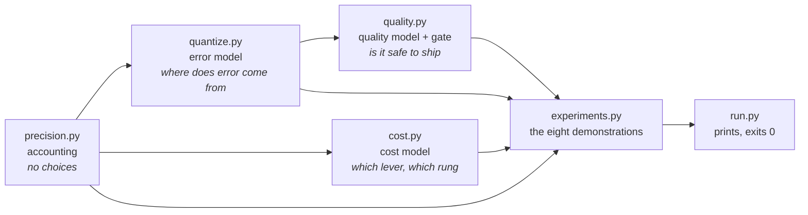
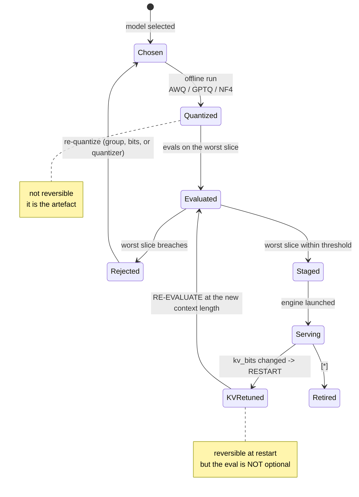
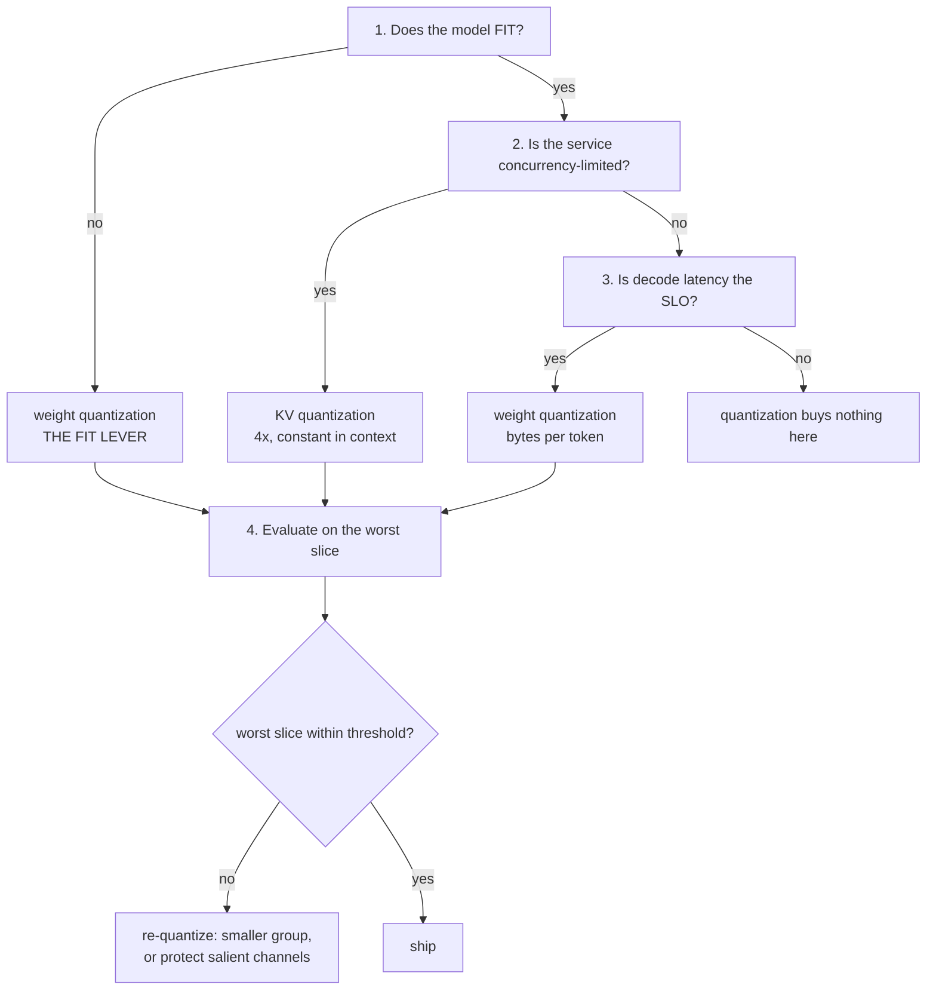

# T10 — Quantization: low-level design

> `T10` · **Transcript coverage:** partial · [HLD](HLD.md) · [Cheat sheet](../../00-cheat-sheets/T10-quantization.md) · [Case study](../../01-case-studies/T10-quantization.md) · [Interview bank](../../02-interview-questions/T10-quantization.md) · [Runnable core](run.py) · [Production](production/README.md) · [Sequences](docs/SEQUENCES.md)

This is the design of the **decision layer** around quantization: what is accounted, what is
measured, what is gated, and in what order. It is not the design of a quantization kernel — those
are hardware-coupled and shipped, and re-implementing one is the wrong project (§1.1).

`[T]` transcript · `[R]` repo · `[D]` derived. Function names below are real and all exist in
[`sim/`](sim/).

---

## 1. Module map

Four separable concerns, in dependency order. The split is by **what decision each one owns**, not
by what code is convenient to group.



| Module | Owns | Deliberately does not own |
|---|---|---|
| `precision.py` | bits → bytes → concurrency. The accounting chain and the two-lever arithmetic. | any notion of error or quality |
| `quantize.py` | where reconstruction error comes from: granularity, outliers, codebooks, salience. | the consequence of that error |
| `quality.py` | turning reconstruction error into a predicted degradation, and gating on it. | the error itself; it is a *consumer* of `quantize.py` |
| `cost.py` | the corpus ladder's four rungs and the per-term decomposition. | quality; cost and quality are independent axes and are never combined into one score |
| `experiments.py` | the eight demonstrations, each printing a table and a finding. | any claim not printed |

### 1.1 What is deliberately not here

| Not built | Why | Where it lives instead |
|---|---|---|
| a quantizer kernel | hardware-coupled; AWQ/GPTQ/NF4/FP8 are shipped `[T]` | vLLM / SGLang / TensorRT-LLM / bitsandbytes |
| a calibration set | needs real activations and a real model | the model team's offline pipeline |
| a per-layer sensitivity sweep | needs a real model to measure against | the eval harness |
| CUDA / FP8 / FP4 code paths | no GPU on this box | documented in [`production/README.md`](production/README.md) |
| a quality *predictor* that works | **§12 of the HLD shows no single formula reconciles the corpus's anchors** | the eval gate, which is the honest substitute |

**The last row is the design's most important omission.** A module that promised
`bits → quality loss` would be the wrong artefact, because the data says that function does not
exist at usable accuracy. What ships instead is a gate.

---

## 2. Data structures

### 2.1 `Precision` — an entry in `PRECISIONS` (`precision.py`)

```python
{"bits": 4, "kind": "int", "native": False, "note": "needs a scale; group-wise"}
```

`kind` ∈ `float | int | codebook`. `native` records hardware support, because an FP8 request on
hardware without native FP8 is a *silent* fallback (HLD §11). `nf4` is `kind: "codebook"` — not a
scaled integer, and the distinction is what §5 of the HLD is about.

### 2.2 `QuantConfig` — the configuration tuple

The whole of a quantization decision, and the thing that must travel with any quality number:

```python
QuantConfig = {
    "weight_bits":   int,          # 16 | 8 | 4 | 2
    "weight_group":  int | None,   # None = per-tensor; 128 = the 4-bit default
    "kv_bits":       int,          # 16 | 8 | 4 -- decided separately, at engine config time
    "kv_group":      int | None,
    "quantizer":     str,          # "awq" | "gptq" | "nf4" | "fp8" | "none"
    "salient_frac":  float,        # AWQ only; 0.01 per the corpus [R]
}
```

**Why it is one struct.** The failure this prevents is a quality number quoted without its config.
"4-bit costs 1.5%" `[R]` is meaningless without the group size, and a KV number without a context
length is meaningless outright (HLD §7). Any result that leaves the simulator carries its
`QuantConfig` or it is not reportable.

### 2.3 `ConcurrencyResult` — the return of `max_concurrency()`

```python
{"usable_gb": 72.00, "weights_gb": 4.12, "kv_gb_per_seq": 0.277,
 "sequences": 245.0, "fits": True, "note": ""}
```

A dict rather than a float, deliberately:

```python
def max_concurrency(hbm_gb, params_b, weight_bits, kv_bits, ctx_len, ...) -> dict:
    """...Returns a dict rather than a float so the caller cannot accidentally compare a
    weight-only figure with a combined one: `weights_gb`, `kv_gb_per_seq`, `usable_gb` and
    `sequences` all travel together."""
```

A bare `245.0` cannot tell you whether it came from a 4-bit weight, a 4-bit KV, or both — and the
HLD's §3 shows those are 1.21×, 4.00× and 4.86× respectively. **The type is a guard against the
topic's most common reporting error.**

### 2.4 `FrontierRow` — a row of `frontier()`

`ConcurrencyResult` **plus** `ctx_len`, `kv_vs_weights`, `kv_overtakes_weights`.

The two added fields exist to make a degenerate metric unusable:

```python
"""A DEGENERATE METRIC TO AVOID: total resident KV is always exactly the free budget, because
concurrency absorbs whatever is left. `kv_per_sequence x sequences == usable - weights` by
construction, so "what fraction of memory is KV" is 100% at every context and says nothing."""
```

`kv_vs_weights` is the per-sequence comparison, which does say something: it crosses 1.0 at ~122k
tokens (HLD §3). The field is named for the quantity rather than left to the caller, because the
obvious quantity — total KV share — is identically 100%.

### 2.5 `LadderRow` / `Residual`

```python
LadderRow = {"rung": str, "total": float, "units": float,          # 100-scale
             "prefill_share": float, "cfg": QuantConfig-ish dict}
Residual  = {"rung": str, "model": float, "corpus": float, "delta": float}
```

`Residual` is a first-class structure, not a debug print. `ladder_residuals()` exists as a public
function so the gap between the model and the corpus's four anchors is always reported:

```python
"""How far each rung is from the corpus's figure. REPORTED, not hidden.
The model is a mechanism, not a fit... Reporting the residuals is the difference
between "we reproduce the corpus" and "we built something that happens to look similar"."""
```

The largest residual is **−6.0 units** on the 4-bit rung (HLD §8). It is printed on every run.

### 2.6 `EvalRow` — what the gate consumes

```python
{"slice": str, "precision": str, "snr_db": float, "degradation_pct": float, "source": "corpus"|"model"}
```

`source` is mandatory. A row whose degradation came from the corpus's anchor table and a row that
came from the fitted model are **not the same kind of number**, and `eval_gate()` reports which
rows it saw.

---

## 3. Interface contracts

### 3.1 `precision.py` — the accounting chain

```python
effective_bits(bits, group_size=None, scale_bits=16, zero_point_bits=0) -> float
weight_bytes(params_b, bits, group_size=None, scale_bits=16) -> float
kv_bytes_per_token(n_layers, n_kv_heads, head_dim, bits, group_size=None, scale_bits=16) -> float
max_concurrency(hbm_gb, params_b, weight_bits, kv_bits, ctx_len, n_layers=32, n_kv_heads=8,
                head_dim=128, util=0.90, weight_group=None, kv_group=None) -> dict
frontier(hbm_gb, params_b, weight_bits, kv_bits, ctx_lengths, **kw) -> list[dict]
```

**Contract:** `group_size=None` means **per-tensor** and returns exactly `float(bits)`. This is the
one default that was wrong once and produced a silently inconsistent table — bf16 reporting 16.12 GB
instead of 16.00 GB, because a group-128 scale was being charged to a precision that has no scales.
A default of `128` on a bf16 tensor is not conservative, it is *nonsense*, and it hid in a column
that looked plausible. **`None` is the per-tensor case and it is the only defensible default.**

**`n_kv_heads` is not `n_heads`.** The signature takes KV heads, because GQA is the first
quantization (HLD §2) and passing head count would overstate KV by the GQA ratio.

### 3.2 `quantize.py` — the error model

```python
# scales and the three granularities
absmax_scale(w) -> float
quantize_per_tensor(w, bits=4)              -> (q, scale)      # one scale for the tensor
quantize_per_channel(w, bits=4)             -> (q, scales)     # one scale per output channel
quantize_groupwise(w, bits=4, group_size=32)-> (q, scales)     # one scale per group

# codebooks
nf4_levels() -> list[float]   # the 16 published NF4 values
int4_levels() -> list[float]  # uniform grid, for the comparison
quantize_nf4(w, group_size=64) -> (q, scales)

# salient-channel protection (AWQ's policy, offline stand-in)
salience(w) -> list[float]                                  # per-channel L1 norm
quantize_with_protected_channels(w, bits=4, group_size=32, salient_frac=0.01) -> (q, meta)
protected_storage_overhead(bits, salient_frac, protected_bits=16) -> float   # 0.03 at 1%, 4-bit

# metrics -- and the two of them disagree, which is the point
mse(a, b) -> float
snr_db(a, b) -> float                 # signal energy / noise energy  <-- BLIND SPOT
worst_channel_error(a, b) -> float    # max per-channel relative error <-- THE TRUTH

synthetic_weights(n_channels=96, n_weights=64, seed=11, outlier_frac=0.04, outlier_scale=12.0)
outlier_severity_sweep(...) -> list[dict]
```

**Contract on the two metrics.** `snr_db` and `worst_channel_error` are both public and both
printed on every run, and the module docstring states why neither can be dropped:

> SNR is signal-energy over noise-energy, and the outlier channels contribute to both. At high
> severity the signal grows faster than the error, so the ratio rises *while* the small weights are
> being destroyed.

Measured: per-tensor SNR goes **8.48 → 16.61 dB** as severity goes 12 → 48 while
`worst_channel_error` goes **1.0000 → 1.0000** (pure error). An implementation that exposed only
`snr_db` would report the tensor getting *better*. **Both are in the public surface because either
alone is misleading in a different direction.**

**`salience()` is an offline stand-in and says so.** Real AWQ salience comes from activation
statistics on a calibration run `[R]`; this is the weight row's L1 norm — correlated, not equal. The
docstring states it, and `production/README.md` shows where the real calibration step goes.

**`protected_storage_overhead` is the other half of AWQ.** Protecting 1% of channels at 16 bits
against 4 bits elsewhere costs `0.01 × (16−4)/4 = 3%` more bytes. AWQ without its storage cost is
half a trade.

### 3.3 `quality.py` — the model and the gate

```python
relative_error(snr_db) -> float              # 10 ** (-snr/20)
fit_degradation(anchors=None, snrs=None) -> dict
    # {"A": 11.9309, "B": 0.659, "fit_on": "corpus anchors", "max_residual_pct": 67.2,
    #  "note": "single power law; residuals reported, see HLD 12"}
predicted_degradation(snr_db, model) -> float
degradation_across_models(model, bits, severities, quantize_fn, weights_fn) -> list[dict]
eval_gate(rows, threshold_pct=2.0) -> dict
```

**Contract on `fit_degradation`.** It returns its own **`max_residual_pct`** in the same dict as the
fitted parameters. A caller that reads `A` and `B` without reading `max_residual_pct` has been told
the fit is bad — **67.2%** on the int4 anchor — and cannot claim ignorance.

```python
"""The fit is bad, and that is the finding rather than a defect to tune away. A power law in SNR
cannot pass through the corpus's own anchors, because the local slopes between them are
inconsistent: fp8->int4 implies an exponent of 0.40, int4->int2 implies 1.07."""
```

**Contract on `eval_gate`.** It gates on the **worst row**, not the mean:

```python
def eval_gate(rows, threshold_pct=2.0) -> dict:
    """...gates on the WORST row."""
```

Demonstrated at 6%: mean 5.29% → PASS, worst 6.88% → REJECT. **Same numbers, opposite decisions**,
and the API makes the correct one the one you get.

### 3.4 `cost.py` — the ladder

```python
_reference_bytes(params_b) -> float          # private, and deliberately so
prefill_cost_per_token(params_b, machine_balance, weight_bits=16, weight_group=None) -> float
cost_per_request(prompt_len, output_len, batch, params_b=8.0, machine_balance=295.0,
                 ctx_len=None, weight_bits=16, kv_bits=16, ..., cache_hit=0.0) -> dict
ladder(prompt_len=4000, output_len=100, batch=None, cache_hit=0.95, params_b=8.0, **kw) -> list
ladder_residuals(rows, corpus=None) -> list[dict]
solve_batch(target_ratio, prompt_len, output_len, **kw) -> float
solve_cache_hit(target_ratio, prompt_len, output_len, batch, **kw) -> float
cost_per_million_tokens(...) -> dict
```

**`_reference_bytes` is private on purpose.** It is the fixed unit the whole ladder is normalised
against, and it must be a constant:

```python
"""This must NOT be recomputed per precision. An earlier version of this module normalised each
configuration by its OWN weight size, which made quantizing the weights look MORE expensive: the
decode term is a ratio whose denominator is `W`, so shrinking `W` inflated the ratio even as it
shrank the bytes. The result was a ladder that went 100 -> 42 -> 71, i.e. "4-bit quantization
costs more than not quantizing". The reference has to be a constant for the rungs to be
comparable at all."""
```

Making it private means a caller cannot reach past the rungs to a quantity that only makes sense
inside them. **A public `reference_bytes(params_b, bits)` would let the same bug back in through the
front door.**

**`prefill_cost_per_token` accepts and ignores its precision arguments — deliberately.**

```python
"""Prefill is compute-bound (T06), so its cost is FLOPs: `2N` per token, INDEPENDENT of the
weight precision... The precision arguments are accepted and IGNORED, deliberately, so that
callers written against the older signature keep working -- but the honest model is that
quantizing weights does not reduce prefill FLOPs."""
```

**A silently-ignored argument is normally a defect. Here it is documented, because the alternative
— letting precision change the prefill term — would fabricate a saving that does not exist.** The
real effect (better achieved FLOPs/second on some hardware) is a hardware property this offline
model does not claim.

**`solve_batch` and `solve_cache_hit` invert the model.** `solve_batch(0.42, ...)` returns the
effective batch depth the corpus's batching rung implies — **~4** — which turns "batching gets you
to 42" into a number an operator can compare against what their service actually runs. Solving
rather than asserting is what makes the rung falsifiable.

---

## 4. State — where a quantization decision goes, and when it can be undone

There is no runtime state machine in this topic; the state is the **artefact lifecycle**, and the
reason it matters is that the two decisions become reversible at different times.



**The edge that is usually skipped is `KVRetuned → Evaluated`.** A KV precision change is a config
flag and therefore feels like a tuning knob, so it gets changed without a re-eval — and HLD §7 shows
its damage is invisible to short-context evals. **The state machine makes the re-evaluation a
transition rather than a best practice.**

### 4.1 The decision order, and why it is usually wrong



**The order is fit → concurrency → latency, and it inverts the common practice of picking a
checkpoint first.** The KV decision is made at engine config time — *after* the checkpoint is
chosen — but it is the larger lever for concurrency (HLD §3). A team that picks a 4-bit checkpoint
and runs bf16 KV has spent its effort on the 1.21× and left the 4× unclaimed.

**Step 3 is a real "no".** If the model fits and the service is not concurrency-limited, weight
quantization buys only latency, and if latency is not the SLO, it buys nothing and costs an eval
cycle. `G` is a legitimate terminal state.

---

## 5. Sequence diagrams

See [`docs/SEQUENCES.md`](docs/SEQUENCES.md) for the six rendered flows: offline quantization with
the gate; a gate rejection and the re-quantization loop; the KV retune with the mandatory
re-evaluation; the per-request accounting path; the ladder's four rungs as one traversal; and the
AWQ salience scan.

---

## 6. Concurrency and determinism

| Concern | Position | Why |
|---|---|---|
| simulator threads | none — single-threaded, pure functions | every result is a function of inputs; no scheduling non-determinism to explain away |
| RNG | `synthetic_weights(seed=11)` — seeded, local `random.Random` | re-runs are byte-identical; a finding that cannot be re-derived is not a finding |
| float determinism | plain Python floats, no reduction order dependence | no parallel sums, so no run-to-run drift |
| **serving-side determinism** | **quantization does not make inference deterministic** — it changes the arithmetic, not the non-determinism | T06's non-determinism (reduction order, batch composition) is unaffected; a quantized model is exactly as reproducible as its bf16 counterpart, i.e. not fully |
| numerical range | FP8's dynamic range vs INT8's scale | FP8 has "the speed of Int8 but with the dynamic range of Float16" `[R]` — the reason it needs no calibration for activations |

**The seeded RNG is a correctness requirement, not a convenience.** Experiment 3's non-monotone SNR
finding is exactly the kind of result a reader will disbelieve, and the only way it is checkable is
if the synthetic tensor is reproducible from a seed. `seed=11`, `outlier_frac=0.04`,
`outlier_scale=12.0` are all default parameters, not magic constants.

---

## 7. Error handling

| Condition | Behaviour | Rationale |
|---|---|---|
| `group_size < 1` | `ValueError` | a group of zero is a division by zero wearing a config value |
| `params_b <= 0` | `ValueError` | catches a units mistake (params in millions vs billions) |
| `n_layers/n_kv_heads/head_dim <= 0` | `ValueError` | a zero KV head count silently produces a free cache |
| `ctx_len <= 0` | `ValueError` | |
| `util` outside `(0, 1]` | `ValueError` | a util of 0 returns infinite concurrency; > 1 exceeds the device |
| `batch < 1` | `ValueError` | batch 0 makes the weight term infinite |
| `cache_hit` outside `[0, 1]` | `ValueError` | a negative hit rate would *add* prefill |
| model does not fit | **returns** `sequences: 0.0, fits: False`, not an exception | "does not fit" is the answer to a capacity question, and HLD §3 uses it as one (70B on 80 GB: 0.0 sequences) |
| `outlier_frac` ≥ 1 | not guarded | all channels are outliers is a legitimate, if pathological, tensor |

**The `fits` distinction is the design choice.** Raising on a non-fitting configuration would make
the blueprint's most useful comparison — bf16 versus int4 for a 70B — impossible to express.
**"Does not fit" is a result, not an error**, and `note` carries the explanation.

**Startup refusals** (the configs that must not load) are in
[`production/README.md`](production/README.md) §4: per-tensor scales on weights, a KV precision
without a matching eval, an FP8 request on non-native hardware, a prefix cache on a changing prefix.

---

## 8. Configuration surface

Three surfaces, owned by three teams, changed on three cadences.

### 8.1 Checkpoint manifest (offline, model team)

```yaml
# production/quantization-manifest.yaml
base_model: meta-llama/Llama-3.1-8B-Instruct
quantizer: awq                 # awq | gptq | nf4 | fp8 | none
weight_bits: 4
weight_group: 128              # None = per-tensor -> REFUSED at boot (see production 4)
salient_frac: 0.01             # AWQ only; 1% per the corpus [R]
calibration:
  dataset: <the model team's set>   # REQUIRED for awq/gptq
  samples: 512
eval_gate:
  threshold_pct: 2.0
  slice: worst                 # MUST be worst -- the mean would pass a 6.88% regression
  context_lengths: [2048, 8192, 32768]   # KV damage is invisible below the deployed ctx
```

### 8.2 Engine launch flags (serving team, restart cadence)

```yaml
# production/engine-quant.yaml
vllm:
  quantization: awq
  kv_cache_dtype: fp8          # THE 4x LEVER -- not the checkpoint
  max_model_len: 32768
  gpu_memory_utilization: 0.90
  calculate_kv_scales: true    # run the per-layer KV calibration pass
```

### 8.3 Which lever, as a decision function

| Question | Answer | Lever |
|---|---|---|
| does the model fit? | no | **weights** |
| is the service concurrency-limited? | yes | **KV** |
| is decode latency the SLO? | yes | **weights** (bytes/token) |
| none of the above | — | **none** — quantization buys nothing and costs an eval |

`kv_cache_dtype` is a *config flag* and `quantizer` is an *artefact*; the table exists because the
smaller lever (weights) is the one on the checkpoint, and the larger one (KV) is the one people
forget to set.

---

## 9. Test strategy

| # | Test | Asserts | Guards against |
|---|---|---|---|
| 1 | `effective_bits(4, 128) == 4.125` | metadata is charged | the "a 4-bit model is 25%" claim |
| 2 | `effective_bits(16, None) == 16.0` | **per-tensor bf16 has no scales** | the bf16-16.12 GB defect |
| 3 | `weight_bytes(8, 4, 128)` ≈ 4.12 GB | the corpus's model-size table `[R]` | a units error |
| 4 | `kv_bytes_per_token` with `n_kv_heads=8` vs `32` is exactly 4× | GQA is the first quantization | passing head count for KV heads |
| 5 | `max_concurrency` returns `fits: False` at 0 sequences for 70B/80GB bf16 | "does not fit" is a result | an exception where a comparison is wanted |
| 6 | `kv_per_seq × sequences == usable − weights` within fp tolerance | **the degenerate metric really is degenerate** | anyone "fixing" it into a percentage |
| 7 | `frontier` reports `kv_overtakes_weights` first True near 122k | the crossover is real and located | an unlocated claim |
| 8 | per-tensor 4-bit `worst_channel_error` > 0.99 on the synthetic tensor | **the channel is destroyed** | reporting SNR alone |
| 9 | per-tensor SNR is **non-monotone** across severity 1→48 | the finding is reproducible | a prose claim with no run behind it |
| 10 | per-channel SNR varies < 0.7 dB across severity 1→48 | "flat across severity" — the reason it is the default | asserting flatness without measuring it |
| 11 | NF4 beats uniform INT4 at equal bits and group | the codebook is worth it | claiming the grid shape does not matter |
| 12 | `protected_storage_overhead(4, 0.01) ≈ 0.03` | AWQ's 1% is 3% of bytes | quoting AWQ's quality win without its cost |
| 13 | the ladder is **monotone decreasing** 100 → 35.9 → 20.0 → 9.0 | **the fixed-reference-unit fix** | the 100 → 42 → **71** regression |
| 14 | `abs(sum(r["delta"])) < 20` on the ladder residuals | the model tracks the corpus to within a few units | silently diverging and calling it a reproduction |
| 15 | `solve_batch(0.42, ...)` returns a **single-digit** batch | the corpus's batching rung needs no large batch | a hidden tuning knob |
| 16 | the caching rung saves >50% at ratio 40 and <5% at ratio 0.2 | **the finding**: caching is workload-shaped | presenting the ladder as universal |
| 17 | `fit_degradation()["max_residual_pct"] > 50` | **the fit is bad and says so** | a smooth-looking formula over inconsistent anchors |
| 18 | fp8→int4 and int4→int2 implied exponents differ by > 2× | **no single exponent reconciles the anchors** | the pretense of a bits→quality function |
| 19 | `eval_gate` at 6%: mean PASS, worst REJECT | the gate is on the worst row | gating on the mean and shipping the regression |
| 20 | `prefill_cost_per_token` is unchanged by `weight_bits` | prefill is compute-bound | fabricating a prefill saving |
| 21 | two runs are byte-identical | seeded RNG | an unreproducible finding |
| 22 | `run.py` exits 0 and prints ≥ 350 lines | the whole thing runs offline, no GPU | a broken demo |

**Tests 8, 9, 13, 16, 17, 18 and 19 are the ones that matter.** Each one pins a *finding* rather
than a behaviour — they are the tests that would fail if someone "cleaned up" the simulator into
something more conventional and less true. **Test 13 in particular exists because that bug was real
and shipped once.**

---

## 10. Build order

1. `precision.py` — the accounting chain. **First, because every other number is denominated in it.**
2. `PRECISIONS` + `QUALITY_ANCHORS` — including `kind` and `native`, which later modules branch on.
3. `quantize.py` scales: per-tensor → per-channel → group-wise. **In that order, worst to best**, so
   the improvement is visible as it is built.
4. `nf4_levels()` + `quantize_nf4` — the codebook, plus `int4_levels()` for the comparison.
5. `snr_db` **and** `worst_channel_error` — together, never one alone (§3.2).
6. `synthetic_weights` with a fixed seed — the fixture everything in `quantize.py` is measured on.
7. `outlier_severity_sweep` — and **read the output before writing any prose**; this is where the
   non-monotone SNR finding appears and it contradicts the expected result.
8. `salience` + `quantize_with_protected_channels` + `protected_storage_overhead` — AWQ's policy and
   its price.
9. `max_concurrency` returning a **dict**. Do not start with a float; the dict is the guard.
10. `frontier` — and compute `kv_vs_weights` immediately, because the total-KV share is degenerate.
11. `quality.py`: `relative_error` → `fit_degradation` → `predicted_degradation` → `eval_gate`.
    **`fit_degradation` returns its residual from step one**, before any caller exists.
12. `cost.py`: `_reference_bytes` **as a constant** → `cost_per_request` → `ladder` →
    `ladder_residuals` → the two solvers.
13. `experiments.py` — eight functions, each printing a table **and** a finding.
14. `run.py` — the summary, written **last**, from output that already exists.

**Two steps in this order are load-bearing.** Step 7 is where the design's main finding is
*discovered*, not illustrated — writing the prose first would have produced the false "error moves
by tens of dB" claim. Step 12's first item is a one-line function whose incorrectness cost a full
debugging cycle; it is first in its group so it cannot be retrofitted.

**The build order is also the debugging order.** Every defect found in this module was found by
running a step and reading its output; the fix was always to make the *code* honest rather than to
adjust the prose. There is no step in this order where a number is chosen before the code that
produces it.

---

## Sources

Corpus (transcripts under `refs/`):

- `refs/LLMOps_Agentic_AIOps_The_Hands-On_Playlist_2026_transcripts/Cut_LLM_Cost_Latency_KV_Cache_Batching_Quantization_vLLM.txt` — the ladder anchors (100/42/26/11) that `CORPUS_LADDER` holds; "always rerun your evals after quantizing"; "AWQ and GPTQ to quantize"; "caching only helps a stable prefix".
- `refs/Agentic_AI_Infra_transcripts_2/Banghua_Zhu_-_Building_Frontier_Inference_and_Training_Infra_for_Agent_A_Case_St.txt` — native 8-bit/4-bit training; FP4 native rollout; QAT with a lower-precision rollout stage (the motivation for the `native` field).
- `refs/vLLM_Inference_Meetup_Bengaluru_2026_transcripts/Distributed_Inference_on_ROCm_with_WideEP_on_vLLM_llm-d.txt` — quantization kernels integrated into the serving stack.

Supporting repos:

- `refs/ai-system-design-guide-main/ai-system-design-guide-main/03-training-and-adaptation/07-quantization-deep-dive.md` — the precision/quality table behind `QUALITY_ANCHORS`; NF4's equal-mass bins; AWQ's "1% salient" + calibration set; FP8's dynamic range vs INT8; "4x higher concurrency" from KV quantization; QAT below 3B.
- `refs/ai-system-design-guide-main/ai-system-design-guide-main/04-inference-optimization/01-inference-fundamentals.md` — the prefill/decode asymmetry that makes `prefill_cost_per_token` precision-independent.
- `refs/ai-system-design-guide-main/ai-system-design-guide-main/04-inference-optimization/09-on-device-and-edge-deployment.md` — the 4-bit on-device standard and the over-quantization (Q2/Q3) pitfall.
- `refs/llm-inference-engineering-main/llm-inference-engineering-main/README.md` — KV cache → engines → hardware ordering, the frame for §8's three config surfaces.

Runnable: [`run.py`](run.py), [`sim/`](sim/) — `precision.py`, `quantize.py`, `quality.py`, `cost.py`, `experiments.py`. Stdlib-only; `python run.py` exits 0 and prints every figure asserted above.
